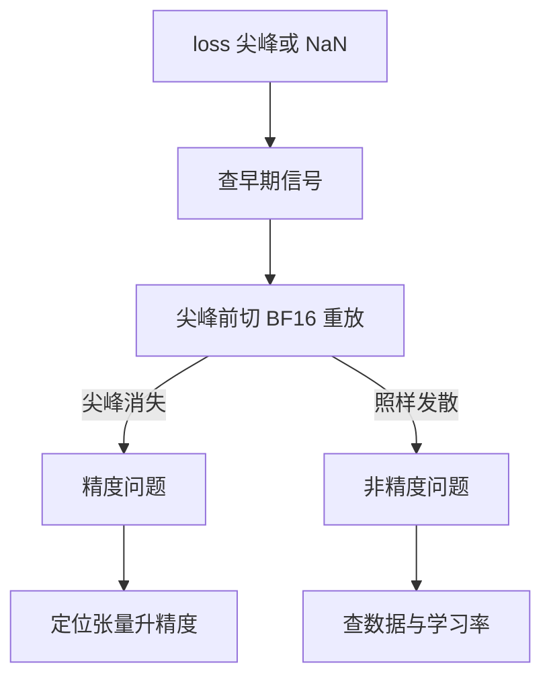

# 低精度训练

一句话:低精度训练是把训练里最费算力的矩阵乘,一步步从 BF16/FP16 搬到 FP8、再到 NVFP4,同时保证模型不崩——每降一档位宽都要多加一道保护,还要认清哪些张量必须留在高精度,并能在训练中及时发现数值出了问题。

## 一、为什么降位宽:省什么,代价在哪

### 省下的三笔账

| 账 | 降位宽怎么省 | 量级(原件自报) |
|---|---|---|
| 矩阵乘吞吐 | 同一块 Tensor Core,位宽减半,每周期能算的乘加大致翻倍 | DeepSeek-V3:三个 GEMM 全走 FP8,理论算力是 BF16 的 2 倍;Nemotron 3:GB300 上 FP4 峰值吞吐是 FP8 的 3 倍 |
| 显存 | 反向要用的激活按低精度缓存 | DeepSeek-V3 把 Linear 的输入激活按 FP8 缓存给 Wgrad 用 |
| 通信 | 跨卡搬的张量变小 | DeepSeek-V3 的 MoE dispatch 先把激活量化成 FP8 再发 |

所以降位宽首先是为了**算力**:大模型训练的时间大头花在 GEMM 上,GEMM 的输入换成更窄的格式,Tensor Core 的吞吐就上去了。省显存和省通信是顺带的收益。

### 代价:两类误差

浮点数的表示方式决定了它会在哪里出错:

$$
x = (-1)^{s}\times 2^{\,e-\text{bias}}\times(1.m)
$$

也就是说,指数位 $e$ 决定**能表示多大、多小的数**(范围),尾数位 $m$ 决定**同一数量级里分得多细**(精度)。位宽一减少,两类误差都会出现:

- **范围不够**:太大的数溢出成 inf/NaN,太小的数下溢成 0。小梯度被冲成零,就是 FP16 需要 loss scaling 的原因
- **精度不够**:两个数相加时,小的那个会被舍掉。只有 $t$ 位尾数时,满足下式的 $b$ 在就近舍入后就消失了

$$
|b| < \tfrac{1}{2}\,\text{ulp}(a) \approx 2^{-(t+1)}\,|a|
$$

这里 ulp 指 $a$ 附近两个相邻可表示数的间隔。BF16 有 7 位尾数,所以 $1 + 0.001$ 算出来还是 $1$,因为 $0.001$ 小于 $2^{-8}\approx 0.0039$。**本篇第三节列出的几乎所有事故,都是这条"小数被大数吞掉"的规律在不同位置发作。**

本篇只讲训练。训练后量化和推理侧的格式选型见 量化 篇、权重与激活量化 篇;KV 缓存见 KVCache量化 篇;优化器算法本身见 优化器 篇;显存细账见 显存管理与OOM 篇;主权重和优化器状态怎么切分见 ZeRO 篇。

## 二、核心机制:每降一档,多一道保护

### BF16/FP16 混合精度:打底的三件套

Mixed Precision Training(Micikevicius 等,2017)定下的做法到今天仍是地基:权重、激活、梯度用 16 位存储和计算,另外加三道保护。

| 保护 | 防什么 | 为什么需要 |
|---|---|---|
| FP32 主权重副本 | 更新量被吞掉 | 单步更新量通常远小于权重本身;直接加到 16 位权重上,会满足上面那条吞没条件 |
| loss scaling | FP16 小梯度下溢 | FP16 最大只有 65504,正规数最小约 $6\times10^{-5}$,再往下只剩精度越来越差的次正规数,低于约 $6\times10^{-8}$ 直接归零;不少激活梯度就落在这一段 |
| FP32 累加 | 长求和的舍入误差累积 | GEMM 沿内维 $K$ 连续做几千次加法,16 位累加器越加越大,后面加进来的小项会被舍掉 |

代价是显存:BF16 权重和梯度各占 2 字节,FP32 主权重 4 字节,Adam 两个矩各 4 字节,加起来每个参数约 16 字节。这笔账怎么切到多卡上见 ZeRO 篇。

**BF16 和 FP16 怎么选。** BF16 的 8 位指数和 FP32 相同,范围够大,所以通常不需要 loss scaling。代价是尾数只有 7 位,比 FP16 的 10 位粗 8 倍。FP16 反过来:同一数量级里分得更细,但范围窄。A100 以后的卡都原生支持 BF16,训练就默认用 BF16。V100 这类只有 FP16 Tensor Core 的卡只能用 FP16,必须配 loss scaling。FP16 并没有被淘汰:第三节会看到,对**有界且需要细分辨率**的量,FP16 反而比 BF16 更合适。

**动态 loss scaling 怎么工作。**

$$
L' = S\cdot L,\qquad g = \frac{\nabla_\theta L'}{S}
$$

意思是:反向传播之前先把 loss 乘上 $S$,让小梯度抬到 FP16 能表示的区间里;更新之前再除回去。梯度裁剪必须在除回去之后做。$S$ 是动态调整的,以 PyTorch 的 GradScaler 为例,默认从 $2^{16}$ 起步;只要某一步梯度里出现 inf/NaN,就跳过这一步更新,并把 $S$ 减半;连续 2000 步没有溢出,就把 $S$ 翻倍。

**缩放因子本身就是健康指标。** 正常训练时 $S$ 会在一个高位附近来回小幅波动。如果它一路减半、掉到 1 以下,说明在不放大的情况下梯度就已经溢出,问题出在更上游(激活或 logit 在失控增长),不是 loss scaling 调得不对。OPT-175B 用 FP16 权重加 FP32 的 Adam 状态训练,观察到 loss 发散、缩放因子掉到 0、最后一层激活的 L2 范数暴涨这三件事同时发生;于是他们挑重启点的判据是:缩放因子仍"健康"(≥ 1.0),并且之后激活范数在下降而不是无界增长。重置缩放因子只救回了一部分发散。

### FP8:范围只剩几个数量级,每一块数据都要配一把尺子

FP8 有两种编码:E4M3 最大 448,E5M2 最大 57344(FP8 格式论文;E4M3 不表示无穷大,用这部分编码换来更大的范围)。这点范围放不下一整个张量的真实分布,所以量化之前先除以一个缩放因子:

$$
x_q=\text{round}\!\left(\frac{x}{s}\right),\qquad s=\frac{\text{amax}}{\text{FP8}_{\max}}
$$

意思是:把这组数里绝对值最大的那个对齐到 FP8 的最大值,其他数按同样的比例缩放。关键在于**这组数取多大**。

| 做法 | 尺子从哪来 | 问题 |
|---|---|---|
| per-tensor 延迟缩放(Transformer Engine、FP8-LM) | 整个张量共用一把尺子,amax 取前几步的历史值 | 一个离群值就把尺子拉长,其余数全部挤到很少几档里;这一步如果出现比历史更大的值,就会饱和 |
| 细粒度在线缩放(DeepSeek-V3) | 激活每 1×128 一块(每个 token 每 128 个通道),权重每 128×128 一块,当步现算 amax | kernel 必须能在内维上逐块乘 scale,标准 FP8 GEMM 不直接支持 |

DeepSeek-V3 在这个框架上又加了两道保护:

- **把累加搬到 CUDA Core**:在 H800 上,FP8 GEMM 的 Tensor Core 累加只保留约 14 位。以 $K=4096$ 的随机矩阵为例,最大相对误差接近 2%。做法是每累加 $N_C=128$ 个元素(相当于 4 条 WGMMA 指令),就把部分和拷到 CUDA Core 的 FP32 寄存器里做全精度累加,每块的 scale 也在这时顺便乘上。这会降低单个 warpgroup 的指令发射率,但两个 warpgroup 可以交替执行,一个在做提升,另一个在做 MMA,Tensor Core 仍然能保持忙碌。Tensor Core 和 CUDA Core 为什么能这样重叠,见 GPU架构与执行模型 篇
- **全部张量都用 E4M3**:过去的通行做法是前向用 E4M3、反向梯度用 E5M2。块足够小之后,每块相当于共享了一套指数,范围不再是瓶颈,于是 Dgrad 和 Wgrad 也改用尾数更多的 E4M3

**为什么激活用 1×128,而不像权重那样用 128×128。** DeepSeek-V3 做过对照实验:把 Dgrad 相关的张量都改成 128×128 的块量化后,一个约 16B 的 MoE 模型训到约 300B token 时发散了。他们的解释是激活梯度在不同 token 之间极不均衡,离群值是跟着 token 走的,一个大方块会把离群 token 和正常 token 装进同一把尺子里。

**哪些东西留在高精度。** 嵌入层、输出头、MoE 门控、归一化和注意力算子保持 BF16 或 FP32;主权重和用于梯度累积的梯度保持 FP32;AdamW 的两个矩降成 BF16,没有观察到退化。FP8 dispatch 的缩放因子取 2 的整数次幂,而把结果发回来的 combine 保留 BF16。在约 1T token、两个规模的对照训练中,FP8 模型相对 BF16 基线的 loss 相对误差始终低于 0.25%。

### NVFP4:4 位下每一道保护都要加码

NVFP4 的每个元素是 E2M1(能表示的最大值只有 6),每 16 个元素共享一个 E4M3 格式的块缩放因子,整个张量另外还有一个 FP32 全局缩放因子,平均每个元素约 4.5 位。只有 8 个非负取值,FP8 那套保护已经不够用了。Nemotron 3 系列的配方又加了四道保护:

| 保护 | 做法 | 防什么 |
|---|---|---|
| 权重二维块量化 | 权重按 16×16 的方块共享缩放因子 | 前向用 $W$、反向用 $W^\top$。如果按一维块量化,转置后分块方向变了,同一份权重会得到两套不同的量化值,反向传播求导的就不是前向算的那个函数了。方块转置后分块不变,前后两套一致 |
| 随机 Hadamard 变换(RHT) | 只对 Wgrad 的输入做 16×16 的随机正交旋转 | 旋转后离群值的能量被摊到整块上,一块里的最大值不再远远高出其他值 |
| 随机舍入 | 只对梯度用 | 就近舍入是有偏的,偏差在梯度上会越积越大 |
| 选择性保留高精度 | 网络最后约 15% 的层、Mamba 输出投影、潜空间投影、QKV 与注意力投影、MTP 层、嵌入层不走 NVFP4 | 越靠近输出的层越需要范围和尾数;少数敏感层用 4 位就会丢信息 |

$$
\Pr[\text{SR}(x)=\lceil x\rceil]=\frac{x-\lfloor x\rfloor}{\lceil x\rceil-\lfloor x\rfloor}\quad\Rightarrow\quad \mathbb{E}[\text{SR}(x)]=x
$$

意思是:离哪个格点近,就以更大的概率舍到哪个格点。单次看误差更大,但**期望值是无偏的**,在累加、递归这类误差会叠起来的地方,就近舍入每次都朝同一方向偏,随机舍入的误差却会互相抵消。NVFP4 预训练论文也给了反面证据:把随机舍入用在前向的激活和权重上,反而会放大量化误差、导致发散。所以它只用在梯度上。RHT 也同理,只在 Wgrad 上有效;论文在较小规模上没有看到 Fprop、Dgrad 从中受益。

**效果。** Nemotron 3 Nano(激活 3B)的 NVFP4 训练 loss 相对 BF16 差距低于 1%,激活 8B 的更大 MoE 模型低于 0.6%,模型越大差距越小。Nemotron 3 Ultra(550B,激活 55B)在 5T、10T、16T 三个检查点各开一条旁路,把所有张量切回 BF16 续训 74B token,NVFP4 主线相对这三条旁路的 loss 差距平均低于 0.4%。NVFP4 预训练论文用 12B 模型训了 10T token,结果与 FP8 基线相当,而且在学习率衰减开始前切回高精度可以把剩下的 loss 差距补回来。

## 三、细节与常见坑:哪些张量必须留在高精度

### 三个判据

一个张量能不能降精度,按这三问来判。任何一问的答案是"是",就先留在高精度:

1. **它是不是一个很小的量,要加到一个大得多的量上?** 这是吞没问题:权重更新、小系数辅助损失的梯度、长求和的累加器都属于这一类
2. **它的分布有没有长尾或离群值,会让大批正常值被冲成零?** 这是范围问题:要么把块切小,要么换格式
3. **误差会不会沿链条或时间累积?** 反向传播是一条链,递归状态每步读写一次,迭代算法要跑好几轮,舍入偏差都会越滚越大

还有一条经济账:**本来就便宜的算子留在高精度几乎不花钱**。DeepSeek-V3 的原话是,一些低成本算子用高精度对总训练成本的影响可以忽略;Nemotron 3 把潜空间投影留在 BF16,理由同样是对单步耗时影响很小。

### 六个真实案例

| 位置 | 出了什么事 | 修法 | 命中哪个判据 |
|---|---|---|---|
| 小系数辅助损失(Nemotron 3 Ultra) | 为了让数据并行的梯度归约走 BF16,把输出层的本地梯度累加从 FP32 降到了 BF16。两个 MTP 头的损失系数合计 0.1(各 0.05),它们对共享输出层的 wgrad 贡献在只有 7 位尾数的 BF16 下基本被吞掉,约 8T token 时发散 | 回滚到发散前的检查点,恢复全 FP32 的梯度归约 | 1 |
| 张量并行 all-reduce(Laguna M.1) | LM head 输入梯度的 all-reduce 默认沿用 BF16。模型没有 z-loss,logit 持续正向漂移,激活越来越大之后,这次 all-reduce 成了主要的数值误差源 | 这一次 all-reduce 强制用 FP32,层仍然保持张量并行 | 1 · 3 |
| 优化器迭代(Step 3.5 Flash) | Muon 的 Polar Express 正交化迭代在 bf16 下偶尔因加法误差累积产生极端中间值,引起不可恢复的 loss 尖峰 | 只把这段迭代的状态和中间量改成 float16,其余保持混合精度,之后尖峰不再出现 | 3 |
| 注意力输出(Kimi K3) | flash attention 在低精度下存在有偏舍入 | 训练时注意力输出保持 FP32。代价是片上输出 tile 翻倍,kernel 要重新排布共享内存 | 3 |
| Mamba 输出投影(Nemotron 3) | 量化成 NVFP4 后下溢归零的比例很高,Nano 上最高达 40% | 这些层改用 MXFP8 | 2 |
| Mamba 状态缓存(Nemotron 3 Ultra 报告,在 Super 上模拟量化) | FP32 状态存成 FP16 就近舍入,每一步都朝同一方向偏,平均准确率下降 1.07%,输出长度增加 9.98% | 改用 FP16 随机舍入,两项分别变成 -0.26% 和 0.36% | 3 |

最后一行是推理侧的缓存,放在这里是因为它和 NVFP4 训练用随机舍入是同一个道理:**递归累积的量,就近舍入的偏差会被一步步放大**。Step 3.5 Flash 选 float16 而不是 FP32,原件没有解释原因;一个合理的推断是 Polar Express 先对矩阵做了归一化,数值有界,这时 FP16 多出来的 3 位尾数比 BF16 的宽范围更有用。

### 数值事故:怎么发现,怎么处置

低精度的问题往往不会直接报 NaN,而是先表现为缓慢漂移或偶发尖峰。下面这些信号比主 loss 更早出现:

| 信号 | 说明什么 | 出处 |
|---|---|---|
| loss 缩放因子持续下探到 1 以下 | 不放大就已经溢出,上游在失控 | OPT |
| 下溢归零比例 | 某一层的 4 位量化在丢信息 | Nemotron 3 |
| 小系数辅助 loss 比主 loss 先出现尖峰 | 小梯度被吞掉的路径最先出问题 | Nemotron 3 Ultra 中 MTP-2 先于主 loss 尖峰 |
| wgrad 的 L2 范数与交叉熵同时上升 | 发散已经开始 | Nemotron 3 Ultra |
| 最后一层激活范数、logit 持续增长 | 大数越来越大,吞没条件越来越容易满足 | OPT、Laguna M.1 |
| 尖峰不可复现,从附近检查点续训就消失 | 是数值病理,不是数据坏了 | Step 3.5 Flash |
| 数据并行各副本的权重哈希不一致 | 硬件静默错误或实现 bug,不是精度配方的问题 | Laguna M.1 抓到一台机器的全局梯度范数冲到约 $10^6$ |

**关键的对照实验是"切回 BF16 再跑一遍"。** Nemotron 3 Ultra 在第二次发散(约 16T token)时,从 16T 检查点把所有张量切回 BF16 续训,照样发散,所以这次发散不能归咎于 NVFP4。最后是靠发散前提前开始学习率退火才压住,总训练量也从原计划缩短到 20T token。反过来,第一次发散把精度从 FP32 恢复回来就稳住了,那就是精度问题。loss 异常的通用排查流程(留证据、重放、回滚)见 预训练流程 篇,本篇只补精度这一条线。

## 四、对比与选型

| 格式 | 符号/指数/尾数 | 最大有限值 | 需要的缩放 | 首次原生支持 | 训练里典型用在哪 |
|---|---|---|---|---|---|
| FP32 | 1/8/23 | 约 $3.4\times10^{38}$ | 不需要 | 所有 GPU(CUDA Core) | 主权重、优化器状态、累加、敏感的归约 |
| FP16 | 1/5/10 | 65504 | 全局动态 loss scaling | V100(Tensor Core) | 没有 BF16 的老卡;有界且需要细分辨率的量 |
| BF16 | 1/8/7 | 约 $3.4\times10^{38}$ | 不需要 | A100 | 默认训练格式;低精度配方里给敏感层兜底 |
| FP8 E4M3 | 1/4/3 | 448 | per-tensor,或 1×128 / 128×128 块 | H100 / H800 | 前向 GEMM;在 DeepSeek-V3 里用于全部 GEMM 输入 |
| FP8 E5M2 | 1/5/2 | 57344 | 同上 | H100 / H800 | 混合方案里的反向梯度 |
| MXFP8 | 元素为 FP8,每 32 个共享一个 E8M0 | 由元素格式决定 | 硬件内建的 32 元素块 | Blackwell | NVFP4 配方中的次敏感层(如 Mamba 输出投影) |
| NVFP4 | 元素 E2M1,每 16 个共享一个 E4M3 块尺度,另有 FP32 全局尺度 | 元素最大 6 | 两级缩放 + 权重 16×16 方块 | Blackwell | 预训练主体的 fprop / dgrad / wgrad |

**怎么选。** 第一步看硬件:格式没有原生 Tensor Core 支持,就只能模拟,省不下算力。第二步先跑通 BF16 基线,再降位宽,每降一档都要配上对应的保护,不能单独换个格式了事:FP8 要配细粒度缩放和高精度累加,NVFP4 还要再配方块量化、RHT、随机舍入和敏感层白名单。第三步用 BF16 旁路检查点持续监控 loss 差距。代价主要在工程上:需要 kernel 支持逐块乘 scale、额外存一份缩放因子,每层还要单独判断敏感度。

### 训推共用一份低精度权重

训练用的格式和部署用的格式对齐之后,就可以省掉"训完再量化"的那道误差:

- **Kimi K3**:从 SFT 开始,整个后训练(包括 SFT 和 RL)都做量化感知训练(QAT)。MoE 专家权重用 MXFP4,激活用 MXFP8,非专家部分保持高精度。RL 阶段的 rollout 和训练使用同一套量化方案,消除了训推不一致
- **Nemotron 3 Ultra**:只发布一份 NVFP4 权重。Blackwell 上原生跑 FP4,Hopper 没有 FP4 Tensor Core,就跑成 W4A16(NVFP4 权重 + BF16 激活)。一台 8×H100 有 640 GiB 显存,FP8 权重约 540 GiB,每卡只剩约 10 GiB;NVFP4 权重约 330 GiB,每卡剩约 40 GiB。FP8 版剩下的缓存装不下足够大的 batch,负载始终是带宽受限,FP8 Tensor Core 的算力用不上,所以实测 W4A16 的吞吐–延迟曲线不低于 W8A8。另外,NVFP4 的 E2M1 配 E4M3 块尺度,等效范围超出 FP8 E4M3,不能直接转成 FP8,否则会饱和

注意第二个例子里的这份权重,是后训练完成后再做训练后量化得到的(PDF p. 41),并不是预训练的 NVFP4 权重直接拿来部署。预训练用了 NVFP4,不代表部署就自动是 NVFP4;要做到真正的训推一致,得像 Kimi K3 那样在训练里就用上部署时的量化方案。训练后量化本身怎么做见 量化 篇。

## 五、面试考点串联

| 高频问法 | 本文哪一节 |
| --- | --- |
| FP32、FP16、BF16 和 INT8 有什么区别?大模型训练和推理怎样按场景选精度? | 本篇管训练侧:一(两类误差)、二的三件套与 BF16/FP16 取舍、四的选型表;INT8 与推理侧见 量化 篇 |
| FP16 训练为什么需要 loss scale,怎么实现?BF16 和 FP16 在训练中怎么选,溢出行为有什么不同? | 二(三件套、动态 loss scaling、BF16 与 FP16 的取舍) |
| 硬件不支持 BF16 时,怎样缓解 FP16 的数值问题? | 二(动态 loss scaling、FP32 主权重与累加)· 三(敏感算子留高精度) |
| FP8 的进展和落地难点是什么?相比 16 位又多了哪些取舍? | 二(FP8 的两种编码、细粒度缩放、累加提升)· 四(硬件与 kernel 约束) |
| 训练优化里,混合精度的 loss scaling 和激活重算为什么不能混为一类? | 二(loss scaling 解决的是下溢;激活重算省显存的原理见 显存管理与OOM 篇) |
| 训练和推理有哪些优化可以复用?低精度训练和部署时的量化是不是同一件事? | 一(训练降位宽为了算力)· 四(训推共用一份权重的前提) |
| 混合精度训练中出现 NaN loss 怎么处理? | 三(数值事故的信号与 BF16 对照实验);通用排查流程见 预训练流程 篇 |
| FP8 dispatch 的 scale 怎么定?它本身会不会成为精度问题的源头? | 二(dispatch 用 2 的整数次幂 scale,combine 留 BF16);all-to-all 的排查主线见 MoE并行与DeepEP 篇 |
| FP16/BF16 实现里,为什么归一化的统计量常用更高精度做归约? | 三(判据 1 和 3:长求和的吞没与累积);归一化本身见 归一化 篇 |
| 混合精度为什么一定要留一份 FP32 主权重?只用 BF16 权重会怎样?(补充题) | 一(吞没条件)· 二(三件套) |
| FP8 训练为什么要做细粒度缩放?激活为什么是 1×128,而不像权重那样用 128×128?(补充题) | 二(per-tensor 与细粒度的对比、Dgrad 块量化发散) |
| FP8 GEMM 为什么要把累加提升到 CUDA Core?代价是什么?(补充题) | 二(14 位累加的误差、每 128 个元素提升一次、warpgroup 交替执行) |
| 从 FP8 降到 NVFP4 又多了哪几道保护?随机舍入为什么只用在梯度上?(补充题) | 二(四道保护表与随机舍入的无偏性) |
| 怎么判断哪些层或张量必须留在高精度?(补充题) | 三(三个判据与六个案例) |
| 一个 loss 尖峰,怎么判断是不是精度引起的?(补充题) | 三(早期信号与切回 BF16 的对照实验) |

延伸阅读顺序:GPU架构与执行模型(Tensor Core 与累加)→ 本篇 → 量化(训练后量化与格式谱系)→ 显存管理与OOM(混合精度的显存账)。

## 相关文献

- Mixed Precision Training(FP32 主权重副本与 loss scaling)— [arXiv:1710.03740](https://arxiv.org/abs/1710.03740)
- FP8 Formats for Deep Learning(E4M3 / E5M2 的定义)— [arXiv:2209.05433](https://arxiv.org/abs/2209.05433)
- FP8-LM: Training FP8 Large Language Models(per-tensor 延迟缩放的代表)— [arXiv:2310.18313](https://arxiv.org/abs/2310.18313)
- DeepSeek-V3 Technical Report(1×128 / 128×128 细粒度 FP8、CUDA Core 累加提升,§3.3 与附录 B)— [arXiv:2412.19437](https://arxiv.org/abs/2412.19437)
- Pretraining Large Language Models with NVFP4(二维块量化、RHT、随机舍入、选择性高精度层)— [arXiv:2509.25149](https://arxiv.org/abs/2509.25149)
- NVIDIA Nemotron 3: Efficient and Open Intelligence(NVFP4 配方,Mamba 输出投影改 MXFP8,p. 5–6)— [arXiv:2512.20856](https://arxiv.org/abs/2512.20856)
- Nemotron 3 Ultra: Open, Efficient Mixture-of-Experts Hybrid Mamba-Transformer Model for Agentic Reasoning(NVFP4 配方与 BF16 旁路 p. 3–4,MTP 与 BF16 累加发散 p. 12,Mamba 缓存随机舍入 p. 44–46,单份 NVFP4 权重 p. 46)— [arXiv:2606.15007](https://arxiv.org/abs/2606.15007)
- OPT: Open Pre-trained Transformer Language Models(动态 loss 缩放因子 ≥ 1.0 作为重启判据,p. 3)— [arXiv:2205.01068](https://arxiv.org/abs/2205.01068)
- Laguna M.1/XS.2 Technical Report(LM head 输入梯度 all-reduce 强制 FP32 p. 9,跨副本哈希校验 p. 8–9)— [arXiv:2605.27605](https://arxiv.org/abs/2605.27605)
- Step 3.5 Flash: Open Frontier-Level Intelligence with 11B Active Parameters(Polar Express 迭代改 float16,p. 11–12)— [arXiv:2602.10604](https://arxiv.org/abs/2602.10604)
- Kimi K3: Open Frontier Intelligence(注意力输出保持 FP32 p. 6,MXFP4 QAT 与训推同一量化方案 p. 14)— [arXiv:2607.24653](https://arxiv.org/abs/2607.24653)
- Why Low-Precision Transformer Training Fails: An Analysis on Flash Attention(flash attention 的有偏舍入)— [arXiv:2510.04212](https://arxiv.org/abs/2510.04212)
- PyTorch GradScaler(动态 loss scaling 的默认参数)— https://github.com/pytorch/pytorch/blob/main/torch/amp/grad_scaler.py
