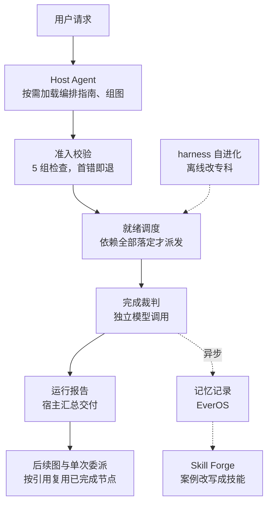
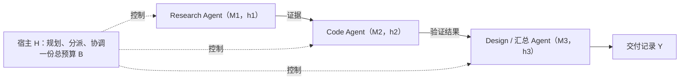
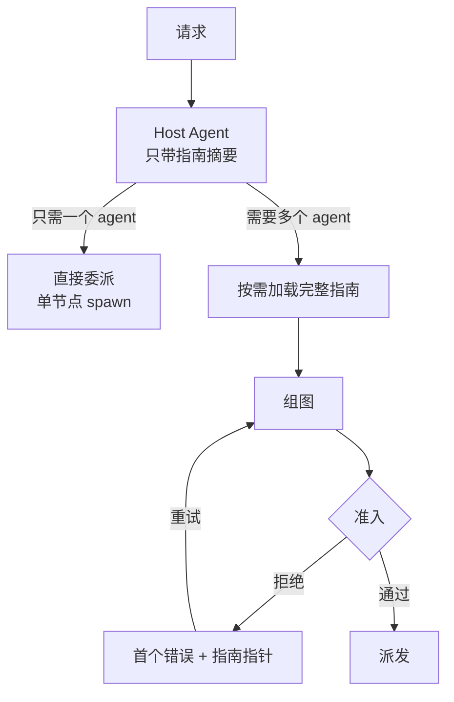
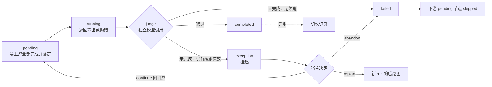
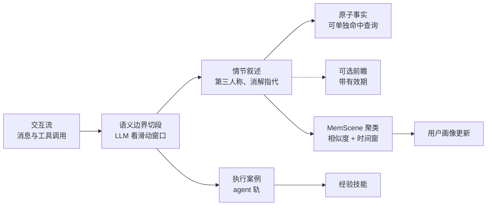
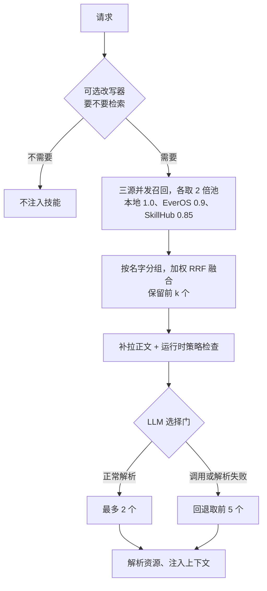

# Raven：让宿主 Agent 去拼「模型 + harness」积木

<!-- release-date: 2026-09-27 -->

**本文依据**：`Raven: The Harness of Harnesses for Composable Agentic Intelligence`，EverMind AI，arXiv:2609.33439v1 [cs.AI]，2026-09-27 提交，共 82 页。页码均指 PDF 自身页码（与论文印刷页码一致）。封面给出项目仓库 https://github.com/EverMind-AI/Raven（PDF p. 1）；作者名单在附录 D，项目负责人 Chuanrui Hu，通讯作者 Yafeng Deng（PDF p. 82）。文中会区分三件事：**论文明确写了什么**、**我们怎么解释它**、**哪些是我们的推算或外部补充**。

## 读前先把几个词说成人话

这篇论文的难点不在算法，而在它同时讲了五层东西：一套概率论证、一个编排运行时、一套 harness 自进化流程、一个记忆后端、一个技能库。先把反复出现的词说清楚：

- **Harness（外壳、执行框架）**：包在模型外面、决定模型「怎么干活」的一切——工具接口、上下文与记忆管理、技能、控制规则、失败恢复（PDF p. 4、p. 6）。同一个模型换一套 harness，能力可以差很多。
- **模型–harness 对（model–harness pair）**：论文把「一个模型 + 一套 harness」看成一个可调用的执行单元，记作 $a_i = \mathrm{Agent}(M_i, h_i)$（PDF p. 6）。Claude Code、Codex、Hermes Agent、OpenClaw 这类现成 agent 都算一个单元。
- **Host Agent（宿主 Agent）**：总调度。它拆任务、挑人、把依赖画成图、处理异常、最后汇总（PDF p. 4）。
- **DAG（有向无环图）**：任务图。节点是一次 agent 调用，边是「下游要用上游的产物」（PDF p. 4）。
- **Artifact（产物）**：节点交出来的文件或输出，下游通过路径或内容引用它（PDF p. 13）。
- **Specialist（专科 agent）**：Raven 自带的四个专科：Raven-Research（调研）、Raven-Code（写代码）、Raven-Design（视觉设计）、Raven-Oncall（长时任务值守）（PDF p. 4）。
- **EverOS**：同一团队的记忆后端，分用户轨和 agent 轨（PDF p. 29）。
- **Skill（技能）**：一份 `SKILL.md`，写着「这类任务怎么做」的流程与附带资源（PDF p. 34）。**Skill Forge** 是 Raven 里检索、挑选、改写技能的那一层。

Raven 的副标题叫「The Harness of Harnesses」：它自己也是一套 harness，但它管的对象是别的 harness。

## 一句话先说清

单一 harness 越做越复杂、越做越绑定领域；论文认为问题已经不是「怎么给一个领域做更强的 harness」，而是「怎么自动造出专科 harness、用经验改进它们、再跨领域把它们编排起来」（PDF p. 1）。

Raven 的答案分四块（PDF p. 4–5）：

1. **编排**：Host Agent 把请求拆成 DAG，运行时在派活前做准入校验，按依赖就绪调度，用独立模型调用判节点是否真完成，所有交接都走落盘产物。
2. **harness 自进化**：把 harness 拆成四个可改的策略接口，诊断失败、提补丁、过三道筛子、存进「基因库」（沿用前作 HarnessBank）。
3. **记忆**：EverOS 存用户画像、情节、执行案例；宿主还能给每个 agent 写「评语」。
4. **技能**：Skill Forge 从本地、EverOS、SkillHub 三个源检索技能，并把执行案例改写成新技能（目录与检索栈沿用前作 SkillCorpus）。

再加一套理论：在**同一份总预算**下，给出组合系统能可靠解决「任何单个 agent 都不能可靠解决的任务」的充分条件（PDF p. 5）。

上图是论文 Figure 2（PDF p. 5）。左半是生态：注册表（agent 的身份、能力、后端）、Host Agent（拆解 / 选人 / 组图 / 汇总）、图运行时（准入 / 就绪派发 / 结果检查 / 异常报告）、执行适配器（原生循环、CLI、ACP、模型 API）、产物账本（prompt、输出、transcript、按引用复用）。右半的 FPS 例子是示意，不是实验。

实测结论里最硬的一条：在作者自建的编排基准 MAOB 上，同底座比较，Raven 的整图精确匹配率比最强基线高 10.4 和 10.5 个百分点（PDF p. 5、p. 45）。其余专科、自进化、技能实验各自报告了领先，但口径差异很大，后文逐个讲。

### 一条阅读路线

1. **p. 4–5**：动机与 Figure 2，先看清「单元」和「宿主」是什么。
2. **p. 9–12**：定理 1、命题 1、推论 1 与奇偶校验构造。只需看懂「误差相加」「规划失败与执行失败相乘」两件事。
3. **p. 13–18**：编排运行时，Figure 4、Figure 5、Table 1、算法 1。
4. **p. 24–29**：harness 自进化，Figure 8 与配对筛选统计量。
5. **p. 41–45**：MAOB 的构造、指标与结果。
6. **p. 45–56**：其余实验；同时翻 **p. 77–81** 附录 C，那里写着各实验与官方协议不一致的地方。

第 5 节记忆、第 6 节技能的公式很细，第一次读可以只看图和附录 B.3 的默认值表（PDF p. 75）。

## 主要矛盾：能力绑在 harness 上，harness 又绑在领域上

论文从一个具体例子开场：开发并运营一款 FPS 游戏，要需求调研、玩法编程、视觉设计、集成测试、持续运维。每一段的工具和「完成」标准都不同，上一段的产物要喂给下一段（PDF p. 4）。

于是 agent 的实际能力同时取决于模型和 harness。这带来两个互相纠缠的难题（PDF p. 4）：

- **手工 harness 难以扩展**。工具和执行条件越多，互相影响的设计选择越多，每换一个模型、一个领域都要重新配置和验证。
- **专科 harness 难以组合**。每个专科 harness 都把自己的工具、上下文、产出格式写死了。想合起来用，就得把子任务配给合适的执行者，并且让交接对得上。论文引用的多 agent 失败分析把「agent 间错位」和「任务验证不足」列为反复出现的问题（PDF p. 4）。

已有的多 agent 框架（AutoGen、MetaGPT）在**同一个框架内**用角色 prompt 区分 agent，角色都共享同一套消息接口和控制循环（PDF p. 13）。Raven 要组合的是**异构 harness**：Claude Code 和 Codex 的工具、上下文处理、失败上报方式各不相同（PDF p. 13）。

矛盾可以压成一句：

> 能力的差异来自 harness 的差异，但 harness 越不同，交接越容易出错、协调越贵。组合要想划算，必须让「差异」变成互补，同时把「交接成本和交接错误」显式记账。

论文的理论部分就是在给这句话一个形式化版本。

## 先看全景：五个阶段，两条信息路径

这张图按 PDF p. 13 的五阶段描述与 Figure 4–6 重画，是流程示意。实线是本次请求的执行路径；虚线是跨任务的经验路径。论文刻意让两条路分开：**产物完成就释放依赖，记忆记录异步进行**，下游不会等记忆抽取（PDF p. 19）。

论文用一个贯穿全文的例子说明（PDF p. 13）：用户要一份「AI for AI 研究进展」综述、在一个实验环境里复现领先算法、再做一个网页报告结果。计划是

$$
\{v_{\mathrm{alg}},\ v_{\mathrm{bench}}\} \longrightarrow v_{\mathrm{code}} \longrightarrow v_{\mathrm{design}}
$$

两个调研节点（一个查算法、一个查基准）可以并行，编码节点要两份调研都到手，设计节点要复现结果。

## 理论：组合在什么条件下能超出单个 agent

### 旧问题：「多 agent 更强」没有可检验的说法

论文先承认两点。第一，资源有限时能力本来就依任务而定；附录 A.3 给了一个查询下界：在 $N_{\mathrm{pos}}$ 个位置里找一个目标，只给 $n_{\mathrm{qry}}$ 次黑盒查询，任何算法的平均成功率不超过 $n_{\mathrm{qry}}/N_{\mathrm{pos}}$，而且**宿主加多个 worker 共享这份查询预算时同样受限**（PDF p. 7、p. 66）。也就是说，多 agent 不能凭空变出信息。第二，单个 agent 有短板，不等于几个 agent 的短板互补（PDF p. 7）。

所以要问的是更窄的问题：给定 agent 池、任务族和总预算，什么时候组合能**可靠地**覆盖更多任务？

### 新设计：把能力定义成「预算内的可靠覆盖」

能力定义在预算之内（PDF p. 7，式 2–3）：

$$
p_S(t;B) = \Pr\bigl[V_t(\omega, Y_S) = 1,\ C_S \le B\bigr],
\qquad
\mathcal{C}_S(B,\delta) = \{t : p_S(t;B) \ge 1-\delta\}
$$

$p_S$ 是系统 $S$ 在任务 $t$ 上「交付正确且总花费不超过 $B$」的概率；$\mathcal{C}_S$ 是成功率至少 $1-\delta$ 的任务集合。组合系统的花费 $C_S$ 包括规划、worker、交接、运行时校验和重试；不终止算失败；agent 或裁判「宣布完成」不等于客观正确 $V_t$（PDF p. 7）。

论文用 Figure 3（PDF p. 6）画出这个设定，结构简单，直接改写成下图：

据 PDF p. 6 Figure 3 重画。实线是产物交接，虚线是宿主控制；图注特别说明三个模型标签不必是三个不同的基座模型（PDF p. 6）。

### 工作机制：三步推导

**第一步，确定性正确性。** 计划是 DAG 加上每个节点、每条边的契约：前置条件 $P_v$、输出与状态后置条件 $Q_v$、交接保真条件 $J_e$（PDF p. 8，式 6–7）。只要计划「兼容」（每步的不变式能推出下一步的前置条件，最后一步能推出任务正确），且每一步都成功、总花费不超预算，就一定交付正确结果（引理 1，PDF p. 9）。这是 Hoare 风格的逐步归纳。论文特别提醒：只传一个文件路径，不足以证明兼容（PDF p. 9）。

**第二步，执行失败的累积。** 让第 $j$ 步「在前面都成功的条件下」失败的概率不超过 $\epsilon_j$，那么在一个有效的规划结果 $(\zeta,\pi)$ 下（定理 1，PDF p. 10，式 17–18）：

$$
q_t(\zeta,\pi) \ \ge\ \Bigl[\,1 - \sum_{v\in V}\epsilon_v - \sum_{e\in E}\epsilon_e\,\Bigr]_+
$$

节点和边的误差**相加**。证明只用了事件分解，**不需要任何独立性假设**（PDF p. 10）。

**第三步，把规划失败也算进来。** 若宿主找到有效计划的概率至少 $1-\eta_H$，执行误差总和被 $\bar\epsilon$ 封顶，则（命题 1，PDF p. 10，式 20）：

$$
p_{S_H}(t;B) \ \ge\ (1-\eta_H)(1-\bar\epsilon)
$$

**推论 1（超出单个 agent）**：如果这个下界 $\ge 1-\delta$，而**每个**单 agent 的成功率都 $< 1-\delta$，任务 $t$ 就属于「新覆盖」（PDF p. 11，式 23–24）。

### 一个能算清楚的例子：两比特奇偶

论文构造了一个最小例子（PDF p. 11–12）：任务是求两个随机比特 $U \oplus W$。$a_1$ 的原生接口只能读 $U$，$a_2$ 只能读 $W$，$a_0$ 两个都读不到。任何单个 agent 都只能猜，成功率不超过 $1/2$。三节点计划（$a_1$ 读 $U$，$a_2$ 读 $W$，交给 $a_0$ 算奇偶）零误差，成功率为 1。因此对任何 $\delta < 1/2$，推论 1 成立。

论文紧接着自己划了边界：**一个同时拥有两个读接口的单 agent 也能解这道题**，这个构造不声称组合优于那种 harness（PDF p. 12）。收益来自「把互补接口的结果通过有成本的消息传过去」。

### 代价与边界

- 节点越多，误差项越多。附录给出一个设计期的统一包络（PDF p. 68，式 91）：节点数不超过 $n_0$、交接数不超过 $r_0$ 时，

  $$
  p_{S_H} \ \ge\ (1-\eta_\star)\bigl[1 - n_0\,\epsilon_V^{\max} - r_0\,\epsilon_E^{\max}\bigr]_+
  $$

  举个我们自己的数：4 个节点、3 条交接、每处误差上界 0.02、规划失败上界 0.05，下界是 $0.95 \times (1 - 0.14) \approx 0.82$。拆得越细，单节点越容易，但交接项越多——论文原话是「额外节点可能降低子任务难度，同时增加交接成本和错误」（PDF p. 11）。
- 结论只是**充分条件**，而且是对「新任务覆盖」的；它不推出「组合系统的能力集严格包含单 agent」，也不推出平均性能更高（PDF p. 12）。
- 实验里的平均成功率**不能**用来证明这些条件成立；论文明确要求配上语义契约检查、端到端结果、成本核算和失败归因（PDF p. 13）。

**我们如何解释。** 这一章的实际价值不在定理本身，而在它给工程留下的三条记账纪律：交接是一等公民（有契约、有成本、有误差）；完成裁判不等于正确；预算必须包含规划和协调。后面运行时的设计几乎都是这三条的落地。但论文没有在任何实验里估计 $\epsilon_j$ 或 $\eta_H$，理论与实验之间没有定量连接。

### 可迁移启发

评估一个多 agent 系统时，先问三件事：单 agent 基线是否在同一总预算下跑过；交接有没有单独的检查与计费；「完成」是谁判的。缺任何一项，「组合更强」都没有被证明。

## 核心设计一：宿主组图，运行时在派活前把关

### 旧问题：自由文本转述，丢细节又难追溯

宿主用自然语言把结果转给下一个 agent，会吃掉上下文，可能漏细节；没有显式产物引用，后面的输出也很难追溯到来源（PDF p. 13）。异构 agent 还在输入接口、能否读本地文件、能否续接会话、失败怎么上报上各不相同（PDF p. 13）。

### 新设计：一张类型化的图，先校验再执行

**异构注册表。** 每个 agent 有注册名和能力描述，并绑定四种后端之一：进程内 Raven 循环、命令行进程、ACP（Agent Client Protocol）连接、OpenAI 兼容 API。注册表还记三种能力标签：能否续接会话（stateful）、能否读本地路径（file-capable）、是否流式汇报进度（PDF p. 13）。默认名册是一个通用 Raven agent 加四个专科；Claude Code、Codex、OpenCode、Hermes Agent、OpenClaw 通过 ACP 预设接入（PDF p. 13）。宿主模型直接凭上下文挑选，**没有单独训练的路由分类器**（PDF p. 14）。

**分阶段加载编排指南。** 每一轮只带一段编排指南的短描述；宿主判断需要多 agent 时才加载完整指南，加载后钉在会话里（PDF p. 14）。不需要组图的请求只付短描述的上下文成本。运行时不因宿主没读指南而拒收，但每个被拒的图都附「首个错误 + 指南指针」（PDF p. 14）。

据 Figure 4（a）（PDF p. 14）改写。

**倒着组图。** 宿主从最终交付物往回推：每个节点必须有可识别的输出和能产出它的执行者；某节点的输入需要另一节点的输出时，加一条依赖（PDF p. 14）。

**节点记录。** 每个节点存七个字段：标识、执行者、prompt 模板、依赖、输入绑定、可选的会话实例句柄、可选的能力覆盖（指定这次调用可用的技能与 MCP 服务器）（PDF p. 15，式 29）。共享同一实例句柄的节点在同一 agent 会话里串行执行（PDF p. 15）。提交时还有两个开关：后台运行默认开（立即把控制权还给宿主，进度和报告稍后以消息到达），用户确认默认关（PDF p. 15）。

**prompt 渲染与产物绑定。** 模板用占位符插入上游输出：`{{ id.output }}` 插内容，`{{ id.output_path }}` 插路径；声明输入与文件也有对应写法（PDF p. 15）。能读本地文件的 agent 拿路径，避免把长报告整篇塞进 prompt；不能读文件的 agent 必须拿内容。替换进来的文件与节点内容都标成**不可信数据**，以区分上游产物和宿主指令（PDF p. 15）。

### 准入校验：五组检查，按序执行，首错即停

Table 1（PDF p. 16）改写如下：

| 组 | 检查内容 |
|---|---|
| 格式 | 参数是完整 JSON；字段类型和取值正确；无未知字段；标识符与实例句柄符合模式；必填字段非空 |
| 图结构 | 标识符在图内唯一且本会话未用过；依赖指向本图节点或之前已完成且有输出的节点；每个输出占位符都有对应依赖；输入值格式正确，声明输入与引用输入一致；路径写法只用于文件或节点输入；文件与引用路径不越出允许的根目录；无环 |
| agent 能力 | 共享实例只用于 stateful agent；技能覆盖只能出现在实例链的第一个节点；不向不能读文件的 agent 发路径 |
| agent 状态 | 每个点名的 agent 已注册且启用 |
| 环境 | 不允许从子 agent 内部再递归委派；委派未暂停；派发预算还有余量；需要确认时用户已批准 |

很多错误信息直接写修法，例如「把路径引用改成内容形式」（PDF p. 15）。运行器在预留节点 ID 时会再查一遍，防止两个并发提交抢同一个 ID（PDF p. 15）。派发预算默认每小时 30 次（图与单次委派共用），并发默认 8（PDF p. 75）。

### 收益与边界

准入在派发前完成，所以被拒的图只花一个宿主回合，不会留下跑了一半的 worker（PDF p. 15）。但论文明说：准入只证明图**能被一致地解释**；调研节点问的是不是用户的问题、编码节点有没有足够的完成标准，属于语义校验，准入管不到（PDF p. 15）。

### 可迁移启发

给多 agent 系统一个「先校验、后执行」的图接口，比在 prompt 里约束 agent 可靠得多：环、悬空引用、给不能读文件的 agent 发路径，这些都是能机械判定的错误，应该在花任何 worker 成本之前拦下。指南分阶段加载，则是把「偶尔才用的规则」从每轮上下文里拿出去的通用做法。

## 核心设计二：执行时谁说了「完成」才算完成

### 节点生命周期

据 Figure 5（a）（PDF p. 17）与 PDF p. 16 正文改写。另有 cancelled 状态：停止运行时，运行中与挂起的节点被取消，待执行的被跳过（PDF p. 16）。异常本身**不向下游传播**，因为宿主还可能修好它（PDF p. 16）。

### 就绪调度

就绪集合是：状态为 pending、尚未提交、且图内每个前驱都已 completed **并且已落定**（不在「等待裁决」集合里）的节点（PDF p. 16，式 31）。排除「未落定」的前驱，是为了不让下游读到一个可能被裁判否决的输出（PDF p. 16）。并发由会话级信号量统一限制，覆盖所有图和单次委派；任何节点落定都立即唤醒调度器，一个短调研节点的后继不必等无关的长任务（PDF p. 16）。

### 完成裁判：返回了不等于做完了

agent 可能解释自己为什么没法继续、在输出上限处被截断，或者声称成功却没产出要求的文件（PDF p. 16）。所以每个结束的节点都交给一次**独立模型调用**判定：读渲染后的 prompt、输出和 transcript 尾部，再看两个标志（transcript 证据是否完整、输出是否被截断），只能通过受约束的工具回答「完成 / 未完成」（PDF p. 16）。未完成要给出类别（缺用户输入、缺凭证、工具失败、上游输出不可用、输出上限等）、缺什么、证据（PDF p. 16、p. 74）。

两个细节值得记住（PDF p. 16）：

- 对调研问题给出**有证据的否定回答**算完成；「没能完成调研」的报告不算。
- 判为未完成的节点会**失去输出引用**，任何后继都消费不到它。

默认参数：裁判超时 180 秒，transcript 尾部预算 8,000 字符（PDF p. 75）。

**边界。** 裁判不证明客观正确。论文写明有一个可用性兜底：裁判失败或超时时，正常返回的调用**按完成处理**（PDF p. 16）。所以运行时观察到的「completed」集合与理论里的「客观成功前缀」是两回事（PDF p. 17）。

### 异常处理与澄清请求

挂起节点给宿主发一份异常报告：节点与 agent、任务复述、裁决类别、缺失条件、证据、被阻塞的下游、剩余尝试次数、决定截止时间，以及现成可调用的处置调用（PDF p. 17）。宿主三选一（PDF p. 17）：

- **continue**：节点回到 pending 并附消息。stateful 实例只收消息；无状态 agent 收原 prompt、上次结果和消息。默认每节点最多再续 2 次（PDF p. 75）。
- **abandon**：节点失败，下游跳过。
- **replan**：校验一张后继图，以新的 run ID 启动并链接旧 run；旧 run 未完成的节点按状态被跳过、取消，或以 superseded 名义标为失败；已完成的仍可按引用使用。

截止时间内没有决定，节点失败；默认 600 秒（PDF p. 17、p. 75）。恢复只改可执行计划，**不覆盖旧的执行记录**（PDF p. 17）。

worker 运行中提出的澄清问题（例如输出格式、数据集位置），宿主先用一次独立模型调用尝试自答：输入是问题、宿主当前对话快照、本会话早先的回答、以问题为查询从 EverOS 召回的记忆（PDF p. 17–18）。只有用户说过、或召回的偏好能**唯一确定**答案时才回答；涉及批准动作（推送、删除、发送、付款）的一律转给用户（PDF p. 18）。默认超时 20 秒（PDF p. 75）。

### 运行报告与资源记账

运行结束，宿主收到一份紧凑报告：各状态计数、运行目录、每个节点的状态、实例句柄、输出文件，未完成节点的错误；只有**终端节点**（没有下游的已完成节点）的输出全文给出，上限 128,000 字符（PDF p. 18、p. 75）。宿主之后只在需要时才读文件（PDF p. 18）。

执行器是事件驱动的，**没有全局墙钟上限**；各后端、续跑策略、决定截止时间各有各的限制（PDF p. 18）。论文据此提醒：测组合系统时必须显式实例化第 2 节的总预算，规划、校验、重试、澄清、交接都要计入；结构上的调度本身不证明成本优势（PDF p. 18）。

### 可迁移启发

1. 「agent 说完成了」和「任务完成了」之间放一个独立裁判，并让被否决的输出**物理上**不可被下游引用。
2. 澄清请求先由宿主自答，但凡涉及授权动作一律上交用户——这条边界是硬编码的，不交给模型判断。
3. 恢复用「新 run 链接旧 run」，而不是原地改写，审计链才完整。

## 核心设计三：产物与记忆分两条路走，宿主还会给 agent 写评语

### 产物落盘、按需读取

每次交接都用一份记录了生产者输出的文件（PDF p. 19）。运行时在派发前写渲染后的 prompt，后端返回时写输出，裁判读之前写 transcript；续跑的节点为每次尝试保留编号副本（PDF p. 19）。好处有三：长产物不用在宿主 prompt 和每个后继 prompt 里重复；后继拿到的是生产者原文而不是转述；能查清每个下游到底消费了哪份产物（PDF p. 19）。

对能读文件的节点，运行时还会自动附上它**所有传递祖先**的记忆记录路径，由接收方自己决定要不要看（PDF p. 20，式 32）。在例子里，设计节点能查看编码案例和两份调研记录。

节点 ID 在整个对话中唯一，图节点和单次委派共用一个注册表，所以后续的图可以直接依赖之前完成的节点，不必重跑；实例句柄跨 run 保留，后续节点可以续接同一 agent 会话（PDF p. 20）。准入会核实被引用的旧节点确实完成且有记录输出；失败、跳过、取消或仍在运行的节点不能当作已产出结果来用（PDF p. 20）。

### 共享组记忆：宿主给每个 agent 写评语

worker 只看得到自己的执行，看不到下游怎么用了它的输出、用户之后怎么反馈。宿主两边都看得到。组记忆就是把这些观察变成对每个 agent 的评估，供以后编排和调用参考（PDF p. 20）。

上图是论文 Figure 7（PDF p. 21）。读图要抓住三点：

**所有权与访问。** Table 2（PDF p. 21）规定：宿主读写自己的共享库，读写每个已映射 agent 的库；已映射 worker 只能通过预取读宿主共享库和**关于自己的**评语；未映射的 agent 什么都没有；**用户个人记忆库对谁都不开放**。评语的目标 owner 由配置表决定，模型生成的评估文本不能自选目标（PDF p. 21）。

**两种检索，两种排序。** 编排前，宿主按相关性从共享库和所有已映射 agent 库各取前若干条（PDF p. 21，式 33）。派发时，给 worker 的块由两部分合成：按相关性取的共享经验，加上**按时间最近**取的关于该 agent 的评语（PDF p. 22，式 34）。让评语走「最近优先」，是为了让新反馈不依赖它和新任务的相似度也能被看到（PDF p. 22）。

**两阶段评估。** 每轮结束先用确定性规则算出每个 agent 的初始结果标签，按顺序取第一条命中：有节点被取消记 cancelled，有节点失败记 failed，其余未完成（被跳过）也记 cancelled；全部完成时，输出都被下游执行过或本身是终端输出记 adopted，部分如此记 partially_adopted，否则记 rejected（PDF p. 22，式 35–36）。被手动停止的轮次不记录（PDF p. 22）。宿主在回复里顺带写每个 agent 一段「归因块」（职责、交付、做对的、做错的及原因、下次怎么做），**不额外调用模型**；这段在展示给用户和写日志前被剥掉（PDF p. 23）。下一轮用户发话时，宿主可以复评一次，只有这一阶段允许模型改写确定性标签（PDF p. 23，式 38）。

论文的例子：Raven-Research 拿到的基准版本过时了，用户下一轮指出；宿主把它的结果改成 rejected，并在反馈评语里写纠正指令；之后另一个 Raven-Research 实例即使做不同任务，也可能在预取里看到这条（PDF p. 23）。

**边界。** EverOS 记录没有独立的作者字段，抽取还可能改写文本，所以宿主另存一份只追加的来源账本保留原文（PDF p. 23）。组记忆**不让记录过期**，不审查 worker 自己的写入；评语是宿主的观察，可能是错的。最关键的一句：**组记忆默认关闭，本报告没有评估它**，对编排和任务表现的作用尚待确立（PDF p. 23）。

### 可迁移启发

「下游消费情况」是一个几乎免费、又比自评可靠的信号：哪个 agent 的输出被后继用了、哪个没人用，运行时本来就知道。把它记成确定性标签，再允许用户反馈改一次，是一种便宜的 agent 绩效记录。按相关性取经验、按时间取评语的双通道，也值得照搬。

## 核心设计四：harness 自进化，模型冻结、只改外壳

### 旧问题：改了外壳，分不清是哪一刀起作用

论文对已有工作的定位是（PDF p. 57）：GEPA 只进化 prompt；ADAS、AFlow 搜索 agent 设计或工作流；AgentSquare 在四个预定义模块间重组；Darwin Gödel Machine 开放地改自己的代码。共同难点是**归因**：一个候选可能同时改了恢复分支、记忆指令和工具策略，任务分数却是它们的总和；没有稳定的编辑词表和固定的筛选协议，进化器可能选中因果不明、或者迁移不了的补丁（PDF p. 57）。论文还引用 HarnessDev 的实证：进化得到的 harness 收益可能不稳定、只部分迁移到留出任务、强烈依赖执行它的模型（PDF p. 27）。

### 新设计：四个接口，一个基因库，三道筛子

上图是论文 Figure 8（PDF p. 24）。三个角色：Task Agent 执行任务，Evolver Agent 提修改，固定的 Evaluator 打分（PDF p. 24）。

**四个策略接口**（PDF p. 24，式 39）：

- **Memory**：组装工作上下文，在上下文吃紧时决定删什么、摘要什么；
- **Planning**：准备每轮的指导，纳入领域建议；
- **Capability**：决定这一轮暴露给模型哪些工具；
- **Action**：拿到可用的模型回复，判定动作或完成。

工具派发、迭代计数、持久化、事件、有限重试由**共享执行外壳**负责，不可改（PDF p. 24）。$\theta_h$ 只包含 prompt、领域指令和配置，**不含模型权重**（PDF p. 24）。可编辑位置与受保护位置严格不相交；受保护的「内核」守着评估、记账和必需的执行接口（PDF p. 25，式 42）。补丁必须让 harness 留在这个可行空间里。

**从失败轨迹到干预。** 进化器读父代的日志，提出一个可检验的干预假设：观察到的症状、支持它的轨迹事件、要改的位置、预期会变的行为（PDF p. 26）。论文的例子：推理预算耗尽后返回空回答 → 加恢复干预；改了代码却没测 → 加收尾检查。每个提案带三样东西：可执行补丁、语义描述符、**事先声明**的激活谓词（用哪个记录事件判断目标机制是否真的跑过）（PDF p. 26）。

**语义基因库。** 库是一张表，行是诊断出的病因 $y$，列是编辑类别 $w \in$ {prompt, knowledge, runtime, config}，每格存一个完整 harness 和它的评估日志（PDF p. 26，式 45）。一格一个精英，就是 MAP-Elites 式的质量–多样性搜索；**低于当前最优的候选也会保留**，只要它占了一个新格子（PDF p. 26–27）。病因标签被明确视为假设，不是已确立的原因；标签在评估前定死，不随分数改（PDF p. 26）。提案可以是针对诊断新合成的，也可以是把库里别的谱系的改动和父代**重组**；重组后的 harness 要重新评估，因为收益不一定可加（PDF p. 27）。

**父代选择与入格竞争。** 父代总是「基线 + 库中所有 harness」里**全量训练集效用最高**的那个（PDF p. 27，式 46）。一个候选可能在筛选子集上赢父代、在全量训练集上输给父代；它仍可占一个新格或替换同格更弱的在位者，但只有在式 46 选中时才当父代（PDF p. 27）。

### 三道筛子：有效、激活、配对增益

每轮从训练集无放回抽 $n$ 个任务，所有候选在同一子集上与父代比（PDF p. 27）：

1. **有效性**：评估日志完整且符合协议，否则直接拒，不算增益（PDF p. 27–28）。
2. **激活**：声明的干预在子集上至少真的执行过一次（PDF p. 27，式 51）。这条防的是「补丁根本没触发，分数波动纯属噪声」。
3. **配对增益**：每个任务先在 $K_{\mathrm{att}}$ 次尝试上取平均，再和父代逐任务作差（PDF p. 28，式 52–54）：

$$
\gamma_i = \bar s^{\,\mathrm{sc}}_i(h') - \bar s_i(p_r),
\qquad
t_{\mathrm{pair}} = \frac{\bar\gamma_r}{\hat\sigma_\gamma/\sqrt{n}}
$$

$\gamma_i$ 是第 $i$ 个任务上候选比父代多得的分，$\bar\gamma_r$ 是平均增益，分母是任务级增益的估计标准误。先在任务内平均，使样本量是 $n$ 而不是 $n K_{\mathrm{att}}$（PDF p. 28）。通过条件是 $\bar\gamma_r > 0$ 且 $t_{\mathrm{pair}} \ge 1.96$（PDF p. 28）。论文特意说明：这个 1.96 只是固定阈值，**不解释成精确的双侧 5% 检验**；方差为零时按约定取正负无穷或 0 并在日志里标记（PDF p. 28）。

筛过的前 $N_{\mathrm{keep}}$ 个候选做全量训练评估，再按格竞争（PDF p. 27–28）。总评估量有上界（PDF p. 28）：

$$
K_{\mathrm{att}}\bigl[(1 + R_{\mathrm{round}} N_{\mathrm{keep}})\,|D_{\mathrm{tr}}| + R_{\mathrm{round}}\, J\, n\bigr]
$$

不含基础设施重试和提案计算。参考实验用 $K_{\mathrm{att}} = 3$（PDF p. 26）。最终选出的 harness 冻结后，才和基线在密封测试集上比；测试结果不回写任何提案、阈值或库（PDF p. 29）。

### 实验：七个基准的留出 Pass@1 全部上升

这部分数字**转引自前作 HarnessBank v2 的第 4 节与表 1**，不是本报告新跑的实验（PDF p. 75）。设置：冻结 Qwen3.6-27B 当任务模型，Claude Opus 4.8 当进化器，每任务 3 次尝试，训练集选择后在留出测试集评估（PDF p. 45、p. 75）。Table 11（PDF p. 77）：

| 基准 | 初始 | 进化后 | 增益 |
|---|---:|---:|---:|
| Terminal-Bench-2 | 36.1 | 45.4 | +9.3 |
| LiveCodeBench | 58.1 | 71.8 | +13.7 |
| Omni-MATH | 54.3 | 66.0 | +11.7 |
| BrowseComp+ | 16.9 | 30.8 | +13.9 |
| GDPval | 43.7 | 52.9 | +9.2 |
| AppWorld | 41.3 | 56.7 | +15.4 |
| SWE-bench Verified | 47.4 | 52.6 | +5.1 |

（单位为留出 Pass@1 百分比。SWE-bench Verified 一行按两列相减是 5.2，表中写 5.1，论文没有解释。）

七项全部上升；六项通过来源论文的配对增益标准，SWE-bench Verified 的测试集只有 26 个任务，没有通过（PDF p. 45）。论文提到的干预针对诊断出的失败，包括推理预算超支和过早收尾（PDF p. 45）。

**我们如何解释。** 这是全文最「自进化」的部分，也是方向标签的来由。但要注意两点。第一，附录 B.4 自己承认：来源论文没有给出每次运行的完整清单，筛选子集、提案顺序、$(n, J, N_{\mathrm{keep}}, R_{\mathrm{round}}, P)$ 和重试上限都不全，复现要靠运行记录（PDF p. 75）。第二，这组实验验证的是**进化方法**，不是「Raven 里的四个专科就是这样进化出来的」——后者论文没有给出对应实验。四个专科各自的 harness 设计（见实验部分）是以人工描述的形式给出的。

### 可迁移启发

1. 把「改 harness」变成可审计的科学过程：每个补丁事先声明假设和激活事件；先验证它真的跑了，再看分数。
2. 用任务级配对比较、样本量按任务算，避免把同一任务的多次尝试当独立样本。
3. 保留「不是最好但占了新病因格」的候选，给重组留材料。
4. 冻结模型、只改外壳，意味着同一套方法能对任何能拿到 API 的模型使用；但收益依赖执行模型，换模型要重新评估。

## 核心设计五：EverOS 记忆，情节、事实、画像、案例

Raven 的记忆用同一团队的 EverOS。论文把它拆成「形成 → 巩固 → 检索 → 组装上下文 → agent 经验」五步（PDF p. 29–34）。

据 Figure 9（PDF p. 31）与第 5.1–5.2、5.5 节改写。

**形成。** LLM 在滑动窗口里检测话题切换等语义边界，把相邻消息合成一段；每段对应一个 MemCell：情节叙述、原子事实、前瞻语句、溯源元数据（PDF p. 30，式 57）。叙述解释「为什么这么决定」，事实提供精确的检索靶子，例如「选定的 Python 版本」（PDF p. 30）。前瞻带有效期区间，过期的自动滤掉，例如临近截止日和长期偏好的时间属性不同（PDF p. 30，式 58）。同一源段在默认 agent 模式下也进入 agent 管线，保留工具调用和结果用于抽取案例（PDF p. 30）。

**巩固。** 用户侧把情节嵌入做在线聚类：只考虑时间相距不超过 $\Delta_{\mathrm{time}}$ 的场景，取余弦相似度最高者，超过阈值就并入并更新质心，否则新建（PDF p. 31，式 59–60）。默认余弦阈值 0.65、时间窗 7 天（PDF p. 75）。时间窗只限制归入，不限制保留和搜索，所以同一话题隔得久会分成几个场景（PDF p. 31）。画像更新用最近更新过的场景挑证据段，交给 LLM 抽取（PDF p. 32，式 61）。

**检索（HYBRID）。** 先用 BM25 和稠密向量两路检索情节；用倒数排名融合（RRF）决定**展开顺序**，用另一个逻辑回归校准分决定**最终排名**（PDF p. 32–33，式 62–63）。展开一个情节后，它的原子事实也来竞争有限的候选位；事实只要分够高就能把父情节挤出去，避免同一证据占两个位（PDF p. 33）。返回时再把事实挂回父情节下面，恢复上下文（PDF p. 33）。事实分的混合权重默认 $\alpha_{\mathrm{mix}} = 1$，即允许精确事实排在父情节之前（PDF p. 33）；RRF 阻尼默认 60（PDF p. 75）。

**组装用户上下文。** 宿主维护一个工作区里的 Markdown 档案（画像小节 + 情节笔记），每轮按词汇重合挑 2 个画像小节加全部 Notes；再拼上 EverOS 召回的内容，后者包在「不可信上下文」围栏里（PDF p. 33–34，式 65）。EverOS 返回的画像被放进结果列表、给一个 1.0 的分——论文特别说明这只是放置约定，**不是相关性或置信度**（PDF p. 33）。任一层不可用就贡献空段，回合照常继续（PDF p. 34）。

**存储。** 情节、事实、画像、案例、技能都以 Markdown 记录存放；SQLite 管运行状态与聚类成员；派生索引支持词法与向量检索，默认 LanceDB、可选 Milvus；Markdown 可以重建索引（PDF p. 34）。

### 可迁移启发

「叙述 + 原子事实」的双粒度很实用：叙述保住上下文，事实保住命中率；检索时让两者竞争、返回时再挂回去。RRF 只管「先展开谁」、校准分管「最终排谁」，把两种分数的职责分开，也避免了跨通道分值不可比的问题。

## 核心设计六：Skill Forge，从十万技能里挑 0 到 2 个

### 目录：先清洗，再准入

目录与参考检索栈来自前作 SkillCorpus，本报告只做摘要（PDF p. 34）。SkillCorpus 从公开来源聚合技能，经六道工序：解析、过滤畸形与长度不合格、去重、质量评估与问题标记、发布准入、附加来源先验与索引（PDF p. 35）。参考发布版有 96,401 个活跃技能，是一个固定快照，与在线 SkillHub 可能不同（PDF p. 35）。去重先按内容与名字指纹折叠，再用 1,024 维嵌入比余弦：高于 0.995 自动合并，落在 0.90 到 0.995 之间交给 LLM 裁决（PDF p. 35）。

质量由裁判打三项 0–10 分：效用、鲁棒性、安全，除以 10 归一化；19 种问题标记各自给对应维度封顶（PDF p. 35）。准入是硬门（PDF p. 36，式 67）：许可证通过、无恶意软件模式、不触发任何硬标记（提示注入、命令注入、不安全执行、绕过鉴权、CSAM 风险）、安全分不低于 0.3。通过后的内容质量（PDF p. 36，式 69）：

$$
\mathrm{qual}_{\mathrm{content}} = \mathrm{atten}(\mathrm{safe})\,\bigl[0.50\,\mathrm{util} + 0.35\,\mathrm{rob} + 0.15\,\mathrm{safe}\bigr]
$$

安全衰减在安全分 0.3 时为 0.5、0.7 以上为 1，中间线性（PDF p. 36，式 68）。最终分再按 0.85 比 0.15 混入来源先验，带 `scripts/` 目录加 0.05、带 `references/` 加 0.02（PDF p. 36，式 70）。论文强调这些分是策展规则，**不是下游成功率的校准概率**（PDF p. 36）。检索用两个微调模型：Qwen3-Embedding-0.6B 召回、Qwen3-Reranker-0.6B 重排，检索字段从正文蒸馏到 3,000 字符（PDF p. 36）。

### 在线选择：三源融合、按名分组、LLM 把关

据 Figure 11（a）（PDF p. 35）、第 6.2 节与默认值表（PDF p. 75）改写。

几个设计细节（PDF p. 36–37）：

- 融合只按**名字完全相同**分组，不判断语义等价；排名用 RRF，避免比较各源原生分数的尺度；但同名下选哪个版本渲染，仍比原生分数。
- 过滤发生在截取前 $k_{\mathrm{pool}}$ 之后，**被过滤掉的不会用后面的补上**。
- 选择门拿到查询、ID、描述（200 字符）和正文摘录（300 字符），以及可用工具与专科名册；它被要求拒绝依赖不可用能力的技能，避开已由专科覆盖的工作（PDF p. 37、p. 75）。
- 门调用失败时的回退（5 个）反而比正常上限（2 个）多，论文自己点明了这一点（PDF p. 37、p. 75）。
- 「选中」「资源可用」「真正执行」是三件不同的事；记录了注入 ID 只证明被选中（PDF p. 37）。

### 经验改写技能

agent 轨的每个记忆单元最多抽出一个执行案例：任务意图、方法、可复用的教训、估计质量 $\mathrm{qual}_c$（PDF p. 38，式 74）。质量低于 0.2 不进聚类；高于直接合并阈值 0.85 的并入现有意图簇，否则让 LLM 在召回的簇里选一个或新建（PDF p. 38、p. 75）。然后取该簇最多 10 个现有技能、最多 9 个支撑案例，用一次结构化 LLM 调用产出 add / update / none 操作列表（PDF p. 39、p. 75）。案例质量在 0.2 到 0.5 之间走「失败模式」prompt，0.5 以上走「成功模式」（PDF p. 39，式 79）。

校验规则很机械（PDF p. 39）：新增技能正文至少 5 个非空行、50 个字符；同一批里一个技能只能被更新一次；更新后把当前案例 ID 追加进该技能的「案例谱系」。

**边界。** 置信度低于 0.1 的技能**不会被删除**，仍按普通技能写入、以后仍可能被检索到；管线没有调用退役逻辑；成熟度评分默认跳过，新技能一律记 1.0（PDF p. 39）。论文结论段说得很直：案例质量、目录质量、来源排名、技能置信度、实测任务结果是五个不同的量，结构上被接受的更新或高置信度技能都**不证明有改进**（PDF p. 40）。

## 实验怎么证明

论文把评估分成四个「能力层」：规划、专科执行、harness 适应、技能复用（PDF p. 40）。四层的证据强度不同，读表前先看这张总账：

| 层 | 证据来源 | 新实验还是转引 |
|---|---|---|
| 编排规划 | 作者自建 MAOB，140 题，只比图不执行 | 本报告新实验（PDF p. 41–45） |
| harness 自进化 | HarnessBank v2 表 1 | 转引前作（PDF p. 75） |
| 四个专科 | 各领域公开或内部基准 | 本报告新实验，多为单次运行（PDF p. 46–54、p. 78–80） |
| 技能复用 | SkillCorpus 实验 | 转引前作（PDF p. 54、p. 80） |

### MAOB：只比计划，不跑 worker

**为什么这样测。** 端到端准确率同时反映规划和下游执行，规划错误很难单独拆出来。所以 MAOB 在派发 worker 之前就截下宿主提交的图，和参考图比（PDF p. 41）。

**构造。** 140 个请求，仿职业任务，名册固定为四个专科领域：research、coding、content、oncall（PDF p. 41）。四个领域里「至少两个」的组合恰好 11 种，全部覆盖（PDF p. 41）。六步构造（PDF p. 41–42）：从 GDPval、JobBench 抽「职业、交付物、参考材料类型」三元组（不复用题面）→ 建模板 → **先定参考图**（用 Claude Opus 5 写，刻意选与被测系统不同的模型家族）→ 再用 GLM-5.2 从图反向生成请求 → 泄漏过滤（请求里出现「先……再……最后」或直接点名领域就重生成）→ 人工评审。数据统计（PDF p. 42）：

| 项 | 数值 |
|---|---:|
| 任务 / 职业 / 模板 | 140 / 137 / 140 |
| 参考图平均节点 / 边 | 2.72 / 1.84 |
| 参考边总数 | 257 |
| 纯串行 / 含并行 | 98 / 42 |
| 跨 2 / 3 / 4 个领域 | 66 / 47 / 27 |
| 用到 content / research / coding / oncall | 106 / 103 / 102 / 70 |

**四个指标**（PDF p. 42–44）。所有图先「按领域折叠」：同领域节点合并、删去领域内边，所以节点命名和领域内拆分不影响分数。

- **Node F1**：预测领域集合与参考的 F1，测「选对专科没有」。
- **Edge F1**：两边都取传递约简后再比边，冗余的传递边不扣分。
- **Partial Order Accuracy（POA）**：共同节点两两之间的先后关系（之前 / 之后 / 无序）对了多少。只有 1 个共同节点记 1，没有共同节点记 0，所以必须和 Node F1 一起看。
- **Exact Match**：节点集合相同且所有先后关系都对，等价于传递约简相同，不要求原始边列表一致。

**设置。** 三个系统：Raven、Claude Code、Hermes Agent，各用原生 agent 循环规划；两个底座：Qwen3.8-27B 和 DeepSeek-V4-Flash-0731；三者收到逐字相同的请求和委派指令，领域描述只通过各自编排工具的 schema 提供（PDF p. 44）。

**结果。** Figure 13（PDF p. 44）改成表：

| 底座 | 系统 | Node F1 | Edge F1 | POA | Exact Match |
|---|---|---:|---:|---:|---:|
| Qwen3.8-27B | Claude Code | 0.524 | 0.507 | 0.518 | 0.464 |
| Qwen3.8-27B | Hermes Agent | 0.776 | 0.744 | 0.780 | 0.607 |
| Qwen3.8-27B | Raven | 0.923 | 0.812 | 0.950 | 0.711 |
| DeepSeek-V4-Flash-0731 | Claude Code | 0.835 | 0.813 | 0.844 | 0.762 |
| DeepSeek-V4-Flash-0731 | Hermes Agent | 0.854 | 0.776 | 0.803 | 0.748 |
| DeepSeek-V4-Flash-0731 | Raven | 0.963 | 0.897 | 0.918 | 0.867 |

两个底座、四个指标，Raven 都第一；精确匹配分别比最强基线高 10.4 和 10.5 个百分点（PDF p. 45）。基线之间的排名会随底座变：Qwen 下 Hermes 四项都领先 Claude Code；DeepSeek 下 Hermes 只在 Node F1 上领先，Edge F1、POA、Exact Match 三项都被 Claude Code 反超（读自 Figure 13，PDF p. 44；正文只点了 POA 一项，PDF p. 45）。每个系统、每个底座的 Edge F1 都低于 Node F1，论文据此认为依赖预测是更难的部分（PDF p. 45）。

**我们如何解释。** 读这张表要知道四件事。

1. **基准是作者自建、首次发布**，参考图由一个模型写、请求由另一个模型反向生成；论文自己承认词汇过滤排除不了改写过的规划线索（PDF p. 41），也承认去掉显式步骤「不足以证明参考图有效或唯一」（PDF p. 42）。
2. **评估的是领域级的图**，不是节点级。参考图平均只有 2.72 个节点，题目偏小。
3. **只测规划，不执行**。计划对了不等于结果好，论文在理论章已明说图一致性度量要配上端到端结果（PDF p. 13）。
4. Raven 的编排工具 schema 与指南本身就是为这种 DAG 提交设计的，Claude Code 和 Hermes Agent 是用各自原生接口提交。这是「同底座比 harness」，正好是论文的论点，但也意味着差距里包含了接口适配度。

附录还写明：不同指标因可用记录不同，分母可能不同，140 这个名义题数不能直接决定每项的分母（PDF p. 77）。

### Raven-Research：深度调研

**harness 做了什么。** 单个插件 `research-flow` 替换了内置的搜索、抓取和澄清工具（PDF p. 46）：搜索缓存重复查询，连续查询没有新东西就停；抓取按显式的信息需求抽段落，内容太少时换备用地址；在循环固定阶段插检查，长串搜索后必须读页面、禁止后期推倒重来、回合结束没答案时恢复；交付前由一个**不带 agent 上下文**的独立审稿调用核对关键结论；每个数字、日期、引语都要给完整 URL，并用工具调用记录算出「研究轨迹」，标出 agent 根本没打开过的引用（PDF p. 46）。

**设置。** DeepResearch Mixed 混合 BrowseComp、FRAMES、HLE 纯文本精确匹配子集和 xBench-DeepSearch；LLM 裁判判语义等价，全部题目合并算准确率（PDF p. 46）。对照 MiroFlow 与 DeepSeek-Harness，三个共享底座、同样的搜索与抓取工具；另列三个商业服务作参考；2026 年 8 月 10 日到 18 日之间，每个系统每题答一次（PDF p. 46、p. 78）。

Table 4（PDF p. 47）：

| 底座 | 系统 | 准确率 | 输入（M） | 输出（k） | 成本（美元） |
|---|---|---:|---:|---:|---:|
| Qwen3.6-35B-A3B | MiroFlow | 47.7 | 1.493 | 11.3 | 未测 |
| Qwen3.6-35B-A3B | DeepSeek-Harness | 49.7 | 4.587 | 16.2 | 未测 |
| Qwen3.6-35B-A3B | Raven-Research | 56.3 | 1.706 | 30.0 | 未测 |
| Qwen3.5-397B-A17B | MiroFlow | 48.0 | 1.799 | 15.3 | 未测 |
| Qwen3.5-397B-A17B | DeepSeek-Harness | 56.0 | 0.679 | 6.6 | 未测 |
| Qwen3.5-397B-A17B | Raven-Research | 59.3 | 1.837 | 7.6 | 未测 |
| DeepSeek-V4-Flash | MiroFlow | 67.2 | 3.737 | 39.3 | 0.0374 |
| DeepSeek-V4-Flash | DeepSeek-Harness | 68.9 | 2.975 | 31.8 | 0.0211 |
| DeepSeek-V4-Flash | Raven-Research | 76.5 | 2.380 | 41.6 | 0.0242 |
| 商业参考 | MiroThinker-1.7 | 50.3 | 约 1.247 | 约 18.5 | 5.62 |
| 商业参考 | Perplexity Sonar Deep Research | 52.0 | 未测 | 11.7 | 0.55 |
| 商业参考 | Gemini Deep Research（2604） | 63.2 | 1.178 | 97.0 | 约 1.67 |

（准确率为百分比；token 与成本是每题均值。）

三个共享底座上，Raven-Research 都最高，领先最强基线 6.6、3.3、7.6 个百分点（PDF p. 46）。DeepSeek-V4-Flash 下分来源看（读自 Figure 15a，PDF p. 47）：

| 来源 | MiroFlow | DeepSeek-Harness | Raven-Research |
|---|---:|---:|---:|
| BrowseComp | 62.4 | 61.4 | 69.3 |
| FRAMES | 86.5 | 93.7 | 95.5 |
| Humanity's Last Exam | 43.3 | 36.7 | 60.0 |
| xBench-DeepSearch | 60.0 | 66.7 | 63.3 |
| 合并 | 67.2 | 68.9 | 76.5 |

领先主要来自 BrowseComp 和 HLE；xBench-DeepSearch 上 DeepSeek-Harness 反而高 3.4 个百分点（PDF p. 46）。六组同底座比较里，精确 McNemar 检验五组 $p < 0.02$；Qwen3.5-397B-A17B 对 DeepSeek-Harness 那组是 $p = 0.21$，不显著（PDF p. 48）。DeepSeek-V4-Flash 下 Raven-Research 每题 0.0242 美元，介于两个基线之间，输入 token 更少、输出更多（PDF p. 48）。

**边界**（PDF p. 78）：三个 harness 保留各自的回合上限、时间上限和上下文策略，所以这是**观察性比较**，不能把差距归到某个组件；同一批题目**在开发 research-flow 期间也用过**；没有任何系统屏蔽基准的公开副本，BrowseComp 和 HLE 的绝对分可能高估；同样的答案重判一次，准确率变动约 1.3 个百分点；商业服务的成本不在同一计价基础上。图 1 对这一栏也加了脚注「历史观测：答案暴露与不对等的隔离设置」（PDF p. 1，读自 Figure 1b）。

### Raven-Code：仓库感知的软件工程

**harness 做了什么**（PDF p. 48）：插件 `code-flow` 把仓库自带的 `AGENTS.md`、`CLAUDE.md` 等指令文件加到每次模型调用里，并在别的会话共用目录时警告；没读过文件当前版本就拒绝编辑；每次写 Python 都返回语法检查；命令超时返回部分输出；按模型家族挑选编码指令，要求先复现失败、做最小根因修复、优先用项目自己的测试当证据；每个任务结束生成一份由仓库状态推出的 harness 清单（基础 commit、未提交文件、diff），作为独立于模型自述的执行记录。

**设置**（PDF p. 48、p. 78–79）：SWE-bench Pro 731 题（生成阶段断网）、SWE-bench Verified 500 题（生成阶段联网）、WorkBuddy-Code 80 题、SWE-Refactor 20 题；自跑结果用内部框架 AgentEval，每次尝试在一次性 Docker 容器里跑，用基准官方评分代码；除另行说明外每题一次，基础设施失败算未解决。

Figure 16（PDF p. 49）改成表（「公开」指排行榜值，其余为自跑）：

| 基准 | 底座 | Raven-Code | 对照 |
|---|---|---:|---|
| SWE-bench Pro 解决率 | Qwen3.8-27B | 54.4 | Claude Code 52.4 |
| SWE-bench Verified 解决率 | DeepSeek-V4-Flash | 91.0 | DeepSeek-Harness 90.4；OpenCode 90.2 |
| SWE-bench Verified 解决率 | Claude Opus 4.8 | 87.0 | Claude Code（VALS.ai 公开）85.8 |
| WorkBuddy-Code 奖励 | DeepSeek-V4-Flash | 78.1 | Claude Code 76.7；OpenCode 76.1；Hermes Agent 74.1 |
| WorkBuddy-Code 奖励 | Claude Opus 4.8 | 76.7 | Claude Code（公开）77.9；CodeBuddy（公开）74.4 |
| WorkBuddy-Code 奖励 | Qwen3.6-35B-A3B | 60.2 | OpenCode 60.6；Claude Code 58.4；Hermes Agent 53.9；Codex 50.7 |
| SWE-Refactor 平均分 | DeepSeek-V4-Flash | 16.5 | Claude Code（公开）7.0 |
| SWE-Refactor 平均分 | GPT-5.6 Luna | 13.5 | Codex（公开）10.5 |

八组里六组第一；输掉的是 WorkBuddy-Code 的 Claude Opus 4.8 组（落后 1.2）和 Qwen3.6-35B-A3B 组（落后 0.4）（PDF p. 48）。SWE-bench Pro 上多解出 731 题中的 15 题；Verified 上的 0.6 和 1.2 个百分点分别对应 500 题中多解 3 题和 6 题（PDF p. 48）。差距最大的是整仓库技术栈迁移 SWE-Refactor（PDF p. 48）。

另一个数据分析结果：DataAgentBench 54 个自然语言问题、12 个数据集、四种数据库；按排行榜协议每题 5 次，Raven-Code 以 Claude Opus 5 为主模型得 Pass@1 0.8762、Pass@5 0.9097，在 2026 年 8 月 24 日为图中最高 Pass@1（PDF p. 49）；图中次高的 Permute EQ 是 0.8713（读自 Figure 17，PDF p. 50）。

**边界**（PDF p. 78–79）：WorkBuddy-Code 上 Raven-Code 的 DeepSeek 与 Opus 两组运行额外屏蔽了 35 个代码托管与搜索域名，比其他自跑系统更严；SWE-Refactor 的分数合并了**多次运行**的任务结果，且有一题因维护者承认审计门不可靠而为 Raven-Code **重做了审计**；DataAgentBench 的条目用到了 Claude Haiku 4.5 和 Claude Sonnet 5 做一步语义映射，按排行榜分类属于调过 prompt 的系统，**且未提交给排行榜维护者**。SWE-bench Verified 的 Opus 组对照是 VALS.ai 的公开值，不是同框架自跑。

### Raven-Design：渲染后再检查

**harness 做了什么**（PDF p. 49）：设计引擎为每个请求挑选打包好的领域技能，维护一个持久的 Task State（目标与要求），把 HTML、SVG、Office 输出渲染成页面和预览，让模型交付前自己看。基于用户模板的请求在内部转给 Raven-PPT：先在大纲里写每页的主论点，再用 python-pptx 生成；每次构建检查 68 类问题，其中 9 类阻止发布；agent 还没看过的页交给一个空上下文的第二审稿人。

**幻灯片生成**（PresentBench，238 题、五个等权维度、官方评测 0–100）。Figure 18（PDF p. 50）：

| 系统 | 分数 |
|---|---:|
| Raven-Design（Claude Opus 5） | 80.2 |
| Claude Code（Claude Opus 5） | 78.3 |
| Raven-Design（GPT-5.6 Luna） | 72.9 |
| hwc-mmi-aippt（公开） | 70.8 |
| NotebookLM（公开） | 62.5 |
| Manus 1.6（公开） | 57.8 |
| Tiangong（公开） | 54.7 |
| Zhipu（公开） | 53.6 |
| Claude Code（GPT-5.6 Luna） | 52.4 |
| PPTAgent v2（公开） | 50.2 |
| Gamma（公开） | 49.2 |
| Doubao（公开） | 48.0 |
| Qwen（公开） | 35.9 |

同底座下比 Claude Code 高 1.9 和 20.5 分（PDF p. 50）。**但**：报告的均值只覆盖成功评分的 deck，不同配置的覆盖题数不同；GPT-5.6 Luna 那组 229 题产出有效 deck、228 题被评分，且没用图像生成和图像搜索；裁判 Gemini 3 Flash 收 deck 的文件传输方式与官方评测器不同；公开条目由基准作者在全部 238 题上评测、模型配置未知（PDF p. 50、p. 79）。和公开榜直接比较需要打折扣。

**视觉产物**（ArtifactsBench 的 SVG 与数据看板、GDPval 的公开金标子集）。Figure 19（PDF p. 51）：

| 底座 | 任务 | Raven-Design | Hermes Agent | Claude Code |
|---|---|---:|---:|---:|
| GPT-5.6 Luna | Dashboard | 69.1 | 68.4 | 53.6 |
| GPT-5.6 Luna | SVG | 77.2 | 76.9 | 72.7 |
| GPT-5.6 Luna | GDPval | 87.6 | 87.3 | 83.7 |
| Claude Opus 5 | Dashboard | 66.3 | 64.4 | 62.8 |
| Claude Opus 5 | SVG | 86.2 | 83.0 | 83.4 |
| Claude Opus 5 | GDPval | 91.9 | 89.1 | 89.2 |

六组都第一，但比最强对手只多 0.3 到 2.8 分（PDF p. 51）。打分用的是**内部评分器**，以 GPT-5.6 Luna 当裁判，与两个基准的官方协议都不同，分数不能和官方榜比；GPT-5.6 Luna 生成的那几组，生成器和裁判是**同一个模型**（PDF p. 51、p. 79）。

**案例**。论文从仓库的 showcase 里取了七个运行做定性展示，没有人工偏好评分（PDF p. 51）：

上图是论文 Figure 20（PDF p. 52）。每个案例的任务图见 Table 5（PDF p. 52）：

| 案例 | 交付物 | 任务图 | 设计节点墙钟（分：秒） |
|---|---|---|---|
| 宋代家居美学 | 中文幻灯片 | 3R → R → D | 18:45 |
| 希腊彩绘 | 英文幻灯片 | 3R → R → D | 55:34 |
| 流行音乐 | 英文幻灯片 | 3R → R → D | 47:03 |
| 抽象艺术 | 英文幻灯片 | 3R → R → D | 64:50 |
| 编排框架对比 | 对比板 | 2R → D | 6:57 |
| 光污染 | 海报系列 | [（3R → C） ∥ D] → D | 2:58；13:57 |
| GPS 三边定位 | 交互网页 | [（2C → O） ∥ D] → D | 3:03；17:03 |

R、C、O、D 分别是 Research、Code、Oncall、Design 节点，∥ 表示并行分支；有两个设计节点的，先列出图板节点的时间。showcase 列出的每套 deck 成本约 0.80 美元（PDF p. 51）。GPS 网页一例最能说明「组合」：两个 Raven-Code 节点分别写三边定位计算和一个独立的对照实现，Raven-Oncall 交叉核对两者，Raven-Design 再做一个可拖动卫星、可改接收机钟漂的页面，并在页面上标注地球背景是示意、几何是精确的（PDF p. 53）。

### Raven-Oncall：无人值守地跑长任务

**harness 做了什么**（PDF p. 53）：每个作业表示成一个 campaign，是一份持久记录，含目标、测量值、允许的动作和预算。agent 每次只提交一轮，在 Raven 的主动调度器上登记唤醒，然后**不发任何模型调用地等待**；一个不调用模型的监视器在本轮结束或发散时提前叫醒它。等待、终止、重提交的每个决定都必须引用最近的测量值；算力请求被截到剩余预算之内；campaign 只能经过一道报告门关闭，没有基线或与记录状态矛盾的报告会被拒。

**AI4AI**：任务是 autoresearch（nanochat 的单卡衍生版），改进一个约 50M 参数 GPT 的预训练配方，确切上限是起始模型的 50,332,176 个参数（PDF p. 53、p. 79）。每次训练 300 秒单卡，每个 campaign 5 GPU 小时、两张 A800 80GB；起始脚本验证集 BPB 1.108（PDF p. 53）。Figure 21（PDF p. 53）：

| 系统 | 底座 | 最终 BPB | 运行时长（小时） | token（M） | 成本（美元） |
|---|---|---:|---:|---:|---:|
| Claude Code | Claude Opus 5 | 1.053 | 4.99 | 13.35 | 50.00 |
| Raven-Oncall | Claude Opus 5 | 1.038 | 4.90 | 9.38 | 39.40 |
| Raven-Oncall | DeepSeek-V4.1-Flash | 1.037 | 3.74 | 3.79 | 0.97 |

同为 Claude Opus 5 底座，相对起点 1.108，Raven-Oncall 降了 0.070，Claude Code 降了 0.055，两者墙钟时长接近（PDF p. 53）。

**AI4S**：内部 17 个科研任务，跑结构力学（CalculiX）、计算流体（OpenFOAM）、分子模拟、数值计算、LLM 批推理、嵌入模型训练、检索调参、平台监控等（PDF p. 54、p. 80）。Figure 22（PDF p. 54）：

| 系统 | 底座 | 成功率（%） | 平均时长（分钟） | 平均 token（M） | 平均成本（美元） |
|---|---|---:|---:|---:|---:|
| Claude Code | Claude Opus 5 | 64.71 | 113 | 16.328 | 13.60 |
| Raven-Oncall | Claude Opus 5 | 82.35 | 85 | 6.123 | 5.10 |
| Raven-Oncall | DeepSeek-V4-Flash | 41.18 | 69 | 1.038 | 0.10 |

即 17 题里 14 对 11；DeepSeek 底座解 7 题（PDF p. 54）。

**边界**（PDF p. 53、p. 79–80）：每个系统只跑**一个** campaign；Claude Code 拿到的是**另写的**任务说明（预算与约束相同）；BPB 是最终配置在若干种子上的均值，种子数各不同（Claude Code 5 个、Raven-Oncall Opus 6 个、DeepSeek 10 个）；三者成本的计价口径也不同（OpenRouter 实付、DeepSeek 高峰价、按 Opus 5 API 价折算）。AI4S 是内部基准，成功由人工按任务评分标准判定；而且在仿真与批推理任务上，**Claude Code 的任务说明里额外给了机器地址和作业命令**，Raven-Oncall 要自己选——这条差异对 Raven 不利，但也说明两边输入并不完全一致。

### 技能复用：同样的技能，Raven 用得更好

这部分**转引自前作 SkillCorpus**（PDF p. 54、p. 80）。407 个任务：SkillsBench 87 题、GDPval 220 题、QwenClawBench 100 题；Raven 与 OpenClaw 两个 harness 各配 Qwen3.5-27B 和 Qwen3.5-397B-A17B，每格在「无技能」和「加 SkillCorpus」两种条件下各跑 3 次；加技能时最多注入 2 个完整技能正文，两个 harness 拿到的是**完全相同的预计算选择**（PDF p. 54）。Table 12（PDF p. 81）：

| 格 | SkillsBench 无 → 有 | GDPval 无 → 有 | QwenClawBench 无 → 有 |
|---|---|---|---|
| Raven × Qwen3.5-27B | 10.0 → 16.5（+6.5） | 82.6 → 83.8（+1.2） | 66.9 → 70.8（+3.9） |
| Raven × Qwen3.5-397B-A17B | 9.2 → 22.6（+13.4） | 84.0 → 85.2（+1.2） | 68.8 → 73.2（+4.4） |
| OpenClaw × Qwen3.5-27B | 8.8 → 13.0（+4.2） | 81.2 → 83.1（+1.9） | 65.2 → 66.7（+1.5） |
| OpenClaw × Qwen3.5-397B-A17B | 11.1 → 16.9（+5.8） | 82.2 → 84.0（+1.8） | 65.7 → 67.0（+1.3） |
| 合并增益 ± 标准误 | +7.5 ± 2.3 | +1.51 ± 0.49 | +2.79 ± 0.70 |

12 组比较全部上升（PDF p. 54）。在 SkillsBench 和 QwenClawBench 上，Raven 从同样的技能里拿到的增益都比 OpenClaw 大；在 GDPval 上反而是 OpenClaw 增益更大，且每一格单独看都与 0 不可区分（每题奖励标准差 20 到 27 分）（PDF p. 55）。来源论文的轨迹检查给出的解释是：在 Raven 解出、OpenClaw 没解出的题上，OpenClaw 常常推理完就停、生成的脚本不执行、不跑验证器就收尾；Raven 走完「执行—验证—修正」循环（PDF p. 55）。

单次运行的消融（Table 13，PDF p. 81；Raven × Qwen3.5-397B-A17B，SkillsBench）：

| 目录 | 检索栈 | Pass@1 |
|---|---|---:|
| 不用技能 | — | 9.2 |
| 策展目录 | 微调检索 + 重排 | 22.6 |
| 策展目录 | 现成 Qwen3 模型 | 13.8 |
| 原始爬取（约 821,000 个文件） | 微调检索 + 重排 | 14.9 |

策展和检索缺一个，增益都掉一半以上（PDF p. 55）。按技能覆盖度分层，四格合并后 SkillsBench 平均增益从覆盖分低于 0.45 的 26 题的 2.2 分，升到 0.45–0.75 的 40 题的 6.2 分，再到 0.75 以上 17 题的 25.1 分（PDF p. 55）；但数学（4 题）和金融经济（9 题）在最强配置下增益接近零（PDF p. 56）。

**我们如何解释。** 这组实验测的是「固定技能目录 + 固定选择」对两个 harness 的作用，**不是** Skill Forge 的在线三源路由，也**不是**经验改写技能的效果——后两者本报告都没有单独评估。论文对此措辞是准确的：「the fixed catalog」（PDF p. 40）。

## 限制、边界，以及不要补进去的实现

论文自己划掉的，或读完必须留下的判断：

- **系统没有端到端评估。** 编排只测规划（不执行），专科只测单专科，自进化和技能转引前作。把「宿主组图 + 多专科执行 + 记忆 + 技能」串起来、在同一总预算下与强单 agent 比的实验，本报告没有；理论章恰恰说这才是检验新覆盖的方法（PDF p. 12–13）。设计案例是唯一的多专科运行，且是 7 个精选的定性例子（PDF p. 51）。
- **理论与实验没有定量连接。** 没有估计任何 $\epsilon_j$、$\eta_H$，没有检验契约是否被满足。
- **组记忆默认关闭，没有评估**（PDF p. 23）。经验改写技能、Skill Forge 在线路由也没有单独的效果实验。
- **四个专科 harness 如何得到的不清楚。** 摘要说 Raven「自动构建并进化」模块化 harness（PDF p. 1），但自进化实验是转引的、用的是冻结的 Qwen3.6-27B（PDF p. 75）；第 7.3–7.6 节描述的四个专科 harness 都是功能清单，论文没有说它们是由该方法进化出来、还是人工设计的。
- **对比条件多处不对等**：调研题在开发期用过、未屏蔽公开答案；Raven-Code 部分运行更严格的网络限制，SWE-Refactor 合并多次运行并重做一次审计；设计用内部裁判，部分配置裁判与生成器同模；Oncall 单次 campaign、任务说明不同。附录 C 都写明了，正文结论段没有重复这些限定（PDF p. 78–80）。
- **完成裁判有可用性兜底**：裁判失败或超时，正常返回就当完成（PDF p. 16）。
- **许多 benchmark 与模型名在本文写作时无法独立核实**（如 Qwen3.8-27B、Claude Opus 5、GPT-5.6 Luna、WorkBuddy Bench、AI4S），文中只按论文记载转述。

## 可迁移启发

1. **把 agent 当「模型 + harness」单元来管理。** 同一模型可以挂多个 harness，同一 harness 可以换模型；选择和评估都以这个对为单位，而不是以模型为单位。
2. **交接要落盘、要有类型、要能被拒。** 下游按路径或内容引用上游产物，不经宿主转述；被裁判否决的产物物理上不可被引用。
3. **派活前先做机械校验。** 环、悬空依赖、能力不匹配、递归委派、预算，这些都在花 worker 成本之前拦下，错误信息附修法和文档指针。
4. **规则按需加载。** 编排指南只在需要多 agent 时才进上下文；技能只注入 0 到 2 个。上下文是预算，偶尔用的规则不该常驻。
5. **改 harness 要像做实验。** 事先声明假设和激活事件，先验证干预真的执行了，再用任务级配对统计比；保留占了新病因格的次优候选。
6. **记账时把规划、裁判、重试、交接都算进去。** 「多 agent 更强」的说法只有在同一总预算、同等输入下与强单 agent 比过之后才成立。
7. **下游消费是免费的评价信号。** 谁的输出被用了、谁的没被用，运行时天然知道，可以先记成确定性标签，再让用户反馈修正一次。

## 关键词回看

- **Harness of Harnesses**：Raven 自身是一套 harness，管理的对象是别的模型–harness 对。
- **可靠任务覆盖**：在总预算 $B$ 内成功率至少 $1-\delta$ 的任务集合；组合的收益以「新覆盖」衡量。
- **误差相加、规划乘执行**：定理 1 与命题 1 的两个核心形式，均不需要独立性。
- **准入五组检查**：格式、图结构、agent 能力、agent 状态、环境，首错即停。
- **完成裁判**：独立模型调用判节点是否真完成；被否决的输出不可引用；超时兜底为完成。
- **continue / abandon / replan**：异常节点的三种处置，replan 开新 run 并链接旧 run。
- **组记忆与两阶段评语**：宿主唯一中介，用户库不开放；收尾评语加一次反馈复评；默认关闭、未评估。
- **四个策略接口**：Memory、Planning、Capability、Action，模型冻结只改外壳。
- **语义基因库**：编辑类别 × 病因分格，一格一个精英。
- **三道筛**：有效性、激活、配对增益（$t_{\mathrm{pair}} \ge 1.96$）。
- **HYBRID 检索**：BM25 + 稠密召回情节，RRF 定展开顺序，校准分定最终排名，事实与情节竞争后挂回。
- **Skill Forge**：三源按名融合、LLM 门选 0 到 2 个；案例聚类后由 LLM 增改技能并记录案例谱系。
- **MAOB**：作者自建的 140 题编排基准，领域级比较计划图，不执行。

## 资料与阅读边界

### 本文依据的版本

- 本地原件：`readings/_src/自进化系统/Raven.pdf`，82 页，页边印 `arXiv:2609.33439v1 [cs.AI] 27 Sep 2026`（PDF p. 1）。
- 官方页：[arXiv:2609.33439](https://arxiv.org/abs/2609.33439)，截至 2026-10-01 只有 v1，提交于 2026-09-27。`release-date` 取 2026-09-27。
- 论文给出的项目仓库为 https://github.com/EverMind-AI/Raven（PDF p. 1），本文未据仓库补充任何实现细节。

### 论文明确写了、本文覆盖了的部分

摘要与 Figure 1；第 1 节动机与 Figure 2；第 2 节理论（定义、引理 1、定理 1、命题 1、推论 1–2、奇偶构造）与 Figure 3；第 3 节编排运行时（注册表、分阶段指南、节点规格、prompt 绑定、准入 Table 1、生命周期、就绪调度、完成裁判、异常与澄清、算法 1、运行报告、产物与记忆流、组记忆 Table 2 与算法 2）与 Figure 4–7；第 4 节 harness 自进化与 Figure 8、算法 3–4；第 5 节 EverOS 记忆与 Figure 9–10；第 6 节 Skill Forge 与 Figure 11、算法 5–6；第 7 节全部实验（Figure 13–23、Table 3–5）；第 8 节相关工作的定位；第 9 节结论与未来工作；附录 A.3、A.4 的有限预算与设计期包络；附录 B.3 默认值表、B.4 进化实验来源；附录 C 各实验协议与 Table 11–13；附录 D 作者名单。附录 A.5 的类型化任务文法与编译正确性（命题 4、推论 3）只提及，未展开。

### 外部资料与前作（不是本 PDF 原文）

- harness 自进化实验数字来自同团队前作 HarnessBank（论文参考文献 [39] 标为 arXiv:2607.13683 v2，PDF p. 62）；技能目录与技能实验来自 SkillCorpus（参考文献 [64] 标为 arXiv:2607.15557 v6，PDF p. 63）；记忆后端 EverOS / EverMemOS 见参考文献 [15]、[23]。这些前作本文没有另行核对，只转述 Raven 论文对它们的摘要。
- 论文的未来工作是在每台设备或环境上各跑一个 Raven 实例，用 agent 间通信协议互联，形成摘要里所说的「全域协作网络」（PDF p. 59）。这一部分目前只是设想，没有实现或实验。

### 原文没有公开、本文也不补的缺口

- 整套系统在同一总预算下与强单 agent 的端到端对比；
- 理论条件中 $\epsilon_j$、$\eta_H$ 的任何实测估计；
- 组记忆、在线技能路由、经验改写技能各自的效果；
- 四个专科 harness 的产生过程，以及自进化实验每次运行的完整参数（论文自认缺失，PDF p. 75）；
- MAOB 数据集的发布位置（论文称「released benchmark」，PDF p. 42，但正文没有给出链接）；
- 编排器、裁判、宿主自答所用的具体模型与 prompt。
