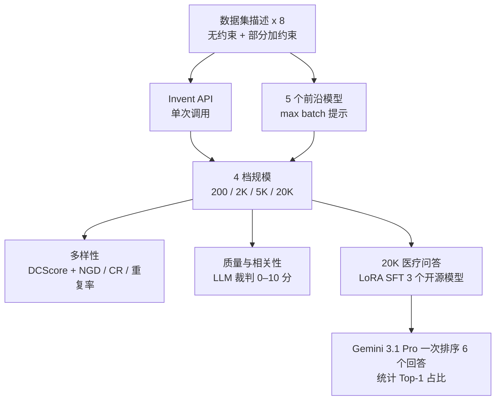

# Invent a Dataset：一句话描述换一整套后训练数据，比直接让前沿模型写更「不重样」

<!-- release-date: 2026-10-01 -->

> 本文依据本地 `readings/_src/训练方法与强化学习/Invent-a-Dataset.pdf`，即 Adaption Labs 的技术报告 **Invent a Dataset: Measuring dataset generation abilities with zero seed data**，作者 Shivalika Singh、Andrija Djurisic（共同一作）、Gbemileke Onilude、Sudip Roy、Sara Hooker，首页页脚写明 2026-10-01 作为预印本发布，正文 14 页、连参考文献与附录共 40 页。页码均指 PDF 自身页码（附录 A.9 的样本表自带 1–7 的页脚，本文仍按 PDF 第 34–40 页计）。文中区分三件事：**报告明确写了什么**、**我们怎么解释它**、**哪些是外部资料或我们从图上读出的近似值**。

## 读前先把几个词说成人话

这篇报告难读的地方不在公式，而在它同时用了好几把尺子，而且尺子的刻度会随样本量变。先把反复出现的词讲清楚：

- **零数据（zero data regime）**：你想让模型学会某个能力，但手上一条相关数据都没有，连拿来模仿的几条「种子样本」也没有。报告认为这是实践中最常见的处境（PDF p. 1）。
- **种子（seed）**：Self-Instruct、Alpaca 这类合成方法起步时用的一小撮人写示例，模型照着它们扩写（PDF p. 13）。
- **Invent-a-Dataset / Invent API**：Adaption Labs 的一个专用 API 端点，输入一段数据集描述，一次调用返回一整份数据集（PDF p. 3–4）。报告里两个名字混用，指同一个东西。
- **生成器（generator）**：产出数据的那一方。本文的对照组是 5 个前沿模型被直接提示去写数据集。
- **约束查询（constrained query）**：在数据集描述上再加格式、语气等硬要求，例如「回答只能是 A、B、C、D」「输出 JSON」「客服始终礼貌」（PDF p. 3–4）。
- **DCScore**：一种基于向量嵌入的多样性分数，把「每条样本能不能被认出是它自己」当成分类问题来算（PDF p. 6）。具体算法在后文「怎么量多样性」一节。
- **LLM 当裁判（LLM-as-a-Judge）**：让一个大模型按评分细则给样本打分或给多个回答排序。
- **Top-1 占比**：下游评测里，6 个模型对同一道题作答、裁判排序，某个模型排第一的题目占比（PDF p. 11）。

## 一句话先说清

零数据时，最省事的办法是直接请一个前沿模型「给我写 2 万条医疗问答」。报告想证明这条路有系统性缺陷：样本越要越多，模型越来越重复自己；加上格式约束，重复得更厉害（PDF p. 8–9、p. 13）。

Adaption Labs 拿自家的 Invent API 和 5 个前沿模型的直接生成对比，8 个数据集描述、4 档规模（200 到 20,000 条），量质量、多样性、相关性，再拿生成的数据去微调 3 个开源模型（PDF p. 3–5）。

上图引自 PDF p. 2 的 Figure 1，是整份报告的总结论。图注说画了「4 个外部模型」，图上其实有 5 个点（PDF p. 2）。

报告给出的主要结论（PDF p. 1、p. 3、p. 8–12）：

- 5,000 条规模下，Invent 的质量约 7.9 分，比最强基线高约 17%；多样性比次优的 GLM-5.3 高约 19%（PDF p. 8）。
- 多样性优势随规模拉大：200 条时持平，20,000 条时相对领先 37%（PDF p. 1、p. 9）。
- 加约束后，5 个基线的多样性下降 15%–22%，Invent 不变（PDF p. 8）。
- 用 Invent 数据微调的 Llama-3.3-70B 在 54% 的测试题上排第一，Gemma-4-31B-it 是 41%（PDF p. 3、p. 11）。
- 相关性（是否符合数据集描述）上，Invent 不是第一，落后 Claude Opus 5 与 GLM-5.3 一分多（PDF p. 10）。

最要紧的边界先说：**这是一份评测报告，不是方法论文。** Invent 内部怎么生成、用什么模型、怎么保证多样性，正文没有写；关于它本身只有「基于提示」「单次调用返回整份数据集」「支持 244 种语言」这几句（PDF p. 1、p. 4、p. 8）。读者能拿走的是一套「如何给数据生成器打分」的评测框架，以及「直接提示前沿模型写大数据集会塌缩」的一组测量；拿不走 Invent 本身的做法。

### 一条阅读路线

如果只有半小时读原文：

1. **p. 1–3 的摘要与四条发现**：先知道作者想证明什么。
2. **p. 4 的生成配置与 p. 5 的 Figure 2**：基线是怎么被调到最好打法的，这决定对比是否公平。
3. **p. 6–7 的指标定义**：DCScore、三种字面指标、三种裁判评分。
4. **p. 8 的总对比与 p. 10 的 Figure 4**：总对比与约束对比。
5. **p. 9 与 p. 11 的 Figure 5、p. 12 的 Table 6**：规模效应，全文最有说服力的部分。
6. **p. 10 的相关性、p. 11–13 的下游微调**：一个短板，一个最终收益。

附录 A.1 的评分细则（PDF p. 20–25）和 A.8 的排序提示词（PDF p. 32–33）写得很完整，想自己搭评测可以直接参考。

## 主要矛盾：没有种子时，模型越写越像自己

旧路有两条，报告逐一点了问题（PDF p. 1–2）。

**第一条是去网上找现成数据集。** 检索类 agent 能搜，但搜回来的东西格式未必能直接训练，也很难同时满足语言覆盖、语气、输出格式这些具体要求。更根本的是，检索只能找到已经存在的数据；目标能力没人做过数据，检索就无能为力（PDF p. 2、p. 12）。

**第二条是用现有模型合成。** 但主流合成方法默认你手上有种子：Self-Instruct、Alpaca 从一小撮人写示例出发扩写；Evol-Instruct（WizardLM）与 WizardCoder 把已有数据集反复改写得更难更杂（PDF p. 2、p. 13）。没有种子，就只能直接对模型说「生成一个数据集」。这时会撞上两堵墙：

- **多样性墙**。LLM 本来就容易输出单调；没有多样的提示，标准解码会卡进重复（PDF p. 2）。在大规模上还可能导致模型塌缩（model collapse）：一代代在合成数据上训，分布的长尾逐渐丢失（PDF p. 13）。
- **许可墙**。许多闭源前沿模型的服务条款禁止用其输出训练模型（PDF p. 2）。报告承认本文对比的闭源 API 都属于这种情况，只把它们当作「性能上界」来校准，并指出不少从业者明知禁止仍在这么用（PDF p. 4）。GLM-5.3 与 DeepSeek-V4-Pro-0813 的许可允许用输出训练（PDF p. 4）。Invent 以允许商业训练的宽松许可发布（PDF p. 3）。

于是矛盾变成：

> 零数据时只能靠一段描述起步。直接请前沿模型写，小规模看着还行，规模一上去就开始重复，加约束重复得更快；能不能有一个生成器，在 2 万条量级上同时守住质量和多样性？

## 先看全景：被评的是黑盒，评测框架是白盒

这张图按 PDF p. 3–7 的实验设置重画，是流程示意，不是原文图。Invent 那一格只有「单次调用」四个字，因为报告对它内部的描述就只有这么多（PDF p. 4）。

## 评测怎么搭

### 8 个数据集描述：故意覆盖任务、语言与领域

每个数据集只用一句自然语言请求生成，不给任何示例。8 个请求覆盖问答、客服对话、评论、新闻摘要、结构化抽取等任务，英语之外有塞尔维亚语和印地语（PDF p. 3–4、p. 26）。其中 5 个另配一个加约束的版本（PDF p. 3）：

| 数据集 | 无约束请求的要点 | 加约束版本多出的要求 |
|---|---|---|
| African QA | 非洲研究、文学、历史与时事的问答对 | 改成师生考试的多轮对话；提示用 OpenAI 格式，回答纯文本 |
| Legal QA | 版权法、政体、责任等法律问答 | 每题 4 个选项，答案只能是 A/B/C/D，不带其他文字 |
| Serbian Car Ads | 塞尔维亚语二手车广告 | 提示是广告摘要，回答是含 3 个指定字段的 JSON |
| Customer Support Banking | 信用卡激活、挂失、房贷的客服回复 | 用户情绪沮丧；客服始终热情礼貌 |
| Hindi News | 印地语新闻正文配标题与摘要 | 限体育新闻；提示必须是标题，回答必须是摘要 |
| Customer Support General | 产品、技术排障、账单争议、退货的客服问答 | 无约束版本 |
| Medical QA | 诊断、治疗、药物与医疗角色的问答，回答要详细专业 | 无约束版本 |
| Hotel Reviews | 酒店住宿评论，正面负面都要有 | 无约束版本 |

表格整理自 PDF p. 4 的 Table 3 与 p. 26 的 Table 8。约束类型对应三种常见需求：语气、JSON 格式、选择题输出（PDF p. 3）。

### 先把对手调到最好打法

公平性的关键在这一节。Invent 一次调用就返回整份数据集；而其他模型如果也只调一次，很少能返回足量样本，规模一大多样性还会严重塌缩（PDF p. 4）。所以作者没有让基线也「只调一次」，而是给它们比较了三种打法（PDF p. 4）：

1. **one-by-one**：每次请求只生成 1 条；
2. **batch of 100**：每次请求生成 100 条；
3. **max batch**：每次请求在输出上限内尽量多生成，输出上限对所有模型统一设成 128K token。

所有模型用默认超参，能指定温度的设为 1.0，关闭推理模式（PDF p. 4）。

| 模型（Medical QA） | one-by-one | batch of 100 | max batch |
|---|---:|---:|---:|
| GPT-5.6 Sol | 约 0.03 | 约 0.22 | 约 0.43 |
| Gemini 3.1 Pro | 约 0.04 | 约 0.23 | 约 0.35 |
| GLM-5.3 | 约 0.02 | 约 0.28 | 约 0.42 |

数值读自 PDF p. 5 的 Figure 2（DCScore，τ = 0.1），是从柱高估读的近似值，原文只给了柱状图。

一条一条地要，多样性几乎完全塌掉；一次要得越多，越多样。作者据此把 max batch 定为基线的默认打法（PDF p. 4–5），但没有解释原因。我们的理解是：一次只写 1 条时，模型每次都从同一个起点出发，看不到自己写过什么，于是反复落到最「典型」的那几道题上；一次写一大批时，模型至少在同一段输出里会主动避开刚写过的内容。

**我们如何解释它。** 这一步是在替对手选最强配置，方向上让对比更公平。但它也说明，即使是最好的打法，基线仍要多次调用、每次独立地写一批；批与批之间没有记忆，规模越大越容易撞车。后文「规模越大差距越大」的结果，很可能就源于这一点。报告没有尝试「把已生成的样本反馈给下一批」这类更强的基线。

### 怎么量多样性：一把语义尺子，三把字面尺子

**语义多样性用 DCScore**（PDF p. 6–7）。报告只写了它把多样性评估当作样本分类任务、能刻画样本之间的相互关系，嵌入模型用支持多语言与 32K 上下文的 Qwen-3-4B-embedding。

*外部补充*：按 DCScore 原论文（Zhu 等，[Measuring Diversity in Synthetic Datasets](https://arxiv.org/abs/2502.08512)），做法是先算所有样本两两之间的嵌入相似度 $K_{ij}$，再把「样本 $i$ 被归为样本 $j$」的概率写成带温度 $\tau$ 的 softmax：

$$
P_{ij} = \frac{\exp(K_{ij}/\tau)}{\sum_{j'} \exp(K_{ij'}/\tau)}
$$

DCScore 就是矩阵对角线之和 $\sum_i P_{ii}$：每条样本「认出自己」的概率加起来。所有样本完全相同时它等于 1，全都互不相同时等于样本数 $n$，可以理解为「有效样本数」。

本报告里的分数都在 0 到 1 之间，Figure 5 的图注又称之为「每样本多样性」（PDF p. 11），所以我们推断报告用的是除以样本数后的值，但正文没有写明归一化方式。这带来两个读图须知：

- **$\tau$ 越小，分数越高。** Figure 1 用 $\tau = 0.05$，Invent 在 5,000 条上约 0.79；附录 Figure 13 同样是 5,000 条、用 $\tau = 0.1$，Invent 只有约 0.133（PDF p. 2、p. 31）。不同图的绝对值不能横比。
- **样本越多，分数越低。** 同一个生成器，20,000 条全量算出来约 0.04（PDF p. 10），在其中随机抽 2,000 条算则约 0.27（PDF p. 9）。所以跨规模比较时，作者统一在每份数据里抽固定的 2,000 条来算（PDF p. 7）。

**字面多样性用三个指标**，都只算在生成的提示上（PDF p. 7）：

- **n-gram 多样性（NGD）**：1 到 4-gram 各自的「不重复数 / 总数」相加，越高越多样；
- **压缩比（CR）**：原文大小除以 gzip 压缩后大小，越高说明越重复；
- **完全重复率**：一字不差的重复提示占比。

### 怎么量质量与相关性：一个严格的裁判模板

质量与相关性用同一个 LLM 裁判模板一次打三个 0–10 的整数分（PDF p. 7、p. 20–25）：

- **提示质量**：看具体性、范围和完整性。关键规则是「按请求规定的形式打分」：请求要求短提示，就不能因为短而扣分（PDF p. 20–21）。
- **回答质量**：看准确、结构与是否守住提示的约束；同样按请求规定的长度与格式评判（PDF p. 20、p. 22–23）。
- **相关性**：样本是否属于目标数据集。四条硬标准按重要性排序：(A) 任务与主题对得上、(B) 语言对、(C) 遵守请求里明确写出的约束、(D) 提示本身可用（不是答案、不是半截、不是「生成 50 条工单」这种元指令、不依赖不存在的附件）。主题或语言错封顶 1–2 分，违反明确约束封顶 3 分，提示不可用封顶 4 分（PDF p. 23–24）。

报告所说的「质量」是哪种组合，正文没有直接定义。我们对照 Figure 6a（PDF p. 11）的柱高验算：Invent 提示约 7.4、回答约 8.4，平均约 7.9，与正文的 7.90 对得上；Claude Opus 5 约 5.75 与 7.8，平均约 6.78，也对得上正文的 6.76（PDF p. 8）。所以「质量」应是提示质量与回答质量的平均。**给这套模板打分的是哪个模型，报告没写**；只写了下游排序用的是 Gemini 3.1 Pro（PDF p. 7）。

## 结果一：5,000 条时，质量与多样性同时最好

PDF p. 8 用 5,000 条规模、8 个无约束数据集的平均值作总对比：

| 生成器 | 质量（正文） | 多样性（读自 Figure 1，τ = 0.05） | Invent 多样性高出（正文） |
|---|---:|---:|---:|
| Invent API | 7.90 | 约 0.79 | — |
| GLM-5.3 | 6.73 | 约 0.665 | 约 19% |
| Claude Opus 5 | 6.76 | 约 0.64 | 24% |
| GPT-5.6 Sol | 5.13 | 约 0.615 | 29% |
| Gemini-3.1-pro | 5.26 | 约 0.60 | 32% |
| DeepSeek-V4-Pro | 约 5.2（读自 Figure 6a） | 约 0.51 | 55% |

质量与百分比来自 PDF p. 8，DeepSeek 的质量分正文没给，是从 PDF p. 11 的 Figure 6a 估读的。7.90 对 6.76 约高 17%，就是摘要里那个数字（PDF p. 1、p. 8）。

作者的说法是：Invent 处在帕累托前沿，多样性的提升不以牺牲质量为代价（PDF p. 8）。几个前沿模型之间则出现明显分化：Claude Opus 5 与 GLM-5.3 质量好，GPT-5.6 Sol 与 Gemini-3.1-pro 质量明显偏低，DeepSeek-V4-Pro 两项都垫底。

**我们如何解释它。** 质量分里，几个基线的差距主要来自回答质量：Figure 6a 上 GPT-5.6 Sol、Gemini-3.1-pro 与 DeepSeek-V4-Pro 的回答都只有约 5.3–5.5，而 Claude Opus 5 与 GLM-5.3 在 7.6 以上（PDF p. 11）。PDF p. 6 Table 5 的医疗样本能看出原因：基线写的多是「地高辛的作用机制是什么」这类一句话教科书题，Invent 的样本是带病史的鉴别诊断病例（PDF p. 6）。裁判细则恰好偏爱「有上下文、有成功标准」的提示（PDF p. 21），所以质量分里有一部分其实是在奖励「题目更复杂」。

## 结果二：加约束后，基线的多样性掉 15%–22%，Invent 不掉

现实里的数据请求常带硬要求，可选输出的空间因此变窄，多样性通常会下降（PDF p. 8）。Figure 4 在 20,000 条全量上比较了加约束前后（PDF p. 10）：

| 生成器 | 无约束 | 加约束 | 变化 |
|---|---:|---:|---:|
| Invent API | 0.0428 | 0.0428 | 0% |
| GLM-5.3 | 0.0317 | 0.0271 | −15% |
| Claude Opus 5 | 0.0248 | 0.0210 | −15% |
| Gemini-3.1-pro | 0.0306 | 0.0254 | −17% |
| DeepSeek-V4-Pro | 0.0264 | 0.0217 | −18% |
| GPT-5.6 Sol | 0.0328 | 0.0257 | −22% |

数字全部来自 PDF p. 8 正文与 p. 10 的 Figure 4 图注（DCScore，τ = 0.1）。加约束后，Invent 比次优的 GLM-5.3 高约 58%（0.0428 对 0.0271，PDF p. 8–9）。

这里的绝对值都很小，是因为它在 20,000 条全量上算（见上文「样本越多分数越低」），不是生成器变差了。

**我们如何解释它。** 约束把每条样本的「外壳」固定住了：选择题只剩一个字母答案、JSON 只剩三个字段。基线一批批独立生成时，外壳相同，内容又容易回到几个高频主题上，嵌入就挤得更近。Invent 为什么完全不掉，报告没有给机制解释，只给了测量结果。

## 结果三：规模越大，差距越大

全文最有说服力的是规模曲线。前面两个结果都只取一个规模；这里看的是同一个生成器从 2,000 条要到 20,000 条时，样本还能不能保持新鲜。

上图引自 PDF p. 11 的 Figure 5b。下表把图上的点与正文数字对齐：

| 生成器 | 2K | 5K | 20K | 2K 到 20K |
|---|---:|---:|---:|---:|
| Invent API | 0.250 | 约 0.250 | 0.268 | +7% |
| GLM-5.3 | 0.213 | 约 0.221 | 0.196 | −8% |
| GPT-5.6 Sol | 约 0.203 | 约 0.195 | 约 0.189 | −7% |
| Claude Opus 5 | 约 0.187 | 约 0.182 | 约 0.160 | −15% |
| Gemini-3.1-pro | 约 0.174 | 约 0.181 | 约 0.182 | 基本持平 |
| DeepSeek-V4-Pro | 约 0.157 | 约 0.157 | 约 0.158 | +0.4% |

Invent 与 GLM-5.3 在 2K、20K 的值和最后一列百分比来自正文（PDF p. 3、p. 9），其余读自 PDF p. 11 的 Figure 5b（DCScore，τ = 0.1，每份数据随机抽 2,000 条计算）。

2K 时，Invent 领先最强基线 GLM-5.3 0.037，相对 17%；到 20K 时领先 0.072，相对 37%，差距翻了一倍多（PDF p. 9）。作者给的解释是：每条新样本都要和越来越大的已生成池子不同，同一个模型用同样的方式被反复提示，会越来越多地退回到重复模式（PDF p. 9）。

质量方面只给了 Invent 与 GLM-5.3 两家的规模曲线（PDF p. 9、p. 11 Figure 5a）：

| 规模 | Invent API | GLM-5.3 |
|---|---:|---:|
| 200 | 8.43 | 7.03 |
| 2,000 | 8.09 | 6.76 |
| 5,000 | 7.90 | 6.73 |
| 20,000 | 8.15 | 6.55 |

Invent 一直在 7.90–8.43 的窄带里，GLM-5.3 从 7.03 一路降到 6.55，相对差距约 17%–24%（PDF p. 9）。

字面指标给出同一个方向，而且更直观（PDF p. 10、p. 12 Table 6，无约束，每档抽 2,000 条提示）：

| 生成器 | NGD 2K | NGD 5K | NGD 20K | CR 2K | CR 5K | CR 20K | 重复率 2K | 重复率 5K | 重复率 20K |
|---|---:|---:|---:|---:|---:|---:|---:|---:|---:|
| Invent API | 1.75 | 1.82 | 1.87 | 3.67 | 3.51 | 3.47 | 0.0% | 0.0% | 0.0% |
| GLM-5.3 | 1.57 | 1.70 | 1.69 | 4.70 | 3.95 | 3.96 | 6.2% | 6.8% | 8.9% |
| Gemini-3.1-pro | 1.53 | 1.62 | 1.66 | 4.59 | 4.22 | 4.08 | 7.5% | 6.8% | 6.5% |
| GPT-5.6 Sol | 1.60 | 1.65 | 1.59 | 4.33 | 4.33 | 4.39 | 9.6% | 10.4% | 12.4% |
| Claude Opus 5 | 1.55 | 1.54 | 1.48 | 4.27 | 4.25 | 4.28 | 8.5% | 7.9% | 8.4% |
| DeepSeek-V4-Pro | 1.07 | 1.07 | 1.07 | 5.50 | 5.53 | 5.51 | 19.2% | 18.5% | 18.8% |

NGD 越高越好，CR 与重复率越低越好。最刺眼的是最后三列：5 个前沿模型每 100 条提示里有 6–19 条一字不差地重复，Invent 是 0（PDF p. 12）。DeepSeek-V4-Pro 接近五分之一是重复题，它的 NGD 也明显低于其他所有生成器。

加约束版本（附录 Table 11，PDF p. 27）规律类似：Invent 的压缩比每档最低、重复率 0.1%；NGD 上 Invent 与 GLM-5.3 交替领先，5K 时 GLM-5.3 的 1.80 高于 Invent 的 1.69。有意思的是，加约束反而让所有基线的完全重复率降了下来（如 DeepSeek-V4-Pro 降到 11.0%–11.6%），Invent 则从 0.0% 小升到 0.1%（PDF p. 25–27）。

**我们如何解释它。** 「大规模下越写越重复」这一条，不依赖 Invent 是什么，单独就有价值：它是对「直接提示前沿模型批量写数据」这种常见做法的一组定量测量。一字不差的重复题是最低级的浪费，用一行去重脚本就能发现；但嵌入层面的「近似重复」只能靠 DCScore 这类指标才看得到，而后者恰好是规模曲线下降的主要来源。

## 结果四：换到塞尔维亚语与印地语，差距更大

Invent 声称支持 244 种语言（PDF p. 8）。Figure 3 把 5,000 条规模拆成两组比较（PDF p. 8–9）：

- **塞尔维亚语与印地语**：Invent 多样性约 0.082，约为次优基线的两倍；GPT-5.6 Sol 的质量略高（约 8.05），但多样性不到 Invent 的一半。
- **6 个英语数据集**：Invent 两项都最高，质量约 7.5、多样性约 0.149，GLM-5.3 是 0.135。

| 生成器 | 塞尔维亚语与印地语：质量 | 多样性 | 6 个英语数据集：质量 | 多样性 |
|---|---:|---:|---:|---:|
| Invent API | 约 7.45 | 约 0.082 | 约 7.5 | 约 0.149 |
| GPT-5.6 Sol | 约 8.05 | 约 0.045 | 约 5.6 | 约 0.112 |
| GLM-5.3 | 约 6.0 | 约 0.040 | 约 6.7 | 约 0.135 |
| Gemini-3.1-pro | 约 7.0 | 约 0.032 | 约 6.2 | 约 0.108 |
| Claude Opus 5 | 约 6.9 | 约 0.031 | 约 7.0 | 约 0.107 |
| DeepSeek-V4-Pro | 约 5.75 | 约 0.024 | 约 6.3 | 约 0.094 |

除正文给出的几个数（Invent 两组的值、GPT-5.6 Sol 的 8.05、GLM-5.3 英语的 0.135）外，都读自 PDF p. 9 Figure 3 的散点位置，是近似值。按图读，非英语组的次优是 GPT-5.6 Sol，Invent 约为它的 1.8 倍，正文说的「约两倍」略有放大。

和自己比，Invent 换语言后质量几乎不变（英语约 7.5，塞尔维亚语与印地语约 7.4），多样性从约 0.149 降到约 0.082，降了约 44%；而基线的降幅大约在 60%–75%，所以 Invent 在非英语上的相对优势更大（PDF p. 8）。

另一个容易忽略的维度是「有没有用对语言」。作者用 langid 检测 Hindi News 的 2,000 条输出（PDF p. 8、p. 25、p. 27 Table 10）：

| 生成器 | 非印地语条数 | 占比 | 主要错成 |
|---|---:|---:|---|
| Invent API | 3 | 0.15% | 马拉地语 2、立陶宛语 1 |
| Claude Opus 5 | 7 | 0.35% | 马拉地语 7 |
| GLM-5.3 | 49 | 2.45% | 英语 38、马拉地语 11 |
| GPT-5.6 Sol | 50 | 2.50% | 马拉地语 50 |
| Gemini 3.1 Pro | 77 | 3.85% | 马拉地语 75、尼泊尔语 2 |
| DeepSeek-V4-Pro | 145 | 7.25% | 马拉地语 144、尼泊尔语 1 |

马拉地语和尼泊尔语与印地语共用天城文字母，被误判或真写错都有可能；报告把它们一律算作语言错误（PDF p. 25）。所有生成器的语言漂移都不大，Invent 最低（PDF p. 8）。

## 结果五：相关性不是第一，这是 Invent 的短板

相关性只看「样本是否符合数据集描述」，与写得好不好、多不多样无关（PDF p. 10）。5,000 条规模下（PDF p. 10–11，Figure 6b）：

| 生成器 | 相关性 |
|---|---:|
| Claude Opus 5 | 8.86 |
| GLM-5.3 | 8.66 |
| Gemini-3.1-pro | 7.51 |
| Invent API | 7.47 |
| DeepSeek-V4-Pro | 7.44 |
| GPT-5.6 Sol | 7.11 |

所有生成器都在 7.1–8.9 之间，说明大家基本都在按要求写；但 Invent 落在中间，比 Claude Opus 5 与 GLM-5.3 低一分多。作者自己承认，Invent 目前的优势在多样性与质量，不总能产出最贴合描述的样本，「在不牺牲多样性的前提下提高相关性」是未来要改进的方向（PDF p. 10）。

附录 Figure 8 的分数据集柱状图（PDF p. 28）能看出短板集中在哪：加约束、5,000 条时，Invent 在 Hindi News 与两个客服数据集上的相关性明显低于多数基线，而在 Medical QA 上最高。这是我们从柱高读出的趋势，报告正文没有逐个数据集讨论。

**我们如何解释它。** 多样性与相关性天然有张力：越往描述的边缘去探，越容易离题。附录 A.9 样本表里 Invent 生成的那道「假如最高法院以 2012 年某些异议意见里的讽刺式超然态度裁决银行费用披露案」的法律选择题（加约束版本，PDF p. 39），多样是真的多样，但离「版权法、政体、责任」的描述已经有点远。高多样性数据有一部分是靠「题目怪」换来的，用之前值得抽查。

## 结果六：拿数据去微调，最终模型更好

前面都是对数据本身打分。最后一步回答最终问题：这些数据训出来的模型好不好（PDF p. 5、p. 11–12）。

做法：取 3 个不同家族、不同规模的开源模型（Llama-3.3-70B-Instruct、Gemma-4-31B-it、Qwen3.5-9B），分别在各生成器产出的 20,000 条 Medical QA 上做 LoRA SFT。超参不手调，而是用 Adaption 自家的 Autoscientist 在其中一份数据上搜索，再把搜到的配置原样用到每一份数据上：同一个起点、同样的优化器、同样的 epoch 数、同样的样本数，唯一的变量是数据（PDF p. 5）。

评测：一组内部的医疗测试题，取自真实医疗查询分布，没有从任何生成器的数据里切分，以免偏向某个生成器的分布。每道题让未微调的基座和 5 个微调版本各答一次，Gemini 3.1 Pro 一次看完 6 个回答并从好到坏排序，每道题都独立打乱回答顺序以消除位置偏差（PDF p. 7、p. 11）。排序细则把事实准确放在第一位：任何事实错误都必须排在所有正确回答之后（PDF p. 32）。

| 微调数据来源 | Llama-3.3-70B | Gemma-4-31B-it | Qwen3.5-9B |
|---|---:|---:|---:|
| Invent API | 54% | 41% | 38% |
| 未微调基座 | 25% | 21% | 44% |
| Claude Opus 5 | 9% | 10% | 约 4% |
| GLM-5.3 | 约 7% | 8% | 约 6% |
| GPT-5.6 Sol | 约 3% | 8% | 约 1% |
| DeepSeek-V4-Pro | 约 2% | 12% | 约 5% |

表中是各模型排第一的题目占比。带「约」的值读自 PDF p. 13 的 Figure 7 与 p. 30 的 Figure 10，其余来自正文（PDF p. 11–12、p. 26）。

在 Llama-3.3-70B 上，Invent 版排第一的比例是未微调基座的两倍多、是最强对手 Claude Opus 5 版的 6 倍（PDF p. 11）。Gemma-4-31B-it 上规律相同。Qwen3.5-9B 是例外：未微调基座本身就很强，Top-1 占比 44% 对 38%、平均名次 2.17 对 2.28，都略胜 Invent 版；但 Invent 版仍远高于其他生成器的微调版（PDF p. 26）。

作者把这读成：数据层面的质量与多样性差异会传到训练出来的模型上，排序与第 3.1、3.3 节一致（PDF p. 12）。附录还推测，20,000 条只是一个不大的微调集，数据更多时 Invent 版对强基座的优势还会扩大（PDF p. 26）。这一条只引了 SFT 规模定律的前作，本文没有实测。

**我们如何解释它。** 这张表里最值得注意的不是 Invent 赢，而是**其他 4 份数据微调后几乎都比不微调还差**：Llama-3.3-70B 上它们都在 9% 以下，远低于基座的 25%。也就是说，在这套配方下，用前沿模型直接写的 2 万条医疗问答去做 SFT，平均会把一个已经对齐过的指令模型训坏。可能的原因有几个，报告都没讨论：

- 超参只在「其中一份」数据上搜索，报告没写是哪一份。如果恰好是 Invent 的数据，这套配置对它最合适，对其他数据未必；
- 基线数据有 6%–19% 的完全重复提示（PDF p. 12），重复题在 SFT 里相当于加权过拟合；
- 基线的回答多是短的教科书式答案（PDF p. 6），排序细则又把「回答所有显式与隐式要求」列为关键项（PDF p. 32）。

所以这张表能支持「Invent 数据比基线数据更适合这套 SFT 配方」，不足以支持「多出的分差全部来自多样性」。另外两点需要注意：裁判 Gemini 3.1 Pro 本身是被评的生成器之一，但它自己的数据没有出现在微调对比里，报告没说明为什么少了 Gemini 这一份；测试题的数量也没公开。

## 读表时要知道的几处对不上

报告里有几处数字或说法互相对不上。它们不改变大方向，但引用具体数字时要小心：

1. **「19%」在不同地方指不同的东西。** 发现列表写「2K 时多样性高 19%」（PDF p. 3）；第 3.1 节的 19% 是 5,000 条、τ = 0.05 时对 GLM-5.3 的领先（PDF p. 8）；第 3.3 节又说 2K 时对 GLM-5.3 的领先是 17%（PDF p. 9）。
2. **基线个数。** Figure 1 图注写「4 个外部模型」，图上是 5 个（PDF p. 2）；第 2.1 节说 Figure 2 比了「全部 4 个模型」，图注与图上都是 3 个（PDF p. 4–5）。Figure 2 图注说 one-by-one 全部 ≤ 0.03，但 Gemini 3.1 Pro 那根柱子看起来约 0.037（PDF p. 5）。
3. **约束版本有几个。** 正文说 8 个数据集中有 5 个配了约束版本（PDF p. 3），Table 3 与 Table 8 也只列了 5 个；但 Figure 4 图注写「8 个数据集平均」（PDF p. 10），附录 Figure 8 的「约束」柱状图也画满了 8 个数据集（PDF p. 28）。剩下 3 个在约束设定下用了什么请求，没有交代。
4. **Figure 3 的图注与分图标题矛盾。** 图注说是「约束设定下的非英语数据集」，但右图标题是「English only」，正文说是 6 个英语数据集（PDF p. 8–9）。
5. **NGD 的「相对次优基线」。** 正文说 2K、5K、20K 时 NGD 相对 GLM-5.3 分别高 9.4%、7.1%、10.7%（PDF p. 10）。按 Table 6 算，5K 与 20K 对得上；2K 时 GLM-5.3 是 1.57，1.75 / 1.57 约高 11.5%，9.4% 实际对应的是 GPT-5.6 Sol 的 1.60（PDF p. 12）。
6. **次优基线会随尺子变。** τ = 0.05 时 5,000 条上的次优是 GLM-5.3（PDF p. 2）；附录 Figure 13 换成 τ = 0.1、同样 5,000 条，GPT-5.6 Sol（约 0.118）高于 GLM-5.3（约 0.113）（PDF p. 31）。Figure 12 的 2,000 条全量上 GPT-5.6 Sol 约 0.237，也与 Figure 5b 同一规模的约 0.203 对不上（PDF p. 11、p. 30）。
7. **200 条时不是「持平」，而是略输。** 附录 Figure 11 上，200 条规模 Invent 的多样性约 0.652，略低于 GPT-5.6 Sol（约 0.667）与 GLM-5.3（约 0.661）；正文把它写作「各家持平」（PDF p. 26、p. 30）。这反倒加强了「规模越大优势越大」的叙事：小规模时直接提示前沿模型并不差。

## 限制、边界，以及不要补进去的实现

报告自己写明的限制（PDF p. 14）：

- 只生成指令数据与偏好数据，用于 SFT 与对齐；**不覆盖工具调用轨迹与多步 agent 轨迹**。作者的理由是这类数据与具体环境（可用工具、函数签名、控制流）耦合太紧，更窄、过期更快、更难复用。
- 作者也承认，这类知识是否最适合通过参数更新来内化，本身就是个开放问题。
- 目前只支持文本模态。

我们读完必须留下的判断：

- **Invent 的生成方法完全没有公开。** 用的底座模型、是否有规划或去重环节、怎么在一次调用里产出 2 万条、怎么守住多样性，报告都没写。报告只能当成「一个闭源产品的对比评测」来读，不能当成方法论文来复现。
- **评测方和被评方是同一家。** 数据集请求、指标、裁判模板、下游超参搜索工具 Autoscientist 都出自 Adaption Labs。报告没有第三方复评。
- **质量裁判是谁没写。** 下游排序用 Gemini 3.1 Pro（PDF p. 7），质量与相关性打分用的模型正文没写。
- **对比的口径不完全对称。** Invent 单次调用，基线多次 max batch 调用（PDF p. 4）。这对基线是更有利的配置，但成本、耗时、费用都没有报告。
- **下游实验只有一个领域。** 只做了 Medical QA 一份 20,000 条数据、3 个模型，测试题数量没公开，没有标准 benchmark 分数，也没有人工评测。
- **许可是一个真实约束，但本文不验证。** Invent 宣称允许商业训练（PDF p. 3）；闭源基线的条款限制由作者转述并引了一篇 TechCrunch 报道（PDF p. 2、p. 19）。

## 可迁移启发

1. **评一个数据生成器，至少要三把尺子同时量。** 质量、多样性、相关性彼此独立：Invent 质量与多样性第一，相关性却排第四。只看其中一把就会选错。自己搭合成数据流水线时，可以直接照这三把尺子各设一个看板。
2. **多样性要在目标规模上测，并固定子样本大小。** 200 条时各家差不多，2 万条时差出 37%。DCScore 这类指标随样本数下降，跨规模比较必须像本文那样固定抽 2,000 条，不同 τ 的数字也不能放在一起比。
3. **先跑一遍完全重复率。** 前沿模型直接批量写数据，有 6%–19% 的提示一字不差地重复。这是成本最低的检查，应当放在任何合成数据流水线的第一道。
4. **一次一条地要数据，是最差的打法。** Figure 2 显示 one-by-one 几乎塌到 0。真要直接提示模型生成，至少一次要一大批，并考虑把已经生成过的主题摘要喂回下一批。后者是我们的推论，本文没有测。
5. **约束越多，越要专门盯多样性。** 加格式或语气约束后，基线多样性普遍掉 15%–22%。生产中的数据请求大多带约束，评测时应当像本文那样把「有约束」和「无约束」分开报告。
6. **评裁判细则时，按请求的形式打分。** 附录 A.1 的「不因请求要求的简短而扣分」「违反明确约束比提示不可用更严重」这两条，是写 LLM 裁判模板时很容易漏掉的规则，可以直接借用。
7. **下游验证要留一个未微调基座作对照。** 本文最有信息量的一格，是「其他生成器的微调版都输给了未微调基座」。没有这个对照，你只会看到 Invent 版比其他版本好，而看不到合成数据也可能把模型训坏。

## 关键词回看

- **零数据**：没有任何种子样本，只有一句数据集描述。本文的出发点。
- **max batch**：基线的默认生成方式，一次请求在 128K 输出上限内尽量多生成；one-by-one 会让多样性塌到接近 0。
- **DCScore**：嵌入相似度加带温度的 softmax，再把每条样本「认出自己」的概率加起来。τ 越小分数越高，样本越多分数越低。
- **NGD / CR / 重复率**：三把字面尺子。Invent 的完全重复率是 0，基线是 6%–19%。
- **约束查询**：在描述上加格式与语气要求。基线多样性下降 15%–22%，Invent 不变。
- **相关性**：样本是否属于目标数据集，按任务主题、语言、约束、提示可用性四条硬标准打分。Invent 的短板。
- **Top-1 占比**：6 个回答一次排序、排第一的题目比例。Invent 版在 Llama-3.3-70B 上 54%，在 Gemma-4-31B-it 上 41%。
- **17% / 19% / 37% / 58%**：5K 质量领先、5K 多样性领先、20K 多样性领先、加约束后 20K 多样性领先。

## 资料与阅读边界

### 本文依据的版本

- 本地原件为 Adaption Labs 技术报告 PDF，40 页，首页页脚写「Released as a preprint on October 1, 2026」。`release-date` 取 2026-10-01，即原件自述的预印本发布日。alphaXiv 上同时有一条 alphaXiv 托管页（标注 2026-09-30）与一条 arXiv 编号 2610.01674 的条目（标注 2026-10-01），两者标题与摘要一致；本文以 PDF 自述的日期为准，未能核实 alphaXiv 托管页 2026-09-30 的标注是否早于正式公开。
- 官方页：[adaptionlabs.ai/invent-a-dataset](https://adaptionlabs.ai/invent-a-dataset)（PDF p. 1）；API 文档见 PDF p. 14 参考文献中的 Adaption Labs 文档链接。

### 报告明确写了、本文覆盖了的部分

摘要与 Figure 1；第 1 节零数据问题与四条发现；第 2.1 节数据集请求（Table 3）、基线模型、生成配置与 Figure 2、规模设置、下游后训练设置；Table 5 医疗样本；第 2.2 节多样性、质量、相关性、下游排序指标；第 3.1 节总对比与多语言（Figure 3）；第 3.2 节约束（Figure 4）；第 3.3 节规模（Figure 5、Table 6）；第 3.4 节相关性（Figure 6）；第 3.5 节下游（Figure 7）；第 4 节相关工作；第 5 节结论与限制；附录 A.1 评分细则、A.2 分数据集结果（Figure 8–9）、A.3 其余请求（Table 8）、A.4 语言一致性（Table 10）、A.5 约束下字面指标（Table 11）、A.6 Qwen3.5-9B 结果（Figure 10）、A.7 各规模散点图（Figure 11–14）、A.8 排序提示词、A.9 样本表。

### 外部资料补充（不是 PDF 原文）

- DCScore 的算法（相似度矩阵、带温度的 softmax、取对角线之和、取值 1 到 $n$）来自 Zhu 等人的 [Measuring Diversity in Synthetic Datasets](https://arxiv.org/abs/2502.08512)，本报告只引用了它的名字和一句概括（PDF p. 6）。本报告分数落在 0 到 1 之间，按样本数归一化是我们的推断。
- 种子式合成的代表做法可对照站内 Self-Instruct 一篇与 Magpie 一篇；后者同样不靠种子，而是从对齐模型的 chat 模板前缀里抽出用户问题。

### 原文没有公开、本文也不补的缺口

- Invent 的生成方法、底座模型、是否有过滤与去重、单次调用的耗时与费用；
- 质量与相关性裁判用的是哪个模型；
- 下游 LoRA SFT 的超参数值，以及 Autoscientist 是在哪一份数据上搜索的；
- 下游测试题的数量与来源细节，以及为什么没有 Gemini 3.1 Pro 数据的微调版本；
- 3 个未列出约束请求的数据集在约束设定下用了什么请求；
- 任何人工评测或标准 benchmark 上的下游分数。
