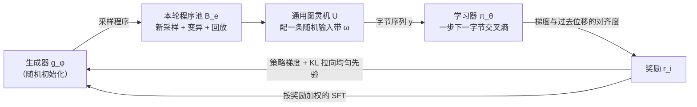

# Self-Play Pretraining with Zero Data：一个自然字节都不给，让出题器在程序空间里给学习器找课

<!-- release-date: 2026-09-24 -->

> 本文依据本地 `readings/_src/训练方法与强化学习/Self-Play-Pretraining.pdf`，即 **Self-Play Pretraining with Zero Data**，arXiv 2609.30063v1（[cs.AI]，2026-09-24 提交），共 32 页。作者 Aditya Cowsik、Kfir Dolev、Michael Y. Li（三人共同一作，按字母序）、G. Bruno De Luca、Nourya Cohen、Noah D. Goodman、Yoav Levine；署名单位是独立研究者、Tel Aviv University、Stanford University 与 LAPTh（USMB），De Luca、Cowsik、Dolev 三人在 Stanford Institute for Theoretical Physics 任职期间开始这项工作（PDF p. 1）。页码均指这份 PDF 的物理页码。文中区分三件事：**论文明确写了什么**、**我们如何解释它**、**哪些是从图上读出的约数**。

## 读前先把几个词说成人话

这篇论文把强化学习、算法信息论和规模定律缠在一起。先把反复出现的词说清楚：

- **自博弈（self-play）**：两个模型互相给对方制造训练信号。这里不是下棋对弈，而是一个出题、一个做题。
- **生成器（generator）$g_\phi$**：出题的一方。它是一个自回归 Transformer，输出的不是文本，而是一段小程序。
- **学习器（learner）$\pi_\theta$**：做题的一方。它也是自回归 Transformer，只做一件事：预测程序输出的下一个字节。
- **通用图灵机（universal Turing machine，UTM）**：能模拟任何可计算过程的机器。论文用一门极简的 `Brainf*ck` 式语言当这台机器的指令集（PDF p. 4）。
- **Solomonoff 归纳（Solomonoff induction）**：一种理论上的「万能预测器」：把所有程序按长度加权当成假设，短程序权重高。它不可计算，论文拿它当远方的灯塔（PDF p. 2、p. 6）。
- **零样本（zero-shot）**：评测时不对目标数据做任何梯度更新，学习器直接去预测没见过的自然数据。
- **BPB（bits per byte，每字节比特数）**：预测一个字节平均要花几比特。对 256 种字节一律猜均匀分布，就是 8 BPB（PDF p. 27）。越低越好。
- **上下文学习（in-context learning，ICL）**：不改权重，只看提示里给的几个例子就学会规则。
- **通用结构 / 偶然信息（universal structure / contingent information）**：论文自己造的一对词。前者是很多数据源共享的规律（复制、递归、层级组合）；后者是某份数据特有的事实、符号和模态（PDF p. 2、p. 12）。

## 一句话

主流预训练的数据仍然是人替模型挑的：清洗网页、调数据配比、手写合成数据生成器（PDF p. 1）。这篇论文做了一个极端的概念验证：**生成器和学习器都从随机初始化开始，训练里一个自然字节都不用**。生成器写程序，程序在通用图灵机上跑出字节序列，学习器用下一字节交叉熵去学；生成器则用强化学习去找「学习器正好学得动」的程序（PDF p. 1、p. 4）。

结果是：在文本、图像、旋律、音频、语音、代码等一组没见过的自然数据上，零样本损失随自博弈算力呈可预测的幂律下降，拟合出来的指数和直接在自然数据上训练的文献值同一量级（PDF p. 8、p. 21）。学习器还长出了上下文学习；生成器在几百轮内就找到了斐波那契、等比这类数列的程序，而均匀随机抽程序在 53,000 轮量级里都碰不到（PDF p. 9、p. 29）。

但要把边界先说在前面：全部实验的模型都小于 25M 参数、上下文 4K（PDF p. 15）；零样本的绝对损失离「真的在自然数据上训过」差得很远；在文本和代码上，手写的概率上下文无关文法（PCFG）预训练比自博弈更好（PDF p. 9）。论文证明的是「可以从零长出能迁移的结构」，不是「可以替代自然数据」。

### 一条阅读路线

1. **p. 3 Figure 1 上半幅、p. 4 的三步循环**：先看清两个模型、一台机器怎么连成环。
2. **p. 5 式 (2)**：生成器的奖励为什么是梯度对齐，而不是「难度」。这是全文最关键的一个设计。
3. **p. 6 式 (3)–(5)**：生成器的 RL 目标，以及为什么还要一项专家迭代。
4. **p. 7 Figure 2、p. 21 Table 2**：和两种固定合成数据比，以及拟合出来的规模指数。
5. **p. 9 Table 1、p. 10 Figure 3**：生成器是不是真的越出越好。
6. **p. 10–11 Figure 4、Figure 5**：上下文学习。
7. **p. 12–13 式 (6)–(13)**：作者用来解释这一切的「通用数据」分解。
8. **p. 21–22 附录 A**：把自博弈当成自然数据预训练前的一段「预预训练」。

附录 E（机器语义）、F（奖励消融 Table 5）、G（程序池）、H（PCFG 基线）是读方法时的对照尺。

## 主要矛盾：数据是人挑的，而「难」不等于「有用」

论文的出发点是把「苦涩的教训」（Sutton 的 Bitter Lesson）推到训练数据本身：与其由人设计数据，不如让模型自己学着生成对自己最有用的数据，这样训练数据的上限由算力决定，而不是由人类知识决定（PDF p. 1–2）。

要做到这一点，有两道坎。

**第一道坎是搜索空间。** 想让生成器能造出任何有用的结构，它的输出空间就得足够大、又尽量不带领域偏见。论文的选择是「所有可计算的数据生成过程」：任何可计算过程原则上都能写成一段程序（PDF p. 2）。代价是这个空间大得离谱，其中绝大多数程序的输出对学习器毫无用处。

**第二道坎是「什么叫有用」会随时间变。** 学习器今天学不会的，明天可能正好能学；今天有用的，学会之后就没用了（PDF p. 2）。所以不能事先写死一份课程，需要一个会随学习器调整的出题人。这就是自博弈的位置。

最直接的出题目标是「出学习器预测不了的题」，即按难度给奖励。论文一开始就是这么想的，随即指出它的死穴：往一段本来可预测的序列里掺随机字节，就能让程序任意地难，而这里面没有任何可学的结构（PDF p. 5）。难度奖励会把生成器引向噪声。

于是矛盾变成：

> 在一个几乎全是垃圾的程序空间里，怎么只凭学习器自己的状态、不借任何外部标注，判断哪段程序「难但学得动、而且学了有后劲」？

全文的答案集中在一个奖励上：看这段程序给学习器的梯度，和学习器最近一段时间实际走过的方向对不对得上。

## 全景：两个随机模型，一台图灵机，一个闭环

图里左侧两框就是本文的实验前提：自然数据不参与训练，两个模型都从随机初始化开始。右下角的小图是奖励的几何直观：学习器参数随训练轮次走出一条曲线，从第 $i/2$ 轮到第 $i$ 轮的位移 $\Delta\theta_i$ 和当前程序给出的梯度 $g_i$ 越平行，奖励越大（PDF p. 3）。

每一轮自博弈做三件事（PDF p. 4）：

这张图按 PDF p. 4–6 的算法描述重画，是流程示意，不是论文原图。几个要点：

- 两个模型是**独立参数**的 decoder-only Llama 式 Transformer，结构完全相同（PDF p. 7）。
- 词表就是 256 个字节值，因为机器输出的是原始字节，也因为这样评测不挑模态：文本、图像、音频都只是字节流（PDF p. 7）。
- 程序和输出分别用字节 `S` 和 `O` 打头。生成程序时，logits 被限制在 8 条 `Brainf*ck` 指令、10 条单字节宏指令和结束符 `F` 上；输出序列可以是任意字节（PDF p. 7）。
- 学习器训练的是**程序的输出**，不是程序本身（PDF p. 4）。

## 核心设计一：程序空间，选一台不会报错的通用机

### 旧问题：手写的合成数据自带偏见

已有的无自然数据预训练有两条路。一条是手写生成器，比如 PCFG，天然偏向语言那种层级结构；另一条是 Grau-Moya 等人 2024 年的做法，从通用图灵机上固定地随机抽程序，让网络去摊销通用预测（PDF p. 13–14）。前者空间窄，后者不会随学习器调整。

### 新设计：`Brainf*ck` 式通用机，外加十条宏

机器只有一条字节带、一个读写头。8 条指令分别是左右移头（`<` `>`）、当前格加减一（`+` `-`）、循环（`[` `]`）、读写字节（`,` `.`）（PDF p. 29）。程序是字母表 $\mathcal{A}$ 上长度不超过 $L$ 的串，以 `F` 结束（PDF p. 4、p. 29）。

最关键的一条工程约束是：**任何字符串都能执行，永远不报错**（PDF p. 4、p. 30）。

- 括号不配对，就当空操作；
- 带子是环形的，头移出一端就从另一端绕回；
- 每格按 256 取模，加减溢出直接回绕；
- 执行一定停：到步数预算、到程序末尾、或已经吐满 $T$ 个字节，三者先到先停；提前停机就补零。

读指令 `,` 从一条均匀随机的输入带 $\omega$ 读字节，所以一段程序定义的不是一条序列，而是一个**序列分布**：$y = U(x, \omega) \in \{0, \dots, 255\}^T$（PDF p. 4、p. 30）。

论文给的例子（PDF p. 30）：`+++[>+.<-]F` 先把第 0 格设成 3，然后循环三次，每次把第 1 格加一并输出，最后输出 $(1, 2, 3, 0, \dots, 0)$。

只用 8 条指令已经图灵完备。但人写 `Brainf*ck` 时反复出现的片段（清零一格、把值搬到邻格、扫到下一个零格），在初步实验里能提高自博弈效率，所以字母表又加了 10 个单字符宏（PDF p. 30，Table 4）：

| 宏 | 展开 | 对带子的效果 |
|---|---|---|
| `Z` | `[-]` | 清零当前格 |
| `R` | `[->+<]` | 清零，并把 $x$ 加到右邻 |
| `L` | `[->+++<]` | 清零，并把 $3x$ 加到右邻 |
| `N` | `[-<->]` | 清零，并从左邻减去 $x$ |
| `C` | `[->+>+<<]` | 清零，并把 $x$ 加到右边两格 |
| `G` | `[>]` | 向右扫到下一个零格 |
| `H` | `[<]` | 向左扫到下一个零格 |
| `W` | `[[-]>+<]` | 当前格非零时，右邻加一并清零当前格 |
| `V` | `[.>]` | 输出存储的串，直到遇到零格 |
| `X` | `[-]` 后接 16 个 `+` | 把当前格设成 16 |

$x$ 指当前格的值。论文特意强调：自博弈、均匀先验基线、均匀抽样对照三者用的是**同一个扩展字母表**，所以宏本身解释不了它们之间的差距（PDF p. 30）。

### 我们如何解释它

「不报错」这条比选哪门语言更要紧。RL 的样本里如果大半是语法错误，奖励会被大量零值淹没；把所有非法情况都定义成「回绕或停机」，等于让每个采样都落在有效空间里，生成器的探索预算不被浪费。宏则是一点点有意的归纳偏置：论文宣称「极少领域结构」，但 Table 4 里的 `L`（乘 3）直接对应 Table 1 里等比数列程序的写法（见后文），这一点读结果时要记住。

### 可迁移启发

给生成式搜索设计动作空间时，先保证「每个动作都合法」，再谈表达力。能把非法状态定义成确定的退化行为（空操作、回绕、截断），就不要让它变成报错。

## 核心设计二：学习进度奖励，看梯度和过去的方向对不对得上

这是全文最关键的设计，也是作者明说「在小规模上试了若干备选才选定」的部分（PDF p. 5）。

### 旧问题：按难度给分，会被噪声骗

前面说过，按「预测不了」给奖励会被随机字节钻空子（PDF p. 5）。要的不是「难」，而是「难，但和学习器已经学会的东西接得上」。

### 新设计：预条件化的梯度对齐分数

论文的直觉是：学习器参数的变化量本身就总结了它学到了什么。来自可复用结构的学习信号会在参数位移里累积，不可学的特异噪声不会（PDF p. 5）。

先定义回看点和回看位移（PDF p. 5）：

$$
p(e) = \lfloor e/2 \rfloor,
\qquad
\delta\theta_e = \theta_{p(e)} - \theta_e
$$

$e$ 是当前轮次。$\theta_{p(e)}$ 是一半轮次之前的学习器检查点，$\delta\theta_e$ 是从现在指回那时的参数差。于是回看窗口长 $\lceil e/2 \rceil$ 轮，随训练变长。

程序 $x_i$ 的输出是 $y_i$，它的奖励是（PDF p. 5，式 2）：

$$
r_i
=
\left|
\left\langle
\nabla_\theta \mathcal{L}(y_i;\theta_e),\;
P_e \odot \delta\theta_e
\right\rangle
\right|,
\qquad
P_e = \frac{\mathrm{lr}}{\sqrt{\hat v_e} + \epsilon}
$$

读法是：拿学习器在这段输出上的梯度，和它过去半程的参数位移做内积，取绝对值。$P_e$ 是从学习器 AdamW 状态里取出的对角步长算子，$\hat v_e$ 是二阶矩估计，$\odot$ 是逐元素乘。它的作用是让内积按「AdamW 实际会怎么走这一步」来度量，而不是按原始欧氏空间；论文说这个预条件很重要（PDF p. 5）。

### 工作机制：三类程序，只有一类拿高分

论文给的直觉（PDF p. 5）：

| 程序类型 | 梯度 | 与过去位移 | 奖励 |
|---|---|---|---|
| 已经学会的 | 近乎为零 | 无所谓 | 低 |
| 含无关或不可学结构的 | 可能很大 | 方向不对齐 | 低 |
| 没学会、但延续了已学方向的 | 大 | 对齐 | 高 |

于是生成器被推向学习器能力的「前沿」。窗口随轮次变长，一方面平滑短期抖动，让信号越训越稳；另一方面又允许早期的错误方向最终被遗忘（PDF p. 5）。

工程上，这个内积不需要把完整梯度物化出来：用前向模式自动微分（forward-mode AD，即雅可比-向量积）直接算方向导数，论文脚注指向 GitHub 上的 `jvp_flash_attention` 仓库作为前向模式注意力核的实现（PDF p. 6）。

### 证据：Table 5 的奖励消融

Table 5 在 1M 参数的学习器上，每次只改奖励的一个性质，报告最后一轮检查点 4 个种子集成后在每个数据集 256 条留出序列上的 BPB（PDF p. 31）。粗体是论文标出的每行最好值。

| 数据集 | None（正式奖励） | uniform | signed | shuffle | last_step | loss_delta | negate |
|---|---:|---:|---:|---:|---:|---:|---:|
| text（DCLM） | 5.34 | 7.75 | **5.06** | 5.96 | 6.39 | 7.40 | 10.62 |
| Metamath | **3.38** | 7.39 | 3.47 | 4.39 | 4.34 | 6.46 | 10.52 |
| C source | 4.16 | 7.92 | **4.10** | 4.79 | 4.95 | 6.37 | 10.60 |
| DNA（8 符号） | **2.29** | 3.02 | 2.45 | 2.50 | 3.22 | 3.57 | 8.37 |
| arithmetic | **0.22** | 7.94 | 0.51 | 0.73 | 1.26 | 1.92 | 10.64 |
| audio 8-bit PCM | **2.27** | 3.93 | 2.45 | 2.91 | 3.39 | 3.67 | 7.67 |
| audio 16-bit PCM | **5.02** | 6.08 | 5.24 | 5.79 | 5.97 | 6.32 | 9.02 |
| melody（Mutopia） | **2.20** | 7.09 | 2.21 | 3.26 | 3.35 | 4.14 | 11.00 |
| CIFAR-10（planar） | **5.96** | 7.83 | 6.14 | 7.14 | 7.22 | 7.59 | 10.59 |
| random bytes | **8.02** | **8.02** | 8.05 | **8.02** | 8.29 | 8.61 | 10.57 |

各列的含义（PDF p. 31）：

- **uniform**：去掉生成器，程序按字母表均匀独立采样；
- **signed**：去掉绝对值；
- **shuffle**：在同一程序池里把奖励随机打乱，只保留奖励的边际分布；
- **last_step**：回看窗口缩成一步，$\theta_{\text{past}} = \theta_{e-1}$；
- **loss_delta**：改用实际的损失下降 $L_i(\theta_{\text{pre}}) - L_i(\theta_{\text{post}})$；
- **negate**：奖励取反。

论文的读法是（PDF p. 30–31）：正式奖励在多数数据集上最好或接近最好，方差也常更低；shuffle 明显变差，说明起作用的是「奖励与程序的对应关系」，不是奖励分布本身；last_step 更差，说明长窗口的平均有价值；loss_delta 与 last_step 一阶近似相同却更差，说明一阶的梯度内积比有限差分更有信息量；negate 比随机初始化的模型还差，说明奖励确实系统地把好程序排在坏程序前面。

两条脚注要一起读：一个 loss_delta 种子在第 2587 轮停掉，那列是 3 种子集成；last_step 和 loss_delta 在种子间呈双峰，例如 DCLM 上 last_step 单种子是 6.4 / 6.5 对 10.6 / 11.1，集成把发散的种子也平均了进去（PDF p. 31）。

**我们如何解释它。** 这张表支撑「梯度对齐 + 长窗口」这个组合，但有三处不能读过头：

1. signed 在 text 和 C source 上反而比正式奖励好（5.06 对 5.34，4.10 对 4.16，PDF p. 31），绝对值并非处处占优。论文只用「signed 总体更差」来论证绝对值有用，没有解释为什么与过去方向**相反**的梯度也该拿高分。
2. 全表只在 1M 参数一个规模上做，没有在更大规模上复核奖励选择。
3. random bytes 一行所有方法都在 8 BPB 左右，这是均匀猜测的水平，是一个健全性检查，不是区分度。

### 可迁移启发

「出学习者学得动的题」可以不靠外部评判：用学习者自己的梯度和它过去的轨迹做内积，就是一个不需要标签的课程信号。要点有三：按优化器的实际步长做预条件；窗口要长，否则被短期噪声主导；用前向模式自动微分算方向导数，避免为每个样本存一份完整梯度。

## 核心设计三：生成器怎么训，RL 之外还要防遗忘

### 程序池：新采样、变异、回放三路合流

每一轮先组一个程序池（PDF p. 4、p. 31）：

$$
\mathcal{B}_e = \mathcal{B}^{\text{fresh}}_e \;\dot\cup\; \mathcal{B}^{\text{mut}}_e \;\dot\cup\; \mathcal{B}^{\text{replay}}_e
$$

- **新采样**：当前生成器刚采出的程序，负责全局探索；
- **变异**：从高奖励程序库里挑父本，做单个 token 的替换、插入或删除，负责在有希望的区域做局部搜索。它替换掉一部分在线采样，比例论文没写（PDF p. 31）；
- **回放**：从早先轮次的非回放程序里无放回均匀抽取，用新的随机输入带重新执行，防止灾难性遗忘（PDF p. 32）。

三路程序都用来训练学习器（PDF p. 5，式 1）。

变异父本的程序库用 MAP-Elites 式的「质量-多样性」存档，避免变异只围着最高分打转（PDF p. 32）：每个程序按两个描述子分进生态位，一是最大动态循环嵌套深度（0 到 8 分箱，更深的并入最后一箱），二是程序体长度（以 8、16、32 个 token 为界分桶），最多 36 个生态位。只有奖励为正的程序能进档，每个生态位保留奖励最高的 8 个；因为程序有没有用取决于学习器当下的状态，存档的奖励每轮乘 0.97 衰减，好让新近有用的程序顶替过时的精英。父本在已占用的生态位之间均匀选，而不是在全部程序之间均匀选，这样深层嵌套循环这类罕见结构也能保住代表（PDF p. 32）。

### RL 目标：KL 拉向「程序先验」

生成器最大化带 KL 正则的期望奖励（PDF p. 6，式 3）：

$$
J_{\mathrm{RL}}(\phi) = \mathbb{E}_{x \sim g_\phi}\bigl[r(x)\bigr] - \beta\, \mathrm{KL}\bigl(g_\phi \,\|\, g_0\bigr),
\qquad
g_0(x) = |\mathcal{A}|^{-\ell(x)}
$$

$g_0$ 是固定的均匀程序先验，$\ell(x)$ 是程序到结束符 `F` 为止的 token 数。每个 token 都均匀抽，长程序的概率就按长度指数衰减。论文把它称为 Solomonoff 先验 $2^{-|p|}$ 的自然类比：短描述权重高（PDF p. 6）。生成器初始化在 $g_0$ 附近，整个训练都被拉向它。

策略梯度用 GRPO 式的批内归一化降方差（PDF p. 6）。优势先按整个本轮池的奖励做标准化，再把 KL 项并进去：

$$
A_i = \frac{r_i - \bar r_e}{\sigma_{r,e} + \epsilon} - \beta\bigl(\log g_\phi(x_i) - \log g_0(x_i)\bigr)
$$

回放样本是离策略的，所以乘一个序列级重要性比 $\rho_i = g_\phi(x_i) / g_{\phi_{\text{old}},i}(x_i)$，分母是程序当初进回放库时存下的采样概率；新采样的在线样本 $\rho_i = 1$。$\rho_i$ 截断在 $[e^{-20}, e^{20}]$（PDF p. 6）。论文为这一步引用的是 Zheng 等人 2025 年的序列级重要性比，即 GSPO 一篇所讲的做法。策略梯度项是（PDF p. 6，式 4）：

$$
\mathcal{L}_{\mathrm{PG}}(\phi) = -\frac{1}{|\mathcal{B}_e \setminus \mathcal{B}^{\text{mut}}_e|}
\sum_{i \in \mathcal{B}_e \setminus \mathcal{B}^{\text{mut}}_e}
\mathrm{sg}(\rho_i)\, \log g_\phi(x_i)\, \mathrm{sg}(A_i)
$$

$\mathrm{sg}$ 是停止梯度。变异样本被排除在外，因为它们不是从一个有明确对数概率的提议分布里采出来的（PDF p. 6）。

### 专家迭代：把好程序蒸回生成器

为了防遗忘，论文再加一项按奖励加权的监督微调，把整个池子里的高奖励程序蒸回生成器（PDF p. 6）：

$$
w_i = \frac{[r_i]_+}{\sum_{j \in \mathcal{B}_e} [r_j]_+},
\qquad
\mathcal{L}_{\mathrm{EI}}(\phi) = -\sum_{i \in \mathcal{B}_e} w_i \log g_\phi(x_i)
$$

$[r]_+ = \max(r, 0)$。这一项覆盖全池，包括变异样本，所以变异发现的好程序是通过它、而不是通过策略梯度进入生成器的。总目标是（PDF p. 6，式 5）：

$$
\mathcal{L}_{\text{generator}}(\phi) = \mathcal{L}_{\mathrm{PG}}(\phi) + \lambda_{\mathrm{EI}}\, \mathcal{L}_{\mathrm{EI}}(\phi),
\qquad
\lambda_{\mathrm{EI}} = 1.0
$$

### 我们如何解释它

这套生成器训练是把几种成熟技巧拼在一起：GRPO 式优势、序列级重要性比、KL 到先验、回放、专家迭代、质量-多样性存档。单看每一件都不新。新的是它们服务的对象：奖励不来自任务成败，而来自另一个模型的学习轨迹。论文没有逐件消融这些组件，Table 5 只动奖励；变异、回放、专家迭代、MAP-Elites 各自贡献多少，文中没有数据。

### 可迁移启发

当奖励会随另一个模型的状态漂移时，只靠在线策略梯度容易「学了新的忘了旧的」。回放 + 奖励衰减的精英存档 + 按奖励加权的 SFT，是一组可以整体搬到其他自博弈课程生成里的防遗忘零件。

## 实验一：零样本规模定律

### 怎么量：算力前沿与幂律拟合

规模实验沿用 Kim 等人 2026 与 Wen 等人 2026 的方法（PDF p. 8）：

- 每个模型规模上，用几何间隔网格做坐标下降，把超参调到「局部最优」。只调四个最重要的：学习器学习率、生成器与学习器的学习率比、batch 大小、生成器 KL 系数 $\beta$（PDF p. 8）。$\beta$ 的取值论文没给。
- 训练目标全是合成的，没有现成的选超参标准。论文用 **DCLM 与 DNA 两个数据集的验证损失平均** 当模型选择信号，并承认这会通过超参选择带来有限的泄漏，但自然数据从不参与梯度更新（PDF p. 8）。
- 受算力所限，训练预算固定为 34.36B token，而不是单独调轮数；学习率只有短暂固定热身、之后恒定，所以任何中间检查点都等价于在那个 token 数上停下的一次运行，事后可以从一次长跑里回溯挑训练时长（PDF p. 8）。
- 调 batch 大小时总 token 数不变，轮数相应调整；上下文长度一律 4096 token（PDF p. 8）。
- 在局部最优超参上，每个规模训 $K$ 个独立种子，把预测分布平均成集成（PDF p. 8）。

算力前沿在模型规模、检查点和集成大小三个维度上取：一个点在前沿上，当且仅当它的验证损失比所有算力不超过它的配置都低（PDF p. 8）。每个数据集单独拟合（PDF p. 8）：

$$
L(C) = E + A\,C^{-\alpha}
$$

$L$ 是 BPB，$E$ 是拟合出的渐近损失下限。算力轴定义为 $C = K \times \text{params} \times \text{tokens}$，$K$ 是种子数（PDF p. 3、p. 7）。

**我们如何解释它。** 这个算力定义只数学习器的「参数 × token」，乘上集成份数。生成器的训练、奖励所需的前向模式微分、程序执行的开销是否折进去，论文没有说明。另外，论文没有列出具体试了哪几档模型规模，只说全部低于 25M 参数（PDF p. 15）。

### 结果：和两条固定合成数据基线比

这张图是全文最关键的证据，它同时回答了两个问题（PDF p. 7–9）。

**第一，光有通用程序空间不够。** 虚线是同一个程序空间、同一个扩展字母表，只是程序从固定的 Solomonoff 式先验里独立抽取，不随学习器调整。它下降得慢得多。论文据此说：必须学会把训练算力分配到程序空间的哪里，这才是自博弈的价值（PDF p. 8）。

**第二，自博弈换来的是跨模态的广度，而不是在每个模态上都赢。** PCFG 是手工设计的层级与组合结构来源，对语言特别合适。它在文本和代码上更强，自博弈在图像、音乐、音频和语音上明显胜出（PDF p. 9）。论文自己的措辞是：自博弈并不总能追上在某领域特别合适的专门先验，但它学到的结构迁移得更广（PDF p. 9）。

附录 Figure 7 把同样的比较扩到 21 个数据集，按文本、代码与形式语言、语音、声音与音乐、视觉旋律与 DNA、二进制数值与合成六组排开（PDF p. 23）。附录 B 只给了其中 7 类的构造细节：DCLM 文本、CIFAR-10 图像、Speech Commands 语音、Mutopia 旋律、DNA、Metamath、C 源码（PDF p. 23–27）。LibriSpeech、MusicNet、ESC-50、arXiv math、Kolmogorov text、glibc rand 等的构造在附录里没有单独说明。

几个评测数据的构造值得知道，因为它们决定了 BPB 的含义（PDF p. 24–27）：

- **图像**：CIFAR-10 测试集，去掉标签，只保留 8 位 RGB 像素。同一批图有两种无损排法：按通道平铺（planar）与按像素交织（HWC）。论文说两种排法对下一字节预测没有可观的差别。每张图是 $32 \times 32 \times 3 = 3072$ 字节（PDF p. 24–25）。
- **语音**：Speech Commands v0.02 测试集，4,890 条 1 秒单声道录音；丢掉 WAV 头，16 位采样映射成一个无符号字节。上下文 256 时一条记录是 255 个连续字节，16 kHz 下只覆盖 15.94 毫秒（PDF p. 24–25）。
- **旋律**：从 Mutopia 选 40 首公有领域的西方古典名曲，按十六分音符量化成单音字节流：0–127 是音高起音，128 是延音，129 是休止，130 是曲终；长曲截到 4095 字节（PDF p. 25–26）。
- **DNA**：取 KoLMogorov Test 发布的 GRCh38 衍生序列，大小写的 A、C、G、T 共 8 个符号，取前 32 MiB，切成 131,586 条 255 符号的记录。一个知道只有 8 种取值的预测器均匀猜也只要 3 BPB，而在 256 字节上均匀猜要 8 BPB（PDF p. 26–27）。
- **Metamath**：去注释、规整空白后的 `set.mm`，切成 143,166 条 255 字节的记录（PDF p. 27）。
- **C 源码**：AITDCC 压缩挑战的文件 B，1,168,767 字节，原样保留，切成 4,583 条 255 字节的记录（PDF p. 27）。

### 结果：规模指数和文献值同一量级

Table 2 把每个数据集的拟合指数和文献里直接在该模态上训练的指数并排（PDF p. 21）。Table 2 用字母 $b$ 表示指数，拟合式写作 $L(C) = A C^{-b} + E$，和正文 p. 8 的 $\alpha$ 是同一个量；Figure 1 下半幅标的 $\alpha$ 值也就是这里的 $b$（PDF p. 3、p. 21）。

| 模态 / 数据集 | 自博弈 $b$ | 文献 $b$ | 文献来源 |
|---|---:|---:|---|
| 文本（DCLM） | 0.123 | 0.048–0.099† | Aghajanyan 等 2023，Henighan 等 2020 |
| CIFAR-10（HWC 交织） | 0.066 | | |
| CIFAR-10 图像字节 | 0.145 | 0.065†–0.10 | Aghajanyan 等 2023；Henighan 等 2020 |
| 音频 16-bit PCM | 0.141 | | |
| 音频 8-bit PCM | 0.260 | 0.12†–0.14† | Aghajanyan 等 2023，Cuervo 与 Marxer 2024 |
| MIDI（Mutopia，十六分音符网格） | 0.249 | 未找到 | |
| Metamath `set.mm` | 0.129 | 0.17 | Henighan 等 2020 |
| DNA（8 符号） | 0.435 | 0.01–0.06 | Shah 等 2026 |
| C 源码（AITDCC） | 0.116 | 0.17† | Aghajanyan 等 2023 |
| Python 源码（GitHub） | 0.113 | | |

带 † 的文献值是作者从已发表的 Chinchilla 形式拟合按 $b = \alpha\beta/(\alpha+\beta)$ 在算力最优分配下换算出来的；给区间的，按引文顺序对应；MIDI 一行的「未找到」是原表的破折号，表注说明是作者没找到已发表的指数，其余空格原表直接留空（PDF p. 21）。表注的结论是：自博弈的指数与文献大体相近，略高一点；DNA 是例外（PDF p. 8、p. 21）。

**我们如何解释它。** 指数可比，不等于损失可比。读这组数字要同时记住三件事：

1. **绝对损失差得远。** 从 Figure 2 读，DCLM 文本上自博弈前沿在约 $10^{18}$ 的算力处仍在 4 BPB 以上；而同一篇论文 Figure 6 里，一个 24.4M 模型直接在 DCLM 上从零训练，验证 BPB 能降到 2 以下（均为读图约数）。零样本迁移学到的是「字节流的一般规律」，离真正的文本建模还很远。
2. **拟合里有一个自由的下限 $E$。** 指数高，常常伴随着一个更高的不可约损失。论文自己在第 4 节也写了：自博弈能让自然数据损失按幂律下降，代价是更大的不可约误差（PDF p. 12）。
3. **DNA 同时是超参选择信号之一**（PDF p. 8），它的指数又恰好是全表最离群的 0.435（PDF p. 21）。DNA 只有 8 个符号，光是学会「只出这 8 个值」就能从 8 BPB 掉到 3 BPB 附近（PDF p. 27），这类早期的大幅下降很容易把幂律指数抬高。这是我们的推测，论文没有做这层分析，只说 DNA 是例外。

## 实验二：生成器是不是越出越好

### 它找到了人认得出的数列

生成器在自博弈中写出了输出带上有明确数学结构的程序（PDF p. 9，Table 1）。下表转写自 Table 1，所有数列都按 256 取模：

| 家族 | 示例程序 | 输出 | 自博弈最早出现轮次 | 均匀先验下期望首现轮次 |
|---|---|---|---:|---:|
| 等差 | `S+[.++]` | 1, 3, 5, 7, 9, … | 0 | 约 105 |
| 斐波那契 | `S,[[.C>.C>]` | 1, 1, 2, 3, 5, … | 512 | > 53,000 |
| 等比 | `S+[.L>]` | 1, 3, 9, 27, 81, … | 256 | > 53,000 |
| 二次 | `S,.[<C>>VX<RX++]` | 9, 25, 59, 111, … | 512 | > 53,000 |
| 三次 | `S+[[-.L>L>-]-]` | 0, 254, 236, 74, … | 512 | > 53,000 |

以等比为例：`S` 是程序起始字节，`+` 把当前格设成 1，循环体里 `.` 输出当前值，`L` 把它的 3 倍搬到右邻并清零当前格，`>` 移到右邻；于是依次输出 1、3、9、27……这正好用到了 Table 4 里的宏 `L`。

判定规则写在附录 C（PDF p. 28）：允许带子开头至多 30 个无关字节；之后的部分必须满足对应的模 256 递推；等差、二次、三次分别对应一阶、二阶、三阶差分恒定，一条序列归入它满足的最低阶家族；为排除「有结构的前导 + 常数尾巴」这类退化匹配，还要求最小周期至少 30。

对照是：从同一个扩展字母表均匀抽 token 直到抽到 `F`，共抽 $1.64 \times 10^{8}$ 个程序，按每轮 1,024 个新程序分组（与规模实验同速率）（PDF p. 28）。结果（PDF p. 28–29）：

- 等差数列在基线里出现 1,526 次，估计概率 $9.3 \times 10^{-6}$，期望首现约第 105 轮（95% 置信区间 100–111）；
- 斐波那契、等比、二次、三次一次都没出现。按「三法则」得到单侧 95% 上界 $p \le 1.8 \times 10^{-8}$，对应期望首现轮次大于 53,000。

而自博弈到第 512 轮为止四种全见到了。自博弈的程序每 256 轮才存一次，所以表里的轮次是保守的上界，真实差距只会更大（PDF p. 28）。论文把这看成自博弈更快提升的机制之一：这类结构在数学建模里很常见，属于「通用数据」（PDF p. 9）。

**我们如何解释它。** 这组对比有力地说明，自适应的生成器比均匀先验更快走进「有规律」的程序区域。但它是相关性证据，不是因果证据：论文没有证明正是这些数列程序带来了自然数据上的迁移，这一点作者自己也列为未来工作，要靠电路分析或课程消融去验证（PDF p. 15）。另外四个家族在基线里都是零命中，所以这个实验只给出了它们共同的稀有度下界，不能比较它们彼此谁更稀有（PDF p. 29）。

### 后期生成器的数据更有料

实验做法（PDF p. 9–10）：对每个训练终点 $T$，从间隔 $T/16$、终于 $T$ 的 16 个生成器快照里均匀抽 4.19M 个程序，组成固定语料 $\mathcal{D}_T$（$g_0$ 用未训练的生成器）；在每份语料上从零训一个 1M 参数的学习器，固定 token 预算、跑一个 epoch。两个量：

- **epiplexity**：Finzi 等人 2026 年提出的「对一个算力受限的学习者而言，数据里可提取的结构量」。这里操作化为学习器收敛前累积的超额训练损失（PDF p. 9–10）。
- **分布外验证 BPB**：在没见过的文本、音频、图像上的零样本损失。

论文的结论是两者都随 $T$ 稳步改善：后期检查点不是在重复早期材料，而是在丰富课程（PDF p. 9–10）。

**我们如何解释它。** 左图的单调上升很清楚；右图则说得没那么满：文本、音频两条线在 $g_{512}$ 之后基本平了，文本在 $g_{4096}$ 处还略有回升（读图约数：约 5.2 到 5.3 BPB）；只有图像一条从约 6.6 继续缓降到约 6.3（读图约数）。「持续改进语料质量」对结构量成立，对迁移效果主要体现在前几百轮。另有一处小出入：图注写每个终点 4 个种子，左图图例写的是 8 个种子的均值（PDF p. 10）。

## 实验三：上下文学习从零长出来

### 六个任务，三种预训练

每个任务的格式是（PDF p. 29，式 14）：每个示例以哨兵字节 0 开头，接 $k$ 个输入字节，再接函数值；给完 $m$ 个示例后，给下一个哨兵与输入，让模型填答案。评分是模型预测出正确 token 的概率；Figure 1 与 Figure 4 画的是贪心解码下的经验成功率（PDF p. 3、p. 10）。学习器在评测时不做任何梯度更新（PDF p. 10）。

六个任务（PDF p. 29）：

- **reverse string**：把输入串倒过来，测「动态索引」；
- **stack**：一串入栈、出栈操作后最后一次出栈的结果，入栈是字节 250、出栈是 251，测模拟上下文无关文法的能力；
- **associative recall（assoc）**：先把一本键值字典全打印出来，再随机问键，测「在上下文里检索」；
- **sum**：两字节相加模 256；
- **max / min**：$k$ 个输入字节取最大 / 最小。

论文的读法（PDF p. 11）：自博弈学习器在示例足够多时，reverse string、stack、associative recall 都能接近 100%；还能在上下文里学会 max、min、sum 这类数学关系。在一个示例都没给时（$m = 0$），max 和 min 就已有 6%–8% 的准确率，来自它「复制前面出现过的 token」的先验。PCFG 与通用先验预训练的模型学不会这全部任务（PDF p. 9、p. 11）。

### sum 任务：看它怎么换策略

论文的描述（PDF p. 11）：模型起初给出和先验一致的平凡输出（边际上最常见的字节）；看过几个例子后开始复制前面的字节，在几次自信但错误的预测后失去信心，退回很宽的分布，熵随之上升；大约 4 个例子后，开始把低 4 位加对；到 8 个例子，高 4 位也开始加对；之后信心上升，锁定正确策略。

**我们如何解释它。** 「先低位、后高位」很像一个在字节层面逐位归纳加法的过程，这是本文最有意思的定性证据之一。但它只是一个任务上的行为描述，没有配套的机制分析。另外要记得评测格式本身是论文设计的字节协议，且与生成器程序输出的风格（短字节序列、数学关系）天然接近；PCFG 模型在这里失败，部分原因可能就是格式离它的训练分布更远。后半句是我们的推测。

## 实验四：当成「预预训练」用

零样本迁移之外，一个更实际的问题是：有了自然数据之后，自博弈学到的结构还有没有用？附录 A 把自博弈当成「预预训练」：用自博弈最终检查点初始化一个 24.4M 参数的模型，再在自然数据上正常预训练，对照同结构的随机初始化（PDF p. 21）。

设定（PDF p. 21–22）：三个模态各用一份固定语料，切出验证集后训练语料约 255M（DCLM）、146M（CIFAR-10）、152M（ESC-50）token，多轮重复直到大致收敛；学习率恒定到验证 BPB 平台期（连续 5 次评估改善小于 0.005），再用 200 步余弦衰减到零，报告衰减后的「收敛 BPB」。两臂各自在学习率 $\{10^{-3}, 3 \times 10^{-3}, 10^{-2}\}$ 与权重衰减 $\{0.0, 0.1, 0.3, 0.8\}$ 上调参，每个配置 4 个种子，取收敛 BPB 均值最低的配置。

结果（PDF p. 21–22）：热启动在三个模态上都加速了下游训练，达到同一损失水平所需的自然数据 token 更少。论文给出的收敛 token 数是 ESC-50 上 320M 对 496M，CIFAR-10 上 421M 对 588M；DCLM 的对应数字正文没有给。训练结束时两者差距已大幅缩小，所以论文自己的结论是：最清楚的收益是加速从自然数据中学习（PDF p. 22）。

**要特别注意的一条：** 这个比较**没有计入自博弈本身的算力**。论文的理由是它是一次性成本，一个自博弈检查点可以初始化多个下游训练，这里就用同一个检查点初始化了三个模态（PDF p. 22）。所以这组数字说明的是「省了自然数据 token」，不是「省了总算力」。

## 作者的解释：把数据拆成通用结构和偶然信息

实验得到两个现象：不训自然数据，自然数据上的预测也能可预测地变好；规模指数还和直接训练的差不多。第 4 节给了一个解释框架，论文称为「通用数据假设」（Universal Data Ansatz）（PDF p. 12）。

Chinchilla（Hoffmann 等 2022）把损失写成模型规模 $N$ 和数据量 $D$ 的函数（PDF p. 12，式 6）：

$$
L = E + \frac{A}{N^{\alpha}} + \frac{B}{D^{\beta}}
$$

作者把数据项拆成两份资源（PDF p. 12，式 7）：

$$
L = E + \frac{A}{N^{\alpha}} + \frac{B}{D_c^{\beta}} + \frac{C}{D_u^{\gamma}}
$$

$D_c$ 是模型能拿到的偶然信息量，$D_u$ 是通用预测结构量。

**自博弈为什么也是幂律。** 模型不见自然数据，$D_c$ 在训练中不变，第三项并进一个数据集相关的常数 $E'$，只有 $D_u$ 在长（PDF p. 12，式 8）。若自博弈按幂律产生通用结构，$D_u(T) \propto T^{\eta}$，就得到（PDF p. 12，式 9–10）：

$$
L = E' + \frac{A}{N^{\alpha}} + \frac{C'}{T^{\gamma\eta}}
$$

这正是观察到的形式：不加自然数据，自然数据损失也能随自博弈数据量 $T$ 幂律下降，代价是更高的不可约误差。脚注补充说，这在有限上下文下必然成立；上下文无限时，模型理论上可以在上下文里学会任何领域（PDF p. 12）。

**为什么指数差不多。** 标准预训练里加自然数据会同时增加两份资源。设 $D_c \propto D^{\nu}$、$D_u \propto D^{\mu}$，代入得到两项各自衰减，渐近时衰减慢的那项主导（PDF p. 12–13，式 11–13）：

$$
\beta_{\text{obs}} \approx \min\{\beta\nu,\ \gamma\mu\}
$$

自博弈的指数估的是 $\gamma\eta$，而它与自然数据上的指数相近。因为自博弈只能靠增加通用结构变好，作者据此**谨慎地**推测：学习通用结构，可能占了扩大自然数据时收益的重要一部分（PDF p. 13）。

第 6 节把这套分解用来给合成数据分类（PDF p. 14–15）：抽象、形式、程序化的合成数据主要增加 $D_u$；从一份自然语料出发做改写、关联、潜在推理的方法主要提高 $D_c$ 的获取效率，链式思维类方法可能两者都碰。本文处在这个设计空间的一个极端：$D_c$ 固定为零，只花算力去找 $D_u$。

**我们如何解释它。** 这一节是一个解释性假设，不是被实验检验过的定理。它能说明「为什么是幂律」，但式 (8)–(10) 的关键一步 $D_u(T) \propto T^{\eta}$ 是假设出来的；$\gamma\eta$ 与 $\beta\nu$、$\gamma\mu$ 也都没有被单独测出来。从「指数相近」推到「通用结构占了重要部分」，中间隔着好几个没验证的量。作者自己用了「cautiously」，读的时候也要保持同样的谨慎。

## 和前作的关系

论文点名的最近邻有两篇（PDF p. 13–14）：

- **Grau-Moya 等 2024**：在通用图灵机上**固定地**随机抽程序，训练网络摊销通用预测，并在留出的算法过程上验证迁移。本文用的 `Brainf*ck` 式机器就沿用了它的变体（PDF p. 4、p. 29）。区别是本文让程序分布与学习器联合学习，按学习进度给奖励。
- **Bloem 2025**：用迭代随机计算产生的序列做「零自然数据」的通用预训练，零样本预测随模型规模改善，并能加速后续微调。本文把数据分布变成自适应的：程序生成是一个 RL 问题；并在更多自然数据集上显式拟合了规模定律。

自博弈这条线上，内在动机里的「学习进度 / 压缩进度」奖励（Schmidhuber 2008）和 PowerPlay 式的自动课程（Schmidhuber 2012）是思想源头；近年语言模型上的自博弈多用于形式数学、推理、代码和工具调用（推理一类里论文引用了 Zhao 等 2025 的 Absolute Zero，见 Absolute-Zero 一篇），并且大多从预训练好的模型出发。本文的不同在于两点：目标是**预训练**，而且生成器与学习器都从零开始，此前只有 Poesia 等 2024 从零开始（PDF p. 13）。

## 限制与边界

论文自己写明的：

- **规模很小。** 全部实验的模型都小于 25M 参数，上下文 4K；最迫切的问题是结果在更大模型上是否成立（PDF p. 15）。
- **可能需要更有表达力的语言。** 作者认为放大可能需要让可复用抽象与生成器共同演化的编程语言，以及提高程序搜索效率的其他改动（PDF p. 15）。
- **偶然信息补不回来。** 关于某个具体世界的事实最终必须来自与那个世界的交互，所以作者不把通用预训练看成自然数据的替代品（PDF p. 14）。
- **从零开始是实验设计，不是推荐做法。** 随机初始化是为了让任何迁移都只能归因于自博弈；实践中完全可以从非随机的学习器出发（PDF p. 15）。
- **超参选择有泄漏。** DCLM 与 DNA 的验证损失被用作模型选择信号（PDF p. 8）。

读完我们必须留下的判断：

- **被实验支持的**：自适应生成器显著优于同一程序空间里的固定抽样（Figure 2，PDF p. 7）；自博弈的迁移比 PCFG 更广，但在文本与代码上不如 PCFG（PDF p. 9）；学习器出现了 PCFG 与通用先验模型都没有的广谱上下文学习（PDF p. 10–11）；热启动能减少自然数据 token（PDF p. 21）。
- **只是作者的解释**：通用结构占了自然数据规模收益的重要部分（PDF p. 13）；数学数列的发现是更快规模化的机制之一（PDF p. 9）。
- **没有公开或没有测的**：模型规模阶梯与每档参数量、生成器与奖励计算的算力开销、KL 系数 $\beta$ 与变异比例等具体取值、硬件与训练时长、代码是否开源；生成器各防遗忘组件的单独消融；奖励在大于 1M 参数时的消融。

## 可迁移启发

1. **「有用」要相对学习者定义。** 课程生成最容易掉进的坑是奖励难度，难度会被噪声钻空子。本文的答案是奖励「和学习者已有方向对齐的新梯度」，这是一条不依赖外部标签的前沿信号。
2. **预条件要跟优化器一致。** 衡量「这条样本会让模型怎么动」时，按 AdamW 的对角步长加权，比在原始参数空间里做内积更接近真实更新。
3. **长窗口胜过一步差分。** 奖励消融里一步窗口和实测损失下降都明显变差，而且跨种子不稳。噪声大的信号，要用逐步增长的窗口去平均。
4. **动作空间先保证合法。** 让每个采样都能执行，是 RL 在离散程序空间里能跑起来的前提。
5. **固定先验 vs 自适应分布要做同空间对照。** 本文最有说服力的一张图，是同一程序空间、同一字母表下的固定抽样基线。评估任何合成数据方法，都该有这样一条「空间相同、只差是否自适应」的对照线。
6. **看指数时也看截距。** 规模指数相近不代表损失相近；拟合式里的下限 $E$ 和绝对损失要一起报。
7. **预预训练的账要分开算。** 省下的自然数据 token 和省下的总算力是两本账。自博弈检查点能跨模态复用时，前者才可能摊薄成后者。

## 关键词回看

- **自博弈预训练**：生成器写程序、通用图灵机执行、学习器预测输出；两个模型从随机初始化开始，不接触自然数据。
- **学习进度奖励**：学习器在程序输出上的梯度，与它过去 $\lceil e/2 \rceil$ 轮的参数位移、按 AdamW 预条件做内积后取绝对值（PDF p. 5）。
- **均匀程序先验 $g_0$**：每个 token 均匀抽，程序概率按长度指数衰减，是 Solomonoff 先验的类比；既是 KL 锚点，也是固定抽样基线。
- **程序池**：新采样 + 变异 + 回放；变异父本来自至多 36 个生态位的 MAP-Elites 存档，奖励每轮乘 0.97 衰减（PDF p. 32）。
- **专家迭代**：按正奖励归一化加权的 SFT，$\lambda_{\mathrm{EI}} = 1.0$（PDF p. 6）。
- **算力前沿**：在模型规模、检查点、集成大小上取；拟合 $L(C) = E + A C^{-\alpha}$，$C = K \times \text{params} \times \text{tokens}$。
- **通用结构 / 偶然信息**：$D_u$ 与 $D_c$；自博弈只能增加前者，因此代价是更高的不可约误差。
- **epiplexity**：对算力受限学习者而言数据里可提取的结构量，本文用来说明后期生成器的语料更有料。
- **预预训练**：用自博弈检查点初始化自然数据预训练，省的是自然数据 token，不计自博弈本身的算力。

## 资料与阅读边界

### 本文依据的版本

- 原件：arXiv 2609.30063，截至本文写作 arXiv 页面只有 v1，提交于 2026-09-24，与 PDF 首页页边标注一致（PDF p. 1）。`release-date` 取 arXiv v1 提交日。
- 论文没有给出官方代码仓库或模型权重链接；正文唯一的代码链接是脚注里的前向模式注意力核仓库 `jvp_flash_attention`（PDF p. 6）。

### 论文覆盖了、本文也覆盖了的部分

摘要与引言；第 2 节方法（程序空间、学习器目标、学习进度奖励、KL 正则的 GRPO 式策略梯度、专家迭代、架构与分词）与 Figure 1；第 3.1 节规模方法、Figure 2、Table 1、Figure 3；第 3.2 节 Figure 4、Figure 5；第 4 节式 (6)–(13)；第 5 节相关工作；第 6 节讨论与未来方向；附录 A（Table 2、预预训练与 Figure 6）、附录 B 的 7 类评测数据构造、附录 C 的数列判定与均匀抽样对照、附录 D 的 ICL 任务、附录 E 的机器语义与 Table 4、附录 F 的 Table 5、附录 G 的程序池、附录 H 的 PCFG 基线。附录 Figure 7 的 21 个数据集只概括了分组，没有逐格复述；附录 H 的 PCFG 采样细节（每行 4,095 字节、每行一套新文法、终结符 2–16 个等）只作为基线背景，未展开（PDF p. 32）。

### 读图约数

正文里标「读图约数」的数字（Figure 2 的 DCLM 前沿位置、Figure 3 右图的 BPB、Figure 6 的损失水平）不在论文文字里，是从图上估出来的，只用于量级判断。

### 原文没有公开、本文也不补的缺口

- 规模阶梯：每档模型的层数、宽度、参数量，以及每档训了几个种子；
- 自博弈每轮的程序数以外的批次细节、变异替换比例、KL 系数 $\beta$ 的取值、回放比例；
- 生成器训练、奖励计算与程序执行的算力开销，以及它们是否计入算力轴；
- 硬件、训练时长与代码；
- 生成器各组件（变异、回放、专家迭代、MAP-Elites）的单独消融；
- 数列程序与自然数据迁移之间的因果关系（作者列为未来工作，PDF p. 15）。
