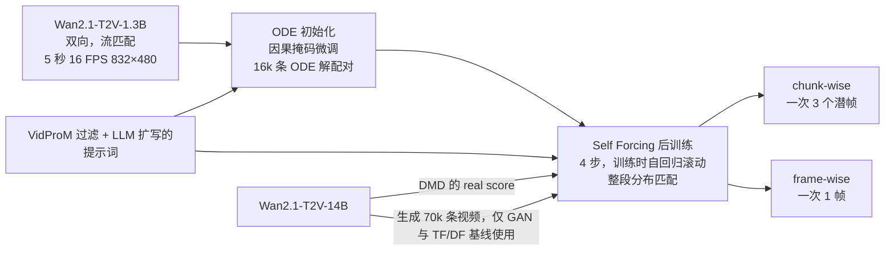

# Self-Forcing：训练时就让模型踩着自己生成的帧往下走

<!-- release-date: 2025-06-09 -->

> 本文依据 Adobe Research 与 UT Austin 的 **Self Forcing: Bridging the Train-Test Gap in Autoregressive Video Diffusion**，arXiv:2506.08009v2，2025-11-10，NeurIPS 2025 spotlight，共 19 页。页码均指 PDF 自身页码。文中始终区分三件事：**报告写了什么**、**我们如何解释**、**哪些是外部补充或本文推算**。

## 读前先把几个词说成人话

这篇论文要补的是一条很老的缝：自回归模型训练时看到的「过去」，和推理时看到的「过去」不是同一种东西。先把后文反复出现的词说清楚：

- **双向视频扩散**：一次把整段视频的所有帧一起去噪，未来可以影响过去。必须整段生成完才能看，没法用在「下一帧还没发生」的直播、游戏里（PDF p. 1）。
- **自回归（autoregressive，AR）视频扩散**：按链式法则把整段视频拆成「给定过去，生成下一帧」，每一帧内部仍用扩散去噪（PDF p. 3）。实践里常一次生成一小块帧（chunk），记号上仍叫「帧」。
- **KV cache（键值缓存）**：把历史帧在注意力里算过的 Key 和 Value 存下来，生成下一帧时不必重算。通常只在推理时用；这篇的特别之处是训练时也用（PDF p. 4）。
- **Teacher Forcing（TF，教师强制）**：训练时给模型的过去是干净的真值帧，模型只负责去噪当前帧，也叫下一帧预测（PDF p. 1–2）。
- **Diffusion Forcing（DF，扩散强制）**：训练时每帧独立采样噪声水平，模型在「过去带着各种噪声」的条件下去噪当前帧（PDF p. 2）。
- **曝光偏差（exposure bias）**：只在真值上下文上训练，推理时却依赖自己不完美的预测，分布错位随生成进程放大（PDF p. 2）。
- **分布匹配**：不逐帧比对答案，而是要求模型生成的样本整体上和真实数据分布一致。本文用了三种：DMD（Distribution Matching Distillation，分布匹配蒸馏）、SiD（Score identity Distillation，分数恒等蒸馏）和 GAN（生成对抗网络）（PDF p. 5–6）。

## 一句话先说清

TF 和 DF 都拿「真值，或者加了噪声的真值」当过去，再对每一帧各算各的去噪损失。这样训出来的输出，并不来自模型推理时真正会采样的那个分布（PDF p. 2，Figure 1）。推理时模型只能接着自己刚画出来、已经带错的帧往下画，误差就会越滚越大。

Self Forcing 的做法很直接：**训练时就按推理的配方做自回归滚动（self-rollout），每一帧都以自己之前生成的帧为条件，训练里也用 KV cache**；有了真正来自模型分布的整段视频，就可以在整段视频上打分布匹配损失（PDF p. 1–2）。

三个面板里，网络、输出、去噪的帧都一样，唯一不同的是最下面一行「当前帧的条件」从哪来。等式那一行是整篇论文的核心判断：只有 (c) 的乘积等于模型真正的联合分布。

为了训得起，它用 4 步的少步扩散，外加随机梯度截断；为了外推长视频，它用 rolling KV cache（PDF p. 1、p. 4–6）。结果是在单张 H100 上，chunk-wise 版本 17.0 FPS、首帧延迟 0.69 秒，VBench 总分 84.31，与慢得多的双向基座 Wan2.1-1.3B（84.26、延迟 103 秒）同档，并明显高于同速度的 CausVid（81.20）（PDF p. 8，Table 1）。

> 损失再漂亮，也得对齐模型推理时真正会走的那条轨迹。为了并行准备的真值上下文，推理时一次都不会出现。

### 一条阅读路线

1. **p. 2 Figure 1**：三种范式与那组等式。
2. **p. 3 相关工作**：GAN 为什么天然没有曝光偏差，CausVid 为什么「匹配了错的分布」。
3. **p. 4–5 §3.2、Algorithm 1**：训练时的自回归滚动与梯度截断。
4. **p. 5–6 §3.3**：整段视频的分布匹配，对比 TF/DF 的逐帧 KL。
5. **p. 6–7 §3.4、Figure 3**：rolling KV cache 与第一帧潜变量的坑。
6. **p. 8 Table 1、p. 9 Table 2、p. 10 Figure 6**：主结果、消融、训练效率。
7. **附录 A（p. 16–17）**：噪声日程、提示词处理、三种损失的公式与超参。

## 主要矛盾：因果掩码只保证看不见未来，不保证看到的过去是自己的

### TF 与 DF：训练时的过去都来自数据

序列建模里用了几十年的省事办法是教师强制：训练时把上一时刻的真值递给模型。放到视频扩散里，就是用干净的真值帧当上下文去噪当前帧（PDF p. 1–2）。它的问题是推理时没人递真帧。

DF 给每帧独立采样噪声，保证了推理时「上下文干净、当前帧带噪」这一格也在训练分布里（PDF p. 2）。它覆盖得更广，但覆盖的仍是加噪之后的真值，不是模型自己滚出来的上下文。报告的判断是：两者都会在自回归生成中出现误差累积，视频质量随时间下降，这就是曝光偏差（PDF p. 2）。

有些工作在推理时也往上下文里掺噪声，想把错误盖住。报告认为这样做牺牲时间一致性、让 KV cache 设计变复杂、增加延迟，而且没有从根上解决曝光偏差（PDF p. 2）。

### 两个旁证：GAN 与 Rolling Diffusion

- **GAN**：生成器训练和推理走的是同一个过程，所以天然没有曝光偏差。Self Forcing 借的正是这个原则：直接优化生成器输出分布与目标分布的对齐（PDF p. 3）。
- **Rolling Diffusion 一类**：噪声水平从早到晚递增，能顺序生成长视频，有时也被叫作自回归。报告划清了界限：它们不严格遵守链式法则分解，未来帧在当前帧交给用户之前已部分生成，用户此刻注入的控制影响不到紧接着的几帧，交互时响应受限（PDF p. 3）。

### CausVid：同一个 DMD，匹配的不是推理分布

最接近的前作是 CausVid：少步自回归扩散，DF 训练，再用 DMD 做分布匹配。报告指出它的关键缺陷：训练时的输出由 DF 生成，不来自推理时模型会产生的分布，所以 DMD 损失匹配的是错的分布（PDF p. 3）；§3.3 又说这种偏离会显著削弱 DMD 的效果（PDF p. 6）。

于是矛盾变成：

> 想让损失对齐推理，就得在训练里真的按推理去滚，而这意味着放弃 Transformer 最赖以为生的整段并行训练。能不能滚得起？

## 先看全景：Wan2.1-1.3B 的后训练，不是从零训基座

这张图按 §4 Implementation 与附录 A、Table 3（PDF p. 7、p. 16–17）重画，只表示阶段顺序和各种权重、数据从哪来。

三件事先看清（PDF p. 7）：

- **起点是双向基座**：先按 CausVid 的初始化协议，用因果注意力掩码在基座采出的 16k 条 ODE 解配对上微调，再跑 Self Forcing。
- **DMD 与 SiD 版本不需要任何视频训练数据**，只要提示词，就能把预训练视频扩散改成自回归模型。GAN 版本需要真实分布的样本，用 14B 基座生成了 70k 条视频充当；多步 TF/DF 基线也在这批视频上微调。
- **4 步扩散**，两个粒度：chunk-wise 一次生成 3 个潜帧，frame-wise 一次 1 帧。

## 核心设计一：训练时按推理做自回归滚动，训练里也用 KV cache

### 旧问题：并行训练靠掩码假装因果

TF 和 DF 都在整段视频上并行训练，用自定义注意力掩码维持因果（PDF p. 4，Figure 2）。TF 的高效实现把干净帧和带噪帧拼成一条序列，用块稀疏掩码让第 $i$ 个带噪帧只看它之前的干净帧（PDF p. 4）。并行很划算，代价是训练中模型几乎从没遇到过「自己上一帧画错了、这一帧还得接着画」的状态。

### 新设计：从模型的联合分布里采样整段视频

Self Forcing 在训练时直接采样

$$
x_{\theta}^{1:N}\sim p_{\theta}(x^{1:N})=\prod_{i=1}^{N}p_{\theta}(x^{i}\mid x^{<i})
$$

每一帧 $x^{i}$ 都以自己生成的内容为条件做迭代去噪：过去是自己生成的干净帧，当前是这一步的带噪帧（PDF p. 4）。历史以 KV cache 的形式接进来，不再需要特殊的注意力掩码（PDF p. 4，Figure 2(c)）。

一帧的生成是少步扩散的复合。设 $\{t_0=0,t_1,\ldots,t_T=1000\}$ 是完整时间步的一个子序列。每一步先把当前带噪帧去噪成干净估计，再用前向过程 $\Psi$ 注入更低水平的噪声，作为下一步输入（PDF p. 4–5）：

$$
f_{\theta,t_j}(x^{i}_{t_j})=\Psi\bigl(G_{\theta}(x^{i}_{t_j},t_j,x^{<i}),\ \epsilon_{t_{j-1}},\ t_{j-1}\bigr)
$$

$G_{\theta}$ 是给定带噪帧、时间步和上下文，输出干净帧估计的网络。一帧的模型分布就是把 $T$ 步串起来，从纯噪声 $x^{i}_{t_T}\sim\mathcal{N}(0,I)$ 出发：

$$
p_{\theta}(x^{i}\mid x^{<i})=f_{\theta,t_1}\circ f_{\theta,t_2}\circ\cdots\circ f_{\theta,t_T}(x^{i}_{t_T})
$$

### 收益

模型在训练里就撞上自己的错，而且被整段视频层面的损失要求「滚完之后仍像真视频」。报告的原话是，这迫使模型从自己的缺陷里学习，对误差累积更鲁棒（PDF p. 6）。消融里最直接的证据是：把粒度从 chunk-wise 换成 frame-wise、自回归展开次数变多之后，TF/DF 基线明显掉分，Self Forcing 几乎不掉（PDF p. 9，Table 2，见后文）。

### 代价与边界

顺序滚动放弃了整段并行。报告的回应是把它放在后训练：这一阶段不需要大量梯度更新就能收敛（PDF p. 2）。它没有声称可以用这种方式从零预训练自回归视频模型。

### 可迁移启发

**凡是「训练用标准上下文、推理用自己输出」的系统都有这条缝。** 能在训练里把推理时的上下文分布采样出来，就不要用一个更干净、但推理时不存在的条件去代替。报告自己把灵感追溯到 RNN 时代的 Professor Forcing、序列级训练和 SeqGAN（PDF p. 2）。

## 核心设计二：把监督从「每一帧」抬到「整段视频」

### 旧问题：逐帧 KL 默认过去是对的

TF/DF 的标准目标是逐帧去噪 MSE。每帧先按前向过程加噪 $x^{i}_{t^{i}}=\alpha_{t^{i}}x^{i}+\sigma_{t^{i}}\epsilon^{i}$，网络预测所加的噪声 $\hat\epsilon^{i}_{\theta}=G_{\theta}(x^{i}_{t^{i}},t^{i},c)$（PDF p. 4）：

$$
\mathcal{L}^{\mathrm{DM}}_{\theta}=\mathbb{E}_{x^{i},t^{i},\epsilon^{i}}\Bigl[w_{t^{i}}\bigl\lVert\hat\epsilon^{i}_{\theta}-\epsilon^{i}\bigr\rVert_2^2\Bigr]
$$

上下文 $c$ 在 TF 里是干净真值 $x^{<i}$，在 DF 里是各帧不同噪声水平的真值；时间步在 TF 里通常各帧共享，在 DF 里各帧独立采样（PDF p. 4）。

报告脚注说，在特定的噪声加权下，去噪损失近似最大似然，等价于最小化每一帧数据分布与模型分布之间的 KL（PDF p. 6）。所以 TF/DF 做的其实是逐帧分布匹配：

$$
\mathbb{E}_{x^{<i}\sim p_{\mathrm{data}}}\ D_{\mathrm{KL}}\bigl(p_{\mathrm{data}}(x^{i}\mid x^{<i})\,\big\|\,p_{\theta}(x^{i}\mid x^{<i})\bigr)
$$

DF 只是把期望里的上下文换成加噪后的数据分布（PDF p. 6）。

**我们如何解释它。** 这一项的期望是在真实历史上取的。每一帧都在真实历史上学对了，并不保证模型自己滚出来的整段不崩，因为推理时的历史根本不在这个期望的覆盖范围里。

### 新设计：整段视频的分布匹配

自回归滚动直接从推理时的 $p_{\theta}(x^{1:N})$ 采样，于是可以让生成视频的整体分布对齐真实视频 $p_{\mathrm{data}}(x^{1:N})$（PDF p. 5）。为了借用预训练扩散模型并提高稳定性，两边都先按前向扩散加噪再匹配，即匹配 $p_{\theta,t}$ 与 $p_{\mathrm{data},t}$（PDF p. 5）。三种可选工具：

| 目标 | 它在最小化什么 | 在本文里的角色 |
|---|---|---|
| DMD | 反向 KL 的期望 $\mathbb{E}_t[D_{\mathrm{KL}}(p_{\theta,t}\,\Vert\,p_{\mathrm{data},t})]$，用两个分数函数之差给梯度 | 主结果、用户研究都用它 |
| SiD | Fisher 散度 $\mathbb{E}_{t,p_{\theta,t}}\lVert\nabla\log p_{\theta,t}-\nabla\log p_{\mathrm{data},t}\rVert^2$ | 消融中的一档 |
| GAN | 用判别器近似 Jensen–Shannon 散度，生成器就是这个自回归扩散模型 | 消融中的一档，需要样本视频 |

（PDF p. 5–6。）

关键不在工具，而在上下文从哪采样：Self Forcing 的 $x^{<i}$ 来自 $p_{\theta}$，而不是 $p_{\mathrm{data}}$（干净或加噪）。报告说这「从根本上改变了训练动态」（PDF p. 6）。

报告还专门划了一条动机上的界线：这三种目标常被用来做扩散的时间步蒸馏，但这里的首要目的是用分布匹配治曝光偏差，而不只是加速采样。所以只压缩时间步、不直接对齐生成器输出分布的蒸馏方法（如一致性模型）在这个框架里用不上（PDF p. 6）。

### 工作机制：三种损失各自怎么算

**DMD。** 反向 KL 的梯度可以写成两个分数函数之差（PDF p. 16，式（2））：

$$
\nabla_{\theta}\,\mathbb{E}_t\bigl[D_{\mathrm{KL}}(p_{\theta,t}\,\Vert\,p_{\mathrm{data},t})\bigr]=-\mathbb{E}\Bigl[\bigl(s_{\mathrm{real}}(\hat x_t,t)-s_{\mathrm{fake}}(\hat x_t,t)\bigr)\frac{\partial\hat x}{\partial\theta}\Bigr]
$$

$\hat x$ 是生成器滚出来的视频，$\hat x_t$ 是它加噪后的版本。$s_{\mathrm{real}}$ 由一个预训练扩散模型 $f_{\phi}$ 近似（real score 网络），$s_{\mathrm{fake}}$ 由一个用普通扩散损失在线训练的 critic 网络 $f_{\psi}$ 学出来。实现上等价成一个回归损失（PDF p. 17，式（3））：

$$
\mathcal{L}_{\mathrm{DMD}}(\theta)=\mathbb{E}\ \tfrac12\Bigl\lVert\hat x-\operatorname{sg}\bigl[\hat x-(f_{\psi}(\hat x_t,t)-f_{\phi}(\hat x_t,t))\bigr]\Bigr\rVert^2
$$

$\operatorname{sg}$ 是停梯度。人话：两个评分员在带噪视频上各自给出「往哪走更像数据」的方向，它们的差就是生成器该挪的方向。DMD 的 real score 用更大的 Wan2.1-T2V-14B，CFG 权重 3.0（PDF p. 17，Table 3）。

**SiD。** 损失是（PDF p. 17，式（4））：

$$
\mathcal{L}_{\mathrm{SiD}}(\theta)=\mathbb{E}\Bigl[(f_{\phi}-f_{\psi})^{\top}(f_{\psi}-\hat x)+(1-\alpha)\lVert f_{\phi}-f_{\psi}\rVert^2\Bigr]
$$

$\alpha=0.5$ 对应 Fisher 散度的梯度；第二项常让训练不稳，所以跟 SiD 原文一样取 $\alpha=1$（PDF p. 17）。SiD 的 real score 只用 1.3B（PDF p. 17，Table 3）。

**GAN。** 在初始化好的 critic 上加交叉注意力层和分类头；用相对论损失，R1、R2 正则按 Seaweed-APT 的做法用有限差分近似：给带噪的真、假视频再加一点小高斯噪声，要求判别器输出别变（PDF p. 17，式（5）–（7））。$\lambda=30$、$\sigma=0.05$。若生成视频来自第 $s$ 个去噪步，判别器的噪声水平 $t$ 只从 $[t_{s-1},t_s]$ 里采，这样训练更稳；batch 用到 768（PDF p. 17）。

### 收益与代价

消融（后文 Table 2）显示三种目标都成立，而且都优于 TF/DF 及其加 DMD 的变体（PDF p. 9）。同一套自回归滚动换哪种匹配工具都有效，说明起作用的是「样本来自推理分布」，不是某一个散度。

代价：DMD 要一个 14B 的 real score 网络参与训练；GAN 不是 data-free，需要 70k 条 14B 生成的视频（PDF p. 7、p. 17）。反向 KL 通常被认为偏向 mode-seeking，报告没有给多样性指标，无从判断这一点在这里的影响（这是我们标出的缺口）。

### 可迁移启发

**先问样本是不是推理时会遇到的状态，再问损失叫什么名字。** 同一个 DMD，CausVid 用 DF 的输出，Self Forcing 用自回归滚动的输出，在同一实现框架下总分差了 1.55（82.76 对 84.31，PDF p. 9）。误差会沿链累积时，把损失从「每一步」抬到「整条轨迹」，比给每一步的局部损失再加权更对症。

## 核心设计三：少步扩散加随机梯度截断，让顺序滚动训得起

### 旧问题：整条链可微，显存放不下

在标准多步扩散上做 Self Forcing「在计算上不可行」，因为要沿很长的去噪链展开并反传（PDF p. 4）。即使换成少步模型，朴素地对整个自回归扩散过程反传，显存仍然过高（PDF p. 5）。

### 新设计：前向走满，反向只开一扇门

三刀（PDF p. 4–5，Algorithm 1）：

1. **骨干换成少步扩散**，均匀 4 步 $[t_4,t_3,t_2,t_1]=[1000,750,500,250]$（PDF p. 16）。
2. **每帧只对一个去噪步开梯度**。每个训练样本先抽 $s\sim\mathrm{Uniform}\{1,\ldots,T\}$，前面的步关梯度跑完，第 $s$ 步打开梯度，并把它的去噪结果当作这一帧的最终输出。随机抽 $s$ 是为了让所有中间去噪步都能收到监督。
3. **切断历史帧的梯度**：限制梯度流入 KV cache 的嵌入，当前帧的梯度不穿过之前帧的生成过程。

图里最容易漏的细节是黄格：第 $s$ 步得到干净帧 $\hat x^{i}_0$ 之后，要再调一次网络，用**干净输出、时间步 0** 计算要缓存的 KV（PDF p. 5，Algorithm 1 第 13 行）。推理的 Algorithm 2 也是走完最后一步才这样写 KV（PDF p. 5）。所以训练与推理不只是「都用 KV」，连缓存里存的是哪一种表示都对齐了。

### 收益：顺序滚动并不比并行慢

这是整篇最反直觉的实验。报告的结论是：Self Forcing 的每次迭代耗时与 TF、DF 相当；在同样的墙钟预算下质量更高；DMD 版在 64 张 H100 上约 1.5 小时收敛（PDF p. 9）。附录补充 SiD 与 GAN 版需要 2–3 小时（PDF p. 16）。

报告给了两个原因（PDF p. 9）：

1. 顺序只发生在帧与帧之间，一帧（或一块）内部的所有 token 仍然并行，GPU 利用率不低。
2. TF/DF 需要专门的注意力掩码来维持因果，即使用 FlexAttention 也有额外开销；Self Forcing 训练时始终用完整注意力，可以直接用高度优化的 FlashAttention-3。附录 A 确认基线的注意力基于 FlexAttention、Self Forcing 基于 FlashAttention-3（PDF p. 16）。

**我们如何解释它。** 「完整注意力」之所以成立，是因为 KV cache 已经按时间顺序长好：当前帧对缓存做完整注意力就自然是因果的，掩码的工作被数据结构做掉了。

### 代价与边界

- 讨论一节承认：梯度截断对显存是必需的，但可能限制模型学习长程依赖（PDF p. 10）。
- 4 步是能力上限的一部分。报告没有做「Self Forcing 从 4 步改到更多步」的质量消融，也没有「不截断 KV 梯度」的对照，截断的质量代价无法量化。

### 可迁移启发

**要把推理轨迹放进训练，不必让整条链可微。** 前向照推理走满，状态分布就是对的；反向只开真正要学的那几步，并随机轮换，比固定只训最后一步更公平。缓存要不要回传梯度是一个独立旋钮：切断就是截断的沿时间反传，省显存，但要明说付出了长程依赖。

## 核心设计四：rolling KV cache，外推时不再重算

### 旧问题：滑窗外推的开销落在重算上

自回归模型的一大优势是原则上可以滑窗生成任意长的视频（PDF p. 6）。但两类旧做法都很贵：用 DF 训练的双向模型不支持 KV cache，每来一帧都要重算整个窗口的注意力；已有的因果模型在窗口移动时要重算重叠帧的 KV。后者为了省算力往往加大步长、减少重叠，窗口开头那一帧能看的历史就变短，时间一致性变差（PDF p. 6）。

### 新设计：固定长度的 KV 队列

维护一个只存最近 $L$ 帧 KV 的缓存；生成新帧前若已满，先移除最老的一条再追加，从不重算（PDF p. 6，Algorithm 2）。报告说灵感来自语言模型的相关研究，引用的是 attention sink 那篇流式语言模型工作（PDF p. 6）。

### 工作机制：真正的坑在第一帧

朴素实现会出现严重的闪烁（PDF p. 6）。原因是因果 3D VAE 的第一个潜帧统计与其他帧不同：它只编码第一张图，不做时间压缩。训练时模型总能在上下文里看到这个「图像潜帧」，外推时它一旦滑出缓存，模型就泛化失败。

修法很简单：训练时限制注意力窗口，让模型去噪最后一块时看不到第一块，模拟长视频生成时的真实情况（PDF p. 6；附录 B，p. 17）。

（引自 PDF p. 18，Figure 7。每组上行是朴素 rolling，下行是本文做法；左列是起始帧，右列是外推帧。）

### 收益与边界

生成 10 秒视频时，窗口移动就重算 KV 的吞吐只有 4.6 FPS；按上述方式训练的 rolling KV cache 保持 16.1 FPS，同时压住了朴素做法的伪影（PDF p. 9）。16.1 是 10 秒外推这一设定下的数，和 Table 1 里 5 秒视频的 17.0 FPS 不是同一个测量。

外推质量只有 Figure 7 的定性图，没有长视频的定量评测。讨论一节也把话说死了：误差累积在训练上下文长度之内被缓解；生成明显长于训练所见的视频时，质量下降仍然可见（PDF p. 10）。

### 可迁移启发

**缓存淘汰规则是模型语义的一部分。** 任何带特殊起始状态的序列模型（BOS、首帧、关键帧），做滑动窗口前都要问：滑出去的那一个，是不是训练时默认永远在场的那一个。是的话，训练里就要故意把它藏起来。

## 实现与 recipe

**噪声日程与参数化**（PDF p. 16）。沿用 Wan2.1 的流匹配，时间步先做 shift：

$$
t'(k,t)=\frac{k\,t/1000}{1+(k-1)\,t/1000}\cdot1000,\qquad k=5
$$

数据预测模型的预条件系数与基座相同：$c_{\mathrm{skip}}=c_{\mathrm{in}}=c_{\mathrm{out}}=1$，$c_{\mathrm{noise}}(t)=t$。少步日程是上面那个均匀 4 步。

前向过程原文印作 $x_t=\frac{t'}{1000}x+\frac{1-t'}{1000}\epsilon$，$t\in[0,1000]$。**我们如何解释它**：按字面，$t'=1000$ 时得到的是干净样本、噪声系数也不是 $1-t'/1000$，与 Algorithm 1 从 $t_T=1000$ 的纯噪声出发对不上。按流匹配的惯例应读作 $x_t=\bigl(1-\frac{t'}{1000}\bigr)x+\frac{t'}{1000}\epsilon$，即 $t$ 越大噪声越多；原式应是符号笔误。

**提示词**（PDF p. 16）。起点是 VidProM 的 VidProS 子集，约 100 万条语义不重复的用户提示；去掉少于 20 个字符的、带命令行参数（如 `--ar 16:9`）的、任一 NSFW 类别概率大于 0.01 的，剩约 25 万条；再用 Qwen2.5-7B-Instruct 按 Wan2.1 开源实现里的英文系统提示扩写。VBench 的测试提示同样改写；Wan2.1 基座的 VBench 结果也是改写后的，基线只要支持改写就按改写报。所以 Table 1 不是原始短提示上的分数。

**训练配置**（PDF p. 16–17）。多数训练用 64 张 80GB GPU、每卡 batch 1，需要更大有效 batch 时做梯度累积；real score 与 critic 都用基座预训练权重初始化。

| 超参 | DMD | SiD | GAN |
|---|---|---|---|
| real score 网络 | Wan2.1-T2V-14B | Wan2.1-T2V-1.3B | 无 |
| real score CFG | 3.0 | 3.0 | 无 |
| critic 初始化 | Wan2.1-T2V-1.3B | Wan2.1-T2V-1.3B | Wan2.1-T2V-1.3B |
| batch | 64 | 64 | 768 |
| 优化器（生成器与 critic 相同） | AdamW，$\beta_1=0$，$\beta_2=0.999$，权重衰减 0.01 | Adam，$\beta_1=0$，$\beta_2=0.999$，权重衰减 0 | AdamW，$\beta_1=0$，$\beta_2=0.999$，权重衰减 0.01 |
| 生成器学习率 | $2\times10^{-6}$ | $2\times10^{-6}$ | $2\times10^{-6}$ |
| critic 学习率 | $4\times10^{-7}$ | $2\times10^{-6}$ | $2\times10^{-6}$ |
| 生成器 / critic 更新比 | 5 | 5 | 1 |
| EMA 衰减 | 0.99 | 0.99 | 0.99 |

（PDF p. 17，Table 3；优化器的 $\epsilon=10^{-8}$ 三列相同，表中省略。）

能直接带走的是「后训练、少步、截断、整段损失」这个形状；1.3B、4 步、64 卡 1.5 小时是绑在一起的一组实例，不是普适报价。

## 实验：追上慢模型的质量，把延迟从两分钟压到一秒以内

### 报告怎么定义「实时」

有些工作只拿吞吐宣称实时。报告不同意：真正的实时要同时满足吞吐高于播放帧率、延迟低于感知阈值（阈值因应用而异），所以同时报吞吐和首帧延迟，速度全部在单张 H100 上测（PDF p. 7）。

### 主表

| 模型 | 参数 | 分辨率 | 吞吐（FPS） | 延迟（秒） | Total | Quality | Semantic |
|---|---:|---|---:|---:|---:|---:|---:|
| LTX-Video（扩散） | 1.9B | $768\times512$ | 8.98 | 13.5 | 80.00 | 82.30 | 70.79 |
| Wan2.1（扩散） | 1.3B | $832\times480$ | 0.78 | 103 | 84.26 | 85.30 | 80.09 |
| SkyReels-V2（chunk AR） | 1.3B | $960\times540$ | 0.49 | 112 | 82.67 | 84.70 | 74.53 |
| MAGI-1（chunk AR） | 4.5B | $832\times480$ | 0.19 | 282 | 79.18 | 82.04 | 67.74 |
| CausVid（chunk AR） | 1.3B | $832\times480$ | 17.0 | 0.69 | 81.20 | 84.05 | 69.80 |
| **Self Forcing（chunk-wise）** | 1.3B | $832\times480$ | 17.0 | 0.69 | 84.31 | 85.07 | 81.28 |
| NOVA（AR） | 0.6B | $768\times480$ | 0.88 | 4.1 | 80.12 | 80.39 | 79.05 |
| Pyramid Flow（AR） | 2B | $640\times384$ | 6.7 | 2.5 | 81.72 | 84.74 | 69.62 |
| **Self Forcing（frame-wise）** | 1.3B | $832\times480$ | 8.9 | 0.45 | 84.26 | 85.25 | 80.30 |

（PDF p. 8，Table 1。CausVid 用的是官方实现，同样基于 Wan-1.3B；AR 与非 AR 的区分指时间维。）

读表要分开的几件事：

- **总分**：chunk-wise 的 84.31 是全表最高，比 Wan2.1 高 0.05，是「同一档」。摘要写「matching or even surpassing」，分寸与表一致（PDF p. 1）。
- **画质分**：Quality 最高的是 Wan2.1 的 85.30，两个 Self Forcing 版本略低。正文说视觉质量略好于 Wan2.1 与 SkyReels-V2，依据是 Figure 5 的定性对比（PDF p. 8），和 Quality 这一列不是一回事。
- **语义分**：和 CausVid 真正拉开的地方，81.28 对 69.80。两者速度、延迟、参数完全相同，差别只在训练时匹配的分布。
- **延迟**：报告写相对 Wan2.1 和 SkyReels-V2 快约 150 倍（PDF p. 8）。按表验算，$103/0.69\approx149$、$112/0.69\approx162$。
- **frame-wise**：延迟全表最低（0.45 秒），报告把它定位给延迟最敏感的实时应用（PDF p. 7）。**我们读表补一句**：它的 8.9 FPS 低于基座的 16 FPS 播放帧率，按报告自己的实时定义，吞吐这一条并不满足；报告没有把这一点写成限制。
- **分辨率不完全对齐**：SkyReels-V2、LTX、Pyramid Flow 的分辨率各不相同，报告的限定是「参数量与分辨率相近的开源模型」（PDF p. 8）。

### 人更喜欢哪一段

用户研究对比 chunk-wise Self Forcing（DMD）与四个基线（PDF p. 7，Figure 4）：

| 对照 | 选 Self Forcing | 选对方 |
|---|---:|---:|
| CausVid | 66.1% | 33.9% |
| Wan2.1 | 62.7% | 37.3% |
| SkyReels-V2 | 57.9% | 42.1% |
| MAGI-1 | 54.2% | 45.8% |

四场都赢，包括它的初始化来源、多步的 Wan2.1。协议在附录 E（PDF p. 19）：两段同提示视频并排，选综合质量与提示对齐更好的一段；用 MovieGenBench 全部 1003 条提示，每条只由一名用户评判。没有平局选项，也没有报告评分者间一致性；对 MAGI-1 的 54.2% 是薄胜。

### 定性：误差累积长什么样

（引自 PDF p. 8，Figure 5。四个模型架构相同，都是 1.3B。）

报告点名的现象是：CausVid 受误差累积影响，饱和度随时间上升（PDF p. 8）。这正是曝光偏差的可见形状：颜色统计往一个方向漂，后面的帧又在漂过的画面上继续生成。

### 消融：换损失仍成立，换回 TF/DF 就不成立

| 训练方式 | chunk Total | chunk Quality | chunk Semantic | frame Total | frame Quality | frame Semantic |
|---|---:|---:|---:|---:|---:|---:|
| DF，多步 | 82.95 | 83.66 | 80.09 | 77.24 | 79.72 | 67.33 |
| TF，多步 | 83.58 | 84.34 | 80.52 | 80.34 | 81.34 | 76.34 |
| DF + DMD | 82.76 | 83.49 | 79.85 | 80.56 | 81.02 | 78.71 |
| TF + DMD | 82.32 | 82.73 | 80.67 | 78.12 | 79.62 | 72.11 |
| Self Forcing（DMD） | 84.31 | 85.07 | 81.28 | 84.26 | 85.25 | 80.30 |
| Self Forcing（SiD） | 84.07 | 85.52 | 78.24 | 83.54 | 84.71 | 78.86 |
| Self Forcing（GAN） | 83.88 | 85.06 | 79.16 | 83.27 | 84.57 | 78.08 |

（PDF p. 9，Table 2。多步基线是 50×2 步，即 50 个去噪步、CFG 再乘 2；少步是 4 步。DF + DMD 就是在本文框架里复现 CausVid。）

三件事：

1. **三种目标都成立。** 两种粒度下，Self Forcing 的三个版本都高于所有 TF/DF 变体（PDF p. 9）。SiD 的 Quality 在 chunk-wise 里最高（85.52），Semantic 却明显低于 DMD；主结果用 DMD，是因为它总分和语义最好。
2. **粒度一变细，基线就垮。** 从 chunk-wise 到 frame-wise，多步 TF 从 83.58 掉到 80.34，多步 DF 从 82.95 掉到 77.24，Self Forcing（DMD）只从 84.31 到 84.26。报告的解释：逐帧时自回归展开次数更多，误差累积更狠，通常表现为逐渐过饱和或过锐化；Self Forcing 在两种粒度上保持一致，说明它确实在处理曝光偏差（PDF p. 9）。
3. **把 DMD 接到 TF/DF 上补不回这条缝。** chunk-wise 下 TF + DMD（82.32）与 DF + DMD（82.76）都低于多步 TF（83.58）。frame-wise 下 DF + DMD（80.56）略高于多步 TF，但仍比 Self Forcing 低 3.7 分。这是相关工作一节对 CausVid 批评的定量版。

**我们如何解释 SiD 的语义分。** SiD 的 real score 只用 1.3B，DMD 用 14B（PDF p. 17），语义分的差距可能与此有关；但损失形式也不同，报告没有做「同一个 real score 下比较 DMD 与 SiD」的对照，这只是猜测。

## 讨论：作者想推广的不是 4 步或 17 FPS

§5 把结论往上抽了一层（PDF p. 10）。

**并行训练的第二个盲区。** 并行训练是 Transformer 能规模化的关键，但并行也有代价：前人（Merrill 与 Sabharwal）指出并行架构在顺序状态跟踪上表达力受限；本文指出另一条，并行训练造成训练与推理分布错位，误差随时间累积。作者主张「并行预训练 + 序列后训练」的新范式，并说语言模型已经在用强化学习走这条路（引 DeepSeek-R1），本文是视频域朝这个方向的第一步，框架也可用于其他序列、尤其是连续数据（PDF p. 10）。「第一步」是作者的定位，不是实验结论。

**AR、扩散与 GAN 的互补。** 自回归按链式法则分解，扩散按潜变量分解，两者可以嵌套；GAN 的核心思想「从隐式生成器采样，再把它的分布对齐到目标分布」可以用来训练这个嵌套的生成器（PDF p. 10）。本文的三种损失就是这段话的三个实例。

**限制与方向。** 训练长度之内的误差累积被缓解，明显超出训练长度仍会退化；梯度截断可能伤害长程依赖。未来可以做更好的外推，或用状态空间模型这类天生循环、更省内存的结构（PDF p. 10）。

附录 D 还写了社会影响：实时视频生成拿掉了「算力贵」这道现实门槛，深度伪造更容易传播；作者承认技术的两用性，呼吁继续研究检测、水印与治理框架（PDF p. 18–19）。附录 C 用 16 维 VBench 雷达图补充：Self Forcing 在语义类维度（场景、物体类别、多物体、人物动作）普遍更好；frame-wise 版本动态程度更高，但背景一致性、运动平滑与闪烁更差（PDF p. 18，Figure 8）。雷达图没有印逐维数字。

## 报告没有写的部分

- **架构与数据**：Wan2.1-1.3B 的层数、VAE 压缩比、5 秒对应多少潜帧都没有写；ODE 初始化除了「16k 条、因果掩码、沿用 CausVid」之外没有独立超参。
- **训练**：没有迭代数与学习率日程曲线；Figure 6 的柱高与折点没有印数字；没有多样性、FVD 或运动幅度的单独评测；没有「更多去噪步」或「不截断 KV 梯度」的对照。
- **评测**：速度只在单张 H100 上测；用户研究每条提示一名评者；外推只有定性图，没有长视频 VBench。

## 可迁移启发

1. **对齐推理时真正会走到的状态，而不是训练时方便并行的状态。** 动手前可以先写出 Figure 1 那组等式：训练时的条件乘起来，等不等于推理时的联合分布。
2. **误差沿链累积时，把损失从一步抬到一条轨迹。** 规划、长对话、多步工具调用都有同构问题。
3. **前向按推理展开，反向可以截断。** 随机抽一步当终点、切断缓存梯度，能让顺序滚动的每步耗时回到并行掩码同一档。
4. **缓存里存的表示，必须是推理时会写进去的那种。** 本文缓存的是时间步 0 的干净帧；rolling 时还要在训练里藏起特殊的第一帧。
5. **实时是吞吐和首帧延迟的合取。** 17 FPS 配 0.69 秒，与 0.78 FPS 配 103 秒不是同一类产品；只报吞吐的「实时」不作数。
6. **并行预训练、序列后训练，是一种可迁移的分工。** 大规模用并行把表示学出来，再用一段短的、按推理展开的后训练把训推缝合上。

## 关键词回看

- **曝光偏差**：训练条件在真值上下文，推理条件在自己的输出，误差沿时间放大。
- **Teacher Forcing / Diffusion Forcing**：过去用干净真值 / 过去用各帧独立加噪的真值。
- **Self Forcing**：训练时按推理做自回归滚动，条件是自己的输出，训练里也用 KV cache。
- **整段分布匹配**：对齐 $p_{\theta}(x^{1:N})$ 与 $p_{\mathrm{data}}(x^{1:N})$，而不是逐帧 KL；工具可以是 DMD、SiD 或 GAN。
- **随机梯度截断**：每个样本只对随机抽中的一个去噪步回传，并切断流入 KV cache 的梯度。
- **少步扩散**：均匀 4 步 $[1000,750,500,250]$，训练与推理相同。
- **chunk-wise / frame-wise**：一次 3 个潜帧 / 一次 1 帧；17.0 FPS、0.69 秒 / 8.9 FPS、0.45 秒。
- **rolling KV cache**：固定长度的 KV 队列，满则丢最老一条；训练时去噪最后一块不看第一块。
- **CausVid**：最近的前作，同样少步 AR 加 DMD，但匹配的是 DF 的输出分布。

## 资料与阅读边界

**原件与版本。** arXiv:2506.08009 最新版为 v2（2025-11-10），本文据此写作；v1 于 2025-06-09 提交。作者 Xun Huang、Zhengqi Li、Eli Shechtman 署 Adobe Research，Guande He、Mingyuan Zhou 署 UT Austin（PDF p. 1）。

**首发日。** `release-date` 取 2025-06-09。这项技术随论文一起放出了可下载的权重，按「权重与 arXiv v1 中较早的官方公开日」取值：Hugging Face 仓库 `gdhe17/Self-Forcing` 的权重文件（`ode_init.pt`、`self_forcing_dmd.pt` 等）于 2025-06-09 UTC 提交，官方代码仓 guandeh17/Self-Forcing 同日建立并有初始提交，arXiv v1 也在同日提交，三者落在同一天。

**外部补充，不是本报告内容。**

- 项目页 <https://self-forcing.github.io/> 放有更多样例视频，正文多处指向它。
- 官方代码 <https://github.com/guandeh17/Self-Forcing> 与权重 <https://huggingface.co/gdhe17/Self-Forcing> 在论文之后仍有更新（例如 2025-09 上传的 10 秒版本权重），那是后续发布，不回写本篇。
- 与本站相关篇目：CausVid 是本文最近的前作（参考文献 [100]）；GAN 版本的 R1、R2 近似沿用 AAPT 同组前作 APT（参考文献 [47]）；后续的 Causal-Forcing 一篇把本文当作基线，并指出本文 ODE 初始化阶段用双向教师的问题，那是它的判断，不回写本篇。

**报告没有公开、本文也不补的缺口**：训练迭代数、截断相对不截断的质量差、H100 以外的速度、长视频的定量外推分数、多样性指标、Figure 6 与 Figure 8 的原始数值。
