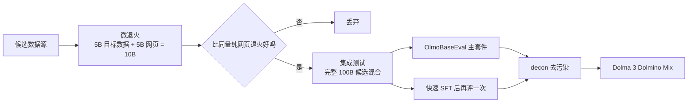
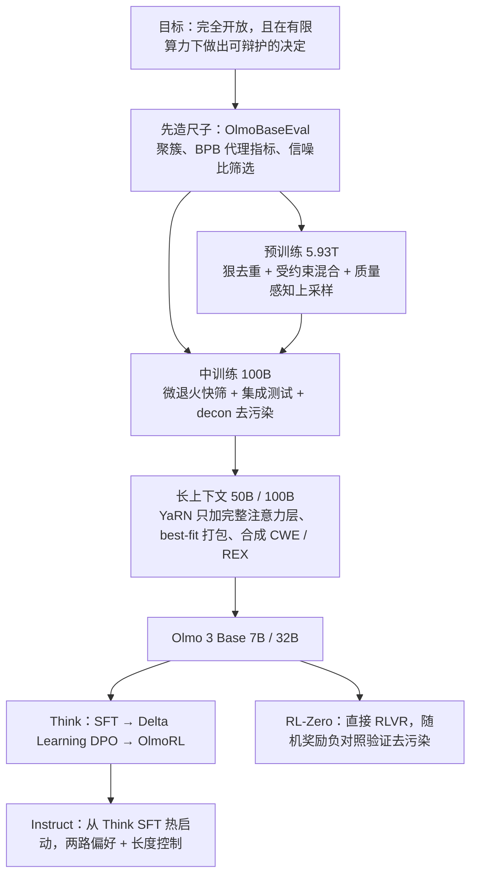

# Olmo 3：当交付物不是权重，而是整条模型流水线

<!-- release-date: 2025-11-20 -->

> 本文依据本地 `papers/Ai2/Olmo-3.pdf`，即 Allen Institute for AI（Ai2）的 **Olmo 3** 技术报告，arXiv:2512.13961v2，2026-04-14 提交的修订版，共 118 页。页码均指 PDF 自身的页码。文中会区分三件事：**报告明确写了什么**、**我们怎么解释它**、**哪些是外部资料或本文推算**。

## 阅读前先认识几个词

这份报告的技术密度不在架构，而在数据和流程。先把反复出现的词说成人话：

- **基座模型（Base Model）**：只学过「预测下一个词」、还不会对话格式的模型，是后面所有变体的共同起点。
- **预训练 / 中训练 / 后训练（Pretraining / Midtraining / Post-training）**：预训练在最大规模的通用语料上打底；中训练在预训练末尾换一批更高质量、更有针对性的数据再训一小段；后训练把基座变成会对话、会推理、会调工具的模型。
- **退火（Annealing）**：把学习率线性降到很低的一段训练。学习率下降时模型对数据格外敏感，所以这一段常用来「灌」高质量数据，也常用来低成本地测一份数据到底有没有用。
- **SFT / DPO / RLVR**：后训练的三级台阶。SFT（Supervised Fine-Tuning，监督微调）照着标准答案学；DPO（Direct Preference Optimization，直接偏好优化）给一对「好答案 / 坏答案」，让模型偏向好的那个；RLVR（Reinforcement Learning with Verifiable Rewards，可验证奖励的强化学习）让模型自己生成，再用程序判对错来更新。
- **去污染（Decontamination）**：把训练数据里混进来的评测题找出来删掉。不做这一步，分数可能只是背题。

报告自己造的四个名字，第一次读容易晕：

- **Dolma 3**：基座用的数据家族，包括预训练的 Dolma 3 Mix、中训练的 Dolma 3 Dolmino Mix、长上下文扩展的 Dolma 3 Longmino Mix。
- **Dolci**：后训练用的数据家族，按变体和阶段分成 Dolci Think SFT/DPO/RL、Dolci Instruct SFT/DPO/RL、Dolci RL-Zero。
- **OlmoBaseEval**：基座开发期专用的评测套件，用来在小模型上做数据决策。
- **OlmoRL**：他们的强化学习算法加基础设施。

## 一句话先说清

Olmo 3 的卖点不是某个新算子，而是交付边界变了：**它把整条「模型流」（model flow）交出来**。每个阶段、每个中间 checkpoint、每条数据、每份依赖都公开，而不只是最后那份权重（PDF p. 1、p. 3）。

这听起来像许可证声明，其实是一条很硬的工程约束。承诺公开全过程，就不能再用「我们内部试过很多」带过：每个决定都要有能复述的依据，而 Ai2 的算力又远少于前沿实验室。所以这 118 页真正的内容，是一套**在有限算力下做出可辩护决策的机制**：

- 一把能在小模型上就读出信号的尺子（OlmoBaseEval）；
- 一套把数据配比写成带约束最优化的方法（受约束混合 + 质量感知上采样）；
- 一套两层数据筛选（微退火做单源快筛，集成测试做组合验证）；
- 一个做成独立工具的去污染器（decon），再用「随机奖励」的负对照反证它有效；
- 一套让小实验室也跑得起长时间强化学习的 RL 栈（OlmoRL）。

架构反而刻意保守。这是取舍：把创新预算押在数据与流程上。

如果只记一句话：

> **当你被迫把每一步都摆出来，工程重心就会从「让结果更好」转向「让每个决定都有可辩护的依据」。**

## 先看全景：一个家族、三段基座、三个变体

Olmo 3 是 7B 与 32B 两个规模的**稠密** Transformer，不是混合专家。基座训练分三段，后训练分出三个变体（PDF p. 4–6）。

图上最容易漏看的是那条竖线：**Instruct 不是从 Base 直接开始的，它从 Think SFT 的 checkpoint 热启动**（PDF p. 57）。理由在 Instruct 一节讲。

三个变体的分工：

| 变体 | 训练路径 | 定位 |
|---|---|---|
| Olmo 3 Think | SFT → DPO → RLVR | 先输出完整思考链再给答案，主打推理 |
| Olmo 3 Instruct | 从 Think SFT 热启动，再 SFT → DPO → RLVR | 不输出思考链，主打日常对话、函数调用与低延迟 |
| Olmo 3 RL-Zero | 直接从 Base 做 RLVR | 不是产品模型，是给 RL 研究用的干净基准环境 |

两个带「3.1」的 checkpoint 要单独认清。**Olmo 3.1 Think 32B** 是把 Olmo 3 Think 32B 那次 RL 继续往下跑的结果：原版训了 750 步，3.1 一路训到 2300 步，停下是因为算力，报告说性能还没饱和（PDF p. 38 脚注 30）。**Olmo 3.1 Instruct 32B** 是 32B Instruct 的唯一公开版本，封面清单里的 Instruct 只有 `Olmo-3-7B-Instruct` 与 `Olmo-3.1-32B-Instruct`（PDF p. 1）。报告说两个 3.1 checkpoint 都是在那 56 天之后训的（PDF p. 7），没有单独交代 3.1 Instruct 的配方差异。

公开物的清单（PDF p. 1、p. 5）：预训练 9T token 的清洗后源数据池、中训练 2T、长上下文 640B；实际训练用的数据混合本身；给算力少的人准备的小样本混合（预训练 150B、中训练 10B）；训练代码 OLMo-core 与 Open Instruct；数据代码 datamap-rs、duplodocus、dolma3；评测代码 OLMES 与 decon；以及训练日志。

### 基座架构：刻意保守，只动两处

报告直说基座「基本沿用 OLMo 2」（PDF p. 8）。配置见 Table 33（PDF p. 85）：

| 配置 | Olmo 3 7B | Olmo 3 32B |
|---|---:|---:|
| 层数 | 32 | 64 |
| Hidden size | 4096 | 5120 |
| Query 头 / KV 头 | 32 / 32（MHA） | 40 / 8（GQA） |
| 激活 / 归一化 | SwiGLU / RMSNorm 作用在子层输出 | 同左 |
| QKV 归一化 | QK-Norm | 同左 |
| RoPE 底数 θ | $5 \times 10^5$ | 同左 |
| 滑动窗口注意力 | 3/4 的层，窗口 4096 | 同左 |
| 长上下文时的 RoPE 缩放 | 只在完整注意力层上用 YaRN | 同左 |
| 分词器 | 沿用 OLMo 2，源自 OpenAI cl100k（PDF p. 10） | 同左 |

相对 OLMo 2 只改两件事（PDF p. 8–9）：

1. **预训练与中训练的上下文从 4096 提到 8192**，后面扩到 65K 的跨度变小。
2. **引入滑动窗口注意力（Sliding Window Attention，SWA）**：每四层里有三层只看前面 4096 个 token，剩下一层做完整注意力，并保证**最后一层一定是完整注意力**。理由是支撑更长序列的预训练、并把推理成本控制住。

边界要说清：3:1 的比例、4096 的窗口、「最后一层必须完整」在这份报告里都**没有消融**。长上下文相关的架构分析被写进了配套论文 Bertsch et al.（2026）（PDF p. 31）。一个报告没明说、但可以推出的连带好处是：SWA 层的相对距离永远不超过 4096，本来就在预训练见过的范围内，所以扩上下文时不必动它们的位置编码，这和「YaRN 只加在完整注意力层」一致。这是我们的解读。

训练栈是自家 OLMo-core：序列长度 8192 时，7B 每卡每秒 7700 token、32B 每卡每秒 1960 token，全程 bfloat16，约合 43% 和 41% 的 MFU（Model FLOPs Utilization，模型浮点利用率）（PDF p. 9）。手段是 `torch.compile()`、注意力与语言建模头的自定义 kernel、异步批量的指标收集、异步写 checkpoint。报告还坦白 OLMo-core 目前支持到 SFT，DPO 和 RL 还没做完（PDF p. 9）。

学习率有一处「反直觉」被报告点名（PDF p. 11、p. 86）：7B 峰值 $3 \times 10^{-4}$、batch 约 4M token；32B 峰值 $6 \times 10^{-4}$、batch 约 8M token，**更大的模型反而用更高的学习率**，靠两倍 batch 部分抵消。Table 35 为此跟踪一个派生量「峰值训练温度」：

$$
\text{temperature} = \frac{\text{LR}^2}{\text{batch 的 token 数}}
$$

7B 预训练是 $2.146 \times 10^{-14}$，32B 是 $4.292 \times 10^{-14}$。这个量把学习率与 batch 放在一起看，比单看学习率更便于跨规模比较。报告只把它列成记录量，没给来历也没给消融。另一个细节：32B 的余弦调度是按 5.93T 设计、在 5.5T 截断的，Table 35 写的目标末值是 $6.0 \times 10^{-5}$，Figure 4 的图注说截断后的实际末值是 $6.210 \times 10^{-5}$（PDF p. 11、p. 86）。

## 第一层矛盾：算力有限，又要公开每一个决定

### 成本：他们拒绝只报一个美元数

大多数报告把成本写成一个数，比如 DeepSeek-V3 的 557.6 万美元 H800 工时。Olmo 3 认为这不够有代表性，改报**墙钟时间**（PDF p. 6）。

从开训到评完 Olmo 3 Think 32B，约 56 天，用一个专属的 1024 张 H100 集群；按每卡每小时 2 美元折算约 275 万美元（PDF p. 7）。拆开看（PDF p. 7）：

| 阶段 | 时长 | 资源 |
|---|---|---|
| 预训练前段（5.5T token） | 约 9.5 天 | 512 张 GPU |
| 预训练后段 | 另 35 天 | 1024 张 GPU |
| 中训练 | 约 1.5 天，含合并与评测 | 两个并行跑，各 512 张、各 100B token |
| 长上下文扩展 | 约 1 天，含合并与评测 | 单次跑，1024 张 |
| 后训练（SFT + DPO + RL） | 约 9 天 | 见下 |
| Olmo 3.1 Think 32B 续跑 | 另 21 天，不在 56 天内 | 224 张 |

后训练的 9 天形态完全不同：每个阶段都要反复扫参。SFT 扫 4 个学习率，每个 256 张卡、并行 36 小时，再花约 12 小时评测与合并；DPO 单次完整学习率扫描在 64 张卡上约 18 小时，但因为集群不稳实际拖了好几天；Think 32B 最后那次 RL 约 5 天，其中至少一天因稳定性问题白跑（PDF p. 7）。

这张账戳破一个常见误读：**只报预训练 GPU 小时会系统性低估真实成本**，后训练的反复扫参和跨阶段的 checkpoint 评测都不在那个数里（PDF p. 8）。还有一个更刺痛的数：在 7B 上打磨配方期间，**评测本身吃掉 10%–20% 的算力预算**，因为推理模型生成很长（PDF p. 37）。

### 因此必须先造尺子：OlmoBaseEval

报告把评测一节（3.3 节）排在数据之前，顺序本身就是一个观点。

**旧问题**：做数据决策要试很多次，试很多次就只能用小模型。可小模型有两个毛病（PDF p. 10）：数学、代码、多选题上接近随机猜，看不出差别；评测本身有噪声，小的分差分不清是数据变好了还是抖动。于是陷入死循环：大模型验数据太贵，小模型验数据没信号。

**新设计**是三招压噪声：

**第一招，把任务聚成簇**（PDF p. 11–12）。收集 70 个开源权重模型的 23K 条成绩，假设「两个基准对模型的排序相似，就是在测同一种能力」，用 Ward 方差最小化做层次聚类（Figure 5），再手动挪几个任务保证簇内格式一致（比如需要执行代码的都在一簇）。得到六簇：MC STEM、MC 非 STEM、GenQA、Math、Code、Code FIM。道理是：**评测的粒度要对齐干预的粒度**。他们的数据干预是「加数学数据」这种粒度，不是「提高 DS-1000 分数」这种粒度。

**第二招，给小模型找连续的代理指标**（PDF p. 12）。在 $10^{18}$ 到 $10^{25}$ FLOPs 的跨度上看各项指标何时「冒头」：低算力端用 OLMo 2 的 25 个 scaling law 模型，高算力端用 70 个开源权重模型。结论是造一个 **Base Easy** 套件，不看 pass@1，而看 **BPB（bits-per-byte，每字节比特数）**：对标准答案算负对数似然，再除以答案的 UTF-8 字节数。pass@1 是离散的，小模型全是 0；BPB 是连续的，答不对但「更接近对」也会体现在数上。他们还验证了：两个小模型在 Base Easy 上的排序，和它们在下游 Base Main 上的排序一致（PDF p. 96、p. 98 Figure 31）。

**第三招，直接算信噪比，把噪声大的基准踢出平均**（PDF p. 13）。方法是看 OLMo 2 13B 最后 50 个 checkpoint，加上 10 个算力相近（约 $4 \times 10^{23}$ FLOPs）的外部模型。能用全量评测集就不用 1K 子集；整个删掉 BoolQ 这类二元基准（模型常在多数类和少数类之间来回跳）；把 CruxEval 这种测的能力独特、但会污染整簇信号的基准移出宏平均。Figure 7 给了一个数字例子：HumanEval 单项的信噪比是 54.4/17.1 = 3.2；聚成 7 任务代码平均后升到 28.9/4.8 = 6.0；再调生成配置（提高 pass@k 的 n）后到 16.1/1.6 = 10.0（PDF p. 13）。

结果是 43 个任务，OLMo 2 那版只有 11 个，并第一次在预训练期就跟踪数学与代码（PDF p. 13、p. 95）。其中四个是新造的（PDF p. 13、p. 98）：BasicSkills 用 6 个小任务单独追踪算术、字符串处理、简单编程等基本功；Gen2MC 把 5 个短答案生成式问答改成多选，避免答案库不全造成的误判；MT MBPP 把 MBPP 翻成 17 种编程语言算 BPB；Masked Perplexity 在 UltraChat 与 WildChat 上只对「难学的 token」算困惑度，用来跟踪真实用户对话能力而不去拟合对话风格。另留 4 个**完全不看的留出基准**：MMLU Pro、DeepMind Math、LBPP、BBH，各对应一种预训练期重点培养的能力；Table 2 和 Table 3 的表注写明发布前没在留出基准上评测过（PDF p. 9–10、p. 13）。

**这一节可以带走什么**：开始调数据之前，先证明你的尺子在你的实验规模上有分辨率。三个动作能直接搬走：把指标聚合到与干预同粒度；把离散指标换成连续代理量；用历史 checkpoint 序列估噪声地板，把信噪比低的指标踢出决策集。

## 核心设计一：预训练数据，先洗到不重复，再有选择地加回来

Dolma 3 Mix 的组成（PDF p. 14，Table 4）：

| 来源 | 类型 | 9T 源数据池 | 5.93T 训练混合 |
|---|---|---:|---:|
| Common Crawl | 网页 | 8.14T | 4.51T（76.1%） |
| olmOCR science PDFs | 学术文档 | 972B | 805B（13.6%） |
| Stack-Edu（重配比） | GitHub 代码 | 137B | 409B（6.89%） |
| FineMath 3+ | 数学网页 | 34.1B | 152B（2.56%） |
| arXiv | 带 LaTeX 的论文 | 21.4B | 50.8B（0.86%） |
| Wikipedia 与 Wikibooks | 百科 | 3.69B | 2.51B（0.04%） |
| 合计 | | 9.31T | 5.93T |

Stack-Edu、arXiv、FineMath 三行的「训练混合」比「池」还大，是上采样：同一份数据被重复训练。

两条选源原则写得很直白（PDF p. 14）：

1. 一个来源要进预训练，得能产出足够多的 token 才有意义。**好但小的数据源留给中训练。**
2. 问答对、对话这类结构化「任务数据」不进预训练，只在中训练和长上下文扩展用。理由有两层：量不够；以及任务数据对评测影响过大，**会干扰其他数据源的消融**。

第二条后半句是个容易被忽视的实验设计问题：混合里塞了大量和评测同分布的任务数据，分数就主要由它决定，别的数据源好不好再也测不出来。

### 网页数据：先把重复信号全部丢掉

图上条长的悬殊就是这一节的要点：启发式过滤砍掉约 85%，三段去重再把剩下的砍掉约 75%（PDF p. 15–16）。

**启发式过滤**基本照 DCLM：URL 黑名单、过短过长、符号过多、字母太少、内部重复过多、垃圾短语、fastText 英语识别（阈值 0.65），外加 MADLAD-400 可疑句规则里的第 2、5 两条（其余经消融无效）（PDF p. 15、p. 87）。附录 Table 36 给了成本：这一步花了约 1030 个 i4i.32xlarge EC2 实例小时、约 11,300 美元，「内部重复」检测占 31.41% 的时间，质量分类器占 24.58%。还有一条纯工程经验：这些过滤器可交换顺序，英语识别最慢，**放到最后**能省不少（PDF p. 87）。

**去重为什么要做得这么狠**，是这一节最值得讲的设计逻辑。报告引了三条互相拉扯的前人结论（PDF p. 15）：去重让训练更省 token；重复次数本身是弱质量信号，重复多的往往更好；同一文档重复几次以上收益迅速衰减。第二条说重复有信息，第一条说重复要删。

他们的解法是：**先把重复信号全部丢掉，把语料洗到几乎无重复，再按质量把重复有选择地加回来。** 三段去重分工明确：

1. **精确去重**：文本哈希，去掉 67%（PDF p. 15）；附录说先按 dump 内去重、再全局去重（PDF p. 88）。
2. **MinHash 模糊去重**：分 32 片，簇内再做 Jaccard 校验去假阳性，每簇保留爬取时间最新的那份（PDF p. 15、p. 88）。
3. **后缀数组子串去重**：标出所有长度 ≥ 500 字节且出现多次的子串，**保留每段重复子串至少一次出现**；并且，如果一段文本两侧都被这种 500 字节重复序列夹住、且至少 80% 被覆盖，就整段删掉。这是为了不在删掉的段落之间留下一堆孤零零的碎片。删掉 14% 的字节（PDF p. 16、p. 88）。

正文与附录的中间数略有出入：启发式后 38.8B 与 38.7B、精确去重后 12.8B 与 12.7B、MinHash 去掉 23% 与 24%、后缀数组分 57 片与 56 片（PDF p. 15–16、p. 87–88）。差异不影响结论，引用时注明出处即可。

**主题与质量分类**（PDF p. 16、p. 89）：用 WebOrganizer 把语料分成 24 个主题。为了在万亿 token 规模上跑得动，把原本 140M 参数的 Transformer 分类器**蒸馏成 fastText**，在 20,000 条留出样本上精确率与召回率都是 0.762（Table 37）。质量分类器也是 fastText，正例用 OpenHermes-2.5、ELI5、UltraChat-200k、WildChat-1M，负例是 DCLM-RefinedWeb 抽的 30GB。然后**先按主题切，再在每个主题内按质量分位切成 20 个 5% 的档**，得到 480 个互不相交的桶，约 8T token。这个二维切分是后面所有配比操作的地基。

### 受约束混合：行约束，把配比写成最优化问题

图中「每一行取多少」由 Olmix 决定（PDF p. 18–19，配套论文 Chen et al. 2026）。基础流程三步：

1. **蜂群构造**：训一批 30M 参数的小模型，每个用不同配比，配比从以「自然分布」为中心的 Dirichlet 分布里采；每个训 3B token（5 倍 Chinchilla），蜂群规模按经验取域数的 5 倍。
2. **逐任务回归**：每个小模型给出一个「配比 → 各任务 BPB」的数据点，为每个任务拟合一个广义线性模型。
3. **配比优化**：最小化预测的平均 BPB。总预算约 6T，且任何域重复不超过约 4–7 次，各域的可用 token 量天然构成上界。

真正新的是第二层，叫**条件混合（conditional mixing）**。数据源一直在变：过滤器改了、新域加了、发现质量问题要重做。每次重跑整个蜂群太贵。条件混合的做法是：**把已经优化好的混合冻成一个「虚拟域」，只在「虚拟域 + 新域」的低维空间里重跑一次基础流程。**

他们实际跑了三轮（PDF p. 19）：先在 DCLM-Baseline 上优化 24 个主题的比例（自建网页池当时还没好，赌学到的偏好能迁移过去）；再固定网页占 75%、强制代码占 25%，只优化 25% 内部的编程语言构成；最后在前两者冻结的条件下并入 PDF 数据的 24 个主题。报告特意说明 PDF 数据的整理比其他来源晚完成很多，条件混合让他们接纳晚到的数据而不必重跑蜂群。

效果（PDF p. 19，Figure 9）：优化后的网页混合大幅上调「科学、数学与技术」「软件开发」等 STEM 主题；在 1B 模型、5 倍 Chinchilla 的设定下，平均 BPB 改善 0.056、最大 0.209，54 个任务里只有 13 个退化，且没有一个超过 0.035。代码侧偏向 Python、压低 Java 与 Markdown。附录 Table 38 展示了可调性：把开发套件换成偏 QA、偏数学、偏代码，产出的混合就各自偏向对应能力（PDF p. 91）。

**可以带走的**：输入分布会持续演化时，不要设计只能全量重算的优化。把已收敛的部分冻成一个整体，只在增量维度上重解。这个模式在特征工程、超参搜索、增量索引里都成立。

### 质量感知上采样：列约束，不是只挑最好的那一截

引自原文 Figure 10（PDF p. 20）。DCLM 的做法是「平的」：过线就要，不过线就扔。Olmo 3 认为在**数据受限**时这不是最优。报告的例子是从 1T 的池里造 250B 的混合：平过滤就是取质量最高的四分之一；他们的做法是给最高质量的那 5% 多来几份，其余各来一份，凑够目标 token（PDF p. 19–20）。

每个主题一条曲线，曲线在 $[0,1]$ 上的积分决定这个主题一共出多少 token，所以它同时受三条约束（PDF p. 20）：主题比例（来自上一节的混合）、总训练 token、单档最多重复 7 次（经验值）。附录 A.2.4 选了一族满足「凸、单调、积分可控、单档均值有上界、可以整段砍掉低质量」的函数，**截断幂指数族**（PDF p. 90）：

$$
f_{p,\lambda}(x) =
\begin{cases}
0, & x < a \\
C\,(x-a)^{p}\,e^{\lambda (x-a)}, & x \ge a
\end{cases}
$$

$x$ 是质量分位，$a$ 是丢弃阈值，$p$、$\lambda$ 控制曲线形状，$C$ 是归一化常数。实际取最大重复 $M = 7$、$a = 0.40$（扔掉最低 40%），再数值求解可行的 $p, \lambda, C$。某个质量档的重复倍数，就是曲线在这一档区间上的平均值。

附录用 1B 模型训 100B token 做了三组验证（PDF p. 90–91），数字是 Easy 套件的 BPB，越低越好：

| 实验 | 对照 | 结论 |
|---|---|---|
| Table 39：模拟 4.51T 的数据受限训练 | 平过滤取前 5%（重复 11.1 次）Math Easy 0.843；前 30%（重复 1.8 次）0.870 | 质量感知上采样 0.740，在所有重复倍数下都更好 |
| Table 40：怎么把行约束与列约束合在一起 | 只配比、只上采样、算术平均、几何平均、截断指数族 | 截断幂指数族最好：QA / Math / Code Easy 为 0.993 / 0.758 / 0.783 |
| Table 38：换开发目标 | 自然分布 Math Easy 0.719 | 偏数学的混合 0.586，说明优化器确实在跟着目标走 |

这一节的价值不只是分数高一点，而是**把一个凭感觉的旋钮改写成有明确约束、能数值求解的函数族**，从此这个决定可以复述、复现、交给下一个人接手。

还有一个小而实用的监控技巧（PDF p. 20）：学习率还高的时候，损失和评测都不能直接反映最终质量。7B 可以定期退火到 0 看一眼，32B 太贵，于是**取间隔 1000 步的四个 checkpoint 做权重平均，评这个平均模型**。

### olmOCR science PDFs：一份新数据源，用了两次

这是 Dolma 3 里唯一全新的大型来源（PDF p. 16–17）。自建爬虫「礼貌爬取」：标识为 AI2Bot、遵守 robots.txt、不绕付费墙，种子偏向学术站点，截止 2024 年 12 月，共 238M 份唯一 PDF。处理漏斗是：

| 步骤 | 做法 | 剩余 |
|---|---|---:|
| 预筛与转文本 | Lingua 只留英文，删垃圾 / SEO 关键词超过 0.4% 的；olmOCR 抽文本，失败退回 `pdftotext`，但超过每 250 页就有 1 页要退回的整份剔除 | 160M |
| MinHash 去重 | 用 FineWeb 参数（相似度 75%），省掉 Jaccard 校验，删除率 2.3% | 156M |
| PII 过滤 | 见下，删 4.9% | 148M |
| 再一轮启发式 | 抓漏网的非英文、表格占比超过 30%、数字占比超过 20% 的；Markdown 表转 HTML，去 URL 引用 | 108M |

**PII 过滤**是这一段最有意思的地方（PDF p. 17）。目标是删掉含敏感个人信息的文档，但他们在迭代中发现，**PII 检测必须按文档类型区分才有意义**。会议论文里当然有作者姓名和单位，论文本来就是要公开的，删掉没道理；银行对账单里出现同样的姓名和雇主，就绝不该拿来训练。判据浓缩成一句话：**这类文档本来是为公开传播而存在的吗？** 实现是多级模型：先用 Gemma 3 12B 读每份文档的第一页判断有没有敏感 PII，再用 Gemma 3 4B 读前 5000 字符打文档类型标签，最后按规则决定去留。

**可以带走的**：判断一条数据能不能用，往往不能只看内容特征，要先问它属于哪一类文书。把「文档类型」显式建模出来，比不停给内容分类器加规则更根本。

这份 PDF 池的第二次价值在长上下文：其中长于 8K token 的文档有 2230 万份、共 640B token，长于 32K 的有 450 万份、共 380B token，报告称这是公开可得的最大长上下文研究语料（PDF p. 5）。

其余来源按惯例处理（PDF p. 17）：代码用 Stack-Edu 并保留按语言的分区；数学用 Proof-Pile-2 里的 arXiv（保留 LaTeX，截止 2023 年 4 月）和 FineMath 分数 ≥ 3 的部分（截止 2024 年 9 月）；百科用 Dolma 里的 Wikipedia 与 Wikibooks。

## 核心设计二：中训练，两层数据筛选

中训练在 100B token 上进行，数据是 Dolma 3 Dolmino Mix，从 2.19T 的池里采出 99.95B（PDF p. 21，Table 5）。相比 OLMo 2 的 Dolmino Mix，改进在三处（PDF p. 21–22）：加了一套方法论框架；从只做数学扩到代码、数学、通用知识问答；有意识地放进指令数据和思考链，为后训练打底。

### 微退火 + 集成测试

按 Figure 11（PDF p. 21）与 3.5.1 节重画，是流程示意。

**微退火（microanneal）** 是 OLMo 2 就有的方法，这一代做了更系统的基线化（PDF p. 22）：取目标数据 5B token，配 5B 网页 token，在这 10B 上退火，再和「10B 纯网页」退火的基线比。测出来的不是「这份数据带来多少提升」，而是 **「这份数据比同样多的普通网页好多少」** ，把「继续训练本身就会涨分」这个混淆项减掉了。报告也标了松散处：实际规格随数据集变化，有的只有 2.5B 可用，有的把目标数据当作更大混合的一小部分，有的为了大量比较直接省掉了算力对齐的基线（PDF p. 22 脚注 13）。所以**不同微退火的数字之间不总是严格可比**。

**集成测试**补微退火测不到的东西（PDF p. 22）：数据源组合起来是否还有效，100B 长跑与 5–10B 短跑结论是否一致。集成跑出的 checkpoint 还会**快速做一遍 SFT 再评一次**，验证中训练的收益能穿透到后训练。基座分数涨了，不等于更好微调。

五轮集成测试里报告给了三轮（PDF p. 27，Table 6）：

| 候选混合 | OlmoBaseEval 平均 | MC STEM | GenQA | Math | Code | SFT 后平均 |
|---|---:|---:|---:|---:|---:|---:|
| Round 1 | 49.7 | 64.3 | 68.3 | 47.4 | 23.4 | 35.2 |
| Round 3 | 50.7 | 64.9 | 68.1 | 48.7 | 24.4 | 35.3 |
| Round 5 | 53.1 | 65.3 | 70.8 | 57.1 | 27.7 | 37.3 |

两条读表须知：这些混合是在更早的预训练 checkpoint 上开发的，只说明数据迭代的进展，不是最终中训练数字；Round 5 才并入去污染，去污染会压分，所以它相对前两轮的收益**在表里是被低估的**（PDF p. 27）。

### 数据本身：为许可证重做别人的数据集

中训练混合里有 CraneMath、CraneCode、MegaMatt 这些名字，来历都一样：**原版效果很好，但是用 Llama 生成的，带 Llama 社区许可证**，用了之后模型名里得带「Llama」，与「完全开放」冲突。所以他们用 Qwen3 或 Qwen2.5-Coder 按原论文的提示词重做一遍（PDF p. 23–24、p. 92–93）。

数学侧一共考察 25 个来源、跑了 80 次微退火，最终留 5 个，其中 4 个是新合成的（PDF p. 23）。几个代表，提升都相对退火前基线：

| 数据集 | token 量 | 微退火提升 |
|---|---:|---|
| Dolmino-1 Math（沿用 OLMo 2） | 10.7B | MATH +10.4，GSM8K +38.2 |
| TinyMATH（新造：MATH 训练集每题衍生 100 道） | 1.14B | MATH +13.2，GSM8K +13.9 |
| SwallowMath（原版，带 Llama 许可） | 3.6B | MATH +16.0，GSM8K +24.5 |
| CraneMath（用 Qwen3 复刻 SwallowMath） | 5.62B | MATH +18.5，GSM8K +27.4 |
| MegaMath-Web-Pro-Max（原版） | 5B | MATH +7.0，GSM8K +13.3 |
| MegaMatt（复刻） | 3.88B | MATH +8.0，GSM8K +13.0 |

复刻版追平甚至略超原版。附录还有一个小观察：CraneMath 从 FineMath4+ 的 9.6B 改写出 5.62B，比 SwallowMath 的 2.3B 多，作者猜是 **Qwen3 当改写模型比 Llama「话多」**（PDF p. 92）。

附录 Table 41 把数学微退火按「每 token 效果」归一化后排了序（PDF p. 92–93），得到清晰的三层：最上是 TinyMATH，不到 10 亿 token，每 token 效果最强，因为它就是照着 MATH 评测造的；中间是对高质量自然数据的合成改写（Crane、SwallowMath、MegaMatt）；最下是最大的自然数据源（FineMath4+、MegaMath-Web）。而且**质量层级和可得 token 量呈反相关：最好的源也最小**。这直接支撑了「好但小的源留给中训练」的原则。代价也写了：数学中训练对 MMLU 的影响中性到负面，**数据越针对数学评测，对 MMLU 伤得越多**，作者称为「过度烹饪（overcooking）」（PDF p. 93）；代码侧 Table 42 同样看到 SwallowCode 与 CraneCode 以 MMLU 下降换代码提升（PDF p. 94）。

其余几类（PDF p. 23–26）：代码用 50% 做了 FIM（中间填充）变换的 Stack-Edu 加 CraneCode；问答用新合成的 Reddit-to-Flashcards（GPT-4o-mini 把学术类子版块的帖子改写成多选题）、Wiki-to-RCQA（Qwen2.5 32B 按维基段落出阅读理解题）和 Nemotron CC 的「diverse QA pairs」子集；指令数据用 Tülu 3 SFT 与 Flan；思考链有两份新造的（按七种元认知能力设计任务的 meta-reasoning、能用 Python 程序判对错的 program-verifiable），加上改写与过滤后的现成思考链；最后保留一部分高质量网页、PDF 和一份自爬的 STEM 网页，防止分布离预训练太远。

### 领域取舍是真的，而且测得出来

这是这一章最有价值的实证之一。他们额外跑了两个刻意偏科的 100B 退火（PDF p. 27，Table 7）：

| 混合 | MC STEM | MC 非 STEM | GenQA | Math | Code | FIM |
|---|---:|---:|---:|---:|---:|---:|
| Gen-QA 偏科（去掉数学、代码、思考） | 66.3 | 78.1 | 72.5 | 27.5 | 11.9 | 0.1 |
| 数学-代码-思考偏科（去掉 QA 与指令） | 62.5 | 69.6 | 65.9 | 60.8 | 35.6 | 37.7 |
| Round 5（最终混合） | 66.4 | 77.4 | 73.1 | 57.3 | 31.2 | 31.7 |

往数学代码加权，Math 从 57.3 到 60.8、Code 从 31.2 到 35.6，但多选和 GenQA 全线下滑，MC 非 STEM 从 77.4 掉到 69.6。反过来往 Gen-QA 加权，QA 类基本没涨，数学代码却崩了（Math 27.5、Code 11.9、FIM 0.1）。**取舍是不对称的**：加数学代码换得到东西，加 QA 换不到；最终混合落在一个比较平衡的位置。

单个数据源层面也一样（PDF p. 28，Table 8、Table 9）。Reddit-to-Flashcards 让 MMLU 从 55.6 到 58.8、ARC 从 78.1 到 80.7，但 GSM8K 从 22.4 掉到 21.2、Minerva 从 6.1 掉到 4.5。新造的推理数据让 GSM8K 从 18.4 到 26.8、HumanEval 从 7.9 到 19.5，但 MMLU 从 55.2 掉到 53.7。

但也有互补：总 token 不变时，把思考链和指令数据放进中训练混合，基座评测**每一项都变好**，平均从 48.8 到 50.7（PDF p. 29，Table 10）。「有取舍」不等于「一定零和」，要一项项测。

**可以带走的**：不要只看一个数据源在目标指标上的增益，要同时看它在非目标指标上的代价。这几张表最大的贡献是一个应该常态化的对照格式。

### 特殊 token 的教训

又短又实用（PDF p. 28）。中训练的指令数据里要不要保留 `<|im_start|>`、`<|im_end|>` 这类聊天特殊 token？对照微退火的结论是：**训练数据里含这些特殊 token，模型推理时会自己吐出它们**，分数灾难性下跌，GSM8K 从 49.43 掉到 0，CruxEval 从 32.89 掉到 18.91。第二个对照把原因锁死：保留聊天模板结构、但用普通文本代替特殊 token，分数几乎不掉（GSM8K 46.02、CruxEval 29.65）。问题不在「有对话格式」，而在**把预训练从没见过的新 token 引入词表**。分数暴跌主要是答案解析失败的假象，但基座在推理时发射这些 token 本身就是不该有的行为，所以最终去掉模板和特殊 token，改用两个换行拼接（PDF p. 24、p. 28）。

后面 Instruct 做函数调用时走了相反的路：**专门扩词表加特殊 token**，并说这比把工具标签当普通文本更有效（PDF p. 56）。两处不矛盾：差别在特殊 token 在哪个阶段引入、之后有没有被充分训练。

### 去污染：从「跑个脚本」变成工程件

他们把去污染做成独立开源包 `decon`（PDF p. 26，算法细节在附录 A.5，PDF p. 101–105）。两阶段：**检测阶段**按固定步长采样训练文档的 n-gram，查它是否命中评测集的 n-gram；**簇扩展阶段**一旦命中，就向两侧扩展、数相邻命中数，超过阈值判定整份文档污染并删除。拆两段是为了效率：检测用不重叠的间隔快速扫，扩展才细算。附录的评分再把评测拆成问题（Q）、答案（A）、段落（P）三部分加权，QAP 组合时权重是 0.7 / 0.2 / 0.1，并用 IDF 加权的重叠度（PDF p. 102–105）。

迭代过程也写出来了（PDF p. 26）：第一版因为预处理问题没能对 SQuAD v2 去污染；DROP 的「一段文字配短问题」格式也被错误处理。修法是把问题、答案、段落分开评分，主要匹配问题，答案与段落作为短问题或改写问题的辅助证据；多选题改为匹配完整答案，而不是 A/B/C/D 标签。

去污染**只做在中训练和长上下文扩展上**，理由是记忆主要发生在训练末期（PDF p. 26）。这是明确的取舍：预训练那 5.9T 没做这一层。

Figure 12（PDF p. 29）列出污染最重的十个来源，**大部分污染来自现成的公开数据集**，尤其是 Flan 和 Nemotron；很多还不隐蔽，是把整个验证集或测试集套模板灌进来。Flan 本身就是用基准数据加模板造的，自然包含用于开发决策的验证集（比如 DROP）。关于污染对分数的影响，报告的表述很克制（PDF p. 29–30）：

- DROP、Minerva、SQuAD 等差异明显；但因为删的是**所有 split**（DROP 光从 Flan 就删了 6 万多条训练样本），分差可能是防住了记忆，也可能只是删掉了同分布的训练样本，报告没把两者分开；
- 有些基准被污染也不虚高：DeepSeek LeetCode 有没有污染都接近 0，SQuAD 在更简单的多选指标下两种情况都饱和；
- 最反直觉的一条：GSM8K 被检测出**完全泄漏**，但去污染后的数据反而分更高。Marin 32B 的作者也报告过同样现象，解释是污染样本的格式和评测格式对不上。

### 模型汤：32B 有效，7B 没效

对 32B，他们换数据顺序种子跑了两次中训练，再把两个 checkpoint 合并（PDF p. 30）。相对两次单跑，合并后 MC STEM 提升近 1 分、GenQA 提升 0.4，Math 分别提升 2.9 和 1.6，MMLU 约提升 1 分，GSM Symbolic 分别提升 5 分和 2 分，所以最终 32B 中训练用的是合并版。但 7B 的早期实验**没有**看到类似增益，7B 用的是单次跑（PDF p. 30 脚注 24）。这条负面结果写出来很好：模型汤的收益依赖规模，不能默认照搬。

## 核心设计三：把 8K 扩到 65K，只用 50B–100B token

### 先看别人花了多少

报告花了一整段做横向调研，这在技术报告里少见（PDF p. 30–31）：长上下文扩展的 token 预算在各家之间**差了两个数量级**。SmolLM3、GLM 4.5 用 100B，DeepSeek V3 用 123B，Apertus 用 225B；Kimi K2 用 400B，Llama 3.1 用 800B，DeepSeek V3.1 用 840B。另一端，AFM 和 Nemotron Nano 2 用不到 20B 就分别扩到 64K 和 128K；独立配方里 ProLong 用 20B，LongAttn 用 5B。插入位置也不统一：Llama 3.1 在中训练之前扩，Qwen 2.5 和 Qwen 3 在之后，GLM 4.5 甚至在 SFT 之后。结论是：**没有共识**。

### Olmo 3 的配方

数据是 Dolma 3 Longmino Mix（PDF p. 30，Table 11）：7B 用 50B，其中**34% 是长文档，66% 是从中训练混合里采的高质量短文档**；32B 用 100B、比例相同。长文档全部来自 olmOCR PDF，并用 gzip 压缩率过滤掉最容易压缩和最难压缩的各 20%；他们也试过按 LongPpl（衡量一个 token 多依赖远距离上下文）过滤，没有胜过 gzip（PDF p. 31–32）。

引自原文 Figure 13（PDF p. 32）。条是叠加的：每种颜色是相对下一档的增量。图上读得出两件报告没有特意强调的事，都是我们的读图：

- (a) 里 65K 处的大头收益来自「**动了位置编码**」本身：原 500K 底数只有约 45，换成 8M 底数就到 60 出头；「YaRN 只加在完整注意力层」相对「8M 底数只加在完整注意力层」只多出一小截。
- (e) 里 65K 从 1B 到 50B 一路缓慢上升，50B 到 100B 又涨了一截，这正是 32B 选 100B 的依据（PDF p. 34）。

长短比例有具体数字（PDF p. 34）：在 10B 的早期实验里，66% 长 / 34% 短会让 OlmoBaseEval 子集掉 2.5 分；34% 长 / 66% 短只掉 0.8 分。所以选了后者。

三个细节值得单独讲：

**best-fit 文档打包**（PDF p. 34）：预训练的标准做法是把文档首尾相接再按固定长度切。扩上下文时这有个隐患：切出来的训练样本**平均比原始文档还短**，你花钱扩上下文，喂进去的却不是真的长样本。best-fit 打包尽量少切文档，只付出可忽略的 padding。

**文档内掩码**（PDF p. 35）：每条训练序列只在同一份原始文档内做注意力，防止跨文档的虚假注意力模式。

**训练基础设施**（PDF p. 35、p. 85）：8 路上下文并行（Context Parallelism，CP），每张卡处理每条样本的 8K token。选 all-gather 式的 CP 注意力，理由很实际：**这种实现最容易支持不规则的注意力掩码**，而他们同时有滑动窗口掩码和文档内掩码。代价是吞吐：7B 从中训练的每卡每秒 8.5K token 掉到 4.0K，32B 从 2.0K 掉到 1.3K（Table 34）。

最后同样做了模型汤，但方式不同：不跑多个种子，而是**合并同一次扩展末尾的三个 checkpoint**（第 10,000、11,000、11,921 步）（PDF p. 35）。

### 合成长上下文数据：绕过自举难题

大多数长文档天然不提供「在长输入上做信息抽取与综合」的监督信号。可要造这种数据，你得先有一个能处理长上下文的模型，这是自举难题（PDF p. 32）。

他们的绕法（PDF p. 32–34）：把 $n$ 个 token 的文档切成若干段，每段 8K–32K，尽量切在新章节之前；每段抽出一词和两词名词短语，用 tf-idf 找最显著的；每个短语按 tf-idf 选 $k = 8$ 个片段；把短语、片段和任务说明交给语言模型生成聚合任务。**生成器只读那几个片段，不读整篇**，所以他们最终用的是上一代的 OLMo 2 Instruct 32B（OLMo 2 预训练上下文只有 4096，PDF p. 8、p. 34），照样造出了 32K–65K 的训练数据。只对 $32{,}768 \le n < 65{,}536$ 的文档这么做。两种任务：

- **CWE（Common Word Extraction，常见词抽取）**：给出段内 5 个高频单词名词，要求生成的问答对答案必须是「这个词在这段里恰好出现了几次」。纯计数，必须真的通读。
- **REX（Rewriting EXpressions，表达改写）**：针对每个名词短语和对应片段，生成 12 种体裁之一的聚合任务，从短摘要、师生对话、抽认卡、随堂测验，到辩论、电影场景、r/explainlikeimfive 风格的解释。

**可以带走的**：造监督信号时，「生成器需要的能力」和「学生要学的能力」不必是同一个。先用便宜的统计手段把长输入压成生成器吃得下的少量证据，让生成器只负责它擅长的那部分：写题面。

### 长上下文的实际效果，读起来要小心

RULER 是开发套件，HELMET 是留出套件（PDF p. 33，Table 12）：

| 模型 | RULER 32K | RULER 65K | HELMET 32K | HELMET 65K |
|---|---:|---:|---:|---:|
| Olmo 3 7B | 78.79 | 67.96 | 41.15 | 36.80 |
| Llama 3.1 8B | 91.43 | 86.88 | 42.44 | 40.18 |
| Qwen 2.5 7B | 87.26 | 67.30 | 42.99 | 30.47 |
| Olmo 3 32B | 86.22 | 79.70 | 48.60 | 43.15 |
| Qwen 2.5 32B | 92.67 | 80.73 | 54.01 | 41.73 |
| Gemma 3 27B | 87.06 | 84.59 | 50.31 | 48.60 |
| Mistral Small 3.1 24B | 92.42 | 88.80 | 47.46 | 43.34 |

报告的说法是 32B「在长上下文基准上可与 Qwen 2.5 32B、Mistral Small 3.1 24B、Gemma 3 27B 相比」（PDF p. 5）。对表看：HELMET 65K 上 43.15 高于 Qwen 2.5 32B、与 Mistral Small 3.1 基本持平、低于 Gemma 3；**RULER 65K 上三个对手都更高**；7B 明显落后 Llama 3.1 8B。更准确的说法是：用很短的扩展，换来了在综合长上下文任务上进入同一梯队，但在合成检索类任务的最长档上仍有差距。报告自己也提醒 RULER 与 HELMET 有重叠，不是完美的留出集，只是重叠的多是模型都能轻松做满的简单项（PDF p. 31 脚注 25）。

## 基座结果：三个阶段各贡献了什么

Table 13 按阶段拆开（PDF p. 36），摘 Olmo 3 的行：

| 阶段 | 累计 token | Math | Code | MC STEM | MC 非 STEM | GenQA | Minerva |
|---|---:|---:|---:|---:|---:|---:|---:|
| 7B 阶段一 | 5.9T | 23.5 | 19.8 | 64.0 | 71.9 | 68.5 | 12.2 |
| 7B 阶段二 | 6T | 59.8 | 31.9 | 67.2 | 78.2 | 71.3 | 41.4 |
| 7B 阶段三 | 6.05T | 54.4 | 30.6 | 66.4 | 78.2 | 72.5 | 39.8 |
| 32B 阶段一 | 5.5T | 48.4 | 29.8 | 72.3 | 80.6 | 76.1 | 26.7 |
| 32B 阶段二（汤） | 5.7T | 69.7 | 39.7 | 75.6 | 85.7 | 79.4 | 46.9 |
| 32B 阶段三 | 6.2T | 61.4 | 39.7 | 74.3 | 85.6 | 79.7 | 42.9 |

两个观察：

1. **中训练那 100B 的杠杆极大。** 7B 的 Math 从 23.5 跳到 59.8，用的额外 token 不到总量的 2%。这是全篇最强的「数据质量压过数据数量」的证据。
2. **长上下文扩展要付学费。** Math 7B 从 59.8 回落到 54.4、32B 从 69.7 回落到 61.4，GenQA 略涨，Code 基本持平。报告只在正文里说，相对 OLMo 2，Olmo 3 在科学、数学、代码上明显进步，**在通用知识上有轻微退化，原因是偏重 STEM**（PDF p. 35），没有单独讨论阶段三的数学回落。结合前面「长数据比例越高、短上下文掉分越多」的消融，一个合理但报告未明说的解释是：短上下文能力的那点代价在数学上被放大了。这是我们的推断。

横向对比见 Table 2（32B，PDF p. 9）与 Table 3（7B，PDF p. 10）。报告的结论是：32B 是完全开放模型里最强的基座，数学与代码比其他完全开放的 32B 模型高出两位数，离强开源权重模型差几分；多选题与 Marin 32B、OLMo 2 32B 接近，落后顶级开源权重模型几分（PDF p. 8）。

## Olmo 3 Think：三级台阶，每一级都要能证明自己

### 先说评测设定

所有后训练评测统一：最大上下文 32K、温度 0.6、top-p 0.95，**评分前把 `<think>...</think>` 之间的思考链剥掉**（PDF p. 37、p. 40、p. 114）。报告提醒有些模型在更大推理预算下会更好，例如 K2 V2 用的是 128K（PDF p. 37）。

他们还量化了评测方差：14 个模型各跑 3 次，取标准差的均值（PDF p. 37）。高方差：GPQA 1.4798、AlpacaEval 1.2406、IFEval 0.8835；稳定：ZebraLogic、Omega、AIME 24 等在 0.39–0.56；非常稳定：LiveCodeBench 0.2852、MMLU 0.2219、PopQA 0.1554。**读后面任何一张对比表时先想起这份方差表**：GPQA 上一两分的差距基本不构成证据。

### 旗舰结果

Table 14（PDF p. 38）摘几行：

| 基准 | Olmo 3 Think 32B | Olmo 3.1 Think 32B | Qwen 3 32B | DS-R1 32B |
|---|---:|---:|---:|---:|
| MATH | 96.1 | 96.2 | 95.4 | 92.6 |
| AIME 2024 | 76.8 | 80.6 | 80.8 | 70.3 |
| AIME 2025 | 72.5 | 78.1 | 70.9 | 56.3 |
| ZebraLogic | 76.0 | 80.1 | 88.3 | 69.4 |
| LiveCodeBench v3 | 83.5 | 83.3 | 90.2 | 79.5 |
| IFEval | 89.0 | 93.8 | 86.5 | 78.7 |
| IFBench | 47.6 | 68.1 | 37.3 | 23.8 |
| MMLU | 85.4 | 86.4 | 88.8 | 88.0 |
| GPQA | 58.1 | 56.7 | 67.3 | 61.8 |
| AlpacaEval 2 LC | 74.2 | 69.1 | 75.6 | 26.2 |

读法：

- 相对 Qwen 3 32B 是**互有胜负**：AIME 2025、IFEval、IFBench 赢，ZebraLogic、LiveCodeBench、MMLU、GPQA 输。报告的措辞是「缩小差距」，这个措辞准确；
- 报告反复说它的训练 token 只有 Qwen 3 32B 的六分之一（PDF p. 3、p. 6、p. 38），但报告**没有给出 Qwen 3 的 token 数**，这个倍数只能当量级参考；
- 3.1 相对 3.0 的提升集中在数学、推理和指令遵循：报告概括为 AIME 涨 4 分以上、ZebraLogic 与 IFEval 各涨 4、IFBench 涨 20（表中 AIME 2024 实为 +3.8、AIME 2025 为 +5.6），**AlpacaEval 掉了 5 分**，报告照实写了（PDF p. 38）；
- 同一个数在两张表里不一致：3.1 Think 32B 的 GPQA 在 Table 1 是 57.5（PDF p. 7），在 Table 14 是 56.7。落在 GPQA 的方差范围内，但引用时要说明出自哪张表。

7B Think 的对照见 Table 15（PDF p. 39）：它胜过 OpenReasoning Nemotron 7B、DeepSeek-R1-Distill-Qwen-7B、OpenThinker 7B，与更大的 Nemotron Nano 9B v2 相近；知识类落后 Qwen 3，报告的解释是 Qwen 3 小模型是从最大模型蒸馏的（PDF p. 38）。

### SFT：取提示，自己重新生成思考链

Dolci Think SFT 约 226 万条提示（7B 版 2,268,468，32B 版 2,253,916）（PDF p. 40，Table 17）。做法不是拿现成数据直接用，而是**取提示，自己补齐或重生成思考链**（PDF p. 39–41）：

- 数学来自 OpenThoughts3 和 SYNTHETIC-2。OpenThoughts3 保留原始的 16 倍重复，不完整的思考链用原作者用的 QwQ-32B 按同样设置补生成，只是上限从 16K 提到 32K，补完还不完整的丢掉；
- 代码来自 AceCoder、The Algorithms 的 Python 子集、Llama Nemotron 后训练集、OpenCodeReasoning，每题用 QwQ-32B 生成最多 16 个回答，再用 GPT-4.1 合成的测试用例筛正确性；
- 对话与安全来自 WildChat、OpenAssistant 与 Tülu 3 的安全提示，思考链用 DeepSeek R1 生成；
- 精确指令遵循用 QwQ-32B 生成，再用每条约束对应的验证器校验，只留通过的。

过滤（PDF p. 41、p. 107–108）：许可证不明的、思考链不完整的、领域校验不过的、**提到其他模型开发商或知识截止日期的**、重复过多的、中文字符超过 5% 或反映中国政治立场的。附录 Table 50 给了每步删除比例：多数来源每一步只删 0–1%，但新采的 WildChat 在「领域过滤」一步被删掉 48.09%（PDF p. 110）。还有一层按 OpenAI 查询分类法做的主题过滤，下采样无关主题（比如要求生成图片、过量的寒暄），评估方式是他们坦白的「人工造了一个内部基准做 vibe test」（PDF p. 41 脚注 31）。

去污染沿用 Tülu 3 的工具：8-gram、重叠阈值 0.5，外加两条减少假阳性的启发式，覆盖后训练全部三个阶段的数据（PDF p. 41–42）。

配比实验在一个 10 万条的「基础混合」上逐类加数据（PDF p. 42，Table 18）：基础混合平均 39.2；加 Aya 到 41.9；加 WildChat 与 OpenAssistant 到 44.2；加 Persona IF 到 45.9，IFEval 从 35.7 飙到 70.4；加 SYNTHETIC-2 到 47.3。**每个数据集至少在一项评测上有用，所以最终混合里每个都留了一部分**（PDF p. 41）。注意这张表是在一个内部 OLMo 2 长上下文 checkpoint 上做的。

训练侧有一个纯工程的大收益：SFT 从 Open Instruct 换到 OLMo-core，**训练吞吐提高 8 倍**，原因是更小的 batch、改用文档打包、不同的掩码（PDF p. 42、p. 105）。都训 2 个 epoch，7B 的 batch 是 1M token、32B 是 4M token，序列长 32K；扫学习率后用 vibe test 辅助选 checkpoint，最后用 mergekit 把两个不同学习率的 checkpoint 线性加权合并（PDF p. 42、p. 105）。

### DPO：全篇最反直觉的一节

**旧问题**：偏好微调长期被当作「对齐人类价值观」的手段，所以最近做能力型思考模型的工作大多跳过它，直接 SFT → RL（PDF p. 42）。

**触发点**：他们发现，继续用 Qwen3 32B 生成的思考链做 SFT，**反而损害** Olmo 3 Think SFT 模型，说明模仿学习已接近饱和（PDF p. 42）。Table 21 把这件事量化了（PDF p. 50）：

| 设置 | 平均 | MMLU | GPQA | AIME25 | AIME24 | LiveCodeBench |
|---|---:|---:|---:|---:|---:|---:|
| Qwen3 32B（chosen 的来源） | 83.2 | 88.8 | 64.7 | 71.0 | 80.3 | 89.6 |
| Qwen3 0.6B（rejected 的来源） | 35.1 | 55.8 | 27.2 | 15.2 | 11.2 | 34.4 |
| 开发用 7B SFT checkpoint | 70.3 | 76.1 | 45.1 | 58.8 | 71.0 | 67.0 |
| 在 chosen 上继续 SFT | 64.5 | 72.6 | 40.2 | 52.8 | 61.0 | 55.1 |
| Delta Learning（DPO） | 72.9 | 75.5 | 48.4 | 66.3 | 75.7 | 72.6 |

**同一批 Qwen3 32B 的回答，直接拿去 SFT 把模型从 70.3 拉到 64.5；当作「更好的一边」、配上 Qwen3 0.6B 的「更差的一边」做 DPO，却把模型推到 72.9。**

注意 chosen 的来源模型（83.2）明显强于这个 7B checkpoint（70.3），所以退步不是因为「老师不如学生」。报告的推测是：这些回答相对模型在 Dolci Think SFT 里**已经见过的数据**更弱，不再是有用的模仿目标（PDF p. 49）。

**新设计**就是 Delta Learning（Geng et al. 2025）的主张：偏好数据的价值主要取决于 chosen 与 rejected 之间**差值**的质量，而不是任一方的绝对质量（PDF p. 42）。构造极简：每个提示让 Qwen 3 32B（thinking）出 chosen、Qwen 3 0.6B（thinking）出 rejected（PDF p. 43）。

**工作机制**（我们的解释，帮助建模）：SFT 的目标是「变成 chosen」，一旦 chosen 没有比你已有的训练数据更好，就只剩噪声；DPO 的目标是「比起 rejected 更偏向 chosen」，学到的是两者之间的**方向**，方向可以有用，即使那个终点本身不再值得模仿。

**代价与边界**：前提是手里有一个明显更弱的同族模型出 rejected。报告解释了为什么不用 OLMo 2 那套 UltraFeedback 式的 LLM 裁判流水线：那套方法需要一个多样的模型池来构造有用对比，而**开源的思考型模型太少**（PDF p. 43 脚注 32）。

DPO 用长度归一化的目标（PDF p. 105）：

$$
\max_{\pi_\theta}\ \mathbb{E}_{(x,y_c,y_r)\sim\mathcal{D}}
\left[\log\sigma\!\left(
\frac{\beta}{|y_c|}\log\frac{\pi_\theta(y_c\mid x)}{\pi_{\text{ref}}(y_c\mid x)}
-\frac{\beta}{|y_r|}\log\frac{\pi_\theta(y_r\mid x)}{\pi_{\text{ref}}(y_r\mid x)}
\right)\right]
$$

$x$ 是提示，$y_c$、$y_r$ 是 chosen 与 rejected，$\pi_\theta$ 是正在训练的策略，$\pi_{\text{ref}}$ 是开训时冻结的参考策略，$\beta$ 控制对参考策略的隐式 KL 约束。除以 $|y_c|$、$|y_r|$ 就是「长度归一化」：不除的话，长回答在对数概率的差上天然占便宜。超参（PDF p. 106，Table 48）：7B Think 用 15 万对、32B Think 用 20 万对、7B Instruct 用 26 万对；都只训 1 个 epoch；$\beta = 5$；学习率依次是 $8.0 \times 10^{-8}$、$7.0 \times 10^{-8}$、$1.0 \times 10^{-6}$。

**数据量被当成超参来扫**，因为偏好微调明显需要早停：不同任务的最优数据量不同。AlpacaEval 和 ZebraLogic 约在 75K–100K 样本处见顶，再加反而变差；AIME 2024 在那个点还没饱和（PDF p. 61–62，Figure 23 左）。

### 三级台阶各贡献了什么

引自原文 Figure 19（PDF p. 52）。三种情况在图上一目了然（PDF p. 50）：RL 提不上去的评测（AlpacaEval），DPO 起点更高并一直保持；RL 明确针对的评测（Omega），两者最终差不多；RL 针对但从 DPO 很难再提的评测（AIME 2025），SFT 起点追上来接近 DPO。**没有任何一种情况下 SFT 起点在 RL 之后超过 DPO 起点。** 报告还发现，SFT 模型用自己过滤的数据还是用 DPO 过滤的数据，结果差不多。

Table 22 在 7B 上做了完整对照，RLVR 各跑 1000 步（PDF p. 50）：

| 路径 | 平均 | GPQA | AIME25 | AIME24 | LiveCodeBench | IFEval |
|---|---:|---:|---:|---:|---:|---:|
| SFT | 70.1 | 45.8 | 57.6 | 69.6 | 67.8 | 77.9 |
| SFT + DPO | 72.7 | 48.6 | 62.7 | 74.6 | 75.1 | 75.9 |
| SFT + RLVR | 71.9 | 42.7 | 62.4 | 70.0 | 70.7 | 82.8 |
| SFT + DPO + RLVR | 74.1 | 50.2 | 64.2 | 73.2 | 73.4 | 82.3 |

三级都要，顺序有意义。但这张表每格只跑了一次（PDF p. 50 表注），而 GPQA、IFEval 正是高方差的那几项，细格的一两分别当真。

还有一个耐人寻味的现象（PDF p. 50）：DPO 模型的**熵更低**，但 AIME 的 pass@K 更高（Figure 20 右，下文）。低熵常被当成「多样性坍缩」的信号，这里却和更高的 pass@K 并存。报告只写了现象，没给机制。

## OlmoRL：算法七改，外加一套让长 RL 跑得起来的基础设施

### 算法：在 GRPO 上做七处改动

七条改动（PDF p. 45），各治一个具体病症：

1. **零梯度过滤**：一组回答奖励全相同，优势全为 0，对梯度没贡献，删掉。来自 DAPO。
2. **主动采样（active sampling）**：删掉之后 batch 会缩，所以要补。这是他们自己的新做法，见基础设施一节。
3. **token 级损失**：按整个 batch 的总 token 数归一化，而不是按样本，避免长度偏置。来自 DAPO。
4. **去掉 KL 损失**：允许约束更少的更新，报告称去掉后没有出现过度优化或训练不稳。
5. **clip higher**：上界裁剪阈值略高于下界，让低概率 token 有更大的上升空间。来自 DAPO。
6. **截断重要性采样（truncated importance sampling，TIS）**：推理引擎和训练引擎算出的对数概率不完全一致，乘一个带上限的比值修正。
7. **不做标准差归一化**：算优势时不除以组内标准差，去掉**难度偏置**：太难或太简单的题组内标准差小，除以它会把优势异常放大。来自 Dr GRPO。

第 7 条和第 1 条是配对的：全对、全错的组已经扔了，剩下的组标准差都不为零但大小悬殊；如果还除以标准差，「几乎全对、只错一个」的组就会拿到畸高的权重。

目标函数分两步读。先定义策略比值，衡量新策略相对旧策略在这个 token 上概率变了多少：

$$
r_{i,t}=\frac{\pi\!\left(y_{i,t}\mid x,y_{i,<t};\theta\right)}{\pi\!\left(y_{i,t}\mid x,y_{i,<t};\theta_{\text{old}}\right)}
$$

优势只减组内均值、不除标准差（PDF p. 45，式 2）：

$$
A_{i,t}=r\!\left(x,y_i\right)-\operatorname{mean}\!\left(\left\{r\!\left(x,y_i\right)\right\}_{i=1}^{G}\right)
$$

$G$ 是同一个提示采样的回答数，$r(x,y_i)$ 是验证器给第 $i$ 条的奖励。完整目标（PDF p. 45，式 1）：

$$
\mathcal{J}(\theta)=\frac{1}{\sum_{i=1}^{G}|y_i|}
\sum_{i=1}^{G}\sum_{t=1}^{|y_i|}
\min\!\left(\frac{\pi\!\left(y_{i,t}\mid x,y_{i,<t};\theta_{\text{old}}\right)}{\pi_{\text{vllm}}\!\left(y_{i,t}\mid x,y_{i,<t};\theta_{\text{old}}\right)},\ \rho\right)
\min\!\left(r_{i,t}A_{i,t},\ \operatorname{clip}\!\left(r_{i,t},1-\varepsilon_{\text{low}},1+\varepsilon_{\text{high}}\right)A_{i,t}\right)
$$

它只做三件事：最前面的分母是 token 级归一化；第一个 $\min$ 是截断重要性采样，分子是训练引擎在旧参数下的概率，分母是 vLLM 采样时实际用的概率，比值用 $\rho$ 封顶；第二个 $\min$ 是 PPO 式裁剪，上下界不对称就是 clip higher。实际取 $\varepsilon_{\text{low}} = 0.2$、$\varepsilon_{\text{high}} = 0.272$，32B Think 的 TIS 上限 $\rho = 2.0$，组大小 8（PDF p. 109，Table 49）。

### 五种验证器

RLVR 的关键是「谁来判对错」，按领域各配一套（PDF p. 44–46，Figure 16）：

| 领域 | 验证器 | 奖励 |
|---|---|---|
| 数学 | 基本归一化后用 SymPy 与参考答案比较 | 0 或 1 |
| 代码 | 跑测试用例 | 试过两种：通过率，或全通过才给 1 |
| 指令遵循 | 一组检查函数逐条核对提示里的约束 | 全部满足给 1，否则 0 |
| 对话（有参考答案） | LM 裁判对照参考答案打分 | $[0,1]$ 连续分 |
| 对话（开放式） | LM 裁判直接打质量分 | $[0,1]$ 连续分 |

裁判是关闭思考模式的 Qwen3 32B，用 vLLM 托管，输入上限 32768 token、输出上限 2048 token；他们还试过谜题验证器和长度控制验证器，**对下游没帮助**（PDF p. 46 脚注 36）。代码执行放在 AWS Lambda 上：验证不阻塞训练进程；而且 SYNTHETIC-2 里有些专门惩罚高复杂度程序的用例，单个程序就能跑出上百 MB，本地扛不住（PDF p. 45–46 脚注 35）。

### 数据：Dolci-Think-RL

约 10.5 万条提示（104,869），覆盖数学、代码、指令遵循、通用对话四个领域（PDF p. 46，Table 20）。代码题的测试用例多数是自己合成的：先让 GPT-4.1 改写题面、给出解答、生成测试，再用解答跑测试，只保留通过率超过 80% 的题并删掉失败的用例（PDF p. 47、p. 110）。

**离线难度过滤**（PDF p. 47）：从要训练的那个起点 checkpoint 对每题采 8 条回答，**删掉通过率超过 62.5% 的题**，采样温度 1.0、top-p 1.0，与 RL 训练一致。7B 做了离线过滤；**32B 因为算力和时间，直接复用 7B DPO 过滤后的数据，靠在线的主动采样兜底**。数据配比同样受制于 RL 实验的昂贵：在中间 SFT checkpoint 上做单数据集跑、看前 500–1000 步的趋势；测新算法只在数学域上测；定期跑整体混合确认稳定。最终各领域大致等量，数学和指令遵循略多；7B 定下的混合，32B 直接照用（PDF p. 47–48）。

一条很具体的清洗：WildChat 里角色扮演数据极多，他们**把任何单个角色的出现压到最多 10 条**。脚注给了过滤前的统计：在 57,819 条的中间数据里，Natsuki 出现 1284 次、Monika 1243 次、Sayori 1076 次、Yuri 957 次、Sakura 453 次、MC 424 次，其余都不超过 60 次（PDF p. 47 脚注 38）。真实用户数据的长尾有多极端，这一行就够了。

### 基础设施：为什么这一节比算法更值钱

**旧问题**：长思考链的 RL，瓶颈完全在推理侧（PDF p. 48）。最终模型的 rollout 上限 32K token、平均超过 10K。32B 的那次 RL 用 8 个 H100 节点训练、20 个节点推理，**学习器 75% 的时间在等数据**，按 GPU 用量算推理约是训练的 5 倍；7B 用 7 个推理节点配 2 个训练节点，这个比例到了约 14 倍。一个代表性的 RL 跑里，每步平均 1000 秒，真正在训练的只有 125 秒；一批生成也要 1000 秒；生成与训练是重叠的，所以瓶颈完全是生成。他们由此判断：**训练代码可以继续用 OLMo 2 的，因为要让训练成为瓶颈，得先把生成加速 8 倍以上**（PDF p. 48 脚注 41）。

四项改动各治一处空转（PDF p. 48–49）：

**连续批处理（continuous batching）**：静态批处理把一批提示分给各 actor，等整批生成完再换下一批，先写完的槽就空着等最慢的那条。浪费比例可以直接算：

$$
\text{浪费比例}=\frac{L_{\max}-\bar{L}}{L_{\max}}
$$

在 32K 生成上限下，平均长度 14,628，所以静态批处理最多浪费 54% 的算力。

**主动采样**：零梯度过滤会让 batch 缩水。DAPO 的动态采样是**超采三倍**，赌其中有足够多非零方差的组。OlmoRL 的异步架构允许更精确的做法：**持续从结果队列拉，边拉边过滤，直到凑够目标数量的非零梯度样本**。RL-Zero 上的消融（Figure 26，PDF p. 65）显示，开启后 batch 里非零优势样本的比例稳定在 1.0、训练损失的方差大幅下降；不开则比例一路下滑。

**inflight 更新**：常规做法是每步训练后，让所有 actor 跑完手头的生成、清空 KV cache、再换权重，GPU 会空转。他们跟随 Piché et al.（2025），**不暂停引擎直接换权重**，依赖生成框架线程安全，继续生成，也不作废 KV cache。报告称这让同等资源下吞吐最高提升 4 倍，且不损精度（PDF p. 49）。

**更好的线程与 CPU 侧工程**：权重同步后每个 actor 自己启停，不等别人；外加大量与机器学习无关的 CPU 优化。一个很有教育意义的例子：**最初的连续批处理实现比静态批处理还慢**，直到给 actor 加了一个持续填充推理队列的预取线程，才看到吞吐提升（PDF p. 49）。

逐项消融（PDF p. 51，Table 23），2 个 8×A100 节点跑 2 小时，1 个训练、1 个推理：

| 配置 | 总 token（M） | token/秒 | MFU（%） | MBU（%） |
|---|---:|---:|---:|---:|
| OLMo 2 | 6.34 | 881 | 0.30 | 12.90 |
| + 连续批处理 | 7.02 | 975 | 0.33 | 14.29 |
| + 更好的线程 | 9.77 | 1358 | 0.46 | 19.89 |
| + inflight 更新（Olmo 3） | 21.23 | 2949 | 1.01 | 43.21 |

三点要讲清：

1. **MFU 只有 1% 不是笔误。** 推理是瓶颈，所以 MFU 和 MBU **只按那一个推理节点算**（PDF p. 51）。自回归解码受访存限制而不是算力限制，MFU 天然极低；**MBU（Model Bandwidth Utilization，模型带宽利用率）从 12.90% 到 43.21% 才是这里有意义的指标**。报 MFU 之前，先确认瓶颈是算力还是带宽。
2. **加速倍数有三种口径。** Table 23 固定硬件是 881 → 2949，约 3.3 倍（本文除法）；2.2 节说 RL 训练「4 倍加速」（PDF p. 6）；4.5 节说「用一半的 GPU 快两倍」（PDF p. 51），折算到每卡约 4 倍。引用要说清是哪种。
3. **最实在的一句在脚注里**（PDF p. 51 脚注 43）：早期一个 checkpoint 要在 9 个节点上连跑 14 天才能完成 1 个 epoch，加上连续批处理和 inflight 更新后，5 个节点 7 天就够。7B Think 的那次 RL 从旧基础设施的约 15 天缩到新基础设施的 6 天（PDF p. 48）。

对小实验室来说，这一节比算法七改更值钱：**它把「长时间 RL」从做不起变成做得起。**

### RL 阶段的其他观察

引自原文 Figure 20（PDF p. 52）。

- **混合领域训练能防过度优化**（左两格）：只用 IFEval 数据训，AlpacaEval 在 500 步之后断崖式下跌；混合数据两项都能维持，因为 LM 裁判的奖励一直在要求格式良好的对话回复（PDF p. 51）。
- **DPO 推开了推理边界**（右格）：DPO 模型在 AIME 上从 K = 1 到 K = 32 的 pass@K 都不低于 SFT 模型，报告据此说收益不只是把 pass@k 折成 pass@1（PDF p. 50）。读图要补一句：AIME 2024 的两条线到 K = 32 已经收拢，差距主要在 AIME 2025 上保持。
- **混合训练的训练奖励反而更低**（Figure 21，PDF p. 53）：单领域跑在各自的训练奖励上都更高，下游却不更好。作者的解读是混合降低了过度优化、抑制了一部分奖励作弊。这是推测，没有因果证据。
- **奖励在所有领域稳步上升**，指令遵循最稳、代码最慢；**回答长度先小幅下降再缓慢回升**，因为 SFT 和 DPO 已经把模型训到接近 32K 的上限，不像从短回答起步的 RL 那样会看到长度暴涨（PDF p. 50–51，Figure 18）。
- **精确指令遵循是 RL 收益最大的能力**（PDF p. 53，Table 24）：32B 的 IFBench 从 SFT 的 37 到 DPO 的 34.4，再到 RL 的 47.6（3.0）和 68.1（3.1）。DPO 这一步是**下降**的，三级台阶不是每一级在每个指标上都单调。

## Olmo 3 Instruct：不输出思考链的那一支

### 为什么单独做一个

报告引用 Chatterji et al.（2025）的研究：真实世界的语言模型使用主要是寻求建议、回忆信息这类通用任务，未必需要大量推理（PDF p. 53）。日常对话不需要 Think 那样的测试时扩展，**推理时的效率比推理时的扩展更重要**。

结果见 Table 25（3.1 Instruct 32B，PDF p. 54）与 Table 26（7B，PDF p. 55）。报告强调 3.1 Instruct 32B 的 IFBench 39.7 超过 Qwen 3 与 Qwen 3 VL 的 32B 版，AIME 2025 57.9 比不开思考的 Qwen 3 32B 高 36.6 分（PDF p. 54）。

### 三个针对性设计

**一、从 Think SFT 热启动**（PDF p. 57，Table 29）。在一个中间 7B checkpoint 上，先做 thinking SFT 再做 instruct SFT，平均分从 44.5 提到 47.8：GPQA +4.7、MATH +5.6、LiveCodeBench +4.0、IFEval +3.7。而且**平均回答长度几乎不受影响，输出简洁、不残留思考痕迹**（PDF p. 61）。推理能力可以先在会输出思考链的模型里练出来，再被不输出思考链的模型继承。报告没解释机制。

**二、函数调用数据**（PDF p. 54–56，Table 27）：

| 数据集 | 环境交互 | 轨迹数 | 唯一函数数 | 多轮占比 | 多步占比 |
|---|---|---:|---:|---:|---:|
| Science QA | 真实 MCP | 22.6K | 8 | – | 42.3% |
| Web Search QA | 真实 MCP | 6.6K | 3 | – | 76.1% |
| SimFC | 模拟 | 200K | 42.6K | 42.3% | 23.8% |

「多轮」指一条轨迹里有多个用户回合，「多步」指一个用户请求内多次与环境交互。两类各有短板、正好互补：真实交互的轨迹天然更复杂（多步比例高），但函数种类少、规模小；模拟轨迹函数多样性极高、规模大，但多步比例低。报告的解释是合成多轮比合成多步容易，而后者对应更复杂的任务（PDF p. 56）。真实轨迹的来源：Science QA 用 GPT-4.1-mini 驱动的 agent 配 Asta Scientific Corpus（ASC）的 MCP 服务器；Web Search QA 改编自 DR Tulu，先用 GPT-5 按三条标准给查询打 1–5 分、只留 4 分和 5 分，再用配 Serper 搜索的 agent 生成轨迹，滤掉答错的和格式不合的，网页抓取结果用 GPT-5 摘要化后才放进训练数据（PDF p. 55、p. 108–109）。

**统一格式被强调为「至关重要」**（PDF p. 56）：工具定义一律用 OpenAPI 规范，函数调用一律写成 Python 代码块，工具规格放 system prompt，调用用 XML 标签包在 assistant 角色里，环境输出放在专门的 environment 角色里，**并给这些标签在词表里加专用特殊 token**。报告说初步实验显示这比把 `<functions>` 等当普通文本更有效，并点明**与 Olmo 3 Think 的做法不同**。

工具带来的增量（PDF p. 62，Table 31）：

| 模型 | LitQA2 无工具 | 用 ASC | 差值 | SimpleQA 无工具 | 用搜索 | 差值 |
|---|---:|---:|---:|---:|---:|---:|
| Olmo 3 Instruct 7B | 24.4 | 38.2 | +13.8 | 3.3 | 79.2 | +75.9 |
| Qwen 3 8B（不推理） | 34.7 | 39.6 | +4.9 | 2.0 | 79.0 | +77.0 |
| Qwen 3 VL 8B Instruct | 34.7 | 30.7 | −4.0 | 9.3 | 90.3 | +81.0 |
| Qwen 2.5 7B | 36.0 | 29.8 | −6.2 | 3.3 | 78.0 | +74.7 |

SimpleQA 上所有模型都从搜索大幅获益；LitQA2 上**两个 Qwen 给了工具反而变差**，说明它们主要靠参数化知识作答。这个「差值」指标值得借鉴：**绝对分数会被参数化知识混淆，差值才更接近「会不会用工具」**。

**三、偏好数据：两路信号 + 长度控制**（PDF p. 57–61）。Table 32 是这一节最有价值的表（PDF p. 63）：

| 偏好数据来源 | 平均 | BBH | MATH | LiveCodeBench | IFEval | AlpacaEval 2 |
|---|---:|---:|---:|---:|---:|---:|
| 开发用 7B SFT checkpoint | 51.9 | 47.7 | 65.5 | 17.9 | 83.2 | 23.8 |
| OLMo 2 偏好数据 | 55.5 | 55.6 | 71.3 | 12.7 | 84.5 | 35.2 |
| 升级后的 GPT 裁判流水线 | 55.4 | 51.2 | 72.2 | 14.7 | 80.8 | 47.5 |
| + 保证有弱模型的回答 | 56.3 | 50.4 | 71.6 | 18.2 | 81.9 | 44.4 |
| + 取最低分作 rejected | 57.4 | 53.6 | 72.6 | 19.1 | 82.3 | 47.0 |
| 仅 Delta Learning | 57.6 | 49.5 | 79.1 | 22.0 | 78.6 | 46.1 |
| Delta Learning + GPT 裁判 | 60.4 | 66.9 | 80.0 | 21.1 | 83.0 | 49.8 |

第三行最有教育意义：他们做了所有「正确」的现代化，把裁判从 GPT-4o 换成 GPT-4.1、把生成模型池换成更新更强的，结果平均 55.4，**还不如 OLMo 2 的老数据 55.5**（PDF p. 58–59）。原因是生成模型个个都太好，chosen 和 rejected 之间几乎没有有意义的差距。修法是反过来**刻意降低 rejected 的质量**：保证被评判的回答里一定有弱模型的；再取最差的一条当 rejected。这两个「放大差值」的干预把 55.4 推到 57.4。最后一行说明两路信号**互补**：Delta Learning 擅长数学和代码，GPT 裁判擅长对话与推理，合起来 60.4，超过任一单独来源。

Instruct 的偏好数据还加了多轮对话：用 self-talk 把原提示扩展成多轮，或用相关问题合成前文，偏好对只在最后一轮不同（PDF p. 59）。

**长度控制**：偏好数据天然有长度偏置，chosen 明显比 rejected 长。一是 LLM 裁判偏爱长回答；二是 Delta Learning 的构造方式本身有偏置，大模型的回答就是更长（PDF p. 59）。Figure 23 右量化了偏置：GPT 裁判数据的 chosen 减 rejected 长度差，第 80 百分位是 538 token，Delta Learning 对是 564 token（PDF p. 62）。干预很直接：**把对话和多轮子集里 chosen 与 rejected 的长度差限制在 100 token 以内**（PDF p. 59）。

这个干预的结果链值得完整读一遍（PDF p. 61）：

1. 长度控制显著缩短平均生成长度；
2. 代价是长度敏感的评测掉分，尤其是 AIME、MATH；
3. 但内部定性测试几乎一致偏好更短更直接的模型，于是他们**有意识地选了可用性**；
4. 结果反转：DPO 阶段分数更低，**长度控制后的模型在 RL 之后反而更强**；
5. 对 7B 的猜测是：RL 的上下文窗口固定在 8K，更短的模型「每个 token 更聪明」，能更有效地用这个预算。报告明说这是猜测；
6. 从长度受控的 DPO 策略出发，RL **更稳**，不像从分数更高但未控制长度的 checkpoint 出发那样早早出现不稳或退化。

Instruct 的 RL 相应调整（PDF p. 60）：用更简单的数学和代码数据、跳过离线难度过滤；回复上限 7B 用 8K、32B 用 16K（7B-16K 与 32B-8K 在内部 demo 里表现出不想要的行为）；在两个 DPO 候选上都跑 RL，一个平均分最高、一个分略低但 vibe test 更好，最后按平均分、长度分析和 vibe test 选定。

**可以带走的**：中间阶段的指标和最终目标冲突时，先确认那个中间指标是不是被无关变量（这里是长度）污染了；再检查这个中间阶段的输出会不会成为下一阶段的**约束条件**（这里是 RL 的上下文预算）。分阶段流水线里，上游的「次优」有时是下游更好的起点。

## Olmo 3 RL-Zero：把「完全开放」变成一个科学工具

这一章在动机上最锋利。

**旧问题**（PDF p. 63）：主流的开放 RLVR 基准和算法都跑在**不公开预训练与中训练数据**的开源权重模型上。混淆排除不掉：中训练数据可能已经包含评测集，于是**虚假奖励和真实奖励一样有效**；或者提升其实来自修好了提示词模板，而不是 RL 本身。在这样的模型上做 RLVR，永远说不清涨的分是学会了推理，还是被激活了记忆。

**新设计**：从 Olmo 3 Base 直接做 RLVR，覆盖数学、代码、精确指令遵循、通用对话，外加一个全部混合的设置，所有数据**再针对预训练和中训练数据去污染**（PDF p. 63）。2.2 节把领域写成四个（PDF p. 6），第 6 节写成五个并列出通用对话，以封面清单的五个模型为准（PDF p. 1）。

数学数据处理得最狠（PDF p. 63）：从 DAPO Math、Klear-Reasoner Math、Open-Reasoner-Zero、Omega 出发，DAPO 去重并删掉非英语样本；后三个太大，做语义聚类，**每个簇只留一道代表题**；再对预训练数据和评测数据去污染；最后删掉 8 次采样全对的题，剩 13.3K 道（Table 49 的精确值是 13,314，PDF p. 109）。

提示词模板也有发现（PDF p. 63–64）：从纯中训练模型出发时，**「简单」模板远好于 `<think></think>` 这类标准后训练模板**，因为 Dolmino Mix 刻意排除了大部分特殊格式。他们给每个领域写了简单提示词（数学的见 Figure 37，PDF p. 106），还把评测提示里的 `\boxed{}` 这类格式也清掉，让评测更接近训练。这和前面「特殊 token 留给 SFT 阶段」是同一个道理的两面。训练时回复长度 16K，评测时 32K、温度 1.0（PDF p. 64）。

### 四条发现

**一、RL-Zero 能从基座学出推理**（PDF p. 64，Figure 24）。数学域上，AIME 2024/2025 的 pass@1 在前几百步快速上升，之后缓慢稳升；pass@32 也有可观提升，说明多样性保持住了。附录 Figure 38 与 DAPO（Qwen 2.5 32B）对照，7B 的起点和终点分数都接近 DAPO，而 DAPO 用了更大的模型、多一个数量级的步数（PDF p. 64、p. 107）。

**二、混合域是一个更难的多目标基准**（PDF p. 64）。混合跑在各领域都有提升，但每个领域都**不如单领域跑优化得充分**。报告把它留给社区当研究题。

**三、RL-Zero 能评价中训练数据**（PDF p. 64–65，Figure 25）。这是「完全开放」独有的能力。对比两个早期中训练模型：推理数据充足的那个，RL 过程中回答长度和数学奖励一起上升；**推理数据不足的那个，回答长度停滞**，说明模型没学会回溯、答案验证这类技能。「中训练数据够不够」于是有了一个能观测的下游代理指标。

**四、用虚假奖励做负对照，验证去污染**（PDF p. 65–66）。这是全篇最漂亮的实验设计。逻辑是：如果训练数据里混进了评测题，那么用**完全随机的二元奖励**训练也能提分，因为随机奖励只是在激活已经记住的答案，不是在教推理（方法来自 Shao et al. 2025b）。

引自原文 Figure 27（PDF p. 66）。十个基准上随机奖励都**没有带来提升**，要么随机波动、要么下降。报告的判断是：这说明去污染成功地移除了基座流水线与 RLVR 评测数据之间的重叠。

这条负结果比任何正面数字都更能支撑「去污染有效」，而且只有同时掌握预训练、中训练和 RL 数据时才做得成。**「完全开放」的科学价值在这里，不只是许可证意义上的价值。** 边界也要说：它证明的是「没有能被随机奖励激活的记忆」，不直接证明预训练层面零污染。

附录还对比了 RL-Zero 3.1 与最初发布的 3.0（PDF p. 106–107，Figure 39）：主要改动只有两处，**把生成长度从 12K 提到 16K，以及不再对截断的序列做掩码**（DAPO 的一个组件）。掩码让训练器每步更快（要训的样本更少），但被掩掉的样本让批大小波动、反而降低稳定性；不在超长负样本上训练还会让平均生成更长，生成变慢的损失超过了训练加速的收益。新设置起步更慢，但训得更久后更好，AIME pass@1 稳定在约 50%。

## 安全评测：写在附录，结论不能略过

安全评测在附录 A.8.2（PDF p. 114–118），分两类：开发期用 HarmBench、DoAnythingNow、XSTest、WildGuard-Test、WildJailbreak-Test、TrustLLM-JailbreakTrigger；留出评测用 Toxigen、StrongReject、WMDP、BBQ。所有指标都归一化成「越高越安全」，其中 WMDP（大规模杀伤性武器相关知识）报的是错误率；采样用温度 0.7、top-p 0.95（PDF p. 115）。

几个不能只看平均分的点：

- Table 14 的 Safety 汇总（PDF p. 38）：Olmo 3 Think 32B 68.8，Olmo 3.1 Think 32B 83.6，Qwen 3 32B 69.0，K2-V2 70B Instruct 88.5。3.1 的大幅提升主要来自越狱抵抗类基准：DoAnythingNow 20.2 → 54.7、WildJailbreak 有害子集 25.6 → 71.7（PDF p. 116，Table 54）。
- K2-V2 那个 88.5 要小心：同一张表里它的 WildJailbreak **良性**子集只有 5.7，Olmo 3.1 是 92.3。良性子集测的是**过度拒绝**，分数低意味着把大量无害请求也拒了。汇总平均把「拒绝有害」和「不误拒无害」压成一个数，会掩盖这种失衡。
- WMDP 上 Olmo 3 Think 32B 是 34.8、Qwen 3 32B 是 24.0（Table 54）。按报告的口径这是错误率，Olmo 3 在这类双用途知识题上答错更多。报告没讨论这是数据选择的结果还是能力差距的副产品。

### 一段值得单独读的自我批评

附录 A.8.1 有一段罕见的坦白（PDF p. 114），题目是「AlpacaEval 有用吗」，写成优缺点对照：易读、有风格，但风格被过度优化；方便和已知标准比较，但信号不完美；采用广泛，但对话类评测本身太少。中间一句大意是：作为一个较小的实验室，他们**有动力去最大化这个基准，即使并不喜欢高分模型的输出风格**，因为它带来的关注对采用有实际帮助。

这不是技术结论，却是理解所有对话类评测数字的必要背景：**报告作者自己说出「我们被激励去优化这个指标」时，读者就不该把它当作能力的直接度量。** 同一节还有一处实用改动：AlpacaEval 2 LC 的裁判从 GPT-4-Turbo 换成 GPT-4.1，理由是更可靠、并**省下约 90% 的推理成本**（PDF p. 114）。

## 报告承认的限制，和报告没说的事

### 报告明确没做或做不到的

- 预训练（5.9T）**没做**中训练那一级的去污染，理由是记忆主要发生在训练末期（PDF p. 26）。
- 架构选择（SWA 比例、窗口大小、最后一层为何必须完整）在本报告里**没有消融**，推给了配套论文 Bertsch et al.（2026）（PDF p. 31）；Olmix 的完整理论在 Chen et al.（2026）（PDF p. 19）。
- 32B 的 RL 数据**没做自己的离线难度过滤**，32B 的 RL 混合也直接用 7B 的，原因是算力与时间（PDF p. 47–48）。
- RL 的数据与算法选择**没做完整消融**，报告直说 RL 实验太长太贵（PDF p. 47）；后训练的理论不成熟，只能靠多次实验找超参（PDF p. 7）。
- 全书**没有独立的「结论」或「局限」章节**，第 6.2 节之后直接是参考文献（PDF p. 66–67）；限制散落在各节的 Key Findings 和脚注里。

### 只有作者观察、没有机制解释的

- DPO 后熵更低、pass@K 却更高（PDF p. 50）；
- 从 Think SFT 热启动为什么能提升 Instruct、又不带来长度副作用（PDF p. 57、p. 61）；
- 「混合数据降低奖励作弊倾向」（PDF p. 51）；
- 长度受控的 DPO 为何在 RL 后反超，7B 那条「每个 token 更聪明」被明确标为猜测（PDF p. 61）；
- 继续 SFT 为何伤模型，「chosen 相对已见数据更弱」是推测（PDF p. 49）。

### 表述不一致、引用时要注明出处的

- RL-Zero 的领域数：2.2 节四个，第 6 节五个（PDF p. 6、p. 63）；
- 网页处理的中间数：38.8B / 38.7B、12.8B / 12.7B、23% / 24%、57 片 / 56 片（PDF p. 15–16、p. 87–88）；
- 3.1 Think 32B 的 GPQA：Table 1 为 57.5，Table 14 为 56.7（PDF p. 7、p. 38）；
- RL 加速倍数：约 3.3 倍（Table 23）、4 倍（2.2 节）、「一半 GPU 上快两倍」（4.5 节）；
- 32B 预训练的末学习率：Table 35 写目标 $6.0 \times 10^{-5}$，Figure 4 图注写实际 $6.210 \times 10^{-5}$（PDF p. 11、p. 86）。

### 无法从本报告复核的

- 「训练 token 只有 Qwen 3 32B 的六分之一」：报告没给 Qwen 3 的 token 数；
- 大量微退火数字之间不严格可比（PDF p. 22 脚注 13）；
- 内部 vibe test 基准是人工造的，没公开（PDF p. 41 脚注 31）；
- 3.1 RL 续跑「尚未饱和」是作者判断，依据只有停在 2300 步的曲线（PDF p. 38 脚注 30）；
- Olmo 3.1 Instruct 32B 的训练细节：只有结果表（Table 25、Table 55）和 RL 回复长度 16K（PDF p. 60），没有单独的配方说明；Table 49 的 RL 超参里也没有 32B Instruct 一列（PDF p. 109）。

## 最值得带回自己项目的八条

### 1. 先证明尺子有分辨率，再开始调数据

聚合到与干预同粒度、把离散指标换成连续代理量、用历史 checkpoint 序列估噪声地板。没有这一步，后面所有 A/B 都是在噪声里挑花样。

### 2. 把凭感觉的旋钮改写成带约束的优化问题

数据配比和质量上采样本来都是「试出来的」。写成蜂群 + 回归 + 约束求解、写成一族满足积分与上界条件的函数，收益不只是分数，而是这个决定从此可复述、可复现、可交接。

### 3. 输入分布会演化时，不要设计只能全量重算的优化

条件混合把已收敛的部分冻成一个虚拟域，只在增量维度重解。

### 4. 好但小的数据源不属于预训练

它们每 token 效果最高，但量太小影响不了预训练；放进中训练，用不到 2% 的额外 token 就能带来大幅能力变化。同时接受代价：越针对某个评测的数据，对通用知识伤得越多。

### 5. 差值比绝对值更有用

同一批数据直接模仿会让模型变差，当作「更好的一边」去构造对比却能让模型变强。模仿饱和时，换成对比；构造对比时，刻意把差值做大。

### 6. 报效率指标之前，先确认瓶颈在哪一侧

RL 的 MFU 只有 1%，不是实现差，而是解码受访存限制、且只按推理节点算。真正该看的是 MBU。选错指标会让你去优化一个不存在的问题。

### 7. 分阶段流水线里，上游的「次优」可能是下游更好的起点

长度控制让 DPO 分数下降，却让 RL 之后更强、训练更稳。评估中间阶段时，要看它交给下一阶段的是什么。

### 8. 用负对照证明你没有作弊

「随机奖励也不涨分」比任何正面成绩都更能支撑去污染有效。担心结果来自泄漏或捷径时，先想想能不能设计一个「如果我错了，就应该出现某个现象」的实验。

## 用一张图重新串起全文

## 关键词回看

- **模型流（model flow）**：把模型的完整生命周期，即每个阶段、checkpoint、数据与依赖，都作为交付物。
- **OlmoBaseEval**：43 个任务的基座开发评测套件；Base Easy 用 BPB 服务小模型决策，Base Main 服务正式训练与中训练决策，另有 4 个留出基准。
- **BPB（bits-per-byte）**：答案的负对数似然除以 UTF-8 字节数，小模型上仍有分辨率的连续指标。
- **Olmix / 条件混合**：小模型蜂群 + 逐任务回归把配比写成带约束最优化；条件混合把已优化部分冻成虚拟域，只在增量维度重解。
- **质量感知上采样**：每个主题内按质量分位设计单调上升的重复倍数曲线，取代「过线就要」的平过滤。
- **微退火（microanneal）**：5B 目标数据配 5B 网页的 10B 退火，与纯网页基线对比，低成本判断单个数据源。
- **集成测试**：完整 100B 候选混合的退火，验证组合效果，并做一次快速 SFT 检查收益能否穿透到后训练。
- **decon**：跨步检测 + 簇扩展的两阶段去污染工具。
- **模型汤（model souping）**：权重平均。32B 中训练合并两个种子，长上下文合并同一次跑末尾的三个 checkpoint。
- **best-fit 打包**：尽量不切断文档的序列打包，避免扩上下文时训练样本反而变短。
- **CWE / REX**：只需读少量片段就能生成的长上下文合成任务，分别是词频计数与多体裁改写。
- **Delta Learning**：偏好数据的价值来自 chosen 与 rejected 之间的差值，而非任一方的绝对质量。
- **OlmoRL**：GRPO 上的七处改动，加上连续批处理、主动采样、inflight 更新构成的全异步 RL 基础设施。
- **主动采样**：边拉边过滤，直到凑满非零优势样本，替代 DAPO 的三倍超采样。
- **inflight 更新**：不暂停推理引擎、不清 KV cache 就换权重。
- **MBU（Model Bandwidth Utilization）**：模型带宽利用率。解码受访存限制时，它比 MFU 更能反映真实效率。
- **RL-Zero**：直接从基座做 RLVR；因为数据全公开，可以用虚假奖励做负对照。

## 最后的判断

Olmo 3 不是一份靠架构取胜的报告。稠密 Transformer、SwiGLU、RMSNorm、GQA、滑动窗口、YaRN，没有一样是新的。

它的贡献是把「完全开放」从一句立场变成一套可执行的工程约束，再老实展示这套约束逼出了什么：算力有限，就得先造一把在小模型上能读数的尺子；要公开数据，配比就得从经验变成可求解的问题，去污染就得是能被检查、被负对照验证的工程件；要公开全过程，负面结果就藏不住，于是 7B 上模型汤无效、更强的裁判反而更差、混合训练奖励更低、3.1 的 AlpacaEval 掉了 5 分，都写进了报告。

证据强度是分层的：

- **有直接对照的**：分阶段的能力贡献（Table 13）、领域取舍（Table 7–10）、质量感知上采样优于平过滤（Table 39–40）、Delta Learning 优于继续 SFT（Table 21）、DPO 作为 RL 起点更好（Table 22、Figure 19）、RL 基础设施逐项加速（Table 23）、主动采样稳住批大小（Figure 26）、随机奖励负对照（Figure 27）。
- **只有作者观察的**：低熵与高 pass@K 并存、混合数据抑制奖励作弊、Think SFT 热启动为何有效、长度控制为何在 RL 后反超。
- **没公开或推给别处的**：架构消融、混合算法的理论、预训练层面的污染情况、内部 vibe test 基准、3.1 Instruct 32B 的配方。

如果只带走一句：

> **公开全过程不只是一种态度，它会逼你把每个决定变成可测量、可复述的机制；这些机制本身，比任何一个分数都更值得搬走。**

## 资料与阅读边界

**原始依据**

- 本地 `papers/Ai2/Olmo-3.pdf`，即 arXiv:2512.13961v2（2026-04-14 提交），118 页。全文所有带 `(PDF p. N)` 的数字都出自这一版。

**版本核查**

- arXiv 论文页 [arXiv:2512.13961](https://arxiv.org/abs/2512.13961) 的提交历史为 v1（2025-12-15）、v2（2026-04-14），v2 即最新版，与本地 PDF 一致。

**首发日证据**

- Ai2 官方博客 [Olmo 3](https://allenai.org/blog/olmo3) 发布于 2025-11-20，写明模型可在 Ai2 Playground 试用、从 Hugging Face 下载。`release-date` 取这一天，是 Olmo 3 家族首次对外可用的日子；arXiv v1（2025-12-15）晚于它。
- Hugging Face 上部分权重仓库的文件早于发布日就已上传（例如 `allenai/Olmo-3-1025-7B` 的权重提交在 2025-10-09），这是发布前预置、发布日解禁，不作为首发日。
- 两个 3.1 checkpoint 在 Olmo 3 首发之后才训练（PDF p. 7），本文覆盖整个家族，仍取家族首发日。

**外部补充（不是报告内容）**

- 配套论文只在报告中被引用、本文未展开：Bertsch et al.（2026）关于长上下文的架构选择，Chen et al.（2026）关于 Olmix（PDF p. 19、p. 31、p. 89）。
- 报告列出的代码仓库：[OLMo-core](https://github.com/allenai/OLMo-core)、[Open Instruct](https://github.com/allenai/open-instruct)、[duplodocus](https://github.com/allenai/duplodocus)、[dolma3](https://github.com/allenai/dolma3)、[decon](https://github.com/allenai/decon)、[OLMES](https://github.com/allenai/olmes)、[olmes-docker](https://github.com/allenai/olmes-docker)、[mcp-tool-eval](https://github.com/allenai/mcp-tool-eval)。本文没有把仓库里未写入报告的细节当作报告结论。
- 「约 3.3 倍」「不到 2%」这类比值，以及对 Figure 13、Figure 20 的数值读图，是本文根据报告数字与原图所做的换算。
