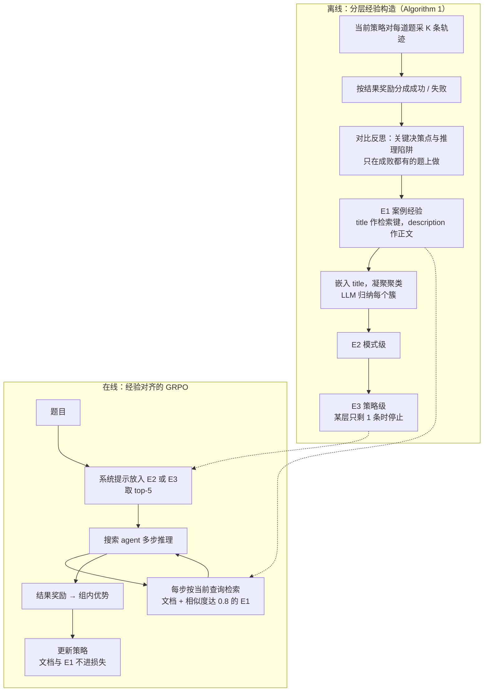

# 搜索 agent 的 RL 不该只靠瞎逛：把同题成败轨迹蒸馏成分层经验，再喂回 rollout

<!-- release-date: 2026-04-09 -->

> 本文依据本地 `papers/Alibaba/Beyond-Stochastic-Exploration.pdf`，即 **Beyond Stochastic Exploration: What Makes Training Data Valuable for Agentic Search**，arXiv:2604.08124v1、2026-04-09 提交，共 15 页，作者单位 Alibaba Cloud Computing，通讯作者 Yuewei Zhang（PDF p. 1）。页码均指 PDF 自身的页码。文中会区分三件事：**论文明确写了什么**、**我们怎么解释它**、**哪些是外部资料或本文推算**。

## 读前先把几个词说成人话

这篇论文不改模型结构，也不改 RL 的优势公式。它改的是：rollout 时模型眼前多了什么。先把会反复出现的词说清楚：

- **Agentic search（智能体搜索）**：模型在推理过程中自己决定何时检索、查什么，把检索结果接进后续思考。和传统 RAG 的区别是，查询由模型规划，而不是由人写死的流程补文档（PDF p. 2）。
- **结果奖励（outcome reward）**：只看最终答案对不对来发奖，中间每一步没有单独的分。
- **GRPO（Group Relative Policy Optimization，组相对策略优化）**：同一道题采一组回答，用组内相对好坏当优势，不训价值网络（critic）。出处见 DeepSeekMath 一篇。
- **随机探索（stochastic exploration）**：论文对现状的叫法。rollout 时模型没有任何战略先验，每一步都在重新猜「现在该查什么」，唯一的老师是最后的对错（PDF p. 2、p. 4）。
- **多跳问答（multi-hop QA）**：答案不在单篇文档里，要串几步事实。本篇主战场是 HotpotQA、2WikiMultiHopQA（下称 2Wiki）、MuSiQue 这类题。
- **HiExp（Hierarchical Experience，分层经验）** 与 **HEK（Hierarchical Experience Knowledge，分层经验知识库）**：本篇的方法和它产出的那个库。库分三层：
  - $E_1$ 实例级（案例经验）：针对某类具体坑的近距离提醒；
  - $E_2$ 模式级：一类题的解题蓝图；
  - $E_3$ 策略级：更抽象的元规则（PDF p. 4，Figure 2）。
- **评测指标**：F1 是词级重合度；EM（Exact Match）要求完全一致；CEM（Cover Exact Match）论文没给形式化定义，按字面是「预测覆盖了标准答案」；LasJ（LLM-as-Judge）是大模型打 0–5 分（PDF p. 5、p. 15）。

基座是 Qwen2.5-7B / 32B Instruct，数学实验换成 Qwen2.5-Math-7B（PDF p. 5、p. 7）。基座规格见 Qwen2.5 一篇。

## 一句话先说清

2025 年起，Search-R1、ReSearch、R1-Searcher 等工作把端到端 RL 接到了搜索 agent 上。它们的共同做法是：精心设计一个结果奖励，然后让模型在 rollout 里随机探索（PDF p. 2）。论文认为这条路有两个毛病：小模型面对复杂题时走不出全局规划，轨迹又长又低效；多轮交互里奖励信号不一致，端到端 RL 训练不稳（PDF p. 2）。

封面的 Figure 1 把两种走法摆在一起：

这是 PDF p. 1 的原图。左右两条路调用的是同一个搜索引擎，差别只在右边多了两类经验：开局一条抽象启发式，中途几条具体提醒。

HiExp 把这张图做成了一套训练流程（PDF p. 2–5）：

1. **对比蒸馏**：同一道题采多条轨迹，按对错分开，让模型反思「成功的那条在哪一步做对了、失败的在哪掉坑」，得到案例经验 $E_1$；
2. **多层聚类**：把零碎的案例经验按语义聚类、让 LLM 归纳，逐层得到 $E_2$、$E_3$；
3. **经验对齐训练**：GRPO 的 rollout 开局把 $E_2$ 或 $E_3$ 放进系统提示，中途按当前查询检索 $E_1$；算损失时把检索到的文档和经验都屏蔽掉。

结果要分开读。在本地维基检索的多跳题上，收益是实打实的：同一套 GRPO 配方下，加上 HiExp 让三个域内数据集的平均 CEM 从 49.6 升到 57.9（PDF p. 7，Table 5）。数学上的增量小得多：GRPO 之上只多 2.3 个点（PDF p. 7，Table 4）。标题里的问题「什么让训练数据有价值」，论文的回答是：**同一道题上成败轨迹的差分**，而不是更多条随机轨迹。

### 一条阅读路线

1. **p. 1 Figure 1，p. 2 的两个毛病**：先看清「随机探索」指的是什么。
2. **p. 3 第 3.1 节与 p. 13 的 Algorithm 1**：经验怎么从轨迹里抽出来、怎么逐层归纳。
3. **p. 4–5 第 3.2 节**：经验在 rollout 的哪个位置注入，损失里屏蔽了什么。
4. **p. 6 Table 1 与 Table 2**：主结果与粒度消融。
5. **p. 7 Table 4、Table 5，p. 8 Table 6 与 Figure 3**：跨任务、跨算法、经验来源、训练稳定性。
6. **p. 12–13 附录 A 与 Table 8**：检索库怎么搭、超参、离线代价。

## 主要矛盾：奖励只说对错，不说哪一步是分水岭

结果奖励给的是整条轨迹的对错。答对了，整条轨迹连同碰巧没用的弯路一起被加分；答错了，方向对、只是最后一跳没接上的步骤也一起被罚。小模型在长轨迹上本来就难做全局规划，只靠这种信号去「悟」出「这类题该先守住什么约束」，样本效率低，收敛也不稳（PDF p. 2、p. 4）。

检索本身还会添乱。现有方法用非结构化文本检索补中间步骤，无关文本容易把后续查询带偏（PDF p. 4）。Figure 1 左边那三条越来越泛的查询，就是这种漂移。

于是矛盾是：

> RL 需要有方差的轨迹组才能学，但随机探索产生的轨迹大多是无效的弯路。能不能在不改奖励、不改优化器的前提下，让采样本身带上「这类题怎么解」的先验，并且这份先验来自模型自己的成败经历？

论文的回答是把轨迹本身当成一个**内生的知识库**：训练数据的价值不止在标注答案，也在整段探索过程（PDF p. 3）。

## 先看全景：离线造一次经验库，在线把它注入 rollout

这张图按 PDF p. 3–5 的第 3 节、p. 4 的 Figure 2、p. 12 的检索参数与 p. 13 的 Algorithm 1 重画，是流程示意，不是论文原图。虚线表示经验被检索进上下文。两个阶段是分开的：经验库离线造好后就冻住，训练过程中不再更新——这一点论文自己写进了限制（PDF p. 9）。

## 核心设计一：对比蒸馏，只从「有对有错」的题里抽经验

### 旧问题：单看成功或单看失败，都不知道分水岭在哪

一条成功轨迹说明「可以这样走」，但不说哪一步是关键、哪一步只是陪跑。一条失败轨迹说明「这样不行」，但不说坑在规划、在某次查询写偏了，还是在格式。

### 新设计：同一道题上把成功和失败摆在一起

对训练集里每道题 $x_i$，独立 rollout $K$ 次，得到轨迹集合 $Y_i$。每条轨迹包含完整的推理 `<think>`、搜索动作 `<tool_call>` 和返回 `<tool_response>`。按结果奖励把它们分成成功路径 $Y_i^{+}$ 和失败路径 $Y_i^{-}$，再让策略模型本身、或一个更强的教师模型做反思，找两类特征：**关键决策点**和**推理陷阱**（PDF p. 3）。输出是一条案例经验 $e_i$ 和它的一句话摘要 $d_i$（PDF p. 3，式 1）：

$$
e_i,\ d_i=\mathrm{Reflect}\bigl(x_i,\ y_i^{+},\ y_i^{-}\bigr)
$$

附录 Table 11 把这条经验的格式钉死（PDF p. 14）：JSON 里的 `description` 就是 $e_i$，不超过 100 词的详细经验；`title` 就是 $d_i$，一句话概括，当检索键用；另有 `type`（题型与解法类别）、`tags`（不超过 5 个关键词）、`thinking`（对比成败的思考过程）。

Algorithm 1 第 5 行有一道容易看漏的门：**只有成功集合和失败集合都非空，才抽经验**（PDF p. 13）。全对或全错的题不产生 $E_1$。

**我们如何解释它**：这和拒绝采样正好相反。拒绝采样只留成功样本；这里故意留下失败，价值来自差分——同一道题、同一个检索环境，为什么这条过了、那条掉坑。代价也在这道门上：$K$ 次都做不对的难题进不了经验库，所以经验库天然偏向「模型已经偶尔能做对」的中等难度结构，照不到从未解开的盲区。$K$ 取多少，论文没写。

### 可迁移启发

造经验不必先请大教师。先保证同一道题能采到对和错，再让模型把差分写成「以后遇到这类结构该怎么查」。Table 11 的五个字段可以直接借用。

## 核心设计二：多层聚类，收成模式但别收成口号

### 旧问题：案例经验太碎，直接注入会过拟合或变噪声

案例经验绑在具体题上。整库直接塞给模型，可能过拟合，检索空间也会大到引入噪声（PDF p. 3）。需要一种办法把「核实导演身份」和「确认导演唯一性」认作同一类，而不是两条无关的记忆。

### 新设计：嵌入标题 → 凝聚聚类 → LLM 归纳，逐层往上

用预训练语义编码器 $\phi(\cdot)$ 把每条经验的**摘要** $d_i$（不是正文）映射成向量 $v_i=\phi(d_i)$，再做凝聚聚类（agglomerative clustering）。第一层用一个很严的相似度阈值 $\tau_1$，只合并真正同类的问题；每个簇交给 LLM，把多条实例经验归纳成一条更一般的经验（PDF p. 3）。Algorithm 1 的第二阶段把这一步逐层重复（PDF p. 13）：

1. 对上一层经验编码；
2. 按该层阈值 $\tau_l$ 聚类；
3. 每个簇用 LLM 归纳出一条新一层的经验；
4. 新一层只剩不超过 1 条时，视为已收敛到全局原则，停止。

聚类用 scikit-learn 的凝聚聚类、Ward 连接，在 CPU 上大约 10 分钟（PDF p. 13）。聚类用的提示在 Table 12，输出格式与 Table 11 相同，多一个 `ids` 字段记录这一簇合并了哪些题（PDF p. 14）。各层阈值 $\tau_l$、最大层数、每层最终有多少条经验，论文都没给数字。

粒度选哪层，消融表给了答案，下文 Table 2 会看到：训练时 $E_2+E_1$ 稳定好于 $E_3+E_1$。作者的解读是，具体的任务结构模式比抽象元规则对模型更可执行（PDF p. 7）。

### 可迁移启发

经验系统常见两种死法：一条都不抽象，库越堆越大；抽象到口号，模型用不上。本篇真正干活的是中间的模式层。自己做记忆模块时，层数不是目标，停在「还能写成解题蓝图」的那一层。

## 核心设计三：经验对齐训练——开局看地图，中途看路牌

### 旧问题：经验只在推理期当插件，训练时的采样仍是瞎逛

如果经验只在推理时用，训练时的 rollout 仍然没有先验，组内优势仍会被一堆无效轨迹拉扯。论文要的是在**采样阶段**就把探索引导成有经验的启发式搜索（PDF p. 4）。

### 新设计：按阶段检索不同粒度

每个 rollout 步骤 $t$ 生成的推理片段或中间查询 $q_t$ 被当作当前状态。用同一个编码器算 $\phi(q_t)$，和经验库里每条经验的摘要 $d$ 比余弦相似度（PDF p. 4，式 2）：

$$
e^{*}=\operatorname*{arg\,max}_{e\in\mathrm{HEK}}\ \cos\bigl(\phi(q_t),\ \phi(d)\bigr)
$$

注入分两段（PDF p. 4）：

- **开局**：优先把全局经验（$E_2$ 或 $E_3$）放进系统提示，给一份不依赖具体题面的蓝图。系统提示模板是 Table 7，里面有一个 `{experience}` 槽位（PDF p. 13）。
- **中途**：按固定的语义阈值，自适应地给出 top-$k$ 条细粒度 $E_1$，要求和当前查询足够接近；agent 仍可以自己改写子查询。

附录给出检索的具体参数（PDF p. 12）：检索用 parent-child 结构，短摘要作 child 做语义匹配，命中后把详细经验作 parent 取回；$E_1$ 的相似度阈值是 **0.8**，求准；$E_2$ / $E_3$ 取 **top-5**，求多样；经验库与文档用同一个嵌入模型。

### 接到 GRPO：经验在条件里，但不进损失

目标函数把搜索引擎 $\mathcal{R}$ 和经验库写进条件（PDF p. 5，式 3）。先定义整条序列上的重要性比：

$$
r_i(\theta)=\frac{\pi_\theta\bigl(y_i\mid x,E_l;\mathcal{R}\bigr)}{\pi_{\mathrm{old}}\bigl(y_i\mid x,E_l;\mathcal{R}\bigr)}
$$

再按 GRPO 的裁剪目标求期望：

$$
J(\theta)=\mathbb{E}\Bigl[\frac{1}{G}\sum_{i=1}^{G}\min\bigl(r_i(\theta)\hat A_i,\ \mathrm{clip}(r_i(\theta),1-\epsilon,1+\epsilon)\hat A_i\bigr)-\beta D_{\mathrm{KL}}\Bigr]
$$

$\hat A_i$ 是第 $i$ 条轨迹的整体优势，$D_{\mathrm{KL}}$ 是训练策略与参考策略之间的 KL，$\beta$ 是系数。附录把 KL 系数写成 $10^{-3}$、裁剪比写成 0.2（PDF p. 12）。

比公式更关键的是一句实现：**算损失时，中间推理步骤里检索到的文档片段和案例经验全部屏蔽掉**，避免策略被带偏（PDF p. 5）。经验负责引导采样，不负责当模仿目标。

作者的因果叙述是：轨迹以分层经验为条件，采样质量更高，由此算出的优势更可靠，策略更新更稳（PDF p. 4–5）。

**我们如何解释它**：HiExp 没有碰奖励，奖励仍是结果对错；也没有碰优势公式。它改的是 rollout 的输入分布——模型采样时看见了什么。这解释了它为什么能直接插进 GSPO：换的是采样先验，不是优化器的代数。

### 可迁移启发

如果已经在屏蔽工具返回的 token，就把「检索到的记忆」也一并屏蔽，这是同一条原则：上下文可以帮模型行动，但不能让模型靠复读它拿分。「开局给蓝图、中途给近距离纠正」这个分工可以直接借；0.8 和 top-5 绑定他们的嵌入模型与库规模，只能当起点。

## 实验设置：本地维基是主场

### 评什么

六个多跳数据集：HotpotQA、2Wiki、MuSiQue 为域内，训练用了它们的部分训练集；Bamboogle、MoreHopQA、Frames 为域外（PDF p. 5）。另有六个数学基准：AIME 2024 / 2025、AMC、MATH-500、Minerva、OlympiadBench；AIME 与 AMC 报 32 次独立运行的平均（Avg@32），其余报 Pass@1（PDF p. 5）。

正文写评测在完整的 dev 或 test 集上进行（PDF p. 5）；附录又写，HotpotQA 与 2Wiki 的 dev 集太大，各随机抽 1000 条作最终测试集（种子 42），并称子集结果与全量几乎一致（PDF p. 12）。所以 Table 1 里这两列是 1000 条子集上的数。

### 检索环境

本地检索器是 multilingual-e5-base，语料是 2018 年 12 月的维基百科，超过 2100 万段（PDF p. 5、p. 12）。为了效率，最终检索库是**五个多跳数据集的支撑段落**，加上从 2018 维基里随机抽的 100 万段（PDF p. 12）。另用 Tavily 做在线网页搜索（PDF p. 5）。Table 1 的所有方法都在同一套本地检索环境里评（PDF p. 6）。

**我们如何解释它**：标准答案所需的支撑段落被显式放进了一个约 100 万段的库，检索难度比在 2100 万段全库里找要低。这对所有方法一视同仁，比较是公平的；但绝对分数会比真实全库场景乐观。

### 训练数据与超参

| 项目 | 论文写明的值 |
|---|---|
| 搜索 agent 训练集 | R1-Searcher 筛过的 HotpotQA + 2Wiki 共 8148 条，加 MuSiQue 随机 8000 条（PDF p. 5、p. 12） |
| 数学训练集 | OpenR1-Math 的 45k 子集（PDF p. 5） |
| 框架 | VeRL（FSDP + vLLM）（PDF p. 5） |
| 采样 | 温度 1.0，top-p 0.95，最大回复 8192，prompt 最长 512（PDF p. 5、p. 12） |
| 优化 | 2 个 epoch，`train_batch_size` 16，`ppo_mini_batch_size` 16，学习率 $10^{-6}$，rollout batch size 8，KL 系数 $10^{-3}$，裁剪 0.2（PDF p. 12） |
| 硬件 | 8 张 NVIDIA H20 96G（PDF p. 12） |

VeRL 的来历见 HybridFlow 一篇。提示式基线用 ReSearch 仓库里的实现，训练式基线用各自公开的权重（PDF p. 12）。

两处口径没有对齐：附录写训练 2 个 epoch，Table 8 旁的正文写 GRPO 约 36 GPU 小时、「8 张 H20 跑 1 个 epoch」（PDF p. 12–13）。按 16148 条、每步 16 题算，一个 epoch 约 1000 步，而 Figure 3 的横轴只到约 750 步（这两道算术是我们做的）。论文没有解释这几个数字的关系。

## Table 1：本地多跳上的主结果

以下数字来自 PDF p. 6 的 Table 1。平均列是四个数据集 CEM 的算术平均。

**提示式（不训练）**：给 Search-o1 插上 HiExp，四个数据集的 CEM 全部上升。

| 方法 | HotpotQA | 2Wiki | MuSiQue | Bamboogle | 平均 CEM |
|---|---:|---:|---:|---:|---:|
| Vanilla RAG | 22.4 | 27.9 | 5.1 | 12.8 | 17.1 |
| Iter-RetGen | 45.2 | 35.5 | 12.4 | 24.8 | 29.5 |
| IRCoT | 47.3 | 39.2 | 13.3 | 28.8 | 32.2 |
| Search-o1（作者复现） | 41.2 | 51.0 | 15.5 | 31.2 | 34.7 |
| Search-o1 + HiExp | 47.7 | 56.8 | 18.6 | 37.6 | 40.2 |

**训练式**（每格 F1 / CEM / EM）：

| 方法 | HotpotQA | 2Wiki | MuSiQue | Bamboogle | 平均 CEM |
|---|---|---|---|---|---:|
| 7B Search-R1-v0.3 | 61.8 / 53.6 / 49.8 | 60.7 / 58.7 / 52.3 | 30.9 / 24.7 / 21.5 | 59.4 / 48.0 / 47.2 | 46.3 |
| 7B ReSearch | 63.2 / 55.8 / 50.4 | 67.1 / 65.4 / 60.3 | 28.0 / 34.1 / 24.0 | 53.1 / 45.6 / 41.6 | 48.7 |
| 7B R1-Searcher | 57.8 / 59.7 / 45.6 | 64.0 / 67.8 / 56.2 | 28.4 / 27.9 / 19.5 | 49.8 / 46.4 / 36.0 | 50.5 |
| 7B HiExp-Searcher | 65.4 / 60.4 / 52.4 | 74.6 / 76.5 / 66.9 | 41.7 / 36.7 / 30.7 | 61.0 / 50.4 / 46.4 | 56.0 |
| 32B Search-R1-v0.3 | 66.5 / 55.8 / 53.5 | 73.4 / 71.7 / 68.1 | 36.2 / 30.6 / 28.5 | 65.1 / 55.2 / 54.4 | 53.5 |
| 32B ReSearch | 69.4 / 61.0 / 56.3 | 78.1 / 76.7 / 72.3 | 39.3 / 33.8 / 30.5 | 63.1 / 52.0 / 50.4 | 55.9 |
| 32B HiExp-Searcher | 71.2 / 62.9 / 57.8 | 81.5 / 80.4 / 75.8 | 49.2 / 41.1 / 36.2 | 68.2 / 57.2 / 54.8 | 60.4 |

读表要知道三件事。

**第一，表上的「↑9.7」「↑6.9」是相对 Search-R1-v0.3 的，不是相对同配方的 GRPO**。 7B HiExp-Searcher 的 56.0 比最强的 7B 训练基线 R1-Searcher（50.5）高 5.5。更干净的对照在 Table 5：作者自己的 GRPO 基线在三个域内集上平均 CEM 49.6，加上 HiExp 到 57.9，+8.3（PDF p. 7）。Table 1 里 7B HiExp-Searcher 的三个域内格子与 Table 5 的「GRPO + HiExp」逐格相同（我们的核对）。

**第二，提升最集中在 MuSiQue 和 2Wiki**。 MuSiQue 的 F1 从三个 7B 训练基线的 28.0–30.9 升到 41.7；2Wiki 的 CEM 从 58.7–67.8 升到 76.5。域外的 Bamboogle 上领先较小，7B 的 EM 46.4 甚至低于 Search-R1-v0.3 的 47.2。

**第三，ReSearch 7B 的平均列有一处笔误**。 四个 CEM 的算术平均是 $(55.8+65.4+34.1+45.6)/4\approx 50.2$，表上印 48.7；把 MuSiQue 的 CEM 34.1 换成它的 F1 28.0，正好得到 48.7（我们的核算）。其余各行都能在 0.2 以内复算。

### 「7B 打平前沿模型」打平了谁

同表还列了五个前沿模型。作者发现它们在 Search-o1 那种逐步检索的提示下不太听指令，普通 RAG 下又容易在文档里找不到答案时直接说「没有相关信息」，所以改用优化过的 RAG 提示（Table 10）来评（PDF p. 6、p. 12）。

| 模型 | 平均 CEM |
|---|---:|
| DeepSeek-R1 | 51.2 |
| Qwen3-235B-A22B | 52.2 |
| GPT-4.1 | 58.4 |
| o4-mini | 60.0 |
| Gemini-2.5-Pro | 65.0 |
| HiExp-Searcher 7B | 56.0 |
| HiExp-Searcher 32B | 60.4 |

正文说训练后的 7B「与 GPT-4.1 相当，超过 DeepSeek-R1 和 Qwen3-235B-A22B」（PDF p. 6）。按数字：7B 确实高于 DeepSeek-R1 与 Qwen3-235B；相对 GPT-4.1 仍低 2.4；32B 略高于 o4-mini，Gemini-2.5-Pro 仍是表上最高。还要记住协议不同：前沿模型走的是单次 RAG，HiExp-Searcher 走的是多步工具调用。

## 消融：真正干活的是 $E_2+E_1$

Table 2 把经验库拆开（PDF p. 6）。域内一栏是三个域内集的平均，数值与 Table 5 对得上；域外一栏由哪几个数据集平均、用的是哪种检索，论文没写。

| 配置 | 域内 F1 / CEM | 域外 F1 / CEM |
|---|---|---|
| 不训练：只搜文档 | 37.8 / 35.9 | 31.3 / 24.2 |
| 不训练：+ $E_2$ + $E_1$ | 42.0 / 41.0 | 34.8 / 27.3 |
| 不训练：+ $E_3$ + $E_1$ | 41.0 / 38.9 | 33.4 / 26.8 |
| 训练：GRPO 基线 | 54.2 / 49.6 | 34.4 / 30.3 |
| 训练：+ $E_2$ | 59.3 / 56.8 | 36.8 / 33.6 |
| 训练：+ $E_3$ | 56.1 / 53.2 | 34.8 / 31.5 |
| 训练：+ $E_2$ + $E_1$ | 60.6 / 57.9 | 38.2 / 34.0 |
| 训练：+ $E_3$ + $E_1$ | 57.7 / 53.8 | 35.5 / 32.7 |

表里能直接读出的：不训练、只插经验，域内 CEM 已从 35.9 升到 41.0；训练时只加 $E_2$ 就贡献了大部分收益（49.6 → 56.8），再加 $E_1$ 到 57.9；$E_3$ 无论单独还是配 $E_1$，都低于对应的 $E_2$ 配置（PDF p. 6–7）。

**我们如何解释它**：更高一层不是免费的泛化。$E_3$ 是在 $E_2$ 之上再归纳一次得到的，信息更少、更像正确的废话；域外一栏里 $E_3$ 同样不如 $E_2$，所以不能说「越抽象越能迁移」。

## 泛化：换算法、换环境、换任务、换经验来源

### 换算法：GRPO 与 GSPO 都能涨

Table 5 把 HiExp 插到 Search-o1、GRPO 和 GSPO 上，在三个域内集上比（PDF p. 7）。GSPO 把重要性比从逐 token 换成整条序列，见 GSPO 一篇。

| 方法 | HotpotQA F1 / CEM | 2Wiki F1 / CEM | MuSiQue F1 / CEM | 平均 CEM |
|---|---|---|---|---:|
| Search-o1 | 44.4 / 41.2 | 50.8 / 51.0 | 18.1 / 15.5 | 35.9 |
| + HiExp | 48.7 / 47.7 | 54.8 / 56.8 | 22.4 / 18.6 | 41.0 |
| GRPO | 61.6 / 54.9 | 63.6 / 61.2 | 37.4 / 32.8 | 49.6 |
| + HiExp | 65.4 / 60.4 | 74.6 / 76.5 | 41.7 / 36.7 | 57.9 |
| GSPO | 52.3 / 62.7 | 57.9 / 60.0 | 29.6 / 35.7 | 52.8 |
| + HiExp | 56.9 / 64.7 | 62.8 / 69.4 | 36.7 / 42.6 | 58.9 |

两种算法都涨，GRPO 涨得更多（+8.3 对 +6.1）。GSPO 的画像和 GRPO 不同：CEM 更高，F1 却明显更低（HotpotQA F1 52.3 对 61.6），只看平均 CEM 分不出谁更强。

### 换环境：在线网页搜索

Table 3 改用在线搜索引擎，评三个域外集，指标换成 F1 与 LasJ（PDF p. 6）：

| 方法 | Bamboogle F1 / LasJ | Frames F1 / LasJ | MoreHopQA F1 / LasJ | 平均 LasJ |
|---|---|---|---|---:|
| Search-o1 | 60.4 / 66.2 | 26.6 / 33.5 | 25.4 / 36.6 | 45.4 |
| ReSearch | 71.9 / 73.8 | 38.7 / 48.5 | 30.9 / 46.5 | 56.3 |
| R1-Searcher | 67.2 / 71.3 | 33.4 / 42.6 | 23.5 / 37.9 | 50.6 |
| HiExp-Searcher | 75.6 / 76.4 | 41.3 / 48.7 | 34.7 / 49.4 | 58.2 |

平均 LasJ 比 ReSearch 高 1.9；Frames 上几乎持平（48.7 对 48.5）。附录 Figure 4 显示 MoreHopQA 全部是 3 跳题（PDF p. 14），所以这里的领先更像是在固定 3 跳结构上做了更好的约束分解，不能读成「更会做超长跳」。

### 换任务：数学上的增量小得多

Table 4 把基座换成 Qwen2.5-Math-7B，在 OpenR1-Math 45k 上训（PDF p. 7）：

| 方法 | AIME24 | AIME25 | AMC | MATH500 | Minerva | Olympiad | 平均 |
|---|---:|---:|---:|---:|---:|---:|---:|
| 基座 | 13.2 | 6.1 | 44.5 | 58.4 | 25.4 | 29.0 | 29.4 |
| 基座 + HiExp（只推理） | 12.8 | 7.3 | 42.7 | 62.6 | 25.7 | 32.0 | 30.5 |
| SFT | 21.7 | 16.7 | 55.4 | 82.8 | 36.4 | 45.3 | 43.1 |
| GRPO | 24.1 | 17.8 | 58.8 | 83.4 | 35.3 | 47.4 | 44.5 |
| GRPO + HiExp | 26.7 | 23.3 | 62.7 | 84.2 | 37.1 | 46.8 | 46.8 |

正文写「训练期接入 HiExp 相对基座 +17.4」（PDF p. 7），算术成立，但其中 +15.1 是 GRPO 自己贡献的；HiExp 在 GRPO 之上多出 2.3，最显眼的单点是 AIME25（17.8 → 23.3），OlympiadBench 反而从 47.4 降到 46.8。只在推理期插经验时平均只涨 1.1，AIME24 和 AMC 还各降了一点。数学用的经验库从哪批轨迹造、造了几层，论文没写。

### 换经验来源：学生自己写的经验略好

Table 6 把经验改由更大的 Qwen-Max 生成，下游的层次组织与 RL 流程不变，和 7B 自己生成的经验比（PDF p. 8；数值与 Table 5 的 CEM 一致）：

| 经验来源 | HotpotQA | 2Wiki | MuSiQue | 平均 |
|---|---:|---:|---:|---:|
| Qwen-Max → 7B | 59.8 | 74.7 | 35.5 | 56.7 |
| 7B → 7B（自蒸馏） | 60.4 | 76.5 | 36.7 | 57.9 |

自蒸馏平均高 1.2 个点。作者的解释是：方法的效果与其说取决于反思本身的绝对质量，不如说取决于经验与学生推理分布是否合拍；7B 写的经验更贴它自己的能力边界，RL 时更容易用上（PDF p. 8）。差距不大，但方向说明造经验不必依赖更大的教师。

## 训练稳定性：看图，而不只看正文

这是 PDF p. 8 的 Figure 3 原图，Backbone 是纯 GRPO 训练的基座，HiExp 是加了经验对齐的同一套训练。正文结论是：HiExp 的验证奖励升得更快、更稳；优势与梯度的方差都明显低于基线，梯度噪声被压住，更新更稳（PDF p. 8）。

**我们如何解释它**：图支持「更稳」，对「更高」的支持要打折扣。梯度方差与梯度范数的差距清楚且持续；优势方差两条线都在大幅振荡，只能说 HiExp 后半段更常落在低处。验证奖励的领先主要在前 200 步，末端两条线相差很小（读图约值）。换句话说，经验先验最明显的作用是让早期学得更快、中后期更新更平稳。论文没有给多次运行的方差或统计检验。

## 定性例子：先拆时间锚点，再挡住日期陷阱

Table 9 是 Frames 上的一道题（PDF p. 14）：「一位剧作家与写《Postcolonial Love Poem》的诗人同年获得麦克阿瑟奖，他在 2016 年 5 月写的戏叫什么？」答案是 *Skeleton Crew*。

HiExp 的轨迹里标出了三次经验触发：

1. 开局触发 $E_2$「多跳约束分解」：不要直接搜「2016 年 5 月的戏剧」，而是按「找诗人 → 定获奖年 → 找同届剧作家 → 核对 2016 年 5 月的作品」的顺序走。检索得知诗人 Natalie Diaz 于 2018 年获奖，目标年份被钉在 2018。
2. 中途触发 $E_1$「时间与职业属性求交」：在 2018 年得主里找剧作家，得到 Dominique Morisseau。
3. 再触发 $E_1$「时间与作品归属」：挡住「把首演日期当成写作月份」这个常见坑，最后查她 2016 年 5 月写的那部戏。

第 4.5 节把 $E_2$ 叫「逻辑蓝图」，把 $E_1$ 叫「手术式纠正」（PDF p. 9）。这和 Figure 1 里「尊重时间约束、把第一个 X 改成查 X 的历史」是同一类启发式。

## 代价：离线只造一次，便宜，也因此会过时

Table 8 在 MuSiQue 上统计了离线构造的开销（PDF p. 13）：约 7000 条初始轨迹，对比蒸馏在并行推理下约 1 小时（正文写用了 Qwen-7B / 72B / Max），聚类在 CPU 上约 10 分钟，整个离线流程折合不到 2 GPU 小时；GRPO 训练约 36 GPU 小时，离线部分占总算力不到 6%。

作者写的唯一一条限制正对着这一点（PDF p. 9）：当前做法是**半解耦**的。经验构造与策略优化分开，从初始策略蒸馏出的指导，可能跟不上模型在 RL 中长出的新能力；未来方向是把两者做成动态闭环。

**我们如何解释它**：便宜是因为只造一次，会过时也是因为只造一次。Figure 3 里验证奖励的领先主要在前期，和这条限制是同一个方向的信号。

## 限制、边界，以及不要补进去的实现

论文没有写的：

- rollout 次数 $K$、各层聚类阈值、最大层数、每层经验条数、中途 $E_1$ 的 top-$k$；
- 完整训练集是否都参与了经验构造（Table 8 只写 MuSiQue 上约 7000 条轨迹）；
- 数学实验的经验库怎么造；
- CEM 的形式化定义；Table 2 域外一栏由哪些数据集、哪种检索组成；
- 训练用的结果奖励是否就是 Table 13 的 0–5 分 LasJ（附录 B 只说它「可以并进训练」，会增加开销，PDF p. 12）；
- HiExp 的代码与数据。论文里唯一的仓库链接是基线实现 ReCall（PDF p. 12）。

原文内部没对齐的：

- 评测集是「完整 dev / test」还是 1000 条子集；
- 训练是 2 个 epoch 还是 1 个，以及与 Figure 3 约 750 步的关系；
- ReSearch 7B 的平均 CEM。

读结论时还要记住：检索库显式混入了支撑段落，本地多跳的绝对分数偏乐观；对比蒸馏只从成败都有的题里抽经验，从未做对的难题照不到；前沿模型与 HiExp-Searcher 的评测协议不同。

## 可迁移启发

1. **先问训练数据有没有差分，再问要不要换 RL 算法**。 同一道题既有对也有错，才抽得出经验；这也是 GRPO 组内有方差的前提。全对或全错的题，换 clip、换 GSPO 都救不了。
2. **把成败轨迹当内生知识库**。 不需要外挂事实库，也不需要更大的教师；学生自己写的经验在本篇里甚至略好。
3. **中间层最有用**。 能写成解题蓝图的模式层，加上挡住具体陷阱的案例层，是消融最优组合；更抽象一层反而掉点。
4. **经验走条件，不走损失**。 检索到的文档和经验都屏蔽出梯度。模型可以看着它们行动，不能靠复读它们更新参数。
5. **对照要选同配方的 RL 基线**。 本篇 Table 1 的「↑9.7」对的是 Search-R1-v0.3，同配方 GRPO 之上的增益是 +8.3；数学上则只有 +2.3。报插件收益时，分母要写清。
6. **经验先验最先改善的是稳定性**。 梯度方差、梯度范数和早期奖励上升速度的改善最清楚；想要后期也持续领先，经验库需要跟着策略一起更新，这正是论文留下的下一步。

## 关键词回看

- **随机探索**：只靠结果奖励、没有战略先验的 rollout。
- **HiExp / HEK**：分层经验框架与它产出的知识库；$E_1$ 案例、$E_2$ 模式、$E_3$ 策略。
- **对比蒸馏**：同一道题上对比成功与失败轨迹，抽出关键决策点与推理陷阱；只在成败都有的题上做。
- **凝聚聚类**：嵌入经验的一句话摘要，按阈值合并同类，再让 LLM 归纳上一层。
- **经验对齐训练**：开局注入 $E_2$ / $E_3$（top-5），中途检索 $E_1$（相似度 0.8）；文档与经验不进损失。
- **parent-child 检索**：短摘要匹配，详细经验回填。
- **CEM / LasJ**：覆盖式精确匹配；0–5 分的大模型裁判。
- **+8.3 / +6.1 / +2.3**：HiExp 在同配方 GRPO、GSPO（多跳三集平均 CEM）与数学 GRPO（六项平均）之上的增益。
- **半解耦**：经验离线造一次，跟不上 RL 中长出的新能力。

## 资料与阅读边界

### 本文依据的版本

- 本地原件：`papers/Alibaba/Beyond-Stochastic-Exploration.pdf`，15 页，页边水印 `arXiv:2604.08124v1 [cs.AI] 9 Apr 2026`。
- 官方页：[arXiv:2604.08124](https://arxiv.org/abs/2604.08124)。截至 2026-09-30 只有 v1，2026-04-09 11:44:44 UTC 提交；Comments 写「15 pages, ACL2026 Findings Accepted」。
- `release-date` 取 **2026-04-09**，即 arXiv v1 提交日。截至 2026-09-30 没有找到 HiExp 的官方代码、数据或模型权重，对象未对外可用，所以取技术首次公开日。

### 外部资料补充（不是 PDF 原文）

- 跨篇参考：GRPO 出处见 DeepSeekMath 一篇；GSPO 见 GSPO 一篇；VeRL 见 HybridFlow 一篇；基座见 Qwen2.5 一篇；基线之一 Search-R1 见 Search-R1 一篇。同为阿里的搜索 agent 训练，WebSailor 一篇解决的是「造高不确定性的难题」，本篇解决的是「已有题目的轨迹如何变成可用经验」，两篇的数字不要混用。
- 论文给出的基线实现：[Agent-RL/ReCall](https://github.com/Agent-RL/ReCall)。

### 原文没有公开、本文也不补的缺口

- HiExp 的超参（$K$、各层阈值、层数、top-$k$）与各层经验条数；
- 数学实验的经验来源；
- CEM 定义与 Table 2 域外口径；
- 代码、经验库与训练好的权重。
