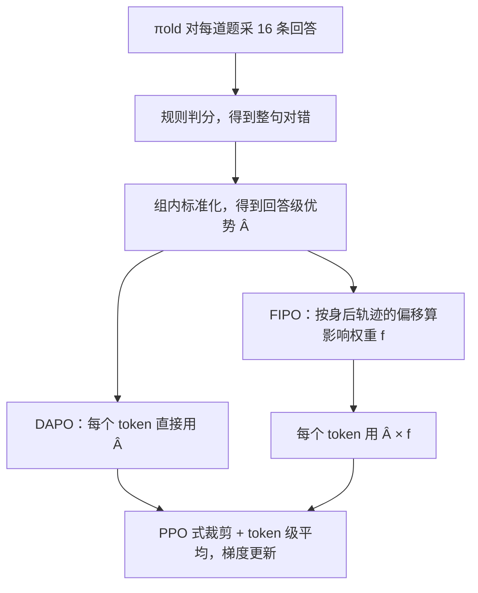

# FIPO：整句奖励照旧共享，每个 token 的分量看它身后那截轨迹往哪走

<!-- release-date: 2026-03-20 -->

> 本文依据 **FIPO: Eliciting Deep Reasoning with Future-KL Influenced Policy Optimization**，arXiv:2603.19835v3，2026-03-31 修订，共 35 页（正文 p. 1–14，署名 p. 15，参考文献 p. 16–18，附录 p. 19–35）。封面署名 Qwen Pilot Team, Alibaba Group；署名页列出的核心贡献者来自 Dartmouth 与北京大学并同属 Qwen Pilot，指导者含阿里巴巴的 Bolin Ding、Jingren Zhou（PDF p. 15）。页码均指 PDF 自身的页码。文中区分三件事：**论文明确写了什么**、**我们怎么解释它**、**哪些是外部资料**。只在图上出现的数字会注明读自哪张图。

## 读前先把几个词说成人话

这篇论文不改网络结构，也不换基座。它只改强化学习里一件很小的事：一条回答里的每个 token，该分到多大份量的奖励。

- **结果奖励（Outcome Reward Model，ORM）**：只看整条回答最后对不对，中间步骤不打分。FIPO 的奖励仍然是这种。
- **优势（advantage）**：这条回答比「平均水平」好多少。正的就抬高它里面 token 的概率，负的就压低。
- **GRPO（Group Relative Policy Optimization，组相对策略优化）**：同一道题采一组回答，用组内相对名次当优势，不训练价值网络。机制见 DeepSeekMath 一篇。
- **DAPO（Decoupled Clip and Dynamic sAmpling Policy Optimization）**：在 GRPO 上改了裁剪上界、动态采样、token 级损失和超长惩罚，是本篇的主基线，见 DAPO 一篇。
- **价值网络（critic）与 GAE（Generalized Advantage Estimation，广义优势估计）**：PPO 的做法。另训一个同量级模型，给每个前缀估「从这里写完还能拿几分」，于是每个 token 有自己的优势。代价是多养一个大模型。
- **旧策略 $\pi_{\mathrm{old}}$ 与当前策略 $\pi_\theta$**：前者是采样那一刻冻结的模型，后者是正在被梯度更新的模型。两者对同一个 token 给出的对数概率之差，就是后文的 $\Delta\log p$。
- **Avg@32、Cons@32、Pass@32**：同一道题采 32 次。Avg@32 是单次正确率的平均，论文也叫 Pass@1；Cons@32 是 32 次多数投票对不对；Pass@32 是 32 次里至少对一次。

## 一句话先说清

GRPO 一族的奖励只在句末给出一个对错。标准写法把这一个标量原样广播给回答里的每个 token：把证明拐对的那一步，和一个无关的「the」，拿到同一份优势（PDF p. 2、p. 4）。

论文的判断是：这种「一视同仁」让基线的思维链停在中等长度，进不了难题需要的长推理（PDF p. 2）。FIPO 的改法可以压成一句：

> 奖励仍然整句共享；但每个 token 的优势要乘一个权重，权重由「这个 token 之后那截轨迹，在这次更新里整体被抬高还是被压低」决定。

这是我们的归纳，论文第 4 节按「局部偏移 → 累加未来 → 裁剪成乘数 → 代回 DAPO 损失」四步写出来（PDF p. 5–8）。

这张图就是摘要的全部卖点（PDF p. 2，Figure 1）。同一个 Qwen2.5-32B-Base、同一份 DAPO-Math-17K 数据，平均思维链从约 4,000 token 拉到 10,000 以上；AIME 2024 Avg@32 从复现的 DAPO 50.0% 升到峰值 58.0%，收敛在约 56.0%（PDF p. 1）。论文把它和两个引用来的数放在一起：DeepSeek-R1-Zero 约 47.0%，o1-mini 约 56.0%（PDF p. 1）。

读图要补三句图上没写的话：

- **星号就在曲线末端。** 58% 出现在训练快结束的那几次评测里，之后的点又回到 57% 附近（读自 Figure 1）。「峰值」和「收敛值」差的这 2 个点，就是最后几次评测的起伏。
- **表里的 DAPO 比图上的高。** Table 1 把 DAPO 记为 50.0%（PDF p. 9），但 Figure 1 里 DAPO avg@32 实线的最高点读图约 48–49%，末端约 44%。论文没有说明 Table 1 的数取自哪一步。
- **两条引用线不是同一个设置。** o1-mini 不是同规模、同数据的对照；R1-Zero 那条线在摘要、图例、图注里分别叫 DeepSeek-R1-Zero-Math-32B、DeepSeek-R1-Zero-Qwen-32B、Deepseek-R1-Zero-32B（PDF p. 1–2），指的是同一个引用值。「超过 o1-mini」严格说只对峰值 58.0% 成立，收敛值 56.0% 与它持平。第 8 节自己也写明：这个优势只在数学上，不预期迁移到代码或符号逻辑（PDF p. 13）。

### 一条阅读路线

1. **p. 2 的 Figure 1 与 p. 9 的 Table 1**：先看清 50 → 56 / 58 到底比的是什么。
2. **p. 5–8 的式 3–8**：$\Delta\log p$、Future-KL、掩码、衰减、裁剪，一步一式。
3. **p. 7 的 Figure 2**：不加护栏时约第 70 步崩掉。三道护栏为什么缺一不可，看这张图。
4. **p. 10 的 Figure 3、p. 12 的 Figure 4–5**：长度分布怎么搬家，训练奖励为什么反而更低。
5. **p. 20 的 Table 2**：FIPO 与 DAPO 的配置差了哪几行。
6. **p. 28 的 Figure 12**：mini-batch 32 与 64 的对照，决定主结果能归功给算法多少。

附录 B–C 的 7B 消融、附录 D 的四段案例、附录 F 的算力账，第一次读可以当参照。

## 主要矛盾：整句一个分，长度卡在 4,000

2025 年开源社区已经能在干净基座上复现大规模 GRPO 式训练。DAPO 是其中最接近工业配方的一份：Qwen2.5-32B-Base、公开数学题、规则判分，AIME 2024 到 50%（PDF p. 1–3）。

论文认为这条路有一个结构性的天花板（PDF p. 2、p. 4）。GRPO 先按组内标准化得到一个回答级优势：

$$
\hat A_i=\frac{R_i-\mu}{\sigma},\qquad R_i=\mathbb I\big(\mathrm{Verify}(o_i,a)\big)
$$

$R_i$ 是第 $i$ 条回答的对错，$\mu$、$\sigma$ 是同组奖励的均值和标准差。然后对回答里每一个 token 都令 $\hat A_{i,t}=\hat A_i$。于是算法分不清哪一步是关键转折、哪一步是填充词。

后果被论文写得很具体：基线的推理长度在中等尺度停住，DAPO 平均停在约 4,000 token（PDF p. 2、p. 9–10）。均匀奖励标不出真正驱动正确逻辑的那几个 token，模型就收敛不到难题所需的长推理路径。

要把信用分得更细，传统答案是退回 PPO：用价值网络加 GAE 给每个 token 单独估优势。论文梳理了从干净基座出发的几条路（PDF p. 3）：

| 路线 | 代表 | 论文怎么看 |
|---|---|---|
| 在已经会写长思维链的模型上改 RL | GSPO、BAPO、SAPO、OR1 | 起点不是干净基座，不作对照 |
| 从干净基座出发，但走 PPO | Open-Reasoner-Zero、VC-PPO、VAPO、T-PPO | Open-Reasoner-Zero 没有辅助价值网络，最终低于 DAPO；后三者的价值网络由做过长思维链 SFT 的模型预训练，外部先验会混进评价 |
| 从干净基座出发，改 GRPO | DAPO | 本文主基线 |

所以矛盾是：**想要 token 级的信用分配，又不想养一个价值网络，也不想让价值网络偷偷带进长思维链的先验。** FIPO 选择在 GRPO 框架内部把优势变密（PDF p. 3）。

第 3.4 节交代了动机来源，都是作者团队的前作，不是本篇实验（PDF p. 5）：一项分析发现，RL 前后超过 98% 的生成步输出分布几乎不变，RL 只在极少数关键 token 上把模型拉回正轨；另一项发现普通 KL 找不到这些稀疏变化，跟踪**有符号**的对数概率差才标得出优化方向。本篇要回答的是下一步：瞬时的 $\Delta\log p$ 只看一个位置，怎么把它变成「这个 token 对后面整段推理有多重要」。

## 先看全景：DAPO 的流水线只多了一个乘数

这张图按 PDF p. 4–8 的式 1–8 重画，是流程示意，不是论文原图。采样、判分、组内标准化、裁剪目标全部沿用 DAPO；唯一分叉在优势进入损失之前。**这一个乘数只改优势的大小，不改它的正负。**

## 核心设计一：Future-KL——看这个 token 身后的轨迹被推向哪边

### 旧问题：瞬时偏移只说明方向，说明不了后果

先定义每个位置的**概率偏移**（PDF p. 5，式 3）：

$$
\Delta\log p_t=\log\pi_\theta(o_t\mid q,o_{<t})-\log\pi_{\theta_{\mathrm{old}}}(o_t\mid q,o_{<t})
$$

大于 0，说明更新后的模型比采样时更愿意写这个 token，训练正在强化它；小于 0，说明正在压制它。传统的 KL 惩罚把这种偏移当成「别跑太远」的成本；FIPO 把它当作方向信号（PDF p. 5）。

但一个位置的偏移看不到后果。一个看上去无害的词，可能把后面整段推理带进死胡同（PDF p. 5）。

### 新设计：把身后的偏移累加起来

最朴素的写法是从当前位置加到句末（PDF p. 6，式 4）：

$$
\mathrm{FutureKL}_t=\sum_{k=t}^{T}\Delta\log p_k
$$

人话是：从这个 token 起，后面每个 token「被抬高还是被压低」全部记一笔总账。这个和等于后半段 $o_{t:T}$ 在新旧两个策略下的对数似然比，论文因此把它称作限制在「未来视界」上、基于样本的 KL 估计（PDF p. 6）。

- $\mathrm{FutureKL}_t>0$：更新后的策略整体抬高了从 $o_t$ 出发的那截轨迹，$o_t$ 像一个站得住的锚点；
- $\mathrm{FutureKL}_t<0$：那截轨迹正被整体压低，从这里出发的路越来越不受待见（PDF p. 6）。

**必须马上划清边界。** 这不是 DAPO 删掉的那项参考模型 KL 惩罚。参考 KL 管的是「别离冻结的初始模型太远」，FIPO 的参考 KL 系数仍是 0（PDF p. 20，Table 2）；Future-KL 比的是当前策略和**采样用的旧策略**。第 4.2 节有一句把后者写成了「reference policy」（PDF p. 6），按式 3 的定义应是旧策略。

**我们如何解释它。** 名字里有 KL，但它其实是一个有符号的对数似然比，单条样本上正负都可能。如果对旧策略采出的样本求期望，$\mathbb E_{\pi_{\mathrm{old}}}[\log\pi_\theta/\pi_{\mathrm{old}}]=-\mathrm{KL}(\pi_{\mathrm{old}}\|\pi_\theta)\le 0$，平均来说它偏负。FIPO 要用的恰恰是单条轨迹上相对这个平均偏正还是偏负，不是一个距离。

### 工作机制：偏移从哪里来

式 3 里的 $\pi_\theta$ 是「正在被更新的模型」。这带出一个论文没有明说、却决定 FIPO 实际怎么起作用的细节。

32B 实验每轮采 512 道题，每 64 道题做一次梯度更新，一轮 8 次（PDF p. 8，p. 20 Table 2）。旧策略概率在更新前一次算好；第 1 个 mini-batch 算损失时模型还没动过，$\Delta\log p$ 处处为 0，$f_t$ 等于 1，这一批和 DAPO 完全相同。从第 2 批开始，$\pi_\theta$ 已经被前面几批**别的题**更新过，这条轨迹的偏移反映的是「刚学到的东西是否也支持这条路」。

官方代码里影响权重在乘进优势之前做了 stop-gradient（外部补充，见文末），所以 Future-KL 本身不回传梯度，只当一个外部给定的系数。

**我们如何解释它。** 这样看，Future-KL 更像一种「同一轮内的一致性投票」：前几次更新在别的题上学到的方向，是否恰好也抬高了这条轨迹的后半段。它不需要价值网络，代价是信号完全依赖同一轮里的多次更新；每轮更新次数、mini-batch 大小都会改变它的强弱。这也解释了为什么附录 E 里 mini-batch 大小对结果影响这么大（见后文）。

### 收益与代价

收益是：不训价值网络，也能给同一条回答里的不同 token 不同份量，而且份量来自「后面发生了什么」，不只看当前一步。

代价是：它对新旧策略概率比的噪声极其敏感。训推不一致、未来 logit 的抖动，都会被累进同一个权重里（PDF p. 6）。所以才需要下一节的三道护栏。

### 可迁移启发

结果奖励可以保留，信用分配可以另找来源。先问一句：手上有没有一个**不靠价值网络、也能区分锚点和填充词**的量？「这一步之后发生了什么」往往比「这一步本身怎样」更能说明它的责任。

## 核心设计二：三道护栏——掩码、衰减、裁剪

### 旧问题：不加护栏，约第 70 步就崩

只用式 4 训练，会出现一次同步崩塌（PDF p. 6–7，Figure 2）。论文的读法是：**低裁剪比例**（触发 Dual-Clip 的样本占比；Dual-Clip 是对负优势样本重要性比的硬上限，引 Ye 等人 2020）突然冲高，意味着模型正给有害动作很高的概率；未受约束的负向 Future-KL 累到极端值，把优化掀翻。

图上还读得出一件正文没说的事：第 8 步也有一次梯度范数尖峰，却没有引起长度下跌；真正致命的是低裁剪比例、Policy KL、梯度范数三者同时冲高（读自 Figure 2）。另外，图注没写这次失败跑用的是哪个模型、哪套配置。

### 护栏一：把已被硬裁掉的 token 从累加里拿掉

式 5 给每个未来位置加一个掩码（PDF p. 6）：

$$
\mathrm{FutureKL}_t=\sum_{k=t}^{T}M_k\,\Delta\log p_k,\qquad
M_k=\mathbb I\!\left(\frac{\pi_\theta(o_k\mid\cdot)}{\pi_{\mathrm{old}}(o_k\mid\cdot)}\le c\right)
$$

$c$ 就是 Dual-Clip 阈值，通常不小于 10，32B 与 7B 都取 10（PDF p. 6，p. 20–21 Table 2–3）。理由是：这些 token 的策略梯度本来已经被裁掉了，再让它们过大的重要性比进入累加，就是把已经判定为有害的噪声往前传（PDF p. 6）。原式把条件写成 $o_{<t}$，按上下文应是第 $k$ 个位置自己的前缀 $o_{<k}$，属于排版笔误。

### 护栏二：软衰减窗，越远的未来越不可信

当前动作对后面 token 的因果影响，会随距离变弱。近处的 token 直接以当前选择为条件；远处叠了太多随机性（PDF p. 7）。于是加一个贴现，得到实验真正使用的式 6（PDF p. 7）：

$$
\mathrm{FutureKL}_t=\sum_{k=t}^{T}M_k\,\gamma^{\,k-t}\,\Delta\log p_k,\qquad \gamma=2^{-1/\tau}
$$

$\tau$ 是**半衰期**：隔 $\tau$ 个 token，未来信号的权重减半。论文强调它不是硬截断，硬截断会在窗口边界造出假的断裂；指数衰减是连续滑过去的（PDF p. 7）。32B 与 7B 都取 $\tau=32$（PDF p. 9、p. 20）。

**我们如何解释它。** $\tau=32$ 不等于「只看后面 32 个词」。64 个 token 之后权重还有 1/4，96 个之后还有 1/8（我们的计算）。对一条上万 token 的回答，它把注意力集中在当前位置之后几十到一两百个 token 的范围里。

### 护栏三：把累计量变成有界乘数

式 7 把累计量先取指数、再裁剪，最后乘到优势上（PDF p. 8）：

$$
f_t=\operatorname{clip}\!\big(\exp(\mathrm{FutureKL}_t),\,1-\varepsilon_{f\text{-}low},\,1+\varepsilon_{f\text{-}high}\big),\qquad
\tilde A_t=\hat A_t\cdot f_t
$$

指数把对数域的累计量变回乘法域，未裁剪时相当于「贴现加权的未来似然比之积」；裁剪防止指数把梯度方差放大（PDF p. 8）。功能上：

- 身后被抬高时 $f_t>1$：答对的轨迹里，这一步多拿奖励，被鼓励成锚点；答错的轨迹里，这一步多挨罚，被当作错路的起点。
- 身后被压低时 $f_t<1$：答对的轨迹里碰巧混进来的坏 token 少拿一点奖励，答错的轨迹里被连累的好 token 少挨一点罚（PDF p. 8）。

另有一条实践规则：优势为负、重要性比又过大的 token，把 $f_t$ 重置为 1，防止过罚（PDF p. 8）。Table 2 另列了一个「Safety Threshold」，32B 取 10.0；附录正文一处说它用来过滤极端影响权重，另一处把 7B 的 3.0 叫作「优势裁剪阈值」（PDF p. 20）。官方代码里，它就是上面这条规则里的比率阈值（外部补充，见文末）。

**32B 的裁剪是单边的。** 正文写 32B 的影响权重裁在 $[1,1.2]$，Table 2 写 $[1.0,1.2]$（PDF p. 9、p. 20）。代回式 7，就是只放大、不缩小：上面第二条「$f_t<1$」的那一半在 32B 主实验里被关掉了。论文自己的说法是：放大成功轨迹上 token 的奖励，同时对通向错误结果的 token 施加更严的惩罚（PDF p. 9）。7B 才用双边的 $[0.8,1.2]$（PDF p. 21，Table 3）。

### 收益、代价与边界

三道护栏的必要性，论文给了两类证据：32B 上的 Figure 2 失败案例（PDF p. 7），以及 7B 上的过滤消融（后文附录一节）。代价是超参变多：阈值 $c$、半衰期 $\tau$、裁剪区间、安全阈值，而且附录显示 32B 与 7B 的最优设置并不相同。

### 可迁移启发

任何新加进优势里的权重，尾部都必须被裁、被掩、被贴现。否则只是换了一种方式把重要性比的噪声放大。**先想清楚这个权重最坏会变成多大，再决定要不要引入它。**

## 目标函数：DAPO 的骨架一行不动

最终目标（PDF p. 8，式 8）：

$$
J_{\mathrm{FIPO}}(\theta)=\mathbb E\!\left[\frac{1}{\sum_{i=1}^{G}|o_i|}\sum_{i=1}^{G}\sum_{t=1}^{|o_i|}\min\!\Big(r_{i,t}\,f_{i,t}\,\hat A_{i,t},\ \operatorname{clip}(r_{i,t},1-\varepsilon,1+\varepsilon)\,f_{i,t}\,\hat A_{i,t}\Big)\right]
$$

$r_{i,t}$ 是新旧策略的重要性比，$G$ 是每题采样数，分母是同组 token 总数，即 DAPO 的 token 级平均。PPO 的信任域没换，换的只是「这个 token 的优势有多重」。实现上，32B 主实验的裁剪区间沿用 DAPO 的非对称 $[0.2,0.28]$（PDF p. 20）。

## 实验设置：同基座、同数据，但有两行不同

框架是 VeRL，代码从 DAPO 公开脚本改（PDF p. 8、p. 20）。Table 2 的对照（PDF p. 20）：

| 项目 | DAPO | FIPO |
|---|---|---|
| 基座 | Qwen2.5-32B-Base，没见过长思维链合成数据 | 同左 |
| 数据 | DAPO-Math-17K | 同左 |
| 每轮 | 512 题 × 每题 16 条 = 8,192 条 | 同左 |
| mini-batch | 32 题（512 条），每轮 16 次更新 | **64 题（1,024 条），每轮 8 次更新** |
| 损失 | DAPO | **Future-KL** |
| 学习率 | $1\times10^{-6}$，热身 10 步后恒定；权重衰减 0.1；梯度裁剪 1.0 | 同左 |
| 策略裁剪 / Dual-Clip | $[0.2,0.28]$ / 10.0 | 同左 |
| 参考 KL 系数 | 0 | 0 |
| 长度 | 提示 2,048；回答上限 20,480，其中 4,096 为超长缓冲（超过 16,384 开始罚） | 同左 |
| 训练采样 | 温度 1.0，top-p 1.0 | 同左 |
| Future-KL 参数 | — | $\tau=32$，裁剪 $[1.0,1.2]$，安全阈值 10.0 |

评测以 AIME 2024 为主、AIME 2025 为辅，每题重复 32 次，温度 1.0、top-p 0.7；结果四舍五入到整数，理由是与先前基线的报法对齐并减小个位上的生成方差（PDF p. 9）。

**mini-batch 这一行要单独看。** 论文说更大的 mini-batch 训练更稳，所以 FIPO 用 64，细节在附录 E（PDF p. 8–9）。但 DAPO 基线仍是 32，论文没有报 DAPO 用 64 的结果。主表里的差距因此混着两件事：Future-KL 本身，以及更新次数减半。附录 E 能部分回答这个问题，见后文。

## 主结果：Avg@32 涨 6 个点，Pass@32 只涨 3–4 个

Table 1（PDF p. 9）：

| 方法 | AIME 2024 Avg@32 | Cons@32 | Pass@32 | AIME 2025 Avg@32 | Cons@32 | Pass@32 |
|---|---:|---:|---:|---:|---:|---:|
| DAPO（复现） | 50.0% | 60.0% | 80.0% | 38.0% | 47.0% | 63.0% |
| FIPO | 56.0% | 73.0% | 83.0% | 43.0% | 50.0% | 67.0% |

论文说 FIPO 在两个数据集上 Avg@32 都提高约 6.0%（PDF p. 9）。按表算，AIME 2024 是 6 个点，AIME 2025 是 5 个点（我们的计算）。

Pass@32 只涨 3 和 4 个点，论文的解释是：没有外部知识或工具时，RL 主要在打磨模型已有的内部知识怎么走，很难把「根本不会的题」变成会（PDF p. 9）。所以 Avg@32 涨得多、Pass@32 涨得少，被读成「更稳地解开能力圈里的题」，不是「能力圈变大了」。

Cons@32 在 AIME 2024 上涨了 13 个点（我们的计算），是整张表最大的一格。论文没有单独讨论这一列；它和「可靠性」的叙事同向：同一道题 32 次里答对的次数多了，多数投票就更容易落在对的答案上。

## 长度：整条分布在搬家，不是几个长尾样本

DAPO 的平均长度先涨，然后停在约 4,000 token；FIPO 的整条分布同步上移，中位数从最初约 200 爬到 10,000 以上（PDF p. 9–10）。图上的中位数起点读起来更接近 400（读自 Figure 3(d)），与正文的「200」略有出入。最小值那一栏两条线始终缠在 500 以下，只有末段 FIPO 偶尔冲高（读自 Figure 3(a)），「连最小值都一起上移」这句要打折扣。

超长惩罚一直开着。论文把变长归因于自发出现的自我检查：用多出来的预算回头复核、换方法交叉验证（PDF p. 10）。附录 D 从同组采样里随机抽样例，分出四个阶段（PDF p. 27–28，样例在 p. 32–35）：

| 阶段 | 谁停在这里 | 行为 |
|---|---|---|
| 1 表面规划 | 训练起点 | 写一份模板式提纲，不真正推导，直接给出幻觉结论 |
| 2 线性执行 | DAPO 全程；FIPO 早期 | 标准思维链，第一次得到结果就停，没有自检 |
| 3 自发反思 | FIPO 中期 | 先算出一个结果，再换几何或代数路径交叉验证 |
| 4 系统深推理 | FIPO 后期 | 多轮符号重推、逐步展开大平方与根式，把长度当计算预算 |

这是定性观察，不是频率统计。

Figure 3(f) 把准确率对长度按阶段拟合（PDF p. 10）：四段的 $R^2$ 依次是 0.92、0.93、0.78、0.63，斜率 $w$ 依次是 19.9、3.8、1.5、2.0（单位 $10^{-5}$）。论文的结论是：各阶段准确率与长度都强正相关，DAPO 停在长度平台处就碰到性能瓶颈（PDF p. 10–11）。

**我们如何解释它。** 同一次训练里模型和长度一起变，正相关不是「写得越长越好」的因果证明。斜率从 19.9 降到 1.5–2.0，也说明后期每多 1,000 token 换来的分越来越少。它支持的判断是「长度没用起来就到不了 56 / 58」，不支持「把上限开得更大一定更好」，附录 C.1 恰好是反例。还有一点从图上看得出：前约 70 步两条长度曲线几乎重合，分叉从第二阶段才开始（读自 Figure 3(c)），和 Figure 1 里准确率前 100 步重合是同一件事。

## 训练奖励更低，长度加权优势却在回升

三个子图各说一件事（PDF p. 11–12）。

**(a) DAPO 的训练奖励更高，不代表更强。** 奖励里含超长惩罚，FIPO 写得长、扣得多；DAPO 写得短、少扣分，奖励看起来更高，却困在更窄的搜索空间里。

**(b) DAPO 要采越来越多的批次。** 动态采样只留「组内有对有错」的题；需要的批次数越多，说明越多题变成了全对或全错。论文把这读成 DAPO 对训练集过拟合。FIPO 没有改动态采样，只是更晚才需要多采。

**(c) 长度加权平均优势。** 它把一个 batch 里所有 token 的优势按 token 数加权平均（PDF p. 11 脚注 2）：

$$
\bar A=\frac{\sum_{i=1}^{B}\sum_{t=1}^{L_i}A_{i,t}}{\sum_{i=1}^{B}L_i}
$$

$B$ 是 batch 里的回答数，$L_i$ 是第 $i$ 条的长度。它为负，说明负样本的 token 总量压过了正样本。论文的读法：DAPO 这条线一路走低，写长不再换来更正的相对优势，推理生长就停了；FIPO 这条线回升，说明正样本变得比负样本更「有内容」，形成「更长且正确 → 更正的优势 → 敢写更长」的循环（PDF p. 11）。

**图上的数值边界。** 两条线始终在 0 以下，FIPO 只是从约 −0.09 回升到约 −0.05（读自 Figure 4(c)）。正文「越来越正的优势」说的是趋势，不是符号。

## 更新更平稳：Figure 5

Policy KL 在这里指一次梯度更新前后策略的平均负对数比，即相对 rollout 策略走了多远（PDF p. 6 脚注 1）。论文的读法：FIPO 的策略漂移是渐进、有方向的，梯度范数低而稳，熵平滑上升说明在持续探索；DAPO 的梯度频繁剧烈跳动，熵噪声大（PDF p. 11–12）。

要补两句。第一，**FIPO 的 Policy KL 比 DAPO 低**，而且低得多（读自 Figure 5(a)）；「稳步上升」说的是它自己的趋势。第二，图注把 (b)(c) 写反了：图上 (b) 是梯度范数、(c) 是熵，图注写成 (b) 熵、(c) 梯度范数；图注还把长度加权优势引成了 Figure 4(b)，实际是 4(c)（PDF p. 12）。

熵上升在 32B 上被当作好事，但它不是定理。附录里 7B 恰好走了反方向。

## 附录里的消融：7B 与 32B 是两种制度

### 7B 试点：同一个算法，完全不同的长度故事

算力不够在 32B 上做早期探索，大部分消融在 Qwen2.5-7B-Math 上完成；上下文按 DAPO 的 VeRL 脚本从 4,096 扩到 32,768（PDF p. 20–21）。7B 起初不稳、跨次复现不一致，于是组大小改为 32、安全阈值收紧到 3.0（PDF p. 20）。Table 3 的完整差异（PDF p. 21）：

| 项目 | DAPO | FIPO |
|---|---|---|
| mini-batch | 32 | 64 |
| 组大小 $G$ | 16 | 32 |
| 回答上限 / 超长缓冲 | 8,192 / 4,096 | 10,240 / 2,048 |
| 影响权重裁剪 | — | $[0.8,1.2]$ |
| 安全阈值 | — | 3.0 |

Table 4（PDF p. 22，报的是**峰值** Avg@32）：

| 方法 | AIME 2024 | AIME 2025 |
|---|---:|---:|
| GRPO（引 Guo 等人 2025） | 22.0% | 18.0% |
| DAPO | 36.0% | 18.0% |
| FIPO | 40.0% | 19.0% |

**我们如何解释它。** 7B 的 DAPO 与 FIPO 在组大小、mini-batch、回答上限三处不同，40 对 36 不是只差一个损失函数的对照。7B 表报峰值，32B 的 Table 1 与摘要的收敛值一致，两张表的统计口径也不同。

AIME 2025 三条几乎叠在一起。论文认为 7B 在「无外部指导」的设置里已碰到结构性上限（PDF p. 21）。

和 32B 最不像的是长度：7B 两条线的平均回答都在约 1,200 token 附近波动，没有 4,000 → 10,000 的迁徙（PDF p. 21，Figure 6 在 p. 23）。论文给了三个假说，都没有专门实验：基座只做过 4K 上下文预训练；偏好代码式、密而短的推理；可能存在 AIME 2024 数据泄漏（引 Wu 等人 2025b）（PDF p. 22）。熵也走反：7B 上 FIPO 的熵比 DAPO 低，收敛到更确定的轨迹（PDF p. 22–23，Figure 7）。

### 影响权重裁剪：32B 的单边设置套到 7B 上不行

Table 5（PDF p. 25）：

| 设置（7B） | AIME 2024 | AIME 2025 |
|---|---:|---:|
| 裁剪 $[1.0,1.2]$ | 36.0% | 19.0% |
| 裁剪 $[0.8,1.2]$，不过滤极值 | 38.0% | 21.0% |
| 裁剪 $[0.8,1.2]$，过滤极值（默认） | 40.0% | 19.0% |

表里用 $\varepsilon_{f\text{-}low}=1.0$ 表示区间下界为 1，和式 7 的记号不一致，按区间读即可。

$[1.0,1.2]$ 在 7B 上让熵持续上升（与 32B 相同），AIME 2024 却只有 36.0%，和 DAPO 持平；换成 $[0.8,1.2]$ 才到 40.0%。论文的判断是：7B 没有足够的自探索能力消化高熵，高熵带来的是噪声不是发现（PDF p. 22、p. 25–26，Figure 10）。

### 极值过滤：7B 上的证据是混合的

不过滤时 AIME 2024 从 40.0% 降到 38.0%，AIME 2025 却从 19.0% 升到 21.0%（PDF p. 25）。论文仍判定过滤必要，理由是它让影响权重更紧、双裁剪与策略裁剪比例更低，并与 32B 的失稳观察一致（PDF p. 24–25，Figure 9）。Figure 9(a) 顺带给出一个值得记的量级：7B 上影响权重的**均值**只在 0.995–1.003 之间移动（读自 Figure 9(a)）。权重的平均效果极小，作用集中在分布的尾部。

### 半衰期 $\tau$：不是越长越好

Table 6（PDF p. 27）：

| $\tau$（7B） | AIME 2024 | AIME 2025 |
|---:|---:|---:|
| 8 | 40.0% | 17.0% |
| 32 | 40.0% | 19.0% |
| 128 | 39.0% | 21.0% |
| 256 | 42.0% | 16.0% |

$\tau=256$ 在 AIME 2024 最高、在 AIME 2025 最低。论文选 32 的理由不是分数，是训练动态：$\tau=8$ 时权重贴着 1，熵过早塌缩；$\tau=256$ 时权重偏离 1 最远、裁剪最频繁、熵持续偏高（PDF p. 26–27，Figure 11）。**32B 没有扫 $\tau$**，主实验直接用 32。

### 放宽上界、拉长上限：长得快，想得假

32B 上把 PPO 的上界 $\varepsilon_{high}$ 调到 1.4，或把回答上限从 20K 开到 25K（超长缓冲保持 20%），长度都会在早期暴涨。前者伴随熵爆炸；两者都出现重复、无关 LaTeX 和过早的自我反思，AIME 2024 相对平衡配置只有边际收益（PDF p. 23–24，Figure 8）。论文的解释：单步推理还不稳时，过早反思会让模型在互相冲突的步骤之间振荡（PDF p. 23–24）。

### mini-batch 32 与 64：主结果能归给算法多少

附录 E 交代了为什么主实验用 64（PDF p. 28–29）。mini-batch 32 偶尔能训出很好的曲线：成功的那次峰值 Mean@32 约 60%、Cons@32 约 70%，和 64 的最终表现相当。问题是复现性差，失败时长度增长严重减速，去掉超长惩罚也救不回来。论文的解释：64 更接近 on-policy，重要性比的方差更小，被裁掉的 token 更少，Future-KL 的长程信号才能不被打断地传回去（PDF p. 29）。选 64 不是因为上限更高，而是更可复现。

**我们如何解释它。** 这张图也部分回答了上一节的混淆问题。和 DAPO 同样用 mini-batch 32 时，FIPO 失败的那次 Mean@32 也到了约 0.50–0.52，成功的那次约 0.60（读自 Figure 12(e)），都不低于 DAPO 在 Figure 1 里的曲线。所以提升不全是 mini-batch 带来的。但「DAPO 用 64 会怎样」仍没有数据；几次失败跑提前停止，终点也不能直接比。

### 算力账：时间 $O(BL^2)$，显存压得住

朴素实现要一张 $L\times L$ 的衰减矩阵，显存 $O(L^2)$，长轨迹直接 OOM。论文改成分块：按块大小 $K$ 做 $(B,K)\times(K,L)$ 的矩阵乘，峰值显存 $O(BL+LK)$，时间仍是 $O(BL^2)$，结果与原式完全相同（PDF p. 30–31，Listing 1）。GRPO 原本的策略目标是逐元素的 $O(BL)$。论文说墙钟变慢「相对有限、完全可接受」，但没有给秒数、GPU 数或百分比（PDF p. 30）。

## 限制与作者自己划的边界

第 8 节列了五条（PDF p. 13–14）：

1. **成本。** 10,000 token 以上的训练和推理都更贵。作者主张分两阶段：先引出长而高质量的推理，再压缩；本篇只做第一阶段。
2. **任务。** 评测几乎全是数学，数学被当作最严格的代理。开放域、非结构化任务留待以后。
3. **数据。** 为公平对照只用 DAPO 那批数据，更大、更好数据上的扩展没做；对 o1-mini 的优势限于数学。
4. **模型。** 为了研究「从没见过长思维链的干净基座」，只能选少数 vanilla 基座（Qwen2.5 系列）；已经蒸馏过长推理的模型，动力学可能不同，没有实验。
5. **与蒸馏的差距。** RL 自演化是「发现式」的，效率低于直接蒸馏；大教师的 logits 信号更密，小模型靠稀疏奖励难以自己长出来。这一条是判断，本篇没有蒸馏对照。

读完还要补上几条论文没写成限制、但证据链上确实存在的缺口：主表的 FIPO 与 DAPO mini-batch 不同；7B 对照在三处配置上不同；只报单次训练，没有种子方差；Table 1 的 DAPO 数与 Figure 1 曲线对不上；墙钟代价没有数字；$\tau$ 只在 7B 上扫过。

## 它怎么接进基模后训练

这篇论文只交付一样东西：一个不需要价值网络、把结果奖励的均匀优势按 token 变密的目标函数。

**适用前提很窄，缺一不可。** 奖励能用规则可靠判定；基座还没被长思维链 SFT 或蒸馏锁定；目标允许策略明显偏离初始模型（参考 KL 仍为 0）；一轮里有多次 mini-batch 更新，Future-KL 才有信号可用；能承受 $O(BL^2)$ 的未来聚合。

**监控上先盯长度分布。** DAPO 已修掉朴素 GRPO 的几处默认缺陷，FIPO 指出下一层故障：修好之后仍可能停在约 4,000 token、50%。平均长度之外，还要看分位数、长度加权优势、动态采样的批次数，这些比训练奖励更早报警。

**尺度会换制度。** 32B 靠长度迁徙和高熵探索涨分；7B 靠低熵、约 1,200 token 的短轨迹涨分。影响权重区间、组大小、安全阈值都要重调。

## 可迁移启发

1. **结果奖励可以共享，信用分配可以另找来源。** 「这一步之后发生了什么」是一个不需要价值网络的信用信号。
2. **有符号的偏移比距离更有用。** 同样是新旧策略的对数比，当惩罚项用是约束，当方向信号用是信用。
3. **瞬时信号只说方向，累积信号才说责任。** 任何只看当前一步的归因，都可以追问一句：后面发生了什么？
4. **新权重进入优势，就要给它上三道护栏。** 掩掉已被硬裁的极端比率，按距离衰减，最后裁成有界乘数。没有这些，大约 70 步就会把长度打崩。
5. **注意信号从哪来。** Future-KL 的偏移来自同一轮里前几次更新，mini-batch 大小和更新次数会直接改变它的强弱；换训练配置等于换了算法。
6. **长度是预算，不是目标。** 放宽上界或拉长上限都能让模型「看起来在想」，附录显示那可能是重复和过早反思。
7. **超参绑在尺度上。** 32B 单边裁剪、7B 双边裁剪；从 DAPO 迁到 FIPO 不是改一行损失名。

## 关键词回看

- **均匀优势**：整句一个 $\hat A$，广播给每个 token。FIPO 认为这是长度平台的根因。
- **$\Delta\log p$**：当前策略相对旧策略的 token 级对数概率差，正为强化、负为压制。
- **Future-KL**：该 token 之后轨迹的掩码、贴现累计偏移，是一个有符号的对数似然比，不是参考模型 KL 惩罚。
- **软衰减窗**：$\gamma=2^{-1/\tau}$，每隔 $\tau$ 个 token 权重减半；主实验 $\tau=32$。
- **影响权重 $f_t$**：$\exp(\mathrm{FutureKL}_t)$ 裁剪后的乘数。32B 裁到 $[1.0,1.2]$，7B 裁到 $[0.8,1.2]$。
- **Dual-Clip 掩码 / 安全阈值**：重要性比超过 10 的 token 不进入累加；负优势且比率过大的 token 权重重置为 1。
- **长度平台**：DAPO 平均停在约 4,000 token；FIPO 整条分布迁到 10,000 以上。
- **峰值 58% / 收敛 56%**：AIME 2024 Avg@32 的曲线末端最高点与 Table 1 数字。
- **长度加权平均优势**：按 token 数加权的组相对优势，FIPO 回升、DAPO 下探，两者都在 0 以下。
- **mini-batch 64**：FIPO 主实验的配置，与 DAPO 基线的 32 不同，附录 E 解释为可复现性的选择。

## 资料与阅读边界

**版本与首发日。** arXiv 提交历史为 v1 2026-03-20、v2 2026-03-24、v3 2026-03-31，最新仍是 v3，即页头所列版本（[arXiv:2603.19835](https://arxiv.org/abs/2603.19835)）。封面日期 2026-04-01 不是首发日。`release-date` 取 2026-03-20：最早的官方公开事件是 arXiv v1；官方仓库 [qwenpilot/FIPO](https://github.com/qwenpilot/FIPO) 创建于 2026-03-22，首批提交同日；Hugging Face 权重 [QwenPilot/FIPO_32B](https://huggingface.co/QwenPilot/FIPO_32B) 首次上传也在 2026-03-22，模型卡写「Published on March 20, 2026」。

**覆盖了原文哪些部分。** 摘要与 Figure 1；§1 引言；§2 相关工作；§3 PPO、GRPO、DAPO 预备知识与 §3.4 动机；§4 式 3–8、Figure 2；§5 设置与 Table 1；§6 Figure 3–5；§7 结论；§8 限制；§9 署名；附录 A Table 2–3；B Table 4、Figure 6–7；C.1 Figure 8；C.2–C.3 Table 5、Figure 9–10；C.4 Table 6、Figure 11；D 四阶段案例与 Figure 13–16；E Figure 12；F 算力与 Listing 1。

**外部补充（不是论文内容）。**

- 官方代码 [qwenpilot/FIPO](https://github.com/qwenpilot/FIPO) 的 `verl/trainer/ppo/core_algos.py` 以 `future_kl` 注册策略损失：影响权重在乘进优势前做了 `.detach()`；过滤条件是对数比超过 $\log c$；「只放大」由 `future_kl_clip_high_only` 开关控制；安全阈值作用于「负优势且重要性比超过阈值」的 token，把权重夹到 $[0.8,1.0]$，在 32B 的 $[1.0,1.2]$ 设置下等价于重置为 1。启动脚本 `recipe/fipo/run_fipo_qwen2.5_32b.sh` 的 mini-batch 为 64、`decay_rate` 为 32、默认 16 个节点每节点 8 卡；论文没有写 32B 实验用了多少卡。
- Hugging Face 模型卡置顶声明：先前上传的是中间训练步，已换成收敛 checkpoint；提交记录显示 2026-04-12 重新上传权重。对照论文的收敛约 56.0% 时应使用替换后的权重。
- DAPO 原论文见 [arXiv:2503.14476](https://arxiv.org/abs/2503.14476)，其自报的 Qwen2.5-32B AIME 2024 成绩同为 50%；VeRL / HybridFlow 见 [arXiv:2409.19256](https://arxiv.org/abs/2409.19256)。本站另有 DAPO、GSPO、DeepSeekMath 各一篇；GSPO 在本篇相关工作里被归为「已有长思维链模型上的算法」，没有进入对照实验。

**原文没有公开的缺口。** DAPO 用 mini-batch 64 的对照；多种子方差；Table 1 的数取自哪一步；32B 的算力规模与墙钟开销；32B 上的 $\tau$ 与裁剪区间扫描；Figure 2 失败案例对应的模型与配置；数学以外任务、已蒸馏模型上的效果；与蒸馏的对照。
