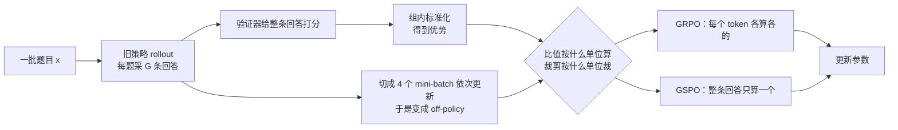
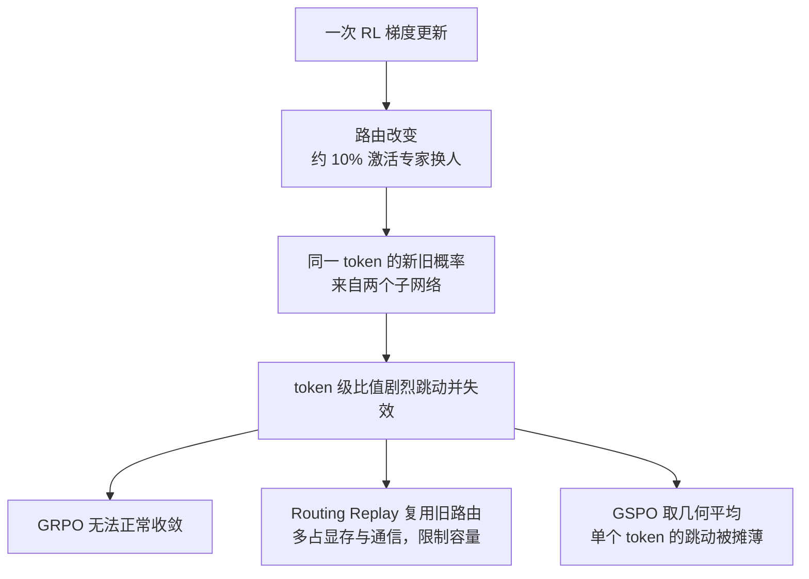

# GSPO：奖励是发给整条回答的，off-policy 修正就不该按 token 算

<!-- release-date: 2025-07-24 -->

> 本文依据 **Group Sequence Policy Optimization**，Qwen Team（阿里巴巴），Chujie Zheng 等 12 位作者，arXiv:2507.18071v2（2025-07-28 修订，页眉日期 2025-07-29），共 7 页。页码指这份 PDF 自身的页码。文中区分三件事：**论文明确写了什么**、**我们怎么解释它**、**哪些是外部资料或我们的推算**。

## 读前先把几个词说成人话

这篇只有 7 页，改动也只有一处。难的不是公式，而是它质疑了一个大家默认成立的写法：给每个 token 乘一个概率比。

先把会反复出现的词说清楚：

- **策略（policy）$\pi_\theta$**：正在训练的语言模型，$\theta$ 是它的参数。
- **旧策略 $\pi_{\theta_{\text{old}}}$**：采这批数据时的那份参数。数据是它采的，被更新的是 $\pi_\theta$。
- **题目 $x$、回答 $y$**：$|y|$ 是回答的 token 数。整条回答的概率是逐 token 概率连乘，$\pi_\theta(y\mid x)=\prod_{t=1}^{|y|}\pi_\theta(y_t\mid x,y_{<t})$（PDF p. 2）。
- **验证器（verifier）$r$**：只看完整回答，给一个 $r(x,y)\in[0,1]$ 的分（PDF p. 2）。中间过程没有分。
- **off-policy（离策略）**：用旧策略采的数据去更新已经变了的新策略。
- **重要性采样（importance sampling）**：想算 A 分布下的平均，手里只有 B 分布的样本，就给每个样本乘 $A(z)/B(z)$ 纠偏。
- **裁剪（clipping）**：这个比值离 1 太远，说明样本已经不像当前模型会产生的东西，就切断它对梯度的贡献。
- **优势（advantage）**：这条回答比同组平均好多少。GRPO 用同一道题的一组回答做组内标准化得到它。
- **MoE（Mixture-of-Experts，混合专家）**：每个 token 只经过少数几个专家网络。选哪几个由路由器决定。
- **Routing Replay（路由重放）**：Qwen 团队此前给 MoE 打的补丁，更新时强行复用旧策略选过的专家（PDF p. 6）。

GRPO 的完整机制（为什么不要价值模型、组内优势怎么算、PPO 式裁剪怎么写）见 DeepSeekMath 一篇。这里只用到 GSPO 论文 p. 2 自己写出的那几条公式。

## 一句话先说清

GSPO 只改一件事：**把判断「这个样本有多 off-policy」的单位，从单个 token 抬到整条回答。**

采样、打分、组内标准化算优势，全部沿用 GRPO。优势公式一字未改（PDF p. 2 式 3 与 p. 3 式 6）。变的是两样：重要性比按整条回答算一个，裁剪也整条整条地裁。

作者给出的原则只有一句（PDF p. 3）：

> 优化目标的单位，应当和奖励的单位对齐。

奖励发给整条回答，修正就该按整条回答做。GRPO 按 token 做，作者认为这在重要性采样的意义上根本不成立，把 GRPO 的目标称为 ill-posed（病态的）（PDF p. 2）。

论文声称的收益有三层（PDF p. 1）：训练更稳、同算力下效率更高；MoE 的 RL 不再需要 Routing Replay；训推两端的精度差异「有潜力」不再需要对齐。三层的证据强度相差很大，后面会分开定价。

### 一条阅读路线

原文很短，建议按这个顺序读：

1. **p. 2 第 3 节**：为什么 off-policy 是被硬件逼出来的，以及「每个位置只有一个样本」那句关键论证。
2. **p. 3 式 5–7**：序列级比值的定义，以及长度归一化那段话。
3. **p. 3–4 式 10 与式 12**：两边梯度只差「每个 token 前面乘什么」。
4. **p. 5 Figure 1–2**：同算力曲线，以及「裁得更多反而更好」。
5. **p. 6 第 5.3 节与 Figure 3**：MoE 的专家激活波动与 Routing Replay。
6. **p. 6 第 5.4 节**：训推精度那段推论，注意它没有实验。

## 主要矛盾：奖励按整条发，修正却按 token 做

### off-policy 不是失误，是被硬件逼出来的

论文的第 3 节从一个工程事实开场（PDF p. 2）。模型越大、越稀疏（MoE）、回答越长，一次 rollout 就要采越大的批，否则硬件喂不饱。为了提高样本利用率，标准做法是把这一大批切成几个 mini-batch，依次做梯度更新。实验里切成 4 份（PDF p. 4）。

第二个 mini-batch 更新时，参数已经被第一个改过。数据还是旧策略采的，模型已经不是旧模型。这就是 off-policy，也是 PPO 和 GRPO 需要裁剪的原因（PDF p. 2）。

所以问题从来不是「要不要 off-policy」，而是「怎么修正它」。

### 重要性采样要靠很多样本平均，token 位置上只有一个

论文把重要性采样的原理原样写出来（PDF p. 2 式 4）：

$$
\mathbb{E}_{z\sim\pi_{\text{tar}}}\left[f(z)\right]
=
\mathbb{E}_{z\sim\pi_{\text{beh}}}\left[\frac{\pi_{\text{tar}}(z)}{\pi_{\text{beh}}(z)}\,f(z)\right]
$$

$\pi_{\text{tar}}$ 是想估计的目标分布（新策略），$\pi_{\text{beh}}$ 是实际采样的行为分布（旧策略），$f$ 是要求平均的量。

紧接着的一句是全文论证的支点：这个等式要起作用，必须对行为分布的**很多个样本**求平均（原文写作 $N \gg 1$）（PDF p. 2）。比值是在一批样本上把分布掰回来，不是逐个样本的修正系数。

再看 GRPO 用的比值（PDF p. 2 式 3）：

$$
w_{i,t}(\theta)=\frac{\pi_\theta(y_{i,t}\mid x, y_{i,<t})}{\pi_{\theta_{\text{old}}}(y_{i,t}\mid x, y_{i,<t})}
$$

在第 $t$ 个位置，「分布」是给定前缀后的下一词概率表 $\pi_{\theta_{\text{old}}}(\cdot\mid x,y_{i,<t})$。这张表只被采了**一个**样本，就是实际生成的 $y_{i,t}$。

$N=1$。前提不成立。论文的判定是：这个权重没能起到分布修正的作用，反而往梯度里注入高方差噪声（PDF p. 2）。

### 噪声怎么走到崩溃

论文给的因果链（PDF p. 1、p. 2–3）：

1. 每个 token 位置贡献一份噪声；
2. 回答越长，噪声累积越多；
3. 裁剪依据的正是这个不可靠的比值，所以它不但没消化噪声，反而放大了它；
4. 最终是灾难性的模型崩溃。

第 4 步的性质最值得记：作者写，一旦崩溃，继续训练无济于事，即使回滚到之前的 checkpoint、仔细调裁剪范围、延长生成长度、换 RL 题目集合都救不回来（PDF p. 3）。

**我们如何解释它。** 这一条是经验观察，原文用的是 we have empirically observed，没有给崩溃的曲线或统计。但它解释了作者为什么去动目标函数：如果病根在超参，调超参应该有用。回滚之后仍救不回来，说明问题不在某一段训练轨迹，而在目标本身。

## 先看全景：整条流水线只动了一个菱形

这是机制示意，按 PDF p. 2–4 正文重画，不含实测数据。采样、打分、优势都没变；分叉只在那个菱形。

## 核心设计一：序列级重要性比，几何平均而不是连乘

### 旧问题：token 比值没有在做修正

上一节已经讲完：token 级比值每个位置只有一个样本，起不到修正作用，还把噪声带进梯度。

### 新设计：用整条回答的似然比

论文观察到，在语言生成里，序列级的比值 $\pi_\theta(y\mid x)/\pi_{\theta_{\text{old}}}(y\mid x)$ 有清楚的含义：从旧策略采出来的这条回答，在新策略眼里偏离了多少。它和序列级奖励同一个单位，也天然适合当裁剪的依据（PDF p. 3）。

式 7 的上下标较密，拆两步看。第一步，对第 $t$ 个 token 算对数概率比：

$$
\ell_{i,t}=\log\frac{\pi_\theta(y_{i,t}\mid x, y_{i,<t})}{\pi_{\theta_{\text{old}}}(y_{i,t}\mid x, y_{i,<t})}
$$

$\ell_{i,t}>0$ 表示新模型更愿意写出这个 token。第二步，整条回答取平均，再还原成比值（PDF p. 3 式 7）：

$$
s_i(\theta)=\exp\left(\frac{1}{|y_i|}\sum_{t=1}^{|y_i|}\ell_{i,t}\right)=\left(\frac{\pi_\theta(y_i\mid x)}{\pi_{\theta_{\text{old}}}(y_i\mid x)}\right)^{1/|y_i|}
$$

一句人话：**$s_i$ 是这条回答里所有 token 比值的几何平均。** GRPO 用的是其中每一项，GSPO 用它们的平均。这个序列似然的写法，论文注明引自第一作者此前的 Click 工作（PDF p. 3、p. 7）。

目标函数只把 $w_{i,t}$ 换成 $s_i$，求和也从「每条回答的每个 token」缩到「每条回答」（PDF p. 3 式 5）：

$$
J_{\text{GSPO}}(\theta)=
\mathbb{E}\left[\frac{1}{G}\sum_{i=1}^{G}
\min\Big(s_i(\theta)\hat A_i,\ \operatorname{clip}\big(s_i(\theta),\,1-\varepsilon,\,1+\varepsilon\big)\hat A_i\Big)\right]
$$

$G$ 是每题采几条回答，$\hat A_i$ 是组内标准化后的优势，$\varepsilon$ 是裁剪半径。

### 工作机制：比值、裁剪都落到整条回答上

这张图是讲解用的示意，比值是虚构的，裁剪区间取自论文实验设置（PDF p. 4），$s$ 按式 7 由同一串比值算出。它要让人一眼看见三件事。

第一，**裁剪变成整条的**。论文原话是 GSPO 把裁剪施加在整条回答而不是单个 token 上，以排除过于 off-policy 的样本（PDF p. 3）。一条回答被判出局，它的全部 token 一起退出这次梯度估计。

第二，**一个跳变的 token 不再单独说了算**。它的影响被 $1/|y_i|$ 摊到整条上。回答越长，摊得越薄。图里第一条只有 8 个 token，所以仍被推出区间；换成几千 token 的真实回答，同样一跳几乎不改变 $s_i$。

第三，**负优势那一侧照样没有上界**。PPO 式的 min 与 clip 只在「会让目标变大」的方向裁；优势为负时，比值偏大那一侧不裁（图中黄色）。GSPO 没有改这条规则，改的是那个比值变成了整条共用的一个数。

### 为什么必须做长度归一化

式 7 的 $1/|y_i|$ 次方不是装饰。论文给两个理由（PDF p. 3）：降低方差，把 $s_i$ 控制在统一的数值范围里；否则少数几个 token 的似然变化就会让序列级比值剧烈波动，而且不同长度的回答需要不同的裁剪范围。

**我们如何解释它。** 不开方时，序列比值就是逐 token 比值的连乘。设一条 10,000 token 的回答里，每个 token 的比值都只有 1.0001：

$$
1.0001^{10000}\approx 2.72
$$

每个 token 只差万分之一，整条就偏到 2.72 倍（我们的计算）。长度再翻倍，偏差按指数放大。取几何平均后，这个数不论多长都停在 1.0001。长度归一化让长回答和短回答站到同一把尺子上，才能共用一个 $\varepsilon$。

### 收益与代价：裁剪区间要重新标定

实验里 GSPO 的左右裁剪范围是 3e-4 与 4e-4，GRPO 基线是 0.2 与 0.27（PDF p. 4）。相差约三个数量级。论文只解释了一句：两者的裁剪范围通常差着数量级，因为重要性比的定义不同（PDF p. 3）。

**我们如何解释它。** $s_i$ 是成百上千个接近 1 的数的几何平均，平均本身把离散度压得极小，它天然贴着 1。沿用 0.2 的窗口，几乎永远不会触发裁剪，裁剪等于关掉。所以 $\varepsilon$ 的数值不能跨算法搬运。

还有一处容易漏：GSPO 自己用的区间也是**不对称**的，右边比左边宽（4e-4 对 3e-4）。「上界放宽一点」这件事在序列级仍然存在，只是量纲全换了。

### 可迁移启发

先问反馈是发给谁的，再决定修正加在谁身上。反馈在整体层面产生（一次任务成功、一条回答对错），却在更细的粒度上乘修正系数，那些系数很可能只是噪声。任何「每个样本乘一个概率比」的写法，先确认那个位置上到底有几个样本。

## 核心设计二：梯度里所有 token 等权

### 两边的梯度只差一个系数

论文推了两组梯度（PDF p. 3 式 8–10，p. 4 式 11–12）。剥掉共同部分，差别就在每个 token 的 $\nabla_\theta\log\pi_\theta(y_{i,t}\mid x,y_{i,<t})$ 前面乘什么。

| | 每个 token 梯度前的系数（省略裁剪） | 同一条回答内 |
|---|---|---|
| GRPO（式 12） | $\hat A_i\cdot w_{i,t}(\theta)\cdot\frac{1}{\lvert y_i\rvert}$ | 各乘各的比值，不等权 |
| GSPO（式 10） | $\hat A_i\cdot s_i(\theta)\cdot\frac{1}{\lvert y_i\rvert}$ | 整条共用一个系数，等权 |

论文给了 GRPO 那些系数的取值范围：$\hat A_i>0$ 时落在 $(0,\,1+\varepsilon]$，$\hat A_i<0$ 时落在 $[1-\varepsilon,\,+\infty)$（PDF p. 4）。后者没有上界：一个负优势的 token，若新策略反而更偏爱它，比值可以任意大，裁剪也不管这一侧。

论文的判断是：这些不等的权重不可忽略，影响会随训练累积，导致不可预测的后果；GSPO 让一条回答内所有 token 等权，消除了这个不稳定因素（PDF p. 4）。

**我们如何解释它。** 「GSPO 等权、GRPO 不等权」是纯代数，确定成立。「不等权一定更糟」是另一回事，靠的是后面的实验与观察。两句话的证据强度不同，不要连成一句读。

### GSPO-token：需要逐 token 调优势时的接口

多轮 RL 这类场景，可能想给一条回答里不同段落不同的优势。序列级目标做不到，于是论文给了一个变体（PDF p. 4 式 13–14）：

$$
s_{i,t}(\theta)=\operatorname{sg}\left[s_i(\theta)\right]\cdot\frac{\pi_\theta(y_{i,t}\mid x, y_{i,<t})}{\operatorname{sg}\left[\pi_\theta(y_{i,t}\mid x, y_{i,<t})\right]}
$$

$\operatorname{sg}[\cdot]$ 是 stop gradient，只取数值、不回传梯度，对应 PyTorch 的 `detach`（PDF p. 4）。

- **数值上**，右边分式分子分母相等，值为 1，所以 $s_{i,t}$ 的数值就是 $s_i$；
- **梯度上**，分母被截断，只剩分子活着，于是每个 token 的 $\nabla\log\pi_\theta$ 重新暴露出来，前面可以挂一个属于它自己的 $\hat A_{i,t}$。

论文的结论是：把一条回答里所有 token 的优势设成同一个值时，GSPO-token 与 GSPO 在目标、裁剪条件和理论梯度上数值完全一致，多出来的只是逐 token 调优势的自由度（PDF p. 4 式 15–17）。

论文没有给 GSPO-token 的任何实验。它是一个留好的接口，不是被验证过的方法。

## 实验一：同样的训练算力，GSPO 更高

全部实验只有一个配置（PDF p. 4）：

| 项目 | 设置 |
|---|---|
| 模型 | 从 Qwen3-30B-A3B-Base 微调得到的一个冷启动模型 |
| 对照 | GRPO，打开 Routing Replay |
| mini-batch | 每批 rollout 切成 4 份依次更新 |
| GSPO 裁剪 | 左 3e-4，右 4e-4 |
| GRPO 裁剪 | 左 0.2，右 0.27，论文称为公平比较仔细调过 |
| 评测 | AIME'24（32 次采样平均 Pass@1）、LiveCodeBench 202410–202502（8 次采样平均 Pass@1）、CodeForces（Elo） |

图引自原文 Figure 1（PDF p. 5）。读这张图先看三件图上读不出、但决定结论强度的事。

**第一，对照组是打了补丁的。** 图例写的是 GRPO (w/ Routing Replay)。GSPO 没有这个补丁，却在同一横坐标处全面领先。这比「领先多少」更要紧。

**第二，横轴没有刻度、没有单位，也没有数值表。** 任何「GSPO 在 AIME'24 上高 X 分」的说法都是从图上量出来的。我们读到的大致是：GSPO 停在 AIME'24 约 82–83 处；GRPO 在相同横坐标处约 78，继续训到约 1.5 倍横向跨度时约 81（读自 Figure 1）。

**第三，GSPO 的线更早停。** 它在更少的算力处就到了更高的奖励。论文的文字结论是：GSPO 全程稳定；靠增加算力、定期更新题目集合、延长生成长度可以持续提升；同样算力、同样消耗的题目数下，训练准确率和基准表现都优于 GRPO（PDF p. 5）。

论文还写，GSPO 已用于最新 Qwen3 模型的 RL 训练（PDF p. 5）。这句话没有配任何对照数据。

## 实验二：裁掉多得多的 token，效率反而更高

Figure 2 是一张只有两根柱的图（PDF p. 5），改写成表：

| 算法 | 训练全程被裁 token 的平均比例 |
|---|---:|
| GSPO | 0.15 |
| GRPO | 0.0013 |

两者差两个数量级，论文说调整裁剪范围也不改变这个量级差（PDF p. 5）。GSPO 用来估计梯度的 token 少得多，训练效率却更高。作者自己称之为反直觉的发现，并据此推断 GRPO 的 token 级梯度估计本来就噪、对样本的利用低效（PDF p. 5）。

**我们如何解释它。** 两个数不是同一把尺子量的。GSPO 的 0.15 来自「整条回答出局，它的全部 token 一起算进被裁比例」；GRPO 的 0.0013 来自「越界的单个 token 出局」。前者天然成块。前面那张示意图里，一个跳变的 token 就让 GSPO 退掉 8 个 token、GRPO 只退掉 1 个，就是这个机制。所以这组数字不能读成「GSPO 更省样本」，论文也没这样用它，只拿它当「token 级信号本来就噪」的旁证。

## 核心设计三：MoE 的专家激活波动，与被拆掉的 Routing Replay

### 旧问题：一次更新，约 10% 的激活专家就换了

MoE 每个 token 只激活少数专家。论文发现一个具体现象，称为 expert-activation volatility（专家激活波动）（PDF p. 6）：

> 用 48 层的 Qwen3-30B-A3B-Base，每做一次 RL 梯度更新，对同一条 rollout 样本，新策略下激活的专家约有 10% 与旧策略不同；模型越深，这个现象越明显。

**我们如何解释它。** token 级比值 $w_{i,t}$ 默认分子分母来自「同一个模型的前后两个版本」。路由一变，分子分母其实是两个不同子网络算出来的。这已经不是「模型改了一点」，而是「换了一台秤」。论文的说法是，这让 $w_{i,t}$ 剧烈波动并进一步失效，阻碍 RL 正常收敛（PDF p. 6）。

### 旧补丁：Routing Replay

Qwen 团队此前的做法是：缓存旧策略 $\pi_{\theta_{\text{old}}}$ 下激活的专家，算比值时让 $\pi_\theta$ 重放同一套路由。这样每个 token 的新旧似然走同一个激活网络，token 级比值的稳定性被人为恢复，梯度更新也始终优化同一个激活网络（PDF p. 6）。

图引自原文 Figure 3（PDF p. 6）。起点两条线重合，分岔之后一条上行、一条下行，而且下行那条中途就停了。这不是「效果差一点」，是训练走向反方向。图上的数值只是读图估计，论文没有数值表；论文的文字结论是：Routing Replay 对 MoE 上 GRPO 能否正常收敛起关键作用（PDF p. 6）。

补丁有代价，论文写了两条（PDF p. 6）：缓存并重放路由带来额外的显存和通信开销；更要紧的是，它会限制 MoE 模型的实际容量，模型被迫沿用旧的专家组合。

### 新设计：GSPO 不需要它

论文的关键判断（PDF p. 6）：GSPO 只看序列似然 $\pi_\theta(y_i\mid x)$，对单个 token 似然不敏感；MoE 模型始终保持语言建模能力，序列似然不会剧烈波动。所以 GSPO 可以照常计算 $s_i$、正常收敛，完全不需要 Routing Replay。Figure 1 里的 GSPO 曲线就是不带这个补丁、在 4 个 mini-batch 的 off-policy 设置下跑出来的（PDF p. 4–5）。

机制示意，按 PDF p. 6 正文与 Figure 3 重画。「约 10%」是论文在 48 层模型上的实测数，其余节点只表示因果关系。

### 代价与边界

「序列似然不会剧烈波动」是 GSPO 对 MoE 有效的核心解释，但它是一句**断言**：论文没有测量序列似然的波动幅度，也没有拿它和 token 似然的波动做对比（PDF p. 6）。这一环证据最薄。

也没有做的实验：GSPO 加上 Routing Replay 会不会更好。所以「GSPO 不需要它」有一条正面证据（Figure 1 的 GSPO 曲线本身），「它对 GSPO 毫无用处」没有证据。

### 可迁移启发

分清补丁和解药。补丁要求你**保持某个东西不变**（Routing Replay 要求路由不变），解药让你**不再需要它不变**。前者会随模型变深、变稀疏而越来越贵。当你在为某个算法维护一套「请保持不变」的机制时，值得回头看看是不是算法用错了粒度。

## 连带推论：训推两端的精度差异，可能不必对齐

第 5.4 节很短，用词很谨慎（PDF p. 6）。

现状是：训练引擎（如 Megatron）和推理引擎（如 SGLang、vLLM）之间有精度差异，所以实践中通常用训练引擎把采样回答在旧策略下的似然**重算一遍**，不直接用推理引擎给的值。

论文的推论是：GSPO 只用序列级似然，直觉上（intuitively）它对精度差异宽容得多，因此 GSPO **使直接使用推理引擎返回的似然成为可能**，省掉重算；这在 partial rollout、多轮 RL 与训推分离框架里尤其有用（PDF p. 6）。

边界必须说清：**这一节没有实验**。没有精度误差的测量，没有「直接用推理引擎似然」的训练曲线，也没有省下多少算力。摘要的措辞也是 has the potential for simplifying the design of RL infrastructure（PDF p. 1）。它是一个方向，不是结果。

## 为什么 work：证据分三档

| 档 | 结论 | 依据 |
|---|---|---|
| 代数，确定成立 | GSPO 让一条回答内 token 等权，GRPO 不等权 | 式 10 对式 12（PDF p. 3–4） |
| 代数，确定成立 | 优势相同时 GSPO-token 与 GSPO 数值等价 | 式 13–17（PDF p. 4） |
| 原理论证，方向清楚、没有定量 | token 级比值只有单样本，不满足重要性采样前提 | 第 3 节（PDF p. 2）；没有方差界或收敛分析 |
| 原理论证 | 序列比值与序列奖励同单位，更适合当裁剪依据 | 第 4.1 节（PDF p. 3） |
| 一个配置上的实验 | 同算力下 GSPO 优于带补丁的 GRPO；GRPO 缺了补丁会崩 | Figure 1、Figure 3（PDF p. 5–6） |
| 经验观察 | GRPO 在长回答上会不可逆崩溃 | 第 3 节（PDF p. 3），没有曲线 |
| 经验观察 | 一次更新约 10% 激活专家变化 | 第 5.3 节（PDF p. 6），一个 48 层模型 |
| 断言 | MoE 的序列似然不会剧烈波动 | 第 5.3 节（PDF p. 6），没有测量 |
| 推论 | 可直接用推理引擎似然 | 第 5.4 节（PDF p. 6），没有实验 |

「theoretically grounded」在这篇里指的是定义方式与重要性采样原理对齐，不是有一个定理。

## 论文之后：同团队后作与两篇同行怎么对上

下面三篇都晚于 GSPO，也都引用了它，列在这里是为了让读者知道这篇的结论后来被怎样使用和修正。

**Stabilizing-RL-with-LLMs（同一第一作者，2025-12）。** 立场有调整：它不否认 GSPO 指出的问题，但论证 token 级目标是序列级目标的一阶近似，在两个条件下成立，于是保留 token 级目标，改用 Routing Replay 守住条件，并把它分成两种（R2 与 R3）。其中 R2 被标为出自 GSPO。GSPO 原文只说「缓存 $\pi_{\theta_{\text{old}}}$ 下激活的专家」（PDF p. 6），没有说在训练引擎还是推理引擎上取；把它定成训练引擎那一版，是后作自己的形式化。两篇在 Routing Replay 上方向相反：GSPO 把它当该拆的补丁，后作说在 token 级目标下它是必需品。

**FP16-Training-Inference-Mismatch（Sea AI Lab）。** 在一个 1.5B 稠密模型上，BF16 下的 GSPO 同样先升后崩，它把原因归到浮点格式造成的训推数值不一致。这不直接推翻 GSPO 第 5.4 节，因为那边的 GSPO 用的是训练引擎重算的旧策略概率；但它说明 GSPO 的「稳」并不覆盖数值格式带来的不一致。那一篇把 GSPO 描述为「主要为 MoE 的不一致而设计」，与 GSPO 的自我定位有出入：GSPO 的主论证（第 3 节）针对的是任何模型上的长回答，MoE 是它列出的收益之一。

**Score-Centering（Together AI）。** 把 GSPO 当成一行对照，区间 0.9997–1.0004 与 GSPO 论文的 3e-4 / 4e-4 一致。那一行的「token 梯度求和而非按回答平均」「双裁剪阈值 3」是那篇的实现改动，不是 GSPO 原文：GSPO 的梯度对每条回答有 $1/|y_i|$ 平均（PDF p. 3 式 10），原文也没有双裁剪。

## 限制、边界，以及不要补进去的实现

论文没有「限制」一节，下面是逐节对照原文后必须留下的判断：

- **实验覆盖极窄。** 一个模型（Qwen3-30B-A3B 系的冷启动模型）、一个规模、一个任务族（数学与代码）。没有任何稠密模型实验，GSPO 在 dense 上相对 GRPO 好多少没有数据。
- **超参大量缺失。** 没有组大小 $G$、batch 大小、学习率、rollout 长度、题目集合规模、训练步数。
- **没有消融。** 长度归一化是否必要、$\varepsilon$ 的敏感度、GSPO-token 的效果、GSPO 加 Routing Replay，都没有实验。
- **图表没有数值。** Figure 1–3 的横轴 Training Compute 没有刻度与单位；Figure 2 的 0.15 与 0.0013 没说来自哪次运行、跨多少步平均。
- **「支撑了 Qwen3」没有对照。** 摘要、第 5.1 节与结论都写 GSPO 促成了最新 Qwen3 模型的提升（PDF p. 1、p. 5、p. 7），但没有 Qwen3 用与不用 GSPO 的成绩对照。
- **KL 被明确略去。** 论文说为简洁起见此后省略 KL 正则项，因为它不是这篇论文的重点（PDF p. 2）。GSPO 与 KL 怎么配合，要自己决定。
- **没有与其他 GRPO 变体比较。** 参考文献只有 8 条：OpenAI 的推理博客、PPO、DeepSeekMath、DeepSeek-R1、MiniMax-M1、Qwen3、QwQ-32B、Click（PDF p. 7）。「优于 GRPO」成立，「优于所有替代方案」没有检验。GRPO 基线用了不对称区间 0.2 / 0.27，论文既没解释为什么不对称，也没引用提出这一做法的工作；上下界解耦出自 DAPO 一篇。
- **迁移成本。** 裁剪范围要重新调，量级完全不同。从 GRPO 迁到 GSPO，原有的 $\varepsilon$ 直觉全部作废，clip fraction 的经验值也不可比。

## 可迁移启发

1. **优化的单位要和奖励的单位对齐。** 反馈在整体层面产生，修正却加在更细的粒度上，那些细粒度系数很可能是噪声。这条远不止于 RL。
2. **重要性比只在批量平均里是修正，逐个样本上是噪声。** 离线评估、反事实估计、推荐系统的 off-policy 学习里同样有这个陷阱。
3. **长度归一化是让不同长度共用一把尺子的前提。** 不开方的序列比值会随长度指数漂移，任何序列级阈值都没法设。
4. **超参绑在它作用的那个量的定义上。** $\varepsilon$ 从 0.2 掉到 3e-4，不是 GSPO 更保守，而是被裁的量换了。
5. **先分清补丁和解药。** 要求「某样东西保持不变」的机制，成本会随规模增长；换对粒度，往往能让那个要求消失。
6. **更粗的统计量对数值噪声更宽容，可以换来工程松绑。** 在任何「为了两端数值一致付出大量工程」的地方，都可以问：真正需要一致的，是不是一个更粗的量。但要记得，GSPO 在这一条上只给了推论。

## 关键词回看

- **重要性采样**：用概率比给旧分布的样本加权，估计新分布下的期望；前提是对很多样本求平均。
- **off-policy**：数据由旧策略采、模型已更新。大批切成多个 mini-batch 就必然产生。
- **token 级比值 $w_{i,t}$**：GRPO 用的量，每个位置只有一个样本。
- **序列级比值 $s_i$**：GSPO 用的量，整条回答 token 比值的几何平均，等价于序列似然比开 $|y_i|$ 次方。
- **长度归一化**：那个 $1/|y_i|$ 次方，让不同长度的回答共用一个裁剪区间。
- **序列级裁剪**：一条回答太 off-policy 时整条退出梯度估计。
- **3e-4 / 4e-4 对 0.2 / 0.27**：GSPO 与 GRPO 基线的左右裁剪范围，差约三个数量级。
- **0.15 对 0.0013**：两边训练全程被裁 token 的平均比例。
- **GSPO-token**：用 stop gradient 写出的 token 级变体，优势相同时与 GSPO 数值等价。
- **专家激活波动**：一次更新后同一样本约 10% 的激活专家变了（48 层模型）。
- **Routing Replay**：缓存旧策略的专家选择并在新策略上重放；有效，但多占显存与通信并限制容量。

## 资料与阅读边界

**版本与首发日。** [arXiv:2507.18071](https://arxiv.org/abs/2507.18071) 截至核验只有两版：v1 提交于 2025-07-24，v2 修订于 2025-07-28，依据的就是 v2，不需要替换原件。`release-date` 取 2025-07-24：GSPO 是算法，不对应一个可用的模型，按「技术首次官方公开日」取 arXiv v1；[Qwen 官方博客](https://qwenlm.github.io/blog/gspo/)发布于 2025-07-27，晚于 v1。更早的 Qwen3 技术报告（arXiv:2505.09388）在推理 RL 一节写的是用 GRPO 更新参数（该 PDF p. 10），不构成更早的披露。

**覆盖了原文哪些部分。** 摘要与引言；第 2 节记号、PPO 与 GRPO 的式 1–3；第 3 节动机与式 4；第 4.1 节式 5–7 与长度归一化；第 4.2 节式 8–12；第 4.3 节式 13–17；第 5.1 节实验设置与 Figure 1；第 5.2 节 Figure 2；第 5.3 节专家激活波动、Routing Replay 与 Figure 3；第 5.4 节训推精度推论；第 6 节结论；参考文献。

**外部补充（不是论文原文）。**

- [Qwen 官方博客 GSPO 一文](https://qwenlm.github.io/blog/gspo/)，内容与论文一致，数字以 PDF 为准。
- GRPO 原始来源 [DeepSeekMath](https://arxiv.org/abs/2402.03300)；PPO 原始来源 [Proximal Policy Optimization Algorithms](https://arxiv.org/abs/1707.06347)；序列似然写法来源 [Click](https://aclanthology.org/2023.findings-acl.65/)。
- 后作与同行的对照来自库内 Stabilizing-RL-with-LLMs、FP16-Training-Inference-Mismatch、Score-Centering 三篇，不是本论文内容。

**原文未公开的缺口。** 组大小、batch、学习率、rollout 长度、训练步数；Figure 1–3 的横轴刻度与数值表；崩溃现象的曲线与统计；序列似然波动的测量；GSPO-token 与长度归一化的消融；GSPO 在稠密模型上的对照；Qwen3 用与不用 GSPO 的对照；第 5.4 节训推推论的任何实验。
