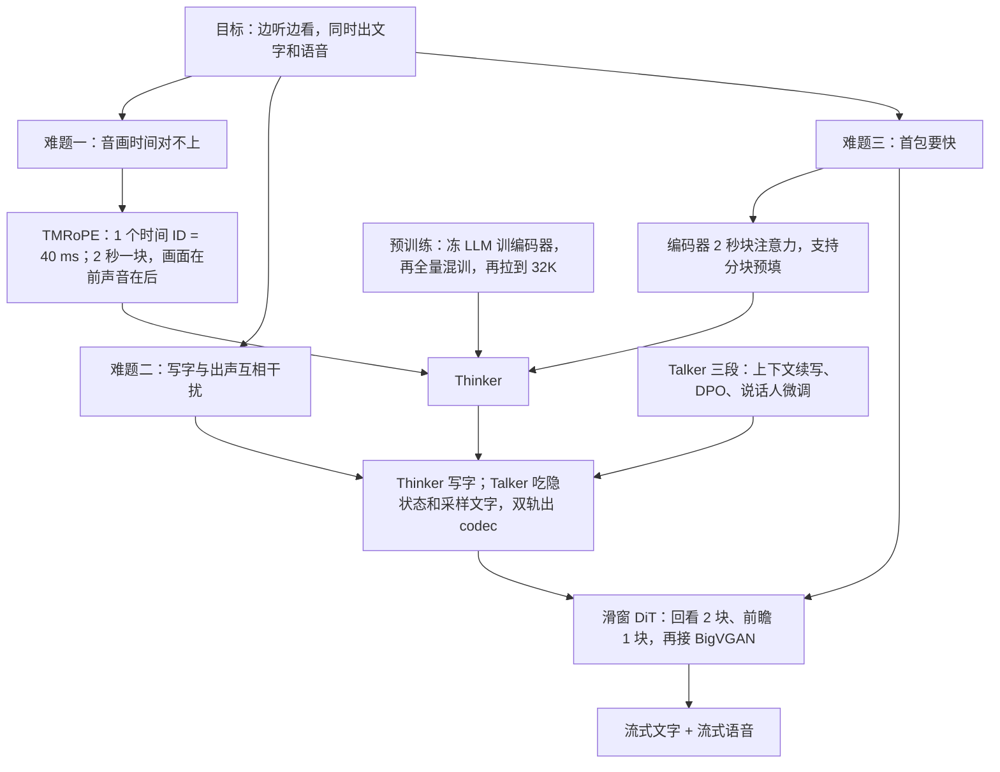

# Qwen2.5-Omni：让「想」和「说」分成两个部件，还能一起训

<!-- release-date: 2025-03-26 -->

> 本文依据 Qwen Team 的 **Qwen2.5-Omni Technical Report**，arXiv:2503.20215v1，2025-03-26 提交，PDF 封面日期 2025-03-27，共 20 页（正文到 p. 13，其后是作者名单与参考文献）。页码均指 PDF 自身页码。文中区分三件事：**报告明确写了什么**、**我们怎么解释它**、**哪些是外部资料或本文推算**。

## 先想象一个具体场景

你打开摄像头，对着一段正在播放、带声音的视频说：「他们在聊什么？用语音告诉我。」

模型要同时做好四件事：

1. 边收边看、边收边听，不能等视频放完才开始理解；
2. 知道画面里的哪一秒对应声音里的哪一句；
3. 想清楚答案，写成文字；
4. 在文字还没写完时就开口，而且口气对、字音准。

前三件是「想」，第四件是「说」。这份报告最核心的判断，是**不要让同一条生成链既管想又管说**，但也不要退回到「识别 → 语言模型 → 合成」三个独立服务拼接。它给出的结构叫 Thinker–Talker，是后来 Qwen3-Omni、Qwen3.5-Omni 一直沿用的骨架起点。

## 阅读前先认识几个词

- **全模态（omni-modal）**：一个模型直接吃文本、图像、音频、视频，直接吐出文本和语音，不外挂语音识别或语音合成服务。
- **Thinker 与 Talker**：报告的比喻是大脑与嘴。Thinker 是一个语言模型，负责理解输入、生成文字；Talker 是另一个自回归解码器，接过 Thinker 的内部表示，生成语音 Token（PDF p. 3）。
- **RoPE（旋转位置编码）与 M-RoPE**：RoPE 用「旋转角度」告诉模型每个 Token 在第几个位置。M-RoPE 把一个位置拆成时间、高、宽三个分量，让图像和视频也有二维、三维坐标。
- **codec Token（语音编码 Token）**：把一小段语音压成的离散整数。Talker 生成它，再由解码器还原成波形。
- **DiT 与流匹配（Flow Matching）**：DiT 是用 Transformer 做的扩散式生成网络；流匹配是训练这类网络的一种方法。这里用它把 codec Token 变成梅尔谱（声音的时频图）。
- **首包延迟（initial package delay）**：从输入进系统到第一段能播放的音频出来之间的时间。

## 一句话先说清

Qwen2.5-Omni-7B 用 Qwen2.5 初始化 Thinker，接上 Qwen2.5-VL 的视觉编码器和 Qwen2-Audio 的音频编码器；再加一个 Talker，**同时吃 Thinker 的隐状态和它刚采样出的文字**，生成语音 Token；最后用一个只看附近几块的 DiT 把 Token 流式地变成声音（PDF p. 3–6）。

为了让这条链能「边收边算」，报告做了四个设计：

| 要解决的事 | 设计 | 页码 |
|---|---|---|
| 声音与画面对不上时间 | TMRoPE：一个时间 ID 固定等于 40 毫秒；带声视频每 2 秒一块、块内画面在前声音在后 | PDF p. 4 |
| 写字和出声互相干扰 | Thinker–Talker：两条生成链，端到端一起训 | PDF p. 3–5 |
| 编码器等整段输入才出结果 | 音频编码器改成每 2 秒一块的块注意力，支持分块预填 | PDF p. 5 |
| 语音解码要等全部 Token | 滑窗 DiT：只看回看 2 块、前瞻 1 块 | PDF p. 5 |

报告的主要结论（PDF p. 1–2）：图像能力与同尺寸 Qwen2.5-VL 相当，音频强于 Qwen2-Audio；OmniBench 达到当时最好；语音输入下的指令跟随在 MMLU、GSM8K 上接近文本输入；语音生成在 SEED 测试集上的 WER 为 1.42% / 2.33% / 6.54%。这些话哪些被表格撑住，实验节逐条回表。

如果只记一句：

> **流式全模态要做三件事：感知按块切开，时间用带物理单位的尺子对齐，「想」和「说」各走一条生成链但共享同一份上下文。**

## 全景：一个脑、一张嘴

图上有三件事值得先看清：

1. **Thinker 就是一个普通的语言模型**：Transformer 解码器，外面挂着音频和视觉编码器，自回归地写字（PDF p. 3–4）。
2. **Talker 吃的是 Thinker 的「整段历史」**：报告写明，训练和推理时 Talker 都直接接收 Thinker 的高维表示，并共享 Thinker 的全部历史上下文（PDF p. 3）。图上 Talker 的输入里，提示部分的视觉、音频隐状态也在。
3. **Talker 是「双轨」的**：它是一个双轨自回归 Transformer 解码器，设计动机来自 Mini-Omni（PDF p. 3）。从图上读，它的输出是文本 Token 与 codec Token 成对出现；正文对应的说法是 Talker「自回归地生成音频 Token 和文本 Token」（PDF p. 5）。

整个系统按一个模型端到端训练和推理（PDF p. 3）。报告没有给出 Talker 的层数、宽度，也没有给出整个模型的总参数量；评测表里的对象一律写作 Qwen2.5-Omni-7B（PDF p. 8–13）。

## 核心设计一：输入侧——编码器按块吐结果

### 旧问题：整段编码把首包锁死

报告把首包延迟拆成四个来源（PDF p. 5）：

1. 处理多模态输入的延迟；
2. 从收到第一个文本到输出第一个语音 Token 的延迟；
3. 把第一段语音 Token 变成音频的延迟；
4. 架构本身的固有延迟，与模型大小、计算量有关。

这一节管第 1 项，后面的 Talker 管第 2 项，滑窗 DiT 管第 3 项。第 4 项报告只是点名，没有给数字。

普通的音频编码器对整段音频做全局注意力，必须听完才能出结果；Thinker 也就只能等输入结束才开始预填。

### 新设计：块注意力，接上分块预填

分块预填（chunked prefill）是推理框架常见的机制：输入不必一次性算完，可以一块一块算进 KV Cache。要让它在多模态输入上也成立，编码器必须沿时间「一块一块交卷」（PDF p. 5）。

**音频编码器**（PDF p. 4–6）：

- 输入重采样到 16 kHz，转成 128 通道梅尔谱，窗长 25 毫秒、跳步 10 毫秒；
- 编码器沿用 Qwen2-Audio，每帧输出大约对应 40 毫秒原始音频；预训练时从 Whisper-large-v3 初始化；
- 注意力从「看完整段」改成「每 2 秒一块」。

**视觉编码器**（PDF p. 4–5）：

- 沿用 Qwen2.5-VL 的 ViT，约 6.75 亿参数，图像与视频混合训练；
- patch 大小 14，用 FlashAttention；一个简单 MLP 把相邻 2×2 个 Token 合成 1 个；不同分辨率的图像可以打包进同一条序列；
- 视频按动态帧率采样，报告的说法是「尽量完整保留视频信息，同时适配音频的采样率」；每张静态图被当作两帧相同的画面。

文本分词器是 Qwen 的字节级 BPE，词表 151,643 个常规 Token（PDF p. 4）。

报告在摘要里把这种分工概括为：**长序列的感知交给编码器，长序列的建模交给语言模型**（PDF p. 1）。

### 边界

- 2 秒块之间是否重叠、结尾不足 2 秒怎么处理，报告没写；
- 动态帧率的上下限没写；视觉编码器在推理时是否也按块输出，报告只写了「音频和视觉编码器都支持沿时间的块注意力」，具体细节只给了音频那一条；
- 没有「块注意力 vs 全注意力」的精度对照。

**可迁移**：流式系统里，编码器训练时的可见范围要和上线时一致。训练一直看整段、上线按 2 秒切，每一块都是没见过的输入分布。

## 核心设计二：TMRoPE——一个时间 ID 等于 40 毫秒

### 旧问题：一维位置只知道「谁在谁前面」

普通 RoPE 给每个 Token 一个一维序号。把视频帧和音频帧交错排进同一条序列后，模型能知道谁先谁后，却不知道「这一帧画面和这一段声音发生在同一秒」。视频帧率还不固定，按帧数编号更对不上真实时间。

### 新设计：M-RoPE 加上绝对时间

TMRoPE（Time-aligned Multimodal RoPE）是在 M-RoPE 基础上加了绝对时间（PDF p. 4）。每个 Token 的位置拆成时间、高、宽三个分量，各模态的编号规则见图底；最关键的是两条：

- **音频**：三个分量用同一个 ID，并且**一个时间 ID 对应 40 毫秒**；
- **视频**：每帧当作一张图，时间 ID 按帧的**真实时刻**动态调整，保证一个 ID 仍然对应 40 毫秒（PDF p. 4）。

40 毫秒不是随手选的：音频编码器每帧恰好约 40 毫秒（PDF p. 4）。于是**音频帧、时间 ID、视频帧时刻用的是同一把尺**。在原图的例子里，第 1 秒的帧时间 ID 是 25，恰好等于第 1 秒处音频的 ID。

### 时间交错：块内画面在前、声音在后

只有位置编号还不够，还要决定 Token 排进序列的顺序。对带声视频，报告按真实时间每 2 秒切一块，块内视觉表示放前面、音频表示放后面，一块接一块排下去（PDF p. 4）。这样模型在同一个 2 秒窗口里同时拿到画面和声音，而不是先看完全部视频再听全部音频。

这个 2 秒与音频编码器的 2 秒块注意力是同一个数（PDF p. 4–5）：编码器每交一块卷，序列里就多一个完整的音画块，正好可以预填。

### 边界

- 没有消融：有无绝对时间、交错与否、2 秒与其他块长，都没有对照数字；
- 时间 ID 是「数值上对齐」，但离开训练见过的时长，40 毫秒一格的 ID 会很快变大（1 小时就是 90,000，本文换算），报告没有讨论长视频下的外推；
- 图底那条「后一模态从前一模态最大 ID 加 1 开始编号」，意味着文本位置也会被视频时长推高，报告没有讨论其影响。

**可迁移**：多模态位置编码里，「排序」与「绝对时间」最好分开表达；时间格最好等于编码器的帧长，一把尺子管到底。

## 核心设计三：Thinker 写字，Talker 出声

### 旧问题：两种输出挤在同一条链上

报告在引言里把它列为三个关键难题之一：必须管理不同模态输出之间的干扰，保证文本 Token 与语音 Token 的训练互不扰乱（PDF p. 2）。如果一个解码器每一步都要在「下一个字」和「下一个声音片段」之间选择，两套目标会互相拉扯。

级联系统（识别 → 语言模型 → 合成）能避开这个问题，但合成那一段只看得到文字，看不到上下文里的语气和画面，而且要等文字成句才开口。

### 新设计：Talker 同时吃「隐状态」和「采样出的字」

这是整份报告最值得停下来想的一处（PDF p. 5）：

- **只给隐状态不够**：Thinker 的高层表示主要表达语义相似性，而不是发音相似性。读音完全不同的两个词，表示可能很接近，所以必须同时输入采样出的离散文本 Token，消除「到底念哪个字」的不确定性；
- **只给字也不够**：流式语音必须在整段文字写完之前就预判出语气和态度。Thinker 的高层表示里隐含着这些信息，让流式生成更自然。

一句话：**隐状态告诉嘴「用什么口气」，文字告诉嘴「念哪个音」。**

另两处关键说法（PDF p. 5）：

- 语音生成不需要与文字做词级或时间戳级对齐。报告认为这显著简化了训练数据和推理流程；
- 语音 Token 来自自研的 **qwen-tts-tokenizer**，可以通过因果音频解码器流式还原成语音。它的帧率、码本数，报告都没写。

### 收益与边界

- **收益**：文字生成不被语音目标打扰，Thinker 可以保持语言模型的原样；Talker 从第一个字开始就能拿到口气信息，不必等句子写完。
- **边界**：没有与「单链同时出文字和语音」的对照实验，干扰究竟有多大、拆开后减轻多少，报告没有给数字。Talker 取 Thinker 哪一层的隐状态、两条轨道如何交替，只能从 Figure 2 读出大概。

**可迁移**：凡是「一个模型要同时产出两种形式」的系统，都可以问一句：两种输出的目标会不会打架？能不能拆成两个头或两个解码器，但让后者看到前者的完整内部状态，而不是只看到它的文字输出？

## 核心设计四：滑窗 DiT——只看附近几块

### 旧问题：看全局的解码器没法流式

codec Token 变成声音分两步：流匹配 DiT 把 codec 转成梅尔谱，改进版 BigVGAN 再把梅尔谱转成波形（PDF p. 5）。如果 DiT 的注意力看整段 codec，就必须等 Talker 把一整句话的 Token 全吐完才能开始合成。

### 新设计：按块划掩码，回看 2 块、前瞻 1 块

相邻的 codec 被分成块，块是注意力掩码的单位；DiT 的感受野限制为 4 块，其中回看 2 块、前瞻 1 块；解码时按块用流匹配生成梅尔谱，保证每块都拿得到它需要的上下文。BigVGAN 的感受野本来就固定，也按同样的逐块方式流式生成波形（PDF p. 5）。

图右的推论是本文的解读：**前瞻 1 块是首包的结构下限**。当前块要看后一块，所以第 0 块的声音至少要等第 1 块的 codec 生成完才能合成。报告说限制感受野是为了降低首包延迟（PDF p. 1），这个「降低」是相对于看全部上下文而言的，不是降到「第一个 Token 出来就有声」。

### 边界

- 一块含几个 codec、对应多少毫秒，报告没写，所以这个下限换算不成时间；
- 没有「窗口大小 vs 音质」的对照；
- 报告全文没有任何首包延迟的毫秒数。

**可迁移**：描述一个流式解码器时，写成「回看 $L$ 块、前瞻 $R$ 块、每块多少毫秒」，比只说「滑窗大小」有用得多：$R$ 乘以块长就是结构上躲不掉的等待。

## 训练：先对齐编码器，再全量混训，最后拉长

### 预训练三阶段

| 阶段 | 做什么 | 数据与长度 |
|---|---|---|
| 一 | 冻结 LLM，只训视觉编码器与音频编码器；两个编码器分开训，都是先训适配器、再训编码器本身 | 大量音频–文本、图像–文本对；最长 8192 Token |
| 二 | 解冻全部参数，混入更广的多模态、多任务数据 | 新增约 8000 亿 Token 图像与视频相关数据、3000 亿 Token 音频相关数据、1000 亿 Token 带声视频数据，另有纯文本；最长 8192 Token |
| 三 | 长序列训练 | 加入长音频、长视频，把各类数据扩到 32,768 Token |

（PDF p. 6）初始化：LLM 来自 Qwen2.5，视觉编码器与 Qwen2.5-VL 相同，音频编码器从 Whisper-large-v3 初始化（PDF p. 6）。提示词跟随 Qwen2-Audio，把层级标签换成自然语言，报告说这能提升泛化与指令跟随（PDF p. 6）。

第二阶段新增的多模态数据合计 1.2 万亿 Token（本文加总）。纯文本占多少、第一和第三阶段各多少 Token、用了什么硬件，报告都没写。报告只说纯文本「对保持和提升语言能力至关重要」（PDF p. 6）。

### 后训练：Thinker 一段，Talker 三段

数据统一用 ChatML 格式；报告给了一段带视频的多轮对话示例（PDF p. 6）。

**Thinker** 只有一句描述：用 ChatML 格式的指令数据做指令微调，数据含纯文本、视觉、音频和混合模态对话（PDF p. 6）。没有数据量，没有强化学习。

**Talker** 分三段（PDF p. 7）：

1. **上下文续写（ICL）**：除了与 Thinker 类似的文本监督，还在大量「多模态上下文 + 语音回答」的对话上做下一 Token 预测的语音续写。Talker 学的是从语义表示到语音的单调映射，以及随上下文变化的韵律、情感、口音。同时做音色解耦，避免模型把某个音色和少见的文本模式绑在一起。
2. **DPO 提升稳定性**：为了覆盖更多说话人和场景，预训练数据不可避免有标注噪声和发音错误，会让模型「幻觉」。对每条请求与回答文本配参考语音，构造三元组 $(x, y_w, y_l)$：$x$ 是输入序列，$y_w$、$y_l$ 是好的与差的生成语音。好坏按**词错误率（WER）与标点停顿错误率**对应的奖励分排序。损失是标准 DPO：

$$
L_{\text{DPO}}(P_\theta; P_{\text{ref}}) = -\mathbb{E}_{(x, y_w, y_l) \sim D}\left[ \log \sigma\!\left( \beta \log \frac{P_\theta(y_w \mid x)}{P_{\text{ref}}(y_w \mid x)} - \beta \log \frac{P_\theta(y_l \mid x)}{P_{\text{ref}}(y_l \mid x)} \right) \right]
$$

$P_\theta$ 是正在训的 Talker，$P_{\text{ref}}$ 是参考模型，$\beta$ 控制偏离参考的幅度，$\sigma$ 是 sigmoid。直觉是：让好样本相对参考模型的概率上升得比差样本多（PDF p. 7，式 1）。
3. **说话人微调**：在上面的基座上做多说话人指令微调，让 Talker 学会特定音色、更自然（PDF p. 7）。

第 2 段值得记住的是奖励来源：**WER 和停顿错误率都能用程序自动算**，不需要人工打分。报告没给 $\beta$、偏好对数量、参考模型是谁。

## 实验：把摘要里的主张逐条回表

报告把评测分成「X → 文本」（理解）与「X → 语音」（生成）两类（PDF p. 7）。所有对照数字都以本报告表格为准。

### 文本：高于 Qwen2-7B，全面低于自己的底座 Qwen2.5-7B

| 基准 | Gemma2-9B | Llama3.1-8B | Qwen2-7B | Qwen2.5-7B | Qwen2.5-Omni-7B |
|---|---:|---:|---:|---:|---:|
| MMLU-Pro | 52.1 | 48.3 | 44.1 | **56.3** | 47.0 |
| MMLU-redux | 72.8 | 67.2 | 67.3 | **75.4** | 71.0 |
| LiveBench 0831 | 30.6 | 26.7 | 29.2 | **35.9** | 29.6 |
| GPQA | 32.8 | 32.8 | 34.3 | **36.4** | 30.8 |
| MATH | 44.3 | 51.9 | 52.9 | **75.5** | 71.5 |
| GSM8K | 76.7 | 84.5 | 85.7 | **91.6** | 88.7 |
| HumanEval | 68.9 | 72.6 | 79.9 | **84.8** | 78.7 |
| MBPP | 74.9 | 69.6 | 67.2 | **79.2** | 73.2 |
| MultiPL-E | 53.4 | 50.7 | 59.1 | **70.4** | 65.8 |
| LiveCodeBench 2305–2409 | 18.9 | 8.3 | 23.9 | **28.7** | 24.6 |

（PDF p. 8，Table 1）

报告的总结是「大体介于 Qwen2-7B 与 Qwen2.5-7B 之间」（PDF p. 8），这个说法准确。但 Thinker 是从 Qwen2.5 初始化的（PDF p. 6），**真正的对照是 Qwen2.5-7B，而 Omni 在全部 10 项上都更低**，差距从 GSM8K 的 2.9 分到 MMLU-Pro 的 9.3 分（本文减法）。GPQA 30.8 和 HumanEval 78.7 还低于 Qwen2-7B。这是全模态训练在文本上交的税，报告没有专门讨论。

### 音频理解：多数任务强于 Qwen2-Audio，但不是全部

**语音识别（WER，越低越好）**（PDF p. 9，Table 2）：

| 数据集 | Qwen2-Audio | Qwen2.5-Omni-7B | 表中最低 |
|---|---:|---:|---|
| LibriSpeech dev-clean / dev-other / test-clean / test-other | 1.3 / 3.4 / 1.6 / 3.6 | 1.6 / 3.5 / 1.8 / 3.4 | test-other：Seed-ASR-Multilingual 2.8 |
| Common Voice 15 en / zh / yue / fr | 8.6 / 6.9 / 5.9 / 9.6 | 7.6 / 5.2 / 7.3 / 7.5 | 粤语：Qwen2-Audio 5.9 |
| Fleurs zh / en | 7.5 / — | 3.0 / 4.1 | 中文与 MinMo 并列 3.0；英文 Seed-ASR-Multilingual 3.4 |
| WenetSpeech test-net / test-meeting | — | 5.9 / 7.7 | Seed-ASR-Chinese 4.7 / 5.7 |
| VoxPopuli en | — | 5.8 | Llama-3-70B 5.7 |

**语音翻译 CoVoST2（BLEU，越高越好）**：Omni 为 30.2 / 37.7 / 41.4 / 29.4（en-de / de-en / en-zh / zh-en）。en-de 与 zh-en 是表内最高；de-en 低于 MinMo 的 39.9，en-zh 低于 MiniCPM-o 的 48.2、也低于 Qwen2-Audio 的 45.2（PDF p. 9，Table 2）。

**其他音频任务**（PDF p. 10，Table 3）：Meld 情感识别 0.570（Qwen2-Audio 0.553）；VocalSound 0.939，与 Qwen2-Audio 持平；GiantSteps 节奏 0.88（LLark-7B 0.86）；MMAU 的声音、音乐、语音与平均为 67.87 / 69.16 / 59.76 / 65.60，四项都高于 Gemini-Pro-V1.5（56.75 / 49.40 / 58.55 / 54.90）和 Qwen2-Audio。

**语音对话 VoiceBench**：平均 74.12，是表内最高（MiniCPM-o 71.69、Ultravox 71.45）；但分项里 AlpacaEval 4.49 低于 Ultravox 的 4.55，CommonEval 3.93 低于 MiniCPM-o 的 4.15，IFEval 52.87 低于 Ultravox 的 66.88（PDF p. 10，Table 3）。

所以摘要里「强于 Qwen2-Audio」（PDF p. 1）在 MMAU、VoiceBench、多数 Common Voice 与 Fleurs 上成立；在 LibriSpeech 的三个子集、粤语识别、CoVoST2 英译中上不成立。正文用的词是「更好或相当」（PDF p. 8），更准确。

### 语音输入的指令跟随：只在两列上「接近文本」

团队把若干纯文本基准的题目转成语音，约 90% 适合朗读的题被用上；Qwen2.5-Omni 与 Qwen2-Audio 听语音，Qwen2-7B 读文本（PDF p. 8、p. 10）：

| 基准 | Qwen2-7B（文本输入） | Qwen2-Audio（语音输入） | Qwen2.5-Omni-7B（语音输入） |
|---|---:|---:|---:|
| MMLU | 69.3 | 33.2 | 65.6 |
| CEval | 78.4 | 38.6 | 61.1 |
| IFEval | 53.3 | 15.6 | 41.7 |
| GSM8K | 82.3 | 18.4 | 85.4 |
| Math23K | 92.3 | 23.0 | 87.1 |
| Math401 | 75.5 | 20.4 | 62.2 |

（PDF p. 10，Table 4）

相对 Qwen2-Audio 是断档式领先，这一点表格撑得住。摘要说语音指令跟随「与文本输入相当，MMLU 和 GSM8K 为证」（PDF p. 1），要读准两处：

- 对照的文本模型是 **Qwen2-7B**，不是 Omni 自己读文本，也不是它的底座 Qwen2.5-7B；
- 摘要点名的恰好是差距最小的两列（MMLU 差 3.7 分，GSM8K 反超 3.1 分）；CEval 差 17.3 分，Math401 差 13.3 分，IFEval 差 11.6 分（本文减法）。

### 图像与视频：与 Qwen2.5-VL-7B 相当

图像 Table 5 共 18 行，对 Qwen2.5-VL-7B 是 6 行更高、12 行更低，差距多在 1 分左右（本文统计）（PDF p. 11）。几行代表性的：

| 基准 | GPT-4o-mini | Qwen2.5-VL-7B | 其他开源最好 | Qwen2.5-Omni-7B |
|---|---:|---:|---:|---:|
| MMMU val | 60.0 | 58.6 | 53.9 | 59.2 |
| MathVista testmini | 52.5 | 68.2 | 71.9 | 67.9 |
| MMBench-V1.1-EN test | 76.0 | 82.6 | 80.5 | 81.8 |
| MME-RealWorld en | — | 57.4 | — | 61.6 |
| DocVQA test | — | 95.7 | 93.5 | 95.2 |
| ChartQA test | — | 87.3 | 84.9 | 85.3 |
| OCRBench_V2 en | — | 56.3 | — | 57.8 |

（PDF p. 11，Table 5）领先最多的一行是 MME-RealWorld（高 4.2），落后最多的是 ChartQA（低 2.0）。报告的原话是「与 Qwen2.5-VL-7B 相当」，并在 MMMU、MathVision、MMBench-V1.1-EN、TextVQA、DocVQA、ChartQA 上好于其他开源全模态模型（PDF p. 10），这两句都与表格一致。

视觉定位 Table 6 共 10 项，Omni 在 5 项上是全表最高（RefCOCO testA、RefCOCO+ testA 与 testB、RefCOCOg val 与 test）；RefCOCO val、testB 和 RefCOCO+ val 输给 Grounding DINO，开放词表检测 ODinW 42.2 mAP 低于 Grounding DINO 的 55.0，点定位 66.5 略低于 Qwen2.5-VL-7B 的 67.3（PDF p. 11，Table 6；本文统计）。报告说「在多数基准上超过其他模型」，实际是一半。

视频（无音频）Table 7：Video-MME 无字幕 64.3，略低于 Qwen2.5-VL-7B 的 65.1；有字幕 72.4、MVBench 70.3、EgoSchema 68.6，均高于 Qwen2.5-VL-7B 的 71.6、69.6、65.0（PDF p. 12，Table 7）。

### 跨模态：OmniBench 平均领先一大截

| 模型 | 语音 | 声音事件 | 音乐 | 平均 |
|---|---:|---:|---:|---:|
| Gemini-1.5-Pro | 42.67% | 42.26% | 46.23% | 42.91% |
| video-SALMONN（13B） | 34.11% | 31.70% | **56.60%** | 35.64% |
| UnifiedIO2-xlarge（3.2B） | 39.56% | 36.98% | 29.25% | 38.00% |
| MiniCPM-o | — | — | — | 40.5% |
| Baichuan-Omni-1.5 | — | — | — | 42.9% |
| Qwen2.5-Omni-7B | **55.25%** | **60.00%** | 52.83% | **56.13%** |

（PDF p. 12，Table 8，节选）平均比第二名高 13 分以上；音乐子集低于 video-SALMONN。引言还说在 AV-Odyssey Bench 上达到当时最好（PDF p. 2），但正文没有这张表，也没有数字。

### 语音生成：RL 之后超过 CosyVoice 2，但不是最好

零样本语音生成在 SEED 的中文、英文、困难集上测内容一致性（WER）和说话人相似度（SIM）（PDF p. 12–13）：

| 模型 | WER zh / en / hard ↓ | SIM zh / en / hard ↑ |
|---|---|---|
| Seed-TTS（RL） | **1.00** / 1.94 / **6.42** | **0.801** / **0.766** / **0.782** |
| MaskGCT | 2.27 / 2.62 / 10.27 | 0.774 / 0.714 / 0.748 |
| F5-TTS | 1.56 / **1.83** / 8.67 | 0.741 / 0.647 / 0.713 |
| CosyVoice 2 | 1.45 / 2.57 / 6.83 | 0.748 / 0.652 / 0.724 |
| Qwen2.5-Omni-7B（ICL） | 1.70 / 2.72 / 7.97 | 0.752 / 0.632 / 0.747 |
| Qwen2.5-Omni-7B（RL） | 1.42 / 2.33 / 6.54 | 0.754 / 0.641 / 0.752 |

（PDF p. 13，Table 9，节选）

- **最硬的证据是同一模型的前后对照**：DPO 之后困难集 WER 从 7.97 降到 6.54，报告说注意力错位、发音错误和不当停顿明显减少（PDF p. 12）。
- 引言说 1.42 / 2.33 / 6.54 超过 MaskGCT 和 CosyVoice 2（PDF p. 2），WER 上成立；但 Seed-TTS 三项都更好，英文 WER 还输给 F5-TTS。
- 英文说话人相似度 0.641 是表内除自己的 ICL 版本之外最低的。

单说话人微调（Table 10）：四个微调说话人的中文 WER 在 1.28–1.37，真人录音是 1.25；主观自然度 NMOS 中文 4.46–4.51、英文 4.51–4.62，真人中文 4.51（PDF p. 13）。NMOS 是在自建数据集上的主观评分（PDF p. 12）。

有一处数字两表对不上：Table 10 里「Qwen2.5-Omni RL」的中文 WER 是 1.30，而 Table 9 里同名模型是 1.42；英文 2.33、困难集 6.54 两表一致（PDF p. 13）。报告没有解释。

## 报告没有公开的

- Talker 的规模、层数，取 Thinker 哪一层的隐状态，双轨如何交替；整个模型的总参数量；
- qwen-tts-tokenizer 的帧率、码本数；DiT 一块含几个 codec、对应多少毫秒；
- 任何首包延迟或吞吐的毫秒数，以及测量硬件；
- 所有设计的消融：TMRoPE、2 秒交错、块注意力、Thinker–Talker 拆分、滑窗大小；
- 各训练阶段的硬件、步数、学习率、批量，纯文本数据量；Thinker 后训练的数据量；DPO 的 $\beta$ 与偏好对数量；
- AV-Odyssey Bench 的数字；
- 结论里点名的两个难题——视频 OCR 与音视频协同理解——报告说需要学界与业界一起建评测与数据，但没有给出它们在本模型上的表现（PDF p. 13）。

## 最值得带回自己项目的六条

### 1. 同时产出两种形式时，考虑拆成「想」与「说」

一个模型既写字又出声，两种目标会互相干扰。Thinker–Talker 拆成两个解码器，但让后者共享前者的全部上下文，端到端一起训。拆的是生成链，不是信息流。

### 2. 给下游解码器同时喂「语义状态」和「离散结果」

连续隐状态携带口气、态度这类还没写成字的信息；离散 Token 消除「同义不同音」的歧义。只给一样都会出错。这条对任何「从上游模型接力生成」的系统都适用。

### 3. 时间对齐要有物理单位

一个位置 ID 对应 40 毫秒，且等于音频编码器的帧长。这比加一组可学习的时间嵌入更容易检查，也让视频帧率变化时仍能对齐。

### 4. 编码器的可见范围，训练和上线保持一致

音频编码器按 2 秒块注意力训练，上线时按 2 秒块预填，才不是分布外输入。

### 5. 流式解码器的前瞻，就是首包躲不掉的等待

滑窗写成「回看 2、前瞻 1」，前瞻的那 1 块就是结构下限。设计流式系统时先定前瞻，再谈音质。

### 6. 能用程序打分的偏好，就别请人

Talker 的 DPO 用 WER 与停顿错误率排序好坏样本，全自动、可复现。语音合成的稳定性问题，大多能落到这类可计算的指标上。

## 用一张图重新串起全文

## 关键词回看

- **Thinker–Talker**：Thinker 是写字的语言模型，Talker 是接过它全部上下文、生成语音 Token 的双轨自回归解码器，端到端一起训。
- **隐状态 + 采样文字**：前者给口气，后者给读音。
- **TMRoPE**：时间、高、宽三分量的旋转位置编码，一个时间 ID 固定为 40 毫秒。
- **时间交错**：带声视频按 2 秒切块，块内画面在前、声音在后。
- **块注意力与分块预填**：音频编码器每 2 秒一块，输入到一块就能预填一块。
- **qwen-tts-tokenizer**：自研语音编码，可经因果解码器流式还原。
- **滑窗 DiT**：流匹配 DiT 出梅尔谱，感受野 4 块（回看 2、前瞻 1），BigVGAN 逐块出波形。
- **Talker 的 DPO**：按 WER 与标点停顿错误率排序好坏语音。

## 最后的判断

Qwen2.5-Omni 这份报告的价值在结构，不在分数。它把流式全模态拆成了三个可以各自动手的问题：输入按块切、时间用一把带单位的尺、「想」和「说」分成两条链。这副骨架在后续的 Qwen3-Omni、Qwen3.5-Omni 里仍在，后作改了什么见那两篇。

证据强度是分层的：

- **有表格支撑的**：图像、视频与 Qwen2.5-VL-7B 相当（Table 5、7）；MMAU、VoiceBench 平均、OmniBench 平均明显领先同尺寸开源模型（Table 3、8）；语音输入的指令跟随相对 Qwen2-Audio 大幅提升（Table 4）；Talker 的 DPO 把困难集 WER 从 7.97 降到 6.54（Table 9）。
- **文字说得比表格满的**：「语音指令跟随与文本相当」只在 MMLU、GSM8K 两列成立，且对照是 Qwen2-7B；「强于 Qwen2-Audio」不包括 LibriSpeech、粤语、英译中；视觉定位「多数领先」实际是一半；「OmniBench 最好」是平均分，音乐子集不是。
- **没有测量的**：全部流式设计都没有延迟数字，也没有消融；AV-Odyssey 只有一句话。
- **读者自己要记住的代价**：文本能力在全部 10 项上低于自己的底座 Qwen2.5-7B。

如果只带走一句：

> **让「想」和「说」各走一条链，但让「说」看得见「想」的全部内部状态；流式的每一段等待，都要能指出它来自哪个窗口。**

## 资料与阅读边界

**原始依据**

- Qwen2.5-Omni Technical Report，[arXiv:2503.20215](https://arxiv.org/abs/2503.20215) v1（2025-03-26 提交，PDF 封面日期 2025-03-27），20 页。arXiv 上只有这一版；官方仓库 `assets/Qwen2.5_Omni.pdf` 的正文与此版逐词一致，只差封面日期（仓库版标 2025-03-26）与 arXiv 水印。

**首发日（外部证据）**

- `release-date` 取 **2025-03-26**。官方仓库 [QwenLM/Qwen2.5-Omni](https://github.com/QwenLM/Qwen2.5-Omni) 的 README 发布日志写明「2025.03.26: We have released the Qwen2.5-Omni」，并有同日一条说明 Qwen Chat 已可实时交互；Hugging Face [Qwen/Qwen2.5-Omni-7B](https://huggingface.co/Qwen/Qwen2.5-Omni-7B) 的权重文件提交于 2025-03-26 06:43 UTC。仓库在 3 月 22 日就已建好，不算公开事件；官方博客标注 3 月 27 日，按「日志与博客不一致取日志」不取。3B 版本 2025-04-30 才发布，不在这份报告里。

**外部补充（不是报告内容）**

- 报告引用的组件来源：Qwen2.5-VL Technical Report（[arXiv:2502.13923](https://arxiv.org/abs/2502.13923)）；Seed-TTS（[arXiv:2406.02430](https://arxiv.org/abs/2406.02430)），SEED 测试集出自这篇。以上编号取自报告参考文献。
- 同系列后作在本仓库另有 Qwen3-Omni、Qwen3.5-Omni 两篇解读；本文不引用后作的任何数字。

**本文推算与读图**

- 文本与语音指令表的逐项差值、第二阶段数据加总、1 小时对应的时间 ID、各表胜负计数，都是本文按报告数字做的计算。
- Talker 输入三行、输出成对的读法来自 Figure 2 读图，正文只有文字描述。
- 两张讲解图（TMRoPE、滑窗 DiT）按 PDF p. 4–5 的文字与 Figure 3、Figure 4 重画；TMRoPE 图的帧间隔沿用原图示例，滑窗图右侧的步骤与「首包下限」是本文的推断。
