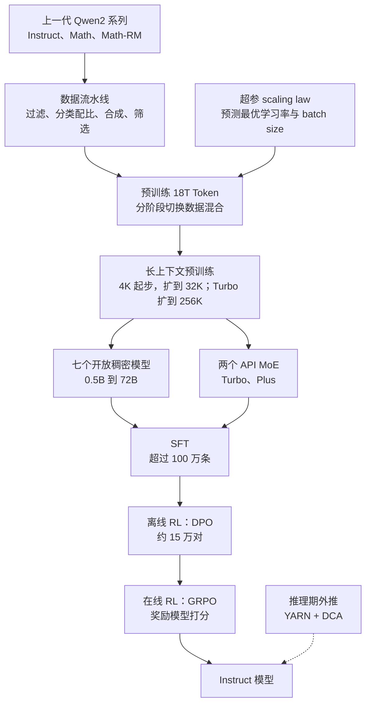
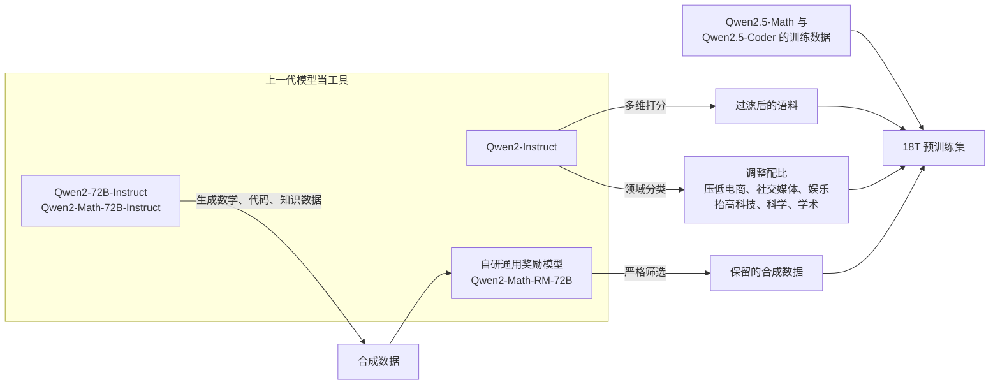

# Qwen2.5：骨架不动，一代的提升押在数据、超参与后训练分工上

<!-- release-date: 2024-09-19 -->

> 本文依据本地 `papers/Alibaba/Qwen2.5.pdf`，即 Qwen Team 的 **Qwen2.5 Technical Report**，arXiv:2412.15115v2（2025-01-03 提交），封面日期 2025-01-06，共 26 页。页码均指 PDF 自身的页码。文中区分三件事：**报告明确写了什么**、**我们怎么解释它**、**哪些是外部资料或本文推算**。

## 阅读前先认识几个词

- **稠密模型与 MoE（Mixture-of-Experts，混合专家）**：稠密模型每个 Token 跑全部参数；MoE 把前馈层拆成许多专家，每个 Token 只激活少数几个，总参数可以很大、单次计算却不必同比变大。
- **GQA（Grouped Query Attention，分组查询注意力）**：多个 Query 头共用一组 Key/Value，推理时要缓存的 KV 因此变少。
- **RoPE 与 base frequency**：RoPE（旋转位置编码）按位置把向量转一个角度；base frequency 决定角度随位置变化的快慢，调大它是扩展上下文的常用旋钮。
- **YARN 与 DCA**：两种推理时的长度外推方法，不重新训练就让模型处理比训练更长的输入。DCA 是 Dual Chunk Attention（双块注意力）。
- **SFT、DPO、GRPO**：SFT（监督微调）用「问题 + 示范回答」直接教；DPO（直接偏好优化）用同一问题的好坏回答成对地教，数据可以提前备好；GRPO（组相对策略优化）让模型对同一问题采样一组回答，按组内相对好坏更新，必须边训边采样。

## 一句话先说清

Qwen2.5 的骨干网络和 Qwen2 基本一样，报告的架构一节只有两段（PDF p. 2–3）。这一代的提升来自三处：

- **数据**：预训练从 7T Token 扩到 18T，而且过滤、分类、合成、筛选都交给上一代 Qwen2 系列模型来做（PDF p. 3–4）；
- **超参**：scaling law 不用来决定模型多大，而用来预测每个尺寸的最优学习率与 batch size（PDF p. 4）；
- **后训练分工**：有标准答案、但奖励模型不好评的能力（数学、代码、指令遵循、逻辑推理）走离线 DPO；需要察觉细微质量差别的（有用、简洁、无害等）交给奖励模型，走在线 GRPO（PDF p. 5–7）。

产品上，它是一整条线：0.5B 到 72B 七个开放权重的稠密模型，加 Turbo、Plus 两个只在 API 上提供的 MoE（PDF p. 1–2）。

它最值得记住的一处诚实是奖励模型那一节：团队在迭代中发现，**奖励模型在评测基准上分数更高，不代表用它训出的 RL 模型更好**（PDF p. 16）。

如果只记一句：

> **架构红利不大时，一代模型的增量可以来自「谁来造数据、超参怎么定、什么信号交给谁判」。但只要链条里有一个学出来的判官，你就得先回答「怎么知道它可靠」。**

## 先看全景

据 PDF p. 2–7 重画的流程示意，不代表时间或算力占比。报告写到预训练「分阶段以便在不同数据混合之间切换」（PDF p. 2），但没有给阶段数与各阶段配比。

七个开放权重模型的规格（Table 1，PDF p. 3）：

| 模型 | 层数 | Q / KV 头数 | 共享词嵌入 | 上下文 / 生成长度 | 许可证 |
|---|---:|---|---|---|---|
| 0.5B | 24 | 14 / 2 | 是 | 32K / 8K | Apache 2.0 |
| 1.5B | 28 | 12 / 2 | 是 | 32K / 8K | Apache 2.0 |
| 3B | 36 | 16 / 2 | 是 | 32K / 8K | Qwen Research |
| 7B | 28 | 28 / 4 | 否 | 128K / 8K | Apache 2.0 |
| 14B | 48 | 40 / 8 | 否 | 128K / 8K | Apache 2.0 |
| 32B | 64 | 40 / 8 | 否 | 128K / 8K | Apache 2.0 |
| 72B | 80 | 64 / 8 | 否 | 128K / 8K | Qwen |

几件读表要知道的事：

- **补齐中档**：相比 Qwen2 的 0.5B、1.5B、7B、72B，这一代把 3B、14B、32B 加了回来，理由是这几档在资源受限场景更划算、而开放模型里又缺（PDF p. 2）。
- **共享词嵌入只在 3B 及以下**：词表有 151,643 个常规 Token（PDF p. 3）。**本文的解读**：模型越小，词嵌入与输出投影占总参数的比例越高，共用一份权重更划算。报告没有解释这个分界。7B 的非嵌入参数只有 6.5B（PDF p. 10），也说明词嵌入在小尺寸里占比不低。
- **生成长度全线 8K**：Qwen2 是 2K（PDF p. 2）。
- **许可证不统一**：3B 用 Qwen Research，72B 用 Qwen 许可证，其余 Apache 2.0（PDF p. 3）。报告没有解释原因。
- 摘要还说提供了指令模型的量化版本，Hugging Face、ModelScope、Kaggle 上合计 100 多个模型（PDF p. 1）。

**架构**。稠密模型沿用 Qwen2 的解码器：GQA、SwiGLU、RoPE、注意力里的 QKV bias、pre-normalization 的 RMSNorm（PDF p. 2–3）。MoE 把 FFN 换成多个专家加 top-K 路由，沿用 Qwen1.5-MoE 的细粒度专家切分与共享专家（PDF p. 3）。**Turbo 与 Plus 的层数、专家数、激活参数与总参数都没有给**，Table 1 只覆盖开放权重模型。

**分词器**。byte-level BPE，控制 Token 从 3 个扩到 22 个，其中 2 个给工具调用，其余留给其他能力；整个 Qwen2.5 系列用统一词表（PDF p. 3）。22 个控制 Token 的清单与工具调用格式，报告没有列出。

报告脚注说 Turbo 在 API 里的标识是 `qwen-turbo-2024-11-01`，Plus 是 `qwen-plus-2024-xx-xx (to be released)`（PDF p. 2），而摘要说两者都已在阿里云百炼可用（PDF p. 1）。同一份文件里 Plus 一处写已可用、一处写待发布。

## 数据：18T 是上一代模型造出来的

18T 这个数字本身信息不多（PDF p. 4）。真正的方法是四条改进，全都依赖上一代模型（PDF p. 3–4）：

据 PDF p. 3–4 第 3.1 节重画。箭头表示谁生产或筛选了什么，不代表数据量比例；报告没有给任何配比。

1. **过滤**：用 Qwen2-Instruct 对样本做多维度分析与打分。报告说它比 Qwen2 时期的过滤方法进步，是因为 Qwen2 本身在更大的多语言语料上训练过，判断更细，于是在多种语言上同时提高了高质量数据的留存、低质量数据的剔除（PDF p. 3）。
2. **数学与代码数据**：Qwen2.5-Math 与 Qwen2.5-Coder 的训练数据直接并入预训练（PDF p. 3）。
3. **合成数据**：由 Qwen2-72B-Instruct 与 Qwen2-Math-72B-Instruct 生成数学、代码、知识数据，再用自研通用奖励模型和 Qwen2-Math-RM-72B 严格筛选（PDF p. 3）。
4. **配比**：用 Qwen2-Instruct 给内容分领域。报告观察到，电商、社交媒体、娱乐在网页数据里严重偏多，常是重复、模板化或机器生成的内容；科技、科学、学术内容质量更高却偏少。于是前者下采样、后者上采样（PDF p. 4）。

封面 Figure 1 用柱状图画了 Qwen1.5-72B（3T）、Qwen2-72B（7T）、Qwen2.5-72B（18T）在 Math、MBPP、BBH、MMLU 上的抬升（PDF p. 1），图上没有纵轴刻度，只能读趋势。图注强调的是「规模与混合一起」起作用。

**这一节可以带走什么**：上一代模型可以同时当打分器、分类器、生成器与评判器，把它的能力折算成下一代的数据质量；生成者与评判者最好不是同一个模型。**本文的补充**：过滤器的偏好会写进数据，再传给下一代模型，报告没有讨论这个反馈回路，也没有给过滤维度、阈值或留存率。

## 超参：scaling law 换了个用途

通常的 scaling law 回答「给定算力，模型该多大」。Qwen2.5 用它回答另一个问题：**给定模型大小 $N$ 与数据量 $D$，最优学习率 $\mu_{\mathrm{opt}}$ 和最优 batch size $B_{\mathrm{opt}}$ 是多少**，稠密与 MoE 都做（PDF p. 4）。

实验范围：稠密模型 44M 到 14B 参数，MoE 激活参数 44M 到 1B，训练数据 0.8B 到 600B Token。拿到最优超参的预测之后，再把最终 loss 建模为架构与数据规模的函数（PDF p. 4）。

同一套规律还用来**给 MoE 定尺寸**：预测不同参数量的 MoE 与稠密模型的表现，调激活参数与总参数，让 MoE 与特定稠密模型（如 Qwen2.5-72B、Qwen2.5-14B）持平（PDF p. 4）。**本文的解读**：结合正文把 Turbo 与 14B、Plus 与 72B 放在同一张表里比较（PDF p. 8–12），这两个对标对象很可能就是 Turbo 与 Plus 的设计目标，报告没有明说对应关系。

**为什么有用**：尺寸已经被产品线钉死时，反复浪费算力的是每个尺寸重新调学习率和 batch。把这件事变成可预测的函数，一次拟合就能覆盖所有尺寸。

**边界**：报告没有公式、拟合系数、实验点或最终选定的超参数值，方法可以借，结果无法复现。最大的实验点是 14B，要指导的是 72B，报告没有讨论这段外推距离。

## 长上下文：训练见过多长，推理时再外推多长

图里的每一段对应报告的一句话（PDF p. 4）：

- 所有模型先以 4,096 的上下文训练。除 Turbo 外，在预训练最后阶段扩到 32,768，同时用 ABF 把 RoPE base frequency 从 10,000 调到 1,000,000。
- Turbo 分四级：32,768、65,536、131,072、262,144，RoPE base frequency 为 10,000,000；每一级的数据里，40% 是当前最大长度的序列，60% 是更短的序列，目的是适应更长上下文的同时保持对各种长度的泛化。
- 推理时用 YARN 与 DCA，把可处理长度再提升约 4 倍：Turbo 到 100 万 Token，其余模型到 131,072。报告说这样既降低了长序列的困惑度，也保持了短序列上的表现。

**本文的解读**：调大 base frequency 让位置角度随距离转得更慢，远处的位置不容易与近处「绕到」同一个角度；40/60 的配比让每一级扩展都带着短序列的能力一起走。报告只给了数值，没有展开这两点的原理。

图右上那处对不上值得记下：正文说「其余模型」都能外推到 131,072，但 Table 1 里 0.5B、1.5B、3B 标的是 32K（PDF p. 3–4），长上下文评测也只覆盖 7B 及以上（PDF p. 17）。按 Table 1 读更稳妥。

### 外推有没有用：全文最干净的对照

报告给了带与不带 DCA + YARN 的对照，只改这一个变量。表题写明 32K 以内 YARN + DCA 不改变模型行为（PDF p. 17）。

RULER（Table 16，PDF p. 17）：

| 模型 | 平均 | 4K | 32K | 64K | 128K |
|---|---:|---:|---:|---:|---:|
| Qwen2.5-72B-Instruct | 95.1 | 97.7 | 96.5 | 93.0 | 88.4 |
| 　去掉 DCA + YARN | 90.8 | 97.7 | 96.5 | 88.5 | 67.0 |
| Qwen2.5-7B-Instruct | 85.4 | 96.7 | 89.4 | 82.3 | 55.1 |
| 　去掉 DCA + YARN | 80.1 | 96.7 | 89.4 | 74.5 | 31.4 |
| Qwen2.5-Turbo（标称 1M） | 93.1 | 97.5 | 94.8 | 90.8 | 84.5 |
| GPT-4（标称 128K） | 91.6 | 96.6 | 93.2 | 87.0 | 81.2 |
| GPT-4o-mini（标称 128K） | 87.3 | 95.0 | 90.2 | 87.6 | 65.8 |

LV-Eval（Table 17，PDF p. 17；报告用关键词召回作为分数，以减少原指标的假阴性，PDF p. 16）：

| 模型 | 16k | 64k | 128k | 256k |
|---|---:|---:|---:|---:|
| Qwen2.5-72B-Instruct | 60.4 | 53.9 | 50.9 | 45.2 |
| 　去掉 DCA + YARN | 60.4 | 47.4 | 27.0 | 2.4 |
| Qwen2.5-7B-Instruct | 55.9 | 48.0 | 41.1 | 36.9 |
| 　去掉 DCA + YARN | 55.9 | 33.1 | 13.6 | 0.5 |
| Qwen2.5-Turbo | 53.4 | 45.4 | 43.9 | 38.0 |

两张表合起来说了三件事：

1. **训练长度以内，外推是空操作**：32K 以内带与不带完全相同。
2. **超出训练长度后，外推决定有没有能力**：不带外推，7B 在 LV-Eval 256k 上只剩 0.5，72B 只剩 2.4。
3. **外推不是无损**：72B 的 RULER 从 4K 的 97.7 降到 128K 的 88.4，LV-Eval 从 16k 的 60.4 降到 256k 的 45.2。准确说法是「128K 上仍保留可观的长文本能力」，不是「128K 无损」。

报告的结论是 72B 在所有长度上表现最强，超过现有开放长上下文模型和 GPT-4o-mini、GPT-4（PDF p. 16），RULER 与 LV-Eval 两张表都支持这一点。LongBench-Chat 上 72B 为 8.72，Turbo 为 8.34，GPT-4o-mini 为 8.48（PDF p. 17）。

Figure 2（PDF p. 17）是 Turbo 在 100 万 Token passkey retrieval（在大量无关句子里藏一个数字再让模型找出来）上的热力图，5 万到 100 万 Token、文档各深度全部 100%。**本文的解读**：passkey 测的是能否定位到那个位置，不测理解与多跳整合；同一个 Turbo 在 LV-Eval 256k 上是 38.0（PDF p. 17）。它证明「够得着」，不证明「读得懂」。

### 稀疏注意力：只管速度

基于 MInference 做的稀疏注意力，在 100 万 Token 的序列上把注意力计算量降为原来的 1/12.5，报告说 Turbo 的首 Token 时间（TTFT）加速 3.2–4.3 倍（PDF p. 16）。Figure 3 的四张图标出了各点的加速比（PDF p. 18）：

| 配置 | 200K | 600K | 1M |
|---|---:|---:|---:|
| H20，Qwen2.5-Turbo-1M | 1.7 倍 | 3.1 倍 | 4.3 倍 |
| A100，Qwen2.5-Turbo-1M | 1.4 倍 | 2.4 倍 | 3.2 倍 |
| H20，Qwen2.5-7B | 2.3 倍 | 4.1 倍 | 5.6 倍 |
| A100，Qwen2.5-7B | 1.7 倍 | 2.9 倍 | 4.0 倍 |

- 正文的「3.2–4.3 倍」只是 Turbo 两张图在 1M 处的值，7B 在同一位置是 4.0 与 5.6 倍。
- 加速比随长度单调上升：稀疏注意力省掉的是随长度平方增长的那部分，序列越短省得越少，200K 时只有 1.4–2.3 倍。
- 按 H20 那张图读，Turbo 在 1M 处的 TTFT 从约 300 秒降到约 70 秒（本文读图）。外部补充：官方 Qwen2.5-Turbo 博客给的是从 4.9 分钟降到 68 秒、4.3 倍，与这张图一致。
- 报告没有给 GPU 数量、batch、稀疏模式，也没有给稀疏注意力对精度的影响。

## 后训练：按「谁能可靠地判对错」分两路

报告给了这个分工的理由（PDF p. 5）：

- **离线 RL** 负责奖励模型难评的能力，例如推理、事实性、指令遵循。这些领域有标准答案，但奖励模型不好判断；训练信号可以提前构造并校验，保证「可学且可靠」。
- **在线 RL** 利用奖励模型察觉细微质量差别的能力：真实性、有用性、简洁性、相关性、无害性、去偏见。

**本文的解读**：划分依据不是任务难易，而是**对错能不能由程序判定**。一个数学答案、一段代码的单元测试、一条格式约束，结果是确定的，直接用它构造正负例，比再经过一个会出错的奖励模型更干净；「是不是太啰嗦」没有程序判据，才轮到奖励模型。

### SFT：九个方向，超过 100 万条

报告列了九项（PDF p. 5–6），每一项其实是一种数据构造方法：

| 方向 | 做法 |
|---|---|
| 长文本生成 | 输出长度目标 8,192 Token（常见后训练回答多在 2,000 以内）；从预训练语料里找长文本，**反向生成能引出它的提问**，加长度约束，再用 Qwen2 过滤低质量配对 |
| 数学 | 引入 Qwen2.5-Math 的思维链数据，来源包括公开数据集、K-12 题库与合成题；用拒绝采样，辅以奖励模型和标注答案 |
| 代码 | 引入 Qwen2.5-Coder 的指令数据；多个语言专用 agent 协作，覆盖近 40 种编程语言；从代码问答网站合成新样例、从 GitHub 收集算法代码；多语言沙箱做静态检查与单元测试 |
| 指令遵循 | 让大模型同时生成指令、对应的验证代码和单元测试，交叉验证后按执行反馈做拒绝采样 |
| 结构化数据理解 | 表格问答、事实核验、纠错、结构理解，以及更复杂的结构化与半结构化数据任务；回答里加入推理链 |
| 逻辑推理 | 新增 7 万条查询，含选择、判断与开放题，覆盖演绎、归纳、类比、因果、统计推理；迭代剔除答案错或推理有缺陷的数据 |
| 跨语言迁移 | 用翻译模型把高资源语言的指令转成低资源语言，生成候选回答，再检查与原回答的语义对齐 |
| 系统提示鲁棒性 | 构造数百条通用系统提示，保证系统提示与对话一致；报告说在不同系统提示下性能保持、方差降低 |
| 回答筛选 | 专门的 critic 模型加多 agent 协作打分，只保留被所有打分系统判为无瑕疵的回答 |

训练配置：超过 100 万条样本，2 个 epoch，序列长度 32,768，学习率从 $7\times10^{-6}$ 逐步降到 $7\times10^{-7}$，weight decay 0.1，梯度范数裁剪 1.0（PDF p. 6）。

两处值得带走：

- **反向造题**：输入难收集、输出侧语料天然存在时，从输出反推输入。
- **把「是否遵守指令」变成可执行的判断**：生成指令的同时生成校验代码，指令遵循于是也有了程序判据，接得上后面的离线 RL。

报告里后训练数据量有三种说法：p. 2 说后训练数据「共 100 万条」横跨 SFT、DPO、GRPO，p. 4 说 SFT 用了「数百万」条，p. 6 说 SFT「超过 100 万条」。以 p. 6 给出配置的那句为准。

逻辑推理数据不是长思维链训练：Qwen2.5 没有思考模式，引言提到了 o1 与推理时扩展（PDF p. 2），结论把「通过扩展推理算力增强推理」列为未来工作（PDF p. 18）。

### 离线 RL：复用 SFT 的校验流水线

聚焦数学、代码、指令遵循、逻辑推理这些客观领域（PDF p. 6）。SFT 阶段已经建好了执行反馈与答案匹配的校验流水线，这一阶段直接复用：用 SFT 模型对一批新查询重新采样，通过校验的作正例、没通过的作负例，组成 DPO 数据，再加人工与自动两道复核（PDF p. 6）。

规模约 15 万对，训练 1 个 epoch，优化器是 Online Merging Optimizer，学习率 $7\times10^{-7}$（PDF p. 6）。这个优化器报告只给了引用，没有解释。

SFT 超过 100 万条，DPO 只有约 15 万对。**本文的解读**：偏好数据做的是在已有能力上定向纠偏，不必与监督数据同量级。

### 在线 RL：GRPO，按奖励方差排队

奖励模型的标注按六条标准：真实、有用、简洁、相关、无害、去偏见（PDF p. 6–7）。查询来自公开开源数据和一批更复杂的自有查询；回答取自 SFT、DPO、RL 各阶段的检查点，用不同温度采样；偏好对由人工与自动标注，DPO 的数据也并入（PDF p. 7）。

GRPO 的设置（PDF p. 7）：训练奖励模型的查询集与 RL 用的查询集完全相同；每个查询采 8 条回答；全局 batch 2048，每个 episode 2048 个样本（一对查询与回答算一个样本）。

最值得记的一条：**查询的训练顺序按奖励模型给出的回答分数方差排，方差高的先训**（PDF p. 7）。**本文的解读**：GRPO 的信号来自组内相对差异，8 条回答分数都差不多，优势值接近 0，这组算力就白花了；方差大说明模型在这题上时好时坏，正是最有学习空间的地方。这条原则适用于任何组内比较的训练：样本的价值看组内分歧，不看题目难度。报告没有量化这一步额外打分的开销。

### Turbo 的长上下文微调：RL 只用短指令

Turbo 的 SFT 分两阶段：先只用不超过 32,768 Token 的短指令，数据与步数和其他 Qwen2.5 模型相同，保证短任务不退；再混合短指令与最长 262,144 Token 的长指令（PDF p. 7）。

RL 阶段只用短指令，报告给了两个理由：长上下文任务的 RL 算力开销大；目前缺少能给长上下文任务提供合适奖励信号的奖励模型。报告还说只在短指令上做 RL，仍能显著提升长上下文任务上与人类偏好的对齐（PDF p. 7）。这一句没有配对照实验，是作者观察。

## 实验：哪些站得住，哪些要打折

### 去污染规则

构造预训练与后训练数据时，用 n-gram 匹配剔除可能泄漏的样本，沿用 Qwen2 的判据：训练序列 $s_t$ 与某条测试序列 $s_e$ 的最长公共子序列同时满足下面两个条件，就移除 $s_t$（PDF p. 7）：

$$
|\mathrm{LCS}(s_t, s_e)| \ge 13
\qquad \text{且} \qquad
|\mathrm{LCS}(s_t, s_e)| \ge 0.6 \times \min(|s_t|, |s_e|)
$$

第一个条件是绝对下限，避免短重合被误判；第二个是相对比例，要求重合部分至少占较短序列的 60%。报告没有公开被剔除的数据量，也没有按基准拆分的命中情况。

### 基座模型

Table 2（PDF p. 8）挑几行：

| 基准 | Llama-3-70B | Llama-3-405B | Qwen2-72B | Qwen2.5-72B | Qwen2.5-Plus |
|---|---:|---:|---:|---:|---:|
| MMLU | 79.5 | 85.2 | 84.2 | 86.1 | 85.4 |
| MMLU-Pro | 52.8 | 61.6 | 55.7 | 58.1 | 64.0 |
| BBH | 81.0 | 85.9 | 82.4 | 86.3 | 85.8 |
| GPQA | 36.3 | — | 37.4 | 45.9 | 43.9 |
| MATH | 42.5 | 53.8 | 50.9 | 62.1 | 64.4 |
| GSM8K | 77.6 | 89.0 | 89.0 | 91.5 | 93.0 |
| HumanEval | 48.2 | 61.0 | 64.6 | 59.1 | 59.1 |
| HumanEval+ | 42.1 | — | 56.1 | 51.2 | 52.4 |
| MBPP | 70.4 | 73.0 | 76.9 | 84.7 | 79.7 |

- 报告说 Qwen2.5-72B 用约五分之一的参数达到与 Llama-3-405B 相当的结果（PDF p. 8）。表上 72B 在 MMLU、BBH、MATH、GSM8K 上领先，MMLU-Pro 落后 3.5 分，HumanEval（59.1 对 61.0）与 Winogrande（83.9 对 86.7）也落后。
- 报告说 72B 相对 Qwen2-72B「几乎所有基准」都明显提升（PDF p. 8）。表上有几处回退：HumanEval 64.6 → 59.1、HumanEval+ 56.1 → 51.2、Winogrande 85.1 → 83.9、TheoremQA 42.8 → 42.4（PDF p. 8）。同为代码基准，MBPP 却涨了近 8 分，说明「代码能力变强」这句话要看是哪个基准。
- Plus 的 MMLU-Pro 64.0，比 72B 高 5.9 分（PDF p. 8）。
- 参数量的倍数说法有三处：摘要说 405B「约大 5 倍」（PDF p. 1），p. 8 说「五分之一参数」，结论说「小六倍」（PDF p. 18）。405 / 72 ≈ 5.6，三处是同一事实的不同取整。

中小尺寸的几条（Table 3–5，PDF p. 9–10）：

- Qwen2.5-32B 的 MMLU 83.3、BBH 84.5、MATH 57.7、MBPP 84.5，同尺寸领先（PDF p. 9）。
- Turbo 的 MMLU-Pro 55.6，高于 Qwen2.5-32B 的 55.1；报告说它的训练与推理成本都明显低于 Qwen2.5-14B（PDF p. 9–10），但没有给成本数字。
- 7B 档的比较用非嵌入参数：Qwen2-7B 与 Qwen2.5-7B 都是 6.5B，Gemma2-9B 是 8.2B（PDF p. 10）。小尺寸里词嵌入占比高，这个口径更公平。
- 0.5B 在多数项上高于 Qwen2-0.5B，但 GPQA 从 29.8 降到 24.8（PDF p. 10）。

### 指令模型

Table 6（PDF p. 11）：

| 基准 | Llama-3.1-70B | Llama-3.1-405B | Qwen2-72B | Qwen2.5-72B | Qwen2.5-Plus |
|---|---:|---:|---:|---:|---:|
| MMLU-Pro | 66.4 | 73.3 | 64.4 | 71.1 | 72.5 |
| MMLU-redux | 83.0 | 86.2 | 81.6 | 86.8 | 86.3 |
| LiveBench 0831 | 46.6 | 53.2 | 41.5 | 52.3 | 54.6 |
| GPQA | 46.7 | 51.1 | 42.4 | 49.0 | 49.7 |
| MATH | 68.0 | 73.8 | 69.0 | 83.1 | 84.7 |
| GSM8K | 95.1 | 96.8 | 93.2 | 95.8 | 96.0 |
| HumanEval | 80.5 | 89.0 | 86.0 | 86.6 | 87.8 |
| MBPP | 84.2 | 84.5 | 80.2 | 88.2 | 85.5 |
| MultiPL-E | 68.2 | 73.5 | 69.2 | 75.1 | 77.0 |
| LiveCodeBench | 32.1 | 41.6 | 32.2 | 55.5 | 51.4 |
| IFEval | 83.6 | 86.0 | 77.6 | 84.1 | 86.3 |
| Arena-Hard | 55.7 | 69.3 | 48.1 | 81.2 | 81.4 |
| MT-Bench | 8.79 | 9.08 | 9.12 | 9.35 | 9.30 |

（LiveCodeBench 取 2305–2409 的题；IFEval 报的是 strict-prompt 子集，PDF p. 11。）

- 报告列出 72B-Instruct 超过 405B-Instruct 的七项：MMLU-redux、MATH、MBPP、MultiPL-E、LiveCodeBench、Arena-Hard、MT-Bench（PDF p. 12）。**另外六项输了**：MMLU-Pro、LiveBench、GPQA、GSM8K、HumanEval、IFEval。赢的多是数学、代码与对话偏好，输的是知识广度与严格的格式约束。
- Plus 在 13 项里有 9 项超过 72B-Instruct（PDF p. 12），对表属实。
- 7B 档（Table 8，PDF p. 12）：报告说 Qwen2.5-7B-Instruct 除 IFEval 外全面超过 Gemma2-9B-IT 与 Llama3.1-8B-Instruct（PDF p. 13），IFEval 是 71.2，低于 Llama3.1-8B 的 75.9。MATH 75.5、HumanEval 84.8 优势明显。
- **一处与表对不上**：报告说 Turbo 在十项基准里有八项超过 Qwen2.5-14B-Instruct（PDF p. 12），但 Table 7 有 13 行，Turbo 只在 MMLU-Pro、MMLU-redux、MATH、HumanEval、MBPP、MultiPL-E 六项领先，LiveBench、GPQA、GSM8K、LiveCodeBench、IFEval、Arena-Hard、MT-Bench 七项落后（PDF p. 11）。「十项里八项」按这张表数不出来。
- 3B-Instruct 的非嵌入参数 2.8B，少于 Phi3.5-Mini 的 3.6B 与 MiniCPM3-4B 的 4.0B，MATH 65.9 明显领先，IFEval 58.2 则低于 MiniCPM3-4B 的 68.4（Table 9，PDF p. 12）。

IFEval 是跨尺寸反复出现的弱项：72B 的 84.1 低于 405B 的 86.0，7B 的 71.2 低于 Llama3.1-8B 的 75.9，Turbo 的 76.3 低于 GPT4o-mini 的 80.4（PDF p. 11–12）。SFT 专门为指令遵循建了代码校验流水线，报告没有讨论这个反差。

### 内部评测：报告的结论要对着表读

Table 11（英文，PDF p. 13）与 Table 12（中文，PDF p. 14）是自建的内部评测，分指令遵循、知识、理解、代码、数学、推理六项。样本、评分细则都没有公开。

报告从中读出三条跨代对应（PDF p. 14）：0.5B 追平甚至超过 Qwen2-1.5B；3B 与 Qwen2-7B 相当；32B 明显超过 Qwen2-72B。对着表核：

| 报告的说法 | 英文表（Table 11） | 中文表（Table 12） |
|---|---|---|
| 0.5B ≥ Qwen2-1.5B | 指令遵循、知识、数学领先；理解 29.78 对 45.81 大幅落后，代码、推理也落后 | 六项全部落后 |
| 3B ≈ Qwen2-7B | 三项领先、三项小幅落后，大体相当 | 只有理解、数学领先，其余四项落后，知识 57.18 对 65.95、代码 29.88 对 37.05 差距最大 |
| 32B > Qwen2-72B | 除理解外五项领先 | 除知识（74.70 对 74.96）外五项领先 |

**第三条站得住，第二条在英文表上成立，第一条两张表都不支持。**「一代之内同等能力所需参数减半」这类说法，只能按 32B 对 72B 那一档引用。

报告还说 72B 除指令遵循外全部持平或超过 Llama-3.1-405B（PDF p. 14），这在英文表上成立（指令遵循 82.65 对 83.33）；中文表上 72B 的指令遵循反而领先（37.22 对 30.39）。对手里最强的仍是 Claude3.5-sonnet：英文代码 67.17 高于所有 Qwen 模型，中文指令遵循 49.25 高于 Plus 的 46.15（PDF p. 13–14）。

### 多语言：知识与数学跟上了，文化细节仍是短板

多语言评测参照 P-MMEval 扩展：多语言 IFEval（去掉「以字母 A 开头」这类依赖语言的条目）、五个 MMLU 式知识基准（阿拉伯语、日语、韩语、印尼语、土耳其语）加翻译版 okapi MMLU、扩展了阿拉伯语、韩语、葡萄牙语、越南语的 MGSM8K，以及测文化细节的 BLEnD（PDF p. 14–15）。

- 70B 档（Table 13，PDF p. 15）：Qwen2.5-72B 的多语言 IFEval 86.98、JMMLU 80.56、TurkishMMLU 76.12，都是表内最高；MGSM8K 88.16 略低于 Mistral-Large 的 89.01；BLEnD 32.48，低于 GPT4o-mini 的 35.91 与 Mistral-Large 的 33.47。
- 7B–14B 档（Table 14，PDF p. 15）：Qwen2.5-7B 在多数知识项、多语言 IFEval、MGSM8K 与 BLEnD 上低于 Gemma2-9B；14B 的 BLEnD 26.99 也低于 Gemma2-9B 的 28.31。

报告自己的措辞是：文化细节上相对 Qwen2 有明显进步，但仍有提升空间（PDF p. 15）。「支持多少种语言」和「懂多少种文化」是两件事。这份报告的正文没有给支持语言的具体数量；外部补充：官方发布博客写的是支持 29 种以上语言。

### 奖励模型：这份报告最诚实的一节

Table 15（PDF p. 16）在四个基准上评 Qwen2.5-RM-72B：

| 基准 | Nemotron-4-340B-Reward | Llama-3.1-Nemotron-70B-Reward | Athene-RM-70B | Qwen2.5-RM-72B |
|---|---:|---:|---:|---:|
| Reward Bench 总分 | 92.00 | 94.10 | 88.32 | 91.59 |
| RMB 总分 | 59.83 | 64.57 | 73.98 | 68.71 |
| PPE 客观项均值 | 60.64 | 63.62 | 69.09 | 69.85 |
| 中文人类偏好准确率 | 50.46 | 59.95 | 61.11 | 61.27 |

报告从中得出两条结论，都是对自己的限制（PDF p. 16）：

- **只盯一个基准会触发 Goodhart 定律**（指标一旦成为目标，就不再是好指标）：Reward Bench 最强的 Llama-3.1-Nemotron-70B 在 RMB 上只有 64.57；RMB 最强的 Athene-RM-70B 在 Reward Bench 上只有 88.32。报告因此主张多基准综合评估。
- **更重的一条**：团队在迭代实验中认识到，现有的奖励模型评测基准**预测不了**用它训出的 RL 模型好不好——基准分更高，不一定得到更好的 RL 模型。报告把它写成需要进一步研究的开放问题。

第二条是作者从迭代中得到的经验，报告没有给出对应的实验数据。它的分量在于：整条在线 RL 的质量取决于奖励模型，而团队承认手上没有可靠的先验指标来判断奖励模型，只能训完再看。

**这一节可以带走什么**：训练链路里有一个学出来的判官时，先问「我怎么知道它是好的」。如果答案是「看它在某个榜上的分」，不确定性只是换了个位置。

## 报告没有公开的

- **整个 infra**：GPU 型号与数量、并行策略、训练框架、训练时长、算力与成本，全部没有。
- **两个 MoE 的架构数字**：层数、专家数、每 Token 激活专家数、总参数与激活参数。
- **scaling law 的具体形式**：公式、拟合系数、实验点、最终选定的学习率与 batch size。
- **数据配比**：18T 里各来源、语言、领域与合成数据的占比，去重阈值，预训练各阶段的混合比例。
- **消融**：数据改进、超参预测、后训练分层各自贡献多少，没有隔离实验；跨代提升都是多个变量同时变化的结果。
- **安全评测**：无害与去偏见只作为奖励模型的标注标准出现（PDF p. 6–7），没有安全评测结果或红队。
- **奖励模型本身**：除 Qwen2.5-RM-72B 这个名字和它的评测表，没有架构、训练数据量与训练方式。
- **Online Merging Optimizer 的机制**、**稀疏注意力的实现与精度影响**、**22 个控制 Token 的清单与工具调用格式**。

## 最后的判断

Qwen2.5 没有新注意力、新优化器或新结构，骨干就是 Qwen2。它做完的是三件事：让上一代模型为下一代造数据，把超参搜索变成可预测的函数，把后训练按信号能否程序判定分成两路。加上 0.5B 到 72B 再到两个 API MoE 的尺寸矩阵，它解决的是一个具体问题：开放模型要覆盖各个成本档位，并且好用。

证据强度分三层：

- **有干净实验支撑的**：YARN + DCA 在训练长度之外的必要性（带与不带的对照，PDF p. 17）；奖励模型基准之间互不一致（Table 15）。
- **有表但归因不到单个组件的**：72B 基座与指令模型对 405B 的竞争力、各尺寸相对 Qwen2 的提升（PDF p. 8–13）。数据、超参、后训练同时变了，报告没有拆开。
- **只是作者观察、或与表不符的**：短指令 RL 能迁移到长上下文对齐（PDF p. 7）；奖励模型基准分预测不了 RL 结果（PDF p. 16，无数据）；系统提示鲁棒性的「方差降低」（PDF p. 6，无数字）；Turbo「十项里八项」超过 14B（表上是 13 项里 6 项）；0.5B 追平 Qwen2-1.5B（内部评测两张表都不支持）。

如果只带走一句：

> **一代模型不换骨架也能大幅进步，靠的是数据流水线、超参预测和后训练分工；而这条路的天花板，报告自己点出来了——你无法先验地判断那个学出来的判官好不好。**

## 可以带回自己项目的几条

1. **让上一代模型成为下一代的数据基础设施**：打分、分类、生成、评判四个角色都能由它担任；生成者与评判者尽量不同源，留一份不经过滤的对照集监控偏好漂移。
2. **按「能否程序判定」分配训练方法**：能自动判对错的直接构造偏好对，判不了的才交给奖励模型。
3. **组内比较的训练里，方差就是样本价值**：先训组内分歧大的样本。
4. **数据难收集时，从输出反推输入**：长回答用反向造题。
5. **长度扩展分训练期与推理期两笔账，并一定做带与不带外推的对照**：256k 上 36.9 对 0.5 的对照，比任何「支持 256K」的宣称都有说服力。
6. **scaling law 可以用来定超参**：尺寸被产品线钉死时，把最优学习率与 batch size 建成规模的函数；同时说清拟合范围与外推距离。
7. **读厂商报告的汇总句时对一遍表**：「几乎所有基准」「十项里八项」「追平上一代大一档的模型」，这份报告里都有和表对不上的情况。

## 关键词回看

- **GQA / QKV bias / RMSNorm pre-norm**：Qwen2.5 稠密模型沿用 Qwen2 的组件。
- **共享词嵌入（tie embedding）**：输入嵌入与输出投影共用一份权重，本代只在 3B 及以下使用。
- **细粒度专家切分与共享专家**：Turbo、Plus 采用的 MoE 设计，沿用 Qwen1.5-MoE。
- **超参 scaling law**：预测最优学习率与 batch size，并用来给 MoE 定尺寸。
- **ABF 与 RoPE base frequency**：调大 base frequency 支撑更长上下文；稠密模型 10,000 → 1,000,000，Turbo 10,000,000。
- **YARN + DCA**：推理期长度外推，约 4 倍；32K 以内不改变行为。
- **MInference 式稀疏注意力**：1M Token 时注意力计算量降为 1/12.5，只管速度。
- **离线 RL（DPO）/ 在线 RL（GRPO）**：前者用程序校验构造偏好对，后者用奖励模型边采样边打分。
- **按奖励方差排序**：GRPO 里方差高的查询先训。
- **LCS 去污染判据**：最长公共子序列 ≥ 13 且 ≥ 较短序列的 60%。
- **Goodhart 定律**：报告用来解释奖励模型在单一基准上过拟合的风险。
- **passkey retrieval**：在长文里找一个藏起来的数字，测能否定位，不测理解。

## 资料与阅读边界

**原始依据**

- 本地 `papers/Alibaba/Qwen2.5.pdf`，即 arXiv:2412.15115v2（2025-01-03 提交），封面日期 2025-01-06，26 页，正文到 p. 18，其后是作者名单与参考文献。[arXiv 页面](https://arxiv.org/abs/2412.15115)只有 v1（2024-12-19）与 v2 两个版本，v2 即最新版。

**首发日证据**

- [Qwen 官方博客 Qwen2.5 发布文](https://qwenlm.github.io/blog/qwen2.5/)，日期 2024-09-19。
- [阿里巴巴集团新闻稿](https://www.alibabagroup.com/en-US/document-1773855135127044096)，2024-09-19，称在 2024 云栖大会上发布 Qwen2.5，包含 100 多个基座、指令与量化模型。
- 因此 `release-date` 取 **2024-09-19**，即模型家族首次对外可用日，而不是 arXiv 提交日（2024-12-19）或封面日期（2025-01-06）。Hugging Face 仓库的创建时间不作为首发依据。

**外部补充（不是报告内容）**

- [Qwen2.5-Turbo 官方博客](https://qwenlm.github.io/blog/qwen2.5-turbo/)，2024-11-15：1M Token 的首 Token 时间从 4.9 分钟降到 68 秒、4.3 倍，与 Figure 3 的 H20 图一致；它也对应报告脚注里的 `qwen-turbo-2024-11-01`。
- 「支持 29 种以上语言」来自上面的 Qwen2.5 发布博客，报告正文没有这个数字。

**本文的推算与读图**

- Figure 3 各点的加速比取自图上标注；Turbo 在 H20、1M 处约 300 秒到约 70 秒是本文读图。内部评测与 Table 7 的逐项胜负是本文按表数出来的。
