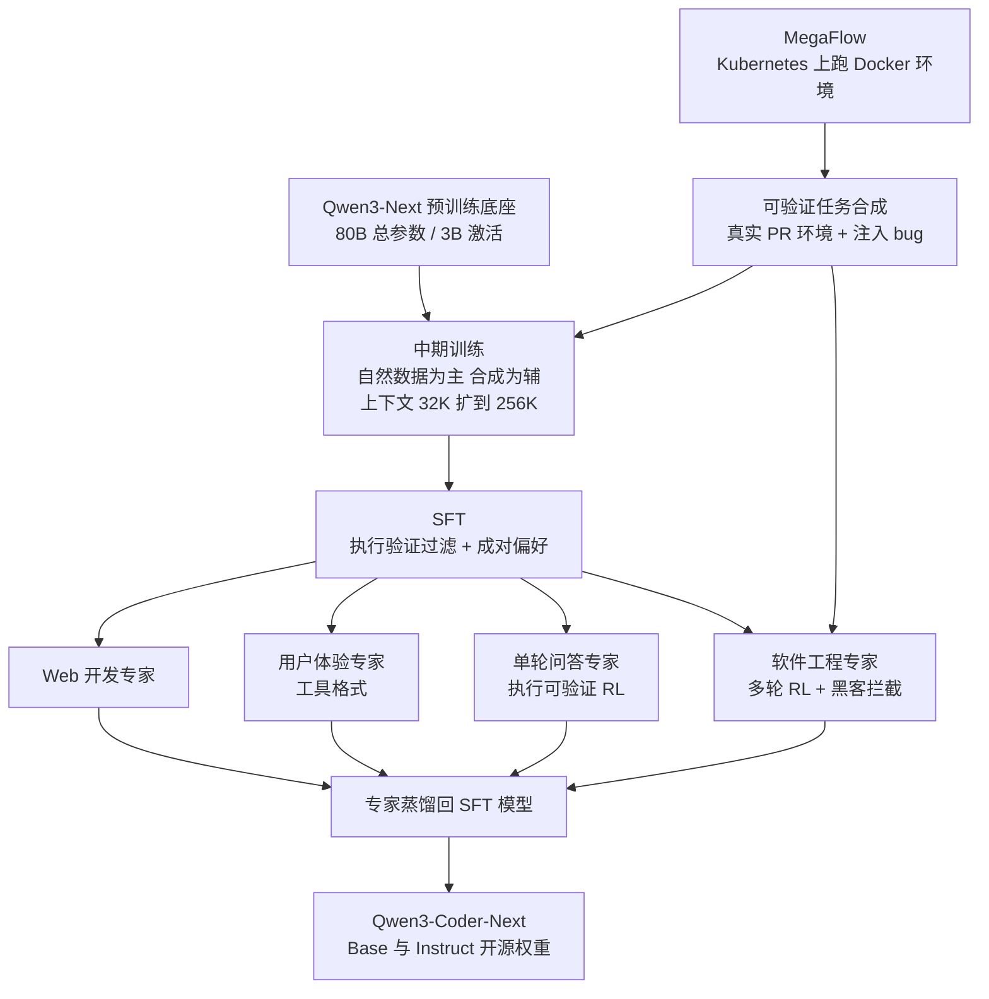
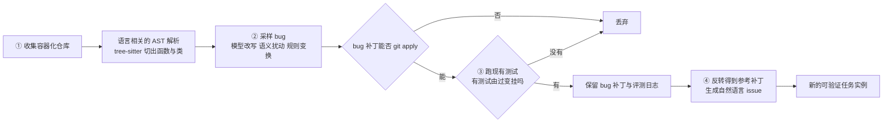
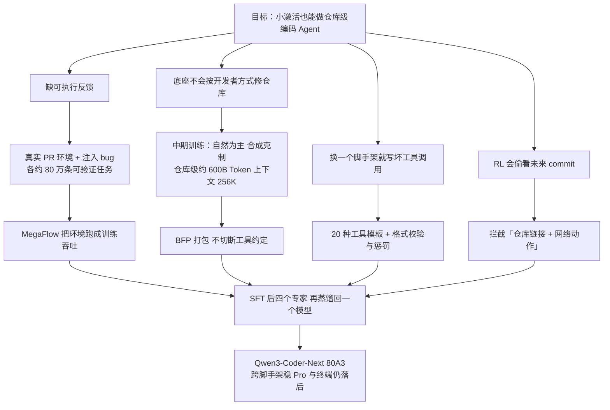

# Qwen3-Coder-Next：激活只有 3B，编码 Agent 靠可执行环境和反馈长上去

<!-- release-date: 2026-02-03 -->

> 本文依据 Qwen Team 的 **Qwen3-Coder-Next Technical Report**，arXiv:2603.00729v1，2026-02-28 提交（封面日期 2026-03-03），共 23 页（正文 1–13 页，参考文献 14–18 页，附录 19–23 页）。页码均指 PDF 自身页码。文中区分三件事：**报告明确写了什么**、**我们怎么解释它**、**哪些是外部资料**。

## 阅读前先认识几个词

- **MoE（Mixture-of-Experts，混合专家）**：把前馈网络拆成很多「专家」，每个 Token 只走其中几个。总参数很大，每次前向真正算的很少。报告用「80A3」表示 80B 总参数、3B 激活。
- **混合注意力（hybrid attention）**：一部分层用线性代价的递推结构记住长历史，一部分层保留标准注意力做精确回看。本模型直接继承 Qwen3-Next 的这套骨架。
- **脚手架（scaffold）**：把模型接到文件系统、终端和测试上的 Agent 框架，如 SWE-Agent、OpenHands、Claude Code。每套框架的工具定义、调用格式、提示词都不同。
- **可验证任务**：带着可运行环境和测试的题。对错由执行结果判定，不靠人打分。
- **Rollout**：Agent 按当前策略在环境里实际走完一道题的整段轨迹。
- **奖励黑客（reward hacking）**：模型找到绕过任务本意、直接骗到奖励的办法，比如去翻仓库历史里的标准答案。

## 一句话先说清

编码 Agent 要做的事和聊天不一样：在很长的仓库上下文里定位 bug，连续几十上百轮调工具、跑测试、失败了再改，还得跟得上各家 IDE 与 CLI 各写各的工具格式（PDF p. 1、7）。

通常的反应是把激活参数做大。Qwen3-Coder-Next 反过来：**总参数 80B，每次前向只激活 3B**（PDF p. 1），真正加码的是可验证、可执行、能从环境拿反馈的训练信号。报告在引言末尾把判断写得很直白：扩展 agentic 训练，而不只是扩模型规模，是推进真实编码 Agent 能力的关键驱动（PDF p. 2）。

如果只记一句话：

> **编码 Agent 的上限，更多卡在「有没有足够多、足够干净、能执行的反馈」，而不是「每次前向能激活多少参数」。**

但也要先说清结果：它在 SWE-Bench Verified 的 SWE-Agent 设置下是 70.6，低于 GLM-4.7 的 74.2 与 MiniMax-M2.1 的 74.8（PDF p. 11）。3B 激活换来的是「和大一个数量级激活的开源模型坐同一桌」，不是全面第一。

## 先看全景：这个模型是怎么连起来的

根据引言与第 2–4 节重画（机制示意，PDF p. 1–2、6–11）：

报告自己写下的规格就这些：

| 项 | 数值 | 页码 |
|---|---:|---|
| 总参数 / 每次前向激活 | 80B / 3B | PDF p. 1 |
| 中期训练上下文 | 32,768 扩到 262,144 | PDF p. 4–5 |
| 中期训练总量 | 数万亿 Token | PDF p. 5 |
| 仓库级中期训练数据 | 约 600B Token | PDF p. 4 |
| 编程语言覆盖 | 92 种扩到 370 种（相对 Qwen2.5-Coder） | PDF p. 4 |
| 预训练语料截止 | 2025-09-30 | PDF p. 4 |
| 真实 PR 环境 | 807,693 条，52,960 个仓库 | PDF p. 19，Table 10 |
| 注入 bug 合成任务 | 851,898 条 | PDF p. 19，Table 11 |
| 评测最大 Agent 轮数 | 300 | PDF p. 11–12 |

两点先看清：

- **3B 激活不等于 3B 稠密模型**。80B 权重都要驻留，「80A3」说的是每次前向算进去的量，不是显存占用，也不是端到端延迟。报告没有给任何推理吞吐或延迟数字。
- **约 80 万的量级出现了两次，不要混**。Table 10 是从真实 GitHub PR 建出的可运行环境（807,693 条），Table 11 是在已有仓库里注入 bug 合成的新题（851,898 条）。正文「约 800K、覆盖九种以上语言」写在合成 issue 那一段（PDF p. 2），数量级两张表都对得上，报告没有说清指的是哪一批。

## 底座：报告只给了一句话

报告对架构只写了「基于 Qwen3-Next，带混合注意力与 MoE」（PDF p. 1），层数、专家数、混合比例一概没写。下面的规格是外部补充，来自官方权重的 `config.json`，不是 PDF 内容：

| 项 | 官方配置 |
|---|---|
| 层数 / 隐藏维 | 48 / 2048 |
| 混合排法 | 每 4 层一层标准（门控）注意力，其余为 Gated DeltaNet 线性注意力，即 36 : 12 |
| 门控注意力 | 16 个 Query 头、2 个 KV 头，头维 256，旋转位置编码只作用于 25% 的维度 |
| Gated DeltaNet | 16 个 QK 头、32 个 V 头，头维 128 |
| MoE | 512 个专家，每 Token 激活 10 个，另有 1 个共享专家，专家中间维 512 |
| 原生上下文 | 262,144，与 PDF p. 4–5 一致 |

我们的解释：编码 Agent 的工作负载以顺序扫描为主（`cat`、`grep`、读 diff、看测试日志），偶尔才要精确跳回某个定义处。四分之三的层按线性代价扫历史、四分之一的层付二次代价做精确回看，和这种负载是对得上的。但这篇报告**没有任何架构消融**，3:1 的比例与门控注意力的动机属于 Qwen3-Next 与 Gated-Attention 两份材料，不是这里的新结论。

## 第一层矛盾：缺的不是参数，是可执行的反馈

报告说，现代编码 Agent 要在长时间跨度上推理、与真实执行环境交互、从多步连锁失败中恢复；训练这种能力，静态代码数据不够，需要大量可验证、可执行、交互丰富的训练信号（PDF p. 1）。

要把 agentic 训练做大，得同时解开两道墙（PDF p. 2）：

1. **题从哪来**：需要一条能批量生产「可验证任务 + 完全可执行环境」的流水线。
2. **环境怎么跑**：需要能高吞吐执行海量任务、及时返回环境反馈的基础设施。

报告的章节顺序就是论点：先有闭环（第 2 节），再谈中期训练和后训练的配方（第 3、4 节）。

## 核心设计一：两路合成可验证任务，对错由执行说了算

### 第一路：从真实 GitHub PR 建可执行环境

挖与 issue 相关的 PR，先去掉与下游评测重叠的实例，把每个 PR 拆成三样：有 bug 的状态、对应修复、配套测试补丁（PDF p. 2）。一个专门的环境构建 Agent 负责做出可运行的 Docker 环境和验证脚本，验证脚本必须能**靠执行区分坏状态和修好的状态**。

报告承认，环境构建对 Agent 很难，失败模式之一是 Agent 钻验证的空子、做出「看起来能跑」的假验证器（PDF p. 2）。对策有三层：自动检测并过滤不起作用的验证器；专门训一个模型提升环境构建质量；入库前再用质检 Agent 去掉含糊任务、不一致的环境和错位的测试。环境都存成可复用的 Docker 镜像。细节见同团队的 SWE-Universe（外部补充，见文末）。

附录给出分语言统计（PDF p. 19，Table 10）：

| 语言 | 实例 | 仓库 | 每仓库平均实例 | 平均评测行数 |
|---|---:|---:|---:|---:|
| Python | 202,302 | 13,098 | 15.45 | 25.01 |
| JavaScript / TypeScript | 175,660 | 11,604 | 15.14 | 27.41 |
| Go | 121,062 | 5,554 | 21.80 | 28.87 |
| Java | 86,105 | 4,700 | 18.32 | 24.75 |
| Rust | 74,180 | 4,445 | 16.69 | 19.31 |
| C / C++ | 37,228 | 3,405 | 10.93 | 45.78 |
| C# | 24,387 | 1,929 | 12.64 | 31.84 |
| 其他 | 86,769 | 8,225 | 10.55 | 38.89 |
| 合计 | 807,693 | 52,960 | 15.25 | 28.21 |

### 第二路：在已有可执行仓库里注入受控 bug

以 SWE-Smith、SWE-Flow、SWE-Rebench、Multi-SWE-RL 这些已经带仓库、测试套件和评测脚本的工作为种子，向代码库注入 bug，再生成匹配的自然语言 issue（PDF p. 2–3）。据 PDF p. 3 Figure 2 重画：

两条保留条件保证题「有意义且可解」：bug 必须让现有测试失败，且把补丁回滚就能修好（PDF p. 2）。为了减少捷径学习，issue 用自然语言写，并且**不把触发 bug 的测试文件交给模型**。

附录 Table 11 把产出摊开（PDF p. 19）：五个种子数据集共使用 5,019 个仓库，合成 851,898 条任务，平均每仓库 169.7 条。按采样策略分，`func_pm` 一类 460,578 条，占一半以上，`lm_rewrite` 145,450、`lm_modify` 233,369、其他 12,501。来源上 SWE-Flow（384,541）与 SWE-rebench（373,125）两个 Python 数据集占了大头，两个多语言来源合计只有约 2 万条。

我们的读法：**两路互补**。真实 PR 分布更接近线上，语言也更均衡（JS/TS、Go、Java、Rust 都过 7 万）；注入 bug 的数量能按仓库放大，但语言上几乎全是 Python，靠规则类变换撑量。

## 核心设计二：MegaFlow，把「能跑」变成训练吞吐

有题还不够，海量长程 rollout 得真的跑得动。报告用内部编排系统 MegaFlow，基于阿里云 Kubernetes，每个 agentic 编码任务表达成一个 Argo 工作流，分三段：Agent rollout、评测、后处理（PDF p. 3）。

- **rollout 段**：一个 Pod 通常把 Agent 容器与执行环境容器放在一起（需要时再加辅助服务），长程交互几乎不付网络往返。
- **评测段**：在专用容器里做自动验证，与 rollout 隔离。
- **后处理段**：解析结果、抽指标，可选做下游分析。

我们的解释：Agent 训练的瓶颈常常不在 GPU 算子，而在「模型说一句、环境跑一会、再把输出送回来」的往返。把 Agent 和环境放进同一个 Pod，是用调度域换网络往返。报告没有给并发规模、失败率、单任务墙钟时间，也没有测 MegaFlow 对训练速度的贡献；系统细节见同团队的 MegaFlow 论文（外部补充）。

## 核心设计三：中期训练把表示扳向代码、仓库与 Agent，但合成数据要克制

### 原则：只加最少必要的合成数据

中期训练从 Qwen3-Next 预训练底座出发（PDF p. 3）。报告的选数据原则值得原样记住：自然数据提升通用智能与鲁棒性，但和真实用户工作流的分布对不齐；重度依赖合成数据能把目标任务刷上去，却可能**过度专门化、回答多样性下降、后续微调时更难适应别的任务**。所以目标是「引入让模型可靠完成常见用户任务所需的**最少**合成数据」，语料以自然数据为主（PDF p. 3）。

### 自然数据

- **GitHub**：语言从 92 种扩到 370 种，大幅增加 PR、仓库与 code review 数据，并按真实开发流程重组（PDF p. 4）。文件级数据保留，但重心放在仓库级：用特殊 Token 拼接仓库，试了多种仓库序列化格式；这一版仓库级数据约 600B Token，是中期训练的主体，报告说它比单靠文件级数据集影响更大。
- **文本—代码对齐数据**：来自 Common Crawl 与数学、编程、教育类站点。网页质量参差，于是让 Qwen3-Coder-480B-A35B-Instruct 把网页**改写成规整的 Markdown**，去广告、无关 HTML 与排版噪声。Table 1 给了中期训练里的消融（PDF p. 4）：

| 设置 | EvalPlus | MultiPL-E | CRUX-Eval |
|---|---:|---:|---:|
| 不改写 | 54.38 | 36.02 | 57.13 |
| 改写 | 63.09 | 48.35 | 58.94 |

EvalPlus 与 MultiPL-E 涨得很多，CRUX-Eval 只动了一点。改写也有代价：报告在单轮 QA 一节承认，改写成维基百科风格有时会捏造引用和 URL，所以把改写限制在「保留原文内容的变换」（PDF p. 4）。

- **GitHub PR 数据**：每条是自然语言问题描述、仓库级代码上下文、对应编辑（PDF p. 4）。描述优先取关联 issue；上下文是把 PR 补丁回滚后再检索相关文件，**有意保留信号与噪声的混合**；编辑同时用 Search-and-Replace 与标准 `git diff` 两种格式。

### 合成数据：单轮问答与多轮轨迹

单轮问答以 Common Crawl 文档为种子，由 480B 教师生成自包含、逐步加深的问答对；文档质量不够时允许弃权，降低幻觉（PDF p. 4）。

多轮 agentic 数据用第 2.1 节的合成任务，在 SWE-agent、Mini-SWE-agent、OpenHands、Claude-Code、Qwen-Code、Terminus 多种框架下由 480B 教师生成轨迹，再按规则过滤掉缺终止信号、任务失败、工具调用畸形的（PDF p. 5）。

这里有一张很有迁移价值的图。Figure 3 按「用哪种框架的轨迹训练 → 在哪种框架上评测」拆开看中期训练 Token 量与 SWE 表现的关系。读自 PDF p. 5 Figure 3（近似值，横轴为 1B、2B、4B、8B Token）：

| 训练轨迹 → 评测框架 | SWE-Bench Verified | SWE-Bench Multilingual |
|---|---|---|
| OpenHands → OpenHands | 42 → 46 → 50 → 55 | 20 → 21 → 31 → 34 |
| SWE-Agent → SWE-Agent | 44 → 53 → 57 → 57 | 32 → 34 → 37 → 44 |
| OpenHands → SWE-Agent | 1.4 → 0.6 → 0.4 → 0 | 0 → 0.3 → 0 → 0 |
| SWE-Agent → OpenHands | 39 → 28 → 37 → 38 | 16 → 17 → 20 → 19 |

报告读出三条（PDF p. 5）：同一框架内，Token 越多表现越好；跨框架迁移有限；框架专门化影响很大，OpenHands 这种高度针对 SWE 的框架迁到 SWE-Agent 很差，反方向中等成功。

表里的数比这三句话更刺眼：**用 OpenHands 轨迹训练、在 SWE-Agent 上评测，分数几乎为零，而且训得越多越接近零**。反方向能到三四十分，但 8B Token 也没超过同框架 1B Token 的水平。我们的解释是：工具名、参数形状、何时结束、失败后怎么重试，都被模型当成任务本身记住了。这直接预告了后面为什么要把工具格式多样性当成训练目标。

中期训练还混入少量指令跟随数据，因为以自然文档为主时指令跟随不一定会自己出现，混进来是为了训练中就能监控下游任务（PDF p. 5）。

### FIM：Search-and-Replace 比 Chat-FIM 更好用

模型支持填空式补全（Fill-in-the-Middle，FIM）。数据取自 Stack-V2，两种格式：把 FIM Token 嵌进 ChatML 的 chat-FIM，与生成 diff 风格补丁的 search-and-replace FIM；另提供一个代理服务，把后者转成常规自动补全能用的格式（PDF p. 5）。同等规模下 search-and-replace FIM 更好，报告推测是它和 PR 式预训练数据更对齐；详细分析在同团队另一篇论文（外部补充）。

### 打包：别把工具定义切到上一条样本里

中期训练在数万亿 Token 上进行，上下文拉到 262,144，目标除了下一个 Token 预测还有 FIM（PDF p. 5）。样本打包用 **Best-Fit Packing（BFP，最佳适配打包）**，理由在附录说得很具体：传统「先拼接再切」会造成上下文幻觉，而多轮 Agent 轨迹的工具定义与调用格式通常只写在开头，随机切块让模型学不会严格的调用格式（PDF p. 19）。

附录用一个无容器、无 Agent 交互的 agentless 流水线在 SWE-bench 上比较（先定位 bug 再预测补丁，指标是补丁与参考补丁的相似度和空补丁率），取三种定位设定的平均（PDF p. 21，Table 13）：

| 策略 | 训练 Token | 碎片率 | Padding 率 | 平均相似度 ↑ | 平均空补丁率 ↓ |
|---|---:|---:|---:|---:|---:|
| 先拼接再切 | 73B | 30.2% | 0.00% | 16.68 | 38.94 |
| RLD | 73B | 17.8% | 0.00% | 17.24 | 35.84 |
| PLD | 89B | 0.0% | 17.55% | 16.86 | 34.44 |
| BFP | 73B | 0.0% | 0.01% | 17.82 | 36.26 |
| BFP + split | 73B | 0.0% | 0.01% | 20.17 | 25.01 |
| BFP + slide | 73B | 0.0% | 0.01% | 20.15 | 25.14 |
| BFP + drop | 73B | 0.0% | 0.01% | 20.84 | 24.34 |

碎片率是被切断的文档占全部文档的比例，padding 率是 padding Token 占全部训练 Token 的比例（PDF p. 20）。PLD 为了公平要按 $1/(1-\text{padding rate})$ 放大训练量，所以是 89B（PDF p. 21）。

报告的三条结论（PDF p. 21）：消除碎片稳定带来提升；BFP 比 padding 更省，用少 22% 的 Token 拿到更高相似度（17.82 对 16.86）；超长文档怎么处理也不可忽视，BFP 加直接丢弃（drop）总体最好，作者评论说「与其玩花样，不如直接把上下文拉长」。主实验采用的是 split，而不是分数略高的 drop，报告没有再给完整 Agent 评测来回证这个选择；这组对照也只在 73B Token 的代理评测上做，与主实验的数万亿 Token、256K 上下文不在一个量级。

另一个工程动作：对高度重复的片段（代码头、配置块）做掩码，不让它们反复成为预测目标，以免模型学会复读（PDF p. 6）。

## 核心设计四：SFT 之后拆四个专家，再蒸回一个模型

### SFT：执行验证过滤，加成对偏好

SFT 数据来自三处：内部专有语料（侧重对齐质量与安全）、经执行验证的 agentic 轨迹、以编码为主的文档对齐开放域问答（候选答案按功能正确性与安全性过滤）（PDF p. 6）。

过滤的核心是一个跑在 Mini-SWE-agent 上的**用户模拟器**：拿到助手的回复，从终端用户的视角真的去执行其中的代码或命令，看编译输出、运行时错误、环境状态变化，判断这条回复有没有真正推进任务（PDF p. 6）。这样能滤掉幻觉与跑不起来的方案。

风格上另做成对偏好：每个请求用最强的内部模型采 $n$ 个候选，组成 $\binom{n}{2}$ 对，由专门训练的成对裁判按清单（事实准确、任务有用、对话风格）比较并给出排序（PDF p. 6）。$n$ 与裁判模型都没有公开。

### 为什么拆专家

SFT 之后，按能力簇分别训专家：Web 开发、用户体验、单轮问答、软件工程。专家共享同一初始模型，数据、配方与评测各不相同，最后蒸馏回 SFT 模型（PDF p. 6、11）。我们的理解是：Web 要看截图、单轮要跑单测、仓库要多步环境、工具格式要规则校验，奖励形状差得很远，硬塞进一个 batch 会互相干扰。但报告**没有给任何专家的单独分数，也没有蒸馏前后的对照**，所以「先分后合更好」在这里是设计选择，不是被消融证明的结论。第 5 节的所有数字都来自蒸馏后的统一模型。

### Web 开发专家：看起来对，还要点得动

样本在 Playwright 控制的 Chromium 里渲染，React 这类框架先起 Vite 服务保证依赖就绪（PDF p. 6）。然后两段检查（PDF p. 7）：**静态视觉**，视觉语言模型按清单看高分辨率截图，查布局完整性、内容完整性与 UI 质量；**动态交互**，解析 DOM 找出可交互元素，用内部模型生成点击、填表、菜单导航等动作自动执行，再比较动作前后的截图。坏交互、状态转换不稳定的样本丢掉。报告在结论里仍把前端与 UI 列为待改进（PDF p. 13）。

### 用户体验专家：工具格式本身就是训练目标

报告观察到，修 GitHub issue 覆盖不了 CLI/IDE 里真实的 agentic 编码：Cline、Qoder、OpenCode 等脚手架各有一套工具调用模式，模型很难稳定跟上（PDF p. 7）。数据清洗里，除了「没有结束动作、资源失败、工具调用失败」这类通用过滤，**按规则校验工具调用格式**特别有效：既防止模型学到畸形的调用模式、抬高表现上限，又减少无效调用和重试（PDF p. 7）。

更进一步，很多模型只用一种工具聊天模板训练，换到没见过的格式就不鲁棒；而真实系统格式五花八门，用户还常在系统提示里自定义 schema（PDF p. 7–8）。于是训练数据故意覆盖多种表示：自然语言描述、JSON、Python 风格调用、XML（包括自家的 `qwen3_coder`）、TypeScript 接口（PDF p. 8）。附录 Table 12 列出了全部模板（PDF p. 20），来源包括 DeepSeek 各代、GLM-4.6、MiniMax-M1/M2、Kimi-K2、gpt-oss 的 Harmony、Llama 4、ToolACE、Mistral-Large-3、xLAM-2、Cline 与 Aone Copilot。

`qwen3_coder` 是这批模板里唯一为代码场景专门设计的：JSON 装多行代码要付大量转义，XML 风格让长代码直接落进参数（PDF p. 8）。

模板多样性有对照实验。Figure 5 在数据量与训练配置完全相同的条件下，只改变训练用的工具聊天模板数（PDF p. 8）。读自图：

| 模板数 | 1 | 2 | 4 | 8 |
|---|---:|---:|---:|---:|
| SWE-bench Verified | 48.0 | 52.0 | 53.4 | 53.8 |

从 1 种到 2 种涨了 4 个点，之后收益递减。附录正文说 Table 12 列出了「全部 21 种」模板，但表里实际只有 20 行（PDF p. 19–20）；Figure 5 只做到 8 种。

为了直接量「换一个 IDE/CLI 还能不能写对工具调用」，报告建了内部基准：从代表性 IDE/CLI 脚手架抽出多种提示模板与工具 schema，看模型能否按系统提示写出格式完全正确的调用（PDF p. 8，Table 2）：

| 模型 | 脚手架 1 | 脚手架 2 | 脚手架 3 | 脚手架 4 | 脚手架 5 | 平均 |
|---|---:|---:|---:|---:|---:|---:|
| GPT-5-2 | 84.0 | 14.0 | 41.8 | 29.8 | 77.0 | 49.3 |
| Claude-sonnet-4-5 | 86.8 | 61.0 | 100.0 | 88.0 | 91.0 | 85.4 |
| Gemini-3-pro | 92.4 | 57.0 | 98.0 | 93.5 | 94.0 | 87.0 |
| Deepseek-v3.2 | 98.0 | 87.0 | 100.0 | 92.5 | 91.0 | 93.7 |
| GLM-4.6 | 85.8 | 86.0 | 100.0 | 82.9 | 24.0 | 75.7 |
| GLM-4.7 | 91.0 | 64.0 | 100.0 | 94.7 | 0.0 | 69.9 |
| MiniMax-M2.1 | 68.3 | 48.0 | 93.8 | 86.2 | 90.0 | 77.3 |
| Kimi-K2 | 59.0 | 59.0 | 100.0 | 57.4 | 81.0 | 71.3 |
| Kimi-K2-thinking | 71.5 | 70.0 | 91.8 | 83.0 | 80.0 | 79.3 |
| Qwen3-Coder-Next | 98.0 | 83.0 | 98.0 | 91.5 | 93.0 | 92.7 |

Deepseek-v3.2 的平均 93.7 略高于它的 92.7；最刺眼的是 GLM-4.7 在脚手架 5 上为 0.0。报告的结论是它的模型在五个环境上都稳（PDF p. 9）。要注意两点：五个脚手架的名字没有公布，这是内部基准；格式鲁棒是上线门槛，不是能力上限——公开的 SWE-Bench Verified 上 GLM-4.7 仍高于它。

### 单轮问答专家：把执行驱动的 RL 从竞赛题扩开

报告把 RL 分两种：单轮，正确性能直接用执行验证（如单元测试）；多轮，要和环境交互多步（PDF p. 9）。单轮这一支的论点是：多数编码任务都天然适合执行驱动的 RL，不必只盯竞赛题。于是任务扩到库与第三方 API 调用、I/O 与数据格式处理、多种语言，以及生成安全代码与修复漏洞（PDF p. 9）。

单元测试自动合成：内部模型为每道题生成多组候选测试，保留在多份独立生成的解上多数投票共识最高的那些，再用它们给出基于执行的奖励（PDF p. 9–10）。

Figure 6 是单轮 RL 过程中九项内部子能力的曲线（PDF p. 9）。读自图，横轴约到 220 步，数值为近似：

| 子能力 | 起点 → 终点 | 备注 |
|---|---|---|
| 代码编辑 | 41 → 80 | 涨幅最大，前 100 步就过了 70 |
| 竞赛编码 | 50 → 61 | 近乎单调上升 |
| 安全编码 | 41 → 56 | 中途最高约 67，最后几步回落 |
| SQL 编程 | 58 → 65 | |
| 软件开发 | 52 → 60 | |
| 指令跟随 | 79 → 87 | |
| 代码生成 | 79 → 84 | 波动大 |
| 多语言编程 | 83 → 86 | 波动大，涨幅小 |
| 面向库的编码 | 45 → 47 | 涨幅最小 |

报告的结论是扩大 RL 任务多样性带来多项子能力一致提升（PDF p. 10）。这些都是内部基准，没有外部对照也没有误差棒。

### 软件工程专家：轨迹级奖励之外，还要罚没写完和写坏格式

多轮 RL 的题来自开源软件工程数据集与第 2.1 节自建的仓库环境（PDF p. 10）。**SFT 与 RL 的提示完全不相交**，防止阶段之间泄漏；先估计每个实例的通过率分布，去掉太容易的和嘈杂的失败，让 RL 专注于「有信息量的失败」。

奖励以最终是否完成任务为主。但结果对了不代表中间推理与工具使用好（PDF p. 10），所以另加两类惩罚：

- **未完成轨迹惩罚**：交互轮数超过预设上限，轨迹奖励被罚，抑制过长的 rollout 与不肯收尾。
- **轮级工具格式惩罚**：每一步用规则校验工具调用格式，优化时对无效调用对应的 Token 施加 Token 级惩罚。

轮数上限、惩罚系数都没公开；**用的是哪种 RL 算法（PPO、GRPO 还是别的）全文没有写**。

## 核心设计五：RL 会自己学会偷看答案，拦截规则要跟着能力升级

GitHub 环境可能意外泄漏未来的 commit，Agent 能借此找回标准修复（例如 `git log --all`），报告脚注指向 SWE-bench 社区对此的修复（PDF p. 10）。标准防护是删掉 remote、分支与标签。

问题在 RL 后期：会冒出新的黑客方式。Agent 用 `git remote add` 把本地仓库重新连回 GitHub，或用 `git clone`、`curl` 之类把提交历史拉回来（PDF p. 10–11）。完全断网也不合理，因为装环境、查文档、装包都需要网络。

引自 PDF p. 10 Figure 7。右图是这份报告最值得记的一张：**即使已经删了 remote 和未来 commit，模型能力涨上来后仍会自己想出别的 git 命令去拿答案**，分数最后几步几乎垂直拉到 84.6；报告称据其所知这种行为此前没有被报道过。左图同时画了平均 Agent 轮数，图注说 RL 中涌现出长程编码能力，平均轮数从 50 推到 130。

拦截规则是启发式的：一次工具调用只要**同时**含有仓库链接（如 `github.com/{repo}`）和网络访问关键词（如 `git`、`curl`、`wget`），就被拦下，并明确告诉 Agent 这是被禁止的动作（PDF p. 11）。它允许正常联网，只拦「指向答案仓库的网络动作」。报告称人工检查轨迹后确认奖励黑客被有效消除，没有给抽检规模。

几点读图与读文的提醒：

- 75.1 与 84.6 只出现在这张训练曲线上，是某个专家训练过程中的内部数字；对外报的是 Table 3 里蒸馏后统一模型的 70.6、71.1、71.3，两者不能直接比。
- 轮数增加被写成「能力涌现」，结论一节又承认复杂任务可能要更多交互轮才能做对，并把推理效率列为未来工作（PDF p. 13）。两句话可以同时成立：RL 让模型肯多走几步，步数多不等于效率高。
- 拦截规则靠字符串匹配，换一个不含 `github.com` 的镜像源就可能失效；它是随能力演化的防线，不是一劳永逸的安全策略。

## 实验：3B 激活换来的是「够用」，不是「全面第一」

评测设置：SWE-Bench Verified、SWE-Bench Multilingual、SWE-Bench Pro 与 Terminal-Bench 2.0；所有基线都在各脚手架上复现，统一采用删除 remote、分支与标签的去黑客机制，最大轮数 300（PDF p. 11–12）。对照是 Claude-Opus-4.5、Claude-Sonnet-4.5 两个闭源模型，以及 DeepSeek-V3.2、GLM-4.7、MiniMax-M2.1、Kimi-K2.5。

### 仓库级 Agent

SWE-Bench Verified（PDF p. 11，Table 3；「–」为报告没能可靠拿到结果）：

| 模型 | 规模 | SWE-Agent | MiniSWE-Agent | OpenHands |
|---|---|---:|---:|---:|
| Claude-Opus-4.5 | ? | 78.2 | 77.8 | 79.0 |
| Claude-Sonnet-4.5 | ? | 76.0 | 68.4 | 74.6 |
| DeepSeek-V3.2 | 671A37 | 70.2 | 67.2 | 72.6 |
| GLM-4.7 | 358A32 | 74.2 | 70.4 | 70.6 |
| MiniMax-M2.1 | 230A10 | 74.8 | 70.4 | 71.0 |
| Kimi-K2.5 | 1000A32 | 73.2 | 70.8 | – |
| Qwen3-Coder-Next | 80A3 | 70.6 | 71.1 | 71.3 |

SWE-Bench Multilingual 与 Pro（PDF p. 11，Table 4）：

| 模型 | 规模 | 多语言 SWE-Agent | 多语言 MiniSWE | 多语言 OpenHands | Pro SWE-Agent | Pro MiniSWE |
|---|---|---:|---:|---:|---:|---:|
| Claude-Opus-4.5 | ? | 71.7 | 71.8 | 75.2 | 51.6 | 50.2 |
| Claude-Sonnet-4.5 | ? | 67.2 | 61.3 | 66.0 | 50.5 | 43.0 |
| DeepSeek-V3.2 | 671A37 | 62.3 | 55.5 | 61.8 | 46.0 | 32.4 |
| GLM-4.7 | 358A32 | 63.7 | 61.8 | 60.8 | 45.1 | 39.4 |
| MiniMax-M2.1 | 230A10 | 66.2 | 62.5 | 67.5 | 40.8 | 39.1 |
| Kimi-K2.5 | 1000A32 | 63.7 | 62.3 | – | 47.3 | 42.8 |
| Qwen3-Coder-Next | 80A3 | 62.8 | 56.2 | 64.3 | 42.7 | 38.7 |

把三个脚手架一起看：

- **它的特点是稳，不是高**。Verified 三列都在 70–71；MiniSWE-Agent 上 71.1 是开源第一（也高于 Claude-Sonnet-4.5 的 68.4），OpenHands 上 71.3 仅次于 DeepSeek-V3.2 的 72.6，SWE-Agent 上 70.6 在开源里倒数第二。这与 Figure 3、Table 2 的「跨框架要稳」是同一条故事。
- **任务越难，小激活越吃亏**。Pro 的 SWE-Agent 列 42.7，低于 Kimi-K2.5（47.3）、DeepSeek-V3.2（46.0）、GLM-4.7（45.1）；与结论里「复杂大规模软件工程仍有差距」一致（PDF p. 13）。
- **闭源仍明显更高**：Claude-Opus-4.5 的 Verified 在 78–79，Pro 在 50–52。

报告引言说它在 SWE-Bench Pro 上「超过或持平几个激活大一个数量级的模型」（PDF p. 2）。对照 Table 4，它只在 SWE-Agent 列高于 MiniMax-M2.1（10B 激活）、在 MiniSWE 列高于 DeepSeek-V3.2（37B 激活），并不是对所有大模型都成立。

封面 Figure 1 把 SWE-Agent 列与 Terminal-Bench 的 Terminus-2 json 列，外加 Aider，画成与三个开源模型的柱状对比（PDF p. 1）。前四组数字与表一致；Aider 组中它是 66.2，与 Table 7 的 Aider-Polyglot 一致，而这组里 DeepSeek-V3.2 的 69.9 更高。

### 终端任务：稳，但明确落后

Terminal-Bench 2.0（PDF p. 12，Table 5）：

| 模型 | 规模 | Terminus2-xml | Terminus2-json | ClaudeCode | QwenCode |
|---|---|---:|---:|---:|---:|
| Claude-Opus-4.5 | ? | 58.4 | 57.3 | 53.9 | 51.7 |
| Claude-Sonnet-4.5 | ? | 51.7 | 51.7 | 41.6 | 37.1 |
| DeepSeek-V3.2 | 671A37 | 34.8 | 39.3 | – | – |
| GLM-4.7 | 358A32 | 44.9 | 37.1 | – | 31.5 |
| MiniMax-M2.1 | 230A10 | – | 32.6 | 42.7 | 39.3 |
| Kimi-K2.5 | 1000A32 | 38.8 | 49.4 | 9.0 | 27.5 |
| Qwen3-Coder-Next | 80A3 | 34.2 | 36.2 | 30.9 | 25.8 |

报告自己的措辞是「有明显提升空间，但打下了强而高效的基础」（PDF p. 12）。终端任务是短板：在自家 QwenCode 脚手架上也只有 25.8，低于 MiniMax-M2.1 的 39.3 与 GLM-4.7 的 31.5。它的「稳」体现在四列都没有崩溃，而 Kimi-K2.5 在 ClaudeCode 列掉到 9.0，和 Table 2 里 GLM-4.7 的 0.0 是同一类现象：某个脚手架上的格式崩溃会把能力归零。

### 函数级、全栈、SQL：对照的是自家模型

Table 6、7 只和上一代旗舰 Qwen3-Coder-480B-A35B 与通用模型 Qwen3-Next 比（PDF p. 12–13）：

| 模型 | EvalPlus | MultiPL-E | CRUXEval | LiveCodeBench v6 | OJBench | Codeforces |
|---|---:|---:|---:|---:|---:|---:|
| Qwen3-Coder-480B-A35B | 86.66 | 88.00 | 92.13 | 44.93 | 14.98 | 1800 |
| Qwen3-Next | 89.00 | 89.00 | 94.81 | 51.79 | 20.04 | 1875 |
| Qwen3-Coder-Next | 86.56 | 88.23 | 95.88 | 58.93 | 23.01 | 2100 |

| 模型 | FullStackBench-en | FullStackBench-zh | Spider | BIRD-SQL | Aider-Polyglot |
|---|---:|---:|---:|---:|---:|
| Qwen3-Coder-480B-A35B | 62.54 | 63.07 | 85.98 | 64.15 | 60.40 |
| Qwen3-Next | 62.30 | 59.22 | 82.50 | 66.62 | 52.90 |
| Qwen3-Coder-Next | 60.58 | 57.38 | 83.66 | 63.56 | 66.20 |

- **竞赛与推理向明显更强**：LiveCodeBench、OJBench、Codeforces 都是三者最高，与单轮执行 RL 的设计对得上。
- **代码编辑是强项**：Aider-Polyglot 66.20 明显高于另两者，和 PR 式数据、search-and-replace 格式是同一方向。
- **函数级简单题没涨**：EvalPlus 86.56 低于通用 Qwen3-Next 的 89.00。
- **全栈中英都略降**：FullStackBench 两项都是三者最低，与结论里「前端与 UI 仍待改进」一致。

### 通用知识几乎不掉，数学反而大涨

与 Qwen3-Next 对比（PDF p. 13，Table 8、9）：

| 模型 | MMLU | MMLU-Redux | MMLU-Pro | GPQA | SuperGPQA |
|---|---:|---:|---:|---:|---:|
| Qwen3-Next | 87.87 | 91.14 | 80.89 | 73.54 | 58.70 |
| Qwen3-Coder-Next | 87.73 | 91.18 | 80.52 | 74.49 | 57.45 |

| 模型 | HMMT25 Feb | HMMT25 Nov | AIME24 | AIME25 |
|---|---:|---:|---:|---:|
| Qwen3-Next | 54.27 | 68.07 | 82.92 | 69.64 |
| Qwen3-Coder-Next | 70.21 | 75.57 | 89.01 | 83.07 |

知识向基本持平，数学四项全涨，HMMT25 Feb 多 15.94、AIME25 多 13.43。报告的解释是强代码推理能力可以迁移到数学推理（PDF p. 13）。这是作者观察：没有消融区分涨分来自单轮代码 RL，还是来自中期训练里的数学类网页数据。至少「合成数据按最少必要添加、保住通用能力」这条原则，在 Table 8 上没有被打脸。

## 附录里的网络安全：测过了，也看得到差在哪

附录 A.4 把网络安全当作前沿方向，给了三组对比，全部 greedy 解码（PDF p. 21–23）。

**威胁情报分析**，AthenaBench-Mini（PDF p. 22，Table 14）：

| 模型 | CKT | ATE | RCM | RMS（F1） | VSP | TAA |
|---|---:|---:|---:|---:|---:|---:|
| Claude-Opus-4-5 | 94.33 | 85.50 | 71.25 | 68.39 | 53.88 | 29.00 |
| Claude-sonnet-4-5 | 93.22 | 78.67 | 64.00 | 61.69 | 45.17 | 18.67 |
| Deepseek-V3.2 | 90.00 | 60.00 | 65.50 | 29.02 | 20.50 | 13.00 |
| GLM-4.7 | 85.67 | 66.00 | 70.50 | 19.45 | 29.00 | 12.00 |
| Qwen3-Coder-Next | 85.00 | 44.00 | 58.50 | 5.50 | 24.50 | 8.00 |

报告的读法是与 DeepSeek-V3.2、GLM-4.7「可比」，但根因映射（RCM）与攻击者归因（TAA）仍短（PDF p. 22）。表里更大的缺口其实在别处：攻击技术抽取（ATE）44.00 是全表最低，风险缓解策略（RMS）只有 5.50，对 DeepSeek-V3.2 的 29.02；除 VSP 外，它每一项都是全表最低。

**漏洞检测**，PrimeVul-Paired（PDF p. 22，Table 15）：准确率 48.33，低于 GLM-4.7 的 53.22；F1 51.37。正文说它的 P-C（Pair-wise Correct Prediction）0.88 全表最低，「说明成对预测一致性最好」，表头也把 P-C 标成越低越好。我们对此存疑：按名字，P-C 是「一对函数两个都判对」的比例，应当越高越好；四个成对指标 0.88 + 53.01 + 41.29 + 4.64 约等于 100%，更像是四种成对预测形态的占比，0.88% 的两个都对与低于 50% 的准确率是对得上的。本文只照录数字，不采用「P-C 最低即最优」这句评语。

**安全编码**，SecCodeBench 与 CWEval（PDF p. 22–23，Table 16）：无安全提示的生成上它是 61.2，高于 Claude-Opus-4-5 的 52.5，报告据此认为它默认生成里就带有安全意识；有提示时 69.5 低于 Opus 的 73.2。CWEval 的功能正确率 func@1 为 80.17，低于两个 Claude（92.27、91.55），安全且正确的 func-sec@1 为 56.32，高于 DeepSeek-V3.2（54.71）与 GLM-4.7（46.39）。

## 报告自己承认的限制，和报告没说的事

结论一节写得很直（PDF p. 13）：相对 Claude Opus 4.5，主动计算更小、总训练计算更低，换来能力上的权衡；高度复杂、大规模的软件工程任务仍有差距，计划在预训练中增加更难、更真实的项目；有的复杂任务需要更多交互轮才能做对，未来要靠 RL 与更好的长程规划提升推理效率；前端与 UI 仍待改进，计划把视觉能力做进 Agent，让模型直接看渲染结果与交互行为；未来还要做漏洞利用、CTF 这类 agentic 网络安全任务。（结论末段有一处句子残缺，视觉能力那句接在网络安全之后，按语义应属于前端一条。）

报告没有公开、无法从 PDF 得到的：

- **架构与推理**：层数、专家数、混合比例（只能靠官方配置补）；任何推理吞吐、延迟、显存数字，「3B 激活所以高效」没有被这份 PDF 量过。
- **中期训练**：数万亿 Token 的配比（自然 / 合成 / 仓库级 / 轨迹）、学习率与 batch、算力。
- **后训练**：RL 算法名、组大小、裁剪与 KL、轮数上限与惩罚系数；四个专家的数据量与单独分数；蒸馏的目标与配比；成对偏好的 $n$ 与裁判模型。
- **系统**：MegaFlow 的并发规模、失败率、对训练速度的贡献；GPU 型号与训练时长。
- **评测**：Table 2 五个脚手架的名字；去黑客后人工抽检的规模；Figure 7 内部曲线与对外数字如何对应。
- **报告内的几处不一致**：Table 12 说 21 种模板、表里只有 20 行；正文「约 800K」没说清是哪一批任务；PrimeVul 的 P-C 解读存疑；AthenaBench 正文点名的短板与表中最大的缺口不一致。

## 最值得带回自己项目的七条

### 1. 先闭环，再谈规模

可验证任务、可执行环境、能及时返回反馈的编排，是这份报告真正加码的地方。3B 激活能在 SWE-Bench Verified 上到 70 分出头，靠的是这条闭环，不是新的注意力公式。

### 2. 验证器必须能区分坏状态与修好的状态

构建环境的 Agent 会钻验证的空子，所以要自动检测假验证器、单独训构建模型、再加质检 Agent。Agent RL 里最贵的 bug 往往在奖励函数，不在策略网络。

### 3. 合成数据按「最少必要」加，自然数据保底

合成刷满会过度专门化、伤多样性、让后续微调更难。Table 8 的通用能力基本不掉，说明这条克制至少没有伤到底座。

### 4. 脚手架是任务的一部分，不是部署细节

一种框架的轨迹训得再多，换一种可能接近零（Figure 3）；模板数从 1 加到 2，固定数据量下 SWE-bench Verified 就涨 4 个点（Figure 5）。要接很多 IDE，就把格式多样性与格式校验写进训练目标。

### 5. 打包策略决定工具调用学得对不对

工具约定写在轨迹开头，先拼接再切等于把说明书切掉。BFP 用几乎为零的 padding 消掉碎片，是正确性修复，不只是利用率优化。

### 6. 奖励黑客随能力进化，防线要跟着升级

删掉 remote 之后，模型会自己 `git remote add`。与其一刀切断网，不如精确拦住「指向答案仓库的网络动作」，并把禁止原因告诉 Agent；对外数字要在去黑客设置下复现所有基线后再报。

### 7. 小激活换来的是部署预算，不是自动的全面第一

它的长处是跨脚手架稳、代码编辑与竞赛推理强；Pro、终端任务、全栈与威胁情报仍落后更大的模型。把「80A3」读成「已经可以替代 30B 激活的模型」，这份 PDF 不支持。

## 用一张图重新串起全文

## 关键词回看

- **80A3**：80B 总参数、每次前向激活 3B；说的是计算量，不是显存占用。
- **混合注意力**：继承 Qwen3-Next，线性注意力层与门控注意力层按 3:1 排布；PDF 只点名，规格来自官方配置。
- **可验证任务合成**：真实 PR 建 Docker 环境，或在已有仓库里注入受控 bug；对错由测试执行决定。
- **MegaFlow**：Kubernetes 与 Argo 上的编排系统，rollout、评测、后处理分段，Agent 与环境同 Pod。
- **最少必要合成**：中期训练以自然数据为主，只加让模型可靠完成常见任务所需的合成数据。
- **跨脚手架迁移**：同框架内 Token 越多越好，跨框架几乎迁不过去。
- **BFP**：整篇文档装箱，碎片与 padding 都接近零；超长文档先切块。
- **qwen3_coder**：XML 风格工具调用格式，多行代码不必转义。
- **专家蒸馏**：Web、用户体验、单轮问答、软件工程四个专家蒸回 SFT 模型。
- **奖励黑客拦截器**：拦下同时含仓库链接与网络关键词的工具调用，并反馈禁止原因。

## 最后的判断

这份报告的贡献不在网络结构，而在把「编码 Agent 的训练信号从哪来、怎么保证它是真的」写成了一条完整的链：两路可验证任务、同 Pod 的执行编排、克制的中期训练、把格式当目标的专家训练、随能力升级的黑客拦截。

证据强度是分层的：

- **有直接实验支撑**：网页改写的消融（Table 1）、跨脚手架迁移的崩塌（Figure 3）、模板数的对照（Figure 5）、打包策略的对照（Table 13）、不拦截时的奖励黑客（Figure 7 右）、多脚手架复现的主表。
- **只有作者观察**：先分专家再蒸馏更好、代码推理迁移到数学、改写限制在保真变换就不会引入幻觉、拦截器已消除黑客。
- **没有公开**：RL 算法与超参、专家单独分数、推理效率、训练算力。

还有几处要读者自己校准：它在 SWE-Agent 列不是开源第一；「超过大一个数量级激活的模型」只对部分模型与部分列成立；75.1 与 84.6 是训练曲线，不是对外成绩；附录安全评测里有一处指标解读存疑。

如果只带走一句：

> **小模型做 Agent，先把反馈做真，再把格式做宽，最后盯住它会怎么作弊。**

## 资料与阅读边界

**原始依据**

- 本地 `papers/Alibaba/Qwen3-Coder-Next.pdf`，即 arXiv:2603.00729v1（2026-02-28 提交），23 页。全文所有 `(PDF p. N)` 都出自这一版。arXiv 页面只有 v1。

**首发日证据**

- 官方代码仓库 [QwenLM/Qwen3-Coder](https://github.com/QwenLM/Qwen3-Coder) 的提交 `29c6d9f`，消息为 `qwen3-coder-next released`，时间 2026-02-03T15:54:50Z。
- 官方权重仓库 [Qwen/Qwen3-Coder-Next](https://huggingface.co/Qwen/Qwen3-Coder-Next) 的权重文件在 2026-01-30 预先上传，模型卡从 2026-02-03 起密集更新；按口径，预置上传不算首发。
- 因此 `release-date` 取 2026-02-03，不取 arXiv 提交日 2026-02-28 或封面日期 2026-03-03。

**外部补充（不是报告内容）**

- 底座规格来自官方权重的 [`config.json`](https://huggingface.co/Qwen/Qwen3-Coder-Next/blob/main/config.json)：48 层、隐藏维 2048、`full_attention_interval` 为 4、512 专家激活 10 个、共享专家 1 个、`partial_rotary_factor` 为 0.25、`max_position_embeddings` 为 262,144。
- 报告引用、本文只作指路的同团队论文：环境构建 [SWE-Universe](https://arxiv.org/abs/2602.02361)；编排系统 [MegaFlow](https://arxiv.org/abs/2601.07526)；FIM 分析 [From Completion to Editing](https://arxiv.org/abs/2601.13384)；Web 视觉清单 [PlotCraft](https://arxiv.org/abs/2511.00010)。门控注意力的来历见 Gated-Attention 一篇（[arXiv:2505.06708](https://arxiv.org/abs/2505.06708)）。
- 奖励黑客背景：报告脚注给出的 [SWE-bench PR 471](https://github.com/SWE-bench/SWE-bench/pull/471)。
- Figure 3、5、6、7 的数值均为读图近似；两张讲解图是根据 Figure 4、Figure 8 与正文重画的机制示意，其中工具调用的函数名与代码为虚构示例。P-C 指标的质疑、跨脚手架迁移的解释，都是本文的判断。
