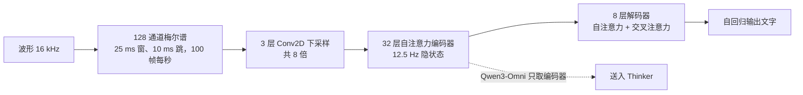
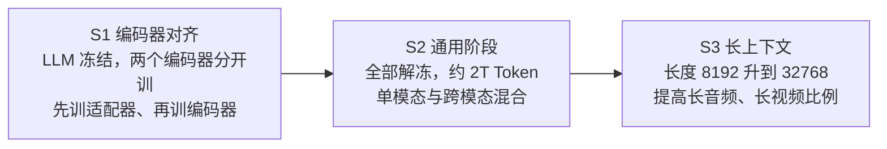
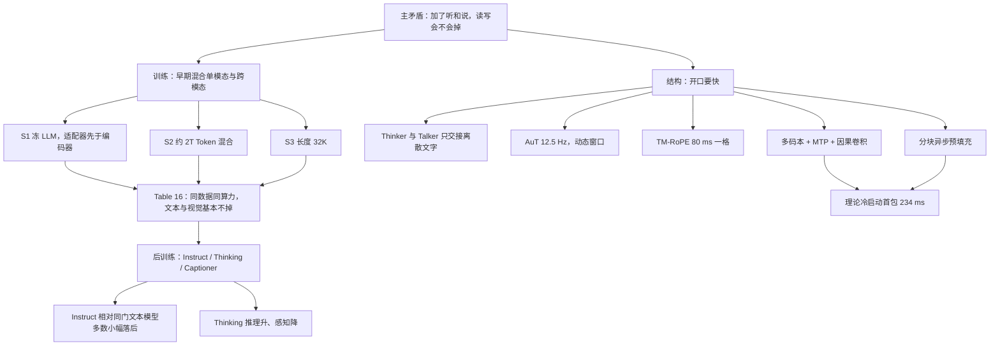

# Qwen3-Omni：加了听和说，原来的读写还在不在

<!-- release-date: 2025-09-21 -->

> 本文依据 Qwen Team（阿里云）的 **Qwen3-Omni Technical Report**，arXiv:2509.17765v1，2025-09-22 提交，封面页眉 2025-09-23，共 25 页。页码均指 PDF 自身页码。文中区分三件事：**报告明确写了什么**、**我们怎么解释它**、**哪些是外部资料或本文推算**。

## 阅读前先认识几个词

- **全模态（omni-modal）**：一个模型直接吃文本、图像、音频和带声音的视频，并且直接吐出文字和语音，中间不靠外挂的语音识别、语音合成服务拼接。
- **Thinker 与 Talker**：模型的两个部件。Thinker 负责理解、思考、写字；Talker 负责把它变成能播放的语音。这个分工从上一代 Qwen2.5-Omni 就有，本报告是在它上面改（PDF p. 2）。
- **MoE（Mixture-of-Experts，混合专家）**：一层里有很多组参数，每个 Token 只激活少数几组。总参数大、单次计算小。
- **码本与 RVQ（Residual Vector Quantization，残差矢量量化）**：把一小段声音编成一串整数编号。第 0 层编号给粗轮廓，后面每层补上一层的残差细节。每层可选的编号集合叫一个码本（codebook）。
- **首包延迟（first-packet latency）**：从输入送进系统，到第一段能播的音频出来，一共等了多久。

报告里的新名字有四个：

- **AuT（Audio Transformer）**：从零训练的音频编码器，每 80 毫秒音频出一个 Token（12.5 Hz）。
- **TM-RoPE（Time-aligned Multimodal RoPE，时间对齐的多模态旋转位置编码）**：给文本、音频、图像、视频发位置编号，时间分量对齐到真实的 80 毫秒一格。
- **MTP（Multi-Token Prediction）**：Talker 每步只预测当前帧的第 0 层码本，其余残差码本由这个 80M 的小模块在同一步补齐。
- **Code2Wav**：把码本变回波形的解码器，这一代是只看左边的因果卷积网络。

## 一句话先说清

全模态模型最常交的一笔税是：**加了听和说，原来的读和写变差**。报告引言直说，以 LLM 为中心的多模态模型常出现「一个模态涨、别的模态掉」（PDF p. 1）。

Qwen3-Omni 的回答分两半：

1. **不掉分靠训练日程**：从文本预训练早期就把单模态和跨模态数据混在同一套权重里练（PDF p. 1、p. 7）。证据是一组同尺寸、同数据、同算力的 Base 对照（Table 16，PDF p. 15）。
2. **开口快靠结构**：Thinker 和 Talker 都换成 MoE；Talker 直接预测多层码本，解码器从块扩散换成只看左边的卷积，于是**第一帧码本出来就能出声**。冷启动下理论首包 234 ms（PDF p. 1、p. 6）。

开源的是三个 Apache 2.0 权重（PDF p. 1）：

| 名称 | 定位 |
|---|---|
| Qwen3-Omni-30B-A3B（Instruct） | Thinker + Talker，能听能看能说 |
| Qwen3-Omni-30B-A3B-Thinking | 对任意模态输入显式推理 |
| Qwen3-Omni-30B-A3B-Captioner | 在 30B-A3B 上微调的通用音频描述模型 |

评测里还有两个内部变体 Flash-Instruct 与 Flash-Thinking，报告说它们提高了效率并加入方言支持，但不在开源名单里（PDF p. 9）。

如果只记一句：

> **全模态能不能免税，关键不在推理时怎么拼，而在预训练多早把单模态和跨模态放进同一套权重，并用同日程的单模态基线把它测出来。**

## 先看全景：一段声音怎么变成一句话，再变成一声

原图裁自 PDF p. 3 的 Figure 2。图上有三处正文没写成数字或文字，只能从图里读：

1. **Talker 的输入是三种东西排成一条序列**：下一行是文本嵌入（提示词与 Thinker 输出的文字，经 Talker 自己的嵌入层）加上从 Thinker **中间层**抽出的视觉、音频隐状态；上一行是占位与码本嵌入。取哪几层、怎么对齐维度，正文没说。
2. **码本编号画的是 0 到 15**，即每帧 16 层（读图所得）。正文从头到尾没把层数写成数字。
3. **Thinker 输出的文字 Token 两侧都有回环箭头**，接回 Talker 的文本嵌入。这对应正文的「Talker 看离散文字，不看 Thinker 的文本隐状态」，下一节细讲。

各模块规模以 Table 1 为准（PDF p. 6）：

| 模块 | 结构 | 参数 | 流式 |
|---|---|---:|---|
| 音频编码器 | AuT | 650M | 是 |
| 视觉编码器 | SigLIP2-So400M | 540M | 表中为「-」 |
| Thinker | MoE Transformer | 30B-A3B | 是 |
| Talker | MoE Transformer | 3B-A0.3B | 是 |
| MTP | Dense Transformer | 80M | 是 |
| Code2Wav | ConvNet | 200M | 是 |

正文与表有两处舍入差：AuT 写「约 0.6B」（PDF p. 4），视觉编码器写「约 543 million」（PDF p. 5）。报告没给 Thinker、Talker 的层数、专家总数与激活专家数，只有「总参数-激活参数」这种写法。

分词器沿用 Qwen 的字节级 BPE，常规词表 151,643（PDF p. 4）。视觉编码器来自 Qwen3-VL，由 SigLIP2-So400m 初始化，图像和视频共用（PDF p. 5）。

## 四个要同时满足的要求

后面每个设计都在回应其中一条。

- **不能拆成四个模型**。级联系统（语音识别 → LLM → 语音合成）能用，但跨模态推理弱、延迟叠加、系统复杂。报告结论把端到端的好处就写成这三条（PDF p. 16）。
- **开口要快，还要能并发**。首包以百毫秒计，同时还要在工业并发下让合成速度跟得上播放（PDF p. 6–7）。
- **声音要像人**。上一代的波形阶段是块扩散（block-wise DiT）：攒够一块上下文才开始出声，块越大越好听、越晚出声（PDF p. 2、p. 6）。
- **加模态不能把文本和视觉打回去**。这是全文的主矛盾。

## 核心设计一：Thinker 想字，Talker 出声，两边只交接离散的字

### 旧问题：嗓音和内部思考绑在一起

如果 Talker 直接吃 Thinker 的高层文本隐状态，外部系统就插不进来：安全过滤、检索增强、函数调用都只能等整段语音出来再处理。回答风格和嗓音风格也绑在同一套提示上，很难「文字正经、声音轻松」。

### 新设计

报告列了相对 Qwen2.5-Omni 的五处结构改动（PDF p. 3–4）：

1. Thinker 和 Talker 都换成 MoE，为高并发和快推理；
2. Talker **不再消费 Thinker 的高层文本表示**，只以音频、视觉多模态特征为条件；
3. 于是两边能用各自的 system prompt，分别控制回答风格和声音风格；
4. Talker 改成多码本自回归：每步出一帧，MTP 补残差码本；
5. Code2Wav 改成轻量因果 ConvNet。

第 2 条的理由有两层（PDF p. 3）：对文字内容来说，离散 Token 与嵌入「信息几乎等价」，要念的字看 Token 就够；而语音翻译里保留韵律、音色这类任务，Talker 必须直接看到音视频特征，只看译好的字不够。

§2.4 又写 Talker 的条件包括历史文本 Token、多模态表示和当轮流出来的文字（PDF p. 5）。两段并不矛盾：**断开的是 Thinker 的连续文本隐状态，留下的是离散文本 Token**。Figure 2 的回环箭头画的正是这件事。

解耦的产品后果写在同一段：检索、函数调用、安全过滤器可以先改 Thinker 的文字，再把处理后的文本交给 Talker 流式合成（PDF p. 3）。训练和推理时 Talker 仍直接吃 Thinker 的多模态特征、共享完整对话历史，所以整套系统依旧端到端训练、统一推理（PDF p. 4）。

### 代价与边界

代价是关键路径上串了两条生成链：Thinker 要到首 Token，Talker 也要到首 Token，两段都计入首包（Table 2，PDF p. 6）。报告没公开 Talker 取 Thinker 哪几层、参考音色在序列里怎么放。

**对自己项目的用处**：既要「可审核的字」又要「可播放的声」时，别让语音解码器绑在语言模型最后一层的连续向量上。把字做成离散、可替换的接口，把音色做成另一条提示，外部的安全、检索、工具才插得进两条链之间。这个拆法不依赖 30B MoE。

## 核心设计二：AuT，一个从零训的 12.5 Hz 音频编码器

### 旧问题

上一代用的是 Whisper 编码器（PDF p. 2）。它为语音识别而生，而这里要的是更一般的音频表示（语音、音乐、声效），还要能按块做实时预填充。

### 新设计

AuT 是注意力编码器–解码器，在 2000 万小时带监督音频上从零训练（PDF p. 4）。原文 Figure 3 的结构可以直接写成一条链：

据 PDF p. 4 的 Figure 3 与 §2.2–§2.3 重画。100 帧每秒经 8 倍下采样正好是 12.5 Hz，一帧约 80 ms，报告自己的数字能对上（PDF p. 4–5）。

训练配比是 80% 中英伪标签语音识别、10% 其他语言语音识别、10% 音频理解（PDF p. 4）。为兼顾实时预填充缓存和离线长音频，AuT 用带**动态注意力窗口**的 FlashAttention，查询可见范围 1–8 秒（PDF p. 4）。窗口小，流式按块推理时每块都是训练见过的分布；窗口大，离线长音频仍能看远处。

### 收益、代价

报告把中英语音识别、歌词识别、音乐理解的强势归给 AuT（PDF p. 2、p. 11），但没有做「换回 Whisper」的消融，这是归因而不是对照实验。

代价：80% 中英语音识别会把表示重心拉向识别，音乐和声效只从 10% 的音频理解数据里来；2000 万小时里伪标签之外的来源没说。12.5 Hz 仍然不低：40 分钟音频按 $12.5 \times 60 \times 40$ 算是 3 万个音频 Token（本文算术），预训练最后阶段的长度上限是 32,768（PDF p. 7）。

**对自己项目的用处**：流式编码器别只在全上下文上训。训练时把注意力窗口在一个范围里随机取，部署时按块预填充才不是分布外输入。窗口范围是超参，「训练可见性和部署可见性对齐」这一条可以原样带走。

## 核心设计三：TM-RoPE，用 80 毫秒一格对齐四种模态

### 旧问题

位置编码在多模态里要同时回答两件事：谁在谁前面、这是第几秒。Qwen2.5-Omni 把音视频切成固定 2 秒一块再对齐（PDF p. 5），块一旦定死，任意时长的流式输入就只能靠切块拼接。另一个问题在角度分配：原版 M-RoPE 用前 16 个旋转角表示时间，这些角频率高、振荡快，擅长局部，长序列外推差（PDF p. 5）。

### 新设计

TM-RoPE 把旋转位置编码拆成时间、高、宽三个分量，角度改为交错分配 24、20、20（PDF p. 5）。编号规则按模态不同：文本三分量同 ID，退化成一维 RoPE；音频三分量同 ID，再叠加绝对时间，每个时间 ID 等于 80 ms；图像全部 Token 共用一个常数时间 ID，行列决定高宽 ID；视频帧的时间 ID 按真实时间戳动态调整，保证每个 ID 同样是 80 ms（PDF p. 5）。多段模态拼接时，后一段从前一段最大 ID 加 1 开始（PDF p. 5）。

这样就不再切 2 秒块，而是直接用锚在绝对时间上的 ID 对齐音视频，报告说这能支持任意时长的流式输入（PDF p. 5）。视频帧率是动态的，为的是尽量保住视频信息、同时和音频采样率对齐；具体帧率与上限报告没写。

### 收益、代价

收益是一根尺子：AuT 一帧 80 ms，时间 ID 一格 80 ms，Talker 的 12.5 Hz 码本一帧也是 80 ms（PDF p. 7）。输入、位置、输出用同一个格子。

代价是长视频问题没解决。报告在视觉评测里自己承认长视频基准表现不佳，原因是位置外推能力有限、上下文长度受限（PDF p. 12）。24 / 20 / 20 相对原分配好了多少，报告没有消融表，这是设计说明，不是实验结论。

**对自己项目的用处**：多模态位置编码里，「排序」和「绝对时刻」最好别由同一组高频旋转角同时承担；时间格取与编码器帧长相同的长度，输入和输出就能共用一套节拍。

## 核心设计四：多码本 + 因果卷积，让第一帧就能出声

### 旧问题

块扩散在音质和首包之间只能选一边：块短了音色韵律不稳，块长了用户要等。报告把上一代写成必须「等 Talker 给出足够的块上下文才能合成」（PDF p. 6）。单轨码本还有容量问题：一个编号要同时装内容、音色、情感和声学细节，装不下。报告说多码本的容量才能忠实建模多样嗓音、副语言和声学现象（PDF p. 2）。

### 新设计

Talker 直接在 RVQ Token 上工作，分层预测（PDF p. 5）：

1. 骨干吃当前帧各层码本特征的汇总，用线性头预测第 0 层；
2. MTP 生成该帧全部残差层；
3. 各层嵌入求和，送进轻量因果 ConvNet（Code2Wav）出波形。

报告的因果句是：因为多码本让模型学到了完整的声学细节，波形重建才能简化成轻量因果卷积，而且推理延迟和算力都显著下降、音质还优于更复杂的 DiT 声码器（PDF p. 5）。音质这一句没有配套的对照表。

MTP 是「超轻量、固定步数的自回归稠密 Transformer」：固定步数意味着 KV cache 占用固定，便于批处理（PDF p. 6）。Code2Wav 是卷积，各种推理硬件上都有加速支持，也能批处理（PDF p. 6）。

流式规则叫**只看左上下文的多码本生成**：Talker 一产出第 0 层，MTP 立刻补齐这一帧，解码器只看左边，马上把这一帧变成波形，不必等下一块（PDF p. 6）。输入输出的音频码率都降到 12.5 Hz，一个 Token 就能合成 80 ms 音频（PDF p. 2、p. 7）。

### 首包的账：234 ms 由五段串成

报告说这几段有顺序依赖，总首包就是各段之和（PDF p. 6–7）。完整数字（PDF p. 6，Table 2，音频 / 视频）：

| | 1 路 | 4 路 | 6 路 |
|---|---:|---:|---:|
| 尾包预处理（多模态预处理 + 编码器推理） | 72 / 160 ms | 94 / 180 ms | 100 / 200 ms |
| Thinker 到首 Token | 88 / 160 ms | 468 / 866 ms | 673 / 1330 ms |
| Talker 到首 Token | 57 / 210 ms | 145 / 450 ms | 376 / 734 ms |
| MTP 每 Token | 14 ms | 16 ms | 18 ms |
| Codec 每码 | 3 ms | 5 ms | 5 ms |
| 合计 | 234 / 547 ms | 728 / 1517 ms | 1172 / 2284 ms |
| Thinker 生成速度 | 75 Token/s | 63 Token/s | 53 Token/s |
| Talker 生成速度 | 140 Token/s | 125 Token/s | 110 Token/s |
| 生成 RTF | 0.47 | 0.56 | 0.66 |

读这张表要带着四个前提：

- **是理论值**，标题和摘要都写 theoretical（PDF p. 1、p. 6）；**冷启动、无先验上下文**（PDF p. 1）；
- 在 vLLM 上跑并发音视频流，MTP 与解码器用了 `torch.compile` 和 CUDA Graph（PDF p. 6）；
- 硬件只写「typical computational resources」，没有 GPU 型号、数量和精度；
- 加法本文复核过：八个合计里七个与分项之和相符，6 路视频分项相加是 2287 ms，表上写 2284 ms，差 3 ms。

RTF（Real Time Factor，实时因子）的算法报告写清了：Thinker 与 Talker 各生成一个 Token 的时间，加上 MTP 和解码器每 Token 的时间，再除以 80 ms（PDF p. 7）。按这个公式本文复算，1 路、4 路分别是 0.47、0.56，与表一致；6 路得 0.64，表上 0.66。三档都小于 1，意思是首包之后合成速度跟得上播放。

图上最显眼的形状，和报告的一句话对不上。报告说 MoE 让 Thinker、Talker 的预填充与首 Token 时间「在高并发下基本不受影响」（PDF p. 7）。预处理确实只从 72 ms 涨到 100 ms，但 Thinker 首 Token 从 88 ms 涨到 673 ms，约 7.6 倍；Talker 从 57 ms 涨到 376 ms。**真正稳住的是 MTP 和解码器两段小模块，不是两个 MoE**。

**对自己项目的用处**：想把首包压到几百毫秒，先问解码器是不是必须看未来。表示容量（多码本）够了，生成器就能换成只看左边的小网络，首包从「一块」变成「一帧」；块扩散是在表示不够时用算力换音质。另外，这张表说明首包的大头在语言模型的首 Token，并发一上来尤其如此，优化顺序应当照这个排。

## 核心设计五：分块预填充，两边不互相等

实时对话里用户还在说，模型就要开始读。Qwen3-Omni 保留了上一代的分块预填充：音频和视觉编码器能沿时间维度吐块；Thinker 预填完当前块，它的高层表示立刻拿去异步预填 Talker 的当前块，同时 Thinker 开始预填下一块（PDF p. 5–6）。报告说这显著降低了两边的首 Token 时间（PDF p. 6）。块多大、第一块最短多长，报告没写。

MoE 的另一个理由写在同段：相比稠密模型，MoE 显著降低长序列处理中来自 KV cache 的 IO，从而提高生成速度和并发（PDF p. 6）。这是报告的说法；本文注意到 KV cache 的大小由注意力结构决定，MoE 直接省下的是每个 Token 要读的前馈权重，报告没有展开这个因果。

## 预训练：不掉分是一开始混着练出来的

### 语种

| 模态 | 语种数 | 范围 |
|---|---:|---|
| 文本 | 119 | 见 Qwen3 报告 |
| 语音输入 | 19 | ar, de, en, es, fr, id, it, ja, ko, ms, nl, pt, ru, th, tr, ur, vi, yue, zh |
| 语音输出 | 10 | de, en, es, fr, it, ja, ko, pt, ru, zh |

来自 Table 3（PDF p. 7）。相比上一代「每个任务一个固定提示词」，这一代用了更多样的自然语言提示，为的是泛化与指令跟随（PDF p. 7）。

### 三个阶段

据 PDF p. 7 第 3 节重画。

**S1 编码器对齐**。LLM 用 Qwen3 初始化，视觉编码器取自 Qwen3-VL，音频编码器用 AuT。两个编码器在冻结的 LLM 上**分别**训练，都是先训适配器、再训编码器，数据是大量音频-文本和图像-文本对（PDF p. 7）。

报告明确放弃了 Qwen2.5-VL 与 Qwen2.5-Omni 用过的「冻 LLM、编码器与适配器一起训」。理由是：编码器会去补偿被冻住的 LLM 的短处，结果反而伤了感知能力（PDF p. 7）。换句话说，编码器应当学会把信号翻译成 LLM 本来就懂的东西，而不是自己把活干了。

**S2 通用阶段**。解冻全部参数，约 2 万亿 Token，模态分布如下（PDF p. 7）：

| 模态 | Token |
|---|---:|
| 文本 | 0.57T |
| 音频 | 0.77T |
| 图像 | 0.82T |
| 视频 | 0.05T |
| 视频-音频 | 0.05T |

五项相加是 2.26T，与「约 2T」有差，报告没解释。

**S3 长上下文**。最大长度从 8,192 提到 32,768，并提高长音频、长视频的比例；报告说实验显示长序列理解显著提升，但没给 Token 量，也没给对应的表（PDF p. 7）。

S1、S3 的数据量，以及三阶段的学习率、批大小和 GPU 数都没写。能写进配方卡的只有 S2 的模态配比、S3 的 32K 长度，以及「不要在冻结 LLM 上联合训编码器与适配器」。

## 后训练：同一个 Thinker，三条出路

### Thinker：SFT → 强到弱蒸馏 → GSPO

数据是 ChatML 格式，含纯文本、视觉、音频和混合模态对话（PDF p. 7）。

1. **轻量 SFT**：把预训练表示对到下游指令。数据格式有意不同于预训练，结构保持一致（PDF p. 8）。
2. **强到弱蒸馏**，流程同 Qwen3（PDF p. 8）：先离策略，把教师的输出拿来做回答蒸馏；再同策略，学生按采样到的提示自己生成，用 KL 散度把它的 logits 对齐到教师（Qwen3-32B 或 Qwen3-235B-A22B）。
3. **GSPO**，覆盖文本、图像、视频、音频（PDF p. 8）。奖励分两种：数学、代码、指令跟随这类可验证任务用规则奖励，防奖励作弊；没有客观指标的任务用 LLM 当评委，通用任务由 Qwen3 打分、视觉任务由 Qwen2.5-VL 打分，有标准答案时一并给评委。

GSPO 的目标函数不在这份报告里，见 GSPO 一篇。这里只需知道多模态 RL 用的是同一家族的序列级策略优化，没有另起一套。

### Talker：四段，从覆盖到音色

全部数据同样是 ChatML（PDF p. 8）：

1. 用「数亿」条带多模态上下文的语音数据，建立从多模态表示到语音的单调映射。原文 hundreds of millions of speech data 没写单位；
2. 用高质量数据做持续预训练，减轻第一段噪声数据带来的幻觉，同时做长上下文训练；
3. 从多样的多语语音构造偏好对，用 DPO 提高多语生成的泛化与稳定；
4. 说话人微调，让 Talker 能用指定嗓音，并打磨自然度、表现力和可控性。

顺序是先覆盖、再清洗、再偏好、最后锁音色。每段数据量、偏好对怎么判胜负、说话人数量都没写。

### Thinking：推理变强，感知变差

Thinking 模型面向任意模态输入的显式推理（PDF p. 1–2）。它在 VoiceBench 总分（88.8 对 85.5）和视觉数学上高于 Instruct，但音频推理的 MMAU 反而略低（75.4 对 77.5）（PDF p. 11–12）；音视频推理只报了 Thinking，没有 Instruct 对照（PDF p. 13）。附录给了必须记住的反例：在语音识别、语音翻译和音乐理解上，Thinking **不如** Instruct。报告的解释是这些主要是感知任务，复杂推理带不来收益，还可能更容易幻觉（PDF p. 17）。

例子足够明显：Opencpop 歌词识别，Instruct 的 WER 是 1.54，Thinking 是 6.11；GTZAN 音乐流派，Instruct 93.0，Thinking 89.0（PDF p. 10、p. 11、p. 17）。所以 Thinking 不是 Instruct 的升级档，而是另一种工作方式：转写、打标签走 Instruct，要跨模态想清楚再答走 Thinking。

### Captioner：补一个开源缺口

报告认为视觉描述研究很多，音频描述被忽略，开源社区缺通用音频描述模型（PDF p. 1、p. 8）。做法是在 30B-A3B 上用大规模详细音频描述数据微调（PDF p. 8）。**没有定量评测**：附录只给三个定性例子，分别是夸张的中文念白、25 秒的电影感音效场景、语音加机械声加音乐的混合片段（PDF p. 17–20）。「低幻觉」是作者描述，不是某个基准上的分数。

## 实验：不掉分怎么证明，哪些句子说满了

评测对象是开源的 Instruct、Thinking，外加内部的两个 Flash（PDF p. 9）。分三层看。

### 第一层：Table 16，全文最硬的证据

§6 的设计比摘要严谨（PDF p. 14–15）：三个同尺寸的 30B-A3B Base，分别是纯文本、纯视觉和全模态；全模态的文本与视觉语料和单模态基线**完全相同**；学习率日程、批大小、每个模态的有效训练轮数（靠调采样比对齐）一致；训练 FLOPs 对齐。唯一差别是全模态多了音频和音视频数据。

原文 Table 16（PDF p. 15）：

| 基准 | 纯文本 Qwen3-30B-A3B-Base | 纯视觉 Qwen3-VL-30B-A3B-Base | 全模态 Qwen3-Omni-30B-A3B-Base | 全模态减单模态 |
|---|---:|---:|---:|---:|
| MMLU | 81.24 | – | 81.69 | +0.45 |
| MMLU-Redux | 80.17 | – | 80.60 | +0.43 |
| MMLU-Pro | 61.81 | – | 61.57 | −0.24 |
| SuperGPQA | 38.24 | – | 40.14 | +1.90 |
| BBH | 83.79 | – | 83.53 | −0.26 |
| GSM8K | 90.83 | – | 91.36 | +0.53 |
| MATH | 60.84 | – | 60.42 | −0.42 |
| EvalPlus | 69.70 | – | 73.96 | +4.26 |
| MultiPL-E | 65.75 | – | 64.79 | −0.96 |
| MBPP | 72.60 | – | 72.60 | 0 |
| CRUX-O | 66.94 | – | 69.06 | +2.12 |
| MGSM | 78.75 | – | 79.93 | +1.18 |
| INCLUDE | 65.17 | – | 64.73 | −0.44 |
| MMMU val | – | 57.22 | 59.33 | +2.11 |
| MMStar | – | 67.2 | 69.6 | +2.4 |
| RealWorldQA | – | 73.98 | 71.89 | −2.09 |
| AI2D | – | 85.88 | 86.62 | +0.74 |
| TextVQA val | – | 81.67 | 81.65 | −0.02 |
| DocVQA test | – | 95.19 | 95.27 | +0.08 |
| InfoVQA test | – | 81.17 | 83.31 | +2.14 |
| ChartQA test | – | 87.12 | 87.52 | +0.40 |
| OCRBench | – | 85.8 | 86.0 | +0.2 |
| Video-MME（无字幕） | – | 69.22 | 69.25 | +0.03 |
| MVBench | – | 71.87 | 69.50 | −2.37 |
| LVBench | – | 48.61 | 51.07 | +2.46 |

最后一列是本文算的差。文本 13 项里 7 升、5 降、1 平，降幅都在 1 分以内；视觉与视频 12 项里 9 升、3 降，降得最多的是 RealWorldQA 和 MVBench，各约 2 分。**没有出现「加了音频、文本崩掉」的形状**，这是「不掉分」唯一够格的证据。

报告从这张表和内部实验抽出三条观察（PDF p. 15）：

1. 预训练早期做多模态混合，语言模型可以和视觉或音频一起训而不掉语言能力；
2. **加入文本会显著提高视觉和音频；反过来，加入视觉或音频，没有测到语言能力的增益**；
3. 经验上，加入音频会稳定提高 MMMU 和 OCR 类任务。

注意第 2 条和同页正文的一句有张力：正文说联合训练带来「不同模态之间的相互增强」（PDF p. 15），而第 2 条说语言这一侧没测到增益。按表读，**不退化成立；增强主要是单向的，文本帮了视觉和音频，声音没有帮语言**。报告也承认成本太高，没有在各种规模上扫（PDF p. 15），所以证据只覆盖 30B-A3B 这一档 Base。

### 第二层：后训练之后，和同门文本模型并不打平

§5.1.1 写 Qwen3-Omni-30B-A3B 的文本能力与 Qwen3-30B-A3B-Instruct-2507 / Thinking-2507「on par」（PDF p. 9）。Table 4 的 Instruct 对照（PDF p. 10）：

| 基准 | Qwen3-30B-A3B-Instruct-2507 | Omni-Instruct | 差 |
|---|---:|---:|---:|
| MMLU-Redux | 89.3 | 86.6 | −2.7 |
| GPQA | 70.4 | 69.6 | −0.8 |
| AIME25 | 61.3 | 65.0 | +3.7 |
| ZebraLogic | 90.0 | 76.0 | −14.0 |
| MultiPL-E | 83.8 | 81.4 | −2.4 |
| IFEval | 84.7 | 81.0 | −3.7 |
| Creative Writing v3 | 86.0 | 80.6 | −5.4 |
| WritingBench | 85.5 | 82.6 | −2.9 |
| BFCL-v3 | 65.1 | 64.4 | −0.7 |
| MultiIF | 67.9 | 64.0 | −3.9 |
| PolyMATH | 43.1 | 37.9 | −5.2 |

Thinking 一侧同样（Table 5，PDF p. 10）：AIME25 从 85.0 掉到 73.7，LiveBench 从 76.8 到 71.8，BFCL-v3 从 72.4 到 63.2；只有 WritingBench 85.5 略高于 85.0。

**Base 不掉分由 Table 16 撑住；后训练后的 Instruct 和 Thinking 相对同门文本模型多数是小到中幅落后**，11 项里只有 AIME25 一项明显领先。「on par」读成全面打平是说满了。

同页还有一句：Instruct 参数更小，却在 GPQA、AIME25、ZebraLogic、WritingBench、PolyMATH 上超过 Qwen3-235B-A22B 非思考版和 GPT-4o-0327（PDF p. 9）。对照 Table 4 这句成立，但换成同门 30B-Instruct-2507 当对照，其中 ZebraLogic 和 PolyMATH 反而是明显落后的项。选谁当对照，会改变一句话的味道。

### 第三层：36 项音频与音视频，32 和 22 怎么来的

摘要写「36 个音频与音视频基准里，开源 SOTA 32 项、总体 SOTA 22 项」，点名超过 Gemini-2.5-Pro、Seed-ASR、GPT-4o-Transcribe（PDF p. 1）。**报告没有列出这 36 项的名单与计数规则。**

能凑出 36 的一种拼法是：Table 6 语音识别与翻译 15 行、Table 7 VoiceBench 9 个子集、音频推理 2 项、Table 8 音乐 7 项、Table 11–12 音视频 3 项（PDF p. 10–13），$15 + 9 + 2 + 7 + 3 = 36$。本文按这份名单逐格数过：把 Flash 与 Thinking 都算成 Qwen3-Omni，开源 SOTA 33 项、总体 SOTA 25 项；只算开源的两个 30B-A3B 权重，是 33 项与 24 项。两种口径都对不上 32 / 22，所以**这两个数只能当摘要口径，不能当可逐项勾选的结论**。

逐块看表上的形状：

**中英语音识别与歌词识别确实最强。** Librispeech clean 1.22、other 2.44，Fleurs-zh 2.19，Opencpop 1.54，MIR-1K 5.85，都好于表中的 Seed-ASR、GPT-4o-Transcribe 和 Gemini-2.5-Pro（PDF p. 10）。Wenetspeech meeting 上 Seed-ASR 的 5.69 仍略好于 Flash 的 5.75。

**多语识别与语音翻译不是全面最好。** Fleurs 19 语平均 WER 最好是 Flash 的 5.31，GPT-4o-Transcribe 是 4.48；四项语音翻译的最高 BLEU 都在 Gemini-2.5-Pro，其中 en2xx、xx2en、xx2zh 三项开源的 Voxtral-Small 也高于 Omni-Instruct（PDF p. 10）。报告对这一块的措辞本来就收着，写的是「better or comparable」（PDF p. 11）。

**VoiceBench 差一点。** Table 7 总分 30B-A3B-Thinking 88.8、Flash-Thinking 89.5，Gemini-2.5-Pro 89.6（PDF p. 11）。正文把 89.5 写在「Qwen3-Omni-Thinking」名下（PDF p. 11），按表它属于内部的 Flash-Thinking。子集上 WildVoice、SD-QA、BBH、IFEval 仍是 Gemini-2.5-Pro 更高。

**音频推理一胜一负。** MMAU 上 Flash-Instruct 77.6、Instruct 77.5，微胜 Gemini-2.5-Pro 的 77.4；MMSU 上最好的 71.3 低于 Gemini-2.5-Pro 的 77.7（PDF p. 11）。正文只说在 MMSU 上超过 Gemini-2.5-Flash 和 GPT-4o-Audio，措辞与表一致。

**音乐 7 项全部领先**，包括各项的最佳专家模型（PDF p. 11）。多标签任务用 micro F1 而不是 AP/AUROC，因为语言模型输出的是离散标签集合，没有校准过的逐标签分数（PDF p. 11）。

**音视频 3 项领先。** WorldSense Instruct 54.0、Flash 54.1，高于 Gemini-2.5-Flash 50.9 与此前开源最好 47.1；DailyOmni 75.8、VideoHolmes 57.3 也高于 Gemini-2.5-Flash-Thinking（PDF p. 13）。

### 视觉：图上推理强，长视频弱

Instruct 与 Qwen2.5-VL-72B 相比（PDF p. 12，Table 9）：MMMU-Pro 57.0 对 51.1、MathVista 75.9 对 74.8、MATH-Vision 56.3 对 38.1，数学与 STEM 更好；Video-MME 70.5 对 73.3、CountBench 90.0 对 93.6、AI2D 85.2 对 88.7，这些更差。「comparable」只在一部分项上成立，而且对照的是上一代 72B，不是同尺寸的 Qwen3-VL。

Thinking 在数学与 STEM 上比 Instruct 平均高 4.4 分（PDF p. 12）。长视频三项则明显落后于 Gemini-2.5-Flash-Thinking：Video-MME 69.7 对 79.6，LVBench 49.0 对 64.5，MLVU 72.9 对 82.1（PDF p. 12，Table 10）。这就是前面 TM-RoPE 一节报告自己承认的缺陷。

### 语音生成：英文稳，并非十语全胜

因为缺少音视频到语音的评测，这部分只测「给定文本生成语音」（PDF p. 13）。

- **零样本（Seed-TTS 测试集，WER 越低越好）**：Qwen3-Omni 中文 1.07、英文 1.39（PDF p. 13，Table 13）。英文是表上最好；中文落后于 CosyVoice 3 的 0.71 和 Seed-TTS RL 版的 1.00。报告在 §5.2 说这一项也测说话人相似度（SIM），但 Table 13 只印了内容一致性，没有 SIM 数字。
- **多语（MiniMax 测试集）**：内容一致性在中、英、意、韩、法五种语言上最好，中文 0.716 对 MiniMax 2.252、ElevenLabs 16.026；德、葡、西、日、俄五种语言则被 MiniMax 或 ElevenLabs 超过（PDF p. 14，Table 14）。说话人相似度同样五胜五负。
- **跨语克隆（对 CosyVoice 3）**：译到英语、译到韩语的六个方向全胜，ko-to-zh 也略好；en-to-zh、ja-to-zh 与译到日语的三个方向都是 CosyVoice 3 更低（PDF p. 14，Table 15）。报告强调日语方向没做文本规范化，而 CosyVoice 3 把日文全部转成了假名。

证据支持「英文很稳、中英法克隆干净、跨语到英韩更好」，不支持十语全面领先。

## 限制与没公开的东西

报告第 7 节列的未来工作，就是当前没做好的事：多人语音识别、视频 OCR、音视频主动学习、更强的 agent 与函数调用（PDF p. 16）。再加上正文承认的长视频弱点（PDF p. 12）和附录里 Thinking 伤感知任务（PDF p. 17）。

几处报告内部不一致：

- 长音频时长：摘要和结论写单段最长 40 分钟（PDF p. 1、p. 16），Figure 1 的会议转写示例标的是「about 30min」（PDF p. 2）；
- 语种：Table 3 的语音输入是 19 种（PDF p. 7），结论里的实用段写「over 20 languages」的交互语音（PDF p. 16）；
- VoiceBench 89.5 的归属、6 路视频延迟的合计、「首 Token 高并发基本不受影响」三处，见上文。

没公开的：

- Thinker、Talker 的层数、头数、专家数；
- S1、S3 的 Token 量，Talker 四段的数据量，各阶段超参；
- GPU 型号与数量、训练墙钟时间、总成本；
- 码本层数的正文数字（只有 Figure 2 画的 16 层）；
- Talker 取 Thinker 哪几层、分块预填充的块大小；
- AuT 替换 Whisper、TM-RoPE 角度重分配的消融；
- Captioner 的定量指标，Flash 的架构差异。

## 最值得带回自己项目的六条

### 1. 「不掉分」要写进预训练日程，不要写进口号

Table 16 有说服力，是因为它把文本、视觉数据和算力都对齐，只多加音频。只在后训练里「再混一点音频」，前面对齐好的文本能力很容易被冲掉。要宣称不交税，就得早期混合，再配同日程的单模态基线。

### 2. 冻主干接新编码器时，先训适配器，别让编码器替主干干活

S1 放弃「冻 LLM、编码器与适配器联合训练」，理由是编码器会补偿主干的缺陷、伤到感知（PDF p. 7）。任何「已有强主干、新接一个模态」的项目都可以照这个顺序。

### 3. 先想清楚谁在帮谁

加文本能抬视觉和音频，加视觉或音频没有测到语言增益（PDF p. 15）。跨模态训练不是自动互惠，配比应按「谁在帮谁」定。

### 4. 一根 80 毫秒的尺子量输入、位置和输出

AuT 一帧、TM-RoPE 一格、语音码本一帧都是 80 ms。实时系统先定这个格子，再谈上下文长度和首包。

### 5. 表示够了，就把非因果的重模块挪出首包路径

多码本给足容量后，块扩散换成因果卷积，首包从「一块」变「一帧」。同时 Table 2 提醒：挪完之后大头在语言模型的首 Token，下一步该优化的是那里。

### 6. 推理模式按任务开关

Thinking 在推理类任务上有用，在识别和音乐上更差（PDF p. 17）。感知任务直出，推理任务再开思维链。

## 用一张图重新串起全文

## 关键词回看

- **Thinker / Talker**：理解写字的 MoE，和把多模态特征与文字变成语音码本的 MoE。
- **表示解耦**：Talker 不再吃 Thinker 的连续文本隐状态，只看离散文字与音视频特征，外部模块因此能插在中间。
- **AuT**：从零训练的音频编码器-解码器，只取编码器，12.5 Hz，训练时注意力窗口 1–8 秒动态变化。
- **TM-RoPE**：时间、高、宽三分量，角度 24 / 20 / 20 交错，时间 ID 锚到 80 ms，不再切 2 秒块。
- **RVQ 多码本**：一帧声音由第 0 层加残差层共同表示，Figure 2 画了 16 层。
- **MTP**：固定步数的小稠密 Transformer，同一步补齐残差码本。
- **Code2Wav**：只看左上下文的因果卷积解码器，单帧就能出波形。
- **分块预填充**：编码器沿时间吐块，Thinker 与 Talker 异步预填。
- **RTF**：每生成 80 ms 音频要花的计算时间除以 80 ms，小于 1 才跟得上播放。
- **强到弱蒸馏 / GSPO**：Thinker 后训练的第二、三段。

## 最后的判断

这份报告最值得学的，不是又一个 30B MoE，而是它把全模态领域很少认真对照的问题做成了实验：**多加音频和视频，会不会把同尺寸的文本和视觉打回去**。

证据是分层的：

- **有实验撑住的**：30B-A3B Base 在同数据、同算力下文本与视觉基本不掉（Table 16）；中英与歌词语音识别、音乐理解、音视频理解排在表的最前列；Thinking 对推理有用、对感知有害，正反两面都有表。
- **只有作者主张、没有对照的**：AuT 带来识别强势、TM-RoPE 的角度重分配更好、因果卷积音质优于 DiT、Captioner 低幻觉。
- **说满了的**：Instruct 与同门文本模型「on par」、36 项里「32 / 22」、首 Token「高并发基本不受影响」。
- **没公开的**：专家配置、各阶段规模与超参、硬件与成本。

如果只带走一句：

> **全模态免税靠的是训练日程，开口快靠的是结构；前者要用同日程的单模态基线测死，后者要一段一段把首包拆开看，大头往往不在你以为的地方。**

## 资料与阅读边界

**原始依据**

- Qwen3-Omni Technical Report，[arXiv:2509.17765](https://arxiv.org/abs/2509.17765) v1（2025-09-22 提交），封面页眉 2025-09-23，25 页。全文 `(PDF p. N)` 均指这一版。arXiv 上只有 v1。

**首发日证据**

- 本文覆盖开源的 Qwen3-Omni-30B-A3B 家族（Instruct / Thinking / Captioner），`release-date` 取该家族首次经官方渠道向公众开放的日期 **2025-09-21**。依据是 [Qwen 官方博客 Qwen3-Omni 发布文](https://qwen.ai/blog?id=fdfbaf2907a36b7659a470c77fb135e381302028)，页面标注 2025/09/21；Hugging Face `Qwen/Qwen3-Omni-30B-A3B-Instruct` 的 README 同日 15:35 UTC 前后有更新。
- 排除的候选：权重文件 2025-09-20 的上传是提前入仓，不构成公开事件；[GitHub 仓库](https://github.com/QwenLM/Qwen3-Omni) News 写 2025.09.22，晚于博客；arXiv v1（2025-09-22）与 PDF 页眉（2025-09-23）更晚，不回写。

**外部补充（不是报告内容）**

- 同一篇官方博客把延迟写成音频 211 ms、音视频 507 ms，长音频理解写成 30 分钟，与 PDF 的理论 234 / 547 ms、40 分钟不一致。正文实验只用 PDF。
- 同系列：Thinker 初始化来自 Qwen3，视觉编码器来自 Qwen3-VL，这些名字以本报告自己的句子为准，没有把那两份报告的实验表搬进来。GSPO 的算法见 GSPO 一篇。后作 Qwen3.5-Omni 在 Token 率与时间戳上换了做法，见 Qwen3.5-Omni 一篇，本文不引用它的任何数字。
- 本文所有标为「本文算术」「本文复算」「本文逐格数」的数字（Table 16 的差值列、延迟加法与 RTF 复算、36 项计数、40 分钟对应的 Token 数），报告原文都没有。
