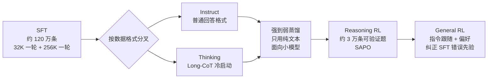
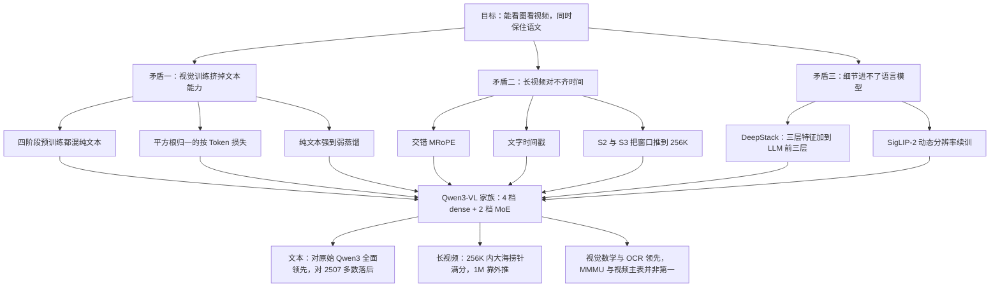

# Qwen3-VL：视觉接进来以后，文字还得站得住

<!-- release-date: 2025-09-23 -->

> 本文依据 Qwen Team 的 **Qwen3-VL Technical Report**，arXiv:2511.21631v2，2025-11-27 提交，PDF 页眉日期 2025-12-01，共 42 页（正文到 p. 25，其后是作者名单、参考文献、附录 A 的基准清单与附录 B 的评测提示词）。页码均指 PDF 自身页码。文中区分三件事：**报告明确写了什么**、**我们怎么解释它**、**哪些是外部资料或本文推算**。

## 先说矛盾：给语言模型装上眼睛，常常要交一笔「语文税」

视觉语言模型（VLM，Vision–Language Model）的做法，通常是在一个训练好的大语言模型前面接一个视觉编码器，再用图文数据继续训练。

这样做有三笔账很难同时算平：

1. **视觉变强，文字变弱。** 继续训练时，图像、视频、OCR 数据挤占了模型容量和训练预算，纯文本的知识、数学和代码常常掉一截。可下游用户仍然要求它「既能看图，又能把题算对」。报告开头就把这件事写成硬要求：多模态模型在语言基准上应当持平或超过自己的纯文本版本（PDF p. 2）。
2. **长视频对不齐时间。** 上一代 Qwen2.5-VL 把绝对时间直接写进位置编号。视频一长，这些编号又大又稀，模型很难回答「第 37 秒发生了什么」（PDF p. 4）。
3. **细节进不了语言模型。** 视觉编码器通常只把最后一层交出去。最后一层擅长「这是一张发票」，不擅长「右下角那行小字」。想把浅层细节也送进去，又不能把视觉 Token 再复制几遍——上下文已经很贵了。

Qwen3-VL 的主张是这三件事可以一起做，不必互相拆台。它在摘要里把成果概括成三根柱子（PDF p. 1）：

- 纯文本理解明显变强，「在若干情况下」超过同档纯文本骨干；
- 原生 256K Token 的交错上下文，文本、图像、视频可以混排；
- 单图、多图、视频上的多模态推理，点名 MMMU 和视觉数学。

读这份报告要带着一个问题：**三根柱子各自被哪张表撑住，撑到什么程度。** 摘要的措辞和表格之间有几处落差，后文会逐一对表。

## 阅读前先认识几个词

- **Token（词元）**：模型读写的最小单位。一张高分辨率长图可以变成上万个视觉 Token。
- **ViT（Vision Transformer，视觉 Transformer）**：把图像切成小块、编码成一串向量的视觉编码器。Qwen3-VL 用的是在 SigLIP-2 上续训的版本（PDF p. 3）。
- **Merger（视觉–语言投影层）**：一个两层 MLP，把相邻 $2 \times 2$ 个视觉特征压成一个 Token，并对齐到语言模型的隐藏维度（PDF p. 3）。
- **RoPE（Rotary Position Embedding，旋转位置编码）**：按位置把向量旋转一个角度来表示「谁在前、谁在后」。不同维度用不同的旋转速度（频率）。
- **MRoPE（Multimodal RoPE，多模态旋转位置编码）**：把 RoPE 推广到三条轴——时间 $t$、高 $h$、宽 $w$——给图像和视频 Token 标出时空坐标。Qwen2-VL 引入（PDF p. 3）。
- **MoE（Mixture-of-Experts，混合专家）**：总参数很大，每个 Token 只激活一小部分。235B-A22B 的意思是总参数 235B、每 Token 激活 22B（PDF p. 2）。
- **Instruct / Thinking**：后训练分成两种模型。Instruct 直接回答；Thinking 先写一段长思维链（CoT，Chain-of-Thought）再回答。它们是两套权重，不是同一模型里的开关（PDF p. 2、p. 9）。

## 一句话先说清

Qwen3-VL 没有换一种新的视觉骨干，也没有发明新的注意力。结构还是 Qwen2.5-VL 的三件套：视觉编码器、MLP Merger、语言模型（PDF p. 2）。它改的是**视觉信号怎么进入语言模型**：

- 位置编码：MRoPE 从「三条轴各占一段频率」改成「交错铺满整段频率」；
- 视觉特征：除了主序列那一条，再从 ViT 的三个中间层取特征，**加到语言模型前三层的隐藏状态上**，不占上下文；
- 视频时间：不再塞进位置编号，而是写成普通文字，如 `<3.0 seconds>`。

训练上，四个阶段把窗口从 8K 推到 256K；损失从按样本平均改成平方根归一的按 Token 平均；后训练分叉成 Instruct 与 Thinking，并用纯文本蒸馏小模型（PDF p. 1–2、p. 4、p. 9）。

如果只记一句：

> **视觉语言模型的难点不在于再换一个更强的编码器，而在于视觉信号从哪一层进来、时间写在哪条通道上，以及训练会不会把语文挤掉。**

## 先看全景：眼睛、投影、大脑怎么接

原文 Figure 1（PDF p. 3）。图上有三处决定了后面每一节怎么读：

1. **主路径仍是「ViT → Merger → 插进序列」。** 下方那排方块就是送进解码器的序列：文本 Token（紫）、三张图各自的视觉 Token、视频帧的 Token 交错排在一起。
2. **DeepStack 走的是另一条路。** 右侧虚线框里，视觉 Token 被加到 LLM Block 1、2、3 上，而不是在序列里多占位置（PDF p. 4）。
3. **视频时间是文字。** Video 1 的两组帧 Token 前面，各有一个 `<0.0 seconds>`、`<4.0 seconds>` 这样的文本 Token（读自 Figure 1）。

图上还标了每张输入的尺寸和 Token 数：Picture 1 是 1248×9376 的博客长截图，11427 个 Token；Picture 2 是 256×32 的一行公式，8 个 Token；Picture 3 是 1440×800 的海报，1125 个 Token（读自 Figure 1）。

这三个数可以验算：$(1248/32) \times (9376/32) = 39 \times 293 = 11427$，$(1440/32) \times (800/32) = 45 \times 25 = 1125$，$(256/32) \times (32/32) = 8$。也就是说，**每个视觉 Token 对应原图的一块 32×32 像素**。报告正文没写 patch 大小，这个换算是本文从图上数字推出的；它与官方权重配置里 `patch_size = 16`、`spatial_merge_size = 2` 一致（外部补充，见文末）。

这组数字说明一件事：视觉序列的长度随分辨率剧烈变化。一张长截图就要一万多个 Token，256K 窗口首先是在给「很多张图 + 很长的视频 + 夹在中间的文字」留位置。

### 模型家族

| 形态 | 型号 | 报告给出的规模 | 视觉编码器 |
|---|---|---|---|
| Dense | 2B、4B | 只有名字 | SigLIP2-Large（300M） |
| Dense | 8B、32B | 只有名字 | SigLIP2-SO-400M |
| MoE | 30B-A3B | 总 30B、激活约 3B（按名字） | SigLIP2-SO-400M |
| MoE | 235B-A22B | 总 235B、每 Token 激活 22B | SigLIP2-SO-400M |

四档 dense、两档 MoE 来自摘要与引言（PDF p. 1–2）；视觉编码器的分配来自 PDF p. 3。第 2 节正文把 dense 写成「three dense variants (Qwen3-VL-2B/4B/8B/32B)」，后面却列了四个名字，是原文笔误（PDF p. 2）。

**报告没有给任何一档的层数、隐藏维度、专家数或词表。** 这些只能去权重配置里查。以旗舰为例，官方 `config.json` 写的是 94 层、隐藏维度 4096、128 个专家每 Token 激活 8 个、64 个查询头配 4 个 KV 头（外部补充）。

每一档都同时发布 Instruct 与 Thinking（PDF p. 2）。报告对「何时选 dense、何时选 MoE」只有一句话：适配不同的延迟–质量折中（PDF p. 1）。

## 核心设计一：交错 MRoPE，让三条轴都分到高频和低频

### 旧问题：三条轴各占一段频率

RoPE 的每一对维度按不同的频率旋转。高频维度转得快，擅长区分相邻的两个位置；低频维度转得慢，擅长区分相隔很远的位置。

Qwen2-VL 的 MRoPE 把这些维度切成三块，时间 $t$、高 $h$、宽 $w$ 各拿一块（PDF p. 3）。问题是，每条轴因此只拿到一段频带。报告说这造成了「不平衡的频谱」，后续研究发现它会损害长视频理解（PDF p. 3）。

### 新设计：把 $t$、$h$、$w$ 交错分配

Qwen3-VL 把 $t$、$h$、$w$ 交错分配到各个维度上，让每条轴在低频和高频里都有代表（PDF p. 3）。这个改法出自同一团队的 *Revisiting Multimodal Positional Encoding in Vision-Language Models*（报告引作 Huang et al., 2025，PDF p. 28）。

**我们如何解释它。** 拿一段一小时的视频想一下：时间轴既要分辨「相邻两帧」，也要分辨「开头和结尾」。如果时间轴只拿到一段频带，它就只能在一种尺度上看清楚。交错之后，三条轴都同时拥有「看近」和「看远」的维度。

### 报告没写的部分

报告只给了动机和定性结论（平衡频谱、减轻偏差、显著改善视频的长程位置建模），**没有给交错的周期、每条轴占几维，也没有单独的消融**（PDF p. 3）。官方配置里旗舰写的是 `mrope_section: [24, 20, 20]`、`mrope_interleaved: true`（外部补充），可以当作「每条轴分到多少对维度」的实现参考，但不是这份 PDF 的内容。

视频一节把「交错 MRoPE + 文字时间戳 + 更密的时间字幕」三件事合在一起，说它们让 8B 的视频能力接近上一代 Qwen2.5-VL-72B（PDF p. 20）。三件事捆在一起讲，所以**交错 MRoPE 单独贡献多少，这份报告里分不出来**。

### 可迁移启发

位置编码里每条轴分到的频率，就是它能分辨的尺度。多轴位置编码（时空、表格的行列、代码的文件与行号）如果按块分配频带，等于提前规定了每条轴只能看一种尺度。交错分配是一个几乎零成本的改动。

## 核心设计二：DeepStack，多层视觉特征走残差，不占上下文

### 旧问题：最后一层太抽象，多贴一份又太贵

标准接法只取 ViT 最后一层。浅层的边缘、纹理、笔画在这一层已经被压成了语义。想把多层特征都送进语言模型，最直接的办法是把它们也拼成 Token 放进序列，但那会让视觉 Token 成倍增加。

### 新设计：三个中间层，加到 LLM 前三层

DeepStack 这个名字借自 Meng et al., 2024。原版是把**多尺度的输入图像**堆成更多 Token；Qwen3-VL 改成从 **ViT 的中间层**取特征（PDF p. 4）。做法三步（PDF p. 4）：

1. 从视觉编码器选三个不同深度的特征；
2. 各用一个专用 Merger 投影到语言模型的隐藏维度；
3. 直接加到语言模型前三层对应位置的隐藏状态上。

引言把它写成「通过轻量的残差连接送到对应的 LLM 层，增强多层融合而不引入额外的上下文长度」（PDF p. 2）。

报告没写取的是 ViT 的哪三层。旗舰的官方配置写的是 `deepstack_visual_indexes: [8, 16, 24]`，视觉编码器共 27 层（外部补充）。

### 消融：三个设计里唯一能单独记账的

Table 12 用一个内部 15B-A2B 的语言模型、200B Token 预训练、不做后训练，直接在验证集上比较（PDF p. 24）：

| 方法 | AVG | AI2D | OCRB | TVQA | InfoVQA | ChartQA | DocVQA | MMMU | MMStar | RLWDQA | MMBEN | MMBCN |
|---|---:|---:|---:|---:|---:|---:|---:|---:|---:|---:|---:|---:|
| Baseline | 74.7 | 81.8 | 81.0 | 80.6 | 71.9 | 81.5 | 89.5 | 52.9 | 55.5 | 67.7 | 81.0 | 78.1 |
| DeepStack | **76.0** | **83.2** | **83.6** | 80.5 | **74.2** | **83.3** | **91.1** | **54.1** | **57.7** | **68.1** | **81.2** | **78.5** |

11 项里 10 项上涨，TextVQA 持平略降（80.6 对 80.5）。涨得最多的是 OCRBench（+2.6）、InfoVQA（+2.3）、MMStar（+2.2）、ChartQA（+1.8）和 DocVQA（+1.6），都是读细字、读图表的任务。报告的解释也是这个：DeepStack 带来了更丰富的视觉信息，提升细粒度理解（PDF p. 24）。

这张表的边界要看清：内部 15B-A2B 不是对外发布的任何一档；200B Token 远小于正式预训练；没有后训练。它证明「多层特征有用」，不能证明发布版上的增益也是 1.3 分。

### 可迁移启发

要把更多信息送进一个上下文昂贵的模型，先找**不增加序列长度的通道**。残差注入的代价是多几个投影层、实现更绕，但比「再贴一份 Token」便宜得多。

## 核心设计三：时间写成文字，位置编号不再背绝对秒数

### 旧问题：位置编号同时干两件事

Qwen2.5-VL 用时间同步的 MRoPE，把视频的绝对时间直接当成时间位置编号。报告指出两个毛病（PDF p. 4）：

1. 视频一长，时间位置编号变得又大又稀，长时程理解会下降；
2. 要学好这种编码，训练数据得在各种帧率上大量、均匀地采样，造数据的成本很高。

说成人话：位置编号本来只负责「谁排在谁后面」，现在还要记「这是第 1 小时 07 分 12 秒」。第二件事让它在长视频上失灵。

### 新设计：每组帧前面写一行时间

Qwen3-VL 改用文字时间戳：每个视频时间片前面加一个格式化字符串，如 `<3.0 seconds>`。训练时同时生成「秒」和「时:分:秒」两种写法，让模型认得各种时间码（PDF p. 4）。这一做法引自 TimeMarker（Chen et al., 2024b，PDF p. 26）。

于是分工变清楚了：位置编码只管序列顺序和交错 MRoPE 的时空格子；「第几秒」变成模型本来就很会读的普通文字。

### 代价与证据

报告承认这会让上下文「略微变长」，换来更直接、更精确的时间感知，方便视频定位和密集描述（PDF p. 4）。

衡量「给一句描述，说出起止秒数」的 Charades-STA 上，旗舰 Instruct 的 mIoU 是 64.8，Thinking 是 63.5（PDF p. 15，Table 2）；表中没有闭源模型的这一项分数。和交错 MRoPE 一样，**文字时间戳没有单独消融**（PDF p. 20）。

### 可迁移启发

当一个机制同时承担「排序」和「语义」，拆开往往两边都变简单。模型已经很会读数字和单位，就不必再让位置编号去记绝对时间。

## 视觉编码器：在 SigLIP-2 上续训

视觉编码器从官方 SigLIP-2 权重初始化，按动态分辨率继续训练；为了适配任意分辨率，加了 2D-RoPE，并按输入尺寸插值绝对位置编码，做法沿用 CoMP（PDF p. 3）。

Table 11 把续训后的编码器叫 Qwen3-ViT，和原版 SigLIP-2 比了两个阶段（PDF p. 24）：

| 阶段 | 基准 | SigLIP-2 | Qwen3-ViT |
|---|---|---:|---:|
| CLIP 零样本 | ImageNet-1K | 84.2 | 84.6 |
| CLIP 零样本 | ImageNet-S | 76.2 | 74.5 |
| CLIP 零样本 | ObjectNet | 79.9 | 81.0 |
| CLIP 零样本 | Omni（内部） | 36.9 | **45.5** |
| 接 1.7B Qwen3、训 1.5T Token | OCRB | 77.2 | 78.7 |
| 接 1.7B Qwen3、训 1.5T Token | AI2D | 74.1 | 76.2 |
| 接 1.7B Qwen3、训 1.5T Token | RealWorldQA | 58.7 | **66.1** |
| 接 1.7B Qwen3、训 1.5T Token | InfoVQA | 65.3 | 67.0 |
| 接 1.7B Qwen3、训 1.5T Token | Omni（内部） | 50.1 | 53.0 |

ImageNet 系列基本打平，ImageNet-S 和 ImageNet-R 还略降；涨幅集中在内部的 OmniBench（考察世界知识）和接上语言模型后的真实场景题。1.5T 这个数只属于这组消融，**不是正式预训练的总量**。

## 预训练：四段加窗，合计约 2.2T Token

Table 1 给出四个阶段（PDF p. 4）：

| 阶段 | 目标 | 训练哪些参数 | Token 预算 | 序列长度 |
|---|---|---|---:|---:|
| S0 | 视觉–语言对齐 | 只训 Merger | 67B | 8,192 |
| S1 | 多模态预训练 | 全部 | 约 1T | 8,192 |
| S2 | 长上下文预训练 | 全部 | 约 1T | 32,768 |
| S3 | 超长上下文适配 | 全部 | 100B | 262,144 |

加起来约 2.17T Token（本文加法）。这是在 Qwen3 骨干之上的视觉–语言训练量，不含骨干原先的文本预训练。

每一段的因果都很清楚（PDF p. 4–5）：

- **S0 只动 Merger。** ViT 和 LLM 都冻结，用约 67B Token 的高质量图文对、视觉知识和 OCR 数据，先把两个向量空间接上。
- **S1 解冻全部参数。** 约 1T Token，图文交错文档、grounding、VQA、STEM 和少量视频。为了保住语言能力，数据里混入了纯文本。
- **S2 把窗口乘四到 32K。** 再约 1T Token，纯文本比例提高，视频和 agent 指令数据显著增加。
- **S3 把窗口推到 262,144。** 只用 100B Token，但专门堆长视频和长文档。256K 是真的在这个长度上训练过，不是改一个配置数字。

### 平方根重加权：只有一句话

摘要和引言都提到，损失从「按样本平均」改成「平方根归一的按 Token 平均」，以平衡文本与多模态数据的贡献，并声称这能提升多模态、不伤文本（PDF p. 1–2）。**正文没有这一节：没有公式、没有系数、没有消融。**

**我们如何解释它。** 按样本平均时，一条几十 Token 的短文本和一条上万 Token 的视频描述权重相同，长样本里每个 Token 分到的梯度被稀释；按 Token 平均时，长样本又会主导。用样本长度的平方根做归一，是介于两者之间的折中。这是对名字的推断，不是报告给出的实现。

## 数据：按能力组织，只给少数数字

第 3.2 节按能力介绍数据，**不给总配比**。报告写明的数字和关键做法如下。

| 类别 | 报告写明的做法与数字 | 页码 |
|---|---|---|
| 图文对与交错文档 | 用微调过的 Qwen2.5-VL-32B 重写 caption；只在重写后的文本上做语义去重；交错文档用轻量 Qwen 打分器分领域、剔除广告与标题党；书籍用 Qwen2.5-VL-7B 解析，连续页拼到最长 256K，要求最低页数和最低图文比 | p. 5 |
| 世界知识 | 十几类实体，按重要性采样处理长尾；把稀疏 alt-text 换成描述属性、布局和互动的长描述 | p. 5–6 |
| OCR | 3000 万张内部图，用 OCR 专模伪标签加 Qwen2.5-VL 精修，**无人工标注**；在 Qwen2.5-VL 的 10 种非中英语言之外再加 29 种，合成约 3000 万条多语 OCR，另收集 100 万张以上真实多语图 | p. 6 |
| 文档解析 | Common Crawl 上 300 万份 PDF（10 类各 30 万）加 400 万份内部文档；版面模型给阅读顺序和框，Qwen2.5-VL-72B 做区域识别；输出 QwenVL-HTML（元素级框）与 QwenVL-Markdown（只定位图和表，表格用 LaTeX）两种格式 | p. 6 |
| 长文档 | 把单页样本拼成多页解析序列；构造证据跨页、跨图表正文的长文档 VQA | p. 6 |
| Grounding 与计数 | 框和点两种；计数分直接数、按框数、按点数；坐标改成归一化到 $[0, 1000]$，不再跟像素绑定 | p. 7 |
| 空间与 3D | 空间关系用相对表述而非绝对坐标；3D grounding 是单目图 + 指代表达 + 9 自由度 3D 框，按 Omni3D 统一到虚拟相机坐标 | p. 7 |
| 代码 | 纯文本代码复用 Qwen3 与 Qwen3-Coder 语料；多模态代码含截图转 HTML/CSS、图转 SVG、带图的编程问答、流程图与公式转写 | p. 8 |
| 视频 | 由短到长合成带时间戳的密集描述；物体、动作、人物级的时空定位；按片源平衡；预训练各阶段按序列长度动态调 fps 和最大帧数 | p. 8 |
| STEM | 程序渲染几何图：100 万条点定位、200 万条感知 VQA、600 万条图注；超过 6000 万道 K–12 到本科习题；超过 1200 万条带图长 CoT；语言推理数据直接来自 Qwen3 | p. 8–9 |
| Agent | GUI 覆盖桌面、手机、网页；多步轨迹由自演化框架生成加人工抽检；多模态函数调用轨迹「不需要真的实现可执行函数」，由模型合成返回结果；图文搜索轨迹用于长尾实体 | p. 9 |

几条值得带走的数据原则：

1. **用上一代模型当数据工人。** 重写 caption、解析文档、区域识别、质检，全部交给 Qwen2.5-VL 系列，而不是从零雇人标注。
2. **长上下文数据要设下限。** 书籍序列要求最低页数和最低图文比，否则 256K 窗口会被纯文本或无关图片浪费。
3. **STEM 分而治之。** 视觉感知和语言推理分开造、再合并；报告给的理由是「多模态推理能力很大程度上来自语言推理能力」（PDF p. 9）。

## 后训练：SFT、强到弱蒸馏、两段强化学习

报告把后训练写成三段：SFT、强到弱蒸馏、强化学习；强化学习再分 Reasoning RL 和 General RL（PDF p. 9）。另有一条「看图思考」的工具调用支线。

这张图按 PDF p. 9–12 的文字重画，是流程示意。报告没有写 Instruct 与 Thinking 在蒸馏和 RL 阶段的具体分工，图上把两支合并画，只表示阶段顺序。

### SFT：120 万条，三分之一是纯文本

SFT 数据约 120 万条，三分之一纯文本，三分之二是图文和视频文本（PDF p. 10）。它在 Qwen2.5-VL「约 8 个核心领域、30 个子类」的基础上，补了具身空间推理、看图推理、视频时空定位、上百页的技术文档等新能力（PDF p. 10）。

训练分两轮：先在 32K 上跑一个 epoch，再在 256K 上跑第二个 epoch，后者把长输入和 32K 数据交错混合；长输入包括上百页技术文档、整本教材和最长两小时的视频（PDF p. 10）。

过滤分两层（PDF p. 10–11）：

- **Query 过滤**：用 Qwen2.5-VL 丢掉难以验证、没有实质内容的问题，含糊的指令做最小改写；
- **Response 过滤**：规则去掉重复、不完整、格式错误和有害回答；再用 Qwen2.5-VL 系列奖励模型从正确性、完整性、清晰度打分，视觉题特别检查「是否真的用了图」。

### Thinking 的冷启动：看不到图也能做对的题，要扔掉

Thinking 模型的 Long-CoT 冷启动数据图文与纯文本约 1:1，筛选有三步（PDF p. 11）：

- **难度**：只留基线模型通过率低、或回答特别长的题；
- **多模态必要性**：视觉数学题如果 Qwen3-30B-nothink **不看图**也能做对，就丢掉；
- **回答质量**：去掉答案错误、过度重复、中英混写和明显瞎猜的回答。

第二条最值得记。没有它，模型可以从题干文字里猜出答案，学到的是「假装在看图」。

### 强到弱蒸馏：用纯文本教小模型

蒸馏沿用 Qwen3 的做法，分两步：先离线模仿教师的回答（off-policy），再让学生自己生成、用 KL 散度对齐教师与学生的 logits（on-policy）。报告说这一步是「为了进一步提升轻量模型的表现」（PDF p. 11）。

关键的一句在 PDF p. 9：**蒸馏只用纯文本数据去微调语言模型骨干，却同时提升了文本和多模态任务的推理能力。** 小模型的文本结果表后面，报告又把 2B/4B/8B 的表现归功于这套蒸馏（PDF p. 23）。

**我们如何解释它。** 如果这句话成立，说明很多视觉推理题缺的不是「看见」，而是语言侧的推理方式。纯文本教师就能把「怎么想」教给骨干，眼睛那一侧不必重新蒸馏。但报告没有给蒸馏前后的对照表，也没写教师是谁、蒸馏数据多大，这仍是作者的归因，不是分离过的实验。

### Reasoning RL：约 3 万条可验证题

任务包括数学、代码、逻辑、视觉 grounding 和视觉谜题，每道题都能用规则或代码执行器确定性地判对错（PDF p. 11）。数据准备（PDF p. 11–12）：

1. 多模态题先用旗舰的预备检查点每题采 16 个回答，全错的扔掉；
2. 按任务做小规模 RL，去掉「练了也涨不动」的数据源；
3. 最终约 3 万条；训每个模型时再采 16 个回答，通过率超过 90% 的简单题扔掉。

奖励按任务分别实现，但共享一套框架；用任务专属的格式提示约束输出，因此**不单独设格式奖励**；回答语言与提问语言不一致时扣分（PDF p. 12）。算法是 SAPO（Soft Adaptive Policy Optimization，arXiv:2511.20347），报告只说它平滑、自适应、在不同规模和结构上都稳定，没有展开公式（PDF p. 12、p. 27）。

### General RL：纠正 SFT 留下的坏习惯

这一段优化两个方向：指令跟随（内容、格式、长度、JSON 等约束）和开放问题的偏好对齐（PDF p. 12）。

它还有一个明确目的：**让模型忘掉 SFT 灌进去的错误先验**。报告举了两个例子——反直觉的物体计数、复杂钟面读时间——专门设计能触发这些错误的可验证任务（PDF p. 12）。对中英混写、重复、格式错误这类低频毛病，普通 RL 采样效率太低，于是单独收集一批「已知会引出坏行为」的提示，集中施加高频惩罚（PDF p. 12）。

奖励是规则加模型的混合。模型裁判用 Qwen2.5-VL-72B-Instruct 或 Qwen3，对照参考答案打分，用来减少「格式不标准但其实答对」被误判（PDF p. 12）。

### Thinking with Images：让模型学会「放大看」

这条支线让模型看不清时调用工具，而不是只靠一次前向。评测提示词显示，这个工具是 `image_zoom_in_tool`：给一个框，裁出那块区域放大再看（PDF p. 40）。训练分两段（PDF p. 13）：

1. 合成约 1 万条简单的两轮 grounding 题，在 Qwen2.5-VL-32B 上 SFT 出「思考 → 行动 → 看反馈 → 回答」的行为，再做多轮工具 RL；
2. 用这个 32B agent 蒸馏出约 12 万条更多样的多轮交互，对 Qwen3-VL 做同样的 SFT + 工具 RL。

RL 用三个奖励（PDF p. 13）：

| 奖励 | 谁来判 | 判什么 |
|---|---|---|
| 答案正确 | Qwen3-32B | 最终答案对不对 |
| 多轮推理 | Qwen2.5-VL-72B | 是否正确理解工具反馈、推理是否连贯 |
| 工具调用 | 与 Qwen2.5-VL-72B 离线估计的目标次数比较 | 调用次数是否与任务复杂度相称 |

第三个奖励是被逼出来的。早期实验里，模型为了拿前两个奖励，**不管题目难不难都只调用一次工具**（PDF p. 13）。答案对、过程通顺，这两个奖励都能被「调一次就收手」骗到；只有把调用次数和任务难度挂钩，模型才会真正去探索。

## Infra：写到并行策略，没写账单

预训练在阿里云 PAI-Lingjun 上，基于 Megatron-LM 做张量并行（TP）、流水线并行（PP）、上下文并行（CP）、专家并行（EP）与 ZeRO-1 数据并行的混合（PDF p. 13）。报告只说这套配置「在最多 10,000 张 GPU 的规模上」仍能保持高吞吐和低通信延迟——这是能力声明，不是「本次训练用了 1 万张卡」。

**没有 GPU 型号、GPU 小时、MFU、训练时长。** 部署与评测用 vLLM 或 SGLang（PDF p. 13）。

## 实验一：纯文本到底掉没掉

这是第一根柱子，也是全报告措辞最需要对表的地方。报告在三处给了三种强度的说法：

- 摘要：「在若干情况下」超过同档纯文本骨干（PDF p. 1）；
- 第 2 节：旗舰「在多数语言基准上」超过它的纯文本对应模型（PDF p. 2–3）；
- 第 5.11 节：旗舰 Instruct「可比甚至超过」，尤其在数学和代码上（PDF p. 21）。

Table 5–10 用的对照模型有两种：2025 年 4 月的原始 Qwen3，以及 7 月之后的 2507 刷新版。把两种对照分开数，结论完全不同。

所以「加了视觉，语文没掉」要说成：**相对原始 Qwen3，确实全面更强；相对同尺寸的 2507 刷新版，多数项落后。** 摘要的「若干情况」是准确的，第 2 节的「多数」对不上 Table 5。

旗舰 Instruct 对 Qwen3-235B-A22B-Instruct-2507（PDF p. 21，Table 5，摘录）：

| 类型 | 基准 | Qwen3-VL Instruct | Qwen3 Instruct-2507 |
|---|---|---:|---:|
| 知识 | MMLU-Pro | 81.8 | **83.0** |
| 知识 | GPQA | 74.3 | **77.5** |
| 推理 | AIME-25 | **74.7** | 70.3 |
| 推理 | HMMT-25 | **57.4** | 55.4 |
| 推理 | LiveBench | 74.8 | **75.4** |
| 对齐 | IFEval | 87.8 | **88.7** |
| 对齐 | Arena-Hard V2 | 77.4 | **79.2** |
| 代码 | LiveCodeBench v6 | **54.3** | 51.8 |
| Agent | BFCL-v3 | 67.7 | **70.9** |
| 多语 | PolyMATH | 45.1 | **50.2** |

17 项里 VL 赢 5 项：AIME-25、HMMT-25、WritingBench、LiveCodeBench v6、INCLUDE。「尤其在数学和代码上」这句是成立的；知识、对齐、Agent、多语大多落后。

旗舰 Thinking 对 Qwen3-235B-A22B-Thinking-2507，22 项里只赢 3 项：LiveBench（79.6 对 78.4）、IFEval（88.2 对 87.8）、TAU2-Airline（62.0 对 58.0）。最难的数学和代码落后更明显：AIME-25 89.7 对 92.3，HMMT-25 77.4 对 83.9，LiveCodeBench v6 70.1 对 74.1（PDF p. 22，Table 6）。

报告说 Thinking 旗舰「在 AIME-25 和 LiveCodeBench v6 上超过 OpenAI o3 (medium) 与 Claude-Opus-4 (with thinking)」（PDF p. 21）。LiveCodeBench 上 70.1 对 o3 的 58.6 没问题；但 AIME-25 那一格，o3 的 88.9 在表里标的是 **(high)**，不是 medium（PDF p. 22）。

中小档的对照也要分开读：

- **对原始 Qwen3，几乎全胜。** 32B Instruct 对 Qwen3-32B，AIME-25 66.2 对 20.2、HMMT-25 46.1 对 10.9、LiveCodeBench v6 43.8 对 29.1，17 项全部更高（PDF p. 22，Table 7）。报告说 32B 与 30B-A3B 的 Instruct「在所有基准上」都超过对应的原始 Qwen3（PDF p. 21），但 30B-A3B 的 MultiIF 是 66.1 对 70.8，有一项例外。
- **对 2507，多数落后。** 30B-A3B Instruct 对 Qwen3-30B-A3B-Instruct-2507，AIME-25 69.3 对 61.3、HMMT-25 50.6 对 43.0 领先，但 17 项里只赢 5 项、持平 1 项（PDF p. 22）；4B Instruct 对 Qwen3-4B-2507 只赢 3 项，AIME-25 也是 46.6 对 47.4（PDF p. 23，Table 9）。

**我们的判断：**

1. 原始 Qwen3 的非思考模式起点很低（Qwen3-32B 的 AIME-25 只有 20.2），VL 版的大幅领先里，很大一部分应归功于后训练和蒸馏的换代，不能记在 DeepStack 或交错 MRoPE 头上。
2. 同一代后训练水平的公平对照是 2507。在这个对照下，视觉训练的「语文税」在知识、对齐和多语上仍然存在，只是在数学和代码上被推理训练盖过去了。
3. 报告没有做「同一套后训练、只差视觉训练」的对照，所以视觉训练本身到底让文本掉了多少，从这份 PDF 算不出来。

采样设置不同，横比别人的分数时要注意（PDF p. 20–21）：大 Instruct（235B、32B、30B-A3B）温度 0.7、top-p 0.8、top-k 20、presence penalty 1.5；小 Instruct（8B、4B、2B）温度 1.0、top-p 1.0、top-k 40、presence penalty 2.0；MoE Thinking 温度 0.6、top-p 0.95、top-k 20；dense Thinking 温度 1.0、top-p 0.95、top-k 20、presence penalty 1.5。最大输出 32,768 Token，AIME-25、HMMT-25、LiveCodeBench v6 放到 81,920。

## 实验二：视觉任务各自赢在哪

主表是 Table 2，旗舰对 Gemini 2.5 Pro、GPT-5、Claude Opus 4.1（PDF p. 15）。表注写明：带 ∗ 的对手分数取自对方技术报告，其余是 Qwen 团队自己跑的（PDF p. 15）。

### 视觉数学：这根柱子站得住

| 基准 | VL Thinking | VL Instruct | Gemini 2.5 Pro thinking | GPT-5 high |
|---|---:|---:|---:|---:|
| MathVista mini | **85.8** | 84.9 | 82.7 | 81.3 |
| MathVision | **74.6** | 66.5 | 73.3 | 70.9 |
| MathVerse mini | **85.0** | 72.5 | 82.9 | 84.1 |
| MMMU | 80.6 | 78.7 | 81.7 | **84.2** |
| MMMU-Pro | 69.3 | 68.1 | 68.8 | **78.4** |

（PDF p. 15，Table 2 摘录）

MathVista、MathVision、MathVerse 上 Thinking 是全表最高。MMMU 和 MMMU-Pro 则明显低于 GPT-5 high。摘要把 MMMU 和视觉数学放在一起说「领先表现」（PDF p. 1），**视觉数学被表撑住了，MMMU 没有。**

视觉数学也不是只有旗舰才有：32B Thinking 的 MathVista mini 是 85.9，与旗舰 85.8 几乎一样（PDF p. 16，Table 3）。报告还说 32B 在推理任务上已超过上一代 Qwen2.5-VL-72B（PDF p. 14）。

### 文档和 OCR：Instruct 往往比 Thinking 更会读字

| 基准 | VL Thinking | VL Instruct | Gemini 2.5 Pro thinking | GPT-5 high |
|---|---:|---:|---:|---:|
| DocVQA test | 96.5 | **97.1** | 92.6 | 91.5 |
| InfoVQA test | **89.5** | 89.2 | 84.2 | 79.0 |
| OCRBench | 875 | **920** | 866 | 810 |
| CC-OCR | 81.5 | **82.2** | 77.2 | 68.3 |
| OmniDocBench en（越低越好） | 0.155 | **0.143** | 0.347 | 0.356 |
| CharXiv (RQ) | 66.1 | 62.1 | 67.9 | **81.1** |
| MMLongBench-Doc | 56.2 | **57.0** | 55.6 | 51.5 |

（PDF p. 15，Table 2 摘录）

规律很稳定：**读字、解析、定位，Instruct 常比 Thinking 略高；需要多步推理的图表题（CharXiv 推理子集），Thinking 更高**，但仍落后于 GPT-5 high 和 Gemini（PDF p. 17）。不是所有视觉任务都该开思考模式。

长文档 MMLongBench-Doc 上 Instruct 57.0、Thinking 56.2，报告称之为该任务的最好成绩（PDF p. 17）。

原文 Figure 2（PDF p. 17）。多语 OCR 从 Qwen2.5-VL 的 10 种非中英语言扩到 39 种；在内部测试集上，39 种里有 32 种准确率超过 70%，报告把 70% 当作「实际可用」的门槛（PDF p. 17）。注意这张图只画出了过线的 32 种，**另外 7 种是哪些、得分多少，图和正文都没给**。柱高读数（约 71%–98%）是读图估计。这是内部测试集，不是公开基准。

### 视频：架构故事完整，主表并非全面领先

| 基准 | VL Thinking | VL Instruct | Gemini 2.5 Pro thinking | Gemini budget-128 | GPT-5 high |
|---|---:|---:|---:|---:|---:|
| Video-MME（无字幕） | 79.0 | 79.2 | **85.1** | 80.6 | 84.7 |
| MLVU M-Avg | 83.8 | 84.3 | 85.6 | 81.2 | **86.2** |
| LVBench | 63.6 | 67.7 | **73.0** | 69.0 | — |
| MVBench | 75.2 | **76.5** | 69.9 | 65.8 | 75.3 |
| Charades-STA mIoU | 63.5 | **64.8** | — | — | — |

（PDF p. 15，Table 2 摘录）

报告说旗舰 Instruct 在标准视频基准上与 Gemini 2.5 Pro（thinking budget 128）和 GPT-5 minimal 相当，并在长视频上「达到甚至超过」Gemini 2.5 Pro，「最明显的是 MLVU」（PDF p. 20）。对表看：MLVU 上 84.3 超过的是 budget-128 那一列的 81.2，**低于完整思考模式的 85.6**；Video-MME 和 LVBench 与完整 Gemini 仍有 5–6 分差距。

评测条件本身也不对称，报告自己写了（PDF p. 20）：Qwen3-VL 每个视频最多 2048 帧、视频 Token 不超过 224K；受 API 限制，Gemini 2.5 Pro 只给 512 帧、GPT-5 给 256 帧、Claude Opus 4.1 给 100 帧。每帧 Token 上限在 VideoMMMU 与 MMVU 是 768，其余 640；Charades-STA 按 4 fps 采样，其余按 2 fps。多给帧既是能力，也是评测条件。

### 长视频大海捞针：256K 以内满分，外推到 1M 仍有 99.5%

原文 Figure 3（PDF p. 25）。做法是把一个含关键视觉证据的「针」帧插进长视频的不同位置，让模型找到它并回答问题；视频按 1 fps 均匀采样，动态调整分辨率以保持视觉 Token 总预算不变（PDF p. 25）。

结果：30 分钟以内（对应 256K Token）准确率 100%；用 YaRN 外推到约 1M Token（约 2 小时）仍有 99.5%（PDF p. 25）。

两个边界：

- **256K 是原生训练长度，1M 是 YaRN 外推。** 报告没给 YaRN 的参数。官方 README 给了一份推理配置，并提醒因为交错 MRoPE 的位置编号增长比普通 RoPE 慢，从 256K 扩到 1M 时缩放因子取 2 或 3 而不是 4（外部补充）。
- **大海捞针测的是「找得到那一帧」，不是「看懂两小时的剧情」。** 它证明长窗口里的检索没坏，不证明长程推理。

### Grounding、空间、多图、Agent

- **2D grounding**：RefCOCO 平均 Thinking 92.1；ODinW-13 Instruct 48.6 mAP，评测时置信度统一设为 1.0，并把所有类别同时写进提示词（PDF p. 15、p. 19）。
- **3D grounding**：Omni3D 上用 mAP@0.15（IoU 阈值 0.15、置信度 1.0）；SUN RGB-D 上 Thinking 34.9，比 Gemini 2.5 Pro 的 29.7 高 5.2 分，Instruct 更高，是 39.4（PDF p. 15、p. 19）。
- **空间理解**：旗舰 Thinking 在 EmbSpatial、RefSpatial、RoboSpatialHome 上分别是 84.3、69.9、73.9（PDF p. 15、p. 19）。
- **多图**：MuirBench Thinking 80.1，全表最高（PDF p. 19）。
- **GUI**：ScreenSpot Pro Instruct 62.0、OSWorldG Thinking 68.3，感知类很强；在线操作 AndroidWorld 旗舰 Instruct 63.7，OSWorld 旗舰 Thinking 38.1、32B Thinking 41.0，而表中 Claude Opus 4.1 非思考是 44.4（PDF p. 15–16）。**看懂界面很强，真正上手操作还不是第一**；32B 在 OSWorld 上高于 235B，规模在这里不单调。
- **幻觉与指令**：HallusionBench 上 Thinking 66.7，比 Gemini 2.5 Pro、GPT-5、Claude Opus 4.1 分别高 3.0、1.0、6.3 分（PDF p. 14–15）。

### 带工具的细粒度感知

V*、HRBench-4K、HRBench-8K 上，旗舰 Instruct 开工具后分别是 93.7、85.4、82.4（PDF p. 15，Table 2 带「+」号的格）。正文写成 85.3 和 82.3，与表差 0.1，以表为准（PDF p. 19）。

报告还有一个更强的论断：**加工具带来的提升，稳定地大于把模型做大**，在 Qwen3-VL 家族内部，V* 上加工具带来的绝对提升「一致在 5 分左右」（PDF p. 19）。这句从表上核不出来：三张表里只有两种组合——Thinking 不带工具、Instruct 带工具——没有「同一个模型开关工具」的对照。拿同尺寸的这两列相减，差值是 6.3–13.1 分，不是 5 分左右（本文按 Table 2–4 计算）。把做大当对照倒是能看：Instruct 带工具从 8B 的 90.1 到 235B 的 93.7，只多 3.6 分（PDF p. 15、p. 18）。

## 报告没有告诉我们的事

**架构**

- 各档的层数、隐藏维度、头数、专家数；
- DeepStack 用 ViT 的哪三层、三个专用 Merger 是否共享参数；
- 交错 MRoPE 的维度分配和交错顺序；
- 平方根重加权的公式与作用方式；
- patch 大小、视频的时间下采样（这些都在官方配置里，不在 PDF 里）。

**训练**

- 学习率、优化器、batch、步数；各阶段纯文本与多模态数据的比例；
- GPU 型号、GPU 小时、训练时长；
- 蒸馏的教师身份、KL 系数、数据量；SAPO 在本项目中的超参；
- Instruct 与 Thinking 在蒸馏和 RL 阶段各走了哪些步骤。

**评测**

- 交错 MRoPE、文字时间戳、平方根重加权都没有单独消融；只有 DeepStack 和视觉编码器有；
- 没有「同一套后训练、只差视觉训练」的纯文本对照；
- 没有安全、视觉越狱类评测；没有延迟和吞吐。

结论一节说在探索「统一的理解–生成架构」（PDF p. 25），但这份报告里的 Qwen3-VL **只输出文本**。

## 最值得带回自己项目的七条

### 1. 视觉信息进语言模型，先问走序列还是走残差

主 Merger 走序列，占上下文；DeepStack 走残差，不占。上下文是最贵的资源，额外的细节优先找不占序列的通道。

### 2. 位置编码的频率分配就是分辨率分配

哪条轴只拿到一段频带，它就只能在一种尺度上看清楚。多轴位置编码默认应该交错铺满频谱。

### 3. 语义写成文字，位置编号只管顺序

时间戳写成 `<3.0 seconds>`，比让位置编号记绝对秒数更简单、也更容易泛化到各种帧率。同样的思路适用于任何「既要排序、又要表达语义」的坐标。

### 4. 新编码器接旧骨干，先冻住两头只训投影

S0 只训 Merger，用 67B Token 先把两个向量空间接上，再解冻全部参数。一上来全参数训练，梯度会先冲坏已经训好的语言模型。

### 5. 加窗要付 Token 租金

8K → 32K 再用约 1T Token，32K → 256K 再用 100B，而且长数据要设页数和图文比的下限。只改配置里的长度数字，得到的是「塞得进去」，不是「用得起来」。

### 6. 多模态推理题要过一道「不看图能做对吗」的筛子

否则模型会从题干里猜答案。同理，工具奖励必须惩罚「只调一次就交差」：答案对加过程通顺这两个奖励，都能被最省事的策略骗到。

### 7. 「没有退化」一定要问对照的是哪一版

对原始 Qwen3 几乎全胜，对 2507 多数落后，是同一份数据的两种读法。读任何「多模态不伤文本」的结论，先找到对照模型的版本号。

## 用一张图重新串起全文

## 关键词回看

- **交错 MRoPE**：把时间、高、宽交错分配到整段旋转频率，而不是各占一段。
- **DeepStack**：从 ViT 三个中间层取特征，经专用 Merger 加到 LLM 前三层的隐藏状态上，不增加上下文。
- **文字时间戳**：`<3.0 seconds>` 或「时:分:秒」字符串，替代把绝对时间写进位置编号的 T-RoPE 式做法。
- **Merger**：两层 MLP，把 $2 \times 2$ 个视觉特征压成一个 Token；折合原图 32×32 像素一个 Token（本文据 Figure 1 验算）。
- **Qwen3-ViT**：在 SigLIP-2 上按动态分辨率续训的视觉编码器。
- **S0–S3**：只训 Merger 的对齐 → 全参数 8K → 全参数 32K → 全参数 256K。
- **平方根重加权**：从按样本平均的损失改为平方根归一的按 Token 平均；报告没给公式。
- **强到弱蒸馏**：先模仿教师回答，再在学生自己的回答上对齐 logits；只用纯文本。
- **SAPO**：Reasoning RL 用的策略梯度算法，本报告未展开。
- **Thinking with Images**：用放大裁剪工具多轮看图；工具调用次数也进奖励。
- **YaRN**：把 256K 原生窗口外推到约 1M 的位置编码扩展方法。

## 最后的判断

Qwen3-VL 的架构改动是克制的：三件套没变，真正被重排的是**信息从哪一层进来、时间写在哪条通道、训练怎样在图文之间分账**。

三根柱子读完表之后，应当降调成这样：

1. **纯文本**：相对原始 Qwen3 全面更强；相对同代的 2507 刷新版，只在数学和代码上领先，知识、对齐、多语仍有税。摘要的「若干情况」准确，第 2 节的「多数」不准确。
2. **256K 交错长上下文**：是付了约 1.1T Token 训练出来的原生能力（S2 + S3），大海捞针在窗口内满分；1M 是外推。
3. **多模态推理**：视觉数学、OCR、文档解析是硬实力；MMMU 不是第一；视频主表对完整思考模式的 Gemini 仍有差距；GUI 感知强、在线操作仍落后。

证据强度也分层：

- **有消融支撑的**：DeepStack（Table 12）、续训视觉编码器（Table 11）。
- **只有作者归因的**：交错 MRoPE 与文字时间戳对视频的贡献、平方根重加权「不伤文本」、纯文本蒸馏提升多模态推理、「加工具的提升一致约 5 分」。
- **完全没公开的**：模型规格、训练超参、算力、各阶段数据配比。

如果只带走一句：

> **把眼睛接到语言模型上，该先改的不是编码器的牌子，而是特征从哪一层进来、时间用哪条通道写，以及训练会不会让语文先认输。**

## 资料与阅读边界

**原始依据**

- Qwen3-VL Technical Report，[arXiv:2511.21631](https://arxiv.org/abs/2511.21631) v2（2025-11-27 提交），42 页。arXiv 提交历史为 v1（2025-11-26）、v2（2025-11-27），v2 即最新版。PDF 页眉的 2025-12-01 是文稿日期。

**首发日**

- `release-date` 取 **2025-09-23**，即家族首个模型（235B-A22B 的 Instruct 与 Thinking）对外开放的日期。官方仓库 [QwenLM/Qwen3-VL](https://github.com/QwenLM/Qwen3-VL) 的 News 写明「2025.09.23: We have released the Qwen3-VL-235B-A22B-Instruct and Qwen3-VL-235B-A22B-Thinking」；官方博客 [Qwen3-VL: Sharper Vision, Deeper Thought, Broader Action](https://qwen.ai/blog?id=99f0335c4ad9ff6153e517418d48535ab6d8afef) 的发布时间是 2025-09-22 22:00 UTC，即北京时间 2025-09-23 06:00；Hugging Face 权重仓库 [`Qwen/Qwen3-VL-235B-A22B-Instruct`](https://huggingface.co/Qwen/Qwen3-VL-235B-A22B-Instruct) 的权重文件从 2025-09-23 05:23 UTC 开始提交（仓库 `createdAt` 2025-09-22 当天只有一个空的 initial commit，不算）。其余档位 2025-10-04 至 10-21 陆续开放，论文 2025-11-26 上传，都不回写首发日。

**外部补充（不是报告内容）**

- 旗舰权重的 [`config.json`](https://huggingface.co/Qwen/Qwen3-VL-235B-A22B-Instruct/blob/main/config.json) 与 `preprocessor_config.json`：94 层、隐藏维度 4096、128 个专家激活 8 个、64 个查询头与 4 个 KV 头；`mrope_section: [24, 20, 20]`、`mrope_interleaved: true`；视觉编码器 27 层、`deepstack_visual_indexes: [8, 16, 24]`；`patch_size = 16`、`spatial_merge_size = 2`、`temporal_patch_size = 2`。
- 官方 README 的 YaRN 推理配置（256K 扩到 1M 时缩放因子取 2 或 3），以及把 OCR 写成「32 languages」——与论文「支持 39 种、其中 32 种超过 70%」口径不同，以 PDF 为准。
- 交错 MRoPE 的出处 *Revisiting Multimodal Positional Encoding in Vision-Language Models*、SAPO（arXiv:2511.20347）、TimeMarker，都只按报告参考文献给出名字，细节不在本 PDF。

**本文推算与读图**

- Figure 1 的 Token 数验算（32×32 像素一个 Token）、Table 1 的 Token 总和、Table 5–10 的逐项胜负计数、DeepStack 各项涨幅、V* 列间差值，都是本文按报告数字做的计算。
- Figure 2 的柱高区间、Figure 3 中颜色略浅的格子位置，是读图估计。

**同系列**

- 后训练的强到弱蒸馏、Instruct 与 Thinking 的分工，可以对照 Qwen3 一篇；视频时间戳写成文字的做法，在 Qwen3.5-Omni 一篇里还会再出现。文中「上一代如何做」均以本报告自己的转述为准。
