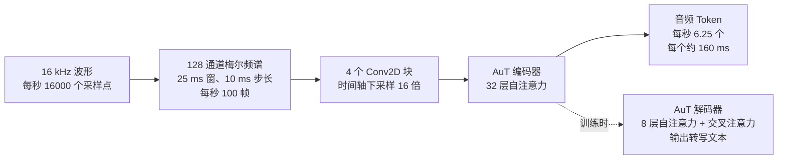
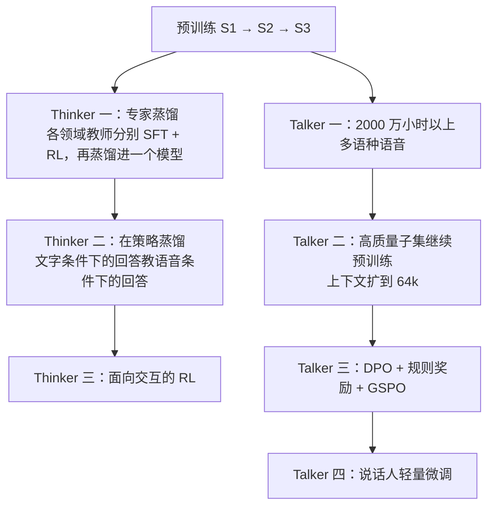
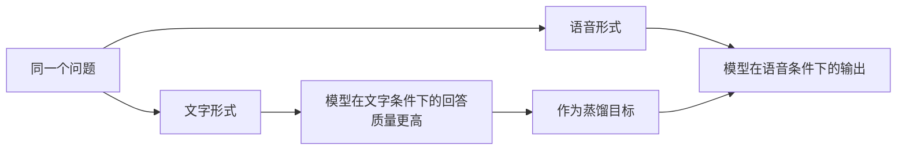
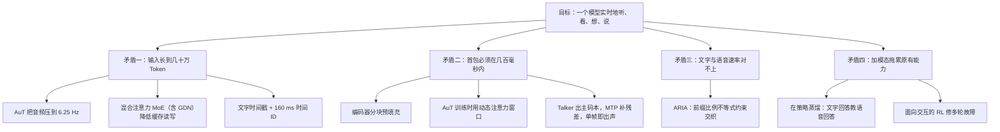

# Qwen3.5-Omni：一边听、一边看、一边说，还不能让人等

<!-- release-date: 2026-03-30 -->

> 本文依据 Qwen Team 发布的 **Qwen3.5-Omni Technical Report**，arXiv:2604.15804v2，2026-04-21 提交，PDF 封面日期 2026-04-22，共 28 页（正文到 p. 16，其后是参考文献、作者名单与附录多语言表）。页码均指 PDF 自身页码。文中区分三件事：**报告明确写了什么**、**我们怎么解释它**、**哪些是外部资料**。

## 先想象一个具体场景

你举起手机，摄像头对着桌上一张手画的界面草图，同时开口说：「把它做成一个能点的网页。」

对模型来说，这一句话同时提出五个要求：

1. 听懂你说的话，包括语气和停顿；
2. 看懂摄像头里的画面，还要知道你说到哪一句时画面是什么；
3. 想清楚该写什么代码；
4. 用声音回答你，音色是你选的，听起来像人；
5. 上面全部动作要在你说完后几百毫秒内开始出声。

任何一环慢下来，体验就断了。这份报告讲的是：为了让这五件事同时成立，输入表示、骨干网络、语音输出方式和后训练目标分别被改成了什么样子。

## 阅读前先认识几个词

- **全模态（omnimodal）**：一个模型直接吃文本、图像、音频、带声音的视频，直接吐出文本和语音，中间不靠外挂的语音识别或语音合成服务拼接。
- **Thinker 与 Talker**：模型分成两个部件。Thinker 负责理解、思考、生成文字；Talker 负责把 Thinker 的内部状态和文字变成可播放的语音。这个分工从 Qwen2.5-Omni 开始（PDF p. 1）。
- **MoE（Mixture-of-Experts，混合专家）**：模型里有很多组参数（专家），每个 Token 只激活其中一小部分，总参数可以很大而单次计算不必很大。
- **混合注意力（Hybrid Attention）**：一部分层用普通的全注意力，另一部分用成本随长度线性增长的注意力，交替堆叠。
- **KV Cache（键值缓存）**：自回归生成时把历史的中间结果留在显存里，避免每步重算。它越大，显存容量和带宽的压力越大。
- **Token 率**：一秒钟的声音被变成几个 Token，直接决定一小时音频要占多少上下文。
- **RVQ（Residual Vector Quantization，残差矢量量化）与码本**：把一小段声音编成一串整数，第一个编号给粗略轮廓，后面的编号一层层补残差细节。每一层的可选编号集合叫一个码本（codebook）。
- **首包延迟（first-packet latency）**：从输入送进系统到第一段可以播放的音频出来之间的时间。

## 一句话先说清

Qwen3.5-Omni 不是把一个语言模型接上语音识别和语音合成。它把整条链路的**表示速率**统一到同一根时间轴上，再围绕这根时间轴重排每个部件：

- 音频被压到每秒 6.25 个 Token，一个 Token 覆盖约 160 毫秒（PDF p. 4）；
- 视频帧的时间编号也被调到每格 160 毫秒，并在每个时间片前面用文字写上秒数（PDF p. 4–5）；
- Thinker 和 Talker 都换成混合注意力 MoE，压低长音视频序列的缓存读写（PDF p. 6）；
- 语音输出改成文本与语音交错的单条流，用一条前缀比例不等式约束谁先谁后（PDF p. 5）。

报告的头条数字（PDF p. 1–2、p. 5）：

- Plus 与 Flash 两个 instruct 变体，都支持 256k 上下文，最长 10 小时以上音频或 400 秒 720P 视频（1 FPS）；
- 端到端首包延迟：音频输入 Plus 435 毫秒、Flash 235 毫秒，视频输入 Plus 651 毫秒、Flash 426 毫秒；
- 预训练用了超过 1 亿小时音视频数据；Plus 在 215 个音频与音视频子任务和基准上取得 SOTA。

这篇报告最值得记住的是一句工程判断：

> **实时多模态系统的第一性问题，是每种模态每秒产生多少个 Token。先把这个速率定下来，上下文长度、首包延迟、缓存大小和对齐方式才有讨论的基础。**

## 四个互相打架的要求

### 矛盾一：输入长到几十万 Token

10 小时是 36000 秒，按 6.25 Hz 就是 225000 个音频 Token，占满 262144 上下文的约 86%。这个乘法是本文算的，但它说明 6.25 Hz 与 256k 必须一起定：任何一个数变一变，另一个就撑不住。

### 矛盾二：首包必须在几百毫秒内

序列越长，预填充越慢，首包越晚。所以不能「等全部输入到齐再算」。

### 矛盾三：文字和语音的步数对不上

同一句话，文本分词器切出若干个 Token，语音编解码器切出另一个数量的帧，两者比例还随语言变化。强行按固定比例交错，报告点名的后果是漏字、读错音、数字念得含糊（PDF p. 3）。

### 矛盾四：加了模态，原来的能力会掉

这是全模态模型最常见的税。报告主张 Qwen3.5-Omni 的文本和视觉能力相对同尺寸的单模态 Qwen「没有退化」（PDF p. 2）。这句话站不站得住，后面看表时会算。

## 全景：一条从麦克风到扬声器的链路

图引自原文 Figure 2（PDF p. 3）。图上有三处正文没有展开，值得单独读出来：

1. **Talker 拿的是 Thinker 中间层的隐状态。** 图上写着「Hidden Extraction From Middle Layers」，正文只说 Talker 接收 Thinker 的高层表示（PDF p. 3），没说取哪几层、怎么选。
2. **码本编号画到 0–15。** Talker 输出 0 号码本，MTP 模块输出 1 到 15 号，各码本嵌入求和后送进流式 codec 解码器。正文从头到尾没有用文字写出码本数量，所以「16 层」只能算读图所得。
3. **Talker 的输入分三段**：参考音频、对话上下文（文本、视觉、音频三类隐状态）、交错语音生成区。第三段里文本 Token 与 codec 嵌入交替出现，这就是后面要讲的 ARIA。

报告只写了 Plus 与 Flash 两个变体（PDF p. 1）。官方博客还列了第三档 Light，报告里没有它的架构和成绩（外部补充，见文末）。

报告**没有给出任何一档的参数量、层数、专家数或激活参数**，摘要只有一句「扩展到数千亿参数」（PDF p. 1）。所以本文没有参数表，因为原件真的没写。

## 核心设计一：把声音压到每秒 6.25 个 Token

### 旧问题：声音天生太密

原始音频每秒 16000 个采样点，常见的语音特征每 10 毫秒一帧，即每秒 100 帧。若一帧对应一个 Token，一小时音频就是 36 万个 Token。问题不是「上下文不够长」，而是「音频的默认表示密度不适合直接喂给语言模型」。

### 新设计：AuT 与一条可逐步验算的压缩链

音频编码器叫 **AuT（Audio Transformer）**，是一个从零训练的注意力编码器–解码器模型（PDF p. 4）。原文 Figure 3 改写如下：

按 PDF p. 4 正文与 Figure 3 重画。链条上的数字互相验算：10 毫秒步长 → 每秒 100 帧；4 个 Conv2D 块共下采样 16 倍；$100 \div 16 = 6.25$；$1 \div 6.25 = 0.16$ 秒，正好是报告写的「每个输出帧约对应原始信号 160 毫秒」。从采样点到 Token，压缩比是 $16000 \div 6.25 = 2560$ 倍（这两步除法是本文做的）。

### 训练数据：用自家识别模型造出来的 4000 万小时

AuT 训练用了 **4000 万小时**音频–文本配对数据，由 Qwen3-ASR 生成（PDF p. 4）。比起 Qwen3-Omni 的编码器，多了 20 种以上语言的数据，中文、英文、多语种配比为 $3.5 : 3.5 : 3$（PDF p. 4）。

两层含义：

- **数据是模型自己造的。** 用已有的语音识别模型批量转写海量音频，量能上去；代价是转写模型自身的错误和口音偏好会传进来，报告没有讨论这一点。
- **配比有方向性。** 多语种占三成，对应后面 113 种语音输入语言与方言的目标（PDF p. 7）。

### 动态注意力窗口：让编码器在训练时就体验流式

报告说 AuT 采用**动态注意力窗口大小**的训练机制，为的是在两种场景下都表现均衡：实时预填充缓存下的推理，与离线的音频理解（PDF p. 4）。

为什么需要它？离线理解时编码器能看到整段音频；实时对话时只能看到刚到达的一小块。如果训练时永远给全上下文，线上每个流式分块都是分布外输入。训练时随机变化窗口，编码器就提前习惯了「有时看得多、有时看得少」。窗口的取值范围报告没写。

**对自己的项目有什么用**：任何要上流式的编码器，都应该在训练时就承受部署会施加的可见性约束，这比训完再调推理参数更接近问题根源。流式 ASR、在线推荐的特征窗口都适用。

### 代价与边界

- 6.25 Hz 对语义足够，对极细的声学细节一定有损；报告没有音素级或韵律级的损失分析，也没有与更高 Token 率的消融对比。
- AuT 的参数量、隐藏维度未公开。
- 「4000 万小时」是投入量，不是质量证明；去重、过滤、语种平衡的做法未公开。

## 核心设计二：绝对时刻写成文字

### 旧问题：把时间直接塞进位置编号

上一代 Qwen3-Omni 用 **TM-RoPE（Time-aligned Multimodal RoPE，时间对齐的多模态旋转位置编码）** 把时间编进位置编号，让音频和视频落在同一条时间线上。报告点名它的两个问题（PDF p. 4、p. 7）：

1. 直接用时间位置 ID 编码绝对时间，长视频（含音频）的视觉 patch 索引会变得「过大且稀疏」，削弱长程时间建模；
2. 要学好这套编码，需要跨各种帧率、分布均匀的大规模样本，数据构造成本高。

### 新设计：每个时间片前面写一段秒数

做法是（PDF p. 4–5、p. 7）：

- **在每个视频或音视频时间片前面，插入一段格式化的秒数文字**，如图中的 `<0.0 seconds>`、`<4.0 seconds>`、`<600.0 seconds>`；
- 纯音频序列则**在随机间隔插入时间戳**，帮助跨模态对齐；
- 位置编号本身：音频每 160 毫秒一个时间 ID；视频帧的时间 ID 按实际时间戳动态调整，保证每个 ID 也是 160 毫秒；视频帧的高、宽 ID 与静态图像相同；多模态之间的位置编号连续，后一个模态从前一个模态的最大 ID 加一开始。

这里要读仔细：报告说它仍然「沿用 Qwen3-Omni 的 TM-RoPE」（PDF p. 4），而且时间 ID「明确锚定到绝对时间」（PDF p. 5）。也就是说，**新增的是文字时间戳；位置 ID 这一侧具体改了什么、如何缓解「稀疏」问题，报告没有讲清**。可以确定的只有一件事：模型现在多了一条用文字读时间的通道。

### 为什么文字时间戳有用

语言模型本来就极擅长读数字文本。把「这是第 600 秒」写成字，模型用已有的语言能力就能理解，不需要位置编码额外承担「表达绝对时刻」的语义任务，也不必为每种帧率准备均匀覆盖的数据。

报告给的收益是定性的：时间感知更精确、更稳健，尤其在长上下文多模态输入上外推时；代价是上下文长度略有增加（PDF p. 5）。**没有任何消融**：没有「只用 TM-RoPE」对比「加文字时间戳」的对照表。

**对自己的项目有什么用**：当一个机制同时承担「排序」和「表达语义」两件事时，先问能不能把语义那部分挪到模型原生擅长的通道里。日志里的时间戳与序号、事件流里的业务时间与逻辑时钟，都是同一种拆法。

## 核心设计三：混合注意力 MoE，报告写了名字，没写配置

关于骨干，报告只写了这些（PDF p. 2、p. 5–6）：

- Thinker 和 Talker 都采用 Qwen3.5 引入的混合 MoE 架构；
- 其中含 **GDN（Gated Delta Net，门控增量网络）** 模块，对加速长音视频序列建模特别有效；
- 结果是显著降低长上下文推理中的 KV Cache 读写开销，提高生成吞吐，支持更高并发；
- 原文 Table 1 里 Thinker 与 Talker 都标为 Hybrid MoE Transformer。

**没有层数比例、专家数、GDN 与全注意力的交替方式，也没有任何消融。**

### GDN 为什么对长音视频划算（外部补充）

普通注意力生成第 $n$ 个 Token 时要回看前面所有 Token 的 Key 和 Value，缓存随长度线性增长，**每一步都要把整个缓存读一遍**。序列到几十万时，瓶颈往往是显存带宽而不是算力。

线性注意力维护一个**固定大小的状态矩阵**，新 Token 进来就增量更新它，读写量与序列长度无关。GDN 在这条路线上把两种机制合起来：门控负责按需遗忘旧记忆，增量规则（delta rule）负责有针对性地改写状态的一部分。这段机制解释来自 GDN 原论文 [Gated Delta Networks: Improving Mamba2 with Delta Rule（arXiv:2412.06464）](https://arxiv.org/abs/2412.06464)，Qwen3.5-Omni 报告只提了模块名。线性注意力的弱点是逐字精确回取，混合结构保留少量全注意力层兜底。

同样是外部补充：Qwen3.5 官方博客说它的开放权重旗舰是 397B 总参数、17B 激活。但报告只说 Thinker 的语言模型部分「用 Qwen3.5 初始化」（PDF p. 7），**没说是哪一档**，不能据此推断 Omni-Plus 的规模。

### 为什么这个选择对全模态合适

音视频输入的信息沿时间轴分布得很均匀，大部分可以被概括：10 分钟会议录音里，绝大多数帧对「他们最后决定了什么」没有逐帧价值，这正是固定状态压缩擅长的场景。反过来，纯文本长上下文的「大海捞针」式精确检索需求更强。后面 Table 4 里 Omni-Plus 在长上下文检索 AA-LCR 上比文本基线低 5 分（PDF p. 10），**这个联系是本文推测**，报告没有做归因。

### 一处报告自己没对齐的地方

正文说视觉编码器取自 Qwen3.5（PDF p. 4、p. 7），Table 1 的架构栏写的是 SigLIP2（PDF p. 5）。报告没有说明两者关系。

## 核心设计四：Talker 的多码本与 MTP

### 旧问题：步数会乘上码本数

语音用多层码本表示时，朴素做法是把所有码本摊平成一条序列，自回归步数变成「帧数 × 码本数」，延迟和吞吐都被拖垮。

### 新设计：主干只走帧，残差交给小模块

做法是（PDF p. 3、p. 5–6）：

1. Talker 直接在 **Qwen3.5-Omni-Audio-Tokenizer** 产出的 RVQ Token 上工作，这套基于 RVQ 的语音表示沿用自 Qwen3-Omni；每个解码步只产出当前帧的主码本；
2. 一个 **MTP（Multi-Token Prediction，多 Token 预测）模块**在同一步里输出这一帧的残差码本；
3. 各码本嵌入求和后送进 **Code2Wav**：一个因果的、可流式的卷积网络解码器，逐帧增量合成波形。

报告把效果概括为「单帧即可立即合成」（PDF p. 2），即**自回归步数等于帧数，而不是帧数乘码本数**。MTP 在 Table 1 里标为稠密 Transformer（PDF p. 5）：它每个解码步都要调用一次，必须便宜、可批处理、延迟稳定。报告说这些组件「计算轻量、便于批处理」（PDF p. 6）。

码本层数（图上画到 0–15）、帧率、码率、Audio-Tokenizer 的训练方式，报告都没有用文字写出；也没有 MTP 与摊平方案的对照实验。

### 音色不用向量，用 system prompt

这是 Talker 相对 Qwen3-Omni 的第一处架构改动（PDF p. 5）。旧做法是给一个说话人嵌入向量；新做法是给 Talker 一段**专用的 system prompt**，里面可以放文字描述，也可以放 codec 序列（一段参考音频编码后的结果）。报告说这比说话人嵌入能编码更丰富的多模态线索，对声学实现的控制细得多，并支持零样本音色克隆（PDF p. 5）。

- 想要「低沉、慢一点」，直接写字；
- 想克隆某人的音色，把他的录音编码后放进 prompt；
- 两种信号可以同时给，在同一条序列里融合。

**对自己的项目有什么用**：当你想给模型加「第二套输入通道」（额外嵌入、条件向量）时，先问能不能把它写成模型已经会读的序列。序列化的控制信号更容易组合、调试，也更容易被人读懂。

## 核心设计五：ARIA，一条不等式代替一个固定比例

### 旧问题：一句话有两种「长度」

要边生成文字边出声，就得决定文字和语音在同一条时间线上怎么排。Qwen3-Omni 用的是双轨输入：文本一条、语音一条（PDF p. 3、p. 5）。常见的对齐依据有两种，报告都明确不用（PDF p. 5）：

- **MFA 类强制对齐**：先用工具把录音与文字逐词对上。报告只写了缩写 MFA，通常指 Montreal Forced Aligner（外部补充）。这条路依赖额外工具，训练数据要预先跑一遍对齐。
- **固定交织率**：比如永远「1 个文本 Token 后跟若干个语音 Token」。

固定比例为什么会崩？不同语言的文本编码效率差别很大：同样一秒语音，有的语言切出 2 个文本 Token，有的切出 8 个。一个比例套所有语言，偏向语音时语音追上文字、没词可念；偏向文字时文字跑太远、节奏跟不上。

### 新设计：任意前缀都要满足的上界

本图是按 PDF p. 5 文字重画的机制示意，$r = 3$ 与两条路径都是虚构示例，报告本身没有给图或伪代码。

**ARIA（Adaptive Rate Interleave Alignment，自适应速率交织对齐）** 做两件事（PDF p. 5）：

1. 把双通道生成合并成**单通道**：文本 Token 与语音 Token 排在同一条序列里交错出现；
2. 施加一条**自适应速率约束**：对生成序列的任意前缀，累计的语音–文本 Token 比不得超过这条样本自己的全局比。

写成式子。设这条样本共有 $N_s$ 个语音 Token、$N_t$ 个文本 Token，全局比 $r = N_s / N_t$；已生成的前缀里有 $n_s$ 个语音 Token、$n_t$ 个文本 Token，则要求

$$
n_s \le r \cdot n_t
$$

写成乘法而不是 $n_s / n_t \le r$，是因为它在 $n_t = 0$ 时也有意义：此时 $n_s$ 只能为 0，**一条回答必须先出文本**。

### 这条不等式好在哪

- **它是上界不是等式。** 等式会退化成刚性时刻表；上界只禁止一件事：语音跑到文字前面。文字领先是安全的，手里总有写好的字可念。
- **比例来自样本自己，不是全局超参。** 不同语言的 $r$ 天然不同。报告说这让跨语言的文本–语音对齐更灵活，包括编码效率较低的语言（PDF p. 5）。
- **天然支持任意长的纯文本前缀后接连贯语音**（PDF p. 5）：纯文本前缀里 $n_s = 0$，怎么都满足约束。
- **减少同步开销。** 报告说 ARIA 降低两条独立生成轨之间的同步成本，让解码时的 Token 调度更高效，也更贴合流式交互的增量性质（PDF p. 6）。

### 必须承认的空缺

推理时回答还没生成完，$N_s$ 和 $N_t$ 都不知道，全局比 $r$ 从哪里来？**报告没有回答。** 它没说推理时 $r$ 是模型预测的、按语言估的、还是训练数据构造时才用到的；也没说约束是在解码时硬性屏蔽，还是只在训练时构造数据、推理时靠模型自己遵守。ARIA 被放在摘要和结论的核心位置，机制描述却只有一段话，没有算法、伪代码或消融。我们能确认设计意图与作者的定性结论，不能复现它。

**对自己的项目有什么用**：两个流必须协同推进、速率天然不同时，与其调一个固定比例，不如写一条「任意前缀都成立」的不等式。写在前缀上，能在线判断；写成上界，不容易死锁。生产者–消费者的水位控制、流式转码的音视频漂移容忍，都是这个形状。

## 延迟被拆成了几段

### Table 1：谁能流式，谁不能（PDF p. 5）

| 模块 | 架构 | 流式 |
|---|---|---|
| 音频编码器 | AuT | 是 |
| 视觉编码器 | SigLIP2 | 否 |
| Thinker | Hybrid MoE Transformer | 是 |
| Talker | Hybrid MoE Transformer | 是 |
| MTP | Dense Transformer | 是 |
| Code2wav | ConvNet | 是 |

首包延迟：音频输入 Plus 435 毫秒、Flash 235 毫秒；视频输入 Plus 651 毫秒、Flash 426 毫秒。

唯一的「否」落在视觉编码器上。视频输入的首包明显更高，可能与此有关；**这条因果是本文推断**，报告没有明说。

### 分块预填充

Qwen3.5-Omni 保留了 Qwen3-Omni 与 Qwen2.5-Omni 的**分块预填充（chunked prefilling）**：音频和视觉编码器沿时间维度按块输出，显著降低 Thinker 与 Talker 的首 Token 时间（PDF p. 5–6）。

它和 AuT 的动态注意力窗口是同一件事的两面：一个让编码器在训练时就习惯只看一块，一个在推理时真的按块喂。任何一边缺席，另一边都白做。

### Table 2：并发上去以后会怎样

测试在内部 vLLM 上进行，MTP 模块与 codec 解码器开了 torch.compile 和 CUDA Graph；报告把它叫做「理论首包延迟」（PDF p. 6）。每格斜杠前是音频输入、斜杠后是视频输入：

| 指标 | Flash 1 并发 | Flash 4 并发 | Flash 8 并发 | Plus 1 并发 | Plus 4 并发 | Plus 8 并发 |
|---|---|---|---|---|---|---|
| Thinker TTFT | 80/255 ms | 86/446 ms | 103/765 ms | 162/377 ms | 183/907 ms | 260/1243 ms |
| Talker TTFC | 56/61 ms | 68/108 ms | 81/116 ms | 54/56 ms | 72/88 ms | 95/116 ms |
| Thinker TPOP | 5.6/5.9 ms | 8.2/9.2 ms | 9.6/15.8 ms | 17.4/18.5 ms | 25.6/26.9 ms | 33.3/40.2 ms |
| Talker TPOP | 14.2/14.2 ms | 16.9/17.0 ms | 20.5/20.6 ms | 14.9/14.9 ms | 21.0/21.3 ms | 25.8/27.1 ms |
| 端到端首包 | 235/426 ms | 298/891 ms | 352/1625 ms | 435/651 ms | 619/1515 ms | 955/1980 ms |
| Thinker TPS | 177/171 | 556/457 | 942/598 | 57/54 | 156/149 | 266/240 |
| Talker TPS | 70/70 | 237/235 | 389/388 | 67/67 | 191/189 | 320/296 |
| Generation RTF | 0.178 | 0.211 | 0.257 | 0.187 | 0.267 | 0.334 |

codec 解码耗时在所有列都是 3–5 毫秒（PDF p. 6，Table 2）。

术语（前四个报告有定义）：

- **TTFT（Time-To-First-Token）**：从收到输入流到 Thinker 生成第一个文本 Token；
- **TTFC（Time-To-First-Chunk）**：到 Talker 产出第一个音频块；
- **TPOP**：稳态解码时每个输出 Token 的耗时，Talker 的 TPOP 包括主干加 MTP；
- **TPS**：生成吞吐；
- **端到端首包（Overall Latency）**：到第一个可播放音频包的关键路径。报告特别提醒它不能由几行相加得到，因为 ARIA 把文本和语音放在同一条交错流里（PDF p. 6）；
- **Generation RTF**：报告用了但没定义。按通行含义（外部补充），实时因子是生成一秒音频所需的计算时间，小于 1 才撑得住实时播放。

从表里能读出三件事：

1. **Table 1 与 Table 2 自洽**：Table 1 的首包延迟正好等于 1 并发的端到端首包。
2. **视频输入的扩展性明显更差**：Flash 从 1 到 8 并发，音频首包从 235 毫秒涨到 352 毫秒（约 1.5 倍），视频从 426 毫秒涨到 1625 毫秒（约 3.8 倍）；Plus 分别约 2.2 倍与 3.0 倍（倍数为本文计算）。视频输入的 Thinker TTFT 也涨得最快（Flash 从 255 毫秒到 765 毫秒）。
3. **RTF 最高 0.334**，报告据此说流式音频生成留有足够余量（PDF p. 6）。

这张表不能用来做什么：

- 报告自己说 Flash 与 Plus 规模差距大，部署时资源分配和并行策略不同，**不适合严格横向比较**（PDF p. 6）。这解释了为什么 1 并发时两者的 Talker TPS 几乎一样（70 对 67），而 Thinker TPS 差了约三倍（177 对 57）。
- 报告**没有给硬件**：没有 GPU 型号、卡数、并行配置，也不含网络往返、语音端点检测和排队。缺了硬件的延迟表，无法折算到自己的机器上。

## 预训练：三阶段与约 4 万亿 Token

预训练分三个阶段（PDF p. 7–8）：

**S1 编码器对齐。** 语言模型部分用 Qwen3.5 初始化并锁住，视觉编码器取自 Qwen3.5，音频编码器用 AuT 初始化。两个编码器在冻结的语言模型上分别训练，都是**先训各自的适配器，再训编码器本体**。适配器是新初始化的，一上来就一起动会把梯度噪声灌进训好的编码器；先让适配器学会「往哪个方向说话」再放开编码器，损失更稳。这段解释是本文补的，报告只给了顺序。

**S2 通用阶段。** 解冻全部参数，序列长度 32,768，约 4 万亿 Token（PDF p. 7）：

| 模态 | Token 量 | 占比 |
|---|---:|---:|
| 音频 | 1.99T | 46% |
| 图像 | 0.95T | 22% |
| 文本 | 0.92T | 21% |
| 视频 + 音频 | 0.29T | 7% |
| 视频 | 0.14T | 3% |

占比按五项相加的 4.29T 算，是本文的计算。**音频接近一半，是图像的两倍多；纯文本只占约五分之一。** 能力分布在这张配比表里就写好了：音频基准强势，文本基准小幅退化。

量级核对（本文验算）：$1.99 \times 10^{12} \div 6.25 \approx 3.2 \times 10^{11}$ 秒，约 8800 万小时，与摘要「超过 1 亿小时音视频数据」同一量级（PDF p. 1）。前提是音频 Token 主要由 6.25 Hz 的 AuT 帧构成；若这一桶还计入了配对文本，实际小时数会更少。

**S3 长上下文。** 最大长度从 32,768 提到 262,144，同时提高长音频、长视频的比例；报告说长序列理解显著提升（PDF p. 7–8），没给这一阶段的 Token 数。

### 语种覆盖（PDF p. 7，Table 3）

| 模态 | 语种与方言 | 构成 |
|---|---:|---|
| 文本 | 201 | 列表见 Qwen3.5 |
| 语音输入 | 113 | 74 种语言 + 39 种中国方言 |
| 语音输出 | 36 | 29 种语言 + 7 种中国方言 |

39 种中国方言包括东北话、上海话、四川话、客家话、闽南话等，这一投入在后面的方言识别上兑现。

报告有一处表述不一致：摘要写「支持 10 种语言的多语种理解与语音生成」（PDF p. 1），引言和 Table 3 写语音合成覆盖 36 种（PDF p. 2、p. 7）。以正文和表格为准。

## 后训练：Thinker 三段，Talker 四段

按 PDF p. 8–9 重画。两条线并列，是因为报告分两节写；**报告没有说明二者的先后或是否交替**。

### Thinker 第一段：先分领域练教师，再合成一个模型

先用独立的 SFT 和 RL 训一批领域教师，全部从 Qwen3.5 的预训练 base checkpoint 微调；除了 agentic、代码、基础推理等文本教师，还专门训了视觉和音频教师；再用教师生成的领域数据，把各领域能力蒸馏进一个统一模型（PDF p. 8）。教师数量、数据量、奖励设计都没给。

### Thinker 第二段：用自己的文字回答，教自己的语音回答

**旧问题。** 第一段之后，模型在多模态理解、推理、文本对话、代码、Agent 上都已经很强，但**同一个问题用语音问，回答质量明显低于用文字问**，语音对话里尤其明显（PDF p. 8）。

**为什么会这样。** 这是对齐差距，不是知识差距。知识是同一份，但语音输入把模型带到了一个没被打磨过的内部状态。

**新设计。** 基于**在策略蒸馏（On-Policy Distillation，OPD）**：对每一条音频–文本配对的查询，先让模型在文本条件下生成回答（通常在流畅度、推理、任务完成度上更好），再把它作为对应音频条件查询的蒸馏目标（PDF p. 8）。

按 PDF p. 8 的描述重画，是机制示意。教师和学生是同一份权重，差别只在输入模态。

**收益。** 报告把它和第三段一起，当作 Omni 模型指令跟随略好于文本基线的原因，用的措辞是「我们相信」（PDF p. 10）。这是作者判断，不是消融结论。

**代价与边界：**

1. **天花板就是文本路径本身。** 这个方法不教新知识，只能把语音路径拉到文本路径的水平。
2. **文本目标里没有副语言信息。** 语气、情绪、说话人身份只存在于音频里；长期用文本条件下的回答当目标，理论上可能推动模型忽略这些线索。这是本文推断，报告没讨论也没评测。
3. **报告没写对齐的粒度**：是逐 Token 对齐完整概率分布，还是在采样出的回答上做监督微调，没有给损失函数。

**对自己的项目有什么用**：同一系统两条输入路径质量不一致时，先判断是知识差距还是对齐差距。若是对齐差距，**强的那条路径就是现成的、免费的、永远与学生同分布的老师**。多语言（英文路径教低资源语言）、多格式（结构化输入教自然语言输入）都能这样用。

### Thinker 第三段：从上线故障清单反推 RL 目标

前两段之后，多轮对话里仍有三个具体问题（PDF p. 8）：

1. **无意的语言切换**（说着中文突然蹦英文）；
2. **人设不一致**；
3. **长对话里指令跟随退化**。

报告据此构造多轮交互轨迹，围绕这些用户体验目标设计奖励，做第三段强化学习，称为 **Interaction-Aligned RL**（PDF p. 8）。这三个问题在单轮文本基准上一个都测不出来。奖励定义、轨迹构造、评测集都没有公开。

**对自己的项目有什么用**：RL 的目标应该从部署故障清单反推，而不是从基准列表反推。

### Talker 四段（PDF p. 8–9）

1. **通用阶段**：在超过 **2000 万小时**多语种语音上训练，配多模态上下文；引入指令跟随的语音生成等更多样的任务，让模型超越「从多模态表示到语音的单调映射」，增强上下文推理与副语言对齐。
2. **长上下文阶段**：用专门的清洗流水线做数据质量分层，只在高质量子集上**继续预训练**；借助 Qwen3-Omni-Captioner 缓解第一阶段噪声数据带来的幻觉；最大上下文扩到 **64k**。先用大而杂的数据铺覆盖，再用小而净的数据修幻觉，在标注昂贵的语音领域很现实。
3. **强化学习阶段**：用人工标注构造多语种偏好对做 **DPO**；另加规则奖励，并采用 **GSPO**（序列级重要性比率，见 GSPO 一篇）提升跨任务能力与训练稳定性。
4. **说话人微调阶段**：在 base 之上做轻量说话人微调，还原目标说话人特征，并提升自然度、表现力和可控性。

Talker 的上下文是 64k，Thinker 是 256k（PDF p. 1、p. 8）。Talker 只需看当前轮的上下文和要念的文字，不必装下 10 小时录音。

## 实验：哪些结论有证据，哪些要打问号

### 全模态税：报告说没有退化，表格说有一点

报告正文说 Omni-Plus 的文本能力与纯文本对照「相当」（PDF p. 10）。原文 Table 4（PDF p. 10），基线列名为 Qwen3.5-Plus-Instruct：

| 基准 | Qwen3.5-Plus-Instruct | Omni-Flash | Omni-Plus | Omni-Plus 变化 |
|---|---:|---:|---:|---:|
| MMLU-Pro | 86.8 | 79.9 | 85.9 | −0.9 |
| MMLU-Redux | 94.3 | 90.0 | 94.2 | −0.1 |
| SuperGPQA | 67.4 | 54.9 | 66.4 | −1.0 |
| C-Eval | 92.3 | 86.0 | 92.0 | −0.3 |
| IFEval | 89.7 | 85.2 | 89.7 | 0 |
| IFBench | 51.1 | 38.4 | 52.6 | +1.5 |
| AA-LCR | 62.0 | 46.0 | 57.0 | −5.0 |
| LongBench v2 | 60.2 | 46.4 | 59.6 | −0.6 |
| GPQA | 85.9 | 76.4 | 83.9 | −2.0 |
| LiveCodeBench v6 | 67.1 | 56.6 | 65.6 | −1.5 |
| HMMT Nov 25 | 86.2 | 59.0 | 84.4 | −1.8 |
| IMOAnswerBench | 68.3 | 51.5 | 65.5 | −2.8 |
| BFCL-V4 | 66.1 | 55.3 | 63.3 | −2.8 |
| TAU2Bench | 82.7 | 78.0 | 81.0 | −1.7 |

最右一列是本文的减法。准确的说法是：**14 项里 12 项下降、1 项持平、1 项上升；平均降约 1.4 分；除长上下文检索 AA-LCR 掉 5.0 分外，其余降幅都在 3 分以内。** 不是「没有退化」，但考虑到多了完整的音频与语音能力，代价确实很小。

基线的推理模式报告没写。官方博客里同一组数字的列名是 Qwen3.5-Plus-NoThinking，并注明所有模型都在同样的不思考设置下评测（外部补充）。所以这里比的是「不开思考」的能力。

### 视觉：涨的和跌的分得很整齐

原文 Table 6（PDF p. 12），Omni-Plus 相对 Qwen3.5-Plus-Instruct 的变化分类（变化列为本文减法）：

| 明显上升 | 变化 | 下降 | 变化 |
|---|---:|---|---:|
| RealWorldQA | +5.0 | MMLongBench-Doc | −2.2 |
| ZEROBench_sub | +3.3 | CharXiv（RQ） | −1.7 |
| MME-VideoOCR | +2.8 | MMBench-EN-DEV-v1.1 | −1.0 |
| LVBench | +2.6 | MMMU | −0.9 |
| MVBench | +2.3 | MMStar | −0.9 |
| EmbSpatialBench | +2.0 | AI2D_TEST | −0.9 |
| SLAKE | +1.9 | MathVista（mini） | −0.8 |
| MLVU | +1.7 | ODInW13 | −0.8 |

**六个视频基准全部上升**（VideoMME +0.9、MMVU +0.4 也在涨），空间与具身理解上升；静态图像的文档与图表理解多数小幅下降。报告自己也做了这个观察，归因于视频–音频联合训练，并认为音视频流是对真实世界最自然的表示（PDF p. 10–11）。这是全文少见的一处：数字涨跌的方向本身支撑了一个机制性主张，而不只是「总分更高」。

### 音频：优势最大，也最需要看清对手

原文 Table 5（PDF p. 11），对比 Gemini-3.1 Pro，挑代表性的：

| 类别 | 基准 | Gemini-3.1 Pro | Omni-Flash | Omni-Plus |
|---|---|---:|---:|---:|
| 音频理解 | MMAU | 81.1 | 80.4 | 82.2 |
| 音频理解 | MMAR | 83.7 | 74.0 | 80.0 |
| 音频理解 | MMSU | 81.3 | 72.2 | 82.8 |
| 音频理解 | RUL-MuchoMusic | 59.6 | 60.5 | 72.4 |
| 对话 | VoiceBench | 88.9 | 87.8 | 93.1 |
| 对话 | URO-Bench-pro 理解 / 推理 / 口语 | 69.1 / 84.0 / 99.2 | 64.1 / 83.8 / 98.7 | 66.3 / 86.3 / 99.8 |
| 对话 | SpeechRole | 124.2 | 119.8 | 123.5 |
| 对话 | WildSpeech-Bench | 76.3 | 72.2 | 75.4 |
| 语音翻译 | Fleurs xx↔zh/en（top59） | 32.1 | 29.4 | 32.8 |
| 语音识别（WER ↓） | Fleurs（top60） | 7.32 | 10.75 | 6.55 |
| 语音识别（WER ↓） | KeSpeech | 23.67 | 4.47 | 3.46 |
| 语音识别（WER ↓） | Wenetspeech net / meeting | 11.53 / 14.21 | 4.41 / 5.51 | 4.30 / 5.84 |
| 语音识别（WER ↓） | Opencpop | 6.83 | 1.11 | 1.49 |

KeSpeech 是中文方言识别集，Gemini-3.1 Pro 的 23.67 对 Omni-Plus 的 3.46，差了近七倍，这是 39 种方言投入的直接兑现。唱腔转写（Opencpop、MIR-1K）也是同样的形状。

公平地说，**Gemini 在 MMAR（83.7 对 80.0）、SpeechRole（124.2 对 123.5）、WildSpeech-Bench（76.3 对 75.4）、URO-Bench 的理解维度（69.1 对 66.3）上仍领先**。报告把 MMAR 写成「可比」、对话其余基准写成「持平」（PDF p. 10）。「在关键音频任务上超越 Gemini-3.1 Pro」成立，「全面超越」不成立。

### 音视频：报告用的词是「达到水平」

原文 Table 7（PDF p. 13）：

| 基准 | Gemini-3.1 Pro | Omni-Flash | Omni-Plus |
|---|---:|---:|---:|
| DailyOmni | 82.7 | 81.8 | **84.6** |
| WorldSense | **65.5** | 57.9 | 62.8 |
| AVUT | **85.6** | 81.4 | 85.0 |
| AV-SpeakerBench | **75.1** | 65.2 | 71.3 |
| VideoMME（带音频） | **89.0** | 79.3 | 83.7 |
| Qualcomm IVD（语音提问） | 66.2 | 66.3 | **68.5** |
| Omni-Cloze（字幕） | 57.2 | 63.0 | **64.8** |
| OmniGAIA（工具使用） | **68.9** | 33.9 | 57.2 |

八项里 Omni-Plus 赢三项、输五项。Gemini 在 VideoMME（带音频）上领先 5.3 分，在工具使用 OmniGAIA 上领先 11.7 分。报告的措辞基本克制：DailyOmni SOTA、AVUT 可比、OmniGAIA 达到 57.2%（PDF p. 11），摘要说整体音视频理解「达到 Gemini-3.1 Pro 的水平」（PDF p. 1）。唯一偏松的是 Qualcomm IVD：报告说「大幅超越」（PDF p. 11），表里是 68.5 对 66.2。OmniGAIA 用 DeepSeek-V3.2-Thinking 当裁判（PDF p. 13），裁判偏好的影响报告没有讨论。

### 语音生成：稳步改进，一处数字与表格对不上

**零样本 TTS**（原文 Table 8，PDF p. 13，SEED 测试集，WER 越低越好）：

| 系统 | test-zh | test-en |
|---|---:|---:|
| CosyVoice 3 | **0.71** | 1.45 |
| MiniMax-Speech | 0.83 | 1.65 |
| Qwen2.5-Omni-7B | 1.42 | 2.33 |
| Qwen3-Omni-30B-A3B | 1.07 | 1.39 |
| Qwen3.5-Omni-Plus | 0.99 | **1.26** |

三代 Omni 在两个测试集上都稳步改进；英文 1.26 是表内最好，中文输给 CosyVoice 3（PDF p. 13）。

**多语种合成**（原文 Table 9、Table 10，PDF p. 14）。报告说在 29 个语种里的 22 个取得最低 WER（PDF p. 13）。拆开看：Table 9 是公开测试集的 20 个语种，对手是 MiniMax 与 ElevenLabs，Omni-Plus 在其中 13 个最低；Table 10 是内部集的另外 9 个语种，**对照列是 Ground Truth（真人录音）**，Omni-Plus 在这 9 个上全部低于真人录音。13 加 9 正好 22，拆解是本文做的。合成语音发音更规范、噪声更少，本来就更容易被识别模型转对，这 9 个语种更适合读作「合成足够干净」，而不是「合成比真人好」。

**跨语言音色克隆**（原文 Table 11，PDF p. 15）。报告正文说 12 个方向里 10 个最优（PDF p. 14），但表里 Omni-Plus 加粗了 11 个，只有日译中（3.55 对 CosyVoice3 的 3.05）输了。中译韩从 CosyVoice3 的 14.4 降到 4.03，报告称约 72% 的相对下降；但上一代 Qwen3-Omni 在这个方向已经是 5.13，相对自家上一代只降约 21%（本文计算）。

**定制音色**（原文 Table 12，PDF p. 16）：只在单语数据上做说话人微调，29 个语种里 10 个 WER 最低（PDF p. 16），其余与商用系统互有胜负。

### 附录的多语言表，比正文更能说明位置

**语音识别（Table 13，PDF p. 26）**，FLEURS 60 种语言平均 WER：Omni-Plus 6.6、Gemini-3.1-Pro 7.3、GPT-4o-Transcribe 10.4、Gemini-3-Flash 10.5、Omni-Flash 10.8。粤语上 Plus 2.2 对 Gemini-3.1-Pro 6.3（PDF p. 25–26）。Plus 并非每种语言都最好：中文 2.9 输给 GPT-4o-Transcribe 的 2.6，印地语 9.7 输给 Gemini 的 4.5，阿拉伯语 11.7 对 9.2，波斯语 12.0 对 8.9。

**语音翻译（Table 14、Table 15，PDF p. 27–28）**，BLEU 越高越好：

| 方向 | Omni-Plus | Omni-Flash | Gemini-3.1-Pro | Gemini-3-Flash |
|---|---:|---:|---:|---:|
| en2xx 平均 | **33.8** | 30.4 | 31.8 | 31.8 |
| zh2xx 平均 | **21.4** | 18.1 | 19.6 | 19.5 |
| xx2en 平均 | 37.0 | 33.5 | **37.4** | 36.6 |
| xx2zh 平均 | 38.9 | 35.7 | **39.4** | 38.9 |

结论很对称：**从中英译出去，Qwen 赢；译回中英，Gemini 赢。** 逐语种数一遍更明显：xx2zh 方向 58 种语言里 Omni-Plus 只在 21 种上高于 Gemini-3.1-Pro，xx2en 是 34 种（本文按表计数）。附录正文承认 Gemini 在 xx2zh 总平均上「略有优势」，没提 xx2en 平均也是 Gemini 更高（PDF p. 25）。

### 215 这个数字应该怎么读

摘要和引言强调「在 215 个音频与音视频子任务和基准上取得 SOTA」（PDF p. 1–2），只列了类别，没有给各类数量。官方博客给了拆分（外部补充）：3 个音视频基准 + 5 个音频基准 + 8 个 ASR 基准 + 156 个分语种语音翻译任务 + 43 个分语种 ASR 任务 = 215。

对照报告的表：

- 3 个音视频基准，正好是 Table 7 里 Omni-Plus 赢的三项（DailyOmni、Qualcomm IVD、Omni-Cloze）；
- 43 个分语种 ASR，与 Table 13 里 Omni-Plus 不差于 Gemini-3.1-Pro 的语种数一致（本文按表数出 43）；
- 156 个分语种翻译，与 Table 14、15 里 Omni-Plus 高于 Gemini-3.1-Pro 的方向数接近（本文数出 158）。

所以 **215 里有 199 项是逐语种的识别与翻译子任务**，而且是只数赢的那些格子。多语种覆盖本身就是这代模型最扎实的贡献，但把 215 读成「215 个能力维度全面 SOTA」是误读；正确的读法是「多语种语音识别与翻译大面积领先，另有 16 个综合基准领先」。

### Flash 丢掉的到底是什么

把 Flash 在各表上横着看：

- **感知类保留得很好**：KeSpeech 4.47（Gemini-3.1 Pro 23.67）、Opencpop 1.11（表内最优）、Librispeech clean 1.30、RUL-MuchoMusic 60.5（高于 Gemini 的 59.6）（PDF p. 11）；
- **推理与 Agent 掉得很厉害**：HMMT Nov 25 从 Plus 的 84.4 掉到 59.0，IMOAnswerBench 从 65.5 掉到 51.5，OmniGAIA 从 57.2 掉到 33.9（PDF p. 10、p. 13）。

本文的判断：**缩小一个全模态模型，先丢的是推理和工具使用，感知与识别相对耐受。** 产品是转写、字幕、检索、语音入口，Flash 档可能就够；要在音视频之上做多步决策，档位不能省。报告没有提出这个规律。

## 报告没有公开的

**架构**

- Plus、Flash 任一档的总参数、激活参数、层数、隐藏维度、专家数；
- 混合注意力的布局：GDN 层与全注意力层的比例与交替方式；
- Talker 的规模、码本层数（图上画到 15 号）、帧率、码率，Audio-Tokenizer 的训练方式；
- Talker 从 Thinker 哪几层取隐状态；
- 视觉编码器「取自 Qwen3.5」与「SigLIP2」的关系；
- 位置 ID 相对 Qwen3-Omni 具体改了什么。

**算法**

- ARIA 推理时 $r$ 从哪来，约束是硬屏蔽还是靠训练分布；
- OPD 的损失函数与对齐粒度；
- Interaction-Aligned RL 的奖励定义、轨迹构造与评测；
- Talker RL 的规则奖励；
- **全文没有一项消融**：ARIA、文字时间戳、动态注意力窗口、GDN 的贡献都无法分离。

**训练与系统**

- S1 与 S3 的 Token 量，任何阶段的步数、学习率、batch、优化器；
- 训练算力、集群规模、成本；
- 数据来源、过滤、去重、污染检查；
- Table 2 延迟测试的硬件。

**能力与安全**

- 「Audio-Visual Vibe Coding」被写进摘要当作涌现能力（PDF p. 1–2），报告里没有它的定量评测或样例分析；
- 语义打断、原生轮次意图识别、端到端音量语速情绪控制、WebSearch 与 FunctionCall 被列为三大新能力之一（PDF p. 2），正文没有实现细节，评测里只有一个 OmniGAIA 分数；
- 没有安全、有害内容、声音克隆滥用防护的评测；
- 权重未公开，模型只通过 API 提供（PDF p. 1 脚注）。

这份报告的定位是能力发布说明加架构概览，不是复现指南。

## 最值得带回自己项目的八条

### 1. 先定每秒多少 Token，再谈上下文长度

6.25 Hz、160 毫秒、256k、10 小时是同一个决定的四种说法。处理连续信号的系统，第一个该定的参数就是表示速率。

### 2. 训练时就承受部署会施加的可见性约束

AuT 的动态注意力窗口与推理时的分块预填充是一对。只在全上下文下训练的编码器，流式推理时每一块都是分布外输入。

### 3. 把语义从机制里挪出来，交给模型原生擅长的通道

绝对时刻写成文字，位置 ID 只管 160 毫秒的节拍。

### 4. 控制信号写成序列，不要另开向量通道

Talker 用 system prompt 承载音色，文字描述和参考音频可以同时放。

### 5. 两个流协同时，写「任意前缀都成立」的不等式

ARIA 的核心就是 $n_s \le r \cdot n_t$：写成上界不容易死锁，写在前缀上可以在线判断。

### 6. 强的那条路径就是弱路径现成的老师

语音回答不如文字回答，缺的是对齐而不是知识；让同一个模型的强路径产出目标，弱路径去追。

### 7. RL 的目标来自故障清单，不是基准清单

语言乱切、人设漂移、长对话忘规则，单轮基准测不出来，却是语音助手最刺眼的缺陷。

### 8. 读 SOTA 数字先看分母

215 里 199 项是逐语种子任务，而且只数赢的格子；译回中英的平均仍是 Gemini 更高。

## 用一张图重新串起全文

## 关键词回看

- **AuT**：从零训练的音频编码器，4000 万小时数据，输出 6.25 Hz、每 Token 约 160 毫秒。
- **动态注意力窗口训练**：训练时随机变化可见范围，让编码器同时适应流式与离线。
- **文字时间戳**：把秒数写成文字插在每个时间片前面；音频序列随机间隔插入。
- **混合注意力 MoE**：线性注意力层与全注意力层混合的稀疏专家骨干，Thinker 与 Talker 都用。
- **GDN**：线性注意力的一种，用门控遗忘、用增量规则定点改写，状态大小与序列长度无关。
- **MTP 模块**：稠密小 Transformer，在同一解码步补齐当前帧的残差码本，让自回归步数等于帧数。
- **Code2Wav**：因果、可流式的卷积解码器，把码本嵌入之和逐帧还原成波形。
- **ARIA**：双通道改单通道交错流，用「任意前缀的语音–文本比不超过样本全局比」约束节奏。
- **分块预填充**：编码器沿时间分块输出，Thinker 不必等输入到齐。
- **跨模态 OPD**：同一模型文字条件下的回答，作为语音条件下回答的蒸馏目标。
- **Interaction-Aligned RL**：围绕语言切换、人设一致、长对话指令跟随设计奖励的第三段 RL。
- **TTFT / TTFC / TPOP / TPS / RTF**：首个文本 Token 时间、首个音频块时间、稳态每 Token 耗时、吞吐、实时因子。

## 最后的判断

Qwen3.5-Omni 这份报告的价值，在于把一个很少被明说的问题摆上台面：

> **实时全模态系统的真正约束不是「能不能理解」，而是「每种模态每秒产生多少个 Token，以及这些 Token 什么时候必须就位」。**

围绕这个约束，报告给出的答案是自洽的：音频压到 6.25 Hz，视频对齐到同样的 160 毫秒一格，绝对时刻挪到文字通道，骨干换成对长序列友好的混合注意力，语音输出改成单帧即出声的多码本结构，文字与语音的交织交给一条前缀不等式。每一步都在削减同一件事：从输入到达到第一声出来之间的必要等待。

证据强度分三层：

- **有直接数字支撑的**：延迟与并发表、文本与视觉相对基线的涨跌、音频与音视频对 Gemini-3.1 Pro 的逐项成绩、多语种附录表；
- **只有作者判断的**：OPD 与交互 RL 带来指令跟随提升、文字时间戳让时间感知更稳、ARIA 提升自然度与鲁棒性；
- **完全没有公开的**：参数规模、混合注意力布局、ARIA 的推理实现、任何消融、训练算力、测延迟的硬件。

还有三处要读者自己校准：「没有退化」实际是 14 项里 12 项小幅下降；215 项 SOTA 里 199 项是逐语种子任务；跨语言克隆「10/12」与表里的 11 个加粗对不上。

如果只记一句：

> **做实时多模态，先把每条流的速率对齐到同一根时间轴上；剩下的架构选择，多半是在为这根时间轴服务。**

## 资料与阅读边界

**原始依据**

- Qwen3.5-Omni Technical Report，[arXiv:2604.15804](https://arxiv.org/abs/2604.15804) v2（2026-04-21 提交，封面日期 2026-04-22），28 页。arXiv 上的最新版就是 v2。

**首发日（外部证据）**

- `release-date` 取 **2026-03-30**：Qwen 官方博客 [Qwen3.5-Omni: Scaling Up, Toward Native Omni-Modal AGI](https://qwen.ai/blog?id=qwen3.5-omni) 标注日期 2026/03/30，写明模型「目前可通过 Offline API 与 Realtime API 使用」，并给出 Qwen Chat 与在线 Demo 入口。阿里云百炼的[模型页](https://www.alibabacloud.com/help/en/model-studio/qwen3-5-omni-plus)显示 `qwen3.5-omni-plus` 对应快照 `qwen3.5-omni-plus-2026-03-15`，那是快照版本名，未找到该日对外开放的官方记录。论文晚于首发约三周，不回写首发日。

**外部补充（不是报告内容）**

- 上述官方博客：Light 变体、215 项的类别拆分、文本与视觉表基线列名为 Qwen3.5-Plus-NoThinking 且所有模型在不思考设置下评测。
- [Qwen3.5 官方博客](https://qwen.ai/blog?id=qwen3.5)：Qwen3.5 是线性注意力（Gated Delta Networks）与稀疏 MoE 的混合，开放权重旗舰 397B 总参数、17B 激活。报告未指明 Omni 用的是哪一档。
- [Gated Delta Networks（arXiv:2412.06464）](https://arxiv.org/abs/2412.06464)：本文对门控与增量规则的机制解释来源。
- MFA 的全称、RTF 的通行定义：报告只写了缩写或只用了指标。
- 上一代对照：[Qwen3-Omni Technical Report（arXiv:2509.17765）](https://arxiv.org/abs/2509.17765)、[Qwen2.5-Omni Technical Report（arXiv:2503.20215）](https://arxiv.org/abs/2503.20215)。文中「上一代如何做」均以本报告自己的转述为准。

**本文推算与读图**

- 占比、减法、倍数、8800 万小时的量级核对、附录表的逐语种计数，都是本文按报告数字做的计算。
- 「16 层码本」「从中间层取隐状态」来自原文 Figure 2 读图，正文没有文字说明。
