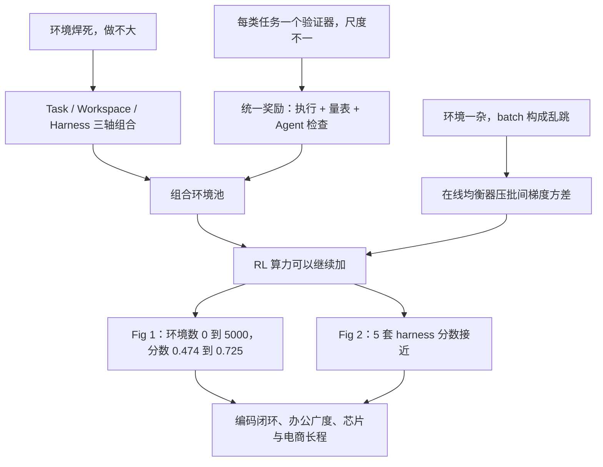

# Qwen3.8-Max：Agent 的上限卡在环境、奖励和 batch，不卡在参数量

<!-- release-date: 2026-08-03 -->

> 本文依据 Qwen Team 官方博客 **Qwen3.8-Max: A New Bar for Coding and Cowork**，<https://qwen.ai/blog?id=qwen3.8>，页头日期 2026/08/03，访问日期 2026-09-29。原件是网页，没有 PDF，也没有配套的技术报告。页面小节标题不带编号，文中用「原文某某小节」定位。文中会区分三件事：**博客明确写了什么**、**我们怎么解释它**、**哪些是跟进链接得到的外部补充**。

## 阅读前先认识几个词

只需要五个概念就能读完全文：

- **Rollout（轨迹）**：训练中的模型拿到一道题，按当前策略实际走出来的一整段「想、调工具、看结果、再改」。强化学习（Reinforcement Learning，RL）就是根据轨迹的好坏去改模型。
- **Harness（脚手架）**：把模型接到文件系统、终端、浏览器和测试上的那一层 Agent 框架。Claude Code、Codex、OpenClaw、Hermes、Qwen 自己的 QwenWork 各有一套工具格式、提示词和上下文管理方式。
- **Workspace（工作区）**：任务所在的那堆文件和目录。同一句需求，丢进两三个平铺文件和丢进一个前后端混杂的真实仓库，是两道难度完全不同的题。
- **Verifier / Reward（验证器 / 奖励）**：告诉训练「这条轨迹好不好」的信号。可以是单测通过，可以是按量表打分，也可以是另一个 Agent 去检查交付物。
- **批间梯度方差**：每个训练 step 的更新方向是这一批数据上的平均。如果相邻两批的题目构成差别很大，更新方向就会来回摆，这种摆动就是方差。

这篇博客里最重要的三个新名字是：

- **三轴解耦的环境**：把一道训练题拆成 Task、Workspace、Harness 三条可以独立变化的轴，再自由组合。
- **Universal Reward System（统一奖励系统）**：把执行校验、量表裁决、Agent 检查收进同一个奖励系统，不再给每类任务各养一个验证器。
- **Online data balancer（在线数据均衡器）**：组 batch 时主动把任务、难度、工作区、harness 的分布拉平。

## 一句话先说清

Qwen3.8-Max 是 Qwen 家族当时最强的模型：2.4T 总参数、每个 Token 激活 95B，建在 Qwen3.5 的架构底座上，也是 Qwen 第一次计划开源 Max 级权重（原文开篇）。

但这篇博客讲的不是「模型更大了」。关于网络结构，它只有一句话。真正展开的是 Work 小节里的三段：**环境怎么变多、奖励怎么统一、训练怎么不被变杂的数据搞乱**（原文 Work 小节）。

编码 10 天以上自主写仓库、复现论文、芯片 500 轮优化、365 天电商模拟，都是这套 RL 系统在产品侧的样子。

如果只记一句话，可以记这一句：

> **Agent 能力的上限，卡在环境能不能组合增长、奖励能不能跨任务共用、batch 能不能在数据变杂之后仍然稳定。参数量只是前提。**

## 先看全景：被放大的是 RL 系统，不是网络

博客把三件事合起来的效果写成：它们提供了广度、可靠的奖励和稳定性，把「环境与算力一起放大」变成真实工作能力上可测量的横向提升（原文 Work 小节）。图上三块各解决一个问题，缺一块，另外两块就放大不起来。

容量这一侧，博客给的全部信息就是四条（原文开篇）：

- 建在 Qwen3.5 的架构底座上；
- 2.4T 总参数，95B 激活；
- 发布当天即可通过 QwenCloud API 调用；
- Max 级权重「下周」开源。

层数、专家数、注意力排法、上下文长度，博客都没写。这些在后来的开源模型卡里，放到后文「底座」一节作为外部补充。

## 第一层矛盾：环境做不大，奖励对不齐，训练加不稳

博客把要解决的事叫做「三个耦合的挑战」（原文 Work 小节）。先看旧做法卡在哪。

### 环境做不大，是因为每道题都焊死了一整套东西

旧的 Agent RL 环境通常是这个形状：一道题绑一个容器、一套工具、一个打分脚本。要新题，就再做一次集成。

于是环境数量跟着集成工时线性涨。涨到几千个就停，因为人手停了。

### 奖励对不齐，是因为「对」的定义每类任务都不一样

代码能跑单测，前端要看渲染，办公要看交付物，跨天任务几乎没有统一的对错。每类任务写一个验证器，验证器之间的尺度和严格程度就不一致。模型学到的可能是「骗过这个脚本」，而不是「把活干完」。

### 训练加不稳，是因为环境一杂，batch 就乱

环境种类一多，自然分布就会严重偏。某套 harness 上的短任务又多又快，跨天的异构仓库任务又少又慢。按「先采到什么就训什么」组 batch，每一步看到的题目构成都在跳，更新方向跟着来回摆。这时候加算力，只是把噪声放大。

三件事还互相卡：环境一多，奖励更难对齐；奖励一乱，batch 里的信号更不可比；batch 一乱，团队只好退回「少做几个环境、把这几个刷高」。换一套 harness，分数就掉。

> 想要环境多，就得让它能组合；组合出来的环境要能共用一套奖励；变杂的数据要在进 batch 前被拉平。

Qwen3.8-Max 的三个设计，正好一一对上。

## 核心设计一：环境按三条独立的轴扩展

博客原话是：沿 Task、Workspace、Harness 三条独立的轴持续扩展解耦的真实环境，让环境增长按组合方式叠加，而不需要逐个定制集成（原文 Work 小节）。

### 三条轴各管一种难度

| 轴 | 博客写的档位 | 这条轴上的难度来自哪里 |
|---|---|---|
| Task | 单任务 → 多任务 → 跨天任务 | 时间跨度：目标还在，但中间会插入新需求、失败、等待外部信号 |
| Workspace | 多文件 → 层级目录 → 复杂异构目录 | 文件布局：该看多远、该忽略什么、改在哪一层 |
| Harness | 类别、版本、技能 | 动作空间：工具名、参数格式、失败重试、记忆放在哪都不一样 |

档位来自原文 Work 小节；第三列是我们的解释。

**Task 轴**把「时间跨度」本身变成难度。训练分布如果停在「改一个函数、跑一组测试」，模型到了跨天任务里容易过早宣布完成，或者把中间的一次失败当成终点。

**Workspace 轴**把「文件布局」变成难度。同一句「把这个功能做完」，在两三个平铺文件里靠局部搜索就能改对；在同时有前端、后端、基础设施、生成代码和锁文件的异构目录里，相关文件可能隔得很远，噪音也多得多。

**Harness 轴**防止模型只学会一套脚手架。博客点名的五套是 QwenWork、Claude Code、Codex、OpenClaw、Hermes（原文 Work 小节）。「版本」这一档也很实际：同一个 Claude Code，换一版工具格式，旧轨迹就过期了。

### 为什么拆开就能组合增长

旧做法里，环境数约等于做过的定制集成数：

$$
N_{\text{env}} \approx N_{\text{bespoke}}
$$

拆轴之后，同一道跨天任务可以配扁平目录或异构单仓，再配 Claude Code 或 OpenClaw。环境数的上界变成三条轴基数的乘积：

$$
N_{\text{env}} \lesssim |T| \times |W| \times |H|
$$

$T$、$W$、$H$ 分别是三条轴上可选项的集合。新增一个 harness 版本，等于一次性给所有任务和工作区多出一列。

这两条式子是本文把原文「compounds combinatorially rather than requiring bespoke integration」写成的数学形状，不是博客给的公式。真实系统里还会有非法组合、验证失败和去重，所以它只表示增长的形状，不是可复现的计数。

### 外部补充：从 3.7 的三轴到 3.8 的三轴

这套拆法不是 3.8 才有的。

- Qwen3.5 的官方博客把后训练增益主要归因于「几乎所有能想到的 RL 任务与环境」的扩展，强调提高环境的难度和可泛化性，而不是刷单项指标；还写了一套训推分离的异步 RL 框架，能容纳百万级的 Agent 脚手架与环境，并预告更多 scaling 结果会放进技术报告（[Qwen3.5 博客](https://qwen.ai/blog?id=qwen3.5)）。
- Qwen3.7 的官方博客写的是：每个训练实例被拆成三个正交部件 **Task、Harness、Verifier**，可以自由重组；同一道题配不同 harness 和验证器，逼模型学可迁移的解题策略，而不是某个 harness 的捷径。它同样预告了技术报告（[Qwen3.7 博客](https://qwen.ai/blog?id=qwen3.7)）。

对照下来，3.8 的三轴里 **Verifier 不见了，Workspace 进来了**，验证被收进了统一奖励系统。这是我们对比两篇博客得出的读法，3.8 正文没有点名 3.7 的三轴定义，也没有说明为什么换。

### 这一节可以带走什么

- 想把环境数做上去，先问**哪几维是真正独立的**。能独立变化的维焊死在一起，付的就是集成税。
- 轴的划分会变。3.7 到 3.8 把 Verifier 从轴里拿走、把 Workspace 放进来，说明「哪一维该独立」本身是需要随经验重判的设计。

## 核心设计二：统一奖励系统

环境能组合，不等于奖励能用。如果每个组合都配一个专用验证器，组合增长会在奖励这一层重新变回定制。

博客的写法是：一套统一奖励系统，把异构的验证内化进来，覆盖三类信号，并且用可自动扩展的量表（automatically scalable rubrics）；把这些形式统一在一个奖励系统里，为所有环境提供一致、可靠的奖励，消除维护任务专用验证器固有的不一致（原文 Work 小节）。

三类信号是：

1. **基于执行的校验**：跑测试、跑仿真，对错由环境状态决定；
2. **按量表裁决**，对象既有文本，也有渲染出来的视觉结果：前端、文档、设计稿没有二进制对错，要按维度打分；
3. **agentic 检查**：由 Agent 去看交付物、点界面、对照需求，处理执行和静态量表都盖不住的开放目标。

**我们的解释**：「统一」不是所有任务用同一个分数公式，而是所有任务通过同一套接口拿到奖励。接口后面可以是单测、量表或检查 Agent；训练侧看到的是尺度可比的信号，而不是一堆各写各的脚本。「量表要能自动扩展」这一条也很关键：量表如果全靠人手写，前端和办公任务会在奖励这一层重新变成瓶颈。

博客没有公开：奖励怎样归一到同一尺度，执行分和量表分怎样混合，检查 Agent 用的是哪个模型，怎样防止检查器和策略互相迎合。

### 外部补充：同一方向的一篇奖励论文

[The Verification Horizon: No Silver Bullet for Coding Agent Rewards（arXiv:2606.26300）](https://arxiv.org/abs/2606.26300) 是 2026-06 提交的论文，作者包括 Dayiheng Liu、Zeyu Cui 等。它的判断是：对今天的编码 Agent，「验证比生成容易」这句话正在反过来；任何能造出来的验证器都只是人类意图的代理；它从可扩展性、忠实性、稳健性三个维度考察了四种奖励构造。

3.8 博客**没有引用**这篇论文，不能据此推断 3.8 训练用了其中哪套做法。它只说明「执行 / 量表 / Agent 检查」这条谱系和「验证器要跟着策略一起进化」这个判断，在同一时期有人系统写过。

## 核心设计三：在线数据均衡器

第三个设计管的是训练动力学，不是环境内容。

博客原话是：一个在线数据均衡器，塑造每一个 batch，让它在任务、难度、工作区和 harness 上的分布保持高度均衡，压低批间梯度方差，从而支撑 RL 训练算力稳定、持续地扩展（原文 Work 小节）。

用训练语言写，记第 $b$ 个 batch 的梯度为 $g_b$，真正想沿着走的平均方向为 $\bar g$：

$$
\mathrm{Var}(g_b) = \mathbb{E}\,\lVert g_b - \bar g \rVert^2
$$

如果 batch 之间题目构成差得远，这个量就大。方差大时，加大学习率或延长训练只会放大噪声。均衡器做的，是让每个 batch 的经验分布贴近一个平衡的目标分布，把这个量压下来。

这条式子是本文把原文「suppressing inter-batch gradient variance」翻译成训练语言，博客没有给出任何算法。目标分布怎么定、是拒绝采样还是重加权、难度怎么估、是否随当前策略的通过率在线调整，都没有公开。

> **环境多样性不会自动变成稳定的 RL。多样性如果不进入 batch 的构成约束，它就只是方差源。**

## 证据：两张图各证明了什么

博客用两张图支撑「环境与算力一起放大，工作能力横向提升」。

### Fig 1：分数随 RL 环境数上升，但最好的点不在终点

图题是 Score Index across 10+ Benchmarks vs. RL Training Envs，图注说随着 RL 训练继续放大，分数在数十个内部与公开的工作基准上「稳定、持续地提升」（原文 Work 小节 Fig 1）。图上标出的点：

| RL Training Envs | 0 | 500 | 1000 | 1500 | 2000 | 2500 | 3000 | 3500 | 4000 | 4500 | 5000 |
|---|---:|---:|---:|---:|---:|---:|---:|---:|---:|---:|---:|
| Score Index | 0.474 | 0.469 | 0.487 | 0.586 | 0.606 | 0.622 | 0.616 | 0.647 | **0.725** | 0.719 | 0.689 |

0 对应图中的 SFT Baseline，4000 处标着五角星和 Best Checkpoint。数字读自原图标注。

读这张图要分开三件事：

- **图支持的**：从 SFT 基线 0.474 到最佳点 0.725，整体向上，1500 和 4000 附近各有一段明显抬升。
- **图注说得过满的**：「steady, consistent」与图并不完全相符。500 处比起点略低，3000 处小回撤，4000 之后从 0.725 降到 0.689。最佳点不是训练终点，博客没有解释这段回落。
- **没有定义的**：「1 个 env」是一道题、一个组合还是某种聚合单位；Score Index 怎样由「10+ 个基准」合成；每个点用了哪套 harness、多少 rollout。

### Fig 2：换脚手架，分数基本不塌

图题是 Cross-Harness Generalization Performance，图注说 Qwen3.8-Max 在 QwenWork、Claude Code、Codex、OpenClaw、Hermes 上成绩相当（原文 Work 小节 Fig 2）。三张内部基准上的柱，读自原图标注：

| 模型 / harness | CoWorkBench | WorkSpaceBench | JobBench |
|---|---:|---:|---:|
| Fable 5（对照 harness） | 75.9 | 68.7 | 57.4 |
| Opus 4.8（对照 harness） | 72.3 | 66.8 | 48.4 |
| Qwen3.7-Max（对照 harness） | 64.6 | 61.4 | 31.3 |
| Qwen3.8-Max / QwenWork | 73.2 | 67.0 | 58.0 |
| Qwen3.8-Max / Claude Code | 74.6 | 67.3 | 59.0 |
| Qwen3.8-Max / Codex | 75.8 | 67.6 | 57.5 |
| Qwen3.8-Max / OpenClaw | 74.8 | 67.7 | 59.8 |
| Qwen3.8-Max / Hermes | 73.3 | 71.2 | 59.6 |
| Qwen3.8-Max / OpenCode | — | — | 53.4 |

「对照 harness」在 CoWorkBench 和 WorkSpaceBench 上是 OpenClaw，在 JobBench 上是 OpenCode；对照模型每个基准只画了一根柱。

读表要知道的两件事：

1. **全文基准表里的 74.8、67.7、53.4，分别就是这张图里 OpenClaw、OpenClaw、OpenCode 那一根柱**，不是几套 harness 的平均。主表给的是「某一套 harness 上的代表分」，Fig 2 回答的是「换一套还在不在」。
2. **这张图证明的是稳定性，不是全面领先。** CoWorkBench 上 Fable 5 的 75.9 高于 Qwen3.8-Max 全部五根柱（最高的 Codex 是 75.8）；JobBench 上 Qwen3.8-Max 在 OpenCode 上反而是它自己最低的一根。

Fig 2 比主表任何一行都更贴近这篇博客的技术主张：Harness 轴训练的目的，就是让这一组柱子拉平。

## 底座：2.4T / 95B 只有一句话，骨架在开源模型卡里

### 外部补充：开放权重的配置

博客发布后，[Qwen/Qwen3.8-2.4T-A95B](https://huggingface.co/Qwen/Qwen3.8-2.4T-A95B) 的模型卡与 `config.json` 公开了这套骨架。下表全部是外部补充，不是博客原文：

| 项 | 开源权重的配置 |
|---|---|
| 总参数 / 激活参数 | 2.4T / 95B |
| 层数 / 隐藏维 | 92 / 8192 |
| 排法 | 23 × （3 层 Gated DeltaNet → MoE，1 层 Gated Attention → MoE） |
| Gated Attention | 64 个 Query 头、4 个 KV 头，头维 256，RoPE 只作用于 64 维 |
| Gated DeltaNet | 16 个 QK 头、128 个 V 头，头维 128 |
| MoE | 512 个专家，每 Token 10 个路由 + 1 个共享，专家中间维 2048 |
| 上下文 | 原生 262,144，可扩到约 1,010,000 |
| 词表 | 248,320（padded） |
| MTP | `mtp_num_hidden_layers` 为 1 |

$23 \times 4 = 92$ 层，每组最后一层是全注意力，所以 23 层全注意力、69 层 Gated DeltaNet，正好 3:1（本文算术）。

这套排法沿用 Qwen3-Next 和 Qwen3.5 的路线：大部分层用线性注意力（Gated DeltaNet，维护固定大小的状态，代价不随上下文变长），少数层保留标准注意力负责精确回看。Qwen3.5 博客对此的描述是「线性注意力（Gated Delta Networks）与稀疏 MoE 融合的混合架构」。门控注意力的来源见 Gated-Attention 一篇。

### 托管版和开源版不是同一份包装

模型卡写明，Qwen3.8-2.4T-A95B 是纯文本模型，必须开启思考，不支持多模态输入。托管的 Qwen3.8-Max 则有视觉输入和内置工具，博客里 Codex 配置示例写的 `context_window` 是 1,000,000（原文 Codex 小节）。

所以博客评测表里所有带视觉的分数，对应的是托管的 Qwen3.8-Max，不是那份纯文本开源权重。

对这篇博客的叙事来说，这些规格只说明一件事：**容量和上下文已经够用，剩下的瓶颈在 RL 信号够不够多、够不够干净。**

## 编码：三个自我进化的闭环

博客对 Coding 的定义是：今天的顶级模型写代码，不再是按请求写一个函数，而是从空文件夹开始，把一个多日项目自己做到交付；三个挑战都要求真正写代码、跑代码，全程没有人帮忙。贯穿三者的是：不按固定计划走，而是靠反馈环自我进化（原文 Coding 小节）。

这三个案例是**演示**，不是带对照的消融。它们说明系统想要的行为，不能单独证明三轴 RL 贡献了多少分。

### 10 天以上：从空仓库长出一个会自我进化的 harness

任务是从零创建 `oh-my-cli`，在 10 天以上的长程自主编码中做出一个能自我进化的 harness：把用户反馈、社区实践和模型自测收进同一条工程环，需求被归一成 issue，由 Agent 自动认领执行，再经过代码、测试、预览和日志持续迭代。完整轨迹公开在 [qwen-code-dev-bot/oh-my-cli](https://github.com/qwen-code-dev-bot/oh-my-cli)（原文 10+ Days of Autonomous Coding 小节）。

三个实现要点（同一小节）：

- **循环工程**：issue 状态机、调度器、监控和 watchdog 组成一个执行环。新需求进入 GitHub Issues 后，Agent 经状态机认领，走 `ready → leased → active`；实现完成后触发端到端测试和 CI，通过后合并 PR。
- **自测**：每次更新触发 Build、单测、端到端测试和桌面端生命周期验证，异常回到对应的 issue 或 PR 修复再验。
- **多源进化**：把社区经验和用户、开发者反馈转成可执行的工作，持续演化 `/goal`、`/resume`、Dynamic Workflow、Session Replay、Desktop 等能力。

截至 2026-07-30，约 16 天全自主运行后，仓库累计 265 次提交、127 个 PR、151 个 issue（同一小节）。标题写 10+ days，正文写约 16 天，两者不矛盾：一次 run 超过 10 天，统计截止日落在约 16 天。

**我们的解释**：这正好落在 Task 轴的右端，而且模型造的就是下一层 harness。训练里如果从没见过「跨天、带状态机、失败要回到 issue」的任务，这种 run 很难撑过第一天。

### 复现一篇论文，再改得比论文更好

任务是只给论文 [Unified Data Selection for LLM Reasoning（arXiv:2605.22389）](https://arxiv.org/abs/2605.22389) 和一组 GPU，从零写数据处理、训练和评测，先复现，再改进。论文要回答的是：数据远多于训练预算时，该留哪些例子；它的答案是看重「困难决策点」，即解题过程中模型真正拿不准下一步的那些位置（原文 Reproduce a research paper 小节）。

博客给出的过程数字（同一小节）：

- 全自主约 5 天，约 125 小时；写了约 7,600 行代码，超过 1,100 次动作，33 轮 GPU 训练；
- 前约 37 小时从零重建流水线，复现论文的 6 个主要发现，在 Qwen3-8B 上反复微调，论文方法在 AIME24 上比随机选数据高 7.7 个百分点；
- 后约 88 小时进入「假设 → 写代码 → 上 GPU → 分析 → 再来」的环，4 轮共试 18 个想法，最终新方法在 AIME24 上比论文方法再高 2.7 分。

页面里嵌的交互演示给了复现和原论文的对照，这一页是博客的一部分。AIME24 上用 20% 数据时（avg@16 pass@1）：

| 选数据的方法 | 原论文 | 复现 |
|---|---:|---:|
| HES（论文方法） | 50.0 | 49.6 |
| 按长度 | 46.7 | 47.7 |
| 按难度 | 38.1 | 42.7 |
| 随机 | 39.8 | 41.9 |
| 最低 HES | 18.5 | 24.8 |

HES 是论文提出的指标 High-Entropy Sum，把每条推理样本里熵最高的一小部分 Token 的熵加起来当质量分。复现的 49.6 减随机的 41.9，正好是博客说的 7.7。

改进阶段 4 轮的最好结果（原文该小节 Expand 表）：

| 轮次 | 这一轮最好的想法 | AIME24 | 相对复现基线 |
|---|---|---:|---:|
| — | 论文方法，复现（基线） | 49.58% | — |
| 1 | 先按难度分层再选 | 50.42% | +0.84 |
| 2 | 用熵与分数之差给例子加权 | 51.67% | +2.09 |
| 3 | 调选择宽度 | 51.25% | +1.67 |
| 4 | 统计困难决策点（nhighgate） | 52.29% | +2.71 |

第 3 轮比第 2 轮低，第 4 轮才到最高。这是用实验结果否定自己想法的过程，不是单调刷分。

**我们的解释**：这一例对应 Workspace 轴（从零搭训练流水线）加执行奖励（AIME24 分数）。没有可执行的评测，自我进化环就会变成自说自话。

### 24 小时里超过大多数人类参赛队

任务是参加天池的 [WWW2025 Multimodal Dialogue Intent Recognition Challenge](https://tianchi.aliyun.com/competition/entrance/532277)，共 526 支人类队伍，要同时读客服对话文本和截图，判断顾客意图（原文 Beat hundreds of human teams 小节）。

严格 24 小时内，模型自己读规则、写方案：文本侧微调并集成 BERT、MacBERT、RoBERTa；截图侧微调 Qwen2.5-VL-7B，拿不准时用 Chinese-CLIP 兜底；再做加权投票，用交叉验证校准票权。45 次提交，准确率从 0.60 爬到 0.853，超过 458 / 526 支队伍，即 87%（同一小节）。

页面里嵌的比赛演示还给了其他模型在同一任务上「超过人类队伍的比例」：

| 模型 | 超过的人类队伍比例 |
|---|---:|
| Claude Fable 5 | 88.4% |
| Qwen3.8-Max | 87.1% |
| GPT-5.6 Sol | 59.7% |
| Claude Opus 4.8 | 55.1% |
| GPT-5.5 | 17.9% |

这一点博客正文没有提：**在这个任务上，Fable 5 比 Qwen3.8-Max 略高。** 正文只写 Qwen3.8-Max 的 87%，容易被读成「表中最好」。

演示里的逐次提交记录也说明了反馈环的真实样子：分数不是单调上升，中间多次提交低于此前最好成绩，模型还自己发现过一个「幻觉出来的模型文件」并回退到干净状态。排行榜本身就是一种验证器，只是很窄：只看一项准确率。

## 工作：职业广度与 Dynamic Workflows

博客把「真实工作」定义为：填满几乎每个职业工作日的那种杂乱、多步、重工具的任务，认为这是前沿模型创造经济价值的另一条主赛道（原文 Work 小节）。

### 数百个高价值职业的广度展示

博客说压力测试覆盖数百个高经济价值职业里的高频任务，并给了 6 个展示（原文 Testing the Breadth of Working Ability 小节）：

| 角色 | 博客写的结果 | 博客给的传统工作量 |
|---|---|---|
| 企业合规律师 | 一次扫完数百份文件，找出 1,284 条相关条款，不到 1 小时 | 律师助理团队协作约 1 周 |
| UI/UX 设计师 | 数字银行应用 NOVA 的高保真可交互原型，8 个屏幕，一次交付、零轮人工修改 | 常规流程 3–5 轮修改 |
| 餐饮品牌创始人 | 读一百多份原料供应简报，一次产出 26 道菜的菜单，标注热量与原料来源，食材成本率 33.8% | 主厨与运营团队数周迭代 |
| 结构工程师 | 从一套图纸在浏览器里重建 30 层办公楼的抗震结构模型，周期、基底剪力、层间位移角可悬停查看 | 专业软件手工建模通常超过 1 周 |
| 康复治疗师 | 把 2D 纸质评估表做成可旋转、带解剖分层的 3D 交互演示 | 外包医疗动画工作室，2–4 周、数千美元 |
| 体育数据分析师 | 把每名球员约 8,400 次攻防回合解析成战术画像和教练报告，数十分钟 | 分析团队数个工作日 |

这些是产品展示：没有评测协议，没有对照模型，没有说明「正确」怎样定义。它们能支撑的只是「团队想把工作能力做广，而不只刷编码榜」。

### 一次会话里做出量化策略

两个量化案例的引擎都叫 **Dynamic Workflows**：用程序把任务规划固化下来，再精确调度大规模子 Agent（原文 Building a Profitable End-to-End Quant Strategy in a Single Session 小节）。

**深度：端到端 ETF 轮动策略。** 从一句话任务开始，模型自己规划动态工作流，工作数小时，完成数据系统、基础因子、多轮贪心迭代，并在回测中改道。博客强调它按证据行动：

- 看到设计期指标和验证期指标错位（过拟合信号），就自动剪枝，一轮轮去掉冗余因子；
- 看到多条路径收敛到同一组核心信号，就加多随机种子的并集验证，去掉路径依赖；
- 判断三模型集成在小截面上不如固定方向合成稳健，就自己换成更合适的策略框架。

**广度：并行挖因子。** 从动量、价值、质量、投资、低风险、情绪 6 句短描述出发，每类拆成 50 个研究方向，派出约 330 个子 Agent，完成约 6,000 次回测，途中还改了工作流。入选因子的超额 Sharpe 为 0.64–1.48，IC 全为正，在 0.010–0.014 之间。

**我们的解释**：Dynamic Workflows 是 Harness 轴「技能」一档的一个例子，把编排逻辑冻成可复现的程序，而不是每一轮都靠对话重新发明流程。Sharpe 和 IC 是博客自报，没有给回测区间、交易成本假设和样本外设定；当成金融结论会过读，当成「闭环会改主意」的证据则够用。

## 长程：芯片 500 轮和电商 365 天

博客把长程能力概括为：在高复杂、长视野、多约束的任务上，靠「动作—反馈—迭代」在数千轮交互里做算法级和策略级的重构（原文 Long-Horizon Task 小节）。

### 芯片：没有参考设计，只靠仿真、综合、布局的反馈

目标是一个 GCD / RSA 密码硬件加速器，集成模幂和模乘，是紧凑但逻辑密集的数字电路。随机化的 cocotb 验证要求 4、6、8、16 比特配置下比特级正确，同时尽量压低 Yosys 综合后的门数，面积按 WIDTH = 16 评（原文 Autonomous Chip Design 小节）。

沙箱接了 Iverilog 仿真、Yosys 综合和 OpenROAD 物理设计。输入只有任务描述、空模块模板、验证与综合脚本，没有参考设计，没有人介入。一条连续 run 共约 500 轮、71 次评估、13 个关键里程碑（同一小节）。博客列出的主要里程碑：

| 轮次 | 改动 | 门数 |
|---|---|---:|
| 起点 | 第一个功能正确的设计 | 8,298 |
| 第 22 轮 | 把 `modular_multiplier` 里 16 比特硬件取模除法器换成迭代移位减法 | 2,010 |
| 第 35–48 轮 | 利用调用方前提绕过整个 REDUCE 阶段，合并两个约简模块，收窄内部寄存器位宽 | 1,304 |
| 第 60–113 轮 | 删掉冗余寄存器与触发器，偶数提前退出，用减法器最高位当比较器 | 907 |
| 第 170–252 轮 | 打破模块边界，把乘法器内联进模幂状态机，全局共享一个减法器 | 765 |
| 第 443–500 轮 | 共享 NOR 树、绝对差减法拆分等门级细修 | 678 |

第 22 轮那一刀砍掉 6,288 门，占总降幅 80% 以上（同一小节）。但最后一段收益出现在第 443–500 轮，说明长程优化没有在前几十轮耗尽。

物理实现也跟着缩小：OpenROAD 加 Nangate45 布局布线后，裸片从 106×106 µm² 缩到 46×46 µm²，总线长从 33,369 µm 降到 4,187 µm，时序从 −4.46 ns 的违例变成在 500 MHz 下 +0.66 ns 的正裕量，物理面积降 81%（同一小节）。

正文说 678 门「领先所有被评模型」，页面里嵌的交互演示给出了对照：

| 模型 | 最终门数 |
|---|---:|
| Qwen3.8-Max | 678 |
| GPT-5.5 | 749 |
| Opus 4.8 | 870 |
| GLM 5.2 | 1,107 |
| DeepSeek V4 Pro | 1,450 |

对照名单里没有 Fable 5 和 GPT-5.6 Sol。每个模型的轮数预算是否相同，演示里没有说明。

### 电商：365 天的内部模拟

**E-Commerce Bench** 是 365 天长周期电商运营模拟，基于淘宝、天猫的脱敏交易数据，复现 12 种店铺类型、60 个品类、近 600 个供应商、7,000 个商品。起始资金 10 万元，同时经营多家店，要应对季节波动、突发事件和结算带来的现金流压力；决策覆盖选品、供应链谈判、库存、动态定价、退货，目标是年底总余额最大。周期结束前还得把库存和经营收益变现，否则账上没变现的资产会拖后腿（原文 Continuous Learning in Long-term Operations 小节）。

两处设计值得注意（同一小节）：

- **博弈论驱动的供应商矩阵**：每个供应商有自己的性格和让步策略，必须多轮自然语言谈判。博客说 Qwen3.8-Max 对同一供应商的同一商品持续试探，采购价逐轮下降，雷达图上的谈判效率面积随时间扩大，并把经验迁到相似商品；其他模型往往在中期到平台期。
- **暗藏的欺诈**：近 600 个供应商里有 152 个欺诈商家，覆盖会员费陷阱、低价诱饵、货不对板；年度大促的订单高峰还会叠上台风、缺料这类供应链危机。

结果：Qwen3.8-Max 在最早期投入最多资本卡位，年终大促期间净利润超过 10 万元，接近第二名 GLM 5.2 的 2.4 倍；最终总余额 416,252 元，约 4.16 倍回报，比 GLM 5.2 高 38%，比上一代 Qwen3.7-Max 高 152%，全程超过 2,000 轮交互（同一小节）。

这是内部基准：环境、欺诈注入和结算规则都没有公开到可复现的程度，雷达图的数值也没有以表格给出。

## 多模态：视觉从输入变成反馈环

这一节的主张不是「能看图」，而是**视觉贯穿任务的整个生命周期**（原文 Multimodal Agents 小节）。

- **输入侧**：超过 200 页的财报和复杂 PDF，要跨页理解文字、图表和版式；超过 100 小时的视频，要把人物、事件、时间戳、场景组织成一张 video memory graph（视频记忆图），跨长时间重建事件进程和人物关系。
- **输出侧**：剪 vlog、做教学动画、从一张界面截图重建前端项目、把平面图变成 Blender 里的三维室内、从自然语言做交互游戏。
- **执行中**：模型持续检查自己的中间结果，比如版式、物体朝向、空间关系、动画质量、交互效果。电视朝反了、界面没对齐，它要自己发现、改计划、改输出。

**我们的解释**：这和统一奖励系统里「对渲染出的视觉结果按量表打分」是同一件事的两面：训练时视觉是奖励来源，推理时视觉是自检手段。

### Hybrid Agent 与 RecreationBench

博客把「在数字世界里独自完成复杂任务」拆成两件事：写代码实现逻辑，以及动手操作界面、观察真实系统发生了什么。两者配对叫 **Hybrid Agent**：编码负责规模化的重活，图形界面操作够到人能看见、摸到的地方，并把真实应用的反馈接回来（原文 Multimodal Agents 小节）。

为此博客引入内部基准 **RecreationBench**：覆盖 Ubuntu、macOS、Windows 桌面，Android 移动端和 Web 共 5 个平台；模型只能把正在运行的应用当黑盒，没有源码、不能联网，靠交互和反馈理解它，再从零把整个应用重建出来（同一小节）。

正文说 Qwen3.8-Max「已经展示出前沿级的 Hybrid Agent 能力」。评测表上它是 51.7，低于 Fable 5 的 56.1，高于 Opus 4.8 的 48.0 和 GPT-5.6 Sol 的 47.6（原文 Full Benchmark Table 第二张表）。以表为准，「前沿级」是定性描述，不是第一。

### Qwen-MM-Plugins

博客同时发布 **Qwen-MM-Plugins**，一个面向多模态 Agent 的 harness 扩展库：图像与视频处理、多模态记忆、动态分辨率、视觉工具，以及视频剪辑、Blender、CAD 等专项能力，目标是让任何现有 harness 更容易变成多模态原生系统（原文 Multimodal Agents 小节）。评测表注 14 写明，LVBench 和 EgoLife 的「带记忆」分数就是用它构建的记忆系统测的。

## 评测：读表要知道的几件事

原文 Full Benchmark Table 是两张网页表格。第一张对照 Opus 4.8、Fable 5、GPT-5.6 Sol（max）、Qwen3.7-Max；第二张多模态表另加 Gemini 3.1-Pro 和 Qwen3.7-Plus，不含 Qwen3.7-Max。

### 编码 Agent

| 基准 | 测什么 | Opus 4.8 | Fable 5 | GPT-5.6 Sol | Qwen3.7-Max | Qwen3.8-Max |
|---|---|---:|---:|---:|---:|---:|
| Terminal Bench 2.1 | 终端里完成真实任务 | 84.6 | 84.6 | 88.8 | 74.5 | 86.6 |
| SWE-bench Pro | 仓库级软件工程 | 69.2 | 80.0 | 64.6 | 60.6 | 67.7 |
| DeepSWE 1.1 | 长程 agentic 编码 | 59.0 | 70.0 | 73.0 | 21.6 | 56.6 |
| NL2Repo-Bench | 从自然语言生成完整仓库 | 69.4 | — | — | 47.2 | 55.9 |
| FrontierSWE | 前沿仓库级任务，MEAN@5 | 70.0 | 88.8 | — | 40.7 | 73.5 |
| MLS-Bench-Lite | 官方榜的 Lite 版，表注只给评测设置 | 42.8 | 49.9 | 46.2 | 31.7 | 41.0 |
| PaperBench | 复现科研论文 | 80.3 | 88.8 | 90.5 | 64.8 | **93.0** |
| AndroidBench | Android 应用开发，95 题公开子集 | 69.8 | 84.5 | 74.0 | 56.5 | 75.1 |
| QwenSWEBench | 内部软件工程，avg@3 | 84.0 | 86.3 | 73.5 | 63.4 | 80.7 |
| QwenQoderBench | 内部 Qoder 使用体验，avg@5 | 62.7 | 63.1 | 53.8 | 36.8 | 58.4 |
| QwenReactBench | 内部 React 项目，BT/Elo | 1694 | 1770 | 1564 | 1538 | 1724 |
| QwenSVGBench | 内部 SVG 生成，BT/Elo | 1648 | 1690 | 1758 | 1499 | 1713 |

口径来自原文表注 2–13：Terminal Bench 2.1 上 Qwen 用 Claude Code、avg@10、5 小时超时，其他模型取各自公开的最好 harness 分；SWE-bench Pro 修正了有问题的题，所有基线在修正后的集合上评；DeepSWE 取 Claude Code 与 mini-SWE-agent 中的较高分；NL2Repo 禁用了会访问目标仓库的 `pip download`、`pip install`、`git clone`，以防奖励黑客；PaperBench 由 Claude Opus 4.6 评判，3 次平均，每次最多 12 小时；FrontierSWE 其他模型取 2026-08-03 的官方榜。

- **支持「编码 Agent 大幅变强」的**：相对 Qwen3.7-Max 几乎每行都大幅上移，DeepSWE 从 21.6 到 56.6，FrontierSWE 从 40.7 到 73.5，PaperBench 从 64.8 到 93.0。PaperBench 是这张表上 Qwen 唯一明确领先的一行，与「复现论文」演示同方向。
- **不支持「全面第一」的**：SWE-bench Pro、DeepSWE、FrontierSWE、AndroidBench 都低于 Fable 5；NL2Repo 低于 Opus 4.8；内部的 React、Qoder 基准也落后 Fable 5。标题写 New Bar，表上是互有胜负。

### 通用 Agent 与通用能力

| 基准 | 测什么 | Opus 4.8 | Fable 5 | GPT-5.6 Sol | Qwen3.7-Max | Qwen3.8-Max |
|---|---|---:|---:|---:|---:|---:|
| CoWorkBench | 内部长程办公，覆盖计算机、金融、法律、医疗等 | 72.3 | 75.9 | 71.5 | 64.6 | 74.8 |
| WorkSpaceBench | 内部工作区任务 | 66.8 | 68.7 | 65.6 | 61.4 | 67.7 |
| JobBench | Agent 赋能人类工作流 | 48.4 | 57.4 | 45.4 | 31.3 | 53.4 |
| SkillsBench | 公开 v1.1，87 题 | 65.1 | 70.9 | 73.5 | 61.2 | 70.2 |
| Agents' Last Exam | 长程高价值任务，Pass / Score | 27.0 / 45.1 | — | 30.6 / 53.6 | 11.8 / 31.1 | 27.0 / 52.4 |
| Automation-Bench | 600 题公开子集，Pass@1 | 27.2 | 29.1 | 29.7 | 14.2 | 27.3 |
| Toolathlon Verified | 长程工具使用，Pass@1 | 76.2 | 77.9 | 74.9 | 49.7 | 72.5 |
| WideSearch | 广域检索，item-F1 四次平均 | 72.9 | 81.2 | — | 75.2 | **81.9** |
| HLE w/ tools | 带工具的 Humanity's Last Exam | 57.9 | 64.5 | 58.0 | 53.5 | 56.2 |
| GPQA Diamond | 研究生级科学问答 | 92.0 | 92.6 | 94.1 | 92.4 | 92.6 |
| HLE | 不带工具 | 45.7 | 53.3 | 47.2 | 41.4 | 43.6 |
| IFBench | 难指令遵循 | 62.2 | 63.5 | 72.7 | 79.1 | **82.8** |
| OneMillion-Bench | 专家评分，gemini-3.1-pro-preview 评判；原表名前带美元符号 | 41.8 | 55.9 | 53.8 | 44.4 | 52.5 |
| HealthBench | 医疗 | 52.4 | — | 55.3 | 54.5 | **60.2** |
| PLawBench | 职业法律 | 69.6 | 70.2 | 72.3 | 58.9 | **73.2** |
| PRBench-Legal | 法律写作 | 52.7 | 57.6 | 57.6 | 48.5 | 57.6 |
| PRBench-Finance | 金融写作 | 51.9 | 55.8 | 55.5 | 46.8 | **58.3** |
| MRCR v2 256K | 256K 上 8 根针的长上下文检索 | 83.2 | — | 93.8 | 86.7 | 92.9 |
| LongBench v2 | 长上下文理解 | 69.1 | — | 67.1 | 65.3 | 66.3 |

加粗是本文标出的 Qwen3.8-Max 表中最高的行，原表没有加粗。

原文表注 15 写明 SkillsBench 上 Opus 和 Fable 用 Claude Code、GPT 用 Codex、Qwen 系列用 OpenCode，全部是 Qwen 自测；注 17 写明 WideSearch 上外部模型用 Claude Code，Qwen 用 Qwen-Agent。**harness 口径不同，是读这张表时最该记住的一件事**，也正是 Fig 2 要回答的问题。

- **支持 cowork 主线的**：CoWorkBench、WorkSpaceBench、JobBench、SkillsBench 相对 3.7-Max 全面上移，与 Fig 2 的跨 harness 稳定性一致。
- **不支持「办公全面超过 Fable 5」的**：这三张内部办公基准的主表分数上，Fable 5 仍然略高或明显高。

### 多模态表里和主线相关的几行

| 基准 | 测什么 | Qwen3.8-Max | 表中其他模型的最高分 |
|---|---|---:|---|
| BabyVision（无 / 有代码解释器） | 视觉推理 | 82.0 / 91.3 | 65.5（GPT）/ 90.5（Fable） |
| CharXiv RQ（无 / 有代码解释器） | 论文图表推理 | 88.4 / 93.5 | 87.9 / 93.5（Fable） |
| OSWorld-Verified | 电脑操作 | 86.1 | 85.0（Fable） |
| OSWorld 2.0（binary / partial） | 更难的电脑操作 | 19.4 / 46.7 | 20.6 / 54.8（Opus）；partial 最高 66.1（Fable） |
| RecreationBench | 5 平台黑盒重建应用 | 51.7 | 56.1（Fable） |
| Vision2Web | 看界面做网页 | 69.0 | 70.5（Fable） |
| QwenBlenderBench | 内部 Blender | 69.9 | 69.5（Fable） |
| Parametric CAD Bench | 参数化 CAD | 91.5 | 87.5（Fable） |
| Dense200 | 密集视觉感知 | 87.0 | 69.7（Gemini） |
| VideoMME（带字幕） | 视频理解 | 90.4 | 89.5（GPT） |

数字来自原文 Full Benchmark Table 第二张表。静态视觉、文档、CAD、视频理解上 Qwen3.8-Max 普遍领先；OSWorld 2.0 和 RecreationBench 这类「长时间操作真实应用」的任务，仍不是它的最强项。页首那张 performance 总览图是从两张表里挑出的柱状展示，数字与表一致。

### 四种证据，分量不同

| 类型 | 例子 | 能当什么证据 |
|---|---|---|
| 公开基准，有对照 | Terminal Bench、SWE-bench Pro、PaperBench、GPQA、IFBench | 支持「相对 3.7 大幅变强、部分项进入第一档」 |
| 内部基准，有对照 | CoWorkBench、JobBench、QwenSWEBench、RecreationBench | 支持方向，外部无法复现 |
| 单次长程演示 | oh-my-cli、论文复现、天池比赛、芯片、量化、电商 | 支持「闭环能跑很久、会改主意」，不是统计意义上的方法消融 |
| 职业展示 | 1,284 条条款、26 道菜、8 个屏幕 | 产品叙事，没有评测协议 |

原文 User Feedback 小节是客户评价的图片拼贴，没有可核验的数字，不算实验结果。

## 产品接口：思考预算是推理时的旋钮

原文 Build with Qwen3.8 小节把模型接到 QwenCloud，支持与 OpenAI 规范兼容的 chat completions 和 responses 接口，也支持与 Anthropic 兼容的接口。`reasoning_effort` 有三档（原文 API Usage 小节）：

- `xhigh`（默认）：复杂任务，要彻底分析；
- `medium`：准确和速度折中；
- `low`：偏速度和成本。

`preserve_thinking` 对所有负载默认开启，即保留历史轮次的思考内容，博客说这样开箱体验最好（同一小节）。

这和训练系统是两层：训练解决「会不会把活干完」，`reasoning_effort` 决定「这一次愿意花多少思考 Token」。博客没有把三档和 RL 训练对应起来。

## 博客没写的

截至访问日，下面这些在原文里都不存在：

- 完整技术报告；预训练 Token 数、数据配比、训练硬件和耗时；
- RL 算法的名字与超参（学习率、组大小、裁剪、KL 系数）；
- 三条轴各自的基数、组合后的有效环境数、非法组合怎样过滤；
- 统一奖励怎样归一与混合，检查 Agent 用的模型和提示词；
- 在线均衡器的算法、目标分布、难度估计方法；
- Fig 1 中 env 的单位、Score Index 的定义、4000 之后回落的原因；
- 电商模拟器与芯片任务的完整协议，各模型的轮数预算；
- 开源权重与托管版在视觉、上下文默认值上的训练差异。

Qwen3.5 博客写过的异步 RL、训推分离等实现，3.8 正文没有重复，不能自动算作 3.8 仍在用的做法。

## 最值得带回自己项目的六条

### 1. 先拆轴，再谈规模

环境数上不去，通常不是容器太慢，而是任务、工作区、脚手架、打分焊在一起。能独立变化的维，就让它独立变化；新增一个选项，就能和其他轴的全部选项组合。

### 2. 奖励接口统一，奖励机制可以异构

单测、量表、检查 Agent 不必争谁是唯一正确的奖励。训练侧要的是同一个接口和可比的尺度。给每类任务各写一个验证器，会把组合增长重新变回定制。

### 3. 多样性要写进 batch，而不是只写进数据集介绍

三轴组合之后，自然分布一定偏。不在组 batch 时约束任务、难度、工作区、harness 的构成，加算力就是加方差。这一条对任何多源 RL 都成立，不依赖 2.4T。

### 4. 换 harness 仍能得分，比在一个 harness 上刷高更值钱

Fig 2 那一排拉平的柱，比主表任何一行的第一更接近这篇博客的技术主张。上线要接多种 Agent 运行时，就把 harness 多样性当成训练目标，而不是部署细节。

### 5. 长程能力看几百轮之后还会不会改结构

芯片案例里 80% 以上的门数下降发生在第 22 轮，但第 443–500 轮仍有收益。评测只给几十轮，会把「还愿意重构」的模型和「早早停下」的模型判成一样。

### 6. 读 Agent 发布稿，先分清四种证据

公开基准、内部基准、单次演示、产品展示的分量完全不同；同一个任务，嵌入的演示里可能有正文没说的对照（天池上 Fable 5 更高）。先看口径和对照，再看结论。

## 用一张图重新串起全文

这是本文的总结示意，不对应博客里的任何一张图。容量层的 2.4T / 95B 没有画进来：它是前提，不是这篇博客的新设计。

## 关键词回看

- **2.4T-A95B**：总参数 2.4T、每 Token 激活 95B；博客只给这一句，骨架见开源模型卡。
- **Task / Workspace / Harness**：3.8 的环境三轴，分别把时间跨度、文件布局、脚手架变成可独立扩展的难度。
- **Universal Reward System**：把执行校验、对文本与渲染视觉的量表裁决、Agent 检查收进同一奖励系统。
- **Online data balancer**：按任务、难度、工作区、harness 重塑每个 batch，压低批间梯度方差。
- **Harness**：Agent 脚手架；Fig 2 的主张是换脚手架分数不塌。
- **Dynamic Workflows**：把编排逻辑冻成程序，再调度子 Agent；量化案例里约 330 个子 Agent、约 6,000 次回测。
- **Hybrid Agent**：编码通道加图形界面操作通道；RecreationBench 用黑盒重建应用来测。
- **Qwen-MM-Plugins**：给现有 harness 加多模态工具与记忆的扩展库。
- **reasoning_effort / preserve_thinking**：推理时的思考深度与跨轮思考保留，不是训练算法。
- **Score Index**：Fig 1 的纵轴，10 多个工作基准的聚合，定义未公开。

## 最后的判断

Qwen3.8-Max 这篇博客最值得记住的，不是 2.4T，也不是某一行榜首。

它把旗舰发布里很少写清楚的一件事写清楚了：**Agent 能力的上限，卡在环境能不能组合增长、奖励能不能跨任务共用、batch 能不能在数据变杂后仍然稳定。** 三轴拆环境，统一奖励收验证，在线均衡器管动力学。编码 10 天、芯片 500 轮、电商 365 天，是这套系统的外显。

它的证据强度也是分层的：

- **有对照、能核对的**：公开基准表，相对 Qwen3.7-Max 的大幅提升，PaperBench 与 IFBench 的领先。
- **有对照、但只能信发布方的**：内部办公基准、Fig 1 与 Fig 2、电商模拟、芯片与天池的模型对照。
- **只有名字和目标的**：三轴、统一奖励、在线均衡器的全部实现细节。

还有几处表述需要读者自己校准：Fig 1 的「稳定持续提升」在 4000 之后是下降的；主表上是互有胜负，不是全面领先；天池案例里 Fable 5 比 Qwen3.8-Max 略高；RecreationBench 上的「前沿级」不是第一。

如果只带走一句：

> **先让 Task、Workspace、Harness 能独立组合，再让奖励走同一个接口、让 batch 走均衡器。容量才会变成能干活的 Agent。**

## 资料与阅读边界

**原始依据**

- Qwen Team，**Qwen3.8-Max: A New Bar for Coding and Cowork**，<https://qwen.ai/blog?id=qwen3.8>，页头 2026/08/03，访问日期 2026-09-29。无 PDF。页面内嵌的三个交互演示（论文复现轨迹、天池比赛轨迹、芯片门数对照）视为原件的一部分；它们的地址分别是 [复现演示](https://docs.qwenlm.ai/resources/thKHg_ml_coding_demo_hes_reproduction_improvement.html)、[比赛演示](https://docs.qwenlm.ai/resources/QfeH4_www2025_animation_v5_1.html)、[芯片演示](https://docs.qwenlm.ai/resources/CCoLV_eda_agent_square.html)。
- 访问日未见 Qwen3.8-Max 的正式技术报告。同期 arXiv 上的 On the Design of Qwen3.8-Next Architecture（arXiv:2608.30320）讲的是另一个 125B 总参、6B 激活的模型，不是本文对象。

**首发日证据**

- [QwenCloud 模型更新日志](https://docs.qwencloud.com/changelog/models) 在 2026-08-03 登记 `qwen3.8-max`，与博客页头日期一致；博客正文写「now available via QwenCloud」。因此 `release-date` 取 2026-08-03。
- 开源权重晚于首发：同一日志在 2026-08-13 登记 `qwen3.8-2.4t-a95b`。2026-09-02 登记的 `qwen3.8-max-0902` 是后续升级快照，不回写本文首发日，也不替换上文任何数字。

**外部补充（不是博客内容）**

- 开源权重配置：[Qwen/Qwen3.8-2.4T-A95B](https://huggingface.co/Qwen/Qwen3.8-2.4T-A95B) 模型卡与 `config.json`。
- 前作：[Qwen3.5 博客](https://qwen.ai/blog?id=qwen3.5)（RL 环境扩展、异步 RL 框架、Gated DeltaNet 混合架构）；[Qwen3.7 博客](https://qwen.ai/blog?id=qwen3.7)（Task / Harness / Verifier 三个正交部件）。
- 方法出处：[Unified Data Selection for LLM Reasoning（arXiv:2605.22389）](https://arxiv.org/abs/2605.22389)，编码案例复现的论文；[The Verification Horizon（arXiv:2606.26300）](https://arxiv.org/abs/2606.26300)，本博客未引用，仅作统一奖励的背景。
- 评测与比赛：Terminal Bench 2.1 对照分的来源见原文表注 2；FrontierSWE 官方榜 <https://www.frontierswe.com>；天池比赛页 <https://tianchi.aliyun.com/competition/entrance/532277>。
- 产品与轨迹：<https://github.com/qwen-code-dev-bot/oh-my-cli>、<https://github.com/QwenLM/Qwen-MM-Plugins>。
- 本文中组合增长与梯度方差的两组式子、3:1 的层数算术、复现差值 7.7 的核对，都是本文所做，博客原文没有。
- 相关解读：Qwen3、Qwen3-Coder-Next、GSPO、Gated-Attention 各篇。
