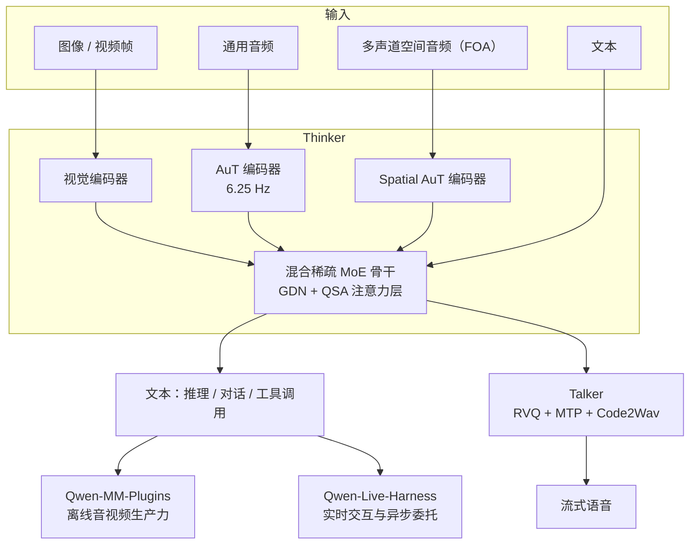
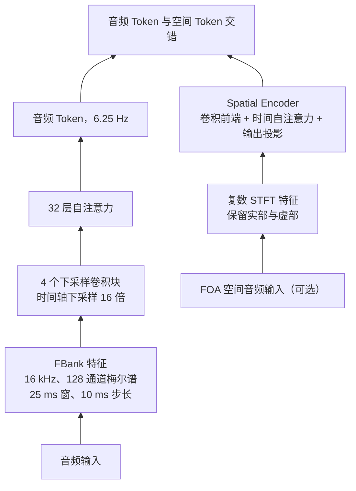
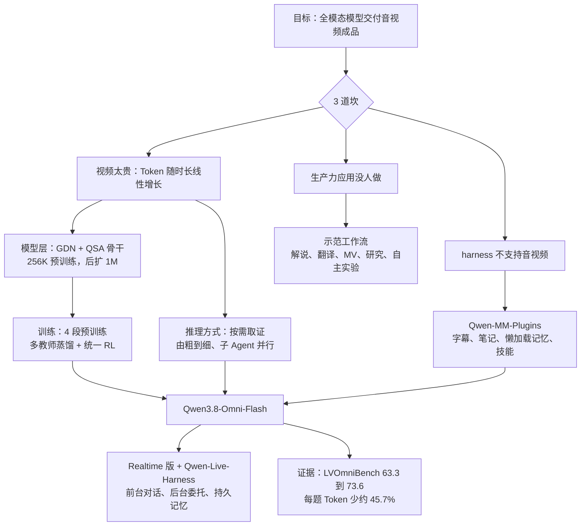

# Qwen3.8-Omni：全模态模型开始自己决定看哪一段

<!-- release-date: 2026-09-22 -->

> 本文依据 Qwen Team 发布的 **Qwen3.8-Omni: Towards Native Omni-Modal Agents**，arXiv:2609.25611v1，2026-09-22 提交，PDF 封面日期 2026-09-23，共 24 页（正文到 p. 18，p. 19–23 是参考文献，p. 24 是作者名单）。页码均指 PDF 自身页码。报告的主角是 **Qwen3.8-Omni-Flash**，实时版本另称 Qwen3.8-Omni-Flash-Realtime。文中区分 3 件事：**报告明确写了什么**、**我们怎么解释它**、**哪些是外部资料或本文推算**。

## 先想象一个具体场景

你把一部 150 分钟的电影丢给模型，说：「帮我剪一条 10 分钟的解说视频。」

上一代全模态模型的做法是：把整部电影按帧采样、连同音轨一次性塞进上下文，然后开始回答。150 分钟的音视频会变成几十万乃至上百万个 Token，贵、慢，而且真正需要的证据往往只在其中几分钟里。

更麻烦的是，「剪一条解说」根本不是一个问答题。模型要先理清剧情结构，挑出转折点，写解说词，合成配音，把原片对白、画面和背景音乐编排在一起，最后还要检查成片节奏对不对。这是一串计划、调用工具、检查、返工的动作。

Qwen3.8-Omni 这份报告要回答的就是：**一个能听、能看、能说的模型，怎样从「理解一段输入」走到「交付一份音视频成品」**。它给的答案一半在模型里，一半在模型外面的 2 套开源框架里。

## 阅读前先认识几个词

- **全模态（omni-modal）**：一个模型直接吃文本、图像、音频和带声音的视频，直接吐出文本或语音，中间不拼接外挂的语音识别和语音合成服务。
- **Thinker 与 Talker**：Qwen-Omni 家族的分工。Thinker 负责理解和生成文字（包括推理、对话、调用工具）；Talker 负责把 Thinker 的内部表示变成可播放的语音（PDF p. 3、p. 14）。
- **Agent（智能体）与 harness（运行框架）**：Agent 是能自己规划、调用工具、根据结果修正下一步的模型；harness 是包在模型外面、负责管上下文、执行工具、回填结果的那层程序，例如 Claude Code、Qwen Code。
- **主 Agent 与子 Agent（sub-agent）**：主 Agent 负责总规划，把具体子任务委托给其他 Agent 并行执行，再收回结果。
- **MoE（Mixture-of-Experts，混合专家）**：每个 Token 只激活一小部分参数，总容量可以很大，单 Token 计算量不必跟着涨。
- **GDN（Gated DeltaNet，门控增量网络）**：一种线性注意力。它把前文压进一个**固定大小的循环状态**，读写成本不随序列长度增长。
- **QSA（Qwen Sparse Attention，Qwen 稀疏注意力）**：本报告骨干里的稀疏注意力，先用一个小打分器挑出相关的上下文块，再只在这些块上做精确注意力（PDF p. 3）。
- **AuT（Audio Transformer）**：Qwen-Omni 自家的音频编码器，把声音压成每秒 6.25 个 Token（PDF p. 3–4）。
- **FOA（First-Order Ambisonics，一阶全景声）**：一种多声道空间音频格式，能记录声音从哪个方向来。
- **DER 与 cpWER**：多人说话场景的 2 个错误率。DER（Diarization Error Rate，说话人分割错误率）看「谁在什么时候说话」分得准不准；cpWER（concatenated minimum-permutation WER）看按说话人拼接后的转写错了多少。两者都是越低越好。

## 一句话先说清

Qwen3.8-Omni 不是「感知更强的全模态模型」，而是**把长音视频的处理方式从「一次吞下」改成「按需取证」的全模态 Agent**。

报告自己给的头条数字：

- 上下文支持到 **1M Token**；预训练全程用 256K 原生窗口，后训练之后再扩到 1M（PDF p. 1、p. 3）；
- 相对上一代 Qwen3.5-Omni-Plus，在音频推理、音视频推理和音视频 Agent 共 **29 项评测**上的平均分提升 **超过 25%**（PDF p. 3）；
- 每小时音频与音视频内容的 API 输入成本估算分别下降 **超过 98%** 和 **超过 93%**（PDF p. 3）；
- 在 LVOmniBench 长音视频推理上，同一个模型从「直接看完再答」换成「Agent 按需取证」，分数从 63.3 升到 73.6（PDF p. 14，Table 7）；在 OmniVideoBench 上，每题平均 Token 从 145,736 降到 79,117，约少 45.7%，准确率同时从 63.4 升到 67.8（PDF p. 14，Table 8）。

配套开源 2 个框架（PDF p. 1）：

- **Qwen-MM-Plugins**：给现有 Agent harness 补上原生音视频能力的轻量插件框架；
- **Qwen-Live-Harness**：基于 Qwen3.8-Omni 构建实时多模态 Agent 的框架。

如果只记一句话：

> **长音视频的难点不再是「看不懂」，而是「看不完」。与其把上下文做到无限长，不如让模型自己决定看哪一段、交给谁看、看完记下什么。**

## 3 道坎：为什么要把全模态模型改造成 Agent

报告开篇就把目标说得很直白：这一代全模态模型的首要目标是**提升 Agent 生产力**（PDF p. 2）。它指出以往的 Agent 系统集中在软件开发、文本知识工作、图形界面操作，多模态能力主要用于感知；而剪辑、音乐视频、影视制作这类以视频为中心的工作流需要全局规划、时间推理，还要评判生成内容的连贯性和质量（PDF p. 1）。

要做到这一点，报告列了3 道坎（PDF p. 2）：

1. **视频太贵**：视频输入的存储和传输成本高，需要巨大的 Token 预算，Agent 工作流里反复处理长视频尤其昂贵；
2. **现有 harness 不支持音视频**：大多数 harness 不支持把流式音频和视频放进主模型上下文；
3. **生产力应用还没人认真做**：全模态模型面向生产力的用法仍然探索不足。

第一道坎值得多想一步。报告在长视频一节说得更具体：传统做法把所有采样帧和音频在**一次调用**里喂进去，时长越长，Token 消耗近似线性增长，推理也越难；但回答一个问题往往只需要其中几分钟的证据（PDF p. 7）。

算一笔账（本文推算）：AuT 每秒产出 6.25 个音频 Token（PDF p. 3），1 小时音频光是音频部分就有 $3600 \times 6.25 = 22500$ 个 Token，再加上视频帧的视觉 Token。一部 3 小时的电影，即使上下文放得下，也意味着每问一个问题都要把整部片子重读一遍。

报告对 3 道坎的回答，恰好对应全文的 3 块内容：

| 坎 | 报告的回答 | 在哪 |
|---|---|---|
| 视频太贵 | 模型学会按需取证；插件把视频先抽象成字幕、笔记、记忆，需要时再懒加载原片 | §5.1、§6.2.2、Qwen-MM-Plugins |
| harness 不支持音视频 | Qwen-MM-Plugins 给现有 harness 提供音视频接口；Qwen-Live-Harness 做实时交互 | §1、§7.3 |
| 生产力应用没人做 | 插件里直接附带剪辑、翻译、解说、音乐视频等现成模块，并给出 5 类示范工作流 | §5.2–§5.4 |

## 先看全景：模型、训练和2 套框架

本图按 PDF p. 3–4 的架构描述和 Figure 2、Figure 3 重画，是结构示意，不代表层数或数据流量。

整个系统可以分成 3 层看：

- **模型层**：Thinker 沿用 Qwen-Omni 家族的 Thinker-Talker 架构，骨干换成 Qwen3.8-Next 的混合稀疏 MoE，编码器新增一路空间音频（PDF p. 3）；
- **训练层**：4 段预训练（其中 2 段专门为稀疏注意力服务）+ 2 段后训练（多教师蒸馏、统一 RL）（PDF p. 5–6）；
- **系统层**：Qwen-MM-Plugins 负责离线的音视频生产力，Qwen-Live-Harness 负责实时交互（PDF p. 1、p. 16）。

报告在结论里把这 3 层的关系概括为「同时推进模型能力和系统基础设施」（PDF p. 18）。读这份报告时要记住：**它的一半贡献不在权重里**。

## 核心设计一：骨干是循环状态加稀疏检索

### 旧问题：长上下文的2 种成本

1M Token 的上下文有2 种成本。全注意力的计算量随长度平方增长，KV Cache 随长度线性增长。纯线性注意力（如 GDN）把成本压平了，但它把前文压进固定大小的状态，**逐字精确回取**的能力天然弱。

### 新设计：GDN 管概括，QSA 管精确回取

报告写的骨干只有 2 段话（PDF p. 3）：

- Thinker 建立在 **Qwen3.8-Next** 的混合稀疏 MoE 语言骨干上。稀疏专家激活扩大容量，同时控制每个 Token 的前馈计算量；
- Token 混合部分组合了 **GDN**（用固定大小的循环状态概括前文）和**穿插的注意力层**（保留对原始 Token 的直接访问）；
- 这些注意力层在预训练的热身和稀疏训练阶段转成 **QSA**。QSA 用一个轻量的 **索引器（indexer）** 给压缩后的「微块（micro-block）」表示打分，选出相关的上下文块；核心注意力再在选中块内的**原始 Token** 上运算。

报告对这套组合的概括是：「循环处理 + 在长多模态序列上做选择性的 Token 级检索」（PDF p. 3）。

**我们的解释**：这是一种分工。

- GDN 层负责「大意」：音视频的信息沿时间轴分布很均匀，大部分内容可以被概括。
- QSA 层负责「查原文」：需要精确回看某一句台词、某一帧画面时，索引器先在压缩表示上粗筛块，精确注意力只在少数块里做。

QSA 的「先粗筛块、再精算」和 DeepSeek-V3.2 一篇讲的稀疏注意力是同一类思路：用一个便宜的打分器决定贵的注意力看哪里。不同的是，QSA 按块选、在压缩的微块表示上打分，这是按报告措辞的理解，报告没有给结构图或公式。

### 报告没写的

骨干一节没有任何配置数字：层数、GDN 层与注意力层的比例、专家数、激活参数、微块大小、每次选多少块、索引器的结构，**都没有写**。报告全文也没有给出 Qwen3.8-Omni-Flash 的总参数或激活参数。Qwen3.8-Next 的架构细节报告只引用了另一份技术报告（PDF p. 21 参考文献，arXiv:2608.30320），没有复述。

**对自己的项目有什么用**：长序列模型里，「概括」和「精确回取」是 2 种需求，可以交给 2 种层。当你发现某种结构在长度上省钱、却在精确查找上掉分时，不要二选一，而是留少量能精确查找的层，并让它们只查被选中的部分。

## 核心设计二：3 个编码器，新增一路「听方向」

### 通用音频：AuT 沿用上一代

下图改写自原文 Figure 2（PDF p. 4）：

按 PDF p. 3–4 正文与 Figure 2 重画；「32 层自注意力」「4 个下采样卷积块」读自 Figure 2 上的「32×」「4×」标注。

通用 AuT 的参数和 Qwen3.5-Omni 一脉相承（PDF p. 3–4）：

- 4 个 Conv2D 块把声学特征下采样 16 倍，接时间自注意力层；
- 输出每秒 6.25 个 Token，约每 160 毫秒一个；
- 用专门的 Qwen ASR 模型生成的转写做监督，预训练语料覆盖 20 种以上语言，中文、英文、其他语言按 $3.5 : 3.5 : 3$ 配比；
- 动态注意力窗口训练，让同一个编码器既能用于带缓存的流式推理，也能用于离线理解。

这条压缩链为什么是 6.25 Hz、动态窗口为什么能让编码器提前习惯流式，Qwen3.5-Omni 一篇已经逐步讲过，这里不重复。

### 新增：Spatial AuT，听出声音从哪来

这一代真正新加的输入模态是**空间音频**（PDF p. 5）。

旧问题是：单声道音频只知道「说了什么、什么声音」，不知道「从哪个方向来、多远、在不在移动」。对具身 Agent、会议室多人定位、影视音效这类场景，方向本身就是信息。

Spatial AuT 是一条并行通路（PDF p. 4）：

1. 先把多声道音频表示成 **FOA 格式**；
2. 对 FOA 各声道做**复数短时傅里叶变换（STFT）**，同时保留实部和虚部。原因是声道之间的**幅度差和相位差**就是方向、距离、运动的线索，只取幅度谱会把相位扔掉；
3. 卷积前端、时间自注意力层和输出投影把这些谱特征变成空间音频表示。

3 个编码器（视觉、AuT、Spatial AuT）的输出各经一个模态专属适配器，投影进骨干的共享表示空间（PDF p. 4）。

### 空间 Token 怎么排进序列

这是一个很巧的排布（PDF p. 4）：**空间音频嵌入的位置编号，按视频帧里不同空间位置的视觉块（patch）来排**。同一个时间片的空间嵌入共享同一个时间编号，同时保留不同的空间位置编号。

换句话说，模型早已学会「同一时刻一帧画面里有很多块」，现在「同一时刻有很多个方向的声音」被写成了同样的形状。时间戳沿用 Qwen3.5-Omni-Plus 的做法，**原样不改**；序列里保留显式的文字时间戳，把源时间轴直接暴露给语言骨干（PDF p. 4–5）。

**我们的解释**：这是一条「复用已有归纳偏置」的设计。与其为空间音频发明一套新的位置编码，不如把它伪装成模型已经熟悉的「一帧里的多个位置」。代价是报告没有说空间嵌入每个时间片有几个、分辨率多高，也没有与其他排法的对照。

### 报告自己没对齐的一处

视觉编码器的来源，2 处写法不一样：§2.1 说「取自 Qwen3.8-Next」（PDF p. 3），§3 的 S1 阶段说「取自 Qwen3.5」（PDF p. 5）。报告没有解释两者关系。

**对自己的项目有什么用**：加入新模态时，先找模型已经会处理的、结构相同的旧模态，把新模态的位置排布对齐过去。能复用的归纳偏置越多，需要的新数据越少。

## 预训练：4 个阶段，后 2 段只为稀疏注意力服务

### 语种覆盖

原文 Table 1 列出的支持范围（PDF p. 5）：

| 模态 | 支持数量 | 构成 |
|---|---:|---|
| 文本 | 201 | 与 Qwen3.5 相同，完整清单见 Qwen3.5 |
| 语音输入 | 113 | 74 种语言 + 39 种中文方言 |
| 语音输出 | 36 | 29 种语言 + 7 种中文方言 |

原文 Table 1 的标题写的是「Qwen3.8-Omni-Flash-Plus」，全文其他地方都只有 Flash 和 Flash-Realtime，这个名字只出现这一次（PDF p. 5）。

### 4 个阶段

全部 4 个阶段的原生序列长度都是 262,144 Token，即 256K（PDF p. 5）：

| 阶段 | 冻结什么 | 训练什么 | 数据 |
|---|---|---|---|
| S1 编码器对齐 | 语言模型 | 3 个编码器分别在固定 LLM 上训练，先训适配器再训编码器 | 图文、单声道音频–文本、多声道音频–文本 |
| S2 通用阶段 | 不冻结 | 全部参数 | 约 2.5T Token 的多模态数据 |
| S3 QSA 热身 | 骨干 | 只训 QSA 索引器，用骨干的全注意力分布做监督；此时仍用稠密注意力 | 报告未单独写 |
| S4 QSA 阶段 | 不冻结 | 打开 QSA，骨干与索引器联合训练，让模型适应稀疏注意力 | 报告未单独写 |

依据 PDF p. 5–6。初始化：LLM 部分来自 Qwen3.8-Next，音频编码器来自 AuT 和 Spatial AuT（PDF p. 5）。

S2 的 2.5T Token 按模态拆分（PDF p. 5–6）：

| 模态 | Token |
|---|---:|
| 文本 | 1.1T |
| 音频（含单声道与多声道） | 0.7T |
| 图像 | 0.35T |
| 视频 | 0.15T |
| 音视频 | 0.3T |

**这 5 项加起来是 2.6T，不是报告写的「约 2.5T」**（加法为本文所做）。报告没有解释差额。

### 为什么要多出 S3、S4 这 2 段

这是本代预训练最值得讲的地方。

**旧问题**（这一段是本文的解释，报告只说 S3 让索引器「在稀疏注意力打开之前」先学会块级选择，PDF p. 6）：如果从一个用稠密注意力训好的骨干直接切成稀疏注意力，索引器还没学过挑块，它挑出的块近乎乱选，模型会突然失去对长上下文的访问能力。

**新设计**：分 2 步走。

1. **S3 先教索引器「看老师」**：骨干冻住，稠密注意力照常工作，索引器学的是模仿骨干全注意力的分布，也就是「哪些块在稠密注意力里得分高」（PDF p. 6）。这一步不改变模型的任何行为，只是让索引器先学会挑块；
2. **S4 再真正切换**：打开 QSA，骨干和索引器一起训，让骨干适应「只能看到被选中的块」（PDF p. 6）。

**我们的解释**：这是一次「先蒸馏、再切换」。稠密注意力是现成的老师，索引器的监督信号不需要任何标注。

### 报告没写的

各阶段的步数、学习率、数据量（除 S2 外）、S3 与 S4 的时长、索引器的损失函数、预训练数据的来源与过滤，**都没有写**。算力、GPU 类型和训练时长也没有写。

**对自己的项目有什么用**：把一个行为已经正确的昂贵模块换成便宜的近似模块时，先冻住主体，让近似模块模仿昂贵模块的输出；模仿够好了再切换，并让主体适应。这比从头联合训练稳定得多，也适用于把全注意力换成滑窗、把大检索器换成小检索器。

## 后训练：先分科练老师，再用 RL 统一

报告的后训练只写了 Thinker，共 2 段（PDF p. 6）。

### 第一段：多教师蒸馏

- 从预训练好的 Qwen3.8 base checkpoint 出发，训练一批**领域专家教师**，每个都独立做 SFT 和 RL；
- 专家覆盖通用指令遵循、基础推理、编码、Agent 任务、视觉理解、音频理解；
- 各专家生成本领域的高质量轨迹，合成一份统一的多模态训练混合，蒸馏进**一个学生模型**。

报告给的理由（PDF p. 6）：比起直接在异构数据混合上微调 base 模型，专家蒸馏提供更强、更一致的监督，**减少模态之间和任务领域之间的干扰**，并为后续 RL 建立稳健的初始策略。

引言里还提到要把「领域专精」和「思考量（effort）专精」的策略合进一个统一模型（PDF p. 2），但 §4 只展开了领域专家，**没有说思考量专精的教师怎么训练、怎么合并**。

### 第二段：统一 RL

从蒸馏后的 checkpoint 出发，在文本、视觉、音频和混合模态任务上做统一 RL（PDF p. 6）。报告点名了蒸馏之后仍然存在的问题：

- 同一个问题用语音问，比用文字问更难答好；
- 长对话里出现**意外切换语言**、**人设漂移**、**指令遵循退化**。

对应的奖励设计（PDF p. 6）：

- 既评任务正确性，也评交互质量；
- 鼓励跨输入模态的一致性、对口语提问的自然回应、稳定的语言与人设、长对话里可靠的指令遵循；
- **长程 Agent 任务的奖励由任务结果和执行结果决定，而不是由模型自报的「已完成」决定**。

最后一条值得单独记住。Agent 在长任务里最常见的失败之一是「宣布完成但没做完」。如果奖励看模型自己的声明，RL 会直接教会它更自信地撒谎。

### 报告没写的

RL 算法、奖励模型的形式与规模、各类任务的配比、教师数量与规模、蒸馏数据量，**都没有写**。Thinker 的后训练一节没有任何数字，也没有消融。与之对照，Talker 的训练里点名用了 GSPO（PDF p. 15），Thinker 的 RL 算法则没有写。

**对自己的项目有什么用**：多能力合并时，「各自练到最好再蒸馏到一起」比「混在一起练」干扰小；合完以后再用一次统一 RL 抹平模态之间的落差。长程任务的奖励一定要接在可执行的外部结果上，不能接在模型自己的陈述上。

## 核心设计三：长视频从「一口吞」改成「按需取证」

这是全文的主线。

### 新设计：由粗到细的证据收集

报告对原生全模态 Agent 看长视频的描述（PDF p. 7）：

1. 根据问题**规划**分析步骤；
2. 调用工具获取相关的音频和视觉证据，按**由粗到细**的策略，通过多轮工具调用按需取回视频和音频片段；
3. 需要时把音频分析和视觉分析**委托给多个子 Agent 并行**；
4. 由此在主 Agent 有限的上下文里分析长达数小时的视频。

报告的结论句是：把长视频理解从「静态处理」转成「按需收集证据」，可以在提高准确率的同时减少 Token 消耗（PDF p. 7）。

### 证据：同一个模型，2 种用法

下表即原文 Table 7（PDF p. 14）：

| Benchmark | Qwen3.8-Omni-Flash（Static） | Qwen3.8-Omni-Flash（Qwen Code） | Gemini 3.8 Flash（Static） | Gemini 3.8 Flash（Qwen Code） |
|---|---:|---:|---:|---:|
| OmniVideoBench | 63.4 | 67.8 | 65.2 | **70.1** |
| Video-MME-v2 | 65.0 | 71.3 | 71.0 | **72.7** |
| LVOmniBench | 63.3 | **73.6** | 70.7 | 70.7 |

Static 指模型直接解读输入；Qwen Code 指模型在 Qwen Code 这个 Agent 框架里规划、调工具、逐步定位和核实证据（PDF p. 14 表注）。

读这张表要看 3 件事：

1. **Qwen3.8-Omni-Flash 3 项全涨**，涨幅 4.4、6.3、10.3 分（减法为本文所做）。LVOmniBench 上从 Static 落后 Gemini 7.4 分，变成 Agent 模式领先 2.9 分（PDF p. 14）；
2. **Gemini 3.8 Flash 用同一个 Agent 框架也涨**，在 OmniVideoBench 和 Video-MME-v2 上仍然是 Agent 模式的最高分；但在 LVOmniBench 上纹丝不动（70.7 对 70.7）。报告自己的结论是「Agent 式证据收集的收益同时取决于模型和任务」（PDF p. 14）；
3. **这张表比的是推理方式，不是模型**。Static 列就是 Table 5 里的音视频推理分数，报告明说 Table 5 的视频推理结果是这里的参照（PDF p. 13）。

**我们的解释**：第 2 条比第 1 条更有信息量。它说明「按需取证」本身就是一种通用的推理时扩展方式，不专属于 Qwen 的模型；而 Qwen3.8-Omni-Flash 在 LVOmniBench 这种最长的输入上获益最大，恰好符合「输入越长、静态处理越吃亏」的直觉。至于 Gemini 为什么在 LVOmniBench 上没有获益，报告没有分析。

### Token 账：少了近一半，但报告不说它更快

原文 Table 8（PDF p. 14）：

| 指标 | Static | Qwen Code |
|---|---:|---:|
| 准确率（越高越好） | 63.4 | 67.8 |
| 每题 Token（越低越好） | 145,736 | 79,117 |

每题 Token 约少 45.7%（PDF p. 14）。表注写明 Agent 模式**跨轮保留上下文**。

报告在这里给了一句难得克制的限定：这个结果说明在评测设置下准确率–Token 的取舍改善了，**但并不能证明端到端延迟或金钱成本相应下降**（PDF p. 14）。

这句限定很重要。Agent 模式是多轮调用：每轮都要预填充、生成、执行工具、回填结果，还可能并行开子 Agent。总 Token 少了，墙钟时间可能更长；如果子 Agent 的 Token 没算进去，账还要重算。报告没有说 79,117 是否包含子 Agent 的消耗，也只给了 OmniVideoBench 一项的 Token 数据。

### 会议纪要：把级联流水线收成一个模型

长视频的另一个用例是多人会议（PDF p. 7）。传统的级联会议分析是「识别 → 对齐 → 说话人分割」，误差层层累积，还需要额外的下游模型做内容分析。报告说 Qwen3.8-Omni-Flash 原生支持**最长 1 小时**的音视频输入，端到端完成说话人分割、转写和身份对齐，并用画面信息消解音频里的指代歧义；接上 Agent 和工具后还能发邮件、整理任务、按会议要求开始写代码。

这一段的量化证据在音频评测的多人 ASR 部分（见后文「实验」一节），会议后续执行这部分没有量化评测。

**对自己的项目有什么用**：当输入远大于回答所需的证据时，把「读全文」改成「先规划、再检索、最后核实」的多轮流程，常常同时提升准确率和成本。但要把账算全：总 Token、墙钟时间、子任务的消耗分开报，别只报一个。

## 核心设计四：Qwen-MM-Plugins，把音视频接进现有 harness

图引自原文 Figure 1（PDF p. 2）右上部分，已裁去左侧的评测柱状图和下半部分的工作流示例。

第二道坎是「现有 harness 不支持音视频」。报告的回答是做一个插件框架，而不是做一个新 harness：现有 Agent harness 通过它获得音视频能力（PDF p. 3）。

### 模块：先抽象，再按需回看

报告正文点名的模块（PDF p. 3、p. 8）：

| 模块 | 作用 | 解决什么 |
|---|---|---|
| Omni-Caption | 把视频转成详细字幕式描述 | 用文字代替原始帧 |
| Omni-Video2Note | 把视频转成结构化文字笔记，自动挑选最有信息量的帧并可调整裁剪区域 | 教程类视频的知识提取 |
| Omni-Memory | 支持对音视频内容做 Agent 式**懒加载** | 需要时才取原片 |
| Omni-Skill-Creator | 从教程或 SOP 类视频提取步骤、工具用法和判断标准，生成可被 harness 调用的技能，并经过验证与评估 | 把一次演示变成可复用能力 |
| Omni-Chatcut | 现成的生产力模块，支持长音视频翻译、影视解说、按音轨生成音乐视频 | 直接可用的剪辑能力 |

报告对这组模块的定位是：当抽象后的信息或选择性检索就够用时，**不必对整段音视频做稠密处理**（PDF p. 3）。

Figure 1 上的名字与正文略有出入：正文写 Omni-Caption，图上写 Omni-Caption-Agent，并把它标成「长视频理解与分镜素材」；图上的 Omni-Memory 标注是「长音视频问答的分层记忆」。§1 末尾把框架名写成了单数的 Qwen-MM-Plugin（PDF p. 3），其余各处均为 Qwen-MM-Plugins。

**我们的解释**：这套设计和前面「按需取证」是同一个思路在系统层的落地。模型层让模型会挑片段，插件层让片段**有东西可挑**：先把视频变成字幕、笔记、记忆索引这些便宜的中间表示，Agent 在便宜表示上规划，确定要看哪里后再懒加载原片。

### 2 种用法

Qwen3.8-Omni-Flash 可以作为**原生多模态主 Agent**，也可以作为调用这些工具的**子 Agent**（PDF p. 3）。后一种用法意味着：主 Agent 可以是一个纯文本模型，遇到音视频时把任务交给 Omni。

Qwen-MM-Plugins 在 Qwen3.8-Max 一篇里已经作为同期发布的 harness 扩展库出现过；本报告补上的是它的模块清单和在全模态模型上的用法。

**对自己的项目有什么用**：给 Agent 加一种昂贵的新模态时，优先做「插件 + 中间表示」，而不是重写 harness。中间表示（字幕、笔记、索引）让主 Agent 能用文本做规划，原始数据只在确实需要时加载。

## 应用示范：报告展示了什么，证明了什么

报告 §5.2–§5.4 描述了一批工作流。先看它们的形态，再看证据强度：

| 工作流 | 模型做什么 | 报告给的量化证据 |
|---|---|---|
| Music-to-MV | 分析歌曲，产出时间对齐的歌词转写、整体音乐描述、沿歌曲结构排布的局部音乐事件；据此写脚本、设计分镜，并审看生成镜头 | 无（PDF p. 7） |
| 短剧翻译 | 说话人感知的对白识别、对话式翻译、角色一致的声音克隆与配音、混音、质量评估 | 无（PDF p. 7） |
| 长片解说 | 对 2–3 小时的电影分析叙事结构、转折点、人物弧线，生成解说并编排配音、原声、画面与音乐 | 无（PDF p. 7–8） |
| Omni-Deep Research | 从视频里找出主张、步骤、参数、实体等研究锚点，检索网页、文档、图片和其他视频交叉核对，产出图文与视频证据交错、链回原片时刻的交互式 HTML 报告 | 无（PDF p. 8） |
| Omni-Autoresearch | 自主改进一个小模型的方言语音识别 | 有，见下 |

前四项都是能力描述，报告没有给成功率、人工评分或失败案例。Figure 1 下半部分画了其中几条的流程图和成片截图（PDF p. 2），属于示范，不是评测。

### Omni-Autoresearch：唯一给了数字的示范

任务是：在 **12 小时**内提升 Qwen2.5-Omni-3B 的四川话语音识别，并交付可用模型（PDF p. 8）。报告描述的过程：

1. 模型自己选定 WenetSpeech-Chuan 评测集，固定评测标准，建立基线；
2. 直接听音频样本，诊断识别错误，构造针对性训练数据；
3. 4 轮实验共造了 **3,413 条**训练样本，保留有效改动、回滚无效尝试；
4. 小模型的字错率（CER）从 **25.79%** 降到 **15.30%**，相对下降约 40.7%（PDF p. 8）。

Figure 1 的「Omni Self-Evolution」面板给了逐轮轨迹。下表读自该面板的折线图（PDF p. 2），报告正文没有这些中间数字：

| 轮次 | 改动类型 | 错误率 | 结果 |
|---|---|---:|---|
| 基线 | — | 25.79 | — |
| R1 | 数据 | 18.28 | 保留 |
| R2 | 训练 | 17.96 | 保留 |
| R3 | 训练 | 23.13 | 未过检查，自动回滚 |
| R4 | 数据 | 15.52 | 保留 |

面板副标题写着「在冻结的决策集上打分」，标题把任务称为四川话「音视频转写」，并画了一条「Qwen4-Next 14.81」的参考线；下方汇总卡写「25.79 → 15.52，相对 −39.8%」（PDF p. 2）。

**这里有 2 处对不上**：

- 最终错误率，正文是 15.30、相对下降约 40.7%（「同一评测集」），图上是 15.52、相对 −39.8%（「冻结的决策集」）。可能是 2 个不同的数据切分，报告没有说明；
- 图上的参考线标为「Qwen4-Next」，正文与参考文献都没有这个模型。

**我们的解释**：这个实验最有价值的不是 40.7%，而是它的流程形状：固定评测、诊断、造数据、训练、按阈值自动回滚。R3 的回滚说明「保留有效、回滚无效」是真的在起作用。但它只有 1 次运行、1 个任务、1 个小模型，没有重复实验，也没有与人类工程师的对照。

**对自己的项目有什么用**：让 Agent 自主改模型时，先让它**冻结评测**，再允许它改数据和训练；每轮用阈值自动判定保留或回滚。没有冻结的评测，「自我改进」就会变成「自我刷分」。

## 核心设计五：实时交互，把对话和干活拆成 2 条线

图引自原文 Figure 3（PDF p. 15）。

实时交互要同时满足 3 件事：反应快、声音自然、还能干活（PDF p. 14）。报告的做法分 3 块：改进 Talker、做高效推理流水线、再用 Qwen-Live-Harness 把实时模型接到真实场景里。

### Talker：沿用上一代，加 3 处改动

Talker 继承自 Qwen3.5-Omni-Plus：在 RVQ Token 上工作，用 MTP 模块预测残差码本；用专门的 system prompt 指定目标音色；用 ARIA 做流式的文本–语音交错（PDF p. 14）。这些机制 Qwen3.5-Omni 一篇已经讲过。

本代新增（PDF p. 14–15）：

- 在因果 Code2Wav 解码器里加了一条**上采样通路**，波形重建从 24 kHz 提到 **48 kHz**，显著改善高频保真度；
- 5 段训练流水线：专门构建的均衡数据集上预训练 → 引入复杂对话上下文语料的继续预训练（CPT）→ 训练各语言专家并用 **MOPD（Multi-Teacher On-Policy Distillation，多教师在策略蒸馏）** 合成多语种语音生成，缓解单语语料带来的外国口音 → 轻量的说话人微调 → RL 阶段先把 Thinker 对齐人类偏好，再用 **GSPO** 以对齐后 Thinker 给出的奖励优化 Talker。

MOPD 这一步和 Thinker 的多教师蒸馏是同一个模式：分开练专家，再合成一个。

### 推理效率：约 1 秒出声，6.5 倍实时

效率机制（PDF p. 15）：Thinker 分块流式处理输入；Talker 消费 Thinker 的流式输出，用 ARIA 让语音从不完整的文本前缀开始接续；每个声学帧由 MTP 预测残差码本，再由因果 Code2Wav 增量重建波形。于是文本生成、语音 Token 预测和波形重建可以流水推进，**整条回答还没生成完就能开始播音频**。

原文 Table 9（PDF p. 15）：

| 输入 | 时长（秒） | 文本 TPS | TTFT（毫秒） | TTFC（毫秒） | 生成 RTF |
|---|---:|---:|---:|---:|---:|
| 音频 | 6 | 84.87 | 591.26 | 978.36 | 0.1538 |
| 音频 | 12 | 83.18 | 604.80 | 982.74 | 0.1537 |
| 音频 | 20 | 81.06 | 617.98 | 1026.39 | 0.1538 |
| 音视频 | 6 | 84.89 | 837.96 | 1214.73 | 0.1524 |
| 音视频 | 12 | 84.33 | 911.85 | 1268.07 | 0.1527 |
| 音视频 | 20 | 83.00 | 981.01 | 1350.49 | 0.1528 |

几个指标的含义（PDF p. 16）：TTFT 是首个文本的时间，TTFC 是首个音频块的时间，都从客户端提交输入算起，**包含网络传输和服务端处理**，不含建连、上传和播放；文本 TPS 是每秒流式文本 Token；生成 RTF 是首尾音频块的间隔除以生成波形的时长，越小越快。

测试条件（PDF p. 15）：16 kHz 单声道 PCM 音频；音视频输入另加 1280 × 720、1 FPS 的画面；每个条件 1 次热身后取 10 次有效响应；每次新开会话，固定指令要求输出超过 200 个文本 Token；关闭语音活动检测，输入上传完再显式提交。

报告读出的结论（PDF p. 16）：文本吞吐稳定在 81.06–84.89 Token/秒；首个音频延迟音频输入约 0.98–1.03 秒，音视频输入约 1.21–1.35 秒；视觉输入推高了启动延迟，持续生成效率相近；RTF 约 0.153，即约 6.5 倍实时。

**要看清口径**：这是经过公网的 API 实测，和 Qwen3.5-Omni 一篇里的「首包延迟」不是同一口径，不能直接比大小。报告没有给服务端内部的延迟分解、并发数和硬件。

### Qwen-Live-Harness：前台聊天，后台干活

这是 Figure 3 的外圈（PDF p. 16）：

- **异步工具调用与子 Agent 委托**：前台 Agent 通过统一的适配接口把任务委托给 Qwen Code、Codex、Claude Code 等后端。提交任务立即返回确认，对话继续；后端的进度和结果异步并入对话上下文，在说话和播放的间隙用简短语音通知。用户打断当前语音**不会取消**已委托的工作，通话结束后后端任务仍可继续；
- **主动交互**：用户可以定义基于音频、画面和时间的触发条件。感知监控任务跑在**独立的实时会话**里，产出文字事件报告，前台 Agent 在对话允许时转成语音通知；用冷却时间和连续阳性抑制来减少重复提醒。用例是屏幕监控、环境观察和定时提醒；
- **持久记忆**：组合对话记录、显式工作记忆和跨会话保留的用户事实；可复用信息合并进持久档案，用词法检索加可选的向量匹配取回；开启时，视觉记忆存的是从画面**派生的文字观察**，不是原始帧。

Figure 3 底部还画了一个前端，由 Qwen-VASD 和 Qwen-VAED 这 2 个模块组成，把画面更密的音视频流变成更稀的流再交给主 Agent（PDF p. 15）。**正文没有任何一处解释这 2 个模块**，名字的含义与机制都无从确认。

**我们的解释**：Live-Harness 的核心是一条「前台低延迟、后台长任务」的分工。实时模型以非思考模式运行保证反应速度（PDF p. 16），耗时的推理和执行交给外部 Agent；二者靠异步消息接起来。这和操作系统里「中断处理要快、重活交给工作线程」是同一个形状。

### 实时版的代价

原文 Table 10 把 Realtime 版和其他模型比（PDF p. 16）。把它与 Table 5 里思考模式的 Flash 放在一起看（跨表对照为本文所做）：

| Benchmark | Flash（Table 5） | Flash-Realtime（Table 10） | Gemini 3.8 Flash |
|---|---:|---:|---:|
| QIVD | 69.6 | 66.8 | 69.1 |
| ProactiveVideoQA | 61.5 | 58.1 | 58.0 |
| StreamingBench | 80.8 | 78.9 | 79.9 |
| OmniVChat-Bench | 89.0 | 82.3 | 65.6 |
| Omni2Web（Track A / B） | 56.7 / 51.6 | 45.1 / 57.0 | 57.0 / 50.8 |
| ODUbench（Audio / VA） | 91.64 / 89.57 | 90.2 / 86.2 | 72.06 / 66.38 |

依据 PDF p. 12 Table 5 与 PDF p. 16 Table 10。

实时版多数项低于思考版，这是非思考模式的预期代价；Omni2Web Track B 反而更高（57.0 对 51.6），报告没有解释。报告强调的是 Realtime 版在 OmniVChat-Bench（82.3 对 Gemini 的 65.6）、ODUbench 和 Omni2Web Track B 上领先 Gemini 3.8 Flash（PDF p. 17）。语音类的 WildSpeech（72.5）和 VoiceBench（88.8）则低于上一代 Qwen3.5-Omni-Plus 的 75.7 和 92.9（PDF p. 16）。

### 语音生成：大多领先，也有几格没赢

声音克隆（原文 Table 11，PDF p. 17）和定制音色（原文 Table 12，PDF p. 18）2 张表很长，挑读表要知道的几行：

| 指标 | Qwen3.8-Omni-Flash-Realtime | 对照 |
|---|---:|---|
| SEED 内容稳定性 zh / en / hard（WER/CER，越低越好） | 0.74 / 0.89 / 5.29 | 3 项均为表内最低（Table 11） |
| 30 语言克隆 WER | 3.17 | Qwen3.5-Omni-Plus 3.48、MiniMax-Speech-2.8 6.05（Table 11） |
| SwanBench-Speech zh WER | 1.96 | 表内最差；MiniMax-Speech-2.8 1.57 最好（Table 11） |
| 长语音生成 zh / en WER | 1.74 / 1.59 | Qwen3.5-Omni-Plus 19.25 / 4.52（Table 11） |
| SpeechSuperClue 总克隆分 ml / cl | 3.749 / 3.306 | 均为表内最高（Table 11） |
| 音素发音准确率 | 93.3% | Gemini 3.1 TTS Flash 86.6%（Table 12） |
| 20 种风格控制成功率 | 95.0% | Gemini 3.1 TTS Flash 97.5%（Table 12） |
| ABX 自然度胜率 | 72.7% | Gemini 3.1 TTS Flash 74.2%（Table 12） |
| SpeechSuperClue en WER | 7.55 | Gemini 3.1 TTS Flash 6.39 更低（Table 12） |

正文说在长程生成上「在 SwanBench-Speech 和 LongSpeechGeneration 上都保持稳健」（PDF p. 17），但 SwanBench-Speech 中文一格在 4 个模型里最差。长语音生成相对上一代的改善是全表最大的：中文 WER 从 19.25 降到 1.74。SpeechSuperClue、LongSpeechGeneration、PhonePronunciation 等标星号的都是内部基准（PDF p. 17–18）。

**对自己的项目有什么用**：实时 Agent 不要让同一个模型既负责低延迟对话又负责长时间推理。前台用快模式保证响应，后台异步委托，结果以事件形式回流；并且让「打断说话」和「取消任务」成为 2 个不同的动作。

## 实验：哪些结论有证据，哪些要打问号

评测按能力分组（PDF p. 8–9）：§6.1 测通用和单模态能力，§6.2 测全模态 Agent 能力。对照模型：文本和视觉对 Qwen3.8-Flash、Qwen3.8-27B、Qwen3.7-Plus 等；音频和音视频对 Qwen3.5-Omni-Plus、Gemini 3.8 Flash、Seed 2.0 Lite、Muse Spark 1.2（PDF p. 9）。报告特意说明：涉及工具的结果反映的是「模型 + 所述执行设置」，能力分组描述的是任务领域，不是区分用不用工具（PDF p. 9）。

### 文本：加了模态，没有明显掉分

原文 Table 2（PDF p. 9）：

| Benchmark | Qwen3.8-Omni-Flash | Qwen3.8-Flash | Qwen3.8-27B | Qwen3.7-Plus | DeepSeek-V4-Flash-0731 | Claude-Opus-4.6 (Max) |
|---|---:|---:|---:|---:|---:|---:|
| DeepSWE 1.1 | 57.8 | **58.7** | 42.2 | 16.5 | 54.4 | – |
| SWE-bench Pro | **63.3** | 62.5 | 61.7 | 55.8 | 56.0 | 53.4 |
| SWE-bench Multilingual | 80.5 | **81.0** | 73.8 | 75.8 | – | 77.5 |
| NL2Repo-Bench | 48.9 | 48.1 | 42.3 | 41.1 | **54.2** | 47.6 |
| CoWorkBench | **75.3** | 73.9 | 70.7 | 65.1 | 45.1 | 68.2 |
| IFBench | **81.5** | 81.3 | 79.5 | 79.1 | 79.2 | 62.5 |
| GPQA Diamond | 91.0 | **91.7** | 89.2 | 90.3 | 90.8 | 91.3 |
| HLE | 36.5 | 35.9 | 30.8 | 34.7 | 33.8 | **40.0** |
| LiveCodeBench v6 | **92.6** | 91.9 | 90.3 | 89.6 | 90.6 | 88.8 |

加粗为本文按表内最高值标注。

这张表回答的是「全模态税」问题：和同代纯文本的 Qwen3.8-Flash 比，9 项里 6 项略高、3 项略低（DeepSWE 1.1、SWE-bench Multilingual、GPQA Diamond），差距都在 1.4 分以内（比较为本文所做）。报告的措辞是「保持有竞争力的文本表现」，多模态能力与编码、Agent 执行能力「共存」（PDF p. 10）。

读表要注意三点：

- 各项的 harness 不同：DeepSWE 1.1 取 Claude Code 和 mini-SWE-agent 2 个 harness 中的**较高分**；SWE-bench Pro 除 Claude-Opus-4.6 (Max) 用官方公布分外，都在修正过问题任务的版本上用 Claude Code 重测；NL2Repo-Bench 禁用了访问目标仓库的 Bash 命令以防奖励作弊（PDF p. 9 表注）；
- **CoWorkBench 是内部基准**（PDF p. 9 表注）；
- HLE 用 GPT-4o 判分（PDF p. 9 表注）。

### 视觉：Agent 类和带代码解释器的项更强

原文 Table 3（PDF p. 10）挑读几行：AndroidWorld 87.1，高于 Qwen3.8-Flash 的 84.5；LVBench 76.9 和 MathVision 91.8 为表内最高；带代码解释器（CI）时 MathVision 升到 96.2、CharXiv (RQ) 从 83.5 升到 91.4；ERQA 和 RealWorldQA 略低于 Qwen3.8-Flash（PDF p. 10）。

ClawEval-MM 值得单独看：Qwen3.8-Omni-Flash 的平均分更高（61.9 对 60.4），Pass@3 却更低（60.4 对 64.4）。报告自己点出这说明2 个指标要分开看（PDF p. 10）。Pass@3 是 3 次里至少过 1 次的比例，平均分是 3 次的均值；平均分高、Pass@3 低，意味着**更稳定但上限略低**（这层解释是本文的）。另外报告手工修正了少量 MathVision 的错误标注，且只有自家模型用固定的逐步推理提示词，其他模型取有无该格式指令 2 次运行中的较高分（PDF p. 10 表注）。

### 音频：多人识别跃升，通用转写与翻译没赢

原文 Table 4（PDF p. 11）挑读：

| Benchmark | Qwen3.8-Omni-Flash | Qwen3.5-Omni-Plus | Gemini 3.8 Flash | Seed 2.0 Lite | Muse Spark 1.2 |
|---|---:|---:|---:|---:|---:|
| AliMeeting Test（DER / cpWER，越低越好） | **3.4 / 17.2** | 88.1 / 89.6 | 72.6 / 53.1 | 75.1 / 76.1 | 93.7 / 92.7 |
| AISHELL-4（DER / cpWER） | **2.8 / 11.2** | 100.0 / 100.0 | 66.4 / 56.9 | 64.8 / 64.2 | 91.3 / 86.0 |
| WenetSpeech Net（WER） | 4.8 | **3.7** | 14.2 | 4.3 | 68.2 |
| WenetSpeech Meeting（WER） | **4.6** | 4.8 | 16.7 | 4.7 | 42.6 |
| FLEURS-ASR（WER，60 种语言） | 9.3 | **7.2** | 7.9 | 32.1 | 23.6 |
| FLEURS-S2TT（BLEU） | 31.8 | 32.2 | **33.0** | 24.8 | 28.8 |
| OmniLingua-MultiSpeaker（成功率 / tcpWER） | **100.00 / 43.25** | 88.33 / 84.46 | 97.00 / 129.03 | 88.67 / 99.28 | 98.67 / 105.83 |
| OmniLingua-MultiSpeaker（cpWER / DER） | **34.97 / 20.15** | 50.73 / 47.61 | 44.58 / 71.02 | 43.44 / 50.42 | 77.19 / 74.05 |
| SpotSoundBench | **67.2** | 64.2 | 39.7 | 59.6 | 16.9 |
| MMAU | 81.8 | **81.9** | 76.9 | 77.2 | 63.5 |
| LongAudioSpan（Accuracy / Rubric / Chain） | **82.7 / 71.8** / 48.2 | 74.4 / 49.8 / 45.1 | 79.3 / 65.5 / **64.6** | – | – |
| Audio MultiChallenge | 71.5 | 57.6 | **71.9** | 63.4 | 57.9 |
| VoiceBench | 91.6 | **92.9** | 92.3 | 84.1 | 79.8 |

加粗依原表。

最大的变化在**多人 ASR**：AliMeeting 的 DER 和 cpWER 从 88.1 和 89.6 降到 3.4 和 17.2（PDF p. 12）。上一代在 AISHELL-4 上是 100.0 / 100.0，本文理解为基本不支持这类任务；另外 2 个多人 ASR 集 MagicData-RAMC 与 MLC-SLM (en) 也是本代两项指标全表最低（PDF p. 11–12）。这是前面「会议纪要端到端」主张的直接证据。

报告同样如实写了没赢的地方（PDF p. 12）：OmniLingua-LongAudioASR 的成功率从 94.07% 升到 95.56%，WER 却从 6.89% 升到 9.27%；FLEURS-ASR 的 9.3 高于上一代的 7.2 和 Gemini 的 7.9；FLEURS-S2TT 的 31.8 低于 32.2 和 33.0；WenetSpeech Net 的 4.8 高于上一代的 3.7；VoiceBench 和 WildSpeech 低于上一代和 Gemini。报告的总结是：要区分多语言理解和多人处理上的进步，与通用转写和翻译上仍存在的差距（PDF p. 12）。

**我们的解释**：这像是一次有取舍的迁移。训练重心转向长时、多人、理解与 Agent 场景后，单人短句转写这种「上一代已经很强」的能力略有回落。报告没有给出原因分析。

### 音视频：大幅追近，没全面超过

原文 Table 5（PDF p. 12）里与上一代比的主要进步（PDF p. 13）：OmniVideoBench 从 53.8 到 63.4，Video-MME-v2 从 47.9 到 65.0，LVOmniBench 从 53.2 到 63.3；StreamingBench 从 57.1 到 80.8，ProactiveVideoQA 从 35.1 到 61.5；OmniCap-IF 的 CSR / ISR 从 72.1 / 14.1 到 80.6 / 28.2。

但在 3 个视频推理基准上，Gemini 3.8 Flash 仍然更高（65.2、71.0、70.7）。报告明说，正是这一点**促使他们研究 Agent 式推理**，而不是只靠直接解读输入（PDF p. 13）。这句话把 Table 5 和 Table 7 串成了一条因果线：静态处理追不上，就换一种推理方式。

**这一节有 2 处正文与表格不一致**：

- 正文说在 OmniVChat-Bench 上「与上一代持平于 89.0」（PDF p. 13），Table 5 里上一代是 52.1，89.0 是本代的分数（PDF p. 12）；
- 正文说 OmniEchoBench 从 23.3 升到 **41.7**（PDF p. 13），Table 5 写的是 **43.9**（PDF p. 12）。

以表为准，上一代在 OmniVChat-Bench 上是大幅落后，而不是持平。

### 全模态 Agent：进步大，也有明确差距

原文 Table 6（PDF p. 13）：

| Benchmark | Qwen3.8-Omni-Flash | Qwen3.5-Omni-Plus | Gemini 3.8 Flash | Seed 2.0 Lite | 执行设置 |
|---|---:|---:|---:|---:|---|
| WildClawBench-MM | **71.0** | 34.5 | 58.9 | 41.9 | Claude Code，只取涉及图像、视频或音频的子集 |
| UniClawBench | **69.6** | 67.1 | 69.0 | 61.2 | OpenClaw |
| AgenticVBench | 36.8 | 14.5 | **45.0** | 10.0 | Claude Code |
| OmniGAIA | 74.0 | 57.2 | **78.6** | 64.4 | 无外部 harness |

4 项全部超过上一代，WildClawBench-MM、AgenticVBench、OmniGAIA 分别涨 36.5、22.3、16.8 分；Gemini 3.8 Flash 在 AgenticVBench 和 OmniGAIA 上领先（PDF p. 13）。报告强调这是 4 种不同的执行设置，不是一个共享 harness（PDF p. 13）。

### 头条数字的可复核性

摘要级的2 个数字，报告没有给可复核的明细：

- 「29 项评测平均提升超过 25%」（PDF p. 3）：没有列出是哪 29 项，也没说是算术平均的相对提升还是平均分的相对提升；
- 「每小时音频、音视频输入成本下降超过 98% 和 93%」（PDF p. 3）：是「估算的 API 输入成本」，全文没有价格表、计费口径或计算过程。

## 报告没有公开的

- 模型规模：Qwen3.8-Omni-Flash 的总参数、激活参数、层数、专家数；
- 骨干细节：GDN 层与 QSA 层的比例，QSA 的微块大小、选块数、索引器结构与训练损失；
- 编码器细节：视觉编码器的规模，Spatial AuT 的参数量与每个时间片的空间嵌入数；
- 预训练：数据来源、过滤与配比方法；各阶段步数、学习率、时长；S3、S4 的数据量；S2 的分项与总数为何不一致；
- 算力：GPU 类型、数量、训练总时长，全文都没有；
- 后训练：教师数量与规模、蒸馏数据量、Thinker 的 RL 算法与奖励模型、思考量专精策略如何合并；
- 1M 上下文的扩展方法：只说后训练之后扩到 1M（PDF p. 3），没有写怎么扩，也没有 1M 长度下的检索类评测；
- Agent 模式的成本：只有 OmniVideoBench 一项的 Token 数，没有延迟、子 Agent 消耗和其他基准的 Token 数；
- 应用示范：Music-to-MV、短剧翻译、长片解说、Omni-Deep Research 都没有量化评测；
- Figure 3 前端的 Qwen-VASD 与 Qwen-VAED 是什么；
- 实时 API 测试的硬件与并发；
- 权重：报告只写了 2 个框架开源（PDF p. 1），没有提到模型权重是否开放。

## 最值得带回自己项目的 7 条

### 1. 输入远大于证据时，改的是推理方式，不是上下文长度

把「读全文再回答」换成「规划 → 检索片段 → 核实」，Qwen3.8-Omni-Flash 在长音视频上同时拿到更高分和更少 Token。先问一句：回答这个问题真正需要多少输入？

### 2. 给昂贵模态做一层便宜的中间表示

字幕、笔记、记忆索引让 Agent 能用文本做规划，原片只在需要时懒加载。这和数据库里「先查索引、再回表」是一个道理。

### 3. 把昂贵模块换成便宜近似时，先让近似模块模仿，再切换

QSA 的 S3 用冻结骨干的稠密注意力监督索引器，S4 才真正切到稀疏。任何「替换一个已经工作正常的组件」的工程都可以照这个顺序做。

### 4. 新模态先找结构相同的旧模态

空间音频的位置编号照搬视频帧里的空间块排法，模型已有的归纳偏置直接复用。

### 5. 长程任务的奖励只看外部结果

RL 奖励由任务结果和执行结果决定，不由模型自报完成决定。对任何 Agent 训练和评测都适用：模型说的「做完了」不是证据。

### 6. 前台低延迟、后台长任务，中间用异步事件连接

Live-Harness 把实时对话和长时间执行拆成 2 条线，打断说话不取消任务。实时系统里凡是「必须快」和「必须对」冲突的地方，都可以这样拆。

### 7. 自主实验先冻结评测，再允许自动回滚

Autoresearch 的 R3 被自动回滚，说明阈值机制在起作用。让 Agent 改模型之前，先把它能动的东西和不能动的东西分清楚。

## 用一张图重新串起全文

## 关键词回看

- **Thinker / Talker**：理解与生成文字的部分 / 把内部表示变成流式语音的部分。
- **GDN**：用固定大小循环状态概括前文的线性注意力，负责「大意」。
- **QSA**：索引器在压缩微块上选块、精确注意力只在选中块内做的稀疏注意力，负责「查原文」。
- **QSA 热身（S3）**：冻结骨干，用稠密注意力分布监督索引器；**QSA 阶段（S4）**：切到稀疏并联合训练。
- **AuT / Spatial AuT**：每秒 6.25 个 Token（PDF p. 3）的通用音频编码器 / 处理 FOA 复数 STFT、捕捉方向与距离的空间音频编码器。
- **多教师蒸馏**：分领域练专家，再把各家轨迹蒸馏进一个学生，减少跨模态、跨领域干扰。
- **按需取证（agentic evidence gathering）**：规划、分段取回、核实，取代一次性吞下整段音视频。
- **Qwen-MM-Plugins**：给现有 harness 补音视频能力的插件框架，核心是中间表示加懒加载。
- **Qwen-Live-Harness**：实时 Agent 框架，异步委托、主动提醒、持久记忆。
- **MOPD**：Talker 训练里的多教师在策略蒸馏，用于合成多语种语音生成。
- **DER / cpWER**：多人场景的说话人分割错误率 / 按说话人拼接后的词错率。

## 最后的判断

Qwen3.8-Omni 这份报告最值得学的，不是某个新模块，而是它**把全模态模型的问题从「能不能看懂」重新定义成「该看哪里」**。

骨干用 GDN 概括、用 QSA 精确回取，是在模型内部做「按需看」；Agent 模式由粗到细取片段、派子 Agent，是在推理时做「按需看」；插件把视频先变成字幕和笔记、再懒加载原片，是在系统层做「按需看」。3 层是同一个思路。

证据强度是分层的：

- **有直接实验支撑的**：Agent 模式在 3 个长音视频基准上的提升与 OmniVideoBench 上的 Token 下降（Table 7、Table 8）；多人 ASR 的跃升（Table 4）；相对同代文本模型基本不掉分（Table 2）；实时 API 的延迟与 RTF（Table 9）。
- **只有描述或单次示范的**：Music-to-MV、短剧翻译、长片解说、Omni-Deep Research；Autoresearch 只有 1 次运行，且正文与图的终点数字不一致。
- **完全没有公开的**：模型规模、QSA 配置、训练数据与算力、后训练算法、1M 扩展方法、成本下降的计算口径。

还有几处需要读者自己校准：S2 数据分项加起来是 2.6T 而不是 2.5T（PDF p. 5–6）；OmniVChat-Bench「持平」与 OmniEchoBench「41.7」都与表格不符（PDF p. 12–13）；视觉编码器来源前后 2 种说法（PDF p. 3、p. 5）；Token 少了不等于更快、更便宜，报告自己也这么说。

如果只带走一句：

> **当输入比答案大得多时，最有效的扩展往往不是把窗口做大，而是教模型先问「我需要看哪一段」。**

## 资料与阅读边界

**原始依据**

- 本地 `papers/Alibaba/Qwen3.8-Omni.pdf`，即 Qwen Team，**Qwen3.8-Omni: Towards Native Omni-Modal Agents**，arXiv:2609.25611v1（2026-09-22 提交，封面日期 2026-09-23），24 页。全文所有带 `(PDF p. N)` 的数字都出自这一版。

**首发日证据**

- 官方渠道（Qwen 官方博客 <https://qwen.ai/blog?id=qwen3.8-omni-flash>、阿里云百炼 qwen3.8-omni-flash 模型页、QwenCloud 模型更新日志 <https://docs.qwencloud.com/changelog/models>）的上线日期未能核实；第三方报道称官方于 2026-09-18 宣布、更新日志登记在 2026-09-17，均非官方一手证据。因此 `release-date` 暂取 arXiv v1 提交日 2026-09-22；官方日志确认更早的可用日后应改为那一天。

**外部补充（不是报告内容）**

- GDN 的机制背景与 AuT、ARIA、Talker 多码本的完整讲解，见 Qwen3.5-Omni 一篇；Qwen-MM-Plugins 首次随 Qwen3.8-Max 博客发布，见 Qwen3.8-Max 一篇。
- QSA 与 DeepSeek-V3.2 稀疏注意力的类比是本文的解释，报告没有做这个比较。
- 本文中 22,500 个音频 Token/小时的算术、Table 7 的差值、S2 分项求和、Table 5 与 Table 10 的跨表对照、Table 2 的逐项比较，都是**本文根据报告数字所做的计算**。
- Omni-Autoresearch 的逐轮数字读自 Figure 1 的小图，正文没有这些数字；图中字小，个别数字若有误差以原图为准。
