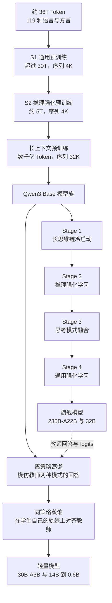
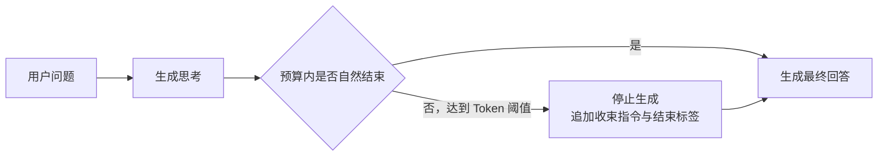

# Qwen3：让一套权重既会深思、快答，也能按预算收手

<!-- release-date: 2025-04-29 -->

> 本文依据本地 `papers/Alibaba/Qwen3.pdf`，即 Qwen Team 的 **Qwen3 Technical Report**，arXiv:2505.09388v1，封面日期 2025-05-15，共 35 页。页码指 PDF 的页序，与页脚印刷页码一致。文中区分三件事：**报告明确写了什么**、**我们怎么解释它**、**哪些是外部资料或本文推算**。

## 阅读前先认识几个词

- **Token（词元）**：模型读写文本的基本单位。思考预算也按 Token 计。
- **CoT（Chain of Thought，思维链）**：模型在最终答案前写出的中间推理。Long-CoT 指更长、更完整的推理轨迹。
- **thinking / non-thinking 模式**：同一个模型的两种工作方式。前者先在 `<think>` 块里推理再作答，后者留一个空的思考块、直接作答。
- **MoE（Mixture of Experts，混合专家）**：把前馈网络拆成许多专家，每个 Token 只调用其中几个。模型名里的 `A22B` 表示每个 Token 激活 22B 参数。
- **Logit（未归一化分数）**：模型在每个位置给词表里所有候选 Token 的打分，softmax 后才是概率。蒸馏时「对齐 logits」就是让学生在每个位置的整条概率分布都向教师靠拢。

## 一句话先说清

推理模型提高成绩的直接办法是多写思考 Token。但线上请求并不都值得这样做：竞赛题值得想几万 Token，「把这段话改短」若也先写一大段思考，用户只会觉得慢；把「会推理」和「快速回答」做成两个模型，训练、部署、路由又都要维护两套。

Qwen3 的答案是：**同一套权重先练出长推理，再把快速回答接回来，最后给产品一个开关和一个刹车**。开关是 `/think` 与 `/no_think`，刹车是 thinking budget——思考写到用户给的 Token 上限就被截停，模型基于已有推理直接作答（PDF p. 11）。旗舰 Qwen3-235B-A22B 总参数 235B、每 Token 激活 22B；小模型不重走旗舰的四阶段后训练，而是从旗舰蒸馏（PDF p. 2–3、12）。

报告自己的消融也把代价摆了出来：通用能力和工具能力继续提升时，最难的数学与代码成绩会回落；在长上下文检索上，多想反而更差（PDF p. 21–23）。

如果只记一句话：

> **把推理当成一种可分配的计算预算。先训练出能力，再给产品开关和刹车，同时用逐能力的回归评测看住副作用。**

## 先看全景：Qwen3 的能力从哪里来



这张图根据报告 Figure 1（PDF p. 9）与第 3 节预训练描述（PDF p. 4）重画，是训练流程示意，不是时间线。上半是旗舰的四阶段，下半是轻量模型的强到弱蒸馏。后面按这条线从底座走到推理控制。

## 底座：架构克制，钱花在数据上

### 架构只补了一处稳定性

稠密模型沿用 Qwen2.5 的骨架：**GQA（分组查询注意力，多个 Query 头共享较少的 Key/Value 头以减小 KV Cache）**、SwiGLU 前馈、RoPE 位置编码、RMSNorm 与 pre-normalization。唯一的改动是去掉 Qwen2 里 Q、K、V 投影的 bias，并给 Query 和 Key 加 **QK-Norm**，目的是训练稳定（PDF p. 3）。

QK-Norm 的直觉：注意力分数是 Query 与 Key 的点积，

$$
z_{ij}=\frac{q_i^{\top} k_j}{\sqrt{d}}
$$

$q_i$ 是当前位置的 Query，$k_j$ 是历史位置的 Key，$d$ 是头维度。若少数向量的模长失控，$z_{ij}$ 会很大，softmax 被推到极端。先把 $q_i$、$k_j$ 归一化再点积，就在离问题最近的位置加了护栏。这条式子是通用定义，不是报告新增；报告也没有给 QK-Norm 的单独消融。

分词器是 Qwen 的字节级 BPE，词表 151,669（PDF p. 3）。

### 两种成本档位

稠密模型六个（Table 1，PDF p. 3）：

| 模型 | 层数 | Q / KV 头数 | 词嵌入共享 | 表中上下文长度 |
|---|---:|---:|---|---:|
| Qwen3-0.6B | 28 | 16 / 8 | 是 | 32K |
| Qwen3-1.7B | 28 | 16 / 8 | 是 | 32K |
| Qwen3-4B | 36 | 32 / 8 | 是 | 128K |
| Qwen3-8B | 36 | 32 / 8 | 否 | 128K |
| Qwen3-14B | 40 | 40 / 8 | 否 | 128K |
| Qwen3-32B | 64 | 64 / 8 | 否 | 128K |

MoE 两个（Table 2，PDF p. 3）：

| 模型 | 总 / 激活参数 | 层数 | Q / KV 头数 | 专家总数 / 激活数 | 表中上下文长度 |
|---|---:|---:|---:|---:|---:|
| Qwen3-30B-A3B | 30B / 3B | 48 | 32 / 4 | 128 / 8 | 128K |
| Qwen3-235B-A22B | 235B / 22B | 94 | 64 / 4 | 128 / 8 | 128K |

表里的「128K」要和预训练一节对照读：最后一段训练的序列长度是 32,768，推理时再靠 YaRN 与 Dual Chunk Attention（DCA）把可处理长度扩到 4 倍（PDF p. 4）。准确说法是「32K 训练，推理外推到 128K」，不是原生 128K 训练。外部补充：Qwen3-235B-A22B 的官方模型卡写的是原生 32,768、用 YaRN 时 131,072，口径一致。

激活参数少也不等于延迟就和同尺寸稠密模型一样低：MoE 还要付路由、专家通信、显存驻留与负载不均的成本。报告没有给吞吐或延迟数据。

### MoE：取消共享专家，把负载均衡放到全局批次

Qwen3 MoE 沿用 Qwen2.5-MoE 的细粒度专家切分，128 个专家每 Token 激活 8 个；和 Qwen2.5-MoE 不同，**不设共享专家**；负载均衡改用 **global-batch load balancing loss（全局批次负载均衡损失）**，目的是鼓励专家分工（PDF p. 3）。

为什么均衡的范围会影响分工？下面是我们的解释。若在很小的 micro-batch 里就强求每个专家接到同样多的 Token，一段纯代码也会被均匀摊给所有专家，负载整齐了，「这个专家擅长代码」的分工却很难长出来。把均衡范围放大到全局批次，单条代码样本可以集中路由给少数专家，只要整个大批次里各领域合起来均衡即可。

> **均衡约束放得太局部，会把你想要的专门化一起抹掉。**

报告没有公开路由函数、均衡损失权重、容量因子或专家并行实现，也没有单独消融「取消共享专家」这一项。

## 36T Token：规模翻倍，更重要的是配比做到了样本级

预训练数据约 36T Token，覆盖 119 种语言与方言；相比 Qwen2.5，Token 约翻倍、语言约为三倍（从 29 种增至 119 种）（PDF p. 3–4）。报告写了三条扩充与一条配比方法（PDF p. 4）：

1. **从 PDF 里挖文本**：用 Qwen2.5-VL 对大量 PDF 类文档做文字识别，再用 Qwen2.5 清理，得到「数万亿」高质量 Token。视觉模型在这里只是上游数据处理器，Qwen3 本身是纯文本模型；
2. **用领域模型合成**：Qwen2.5、Qwen2.5-Math、Qwen2.5-Coder 合成教材、问答、指令、代码片段，覆盖几十个领域，同样是「数万亿」Token；
3. **加入更多多语言数据**；
4. **样本级配比**：一套多语言标注系统给超过 30T Token 打上教育价值、领域、安全等多维标签；以往工作在数据源或领域层面优化配比，Qwen3 用这些细粒度标签在小代理模型上大量消融，**在样本级优化混合**。

第 4 条最值得迁移。同一个网站既有高质量技术文章，也有模板页和转载；只给整个来源一个权重，好坏就被绑在一起。能给每条样本一个质量与领域坐标，才谈得上精细的混合比例。但报告没有公开标签模型、目标函数、消融曲线与最终配比，合成数据的比例、验证方式与去重也都没给——能借的是设计原则，不是配方。

## 三阶段预训练：知识、推理密度、长度分开学

| 阶段 | 数据量 | 序列长度 | 内容与设置 |
|---|---|---:|---|
| S1 通用 | 超过 30T | 4,096 | 119 种语言，打语言能力与世界知识的底 |
| S2 推理 | 约 5T 更高质量 Token | 4,096 | 提高 STEM、代码、推理与合成数据比例；加快学习率衰减 |
| 长上下文 | 数千亿 | 32,768 | 75% 文本长 16,384–32,768，25% 长 4,096–16,384；RoPE 基频从 10,000 提到 1,000,000（ABF 方法）；推理时用 YaRN 与 DCA 扩 4 倍 |

（PDF p. 4）

这样排的理由不难理解：绝大多数 Token 放在短序列上学广覆盖的知识；S2 不急着拉长，而是先把剩余预算集中到难题上；长序列最贵，放到最后用较少的专门数据完成长度适配。

报告还说团队沿用 Qwen2.5 的做法，按三个阶段建立预测最优超参（学习率调度、batch size）的 scaling law，为每个稠密与 MoE 模型分别设定（PDF p. 4）。公式、实验点与最终数值都没有公开。

### Base 模型：参数效率的整体结论

15 个 base 基准覆盖通用、数学与 STEM、代码、多语言四类（PDF p. 4–5）。旗舰对比（Table 3，PDF p. 6，摘几行）：

| 基准 | Qwen2.5-72B | Llama-4-Maverick | DeepSeek-V3 | Qwen3-235B-A22B |
|---|---:|---:|---:|---:|
| 总 / 激活参数 | 72B / 72B | 402B / 17B | 671B / 37B | 235B / 22B |
| MMLU | 86.06 | 85.16 | 87.19 | 87.81 |
| MMLU-Pro | 58.07 | 63.91 | 59.84 | 68.18 |
| GPQA | 45.88 | 43.94 | 41.92 | 47.47 |
| MATH | 62.12 | 63.32 | 62.62 | 71.84 |
| EvalPlus | 65.93 | 68.38 | 63.75 | 77.60 |
| INCLUDE | 69.05 | 73.47 | 75.17 | 73.46 |

报告的结论是它以约三分之一的总参数、三分之二的激活参数，在 15 项里 14 项超过 DeepSeek-V3-Base（PDF p. 5）；唯一落后的一项是 INCLUDE（地区性多语言知识）。报告另外归纳了三条效率规律（PDF p. 5、9）：

- 同样的预训练数据下，Qwen3 MoE base 只用稠密模型约五分之一的激活参数就能达到相近表现；
- Qwen3-30B-A3B 只激活 3B，全面超过 Qwen2.5-14B-Base，并与 Qwen3-14B-Base、Qwen2.5-32B-Base 相当；
- Qwen3 稠密的 1.7B / 4B / 8B / 14B / 32B 大体对应 Qwen2.5 的 3B / 7B / 14B / 32B / 72B，在 STEM、代码、推理上甚至更好；Qwen3-32B-Base 在 15 项里有 10 项超过 Qwen2.5-72B-Base（PDF p. 9）。

这些对比同时变了数据、架构、训练策略，只能支持「这一整套组合提高了参数效率」，不能把分数归给 QK-Norm、取消共享专家或某条数据改动。

## 旗舰后训练四阶段

### Stage 1：长思维链冷启动——点火，不包办

预训练模型有知识，但不一定能稳定写出可验证的长推理。直接上强化学习也危险：模型一开始几乎答不对时，奖励太稀，训练不知道该保留哪条路径。所以先做 **Long-CoT Cold Start**（PDF p. 10）。

**题目过滤**：数据覆盖数学、代码、逻辑推理与一般 STEM，每题都配有已验证的参考答案或代码测试。Qwen2.5-72B-Instruct 负责剔除不易验证的题（含多个子问题、或是一般文本生成）、剔除**不用 CoT 就能答对**的题（防止模型靠表面猜测），并给每题标领域以维持平衡。

**回答过滤**：留出验证集后，QwQ-32B 为每题生成 $N$ 个候选；它始终答不对的题由人工判断回答是否正确。对 Pass@$N$ 大于零的题，再剔除六类回答：最终答案错、大量重复、明显靠猜、思考与总结不一致、不当的语言混用或风格突变、疑似与验证集过于相似。

**刻意少训**：最后只取精炼数据中的一小部分，并尽量少用样本和训练步数。报告的理由是这一阶段只灌输基本推理模式，不追求即时成绩，以免限制后续强化学习的潜力。

> **冷启动要让策略有路可走，不是提前替强化学习走完所有路。**

### Stage 2：3,995 个题-验证器对上的推理 RL

进入 **Reasoning RL** 的 query-verifier 对要满足四个条件：冷启动没用过、冷启动模型学得动、尽量难、覆盖广泛子领域。最终只有 **3,995 对**，用 GRPO（Group Relative Policy Optimization，对同一题采样一组回答，用组内相对奖励更新策略）训练（PDF p. 10）。

报告给的经验：大 batch、每题多次 rollout、用 off-policy 训练提高样本效率；通过控制熵让它稳定或缓慢上升，平衡探索与利用（PDF p. 10–11）。**熵**可以理解为模型还愿意尝试多少种答案：太低会很快锁死在少数路径，太高则学不到稳定策略。

结果是一次没有中途手调超参的训练里，Qwen3-235B-A22B 的 AIME’24 在 170 个 RL step 内从 70.1 升到 85.1（PDF p. 11）。这说明流程能持续推高数学推理，但不是消融：题目、rollout 数、off-policy 比例、熵控制一起起作用，15 分的增益不能归给任何一个技巧。GRPO 的具体目标函数与超参报告没有给。

### Stage 3：思考模式融合——把快答接回推理模型

前两阶段只练 thinking。停在这里，模型连简单问题也会展开长推理。**Thinking Mode Fusion** 在 Stage 2 模型上继续 SFT，把 non-thinking 能力接进来，同时尽量不伤推理（PDF p. 11）。

**两类数据来路不同**：thinking 数据由 Stage 2 模型自己在 Stage 1 的题上拒绝采样生成，避免额外 SFT 把推理拉回旧教师的水平；non-thinking 数据覆盖代码、数学、指令遵循、多语言、创作、问答与角色扮演，用自动生成的 checklist 评质量，并特意提高翻译任务比例以照顾低资源语言（PDF p. 11）。

**模式开关是训练出来的协议**。报告 Table 9（PDF p. 11）给出两种 SFT 样本的格式，下面按它重排，花括号是占位符，不是语料原文：

```text
Thinking 模式                         Non-thinking 模式
<|im_start|>user                      <|im_start|>user
{query} /think<|im_end|>              {query} /no_think<|im_end|>
<|im_start|>assistant                 <|im_start|>assistant
<think>                               <think>
{thinking content}
</think>                              </think>

{response}<|im_end|>                  {response}<|im_end|>
```

几条规则（PDF p. 11）：

- flag 可以写在用户消息或 system message 里；
- non-thinking 也保留一个**空的思考块**，两种模式共享同一输出骨架，部署方在 chat template 里拼一个空思考块就能直接阻止模型思考（Hugging Face 模板里的 `enable_thinking=False` 就是这个开关）；
- 默认是 thinking 模式，所以训练里也放了一些不带 `/think` 的 thinking 样本；
- 多轮对话里随机插入多个 flag，模型服从**最后一个**。

要分清的一点：切换信号来自外部（用户、system message 或模板）。报告没有给一个让模型先判断「这题难不难」再自己决定模式的路由器，「动态切换」不等于自动难度调度。

### Thinking budget：一脚可控的刹车

模式开关回答「想不想」，预算回答「最多想多久」。做法是：思考长度达到用户设定的阈值时，**人工停止思考**，插入一句固定的收束指令「Considering the limited time by the user, I have to give the solution based on the thinking directly now.」并闭合 `</think>`，然后让模型基于已有推理生成最终回答（PDF p. 11）。



（据 PDF p. 11 的文字描述重画的控制流示意。）

它和简单的 `max_tokens` 截断不同：粗暴截断可能停在半个公式上，这里先关掉思考块、再给模型一次收束作答的机会。报告强调，这种「基于不完整思考作答」的能力**没有专门训练**，是模式融合后自然出现的：模型既学过完整思考、也学过完全不思考，于是能处理中间状态（PDF p. 11）。这是作者的观察，没有对照实验。

效果见 Figure 2（PDF p. 20），Qwen3-235B-A22B 在四个基准上从 1K 到 32K 六档预算：


（原卡 Figure 2，PDF p. 20。）

图要这样读：

- 四条曲线都随预算上升，报告据此说性能「与分配的预算平滑相关」，并预期超过 32K 还会继续提升，这一点没有测（PDF p. 20）；
- 纵轴范围差别很大。AIME’24 从约 42 升到约 87，AIME’25 从约 31 升到约 82，而 GPQA Diamond 的纵轴只有 63–72，整段只涨了约 8 分——同样陡的线，收益差了好几倍（读自图，数值为估读）；
- AIME’24 与 GPQA 在 1K 到 2K 之间几乎持平，收益主要从 4K 以后才出现；
- 红虚线的位置与 Table 12 的 non-thinking 分数一致（AIME’24 40.1、AIME’25 24.7、LiveCodeBench 35.3、GPQA 62.9，PDF p. 14），即使只给 1K 预算，thinking 在四项上也都高于 non-thinking。

这组实验只覆盖数学、代码与 STEM，不支持「写作、检索、工具调用也会随预算单调变好」。后面的长上下文结果就是反例。

| 控制 | 解决什么 | 怎样实现 | 边界 |
|---|---|---|---|
| `/think` 与 `/no_think` | 这次要不要推理 | 训练过的模板条件 | 由外部选择，不自动判断难度 |
| thinking budget | 最多花多少推理计算 | 到阈值后关掉思考块并提示作答 | 推理可能不完整；收益随任务而异 |

### Stage 4：通用 RL——多种奖励按可验证程度分工

只在数学与代码验证器上做 RL，会得到很会做题、却未必听话或会用工具的模型。**General RL** 建了覆盖 20 多种任务、各有评分标准的奖励系统，瞄准五类能力（PDF p. 12）：指令遵循（内容、格式、长度、结构化输出）；格式遵循（正确响应模式 flag、稳定使用 `<think>` 标签）；偏好对齐（开放问题上的有用性、投入度与风格）；Agent 能力（通过指定接口调用工具，rollout 中与真实环境多轮交互并拿执行反馈）；专门场景（例如 RAG 中用奖励减少幻觉）。

奖励分三类（PDF p. 12）：

| 奖励 | 用在哪 | 为什么 |
|---|---|---|
| 规则奖励 | 推理题、指令遵循、格式 | 能高精度判对错，防奖励投机 |
| 带参考答案的模型奖励 | 有参考答案但格式不固定的任务 | Qwen2.5-72B-Instruct 对照参考答案打分，避免规则误判为错 |
| 无参考答案的模型奖励 | 开放问题 | 用人类偏好数据训练奖励模型，给标量分 |

> **按任务的可验证程度分配奖励，不要强迫一种裁判覆盖所有目标。**

Agent RL 的环境、工具协议、沙箱、并发与轨迹存储都没有公开，只能知道训练范围。

### 融合与通用 RL 的账：得到了什么，丢了什么

报告用 Qwen3-32B 在 Stage 2、3、4 之后的成绩来评估后两阶段（Table 22，PDF p. 21），另加了四个内部基准：CounterFactQA（识别反事实问题、不编造答案）、LengthCtrl（按要求长度写作）、ThinkFollow（多轮对话里随机插入 flag，看能否正确切换）、ToolUse（单轮、多轮、多步工具调用的意图、格式与参数准确率）。


图上读不出的几件事：

- **Stage 3 就让模式切换基本可用**：ThinkFollow 88.7，偶尔出错；Stage 4 升到 98.9。Stage 3 还让 thinking 模式的 CounterFactQA 涨 10.9、LengthCtrl 涨 8.0（PDF p. 21）；
- **non-thinking 模式同样受益**：从 Stage 3 到 Stage 4，ToolUse 73.2 → 86.5，Arena-Hard 88.5 → 92.8（PDF p. 21）；
- **下降集中在最难的推理**：报告明说，知识、STEM、数学与代码类任务上这两个阶段没有显著提升，AIME’24 与 LiveCodeBench 的 thinking 分数反而下降。作者推测是更广泛的通用任务削弱了处理复杂问题的专项能力，并**明确选择接受这项取舍**以换通用性（PDF p. 22）。

这是全篇最值得迁移的实验：多目标后训练不能只看综合分。每加一类数据或奖励，都要保留最重要专项能力的回归集，否则「更通用」可能悄悄变成「关键任务更弱」。

## 轻量模型：先模仿，再在自己的错误上学

若 0.6B 到 14B 每个模型都重走四阶段，成本很高，小模型的探索效率也未必好。**Strong-to-Weak Distillation** 覆盖 5 个稠密模型（0.6B、1.7B、4B、8B、14B）和 Qwen3-30B-A3B，教师是 Qwen3-32B 或 Qwen3-235B-A22B（PDF p. 12）。

1. **Off-policy 蒸馏**：把教师在 `/think` 与 `/no_think` 下生成的回答合在一起让学生学，打下基本推理能力与切换能力。回答来自教师而非学生当前策略，所以叫离策略；
2. **On-policy 蒸馏**：学生自己在两种模式下采样回答，再在这些序列上对齐教师的 logits，最小化 KL 散度（PDF p. 12）。

第二步解决的问题可以用一个例子说：教师从第一步就走对，训练数据里没有「第三步把正负号写反之后该怎么办」；学生却经常走到这个错误状态。让学生先自己生成，教师才有机会在这个位置给出下一步的完整概率分布。**KL 散度**衡量两个分布差多少，通用定义是

$$
D_{\mathrm{KL}}(P\,\|\,Q)=\sum_x P(x)\log\frac{P(x)}{Q(x)}
$$

$x$ 是一个候选 Token，$P$、$Q$ 是教师与学生在同一位置的词表分布。报告没有写 KL 的方向、温度与损失权重。

对齐整条分布比只学教师抽中的那个 Token 信息多。若教师认为下一个词「因此」45%、「不过」35%、「同时」15%，只模仿抽中的「因此」，学生就不知道「不过」也是合理分支。这是我们的解释，下面的实验与之相符。

### 蒸馏比直接 RL 便宜十倍，还保住了探索空间

报告从同一个经过离策略蒸馏的 Qwen3-8B 出发，只用数学与代码题，比较继续做 RL 和做同策略蒸馏（Table 21，PDF p. 21，括号内是 pass@64）：

| 方法 | AIME’24 | AIME’25 | MATH-500 | LiveCodeBench v5 | MMLU-Redux | GPQA-Diamond | GPU 小时 |
|---|---:|---:|---:|---:|---:|---:|---:|
| 离策略蒸馏（起点） | 55.0 (90.0) | 42.8 (83.3) | 92.4 | 42.0 | 86.4 | 55.6 | — |
| + 强化学习 | 67.6 (90.0) | 55.5 (83.3) | 94.8 | 52.9 | 86.9 | 61.3 | 17,920 |
| + 同策略蒸馏 | 74.4 (93.3) | 65.5 (86.7) | 97.0 | 60.3 | 88.3 | 63.3 | 1,800 |

两点：同策略蒸馏每一列都更高，GPU 小时约为 RL 的十分之一；RL 提高了 pass@1，但 AIME 两年的 pass@64 一动不动，蒸馏则把它们分别提到 93.3 与 86.7（PDF p. 21）。报告据此认为教师 logits 扩大了学生的探索空间。第 4 节开头也有一句更笼统的说法：蒸馏的 Pass@1 与 Pass@64 都更好，且只需四阶段训练约 1/10 的 GPU 小时（PDF p. 10）。

边界紧跟着写：这是 8B、数学与代码、同一起点的单次对照；它说明「有强教师时，小模型蒸馏比自己探索划算」，不能推广成所有尺寸、所有领域都便宜十倍。

## 评测：成绩表怎样读

### 评测设置本身是结果的一部分

报告的采样与评测设置（PDF p. 13）：

| 模式 | temperature | top-p | top-k | presence penalty | 最大输出 |
|---|---:|---:|---:|---:|---:|
| thinking | 0.6 | 0.95 | 20 | 仅 Creative Writing v3 与 WritingBench 用 1.5 | 32,768（AIME 为 38,912） |
| non-thinking | 0.7 | 0.8 | 20 | 1.5 | 32,768 |

- GPQA-Diamond 每题采样 10 次取平均；AIME 每年 30 题、每题采样 64 次取平均；CodeForces 每题最多 8 次独立尝试；
- BFCL 对 Qwen3 用函数调用格式，多轮评测用 YaRN 部署到 64K；部分基线取自排行榜，并取函数调用与 Prompt 两种格式中较高的一个；
- LiveCodeBench 的 thinking 模式删去了官方提示里「只返回程序」的限制；
- INCLUDE 与 MMMLU 为提效只抽了原数据的 10%，MMMLU 另排除未优化的约鲁巴语。

所以 AIME’24 85.7、CodeForces 2056 或 BFCL 70.8 都不是「无设置的单次成绩」，采样次数、输出长度、提示模板与工具格式都在里面。

### 旗舰 thinking：赢在推理，输在知识

Qwen3-235B-A22B thinking 的代表成绩：AIME’24 85.7、AIME’25 81.5、LiveCodeBench v5 70.7、CodeForces 2056（98.2 百分位）、BFCL v3 70.8、Arena-Hard 95.6（Table 11，PDF p. 14）。报告说它以 DeepSeek-R1 约 60% 的激活参数、35% 的总参数，在 23 项里赢 17 项（PDF p. 15）。输掉的 6 项值得看（Table 11，PDF p. 14）：

| 基准 | OpenAI-o1 | DeepSeek-R1 | Gemini2.5-Pro | Qwen3-235B-A22B |
|---|---:|---:|---:|---:|
| MMLU-Redux | 92.8 | 92.9 | 93.7 | 92.7 |
| GPQA-Diamond | 78.0 | 71.5 | 84.0 | 71.1 |
| C-Eval | 85.5 | 91.8 | 82.9 | 89.6 |
| Creative Writing v3 | 81.7 | 85.5 | 86.0 | 84.6 |
| INCLUDE | 84.6 | 82.7 | 85.1 | 78.7 |
| MMMLU（14 种语言） | 88.4 | 86.4 | 86.9 | 84.3 |

除创作外，五项都是知识型基准，其中 INCLUDE 与 MMMLU 在四个模型里垫底。把它和「总参数只有 R1 的 35%」放在一起，一个合理的解释是：推理能靠训练与思考预算追上来，知识容量更依赖总参数。这是我们的推测，报告没有这样讨论。

non-thinking 模式被报告为在 23 项里 18 项超过 GPT-4o-2024-11-20（PDF p. 15）。输的 5 项是 IFEval、Creative Writing v3、BFCL v3、INCLUDE 与 MMMLU（Table 12，PDF p. 14）。

### 其他尺寸

- Qwen3-32B thinking 在 23 项中 17 项超过 QwQ-32B，与 o3-mini（medium）相当（PDF p. 15）；non-thinking 与 Qwen2.5-72B-Instruct 在通用任务上持平，在对齐、多语言、推理上明显更好（PDF p. 15）；
- Qwen3-30B-A3B 与 Qwen3-14B 的 thinking 与 QwQ-32B 相当，报告特别指出 30B-A3B 的激活参数不到 QwQ-32B 的十分之一（PDF p. 15、20）；
- 更小的 8B 到 0.6B 在两种模式下都超过参数更多的基线（PDF p. 20）。报告把这些都归功于强到弱蒸馏，但轻量模型没有「不蒸馏」的对照，归因只由 Table 21 那一组 8B 实验间接支撑。

## 长上下文：检索不需要更多思考

附录用 RULER 测 4K 到 128K，YaRN 缩放系数 4；thinking 模式把预算固定在 8,192 Token，防止在超长输入上过度推理（PDF p. 23）。Qwen3-235B-A22B 的结果（Table 23，PDF p. 23）：

| 模式 | 平均 | 4K | 8K | 16K | 32K | 64K | 128K |
|---|---:|---:|---:|---:|---:|---:|---:|
| non-thinking | 95.0 | 97.7 | 97.2 | 96.4 | 95.1 | 93.3 | 90.6 |
| thinking | 92.2 | 95.1 | 94.8 | 93.0 | 92.3 | 92.0 | 86.0 |

表里所有 Qwen3 尺寸都是 thinking 平均分低于 non-thinking。报告的解释是：RULER 主要是从长文本里找回信息，不依赖推理，思考内容帮不上忙，反而可能干扰检索；并表示会在后续版本改进 thinking 模式的长上下文能力（PDF p. 23）。non-thinking 模式下，Qwen3 各尺寸相对同尺寸 Qwen2.5 的提升也在这张表里（PDF p. 23）。

这给预算分配补了反面证据：推导型问题多想可能有用，检索型问题应先保证定位证据，混合任务可以把检索和推理拆成不同阶段分别给预算。

## 119 种语言，不等于 119 种都同样强

119 是预训练语料的覆盖数（PDF p. 1、4）。有评测证据的范围小得多（PDF p. 13、23）：

- 主评测的多语言任务：Multi-IF 8 种语言、INCLUDE 44 种、MMMLU 14 种、MT-AIME2024 55 种、PolyMath 18 种、MLogiQA 10 种；
- 附录列出西班牙语、法语、葡萄牙语、意大利语、阿拉伯语、日语、韩语、印尼语、俄语、越南语、德语、泰语 12 种语言的分项表（PDF p. 24–29）；
- Belebele 阅读理解排除 42 种未优化的语言，评了 80 种，按语系汇总：Qwen3 与同尺寸 Gemma-3 相当，明显高于 Qwen2.5（PDF p. 23、30）。

准确的说法是：语料覆盖 119 种，评测覆盖到 80 种 Belebele 语言与若干多语言集合；不能把「覆盖」读成「119 种都达到同样水平」。

## 报告没写的东西

**infra 整块空白**：没有训练用的加速卡型号与数量、总算力与成本、并行切分、MoE 通信与算子、优化器与最终超参、容错与 checkpoint 策略，也没有推理侧的 KV Cache 布局、批处理调度、两种模式的延迟、吞吐与显存。与推理工程最接近的公开信息只有：激活参数量、GQA 头数、32K 训练加 YaRN/DCA 外推、模式开关与预算截停协议、推荐采样参数。

**训练 recipe 的缺口**：

- 36T 数据的来源比例、去重、污染检查、合成数据上限；标注系统的模型、标签定义与配比目标；
- scaling law 的公式与实验点；QK-Norm、取消共享专家、全局批次均衡的独立消融；
- 冷启动的样本数与步数；3,995 个 RL 题的领域分布；GRPO 的 batch、每题 rollout 数、off-policy 比例与熵控制方法；
- 通用 RL 20 多个任务的权重与奖励归一化；同策略蒸馏的 KL 方向、温度与教师选择规则；
- 安全、红队、偏见与拒答的任何评测。

权重以 Apache 2.0 开放（PDF p. 1），这是重要的开放性；但开放权重不等于数据、训练系统与完整配方可复现。

## 哪些结论有证据，哪些只是判断

- **有对照实验支撑**：预算越大、推理类成绩越高（Figure 2）；同策略蒸馏比 RL 更好更省（Table 21，单次 8B 对照）；后两阶段带来通用与工具能力、同时让最难推理小幅回落（Table 22，单次 32B 对照）；thinking 在 RULER 上不如 non-thinking（Table 23）；
- **有表但归因较粗**：base 模型的参数效率结论，数据、架构、训练策略一起变化；
- **作者观察或推测**：预算控制能力是「自然涌现」的；全局批次均衡「鼓励专家分化」；后两阶段回落是因为通用任务削弱了专项能力；超过 32K 预算会继续提升。

## 最值得带回自己项目的六条

1. **把推理做成资源控制，而不是模型身份。** 给请求一个硬开关和一个预算，让延迟、成本与质量成为可调参数。
2. **先练专项、再并通用，但保留专项回归集。** Table 22 证明后续融合会伤到最难的任务，每个阶段都要重测。
3. **冷启动是点火，不是包办。** 少量、强验证、严格过滤的轨迹就够教基本行为，把更多优化留给能看到真实奖励的阶段。
4. **先离策略教会走路，再同策略纠正自己的错路。** 教师的静态回答适合稳定起步，学生自己的轨迹才暴露真实分布。
5. **奖励按可验证程度分层。** 能写规则的用规则，有参考答案的用带参考的裁判，开放偏好才交给奖励模型。
6. **更多推理只给真正需要推导的环节；约束放在允许专门化的尺度。** Figure 2 与 RULER 一正一反说明前者；MoE 的全局批次均衡说明后者。

## 最后的判断

Qwen3 的架构相当克制：沿用 GQA、SwiGLU、RoPE、RMSNorm，只加了 QK-Norm；MoE 取消共享专家、把均衡挪到全局批次。36T Token 与三阶段预训练把知识、推理密度与长度适配分开安排。

真正贯穿报告的是后训练的**控制**：冷启动教会怎样认真推理，3,995 个带验证器的题让 GRPO 把能力推高，模式融合把快答接回同一套权重，通用 RL 补指令、偏好与工具，强到弱蒸馏让小模型不必重走昂贵的四阶段。`/think` 与 `/no_think` 决定想不想，预算决定最多想多久——这是训练行为与外部生成控制共同完成的一套协议，不是模型自主的难度路由。

报告最有价值的地方，是它同时展示了控制的代价：为了通用性，最难的数学与代码掉了几分；对长文本检索，多想反而更差。

> **推理能力不是每次都要全部消费的模型属性，而是一种要按任务分配、按回归结果约束的系统资源。**

## 资料与阅读边界

**原始依据**

- 本地 `papers/Alibaba/Qwen3.pdf`，Qwen3 Technical Report，arXiv:2505.09388v1（2025-05-14 提交），封面日期 2025-05-15，35 页。arXiv 页面只有 v1，与本地一致。报告讲的是 2025 年 4 月首发的这一代模型；之后官方发布的 Qwen3-2507 等更新版本是独立发布，不在本文范围内。

**首发日证据**

- 官方博客 [Qwen3: Think Deeper, Act Faster](https://qwenlm.github.io/blog/qwen3/) 的发布时间为 2025-04-29 04:00（UTC+8），与权重同时公开。`release-date` 取 **2025-04-29**。

**外部补充（不是报告内容）**

- [Qwen3-235B-A22B 官方模型卡](https://huggingface.co/Qwen/Qwen3-235B-A22B)：原生上下文 32,768、用 YaRN 时 131,072，用于澄清 Table 1–2 里「128K」的部署口径。
- 背景论文：[Demons in the Detail](https://arxiv.org/abs/2501.11873)（全局批次负载均衡）、[DeepSeekMoE](https://arxiv.org/abs/2401.06066)（细粒度专家切分）、[YaRN](https://arxiv.org/abs/2309.00071) 与 [Dual Chunk Attention](https://arxiv.org/abs/2402.17463)（上下文外推）、[DeepSeekMath](https://arxiv.org/abs/2402.03300)（GRPO）。它们只用于解释概念，不代表 Qwen3 的实现细节。
