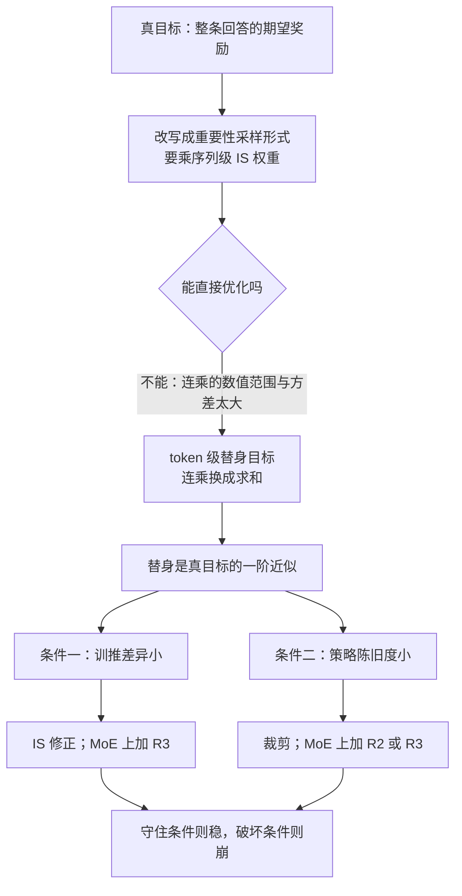
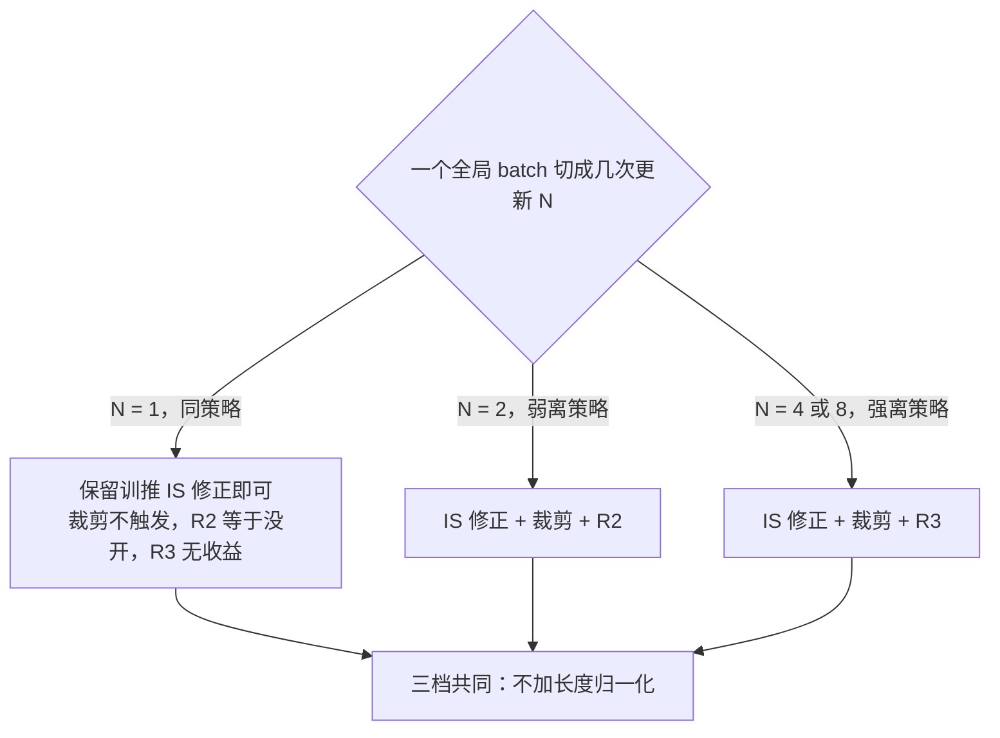

# Stabilizing RL with LLMs：奖励发给整句，梯度却打在 token 上，这件事凭什么成立

<!-- release-date: 2025-12-01 -->

> 本文依据 **Stabilizing Reinforcement Learning with LLMs: Formulation and Practices**，Qwen Team（阿里巴巴）13 位作者，通讯作者 Chujie Zheng 与 Bowen Yu；arXiv:2512.01374v3，2025-12-03 提交（封面页眉 2025-12-04），共 13 页。页码均指这份 PDF 的文件页码。文中区分三件事：**论文明确写了什么**、**我们如何解释它**、**哪些是外部资料补充**；从图上估读的数字一律注明读自哪张图。

## 一句话先说清

今天几乎所有 LLM 强化学习都有一处说不通的地方：**奖励是打给整条回答的一个分数，梯度却是逐个 token 施加的。** REINFORCE、GRPO、DAPO、CISPO 都这样做（PDF p. 1）。GSPO 那一篇甚至认为 token 级的目标本身就站不住，主张整个换成序列级（PDF p. 1 引用）。

这篇论文给出的回答是：

> token 级目标不是原目标，而是序列级目标的**一阶近似**。这个近似只在两个量都小的时候成立：训练引擎与推理引擎之间的数值差异（训推差异），以及采样策略与被优化策略之间的差距（策略陈旧度）（PDF p. 1、p. 3–4）。

接受这一点，几个原本各说各话的工程技巧就串成了一条线（PDF p. 1–2）：

- **重要性采样修正**不是可选项，它本身就是一阶近似的组成部分；
- **裁剪**的作用是把策略陈旧度压在小范围；
- MoE 上的 **Routing Replay（路由重放）** 同时从两段差距里拿掉「专家换了人」这件事，但会悄悄改写优化目标。

实验在一个 30B MoE 上花了数十万 GPU 时（PDF p. 1、p. 6），结论有三条：同策略时，带重要性采样修正的最朴素策略梯度最稳；引入离策略更新后，裁剪与 Routing Replay 缺一不可；训练一旦稳住，不同冷启动最终分数相近（PDF p. 2）。

这是一篇方法与分析论文，没有新模型、没有架构、没有预训练 recipe；它交付的是一条推导、一个叫 MiniRL 的最小算法，以及十七条 30B MoE 训练曲线。

## 读前先把几个词说成人话

这篇论文假设读者熟悉策略梯度。下面只补往下读必须的部分。

- **策略 $\pi_\theta$**：正在训练的语言模型本身。它写出整条回答 $y$ 的概率，是每个 token 概率的连乘 $\pi_\theta(y\mid x)=\prod_{t=1}^{|y|}\pi_\theta(y_t\mid x,y_{<t})$（PDF p. 2）。
- **序列级奖励 $R(x,y)$**：验证器只看完整回答，给一个标量。实验里它就是 0 或 1（PDF p. 2、p. 6）。
- **重要性采样（importance sampling，IS）**：手里的样本来自分布 B，却想估计分布 A 下的平均值，就给每个样本乘 $A/B$ 纠偏。
- **裁剪（clipping）**：新旧策略的概率比离 1 太远时，停掉这个 token 的梯度，防止一步走太远。
- **MoE（Mixture-of-Experts，混合专家）**：每个 token 只激活少数专家，由路由器决定激活谁。

全文最关键的记号约定，是把「策略」分成三份（PDF p. 2、p. 4）：

| 记号 | 含义 | 谁算出来的 |
|---|---|---|
| $\mu_{\theta_{\text{old}}}$ | 真正采样出这批回答的 rollout 策略 | **推理引擎**（如 SGLang、vLLM） |
| $\pi_{\theta_{\text{old}}}$ | 同一份旧权重，在训练引擎里重算一遍 | **训练引擎**（如 Megatron、FSDP） |
| $\pi_\theta$ | 正在被更新的目标策略 | 训练引擎 |

**$\mu$ 和 $\pi$ 的区别不在参数，而在算它们的机器。** 两个引擎之间通常有数值差异，所以论文专门用 $\mu$ 表示推理引擎里的策略（PDF p. 2–3）。

还有一个容易被扫过去的定义。论文脚注说，它说的 on-policy 指「采样策略与目标策略是同一个，**忽略训推差异**」（PDF p. 2 脚注 2）。按这个定义，「同策略」只是参数相同，采样和训练仍然跑在两台数值行为不同的机器上。后面最强的实验结果，恰好出在这个被括号带过的缝里。

论文开篇就划掉了一整条路线：它不考虑价值函数（PPO 那种给每个 token 打分的 critic），理由是作者发现「很难、甚至可能做不到」设计出通用、可扩展、能得到可靠价值模型的方法（PDF p. 2）。这是经验判断，文中没有给证据；它解释了为什么全文没有 critic、GAE 与优势的逐 token 估计。

GRPO 的组内优势见 DeepSeekMath 一篇；长思维链 RL 的四项工程改动见 DAPO 一篇；把重要性比整个抬到序列级的做法见 GSPO 一篇。

## 先看全景：一条推导，三处护栏

这张图按 PDF p. 2–5 的推导顺序重画，是逻辑示意，不含实测数据。整篇论文就是把这张图从上往下走一遍，再用实验检验最下面那句。

## 第一步：真正想优化的东西，为什么碰不得

论文从最诚实的写法开始（PDF p. 2）：

$$
\mathcal J^{\text{seq}}(\theta)=\mathbb E_{x\sim\mathcal D,\ y\sim\pi_\theta(\cdot\mid x)}\big[R(x,y)\big]
$$

意思只有一句：当前模型自己写出来的回答，平均分越高越好。没有 token，没有优势，没有裁剪。

问题在于，回答不是在训练引擎里用 $\pi_\theta$ 采的，而是在推理引擎里用旧参数采的。于是论文做一次重要性采样变换（PDF p. 2，式 1）：

$$
\mathcal J^{\text{seq}}(\theta)=\mathbb E_{x\sim\mathcal D,\ y\sim\mu_{\theta_{\text{old}}}(\cdot\mid x)}\left[\frac{\pi_\theta(y\mid x)}{\mu_{\theta_{\text{old}}}(y\mid x)}\,R(x,y)\right]
$$

中间的分式叫**序列级 IS 权重**：这条从旧模型、推理引擎里采出来的回答，在当前模型眼里有多陌生。它的梯度是（PDF p. 3，式 2）：

$$
\nabla_\theta \mathcal J^{\text{seq}}(\theta)=\mathbb E\left[\frac{\pi_\theta(y\mid x)}{\mu_{\theta_{\text{old}}}(y\mid x)}\,R(x,y)\sum_{t=1}^{|y|}\nabla_\theta\log\pi_\theta(y_t\mid x,y_{<t})\right]
$$

到这里一个近似都没做。论文的判词只有一句：序列似然的数值范围太大、方差太高，这个梯度「通常难以直接使用」（PDF p. 3）。

**我们如何解释它。** 论文的最大生成长度是 32,768（PDF p. 6）。序列级权重是 32,768 个 token 比值的连乘；只要每个比值平均偏离 1 万分之一，连乘就是 $1.0001^{32768}\approx 26.5$（我们的计算）。再偏一点就是几千倍。这个权重不是「稍微加权」，而是一个随时跳几个数量级的乘子，方差会把信号淹掉。真目标写得出来，却不能直接优化，这是后面一切妥协的起点。

## 第二步：token 级目标，是真目标的一阶近似

### 大家实际在优化的是什么

论文把关键一步写成式 3（PDF p. 3）：

$$
\mathcal J^{\text{token}}(\theta)=\mathbb E_{x\sim\mathcal D,\ y\sim\mu_{\theta_{\text{old}}}(\cdot\mid x)}\left[\sum_{t=1}^{|y|}\frac{\pi_\theta(y_t\mid x,y_{<t})}{\mu_{\theta_{\text{old}}}(y_t\mid x,y_{<t})}\,R(x,y)\right]
$$

和式 1 只差一处：**连乘换成了求和**。求导后（PDF p. 3，式 4）得到的，正是带 token 级 IS 权重的 REINFORCE。论文的贡献不是发明这个目标，而是说清它从哪来。

### 三行推导

设新策略与旧策略只差一点，令每个 token 的比值为 $1+\delta_t$，$\delta_t$ 是小量。连乘展开后丢掉 $\delta_i\delta_j$ 这类二阶及以上的项（PDF p. 3）：

$$
\frac{\pi_\theta(y\mid x)}{\mu_{\theta_{\text{old}}}(y\mid x)}=\prod_{t=1}^{|y|}(1+\delta_t)\approx 1+\sum_{t=1}^{|y|}\delta_t
$$

常数 1 的梯度为零，代回式 2，序列级梯度就约等于式 4 的 token 级梯度。论文的结论是：**当 $\pi_\theta$ 接近 $\mu_{\theta_{\text{old}}}$ 时，用式 4 更新参数，就能改进式 1 的序列级目标**（PDF p. 3）。

整条论证只用了一件事：$\prod(1+\delta_t)\approx 1+\sum\delta_t$。它把「连乘的高方差」换成「求和的可控方差」，代价是只在小量假设下成立。

### 「多小算小」：论文停在定性层面

**我们如何解释它。** 记 $S=\sum_t\delta_t$。每个 $\delta_t$ 都小时，连乘更接近 $e^S$；$e^S\approx 1+S$ 要成立，真正需要的是**和** $S$ 小，而不只是每个 $\delta_t$ 小。由此有三条论文没写、但落地时必须掂量的边界：

- **长度会放大系统性偏差。** 若 $\delta_t$ 带一个固定方向的偏置 $\bar\delta$，则 $S\approx|y|\bar\delta$ 随长度线性增长。取 $|y|=32{,}768$、$\bar\delta=10^{-4}$，$S\approx 3.3$，$e^{3.3}\approx 27$ 而 $1+S=4.3$，近似已彻底失效（我们的计算）。
- **零均值噪声温和得多。** 若 $\delta_t$ 是零均值独立噪声，$S$ 大致只按 $\sqrt{|y|}$ 增长。训推差异「有没有方向」，直接决定这套框架能撑多长的回答。论文只测了聚合的训推 KL，没有测 $\delta_t$ 的分布。
- **实验里长度本身变过。** §4.3–4.4 的生成长度是 32,768，§4.5 换成 65,536（PDF p. 6、p. 10），论文没有把长度当变量讨论。

所以论文给的是一个判断框架，没有给 $\delta$ 或 $S$ 的界，也没有说训推 KL 到多少算危险。

## 第三步：把「差距」拆成两段，这是全文最有用的一刀

条件「$\pi_\theta$ 要接近 $\mu_{\theta_{\text{old}}}$」不好操作，因为它把两件成因完全不同的事混在一起。论文插入中间量 $\pi_{\theta_{\text{old}}}$，把每个 token 的权重拆成两个因子（PDF p. 3，式 5）：

$$
\frac{\pi_\theta(y_t\mid x,y_{<t})}{\mu_{\theta_{\text{old}}}(y_t\mid x,y_{<t})}
=\underbrace{\frac{\pi_{\theta_{\text{old}}}(y_t\mid x,y_{<t})}{\mu_{\theta_{\text{old}}}(y_t\mid x,y_{<t})}}_{\text{训推差异}}
\times
\underbrace{\frac{\pi_\theta(y_t\mid x,y_{<t})}{\pi_{\theta_{\text{old}}}(y_t\mid x,y_{<t})}}_{\text{策略陈旧度}}
$$

代数上什么也没发生，语义上却把一个混合量拆成了两件事。上图把两段、以及后文每个技巧各管哪一段放在一起；下面只补图上读不出的成因。

**训推差异从哪来**（PDF p. 4）：两个引擎为了各自的峰值性能用不同的 kernel；推理侧为了吞吐常关掉批次不变（batch-invariant）kernel，同一个输入放在不同 batch 里也会得到不同结果；MoE 上还会被不一致的专家路由放大。第二条意味着训推差异连自己都不稳定，不是「校准一次就好」的固定偏移。

**策略陈旧度从哪来**（PDF p. 4）：rollout 的耗时由生成长度决定，加机器加不快；为了用更多算力换更快收敛，常把一大批回答切成 $N$ 个 mini-batch 做 $N$ 次更新，越靠后的 mini-batch 越陈旧。异步框架里一条回答还可能由多个模型版本接力生成。

| | 训推差异 | 策略陈旧度 |
|---|---|---|
| 成因 | kernel、精度、batch 布局、路由 | 调度：切几份、异步到什么程度 |
| 能不能设成 0 | 只要还在两台引擎上跑就不能 | 能，代价是放弃多次更新的加速 |
| 论文里的对策 | IS 修正、R3 | 裁剪、R2、R3 |
| 论文里的诊断指标 | 训推 KL $\mathbb D_{\text{KL}}[\mu_{\theta_{\text{old}}}\Vert\pi_{\theta_{\text{old}}}]$ | 无专门指标，它就是配置里的 $N$ |

论文的收尾一句是：要保住一阶近似，原则上应从两个方向缩小差距——降低两个引擎的数值差异，并把陈旧度控制在温和范围内（PDF p. 4）。

**可迁移启发。** 一个指标怎么调都不对时，先看它是不是两个成因的乘积。拆开之后，一个只能修正（硬件差异），一个可以配置（调度选择），对策自然分开。

## 第四步：MoE 让两段同时变坏

### 路由进入公式

MoE 每生成一个 token 都要动态选专家。把路由写进式 5 得到式 6（PDF p. 4），其中 $e^{\pi}$、$e^{\mu}$ 分别是训练引擎和推理引擎里选中的专家，下标 old 表示 rollout 那一次：

$$
\frac{\pi_\theta(y_t\mid x,y_{<t})}{\mu_{\theta_{\text{old}}}(y_t\mid x,y_{<t})}
=\underbrace{\frac{\pi_{\theta_{\text{old}}}(y_t\mid x,y_{<t},e^{\pi}_{\text{old},t})}{\mu_{\theta_{\text{old}}}(y_t\mid x,y_{<t},e^{\mu}_{\text{old},t})}}_{\text{训推差异}}
\times
\underbrace{\frac{\pi_\theta(y_t\mid x,y_{<t},e^{\pi}_{t})}{\pi_{\theta_{\text{old}}}(y_t\mid x,y_{<t},e^{\pi}_{\text{old},t})}}_{\text{策略陈旧度}}
$$

论文的判断有两条（PDF p. 4）：同样的参数和输入，两个引擎可能选出不同的专家，路由分歧又进一步放大输出差异；陈旧度不只体现在参数变了，也体现在路由变了，而换专家「会大幅改变由被激活参数定义的那个策略」。

后一条说白了：token 级比值本该是同一个模型前后两个版本之比。路由一变，分子分母就是**两个不同的子网络**算出来的，不再是「模型改了一点」，而是「换了一台秤」。同一团队在 GSPO 一篇里实测过这个量级（一次更新后约 10% 的激活专家换人）；这篇没有重测，只在公式层面重新安放它。

### R2 与 R3：修的不是同一段

Routing Replay 的想法是在策略优化时固定路由，让 MoE 能像稠密模型一样被优化（PDF p. 4）。论文把它形式化成两种（PDF p. 5）：

**Vanilla Routing Replay（R2）**，做法来自 GSPO 一篇（那边只说缓存旧策略下激活的专家，没说在哪个引擎上取）；本篇把它形式化为更新时重放**训练引擎**里 rollout 策略选中的专家 $e^{\pi}_{\text{old},t}$。陈旧度那一段的路由被对齐，训推那一段没动：

$$
\frac{\pi^{\text{R2}}_\theta(y_t\mid x,y_{<t})}{\mu_{\theta_{\text{old}}}(y_t\mid x,y_{<t})}
=\frac{\pi_\theta(y_t\mid x,y_{<t},e^{\pi}_{\text{old},t})}{\mu_{\theta_{\text{old}}}(y_t\mid x,y_{<t},e^{\mu}_{\text{old},t})}
$$

**Rollout Routing Replay（R3）**，出自 Ma 等人 2025：训练引擎里统一重放**推理引擎**在 rollout 时选中的专家 $e^{\mu}_{\text{old},t}$。两段的路由同时被对齐：

$$
\frac{\pi^{\text{R3}}_\theta(y_t\mid x,y_{<t})}{\mu_{\theta_{\text{old}}}(y_t\mid x,y_{<t})}
=\frac{\pi_\theta(y_t\mid x,y_{<t},e^{\mu}_{\text{old},t})}{\mu_{\theta_{\text{old}}}(y_t\mid x,y_{<t},e^{\mu}_{\text{old},t})}
$$

### 代价：Routing Replay 会悄悄换掉优化目标

论文没有把它说成免费午餐。原本要优化的 $\pi_\theta$，每个 token 的似然应由**自然路由**的专家 $e^{\pi}_t$ 决定；Routing Replay 把路由钉在 $e^{\pi}_{\text{old},t}$ 或 $e^{\mu}_{\text{old},t}$，得到的是另一个目标策略 $\pi^{\text{R2}}_\theta$ 或 $\pi^{\text{R3}}_\theta$（PDF p. 5）。两者偏离的方式不同，见 Table 1（PDF p. 5）：

| | 第一个 mini-batch | 之后的 mini-batch |
|---|---|---|
| R2（重放 $e^{\pi}_{\text{old},t}$） | $e^{\pi}_{\text{old},t}=e^{\pi}_t$，目标策略**不变** | 两者不同，目标策略被改写 |
| R3（重放 $e^{\mu}_{\text{old},t}$） | $e^{\mu}_{\text{old},t}\neq e^{\pi}_t$，目标策略被改写 | 同样被改写 |

论文写到「我们推测这会让 R2 与 R3 的表现随离策略程度而不同」为止，并坦白「很难断言 Routing Replay 的利弊谁大」：改路由引入了偏置，也让一阶近似更可能成立，需要实验来定（PDF p. 5）。

**我们如何解释它。** 第一个 mini-batch 里 $\theta=\theta_{\text{old}}$，R2 什么也没改，是恒等操作。于是 $N=1$ 时 R2 等于没开（论文后面正是据此说「R2 在同策略下不适用」，PDF p. 7）；切成 $N$ 份时，R2 只有第 1 份不改目标，无偏份额是 $1/N$，随离策略程度摊薄。R3 的偏置则每一份都有，换来的好处（对齐训推路由）也不随 $N$ 变。两条放一起，可以事先猜到一个交叉点：$N$ 小时 R2 划算，$N$ 大时 R3 划算。实验确实如此，见后文。

**可迁移启发。** 「让近似更成立」和「让优化目标不变」是两件事，一个修补可能只做到前一件。遇到此消彼长的两种误差，正确的产出不是一个默认值，而是一条随配置移动的交叉线。

## 第五步：MiniRL，把结论做成一个最小算法

### 为什么要自造基线

要验证「守住一阶近似就稳」，基线本身必须是一阶近似的忠实实现。论文因此不用 GRPO，而是在式 3 上只加两处最小改动，得到 **MiniRL**，并说明它是为了「在梯度上尽可能与式 3 一致」（PDF p. 5–6）。

**第一处，组内基线。** 优势取 $\widehat A(x,y)=R(x,y)-\mathbb E_{y'\sim\mu_{\theta_{\text{old}}}}[R(x,y')]$，只减均值（PDF p. 5）。附录 A 里 GRPO 与 CISPO 的优势还要再除以组内标准差（PDF p. 12），MiniRL 没有这个分母。论文没解释为什么去掉，脚注只说更好的优势估计「不在本工作范围」（PDF p. 5 脚注 3）。**我们如何解释它**：除以一个依赖本组样本的量，会改变样本间的相对权重，和论文反对长度归一化是同一类理由；但这只是推测。

**第二处，裁剪。** 用 PPO 式裁剪停掉某些 token 的梯度，「有望约束策略陈旧度」；按 decoupled PPO 的做法，用训练引擎的 $\pi_{\theta_{\text{old}}}$ 作参照来决定裁不裁（PDF p. 5）。同一脚注承认还有别的裁剪方式，比如按整条序列的似然比裁（GSPO），但「当前这个已经工作得相当不错」，于是留给未来（PDF p. 5 脚注 3）。这句没有数据支撑。

完整目标是（PDF p. 6，式 7）：

$$
\mathcal J_{\text{MiniRL}}(\theta)=\mathbb E_{x\sim\mathcal D,\ y\sim\mu_{\theta_{\text{old}}}(\cdot\mid x)}\left[\sum_{t=1}^{|y|}M_t\,\operatorname{sg}\!\left[\frac{\pi_\theta(y_t\mid x,y_{<t})}{\mu_{\theta_{\text{old}}}(y_t\mid x,y_{<t})}\right]\widehat A(x,y)\log\pi_\theta(y_t\mid x,y_{<t})\right]
$$

$\operatorname{sg}[\cdot]$ 是停梯度（对应 PyTorch 的 `detach`）。掩码 $M_t$ 在「优势为正且 $r_t>1+\varepsilon_{\text{high}}$」或「优势为负且 $r_t<1-\varepsilon_{\text{low}}$」时为 0，其余为 1，其中 $r_t=\pi_\theta(y_t)/\pi_{\theta_{\text{old}}}(y_t)$（PDF p. 6）。

### 三处设计，各有讲究

- **IS 权重被 sg 包住。** 梯度只从 $\log\pi_\theta$ 流出，权重纯粹是系数，求导后正是式 4 的形式。这个写法与 MiniMax-M1 一篇里 CISPO 的做法同源。
- **权重与裁剪用的不是同一个比值。** 权重的分母是推理引擎的 $\mu_{\theta_{\text{old}}}$，裁剪的分母是训练引擎的 $\pi_{\theta_{\text{old}}}$。回到开头那张分解图：IS 权重管整段差距，裁剪只管陈旧度那一段，不因两台机器数值不一致就把 token 裁掉。**我们认为这是全文最精巧的一处工程判断**：既然差距已拆成两个因子，两个机制就该各管一个。
- **裁剪写成掩码。** $M_t\in\{0,1\}$ 让「裁掉」的含义很直白：这个 token 的梯度整个置零。

### 与 GRPO、CISPO 的差别

附录 A 把三个目标并排写出，列了三条差别（PDF p. 12）：GRPO 与 CISPO 的原始目标不考虑训推差异；两者都用了长度归一化，§4.3 会说明它破坏一阶近似；CISPO 不裁剪任何 token 的梯度，§4.4 会说明这会导致不稳。

这只是公式层面的对照。论文**没有跑 GRPO 或 CISPO 的对比曲线**，「MiniRL 优于 GRPO」在这篇里只有间接论证：GRPO 含两个已被单独证明有害的成分。

## 实验设定：什么被固定，什么被扫

| 项目 | 设置（PDF p. 6） |
|---|---|
| 任务 | 数学推理，与标准答案比对，二元奖励 |
| 训练题集 | 4,096 道带验证答案的数学题 |
| 评测 | HMMT25、AIME25、AIME24 各 30 题，共 90 题；每题采 32 次取平均 |
| 模型 | 从 Qwen3-30B-A3B-Base 微调得到的冷启动模型 |
| 精度 | FP8 推理 + BF16 训练 |
| 框架 | 标准同步 RL：每个全局步采 $B$ 题各 $G$ 条，切成 $N$ 个 mini-batch 更新 $N$ 次 |
| mini-batch | 所有 run 固定 1,024 条（$B=64$，$G=16$） |
| 最大生成长度 | 32,768 |
| 裁剪 | $\varepsilon_{\text{high}}=0.27$，$\varepsilon_{\text{low}}=0.2$ |
| 额外技巧 | 对 token 级 IS 权重施加截断重要性采样（TIS），阈值 5 |
| 算力 | 每个梯度步约 5–6 GPU 时 |

三个设定要单独说。

**FP8 推理 + BF16 训练是故意的。** 论文说这是「对算法正确性的压力测试」：推理精度低于训练精度，训推差异很大（PDF p. 6）。好处是把问题放大到看得见；代价是结论强度和这个设定绑定。论文自己就用它解释与 R3 原论文的冲突（PDF p. 8 脚注 5）。

**mini-batch 固定，所以横轴是一根算力轴。** 每次梯度更新都消耗 1,024 条回答，所以「梯度步」在所有配置间可以直接比算力。按每步 5–6 GPU 时估，Figure 3 里那条跑到 4,000 步的 R3 曲线单条就是 2 万–2.4 万 GPU 时（我们的计算，步数读自 Figure 3）。随便一条中途崩掉，扔掉的都是这个量级。

**TIS 是一个没被讨论的变量。** **我们的判断**：截断本身就是有偏修正，被截的 token 修正强度不再等于一阶近似要求的值。论文用两节论证「不能破坏一阶近似」，实验里却给所有 run 都加了一个轻微破坏它的技巧，既没有消融，也没说阈值 5 的来源。这是全文逻辑上最松的一处接缝。

### 「稳定」怎么判

论文给「稳定训练」下了一个双层定义：性能在训练奖励和 benchmark 上都稳步提升，并且关键是模型内部状态平滑演化、没有突变；内部状态靠训推 KL 与熵监控（PDF p. 1 脚注 1）。只有外层稳，不算稳。

两个诊断指标（PDF p. 6）：

- **token 级熵**：在 rollout 采出的前缀上，模型对下一个词有多犹豫；
- **训推 KL** $\mathbb D_{\text{KL}}[\mu_{\theta_{\text{old}}}\Vert\pi_{\theta_{\text{old}}}]$：两边都是旧策略，只是一边由推理引擎算、一边由训练引擎算。它测的就是分解图里紫色那一段，和参数更新无关。

报告训推 KL 的理由是：近期工作发现 RL 崩溃常伴随训推差异急剧上升（PDF p. 6）。

## 同策略：一个不含梯度的常数权重，决定训练的生死

当全局 batch 等于 mini-batch（$N=1$），$\theta=\theta_{\text{old}}$，裁剪比值恒为 1，MiniRL 退化成带训推 IS 修正的最朴素策略梯度（PDF p. 6）。此时权重 $\pi_{\theta_{\text{old}}}/\mu_{\theta_{\text{old}}}$「只作为训推差异的修正而存在」（PDF p. 7）。

**我们如何解释它。** 这个权重的分子分母都是旧参数，完全不依赖正在优化的 $\theta$。同策略下，所谓重要性采样修正其实就是一个逐 token 的常数系数。

论文设了两个消融（PDF p. 7）：加长度归一化（目标里多乘 $1/|y|$），以及去掉训推 IS 修正（直接用 $\widehat A\log\pi_\theta$）。它们的梯度「既不等于、也不线性相关于」真目标的梯度，所以不再满足一阶近似（PDF p. 7）。三者各配一份开 R3 的版本，共六条曲线；R2 此时是恒等操作，不适用（PDF p. 7）。

图引自原文 Figure 1（PDF p. 7）。论文的四条结论（PDF p. 7–8）：

1. MiniRL，即带 IS 修正的基础策略梯度，性能和稳定性都最好。
2. 加长度归一化仍然稳，但分数次优；这符合预期，因为它让一阶近似失效、得到有偏目标。论文脚注说这与 Dr. GRPO 那篇的结论一致，「尽管动机截然不同」（PDF p. 7 脚注 4）。
3. 去掉训推 IS 修正会快速崩溃、熵骤降。这确认了 IS 权重是一阶近似的固有组成。
4. 同策略下加 R3 没有收益，尽管训推 KL 确实降了；R3 配长度归一化更差，R3 配「不做 IS 修正」仍然快速失败。论文说这经验性地确认了 §3.2 的推测：Routing Replay 会改写目标策略、引入偏置。

**读图时要带走的三个判断**（我们的解读）：

- **最强的实验事实是对比的变量之小。** 不换算法、不调超参，只是给每个 token 乘或不乘一个常数，训练就从跑满 1,200 步变成约 140 步内崩溃（步数读自 Figure 1）。
- **训练奖励几乎没有分辨力。** 六条曲线在训练奖励面板上叠在一起，崩溃那条在终止前也和别人一样。只盯训练奖励，这次崩溃看不见；崩溃信号只出现在 benchmark、熵与训推 KL 上。这正是脚注 1 那个双层定义的用处。
- **R3 做到了它承诺的事，结果却没变好。** 训推 KL 明显更低，benchmark 反而不如 MiniRL。「让近似更成立」和「让结果更好」不是同一件事，因为 R3 同时换了优化目标。论文先在 §3.2 做出预测、再在 §4.3 验证，这一环是闭合的。

## 异策略：裁剪与 Routing Replay，缺一个都不行

推理时间受生成长度限制、加机器加不快，要用更多算力换更快收敛，常见做法是引入离策略更新（PDF p. 8）。论文固定 mini-batch 为 1,024，把全局 batch 设成 2,048、4,096、8,192，对应 $N=2,4,8$；对比 MiniRL（不裁剪）、MiniRL + R2（不裁剪）、MiniRL + R2、MiniRL + R3 四种（PDF p. 8）。

图引自原文 Figure 3（PDF p. 9），是三档里最有代表性的一档。另两档见原文 Figure 2（PDF p. 8）与 Figure 4（PDF p. 9），结果收成下表。**表中数字全部读自图**，论文正文没有数值表；Figure 4 只有三条曲线，配色与 Figure 2、3 整体前移（绿色在 Figure 3 是 R2，在 Figure 4 是 R3），读原图要看图例。

| 离策略程度 | 不裁剪 | R2 不裁剪 | R2 + 裁剪 | R3 + 裁剪 |
|---|---|---|---|---|
| $N=2$（Figure 2） | 约 1,000 步崩 | 约 2,000 步崩 | **最好**，约 0.79，跑到约 2,400 步仍稳 | 稳，约 0.77，约 1,950 步停 |
| $N=4$（Figure 3） | 约 1,600 步崩 | 约 1,650 步崩 | 峰值约 0.78，约 2,850 步崩 | **最好**，峰值约 0.80，跑满 4,000 步 |
| $N=8$（Figure 4） | 未报告 | 约 1,370 步崩 | 峰值约 0.78，约 3,830 步崩 | **最好**，峰值约 0.79，跑到约 5,450 步 |

图例上每档都有一个 ★ 标在推荐方法上：Figure 1 是 MiniRL，Figure 2 是 MiniRL + R2，Figure 3、4 是 MiniRL + R3。正文没解释这个星号，但和文字结论一致。

论文的两条结论（PDF p. 8、p. 10）：

1. 一旦离策略，Routing Replay 与裁剪都成了稳定训练的必需品，缺任何一个都会提前崩溃、拉低峰值。两者都在约束策略陈旧度。
2. 离策略程度小（$N=2$）时 R2 优于 R3，大（$N=4$、$8$）时 R3 反超；高离策略下 R2 撑不住，崩溃前的峰值也略低于 R3。论文的假说是：离策略小时，R3 改写目标策略的害处压过它维持近似的好处，离策略大时反过来——措辞是 hypothesize（PDF p. 10）。

这与前面从 Table 1 推出的「R2 的无偏份额是 $1/N$」是同一件事：$N=2$ 时 R2 还有一半更新不改目标，$N=8$ 时只剩八分之一。

### 三种失稳，长得完全不一样

把三种失效的诊断指标并排放（**全部读自图**：Figure 1，PDF p. 7；Figure 2，PDF p. 8；Figure 3、4，PDF p. 9）：

| 失效模式 | 触发条件 | 训推 KL | 熵 |
|---|---|---|---|
| 缺训推 IS 修正 | 同策略就会发生 | 约 130 步冲过 $10^{-2}$ | 从约 0.32 塌到约 0.1 |
| 缺裁剪 | 一旦离策略 | $N=2$ 时约 1,000 步起抬头、越过 $10^{-2}$ | 缓慢下滑，$N=4$ 时低到约 0.23 |
| R2 撑不住 | $N=4$、$N=8$ | $N=4$ 时从约 $5\times10^{-3}$ 冲到 $10^{-1}$ 以上 | $N=4$ 时从约 0.4 暴涨到约 0.7；$N=8$ 时涨到约 0.6 |

**熵的方向是相反的。** 缺 IS 修正时熵塌下去，模型迅速变得过度确定；R2 在高离策略下失效时熵炸上来，模型开始发散。两种都叫「崩了」，监控上却是两个方向。只设「熵低于某值就报警」的规则，会让第二种一路跑到算力烧完都不触发。

**训推 KL 在三种失效里都同向上冲**，这也是论文选它做诊断指标的理由。

**可迁移启发**（我们的判断）：只能留一个监控，就留训推 KL；能留两个，第二个是熵，而且阈值要双向。

### 「0.79」是什么水平

正文的 benchmark 分是三个测试集的平均。附录 B 把它们拆开画（Figure 6–9，PDF p. 12–13）。读 Figure 7（$N=2$）里的 R2：跑到约 2,400 步时，HMMT25 约 0.64，AIME25 约 0.82，AIME24 约 0.90（读自图）。综合分里还能动的空间几乎只剩 HMMT25。

再看 Figure 8（$N=4$，读自图）：HMMT25 上 R3 峰值约 0.67、R2 约 0.63；AIME24 上反过来，R2 在约 2,400–2,700 步到过约 0.905，高于同期 R3 的约 0.885；AIME25 两者基本重合。**我们如何解释它**：正文那句「$N=4$ 时 R3 反超 R2」在三个测试集上并不一致，主要来自 HMMT25；论文只报平均，没有拆开讨论。90 道题里有 60 道接近饱和，「崩没崩」这类定性判断不受影响，「谁高 1 个点」这类比较则很脆弱。

### 落到配置上

这张图按 PDF p. 7–10 的文字结论与四张主图的 ★ 标记重画，节点是配置选择，不是实测数值。适用前提是论文的实验设定：30B MoE、数学任务、FP8 推理 + BF16 训练、同步框架。

## 冷启动：分数收敛了，行为没有

§4.5 回到稳定训练的动机：只要能靠足够长的 RL 摸到一个基座的上限，就能靠投入算力**可靠地**提升能力（PDF p. 10）。于是问：用不同冷启动数据初始化的模型，在稳定的 recipe 下最终能否到达相近的分数？

三份冷启动数据分别蒸馏自 Qwen3-Max-Thinking-Preview、DeepSeek-R1-0528 与 gpt-oss-120b（high 模式）。设定与前文不同：模型换成「一个早期实验性的小号 Qwen3Next MoE」，全局 batch 4,096、mini-batch 2,048（$B=128$，$G=16$，$N=2$），生成长度 65,536，recipe 用 MiniRL + R2（PDF p. 10）。

图引自原文 Figure 5（PDF p. 10），分测试集的版本在 Figure 10（PDF p. 13）。论文的结论是三种初始化最终分数可比，鼓励多关注 RL 本身、少纠结冷启动细节；并补一句：对照 Figure 1–4，同策略与离策略训练一旦稳住，也收敛到相近的峰值（PDF p. 10）。

这个结论的边界要一起记（我们的整理）：

- **分数收敛了，行为没有收敛。** 右图的长度从头到尾分成两档。三者考同样的分，一个用约 24,000 token、另两个用约 30,000 token（读自 Figure 5）。在意推理成本或输出风格时，「性能可比」不够用。
- **只报了 AIME25 与 AIME24**，没有报 HMMT25，而后者恰好是区分度最大的那个。
- **三个老师都是前沿推理模型。** 证明的是「换一个强老师，最后会追平」，不是「冷启动不重要」；没有弱老师、少数据或不做冷启动的对照。
- **换了模型、批量和长度，只跑了约 580 步**（读自 Figure 5），远短于前文动辄 4,000–5,000 步的 run，和 §4.3–4.4 的曲线不能直接对读。

## 与同一方向另两篇的关系

### 与 GSPO：同一团队，换了论证方向

两篇第一作者都是 Chujie Zheng，都属 Qwen Team；GSPO 是 arXiv:2507.18071，本篇是 arXiv:2512.01374，隔了四个多月。本篇多处引用 GSPO：引言里作为「直接采用序列级目标」与「动态路由让 token 级 IS 比失效」的出处（PDF p. 1），§3.2 里作为 R2 的出处（PDF p. 4–5），脚注 3 里作为另一种裁剪方式（PDF p. 5）。

注意引言的措辞：本篇**没有否认 GSPO 指出的问题**，它把「路由会让 token 级比值失效」原样承接下来，只是接着说这个失效可以被 Routing Replay 挡住，token 级目标不必放弃。

| 议题 | GSPO 一篇 | 本篇 |
|---|---|---|
| token 级重要性比 | 每个位置只有一个样本，目标是 ill-posed（病态的） | 是序列级目标的一阶近似，在两个条件下成立 |
| 应对办法 | 比值与裁剪整体换到序列级 | 保留 token 级，守住两个条件 |
| Routing Replay | 系统层补丁，增加开销、限制容量；GSPO 不需要它 | 离策略下缺了它会提前崩溃；再分 R2、R3 |
| 训推差异 | 序列似然对精度差异更宽容，「有潜力」省掉重算 | 必须显式修正，同策略下不修正就崩 |

**这是立场的调整，但不是「GSPO 被推翻」。** 本篇没有跑任何 GSPO 对比，只在脚注里说「当前裁剪策略已经工作得相当不错」。两篇对着的是同一个矛盾、同一类载体（都用 Qwen3-30B-A3B-Base 系的 MoE），给的是方向相反的答案。最实质的分歧在 Routing Replay：只读 GSPO 一篇，会得到「它是不该存在的补丁」；本篇说「在 token 级目标下它是必需品」。

两篇都没回答的问题是：**用 GSPO 的序列级目标，离策略时还需不需要 Routing Replay？** GSPO 的主实验本身就在切 4 个 mini-batch 的离策略设置下、不带 Routing Replay 跑通了，但它没有做「GSPO 加 Routing Replay」的消融；本篇也没测。

### 与 FP16-Training-Inference-Mismatch：同一个问题的另一根杠杆

FP16-Training-Inference-Mismatch 一篇把训推差异归到 BF16 的尾数太短，主张从源头把两边都换成 FP16。它在一个 1.5B 稠密模型上发现，BF16 下的 GSPO 同样会中途掉头，在 verl 上梯度还在约 1,200 步后变成 NaN。两篇的交集很清楚：**不修训推差异，BF16 或更低精度的 RL 迟早崩**。

分工也清楚。本篇把训推差异当成必须接受的事实，在目标函数里显式修正（外加 MoE 路由重放）；FP16 那一篇试图把这一段直接压小。本篇的实验恰好是 FP8 推理 + BF16 训练，精度比 FP16 那篇的对照组更低，两篇的结论可以叠在一起读：精度能压小紫色那一段，本篇的框架告诉你压完之后剩下的还要谁来管。

## 限制与没有公开的部分

- **覆盖窄。** 一个任务族（数学）、一种奖励（二元）、一个训练题集（4,096 题）、一个评测集（90 题）；主实验只有一个 30B MoE 冷启动模型，§4.5 换成另一个未具名的小号 MoE。一阶近似框架本身与 MoE 无关，但**没有稠密模型的实验**。
- **没有数值表。** 十张图，唯一的 Table 1 讲的是 R2 与 R3 的语义差别，不含数字。所有性能比较只能读图；没有报告随机种子数或重复次数。
- **超参没有扫。** $\varepsilon_{\text{high}}=0.27$、$\varepsilon_{\text{low}}=0.2$ 直接给出，没说来源、没做敏感性分析；这组值与 GSPO 一篇里 GRPO 基线用的 0.2 / 0.27 相同。上下界解耦出自 DAPO（0.2 / 0.28），本篇参考文献里没有 DAPO。TIS 阈值 5 没扫；学习率、优化器等未写。
- **Routing Replay 的工程代价没有量化。** 缓存路由要多少显存、在两个引擎之间搬路由要多少通信，全文没讨论；GSPO 一篇提过它有额外开销，本篇没接这一条。
- **实现细节留白。** $\pi_{\theta_{\text{old}}}$ 意味着训练引擎要对采样结果重算一遍旧概率，论文没描述这一步及其开销；引擎只在举例时提到 Megatron、FSDP 与 SGLang、vLLM（PDF p. 2），没说实际用了哪套。没有开源代码。
- **理论停在原理性论证。** 没有误差界、没有收敛分析、没有「多小算小」的定量刻画；R2 与 R3 交叉的机理只有三个 $N$ 值的观测，论文自称 hypothesize。
- **与 R3 原论文的冲突只给了猜测。** 「同策略下 R3 无收益」与 Ma 等人相反，论文给的两个可能原因是对方最多只跑了 180 个全局步、以及对方用 BF16 推理压力不够（PDF p. 8 脚注 5）；没有在 BF16 推理下重跑来区分这两个原因。

## 可以带回自己项目的原则

1. **先问「我实际优化的，和我想优化的，差在哪一步近似上」。** 替身目标用久了会被当成目标本身。把那一步近似显式写出来，「什么时候失效」才有答案。奖励模型、离线评估指标都能问同一句。
2. **把混合量拆成因子，往往比直接优化它更有用。** 式 5 只是同乘同除一个数，却把「模型偏移」拆成了「硬件差异」和「调度选择」。
3. **不含梯度的修正项，不等于不重要。** 同策略下训推 IS 权重是个常数，删掉它训练在约 140 步内就崩。任何形如「重新加权」的操作都值得单独做一次消融。
4. **两个问题配两个机制，不要让一个旋钮管两件事。** MiniRL 的 IS 权重用推理引擎作分母，裁剪用训练引擎作分母，各管一段。
5. **监控要覆盖相反方向的失败。** 熵塌和熵炸都是崩溃；训练奖励可以在内部状态已经出问题之后还看起来正常。
6. **承认权衡，比宣布胜利更有说服力。** Routing Replay 的利弊随 $N$ 交叉，正确产出是一条交叉线，不是一个默认值。

## 关键词回看

- **序列级奖励**：只对完整回答给一个标量；本篇里是 0 或 1。
- **token 级替身目标**：把序列级 IS 权重的连乘换成 token 级权重的求和；就是带 IS 权重的 REINFORCE。
- **一阶近似**：$\prod_t(1+\delta_t)\approx 1+\sum_t\delta_t$；替身与真目标之间只隔这一步。
- **训推差异**：同一份权重、同一个输入，训练引擎与推理引擎算出的概率不同；成因有 kernel、批次不变性与 MoE 路由。
- **策略陈旧度**：采样策略与被更新策略之间的差距；切 mini-batch 与异步都会产生。
- **训推 KL**：$\mathbb D_{\text{KL}}[\mu_{\theta_{\text{old}}}\Vert\pi_{\theta_{\text{old}}}]$，两边都是旧策略、由不同引擎计算，专门监控训推差异。
- **MiniRL**：带 IS 权重的 REINFORCE，加组内均值基线与 decoupled PPO 式掩码裁剪。
- **decoupled PPO 裁剪**：用训练引擎的 $\pi_{\theta_{\text{old}}}$ 而不是推理引擎的 $\mu_{\theta_{\text{old}}}$ 作裁剪参照，让裁剪只管陈旧度。
- **R2（Vanilla Routing Replay）**：重放训练引擎里旧策略选中的专家；第一个 mini-batch 不改目标策略。
- **R3（Rollout Routing Replay）**：重放推理引擎 rollout 时选中的专家；两段一起压，每个 mini-batch 都改目标策略。
- **离策略程度 $N$**：全局 batch 与 mini-batch 之比，即一批数据做几次更新。
- **TIS**：截断重要性采样，本篇给 token 级权重设上限 5。
- **长度归一化**：目标里乘 $1/|y|$；逐样本不同的系数改变了样本间的相对权重，一阶近似失效。

## 最后的判断

这篇论文的技术含量不在算法上。MiniRL 是刻意做小的：REINFORCE 加组内均值基线，加一个掩码裁剪。

它的贡献是**换了一个提问方式**。「token 级还是序列级」的争论，此前大多停在「哪个更合理」的直觉层面；这篇把问题改写成「token 级目标是一阶近似，这个近似什么时候成立」。一旦这么问，IS 修正、裁剪、Routing Replay 就是同一个条件的三个守护者。

框架的价值在于它提前说出了两件反直觉的事：§3.2 先论证 Routing Replay 会给目标引入偏置（PDF p. 5），§4.3 就观察到 R3 降低了训推差异、分数却没涨（PDF p. 8）；Table 1 先指出 R2 只在第一个 mini-batch 不改目标，实验里 R2 与 R3 的优劣就在 $N=2$ 与 $N=4$ 之间换了方向。公道地说，方向为什么是那样，是事后才用 hypothesize 补上的。

证据要分档看：

- **确定的**：一阶近似的代数推导；长度归一化破坏它与真目标的线性关系；R2 与 R3 改写目标策略的方式不同。
- **有实验支持但覆盖窄的**：同策略下去掉训推 IS 修正会快速崩溃；离策略下缺裁剪或缺 Routing Replay 都会提前崩溃；R2 与 R3 的优劣随 $N$ 交叉。都只在一个 30B MoE、一个数学任务、一种 FP8/BF16 组合上单次测过。
- **只是推测或断言的**：R2 与 R3 交叉的机理；「冷启动最终不重要」；与 R3 原论文冲突的两个原因；「当前裁剪策略已经工作得相当不错」。

如果只记一句：

> **你以为在优化那个目标，其实在优化它的一阶近似。让训练稳定，就是不断确认「近似」两个字还站得住。**

## 资料与阅读边界

**版本与首发日。** arXiv 上最新版本是 v3（2025-12-03），即开头所依据的版本；v1 提交于 2025-12-01（[arXiv:2512.01374](https://arxiv.org/abs/2512.01374)）。这篇讲的是一项方法，没有对外可用的模型，按技术首次官方公开日取 v1 的 2025-12-01；未找到更早的官方仓库或博客。封面页眉的 2025-12-04 是 PDF 生成日，不参与首发日判定。

**覆盖了原文哪些部分。** 摘要与脚注 1–2；第 1 节引言与两条贡献；第 2 节记号、式 1–5 与两个条件；第 3 节式 6、R2 与 R3 的定义、Table 1；第 4.1 节 MiniRL 与式 7、脚注 3；第 4.2 节实验设定与两个诊断指标；第 4.3 节两个消融变体、Figure 1、脚注 4–5；第 4.4 节 Figure 2–4 与 R2/R3 交叉；第 4.5 节 Figure 5；第 5 节结论；附录 A 与 GRPO、CISPO 的对照；附录 B Figure 6–10。

**论文自己的引用来源（不是外部补充，链接供追读）。**

- Routing Replay（R2）与序列级裁剪：[Group Sequence Policy Optimization](https://arxiv.org/abs/2507.18071)，见 GSPO 一篇。
- R3：[Stabilizing MoE Reinforcement Learning by Aligning Training and Inference Routers](https://arxiv.org/abs/2510.11370)。
- TIS 与「高效 RL 框架其实在做离策略训练」：[Your Efficient RL Framework Secretly Brings You Off-Policy RL Training](https://fengyao.notion.site/off-policy-rl)。
- decoupled PPO：[Batch Size-Invariance for Policy Optimization](https://openreview.net/forum?id=lXuZaxEaI7)。
- 批次不变 kernel 与推理不确定性：[Defeating Nondeterminism in LLM Inference](https://thinkingmachines.ai/blog/defeating-nondeterminism-in-llm-inference/)。
- 长度归一化的另一条论证：[Understanding R1-Zero-Like Training: A Critical Perspective](https://arxiv.org/abs/2503.20783)。
- 训推失配导致崩溃：[When Speed Kills Stability](https://richardli.xyz/rl-collapse)。
- CISPO 见 MiniMax-M1 一篇；实验载体 Qwen3-30B-A3B-Base 见 Qwen3 一篇。

**外部补充。** 两篇作者与编号的对照（GSPO 与本篇同一第一作者）来自两篇的 arXiv 页面；与 FP16-Training-Inference-Mismatch、GSPO 两篇的对照是库内交叉阅读，不是本篇内容。

**原文没有公开的缺口。** 所有曲线的数值表与随机种子数；学习率、优化器与 TIS 阈值的来源；训练与推理实际用的引擎；Routing Replay 的显存与通信开销；§4.5 那个小号 Qwen3Next MoE 的规格；代码。
