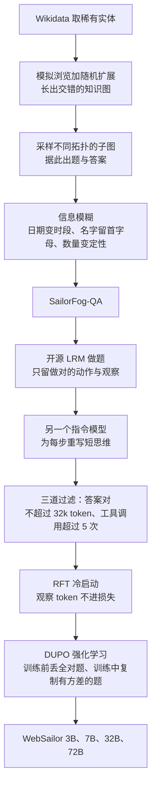

# WebSailor：开源 web agent 在 BrowseComp 上近乎零分，缺的不是搜索框，是从没练过「难降的不确定性」

<!-- release-date: 2025-07-03 -->

> 本文依据本地 `papers/Alibaba/WebSailor.pdf`，即 **WebSailor: Navigating Super-human Reasoning for Web Agent**，arXiv:2507.02592v1、2025-07-03 提交，共 23 页。页码均指 PDF 自身的页码。作者来自阿里巴巴通义实验室（Tongyi Lab），Kuan Li、Zhongwang Zhang、Huifeng Yin 为项目负责人（PDF p. 1）。文中会区分三件事：**论文明确写了什么**、**我们怎么解释它**、**哪些是外部资料或本文推算**。

## 读前先把几个词说成人话

这是一篇 web agent 的后训练方法论文。基座是现成的 Qwen-2.5（3B、7B、32B、72B），没有改模型结构（PDF p. 7）。先把会反复出现的词说清楚：

- **信息检索 agent（information-seeking agent）**：模型一边想、一边调搜索引擎和网页，最后交一个答案。本篇的工具只有两个：搜索和访问网页。
- **ReAct（Reasoning and Acting）**：每一轮先写一段思维（Thought），再发一个可解析的动作（Action，即工具调用），然后等环境返回观察（Observation）（PDF p. 3）。
- **BrowseComp**：OpenAI 提出的浏览基准，题目的答案藏得深、条件缠在一起；BrowseComp-zh 是中文版（PDF p. 7–8）。
- **不确定性（uncertainty）**：本篇的核心视角。一道题一开始有多少种可能、要花多大力气才能把可能性收窄到一个答案。
- **LRM（Large Reasoning Model，大推理模型）**：QwQ、DeepSeek-R1 这类会写长思维链的模型。
- **拒绝采样微调（Rejection sampling Fine-Tuning，RFT）**：让强模型做题，只留下做对的轨迹，再拿它们做监督微调。本篇用它当 RL 之前的 **冷启动（cold start）**。
- **GRPO（组相对策略优化）** 与 **DAPO**：前者对同一道题采一组回答、按组内相对好坏算优势，出处见 DeepSeekMath 一篇；后者在其上加了动态采样、token 级损失与更高的裁剪上界，见 DAPO 一篇。本篇的 **DUPO（Duplicating Sampling Policy Optimization，复制采样策略优化）** 改的正是 DAPO 的动态采样。

## 一句话先说清

2025 年年中，闭源的浏览系统（如 OpenAI DeepResearch）在 BrowseComp 上已经能拿到几十分，开源模型和开源 web agent 却接近零分（PDF p. 2）。封面 Figure 1 把这个差距画成两组柱（PDF p. 1），改写成表：

| 系统 | BrowseComp-en | BrowseComp-zh |
|---|---:|---:|
| WebSailor-72B | 12.0 | 30.1 |
| WebSailor-32B | 10.5 | 25.5 |
| DeepSeek-R1-Browse | 9.5 | — |
| Doubao-Search（闭源产品） | — | 26.0 |
| WebDancer-QwQ | 3.8 | 18.0 |
| WebThinker-QwQ | 2.8 | 14.7 |
| Grok-3（闭源产品） | — | 12.9 |
| DeepSeek-R1（不带工具） | 2.0 | — |
| GPT-4o 带浏览 | 1.9 | — |
| Search-o1-32B | 0.6 | 7.2 |

图注写明：DeepSeek-R1-Browse 是 DeepSeek-R1 套上与 WebSailor 完全相同的 ReAct 浏览实现；GPT-4o 带浏览的数字取自 OpenAI 官方发布（PDF p. 1）。

作者的假说只有一句，是全文的脊梁（PDF p. 1）：

> 闭源系统成功的关键，是开源模型里缺的一种推理模式：**在广阔的信息图景里系统性地降低极端不确定性。**

开源训练数据几乎只有两类题：要么一搜就中，要么多跳但路线清楚。模型从没见过「一开始就很糊、而且没有预设路线」的题，自然学不会这种推理（PDF p. 2）。WebSailor 于是做了一条完整的后训练流水线：造高不确定性的题、改写专家轨迹的思维、少量 RFT 冷启动、再用 DUPO 做 agent 强化学习（PDF p. 1–3）。

要一起记住的三句话：WebSailor 在 Table 1 的开源行里是新的第一；BrowseComp-zh 上 72B 与闭源的 Doubao 同一档；BrowseComp-en 上 12.0 对 DeepResearch 的 51.5，差距仍是四倍多（PDF p. 9–10）。摘要里的「matching proprietary agents」要连着这三句读。

### 一条阅读路线

1. **p. 3–4 的 Figure 2**：三级任务，先分清什么叫「难降的不确定性」。
2. **p. 4–5 的第 3.1 节与附录 A.2**：SailorFog-QA 怎么造。
3. **p. 5–6 的第 3.2 节**：为什么要丢掉专家的原生思维。
4. **p. 6–7 的第 4 节**：RFT 冷启动的三道过滤，以及 DUPO 的两处改动。
5. **p. 9 的 Table 1**：主结果。
6. **p. 10–12 的 Figure 3–6、Table 2**：数据难度、简单题兼容、RL 增益、冷启动的必要性。
7. **p. 12 的第 5.4 节**：32k 截断、想太多、RL 只跑 50 步。

## 主要矛盾：开源一直在 Level 1 和 Level 2 里训练

原图引自 PDF p. 4 的 Figure 2。论文按两个维度给信息检索题分级：初始不确定性有多高，以及把它降下来有多难（PDF p. 3–4）。

| 级别 | 不确定性 | 怎么降 | 论文给的例子 |
|---|---|---|---|
| Level 1 | 低，而且容易降 | 靠模型内部知识，或一次直接的搜索 | 2004 年谁获得了 Richard Dawkins 奖 |
| Level 2 | 初始可以很高，但路线清楚 | 实体之间逻辑明确，按固定步骤多跳 | 阿里现任 CEO 的母校出的第一位中科院院士是谁 |
| Level 3 | 又高又难降 | 实体以复杂、涌现的方式耦合，没有预定义路线，要创造性探索 | 本篇要造的题 |

Level 2 看起来已经难，但它仍有一条「按图索骥」的路。BrowseComp 不是这种题：它把 agent 丢进没有结构的信息空间，蛮力搜索可能要上千次工具调用，任何现代 LLM 的上下文都装不下。成功靠的是自适应策略——综合半成品信息、剪掉没希望的分支、把分散的事实收敛到一个解；把组合爆炸压成几十步，需要一条真正的思维链（PDF p. 3）。

这就是作者口中「超人类推理模式」在操作上的意思：**不是智力测验，而是在组合空间里做战略导航与综合。**

**我们如何解释它。** 附录 A.5 的 BrowseComp-en 案例正是 Level 3：题目只说「一位 2010–2023 年间声称设计了太阳能冰箱、住在『地图上的一个洞』里、记得爱丁堡的开发者大会、喜欢探洞的软件开发者」，问他 1980 年代和父亲合买的第一台电脑的型号（PDF p. 15）。出发点本身就是糊的：先得用几条彼此独立的线索交叉定位这个人（Joey Hess），再去他的博客找那台电脑（Atari 130XE）。WebSailor 用了 10 步（PDF p. 15–19）。只见过 Level 1、2 的模型会学成「按槽位填搜索词」，学不会「先判断自己还缺哪一块不确定性」。

## 先看全景：造糊题、借手脚、立骨架、再强化

按 PDF p. 3–7 的第 3、4 节与附录 A.2 重画，是流程示意，不是时间轴；论文没有另画端到端的系统图。

四段各堵一个口子：**题太清楚，模型只会走直线；思维太长太有风格，学生学不会自己探；奖励太稀，直接 RL 起不来；agent 的 rollout 太慢，普通动态采样会把训练拖垮。**

### 环境：只有搜索和访问两个工具

论文把实验环境叫 WebTraverseX，动作空间是「交最终答案」加两个工具（PDF p. 3、p. 14）：

- **search**：走 Google 搜索，一次可带多条查询，每条返回前 10 个结果的标题、摘要和 URL；
- **visit**：一次可带多个网页，每个网页配一个自己的访问目标（goal）。先用 Jina 拉取全文，再由 Qwen-2.5-72B 按 goal 摘要。

一条 $T$ 轮轨迹写成（PDF p. 3，式 1）：

$$
H_T=(\tau_0,a_0,o_0,\ldots,\tau_i,a_i,o_i,\ldots,\tau_T,a_T)
$$

$\tau_i$、$a_i$、$o_i$ 分别是第 $i$ 轮的思维、动作、观察；最后一轮是交答案，所以没有 $o_T$。第 $t$ 步的思维和动作由策略根据此前全部上下文采出。ReAct 用 Qwen-Agent 实现，工具调用上限 30 次（PDF p. 14）。

工具集刻意很小。难的不是再加一个「点击按钮」，而是在只有搜索和阅读的条件下，学会自己决定下一步去降哪一块不确定性。

## 核心设计一：SailorFog-QA，用图结构把题造糊

### 旧问题

Level 3 很难手写。实体关系一写清楚，题就退化成 Level 2。论文要的是事先说不清路线、从结构里涌现出来的题（PDF p. 4）。

### 新设计：先长图，再采子图，再模糊

**第一步，为「难降的不确定性」铺结构**（PDF p. 4、p. 14）：

1. 用 Wikidata 的 SPARQL 服务按一定规则取出稀有实体，保证起点就不好搜；
2. 用 search 与 visit 拿到这个实体的特征，把它设为扩展节点；
3. 按扩展节点的特征找相关实体，再拿它们的特征；
4. 以一定概率，要么把新实体设为下一个扩展节点，要么回到之前的某个节点；
5. 重复 3、4，直到图的边数达到预设值。

第 4 步的随机性是关键：它避免长成 Level 2 那种直线链，而是长成稠密、交叉、路径重叠的图。

**第二步，采子图再做信息模糊**（PDF p. 5）。从图上采出不同拓扑的子图，每个子图是一簇耦合在一起的实体和关系，据此出题与答案。然后故意把题面里的事实弄糊：

- 精确日期变成模糊时段，如「in the early 2010s」；
- 名字部分遮住，如「an institution founded by someone with the initial 'F'」；
- 数量属性变成定性描述，如「a market share of less than 1%」。

模糊直接抬高**初始**不确定性，逼 agent 去比较和综合，而不是查表。论文列的三条好处是：扎根于真实互联网；不同子图拓扑自然产出多步推演、组合、比较等一整谱推理；可能的子图数随图变大非线性增长，便于大规模合成（PDF p. 5）。

正文给的两道样题，一道把「五世纪中叶去世的晚期古代作者」和「一份重建环境条件的科学年表的最后一年」缠在一起，答案是 Estimated Tree-Ring Chronology: 300-450 A.D.；另一道把南美首都、歌词作者获得的地方荣誉、哥伦比亚西部的艺术院校缠在一起（PDF p. 5）。作者写：人工评估确认，这类题在通常的时间约束下（例如两小时内）人类研究者做不出来（PDF p. 5）。评估的样本量与参与者，论文没写。

**我们如何解释它。** 这是全文里最接近「超人类」的可操作定义：不是模型分数超过人类平均，而是这些合成题两小时内人手做不完。

### 难度证据：工具调用次数的分布

原图引自 PDF p. 10 的 Figure 3，紫色是 SailorFog-QA，绿色是对照集，深绿是两者重叠。统计对象是拒绝采样后、最终过滤前、答案正确的专家轨迹，用工具调用次数当难度代理（PDF p. 10）。

论文的读法：WebDancer 训练集严重偏简单，超过 50% 的轨迹只要 2 次工具调用，几乎没有超过 10 次的；SailorFog-QA 是长尾，相当一部分超过 5 次，能拉到 20 次以上，分布「closely mirrors」BrowseComp-en（PDF p. 10）。

**我们读图的补充。** 左图里 SailorFog-QA 的峰在 2–6 次（约 0.08–0.10），BrowseComp-en 在 11–14 次和 18 次以上的柱明显更高。说它比 WebDancer 更像 BrowseComp-en 是成立的；说两者分布几乎重合则偏乐观。图上的 2–5 次样本会被后面「超过 5 次调用」的过滤拿掉，最终训练集会往右移。横轴止于 30，与推理时 30 次的调用上限一致。

Table 2 是过滤前的 pass@1，教师模型带浏览工具、走 ReAct（PDF p. 10）：

| 模型 | SailorFog-QA | WebDancer-QA | BrowseComp-en |
|---|---:|---:|---:|
| o4-mini | 47.3 | 90.2 | 26.3 |
| DeepSeek-R1 | 38.9 | 84.4 | 9.5 |

合成题比 WebDancer 训练集难得多，但仍比 BrowseComp-en 容易；论文提醒 BrowseComp-en 本身滤掉了简单题。有些合成题难到 o3 也要多达 40 次工具调用才能解（PDF p. 2）。

### 代价与边界

作者承认，准确率低不全是因为难，也因为答案不一定唯一：模糊之后，几条条件的交集可能不止一个解，这一点和 BrowseComp-en 类似。他们能保证的是**答案总满足题面的约束**，而不是「全网只有这一个解」（PDF p. 10–11）。图的规模、边数阈值、每张图出多少题、最终题量，论文都没有公开。

### 可迁移启发

想训难检索 agent，先看训练集的工具调用分布像不像目标基准。一半样本两步就结束，RL 再巧也只是在 Level 2 里打转。模糊比「再加两跳」更狠：它破坏的是可直接当关键词搜的表面槽位，逼模型改用交叉验证。代价是答案唯一性变差，金标准只能是「满足约束」。

## 核心设计二：专家轨迹只借手脚，不借文风

### 旧问题

有了难题，还要有监督轨迹。QwQ-32B、DeepSeek-R1 这类开源 LRM 能做对一部分，但直接拿它们的全文微调有两个坑（PDF p. 5）：

- **风格污染（Stylistic Contamination）**：这些模型的思维冗长、风格强烈。照着学会把学生的探索策略规定死，泛化变差；
- **上下文过载（Context Overload）**：几十次工具调用再叠上冗长思维，历史很快超出上下文，性能下降、推理也难以读懂。

### 新设计：丢掉原生思维，按动作重写短思维

流程是（PDF p. 6）：

1. 让专家 LRM 生成完整解题轨迹，包括它自己的思维；
2. 丢掉原生思维，只留成功的动作与观察序列 $(a_0,o_0,a_1,o_1,\ldots)$——这是解法的「做了什么、怎么做」，没有「为什么」；
3. 对每一步，另找一个强指令模型 $\pi^*$，根据之前的历史、专家选的动作和随后的观察，生成一段简洁、合乎逻辑的理由：

$$
\hat{\tau}_t\sim\pi^*(\tau\mid H_{t-1},a_t,o_t)
$$

逐步重写后得到完整的新轨迹。重写时强制「short-CoT（短思维链）」风格，保证长程任务里整条推理足够紧凑（PDF p. 6）。

### 我们怎么理解这一刀

它把「路」和「解说词」拆开：路来自能做对题的专家，解说词来自另一个被要求写短的模型。

注意式 (2) 的条件里有 $o_t$，即**写这一步的理由时已经看到了这一步的结果**。学生学到的是「事后也说得圆」的短理由，不一定是行动前只看得见 $H_{t-1}$ 时会想的话。论文没有讨论这层事后信息；若学生在 RL 里必须先想后看，冷启动学到的说法可能偏乐观。这是我们的解释，不是论文的声明。

### 可迁移启发

长程工具轨迹里，教师的思维往往是最贵、最脏的部分。可以只克隆成功的工具序列，再单独写短理由。学生上下文只有 32k、而教师动辄写满窗口时，这一刀比换一个更强的教师更该先做。想要更干净的因果监督，可以把条件改成只看 $H_{t-1}$ 和 $a_t$——这是本篇没做的变体。

## 核心设计三：RFT 冷启动，不是可选项

### 旧问题

当时有一批工作主张跳过 SFT、直接 RL（PDF p. 2）。作者认为在这类任务上不行，理由两条：奖励极其稀疏，一开始几乎全是零反馈；而他们并不重度依赖蒸馏，**刚超过 2k 条**高质量样本的最小冷启动就够用（PDF p. 2–3）。

冷启动的目的不是「蒸馏得越像越好」，而是先让模型掌握工具使用、守住长程推理的骨架（PDF p. 6）。

### 新设计：三道过滤，观察不进损失

轨迹用特殊标记分段：思维在 `<think>` 里，动作在 `<tool_call>` 或 `<answer>` 里，工具返回在 `<tool_response>` 里（PDF p. 6）。对专家轨迹做三道过滤（PDF p. 6）：

1. **只留答案正确的**，保证监督信号对；
2. **丢掉超过 32k token 的**，因为专家的长上下文能力强于学生；
3. **只留工具调用超过 5 次的**，因为复杂推理和规划通常出现在更长的决策序列里。

训练目标只强化思维和动作，观察对应的 token 从损失里 mask 掉（PDF p. 6）。SFT 用 Megatron，batch 32，学习率 $5\times 10^{-6}$、下限 $1\times 10^{-10}$，预热加余弦衰减，权重衰减 0.1（PDF p. 15）。

### 没有冷启动会怎样

原图引自 PDF p. 12 的 Figure 6。三幅图都有断轴，读的时候先看纵轴刻度。按我们读图的约值：

| | 冷启动后 RL | 直接 RL |
|---|---|---|
| BrowseComp-en Pass@1（第 12 步 → 第 28 步） | 约 8.5 → 10.4 | 约 2.3 → 4.0 |
| GAIA Pass@1（第 16 步 → 第 32 步） | 约 50.7 → 53.2 | 约 35.0 → 40.8 |
| 每条轨迹的工具调用次数 | 全程约 6.6–7.4 | 约 0.1 → 3.2 |

论文的读法（PDF p. 12）：直接 RL 的 Pass@1 涨幅更大，但冷启动模型收敛后的水平显著更好；冷启动模型的工具调用次数高而稳，直接 RL 虽然一直在涨，始终低一截，说明它没学会长程推理；这个差距在 BrowseComp-en 上比 GAIA 更宽。作者的结论是：没有 RFT 冷启动，模型很难只靠自我探索摸出通常只存在于强 LRM 里的复杂推理模式。

### 可迁移启发

「跳过 SFT」在数学短答题上也许成立，因为对错信号密、一步就能验。几十步才见分的多轮工具任务，冷启动先解决的是格式与骨架。刚过 2k 条、超过 5 次调用、短于学生上下文，这三条过滤本身就可以当一条数据门禁。

## 核心设计四：DUPO，用复制代替再采一轮

### 旧问题

agent RL 和普通推理 RL 的最大差别，是 rollout 要多轮地和环境交互、等工具返回，所以慢得多（PDF p. 7）。DAPO 的动态采样会丢掉整组全对或全错的题，再用新题把 batch 填满。这对数据筛选有效，但同一个 batch 里可能要对不同题做**串行**的额外 rollout，把本来就慢的 agent 训练再拖慢一截（PDF p. 7）。

### 新设计：训练前丢全对，训练中复制有方差的

按 PDF p. 7 的文字画的讲解图，题号与对错数是示意，不是论文数据。DUPO 在两个时点做动态采样（PDF p. 7）：

1. **训练前**：先把过于简单的题（8 条 rollout 全对）移出训练集；
2. **训练中**：标准差为 0 的题（组内全对或全错）被拿掉，空出来的槽位不用 padding，也不再采新题，而是随机复制本 batch 里标准差不为 0 的题。

作者说，相对 DAPO 的动态采样，这样大约快 **2–3 倍**（PDF p. 7）。论文没有给墙钟时间表或测量条件。

### 目标函数：沿用 GRPO 与 DAPO

优势按 GRPO 的组内相对方式估计（原文写作 GPRO，引用的是 Shao et al., 2024）；再用 DAPO 的 token 级策略梯度损失与更高的裁剪上界（PDF p. 7）。目标函数是（PDF p. 7，式 3）：

$$
J(\theta)=\mathbb{E}\left[\frac{1}{\sum_{i=1}^{G}|o_i|}\sum_{i=1}^{G}\sum_{t=1}^{|o_i|}\min\Bigl(r_{i,t}(\theta)\hat{A}_{i,t},\ \mathrm{clip}\bigl(r_{i,t}(\theta),1-\varepsilon_{\mathrm{low}},1+\varepsilon_{\mathrm{high}}\bigr)\hat{A}_{i,t}\Bigr)\right]
$$

约束是 $0<|\{o_i \mid \mathrm{is\_equivalent}(y,o_i)\}|<G$：一组 $G$ 条里既不能全对，也不能全错。$(q,y)$ 是题和答案。重要性比和优势是（PDF p. 7，式 4）：

$$
r_{i,t}(\theta)=\frac{\pi_\theta(o_{i,t}\mid \mathrm{context})}{\pi_{\theta_{\mathrm{old}}}(o_{i,t}\mid \mathrm{context})},\qquad
\hat{A}_{i,t}=\frac{R_i-\mathrm{mean}(\{R_i\}_{i=1}^{G})}{\mathrm{std}(\{R_i\}_{i=1}^{G})}
$$

两处要读清：$o_i$ 只是模型生成的 token，不是整条轨迹；context 同时包含模型生成与工具返回，观察同样不进策略损失（PDF p. 7）。$\varepsilon_{\mathrm{low}}$、$\varepsilon_{\mathrm{high}}$ 的取值论文没给。

奖励为防奖励黑客做成规则分（PDF p. 7，式 5）：

$$
R_i=0.1\,R_i^{\mathrm{format}}+0.9\,R_i^{\mathrm{answer}}
$$

格式分检查各段是否用对标签、顺序是否符合 ReAct；答案分由 LLM 当裁判判断最终答案对不对。裁判是哪个模型，论文没写。

RL 超参（PDF p. 15）：框架 verl，每组 8 条，温度 1.0，top-p 1.0，batch 128，mini-batch 32，学习率 $1\times 10^{-6}$。RL 只跑了 50 步，原因在限制一节。

### 我们怎么理解「复制」

DAPO 要的是「batch 里每道题都有学习信号」，缺了就去环境里要新题；DUPO 要的是「GPU 别空等」，缺了就用已经跑完、还有对有错的题再算一遍。它没有改优势怎么估，也没有改裁剪的含义，首先是一条**系统效率**改动。

代价论文没写，下面是我们的解释：

- 被复制的题在这一步的梯度里权重翻倍。中等难度、恰好组内有对有错的题，会比极难题更常被看见；
- 训练前只丢全对题，全错的极难题留在训练集里，但在训练中一旦整组全错就被拿掉，仍然很少进入更新；
- 奖励里有 0.1 的格式分，全错的一组若格式分不同，奖励标准差并不为 0。论文把「标准差为 0」等同于「答案全对或全错」，按式 (3) 的约束读，判据应是答案。

### 可迁移启发

多轮工具 RL 的瓶颈常在「等环境」，不在「算梯度」。若已经在用 DAPO 的动态采样，先看填 batch 的额外 rollout 是不是把卡空出一大截。用本 batch 复制换时间，是可以直接插进 verl 流水线的开关，不必把它当成一种新的优势估计。

## 实验怎么证明

### 评什么、怎么评

四个主基准（PDF p. 7–8）：BrowseComp-en、BrowseComp-zh、GAIA（只用文本验证集里的 103 条）、Xbench-DeepSearch。另在分析里从 SimpleQA 的 4,326 条中随机抽 200 条，看简单题会不会被训坏（PDF p. 11）。

默认报 pass@1，温度 0.6、top-p 0.95，对错由 LLM 裁判判定；pass@k（k > 1）是重复生成 k 次（PDF p. 8）。基线分三类：直接推理、闭源浏览产品、开源 agent。闭源产品标 ‡，表示通过网页人工评测，部分数字取自对应基准论文；空格是成本原因没测（PDF p. 9）。更小的模型没放进直接推理组，因为它们在 BrowseComp 上基本是零分（PDF p. 8）。

### Table 1：主结果

| 模型 | 范式 | BrowseComp-en | BrowseComp-zh | Xbench-DeepSearch | GAIA |
|---|---|---:|---:|---:|---:|
| Qwen-2.5-72B | 直接推理 | 0.6 | 7.0 | 12.7 | 14.6 |
| GPT-4.1 | 直接推理 | 1.5 | 14.4 | 17.0 | 22.3 |
| o4-mini | 直接推理 | 6.1 | 15.2 | 22.3 | 33.3 |
| DeepSeek-R1 | 直接推理 | 2.0 | 26.3 | 32.7 | 16.5 |
| Grok-3‡ | 浏览 | — | 12.9 | 50+ | — |
| Doubao‡ | 浏览 | — | 26.0 | 50+ | — |
| GPT-4o‡ | 浏览 | 1.9 | — | — | — |
| DeepResearch‡ | 浏览 | 51.5 | 42.9 | — | 67.4 |
| WebDancer-32B | ReAct | 2.5 | 14.1 | 38.7 | 40.7 |
| QwQ-32B | Search-o1 | 2.8 | 17.9 | 25.0 | 39.8 |
| WebThinker-RL | ReAct | 2.8 | 7.3 | 24.0 | 48.5 |
| WebDancer-QwQ | ReAct | 3.8 | 18.0 | 39.0 | 51.5 |
| WebSailor-3B | ReAct | 3.3 | 9.7 | 27.7 | 33.0 |
| WebSailor-7B | ReAct | 6.7 | 14.2 | 34.3 | 37.9 |
| WebSailor-32B | ReAct | 10.5 | 25.5 | 53.3 | 53.2 |
| WebSailor-72B | ReAct | 12.0 | 30.1 | 55.0 | 55.4 |

摘自 PDF p. 9 的 Table 1，省略了 Qwen-2.5-32B、GPT-4o、QwQ-32B 的直接推理行以及 R1-Searcher-7B、Qwen-2.5-32B Search-o1 两行，它们在 BrowseComp-en 上都不超过 0.6。

论文的四条读法（PDF p. 8–10）：

1. **只靠参数知识不够。** 直接推理在 BrowseComp 上普遍接近零；强推理模型是例外，DeepSeek-R1 在 BrowseComp-zh 上有 26.3，说明它们不带工具也能拆题、降掉一部分不确定性。
2. **开源新第一。** 优势在 BrowseComp-en、zh 上最明显。WebSailor-7B 的 BrowseComp-en 是 6.7，高于建在 32B 上的 WebDancer-32B（2.5）和 WebThinker-RL（2.8）；作者据此说增益来自训练范式，而不是规模。
3. **GAIA 上领先得少。** 人工检查发现 GAIA 有相当一部分题要数学与计算，WebSailor 没针对这些优化；在纯信息检索的子集上仍然很高——这个子集的分数论文没给。
4. **与闭源同档。** BrowseComp-zh 上 72B 与 Doubao 相当；DeepResearch 仍然领先。

把数字摊开，「追上闭源」有明确边界：BrowseComp-zh 上 30.1 高于 Doubao 的 26.0 和 Grok-3 的 12.9，Xbench 上 55.0 对上闭源的「50+」；但 BrowseComp-en 上 12.0 对 51.5，GAIA 上 55.4 对 67.4，都没有打平 DeepResearch。

### Figure 1 和 Table 1 不是同一张表

两边对得上的有：WebSailor-72B、32B 的 12.0、10.5 与 30.1、25.5，WebDancer-QwQ 的 3.8、18.0，DeepSeek-R1 直接推理的 2.0，GPT-4o 带浏览的 1.9，Doubao 的 26.0，Grok-3 的 12.9（PDF p. 1、p. 9）。

对不上或只在 Figure 1 里的：

- **DeepSeek-R1-Browse 的 9.5** 只在 Figure 1。它和 Table 2 里 DeepSeek-R1 在 BrowseComp-en 上的 9.5 一致（PDF p. 10）。换句话说，同一套浏览实现下，WebSailor-72B 只比 DeepSeek-R1 高 2.5 分，32B 高 1.0 分。
- **WebThinker-QwQ** 在 Figure 1 的 BrowseComp-zh 是 14.7，Table 1 的 WebThinker-RL 是 7.3；**Search-o1-32B** 在 Figure 1 是 0.6 与 7.2，Table 1 的两行 Search-o1 是 0.1、2.4 与 2.8、17.9。论文没有解释差异，只能当作 Figure 1 自己的柱。

### 只训难题，简单题没有崩

WebSailor 只在高难数据上训练，而 BrowseComp、GAIA、Xbench 在作者的定义里都算 Level 2 或 3。为了看 Level 1 会不会被训坏，他们在 SimpleQA 的 200 条随机子集上评测（PDF p. 11）。Figure 4 的柱改写成表：

| 系统 | 类别 | SimpleQA pass@1 |
|---|---|---:|
| WebSailor-72B | 本文 | 93.5 |
| WebSailor-32B | 本文 | 92.8 |
| WebDancer-QwQ | agent | 90.5 |
| WebDancer-32B | agent | 87.5 |
| WebThinker-rl | agent | 77.5 |
| DeepSeek-R1-ReAct | agent | 72.2 |
| r1-searcher-7b | agent | 52.0 |
| GPT-4.1 | 直接回答 | 41.6 |
| GPT-4o | 直接回答 | 38.2 |
| DeepSeek-R1 | 直接回答 | 27.8 |
| o4-mini | 直接回答 | 20.0 |
| Qwen-2.5-72B | 直接回答 | 15.8 |
| QwQ-32B | 直接回答 | 12.7 |
| Qwen-2.5-32B | 直接回答 | 9.0 |

几乎所有 agent 方法都高于直接回答，WebSailor 最高（PDF p. 11）。论文把这叫「向下兼容」。这是 200 条的子集，不能当成官方 SimpleQA 榜。

### RL 相对冷启动涨了多少

Figure 5 对比 RFT 之后与再加 RL 之后的 Pass@1、Pass@3，柱上只标了 RL 相对 RFT 的增量（PDF p. 11）：

| | 32B Pass@1 | 32B Pass@3 | 72B Pass@1 | 72B Pass@3 |
|---|---:|---:|---:|---:|
| BrowseComp-en | +3.3 | +2.2 | +3.7 | +3.4 |
| BrowseComp-zh | +6.3 | +6.5 | +8.3 | +4.9 |
| GAIA | +6.6 | +4.7 | +3.0 | +3.6 |
| XBench | +7.6 | +8.0 | +3.7 | +2.0 |

作者的读法（PDF p. 11–12）：RL 在所有基准上都涨，在最难的 BrowseComp 上最明显；BrowseComp 的轨迹又长又绕，难以稳定复现，所以 RFT 之后 Pass@1 与 Pass@3 差得远，RL 通过强化成功策略、剪掉无效探索提高了稳定性；而且 Pass@1 的提升按比例远大于 Pass@3，说明单次采样就更接近模型的上限。

**我们的补充。** 若 Table 1 的 32B、72B 就是 RL 之后的 Pass@1，减去增量可得 RFT 阶段的 Pass@1 约为：BrowseComp-en 7.2、8.3，BrowseComp-zh 19.2、21.8，GAIA 46.6、52.4，Xbench 45.7、51.3（32B、72B），与图上柱高相符。另外，按绝对增量看，BrowseComp-zh 32B、GAIA 72B、XBench 32B 三组的 Pass@3 涨得比 Pass@1 略多；作者说的是按比例，不是每一格都成立的绝对规律。

## 限制：32k、想太多、RL 只跑 50 步

第 5.4 节写了三条（PDF p. 12）：

- **上下文被 32k 截断。** 把训练轨迹过滤到 32k 以内是务实选择，但可能封住更难的题。失败案例分析显示很多错误来自超出上下文，推理变长时性能会下降。失败案例的统计表论文没给。
- **想太多（over-thinking）。** 简单题也会走多步工具。作者认为这不全是缺点：定性看，很多时候 agent 是在用不同来源交叉验证第一眼的发现，而不是漫无目的地乱逛。
- **RL 只跑了 50 步。** 主因是同步 RL 框架本身慢，DUPO 优化之后速度仍是瓶颈；下一步要迁到异步训练框架（PDF p. 12）。Figure 6 的横轴只画到 32 步，和 50 步如何对应，论文没解释。

结论把下一步写成两件事：定义不确定性更高的更复杂任务，以及把 RL 做得更有效、更快（PDF p. 13）。

## 可迁移启发

1. **先给任务分级，再决定要不要上 RL。** 本篇最硬的一跳不是 DUPO，是 Figure 2 的三级。训练题都能写成「先搜 A、再搜 A 的 B」，你就是在训 Level 2；优化器换不来没见过的问题结构。
2. **模糊比加跳数更接近真实检索。** 保留图结构正确，再单独做一层模糊；同时接受答案可能不唯一，用「满足约束」当金标准。
3. **专家轨迹只借成功的手，不借成功的嘴。** 丢掉原生思维、强制短思维、观察不进损失，这三件可以一起搬。
4. **稀疏奖励的长程 agent，冷启动先立骨架。** 直接 RL 在 Figure 6 上的教训很具体：工具调用次数上不去，BrowseComp 就没戏。
5. **agent RL 的第一瓶颈常常是等工具，不是优势公式。** DUPO 几乎没动 GRPO 的数学，改的是「batch 空了怎么补」。
6. **只训难题，简单题可以靠向下兼容，但要防想太多。** 线上对延迟敏感时，需要另加「什么时候该停」的约束，本篇没做这层。
7. **不要用摘要里的「matching」替代表上的分母。** 开源第一、与 Doubao 同档、仍远落后 DeepResearch，三句一起记。

## 关键词回看

- **极端不确定性**：初始条件糊，而且没有预定义的降不确定路线。
- **Level 1、2、3**：按「有多糊」和「有多难解开」分的三档信息检索题。
- **SailorFog-QA**：随机扩展知识图、采子图、信息模糊得到的合成题。
- **信息模糊**：把精确事实改成时段、首字母、定性描述。
- **search、visit**：Google 前 10 条结果；Jina 取全文再由 Qwen-2.5-72B 按 goal 摘要。
- **风格污染、上下文过载**：直接克隆 LRM 长思维的两个副作用。
- **短思维重建**：丢掉专家思维，另用指令模型按动作与观察写短理由。
- **RFT 冷启动**：刚过 2k 条合格轨迹的监督微调，立工具格式与长程骨架。
- **DUPO**：训练前丢全对题，训练中复制组内有对有错的题，比 DAPO 动态采样快约 2–3 倍。
- **格式分 0.1 加答案分 0.9**：规则奖励，答案由 LLM 裁判。
- **向下兼容**：只训 Level 3，SimpleQA 子集上仍然最高。

## 资料与阅读边界

### 本文依据的版本与首发日

- 原件：`papers/Alibaba/WebSailor.pdf`，23 页，页边水印 `arXiv:2507.02592v1 [cs.CL] 3 Jul 2025`，封面右上角印的 2025-07-04 是排版日期。正文到 p. 13，附录 A 在 p. 14–19，参考文献在 p. 19–23。
- 官方页：[arXiv:2507.02592](https://arxiv.org/abs/2507.02592)。截至本文核验只有 v1，提交于 2025-07-03 12:59:07 UTC（[arXiv API](https://export.arxiv.org/api/query?id_list=2507.02592)）。
- `release-date` 取 **2025-07-03**，即 arXiv v1。官方仓库（原 Alibaba-NLP/WebAgent，现为 [Alibaba-NLP/DeepResearch](https://github.com/Alibaba-NLP/DeepResearch)）里，2025-07-01 的 `c931594e8d` 只新建了一个空的 README；带正文的 README 与论文 PDF 在 2025-07-03 15:25–15:29 UTC 提交（`ec116898ed`、`b32a00c1ef`），晚于 arXiv；SailorFog-QA 的 20 条样例在 2025-07-06（`6b299d064b`），推理与评测代码在 2025-07-10（`5003b5e354`）。Hugging Face 上 `Alibaba-NLP/WebSailor` 在 2025-07-01 建立，但只有写着 coming soon 的 README；WebSailor-3B 权重文件上传于 2025-07-10，7B 于 2025-08-05，32B 于 2025-08-26。可用的权重、数据与代码都晚于 arXiv v1。

### 外部资料补充（不是 PDF 原文）

- 仓库 README 称完整的采样轨迹数据「will be released soon」；公开的只有 20 条 SailorFog-QA 样例。72B 权重在本文核验时没有公开仓库。
- 同一仓库后来还发布了 WebSailor-V2（arXiv:2509.13305）与 Tongyi DeepResearch 等后续工作，它们的分数与方法都不是本 PDF 的内容。
- 同实验室的另一条 agent 训练路线见 AgentEvolver 一篇；verl 的论文见 HybridFlow 一篇；基座规格见 Qwen2.5 一篇。

### 报告明确写了、本文覆盖了的部分

摘要与 Figure 1；第 1 节的动机与贡献；第 2 节 ReAct 问题定义；第 3.1 节三级任务、建图、子图采样与信息模糊、样题与 Figure 2；第 3.2 节思维重建；第 4.1 节 RFT 的格式、过滤与目标；第 4.2 节 DUPO 与奖励；第 5 节设置、Table 1–2、Figure 3–6、限制；第 7 节结论；附录 A.1 工具、A.2 建图、A.3 轨迹格式、A.4 超参、A.5 BrowseComp-en 案例。

### 原文没有公开、本文也不补的缺口

- 知识图的规模、边数阈值、每张图出题数、SailorFog-QA 的总题量；
- 两小时人工评估的样本量与参与者；
- 重写思维用的是哪个指令模型、LLM 裁判是哪个模型；
- $\varepsilon_{\mathrm{low}}$、$\varepsilon_{\mathrm{high}}$ 的取值，DUPO 2–3 倍加速的测量条件；
- GAIA 纯信息检索子集的分数、失败案例的统计；
- 50 步 RL 与 Figure 6 横轴的对应关系。
