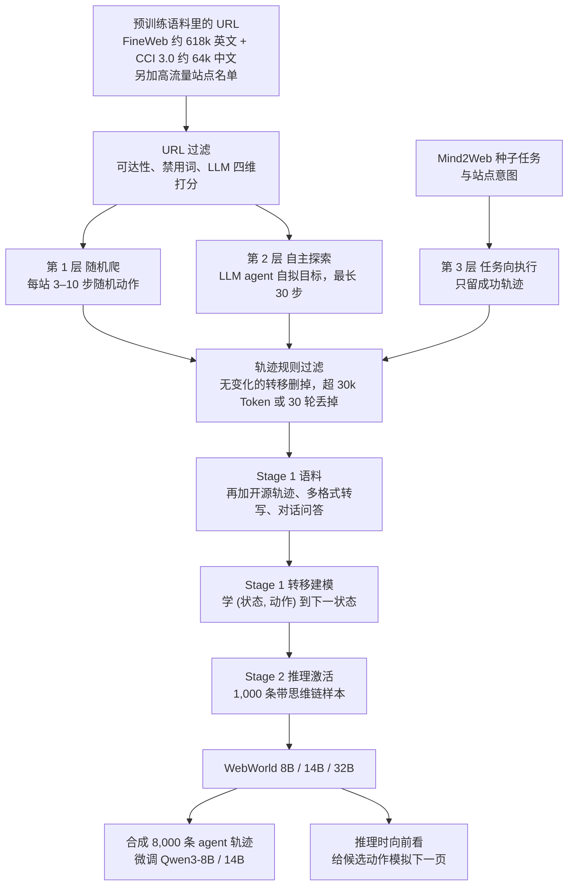

# 真网滚不动、沙箱学不开：WebWorld 把开放网页训成可离线 rollout 的世界模型

<!-- release-date: 2026-02-16 -->

> 本文依据 **WebWorld: A Large-Scale World Model for Web Agent Training**，arXiv:2602.14721v1，2026-02-16，共 27 页。页码均指这份 PDF 自身的页码。作者来自阿里巴巴 Qwen 团队与浙江大学，一作在 Qwen 实习期间完成，通讯作者为 Bowen Yu、Fei Huang（Qwen）与 Zuozhu Liu（浙大）（PDF p. 1），按主要归属放在 Alibaba 目录下。文中区分三件事：**论文明确写了什么**、**我们怎么解释它**、**哪些是外部资料或本文推算**。

## 读前先把几个词说成人话

这篇不是新的 Qwen 基座，也没有改模型结构。它做的是一个**网页模拟器**：给它当前页面和一步动作，它写出下一页长什么样。策略（agent）仍然决定「点哪里」，模拟器负责回答「点完之后页面变成什么」。

会反复出现的词：

- **Web agent（网页智能体）**：在浏览器里点按钮、填表、跳转，按新页面决定下一步的大模型。
- **世界模型（world model）**：这里专指上面那个模拟器，是一个自回归的语言模型，不是生成视频的那类模型（PDF p. 4，式 1）。
- **A11y Tree（Accessibility Tree，无障碍树）**：浏览器把页面上的控件（按钮、输入框、链接）抽成的层级文本，比原始 HTML 干净。每个节点带角色、属性和一个编号 `bid`，动作靠这个编号落地（PDF p. 19）。
- **轨迹（trajectory）**：一条完整交互，指令加一串「状态–动作–下一状态」。
- **rollout**：让 agent 在环境里从头走到尾、采出一条轨迹。
- **内在评测 / 外在评测**：前者问「模拟得像不像真浏览器」，后者问「用模拟器造的数据能不能把真 agent 训好」（PDF p. 6）。
- **MiniWob++ 与 WebArena**：两个真实环境里的 agent 基准。前者是一批小网页任务，后者是自建的电商、GitLab、Reddit 等站点上的长任务。

基座是 Qwen3 的 8B、14B、32B（PDF p. 15），Qwen3 本身见 Qwen3 一篇。

## 一句话先说清

Web agent 要泛化，得在环境里滚海量轨迹。真浏览器做不到：网络延迟、页面加载、限流和反爬把采集拖慢，提交表单、下单这类动作还不可逆（PDF p. 2）。已有的网页世界模型又卡在另一头：数据几乎都来自封闭的基准站点，量级在一万条左右，多数只能单步预测、只认一种格式（PDF p. 2）。

WebWorld 的回答是把模拟器本身做大、做开：

1. 从预训练语料里的真实 URL 出发，分三层采集开放网页上的交互轨迹，加上格式转写和通用对话，合计 1,059,348 条训练样本（PDF p. 4–5、p. 16）；
2. 先在全量数据上学「动作怎么改变页面」，再用 1,000 条带思维链的样本激活推理（PDF p. 5、p. 10）；
3. 用这个模拟器合成 agent 训练轨迹，或者在推理时向前看一步。

![Figure 2：一个 Amazon 购物任务。上框是模拟器上一步预测出的页面片段，含评分与「85% 为五星」按钮 [59]；agent 思考后执行 click('59')；下框是 WebWorld 先写一段推理——这次点击会把评论过滤成只剩五星——再输出下一页的 A11y Tree，其中新出现的五星评论条目被高亮。](/reports/WebWorld/fig2-simulation-example.png)

图引自 PDF p. 3 的 Figure 2。整篇论文要做的就是这一格：**agent 出动作，模拟器出下一页**，而且下一页要能接着往下走几十步。

摘要的三句结论（PDF p. 1）——内在评测与 Gemini-3-Pro 相当；Qwen3-14B 用合成轨迹微调后 WebArena 提升 9.2 个点、与 GPT-4o 相当；推理时搜索里当世界模型胜过 GPT-5——后文会逐一对上分母。

### 一条阅读路线

1. **p. 2 的 Table 1**：前作卡在哪。
2. **p. 4–5 的第 3.2–3.3 节与 p. 16 的 Table 11**：三层采集，以及 1.06M 到底由什么组成。
3. **p. 10 的 Table 7 与 p. 21 的 Figure 7**：为什么是「先动力学、后推理」，为什么 1,000 条就够。
4. **p. 7 的 Table 3**：内在评测。
5. **p. 8 的 Table 5 与 p. 9 的 Table 6**：外在评测，合成轨迹 vs 推理时搜索。

附录 A 的超参、附录 N 的全部提示词，复现时再看。

## 主要矛盾：真网滚不动，沙箱学不开

### 旧路一：拿闭源大模型现场扮浏览器

提示 GPT-4o-mini、o4-mini 当模拟器（UI-Simulator、Simia），能跑，但每次 rollout 都付 API，也没有可发布的权重（PDF p. 2–4）。

### 旧路二：在封闭基准里训一个小模拟器

Table 1 把已训练的网页世界模型列成一排（PDF p. 2）：

| 模型 | 尺寸 | 数据来源 | 规模 | 格式 | 开放网页 | 推理 | 历史长度 |
|---|---|---|---:|---|:---:|:---:|---|
| DreamGym | 8B | 基准站点 | 约 14K | 文本 | × | ✓ | 全轨迹 |
| WebEvolver | 70B | 按基准题在真实站点上自采 | 约 5K | A11y | × | × | 单步 |
| WMA | 8B | 基准站点 | 约 14K | 文本 | × | ✓ | 单步 |
| Word2World | 8B | 基准站点 | 约 70K | 文本 | × | × | 全轨迹 |
| WebSynthesis | 7B | 基准站点 | 约 4K | A11y | × | × | 单步 |
| **WebWorld** | 8B / 14B / 32B | 真实网站 | 1.06M | 多格式 | ✓ | ✓ | 最长 30 轮 |

表里「单步」指只看最近一个状态。论文的诊断是：数据管道不好扩，依赖少数 agent 任务，数据集停在约 10K；又因为采自沙箱，轨迹缺多样性，于是模型被锁在单步预测、受限格式上，也点不亮显式推理（PDF p. 2）。

于是矛盾是：

> **想让 agent 在环境里大量试错，真网太慢太危险；想用模拟器替代真网，模拟器又只见过几个沙箱站点。** 要破局，模拟器的数据得像预训练语料一样从开放网页里铺开，而不是从基准题里抠出来。

## 先看全景：数据怎么来，模型怎么训，训完拿去干什么

按 PDF p. 4–9 与 p. 16 重画，是数据与训练流向的示意，不是时间轴。全程没有强化学习：世界模型是监督微调（SFT），拿它合成数据后，agent 侧也是监督微调。

训练目标只有一个式子（PDF p. 4，式 1–2）：给定指令 $I$ 和历史 $h_t=(s_0,a_0,\ldots,s_t,a_t)$，预测下一状态 $s_{t+1}$，在轨迹上做最大似然。

$$
\mathcal L(\theta)=-\,\mathbb E_{\tau\sim\mathcal D}\sum_{t=0}^{T-1}\log P_\theta\bigl(s_{t+1}\mid I,h_t\bigr)
$$

$s_t$ 是第 $t$ 步的页面状态（默认是 A11y Tree 文本），$a_t$ 是动作，$\tau$ 是一条完整轨迹。

## 核心设计一：三层采集，先铺开再对准

### 旧问题：只做任务向执行，相关但扩不动

现有方法几乎都靠「对着任务跑成功轨迹」，相关性好，但规模受限于题目数量（PDF p. 4）。

### 新设计：随机爬 → 自主探索 → 任务向执行

URL 直接从预训练语料的元数据里抽，理由是让世界模型的训练分布对齐基座在预训练时见过的网页先验（PDF p. 4）。三层分别负责广度、真实感和任务对齐（PDF p. 4–5）：

- **第 1 层 随机爬**：在这些站点上部署随机爬虫，从当前页的 A11y Tree 里随机抽可执行动作（点按钮、填表、选下拉框），每站走 3–10 步。产出约 293K 条。
- **第 2 层 自主探索**：换成 LLM agent，由提示词注入四种行为先验——自拟一个具体意图并执行；刻意制造「后面依赖前面」的长链；必须组合输入、选择、点击，避免只会点导航；好奇地系统覆盖各栏目。每条最长 30 步，内容穷尽或步数用完就停。产出约 38K 条。四份提示词全文在附录 N.4（PDF p. 25–27）。
- **第 3 层 任务向执行**：LLM 看站点提出可行意图（如「订机票」），对每个种子扰动参数生成变体，再改写措辞；agent 去对应站点执行，只留成功轨迹。产出约 94K 条。种子任务来自 Mind2Web 训练集（PDF p. 4）。

一个值得注意的细节：第 2 层的四份提示词都写明禁止付款等高风险、涉隐私的操作，好奇探索那份还禁止提交表单、发帖、删除、注册和登录（PDF p. 25–27）。采集阶段本身就在回避论文开头说的「不可逆动作」。

### 1.06M 到底是什么

按 PDF p. 16 的 Table 11 重画。封面 Figure 1 与引言把三层写成 43.3%、20.4%、16.1%（PDF p. 1–2），和上图的**体积**占比对得上（22.0G、10.4G、8.2G 除以 50.9G），不是条数占比——这是我们的换算，论文没有说明口径。

这张图改变了几个说法的读法：

- 「训在 1M+ 条真实世界轨迹上」（PDF p. 1–2）：Table 11 自己在任务向执行和对话问答两行的「Real-World」列打了叉（PDF p. 16）。按表逐行相加，带勾的四行是 417,290 条。**百万级条数里，一半以上是防遗忘的对话与问答样本。** 这是按表加出来的，论文没有给这个小计。
- 任务向执行那一行，正文说是在真实站点上执行（PDF p. 5），表上却标为「Benchmarks (Synthetic)」、非真实网站（PDF p. 16）。两处说法不一致，我们按表引用。
- 「比前作多 100 倍」（PDF p. 2）对照的是引言里「约 10K」那一档；若拿 Table 1 最大的 Word2World 约 70K 当分母，约为 15 倍。
- 六行条数相加是 1,059,049，比表上总计 1,059,348 少 299 条，原文没有解释。
- 随机爬里 CCI 3.0 中文 57,837 条却有 17.67G，FineWeb 英文 235,674 条只有 4.33G（PDF p. 16），每条体积差约 17 倍，原文也没有解释。

**轨迹长度更接近「长程」的真值。** Figure 3(c) 的步数分布（PDF p. 6）：2 步 34.7%，3–6 步 45.2%，7–12 步 13.2%，超过 12 步 6.8%；均值 5.4，中位数 4。「支持 30 步以上」是能力上限和过滤阈值，不是典型长度。

**动作几乎全是点击。** Table 13 的分布（PDF p. 18）：`click` 77.29%、`goto` 10.06%、`fill` 5.12%，其余都在 1.5% 以下；元素交互合计 83.43%，浏览器导航 11.89%。完整 20 个动作原语见 Table 12，既有按 `bid` 的元素级动作，也有按坐标的鼠标动作。

**域分布只能读相对比例。** Figure 3(a) 圆心写着 1,059,348 Samples，但图例括号里的计数加起来约一万（1,798、1,521……），Figure 5 的横轴也只到约 4,000（PDF p. 6、p. 17）。按我们的加总，这些计数来自一个约一万条的样本，不是百万条的逐条分域。相对比例可以引用：生活旅行餐饮 18.0%、技术编程 15.2%、教育参考 14.8%、新闻 10.8%、电商 10.6%，其余更碎。

**可迁移启发：** 想把环境数据做大，先用廉价的随机交互把动力学铺开，再用少量带目标的成功轨迹对准。对外报规模时，把防遗忘的对话数据从分母里拿出来，否则复现的人会按一百万条真交互去估采集成本。

## 核心设计二：过滤要分两头，格式要转几种

### 过滤：URL 用 LLM，轨迹只用规则

URL 侧（PDF p. 5、p. 19–20）：先用脚本查可达性与禁用词，可达的只剩原始 URL 的 15.7%，其中 85.2% 通过关键词检查；再让 LLM 按可访问性、内容合适性、可交互性、工程质量四维打 0–1 分，低于平均或触发安全违规的丢掉。Figure 6 画了 68,366 个 URL 的打分分布，四维均值分别约为 0.77、0.53、0.41、0.58，总分均值 0.57（PDF p. 20）。

这里原文自相矛盾：第 3.3 节和附录 H 说 LLM 过滤后「保留通过规则检查的候选的 85.2%」（PDF p. 5、p. 19），Figure 6 图注却说阈值线「只留 top 32%」（PDF p. 20）。85.2% 恰好也是上一步关键词检查的通过率，像是把数字抄错了位置。实际留存率以哪个为准，无法从原文判断。

轨迹侧只用规则，刻意不让 LLM 当裁判，以免带进某个模型的归纳偏置（PDF p. 5）：关键词滤掉不安全内容；动作没有引起可观察变化的转移（多半是网络延迟或加载失败）删掉；超过 30k Token 或 30 轮的轨迹丢掉。

### 富集：五种辅助任务

只训 A11y Tree 会锁死格式，也会忘掉通用对话。Table 2 列了五种辅助任务（PDF p. 6）：

| 域 | 任务 | 输入 → 输出 |
|---|---|---|
| 网页 | 多格式模拟器 | 结构化状态 + 动作 → 下一状态，状态写成 A11y、HTML、XML 或 Markdown |
| 网页 | 网页生成 | 用户需求 → 整页结构 |
| 网页 | 描述式模拟 | 状态 + 动作 → 用文字描述页面变化 |
| 通用 | 通用世界模型 | 文本状态 + 动作 → 下一文本状态 |
| 通用 | 普通对话 | 问 → 答，防止灾难性遗忘 |

格式转写是「先解析再生成」：用正则和栈把缩进文本还原成树，再由 XML、HTML、Playwright、Markdown 各自的生成器输出，只改 A11y 片段、不动周围的对话上下文（PDF p. 19）。附录 L 还解释了为什么不做视觉模拟：现有图像和视频生成模型对界面细字不稳，而 agent 训练要的是「动作如何改变状态」，不是像素级渲染（PDF p. 21）。

**可迁移启发：** 状态表示一旦绑死一种 DOM 或 HTML 风格，换格式评测就会崩——后文 Table 3 里开源基线的低分就是例子。主表示可以只选一种，训练里至少要转出几种。

## 核心设计三：先学会页面怎么变，再用 1,000 条思维链点亮推理

### 旧问题：真网轨迹没有推理，直接灌思维链会先学会说话方式

真实交互轨迹里几乎没有显式推理（PDF p. 2）。在基座上直接做推理微调，模型还没学会网页怎么变，先学会了一种写法。

### 新设计：两阶段课程

从 1.06M 语料里随机抽转移，给定 $(I, s_t, a_t)$，合成一段中间推理——分析页面结构、解读用户意图、预测会改什么——再接 $s_{t+1}$（PDF p. 5）。Stage 1 在全量数据上学动力学；Stage 2 只用少量带思维链的数据，把推理模式外化出来。

Table 7 是这条课程的证据（PDF p. 10），8B 规模：

| 起点 | 思维链条数 | 事实性 | 图灵分 | 总分 |
|---|---:|---:|---:|---:|
| Qwen3-8B 直接做推理微调 | 500 | 0.502 | 0.277 | 0.390 |
| | 1k | 0.511 | 0.296 | 0.403 |
| | 2k | 0.541 | 0.319 | 0.430 |
| | 10k | 0.625 | 0.394 | 0.510 |
| 先做完 Stage 1 | 500 | 0.668 | 0.402 | 0.535 |
| | 1k | **0.701** | **0.422** | **0.561** |
| | 2k | 0.686 | 0.388 | 0.537 |
| | 10k | 0.692 | 0.413 | 0.552 |

事实性与图灵分的含义见内在评测一节；总分按表上数字是两者的平均，原文没有写公式。

读表只要三点：先做 Stage 1，最少的 500 条就已超过基座吃 10k 条；1k 是峰值，再多反而回落；论文据此建议「大规模真实转移 + 少量精选思维链」（PDF p. 10）。1,000 条约占 1.06M 语料的 0.09%（PDF p. 3）。

**加了推理，输出反而变短。** 附录 K 的 Figure 7（PDF p. 21）：Stage 1 模型平均每个答案约 2,300 Token（读图约值）；Stage 2 之后降到约 1,150–1,300，标注为减少约 49.4%，曲线在约 1,000 条后走平。论文的解释是，Stage 2 并不是在后面追加思考，而是把预测方式从「把整页冗长地复述一遍」改成「只写要紧的变化」。

**我们如何解释它。** 两张表合起来说的是同一件事：Stage 1 负责「知道页面会怎么变」，Stage 2 负责「只写变化、先说为什么」。思维链数据一多，写法的改造就开始盖过已经学会的动力学，于是 2k、10k 反而回落。

**可迁移启发：** 世界模型不要从「让它解释自己」开始。先用最大、最贴近真实转移的数据把动力学灌进去，再用极小、干净的思维链改说话方式；Stage 2 的数据量远小于 Stage 1 时效果最好。

## 训练配方：全参数 SFT

附录 A 的 Table 9（PDF p. 15）：

| 项 | Stage 1 转移建模 | Stage 2 推理激活 |
|---|---|---|
| 目标 | (状态, 动作) → 下一状态 | (状态, 动作) → 思考 → 下一状态 |
| 数据 | 1.06M 条 | 1K 条思维链 |
| 初始化 | Qwen3 Base Checkpoint | Stage 1 检查点 |
| 学习率 | $2.0\times10^{-5}$，余弦，预热 0.1 | $8.0\times10^{-6}$，余弦，预热 0.1 |
| epoch | 1 | 5 |
| 每卡 batch / 梯度累积 / 有效 batch | 2 / 2 / 64（表注「2 devices」） | 2 / 2 / 32（表注「1 device」） |
| 最大序列 / packing | 20,000 Token，开 | 20,000 Token，开 |
| 历史遮蔽 | 关 | 开（只在思维链上算损失） |
| 8B 硬件与步数 | 16 张 A100 80GB，约 7,215 步 | 8 张 A100 80GB，约 110 步 |

训练用 LLaMA-Factory、BF16，开 Liger Kernel 与 Unsloth 垃圾回收。墙钟：Stage 1 在 16 张 A100 上，8B 约 4 天 1 小时、14B 约 7 天 22 小时、32B 约 12 天 20 小时；Stage 2 在 8 张 A100 上均为 2–3 小时（PDF p. 15）。

几处原文没说清：

- 正文写 32B 用 DeepSpeed ZeRO-3、其余用 ZeRO-2，表里两阶段都写 ZeRO-2（PDF p. 15）。
- 有效 batch 64 标注「2 devices」，与 16 张卡对不上；若按每卡 2、累积 2、16 卡算，正好是 64。这是我们的算术。
- 「只在思维链上算损失」的精确掩码范围没有公式。
- 「Qwen3 Base Checkpoint」没说是预训练基座还是后训练版；Hugging Face 模型卡把基座写成 `Qwen/Qwen3-8B`（外部资料）。

**规模定律**（PDF p. 9–10，Figure 4）：同一设置训了 0.6B、1.7B、4B、8B、14B、32B 六个尺寸，最终评测损失与训练算力 $C$（FLOPs）拟合成

$$
L(C)=57.10\times C^{-0.1084},\qquad R^2=0.97953
$$

图上的星是 72B 的外推，论文说「没有饱和迹象」。指数 0.1084 意味着算力每涨 10 倍，损失约降为原来的 78%（$10^{-0.1084}\approx0.78$，我们的换算）。0.6B、1.7B、4B、72B 都不在发布的系列里。

## 内在评测：DOM 相似度不管用，改成「事实性 + 网页图灵」

### 旧指标卡在哪

已有内在指标分两派：结构派比 DOM 树与元素对齐，语义派用 ROUGE、BERTScore 比状态变化描述（PDF p. 6，附录 J）。开放网页上，HTML 方差太大，结构分普遍很低；状态变化一复杂，语义分又拉不开模型。

### WebWorld-Bench：两个分数、九个切面

两个互补指标，默认都由 GPT-4o 当裁判（PDF p. 7）：

- **事实性（Factuality Score）**：点式打分。裁判看交互历史、动作、预测的下一页和真实的下一页，只问「这个动作的主要效果有没有在预测里出现」，忽略无关的细节差异。量规分 1.0 / 0.7 / 0.4 / 0.0 四档（PDF p. 24，Figure 13）。
- **网页图灵分（Web Turing Score）**：成对比较。裁判看两个匿名的下一页，一个来自真浏览器、一个来自模型，要指出哪个更像真的；模型被选中的比例越高，分越高（PDF p. 7、p. 25）。

评测数据用与训练相同的分层管道生成，但严格留出（PDF p. 7）。九个切面是：长程一致性（超过 10 步的轨迹，输入完整历史）、宏观翻页语义、细粒度敏感（下拉框、复选框这类局部变化，考不要幻觉出整页大变）、多标签页、XML / HTML / Markdown / Playwright 四种格式，以及 Web2NAL（用自然语言描述变化）。

Table 3 的事实性（PDF p. 7，单位是百分制）：

| 模型 | 长程 | 语义 | 细粒度 | 多标签 | XML | HTML | Markdown | Playwright | Web2NAL | 平均 |
|---|---:|---:|---:|---:|---:|---:|---:|---:|---:|---:|
| GPT-4o | 69.2 | 55.3 | 81.0 | 69.9 | 63.5 | 47.3 | 64.1 | 51.3 | 34.2 | 59.5 |
| Claude-Sonnet-4.5 | 78.1 | 60.4 | 81.1 | 68.8 | 60.4 | 42.4 | 63.3 | 51.7 | 31.4 | 59.7 |
| Claude-Opus-4.1 | **82.9** | 72.1 | 79.4 | 79.3 | **76.4** | **68.8** | **77.5** | 75.5 | 29.4 | **71.3** |
| Gemini-3-Pro | 78.7 | 67.2 | 80.3 | 81.3 | **76.4** | 59.5 | 75.5 | **78.6** | 35.4 | 70.3 |
| WebSynthesis-8B | 24.2 | 6.9 | 22.5 | 73.2 | 6.8 | 0.4 | 10.5 | 2.6 | 3.4 | 16.7 |
| WMA-8B | 15.2 | 9.4 | 18.8 | 7.5 | 5.4 | 1.2 | 9.8 | 4.5 | 28.5 | 11.1 |
| Word2World-8B | 8.5 | 6.5 | 13.5 | 4.5 | 3.0 | 2.5 | 4.0 | 3.5 | 17.0 | 7.0 |
| Qwen3-8B | 41.4 | 18.5 | 60.4 | 34.0 | 16.8 | 11.5 | 19.8 | 11.2 | 28.8 | 26.9 |
| Qwen3-32B | 52.9 | 34.9 | 71.2 | 47.7 | 32.5 | 22.3 | 46.3 | 23.0 | 29.9 | 40.1 |
| WebWorld-8B | 76.7 | 68.0 | 81.7 | **82.2** | 70.3 | 65.9 | 75.5 | 72.7 | 37.6 | 70.1 |
| WebWorld-14B | 76.1 | 74.0 | **87.7** | 79.8 | 73.3 | 62.7 | 71.4 | 73.2 | 38.1 | 70.7 |
| WebWorld-32B | 77.0 | **74.5** | 87.0 | 79.0 | 73.0 | 63.0 | 73.0 | 74.0 | **38.5** | 71.0 |

加粗是我们按列取的最高值，与原表的加粗不完全一致。Qwen3-14B 一行略去，完整表见原文。

同表的网页图灵分平均：GPT-4o 35.4、Claude-Sonnet-4.5 36.2、Claude-Opus-4.1 **47.4**、Gemini-3-Pro 43.2、Qwen3-32B 23.0，WebWorld 8B / 14B / 32B 为 42.2 / 44.7 / 45.6（PDF p. 7）。

读表要带走的判断：

- **「与 Gemini-3-Pro 相当」成立**：32B 的平均事实性 71.0 对 70.3、图灵分 45.6 对 43.2，都略高。正文另写「对齐 Claude-Opus-4.1 的 71.3」（PDF p. 7）也成立，但图灵分 47.4 仍是 Claude-Opus 最高。
- **不是处处都强**：HTML 一列 WebWorld 只有 62.7–65.9，低于 Claude-Opus 的 68.8；正文说多格式「70–75%」（PDF p. 7），对 XML、Markdown、Playwright 成立，对 HTML 不成立。Web2NAL 的事实性虽是全表最高，绝对值也只有 38 左右。
- **规模收益很小**：8B 到 32B，平均事实性只从 70.1 到 71.0。
- **开源前作的低分主要是格式问题**：附录 C 说明 WMA 预测的是自由文本描述，WebSynthesis 针对 WebArena 那种稀疏的跨页跳转，二者都是作者用官方数据在 Qwen3-8B 上重训的；Word2World 直接用官方权重零样本评测，它的 WebShop 扁平文本格式与 A11y、HTML 对不上（PDF p. 7、p. 15–16）。表上的差距因此主要说明「格式对齐很重要」，不能直接读成「前作模拟能力差多少」。

**换裁判名次不变。** Table 4 把裁判换成 Claude-Opus-4.1（PDF p. 8）：WebWorld-8B 从 70.1 / 42.2 降到 67.6 / 31.7，Gemini-3-Pro 从 70.3 / 43.2 变为 72.8 / 36.5，GPT-4o 从 59.5 / 35.4 降到 51.6 / 21.0。绝对分变严，相对名次不变。这张表没有 14B、32B，也没有被用作裁判的 Claude-Opus 本身。

**可迁移启发：** 开放域模拟别用 DOM 编辑距离当主指标。「动作的主效果有没有发生」加「像不像真页」更接近训练要用的东西；两个分数都靠 LLM 裁判，必须换一个裁判看名次还在不在。

## 外在评测一：用模拟器合成 8,000 条 agent 轨迹

第 5.1 节不再问像不像，而问合成的数据能不能把真 agent 训好（PDF p. 8）。数据管道叫 **Abstract-and-Instantiate（先抽象、再实例化）**：

1. 从具体的种子任务出发，例如「3 月 15 日订一张去伦敦的机票」；
2. 用 LLM 抽象成功能层面的模糊目标，例如「订一张去某地、某时的机票」；
3. agent 带着这个模糊目标在 WebWorld 里执行；
4. 把执行出来的轨迹反推回一道具体任务——若轨迹只是乱逛、原地打转或首尾页面相同，就判为无效（PDF p. 24，Figure 12）；
5. agent 再做这道具体任务，拒绝采样只留成功轨迹。

共得 8,000 条，用来微调 Qwen3-8B 与 14B。被微调的是 agent，WebWorld 在这里只当环境。

Table 5（PDF p. 8），SR 是真实环境里的成功率：

| 模型 | MiniWob++ SR | 平均步数 | WebArena SR | 平均步数 | 电商 | GitLab | Reddit | 其他 |
|---|---:|---:|---:|---:|---:|---:|---:|---:|
| GPT-4o | **64.3** | 4.12 | **26.6** | 11.96 | **26.8** | 27.5 | **24.5** | **25.3** |
| Qwen3-8B | 49.4 | 4.88 | 9.8 | 15.24 | 17.1 | 9.4 | 5.0 | 18.2 |
| Qwen3-8B + WebWorld | 59.3 | 4.39 | 20.7 | 19.25 | 20.7 | 21.4 | 23.3 | 17.5 |
| Qwen3-14B | 54.9 | 4.55 | 15.1 | 16.12 | 15.4 | 15.4 | 6.3 | 18.3 |
| Qwen3-14B + WebWorld | 63.2 | 4.28 | 24.3 | 17.11 | 24.0 | **32.7** | 21.0 | 17.6 |

MiniWob++ 的标准误约 0.02，WebArena 约 0.013–0.018（按比例计）。论文把增量写成 +9.9%、+10.9% 这样的百分号，实为百分点差。

这张表要带着分母读：

- **8B 的增益是实打实的**：MiniWob++ 高 9.9 个点，WebArena 高 10.9 个点，Reddit 与 GitLab 涨得最多。
- **「14B 与 GPT-4o 相当」只在 MiniWob++ 上站得住**：63.2 对 64.3，差距不到一个标准误；WebArena 24.3 对 26.6，仍差 2.3 个点，约 1.5 个标准误（我们的换算）。
- **「其他」站点两档都略降**（各 −0.7），电商一档 8B 只涨 3.6。增益集中在 Reddit、GitLab。
- **步数的方向相反**：MiniWob++ 上微调后步数变少；WebArena 上步数变多，8B 从 15.24 涨到 19.25。成功率涨了、路也走得更长，论文没有解释这一列。

封面 Figure 1 的柱只画了 8B 的两项（PDF p. 1）。

**可迁移启发：** 检验世界模型，最终要看它能不能给策略喂出新轨迹。Abstract-and-Instantiate 可以直接搬走：具体题太少时，先抽功能骨架，在模拟器里把骨架走成轨迹，再写回具体题。拒绝采样那一步不能省——模拟器里的「成功」未必是真的成功（见限制一节的谄媚）。

## 外在评测二：推理时向前看，有用但增益有上限

第 5.2 节做向前看搜索（lookahead search）（PDF p. 8–9）：每一步 agent 提出 $N$ 个候选动作，世界模型为每个候选模拟下一页，价值模型给模拟出的页面打「离任务完成多近」的分，执行分最高的那个。价值模型输出 SUCCESS / FAILURE / ONGOING 三态（PDF p. 23，Figure 10）。

Table 6 在 MiniWob 上测（PDF p. 9），节选：

| 世界模型 | 价值模型 | 格式 | 打分 | 搜索 | 成绩 | 相对贪心 |
|---|---|---|---|---|---:|---:|
| 无 | 无 | — | — | 贪心 | 64.3 | — |
| GPT-4o | GPT-4o | A11y | 点式 | BoN(3) | 63.8 | −0.5 |
| WebWorld | GPT-4o | A11y | 点式 | BoN(3) | 64.8 | +0.5 |
| GPT-5 | GPT-4o | A11y | 成对 | BoN(3) | 64.5 | +0.2 |
| WebWorld | GPT-4o | A11y | 成对 | BoN(3) | 65.5 | +1.2 |
| WebWorld | GPT-5 | A11y | 成对 | BoN(3) | **67.5** | **+3.2** |
| WebWorld | GPT-4o | 自然语言 | 成对 | BoN(5) | 65.9 | +1.6 |
| WebWorld | GPT-4o | A11y | 成对 | MCTS(3) | 65.4 | +1.1 |

BoN 是 Best-of-N，括号里是候选数 $k$。贪心基线 64.3 与 Table 5 里 GPT-4o 的 MiniWob++ 成功率相同，我们据此推断 agent 是 GPT-4o、题目是同一套，原文没有明说。

- 摘要里 **当世界模型胜过 GPT-5** 这句，对应的是同一价值模型（GPT-4o）、成对打分下的 65.5 对 64.5，差 1 个点。67.5 那一行换了更强的价值模型 GPT-5，不能读成 WebWorld 单独胜出。
- 点式改成对比较有明显收益；自然语言格式短，可以搜到 $k=5$，完整的页面状态受上下文限制只能到 $k=2$；MCTS 与只在不确定时才向前看的混合搜索几乎没有额外好处（PDF p. 9）。
- 论文自己的收束是：推理时搜索的增益有限，**世界模型更值钱的用途是合成训练数据**，并引用 Qian 等人 2026 的观察——当前 agent 很难把世界模型当预见工具用好（PDF p. 9）。正文比摘要里「支持有效的推理时搜索」保守，本文跟正文。

## 跨环境：网页动力学能迁到代码、GUI 和游戏

第 6.3 节把其他领域的开源 agent 轨迹改写成 $(s_t, a_t, s_{t+1})$，以 Qwen3 和 WebWorld 为起点做适应训练，再用同样的事实性与图灵分评测；表头只写「1,500 条」「3,000 条」两档样本数，我们按微调样本数理解（PDF p. 10、p. 19–20）。训练集来自 SWE-agent、AgentNet、ALFWorld、ScienceWorld、ToolBench、Toucan 等 14 个数据集，共 69,855 条；测试集 16,323 条。这测的是「当别的环境的模拟器」，不是这些基准上的 agent 成功率。

Table 8 的总分（PDF p. 10）：

| 环境 | 1,500 条：Qwen3 → WebWorld | 3,000 条：Qwen3 → WebWorld |
|---|---|---|
| API 服务 | 0.088 → 0.299 | 0.258 → 0.292 |
| 代码 | 0.147 → 0.396 | 0.196 → 0.471 |
| 游戏 | 0.253 → 0.473 | 0.374 → 0.522 |
| GUI | 0.322 → 0.705 | 0.511 → 0.719 |
| 平均 | 0.176 → 0.400 | 0.298 → 0.463 |

GUI 迁移最强，这与 A11y Tree 本来就能描述桌面控件一致。API 服务在 3,000 条时增益只剩 0.034，而且 WebWorld 的 0.292 还略低于 1,500 条时的 0.299。论文把整张表读成「网页是其他世界模型适应的通用基础」（PDF p. 3、p. 10）；更稳的读法是结构相近的 GUI 迁移好，工具调用式的 API 迁移弱、对数据量也不敏感。

还有两处要留意：Table 8 没写 Qwen3 与 WebWorld 各是哪个尺寸；训练集与测试集里都列了同名同量的 `wm_alfworld_sft.jsonl`（Agent-ETO，3,119 条），论文没有说明两者是否是同一份数据（PDF p. 20）。

## 限制、边界，以及论文没写的东西

第 7 节自己只点了两条（PDF p. 11）：

1. **谄媚（sycophancy）**：模拟结果偏向 agent 想要的、过于乐观的结局；
2. 写不好高质量的细内容，例如科学文章。

Impact Statement 补了双用途与隐私（PDF p. 11）：更强的 web agent 可能被用于钓鱼、撞库、违规大规模抓取；训练数据来自 FineWeb 与 CCI 3.0，尽管做了关键词与 LLM 过滤，仍可能残留个人信息、有毒内容和人口偏置。附录 M 更具体：爬虫遵守 `robots.txt`；没有额外做自动个人信息脱敏，填表时也没用合成身份，因此不建议未经处理就用于隐私敏感场景（PDF p. 22）。

读完全文我们认为还要记住的：

- **全程是 SFT。** 它证明的是「合成轨迹能抬 SFT agent」，不是「可以在 WebWorld 里安全地跑强化学习」。谄媚会让后者更险：若奖励来自模拟器判的成功，策略只要让页面「看起来成功」就能刷分。
- **长程是上限，不是常态**：步数中位数 4。
- **WebWorld-Bench 与训练同源**，只声明留出。它测的是同分布的模拟质量，不是完全没见过的站点。
- **数据口径多处打架**：「真实世界轨迹」的定义、LLM 过滤留存率 85.2% 与 32%、任务向执行算不算真实网站、ZeRO-2 与 ZeRO-3、六行条数和总计差 299。
- **没有公开**：8,000 条合成轨迹的种子集、拒绝采样的通过率；WebWorld-Bench 各切面的题量；Stage 2 的精确损失掩码；跨环境实验的模型尺寸。

## 可迁移启发

1. **先确认瓶颈在环境，再决定要不要世界模型。** 延迟、限流、不可逆操作是同一类约束：采样效率被环境卡住，而不是被优化器卡住。世界模型的第一用途是把真环境从关键路径上拿掉。
2. **数据分层比多标一万条成功轨迹更先该做。** 随机爬负责覆盖，自主探索负责真实交互形态，任务向执行负责对准。允许大量「没有目标的点击」，动力学先验才不会全靠少数成功轨迹硬记。
3. **报规模时把防遗忘数据拿出分母。** 1.06M 条里真实网站那部分约 42 万条。复现成本、存储和「开放网页」这个说法，都该按这个量级估。
4. **主表示选定后，训练里仍要转格式。** A11y Tree 为了信息密度和跨 GUI；HTML、XML、Markdown 为了别把语法当成动力学记住。
5. **世界模型的课程是「先会变，再会说」。** 1,000 条思维链就能改掉冗长的预测方式，再多会回落；不要把长思考风格直接大量灌进模拟器。
6. **世界模型更值钱的地方是造数据，而不是搜索。** 同样一个模拟器，合成轨迹让 8B agent 在 WebArena 上涨 10.9 个点，推理时搜索只涨 1–3 个点。
7. **谄媚是把模拟器当环境时的主风险。** 模拟器若习惯性地把动作说成成功，SFT 只是学到坏示范，接到强化学习上会直接污染奖励；任何后续的 RL 工作都要先处理「过于乐观的下一页」。

## 关键词回看

- **世界模型 / 网页模拟器**：给定指令、历史和动作，预测下一页的因果语言模型；不是 agent 策略，也不是视频生成。
- **A11y Tree**：主状态表示，动作靠 `bid` 落地；训练时再转成 HTML、XML、Markdown、Playwright。
- **三层采集**：随机爬（广度）→ 自主探索（真实感）→ 任务向执行（对准任务）。
- **两阶段课程**：Stage 1 百万级转移建模，Stage 2 用 1K 思维链激活推理，输出长度约减半。
- **WebWorld-Bench**：事实性（主效果在不在）+ 网页图灵分（像不像真页），九个切面。
- **Abstract-and-Instantiate**：具体题 → 功能骨架 → 模拟器里执行 → 写回具体题 → 拒绝采样。
- **向前看搜索**：模拟每个候选动作的下一页再择优；增益有限。
- **谄媚**：模拟结果迎合 agent，过于乐观。

## 资料与阅读边界

- **本文依据**：arXiv:2602.14721v1，27 页。截至核验，arXiv 上只有 v1，提交于 2026-02-16 13:06 UTC；封面右上角印的 2026-02-17 不是提交日。
- **首发日**：`release-date` 取 2026-02-16。Hugging Face 上 `Qwen/WebWorld-8B` 的权重文件提交于 2026-02-15 16:28 UTC，但模型卡（README）直到 2026-02-16 14:18 UTC 才建立，与 arXiv 提交同日，属于先上传、后公开的预置模式；同一时期的 GitHub 仓库 [QwenLM/WebWorld](https://github.com/QwenLM/WebWorld) 在互联网档案馆 2026-02-17 05:20 UTC 的快照里仍是 404，首个带代码与数据的提交在 2026-02-18。没有找到更早的官方博客。
- **外部补充**（不是 PDF 原文）：Hugging Face 上的 `Qwen/WebWorld-8B`、`WebWorld-14B`、`WebWorld-32B` 与数据集 `Qwen/WebWorldData`，许可证 Apache 2.0，模型卡把基座写为 `Qwen/Qwen3-8B`。GitHub 上另有 [QwenLM/Qwen-AgentWorld](https://github.com/QwenLM/Qwen-AgentWorld)（2026-06 创建），是另一项工作，不要把它的内容读回本篇。
- **跨篇参考**：基座见 Qwen3；同为阿里的 WebSailor 讲的是浏览策略的后训练，与本篇「环境」一侧互补，不能混表；另两篇合成环境的工作见 Agent-World-Model 与 Agent-World，它们的对象不是开放网页浏览器。
