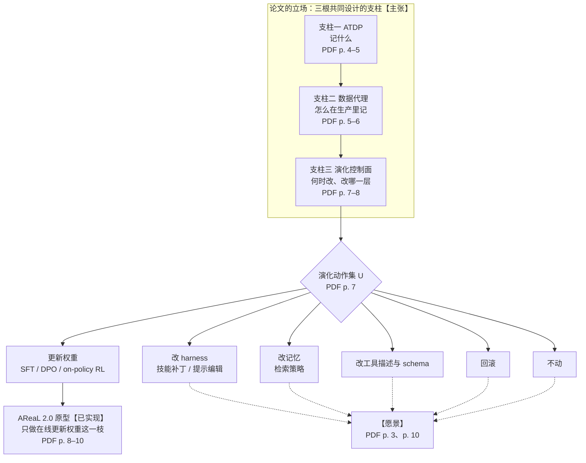
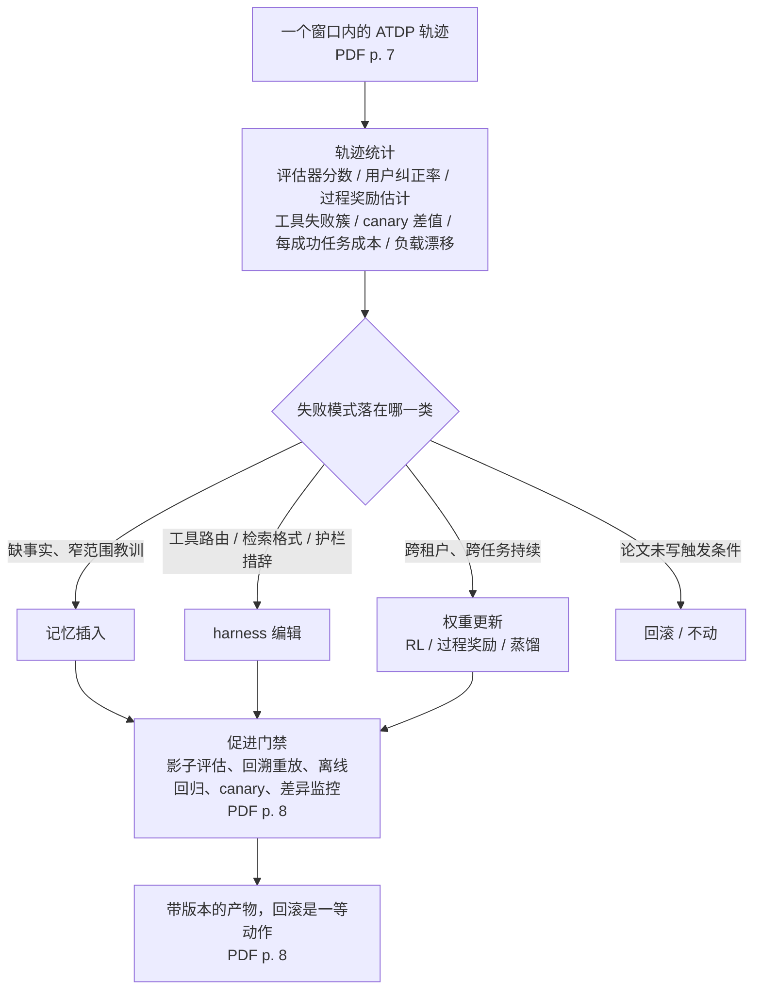

# AReaL 2.0：自进化 Agent 卡在系统而不在算法——三根支柱是立场，换掉推理端点是唯一落地的一截

<!-- release-date: 2026-07-01 -->

> 本文依据 **Next-Generation Agentic Reinforcement Learning Systems Enable Self-Evolving Agents**，arXiv:2607.01120v2，2026-07-02 提交，共 13 页（正文与结论 p. 1–11，参考文献 p. 11–13，共 38 条；无附录、无表格、无实验数据，全文只有一张图）。24 位作者来自蚂蚁集团、香港科技大学与清华大学：22 人署名 Ant Group，其中 Ran Yan、Jiarui Zhang、Binhang Yuan 同时署港科大，Wei Fu、Jiaxuan Gao、Jiarui Zhang、Huaijie Wang 同时署清华；只有 Youhe Jiang（港科大）与 Yi Wu（清华）不署 Ant Group（PDF p. 1）。页码均指 PDF 自身的页码。文中会区分三件事：**论文明确写了什么**、**我们怎么解释它**、**哪些是外部资料**。

## 读前先把几个词说成人话

先说它和前作的关系。AReaL 一篇讲的是 2025 年那篇 NeurIPS 系统论文：强化学习（Reinforcement Learning，RL）后训练里，生成与训练拆到两组 GPU，生成可以被打断，用陈旧度上限和解耦的 PPO 目标管住异步带来的偏差。那一篇回答「几百张卡怎样不空转」，整个循环由 RL 系统自己驱动：从数据集取题、发给 rollout worker、判分、攒批、更新。

这一篇换了问题：**一个已经上线、每天给真实用户干活的 Agent，它产生的交互记录能不能直接变成训练数据，让它自己变强？** 会反复出现的词：

- **Agent（智能体）**：让大语言模型不只输出文字，还能读文件、调工具、检索、请求人工批准，再把结果读回来想下一步。
- **harness（脚手架）**：包在模型外面、让它真正能干活的那层代码与提示：系统提示、工具描述、路由、子 Agent 定义、技能库。同一个模型换一套 harness，能力差很多。
- **trajectory（轨迹）**：一次任务从头到尾的记录，每一步看到什么、做了什么、结果如何。
- **on-policy RL（在策略强化学习）**：用当前这份参数自己生成的数据更新它自己。要做到这一点，必须拿得到它生成时的 token 与概率。原型为什么长成那个样子，根子在这一条。
- **memory / skill（记忆 / 技能）**：Agent 在权重之外能积累的东西。记忆是事实，技能是可复用的做法。
- **干预表面（intervention surface）**：论文把一个部署中的 Agent 看成五部分拼成的复合策略——基座 LLM、in-context harness、记忆、工具、护栏，「不同的失败需要不同的干预表面」（PDF p. 3）。**改哪一部分，就是一种干预表面。** 更新权重只是其中一种。

## 一句话先说清

论文的立场压成一句话（PDF p. 1、p. 10）：

> 企业级 Agent 上线后就「冻住」，卡住它的不是 RL 算法，而是没有一套能把线上轨迹变成可治理、可归因、可重放的训练材料的系统。

摘要说当前的 agentic RL 系统和周边的可观测性软件栈缺三样东西，下一代系统必须围绕它们共同设计（PDF p. 1–3）：

1. **轨迹数据协议（Agent Trajectory Data Protocol，ATDP）**：把 Agent 的经验从「可观测」升级成「可学习」，回答**记什么**；
2. **企业级数据代理（data proxy）**：在生产环境里截获、脱敏、持久化、可重放地记下这些轨迹，回答**怎么记**；
3. **统一的演化控制面（evolution control plane）**：按轨迹统计自动决定改记忆、改技能、改 harness、改工具描述、更新权重，还是回滚或不动，回答**何时改、改哪里**。

然后论文很清楚地说：它只把第三根支柱里的一根细枝做了出来，就是 AReaL 2.0——把前作的 rollout 与训练 worker 包成微服务，让一个已部署的 Agent 只换一个推理地址，就把线上 LLM 调用接进在线 RL 循环（PDF p. 3、p. 8）。记忆、技能、harness、工具 schema 的演化，重放治理，自动选择干预方式，全部留作后续议程（PDF p. 3、p. 10）。

所以读这篇要一直分三层：**论文的设计主张**、**论文说已经做出来的部分**、**论文自己写明留给以后的部分**。下文标题里的【主张】【已实现】【愿景】就是这三层。原型本身没有任何实测数据。这篇的价值不在证明了什么，而在把「自进化 Agent」从算法问题重新框成系统问题，并给出一份相当完整的需求清单。

### 一条阅读路线

1. **p. 1–2**：部署单位换了、改进方式没换的错位，以及「自进化」的定义。
2. **p. 4–5**：ATDP 的六元组与六条原则。
3. **p. 6**：数据代理的四条边界与六条原则，重点是「重放」那一条。
4. **p. 7–8**：控制面的形式化、动作集与六条实现考虑。
5. **p. 8–10 与 Figure 1**：AReaL 2.0 原型的四个组件、Hermes 例子，以及论文自己列的缺口清单。

## 这篇立场文的地图：三个问题，一截原型

按 PDF p. 2–3 的三支柱、p. 7 的动作集和 p. 8、p. 10 的原型范围整理的结构示意，不是论文原图。实线是论文说做了的，虚线是论文写明留作以后的。

三节各以一个问题开头，恰好是这张地图的三刀（PDF p. 4、p. 5、p. 7）：

| 支柱 | 论文开头的问题 | 切的是哪一刀 |
|---|---|---|
| ATDP | What should be the right data abstraction that will be captured for learning? | 数据的形状 |
| 数据代理 | How to capture such data for enterprise-level heterogeneous agentic workflows? | 数据的来源与治理 |
| 控制面 | When and how to trigger corresponding RL optimization for self-evolving? | 数据的用途 |

论文自己的一句概括是：ATDP 规定必须表示什么，数据代理规定这些表示怎样在异构的企业环境里被生产出来（PDF p. 2）。重放是贯穿三刀的那根线：协议要求带版本的可重放，代理要求区分三类重放，控制面要求重放优先的评估。

## 主要矛盾：部署的单位换了，改进的方式没换

**部署的东西变了**（PDF p. 1）。以前企业部署的是一个 LLM：一串 token 进，一串 token 出。现在部署的是一个长程 Agent 策略，嵌在复杂的业务环境里：读文件、调工具、检索文档、调 API、更新记忆、请求人工批准、完成分析任务。

**改进它的方式没变**（PDF p. 1）。一个部署中的企业 Agent 可能完成了成千上万次工具交互，可它的行为要变，仍要走一遍人工循环：运维看 trace → 定义新评测集 → 改提示 → 加工具描述 → 用 RL 更新模型 → 实现新的 Agent 循环 → 重新部署。权重、系统提示、工具库、in-context harness 在部署时全部冻结。

与此同时，面向个人的自进化 Agent 已经说明「从自己的经验里持续学习」不是假设：论文点名 OpenClaw 与 OpenClaw-RL，并引了 MetaClaw、SkillClaw（PDF p. 2）。那企业为什么做不到？论文的核心立场是：缺的不是更大的模型、更聪明的提示，甚至不是某种 RL 算法，而是一个能把 Agent 交互轨迹平滑转成在线自进化学习的企业级系统底座（PDF p. 2）。

它用三个企业场景说明个人 Agent 的做法搬不过来（PDF p. 2）：

- **编码 Agent** 要从跨团队的 issue 解决记录里学，同时尊重仓库权限、许可证边界、专有代码限制与审计要求；
- **客服 Agent** 要从升级、退款、满意度信号和政策更新里学，同时不能泄漏客户数据；
- **科研 Agent** 要从失败的实验和文献检索轨迹里学，同时保住溯源、可复现性和实验室约束。

**我们如何解释它。** 三个例子的共同点是：**学习信号和治理约束是同一份数据的两面。** 个人 Agent 只有一个用户、一个租户，几乎没有合规边界，可以先学了再说；企业 Agent 的每一条轨迹都同时带着「能不能学」的问题。这就是为什么治理出现在三根支柱的每一根里，而不是事后的补丁。

## 论文怎样定义「自进化」

这一段很短，却决定了全文的边界（PDF p. 2）。

论文对自进化 Agent 的定义是：**一个部署中的 Agent，它未来的行为能因为过去的情境经验而改进。** 紧接着加了一道栅栏：「我们不是指无限制的递归自我修改」，而是一个**有界的闭环**——每个用户与 Agent 的交互轨迹能被**观测、脱敏、验证、归因**，再转成五种受治理更新之一：记忆插入、技能补丁、harness 编辑、工具 schema 修改、on-policy RL 更新。

**我们如何解释它。** 这个定义有三处值得记。

1. **它把自进化和递归自我改进切开了。** 那类工作关心 Agent 改进「改进者自己」能不能点火（例如 AIDE2 一篇的 RSI 阶梯）；这篇只要一个能审计的闭环。
2. **权重更新只是五种更新之一，还排在最后。** 控制面一节的映射与此呼应：记忆插入「通常是最便宜、最安全的更新」，只有跨租户持续的同类失败才值得动权重（PDF p. 7）。
3. **观测、脱敏、验证、归因四个动词全是治理动作。** 在这个定义里，治理不是附加条件，是定义本身。

## 支柱一：ATDP——把「可观测」变成「可学习」【主张】

### 旧问题：日志够调试，不够学习

现有的 Agent 日志记 prompt、completion、工具调用、延迟、错误、token 用量。论文说这些对调试有用，对在线 agentic RL 不够（PDF p. 2）。一条可学习的轨迹必须在**每一步**保留决策过程：Agent 当时看到了什么、相关的内部或 harness 状态、选了什么动作、结果如何、后来才到的奖励或批评，以及模型版本、工具 schema、租户、成本、治理状态这些元数据（PDF p. 2）。没有这样的协议，企业 Agent 会产生海量交互数据，却不完整、不可复现或不安全，当不了自进化的底座（PDF p. 2）。

### 新设计：一条轨迹是一串带类型的事件

论文给了一个「原型表述」（PDF p. 4）：一条轨迹是带类型的事件序列 $\tau=(e_1,\dots,e_T)$，每一步是一个六元组

$$
e_t=\langle o_t,\ h_t,\ a_t,\ y_t,\ r_t,\ m_t\rangle
$$

六格各装什么，图里写了论文举的例子（PDF p. 4–5）。论文补了一句定位：$h_t=\varnothing$ 且去掉 $m_t$ 时，这个 schema 退化成标准的部分可观测马尔可夫决策过程（Partially Observable Markov Decision Process，POMDP）（PDF p. 5）。也就是说它不发明新的 RL 形式化，只在经典抽象上多挂两个口袋：一个装 LLM 特有的东西（推理痕迹、检索片段、工具 schema、人工纠正、自然语言批评、被拒绝的动作类别），一个装企业特有的元数据。

**我们如何解释它。** 六元组里最不寻常的是 $y_t$ 与 $r_t$ 分开。经典 RL 里环境一步就返回下一个状态和奖励；这里把「动作直接引起的结果」和「对这一步的评价」拆成两格，因为在 Agent 场景里前者立刻就有，后者可能几天后才来。下面的「延迟绑定」原则把这件事写成了硬要求。

### 工作机制：六条设计原则

论文列了六条（PDF p. 5）。前三条讲记什么，后三条讲记下来的东西怎样才可信。

1. **决策相关的有界披露。** 记够改进行为的信息，但**不要求**暴露每一个内部 token 或隐藏的推理痕迹：Agent 需要足够的结构做归因、因果诊断和重放，而无限制的思维链片段通常给不出可审计的学习信号。
2. **跨框架、跨任务统一。** 现有 Agent 日志是框架特定的，RL 数据集是任务特定的，企业遥测是为调试、可靠性与合规优化的。论文把 ATDP 的核心创新写成一句话：**学习的单位既不是 prompt–response 对，也不是一段不透明的 trace，而是一条带类型、可审计、可归因的事件记录。**
3. **可归因。** 轨迹要能回答「是哪个观测、哪段提示、哪条检索结果、哪次工具调用、哪条记忆、哪个护栏决策促成了成败」。以工具调用为例，要存工具版本、参数 schema、权限范围、延迟、错误类别、返回对象，以及**这个结果后来是被信任、被忽略、被纠正还是被推翻**。
4. **延迟绑定的学习信号。** 很多奖励在动作之后才到：下一轮的用户纠正、失败的测试、后来的人工标注、慢速的远程评估器。事件的奖励字段要能在初次记录后更新或追加，**同时保持原始因果记录不可变**。
5. **带版本的可重放。** 每个事件不只归到一个模型标识，而要归到产生它的**完整执行信封**：harness schema、工具版本、检索索引快照、护栏配置、策略 checkpoint。论文的判断很尖锐：没有这些字段，「Agent 经验」在统计上有用，在操作上不可复现。
6. **受治理的可观测。** 从一开始就带上脱敏状态、数据分级标签、租户标识、保留策略、同意或法律依据、人工审核状态、训练资格；还要支持**分裂可见性**——生产调试看到脱敏后的 trace，受控的训练作业才能访问封存的、经策略批准的字段。

### 它和已有协议差在哪

论文在相关工作里把 ATDP 与三类东西分开（PDF p. 4）：

- **MCP、A2A 这类互操作协议**：标准化的是 Agent 怎样发现工具、访问上下文、彼此通信，不是训练数据；
- **D4RL、RLDS 这类 RL 数据集基础设施**：证明了标准化轨迹对离线 RL、模仿学习、重放、标注与可复现基准的价值，面向的是离线数据集；
- **Agent Data Protocol（ADP）**：最接近的一个，用一种轻量「中间语」统一异构的 LLM Agent 数据集，并证明标准化轨迹能改善可扩展的监督微调。

论文对三者的共同判断是：它们解决互操作或离线数据转换，都没保留部署中自进化需要的东西——步级因果上下文、延迟奖励、动作结果、harness 与工具版本、治理元数据、重放边界、企业约束下的学习资格（PDF p. 4）。

### 代价与边界

**论文没有给出 schema。** 六元组是原型表述，六条原则是需求；全文没有字段类型、序列化格式、示例事件或参考实现（PDF p. 4–5）。论文结尾也把「完整的 ATDP 实现」列为原型之外的待办（PDF p. 10）。这里的「协议」是一份规格书的目录，不是规格书本身。

**第一条与 on-policy RL 之间有张力，论文没讨论。** 有界披露说不必存每一个隐藏 token；可 on-policy 的权重更新恰恰需要策略模型生成的每个 token 及其概率。数据代理一节对这两样的措辞是「token IDs where available, log probabilities where available」（PDF p. 6）。**我们如何解释它：** 从第三方模型 API 后面截获的轨迹，天然只够做监督微调、偏好优化或 harness / 记忆更新，不够做 on-policy RL——这恰好解释了原型为什么必须把推理引擎放进自己家里。

### 可迁移启发

即使不做 RL，六条原则也是一份好用的 **Agent 日志设计检查表**：你的日志能不能回答「这次工具返回的结果后来被采纳了吗」？能不能事后给一条记录追加奖励而不改原记录？能不能仅凭一条记录复原当时的 harness 版本与工具 schema？任何一个答「不能」，这份日志就只能看，不能学。

## 支柱二：数据代理——监控代理与学习代理的分界线是「能不能重放」【主张】

### 旧问题：企业不会只用一种 Agent 框架

有的团队用 LangChain 或 LangGraph，有的用 CrewAI，有的用 OpenAI Agents SDK 或 Claude Agent SDK，有的接 MCP 工具，还有的自己写编排（PDF p. 6）。逐个改造应用不现实。数据代理的目的，是把生产工作转成受治理的学习数据，「而不强迫每个 Agent 团队重写它的应用」（PDF p. 6）。

### 新设计：站在四条边界上

论文特意说它「不只是一个 API 网关、一个 tracing 导出器或一个日志服务」，而是把生产负载转成受治理学习材料的关键机制（PDF p. 5）。它站在四条边界上（PDF p. 6）：Agent 与 LLM 之间（无论模型部署在内部还是外部提供商）、Agent 与工具之间、Agent 与短期和长期记忆系统之间、Agent 与人类反馈通道之间。

### 工作机制：六条设计原则

1. **对现有框架无侵入的拦截**：在稳定边界上截获模型 API 调用、工具调用、检索调用、记忆操作、文件系统或浏览器动作、人工批准事件、最终用户反馈（PDF p. 6）。
2. **无损的 ATDP 发射**：每次截获都转成 ATDP 事件流并持久化。「无损」的定义值得注意：对 LLM 调用，是**保留在策略下有资格且必要的全部字段**——提示模板指纹、系统提示版本、暴露的工具、解码参数、采样输出、token ID（有则存）、对数概率（有则存）、模型版本；对工具调用，是输入、输出、schema、版本、权限范围、错误类别和下游用途（PDF p. 6）。无损是相对于「学习需要」和「治理允许」定义的，不是逐字节完整。
3. **可重放**：论文这一条写得最重——「一条不能被重放的轨迹不是可信的训练数据」。重放要捕获工具输入输出、环境状态、许可范围内的 LLM 版本、允许范围内的文件或数据库快照，以及外部副作用的边界；还要区分**确定性重放、近似重放、不可重放**三类事件。监控 trace 能说「Agent 调了工具 X 然后失败了」，训练代理必须能问「换一个提示、模型、记忆、检索策略或工具 schema，它会不会成功」。结论句是：**重放是区分学习代理与监控代理的关键特征**（PDF p. 6）。
4. **跨租户聚合但隔离**：一个编码 Agent 想从多个产品团队的轨迹里学，可各团队的仓库权限、数据分级、法律限制不同。所以要有隔离的租户存储、基于策略的聚合、必要时的联邦或 split-learning 式训练作业、租户感知的评估。论文补了一句常被忽略的话：这不只是隐私要求，也是**学习要求**——没有租户元数据和隔离，系统无从知道一个团队学到的更新该不该推广到另一个团队（PDF p. 6）。
5. **奖励收割（reward harvesting）**：Agent 负载里有大量弱的、延迟的奖励——用户回复、工单重开率、测试失败、编译错误、人工纠正、升级决定、退款撤销、审批延迟、下游编辑、放弃。论文沿用 OpenClaw-RL 的核心观察（每次交互都会产生一个「下一状态信号」），推广为把运营状态变化都当作**候选**学习信号。边界也写了：不是所有信号都是奖励，也不是所有奖励都能安全地直接优化，但代理得先把它们收下，控制面才能决定怎么用（PDF p. 6）。
6. **先治理再学习**：脱敏、访问控制、保留、学习资格要在轨迹进入学习队列**之前**执行。这是常见模式的反面——常见的是日志先堆起来、治理以后再补。在自进化系统里，代理不只是可观测性收集器，而是 RL 学习循环的第一道安全边界（PDF p. 3、p. 6）。

### 代价与边界

**全文没有一行代理的实现细节或性能数据**（PDF p. 5–6）。拦截怎么做到无侵入、脱敏用什么方法、近似重放的边界怎么判、租户隔离下训练作业怎么组织，都只给了需求。

**同名的两个「数据代理」范围相差很远。** 第 4 节的数据代理横跨模型、工具、记忆、人类反馈四条边界，带六条原则；第 6 节原型里也有一个 Data Proxy，做的是会话中转与对话、工具事件记录（PDF p. 9–10）。论文结尾承认原型缺「一个能捕获工具、检索、记忆、文件、浏览器、人类反馈和延迟奖励事件的完整数据代理」（PDF p. 10），等于承认两者不是一回事。

**我们如何解释它。** 「重放」这个判据在训练侧已有同类实现：DeepSeek-V4 一篇讲的 DSec 沙箱为每个 sandbox 维护全局有序的轨迹日志，用于快进恢复、溯源与确定性重放（DSec 一篇说明后续版本换了恢复方式）。那是训练沙箱里的实现，这里要的是横跨整个企业 Agent 栈的同一件事，两者可以互相印证「重放需要什么」。

### 可迁移启发

**把「能不能重放」当作数据能否用于训练的硬门槛。** 直接推论是：**存副作用的边界，而不只是存结果。** 一条「已发送邮件」的记录如果不标明它是不可重放的外部副作用，以它为起点的一切反事实评估都是错的。

## 支柱三：演化控制面——自进化不等于更新权重【主张】

### 旧问题：一把锤子对应所有故障

论文反对一种默认做法：Agent 表现不好，就去更新权重。理由是部署中的 Agent 是一个复合策略，「不同的失败需要不同的干预表面」（PDF p. 3）。于是控制面的定位是：**自进化不是一个优化器，而是一个带治理、有多个干预表面的决策问题**（PDF p. 7）。

### 新设计：写成一个决策问题

时刻 $t$ 的部署 Agent 写成五元组（PDF p. 7）：

$$
\mathcal{A}_t=\langle \pi_{\theta_t},\ \mathcal{H}_{\psi_t},\ \mathcal{M}_t,\ \mathcal{T}_t,\ \mathcal{G}_t\rangle
$$

依次是参数为 $\theta$ 的策略 LLM、参数为 $\psi$ 的 in-context harness、记忆、工具库与 schema、安全治理与护栏配置。可演化的对象列得很细：系统提示、开发者指令、Agent 提示模板、工具描述、路由器、记忆检索策略、记忆策略、规划模板、子 Agent 定义、技能库（PDF p. 7）。控制面观察一个窗口的轨迹 $\mathcal{D}_t=\{\tau_i\}_{i=t-W}^{t}$，选一个演化动作：

$$
u^\star=\arg\max_{u\in\mathcal{U}}\ J_{\mathcal{A}}\!\left(u\mid\mathcal{A}_t,\mathcal{D}_t\right)
$$

$J_{\mathcal{A}}$ 「一般地度量 Agent 演化带来的改进」，**论文对它只有这一句，没有任何具体定义**（PDF p. 7）。动作集 $\mathcal{U}$ 有六类，全部受 $\mathcal{G}_t$ 约束（PDF p. 7）：

| 编号 | 动作 | 论文举的手段 |
|---|---|---|
| (i) | 更新策略 LLM | 监督微调、直接偏好优化（DPO）、on-policy RL |
| (ii) | 更新 in-context harness | 技能补丁、提示编辑 |
| (iii) | 更新记忆 | 检索策略更新 |
| (iv) | 更新工具库与 schema | 工具描述编辑、schema 变更 |
| (v) | 回滚 | — |
| (vi) | 不动 | — |

**我们如何解释它。** 这个公式的真正内容不在 argmax，而在 $\mathcal{U}$ 的构成：「回滚」和「不动」与「更新权重」平级。论文后文说得很直白：回滚「不应该是手动的应急程序，而应该是动作集里的一等动作」（PDF p. 8）。

### 工作机制：先按失败类型分流

第一条实现考虑，就是明确编码「哪类失败属于哪类干预」。论文在引言和控制面一节各给了一版映射（PDF p. 3、p. 7），合起来是：

| 轨迹里观察到的模式 | 建议的表面 | 论文的措辞 |
|---|---|---|
| 反复缺少某些事实，或范围很窄的可复用程序性教训 | 记忆插入 | 通常是最便宜、最安全的更新（p. 7） |
| 失败聚集在工具路由、检索格式、护栏措辞、开发者消息结构 | harness 或 schema 编辑 | 通常更合适（p. 3、p. 7） |
| 可复用的程序性失败 | 技能补丁 | 引言里单列（p. 3） |
| 同一类失败跨越许多租户、任务、工具配置持续出现 | 用 RL、过程奖励学习或蒸馏更新策略 | 问题大概率不局限于记忆或 harness（p. 3、p. 7） |

论文只给了例子和「通常」「大概率」这样的定性措辞，没有阈值，也没有写成一条排序规则。

按 PDF p. 7–8 的六条实现考虑重画的机制示意，不是论文原图。前三个分支来自「多表面适配」一条的例子；回滚与不动只是动作集里的两项，论文没写它们何时触发。门禁框里是论文列举的五道关，论文没规定先后。

### 另外五条实现考虑

- **按轨迹统计自动触发，而不是靠人看 trace**：评估器分数、用户纠正率、过程奖励估计、工具特定的失败簇、canary（小流量灰度）差值、每个成功任务的成本、负载构成漂移。论文引了三个已有工作说明这些信号可行——OpenClaw-RL 把下一状态信号转成标量过程奖励与方向性提示，AgentPRM 证明了逐轮奖励的价值，RLAnything 组合了逐步与结果信号——自己的定位是「把这些统计量从监控产物提升为干预触发器」（PDF p. 7）。
- **算法多元，触发接口统一**：权重更新可以是 on-policy 或近 on-policy RL、过程奖励学习、on-policy 蒸馏；harness 空间可以是提示优化、上下文演化、代码搜索、轨迹感知的口头编辑；记忆或技能可以是把轨迹蒸馏成可复用的工作流。控制面组织这些范式而不抹平差异，它决定调用哪个算法、用哪片数据、在什么约束下、走哪条部署路径（PDF p. 8）。
- **有审计的分阶段部署**：自动触发不等于未经审查的热替换。每个干预都要走影子评估、回溯重放检查、离线回归测试、canary 发布、回滚语义、与现任版本的差异监控。论文在这里只用一句话提到攻击面：个人 Agent 的安全文献已表明，持久状态、能力与知识会造成可观的攻击面（PDF p. 8）。
- **重放优先的评估**：更新触达用户前，先在重放的轨迹与反事实变体上评估——harness 编辑测过去的失败与已知的成功，工具 schema 变更测工具调用重放，策略更新测留出轨迹、安全集、租户专属评测和分布漂移探针。论文自己指出，这正是数据代理必须支持重放的原因（PDF p. 8）。
- **带版本的溯源与回滚**：LLM checkpoint、提示、工具 schema、记忆项、检索策略、护栏、技能文件、路由器、数据集全部带版本。收尾一句是：一个说不清自己改了什么的自进化 Agent，在企业级别不叫自进化，只是在漂移（PDF p. 8）。

### 代价与边界

控制面是三根支柱里离实现最远的一根：$J_{\mathcal{A}}$ 没定义，触发阈值没有，选择算法没有，跑过的案例也没有（PDF p. 7–8），原型明确不覆盖它（PDF p. 8、p. 10）。这一节要当作**需求规格**来读：它告诉你成熟的控制面必须有哪些能力，没告诉你怎么做。

**我们如何解释它。** 自进化方向的其他几篇各自做深了一个表面：AIDE2 演化 harness，Fugu 训练一个决定「谁来做」的编排器，AgentEvolver 演化任务与课程。这篇控制面的独特之处，是提出一个**站在所有表面之上、决定改哪个表面**的仲裁者——而这恰恰是它没做出来的部分。

### 可迁移启发

不必等有了自进化系统，「失败类型到表面的映射」今天就能用：Agent 出错时先问这是记忆问题、harness 问题、工具描述问题还是模型问题，按便宜到贵、可逆到不可逆的顺序试。把回滚和不动当成正式选项，而不是失败后的补救。

## AReaL 2.0 原型：把 RL 系统从「调用方」变成「被调用方」【已实现】

### 论文说做了什么、不做什么

论文对原型的措辞很克制（PDF p. 8）：一个「探索性原型」，聚焦一条演化路径——从部署 Agent 的轨迹在线更新策略 LLM 的权重；它**不**打算实现整个自进化底座，**不**覆盖记忆插入、技能补丁、harness 编辑、工具 schema 演化。结尾又说一遍：原型只覆盖了控制面动作空间里的权重更新这一枝（PDF p. 10）。

核心设计在正文里单独框出（PDF p. 8）：不再把 RL 基础设施当成一条与线上 Agent 负载脱节的离线后训练流水线，而是把 rollout 与策略训练所用的同一批计算单元（比如 GPU worker）暴露成微服务，插进任何已有的在线 Agent 部署。

*引自原文 Figure 1（PDF p. 9）。*

对 Agent 应用来说，接入只有一步：把原来指向 SGLang 或 vLLM 服务器的推理端点换成 AReaL 2.0 的网关，论文说这「就足以」把 LLM 调用导进在线 RL 运行时（PDF p. 9）。图上那条 LLM API call 箭头只标了 `base_url` 与 `api_key` 两个字段。

### 四个组件

四个组件分别解耦了「公共服务协议、会话放置、轨迹管理、模型推理或训练计算」四件事（PDF p. 9）。论文给的理由是：agentic RL 的请求往往多轮、带工具、有状态，而训练要的是带 token 级元数据和奖励信号的结构化轨迹（PDF p. 9）。

| 组件 | 职责（PDF p. 9–10） |
|---|---|
| Gateway（网关） | 整个 Agent 服务栈在在线 RL 系统里的公共入口，把 AReaL 2.0 暴露成标准推理后端的替代品；内部做请求归一化与鉴权，把 Agent 的每一轮转进在线 RL 服务网。Agent 继续用普通推理风格的 API，AReaL 2.0 由此看见在线 RL 需要的交互流 |
| Router（路由器） | 为多个在线 RL 训练作业做轻量的会话亲和：一个任务有多轮、多次工具调用、中间观测和延迟奖励，所以每个会话固定分给一个 Data Proxy 并跨轮保持；它只管放置与亲和元数据，大流量交给 Data Proxy 与 worker |
| Data Proxy（数据代理） | 在外部请求与计算 worker 之间中转，记录对话历史、工具调用事件与响应，为下游训练准备数据；论文说它是「把普通部署流量转成在线 RL 可消费经验」的那个组件 |
| Agent-Compute Worker | 把 SGLang、vLLM 这类推理引擎与基于 Megatron 或 FSDP（全分片数据并行）的训练 actor 一起包在微服务接口后面，计算资源按轨迹流与训练需求动态分配和释放 |

**我们如何解释它。** Figure 1 与正文有一处不一致：正文说记录轨迹的是 Data Proxy（PDF p. 10），图上写入 Trajectory Storage 的虚线却从 Inf. Worker 出发（PDF p. 9）。论文没有描述训练侧怎么攒批、多久更新一次、权重同步由什么触发。

### 唯一的案例：Hermes Agent

论文称它为 motivating example（PDF p. 10）：为 Hermes Agent 服务提供在线 RL 训练。常规部署里 Hermes 调一个推理后端（例如 SGLang worker）拿模型响应；换成 AReaL 2.0 后，这个后端被网关后面的 agent-compute worker 替代，「周边的 Agent 服务基本不变」。论文认为这体现了设计的核心收益：**不再搭一个模仿生产行为的 RL 环境，而是复用原 Agent 服务自己产生的数据**；多轮交互与工具使用本身就成了 ATDP 轨迹的来源，缩小离线后训练数据与部署行为之间的差距（PDF p. 10）。

**论文关于这个案例的全部内容就是这一段。** 训的是哪个模型、奖励从哪来、跑了多久、有没有变好，一个字都没有（PDF p. 10）。

### 我们如何解释它：一次「控制反转」

把 Figure 1 和前作的系统图放在一起，最大的变化不是多了网关，而是**谁在驱动循环**：

| | 前作 AReaL | AReaL 2.0 原型 |
|---|---|---|
| 谁发起一次生成 | RL 系统从数据集取 prompt | 外部 Agent 服务发来一次 LLM 调用 |
| prompt 分布由谁决定 | 训练方的数据集 | 线上真实流量 |
| 一个 prompt 采几个回答 | 训练方配置 | Agent 服务决定，通常一次调用只要一个 |
| 环境是什么 | RL 系统自己搭的判分服务 | 原样保留的 Agent 工作流：规划、工具、沙箱、记忆 |
| RL 系统的角色 | 调用方 | 被调用方（一个推理端点） |

收益论文说了：训练数据与部署行为之间少了「模仿环境」这层缝隙。代价论文没说，从机制上至少能推出三条：

1. **RL 系统失去了对批次构成的控制。** 前作的控制器每发一个 prompt 之前先检查陈旧度上限，这建立在「控制器决定发多少、何时发」之上；变成被调用方以后，来多少、来什么、何时来都由线上流量决定。
2. **组内相对优势不再天然可得。** GRPO 这类算法要对同一个 prompt 采多个回答做基线，线上一次调用只要一个答案。要么牺牲一部分线上请求做多采样，要么换一种不依赖组的优势估计。
3. **一个真实会话可能横跨多次权重更新。** 多轮会话的第一轮由旧权重生成、第五轮由新权重生成，是前作「一条轨迹由多个版本拼成」问题的延伸；论文没说原型是否沿用前作的解耦目标，也没说陈旧度怎么计。

第二条在官方仓库的 Hermes 示例里能找到印证：示例文档写明在线模式目前每组只训练一条独立打分的轨迹，因此关掉了奖励与优势的组内归一化（外部资料，见文末）。

### 我们如何解释它：为什么偏偏先做权重这一枝

论文没解释为什么六种动作里先做权重更新。我们的判断是：**只有这一枝逼着你把推理引擎放进自己家里，而这恰好是前作已经有的东西。** on-policy RL 要策略模型生成时的 token 与对数概率，第三方模型 API 后面截获不到——数据代理一节对它们的措辞正是「有则存」（PDF p. 6）。记忆、技能、harness 的更新不需要这些，可以建在与提供商无关的代理上；权重更新不行。于是 Inf. Worker 必须自己就是推理引擎（PDF p. 10），而这一层加训练 worker，正是前作写好的部分。原型的「轻量扩展」（PDF p. 8）之所以轻，是因为重的部分早就在。

这也划出原型的一条硬边界：**它只能让「模型在自己手里」的 Agent 自进化。** 跑在闭源商业模型之上的企业 Agent，接进这个网关也拿不到可用于 on-policy 更新的数据。论文没讨论这条边界。

同样把接入点放在模型 API 上的还有 Polar 一篇：harness 只换 base URL，代理捕获 token 级调用，再重建成训练样本。两者的差别在数据从哪来——Polar 在离线任务集上批量跑 harness、由评估器给奖励，AReaL 2.0 想接的是线上真实流量。两篇互不引用。

### 代价与边界

论文对原型自己的定性是「刻意限定范围的可行性证明」（PDF p. 10）。可一份可行性证明至少该有一次跑通的记录，这篇连这个也没有。能从论文确认的只有三件事：四个组件的职责划分、接入方式（换端点）、一个被点名的目标 Agent。软件版本、硬件、训练算法、奖励来源、任何曲线，都不在论文里（PDF p. 8–10）。

## 与前作 AReaL 怎么衔接

| | AReaL（2025-05） | AReaL 2.0（2026-07） |
|---|---|---|
| 文体 | 系统论文，带一处算法改动，有完整实验 | 立场文，一个原型描述，无实验 |
| 核心矛盾 | 一批里最慢的轨迹拖住整个集群 | 部署后的 Agent 无法从自己的流量里学 |
| 循环由谁驱动 | RL 系统（从数据集取题） | 线上 Agent 服务（发来 LLM 调用） |
| 主要贡献 | 可中断生成、陈旧度上限、解耦的 PPO 目标 | 三支柱的需求规格；网关、路由器、数据代理、计算 worker 的微服务包装 |
| 前作机制在这里 | — | rollout 与训练 worker 被包在微服务抽象后面（PDF p. 8）；异步机制、陈旧度、解耦目标是否沿用，论文未写 |

这篇在相关工作里对前作只有一句：AReaL 通过完全异步执行把 rollout 生成与策略优化解耦，用陈旧度感知训练和解耦的 RL 目标保持稳定；随后是对整个 RL 系统类别（HybridFlow / verl、StreamRL、AsyncFlow、AReaL）的判决：「这些系统不足以通过在线强化学习支持自进化 Agent」（PDF p. 4）。这里的「不足」指缺三根支柱，不是说前作的机制错了；这篇没有修改或否定前作的任何机制。

## 论文给了什么证据

**没有实验证据。** 摘要就把它定位成立场文（PDF p. 1）；它提供的是论证、需求清单和一个原型的组件描述。

| 内容 | 层次 | 证据形式 | 页码 |
|---|---|---|---|
| 部署单位变了、改进方式没变 | 主张 | 论证 | p. 1 |
| 自进化的定义与五类受治理更新 | 主张 | 定义 | p. 2 |
| 瓶颈在系统底座，不在模型、提示、算法 | 主张 | 论证 | p. 2、p. 10 |
| ATDP 六元组与六条原则 | 主张 | 形式化 + 需求 | p. 4–5 |
| 数据代理的四条边界与六条原则 | 主张 | 需求 | p. 5–6 |
| 控制面的五元组、动作集与六条实现考虑 | 主张 | 形式化 + 需求 | p. 7–8 |
| AReaL 2.0 的四个组件、换端点接入 | 已实现（声称） | 组件描述 + Figure 1 | p. 8–10 |
| Hermes Agent 在线 RL | 已实现（声称） | 一段文字，无结果 | p. 10 |
| 完整 ATDP、完整数据代理、重放与反事实评估、租户感知的资格控制、自动多表面选择 | 愿景 | 明确列为待办 | p. 3、p. 10 |

「已实现（声称）」两行是「论文说做了」，不是「论文证明做了」：论文没有版本号、代码路径或运行记录可供核对。官方仓库在同一天发布了对应版本，那是仓库的事实，不替论文补证据。

**摘要承诺的「反方论证」在正文里找不到。** 摘要说会勾勒架构承诺、案例研究和 counter-arguments 来支撑立场（PDF p. 1）；正文的「案例研究」只有 Hermes 那一段（PDF p. 10），没有任何一节列出反对意见并回应。最接近的是「自动触发不应意味着未经审查的热替换」（PDF p. 8），那是对自己主张的限定，不是回应反方。

**原件有几处影响理解的拼写错误**：p. 5 的「ATEP should treat this as a first-class property」应为 ATDP；p. 8 的「on-police distillation」应为 on-policy distillation。其余如 bussiness（p. 1）、self-evolvoing、desgin（p. 8）、compelete、originl（p. 10）不影响理解。

## 限制、边界，以及不要补进去的实现

- **没有实验、没有数字**：吞吐、延迟、准确率、训练曲线、规模一个都没有（PDF p. 1–11）。
- **ATDP 没有 schema**，数据代理没有实现，控制面连目标函数都没定义（PDF p. 4–7）。
- **奖励从哪来没说。** 数据代理一节列了十几种候选信号，并说不是所有奖励都能安全优化（PDF p. 6）；Hermes 案例却没交代用的是什么奖励（PDF p. 10）。在线 RL 没有奖励就不成立，这是原型描述里最大的空洞。
- **前作的异步机制是否沿用、跨权重版本的多轮会话怎么处理，没写。**
- **控制反转的代价没讨论**：批次构成、每 prompt 采样数、prompt 分布不再由训练方控制（我们的推断）。
- **只适用于模型在自己手里的 Agent**：on-policy 更新要 token 与对数概率（我们的推断）。
- **安全论证只有一句**（PDF p. 8），句末没挂引用；其余「安全」都是护栏、安全集、租户检查这类治理字段。

## 论文指向哪些值得单独读

- **OpenClaw-RL**（arXiv:2603.10165）：「每次交互都产生下一状态信号」是奖励收割一条的直接来源，也是控制面自动触发引的第一个例子（PDF p. 6–7）。想知道线上弱信号怎么变成奖励，先读它。
- **Agent Data Protocol**（arXiv:2510.24702）：论文点名的「最直接相关」工作（PDF p. 4），已有单篇研读；对照着读能看清 ATDP 多要的是步级因果上下文、延迟奖励与治理字段。
- **AReaL**：原型的底座。它的陈旧度与解耦目标，正是控制反转之后最需要重新回答的问题。

## 可迁移启发

1. **先问「改哪一层」，再问「怎么改」。** 缺事实 → 记忆；工具路由与格式 → harness；跨租户持续的同类失败 → 权重（PDF p. 3、p. 7）。更新模型从默认动作降成最后手段。
2. **「能不能重放」是训练数据的门槛，不是加分项**（PDF p. 6）。执行信封和副作用边界要当一等字段存。
3. **治理放在学习队列之前**（PDF p. 6）。理由不只是合规：没有租户元数据，你不知道一个更新该不该推广。
4. **结果与奖励分开存，奖励要允许晚到**（PDF p. 4–5）。否则延迟到达的信号要么丢掉，要么污染原始记录。
5. **回滚与不动是正式动作**（PDF p. 7–8）。自动化改进循环的默认输出可以是「证据不够，不改」。
6. **「控制反转」要连着代价一起做。** 把 RL 系统做成一个推理端点，接入变成改一行配置，但批次构成、采样数、prompt 分布的控制权也交了出去。先决定这三件事由谁管。
7. **立场文按需求规格读。** 三根支柱加起来十八条原则、六种动作、四个组件，没有一条被验证；拿它对照自己的系统缺什么，比拿它判断 AReaL 2.0 强不强有用。

## 关键词回看

- **自进化 Agent**：部署中的 Agent，未来行为能因过去的情境经验而改进；这里特指有界闭环，不是无限制的递归自我修改（PDF p. 2）。
- **干预表面**：复合策略里可被改的那一层——权重、harness、记忆、工具、护栏（PDF p. 3、p. 7）。
- **ATDP**：把轨迹定义为带类型事件序列、每步为六元组的协议，配六条设计原则（PDF p. 4–5）。
- **有界披露 / 延迟绑定 / 执行信封**：只记与决策相关的内部状态；奖励可事后追加而原记录不变；产生事件的完整配置（PDF p. 5）。
- **数据代理（第 4 节）与 Data Proxy（第 6 节）**：前者是横跨四条边界的企业级组件，后者是原型里记录会话与工具事件的组件，范围小得多（PDF p. 5–6、p. 9–10）。
- **确定性重放 / 近似重放 / 不可重放**：数据代理必须区分的三类事件（PDF p. 6）。
- **奖励收割**：把运营状态变化都当作候选学习信号先收下，由控制面决定怎么用（PDF p. 6）。
- **演化控制面**：观察一个窗口的轨迹，在改权重、改 harness、改记忆、改工具、回滚、不动之间选一个（PDF p. 7）。
- **重放优先评估**：任何更新触达用户前，先在重放轨迹与反事实变体上评估（PDF p. 8）。
- **会话亲和**：路由器把一个会话固定到一个 Data Proxy 并跨轮保持（PDF p. 9）。

## 资料与阅读边界

**版本与首发日。** arXiv 上最新是 v2（2026-07-02T14:02:28Z，[arXiv API](https://export.arxiv.org/api/query?id_list=2607.01120)），即页头所列版本。`release-date` 取 2026-07-01：arXiv v1 于当天 16:08 UTC 提交，官方仓库的 [v2.0.0 Release](https://github.com/areal-project/AReaL/releases/tag/v2.0.0) 于当天 16:23 UTC 发布，两者是「AReaL 2.0」这一名称首次对外的官方事件；v2 修订不回写。更早的 1.x 版本已带在线 RL 与网关组件（见下），属于前身功能，不是 2.0 的发布。

**覆盖了原文哪些部分。** 摘要；§1 引言与三支柱概述；§2 相关工作（LLM 后训练中的 RL、自进化 Agent、RL 系统、Agent 与 RL 数据协议）；§3 ATDP 的原型表述与六条原则；§4 数据代理的边界与六条原则；§5 控制面的形式化、动作集与六条实现考虑；§6 原型的核心设计、Figure 1、四个组件、Hermes 案例与缺口清单；§7 结论；参考文献中与正文论证相关的条目。

**外部补充（不是论文内容）。**

- 官方仓库 [areal-project/AReaL](https://github.com/areal-project/AReaL) 的 [Releases](https://github.com/areal-project/AReaL/releases)：v1.0.0（2026-03-02）的说明已有「配置 `base_url` 与 `api_key` 即可训练任何 Agent」的在线 RL 模式；v1.0.3（2026-04-16）已并入带 controller、router、data proxy 的 rollout 网关与 Agent Service 微服务。论文第 6 节的四个组件在论文发布前两到四个月已以某种形态出现在仓库里。v2.0.0 的说明把 2.0 描述为训练、推理、Agent、权重更新四个服务的微服务架构，并附 Hermes 示例。
- 仓库的 [Hermes 示例](https://github.com/areal-project/AReaL/tree/main/examples/hermes)（2026-09 所见）：调用链是 Client → Gateway → Router → DataProxy（会话状态）→ Worker；Worker 为每个会话在进程内实例化一个 Hermes AIAgent，对话历史由 DataProxy 保存并逐轮回放；在线模式目前每组只训练一条独立打分的轨迹，因此关掉了组内归一化；奖励由用户用脚本手动赋值，建议保持在 $[-1,1]$；Hermes 自带的 memory 工具在此模式下不可用。它与论文叙述有两处差别：Figure 1 把 Agent 服务画在 AReaL 2.0 之外、只改推理端点，示例把 Hermes 跑在 AReaL 的 Worker 进程里；论文把记忆列为 Agent 保留的模块，示例里记忆工具被禁用。两边以各自原件为准。
- [Hermes Agent](https://github.com/NousResearch/hermes-agent) 是 Nous Research 的开源 Agent，自带从经验创建与改进技能的学习循环；论文引用的访问日期是 2026-06-30（PDF p. 13，参考文献 [38]）。
- 论文引用的 arXiv 编号经核实与标题一致：OpenClaw-RL（2603.10165）、Agent Data Protocol（2510.24702）、RLAnything（2602.02488）、MetaClaw（2603.17187）、SkillClaw（2604.08377）、Memento-Skills（2603.18743）。

**原文没有公开的缺口。** ATDP 的 schema 与序列化格式；数据代理的任何实现；控制面目标函数的定义与触发阈值；原型使用的推理与训练引擎版本、硬件；Hermes 案例的模型、奖励来源、训练配置与结果；前作的异步机制与解耦目标是否沿用；多轮会话跨权重版本时陈旧度怎么计；摘要承诺的反方论证。
