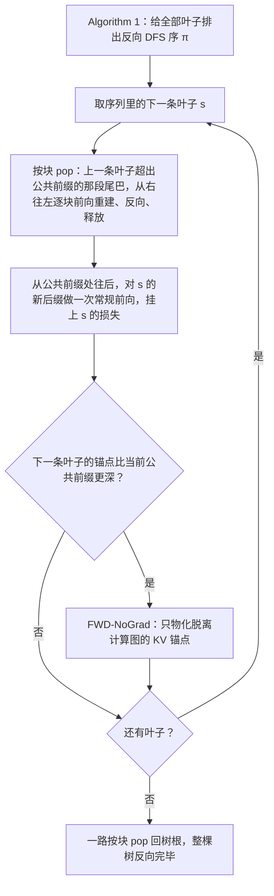

# AReaL-DTA：共享前缀已经长成树，训练算子却还在把每条轨迹单独算一遍

<!-- release-date: 2026-01-31 -->

> 本文依据 **AREAL-DTA: Dynamic Tree Attention for Efficient Reinforcement Learning of Large Language Models**，arXiv:2602.00482v2，2026-06-13 提交的 ICML 2026 camera-ready 版，共 16 页（正文 p. 1–9，参考文献 p. 10–11，附录 p. 12–16）。十一位作者来自香港科技大学、清华大学与蚂蚁集团 AReaL Team；三位共同一作是 Jiarui Zhang（港科大、清华）、Yuchen Yang（清华）、Ran Yan（港科大、蚂蚁），通讯作者 Binhang Yuan（港科大）（PDF p. 1）。页码均指 PDF 自身页码。文中区分三件事：**论文明确写了什么**、**我们怎么解释它**、**哪些是外部资料或我们自己的读图与计算**。

## 读前先把几个词说成人话

这是一篇训练算子论文。它不改 RL 算法，不改异步调度，只改一件事：策略模型训练时，注意力的前向和反向按什么顺序、以什么形状执行。

会反复出现的词：

- **rollout（轨迹生成）与 trajectory（轨迹）**：强化学习（Reinforcement Learning，RL）后训练里，当前策略模型对一道题或一个环境状态写出若干条回答，这个动作叫 rollout；每条「上下文 + 回答」叫一条轨迹。之后用奖励给轨迹打分，再拿它们算策略梯度。
- **GRPO（Group Relative Policy Optimization，组相对策略优化）**：论文实验用的算法（PDF p. 6），出处见 DeepSeekMath 一篇。这里只用得到它的一个动作：同一道题采一组回答，组内比较。**一组回答天然共享同一段开头。**
- **前缀树（prefix tree）**：把一批序列按公共开头压成一棵树。树根是大家都有的那段，分叉之后是各自的续写；每条根到叶的路径就是一条完整轨迹。
- **KV Cache（键值缓存）**：注意力里已经算过的 Key 和 Value。留着它，后面的 token 就不必把前面重算一遍。
- **因果掩码（causal mask）**：标准自回归注意力，每个位置只看自己和左边。掩码是一个规整的下三角，高度优化的稠密注意力 kernel 就是为它写的。
- **树掩码（tree attention mask）**：把整棵树打包成一条序列，再用一张不规则的掩码保证每个 token 只看自己那条路径上的祖先、看不见旁支。
- **MFU（Model FLOPs Utilization，模型浮点利用率）**：实际做的有用计算占硬件峰值的比例。kernel 访存越不规则，MFU 通常越低。
- **激活重计算（activation recomputation，图里记作 CKPT）**：前向时不存中间激活，反向时再算一遍。用时间换显存。

它在 AReaL 这一系列里的位置要先分清。AReaL 一篇讲调度层：生成和训练拆到两组 GPU、生成可打断、陈旧度限流，回答「几百张卡怎样不空转」。AReaL-SEA 一篇讲数据层：合成多轮对话并配可执行的检查器。AReaL-2.0 一篇讲面向线上 Agent 的系统立场。本篇讲的是算子层：**同一段共享前缀，为什么在一个训练步里前向、反向各算了十几遍**。它挂在 AReaL 上，是因为实现接在这个异步框架的训练侧（PDF p. 2），论文不重讲生成与训练怎么解耦。

## 一句话先说清

RL 后训练里的轨迹大量共享前缀：同一段系统提示、同一道题、多轮对话里前面几轮的历史。推理引擎在 rollout 时早就复用了这些前缀的 KV；可轨迹一送进策略训练，框架又把每条当成独立序列，把同一段前缀在前向和反向里各算一遍（PDF p. 1）。

最自然的补法是把整棵树打包、用树掩码一次算完。论文认为这条路在 RL 里扩展不好：显存随整棵树涨，不规则掩码又跑不满 kernel（PDF p. 2）。

AReaL-DTA（Dynamic Tree Attention over AReaL，动态树注意力）反其道而行：

- 用深度优先搜索（Depth-First Search，DFS）遍历前缀树，**任意时刻只物化一条根到叶的路径**；
- 共享前缀前向只做一次，KV 留在栈上给子孙复用，子孙的梯度在反向里累加回来；
- 走完的尾巴立刻反向、释放，长尾巴再按块分段反向；
- 多卡时按 DFS 序做连续切分，别把共享前缀拆到两张卡上各算一遍。

在 $\tau^2$-bench 的多轮 agent 轨迹上，论文报告训练吞吐相对稠密训练最高 $8.31\times$，相对树掩码训练最高 $1.70\times$，端到端 RL 吞吐最高 $2.28\times$（PDF p. 1、p. 2、p. 7）。这三个倍数的分母各不相同，后面逐个拆。

### 一条阅读路线

1. **p. 2 的 Figure 1**：前缀树从哪来，能省多少。
2. **p. 2 第一段**：打包树掩码为什么不行，两条理由。
3. **p. 4 的 Figure 2 与三个动作**：push、到叶子挂损失、pop。
4. **p. 5 的系统优化**：优化版遍历、DFS 顺序、分块反向。
5. **p. 6 的多卡切分**：为什么按 DFS 序连续切。
6. **p. 7–9 的实验**，再加附录 **p. 15 的 Table 2**（分卡配比扫描）与 **p. 16 的 Table 3**（低共享负载上会不会赔）。Table 3 比 $8.31\times$ 更值得看。

## 主要矛盾：生成侧早就共享前缀，训练侧还在重算

### 共享从哪来

论文列了几种 RL 后训练里必然出现的共享（PDF p. 1）：同一道题采多条续写；多轮 agent 的后续轮次把前面的 prompt 和 response 留在历史里；同一套系统提示、同一个环境状态被许多轨迹共用。这些分叉的轨迹「先共用一根茎，再岔开」，天然是一棵前缀树。

这张图里有一个容易跳过的细节，写在图底那行虚线说明里：多轮续写时，后面的轮次保留之前的 prompt 和 response，**但丢掉更早的 thinking token**（PDF p. 2）。所以被共享的是「留在历史里的那部分」，每轮自己的思维链是一条旁支，走到这一轮就结束。一条完整轨迹因此常常是另一条轨迹的前缀，树里有大量中间节点本身就是一条训练序列。

### 量一下能省多少

论文用两个量刻画这棵树（PDF p. 1–2）：

$$
C=\frac{\eta_{\text{tokens}}}{\eta_{\text{tree tokens}}},\qquad S=1-\frac{1}{C}
$$

$\eta_{\text{tokens}}$ 是把每条序列长度直接相加，共享前缀被重复计数；$\eta_{\text{tree tokens}}$ 是前缀树上每个节点只数一次。$C$ 叫压缩率，$S$ 叫前缀共享率。在他们评测用的 $\tau^2$-bench rollout 上（PDF p. 2，Figure 1 图注；p. 6 重述）：

| 口径 | 压缩率 $C$ | 共享率 $S$ |
|---|---:|---:|
| 整棵树（本身是别人前缀的轨迹也算一条） | $9.43\times$ | $89.4\%$ |
| 只数叶子（把被别人包含的轨迹合并掉） | $5.56\times$ | $82.0\%$ |

叶子口径仍有 $5.56\times$，说明就算不把中间轮次当独立样本，叶子之间的公共茎也很长。

### 稠密训练浪费在哪

一个我们自己构造的小例子，只用来建立量级：一个训练步里 16 条轨迹，公共前缀 8,000 token，各自续写 500 token。稠密做法按序列算，要走 $16\times 8{,}500=136{,}000$ 个 token 位置的前向和反向；前缀树上的唯一 token 只有 $8{,}000+16\times 500=16{,}000$ 个，$C=8.5$。那 8,000 个前缀 token 的注意力、MLP、激活和反向中间量，被算了 16 遍。

浪费发生在训练步，不在 rollout。这些前缀的 KV 在推理引擎里往往已经共享过；为了拿到每条轨迹的 log-prob、熵和梯度，训练侧又把它们当成 16 条互不相干的序列喂进 kernel。论文附录把这层不对称写得很直接：前缀复用早已被 rollout 引擎利用，DTA 是把对应的共享补到训练侧（PDF p. 15）。

## 显而易见的解法为什么不行：打包树掩码

既然已经是树，最直接的想法是把整棵树打包成一条，用树掩码做一次前向、一次反向。论文把这种做法叫 **Sparse**（PDF p. 1）。推理侧的 SpecInfer、Medusa 用树掩码一次验证多个候选分支，走的就是这条路；训练侧最接近的是 Tree Training（Wang 等，2025），它同样把轨迹打进共享前缀树，并用一套梯度修正机制保住原来按分支计算的训练目标。论文说它和 Sparse 本质相近：都物化整棵打包树、执行显式的树形注意力（PDF p. 3）。

论文给了两条理由，说明这条路在 RL 后训练里扩展不好，而且两条都会把复用省下的东西吃回去（PDF p. 2）。

**第一，显存跟着整棵树走。** Sparse 把打包后的树当成一份训练负载，激活、Key/Value、反向中间量都随打包的树 token 数增长。树一大，就得开激活重计算，还得把大树切成小树才塞得进 GPU。切开之后，子树之间的公共前缀又在每棵子树里各算一遍。实测里 Sparse 的有效压缩率因此从 $9.43\times$ 掉到 $7.47\times$（PDF p. 8）。

**第二，不规则掩码跑不满 kernel。** 树掩码要靠专用的稀疏注意力 kernel，访存不规则，MFU 往往低于高度优化的稠密因果 kernel（PDF p. 2）。论文的 Sparse 基线用 FlexAttention 实现，micro-batch token 预算 24K，block size 128（PDF p. 7）。

论文的原话是：这些显存和执行开销「常常抵消了前缀复用的收益」（PDF p. 2）。相关工作一节还补了一句：Tree Training 那种定制 kernel 的前缀打包，没有有效的并行训练支持就不容易用起来（PDF p. 3）。

**我们如何解释它。** 打包树掩码是「一次算完、形状迁就树」；DTA 是「一次只算一条、执行顺序迁就树」。前者把树的不规则性交给 kernel 去消化，后者把不规则性留在遍历顺序里，让每次交给 kernel 的仍是一条普通的因果序列。

## 核心设计一：DFS 栈，一次只物化一条路径

### 目标写成一个求和

设当前训练步有 $N$ 条轨迹 $s_1,\ldots,s_N$，每条有一个损失 $L(s_i)$，可以是负对数似然，也可以是 RL 的策略梯度信号。总目标是它们的和（PDF p. 4，式 1）：

$$
L=\sum_{i=1}^{N} L(s_i)
$$

把这些序列压成前缀树 $T$：每个节点是被一部分序列共享的一段 token，每条根到叶路径对应一条完整的 $s_i$。难点是复用前缀计算的同时，既不让显存大涨，也不把梯度算错（PDF p. 4）。

### 三个动作

DTA 维护一个栈，表示从树根走到当前节点的那条前缀。栈上随时只有两样东西：当前前缀的 token，以及这些 token 的 KV Cache（PDF p. 4）。遍历只用三个动作：

- **Push**：从当前节点走向一个孩子时，用父节点缓存好的 KV，只对孩子这一段新 token 做前向，再把新 KV 压栈。共享前缀因此被子孙复用，不必为每条序列重算。
- **到叶子就挂损失、立刻反向**：走到叶子时，栈上就是完整的 $s_i$ 和它的前向结果（log-prob、熵等）。在这里算 $L(s_i)$，并立刻把梯度从这条序列的输出端注入，相当于马上开始这条分支的反向。不等所有序列都前向完，这段尾巴的计算图一反向完就可以丢掉。
- **Pop**：一个中间节点的所有子孙都处理完，它这一段不会再被用到。此时子孙对这段 KV 的梯度已经累加齐了，DTA 对这一段做反向，再把它从栈里弹出、释放（PDF p. 4–5）。

vanilla 版本就是这三步的递归：push 孩子时做前向，从孩子返回时做反向、再 pop（PDF p. 12，Algorithm 2）。

### 为什么梯度是对的

论文的说法是：共享前缀在前向里只处理一次，所有子孙序列的梯度在对应的反向步里累加到这段前缀上，这种执行「正确地累加了共享前缀的梯度贡献」（PDF p. 2、p. 4）。

**我们如何解释它。** 总损失是各条序列损失之和，共享前缀参数的梯度也就是各分支贡献之和，累加天然成立。每次前向交给 kernel 的都是一条标准因果路径，注意力看到的内容和把这条轨迹单独训一遍相同，所以不像打包树那样需要额外的梯度修正。这是我们按式 1 和执行方式推的；论文没有给形式化证明，也没有做逐 token 的梯度数值对照。

### 显存只跟最长路径走

vanilla DFS 只保留当前根到叶路径上的 KV 和激活，外加少量栈状态，不必同时拿着整棵树的激活。峰值显存正比于最长那条序列的长度（路径长度指路径上各段 token 数之和，PDF p. 5 脚注 1），而不是整棵树的 token 总数（PDF p. 5）。在一个训练步要处理几百条序列的常见 RL 流程里，这躲开了打包树注意力那种「显存随整棵树涨」的增长（PDF p. 5）。

但「只跟最长路径走」不等于「一条路径一定塞得进」。一条后缀仍可能长达数万 token，对应的前向与反向计算图照样会爆显存（PDF p. 5）。所以下一节还要做分块反向。

### 可迁移启发

凡是「共享结构 + 必须出梯度」的场景，先别急着把共享结构打包成一张不规则掩码。先问：能不能让执行顺序去迁就共享结构，让每次交给 kernel 的仍是它最能跑满的规整形状？DTA 的分工是：共享交给遍历和栈，速度交给稠密因果 kernel。

## 核心设计二：把 vanilla DFS 做快、做省

vanilla 的 push–pop 已经能复用前缀，但它把每条边都绑成「一次前向 + 一次反向」。叶子数为 $N_{\text{leaf}}$ 的树上，叶到叶的切换大约要 $2N_{\text{leaf}}$ 轮前向/反向，因为许多短片段被分开 push、分开 pop（PDF p. 5）。短反向步容易卡在显存带宽上。

这是按 Algorithm 1 与 Algorithm 3（PDF p. 12–13）重画的控制流示意，不是实测时间轴。

优化版把同样的计算围绕一个叶子顺序 $\pi$ 重新组织：对每条叶子，从它和上一条叶子的最长公共前缀（Longest Common Prefix，LCP）往外做一次常规前向，挂上损失，再把过期的后缀 pop 掉。主计算因此降到 $N_{\text{leaf}}$ 轮常规前向/反向，外加最多 $N_{\text{leaf}}$ 次 **FWD-NoGrad**：只物化脱离计算图的 KV 锚点，供后面按块 pop 时重建计算图用（PDF p. 5）。

FWD-NoGrad 不是每条叶子都跑，只在当前公共前缀浅于下一次的锚点时触发（PDF p. 5；Algorithm 3 第 30–31 行，PDF p. 13）。对 Figure 1 那种 $\tau^2$-bench 结构，优化后的 DFS 顺序让每个轨迹组通常只需要一次（PDF p. 5）。它的量受块大小影响：块越大，额外前向越少，显存越高。论文在 profile 过的运行里测到这笔开销约占总训练时间的 $7\%$，换来显存可控（PDF p. 5）；没有写这是哪个模型、哪次运行。

### DFS 顺序：贪心排孩子

遍历顺序会明显影响效率（PDF p. 5）。论文的贪心启发式有两条：尽量少做额外前向，也就是尽量复用共享前缀；让反向片段的长度更均衡，避免频繁的短反向。Algorithm 1 在后序遍历里给每个内部节点排孩子：叶子孩子优先，同类里尾巴短的优先，最后把得到的叶子序反过来（PDF p. 12）。算法注释解释了为什么要反过来：块大小视为无穷时，反转后的顺序会把短的、只属于叶子的分支放到后面，它们可以直接 pop，不必再准备 FWD-NoGrad 锚点（PDF p. 12）。消融图里的「DFS」指的就是这个顺序（PDF p. 7）。

### 长后缀分块反向

这一步受 ChunkFlow（Yuan 等，ICML 2025）的分块调度启发（PDF p. 5）。给定最大块长，例如 2,048 token，把长后缀切成连续块，**从右往左**处理：对每一块，用栈上存好的前缀 KV 和输出做一次局部前向，只为这一块建计算图，立刻反向，释放激活，再处理前一块（PDF p. 5）。主实验默认块长 2,048；消融里的「LB」是块长 4,096 的大块变体（PDF p. 7）。

**我们如何解释它。** 这和激活重计算像，但范围窄得多：只发生在正在 pop 的那段后缀上，共享前缀的 KV 一直在栈上，不必整条重算。块长是一个显式的显存–时间旋钮：块大，重建次数少、额外前向少，显存高；块小反之。

## 核心设计三：多卡时按 DFS 序连续切

单卡遍历解决的是「一棵树怎么走」。异步 RL 里 rollout 源源不断地产生，每个训练步要把新到的 $N$ 条轨迹分给 $K$ 张训练卡，每张卡自己建树、自己遍历（PDF p. 5–6）。问题变成：怎么切，才能让各卡的活差不多，又不把共享前缀拆散。

### 目标：让最慢的那张卡尽量快

第 $j$ 组建出的树记作 $T_j$，组代价 $C(T_j)$ 在实现里取这棵树的 token 总数（各节点片段长度之和）（PDF p. 6）。目标是最小化最大组代价（PDF p. 6，式 2）：

$$
\min\ \max_{j=1,\ldots,K}\ C(T_j)
$$

注意这里的 $C(\cdot)$ 是组代价，和前面的压缩率 $C$ 不是一个东西，论文两处用了同一个字母。

### 为什么要按 DFS 序切

无约束的均衡划分是 NP-hard 的变体（PDF p. 6）。论文退一步，只求 **DFS 连续划分**：先把全部序列按字典序排好（这是前缀树的一种合法 DFS 叶序），再在这条有序序列上切 $K$ 段连续区间（PDF p. 6）。

切到多卡上有两种开销：负载不均，以及共享前缀被拆开、各卡各算一遍。只按 token 数均分的结构无关做法会把第二种开销放大；按 DFS 序排好再连续切，同一前缀的序列挨在一起，大多数复用保留下来。切成 $K$ 段，相对「全部放一棵大树」最多多出 $(K-1)\times \max_i \mathrm{len}(s_i)$ 个 token，在他们的目标负载里相对总 token 数很小（PDF p. 6）。

### 算法：二分最大代价，贪心检查

在固定顺序下，对最大允许代价 $\tau$ 做二分：从左往右扫，加下一条会超过 $\tau$ 就开新段；段数不超过 $K$ 则 $\tau$ 可行（PDF p. 6，Algorithm 4 见 PDF p. 14）。$\tau$ 的范围从最长的单条序列到整棵树的 token 数，耗时 $O(N\log C(T))$。扫描时代价可以增量维护：按 DFS 序加入一条序列，只有它超出与上一条公共前缀的那段后缀才算新的树 token（PDF p. 6）。若最优 $\tau$ 下段数少于 $K$，再把非单点区间拆开凑满 $K$ 组（PDF p. 14），为的是不让卡闲着。

对照基线是图例里的 FFD：把下一条分给当前负载最小的 worker，负载用序列 token 总数或 $C(T)$ 来量（PDF p. 8）。论文没有展开 FFD 这三个字母。关掉负载均衡划分，性能下降 $11.93\%$（PDF p. 9），没有写对应几张卡、哪个模型。

### 可迁移启发

分布式里「负载均衡」和「保持共享结构」经常打架。按 token 数均分看着公平，却可能把共享切碎。先把数据排成一条保持局部性的序，再在这条序上做带上限的连续切分：比集合划分便宜，还把「共享被拆散」的上界压到每个切口一条序列。

## 实验：什么被证明了，什么没有

### 设置

| 项目 | 取值（PDF p. 6–7） |
|---|---|
| 稠密基线 | AReaL，标准稠密因果注意力；16K 上下文放不下时开激活重计算，记作 Dense+CKPT |
| 稀疏基线 | FlexAttention 树掩码；24K micro-batch token 预算，block size 128 |
| 算法 | GRPO |
| 负载 | $\tau^2$-bench 多轮轨迹（整树 $C=9.43\times$，叶子 $C=5.56\times$） |
| 模型 | 吞吐与显存消融：Qwen3-1.7B / 4B / 8B / 14B；端到端：1.7B 与 8B |
| 训练上下文 | 16K |
| 硬件 | 一台 8 卡 H800 |
| DTA 块长 | 默认 2,048；LB 变体 4,096 |
| 反向消融口径 | 只计梯度计算步的时间与峰值显存，不含优化器状态更新 |

论文把 $\tau^2$-bench 引作 Yao 等 2024 年的 $\tau$-bench（PDF p. 1、p. 11），正文没有解释两者差别，只把它当「前缀共享很重的多轮 RL 负载」。两个 benchmark 各见 tau-bench 与 tau2-bench 一篇。论文评的是训练吞吐与奖励曲线，不是 $\tau^2$-bench 的任务成功率。

### 端到端：训练变快之后，卡要挪去生成（RQ1）

异步流水线里，生成卡与训练卡的配比由两边的吞吐决定。论文手工调出的最优配置（PDF p. 7，Table 1）两个模型一样：AReaL-DTA 是 5 张卡生成、3 张卡训练（dp5-pp1-tp1 + dp3-pp1-tp1），AReaL 是 2 张生成、6 张训练（dp2 + dp6）。

附录把原因写成一个理想流水线吞吐（PDF p. 15，式 3）。$N$ 张卡里 $N_{\mathrm{roll}}$ 张生成、$N_{\mathrm{train}}=N-N_{\mathrm{roll}}$ 张训练，$T_{\mathrm{train}}$ 与 $T_{\mathrm{roll}}$ 是两个阶段占满全部卡时的理想吞吐：

$$
T_{\mathrm{e2e}}(N_{\mathrm{roll}})=\min\left(T_{\mathrm{train}}\frac{N_{\mathrm{train}}}{N},\ T_{\mathrm{roll}}\frac{N_{\mathrm{roll}}}{N}\right)
$$

流水线的速度由慢的一侧决定。训练侧 $T_{\mathrm{train}}$ 变大之后，最优点就往「多给生成」那边移。Table 2 是同一台 8 卡机器上的实测扫描，单位 K tokens/s，每行最好的配比加粗（PDF p. 15）：

| 模型 | 系统 | 1/7 | 2/6 | 3/5 | 4/4 | 5/3 | 6/2 | 7/1 |
|---|---|---:|---:|---:|---:|---:|---:|---:|
| Qwen3-1.7B | AReaL | 40.8 | **52.1** | 43.8 | 42.2 | 34.9 | 26.1 | 13.5 |
| Qwen3-1.7B | AReaL-DTA | 41.1 | 56.8 | 58.3 | 62.0 | **66.7** | 49.4 | 40.3 |
| Qwen3-8B | AReaL | 14.5 | **22.6** | 20.5 | 17.2 | 13.8 | 9.0 | 5.1 |
| Qwen3-8B | AReaL-DTA | 10.9 | 27.5 | 36.3 | 37.0 | **51.4** | 47.0 | 21.5 |

用各自最好的配比相除（我们的计算）：$66.7/52.1\approx 1.28$，$51.4/22.6\approx 2.27$，对上正文的端到端 $1.28\times$（1.7B）与 $2.28\times$（8B）（PDF p. 7）。

读表要注意两格：

1. **8B、1/7 时 DTA 反而更慢**（10.9 对 14.5）。只留 1 张卡生成时，训练侧再快也没有输入可吃，遍历开销反而露出来。论文没有单独讨论这一格。它说明 DTA 的端到端收益有相当一部分来自「训练不再是短板之后，把卡还给生成」，不是遍历算法自己变出来的。
2. **贡献列表里的 $6.20\times$**（「训练集群」加速，PDF p. 2）在正文、表格与图注里都没有再出现，也没写对应几张卡、哪个模型。

Figure 3 以训练步为横轴，两种系统的奖励曲线形状相近但不重合，论文归因于异步 RL 固有的非确定性，并据此说 DTA 没有损害训练稳定性（PDF p. 7）。Figure 4 换成墙钟时间，正文说「在 Figure 4 的最后一个训练步」上得到 $1.28\times$ 与 $2.28\times$（PDF p. 7）。

**读图时的一处对不上。** 按 Figure 4 横轴读，两条曲线都走到约第 40 步；8B 上 DTA 约 9,500 秒、AReaL 约 21,500 秒，比值约 2.3，与 $2.28\times$ 吻合；1.7B 上 DTA 约 6,300 秒、AReaL 约 12,000 秒，比值约 1.9，比正文的 $1.28\times$ 大（读图与相除都是我们做的）。正文说端到端倍数按选定配比下的实测流水线吞吐计算（PDF p. 7），也就是 Table 2 的 token 吞吐口径；不同步的轨迹 token 数不同，「走完同样步数的时间比」和「token 吞吐比」不必相等。原文没有解释这一差异。

还要记住：两张奖励图只画到约 40 个训练步，没有报告 $\tau^2$-bench 成功率，也没有说训出来的 agent 一样强。被支持的是「奖励曲线没有走坏」和「走到同样步数更快」。

### 单卡消融：$8.31\times$ 是怎么叠出来的（RQ2）

论文的叠加口径以 Dense+CKPT 为分母（PDF p. 7–8）：Tree（DTA 的基本执行）最高 $7.53\times$；加上优化的 DFS 顺序到 $7.74\times$；显存允许时把块长加大（LB）到 $8.31\times$。另外，只把「本身是别人前缀」的序列合并掉（Dense+Leaf）就能带来 $1.67\times$（PDF p. 8）。它只去掉被包含的中间轨迹，叶子之间的公共茎仍按条重复，所以远小于叶子压缩率 $5.56\times$；真正把茎只算一次的是 Tree。

**这些「最高」倍数出在哪个模型上，原文没写。** 按图读（我们的读数）：1.7B 上 Dense+CKPT 约 21、Tree+DFS+LB 约 102 K tokens/s，比值不到 5；14B 上 Dense+CKPT 约 4、Tree+DFS+LB 约 34，比值才到 8 左右。倍数随模型变大而变大，主要因为大模型的稠密基线必须开重计算、吞吐跌到个位数。

和树掩码比（PDF p. 8）：4B 及以上，单条长序列的激活已经很大，Sparse 也得开重计算；打包树的训练状态开了重计算仍可能超显存，只能切子树，有效压缩率掉到 $7.47\times$；再加上不规则掩码的 MFU 代价。DTA 一次只走一条路径、用稠密因果 kernel、从缓存的前缀 KV 建块级计算图，相对 Sparse+CKPT 在各模型上高 $1.52\times$–$1.70\times$，摘要取的是上沿（PDF p. 1、p. 8）。按图读，1.7B 上不开重计算的 Sparse（约 76）比 Sparse+CKPT（约 67）更快，DTA 对它的优势只有约 1.3 倍（读数与相除都是我们做的）。

显存只在 1.7B 上比，因为只有这个尺寸的 Dense 不会 OOM（PDF p. 8）。论文的结论是 DTA 相对 Dense 峰值显存降低超过 $50\%$（PDF p. 2、p. 8）。按图读，Dense 约 78 GB、Tree 约 22 GB，降幅接近七成（我们的读数），「超过一半」是保守的说法。更要紧的是 Tree 已经压到 Dense+CKPT（约 39 GB）以下，也就是说不靠重计算就比开了重计算的稠密基线更省；这对应贡献列表里「减少对激活重计算的依赖」（PDF p. 2）。LB 块更大，显存回升到约 31 GB，换来 Figure 5 里最高的那根柱。

### 多卡负载均衡

Figure 7、8、9 分别是 2、4、8 张卡上的反向吞吐（PDF p. 8–9），五根柱依次是：Dense + FFD、Dense + CKPT + FFD、按序列 token 数贪心的 Tree、按树 token 数贪心的 Tree、Tree + DFS 连续划分。论文只给了一个总结数字：关掉负载均衡划分，性能下降 $11.93\%$（PDF p. 9）。

**我们如何解释它。** 按图读，差距最大的一步不在「DFS 连续切」，而在「负载用什么量」：同样是树执行、同样贪心，按序列 token 数量负载明显低于按树 token 数量负载。DFS 连续划分相对后者，在 4B–14B 上再高一截；在 1.7B 上差距很小，8 卡时甚至略低。这说明多卡收益的主体是树执行本身，切分算法是锦上添花，而且对小模型不敏感。

### 低共享负载：这套算子什么时候赔

主实验是前缀共享很重的 $\tau^2$-bench。附录 Table 3 补了三种低压缩负载，单卡 K tokens/s 下的相对吞吐（以 AReaL 为 $1.00\times$）（PDF p. 16）：

| 负载 | 平均长度 | $C$ | $C_{\mathrm{attn}}$ | 1.7B | 4B | 8B | 14B |
|---|---:|---:|---:|---:|---:|---:|---:|
| Modified Prefix（去掉 $\tau^2$-bench 的全局提示，只留叶子） | 约 1.6K | 1.42 | 1.17 | $0.58\times$ | $0.77\times$ | $0.94\times$ | $1.31\times$ |
| GSM8K | 约 1.8K | 1.09 | 1.01 | $0.62\times$ | $0.76\times$ | $0.86\times$ | $1.09\times$ |
| AIME | 约 16K | 1.008 | 1.00 | $1.19\times$ | $1.11\times$ | $1.04\times$ | $0.95\times$ |

$C_{\mathrm{attn}}$ 是注意力计算里的有效复用率，通常低于 $C$（PDF p. 15）。14B 在 Modified Prefix 与 GSM8K 上开了激活重计算，AIME 上所有模型都开了（PDF p. 16）。

这张表比 $8.31\times$ 更有用：

- **短序列、几乎不共享时，小模型会明显变慢。** 1.7B 在 Modified Prefix 上只剩 $0.58\times$，GSM8K 上 $0.62\times$。论文的解释是：共享少时省不下多少，而动态遍历仍要付额外建图前向的开销；小模型上 kernel 启动与访存受限的开销更显眼（PDF p. 15）。
- **模型越大，越不容易赔。** 同一负载下倍数随模型增大单调上升，14B 在两个短负载上都转正。我们的解释是：模型越大，单次前向越重，遍历的固定开销占比越小。
- **长序列几乎不共享，也不一定赔。** AIME 的 $C\approx 1$，1.7B 仍有 $1.19\times$；14B 是 $0.95\times$。论文没有单独解释这一列。一个与正文一致的读法是：16K 长后缀上分块反向本身在省显存，这笔账和前缀复用不是同一笔；但所有模型都开了重计算，这个读法无法从表里单独验证。

论文自己的边界句写得很清楚：收益在有可观前缀共享时最大；$C$ 接近 1 时复用有限，还会露出遍历开销，尤其是小模型（PDF p. 9、p. 15）。

结论里「同样硬件预算下可以用更大的组、每步更多 rollout」（PDF p. 9）是由显存下降推出的含义，论文没有真的扫过组大小。

## 限制、没写的与不要外推的

论文写明的未来工作（PDF p. 9）：在线估计前缀共享率与注意力压缩率，自动决定要不要走树执行；把 rollout 生成、前缀树构建、训练卡分配放在一起调度；扩到更多 RL 算法、更长程的 agent 任务、更大的模型。

论文没有给的：

- 没有 $\tau^2$-bench 成功率、pass@k 或人工评测；稳定性证据只有约 40 步、「相似但不相同」的训练奖励曲线。
- 没有梯度数值对照，也没有证明与「逐条独立训练」逐位一致。
- 没有和 Tree Training 的实现正面比较，只在相关工作里把它归到与 Sparse 相近的路线（PDF p. 3）。
- 没有说稠密因果 kernel 具体用的是哪一个实现，只说「高度优化的稠密注意力 kernel」。
- $6.20\times$ 训练集群加速没有出处表格或图注；$7\%$ 的 FWD-NoGrad 开销与 $11.93\%$ 的划分收益都没有标明配置。
- 实验规模止于 14B 稠密模型、一台 8 卡 H800；没有 MoE，没有多机。
- 思考 token 不进后续历史，只出现在 Figure 1 的说明里，没有作为一项因素分析。

适用前提缺一不可：一个训练步里的轨迹确实共享长前缀；你改得动策略训练的注意力执行，而不只是 rollout 引擎；损失能按序列求和，共享前缀的梯度是各分支贡献的线性叠加；你愿意为低共享、短序列负载保留一条退回稠密执行的路。

## 可迁移启发

1. **前缀共享是训练数据的结构，不是推理引擎的专利。** 生成侧吃掉的复用，训练侧可能还在原样重算；做 RL 系统时两边都要问一遍。
2. **让遍历迁就结构，让 kernel 看到规整形状。** 不规则性放进执行顺序，比放进掩码更容易同时拿到复用和 MFU。
3. **峰值显存的量级，取决于「同时活着的是什么」。** 整棵树活着，显存随总 token 涨；只有一条路径活着，显存随最长路径涨。设计时先画出任意时刻的活集合。
4. **端到端加速要连资源配比一起算。** 训练变快的直接收益有限，把卡挪去生成才兑现成 $2.28\times$；不重调配比，同样的算子可能看不出多少端到端变化，甚至像 8B 的 1/7 那格一样变慢。
5. **切分时先量对负载。** 按树 token 数而不是序列 token 数计负载，是多卡上最大的一步；DFS 连续切再在大模型上补一截。
6. **给优化留一条退路。** 低共享、短序列、小模型会赔到 $0.58\times$；上线前先估计 $C$，或者像论文未来工作说的那样在线判断。

## 关键词回看

- **前缀树 / 压缩率 $C$ / 共享率 $S$**：序列总 token 除以唯一树 token；$\tau^2$-bench 整树 $C=9.43\times$、$S=89.4\%$，叶子口径 $5.56\times$。
- **Dense / Dense+Leaf / Dense+CKPT**：逐条独立训练；只合并被包含的序列（$1.67\times$）；开激活重计算以免 OOM。
- **Sparse**：整棵树打包加树掩码；显存随整棵树涨，太大要切子树（有效 $C$ 降到 $7.47\times$），不规则掩码拉低 MFU。
- **DTA**：DFS 遍历前缀树，任意时刻只物化一条根到叶路径，注意力仍是稠密因果 kernel。
- **Push / 挂损失 / Pop**：用父节点 KV 前向新片段；到叶子立刻反向；子孙走完就反向本段并释放。
- **FWD-NoGrad**：为后续按块 pop 物化脱离计算图的 KV 锚点；profile 中约占训练时间 $7\%$。
- **分块反向**：长后缀按块从右往左前向重建、反向、释放；默认 2,048，LB 为 4,096。
- **DFS 连续划分**：字典序上二分最大树代价，切 $K$ 段连续区间；额外 token 不超过 $(K-1)$ 条最长序列。
- **配比迁移**：训练变快后，最优分卡从 2 张生成 / 6 张训练变成 5 / 3。

## 资料与阅读边界

**版本与首发日。** arXiv 上最新修订就是 v2（2026-06-13，camera-ready），与本文依据的原件一致；v1 提交于 2026-01-31 03:05:34 UTC，见 [arXiv:2602.00482](https://arxiv.org/abs/2602.00482)。本篇对象是一项训练技术而非可调用的模型，`release-date` 取技术首次官方公开日，即 arXiv v1 的 2026-01-31。AReaL 主分支在此之前（2026-01-07 合入）已有一版基于 FlexAttention 的打包树训练（[PR #804](https://github.com/areal-project/AReaL/pull/804)），那是论文里 Sparse 那条路线，不是 DTA；DTA 的实现只在功能分支 `feat/dta` 上，截至 2026-09 未合入默认分支。

**覆盖范围。** 摘要与引言（含三条贡献、Figure 1）；第 2 节 RL 系统与树注意力相关工作；第 3 节 DFS 遍历、空间复杂度、优化执行、DFS 顺序、分块反向（Figure 2）；第 4 节负载均衡划分；第 5 节设置、Table 1、Figure 3–9、消融与补充讨论；第 6 节结论与未来工作；附录 A 的 Algorithm 1–4，附录 B 的 Table 2（分卡扫描）与 Table 3（低压缩负载）。

**外部补充（不是论文正文）。**

- 代码：论文给出的地址是 [areal-project/AReaL 的 feat/dta 分支](https://github.com/areal-project/AReaL/tree/feat/dta)，DTA 引擎位于 `areal/experimental/dta/`。
- 打包树训练的对照：Tree Training，[arXiv:2511.00413](https://arxiv.org/abs/2511.00413)；Sparse 基线的实现：FlexAttention，[arXiv:2412.05496](https://arxiv.org/abs/2412.05496)。
- $\tau^2$-bench 是 Sierra 在 $\tau$-bench 之后推出的双控制设定评测，仓库见 [sierra-research/tau2-bench](https://github.com/sierra-research/tau2-bench)。
- 调度层背景见 AReaL 一篇，GRPO 出处见 DeepSeekMath 一篇。

**原文未公开或无法核实的。** 各「最高」倍数对应的具体模型与卡数；$6.20\times$ 的出处；$7\%$ 与 $11.93\%$ 的实验配置；稠密因果 kernel 的具体实现；任务成功率与训练后能力对比；Figure 4 上 1.7B 读图比值与正文 $1.28\times$ 的差异原因。文中给出的柱高与曲线端点都是读图近似值，精确倍数以原文正文与表格为准。
