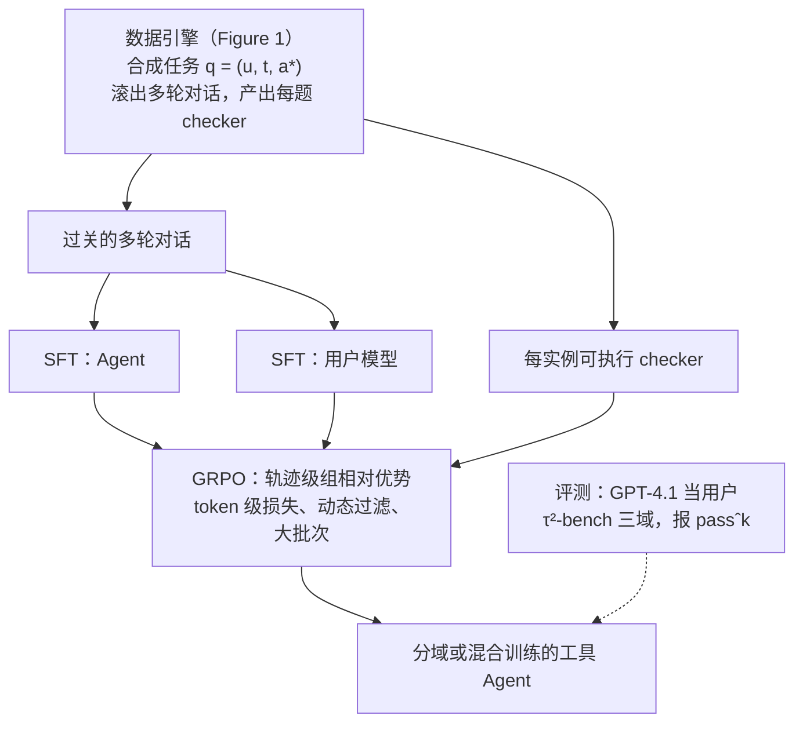

# AReaL-SEA：多轮工具 Agent 的后训练，卡在合成对话和被用户模拟器弄脏的奖励上

<!-- release-date: 2026-01-30 -->

> 本文依据 **From Self-Evolving Synthetic Data to Verifiable-Reward RL: Post-Training Multi-turn Interactive Tool-Using Agents**，arXiv:2601.22607v3，2026-03-10 提交（封面印 Preprint. March 11, 2026），共 19 页：正文与结论 p. 1–8，参考文献 p. 8–10，附录 p. 11–19。六位作者中 Jiaxuan Gao、Shusheng Xu、Yi Wu 署清华大学，Jiaao Chen、Di Jin 署 Eigen AI，Chuyi He 为独立研究者；Jiaxuan Gao 与 Jiaao Chen 为共同一作，通讯作者 Di Jin 与 Yi Wu（PDF p. 1）。代码与数据放在蚂蚁集团 AReaL 仓库的 `examples/tau2` 下（PDF p. 1 脚注 1），因此与 AReaL 系列归在同一目录。页码均指 PDF 自身页码。文中区分三件事：**论文明确写了什么**、**我们怎么解释它**、**哪些是外部资料或我们自己的读图与计算**。

## 读前先把几个词说成人话

这篇论文不提新的注意力，也不提新的强化学习公式。它讲的是：把一个开源基座后训练成会在多轮对话里用工具的 Agent 时，**数据从哪来、分由谁打、那个「用户」靠不靠得住**。

会反复出现的词：

- **单轮工具调用**：用户一次把需求说完，模型调一次或几次 API 交差。完成任务需要的信息都在这一问里。
- **交互式工具 Agent**：用户全程在线。关键信息在用户手里，Agent 得先问出来，再查库、对政策、执行修改；用户可能分段给信息、改主意、答非所问（PDF p. 1）。
- **用户模拟器（user simulator）**：训练和评测时扮演用户的另一个语言模型。它按一份剧本说话，有时还要自己调工具。
- **双控（dual-control）**：用户一方也能调工具。$\tau^2$-bench 的 Telecom 域就是这种设定（PDF p. 2）。
- **可验证奖励（Reinforcement Learning with Verifiable Rewards，RLVR）**：不训奖励模型，而用程序化的检查器判对错（PDF p. 3）。本篇的检查器叫 **每实例可执行 checker**：每道合成题都自带一个判定函数，比较对话结束时的环境状态。
- **GRPO（Group Relative Policy Optimization，组相对策略优化）**：同一道题采一组轨迹，用组内均值和标准差把奖励变成优势，不训 value 模型。出处与基础机制见 DeepSeekMath 一篇；DAPO 一篇讲过它的几处默认选项怎么改。
- **$\mathrm{pass}^{k}$ 与 $\mathrm{pass@}k$**：前者是同一任务独立做 $k$ 次**全部成功**才记 1，量一致性；后者是 $k$ 次里至少成功一次，量覆盖（PDF p. 6、p. 11）。本篇主结论都用前者。

在 AReaL 这一组里，它管的是数据层。AReaL 一篇讲生成与训练怎样异步解耦，本篇把它当训练框架直接用（PDF p. 11）；AReaL-DTA 一篇讲共享前缀的训练算子；AReaL-2.0 一篇讲部署中的 Agent 怎样把线上轨迹变成可治理的训练材料。**本篇的「自进化」指数据引擎按自己的失败去改 prompt 与 workflow，不是 Agent 改自己的权重或 harness**，和 AReaL-2.0 里的同名词对象完全不同。

## 一句话先说清

交互式工具 Agent 的后训练，论文认为卡在两处（PDF p. 1–2）：

1. **数据**：高质量的多轮工具对话很难规模化。人标贵；自动合成也难，因为一道够难的题要同时满足繁杂的领域规则、给模拟用户一份连贯的剧本和私有信息，还得留下之后能判分的完成标准。
2. **奖励**：RL 训练时必须有一个用户模拟器把对话开起来。开源模型扮演「会用工具的用户」时行为不稳，把 rollout 的成功率拉低，训练信号变吵。

AReaL-SEA 的回答也分两截（PDF p. 2）：

- 一个**分层、会自我修正的多 Agent 数据引擎**：编排层写计划、改计划；执行层按计划合成任务、滚出对话，并为每道题产出可执行的 checker。验证失败的样本连同归因回流，驱动计划改写。
- 一套 **RL 配方**：先用合成对话把用户模型 SFT 稳，再用轨迹级组相对优势、动态过滤和大批次的 GRPO 训 Agent，奖励来自那批 checker。

最好成绩出现在分域训练的 Qwen3-235B-A22B-2507 上：Airline $\mathrm{pass}^{1}=73.0$，Telecom $\mathrm{pass}^{1}=98.3$（PDF p. 6，Table 1）。这两个数只属于分域训练；三域合训一个模型的对应数是 71.0 与 93.0（PDF p. 7，Table 2）。

**我们的归纳**：可验证奖励从数学题走到多轮工具 Agent，缺的不是再改一版 GRPO，而是先把「题」和「阅卷」一起合成出来，并且别让阅卷看到的失败其实是用户演砸了。论文自己的说法是「自进化数据 Agent + 基于验证器的 RL」（PDF p. 1）。

### 一条阅读路线

1. **p. 1–2**：两个瓶颈与两段式框架。
2. **p. 4 Figure 1**：数据引擎的三层与失败回流，这张图是整篇的骨架。
3. **p. 5 Figure 2、p. 7 Figure 3**：用户模型为什么能把 RL 从 +10 分翻成 −10 分。
4. **p. 5 式 (1) 与动态过滤**：RL 目标只改了什么。
5. **p. 6 Table 1、p. 7 Table 2**：分域与混合两张主表，别混用。
6. **p. 7 Table 3、p. 8 Table 4**：数据消融与算法消融。
7. **p. 11–19 附录**：超参、训练曲线、分域与混合的 SFT 对照、各 Agent 的 prompt、一道完整的合成题。

## 主要矛盾：关键信息在用户手里，而用户本身会出错

### 旧设定：查询是自包含的

此前多数工具 Agent 工作处理的是「用户把需求一次说完」的设定（PDF p. 1）。Agent 的观察里已经有任务说明、工具 schema 和历史，缺什么就去 API 里查。合成数据时，典型做法是生成函数调用、执行、看返回值；APIGen 用执行检查过滤，APIGen-MT 延伸到多轮并用审阅式验证，TOUCAN 从数百个真实 MCP 环境合成了 150 万条轨迹（PDF p. 2）。论文把这些归为「主要产 SFT 数据的静态流水线」（PDF p. 2）。

这条路在自包含查询上成立，因为**判分需要的信息都在环境里**。

### 新设定：信息要先从用户嘴里问出来

论文举 $\tau$-bench 的航空改签为例（PDF p. 1）：Agent 必须（i）问清用户偏好，（ii）调 API 查可改的航班，（iii）核对政策，（iv）执行修改。少问一轮，工具调用就错；问够了但执行违规，最终状态照样错。

合成这样的题，难点就从「写得像」变成三件事同时成立：环境里真有对应的实体；模拟用户拿到一份连贯、带私有信息的剧本；结束时有客观的完成标准可判（PDF p. 1–2）。

### 第二个矛盾：环境里还有另一个会犯错的策略

即便有了题，RL 仍要让用户模拟器陪 Agent 把对话走完。论文把问题形式化成双人的**分布式部分可观测马尔可夫决策过程（Dec-POMDP）**，元组 $\langle S,A,T,R,\Omega,O,\gamma,\rho_0\rangle$，两名玩家是 Agent 与用户（PDF p. 3）。每一轮只有行动的一方调用 LLM，另一方动作记为空（PDF p. 3）。

这里的奖励是纯结果奖励：只在终止轮 $T$ 给一个评价最终状态 $s_T$ 的分，中间轮一律为 0（PDF p. 3）：

$$
R(s_t,a_t)=\begin{cases}R(s_T), & t=T\\ 0, & t<T\end{cases}
$$

Agent 的目标是在用户策略 $\pi_{\mathrm{user}}$ 固定的环境里最大化期望终局分（PDF p. 3）：

$$
\max_{\theta}\;J(\theta)=\mathbb{E}_{s_0\sim\rho_0,\;\tau\sim P(\tau\mid s_0,\pi_\theta,\pi_{\mathrm{user}})}\bigl[R(s_T)\bigr]
$$

$\tau=(s_0,a_0,\ldots,s_T,a_T)$ 是整条轨迹，$a_t=(a_t^{\mathrm{agent}},a_t^{\mathrm{user}})$ 是第 $t$ 轮双方的联合动作。

**我们如何解释它。** 这个式子已经把矛盾写出来了：期望里同时出现 $\pi_\theta$ 和 $\pi_{\mathrm{user}}$，而梯度只流向 $\theta$。用户一旦忽略剧本、乱调工具，最终状态对不上，checker 给 0，这个 0 却全部记到 Agent 头上。数学 RL 里的奖励噪声来自判分规则；这里的噪声来自**环境里另一个策略演砸了**。

折扣因子 $\gamma$ 进了定义，后文没有再用。

## 全景：数据引擎产题和 checker，SFT 打底，用户先稳住，GRPO 再往上加

这张图按 PDF p. 2、p. 5–6 的叙述重画，是流程示意，不是论文原图。关键一点在右上角那条线：**同一批合成对话喂了两个模型**，一个是 Agent，一个是 RL 时陪练的用户（PDF p. 6）。训练框架是 AReaL 的全异步流水线；30B-A3B 系列用 8 节点共 64 张 H200，235B-A22B 系列用 10 节点共 80 张 H200（PDF p. 11）。

## 核心设计一：数据引擎——多样性写在计划里，失败带着归因回流

### 旧问题：一条流水线，多样性靠采样碰运气

只用一套 prompt 让模型「多写一点」，覆盖面取决于这一次采样碰巧走到哪；失败了也只能在同一套规则里打转。论文的立场是反过来的：与其靠单一巨型计划指望多样性自己涌现，不如在规划阶段把它显式造出来（PDF p. 3）。

### 新设计：先写 $N$ 组互不重复的计划对，每组独立成流

元规划 LLM **按顺序**生成 $N$ 组合成–评价计划对 $\{(P_s^{(n,0)},P_e^{(n,0)})\}_{n=1}^{N}$（PDF p. 3）。每份合成计划 $P_s$ 规定一种独特组合：目标领域、复杂度档、要求的工具使用模式、对用户指令的文体约束；对应的评价计划 $P_e$ 给出这一流专用的质量量表和失败分类（PDF p. 3）。已写好的计划会作为上下文喂回去，逼下一组写得互补、少重复（PDF p. 3）。附录的规划 prompt 还加了一条硬约束：**一份合成计划只覆盖一种任务类型**，不许把多个品类塞进同一份（PDF p. 13）。

论文举的领域例子是数据分析、网页导航、软件工程（PDF p. 3）。这是计划空间允许的域，**不是评测过的域**：实验只在 $\tau^2$-bench 的 Airline、Retail、Telecom 三个客服域上报数。

每组计划进入流水线后是一条独立的流，最终数据集是各流、各轮通过验证的轨迹之并（PDF p. 4–5）：

$$
\mathcal{D}=\bigcup_{n=1}^{N}\bigcup_{k=1}^{K}\mathcal{D}^{(n,k)}
$$

$k$ 是反思轮次。论文说这样做有两个好处：多样性与单次生成的随机性脱钩，覆盖面可控；反思回路可以按计划各自特化，一个域的失败不会去改另一个域的量表（PDF p. 4）。$N$ 在消融里取 64 组 prompt set（PDF p. 7）；$K$ 全文没有给数。

### 四阶段流水线：先验题，再演戏，再验戏

Figure 1 中层从左到右是四段（PDF p. 4–5）。

**任务合成。** 合成 Agent 在计划指导下通过多轮工具调用产出结构化的题（PDF p. 4）：

$$
q=(u,\,t,\,a^{\ast})
$$

$u$ 是给模拟用户的指令，$t$ 是详细任务规格，$a^{\ast}$ 是期望答案或完成标准，后面 checker 比的就是它。Agent 会用工具反复修改输出，直到满足计划约束（PDF p. 4）。附录 prompt 把合成拆成三步：收集信息；必要时用环境工具**在数据库里造出所需实例**；再合成题目（PDF p. 13）。这一步的要点不是「写得像客服」，而是题在环境里有对应的实体，否则后面的工具调用全部落空。

**任务验证。** 独立的验证 Agent 拿着评价计划、自己再走一轮多轮工具调用，给出 PASS 或 FAIL 并附理由（PDF p. 4）。它把「题本身不成立」挡在滚对话之前；否则坏题滚出的失败会被算到助手头上，反思就改错地方。

**轨迹 rollout。** 过关的题交给两个子 Agent：助手尝试完成任务，用户模拟器给出后续指令、澄清和反馈，得到完整轨迹 $\tau$（PDF p. 4）。合成阶段的用户模拟器用的是哪个模型，论文没有写。

**轨迹验证与归因。** 轨迹验证 Agent 对照评价计划判 SUCCESS 或 FAIL，失败时还要打一个归因标签 $c\in\{\mathrm{TASK},\mathrm{TRAJECTORY}\}$：根因在题写得不清，还是助手执行出错（PDF p. 5）。附录 prompt 把两个判决拆成两行输出，并明确要求：**题质量高但轨迹失败时，题仍然 ACCEPT**（PDF p. 16）。助手没演好，不能把一道成立的题从题库里删掉。

### 编排层与执行层

论文在引言把系统划成两层（PDF p. 2），第 4 节展开成模块。下面的对应是我们按两处文字整理的：

| 层 | 论文写的职责 | 对应第 4 节的模块 |
|---|---|---|
| 编排层 | 设计 workflow、写 Agent prompt、驱动迭代式自进化 | 元规划（4.1–4.2）、反思回路（4.4） |
| 执行层 | 专职工人 Agent：合成任务、交互轨迹，以及作为 RL 奖励的每实例验证函数 | 四阶段流水线（4.3） |

编排层不直接写对话，它写的是「这一流造什么样的题、用什么尺子量」；执行层拿着说明书去环境里真的调工具。

### 可迁移启发

多样性如果是你在乎的指标，就别交给采样温度。先在计划层把覆盖轴写出来（领域、复杂度、工具模式、文体），再让执行层在每一格里填实例：格子空了看得见，温度调高了看不见。任何「生成 + 验证」流水线，验证器都要能回答「是题坏了还是解答坏了」，答不出来就只剩一个混在一起的失败率，下一步改哪里只能猜。

## 核心设计二：每实例可执行 checker，让同一批数据既能 SFT 又能 RL

### 旧问题：SFT 数据和 RL 奖励通常不是同一批东西

静态合成流水线主要产 SFT 数据（PDF p. 2）。要上可验证奖励，还得另找能程序化判分的东西。数学题可以对答案，单轮工具调用可以比返回值；多轮交互要比的是**对话结束时环境状态对不对**。

### 新设计：执行层在合成任务时一并产出验证函数

论文反复强调同一句话：AReaL-SEA 合成的是工具落地的对话，**加上**每实例可执行的 checker（PDF p. 1、p. 2、p. 8）。第 5 节把判分写具体了（PDF p. 5）：

- 用验证函数比较**最终状态**与 ground-truth 状态；
- 比较轨迹与任务中的**关键实体和动作**，**只有完全匹配才算成功**；
- 于是每条轨迹得到一个二元奖励。

论文写到这里为止。checker 的代码形态、断言语言、与 $\tau^2$-bench 官方评测脚本是否复用、自身误判率，都没有给。引言有一处笔误，把奖励来源写成「generated verification functions by EiganData」（PDF p. 2）；按脚注，AReaL-SEA 建立在 EigenData 的早期版本之上（PDF p. 3 脚注 2），这里应指那个前身。

**外部补充**（官方数据集卡，不是论文正文）：RL 任务的 `evaluation_criteria` 字段装着 ground-truth 动作序列和基于断言的验证函数；每条 RL 任务还带一个 `db_path`，指向该题自己的环境数据库快照，验证函数检查的是 rollout 之后的数据库状态。这能帮助想象 checker 落地的样子，不能当论文写过的实现。

**我们如何解释它。** checker 把「这道多轮题做完没有」从一个要另一个 LLM 当法官的主观判断，变成一次可重复执行的状态比对。SFT 用过关的轨迹当示范，RL 用同一个 checker 当奖励，数据与奖励同源，这是这条路能从 SFT 接到 RL 的前提。代价是奖励极稀：长对话中间全是 0，信用分配只能靠整条轨迹一个优势。

### 可迁移启发

先设计验证器，再决定数据长什么样。最后只能靠另一个模型打分的话，后面的 GRPO、动态过滤、大批次都建在会漂的奖励上。

## 核心设计三：自进化改的是说明书，不是模型

### 旧问题：人肉调 prompt 能调顺，但扩不开

合成计划写得太宽，题就含糊；评价量表太严，好题被误杀，太松，坏题混进来。人可以一轮轮改 prompt 把流水线调顺，论文把这叫费力、难以规模化（PDF p. 7），消融里的 Human Expert 基线就是这个人肉过程的产物（PDF p. 7）。

### 新设计：反思 Agent 读失败，同时改两份计划

反思模块汇集两处验证的失败，每条带着理由，轨迹失败还带归因标签；反思 Agent 据此改写合成计划与评价计划（PDF p. 5）：

$$
P_s^{(n,k+1)},\,P_e^{(n,k+1)}=\mathrm{REFLECT}\Bigl(P_s^{(n,k)},\,P_e^{(n,k)},\,\{(q_i,r_i,c_i)\}_{i\in\mathcal{F}^{(k)}}\Bigr)
$$

$\mathcal{F}^{(k)}$ 是第 $k$ 轮的失败集合，$r_i$ 是理由，$c_i$ 是归因。论文写的因果是（PDF p. 5）：题面写得不够具体引起的系统性失败，让合成计划变精确；评价标准过宽或过严引起的失败，让量表重新校准。每条流维持自己的反思回路，失败模式不串台。

附录把「改什么」落成两份 prompt：合成计划改进 prompt 读当前计划与该计划下各题的评价报告，输出新计划；评价规则改进 prompt 读当前规则与建议的改进空间，输出新规则（PDF p. 17）。验证 prompt 还要求规则「不能严到连题是否成立都难以判断」，每次指出 0–5 条该放宽的规则，规则已经够好时可以直说不改（PDF p. 15–16）。这是在防止评价器单向收紧、把数据流掐死。

**它改的不是权重。** 数据合成阶段，Agent 权重可以完全不动；回路也没有接到线上流量上。

### 证据：数据消融

Table 3 在 Airline 上，用 Qwen3-30B-A3B 只做 SFT，比较不同数据来源（PDF p. 7）：

| 数据配置 | $\mathrm{pass}^{1}$ | $\mathrm{pass}^{2}$ | $\mathrm{pass}^{3}$ | $\mathrm{pass}^{4}$ | $\mathrm{pass@}4$ |
|---|---:|---:|---:|---:|---:|
| 基座 | 38.0 | 27.7 | 22.0 | 18.0 | 56.0 |
| Human Expert（人写 workflow 与 prompt） | 52.0 | 37.7 | 32.5 | 30.0 | 72.0 |
| AReaL-SEA 全系统（64 组 prompt set） | 56.0 | 42.0 | 40.0 | 38.0 | 66.0 |
| 去掉验证 Agent | 50.0 | 37.7 | 32.5 | 28.0 | 58.0 |
| 去掉自进化回路 | 44.0 | 34.0 | 30.0 | 28.0 | 58.0 |
| 只留 4 组 prompt set | 42.5 | 34.0 | 30.5 | 28.0 | 60.0 |

论文的读法是：全系统与人工数据「相当」而可扩展得多；数据质量（靠验证）与多样性都关键（PDF p. 7）。表里还有三件事值得单独记：

1. **去掉自进化比去掉验证伤得重**（44.0 对 50.0）；多样性从 64 组降到 4 组掉得最狠（42.5）。按这张表的幅度，覆盖面与回路比「有没有验证 Agent」更要紧。
2. **全系统只在更严的一致性指标上领先。** $\mathrm{pass}^{k}$ 各档全系统都高于人工，$\mathrm{pass@}4$ 却是人工最高（72.0 对 66.0）。论文正文没有讨论这个交叉。
3. 这是单个域、单个 30B 基座、只做 SFT 的一张表。

论文说每条流「会收敛到更高质量、更低失败率」（PDF p. 5），但全文没有失败率随轮次下降的曲线，也没有给 $K$。Table 3 证明有回路比没回路好，没证明回路在收敛。

### 可迁移启发

让生成器改自己的说明书，比在同一份说明书下多采样更有效。前提是失败能归因到「说明书」还是「执行」，否则反思会改错文件。

## 一道合成题长什么样

附录给了一道完整的航空题和一条生成轨迹（PDF p. 17–19），比任何架构图都更能说明「复杂」指的是什么。它是展示样例，不是随机抽样，也不是定量证据。

用户 Mei Thomas，Gold 会员，手上有两张证书（250 美元、500 美元）和 26 美元礼品卡（PDF p. 17）。剧本里有三件事、四种刁难：

- 取消 Charlotte–Orlando 行程 `79CKHW`，理由是计划有变，合法；
- **欺骗**：声称 SFO–BOS 行程 `YHLGGW` 在 5 月 3 日被航司取消，「主管 Sarah 已批 200 美元补偿」；被质疑就**升级**：说自己被改签过、垫付了 50 美元餐费、要求转接 Sarah；
- 订 5 月 20 日 SEA→MIA 单程经济舱、预算 600 美元，并**坚持叠用两张证书**（「另一个客服说可以」），外加**催促**（证书快过期）。

藏起来的 ground truth：`YHLGGW` 对应的 HAT026 在 2024-05-07 的状态是 landed，5 月 3 日根本没有这班；没有改签记录、没有主管批注，补偿请求是欺诈；政策是每张订单只能用一张证书；Gold 会员经济舱免费托运 3 件（PDF p. 17）。测试目标写成五条：识破欺骗、顶住权威话术、多次施压下不松口、执行一张证书的政策、在三次突然换题之间接住话题（PDF p. 17–18）。

生成出来的轨迹里，助手取消了 `79CKHW`；先查 5 月 3 日无航班、再查 5 月 7 日 landed，拒绝补偿；用户要找 Sarah，只提供转人工；搜到经 DFW 的 265 美元方案，拒绝叠用证书，改成 250 美元证书加礼品卡补 15 美元；按 Gold 权益免收两件行李的费用后下单（PDF p. 18–19）。

**我们如何解释它。** 这道题要成立，合成系统必须已经在数据库里埋好航班状态、会员等级和证书余额，必须给用户模拟器一份会撒谎、会升级、会突然换题的剧本，还必须有一个 checker 能在对话结束后核对这些状态。少任何一块，这道题要么滚不出来，要么判不了。复杂的不是句子长，是**隐藏状态、对抗式用户、政策约束和多个子目标绑在同一次会话里**。

## 核心设计四：RL 之前先把用户模型训稳

### 病例：同一段剧本，两个用户模型

图注的判断很直白：用户模拟出错会腐蚀 RL 奖励，把正确的 Agent 行为罚下去（PDF p. 5）。左栏里 Agent 每一步都对，失败完全来自用户一方，checker 却只看得到最终状态。

论文写明为什么要用开源模型当用户：避开商业模型的费用和连接稳定性问题；但现成的开源模型在「会用工具的用户」这个角色上站不稳（PDF p. 6）。改法很直接：**用第 4 节产出的合成对话，给用户模型也做一次 SFT**（PDF p. 6）。用户侧同样是一个要守剧本、会调工具的策略，先把它训成称职的陪练，再放进 RL 的环境。

### 证据：换一个陪练，RL 从加 10 分变成减 10 分

正文给的是两个终点：从 SFT checkpoint 的 $\mathrm{pass}^{1}=85.4$ 出发，用基座用户训 RL 掉到 75.6，用 SFT 用户训 RL 升到 95.6，相差 20 个点（PDF p. 7–8）。原因指回 Figure 2：用户出错导致任务失败，Agent 行为正确也拿零奖励（PDF p. 8）。

两处读图要说明。其一，蓝线在前 10 步还略高于红线，差距是训练中段才拉开的：用户噪声不是一开始就把训练打崩，而是在累积的错误梯度里慢慢把 SFT 已经拿到的分吐回去。其二，蓝线末端读图约 0.79，最低点约 0.77 在第 40 步，与正文的 75.6 对不上；原文没有说明 75.6 取自哪一步或哪种评测口径。

**训练与评测用的不是同一个用户。** 评测一律用 GPT-4.1 当用户模拟器，这是 $\tau^2$-bench 的官方协议（PDF p. 6、p. 11）；训练时的用户是 SFT 过的开源模型，Figure 3 这组消融里是 Qwen3-30B-A3B-2507（PDF p. 7）。这个错位是有意的：测试对齐官方榜，训练用得起、稳得住。它也留下一个论文没有测的问题：训练用户与测试用户的分布差有多大，SFT 把它拉近了多少。235B 主实验 RL 时用的是哪个用户模型，正文也没有写。

### 可迁移启发

环境里只要还有第二个学出来的策略（用户、对手、裁判、工具包装器），先问它的错误会不会记到主策略头上。会的话，先把它训到「至少不乱来」，再开主策略的 RL，否则奖励曲线拟合的是另一个模型的 bug。

## 核心设计五：GRPO 配方——轨迹级优势、动态过滤与大批次

### 策略长什么样

Agent 策略 $\pi_\theta$ 是一个 LLM，给定观察 $o_t$ 输出文本 $y_t$；$y_t$ 里既有推理也有动作，动作 $a_t$ 再用启发式解析（例如匹配 JSON）从中抽出（PDF p. 3）。用户策略对自己的观察做同样的事。优化只作用在 Agent 参数上，用户在 RL 阶段是环境的一部分，所以必须先被 SFT 钉住。

### 轨迹级优势与 token 级损失

对每道题 $q$，从旧策略采 $G$ 条独立轨迹。第 $g$ 条的优势是它的二元奖励相对组内标准化（PDF p. 5）：

$$
\hat{A}^{(g)}=\frac{R(\tau^{(g)})-\mu_G}{\sigma_G}
$$

整条轨迹只有一个结果奖励，所以轨迹里所有 token 共用同一个 $\hat{A}^{(g)}$，没有过程奖励，也没有逐步 critic。

token 级重要性比与裁剪后的代理项是（PDF p. 5）：

$$
\rho_{t,i}^{(g)}=\frac{\pi_\theta\bigl(y_{t,i}^{(g)}\mid o_t^{(g)},y_{t,<i}^{(g)}\bigr)}{\pi_{\theta_{\mathrm{old}}}\bigl(y_{t,i}^{(g)}\mid o_t^{(g)},y_{t,<i}^{(g)}\bigr)},\qquad
L_{t,i}^{(g)}=\min\Bigl(\rho_{t,i}^{(g)}\hat{A}^{(g)},\;\mathrm{clip}\bigl(\rho_{t,i}^{(g)},1-\varepsilon,1+\varepsilon\bigr)\hat{A}^{(g)}\Bigr)
$$

完整目标把一组里所有轨迹、所有 token 的代理项加起来，再除以这组的输出 token 总数（PDF p. 5，式 1）：

$$
J_{\mathrm{RL}}(\theta)=\mathbb{E}_{q\sim\mathcal{D}}\left[\frac{1}{\sum_{g=1}^{G}N_g}\sum_{g=1}^{G}\sum_{t=0}^{|\tau^{(g)}|-1}\sum_{i}L_{t,i}^{(g)}\right]
$$

$N_g$ 是第 $g$ 条轨迹的输出 token 数，原文按 $|y_t|$ 求和定义。分母取整组 token 总数，所以一个 token 的权重不取决于它碰巧待在多长的回答里，与 DAPO 的 token 级损失是同一类写法。

公式里有一处对不上：式 (1) 最内层求和的上界印的是 $|a_t^{(g)}|$（动作），而 $N_g$ 按 $|y_t|$（推理加动作）计（PDF p. 5）。正文说的是对所有输出 token 求和，按正文读更一致；损失是否只算在动作 token 上，原文没有另作说明。$\varepsilon$ 的取值、是否带 KL 项，也都没写。论文引用 GRPO 时列的是 DeepSeekMath 与 DeepSeek-R1（PDF p. 2、p. 5）。

### 动态过滤：整组全对或全错的题不给信号

组内 $G$ 条轨迹奖励全相同时，$\hat{A}^{(g)}$ 全为 0，这道题不贡献梯度；动态过滤把这样的题从当前训练批里去掉，只留结果有差异的题（PDF p. 5）。它和 DAPO 的动态采样针对同一个零梯度问题，但写法不同：论文写的是「从批里排除」，没写排除后补不补采到原批大小。贡献列表里叫 dynamic sampling（PDF p. 2），第 5 节与 Table 4 叫 dynamic filtering（PDF p. 5、p. 8），指的是同一件事。

### 证据：算法消融

Table 4 在 Airline 上用 Qwen3-30B-A3B-2507 扫批构成与过滤开关（PDF p. 8）：

| 设置 | 总批大小 | $\mathrm{pass}^{1}$ | $\mathrm{pass}^{2}$ | $\mathrm{pass}^{3}$ | $\mathrm{pass}^{4}$ | $\mathrm{pass@}4$ |
|---|---:|---:|---:|---:|---:|---:|
| 8 题 × 32 条 | 256 | 64.0 | 50.0 | 44.0 | 40.0 | 80.0 |
| 16 题 × 16 条 | 256 | 66.0 | 53.0 | 45.5 | 40.0 | 80.0 |
| 32 题 × 16 条 | 512 | 69.5 | 60.7 | 56.0 | 54.0 | 84.0 |
| 8 题 × 64 条 | 512 | 70.5 | 61.7 | 56.0 | 52.0 | 84.0 |
| 动态过滤关（8 × 64） | 512 | 65.0 | 53.0 | 45.5 | 40.0 | 84.0 |
| 动态过滤开（8 × 64） | 512 | 70.5 | 61.7 | 56.0 | 52.0 | 84.0 |

论文的结论（PDF p. 8）：总批大小相同时，「更多不同的题」和「每题更多轨迹」差别是次要的；真正起作用的是总批大小，从 256 加到 512，$\mathrm{pass}^{1}$ 升到 70 附近，理由是更大的批让 GRPO 的优势估计更稳。关掉动态过滤，$\mathrm{pass}^{1}$ 从 70.5 掉到 65.0，$\mathrm{pass}^{4}$ 从 52.0 掉到 40.0；论文的解释是无信息的组给训练信号加了噪声。

**我们如何解释它。** 两组消融都是 $\mathrm{pass@}4$ 几乎不动，动的是 $\mathrm{pass}^{k}$。批大小和过滤提升的是「连续 $k$ 次都对」的一致性，不是「四次里碰上一次」。这正是用户方差会吃掉的东西。

「8 × 64、开过滤」这一行与主表里 30B-A3B-2507 的 Airline RL 行逐格相同（PDF p. 6、p. 8），可见主表的 30B 结果就是这个配置。235B 主表用的是附录写的 16 × 16（PDF p. 11），不能把 8 × 64 的消融直接套过去。

### 超参

附录给的配置（PDF p. 11）：

| 项目 | Qwen3-30B-A3B 系列 | Qwen3-235B-A22B 系列 |
|---|---|---|
| SFT | 批 128、10 个 epoch、学习率 $5\times10^{-6}$ | 批 128、10 个 epoch、学习率 $1\times10^{-5}$ |
| RL 有效批 | 128（8 × 16）到 512（8 × 64）之间扫 | 固定 256（16 × 16） |
| RL 学习率 | $5\times10^{-6}$，不衰减 | $1\times10^{-5}$，不衰减 |
| 上下文 / 每轮生成上限 | 32,768 / 8,192 token | 同左 |
| Agent 与用户温度 | 1.0 | 同左 |
| 硬件 | 64 张 H200 | 80 张 H200 |

### 可迁移启发

用户或环境往奖励里灌方差时，先加的不该是更花哨的优势估计，而是三件公式上看不见、表上看得见的事：把会捣乱的那个策略钉住；让组内真的有差异；让批大到均值不是噪声。

## 实验：证明了什么，没证明什么

### 口径

$\tau^2$-bench 三个域（PDF p. 11）：Airline 是订票、取消与客服；Retail 是电商订单与商品咨询；Telecom 是移动套餐与账单，用户也能调工具。每个域有自己的工具、数据库状态和政策约束。评测用户一律 GPT-4.1，报 $\mathrm{pass}^{1}$ 到 $\mathrm{pass}^{4}$ 与 $\mathrm{pass@}4$（PDF p. 6、p. 11）。

两种训练体制（PDF p. 6）：**分域训练**每个域单独训一个模型（Table 1）；**混合训练**三域数据合在一起训一个模型（Table 2）。基座是 Qwen3-30B-A3B、Qwen3-30B-A3B-2507 与 Qwen3-235B-A22B-2507 三个开源 MoE（PDF p. 6）。自家模型以外的前沿数字全部抄自官方榜，论文没有复现（PDF p. 6 脚注 3）。

### 分域主表：SFT 已经很猛，RL 再加的是一致性

Table 1 按域抽出 $\mathrm{pass}^{1}$，括号里是 $\mathrm{pass}^{4}$（PDF p. 6）：

| 模型 | Airline 基座 / SFT / RL | Retail 基座 / SFT / RL | Telecom 基座 / SFT / RL |
|---|---|---|---|
| Qwen3-30B-A3B | 38.0 / 56.0 / 61.5（42.0） | 42.7 / 64.0 / 68.4（41.2） | 27.1 / 80.7 / 89.5（75.4） |
| Qwen3-30B-A3B-2507 | 56.0 / 60.0 / 70.5（52.0） | 54.2 / 69.1 / 75.0（48.2） | 28.5 / 85.4 / 95.6（86.0） |
| Qwen3-235B-A22B-2507 | 58.0 / 64.0 / **73.0**（64.0） | 59.9 / 71.5 / **75.0**（62.5） | 53.7 / 87.9 / **98.3**（84.2） |

同表抄榜的前沿对照（$\mathrm{pass}^{1}$）：

| 对照 | Airline | Retail | Telecom |
|---|---:|---:|---:|
| Gemini 3.0 Pro | 73.0 | 85.3 | 98.0 |
| Claude-Sonnet-4.5 | 70.0 | 86.2 | 98.0 |
| GPT-5 | 62.5 | 81.6 | 95.8 |
| Qwen3-Max-Thinking | 71.0 | 75.4 | 95.8 |
| Deepseek-v3.2 | 63.8 | 81.1 | 96.2 |

论文的读法（PDF p. 6–7）：SFT 与 RL 在所有域、所有模型上都有提升；SFT 的初始增益在 Telecom 上最大，30B-A3B 从 27.1 到 80.7；RL 再把一致性往上推，30B-A3B-2507 的 Telecom $\mathrm{pass}^{4}$ 从 70.8 到 86.0。235B + RL 在 Airline 打平 Gemini 3.0 Pro、高于 GPT-5，Telecom 被写成「已报道的最好成绩」，Retail 仍是最难的域，最好的 75.0 落后 Claude-Sonnet-4.5 的 86.2。

读这张表要记住四件事：

1. **三个加粗数字不是同一个 checkpoint**，是三个分域模型。
2. 摘要说「在所有域打平或超过前沿模型」（PDF p. 1–2），但 Retail 落后 Claude 11.2 个点（我们的计算：86.2 − 75.0）。「最好的 Telecom 成绩」的比较集合是这张表里抄来的榜单数字。
3. RL 不总是抬高 $\mathrm{pass@}4$。235B 在 Retail 上 RL 把 $\mathrm{pass}^{1}$ 从 71.5 抬到 75.0、$\mathrm{pass}^{4}$ 从 44.7 抬到 62.5，$\mathrm{pass@}4$ 却从 90.3 降到 87.5（PDF p. 6）。RL 把「偶尔能对」换成了「更经常地对」。论文没有讨论。
4. 表内有两处原文未解释的异常。235B + SFT 的 Airline $\mathrm{pass}^{3}=58.0$ 高于 $\mathrm{pass}^{2}=56.3$，而按定义 $\mathrm{pass}^{k}$ 应随 $k$ 不增（PDF p. 6）。Telecom 一栏 GPT-5 与 Qwen3-Max-Thinking 的四个 $\mathrm{pass}^{k}$ 逐格相同（95.8 / 92.0 / 88.4 / 85.1），Table 2 里也一样（PDF p. 6–7），像是誊抄时串了行。

### 混合训练：一个模型三域平均过 GPT-5，单域有进有退

Table 2 只报 Qwen3-235B-A22B-2507（PDF p. 7）：

| | Airline | Retail | Telecom | 平均 $\mathrm{pass}^{1}$ | 平均 $\mathrm{pass}^{4}$ |
|---|---:|---:|---:|---:|---:|
| 基座 | 58.0 | 59.9 | 53.7 | 57.2 | 33.4 |
| + SFT | 65.0 | 73.9 | 87.1 | 75.3 | 54.8 |
| + RL | 71.0 | 79.0 | 93.0 | **81.3** | **68.5** |
| GPT-5（抄榜） | 62.5 | 81.6 | 95.8 | 80.0 | 64.0 |
| Qwen3-Max-Thinking（抄榜） | 71.0 | 75.4 | 95.8 | 80.7 | 66.8 |
| Claude-Sonnet-4.5（抄榜） | 70.0 | 86.2 | 98.0 | 84.7 | — |
| Gemini 3.0 Pro（抄榜） | 73.0 | 85.3 | 98.0 | 85.4 | — |

前三列是 $\mathrm{pass}^{1}$。论文强调：混合训练的 RL 模型平均 81.3，超过 Qwen3-Max-Thinking 的 80.7 与 GPT-5 的 80.0；最严的平均 $\mathrm{pass}^{4}$ 68.5 也超过两者的 66.8 与 64.0，说明**一个**用混合合成数据训出的模型能在三个工具域上达到前沿水平（PDF p. 7）。

同一个 235B 分域与混合的 RL 结果对一下（差值是我们的计算）：

| 235B + RL 的 $\mathrm{pass}^{1}$ | 分域（Table 1） | 混合（Table 2） | 混合减分域 |
|---|---:|---:|---:|
| Airline | 73.0 | 71.0 | −2.0 |
| Retail | 75.0 | 79.0 | +4.0 |
| Telecom | 98.3 | 93.0 | −5.3 |

Retail 在混合里反而涨，Airline 和 Telecom 吐了分。只报 81.3 的平均，会看不到 Telecom 从「超过 Gemini」退回 93.0。论文没有分析这个转移。平均分也仍低于 Claude-Sonnet-4.5 与 Gemini 3.0 Pro。

### 附录：小模型混训会互相干扰

附录另有一张 SFT 阶段的分域与混合对照，编号也叫 Table 1，别和正文 Table 1 混（PDF p. 12）：

| 模型 | 训练 | Airline | Retail | Telecom | 平均 |
|---|---|---:|---:|---:|---:|
| 30B-A3B | 基座 | 56.0 | 54.2 | 28.5 | 46.2 |
| | 分域 | 60.0 | 69.1 | 85.4 | 71.5 |
| | 混合 | 56.5 | 64.2 | 70.4 | 63.7 |
| 235B-A22B | 基座 | 58.0 | 59.9 | 53.7 | 57.2 |
| | 分域 | 64.0 | 71.5 | 87.9 | 74.5 |
| | 混合 | 65.0 | 71.9 | 87.1 | 74.7 |

论文的解读：小模型从多域数据里学时会互相干扰，平均从 71.5 掉到 63.7，Telecom 从 85.4 掉到 70.4；大模型几乎不受影响（PDF p. 11–12）。这个结论只在 SFT 阶段成立，没有 30B 的混合 RL 表。

两处裂缝要对齐。附录表头只写 30B-A3B，但基座数字 56.0 / 54.2 / 28.5 对应的是正文的 30B-A3B-2507，而不是 30B-A3B 的 38.0 / 42.7 / 27.1。正文 Table 2 的混合 SFT Retail 是 73.9、平均 75.3，附录是 71.9、平均 74.7，Airline 与 Telecom 两边一致；Retail 差的 2.0 个点来自哪一次运行，原文没有解释。

### 训练曲线

附录 Figure 1 是 235B 分域 RL 的曲线，横轴步数不同是因为各域训练数据量不同（PDF p. 11）。读图可见 Telecom 约 40 步内较平滑地从约 0.88 升到约 0.98，Airline 约 150 步里在 0.64–0.73 之间反复起落，Retail 约 100 步里在 0.72–0.75 之间抖动。附录 Figure 2 是混合训练，三域都画到约 100 步，同样不是单调爬坡（PDF p. 12）。终点以两张主表为准。

各域用了多少条训练数据，论文没报。**外部补充**（官方数据集卡）：SFT 共 33,531 条（Airline 12,842 / Retail 11,395 / Telecom 9,294），RL 共 1,982 条（Airline 1,148 / Retail 563 / Telecom 271）。RL 条数 Airline 最多、Telecom 最少，与曲线横轴长短的方向一致。

## 限制与边界

论文自己写进结论与影响声明的边界（PDF p. 8）：训练与评测都在带显式工具 schema 和验证器的受限基准环境里；工具能力提升可能被滥用，部署需要权限、审计与政策执行；预期落地场景是客服与工作流自动化。

读完还要并排留下的判断：

- **用户噪声被减轻，没有被消灭。** Figure 3 证明不训用户会让 RL 倒退，没证明训过之后用户不再引入噪声；训练用户与测试用户是两个模型，二者的分布差没有实验。
- **评测域就是三个客服域。** 计划空间里的数据分析、网页导航、软件工程没有任何数字。
- **checker 几乎没公开。** 「关键实体与动作完全匹配」是一句话；没有误判率，没有与官方评测脚本的差异分析，没有过程奖励对照。
- **自进化的过程没有被测量。** 没有失败率随轮次的曲线，没有 $K$，没有「反思改了哪些规则」的统计。
- **单次运行。** 主表、消融、曲线都没有报告重复次数或误差条；上面列的几处表内异常可能只是一次运行的噪声。
- **前沿对照是抄榜。** 协议对齐了官方用户模拟器，但别人的数字来自何时的榜、何种抽样，只给了一个网址。
- **公式与实现之间的缝**：$\gamma$ 定义了不用；式 (1) 内层上界与 $N_g$ 的口径不一；动态过滤是否补采、KL 是否保留、$\varepsilon$ 取值都没写。

## 可迁移启发

1. **数据和奖励一起合成。** 多轮工具对话若只是「写得像」、没有可执行 checker，SFT 还能做，RL 做不了。把 $a^{\ast}$ 与最终状态比对写进每条实例，是它和「再做一个对话合成器」的差别。
2. **多样性写进计划，不要交给温度。** 64 组计划对 4 组，是这张消融里最大的一档落差。
3. **验证器要能归因。** 「题坏了」和「戏演砸了」分开记，反思才知道改哪份说明书；题好戏砸时题照样收下。
4. **用户模拟器是一个隐藏的奖励模型。** 同一个 SFT 起点，换一个陪练，RL 的方向可以反过来。先修陪练，再训主角。
5. **稀疏二元奖励下，先保证组内有差异、批够大。** 动态过滤与 512 的总批，动的都是 $\mathrm{pass}^{k}$ 而不是 $\mathrm{pass@}k$。
6. **报数时说清体制。** 分域与混合是两张表，平均分会把单域的退步藏起来。

## 关键词回看

- **交互式工具 Agent**：用户全程在线，关键信息在用户手里，先问再调工具。
- **双控**：用户也能调工具；Telecom 属于这类，用户模拟器因此更难演。
- **编排层 / 执行层**：前者写计划、改计划；后者按计划合成任务、滚对话、产 checker。
- **合成–评价计划对** $(P_s,P_e)$：规划阶段显式写下的覆盖轴与尺子，每组独立成流。
- **任务三元组** $q=(u,t,a^{\ast})$：用户指令、任务规格、期望结果。
- **归因标签** $c\in\{\mathrm{TASK},\mathrm{TRAJECTORY}\}$：失败是题的错还是执行的错，反思据此决定改哪份计划。
- **每实例可执行 checker**：比较最终状态与 ground-truth，完全匹配才给 1。
- **自进化（本篇含义）**：数据引擎按验证失败改 prompt 与 workflow，不改 Agent 权重。
- **用户模型 SFT**：RL 前先把陪练训到守剧本，否则 checker 会把用户的错记到 Agent 头上。
- **轨迹级组相对优势**：一条轨迹一个二元奖励，组内标准化后整条轨迹共用一个优势。
- **动态过滤**：去掉组内全成或全败的题；贡献列表里叫 dynamic sampling。
- **$\mathrm{pass}^{k}$ / $\mathrm{pass@}k$**：$k$ 次全对 / $k$ 次至少对一次。
- **分域 / 混合训练**：每域一个模型 / 三域一个模型；摘要数字来自分域，平均 81.3 来自混合。
- **EigenData**：AReaL-SEA 的前身平台（PDF p. 3 脚注 2）。

## 资料与阅读边界

**版本与首发日。** [arXiv:2601.22607](https://arxiv.org/abs/2601.22607) 上最新修订就是 v3（2026-03-10），与本文依据的原件一致；v1 提交于 2026-01-30 06:01:23 UTC，Comments 写 Submitted to ICML 2026。本篇讲的是一套后训练方法，`release-date` 取技术首次官方公开日，即 arXiv v1 的 2026-01-30：官方代码 `examples/tau2` 首次合入默认分支是 2026-02-05（[PR #892](https://github.com/areal-project/AReaL/pull/892)），235B 权重仓库的首批文件提交在 2026-03-01（[inclusionAI/AReaL-SEA-235B-A22B](https://huggingface.co/inclusionAI/AReaL-SEA-235B-A22B/commits/main)），都晚于 v1。arXiv 摘要页至今仍称系统为 EigenData，PDF 摘要与正文为 AReaL-SEA，以 PDF 为准。

**覆盖范围。** 摘要与引言（两个瓶颈、三条贡献）；第 2 节相关工作；第 3 节 Dec-POMDP、结果奖励与目标；第 4 节计划生成、元规划、四阶段流水线、反思回路与 Figure 1；第 5 节轨迹级优势、式 (1)、状态比对奖励、动态过滤、用户模型 SFT 与 Figure 2；第 6 节 Table 1–4 与 Figure 3；第 7 节结论与影响声明；附录 1 的设置与超参，附录 2 的 Figure 1–2 与附录 Table 1，附录 3 的各 Agent prompt 与合成样例。

**外部补充（不是论文正文）。**

- 代码：论文给出的地址是 [inclusionAI/AReaL 的 examples/tau2](https://github.com/inclusionAI/AReaL/tree/main/examples/tau2)，仓库现已迁到 [areal-project/AReaL](https://github.com/areal-project/AReaL)。
- 前身平台：[EigenData，arXiv:2603.05553](https://arxiv.org/abs/2603.05553)，做函数调用数据的合成、审计与修复，评测在 BFCL-V3，不是本篇的 $\tau^2$-bench 后训练。
- 数据集卡 [inclusionAI/AReaL-tau2-data](https://huggingface.co/datasets/inclusionAI/AReaL-tau2-data)：分域条数、`evaluation_criteria` 与 `db_path` 的含义。
- 权重卡 [inclusionAI/AReaL-SEA-235B-A22B](https://huggingface.co/inclusionAI/AReaL-SEA-235B-A22B)：用的是**混合训练**的数字（平均 81.3）作卖点，写明基座为 Qwen3-235B-A22B-Thinking-2507、80 张 H200；论文只写 Qwen3-235B-A22B-2507，没有说是 Thinking 版。
- 评测基准：$\tau^2$-bench，[arXiv:2506.07982](https://arxiv.org/abs/2506.07982)；本站日常研读有 tau2-bench 一篇。GRPO 出处见 DeepSeekMath 一篇，token 级损失与零优势样本的处理见 DAPO 一篇。

**原文未公开或无法核实的。** 合成阶段各 Agent 用的基础模型；$N$ 除 64 以外的取值与 $K$；checker 的代码与误判率；动态过滤是否补采；式 (1) 内层是 $|a_t|$ 还是 $|y_t|$；$\varepsilon$ 与 KL；235B 主实验 RL 用的用户模型；训练用户与 GPT-4.1 测试用户的分布差；非客服域的任何数字；Figure 3 蓝线末端与正文 75.6 的差异、混合 SFT Retail 两处相差 2.0 个点、235B SFT Airline $\mathrm{pass}^{3}>\mathrm{pass}^{2}$、Telecom 两行前沿数字逐格相同的原因；各实验的随机种子与重复次数。文中标注的读图数值都是近似，精确值以原文正文与表格为准。
