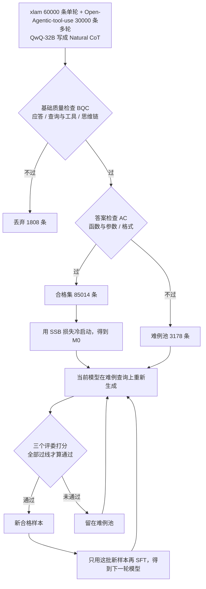

# BalanceSFT：长思维链淹没短调用、简单题占满训练集，用分段损失和错题循环把工具调用 SFT 拧平

<!-- release-date: 2025-05-26 -->

> 本文依据本地 `papers/AntGroup/BalanceSFT.pdf`，即 **BalanceSFT: Improving LLM Function Calling with Balanced Training Signals and Data Hardness**，arXiv:2505.20192v3、2025-11-25 提交，共 18 页。十二位作者中九位署 AWorld Team, Inclusion AI（其中四人脚注为在蚂蚁集团完成），另有香港城市大学两位、西南交通大学一位；通讯作者为 Chenyi Zhuang 与 Ji Zhang（PDF p. 1）。页码均指这份 PDF 自身的页码。文中会区分三件事：**论文明确写了什么**、**我们怎么解释它**、**哪些是外部资料或本文推算**。

## 读前先把几个词说成人话

这是一篇工具调用监督微调的方法论文。没有新架构，也没有预训练配方。它讲的是：给模型灌「先想再调工具」的示范时，梯度怎样被分歪，以及怎样在 SFT 内部把它拧回来。

先把会反复出现的词说清楚：

- **函数调用（function calling）**：模型不直接回答，而是按约定格式写出函数名和参数，交给外部工具执行。本篇的格式是 `[func(k=v), …]`，评测常用抽象语法树（AST）解析后比对函数名与参数。
- **思维链（Chain-of-Thought，CoT）**：调用之前先用自然语言写出「该调哪个、参数从哪来」。本篇的样本是 `<think>…</think>` 后面紧跟一行调用，例如 `[matchschedules(day=28, month=2, year=2024)]`（PDF p. 18，Figure 12）。
- **SFT（Supervised Fine-Tuning，监督微调）**：拿「思维链 + 调用」当标准答案，用下一个 token 的交叉熵训练。常规做法对每个答案 token 一视同仁。
- **SSB（Self-adjusted Signal Balancing，自调节信号平衡）损失**：本篇的第一个组件，把思维链和调用分成两段各自取平均，再按比例混合。
- **HDR（Hard Data Re-sampling，难例重采样）**：本篇的第二个组件，把答错的题单独拎出来，让模型自己重做、大模型评委把关，再微调。
- **BFCL（Berkeley Function Calling Leaderboard）**：主评测榜。本篇用 v3，分单轮（Non-Live 为静态题，Live 为用户真实提交的题）与多轮（Base、缺函数 Miss Function、缺参数 Miss Parameter、长上下文 Long Context）（PDF p. 5–6）。

## 一句话先说清

教模型调工具，最省事的办法是找一批「先想再调」的示范，整段拿去 SFT。论文指出这条路有两个互相咬合的漏洞（PDF p. 1–2）：

1. **训练信号不均衡（Imbalanced Training Signals）**：思维链平均 350.74 个 token，函数调用平均只有 31.07 个，约差 10 倍（PDF p. 3，Table 1）。按 token 平均，梯度大半花在「把推理写得像样」上，真正要执行的那一行被稀释。
2. **数据难度不均衡（Imbalanced Data Hardness）**：现成数据以简单题为主，能逼出边界错误的难例很少（PDF p. 2）。

BalanceSFT 的回答都留在 SFT 里：损失改成思维链一段、调用一段，中间用一个可学习的 $\alpha$ 分份额；数据不再把答错的题丢掉，而是放进难例池，让模型自己重做、三个评委全部通过才收，再拿新样本继续微调。

头条结果要连着基线读（PDF p. 6–7，Table 2 与 Table 5）：

| BFCL v3（%） | 多轮 Overall | 单轮 Overall |
|---|---:|---:|
| Qwen2.5-Coder-7B-Inst（基座） | 3.88 | 76.82 |
| 基座 + 普通 SFT | 38.25 | 81.73 |
| BalanceSFT-7B | 47.00 | 84.00 |
| GPT-4o-2024-11-20 | 42.50 | 77.21 |
| DeepSeek-R1-0528 | 44.50 | 78.22 |

摘要说「7B 模型打平 GPT-4o」（PDF p. 1）。这张表说明了两件事：多轮从 3.88 到 47.00（PDF p. 6，Table 2），大头（到 38.25，PDF p. 7，Table 5）是普通 SFT 就能拿到的；BalanceSFT 真正多拿的是之后的约 9 个点。第二，「打平」不是每个分项都赢，后文逐项拆开。

### 一条阅读路线

1. **p. 3 Table 1 与式 2–3**：先看 10 倍的 token 差怎样变成损失份额差。
2. **p. 4 Figure 2 与式 4–9**：两道质检门、难例池、评委与循环。
3. **p. 6 Table 2**：BFCL 主表；**p. 7 Table 5**：两个组件的消融。
4. **p. 8 Figure 4**：对照 GRPO、代码能力遗忘、循环每一轮的多轮分数。
5. **p. 13 附录 C**：单轮分项、BFCLv4 智能体子集、ACEBench 全表、Qwen3-4B。

## 主要矛盾：损失的单位和任务的单位对不上

标准 SFT 把「思维链 + 调用」当一条序列，对全部位置取平均（PDF p. 2–3）。思维链几百个 token，调用一行。平均之后，模型只要把长推理写通顺，损失就已经很好看；最后那几个必须一字不差的函数名、参数名与参数值，只占很小一份。相关工作一节把后果说得很直白：模型会被激励去写「精致、看似合理、却不指向正确可执行调用」的推理链（PDF p. 3）。

这不是「思维链没用」，而是**思维链和调用在损失里的计量单位不一致**：一个按长度计，一个按对错计。

数据侧的矛盾是另一件事。Figure 1 用两个天气问题举例（PDF p. 1）：「芝加哥和多伦多未来 7 天天气」是简单题；「多伦多飞东京的航班会不会受未来 7 天天气影响」要把天气和航班串起来，才是难例。现成数据天然偏向前者。附录还给了一个「脏」的样例：xlam 数据里一条参考答案的函数名前多了空格，写成 `[ forecast_weather_api(...)]`，AST 解析直接失败（PDF p. 11、p. 14，Figure 6）。

**我们如何解释它**：两层会叠加。信号不均衡让模型在简单题上靠「把推理写长」就能把损失做低；难度不均衡又让它很少见到非得把调用写对才能过关的题。基座在多轮上只有 3.88、单轮却有 76.82（PDF p. 6），说明「会写一次调用」和「在多轮对话里不漏函数、不漏参数」不是同一种能力。

## 先看全景：过滤一次，冷启动一次，再对着错题转圈

这张图按 PDF p. 4 的 Figure 2、式 4–9 与 p. 11 附录 A.1 的计数重画，是流程示意。循环在难例池清空或达到 $T_{\max}=10$ 轮时停止（PDF p. 4–5）。三个计数相加正好是 90000（本文验算）；难例约占 3.5%。

两个组件分别接在图的两处：SSB 管每一次 SFT 的损失怎么算，HDR 管循环里的数据从哪来。

## 核心设计一：SSB，给调用留一个不被长度稀释的座位

### 旧问题

记一条答案由思维链 $t$ 和调用 $f$ 拼成，长度分别是 $N_t$、$N_f$，总长 $N_{\mathrm{all}}=N_t+N_f$。论文把标准 SFT 损失拆成两段（PDF p. 3，式 2）：

$$
L_{\mathrm{SFT}}=w_t L_{\mathrm{think}}+w_f L_{\mathrm{result}},\qquad w_t=\frac{N_t}{N_{\mathrm{all}}},\quad w_f=\frac{N_f}{N_{\mathrm{all}}}
$$

$L_{\mathrm{think}}$、$L_{\mathrm{result}}$ 分别是两段各自的平均交叉熵。$N_t\gg N_f$ 时 $w_t\gg w_f$，优化方向被推理段主导。

原文式 1 把逐 token 损失写成 $-p_{ij}\log p_{ij}$ 的求和，字面上像熵；按监督微调的常规，这里应读作对真实下一个 token 的交叉熵。式 2 的损失符号印成了 $L_{\mathrm{STF}}$，是排印笔误。

### 新设计

SSB 把长度决定的权重换成一个标量 $\alpha\in[0,1]$（PDF p. 3，式 3）：

$$
L_{\mathrm{SSB}}=\alpha L_{\mathrm{think}}+(1-\alpha)L_{\mathrm{result}}
$$

$\alpha$ 设成可训练参数、初值 0.7，理由是省去超参搜索（PDF p. 3、p. 5）。论文说它能让模型「按性能需要，在推理深度和执行精度之间动态调整重心」（PDF p. 3）。

图上的份额与倍数是本文按 Table 1 均值推算的。它说明 SSB 不是「不要思维链」：$\alpha=0.7$ 仍把大头留给推理，只是从约 92% 降到 70%；变的是「写对那一行调用」在损失里的地位，不再由它有多短来决定。

### 「可学习」这一半，论文没给证据

实现段只写了 $\alpha$ 可学习、初值 0.7（PDF p. 5），没有 $\alpha$ 的训练曲线和终值，也没写它是否对 $L_{\mathrm{SSB}}$ 直接反传、如何保持在 $[0,1]$ 内。

**我们如何解释它**：若真对式 3 做梯度下降，$\partial L_{\mathrm{SSB}}/\partial\alpha=L_{\mathrm{think}}-L_{\mathrm{result}}$。哪一段当前损失更高，$\alpha$ 就往压低那一段权重的方向走，也就是偏向**当前更容易的那一段**。这和「把力气分给更关键的调用」不一定同向。实验能涨分，说明初值 0.7 加上整套流程可用；不能说明「可学习」本身学到了正确的平衡。更稳妥的读法是：$\alpha$ 是把两段平均损失从长度权重里解放出来的旋钮。

### 收益与代价

只开 SSB、不开 HDR 时，Qwen2.5-Coder-7B 单轮从 81.73 到 82.20，多轮从 38.25 到 41.62；Llama-3.2-3B 单轮从 73.67 到 76.82，多轮从 33.25 到 34.62（PDF p. 7，Table 5）。

代价写在 Limitations 第一条：SSB 的效果依赖思维链数据本身的质量和结构，推理标注稀缺的领域未必搬得动（PDF p. 9）。另一条前提是两段必须切得开，本篇靠 `<think>` 标签做边界（PDF p. 18）。

### 可迁移启发

只要示范里同时有「长过程」和「短而必须精确的结果」（工具调用、JSON 输出、代码补丁、数学的最终答案），先打一张「过程段均值 / 结果段均值」的表。比值到了 10 倍还用标准 token 平均，等于预先接受「过程通顺、结果偶尔错」。分段平均比上强化学习便宜；$\alpha$ 可以先当超参扫几档，不必一上来就做成可学习参数。

## 核心设计二：HDR，脏格式丢掉，答错的留下来重做

### 旧问题

只拿合格示范做 SFT，模型学会的还是合格示范里的那种题。难例又少，而且常和脏格式混在一起：一起删，最有训练价值的查询也跟着没了。

### 新设计：两道门分开两类失败

每条样本写成 $(q_i,c_i,f_i)$：用户查询、思维链、函数调用。两道布尔门（PDF p. 4，式 4）：

$$
D_{\mathrm{qualified}}=\{d_i\mid \mathrm{BQC}(d_i)\wedge \mathrm{AC}(d_i)\},\qquad D_{\mathrm{hard}}=\{d_i\mid \mathrm{BQC}(d_i)\wedge\neg\mathrm{AC}(d_i)\}
$$

两门都过进合格集，用来冷启动；基础质量过了、答案检查没过的进难例池；基础质量都不过的直接丢。五项检查都由 QwQ-32B 按附录印出的提示词执行（PDF p. 12、p. 15–17，Figure 7–11）：

| 门 | 检查 | 它在问什么 | 输出 |
|---|---|---|---|
| BQC | 应答识别 | 参考答案是函数调用，还是一句普通回复 | 真或假 |
| BQC | 查询与工具识别 | 参数值能否从用户话里得出，函数名能否从候选工具里得出 | 真或假 |
| BQC | 思维链识别 | 起笔位置是否合适、每步是否紧跟上一步、最后是否指向参考调用 | 真或假 |
| AC | 函数与参数识别 | 函数名和参数值对不对；不对就改写出新调用 | 真或假，加改写后的调用 |
| AC | 格式识别 | 是否为 `[func(k=v), …]`，参数名不加引号、字符串值加引号 | 真或假，加只改格式的调用 |

格式那一关写得很死：`data="paramvalue1"` 与 `data='paramvalue1'` 都被列为错误写法（PDF p. 17，Figure 11）。这和 BFCL 这类 AST 评测的口味一致，格式差一点分数就是零。

### 工作机制：对着错题转圈

冷启动得到 $M_0$ 后进入自演化环。第 $t$ 轮（PDF p. 4，式 5–9）：

1. 当前模型 $M_t$ 在难例池的每个查询上生成回复。
2. 三个评委 Gemini-2.5-Pro、GPT-4o、Claude-3.5 Sonnet 各给 $[0,1]$ 的分，温度 0.7，过线阈值 $\tau=0.5$（PDF p. 5）。一条回复的得分是过线评委的比例：

$$
\mathrm{Score}(r_j)=\frac{1}{k}\sum_{m=1}^{k}\mathbb 1\big(J_m(r_j)\ge\tau\big)
$$

3. $\mathrm{Score}=1$ 的回复进入新数据集 $D^t_{\mathrm{new}}$，用它微调得到 $M_{t+1}=\mathrm{SFT}(M_t,D^t_{\mathrm{new}})$。
4. 仍未通过的查询留在难例池。

有三处原文要按公式读：

- 正文说评委「多数投票」（PDF p. 4），式 7 却要求 $\mathrm{Score}=1$，即三个评委全部过线。按公式是全票，不是多数票。
- 式 5 对每个查询只写一个 $M_t(q_i)$，Figure 2 画的是生成 N 条、示例三条回复得分 0.1、0.8、0.3（PDF p. 4），实现段又说推理采样 3 次（PDF p. 5）。每轮每个难例生成几条，公式不能唯一确定。
- 式 8 只在新样本上微调，没有写要重放 85014 条合格集。论文没讨论这会不会冲掉简单题上的能力。

### 收益

| 自演化环的轮次 | 0 | 1 | 2 | 3 | 4 | 5 |
|---|---:|---:|---:|---:|---:|---:|
| BFCL 多轮准确率（%） | 38.60 | 39.00 | 43.00 | 44.40 | 46.90 | 47.00 |

这是 Figure 4c（PDF p. 8）柱上标注的数字。图只画到第 5 轮，终点与主表的 47.00 对上；上限 $T_{\max}=10$，实际在第几轮停下没写。

跳变发生在第 1 到第 2 轮、第 3 到第 4 轮，而不是一开始。论文的读法是 HDR 能持续补到复杂边界样本（PDF p. 8）。

这张图和消融表有一处对不上：第 0 轮应是 SSB 冷启动刚结束的模型，Table 5 里「只开 SSB」的多轮是 41.62，图上第 0 轮却是 38.60，更接近普通 SFT 的 38.25（PDF p. 7–8）。两者也许不是同一次训练，论文没有说明。

### 代价与边界

Limitations 第二条：HDR 依赖一组大模型评委，有算力成本，也会带进评委的偏差（PDF p. 9）。评委里有 GPT-4o，主表对照也是 GPT-4o，论文没做「换一套评委」的实验。难例池的定义是「格式与工具对得上、参考答案过不了答案检查」，它补的是已有查询上更好的示范，不是新 API 或新领域。

### 可迁移启发

过滤不要只有一扇门：脏格式和答错是两类失败，混在一起删，会删掉最该重做的查询。用当前模型的错误当生成种子，比从零合成「看起来很难」的题更对准它真实的失败模式。循环只吃新难例、不重放旧数据时，要另有办法防遗忘。

## 数据与训练配方

### 两份源数据

| 数据集 | 条数 | API 数 | 类别数 | 定位 |
|---|---:|---:|---:|---|
| xlam-function-calling-60k | 60000 | 3673 | 21 | 单轮，打基础 |
| Open-Agentic-tool-use | 30000 | 129 | 8 | 多轮，复杂场景 |

表来自 Table 4（PDF p. 6），类别分布画在 Figure 5（PDF p. 12）。论文没有把两块数据拆开做消融，所以不能说多轮的 47.00 来自哪一块。

### 两种思维链：自然推理胜过规定模板

思维链有两条生成路线，都在 Qwen2.5-Coder-7B-Inst 上用同一套超参做普通 SFT，只比单轮（PDF p. 5–6，Table 3）：

| 数据 | Non-Live | Live | Overall |
|---|---:|---:|---:|
| 基座，未微调 | 83.88 | 69.75 | 76.82 |
| Strategy CoT（GPT-4o 按规定策略写） | 87.00 | 66.81 | 76.91 |
| Natural CoT（QwQ-32B 按自己的推理写，温度 0.1） | 85.67 | 71.73 | 78.70 |

规定模板把静态题抬得更高，但真实用户题（Live）掉到基座以下。作者因此冷启动用 Natural CoT，HDR 阶段用模型自己生成，保持推理口吻一致（PDF p. 5）。

**我们如何解释它**：把教师按套路写的推理硬灌给 7B，在模板化的静态题上更像教师，分布一换就伤。

### 超参

所有 SFT 对比共用（PDF p. 5）：LLaMA Factory；batch 512；学习率 $4\times 10^{-5}$；预热比例 0.05；$\alpha$ 初值 0.7、可学习；8 张 NVIDIA H20。推理采样 3 次、温度 0.7。

没写的：训练轮数、最大序列长度、$\alpha$ 的学习率、3 次采样如何汇成官方脚本要的那一条输出。

对照用的 GRPO 跑在 Verl 上（即本站 HybridFlow 一篇讲的框架），超参见附录 Table 6（PDF p. 11–12）：batch 1024、学习率 $1\times 10^{-6}$、温度 0.7、KL 系数与熵系数都是 $1\times 10^{-3}$、每题 8 条 rollout、5 个 epoch、最大 prompt 8192、最大回复 20480。正文说奖励设计来自附录 B（PDF p. 7），附录 B 实际只有这张超参表，**没有奖励函数**。

## 实验：什么被证明了，什么没有

### BFCL 主表：多轮最高，但不是每一格都赢

| 模型（%） | 多轮 Overall | Base | Miss Func | Miss Param | Long Context | 单轮 Overall | Non-Live | Live |
|---|---:|---:|---:|---:|---:|---:|---:|---:|
| GPT-4o-2024-11-20 | 42.50 | 55.50 | 34.50 | 29.00 | 51.00 | 77.21 | 83.88 | 70.54 |
| GPT-5-2025-08-07 | 28.50 | 33.50 | 29.50 | 23.00 | 28.00 | 65.59 | 72.92 | 58.25 |
| DeepSeek-R1-0528 | 44.50 | 54.50 | 41.00 | 36.50 | 46.00 | 78.22 | 75.73 | 80.90 |
| Kimi-K2-Inst | 41.25 | 51.00 | 43.00 | 31.00 | 40.00 | 80.80 | 84.02 | 77.57 |
| Qwen3-235B-A22B-Inst-2507 | 39.62 | 53.50 | 34.50 | 27.50 | 43.00 | 83.37 | 90.12 | 76.61 |
| Qwen3-8B | 24.12 | 26.00 | 29.00 | 20.50 | 21.00 | 83.20 | 88.60 | 77.79 |
| ToolACE-MT（8B） | 40.25 | 57.50 | 31.50 | 34.00 | 38.00 | 78.23 | 84.94 | 71.52 |
| Qwen2.5-Coder-7B-Inst | 3.88 | 6.00 | 3.50 | 2.00 | 4.00 | 76.82 | 83.88 | 69.75 |
| BalanceSFT-7B | 47.00 | 53.50 | 47.00 | 41.00 | 46.50 | 84.00 | 88.29 | 79.70 |

这是 Table 2（PDF p. 6）的节选，BFCL 快照日期 2025-08-26，原表还有 Gemini、o3、Grok-4 等 8 行。

读表要知道的几件事：

- 多轮 Overall、缺函数、缺参数三列 BalanceSFT-7B 最高；Base 列最高是 ToolACE-MT 的 57.50；Long Context 最高是 GPT-4o 的 51.00，BalanceSFT 第二（PDF p. 6）。
- 单轮 Overall 84.00 最高；Non-Live 88.29 排第三，低于 Qwen3-235B 的 90.12 与 Qwen3-8B 的 88.60；Live 79.70 第二，第一是 DeepSeek-R1 的 80.90。
- GPT-5 在这张快照上多轮 28.50、单轮 65.59，o3 的单轮 Non-Live 只有 39.98（PDF p. 6）。附录单轮分项里 o3 的两类并行调用都是 0.00（PDF p. 13）。**我们如何解释它**：这更像这些检查点与 BFCL 的调用格式没对齐，不宜读成「7B 超过 GPT-5」。

附录 Table 7（PDF p. 13）把单轮拆到 Simple、Multiple、Parallel、Parallel Multiple。BalanceSFT-7B 相对基座，Live 的五个数全部上涨；Non-Live 的 Multiple 反而从 95.00 降到 94.00。

两张表有一处打架：Table 2 里 DeepSeek-R1-0528 的 Non-Live 与 Live 是 75.73、80.90，Table 7 写成 86.52、77.65；其余各行两表一致。正文「Live 第一是 DeepSeek-R1」只依赖 Table 2；若信 Table 7，Live 第一就是 BalanceSFT 自己。

### ACEBench 与 APIBank：两根柱领先，全表不是

| 基准（%） | BalanceSFT-7B | GPT-4o | GPT-4o-mini | Llama-3.1-8B-Inst |
|---|---:|---:|---:|---:|
| ACEBench 单轮 | 80.50 | 78.00 | 76.00 | 39.80 |
| ACEBench 多轮 | 74.00 | 68.00 | 66.50 | 28.00 |
| APIBank Level-1（调用） | 72.18 | 66.67 | 68.42 | 46.62 |
| APIBank Level-2（检索 + 调用） | 45.93 | 40.74 | 48.15 | 40.74 |

数字读自 Figure 3 柱上标注（PDF p. 7），与正文一致：APIBank Level-1 第一、Level-2 第二（PDF p. 6）。

附录 Table 9 给了 ACEBench normal 部分的全表（PDF p. 13）：

| 模型（%） | Atom | 单轮 | 多轮 | Similar API | Preference |
|---|---:|---:|---:|---:|---:|
| GPT-4o-2024-11-20 | 90.0 | 78.0 | 68.0 | 80.0 | 78.0 |
| Qwen2.5-Coder-7B-Instruct | 78.7 | 66.5 | 51.0 | 66.0 | 40.0 |
| BalanceSFT-7B | 86.0 | 80.5 | 74.0 | 70.0 | 56.0 |
| Llama3.2-3B-Instruct | 27.0 | 19.0 | 7.0 | 38.0 | 30.0 |
| BalanceSFT-3B | 64.3 | 42.0 | 44.0 | 60.0 | 34.0 |

原表还有 Llama3.1-70B-Instruct 与 ToolACE-MT-8B 两行。单轮、多轮 BalanceSFT-7B 最高；Atom、Similar API、Preference 三列 GPT-4o 更高。「ACEBench 上超过 GPT-4o」只对 Figure 3 画出的两根柱成立。3B 相对自己的基座涨得很猛（多轮从 7.0 到 44.0），但绝对值远低于 7B。

### 消融：两个组件都要，多轮上 HDR 是大头

| 基座 | SSB | HDR | 单轮 | 多轮 |
|---|:---:|:---:|---:|---:|
| Qwen2.5-Coder-7B-Inst + SFT | × | × | 81.73 | 38.25 |
| | ✓ | × | 82.20 | 41.62 |
| | × | ✓ | 83.85 | 43.12 |
| | ✓ | ✓ | 84.00 | 47.00 |
| Llama-3.2-3B-Inst + SFT | × | × | 73.67 | 33.25 |
| | ✓ | × | 76.82 | 34.62 |
| | × | ✓ | 78.28 | 35.75 |
| | ✓ | ✓ | 78.99 | 36.12 |

这是 Table 5（PDF p. 7）全表。Qwen 上 HDR 单独带来多轮 4.87 个点，SSB 单独 3.37 个点，两者都开共 8.75 个点，略大于两者之和（本文算）。Llama-3B 上方向相同，多轮总共只涨约 3 个点。论文说两者跨架构都有效（PDF p. 7）：方向成立，幅度不能读成 3B 与 7B 同等受益。

### 和 GRPO 比：多轮是 BalanceSFT，单轮互有胜负

| BFCL（%） | BalanceSFT | GRPO |
|---|---:|---:|
| 7B 单轮 | 84.00 | 84.60 |
| 7B 多轮 | 47.00 | 40.75 |
| 3B 单轮 | 78.99 | 77.78 |
| 3B 多轮 | 36.12 | 34.00 |

数字来自 Figure 4a 与正文（PDF p. 7–8）。论文的判断是：GRPO 在较简单的单轮上仍有优势，BalanceSFT 更能增强复杂多轮。

这个判断要连着配方读。GRPO 的奖励没有公开，而 SFT 一侧显式用了 30000 条多轮数据和难例循环。论文没有「同一批 HDR 数据上再跑 GRPO」的对照，所以 47.00 对 40.75 更像「这份数据加这份 SFT」对「这份未写明奖励的 GRPO」，不是两种算法的终局对决。相关工作一节也承认工具调用的 RL 仍受奖励稀疏和有效数据不足困扰（PDF p. 2）。

### 代码能力：普通 SFT 会忘，BalanceSFT 忘得少

| pass@1 | 基座 | BalanceSFT | 普通 SFT |
|---|---:|---:|---:|
| HumanEval | 0.866 | 0.841 | 0.470 |
| HumanEval+ | 0.823 | 0.79 | 0.445 |
| MBPP | 0.812 | 0.794 | 0.69 |
| MBPP+ | 0.69 | 0.65 | 0.59 |

三位小数来自正文（PDF p. 8），两位小数读自 Figure 4b 的柱上标注。基座是编码模型，所以作者拿代码基准看灾难性遗忘。正文说 BalanceSFT 的掉幅「在 4% 以内」：按 pass@1 的绝对差读成立（最大是 MBPP+ 的约 0.04）；按相对比例，MBPP+ 约掉 6%（本文按图上两位小数算）。

作者把原因归给 SSB：更新集中在短而关键的调用 token 上，避免过拟合长推理（PDF p. 8）。这是因果叙述，不是消融结论：代码遗忘只比了「完整 BalanceSFT」与「普通 SFT」，没有把 SSB 和 HDR 拆开。**我们如何解释它**：另一种同样说得通的原因是，HDR 各轮只吃几千量级的新样本，更新量本就比在 8.5 万条长思维链上反复训练小。两种解释不互斥。

### 换基座与智能体子集

Qwen3-4B-Instruct-2507 上（PDF p. 13，Table 10）：多轮从基座 15.75 到普通 SFT 41.88，再到 BalanceSFT 47.12；Long Context 从 34.00 到 48.00 涨得最多；**缺函数一列却从普通 SFT 的 50.50 降到 46.00**。方法不是让所有失败模式一起变好。

BFCLv4 的智能体子集（PDF p. 12–13，Table 8），训练数据里没有任何网页搜索或记忆相关样本：

| BFCLv4（%） | Web Search | Memory | Memory 中的 KV | Vector | Recursive Sum |
|---|---:|---:|---:|---:|---:|
| Qwen2.5-Coder-7B-Instruct | 4.50 | 2.37 | 0.00 | 0.00 | 7.10 |
| BalanceSFT-7B | 7.00 | 8.17 | 0.00 | 0.00 | 24.52 |

论文说这说明训练与数据选择对智能体能力有益（PDF p. 12）。更窄的读法是：在没见过的智能体任务上有一点正迁移，绝对值仍很低，而且没有闭源模型作对照。

## 限制、笔误与没写的

论文自己列了两条（PDF p. 9）：SSB 依赖高质量、可切分的思维链；HDR 依赖大模型评委，有成本和偏差。

下面是对照全文后仍然缺的或互相打架的：

- **没写的**：$\alpha$ 的轨迹与终值；GRPO 的奖励函数；3 次采样如何接到官方脚本；训练轮数与墙钟时间；评委调用次数；两块源数据的拆分消融；HDR 各轮是否重放合格集。
- **互相打架的**：正文「多数投票」与式 7 的全票；式 5 一条回复与 Figure 2 的多条；Figure 4c 第 0 轮 38.60 与 Table 5「只开 SSB」的 41.62；DeepSeek-R1 在 Table 2 与 Table 7 的单轮分项；正文把 Figure 4a、4b 误称为 Table 4a、4c（PDF p. 7–8）；式 2 的 $L_{\mathrm{STF}}$。
- **口径边界**：「打平 GPT-4o」不含 BFCL 的 Base 与 Long Context，也不含 ACEBench 的 Atom、Similar API、Preference；多轮 47.00 的大半来自普通 SFT。

## 可迁移启发

1. **先数 token，再决定损失要不要分段。** 过程段与结果段差到一个数量级时，标准 token 平均会系统性地轻视结果。分段平均几乎零成本。
2. **$\alpha$ 先当超参，可学习要另给证据。** 做成可学习参数时，至少画出它的轨迹，并确认它没有滑向更容易的那一段。
3. **过滤分两扇门。** 1808 条基础质量失败被丢，3178 条答案失败被留下重做，这是本篇数据侧最值得照抄的一步。
4. **难例循环吃的是当前模型的错。** 先用合格集把格式站稳，再对着真实失败模式生成，比一开始就用教师模型海造难题更对准榜。
5. **报告里要有「普通 SFT」那一行。** 3.88、38.25、47.00 三行缺了中间那行，7B 打平 GPT-4o 会被读成奇迹。
6. **用编码模型做工具 SFT，先验遗忘。** 普通 SFT 让 HumanEval 从 0.866 掉到 0.470，会调 API 可能以忘掉主业为代价。遗忘检查应当是工具 SFT 的默认验收项。

与本站其他篇的位置：DeepSeek-R1 与 ReTool 走的是结果奖励的强化学习路线（后者把代码执行嵌进推理过程）；本篇不执行工具，只在文本示范上改 SFT 的损失和数据分布。数字不能混用。

## 关键词回看

- **训练信号不均衡**：思维链 token 约为调用 token 的 10 倍，标准 SFT 按长度分份额。
- **数据难度不均衡**：合格集 85014 条，难例 3178 条。
- **SSB**：$\alpha L_{\mathrm{think}}+(1-\alpha)L_{\mathrm{result}}$，$\alpha$ 初值 0.7、可学习。
- **HDR**：难例上生成、三评委全票过线、再微调，最多 10 轮。
- **BQC 与 AC**：基础质量检查不过就丢，答案检查不过进难例池。
- **Natural CoT 与 Strategy CoT**：QwQ-32B 自然推理对 GPT-4o 按规定策略写，冷启动用前者。
- **BFCL v3 与 v4**：主表用 v3 的单轮与多轮；附录用 v4 的网页搜索与记忆子集。

## 资料与阅读边界

### 本文依据的版本与首发日

- 本地原件：`papers/AntGroup/BalanceSFT.pdf`，arXiv:2505.20192v3，18 页。官方页 <https://arxiv.org/abs/2505.20192> 截至 2026-09-30 最新即 v3。
- 同一编号的 v1（2025-05-26）题为 FunReason，方法名是 Self-Refinement Multiscale Loss 与 Automated Data Refinement；v2（2025-11-24）改名 BalanceSFT。arXiv 摘要页与 PDF 元数据的标题至今仍是 v1 的 FunReason。本文只跟 v3 PDF。
- `release-date` 取 **2025-05-26**：arXiv v1 于当天 16:38:06 UTC 提交；Hugging Face 权重 `Bingguang/FunReason` 的文件上传在同一天 19:02 UTC。官方 GitHub 仓库 <https://github.com/BingguangHao/BalanceSFT>（原名 FunReason）创建于 2025-05-16，但至今只有 README 与图片，没有可运行的代码，不算对外可用的实现。

### 外部资料补充（不是 PDF 原文）

- 官方 README 写论文被 ACL 2026 Findings 录用，并给出页码 18094–18112 的引用；v3 PDF 本身没有会议信息。README 把数据集链到 ModelScope 的 `hbg400/Open-Agentic-tool-use`。
- Hugging Face 权重卡仍用 v1 的 FunReason 表述，基座为 Qwen2.5-Coder-7B-Instruct，并写代码、训练数据与权重「等待蚂蚁集团保密审查后发布」。它与 v3 里的 BalanceSFT-7B 是否同一检查点，无法核实。PDF 摘要说代码、模型与数据已开源（PDF p. 1），与仓库现状不完全一致。

### 原文没有公开、本文也不补的缺口

- GRPO 对照的奖励设计；
- $\alpha$ 的学习过程；
- HDR 每轮的生成条数、通过率与评委开销；
- 训练算力与时间；
- 可复现的训练脚本。
