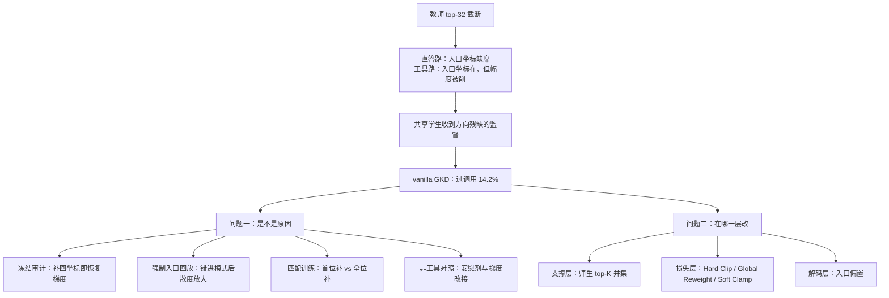

# When Top-K Misses the Decision：教师 top-K 留下 99.99% 的质量，仍可能丢掉「该不该调工具」那个坐标

<!-- release-date: 2026-07-08 -->

> 本文依据 **When Top-K Misses the Decision: Tool-Call Drift in Multi-Teacher On-Policy Distillation**，作者 Jiabin Shen、Guang Chen、Chengjun Mao，arXiv:2607.07050v6，2026-09-05，共 36 页（正文与结论 p. 1–17，参考文献 p. 18–20，附录 A–H p. 21–36）。首页只给邮箱：Shen 为个人邮箱，Chen 与 Mao 为蚂蚁集团邮箱（PDF p. 1）。页码均指这份 PDF 的页码。文中区分三件事：**论文写了什么**、**我们如何解释或验算它**、**哪些是外部资料补充**。
>
> 这是一篇后训练诊断论文，不发布模型。它研究的不是「多教师怎么路由」，而是路由已经按工具调用 / 直接回答给定之后，教师只回 top-K 这一步压缩会不会丢掉纠正学生行为所需的那个坐标。

## 读前先把几个词说成人话

先看一个具体场景。用户说「帮我加一件托运行李，我记得会员免费」。正确的做法是先解释免费额度、请用户确认；一个训坏了的模型会直接调用改行李的工具（PDF p. 30，Table 18）。这种「不该调却调了」就是这篇论文要追的故障。它的根源，论文追到了蒸馏损失里一个被截断的坐标上。

后面反复出现的词先说清楚：

- **在线策略蒸馏（On-Policy Distillation，OPD）**：学生自己采样续写，教师在学生写出的前缀上给出下一词分布，学生向它靠拢（PDF p. 1）。
- **GKD（Generalized Knowledge Distillation，广义知识蒸馏）**：论文的基础损失，逐 token 用师生下一词分布的散度当监督，散度取 JSD（Jensen–Shannon 散度）（PDF p. 3）。
- **教师 top-K**：教师接口不回完整词表，只回概率最高的 $K$ 个 logit。论文取 $K=32$（PDF p. 1、p. 3）。
- **支撑（support）**：真正进入损失的那一组 token。损失只在支撑上算，支撑外的 token 没有直接梯度。
- **保留质量（retained mass）**：top-K 里教师概率的总和。top-32 常常超过 0.9999，看上去截断几乎无损。
- **入口坐标（entry coordinate）**：决定「调工具还是直接答」的那一个 token。Qwen 是特殊符号 `<tool_call>`；Llama 调工具时输出原生 JSON，行为开关是第一个 token `{"`（PDF p. 4）。
- **过调用（over-calling）**：该直接回答的样本上，解析器在输出里检出了工具调用。全文的主故障指标（PDF p. 11、p. 22）。
- **该调召回（call recall）**：该调工具的样本上确实调了的比例。压过调用往往同时压它。
- **E1**：只看第一个生成 token 的本地评测协议。第一个 token 是入口词就记一次调用（PDF p. 4）。它和「整段输出里有没有调用」是两件事，后文会看到两者可以差很远。

## 一句话先说清

教师 top-K 只保留**教师自己**觉得可能的词。蒸馏误差却是**教师相对学生**的：一个词在教师那里概率可以小到接近零，只要学生把它估高了，就需要一个很强的负向纠正。如果这个词恰好切换生成模式，丢掉它的纠正就会改写整段续写。论文把这叫做**决策关键支撑缺失（decision-critical support omission）**：压缩后的教师监督保住了概率质量，却拿掉了纠正学生行为决策所需的那个坐标（PDF p. 1）。

两教师的工具使用蒸馏把这个问题放大了。工具教师专管结构化调用，直答教师专管自然语言回答，样本按标签路由。教师 top-K 下，工具路会露出入口坐标并强化它，直答路却常常把它省掉。路由完全正确，共享的学生收到的监督仍然方向残缺（PDF p. 1–2）。

主设定是 Qwen3.5-9B 学生加两个 9B 教师。vanilla GKD 的该调召回是 91.5%，过调用却有 14.2%；单独训练的混合 SFT 参照是 75.5% 与 4.9%（PDF p. 2）。

全文回答两个问题（PDF p. 2）：

1. **被省掉的坐标是不是这种漂移的原因之一？** 冻结审计显示，直答教师的 top-32 留下 99.99% 的质量，却只在 0.4% 的 prompt 里包含 `<tool_call>`；把它的精确教师 logit 补回去，几乎恢复全词表在这个坐标上的梯度。只在第一个位置补，调用会挪到后面；每个直答位置都补，过调用从 $14.2\pm 2.1\%$ 降到 $3.7\pm 0.5\%$，该调召回同时掉 12.4 个点。两个非工具对照都复现不了这个效果（PDF p. 1、p. 5–7）。
2. **不同层的干预能改什么、代价是什么？** 师生 top-K 并集改支撑，Hard Clip / Global Reweight / Soft Clamp 改留下的信号，验证集调出的入口偏置改解码。没有哪一层全面胜出，选择取决于两种错误各自多贵、系统的哪一部分改得动（PDF p. 2、p. 8–15）。

全文最该带走的一句话是：**保住教师概率质量，证明不了保住了学生相对的梯度，更证明不了保住了行为决策**（PDF p. 17）。

### 一条阅读路线

只有半小时读原文，建议按这个顺序：

1. **p. 3 的式 (1) 与其后一句**：截断 JSD 对支撑外 logit 的梯度恰好为零。
2. **p. 5 的 Table 1**：质量、覆盖、梯度三列要一起读。
3. **p. 6–7 的 §3.3 与 Figure 1**：只补第一位时调用往后挪，全位置补才压住整段过调用。
4. **p. 7–8 的 Table 2 与「What the evidence establishes」一段**：两个对照，以及因果结论的边界。
5. **p. 9 的 Table 3**：三层干预各改什么、要什么权限。
6. **p. 12–15 的 Table 4、Figure 3、Table 5、Table 6**：工作点、误差代价、多轮、跨家族。附录 B.5–B.7（p. 24–29）是诊断的全部细节。

## 主要矛盾：质量覆盖不等于梯度保真

工程上几乎没人传完整词表的 logit。每个 rollout 位置都回完整分布，教师输出、网络传输和学生侧处理都会膨胀；高维 logit 本身也是分布式蒸馏的通信瓶颈（PDF p. 1）。于是教师接口只回 top-K，而保留质量给了一个让人安心的理由：top-32 已经留下 99.99%，丢掉的尾巴无关紧要。

论文指出这个理由混淆了两件事。质量衡量的是**教师**的分布被保住了多少；蒸馏要纠正的是**学生**偏离教师的地方。学生高估的那个词，教师可能根本不看好，它不在教师 top-K 里，损失就推不动它（PDF p. 1、p. 4）。

于是矛盾变成：

> top-K 截断按教师的排序挑坐标，纠错需要的坐标却由学生的错误决定。两者重合时截断无害；学生恰好在一个教师极不看好、又能切换整段行为的词上犯错时，质量越高越会掩盖问题。

论文把这条链拆成三个可检验的环节：截断拿走了一个边界上的纠正；模式入口选定了整条轨迹；选错模式会把散度摊到后面的位置上（PDF p. 4）。第三节依次检验。

## 先看全景：两个问题，一条证据链

这张图按 PDF p. 2–4 与 p. 8–9 的叙事重画，是论证结构示意，不是实验流程。问题一的四类证据只在 Qwen 上走完；Llama 只做了冻结审计和两层训练对照（PDF p. 8、p. 15）。

## 问题设定：截断 JSD 有一条精确的局部后果

### 路由与损失

记对话上下文为 $x$，学生续写为 $y=(y_1,\ldots,y_T)$。标签 $m\in\{\mathrm{tool},\mathrm{response}\}$ 把样本交给对应教师；标签只用于路由，不进学生输入，评测时也不给路线提示（PDF p. 3）。

令 $p_t$、$p_s$ 为师生的下一词分布，$S_i^{(K)}$ 为教师在位置 $i$ 的 top-K 集合，$R_S[p]$ 表示把 $p$ 限制到集合 $S$ 上再重新归一化。每个位置的损失是（PDF p. 3，式 1）：

$$
d_i^{(K)}
=
\mathrm{JSD}\bigl(
R_{S_i^{(K)}}[p_t]
\,\Vert\,
R_{S_i^{(K)}}[p_s]
\bigr)
$$

师生分布在截断与归一化之前先用 $\tau=0.9$ 做温度缩放；学生采样用同一温度，top-$p=1$，不开 top-$k$。报告的保留质量用温度缩放之前的原始教师分布，JSD 与梯度量都用 $\tau=0.9$（PDF p. 3）。

这个目标有一条精确的局部后果：学生 logit $z_{i,v}$ 对应的词 $v$ 若不在 $S_i^{(K)}$ 里，则

$$
\frac{\partial d_i^{(K)}}{\partial z_{i,v}}=0
$$

（PDF p. 3）人话是：教师没把这个词放进 top-K，这个位置的损失对它的 logit 连推一下都不会。学生再怎么高估它，这一项也教不到。

序列损失对受监督位置取平均。以 $\lambda=0.8$ 的概率用学生当前的续写，否则用数据集轨迹；数据集轨迹额外加一个格式锚（PDF p. 3，式 2）：

$$
L=L_{\mathrm{distill}}+\alpha\,\mathbf{1}[z=\mathrm{dataset}]\,L_{\mathrm{SFT}}
$$

$z$ 是轨迹来源，$\alpha=0.3$，所有训练策略里固定不变，用来保住结构化调用的格式（PDF p. 3）。

### 两个教师、一个学生

两个教师从同一个基座出发，一个只学结构化工具调用目标，一个只学自然语言直答目标；只监督最后一轮 assistant 输出，更早的轮次当上下文（PDF p. 4）。训练后端把目标当文本处理，所以工具调用先按 chat template 渲染成 `<tool_call>`、`<function=...>`、`<parameter=...>` 这样的 XML 文本（PDF p. 21）。

主设定：Qwen3.5-9B 学生，两个 9B 教师，数据来自 APIGen-MT。教师与混合 SFT 参照都是从 Qwen3.5-9B 全参数微调两个 epoch，学习率 $5\times 10^{-6}$；GKD 学生从同一 checkpoint 再训 1 个 epoch，全局 batch 96，最大输入 14,000 token、续写 512 token，GKD 的 $\beta=0.5$（PDF p. 21–22，Table 7）。

数据是 5,000 段 APIGen-MT 对话，按对话级切成 3,500 / 500 / 1,000 用于训练 / 验证 / 测试。过滤后 GKD 训练集有 15,419 条工具样本和 15,245 条直答样本；测试从留出对话里抽四个均衡的桶，各 1,000 条，共 4,000 个决策点（PDF p. 21）。

跨家族复现用 Llama-3.1-8B-Instruct 学生与同族教师，工具调用输出原生 JSON，其余设置相同（PDF p. 4、p. 33）。

### 决策关键与轨迹杠杆

论文说一个被省掉的 token 是**决策关键**的，当三件事同时成立：教师给它的概率很小；学生给它的概率已经大到能改变离散行为；全词表目标本来会直接纠正它的 logit。质量覆盖保不住这个性质：$S_i^{(K)}$ 可以留下几乎全部教师概率，同时对一个被省掉的学生错误给出恰好为零的直接梯度（PDF p. 4）。

**轨迹杠杆**（trajectory leverage）描述这样一个 token 对后续的约束有多强。`<tool_call>`、函数名、结构标记能选定整条工具轨迹；普通回答词往往只影响一个短语（PDF p. 4）。

**我们如何解释它。** 论文的 v1 标题用的是「行为杠杆失衡」，最终版把主名换成支撑缺失，杠杆降为解释的一环。两者分工清楚：支撑缺失解释训练目标为什么**推不到**这个坐标，杠杆解释丢了这一个坐标为什么会**改掉整段**行为。后文的实验主要证明前一句。

## 诊断一：两条路由上的 top-K 支撑方向不对称

作者在第一个受监督位置，用本地全词表的教师 logit 和配对的学生 logit，重算两条路由上的量。每条路由 500 条固定验证 prompt；和学生有关的量再配上 vanilla 学生的三个种子，每条路由 1,500 对（PDF p. 5）。

完整数字在 Table 1（PDF p. 5）。入口 logit 下降定义为 $-\partial d/\partial z_{\mathrm{tool}}$：负值把入口 logit 往下压，正值往上抬。

| 支撑 | 入口覆盖 | 原始教师质量 | 入口 logit 下降 |
|---|---:|---:|---:|
| 直答 $K=32$ | 0.4% | 0.999900 | $-0.000002$ |
| 直答 $K=64$ | 4.6% | 0.999959 | $-0.001726$ |
| 直答 $K=128$ | 22.6% | 0.999978 | $-0.009159$ |
| 直答 $K=256$ | 52.2% | 0.999987 | $-0.021794$ |
| 直答 师生 top-32 并集 | 100.0% | 0.999911 | $-0.040748$ |
| 直答 $K=32$ + `<tool_call>` | 100.0% | — | $-0.040756$ |
| 直答 全词表 | 100.0% | 1.000000 | $-0.040708$ |
| 工具 $K=32$ | 100.0% | 1.000000 | $+0.001167$ |
| 工具 $K=64$ | 100.0% | 1.000000 | $+0.003882$ |
| 工具 $K=128$ | 100.0% | 1.000000 | $+0.006175$ |
| 工具 $K=256$ | 100.0% | 1.000000 | $+0.008982$ |
| 工具 师生 top-32 并集 | 100.0% | 1.000000 | $+0.020065$ |
| 工具 全词表 | 100.0% | 1.000000 | $+0.020174$ |

（覆盖与质量用每条路由 500 条唯一 prompt；下降与并集用 1,500 对，$\tau=0.9$。）

这张表要三列一起读，每一列揭穿一个错觉。

**质量列让人以为 $K=32$ 已经无损。** 直答路 0.999900，工具路显示为 1.000000。

**覆盖列揭穿直答路。** 直答教师给 `<tool_call>` 的平均概率只有 $6.14\times 10^{-8}$，它的教师排名中位数是 236.5（PDF p. 5）。单纯加大 $K$ 只能慢慢抬覆盖，排序逻辑不变：$K=128$ 只收回全词表平均下降的 22.6%，$K=256$ 仍在 47.8% 的直答 prompt 上把它省掉（PDF p. 5）。

**下降列揭穿工具路。** 工具教师在每条工具 prompt 上都把 `<tool_call>` 排第一，1,500 对里入口下降全是正的，方向保住了；幅度却从全词表的 $+0.020174$ 被削到 $+0.001167$（PDF p. 5）。

两条路上，师生 top-32 并集都几乎恢复了全词表的值：直答路平均 38.46 个坐标，工具路平均 58.16 个（PDF p. 5）。直答路上「并集」与「只补一个 `<tool_call>`」的下降几乎一样（$-0.040748$ 对 $-0.040756$），说明缺的就是这一个坐标，不是整张词表（PDF p. 5）。

补回的纠正会随学生的错误大小自动调节。1,326 条学生正确进入直答模式的样本上，学生给 `<tool_call>` 的平均概率是 0.093，补回的下降是 $-0.0290$；174 条学生错进工具模式的样本上，这两个数升到 0.702 和 $-0.1303$（PDF p. 25–26）。

**我们如何解释工具路为什么被削弱。** 损失在支撑上重新归一化。工具教师几乎把全部概率放在 `<tool_call>` 上，其余 31 个位置都是它眼里的尾巴；学生分给直答开头词的那部分概率，多半落在这 31 个之外，截断后被整块丢掉。重新归一化后，学生在 `<tool_call>` 上的概率被抬高，看上去离教师更近，推它的力也就小了。并集把学生自己看好的词加回支撑，这部分差距重新显形。工具路并集的坐标数（58.16）比直答路（38.46）多得多，说明工具路上师生 top-32 的重叠更少，与这个解释一致。论文只报告了现象，没有给这条机制。

### 可迁移启发

验收一次 top-K 压缩蒸馏，至少报三列：保留质量、关键决策 token 的覆盖率、这些 token 上的梯度相对全词表的比例。三列可以对得很开。

## 诊断二：进错模式之后，散度沿着轨迹放大

### 平均数看不出来

整段序列的聚合统计看不出稳定的方向。31 个成对诊断步上，工具 / 直答之比的点估计：token 暴露 0.81–0.93，原始逐 token JSD 0.95–1.03，平方散度代理 1.19–1.34，每个成对 95% bootstrap 区间都包含 1（PDF p. 6、p. 24，Table 8）。可是 vanilla GKD 里，最大的 1% 受监督 token 扛走了诊断样本 JSD 的 $41.2\pm 0.4\%$（PDF p. 6、p. 24，Table 9）。这些数说明信号很集中，却指不出集中在哪、为什么。

### 自然错配

作者拿 vanilla GKD 训练结束时（第 319 步）的三个种子，在 500 条工具标签与 500 条直答标签的验证 prompt 上各回放一遍，共 3,000 条（PDF p. 6、p. 24）。

| 错配类型 | 发生率 | 错配 / 对齐的逐 token JSD 比 |
|---|---:|---:|
| 工具标签却直接回答 | 5.3% | 55.45 [41.74, 76.44] |
| 直答标签却调工具 | 11.6% | 2.03 [1.71, 2.39] |

（PDF p. 6，Table 10 的合并行；括号为 95% bootstrap 区间。）

工具标签下的 80 条错配样本贡献了全部 3,000 条回放平方散度代理的 55.5%（PDF p. 6）。

### 强制入口：把「选错道岔」和「题目本来就难」拆开

自然错配可能只是挑中了更难的题。于是作者在同一 200 条 prompt、同一个种子 42 的学生上，强制第一个 token 是 `<tool_call>`，或者屏蔽它、让学生走直答，后面的 token 照常生成（PDF p. 25）。错配 / 对齐的 JSD 比在工具教师下是 26.73 [14.87, 67.91]，在直答教师下是 2.67 [2.29, 3.14]（PDF p. 6）。按位置拆开看（PDF p. 25，Table 11）：

| 教师 → 学生模式 | 第 1 个 | 前 4 个 | 第 5–10 个 | 第 10 个之后 |
|---|---:|---:|---:|---:|
| 工具 → 工具 | 0.00266 | 0.00079 | 0.00193 | 0.00064 |
| 工具 → 直答 | 0.00279 | 0.06407 | 0.07706 | 0.03220 |
| 直答 → 直答 | 0.01407 | 0.00817 | 0.00672 | 0.00568 |
| 直答 → 工具 | 0.01395 | 0.10543 | 0.01758 | 0.01055 |

第一个位置两条分支的值几乎相同，因为干预之前的分布是共享的。散度在模式选定之后才打开，而且延续到后面很多 token（PDF p. 6、p. 25）。论文的原话可以概括为：入口是扳机，不是唯一的高损失位置（PDF p. 6）。

**我们如何解释它。** 两种错配不对称。工具教师看到一段自然语言回答，整段都不像它会写的，散度在第 5–10 个 token 仍然很高；直答教师看到工具调用，前几个结构 token 最陌生，之后很快回落。这也解释了为什么只看平均 JSD 会误判：爆炸集中在少数错配轨迹上，一平均就被稀释了。

## 诊断三：补坐标补在哪里，决定了行为改不改

冻结审计只证明了一个局部的梯度性质。要知道它会不会改变学到的行为，得真的训练。作者做了两种匹配训练：直答样本上只要 top-32 省掉了 `<tool_call>`，就把它连同精确的直答教师 logit 补进支撑；工具样本不动。**首位补**只作用在第一个有效的受监督直答位置，**全位补**作用在每个受监督直答位置。两者与 vanilla 用同一初始化、数据顺序、教师、319 步预算和带格式锚的配方，各跑种子 42、44、60（PDF p. 6）。

**首位补验证了局部梯度，也留下了一条逃逸路线。** E1 的直答入口误差从 $14.47\pm 1.53\%$ 降到 $3.40\pm 0.26\%$，工具入口召回也从 $91.72\pm 1.22\%$ 降到 $80.57\pm 0.68\%$；边界 AUC 只从 0.9692 变到 0.9712（PDF p. 6）。这是整体移动了阈值，不是更会区分两类样本。整段过调用却只从 $14.20\pm 2.08\%$ 到 $13.48\pm 1.27\%$（PDF p. 6）。原因在调用的位置上（PDF p. 27，Table 15，每类 6,000 条完整生成，三种子合并）：

| 目标 | 训练 | 开头就调用 | 先写几句再调用 | 不调用 |
|---|---|---:|---:|---:|
| 该直接回答 | vanilla | 13.42 | 0.78 | 85.80 |
| 该直接回答 | 首位补 | 3.07 | 10.42 | 86.52 |
| 该直接回答 | 全位补 | 3.08 | 0.65 | 96.27 |
| 该调工具 | vanilla | 90.52 | 0.93 | 8.55 |
| 该调工具 | 首位补 | 77.68 | 13.78 | 8.53 |
| 该调工具 | 全位补 | 77.23 | 1.83 | 20.93 |

首位补把第一个 token 的调用压下去了，调用就挪到后面。全位补的第一个 token 工作点和首位补几乎一样（直答入口误差 $3.63\pm 0.24\%$，工具入口召回 $81.30\pm 0.51\%$，AUC $0.9725\pm 0.0010$），它关掉的是时间上的逃逸：延后调用降到 0.65%，不调用升到 96.27%，整段过调用到 $3.73\pm 0.51\%$，三个种子相对首位补分别再降 10.10、8.35、10.80 个点（PDF p. 6、p. 27）。

**论文立刻把全位补的资格降下来：它是诊断，不是推荐配方**（PDF p. 6）。相对首位补，它让该调召回再掉 12.40 个点，BFCL 工具调用质量掉 2.31 个点。多轮测试里，空标准答案的轮次上不调用的准确率从 47.41% 升到 61.49%，该调轮次的调用覆盖从 83.15% 降到 73.24%；在测试框架完整实现的三个类别上，轮级协议成功率从 32.49% 降到 28.60%（PDF p. 6）。补回的坐标能管住整段过调用，可共享参数不会把更新只关在直答样本里（PDF p. 6）。

**我们如何解释它。** 这组实验最有价值的不是 3.7%，而是首位补的失败方式。它说明第一 token 协议（E1）和完整生成是两把尺子：E1 上首位补与全位补几乎打平，整段过调用却差了近 10 个点。任何只在第一个 token 上验收工具调用倾向的做法，都可能被「先说一句再调」骗过去。

## 诊断四：两个非工具对照，以及因果结论的边界

精确补回同时改了两样东西：支撑多了一个坐标，这个坐标又恰好是入口词。Table 2 把它和两个非工具对照放在一起（PDF p. 7）。

| 处理 | E1 直答误差 | E1 该调召回 | 整段过调用 | 整段该调召回 | 多轮对话 exact |
|---|---:|---:|---:|---:|---:|
| vanilla GKD | $14.47\pm 1.53$ | $91.72\pm 1.22$ | $14.20\pm 2.08$ | $91.45\pm 1.68$ | $7.04\pm 0.31$ |
| 首位补 | $3.40\pm 0.26$ | $80.57\pm 0.68$ | $13.48\pm 1.27$ | $91.47\pm 0.50$ | $5.83\pm 1.01$ |
| 全位补 | $3.63\pm 0.24$ | $81.30\pm 0.51$ | $3.73\pm 0.51$ | $79.07\pm 1.73$ | $3.38\pm 0.50$ |
| 概率安慰剂 | $13.37\pm 1.10$ | $91.30\pm 1.00$ | $13.25\pm 1.96$ | $90.37\pm 2.31$ | $4.92\pm 0.40$ |
| 梯度改接 | $9.25\pm 3.43$ | $85.83\pm 2.92$ | $11.65\pm 2.88$ | $86.93\pm 3.31$ | $5.21\pm 0.44$ |

（PDF p. 7，Table 2。百分数，三个种子的均值 ± 样本标准差；两个对照都用全位作用范围。「多轮对话 exact」是后文定义的本地多轮端点。）

**概率安慰剂：排除「多塞一个坐标就够」。** 每个受监督直答位置补一个非工具词，它的教师概率最接近 `<tool_call>`，作用范围和概率尺度都匹配，只是不是那个决策坐标。过调用只比 vanilla 低 0.95 个点，E1 直答误差只低 1.10 个点；精确全位补则把这两项分别降 10.47 和 10.83 个点（PDF p. 7–8）。安慰剂不是完全无害，对话 exact 掉到 $4.92\pm 0.40\%$，但它复现不了目标 token 的效果。它匹配了作用范围、支撑数和教师概率，没有匹配学生概率或有效梯度强度（PDF p. 8、p. 17）。

**输出 logit 梯度改接：排除「只要梯度一样大就够」。** 用安慰剂那个非工具候选，但用直通估计保住精确补回的前向损失、选中输出 logit 的梯度系数与范数，只把这个系数接到候选词的输出行上（PDF p. 8、p. 29，式 9）。1,500 对冻结样本里 1,494 对可用，前向 JSD 与系数误差为零，梯度范数的相对误差在 $10^{-7}$ 量级（PDF p. 29）。即便如此，E1 直答误差和整段过调用仍是 $9.25\pm 3.43\%$ 与 $11.65\pm 2.88\%$，三个种子相对精确补回的过调用差距是 $+8.25$、$+4.90$、$+10.60$ 个点（PDF p. 8）。它没有匹配输出行本身，也没有匹配完整的参数梯度：同一个系数 $g$ 在精确补回下给隐状态的贡献是 $gW_{\mathrm{tool}}$，改接后是 $gW_{\mathrm{candidate}}$（PDF p. 8）。它还有明显副作用，When2Call 从 vanilla 的 $65.57\pm 1.07\%$ 掉到 $26.70\pm 22.32\%$（PDF p. 8）。

**直接压制：另一种压同一个词的办法。** 保留原来的 top-32 支撑，在每个受监督直答位置对学生的 `<tool_call>` 概率加一个惩罚项，权重固定为 0.15。整段过调用从 $14.20\pm 2.08\%$ 到 $12.93\pm 1.14\%$，该调召回从 $91.45\pm 1.68\%$ 到 $90.40\pm 2.05\%$，对话 exact 从 $7.04\pm 0.31\%$ 到 $4.96\pm 0.07\%$（PDF p. 8、p. 28，式 8）。这只是一个没调过的单点，不代表调好的惩罚能做到什么（PDF p. 8）。

### 证据确立了什么、没有确立什么

论文自己把范围写死（PDF p. 8）：冻结坐标恢复、强制入口回放、作用范围不同的补回训练和非工具对照，共同把决策关键支撑缺失指认为主 Qwen 设定里的**一个**因果贡献者。训练效果既取决于纠正了哪个坐标，也取决于在哪些位置监督；第一 token 的边界单独预测不了完整生成的行为。这些实验**不**证明它等价于全词表 OPD 训练，也**不**证明这个坐标完全中介了漂移。该调召回一起掉，所以「找到原因」和「选一个好用的干预」是两件事。

## 跨家族：Llama 原生 JSON 上的同一个盲区

作者用 Llama-3.1-8B 的直答教师和原生 JSON 入口词 `{"` 重做冻结审计（PDF p. 8、p. 34，Table 26）。

| 支撑 | 入口覆盖 | 教师质量 | 入口 logit 下降 |
|---|---:|---:|---:|
| 直答 $K=32$ | 0.00% | 0.999770 | 0.000000 |
| 直答 $K=256$ | 0.00% | 0.999968 | 0.000000 |
| 直答 师生 top-32 并集 | 97.93% | 0.999786 | $-0.049229$ |
| 直答 全词表 | 100.00% | 1.000000 | $-0.049180$ |
| 工具 $K=32$ | 100.00% | 1.000000 | $+0.005174$ |
| 工具 全词表 | 100.00% | 1.000000 | $+0.009028$ |

（PDF p. 34，Table 26 节选。）

Llama 上的盲区比 Qwen 更彻底：直答教师给 `{"` 的排名中位数是 105,952.5，覆盖到 $K=256$ 仍是零；并集平均 40.49 个坐标就几乎恢复全词表的下降（PDF p. 8、p. 34）。工具教师在全部 500 条工具 prompt 上把它排第一，平均概率 0.999999（PDF p. 8、p. 34）。匹配的补回与对照实验只在 Qwen 上做；Llama 的证据是这份冻结审计加上后文两层训练对照（PDF p. 8）。

**我们如何解释它。** 并集在 Llama 上只覆盖了 97.93% 的直答样本，剩下的是学生自己也没把 `{"` 放进 top-32 的情况，这时学生本来就不太会错，不需要纠正。这正是并集「学生感知」的含义：它补回的是学生真的在犯错的坐标，不必事先知道入口词是哪个。

## 三层干预：改坐标、改信号、改阈值

诊断找到了缺失的纠正，但最强的行为效果把该调的也压掉了。下一问是：不同层能改什么，各付什么代价（PDF p. 8–9）。

| 策略 | 角色 / 层 | 纠正范围 | 要重训 | 需要什么权限 |
|---|---|---|---|---|
| vanilla GKD | 参照 | 教师 top-K 目标 | 是 | 原来的 top-K 接口 |
| 精确补回 | 诊断 | 已知的直答坐标 | 是 | 精确的教师坐标 |
| 概率安慰剂 | 诊断 | 匹配的非工具坐标 | 是 | 匹配的教师坐标 |
| 梯度改接 | 诊断 | 匹配的非工具 logit 梯度 | 是 | 匹配的教师坐标 |
| 入口惩罚 | 诊断 | 直接压制直答侧的入口词 | 是 | 原来的 top-K 接口 |
| 师生并集 | 支撑层 | 被蒸馏的 token 坐标 | 是 | 按学生挑的词去查教师 |
| Hard Clip | 损失层 | 超过固定上限的留存损失 | 是 | 原来的 top-K 接口 |
| Global Reweight | 损失层 | 按 batch 相对大小重配权 | 是 | 原来的 top-K 接口 |
| Soft Clamp | 损失层 | 极端的留存梯度 | 是 | 原来的 top-K 接口 |
| 入口偏置 | 解码层 | 推理时的入口阈值 | 否 | 验证集；能控制解码器 |

（PDF p. 9，Table 3。）

被评估的优化层里，只有支撑层会把学生选中、却被省掉的坐标放回训练支撑；损失层作用在已经留下的信号上，解码层作用在推理时（PDF p. 9）。

### 支撑层：师生 top-K 并集

$$
U_i^{(K)}=\mathrm{TopK}(p_t)_i\cup\mathrm{TopK}(p_s)_i
$$

（PDF p. 9，式 3）对学生 top-K 里有、教师 top-K 里没有的词，额外去查教师 logit，再在 $U_i^{(K)}$ 上算同一个截断 JSD。这是已有的构造，出自参考文献 [27] 的 Teachability-Aware OPD；那篇用并集给位置打「可学性」分，这里把它当作每个位置真正的支撑（PDF p. 9、p. 16）。它能收回学生相关的坐标，而不必把 `<tool_call>` 或它的位置写死（PDF p. 9）。

成本是实打实的。319 个匹配步上，师生重叠平均 $25.12\pm 0.08$ 个词，所以并集平均 $38.88\pm 0.08$ 个坐标，比教师 top-32 多返回 21.5%；稳态步时从 106.4 秒升到 123.5 秒，多 16.0%，峰值显存差异在运行间波动之内（PDF p. 10、p. 28）。

### 损失层：Hard Clip、Global Reweight、Soft Clamp

记原来的截断散度为 $d_i$，三种整形是（PDF p. 10，式 4）：

$$
\begin{aligned}
\text{Hard Clip: }& d'_i=\min(d_i,c),\\
\text{Global Reweight: }& d'_i=d_i\,\mathrm{sg}(w_i),\\
\text{Soft Clamp: }& d'_i=d_i\min\bigl(1,C/\mathrm{sg}(d_i)\bigr)\quad(d_i>0).
\end{aligned}
$$

Hard Clip 取 $c=0.5$，超过上限的部分梯度直接为零。Global Reweight 把 batch 内散度标准化后取截断的指数权重，非极端 token 也会被重配权。Soft Clamp 取 $C=\mathrm{sg}(3\,\mathrm{mean}_i d_i)$，超过门槛的 token 前向值封顶在 $C$，但保留一个按 $C/d_i$ 缩小的非零梯度（PDF p. 10、p. 34–35）。超参在多种子测试之前就固定：Soft Clamp 的系数 3，Hard Clip 的 $c=0.5$，Global Reweight 的 $\alpha=0.3$、$z_{\max}=3.0$、权重范围 $[0.25, 2.0]$（PDF p. 22）。

三者都沿用原来的 top-K 接口，都要重训。它们**不能**直接补回被省掉的坐标，行为变化只能来自留下的信号和共享参数（PDF p. 10）。

**我们如何解释它。** 这一层在最终版里不再是「提出的方法」，只是损失层的代表。病根若真是坐标根本不在支撑里，整形最多通过共享参数间接晃动行为，补不上 $\partial d/\partial z_v=0$ 那个洞。附录 Table 9 显示 Soft Clamp 把最大 1% token 的 JSD 份额从 0.412 压到 0.154（PDF p. 24），信号确实被摊平了，但摊平的是已经在支撑里的那些。

### 解码层：入口偏置

不重训，只在每一步生成的第一个 assistant token 上，把入口 logit $\ell_{\mathrm{tool}}$ 换成 $\ell_{\mathrm{tool}}+b$，$b\le 0$。在 APIGen-MT 验证集上对每个 vanilla 种子扫 $b\in[-5, 0]$，步长 0.05；选出两个工作点，分别对齐 Soft Clamp 的验证集直答入口误差或该调召回，打平时取 $|b|$ 最小者，然后冻结到测试与严格多轮评测（PDF p. 10）。三个种子选出的偏置在 $-0.65$ 到 $-0.25$ 之间（PDF p. 31，Table 20）。

它需要可控的解码器和验证时调参，直接改的只有第一个 token，但入口一变，后面的续写也会跟着变（PDF p. 10）。

三层交换的资源不同：支撑层要更宽的教师查询，损失层保留接口但要重训，解码层免训练但要控制解码器（PDF p. 10）。

## 实验：三把尺子一起看

### 数据与指标

APIGen-MT 决策集按对话留出。去掉思考块后，用各家族的解析器检出调用：Qwen 找 XML 的 `<tool_call>` 块，Llama 找带 `name` / `parameters` 的 JSON 对象；检出即算调用，不要求参数合法，参数质量另由 BFCL 测（PDF p. 11、p. 22）。测试集均衡，所以决策准确率就是两种召回的平均，过调用等于一减该答召回（PDF p. 22）。

单轮推理用 vLLM，关闭思考、贪心解码；APIGen 生成 512 个新 token，BFCL 256 个，When2Call 选择题 16 个（PDF p. 22）。BFCL 用本地 v4 风格的七个单轮子集，本地打分器做 AST 式匹配，不是官方榜单分（PDF p. 22–23）。When2Call 从公开的 3,652 条选择题里抽 1,000 条：329 条该调工具、289 条该追问、382 条无法回答（PDF p. 23）。

多轮诊断用 800 个 BFCL v4 多轮任务、3,136 个用户轮次。模型一调工具，测试框架返回固定的模拟观察，直到给出非工具终答或触达步数上限；每轮最多五步，所以 Loop@5 与触达上限是同一个数（PDF p. 11、p. 36）。**对话 exact** 要求执行 / 状态检查器接受整条轨迹，并且空标准答案的轮次不能发出可执行调用，整段对话全对才算过；它不评最终自然语言回答的质量，也不是官方分数（PDF p. 11、p. 36）。本地框架没有实现 BFCL 缺函数类别的补充提示，这一类在「supported」口径里被排除（PDF p. 11–12、p. 36）。

GKD 各变体报三个种子的均值 ± 标准差；Base 与混合 SFT 是单次参照；多轮的 Hard Clip 行是单次运行（PDF p. 11）。

### 工作点：并集和损失整形走到的不是同一点

| 方法 | 决策准确率 | 过调用 | 该调召回 | 该答召回 |
|---|---:|---:|---:|---:|
| Base | 80.7 | 7.2 | 68.5 | 92.8 |
| 混合 SFT | 85.3 | 4.9 | 75.5 | 95.1 |
| vanilla GKD | $88.6\pm 0.3$ | $14.2\pm 2.1$ | $91.5\pm 1.7$ | $85.8\pm 2.1$ |
| Hard Clip | $88.7\pm 1.0$ | $11.9\pm 0.9$ | $89.2\pm 3.0$ | $88.2\pm 0.9$ |
| Global Reweight | $88.6\pm 1.3$ | $9.7\pm 0.8$ | $86.9\pm 3.3$ | $90.3\pm 0.8$ |
| Soft Clamp | $88.7\pm 0.7$ | $9.0\pm 0.2$ | $86.5\pm 1.4$ | $91.0\pm 0.2$ |
| 师生并集 | $89.8\pm 0.8$ | $7.4\pm 0.6$ | $87.0\pm 2.0$ | $92.6\pm 0.6$ |

（PDF p. 12，Table 4。百分数。）

论文的读法是（PDF p. 12）：混合 SFT 偏向直答；vanilla GKD 把该调召回推到 91.5%，代价是 14.2% 的过调用；Soft Clamp 走到 9.0% 与 86.5%，并集走到 7.4% 与 87.0%；诊断用的全位补是 3.7% 与 79.1%，那是更激进的「克制换能力」，不是优化目标。

读这张表要补三件事。

**第一，决策准确率几乎不动，是因为两种召回在互换。** 损失层三种方法的准确率都在 88.6–88.7，该调召回掉了 2–5 个点，该答召回涨了差不多的量。只报准确率会把工作点的移动藏起来。

**第二，并集是训练类策略里准确率最高的一档，但过调用 7.4% 仍高于混合 SFT 的 4.9%。** 它赢的是 GKD 家族内部，不是所有参照。

**第三，并集的决策准确率涨幅不显著。** 相对 vanilla 的三种子差值是 $+1.19$ 个点，描述性 95% 区间 $[-0.31, +2.69]$ 跨过零；过调用下降 $-6.82$ 个点，区间 $[-13.54, -0.09]$ 勉强不跨零（PDF p. 29，Table 17）。三个种子的区间只是描述性的（PDF p. 29）。

附录还给了三条定性例子：加行李、改地址、已完成航班能否退款，vanilla 都直接进了工具轨迹，Soft Clamp 留在解释政策或请用户确认的一侧（PDF p. 30，Table 18）。

### 阈值移动还是分离变好：看 AUC

E1 用本地 Transformers 打分器在 4,000 条测试上跑，关闭思考；入口概率当 AUC 的分数，该调样本当正类（PDF p. 12）。

| 设置 | 直答入口误差 | 工具入口召回 | 第一 token 准确率 | AUC |
|---|---:|---:|---:|---:|
| vanilla，无偏置 | $14.5\pm 1.5$ | $91.7\pm 1.2$ | $88.6\pm 0.4$ | $0.9692\pm 0.0023$ |
| Soft Clamp | $11.1\pm 0.3$ | $90.4\pm 0.2$ | $89.7\pm 0.1$ | $0.9710\pm 0.0011$ |
| 师生并集 | $8.7\pm 0.7$ | $90.6\pm 1.0$ | $90.9\pm 0.2$ | $0.9760\pm 0.0006$ |
| vanilla + 偏置，对齐入口误差 | $11.2\pm 0.6$ | $89.2\pm 1.2$ | $89.0\pm 0.6$ | — |
| vanilla + 偏置，对齐召回 | $11.6\pm 1.1$ | $89.5\pm 0.6$ | $88.9\pm 0.5$ | — |

（PDF p. 12、p. 28、p. 31，Table 19 与 Table 16。偏置在验证集上选定、冻结到测试。）

Soft Clamp 几乎不改 AUC，主要是移动了工作点；验证集调出的偏置不重训就能对齐它的直答入口误差，只是该调召回略低（PDF p. 12）。并集的 AUC 相对 vanilla 高 0.68 个百分点，三种子成对 95% $t$ 区间 $[0.20, 1.15]$，论文把这读作「分离度有不大的改善，同时伴随更大的阈值移动」（PDF p. 12–13）。

**我们如何解释它。** 这组数把三层的本质区别量出来了：损失整形和解码偏置都只是沿同一条 ROC 曲线挪位置，只有补回坐标的并集让曲线本身往上走了一点。能用一个偏置近似的干预，就不必花重训的钱。

### 误差代价会改变偏好排序

要在工作点之间选，必须先说清两种错误各多贵。令 $\rho=C_{\mathrm{over}}/C_{\mathrm{miss}}$ 为「一次多余调用」相对「一次漏掉该调的调用」的代价，类别均衡的归一化风险是（PDF p. 13，式 5）：

$$
R_\rho=\frac{\rho\, e_{\mathrm{over}}+e_{\mathrm{miss}}}{\rho+1}
$$

$e_{\mathrm{over}}$ 是过调用率，$e_{\mathrm{miss}}$ 是漏调率。两类错误先等权，再乘代价比；真实部署里两类样本比例不同，要自己改权重（PDF p. 13）。E1 那一侧对每个种子、每个 $\rho$ 在验证集上选一个最小化风险的偏置，再冻结到测试（PDF p. 13）。

论文的读法是（PDF p. 13）：完整生成上，漏调更贵（$\rho$ 取 0.25、0.5）时 vanilla 风险最低，多余调用同等或更贵（$\rho$ 取 1、2、4）时并集最低；E1 上并集直到 $\rho=2$ 都是评估点里最低，$\rho=4$ 时调偏置的 vanilla 最低，均值风险 7.06% 对并集的 8.86%。这些比较都是三个种子上的描述性结果。

**我们的读图。** 右幅里调偏置的那条曲线在 $\rho$ 约 0.5–0.8 这一段高于不加偏置的 vanilla：验证集上挑出的偏置搬到测试集上并不总是更好，只有在一种错误明显更贵、偏置值被推得足够远时才拉开优势。论文没有讨论这一段。

### BFCL 与 When2Call：列与列的排名会换

| 方法 | BFCL 总分 | 工具调用质量 | 无关拒绝 | When2Call 选择题 | 其中「无法回答」 |
|---|---:|---:|---:|---:|---:|
| Base | 82.2 | 83.5 | 79.8 | 72.8 | 68.1 |
| 混合 SFT | 82.9 | 82.0 | 84.4 | 71.6 | 63.1 |
| vanilla GKD | $79.0\pm 1.7$ | $79.4\pm 1.5$ | $78.2\pm 2.9$ | $65.6\pm 1.1$ | $51.2\pm 4.1$ |
| Hard Clip | $79.9\pm 0.6$ | $78.1\pm 1.2$ | $83.2\pm 1.2$ | $64.3\pm 1.3$ | $49.2\pm 4.5$ |
| Global Reweight | $79.8\pm 2.7$ | $77.8\pm 5.7$ | $83.5\pm 3.4$ | $67.1\pm 2.2$ | $53.8\pm 3.4$ |
| Soft Clamp | $80.8\pm 0.1$ | $79.7\pm 1.3$ | $82.7\pm 2.4$ | $65.9\pm 2.5$ | $51.3\pm 6.7$ |
| 师生并集 | $81.5\pm 0.9$ | $78.9\pm 0.6$ | $86.5\pm 1.5$ | $68.3\pm 1.1$ | $58.0\pm 4.6$ |

（PDF p. 32，Table 22 与 Table 23。）

论文的判断是：单轮迁移上各训练策略差别不大，列与列的排名不同；混合 SFT 在 BFCL 上仍更强，所有 GKD 变体在 When2Call 总分上都低于 Base 与混合 SFT，说明操作点之外还有能力上的缺口（PDF p. 14）。

**我们如何解释它。** 并集的 BFCL 总分最高，靠的是无关拒绝（86.5），不是工具调用质量（78.9，低于 Base 的 83.5）。它学会的是「少调」，不是「调得更准」。

### 多轮：少循环不等于任务成功

| 方法 | 每轮调用 | Loop@3 | 该调轮次覆盖 | 对话 exact |
|---|---:|---:|---:|---:|
| 混合 SFT | 0.974 | 5.1 | 79.77 | 5.12 |
| vanilla GKD | $1.515\pm 0.122$ | $15.1\pm 3.0$ | $92.90\pm 0.33$ | $7.04\pm 0.31$ |
| Hard Clip | 1.348 | 11.5 | 88.88 | 6.00 |
| Global Reweight | $1.297\pm 0.088$ | $10.8\pm 1.4$ | $87.78\pm 4.62$ | $5.33\pm 0.92$ |
| Soft Clamp | $1.289\pm 0.023$ | $10.3\pm 0.4$ | $88.50\pm 2.01$ | $6.17\pm 0.38$ |
| 师生并集 | $1.118\pm 0.057$ | $8.0\pm 0.9$ | $81.22\pm 2.38$ | $4.12\pm 0.33$ |

（PDF p. 14，Table 5。Loop@3 指一个用户轮次内至少连续三步调用工具。）

Soft Clamp 和并集都以不同幅度减少了调用和循环，该调轮次的覆盖和对话 exact 也跟着降。只看 Loop@3 会把策略的效用说残（PDF p. 14）。

在另一套严格的本地解码器协议下，验证集调出的入口偏置不重训就把每轮调用从 1.734 降到 1.492，Loop@3 从 20.5% 降到 15.7%；这些数只在那套解码器内部比较，不和上表混用（PDF p. 14–15、p. 32，Table 21）。同一张表里，偏置几乎追平了 Soft Clamp 的调用频率和循环率，非工具终答率与非法调用率仍差一截（85.8% 对 88.2%，1.6% 对 0.7%）（PDF p. 32）。

**我们如何解释它。** vanilla 的对话 exact（7.04）反而高于混合 SFT（5.12）：更爱调工具，在「必须调对才过检查器」的任务上更容易过。并集把循环压到最低，exact 也跌到最低。对话 exact 的绝对水平很低，排除框架未实现的缺函数类后 vanilla 也只从 7.04% 升到 9.39%（PDF p. 36），所以这组多轮数字只能用来比较方向，不能读成可用性。

## 跨家族训练：Llama 上两层训练移动的是不同的点

| 方法 | 决策准确率 | 过调用 | 该调召回 | 该答召回 |
|---|---:|---:|---:|---:|
| 混合 SFT | 90.83 | 10.25 | 91.90 | 89.75 |
| vanilla GKD | $84.24\pm 0.27$ | $28.80\pm 0.80$ | $97.27\pm 0.33$ | $71.20\pm 0.80$ |
| Soft Clamp | $86.35\pm 0.71$ | $22.35\pm 1.39$ | $95.05\pm 0.85$ | $77.65\pm 1.39$ |
| 师生并集 | $90.08\pm 0.13$ | $11.08\pm 1.16$ | $91.23\pm 0.94$ | $88.92\pm 1.16$ |

（PDF p. 15，Table 6。）

Llama 的 vanilla 工作点同样偏向调用，而且更重：相对混合 SFT，该调召回高 5.37 个点，过调用高 18.55 个点，决策准确率低 6.59 个点；这个参照目标与日程都不同，不能当成训练效应（PDF p. 15）。匹配的 GKD 对照里，Soft Clamp 把过调用降 $6.45\pm 0.64$ 个点、该调召回降 $2.22\pm 1.05$ 个点；并集分别降 $17.72\pm 1.32$ 与 $6.03\pm 1.07$ 个点（PDF p. 15）。

两处噪声要看到：并集在 When2Call 上仍低于混合 SFT，BFCL 的种子间波动达到 8 个点左右（vanilla $52.27\pm 8.24$，并集 $53.59\pm 8.02$）（PDF p. 15、p. 33）。只学一边的 SFT 教师验证了路由的两个极端：直答 SFT 过调用为 0、该调召回为 0，工具 SFT 过调用 100%、该答召回为 0（PDF p. 33，Table 25）。

附录 D 还有一个 Qwen3.5-4B 学生、9B 教师的检查，只测了损失整形：vanilla 过调用 $12.8\pm 0.7\%$，Global Reweight $9.5\pm 0.8\%$，Soft Clamp $9.2\pm 1.2\%$，两者都没提高对话 exact。它早于支撑层实验，不是对支撑缺失机制的复现（PDF p. 32–33）。

## 和相关工作的分界

- **在线策略与选择性蒸馏**：GKD 用逐 token 散度监督学生 rollout；TIP 按学生熵和师生分歧给位置排序；Teachability-Aware OPD 也做师生 top-K 并集，但用来给位置的可学性打分。论文把受监督位置和路由固定，把并集当成截断散度真正的支撑（PDF p. 16）。
- **稀疏与截断的 logit 支撑**：Sparse Logit Sampling 指出只缓存教师 top-K 会给出有偏的分布估计，用重要性采样的尾部 logit 在期望上保住全梯度；Tail-Aware Distillation 把教师众数和全词表尾部拆开、放大后者的合计贡献；通信感知蒸馏用自适应 $K$ 减少传输。这些工作说明稀疏 logit 和低质量尾部都要小心。论文互补的是：**哪一个**被省掉的坐标纠正学生的离散行为，路由教师怎样让缺失变成单向，补回它会不会改变完整生成（PDF p. 16）。
- **多教师路由与冲突**：多教师 OPD 研究路由、专业化与能力整合，引用了 MOPD；Counteraction-Aware MOPD 把冲突的恢复更新与保持更新分开。论文把路由固定，证明路由之后的损失本身就可能方向残缺：两个教师不必在截断支撑里露出同一个决策 token（PDF p. 16）。本库 MOPD 与 Counteraction-Aware-OPD 两篇对应这两项工作。
- **工具行为漂移**：过度调用、坍缩与重复调用常见于 RL 或 agent 搜索。论文指出监督式多教师 OPD 里另一条通往类似行为的路：一个低概率结构 token 从一个教师的支撑里被拿掉，单向的更新推动了共享的调用 / 回答边界（PDF p. 16）。

## 限制、边界，以及不要补进去的实现

论文自己列的限制（PDF p. 16–17）：

- 匹配的因果链（强制回放、精确补回、作用范围训练）只在 Qwen3.5 和实现的教师 top-32 目标上闭合。
- 双边冻结审计给出了 Qwen 路由入口更新的符号，但它是端点处 logit 空间的测量，不是全词表训练实验，也不证明一个坐标完全中介了学到的行为。
- Llama 独立复现了偏调用的 vanilla 工作点、直答侧支撑缺失与匹配的支撑感知纠正，但它的冻结审计不是第二次匹配补回研究；两个家族用的是同一套任务构造。
- 精确全位补刻意很宽，该调和不该调一起压。
- 安慰剂匹配范围、支撑数与教师概率，不匹配学生概率与有效梯度强度；梯度改接匹配前向损失与选中 logit 梯度幅度，不匹配输出行、隐状态贡献与完整参数梯度，还伤了 BFCL 单轮与 When2Call。
- 三层所需权限不同：支撑层要查教师，损失层补不回坐标，入口偏置要控制解码器。
- BFCL 多轮是受控框架，exact 指标不评最终回答语义，supported 口径排除了一个本地未实现的类别。

对照原文还能看到、论文没当头条的缺口：

- 没有真正跑一次全词表 OPD 训练当上限。
- Hard Clip 的多轮结果与 Base、混合 SFT 都是单次运行。
- 教师 top-K 之外的截断方式（稀疏采样、自适应 $K$）没有同场对照。
- 入口惩罚只试了一个权重。
- 所有训练只有 1 个 epoch、319 步，更长训练下漂移是否累积没有数据。

## 可迁移启发

1. **验收压缩蒸馏，同时报质量、决策 token 覆盖、决策 token 上的梯度保真。** 99.99% 的质量和 0.4% 的覆盖可以同时为真。
2. **学生的错误和教师的众数不是同一张地图。** 教师概率 $10^{-8}$ 的词，仍可能是学生的行为开关；截断支撑要让学生也能提名坐标。
3. **师生 top-K 并集是最便宜的学生感知支撑。** 多返回约 21.5% 的坐标、步时多约 16%，就在两条路由上几乎恢复了全词表的纠正，而且不必知道入口词是哪个。
4. **只修第一个位置会把行为往后推。** 评估要看完整生成里延后出现的调用，不能只看第一个 token。
5. **对照要匹配「多塞一个坐标」，也要匹配「梯度一样大」。** 两个非工具对照都复现不了效果，因果指认才站得住。
6. **找到原因不等于得到配方。** 全位补把过调用压到 3.7%，也把该调召回压到 79.1%；上线要在支撑、损失、解码三层里按代价选。
7. **先写下 $\rho$，再谈哪个策略更好。** 漏调更贵时 vanilla 可能就是最优；多余调用更贵时并集更好。
8. **少循环必须和该调覆盖、任务成功一起报。** 并集的 Loop@3 最低，对话 exact 也最低。
9. **能用一个解码偏置近似的训练改动，先试偏置。** 它不重训，就能对齐 Soft Clamp 的入口工作点与大部分循环率。

## 关键词回看

- **决策关键支撑缺失**：压缩后的教师监督保住概率质量，却丢掉纠正学生离散行为所需的坐标。
- **截断 JSD**：在教师 top-K 上重新归一化后算的 JSD；支撑外的学生 logit 偏导恰好为零。
- **入口坐标**：Qwen 的 `<tool_call>`，Llama 的 `{"`。
- **入口 logit 下降**：$-\partial d/\partial z_{\mathrm{entry}}$。直答路应为负，工具路应为正。
- **方向不对称**：直答路缺坐标（覆盖 0.4%），工具路有坐标但幅度只剩约 6%。
- **首位补 / 全位补**：只在第一个、或在每个受监督直答位置补回精确教师 logit。前者让调用后移，后者把过调用从 14.2% 压到 3.7%。
- **概率安慰剂 / 梯度改接**：两个非工具对照，分别匹配教师概率与选中 logit 的梯度幅度。
- **师生并集**：$\mathrm{TopK}(p_t)\cup\mathrm{TopK}(p_s)$，支撑层代表。
- **损失整形**：Hard Clip、Global Reweight、Soft Clamp，改留下的 $d_i$，不改支撑。
- **入口偏置**：推理时给入口 logit 加 $b\le 0$，验证集选、测试集冻。
- **E1**：第一 token 协议，与完整生成的过调用分开报告。
- **代价比 $\rho$**：多余调用相对漏调的代价，决定哪个工作点风险最低。

## 资料与阅读边界

### 版本与首发日

- 依据 [arXiv:2607.07050v6](https://arxiv.org/abs/2607.07050v6)，2026-09-05 提交；截至 2026-09-30 这是最新版。v1 于 2026-07-08 提交，此后有 v2–v5 四次修订（[提交历史](https://arxiv.org/abs/2607.07050)）。v1 的标题与主叙事是「行为杠杆失衡」，以 Soft Clamp 为主要修补，文件名沿用的就是那个标题；最终版改以支撑缺失为主因，Soft Clamp 降为损失层对照之一。
- `release-date` 取 **2026-07-08**。这是不发布模型的方法论文，按技术首次官方公开日取 arXiv v1 提交日；官方代码仓库 [shen-jiabin/decision-support-opd](https://github.com/shen-jiabin/decision-support-opd) 的首个提交在 2026-07-31，晚于 v1，修订日也不回写。

### 本文覆盖了原文哪些部分

摘要；§1 引言与三条贡献；§2.1–2.4 问题设定、式 (1)–(2)、决策关键与轨迹杠杆；§3.1–3.5 冻结审计（Table 1）、错配回放、作用范围训练（Figure 1）、非工具对照（Table 2）、Llama 审计；§4.1–4.4 三层干预（Table 3、式 3–4）；§5.1–5.8 设定、Table 4、E1 分离度、误差代价（式 5、Figure 2–3）、BFCL 与 When2Call、多轮（Table 5）、Llama（Figure 4、Table 6）；§6 相关工作与限制；§7 结论；附录 A–H 中的训练配置（Table 7）、诊断细节（Table 8–17）、梯度改接（式 9）、定性例子（Table 18）、解码偏置（Table 19–21）、基准明细（Table 22–23）、4B 检查（Table 24）、Llama 明细（Table 25–26）、损失细节、多轮明细（Table 27–28）。

### 我们的解释与验算（不是原文）

- 工具路幅度被削弱的归一化机制，以及并集坐标数在两条路由上的差别。
- 强制入口 Table 11 中两种错配的不对称读法。
- 「首位补说明 E1 与完整生成是两把尺子」「只有并集让 ROC 曲线本身上移」「并集赢在无关拒绝而非调用质量」等判断。
- Figure 3 右幅中调偏置曲线在 $\rho$ 约 0.5–0.8 段高于 vanilla 的读图。
- 讲解图「同样约 99.99% 的教师质量」按 Table 1 与附录 B.5 的数字重画，是机制示意，横轴位置按对数刻度摆放。

### 外部补充

- 代码与聚合结果仓库 [github.com/shen-jiabin/decision-support-opd](https://github.com/shen-jiabin/decision-support-opd) 来自 arXiv 摘要页的备注；PDF 正文只写「公开仓库」，没有印出地址（PDF p. 1、p. 17）。
- 被引出处：GKD（[arXiv:2306.13649](https://arxiv.org/abs/2306.13649)）；APIGen-MT（[arXiv:2504.03601](https://arxiv.org/abs/2504.03601)）；Teachability-Aware OPD（[arXiv:2605.26844](https://arxiv.org/abs/2605.26844)）；Sparse Logit Sampling（[arXiv:2503.16870](https://arxiv.org/abs/2503.16870)）；Tail-Aware Distillation（[arXiv:2602.20816](https://arxiv.org/abs/2602.20816)）；MOPD（[arXiv:2606.30406](https://arxiv.org/abs/2606.30406)）；Counteraction-Aware MOPD（[arXiv:2605.27115](https://arxiv.org/abs/2605.27115)）。When2Call 与 BFCL 在本库另有解读，分别见 When2Call 与 BFCL 两篇。

### 原文没有公开的缺口

- 全词表 OPD 训练的上限结果；
- Llama 上的匹配补回与非工具对照；
- 更长训练、更大 $K$ 的训练端结果（$K$ 只在冻结审计里扫过）；
- 入口惩罚与损失整形的超参扫描；
- 多轮框架中缺函数类别的补充流程；
- 官方 BFCL 榜单口径的分数。
