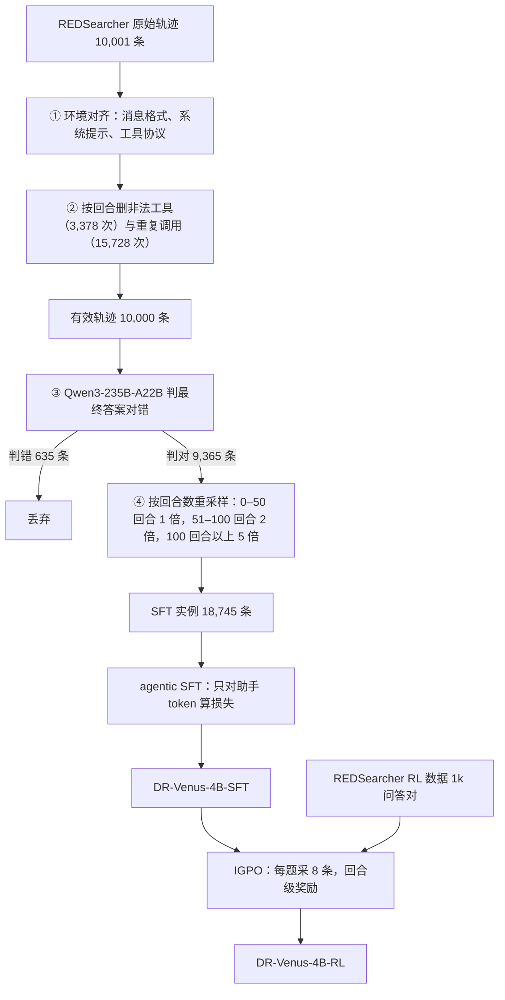

# DR-Venus：4B 深研 agent 卡在 200 轮奖励饿死，先把 1 万条开放长轨迹洗干净再加权，再用信息增益给每一回合打分

<!-- release-date: 2026-04-21 -->

> 本文依据 Venus Team, Ant Group 的 **DR-Venus: Towards Frontier Edge-Scale Deep Research Agents with Only 10K Open Data**，arXiv:2604.19859v1，2026-04-21，共 16 页。页码均指 PDF 自身页码。文中区分三件事：**论文明确写了什么**、**我们怎么解释它**（推算、换算、读图约值都会注明）、**哪些是外部资料补充**。

这是一篇**小模型深研 agent 的后训练方法论文**，不是新基座报告。基座是现成的 Qwen3-4B-Thinking-2507，没有改架构，也没有预训练。它回答一个很窄的问题：只有大约 1 万条开放轨迹时，怎样把 4B 模型训成一个能走 200 轮工具交互的深研 agent。

## 读前先把几个词说成人话

- **深研 agent（deep research agent）**：用户给一个很难直接搜到答案的问题，模型要多轮搜索、打开网页、收集证据，最后交答案。论文把它写成长视野的「推理—行动」问题：每一回合输出一段思考 $\tau_t$ 和一个动作 $a_t$，动作是搜索、浏览或交卷（PDF p. 3）。
- **搜索与浏览**：本篇只给模型这两件工具。搜索走 Serper 接 Google，每个查询返回前 10 条；浏览用 Jina 读网页，再交给 Qwen3-30B-A3B-Instruct-2507 做摘要（PDF p. 9）。方法节叫 browse，附录系统提示里的函数名是 `visit`（PDF p. 16）。
- **SFT（监督微调）**：拿别人走通的轨迹当标准答案，用下一个 token 的交叉熵更新模型。
- **GRPO（组相对策略优化）**：同一道题采一组轨迹，用组内相对好坏当优势，不另训价值模型。出处见 DeepSeekMath 一篇。
- **优势塌缩（advantage collapse）**：一组轨迹全错，全是 0 分，组内相对好坏也全是 0，更新就停了（PDF p. 2）。
- **IGPO（基于信息增益的策略优化）**：作者团队在 ICLR 2026 的前作（PDF p. 14 参考文献，作者与本篇贡献者名单高度重叠）。它不问「这一步像不像标准答案」，而问「看完这一步，模型对标准答案的把握有没有上升」。
- **Pass@K**：同一道题采 $K$ 次，至少一次对就算过。Pass@1 看一次做对的可靠性，Pass@16 看能力天花板。

## 一句话先说清

给 4B 教深研，最省事的做法是：拿一批现成搜索轨迹整段 SFT，再上一条只看最终对错的 GRPO。这条路有两个漏洞，而且会叠加：

1. **小模型吃不了脏监督**。 开放轨迹里有运行时不提供的工具、大量重复浏览、少数答错的样本（PDF p. 2、4）。
2. **200 轮只看终点，强化学习没有梯度**。 小模型采一组 rollout 经常一条都不对，优势直接塌成零（PDF p. 2、7）。

DR-Venus 两段都不换基座：

> **SFT 先把轨迹洗成和线上一致的协议，删掉非法工具和重复调用，只留判对的，再给长轨迹 2 倍、5 倍权重；RL 不再只在终点打分，而用「这一步有没有提高模型对标准答案的把握」当回合奖励，格式错了只罚那一回合**。

结果：在六个深研基准上，4B 的 RL 检查点在 BrowseComp 上 29.1、BrowseComp-ZH 上 37.7、xBench-DS-2505 上 74.7，全面领先此前 9B 以下的开源 agent；在 xBench-DS-2505 上贴近 Tongyi-DR-30B 的 75.0（PDF p. 9–10）。但它在 BrowseComp 和 GAIA 上离最好的 30B 系统仍有 10–20 分的距离，这一点后面拆开讲。

### 一条阅读路线

1. **p. 4 第 2.2.1 节**：四步数据清洗，所有关键数字都在这一页。
2. **p. 5–8 第 2.3 节式 (2)–(10)**：信息增益奖励、回合级格式惩罚、IG-Scale、折扣回传。
3. **p. 10 Table 1、p. 11 Table 2**：主榜与消融。Table 2 只有五行，却是全文最干净的证据。
4. **p. 12 Figure 2–3**：Pass@K 与浏览比例。

## 主要矛盾：数据少，模型小，两件事在同一条链上

深研系统大多建在更大的模型上，常常依赖闭源数据或更复杂的流水线（PDF p. 2）。论文把小模型的困难归成两件事：**数据质量**与**数据利用**（PDF p. 2）。

**数据质量**。 本篇运行时只暴露搜索和浏览，而 REDSearcher 原始轨迹里还有 Python 解释器一类调用。整段留下，4B 会学会发出线上根本没有的工具；整条丢掉，又浪费一批本可修好的轨迹。重复浏览更常见，脏主要出在「打开网页」这一步，而不在「发出查询」（PDF p. 4）。

**数据利用**。 1 万条里真正像深研的长轨迹只占一部分。平均抽样等于把梯度预算花在短轨迹上。到了 RL 阶段，高质量的开放 agentic RL 数据极少（PDF p. 5），200 轮只在终点给 0/1，组内又常常全错，GRPO 的优势塌成零（PDF p. 2、7）。

**我们如何解释它**。 这两层会叠加：脏 SFT 让 4B 先学会一套不稳的工具格式，不稳的格式又让 RL 的长轨迹更容易全军覆没。于是 DR-Venus 的选择是 SFT 侧提高每条监督的含金量，RL 侧提高每个回合的监督密度，而不是再去造 10 万条新轨迹。

## 先看全景：两段训练，一条数据线

这张图按 PDF p. 4 的四步流程与 p. 8–9 的训练设置重画，是流程示意。丢弃的 635 条是 $10{,}000-9{,}365$ 的差，论文只给了留下的比例 93.65%。

## 核心设计一：四步把 10,001 条洗成 18,745 条，故意让长轨迹变多

### 四步各做什么

全部发生在 SFT 之前（PDF p. 4）：

1. **环境对齐**。 把轨迹改写成和线上推理完全相同的消息格式、系统提示、工具参数和工具返回格式，让模型在部署时的协议下学用工具。10,001 条全部转换成功。
2. **非法工具剪枝与去重**。 运行时只有搜索和浏览，其他工具调用连同配对的返回**按回合**删，不整条丢。这一步动到 1,064 条轨迹，删掉 3,378 次非法调用，主要是 Python 解释器。然后删重复的搜索与浏览：6,821 条轨迹里出现过重复，一共删掉 15,728 次，多数是重复浏览。洗完剩 10,000 条有效轨迹。
3. **正确性过滤**。 用 Qwen3-235B-A22B-Instruct-2507 当裁判，实现改自 Tongyi-DeepResearch，只留最终答案判对的轨迹：9,365 条，占有效集的 93.65%。
4. **按回合数重采样**。 0–50 回合权重 1 倍，51–100 回合 2 倍，超过 100 回合 5 倍。训练集从 9,365 条变成 18,745 个实例；超过 50 回合的占比从 60.28% 升到 80.15%，超过 100 回合的从 13.29% 升到 33.21%。

第三步只丢掉约 6%，说明这份开放集本身已经偏向「做得对的轨迹」。DR-Venus 的数据工作重点不在「从垃圾里淘金」，而在协议对齐、去重，以及把梯度座位让给长轨迹。

### 5 倍权重到底在做什么

用论文给的两个比例反推三档条数（本文推算，不是论文原表）。合格的 9,365 条里：

- 超过 100 回合：$9{,}365\times 13.29\%\approx 1{,}245$ 条；
- 51–100 回合：$9{,}365\times 60.28\%-1{,}245\approx 4{,}400$ 条；
- 0–50 回合：$9{,}365-5{,}645=3{,}720$ 条。

加权之后 $3{,}720\times 1+4{,}400\times 2+1{,}245\times 5=18{,}745$，正好等于论文的实例数；长于 50 回合的实例 $15{,}025/18{,}745\approx 80.15\%$，长于 100 回合的 $6{,}225/18{,}745\approx 33.21\%$，也都对得上。所以重采样没有造新数据：一条超过 100 回合的轨迹在一个 epoch 里被看五次，短轨迹看一次。SFT 只训一个 epoch（PDF p. 9），这组权重就是长视野在这一轮梯度里实际占到的份额。

### 证据：只改抽样权重，BrowseComp 涨 4 分

Table 2 的前三行（PDF p. 11）：

| 配置 | BrowseComp | BrowseComp-ZH |
|---|---:|---:|
| DR-Venus-4B-SFT，不重采样 | 22.8 | 33.9 |
| DR-Venus-4B-SFT，重采样 | 26.8（+4.0） | 35.7（+1.8） |

两行用的是同一批洗好的轨迹，唯一差别是长轨迹是否加权（PDF p. 11）。这是全文最干净的一组对照。

### 代价与边界

论文没有 Limitations 小节。以下是我们读完后的判断：

- 正确性过滤依赖 235B 裁判，4B 学到的「对」是另一台大模型的判断；
- 5 倍权重也会放大长轨迹里残留的坏习惯。论文自己说 SFT 之后仍有格式错误、冗余推理和低效工具使用，要靠 RL 再收（PDF p. 5）；
- 重采样只改变已判对轨迹的长度分布，不补「从来没做对过」的题。

### SFT 只监督助手，观察进上下文、不进损失

一条轨迹串成一段自回归序列，损失只落在助手生成的位置：每回合的思考、工具调用和最终答案；网页与搜索返回掩掉（PDF p. 5，式 1）：

$$
\mathcal{L}_{\mathrm{SFT}}(\theta)=-\sum_{H\in\mathcal{D}_{\mathrm{SFT}}}\ \sum_{i\in\mathcal{M}(H)}\log\pi_\theta(x_i\mid x_{<i})
$$

$\mathcal{M}(H)$ 是轨迹 $H$ 里助手 token 的位置集合。观察仍在前缀里，模型生成下一动作时看得见，只是不要求它复述搜索引擎的摘要。

### 可迁移启发

开放 agent 轨迹不要整包进 SFT。先按运行时的工具集做回合级剪枝，而不是整条丢；再单独去重，重复往往集中在浏览。长度加权用三个整数档就够，先画出回合数直方图，算清「长于 $N$ 回合占多少」，再决定 2 倍还是 5 倍。

## 核心设计二：IGPO，把「这一步有没有更接近标准答案」写成回合奖励

### 旧问题：终点 0/1 撑不起 200 轮

SFT 之后模型会走流程，但格式、冗余和工具效率仍不稳（PDF p. 5）。若上普通 GRPO，奖励要等 200 轮才出现一次；一组 8 条常常全错，优势塌零；就算有一条做对，也说不清是第 3 步搜对了，还是第 180 步看对了网页。论文的对策是「用更稠的奖励补偿数据量不足」，在同样 1k 条问答上把监督做密（PDF p. 5）。

### 新设计：四步把奖励落到每一回合

上图是一条虚构的 7 回合轨迹，按 PDF p. 5–8 的式 (2)–(10) 画出奖励怎样一步步落下来。下面只补图上读不出的定义与理由。

**信息增益（IG）奖励**。 标准答案记作 $g=(g_1,\ldots,g_L)$。先算当前历史下，策略给 $g$ 的平均对数概率（PDF p. 6，式 2）：

$$
\log\pi_\theta(g\mid h_{i,\le t})=\frac{1}{L}\sum_{j=1}^{L}\log\pi_\theta(g_j\mid h_{i,\le t},\,g_{<j})
$$

相邻两回合之差就是第 $t$ 回合的 IG 奖励（PDF p. 6，式 3）：

$$
r_{i,t}^{\mathrm{IG}}=\log\pi_\theta(g\mid h_{i,\le t})-\log\pi_\theta(g\mid h_{i,\le t-1}),\qquad 1\le t<T
$$

人话：看完这一回合，模型觉得标准答案更像自己会写的东西了，就加分；更不像了，就减分。实现上把 $g$ 包成和模型回答同样的结构，例如 `<think>Now there's enough information to answer</think><answer>Ground Truth g</answer>`。IG 不用于交卷那一回合，交卷回合保留按答案对错给的结果奖励 $r_i^{\mathrm{O}}$，论文写「如规则奖励或 LLM 裁判奖励」，没说实验用了哪一种（PDF p. 6）。脚注说 IG 来自对数概率，优化时做 stop-gradient（PDF p. 6）：它是标量奖励，梯度不穿过评估 $g$ 的那次前向。

**浏览感知分配（可选，实验启用）**。 搜索回合给的是短摘要，偏探索、噪声大；浏览才把具体证据摊开。所以只在浏览回合算 IG，再把它赋给该浏览回合和上一次浏览以来的全部搜索回合（PDF p. 6、9）。搜索值不值，要等后面那次打开网页才结算。

**回合级格式惩罚**。 轨迹级格式惩罚会因为一处标签没闭合，把其余格式正确的回合一起罚；对可能超过 200 回合的深研，这种粗粒度约束「显然不够」（PDF p. 6）。改成：该回合格式对，保留原奖励；格式错，整步换成 $-\lambda_{\mathrm{fmt}}$（PDF p. 6，式 4），实验取 $\lambda_{\mathrm{fmt}}=1.0$（PDF p. 9）。

**组内标准化**。 同一题采 $G$ 条轨迹，非终点奖励与终点奖励量纲不同，分两套在组内标准化（PDF p. 6–7，式 5）：

$$
\tilde{r}_{i,t}=\begin{cases}
\dfrac{\hat{r}_{i,t}^{\mathrm{IG}}-\mu^{\mathrm{IG}}}{\sigma^{\mathrm{IG}}}, & 1\le t<T_i,\\[0.8em]
\dfrac{\hat{r}_i^{\mathrm{O}}-\mu^{\mathrm{O}}}{\sigma^{\mathrm{O}}}, & t=T_i.
\end{cases}
$$

带帽子的 $\hat{r}$ 是做过格式替换之后的奖励；$\mu^{\mathrm{IG}},\sigma^{\mathrm{IG}}$ 取自组内全部非终点回合，$\mu^{\mathrm{O}},\sigma^{\mathrm{O}}$ 取自组内 $G$ 个终点。

**IG-Scale（可选，实验启用）**。 200 轮时终点常常全是 0，优化会被 IG 牵着走，容易陷进局部最优（PDF p. 7）。于是先在 batch 上算两类标准化奖励的平均绝对值（PDF p. 7，式 6）：

$$
M^{\mathrm{O}}=\frac{1}{B}\sum_{i=1}^{B}\bigl|\tilde{r}_i^{\mathrm{O}}\bigr|,\qquad
M^{\mathrm{IG}}=\frac{1}{\sum_{i=1}^{B}(T_i-1)}\sum_{i=1}^{B}\sum_{t=1}^{T_i-1}\bigl|\tilde{r}_{i,t}^{\mathrm{IG}}\bigr|
$$

再取缩放系数（PDF p. 7，式 7）：

$$
s=\min\!\left(\frac{\max(M^{\mathrm{O}},\eta)}{M^{\mathrm{IG}}+\delta},\ s_{\max}\right),\qquad \eta=0.3,\ \delta=10^{-8},\ s_{\max}=10
$$

非终点奖励乘 $s$，终点不乘（式 8）。论文的说法是：终点监督弱时压低 IG，更新更保守；不开时更激进（PDF p. 7）。按公式读（我们的解释）：终点几乎全零时 $M^{\mathrm{O}}$ 很小，分子被下限 $\eta=0.3$ 托住，若 $M^{\mathrm{IG}}$ 在 1 附近，IG 就被缩到约三成。

**折扣回传**。 以上都只是「这一回合当下的后果」。把未来考虑进来，按回合做折扣和（PDF p. 7，式 9）：

$$
\tilde{R}_{i,t}=\sum_{k=t}^{T_i}\gamma^{k-t}\,\bar{r}_{i,k}
$$

实验取 $\gamma=0.95$（PDF p. 9）。$\tilde{R}_{i,t}$ 赋给第 $t$ 回合的每一个助手 token（PDF p. 7–8）。

**我们如何解释 $\gamma=0.95$**。 它的半衰期约 14 回合，$\gamma^{199}$ 已在 $10^{-5}$ 量级。也就是说，200 轮任务里终点对错几乎传不回早期回合，早期搜索主要靠 IG 来教。这正是长视野任务必须把奖励做稠的算术原因。

### 目标函数：GRPO 的壳，回合奖励当优势

IGPO 的目标就是带裁剪的组相对目标，把原来整条轨迹共享的优势换成 $\tilde{R}_{i,k}$（PDF p. 8，式 10）：

$$
\mathcal{J}_{\mathrm{IGPO}}(\theta)
=\mathbb{E}\Bigg[\frac{1}{G}\sum_{i=1}^{G}\frac{1}{|u_i|}\sum_{k=1}^{|u_i|}
\min\Big(\rho_{i,k}\tilde{R}_{i,k},\ \mathrm{clip}(\rho_{i,k},1-\epsilon,1+\epsilon)\,\tilde{R}_{i,k}\Big)
-\beta\,D_{\mathrm{KL}}(\pi_\theta\,\|\,\pi_{\mathrm{ref}})\Bigg]
$$

$\rho_{i,k}$ 是新旧策略在第 $k$ 个助手 token 上的概率比，$c_{i,k}$（前缀，含观察）只作条件。$\epsilon$ 与 $\beta$ 的取值，实验部分都没给。

### 证据：同一份 SFT，GRPO 掉分，IGPO 涨分

Table 2 的后两行（PDF p. 11），增减相对带重采样的 SFT：

| 配置 | BrowseComp | BrowseComp-ZH |
|---|---:|---:|
| DR-Venus-4B-SFT（重采样） | 26.8 | 35.7 |
| + GRPO | 25.3（−1.5） | 35.6（−0.1） |
| + IGPO | 29.1（+2.3） | 37.7（+2.0） |

论文的判断是：在约 200 轮的深研上，RL 能否稳定涨分取决于奖励是否足够稠密、与回合对齐，稀疏的轨迹级优化在这里不合适（PDF p. 11）。

这个判断对这张表成立，但不宜推广成「GRPO 做不了深研」：GRPO 基线的奖励、裁剪、KL 与步数都没写，也没说两组 RL 是否同预算。浏览感知分配、IG-Scale、回合级格式惩罚三件也没有单独消融，Table 2 只能说明「整套 IGPO 比这份 GRPO 基线好」。

### 代价与边界

- **IG 需要标准答案**。 RL 阶段不是无监督探索，而是 1k 条带答案的问答对（PDF p. 8）。没有金子，这个奖励算不出来。
- **它量的是「对已知答案的把握」**，不是「找到了新事实」。RL 数据全是英文，论文把 BrowseComp-ZH 在大 $K$ 时 RL 反而不如 SFT 部分归到这里（PDF p. 12）。
- **边界情形没写**。 全程不浏览就交卷的轨迹 IG 怎么填、最后一次浏览之后的搜索回合拿什么，组内终点全零时 $\sigma^{\mathrm{O}}=0$ 怎么处理，原文都没有说明。

### 可迁移启发

有标准答案的长视野工具任务，不必先训一个过程奖励模型：先量「每一步之后模型对金子的对数概率变了多少」，比另训一台打分器便宜，也比从中间步做蒙特卡洛展开直接。格式惩罚要下到回合，不能下到整条轨迹。过程奖励算在「真正看到证据」的那一步，再回填给前面的探索。

## 数据与训练配方

「1 万条」指的是 SFT 原始轨迹的量级。两个阶段各用一份开放数据（PDF p. 4、8）：

| 阶段 | 来源 | 用多少 |
|---|---|---|
| SFT | [`Zchu/REDSearcher_SFT_10K`](https://huggingface.co/datasets/Zchu/REDSearcher_SFT_10K) | 清洗后 9,365 条，重采样成 18,745 个实例 |
| RL | [`Zchu/REDSearcher_RL_1K`](https://huggingface.co/datasets/Zchu/REDSearcher_RL_1K) | 1k 问答对 |

「全部开放数据」对这两份数据集成立；「只看了 1 万条、每条看一次」不成立。

超参（PDF p. 9）：

| 项 | SFT | RL |
|---|---|---|
| 硬件 | 8 × A100 | 16 × A100 |
| 框架 | verl FSDP 训练器 | verl，vLLM rollout 加 FSDP 训练器 |
| 长度 | 最大训练长度 200K token | rollout 上下文最长 256K，每回合生成最长 8,192 token |
| batch | 全局 32，每卡 micro-batch 1 | 训练 batch 16，组大小 $G=8$ |
| 其他 | 学习率 $1\times 10^{-5}$，1 个 epoch，右截断、梯度检查点、序列并行 8 | 温度 1.0；浏览感知分配与 IG-Scale 开启，$\lambda_{\mathrm{fmt}}=1.0$，$\gamma=0.95$ |

评测每题最多 200 步，温度 1.0、top-p 0.95、top-k 20、presence penalty 1.1，token 预算 256K；样本少于 300 条的基准报三次独立评测的均值，其余报一次（PDF p. 8–9）。论文没写哪些基准属于前一档，也没写 RL 步数、墙钟、$\epsilon$、$\beta$、是否全参微调。

**「边缘规模」指的是策略权重**。 推理链路里搜索是 Google API，浏览结果要经过 30B 摘要模型（PDF p. 9）；论文没有报告端侧的延迟、显存或离线表现。附录系统提示把当前日期写死为 2026-03-01（PDF p. 16）。

## 实验怎么证明

### 主榜 Table 1

Table 1 分三块：带工具的前沿基础模型、30B 以上训练过的 agent、9B 以下训练过的 agent（PDF p. 10）。论文排除了依赖额外上下文管理或测试时扩展的方法，点名 RE-TRAC-4B、Marco-DR-8B、MiroThinker-v1.0（PDF p. 8）。下表摘出和结论直接相关的行，「–」为原表空缺：

| 模型 | BrowseComp | BrowseComp-ZH | GAIA（纯文本） | xBench-DS-2505 | xBench-DS-2510 | DeepSearchQA |
|---|---:|---:|---:|---:|---:|---:|
| GPT-5 High | 54.9 | 65.0 | 76.4 | 77.8 | 75.0 | 79.0 |
| Gemini-3-Pro | 59.2 | 66.8 | – | – | 53.0 | 76.9 |
| SMTL-30B-300 | 48.6 | – | 75.7 | 82.0 | – | – |
| Tongyi-DR-30B | 43.4 | 46.7 | 70.9 | 75.0 | 55.0 | – |
| REDSearcher-30B-A3B | 42.1 | 49.8 | 80.1 | – | – | – |
| OpenResearcher-30B-A3B | 26.3 | – | 64.1 | 65.0 | – | – |
| WebSailor-7B | 6.7 | 14.2 | 37.9 | 34.3 | – | – |
| WebExplorer-8B-RL | 15.7 | 32.0 | 50.0 | 53.7 | 23.0 | 17.8 |
| AgentCPM-Explore-4B | 24.1 | 29.1 | 63.9 | 70.0 | 34.0 | 32.8 |
| DR-Venus-4B-SFT | 26.8 | 35.7 | **65.4** | 69.0 | 35.3 | 37.7 |
| DR-Venus-4B-RL | **29.1** | **37.7** | 64.4 | **74.7** | **40.7** | **39.6** |

加粗只在 9B 以下这一组内比较。

**对 9B 以下**。 论文列出 SFT 相对 AgentCPM-Explore-4B 的五项增益：BrowseComp +2.7、BrowseComp-ZH +6.6、GAIA +1.5、xBench-DS-2510 +1.3、DeepSearchQA +4.9（PDF p. 9）。第六项 xBench-DS-2505 上 SFT 是 69.0，低于 AgentCPM 的 70.0，所以论文说的是「多数基准」。RL 相对 SFT 在五项上再涨：+2.3、+2.0、+5.7、+5.4、+1.9；第六项 GAIA 从 65.4 降到 64.4，论文写的是「六项中的五项」（PDF p. 9）。

**对 30B 以上**。 论文举的两个例子都对得上：SFT 在 OpenResearcher-30B-A3B 报出的全部三格上都更高；RL 在 xBench-DS-2505 上 74.7，贴近 Tongyi-DR-30B 的 75.0（PDF p. 9–10）。但「缩小差距」不是整张表：BrowseComp 上 SMTL-30B-300 是 48.6、Tongyi 43.4，DR-Venus 29.1；GAIA 上 REDSearcher-30B-A3B 是 80.1，DR-Venus 64.4。前沿基础模型更远，GPT-5 High 的 BrowseComp 是 54.9。摘要比较的对象是「先前的 agentic 模型」。

首页 Figure 1 只画了 9B 以下的 agent 和 DeepDive-32B 的两版，得分更高的 30B 系统都不在图里（PDF p. 1）。它是一张「小模型榜」，不能当成对全体开源 agent 的比较。

### 表间打架：REDSearcher-30B-A3B 有两套数

Table 1 的 REDSearcher-30B-A3B 是 BrowseComp 42.1、BrowseComp-ZH 49.8（PDF p. 10）；Table 2 的「REDSearcher-30B-A3B（SFT）」是 34.7 与 26.8（PDF p. 11）。

第 3.3 节说「DR-Venus-4B-SFT 已在 BrowseComp-ZH 上超过 REDSearcher-30B-A3B」，用的是 Table 2 的 26.8 对 35.7（PDF p. 11）。若按 Table 1 的 49.8，这句话就反了。Table 2 图注写「所有 SFT 模型都基于 REDSearcher 轨迹训练」、这一行带 SFT 标记，一种说得通的读法是 Table 1 引的是 REDSearcher 的完整系统分，Table 2 是其 SFT 版本；论文没有这样声明。即便只看 Table 2，4B-SFT 在英文榜上仍低于 30B-SFT（26.8 对 34.7）。

### Pass@K：天花板很高，但横比的是别人的 Pass@1

Figure 2 在 BrowseComp 与 BrowseComp-ZH 上画了 SFT 与 RL 的 Pass@K，并把 Tongyi-DR-30B、Gemini-3-Pro、GPT-5 High 画成水平虚线（PDF p. 12）。虚线的值就是 Table 1 的单次分数。下表的 $K=1$、2、8、16 部分数值正文也写了，$K=4$ 读自图上标注：

| | $K=1$ | $K=2$ | $K=4$ | $K=8$ | $K=16$ | 虚线（单次） |
|---|---:|---:|---:|---:|---:|---|
| BrowseComp，SFT | 26.8 | 37.7 | 47.3 | 55.3 | 61.7 | Tongyi 43.4，GPT-5 High 54.9，Gemini-3-Pro 59.2 |
| BrowseComp，RL | 29.1 | 39.3 | 49.3 | 58.7 | 63.7 | 同上 |
| BrowseComp-ZH，SFT | 35.7 | 52.9 | 65.7 | 74.0 | 78.5 | Tongyi 46.7，GPT-5 High 65.0，Gemini-3-Pro 66.8 |
| BrowseComp-ZH，RL | 37.7 | 53.3 | 64.4 | 73.0 | 76.5 | 同上 |

英文榜上 RL 在每个 $K$ 都更高，论文据此说 RL 不只提高低预算成功率，也把天花板略微往上推。中文榜相反：$K\le 2$ 时 RL 更好，从 $K=4$ 起 SFT 反超；论文把大 $K$ 变差部分归到 RL 数据全是英文（PDF p. 11–12）。

正文最容易被转述的一句是：BrowseComp-ZH 上 4B-SFT 的 Pass@16 达到 78.5，「显著超过」Tongyi-DR-30B 的 46.7，甚至超过 Gemini-3-Pro 的 66.8 和 GPT-5 High 的 65.0（PDF p. 12）。**分母不同**：78.5 是 16 次里至少一次对，另外三个是单次分数。它证明给 4B 16 次机会、中文浏览的命中率可以很高，不证明 4B 一次推理强过 GPT-5 High。主表排除了测试时扩展，这里又用测试时扩展谈天花板，两段要分开读。

### 浏览比例：做对的轨迹更爱打开网页，RL 把这个关系拧正

Figure 3 画了六个基准上正确、错误、全部轨迹的浏览比例（PDF p. 12）。下表数值读自图上柱顶标注：

| 基准 | 正确 SFT | 正确 RL | 错误 SFT | 错误 RL | 全部 SFT | 全部 RL |
|---|---:|---:|---:|---:|---:|---:|
| BrowseComp | 17.3 | 21.1 | 12.1 | 14.7 | 13.0 | 15.9 |
| BrowseComp-ZH | 10.1 | 13.8 | 6.5 | 10.6 | 7.3 | 11.4 |
| GAIA（纯文本） | 32.7 | 38.6 | 29.8 | 35.1 | 31.6 | 36.9 |
| xBench-DS-2505 | 29.0 | 31.6 | 16.8 | 23.8 | 22.6 | 26.8 |
| xBench-DS-2510 | 14.5 | 23.0 | 15.6 | 17.5 | 15.3 | 18.8 |
| DeepSearchQA | 38.8 | 44.5 | 34.2 | 39.3 | 35.6 | 40.8 |

正文给了跨基准的合计：全部轨迹的浏览比例 SFT 17.49%、RL 22.46%，正确轨迹 23.71% 到 28.96%（PDF p. 13）。唯一反常的是 xBench-DS-2510 的 SFT：错误轨迹比正确轨迹更爱浏览（15.57% 对 14.51%），RL 之后翻过来（22.99% 对 17.50%）（PDF p. 13）。

论文的解释是：搜索只给短摘要，浏览才读到能落地的证据；RL 不是笼统地多搜或少搜，而是把工具使用拧向更有效的取证（PDF p. 12–13）。浏览感知的 IG 分配与这一观察同向，但论文没做「关掉浏览感知，Figure 3 会不会翻回去」的实验，所以这是一条叙事上的呼应，不是模块消融。

## 限制与没写的东西

论文没有 Limitations 小节，结论重复的是两段配方与「数据质量和利用足以解锁小模型能力，RL 负责稳住格式、工具与长程执行」（PDF p. 13）。以下是我们核对全文后认为没公开、或原文前后不一致的地方：

- Table 1 与 Table 2 的 REDSearcher-30B-A3B 两套分数不一致，「4B 超过 30B」只对 Table 2 的中文格成立；
- Figure 2 用 4B 的 Pass@16 去比别人的 Pass@1；
- 结果奖励用规则还是裁判、$\epsilon$、$\beta$、RL 步数与墙钟都没给；
- 浏览感知分配、IG-Scale、回合级格式惩罚没有单独消融；
- Table 1 没有 Qwen3-4B-Thinking-2507 基座本身的零样本分数，无法看出 SFT 从多低起步；
- 「边缘规模」没有端侧延迟、显存或离线数字，推理依赖 Serper、Jina 与 30B 摘要模型。

## 可迁移启发

1. **开放轨迹先按运行时工具集剪，再按长度加权**。 非法调用按回合删、重复调用单独删，比「低质量就整条丢」更省数据；1 / 2 / 5 三档权重把长于 100 回合的份额从 13% 拉到 33%，同一批数据 BrowseComp 就涨 4 分。
2. **先滤对错，再加权**。 5 倍权重会把一条答错的 200 轮轨迹也放大 5 倍。这份开放集的通过率高达 93.65%，换一份通过率低的数据，过滤的重要性只会更高。
3. **200 轮不要把希望寄托在终点 0/1 上**。 $\gamma=0.95$ 下早期回合几乎收不到终点信号，组内全错时 GRPO 的优势就是零。有标准答案时，先用「对金子的对数概率差」当中间奖励。
4. **格式惩罚下到回合，过程奖励落在看见证据的那一步**。 一个标签错误不该连坐整条；搜索的价值等浏览之后再结算。
5. **Pass@K 看天花板，Pass@1 拿去排名**。 两者都可以报，但比较时写清 $K$。
6. **「小模型」先问策略多大，再问工具栈还依赖谁**。 复现与部署时，把 30B 摘要模型和搜索 API 写进依赖。

## 关键词回看

- **DR-Venus**：蚂蚁 Venus Team 的 4B 深研 agent，分 SFT 与 RL 两个检查点。
- **环境对齐 / 非法工具剪枝 / 去重 / 正确性过滤**：SFT 数据清洗的前三步。
- **按回合数重采样**：0–50 / 51–100 / 100 回合以上权重 1 / 2 / 5，9,365 条变 18,745 个实例。
- **agentic SFT**：只对助手 token 做下一词预测，观察只作条件。
- **信息增益奖励**：相邻两回合间模型对标准答案平均对数概率的差，stop-gradient。
- **浏览感知分配**：IG 只在浏览回合算，再回填给之前的搜索回合。
- **回合级格式惩罚**：格式错则该回合奖励换成 $-\lambda_{\mathrm{fmt}}$。
- **IG-Scale**：终点监督弱时按两类奖励的平均绝对值压低 IG。
- **折扣回传**：$\gamma=0.95$ 的回合级折扣和，赋给该回合全部助手 token。
- **优势塌缩**：组内全错时相对优势全为零，GRPO 停止更新。

## 资料与阅读边界

### 本文依据的版本与首发日

- 原件：`papers/AntGroup/DR-Venus.pdf`，16 页。[arXiv 页面](https://arxiv.org/abs/2604.19859) 的提交历史只有 v1，2026-04-21 17:59:02 UTC，Comments 写 Technical Report of DR-Venus；本地文件即该版本。
- `release-date` 取 2026-04-21。Hugging Face 上 `DR-Venus-4B-SFT` 的权重文件提交于 2026-04-21 08:02:37 UTC，`DR-Venus-4B-RL` 于 08:23:31 UTC；官方仓库 [inclusionAI/DR-Venus](https://github.com/inclusionAI/DR-Venus) 第一个带代码的提交 `6dfa2c2`（300 个文件）时间为 2026-04-21 08:03:52 UTC；arXiv v1 同日提交。仓库 README News 把权重与代码开源写成 2026-04-22、把技术报告上 arXiv 写成 2026-04-23，均晚于上述时间戳；这些文件在 04-21 当天是否已公开可见，未能核实。

### 外部资料补充（不是 PDF 原文）

- 权重集合 [inclusionAI/dr-venus](https://huggingface.co/collections/inclusionAI/dr-venus)，含 SFT、RL 检查点，README News 另记 2026-04-24 放出 GGUF 版本。
- IGPO 前作：[arXiv:2510.14967](https://arxiv.org/abs/2510.14967)，ICLR 2026。算法机制以本 PDF 式 (2)–(10) 为准，前作的实验数字与本篇 Table 1 不是同一次实验。
- REDSearcher：[arXiv:2602.14234](https://arxiv.org/abs/2602.14234)，本篇 SFT 轨迹与 RL 问答的来源。

### 跨篇参考

GRPO 出处见 DeepSeekMath；verl 框架见 HybridFlow；高不确定性网页 agent 见 WebSailor（Table 1 引用了其 7B 那一行）；数学里嵌代码执行、观察同样掩出损失的做法见 ReTool。
