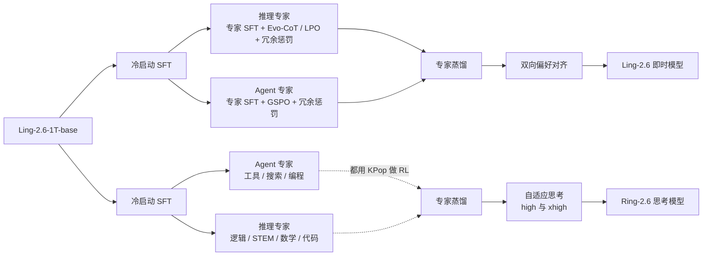
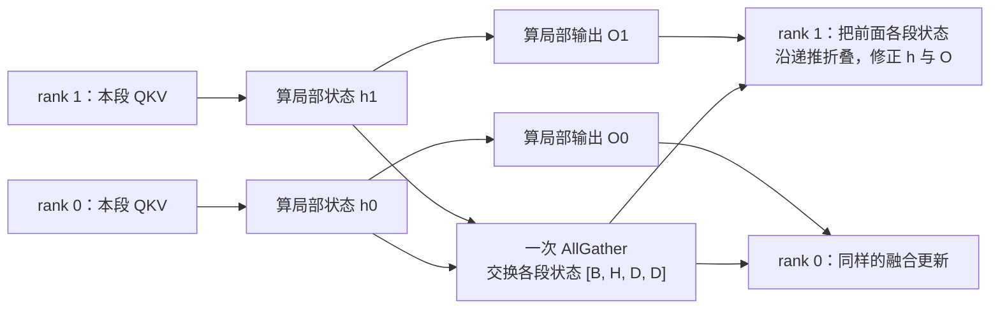
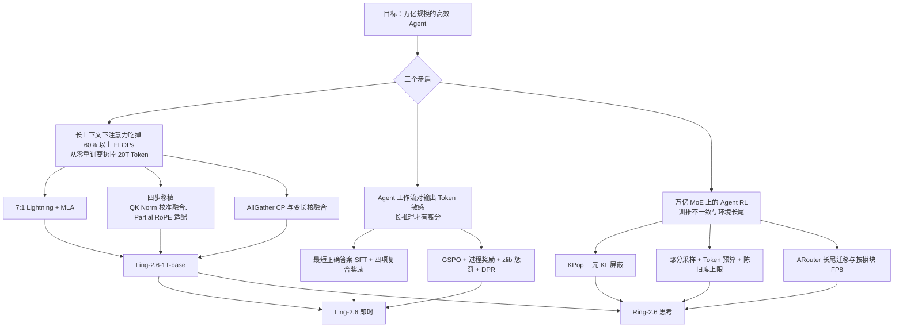

# Ling 与 Ring 2.6：不重训万亿模型，给它换一副注意力

<!-- release-date: 2026-04-21 -->

> 本文依据蚂蚁集团 Ling Team（Inclusion AI）的 **Ling and Ring 2.6 Technical Report: Efficient and Instant Agentic Intelligence at Trillion-Parameter Scale**，arXiv:2606.15079v1，2026-06-13 提交，共 43 页（正文 p. 1–33，贡献者名单 p. 34–35，参考文献 p. 36–41，附录 A、B 在 p. 42–43）。页码均指 PDF 自身的页序。一份报告同时覆盖 Ling-2.6（即时回答）与 Ring-2.6（深度思考）两条线，本文按一篇写。文中区分三件事：**报告明确写了什么**、**我们怎么解释或验算它**、**哪些是外部资料补充**。

## 阅读前先认识几个词

- **Token（词元）与 KV Cache（键值缓存）**：Token 是模型读写文本的最小单位。生成时，前文每个 Token 算出的 Key 和 Value 留在显存里，下一个 Token 不必重算。普通 softmax 注意力的计算量随上下文长度按平方涨，KV Cache 按线性涨。
- **线性注意力（Linear Attention）**：去掉 softmax 后，注意力可以改写成对一个固定大小状态的递推更新（RNN 式），计算量随长度线性增长，也不需要 KV Cache。代价是精确回看远处某个细节的能力不如 softmax。**Lightning Attention** 是它的一种高效实现（报告引用 Qin et al. 2024 的 TransNormerLLM，PDF p. 2、p. 39）。
- **MLA（Multi-head Latent Attention，多头潜在注意力）**：DeepSeek-V2 提出的全注意力变体，把每个 Token 的 Key 和 Value 压成一条低秩潜向量来省缓存。机制见 DeepSeek-V2 一篇。
- **GQA（Grouped-Query Attention，分组查询注意力）**：多个查询头共用一组 KV 头。这是 Ling-2.0 那一代的注意力，也是本报告要替换掉的东西。
- **MoE（Mixture-of-Experts，混合专家）**：前馈层拆成很多专家，每个 Token 只激活少数几个，所以总参数很大、单 Token 计算量不大。
- **训推不一致（training-inference mismatch）**：强化学习里，rollout（让模型自己生成回答）用推理引擎，参数更新用训练引擎。两套引擎对同一个 Token 算出的概率有微小差异，在 MoE 上会被路由放大，足以让训练发散。
- **架构迁移（architectural retrofit）**：不从零训练新结构，而是把已经训好的模型逐层改成新结构，再用相对少的 Token 把能力养回来。这是这份报告最独特的一步。

## 一句话先说清

Ling 与 Ring 2.6 不是一个从零训练的新模型。它拿已经在 20T Token 上训过的 Ling-2.0-1T，把 GQA 注意力**逐层换成「7 层 Lightning Attention + 1 层 MLA」**，再继续训练约 9.6T Token，得到一个共享基座（PDF p. 3–4、9）。在这个基座上分出两条后训练路线：

- **Ling-2.6** 做即时回答，优化目标是「每个输出 Token 的能力」（capability per output token）；
- **Ring-2.6** 做深度推理和长程 Agent，用新的 RL 屏蔽规则 KPop 和异步部分采样，把万亿 MoE 上的 Agent 强化学习跑稳（PDF p. 3、13、18–19、30）。

开源的权重有三个：Ling-2.6-flash（104B）、Ling-2.6-1T 与 Ring-2.6-1T（PDF p. 2）。

如果只记一句话：

> **换架构不一定要重训。把结构替换拆成几步，每步只训相关参数把损失拉回来，一个训了 20T Token 的万亿模型也能中途换掉注意力。**

报告自己给的三个目标是：长上下文下的效率、每个输出 Token 的能力、面向真实 Agent 工作流的原生优化（PDF p. 1–2）。下面按「一个基座怎么来 → 两条后训练怎么走 → 系统怎么撑住」展开。

## 先看全景：9.6T Token 花在哪

这张图说明两件事。第一，**换注意力这一步本身只占约 4%**，真正的大头是换完之后 8T Token 的继续预训练，所以这不是「白拿一个新架构」，而是「省掉从零训练的 20T，多付 9.6T」。第二，256K 上下文只在最后 525B Token 里训。

继续预训练阶段的数据配比，正文写 46% 推理、50% 通用、4% 多语言（PDF p. 10），Figure 4 的方框写 64% 通用、36% 推理（PDF p. 9）。两处差 10 个百分点，报告没有解释，本文不替它选边。

三个开源模型：

| 模型 | 总参数 | 每 Token 激活参数 | 定位 |
|---|---:|---:|---|
| Ling-2.6-flash | 104B（PDF p. 2） | 约 7.4B（外部补充） | 高频 Agent 调用、低延迟 |
| Ling-2.6-1T | 1T（PDF p. 2） | 约 63B（外部补充，见下） | 即时回答旗舰 |
| Ring-2.6-1T | 1T（PDF p. 2） | 同上 | 深度推理与长程 Agent |

**报告正文没有给任何一个模型的激活参数量**，Table 1 只列层数、专家数和维度（PDF p. 5）。7.4B 来自 Ling-2.6-flash 的官方模型卡；63B 来自 Ling-2.5-1T 的模型卡。报告说 2.5 与 2.6 共用同一个迁移后的基座（PDF p. 4），所以 63B 按理也适用于 2.6-1T，这是本文的推断。全文也没有任何算力数字：GPU 型号与数量、训练时长、成本都没写。

## 第一层矛盾：长上下文把账单翻了面

### 注意力从配角变成主角

在 Ling-2.0 的 GQA 架构下，上下文超过 32K 后，注意力占总 FLOPs 超过 60%（PDF p. 2）；到 256K 以上，全注意力成了「绝对的性能瓶颈」（PDF p. 6）。

道理很简单。MoE 层的计算量与长度成正比：多一个 Token，多算一次前馈。softmax 注意力要让每个 Token 和前面所有 Token 比一遍，计算量按长度平方涨。短上下文时 MoE 是大头，长到某个点两条曲线交叉，报告给的交叉点约在 32K（PDF p. 6）。Agent 任务恰好是长上下文的重灾区：修一个 bug 要读整个仓库，一次搜索要塞几十个网页。

### 从零重训等于扔掉 20T Token

换线性注意力或混合结构是已知答案。麻烦在于 Ling-2.0-1T 已经在 20T Token 上训过（PDF p. 4），按新架构从零训一个万亿模型「代价高到不可行」（prohibitively expensive，PDF p. 3）。

所以报告真正要回答的是两个问题（PDF p. 4）：

1. 这种「架构移植」能不能在一个已经训好的模型上成功？
2. 移植后的基座还能不能撑住后续的专项训练？

## 核心设计一：7 层 Lightning 配 1 层 MLA

两种注意力各管一件事：Lightning 层把计算从 $O(n^2)$ 降到 $O(n)$，MLA 层在剩下的全注意力层里把 KV Cache 压进低秩潜空间（PDF p. 4）。图上最值得带走的是一个数：**80 层里只有 10 层的缓存随上下文变长**，其余 70 层只带一个固定大小的状态往前走。

两个尺寸的完整配置（PDF p. 5，Table 1；1T 的其他细节见 p. 5 正文）：

| 配置 | Ling-2.6-flash | Ling-2.6-1T |
|---|---:|---:|
| 层数 | 32 | 80 |
| 路由专家 / 每 Token 激活 / 共享专家 | 256 / 8 / 1 | 256 / 8 / 1 |
| 注意力头数 | 32 | 64 |
| 稠密层数 | 1 | 4 |
| Hidden size | 4,096 | 8,192 |
| 稠密层中间维 | 9,216 | 18,432 |
| 专家中间维 | 1,024 | 2,048 |
| KV / Q LoRA 秩 | 512 / 1536 | 512 / 1536 |
| 层组大小 | 8 | 8 |

1T 另有：每头 128 维；词表 157,184；RoPE 的 $\theta = 6{,}000{,}000$，旋转维度 64，即只对每头一半维度做旋转（Partial RoPE）；最大上下文 262,144（PDF p. 5）。

报告内部有一处不一致：正文写最大上下文 262,144，Figure 2 的旁注却写「Supported content length of 1M tokens」，而且图标题是「Ling 2.5 Architecture at 1T-Parameter Scale」（PDF p. 4）。这张图是从 2.5 的材料沿用的；Ling-2.5-1T 的官方模型卡确实写了最长 1M（外部补充）。本文以正文的 262,144 为准。

### 7:1 是怎么选出来的

报告定义层组大小 $M$：每 $M$ 层里 1 层 MLA、$M-1$ 层 Lightning。在等 FLOPs 约束下比较 $M \in \{2, 4, 8, 16\}$ 的 scaling 曲线（PDF p. 5–6，Figure 3、Table 2）：

| 层组大小 $M$ | 线性 : 全注意力 | scaling 表现 | 推理成本 |
|---:|---:|---|---|
| 2 | 1:1 | 与 $M=4$ 相当 | 高 |
| 4 | 3:1 | 与 $M=2$ 相当 | 中 |
| **8** | **7:1** | 最好的 scaling 趋势 | 低 |
| 16 | 15:1 | 损失明显退化 | 最低 |

报告还观察到：总 FLOPs 预算越大，线性层的比例可以再适度提高而不退化（PDF p. 6）。所以 7:1 是当前预算下的选择，不是常数。

读 Figure 3 要多看一眼（PDF p. 6）。四组实测点只落在约 $10^{18}$ 到 $10^{20.5}$ FLOPs 之间，而且几乎重叠；四条虚线是拟合后外推到 $10^{24}$ 的，$M=16$ 的「明显退化」只在外推段才分开。图例写的也是「Ling-2.5 (Linear+MLA, M=…)」。所以更准确的说法是：**在测过的区间里四种比例分不出高下，选 7:1 靠的是拟合外推的趋势**。报告没有给出等 FLOPs 的折算方法，也没有 7:1 在长上下文检索任务上的单独消融。

### 这一层设计的代价与边界

- 线性层没有 KV Cache，但每层要带一个 $[H, D, D]$ 的状态（形状见 PDF p. 27），报告没有给这部分的显存账；
- 纯线性注意力做不好精确检索、需要间隔插 softmax 层，是这类混合结构的常见动机（知识库 Hybrid注意力 一篇有对照），但本报告没有为此做实验；
- 线性注意力的递推结构让常规的上下文并行方案用不了，系统层得重写（见后面 Infra 一节）。

## 核心设计二：四步移植，把 GQA 模型改成混合模型

这是全报告最有原创性的部分。难点不在「目标结构是什么」，而在「从旧结构走到新结构，中途怎么不把模型训坏」。

四步共用一个套路：**每做一次结构改动，就用一小段只解冻少量参数的训练把损失拉回改动前，再做下一次改动**（PDF p. 9–10）。报告称之为「平滑的多阶段迁移」（PDF p. 5）。图已经把每步改什么、训什么画清楚，下面只讲图上读不出的原因。

### 第一步为什么先保留 QK Norm 和 Partial RoPE

Lightning 层按标准多头注意力工作，所以先把 GQA 的 $W_{qkv}$ 沿头维扩开，新增参数随机初始化，再加门控参数（PDF p. 6）。这一步照同团队的 Ring-flash-linear-2.0 做。**QK Norm 与 Partial RoPE 在这一步原样保留**，理由有三：稳住训练、兼容 FP8 训练、增强长上下文下的鲁棒性（PDF p. 6）。也就是说，先让新层活过来，其他能不动就不动。

第二步只训 $W_{qkv}$ 与 QK Norm 权重，让随机初始化的线性注意力参数「与预训练好的表示对齐」（PDF p. 10）。逻辑是：**新旧参数一起训，旧参数会被新参数的噪声梯度带偏；先冻住旧的，让新的追上来。**

### MLA 转换卡在两个不兼容上

剩下的 GQA 层用 TransMLA（Meng et al. 2025）转成 MLA（PDF p. 7、10）。但 Ling-2.0 的注意力和 TransMLA 的假设有两处不合（PDF p. 7）。

**不兼容一：QK Norm 挡住了矩阵吸收。** MLA 推理省缓存的前提是「矩阵吸收」：把 Key 的升维矩阵提前乘进 Query 一侧，打分全程留在潜空间（机制见 DeepSeek-V2 一篇）。这要求潜向量到打分之间全是线性运算。QK Norm 对每个 Query、Key 向量各自做 RMSNorm，除以的是**这个向量自己的模长**，是非线性的，吸收链在这里断了。

报告的解法不是硬删，而是用一批校准样本算出 Query 输出的整体尺度，把这个尺度和 QK Norm 的可学习增益 $\gamma_Q$ 一起折进投影权重（PDF p. 7，式 1）：

$$
\hat W_q \leftarrow \frac{W_q}{\sqrt{\dfrac{1}{Nd}\sum_{i=1}^{N}\sum_{j=1}^{d} q_{ij}^2+\epsilon}} \odot \gamma_Q
$$

- $N$ 是校准样本数，$d$ 是头维度，$q_{ij}$ 是第 $i$ 个样本第 $j$ 维的 Query 输出；
- 分母是全部样本、全部维度上 Query 的均方根，是一个常数；
- $\odot$ 是逐元素乘。Key 一侧同理，换成 $k_{ij}$ 与 $\gamma_K$（式 2）。

人话是：**原来每个向量按自己的模长归一化，现在所有向量按同一个平均模长缩放**。归一化的平均效果保住了，又变回线性，吸收链接上了。

代价是真实的：在 mini 规模上，去掉 QK Norm 让测试困惑度从 6.65 升到 11.13（PDF p. 10）。报告称之为「可控且可恢复的退化」，紧接着用一小段只解冻 $W_{qkv}$、QK Norm、$W_{gate}$、$\gamma_{gate}$ 的训练压回去（PDF p. 10）。

这里有一处报告没讲清：既然 QK Norm 已被去掉，第二个子步骤又「解冻 QK Norm」。结合 Figure 2 里 Lightning 层仍然带 QK Norm（PDF p. 4），最说得通的读法是：去掉的是要转 MLA 的那些层的 QK Norm，Lightning 层的还在。这是本文的推断。

**不兼容二：Partial RoPE 与 TransMLA 的 Full RoPE 假设。** TransMLA 默认每头全部维度都做旋转，Ling-2.0 只旋转 64 维（PDF p. 5、7）。报告把 RoPE 模块拆开：受旋转影响的维度和不受影响的维度分开处理，只对前者做基于 PCA 的权重旋转，再拼回完整表示（PDF p. 7）。PCA 旋转的具体做法报告没有展开，本文也不补写。

### 这个移植为什么敢做：小规模的反超实验

报告在两个规模上做了消融：mini（16B 总参数、1.3B 激活）和 flash（100B 总参数、5B 激活）。把全部 GQA 层换成 MLA，训 700B Token 再加 600B 中期训练 Token 后，性能「最终超过原来的 GQA 基线」；纯 MLA 与「线性 + MLA」两种结构都如此（PDF p. 7）。

这是整个方案的基石证据，但要看清它的边界：它证明的是「换完再训 1.3T Token 能追上并反超」，不是「换了就白拿」。报告没有给出这组消融的具体分数。

### 这一节可以带走什么

- **把一次大手术拆成几次小手术，每次之后先止血。** 每步只改一处结构、只训相关参数，损失回到改动前再往下走。
- **非线性挡住了线性化，先试一个常数近似它。** 逐向量模长换成全局平均模长，牺牲一点精度换来可吸收。
- **不必改的东西先别改。** QK Norm 与 Partial RoPE 在前两步都保留，直到非改不可。

## 预训练：数据与 recipe

### 超参与调度

学习率与 batch size 是在混合线性架构上重新拟合 Ling 的 scaling law 后定的，具体数值没给（PDF p. 9）。沿用 Ling-2.0 的 WSM 调度器：线性 warmup 到峰值后保持常数直到结束，退火效果靠合并 checkpoint 得到，没有传统的衰减段（PDF p. 9）。无辅助损失均衡的偏置更新速率 $\gamma$ 在继续预训练阶段是 0.001，中期训练降到 0.0001；MTP 损失权重 0.1；其余超参与 Ling-2.0 一致（PDF p. 9）。

### 激进换数据比保守恢复更好

迁移刚结束的模型「有伤」，直觉上应该先用原预训练数据恢复一段，再换新的高质量数据。报告比较了两种做法（PDF p. 10）：

- 保守：先用 2T Token 原数据恢复，再引入新数据；
- 激进：继续预训练一开始就上新数据。

激进策略更好：更早接触高质量数据让能力恢复更快、总 Token 更少、最终上限更高（PDF p. 10）。报告只给结论，没给量化差距。推广形式是：**模型受损后不必先回到原分布再前进，直接朝目标分布走可能更省。**

### 数据侧做了哪些有方向性的事

报告没有公开配比之外的比例，但列了几类专门建设的语料（PDF p. 7–9）：

- **Agentic 语料进预训练**：报告称之为预训练数据的「范式转变」，记录 Agent 部署时的信息流、决策路径和环境反馈。工具使用部分基于 500 多个真实 MCP 环境、3,000 多个工具；编程部分合成了带 bash 命令、网页问答与真实仓库的任务；轨迹由多种教师模型和交互脚手架生成，经规则与模型双重验证（PDF p. 7–8）。
- **长上下文语料靠定向检索加合成**：覆盖数学、复杂网页解析、长文档摘要、RAG 融合与多跳推理；另建一套规则加模型的检测框架，清理超长文本里的自我重复、结构崩坏和长程语义幻觉（PDF p. 8）。
- **网页语料改写成教科书体**：在宽表基础设施加 fastText 上建了能按小时迭代模型、按天更新特征的流水线，做 STEM 定向召回、问答式检索与内部搜索引擎闭环检索，再把网页改写成噪声更低的教科书式材料（PDF p. 8）。
- **原子事实**：散落在长文里的事实很难学，于是把维基百科文章拆成独立命题和结构化三元组，配多策略问答合成。报告称这「显著降低了事实记忆的难度」，但没给实验数字（PDF p. 8）。
- **多语言**：覆盖 21 种语言，重点补阿拉伯语、日语、印地语；引入 Fineweb2 与 Fineweb2-hq 的 1.1T Token（覆盖 8 种主要语言）和约 70B Token 合成网页代码数据（PDF p. 8）。

### 基座评测：哪些提升是真的，哪些是跷跷板

报告在内部评测框架下用 31 个 benchmark、6 个领域比较四个基座（PDF p. 10–12，Table 3）。挑几行（PDF p. 12）：

| Benchmark | Ling-2.0-1T-base | Ling-2.6-1T-base | Ling-2.0-flash-base | Ling-2.6-flash-base |
|---|---:|---:|---:|---:|
| SimpleQA | 20.87 | 38.26 | 10.01 | 18.33 |
| C-SimpleQA | 64.53 | 76.83 | 49.43 | 63.53 |
| GPQA | 41.92 | 45.45 | 35.35 | 37.88 |
| MMLU-Pro | 67.91 | 67.79 | 60.73 | 61.36 |
| GSM8K | 89.31 | 93.93 | 90.60 | 91.89 |
| LiveCodeBench | 40.09 | 44.27 | 30.40 | 33.48 |
| HumanEval-Plus | 83.54 | 85.98 | 83.54 | 81.10 |
| MBPP-Plus | 73.81 | 77.78 | 74.07 | 73.28 |
| LongBenchv2 | 30.02 | 43.54 | 33.40 | 34.19 |
| LEval | 72.30 | 76.21 | 73.41 | 77.86 |

读这张表分三层：

1. **知识类涨得最多、最一致。** SimpleQA 在 1T 上从 20.87 到 38.26，接近翻倍。报告归因于继续训练引入的高质量知识数据（PDF p. 11）。这和「原子事实」「教科书体」的数据工作对得上，但报告没做数据消融，因果是作者的解释。
2. **长上下文提升明显。** 1T 的 LongBenchv2 从 30.02 到 43.54。
3. **数学与代码「没有明显退化」，但不是全面上涨。** 1T 的 MMLU-Pro 微降 0.12；flash 的 HumanEval-Plus 从 83.54 降到 81.10、MBPP-Plus 从 74.07 降到 73.28。报告说训练策略「有效缓解了知识扩展与推理能力之间常见的跷跷板效应」（PDF p. 12）。本文的读法是：跷跷板压平了，没有消失，小模型上更明显。

还要记住，这张表比较的是「2.0 基座」和「2.6 基座」，中间同时变了架构、数据和 9.6T Token 的额外训练。它证明整套流程有效，拆不出架构本身贡献了多少。

## 后训练全景：一个基座、两条路线

两条线都从 Ling-2.6-1T-base 出发，都走「先训专家、再蒸馏合并」的骨架，差别在目标（PDF p. 13、16）：

按 PDF p. 13 Figure 5 与 p. 16 Figure 6 重画。Ling-2.6 放弃了 Ling-2.0 的「统一后训练」，改成专家驱动：冷启动 SFT → 分领域专家 SFT 与 RL → 蒸馏回一个统一模型，目的是「在保持即时回答与 Token 效率的前提下最大化能力密度」（PDF p. 13）。**蒸馏这一步两条线都只给了名字**：用什么损失、教师怎么加权、数据多大，全文没写。

## Ling-2.6：把「每个输出 Token 的能力」当成优化目标

### 冷启动 SFT 的三条腿

- **推理**：数学、STEM、代码、逻辑；所有样本用模型通过率标注难度以保持分布均衡；扩充高难竞赛题，补化学与生物，合成 50,000 多道命题逻辑与视觉逻辑题；加入仓库探索、调试、测试生成这类 Agent 式编程任务（PDF p. 13）。
- **Agent**：在 200 多个真实与合成工具集、2,500 多个可调用函数上生成可验证的工具使用轨迹，覆盖拒绝无关工具、单轮长程执行、多轮交互三类（PDF p. 13）。
- **长上下文**：后训练上下文扩到 256K；重点是数字密集文本，把多家公司、跨年份的财报拼成长上下文，出必须跨文档计算的多跳题，用沙箱执行代码核对数值，再加人工复核（PDF p. 14）。

### 推理专家：先把答案变短，再用奖励压住

**数据层：只留最短的正确答案。** 用专有专家模型对每道题生成多个回答，严格只保留最短的正确候选；再用 LLM 裁判剪掉「答案已经找到还在反复检查」的段落。这一步让平均输出长度减少 200 到 300 个 Token（PDF p. 14）。摘要里的「最短正确回答蒸馏」（shortest-correct-response distillation）指的就是这件事（PDF p. 1、14）。

**RL 层：在 Evo-CoT 上用四项复合奖励**（PDF p. 14–15）：

1. 准确性 $R_{acc}$：答对 +1，答错 0；
2. 格式 $R_{format}$：输出了 `<think>` 这类显式推理标记就罚 −0.5，强制即时回答格式；
3. 动态长度惩罚 $\hat R_{length}$，见下；
4. 语义冗余惩罚 $R_{redundancy}$：把推理过程切段，LLM 裁判判断每段是否逻辑绕圈或重复，归一化成额外惩罚。

报告没说四项怎么合成一个分数。

动态长度项先算「这条回答在同题一组采样里有多长」（PDF p. 14，式 4）：

$$
p(l) = 0.5 - \frac{l - \ell_{min}}{\ell_{max} - \ell_{min} + 10^{-9}}
$$

$l$ 是回答长度，$\ell_{min}$、$\ell_{max}$ 是同题采样里最短、最长的长度，$10^{-9}$ 只防除零。再按对错分开（式 3）：答对取 $p(l)$，答错取 $\min(p(l), 0)$。

图上一眼能看到的是形状，读不出的是两条设计理由：

- **答错时封顶为 0。** 如果答错也能因为短而拿正分，模型会学会「敷衍地给个短答案」。这一刀让「短」只在「对」的前提下值钱。
- **尺子按题动态定。** 难题本来就需要长推理，用同题采样内的相对长度，等于让每道题自己定义什么叫「太长」（PDF p. 14）。

冗余惩罚是对长度项的补充：只看 Token 数管不住「反复内部反思」，因为反思可以很短但很多次（PDF p. 14–15）。

### Agent 专家：GSPO 加两个便宜的奖励

Agent 专家用 GSPO（组序列策略优化，Zheng et al. 2025；见 GSPO 一篇）训练，配两个奖励（PDF p. 15）：

- **过程奖励**：比较模型的工具调用轨迹与最优真值调用序列，惩罚多余或试探性调用；
- **压缩率重复惩罚**：用 zlib 压缩比衡量输出的重复度，越能被压缩说明越重复，罚得越重。它不需要任何模型，一个通用压缩器就当了「重复检测器」。

样本选择用 **DPR（Dynamic Pass Rating，动态通过率）**：不用静态历史通过率，而看训练动态——早早就被解决的、通过率一直很高的算简单；一直解不出或不稳定的算困难，优先训练（PDF p. 15）。这是一个随模型能力前沿移动的自适应课程。

### 双向偏好对齐

最后一步把正向激励和负向惩罚放进同一个奖励模型，理由是打分范围更宽、偏好梯度的信噪比更高（PDF p. 15）。为防模型靠加长输出骗奖励，用「focus reward」机制（Huang et al. 2026）：监控各评分维度在当前策略上的饱和程度，把训练权重从已饱和的维度转到还有提升空间的维度。长文写作另用 ReportLogic 框架评宏观结构；多约束指令遵循由一个独立的验证 Agent 把请求拆成逐条规则核对（PDF p. 15）。

### 摘要里有、正文里没有的 LPO

摘要与引言把 **LPO（Linguistic Unit Policy Optimization，语言单元策略优化）** 列为 Token 效率的方法之一，说它「把优化从 Token 级动作转到语义连贯的语言单元」（PDF p. 1、3）；Figure 5 的方框里也写着 LPO（PDF p. 13）。但第 3 节没有任何一段定义或使用它，引言把它和 Evo-CoT 一起归到 Ling-2.0 报告（PDF p. 3）。本文不补写 LPO 的机制。

## Ring-2.6：长程 Agent 的数据、环境与 RL

Ring-2.6 在 Ring-2.0 的后训练基础上继续，目标不只是任务成功率，还有规划、搜索、工具使用和「真实执行约束下的自适应交互」（PDF p. 15–16）。

### 数据：三类 Agent 任务

**编程任务从 GitHub 挖。** 从 2015 年 12 月到 2023 年的完整 GH-Archive（约 10 亿条记录）出发，只留 100 星以上的仓库，要求 PR 已合并且关联已关闭的 issue，PR 必须带测试补丁以便验证；与现有 SWE 类 benchmark 重叠的仓库剔除以防污染；用 LLM 配对 PR 与 issue，得到约 300K 原始对（PDF p. 16）。

**搜索任务分手机端与网页端。** 手机端受 Meta ARE 启发，合成带状态的「个人数字宇宙」（通讯录、消息、邮件、日历、购物、打车、租房、文件），跨应用实体一致，故意放进「差一点就对」的干扰实体；任务「先定答案再出题」：先写可执行的操作链和确定答案，再改写成自然请求（PDF p. 16）。网页端从维基百科图上的长尾实体出发，累积「单看模糊、合起来唯一」的约束，用间接指代改写以防字面捷径；不检索就能答的实例过滤掉（PDF p. 16–17）。

**通用 Agent 任务沿四个方向建**（PDF p. 17）：遵守业务策略的多轮工具调用（五阶段流水线合成）；与执行框架无关的工作流任务；197 个验证过的 MCP 服务器、12 个领域、2,400 多个工具上的大规模合成；170 多个合成工具集、2,300 多个可调用函数上的通用工具使用。同样用 DPR 选样本。

### 环境与 Agent 框架

执行环境由 AEnvironment 支撑（PDF p. 18）。SWE 任务通常要 30 到 200 步。训练集过四道筛：金标补丁偶尔跑不过测试的剔除；只改配置或文档的剔除；用冷启动模型的通过率估难度，只留 0.1 到 0.9 之间、且有人类专家标注清晰 issue 描述的；每个仓库最多留 3 个。最终约 2,500 个实例，来自 1,550 个仓库，覆盖 30 多种语言（PDF p. 18）。

环境怎么造，附录 A 给了一个值得抄的做法：让 Claude Code 通过一组受限的 MCP 工具去探索仓库、写 Dockerfile、构建镜像、写评测脚本、做 Fail2Pass 检查。防幻觉的关键是**只允许通过工具动手**：镜像只能经 `build_image` 构建，它把干净的仓库快照复制进镜像并保证镜像内仓库不被改动；`verify_task_completion` 检查 Dockerfile、评测脚本、镜像都在且 Fail2Pass 通过。靠这套办法造出约 220,000 个 Docker 镜像（PDF p. 42，Figure 13）。

Agent 框架很轻：只有 `execute_bash`、`search_replace`、`task_done` 三个工具；训练时最多 200 轮对话，评测时 500 轮（PDF p. 17）。两道防作弊措施：从 `git log` 里去掉 `--all`，让模型只能看到当前分支历史，避免翻到未来的修复提交；训练中持续监控 reward hacking，约 0.2% 的轨迹出现作弊模式，报告认为「在实践中可忽略」（PDF p. 18）。

### KPop：把「该屏蔽哪些 Token」的尺子从固定比例换成二元 KL

这是 Ring-2.6 的算法核心，也是报告里唯一用公式展开的 RL 内容。

**旧做法 IcePop。** 上一代 Ring-1T 提出 IcePop，用双侧屏蔽稳住 MoE 上的 RL（PDF p. 18）。它在标准的 PPO 式裁剪目标前乘一个屏蔽函数 $\mathcal M$（PDF p. 18，式 5）：

$$
\mathcal J_{IcePop}(\theta)=\mathbb E\left[\frac1G\sum_{i=1}^G\frac1{|y_i|}\sum_{t=1}^{|y_i|}\mathcal M\!\left(\frac{\pi_{train}(y_{i,t})}{\pi_{infer}(y_{i,t})},\alpha,\beta\right)\cdot\min\!\big(r_{i,t}\hat A_{i,t},\ \mathrm{clip}(r_{i,t},1-\varepsilon,1+\varepsilon)\hat A_{i,t}\big)\right]
$$

（为易读省去了条件 $x, y_{i,<t}; \theta_{old}$。）$G$ 是一道题的采样数，$r_{i,t}$ 是新旧策略概率比，$\hat A_{i,t}$ 是优势。$\mathcal M$ 看的是**训练引擎与推理引擎**对同一个 Token 的概率比：落在 $[\alpha, \beta]$ 内保留，之外置零，这个 Token 不参与更新。

**固定比例的毛病。** 报告指出，一个全局固定的比例区间把所有 Token 一视同仁，但比值的噪声取决于 Token 本身的概率，所以 IcePop「倾向于过度屏蔽低概率 Token」（PDF p. 18–19）。直觉：概率 0.001 的 Token，两套引擎算出 0.001 和 0.002，比值就是 2；概率 0.9 的 Token 要比值到 2 得算出 0.45，那是巨大分歧。同一把「比值」尺子会把前者误判成大分歧。

**KPop 的尺子。** 对每个采样出来的 Token $y_t$，把整个词表折成两个事件——「就是这个 Token」和「其他所有」——算两个伯努利分布之间的 KL（PDF p. 19）：

$$
D^B_{KL}\big(\pi_{train}(y_t)\,\|\,\pi_{infer}(y_t)\big)=\pi_{train}(y_t)\log\frac{\pi_{train}(y_t)}{\pi_{infer}(y_t)}+\big(1-\pi_{train}(y_t)\big)\log\frac{1-\pi_{train}(y_t)}{1-\pi_{infer}(y_t)}
$$

对称版本要求正反两个方向都不超过同一个阈值 $\phi$ 才保留（PDF p. 19）：

$$
\mathcal M_{KPop}(t)=\mathbf 1\big[D^B_{KL}(\pi_{train}\|\pi_{infer})\le\phi\big]\cdot\mathbf 1\big[D^B_{KL}(\pi_{infer}\|\pi_{train})\le\phi\big]
$$

整个机制只有一个超参 $\phi$。

这张图是本文按公式数值算出来的，$\alpha$、$\beta$、$\phi$ 的取值是示意。它比报告的文字多说了一件事：**KPop 不只是对低概率 Token 更宽容，对高概率 Token 反而更严**。报告只强调了前一半。

用上面两个例子验算一下（本文算术，报告没给数值）：

- $\pi_{train}=0.001$、$\pi_{infer}=0.002$：$D^B_{KL} \approx 0.001\ln 0.5 + 0.999\ln\frac{0.999}{0.998} \approx 0.0003$；
- $\pi_{train}=0.9$、$\pi_{infer}=0.45$：$D^B_{KL} \approx 0.9\ln 2 + 0.1\ln\frac{0.1}{0.55} \approx 0.45$。

同样是比值 2，二元 KL 差了三个数量级。报告把技术细节指向团队博客（PDF p. 18，脚注 5），$\phi$ 取多少、与 IcePop 的直接对照实验，报告里都没有。

另外要分清一处措辞：摘要把 KPop 称为「一个 RL 框架」，并说它「通过异步调度提升训练效率」（PDF p. 1）；但正文里 KPop 只是上面这条屏蔽准则（PDF p. 18–19），异步调度是 ASystem 的部分采样（PDF p. 30）。

### 实测：训练动态与 SWE-bench Verified

引自 PDF p. 19 Figure 7。报告只读了左上角：奖励从 0.54 升到约 0.68，「在整个训练过程中稳定上升」（PDF p. 19）。其余三格报告没有评论，本文读到三件事：

- **被屏蔽的 Token 比例在 0.22 到 0.34 之间**，也就是每步有两到三成 Token 不参与更新。这个量不小。
- 训推对数概率差在 0.024 到 0.032 之间，先升后降，不是单调收敛。
- 被屏蔽比例和右下角的平均 $\log \pi_{train}$ 同涨同落（约 200 步、490 步、690 步一起见顶，约 310 步一起见底）。这和上一张图的结论吻合：策略越自信、高概率 Token 越多，KPop 屏蔽得越多。这是本文的读图解释，不是报告结论。

Figure 8 是 RL 过程中 SWE-bench Verified 随 RL 算力的变化：从 70.8% 升到 76.28%，三次独立运行取平均（PDF p. 20）。读图要注意：曲线并不平滑，中途在 72–74 之间来回，最后一个点从约 73.6 跳到 76.28（读自 PDF p. 20 Figure 8），终值很大程度靠最后一跳。还要注意口径：这条曲线用的是报告自己的三工具轻量 Agent（PDF p. 17、20），而后面 Table 6 的 74.00 用 Claude Code 当脚手架（PDF p. 24，脚注 13），两个数不能直接比。

### 自适应思考：high 与 xhigh

专家蒸馏之后，Ring-2.6 加了一段含 SFT 与 RL 的「自适应思考」训练：high 模式用适中的长度惩罚平衡深度与简洁，xhigh 模式几乎不用长度惩罚，让模型在难题上尽量想深（PDF p. 16）。Ring-2.6 推理专家具体怎么训，报告除了 Figure 6 的方框外没有展开。

## 实验：哪些结论有证据，哪些要保留问号

### Ling-2.6-flash：Agent 与长上下文是强项，推理是短板

Table 4 的对手是 Nemotron-3-Super-120B-A12B（非推理）、GPT-OSS-120B（low）和 GPT-5.4-mini（非推理）（PDF p. 22）：

| Benchmark | Ling-2.6-flash | Nemotron-3-Super | GPT-OSS-120B | GPT-5.4-mini |
|---|---:|---:|---:|---:|
| AIME26 | 73.85 | 88.59 | 60.10 | 35.68 |
| IMO-AnswerBench | 54.28 | 79.53 | 38.59 | 21.16 |
| SWE-bench-Verified | 61.20 | 61.00 | – | 43.80 |
| PinchBench | 81.30 | 73.10 | 52.00 | 71.40 |
| BFCL-v4 | 66.81 | 35.12 | 43.30 | 49.72 |
| τ²-bench | 76.36 | 68.92 | 23.48 | 46.92 |
| MRCR（16K–256K） | 75.93 | 39.04 | 22.56 | 34.76 |

报告自己承认 flash 在推理上不如更大的开源模型（AIME26 比 Nemotron 低约 15 分），归为「性能与效率的权衡」（PDF p. 21）。长上下文是它最突出的一项：报告说 MRCR「超过最近对手的两倍」（PDF p. 22），按表是 75.93 对 39.04，约 1.9 倍。

推理效率：在 4 张 H20、batch 32、张量并行 4、输出长度 64K 的设置下，flash 的解码吞吐是 Nemotron-3-Super 的 1.3 倍、Qwen3.5-122B-A10B 的 2.4 倍、GLM-4.5-Air 的 4.3 倍；报告说 prefill 与 decode「最高 4 倍加速」（PDF p. 23）。Figure 9 以 GLM-4.5-Air 为 1 做归一化，读图可以看清这个「最高」在哪里（数值目测自 PDF p. 24 Figure 9）：

| 归一化吞吐（GLM-4.5-Air = 1） | 512 长度 | 65,536 长度 |
|---|---:|---:|
| Ling-2.6-flash prefill | 约 1.5 | 约 4.7 |
| Ling-2.6-flash decode | 约 1.1 | 约 4.4 |
| Nemotron-3-Super decode | 约 0.65 | 约 3.35 |

**4 倍是对 GLM-4.5-Air、在 64K 长度上的数；短生成时 flash 的解码几乎没有优势**。优势随长度拉大，正是线性注意力该有的形状。

### Ling-2.6-1T：非思考模式里的推理分很突出

Table 5 的对手都是非思考 / 即时模式（PDF p. 23）：

| Benchmark | Ling-2.6-1T | GLM-5 | GPT-5.4 | DeepSeek-V3.2 | Kimi-K2.5 |
|---|---:|---:|---:|---:|---:|
| SimpleQA-Verified | 31.50 | 28.90 | 30.20 | 23.70 | 25.40 |
| GPQA-Diamond | 76.17 | 70.20 | 76.89 | 77.11 | 80.52 |
| AIME26 | 87.40 | 49.22 | 72.92 | 66.41 | 66.98 |
| ARCPrize | 50.94 | 12.31 | 26.00 | 20.06 | 31.19 |
| SWE-bench-Verified | 72.20 | 73.80 | 69.20 | 66.40 | 66.80 |
| PinchBench | 85.24 | 83.29 | 73.40 | 85.38 | 85.48 |
| BFCL-v4 | 70.64 | 67.57 | 56.09 | 60.05 | 62.96 |
| terminal-bench 2.0 | 40.45 | 48.31 | 46.07 | 29.21 | 48.30 |
| MRCR（16K–256K） | 80.37 | / | 68.43 | 30.50 | 63.22 |

最显眼的是推理：AIME26 87.40、ARCPrize 50.94，远高于同为非思考模式的对手（PDF p. 21）。要记住这是「非思考之间」的比较。弱项也清楚：terminal-bench 2.0 比 GLM-5 与 Kimi-K2.5 低约 8 分；GPQA-Diamond 与 SuperGPQA 落后 Kimi-K2.5（PDF p. 21、23）。报告正文说 1T 在 PinchBench 上「领先」（PDF p. 21），但表里 85.24 略低于 DeepSeek-V3.2 的 85.38 与 Kimi-K2.5 的 85.48，按表不成立。

### Token 效率：34 分这张图要怎么读

引自 PDF p. 2 Figure 1 上半。报告的读法是：Ling-2.6-1T 得 34 分、只用约 16M 输出 Token，Token 效率约为 Ling-2.0-1T 的 4 倍，「与非推理设置下的 GPT-5.4 相当」（PDF p. 3、22）。

对着图看，有三点要校准（位置为目测）：

- **4 倍在图上读不出来。** 图中 Ling-1T 约 19 分、用约 12M Token；Ling-2.6-1T 用的 Token 略多、分数高很多。无论按「分数 / Token」还是「同分所需 Token」，都得不出 4 倍。报告没给这个倍数的算法。
- **「与 GPT-5.4 相当」说的是分数，不是 Token。** GPT-5.4（非推理）约 35 分，只用约 4M Token，是 Ling-2.6-1T 的四分之一左右。
- 同一张图里 Kimi K2.5（非思考）约 37 分、用约 13M Token，分更高、Token 更少。

这些数据来自第三方评测框架，由报告转绘，本文没有去原站逐一核对。

### Ring-2.6-1T：Table 6 要按行读，而且别漏了 Opus 4.6 那一列

Table 6 把 Ring-2.6-1T 的 xhigh 与 high 两档，与 Kimi-K2.6-Thinking、GLM-5.1-Thinking、DeepSeek-V4-Pro、Claude Opus 4.6 / 4.7 Thinking、GPT-5.4、Gemini 3.1 Pro 比较；星号表示报告自己跑的（PDF p. 25）：

| Benchmark | Ring xhigh | Ring high | Kimi-K2.6 | GLM-5.1 | DS-V4-Pro | Opus-4.6 | Opus-4.7 | GPT-5.4 | Gemini 3.1 Pro |
|---|---:|---:|---:|---:|---:|---:|---:|---:|---:|
| AIME 2026 | 95.78 | 87.86 | 96.40 | 95.30 | 95.83 | 96.67 | 96.41 | 99.17 | 98.33 |
| HMMT-Feb26 | 93.47 | 67.80 | 92.70 | – | 95.20 | 83.38 | 94.08 | 95.64 | – |
| IMO-AnswerBench | 86.12 | 66.44 | 86.00 | – | 89.80 | 80.28 | 87.31 | 77.53 | – |
| GPQA-Diamond | 85.89 | 76.10 | 91.10 | 86.20 | 90.10 | 91.30 | 94.20 | 92.80 | 94.30 |
| ARC-AGI-2 | 66.18 | – | 29.38 | 21.74 | 62.43 | 68.80† | 75.80 | 74.00 | 77.10 |
| PinchBench | – | 87.60 | – | 70.30 | – | 74.95 | 75.83 | 79.95 | 80.00 |
| ClawEval | – | 63.82 | 62.30 | 62.30 | 59.80 | 70.40 | – | 60.30 | 57.80 |
| SWE-bench Verified | – | 74.00 | 80.20 | – | 80.60 | – | 87.60 | 80.60 | 80.60 |
| SWE-bench Pro | – | 53.76 | – | 58.40 | – | – | 64.30 | 59.10 | 54.20 |
| GAIA-2 Search | 77.90 | 75.40 | 76.04 | 75.63 | 78.33 | 73.75 | 67.92 | 82.71 | 80.83 |
| τ²-Average | 83.44 | 84.26 | 84.28 | 88.74 | – | 87.73 | 85.93 | 83.63 | 84.42 |

（按 PDF p. 25 Table 6 节选，星号省略；τ² 的三个子项、LCB-v6 未列。）

读法：

- **全场第一的只有 PinchBench 一项**（87.60，比 Gemini 3.1 Pro 高 7.6 分）。ClawEval 的 63.82 是开源模型第一，全场被 Opus 4.6 的 70.40 压过（PDF p. 25）。报告正文的措辞本来就是「开源第一」，但引言把 PinchBench 与 ClawEval 并列当成 Agent 能力的主证据（PDF p. 3），容易被读成两项都领先。
- **推理处在第一梯队后排。** ARC-AGI-2 的 66.18 是开源最高，但闭源几家在 68.80 到 77.10；GPQA-Diamond 比 Opus 4.7、Gemini 低 8 分以上。
- **编程 Agent 明显落后。** SWE-bench Verified 74.00，比 Kimi-K2.6、DeepSeek-V4-Pro 低约 6 分，比 Opus 4.7 低 13.6 分；报告的措辞是「缩小了差距」（PDF p. 25）。
- **Agent 类只报了 high 档**，xhigh 的 PinchBench、ClawEval、SWE 都是空的，报告没解释为什么。
- 表注只解释了星号；Opus 4.6 的 ARC-AGI-2 那个 † 没有说明（PDF p. 25）。

**顶尖推理分依赖 xhigh 的长思考预算。** xhigh 与 high 在 AIME 2026 上差约 8 分，HMMT-Feb26 上差约 26 分（93.47 对 67.80），IMO-AnswerBench 上差约 20 分（PDF p. 25）。high 档的 AIME 2026（87.86）几乎等于非思考的 Ling-2.6-1T（87.40，PDF p. 23）。报告没给两档的输出 Token 数，所以无法算这笔「分数换 Token」的账。

**Figure 1 下半与 Table 6 有多处对不上。** Figure 1 的柱状图（PDF p. 2）里 Ring 的 GPQA Diamond 是 88.27（标 Pass@1），表里是 85.89（Avg@16）；AIME 26 是 95.83，表里是 95.78；PinchBench 上 GPT-5.4、Gemini 是 79.40、77.50，表里是 79.95、80.00；ClawEval 上 Opus 4.7 有 76.30，表里是空；τ²-Bench Telecom 各家数字也不同。报告没有解释，本文一律以 Table 6 为准。

## Infra：让混合架构训得动、RL 跑得快、推理算得省

报告称系统栈是「能力与成本的一阶决定因素」（PDF p. 27），分三层讲。

### 线性注意力的上下文并行

上下文并行（CP）把一条长序列切给几张卡。softmax 注意力有两套成熟方案，都不适合线性注意力（PDF p. 27）：Ring Attention 靠在线 softmax 修正，对递推累积的状态没有意义；DeepSpeed Ulysses 要求 CP 并行度整除头数，超长上下文下扩展受限。

报告的 **AllGather CP** 原则是「先局部递推，再全局修正」（PDF p. 27，Figure 10 在 p. 28）：

按 PDF p. 28 Figure 10 重画，是机制示意。两个要点：段内完全复用现成的 FLA（Flash Linear Attention）核；段间只做一次 AllGather，传的是每段的状态矩阵。因为 FLA 把「算状态 $h$」和「算输出 $O$」分成两个核，AllGather 可以和本地算 $O$ 重叠，通信几乎藏住（PDF p. 27）。报告称它没有整除约束、随 CP 并行度线性扩展，「严格优于 All2All 类方案」。

可迁移的原则是：**能先在本地把一整段压成一个小状态再通信，就别把原始大张量发出去。**

### 变长核融合、显存策略与一个整数溢出

- CP 并行度大时，打包输入里有大量很短的子序列，朴素实现为每段启动一次核，CPU 开销把 GPU 拖空，反向尤其严重。报告把状态修正的递推解析展开成向量化矩阵形式，合进一个 Triton 融合核，256K 上下文下端到端约 68% 加速（PDF p. 27–28）。
- 长上下文 MoE 的负载不均来自路由波动和块对角因果掩码，都随长度恶化。预训练激进地用显存换 FLOPs 利用率，长上下文后训练保守地用显存换稳定（PDF p. 28）。
- 一些 MoE 核假设 Token 计数放得进 32 位整数，长上下文下单个专家收到的 Token 会超过上限。报告审计了关键路径，改成 64 位整数（PDF p. 28）。

### ASystem：RL 基础设施

RL 建在 Ring-2.0 引入的 ASystem 上：训练、推理、奖励后端可插拔，控制流与数据流分开（PDF p. 28）。这一代针对三件事。

**ARouter 优化的是「一步什么时候结束」，不是单个请求的延迟。** 它跟踪推理实例的负载与生成进度，把后期的长尾请求从拥挤实例迁到空闲实例；还支持「溢出式」训推重叠：残余长尾请求卸到专门的溢出推理组，主推理组腾出算力先开始训练侧梯度累积，尾部结果在模型更新前合并。长序列场景端到端提升超过 80%（PDF p. 28–29，Figure 11）。另有实例故障转移，请求级流式 checkpoint 保留已生成部分，避免整步重跑。

**FP8 训推对齐的三条经验**（PDF p. 29）：

1. Ling-2.6 从预训练到 SFT 都用 FP8 训练，优化器里的 FP32 主权重比反量化得到的 BF16 权重信息更多；RL 初始化时加载主权重，BF16 与 FP8 两种继续训练的早期奖励增长都更好；
2. 训练引擎（Megatron）与推理引擎（SGLang）都把 LM Head 算在 FP32，奖励提升约 2 个点；
3. 按模块量化而不是一刀切：注意力线性层与共享专家线性层留 BF16，路由专家线性层用分块 FP8。MoE 占 90% 以上参数，省的大头都在；数值敏感的注意力不受影响。在「Max 1T 128K」的 RL 设置下，这套配置控住了对数概率漂移，长期评测与 BF16 基线持平，端到端吞吐提升 30%。

**多轮 Agent**（PDF p. 29–30）：Agent 走标准的 OpenAI Chat Completions 接口，代理层把请求路由到 SGLang、记录交互、构建轨迹树；每个 prompt 可跑多个独立会话，会话级故障隔离。训练信号两种组织法：individual 模式每轮只对当前回复算损失，concat 模式整条轨迹用终局奖励；复杂 Agent 能识别重试与探索分支、抽出主链。

### 异步 RL：部分采样加陈旧度上限

推理任务的思维链长尾很重，Agent 任务还要等沙箱、终端、检索和 MCP 端点。同步锁步会让训练器等最慢的那一条（PDF p. 30）。

图画的是 PDF p. 30–31 的文字。Ring-2.6 不做完全解耦，而是沿用 Ring-1T 报告里 C3PO++ 的思路，用全局生成 Token 预算 $\Phi$ 给每一步把关。图上读不出的是两条判断：

- **一步的边界由 Token 数定，而不是由最慢的轨迹定**，同时「采样与训练的边界仍然确定、容易做 checkpoint」（PDF p. 30）。这是它和完全异步方案的区别。
- **代价是轨迹不再是单一策略的产物。** 陈旧度管理器用 `max_staleness × consumer_batch_size` 给池子封顶，版本差超上限的片段丢弃或退役；配合亚秒级权重广播，有效陈旧度只有几步，「与同步基线相比没有观察到稳定性或最终奖励的损失」（PDF p. 30）。这条只有文字陈述，没有曲线或数字。

同公司的 AReaL 一篇讲的是另一套异步 RL 系统，核心旋钮相同：给陈旧度设上限，用它把「异步的吞吐」和「近似 on-policy 的算法假设」接起来。本报告没有提到 AReaL，两者的关系是本文的对照。

### 算子融合与推测解码

推理侧的融合核以 **linghe** 之名开源（PDF p. 32，脚注 17）。设计原则是让推理时的融合粒度与数值行为尽量与训练一致，这既提效率，也减少 RL rollout 时的训推分歧（PDF p. 31–32）。Figure 12 画了融合前后的算子图：注意力块里 split、QK Norm、RoPE 合成一个核，分组 RMSNorm、sigmoid 门控与量化合成一个核；MoE 块里 SiLU、量化与缩放合成一个核，路由 GEMM 改成 split-K 形式，top-k 换成快速分组版本（读自 PDF p. 31 Figure 12）。

输入 16,384、其中 8,192 为共享前缀时的吞吐（PDF p. 32，Table 7，单位 tokens/s）：

| 设置 | 基线 | 加 MTP | 加 MTP 与 linghe |
|---|---:|---:|---:|
| BF16，batch 1 | 186 | 257（+38%） | 297（+60%） |
| BF16，batch 16 | 1075 | 1114（+4%） | 1233（+15%） |
| FP8，batch 1 | 155 | 236（+51%） | 341（+119%） |
| FP8，batch 16 | 1078 | 1173（+9%） | 1664（+54%） |

三个观察：

- MTP 推测解码在 batch 1 最值钱（+38% 到 +51%），batch 16 只剩个位数。小 batch 时 GPU 没吃满，多猜几个 Token 几乎免费；大 batch 时算力已饱和。这是推测解码的一般规律，不是报告的解释。
- FP8 基线在 batch 1 时比 BF16 还慢（155 对 186），加上 linghe 才反超（341 对 297）。**低精度不自动等于快，要有配套的核。**
- 报告没说这张表用的是哪个模型、什么硬件。

附录 B 解释了 MTP 这一列从哪来。标准 MTP 层只学预测下一个 Token，推理时却要连续猜多个，训推不一致会压低接受长度。报告在后训练阶段加了两个 MTP 层继续训练，私有评测集上、固定 4 步推测时的接受长度是（PDF p. 43，Table 8）：

| 配置 | 含义 | 接受长度 |
|---|---|---:|
| MTP-1 | 标准单层 MTP | 2.71 |
| MTP-3 | 三层各自预测一步 | 3.23 |
| MTP-3-1 | 训了三层，推理只用第一层连猜 | 3.29 |
| MTP-3-share | 三层共享参数，只有第一层的梯度回传基座 | 3.31 |

MTP-3-1 比 MTP-3 还高，报告推断新加的两层「在继续训练的设置下可能训练不足」；共享参数并切断其余层的梯度，既提高接受长度又省显存（PDF p. 43）。

## 报告的限制，和报告没说的事

### 报告自己承认的（PDF p. 33）

- flash 的思考预算太紧，高复杂度场景下限制推理深度、指令组合性与工具使用可靠性；
- Token 效率目标不完整：能压缩过程性推理，但分不干净「低价值重复」和知识密集输出里「必要的事实展开」；
- 长程 Agent 的鲁棒性弱于短程：局部决策强，长工作流、变化的工具状态和异构环境下可靠性下降；
- 高约束提示下会跨语言漂移；公开 benchmark 低估了持续性、恢复行为、成本感知规划与部署鲁棒性。

未来方向：模型规模、架构、低精度训练与推理、KV Cache 管理、Muon 一类新优化器；从纯文本走向原生多模态 Agent（PDF p. 33）。

### 报告没有公开的

- 任何算力数字：GPU 型号与数量、训练时长、成本；
- 三个模型的激活参数量；
- 迁移四步各自的 Token 预算，以及 flash 自己的迁移过程；
- 等 FLOPs 的折算方法，Figure 3 实测区间外的证据，7:1 在长上下文检索上的消融；
- 继续预训练的完整配比（正文与 Figure 4 还互相矛盾）；
- 专家蒸馏的损失、教师加权与数据规模；四项复合奖励怎么合成；
- KPop 的 $\phi$ 取值与 IcePop 的直接对照；
- Ring-2.6 推理专家的训练细节，high 与 xhigh 的输出 Token 数；
- 「4 倍 Token 效率」的计算方法；
- Table 7 的模型与硬件。

## 最值得带回自己项目的七条

### 1. 架构升级可以是「移植」，不必是「重训」

把结构替换拆成若干小步，每步只解冻相关参数、把损失拉回改动前，再做下一步。想换注意力、换归一化、换位置编码的已训模型都能用。前提是先在小规模上验证「换完再训一段能反超」。

### 2. 非线性挡住了线性化，先试常数近似

QK Norm 的校准融合把逐向量归一化换成全局平均尺度，困惑度短期上升、随后可恢复。任何「为了推理优化必须把某个算子线性化」的场景都可以先试这一招。

### 3. 混合比例用 scaling 曲线定，但要看清哪段是外推

7:1 来自四种配置在等 FLOPs 下的曲线趋势，而实测区间里它们分不开。定任何「稠密与稀疏、精确与近似」的混合比例时，都要写明它依赖的预算，以及证据落在实测区还是外推区。

### 4. 受损模型可以直接朝目标分布走

迁移后不必先用旧数据回血，直接上新数据更快、更省、上限更高。

### 5. 「短」只在「对」的前提下值钱

压输出长度的奖励先堵住「敷衍地给短答案」这条捷径（答错封顶为 0），再配一个不依赖长度的冗余检测（LLM 裁判或压缩比）。

### 6. 信任一个样本的尺子要看它的概率

用两套引擎的概率差决定要不要信任一个 Token 时，固定比值对低概率 Token 太严、对高概率 Token 太松。二元 KL 一个阈值同时照顾两端。

### 7. 读性能数字先找口径

「4 倍加速」是对最弱对手、在最长长度上的数；「4 倍 Token 效率」在图上读不出来；「PinchBench 与 ClawEval 领先」其实只有一项是全场第一；Figure 1 与 Table 6 的数字还对不上。上线前在自己的 batch、长度与精度下重测。

## 用一张图重新串起全文

## 关键词回看

- **Lightning Attention**：线性注意力的高效实现，用递推代替两两比较；本报告里每 8 层占 7 层。
- **MLA**：把 KV 压成低秩潜向量、靠矩阵吸收免解压的全注意力；本报告里每 8 层占 1 层，KV 秩 512。
- **层组大小 $M$**：每 $M$ 层含 1 层 MLA 与 $M-1$ 层线性层；等 FLOPs scaling 选出 $M=8$。
- **架构迁移**：Lightning 转换、线性 warmup、MLA 转换、MLA warmup 四步，约 400B Token。
- **QK Norm 校准融合**：用校准集上的平均模长把 QK Norm 折进投影权重，换回矩阵吸收；mini 规模困惑度 6.65 升到 11.13 后再恢复。
- **Partial RoPE 适配**：只对受旋转影响的维度做 PCA 旋转，再拼回完整表示，让 TransMLA 能用。
- **WSM 调度器**：warmup 后学习率恒定，退火靠合并 checkpoint。
- **动态长度惩罚**：同题采样内的相对长度；答对越短越好，答错封顶为 0。
- **DPR**：按训练动态而非静态历史通过率判定难度的样本选择。
- **双向偏好对齐与 focus reward**：正负激励放进同一个奖励模型，权重从已饱和维度转向未饱和维度。
- **IcePop / KPop**：前者用训推概率比的固定区间屏蔽 Token；后者用双向二元 KL，单一超参 $\phi$。
- **high / xhigh**：Ring-2.6 的两档思考预算。
- **AllGather CP**：段内本地递推，段间只 AllGather 状态矩阵。
- **ASystem / ARouter / ASandbox**：RL 框架、全局 rollout 路由器、执行环境沙箱。
- **部分采样与陈旧度管理器**：按 Token 预算截断一步，未完成轨迹由下一版策略续写，版本差封顶。
- **linghe**：训练与推理共用融合粒度的融合核库。
- **MTP-3-share**：三层共享参数、只让第一层梯度回传基座的推测解码草稿层。

## 最后的判断

这份报告最强的叙事不是「我们做了一个万亿模型」，而是：**一个已经训好的万亿模型可以中途换掉注意力，只要把手术拆细、每步止血**。迁移四步、QK Norm 的校准融合、Partial RoPE 的拆分处理，都围绕这一个判断展开；小规模上「换 MLA 反超 GQA」是它的基石证据。

证据强度是分层的：

- **有直接数字或曲线的**：Table 3 的基座前后对比、Table 4–6 的评测、Figure 7 的训练动态、Figure 8 的 SWE-bench 曲线、Table 7 的吞吐、Table 8 的接受长度、ARouter 的 80%、FP8 的 30%、变长核融合的 68%。
- **只有结论、没有数字的**：GQA→MLA 反超原基线、激进换数据更好、原子事实降低记忆难度、异步 RL 不损失稳定性、KPop 优于 IcePop。
- **本文读图后需要校准的**：7:1 的优势只在外推段；「4 倍 Token 效率」在图上读不出；「4 倍加速」是对最弱对手、最长长度的数；ClawEval 只是开源第一；Figure 1 与 Table 6 的数字不一致。

两条后训练路线各自回答一个问题：Ling-2.6 用最短正确答案和四项复合奖励回答「怎么让每个输出 Token 更值钱」，Ring-2.6 用 KPop 与部分采样回答「怎么在万亿 MoE 上把 Agent RL 跑稳」。评测里 Ring-2.6-1T 真正全场领先的只有 PinchBench，编程 Agent 与推理都在第一梯队后排，顶尖推理分依赖 xhigh 的长思考。

如果只带走一句：

> **换架构的成本不只是「新架构训一遍」，也可以是「旧模型改一改」。决定能不能改的，是有没有办法让每一次结构改动都被一小段训练吸收。**

## 资料与阅读边界

**原始依据**

- 本地 `papers/AntGroup/Ling-Ring-2.6.pdf`，即 arXiv:2606.15079v1（2026-06-13），43 页。[arXiv 页面](https://arxiv.org/abs/2606.15079) 截至 2026-09-30 只有 v1，与本地一致。

**首发日证据**

- `release-date` 取 2026-04-21，即家族里最早对外可用的 Ling-2.6-flash 的上线日：官方账号 @AntLingAGI 当日发布「Introducing Ling-2.6-flash」，[OpenRouter 模型页](https://openrouter.ai/inclusionai/ling-2.6-flash) 与 [Artificial Analysis](https://artificialanalysis.ai/models/ling-2-6-flash) 均记为 2026-04-21。权重更晚：Ling-2.6-flash 的 Hugging Face 文件提交于 2026-04-28（[提交记录](https://huggingface.co/inclusionAI/Ling-2.6-flash/commits/main)），Ling-2.6-1T 与 Ring-2.6-1T 随后开放。

**外部补充（不是报告内容）**

- 激活参数：[Ling-2.6-flash 模型卡](https://huggingface.co/inclusionAI/Ling-2.6-flash) 写 104B 总参数、7.4B 激活；[Ling-2.5-1T 模型卡](https://huggingface.co/inclusionAI/Ling-2.5-1T) 写 1T 总参数、63B 激活，激活参数比上一代的 51B 增加，预训练语料从 20T 扩到 29T，最长上下文 1M。
- [Ling-2.6-1T 的 config.json](https://huggingface.co/inclusionAI/Ling-2.6-1T/blob/main/config.json) 与 Table 1 一致（80 层、层组 8、KV 秩 512、RoPE 维度 64、`max_position_embeddings` 262144）。[Ring-2.6-1T 模型卡](https://huggingface.co/inclusionAI/Ring-2.6-1T) 写上下文「128K → 256K（YaRN）」，MIT 许可。
- 报告引用的团队前作：Ring-1T 报告 [Every Step Evolves](https://arxiv.org/abs/2510.18855)（IcePop、C3PO++ 的出处）；Ring-flash-linear-2.0 报告 [Every Attention Matters](https://arxiv.org/abs/2510.19338)（Lightning 转换的依据）；Ling-2.0 报告 [Every Activation Boosted](https://arxiv.org/abs/2510.22115)（Evo-CoT、LPO、WSM 的出处）。
- KPop 的技术细节在 [ringtech.notion.site/kpop](https://ringtech.notion.site/kpop)，本文未能读到正文，$\phi$ 的取值与对照实验未核实。
- 开源代码：[linghe](https://github.com/inclusionAI/linghe)、[AEnvironment](https://github.com/inclusionAI/AEnvironment)、报告封面给的 [inclusionAI/Ling-V2.5](https://github.com/inclusionAI/Ling-V2.5)。本文没有读源码，没有把源码细节说成报告结论。
- 本文中 KPop 保留区域图、二元 KL 的两个算例、Figure 1 / 8 / 9 的目测读数，都是本文的算术或读图，不是报告给出的数字。
