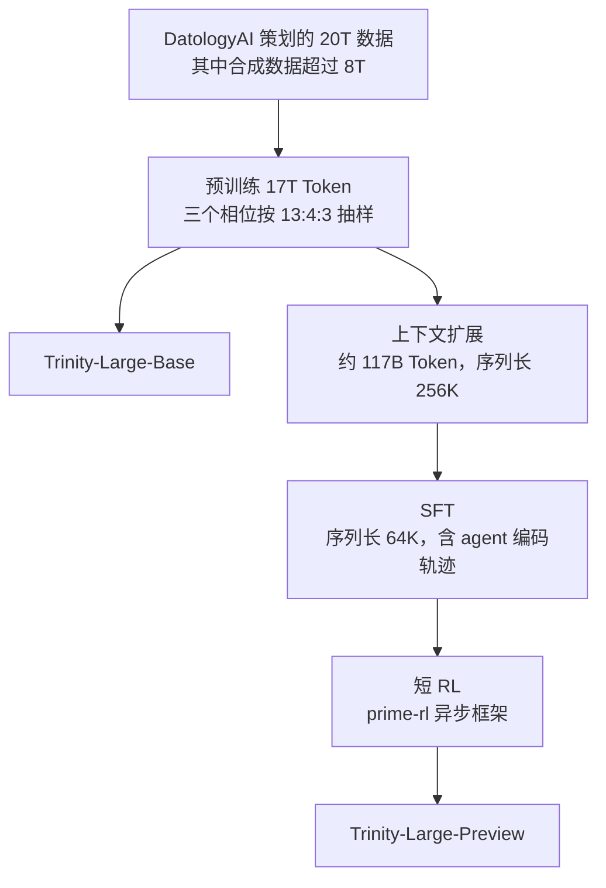
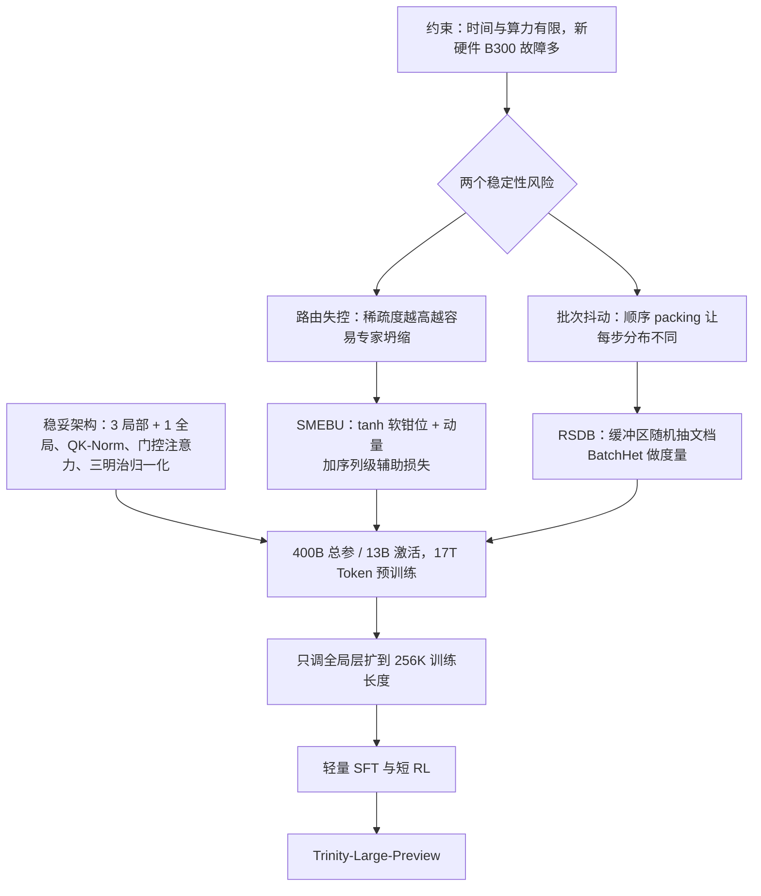

# Arcee Trinity Large：算力和时间都不够时，怎样让一次 400B 训练跑完

<!-- release-date: 2026-01-27 -->

> 本文依据本地 `papers/Arcee/Trinity-Large.pdf`，即 **Arcee Trinity Large Technical Report**，arXiv:2602.17004v1、2026-02-19 提交，共 29 页（正文到 p. 17，p. 18 是贡献者名单，p. 19–29 是参考文献）。页码均指 PDF 自身的页码。文中会区分三件事：**报告明确写了什么**、**我们怎么解释它**、**哪些是外部资料或本文推算**。

## 阅读前先认识几个词

- **Token（词元）**：模型读写文本的最小单位。一个英文单词、一个汉字或一个标点，都可能被切成一个或多个 Token。
- **MoE（Mixture-of-Experts，混合专家）**：把前馈网络拆成很多个「专家」，每个 Token 只交给其中几个。总参数可以很大，单个 Token 的计算量却很小。
- **路由器（router）与负载均衡**：路由器决定每个 Token 去哪几个专家。如果它长期偏心，少数专家拿走大部分 Token，其余专家几乎训不到，这叫 **专家坍缩（expert collapse）**。防止它的手段统称负载均衡。
- **滑动窗口注意力（Sliding Window Attention，SWA）**：每个位置只看最近固定长度的一段（Trinity Large 是 4096 个 Token），省算力和显存，但看不远。
- **Muon**：一种优化器。它在更新二维权重矩阵之前，先把带动量的更新方向做近似正交化，让各个方向的步长更均匀。

这篇报告自己起了三个名字：**SMEBU**（稳住路由的偏置更新法）、**RSDB**（稳住批次构成的数据缓冲区）、**BatchHet**（衡量一步之内批次有多不均的指标）。到对应章节再展开。

## 一句话先说清

Trinity Large 是一个 400B 总参数、每 Token 激活 13B 的稀疏 MoE（PDF p. 1）。同一份报告还覆盖了两个小兄弟：Trinity Nano（6B / 1B 激活）和 Trinity Mini（26B / 3B 激活）（PDF p. 1）。

大部分基模报告在讲「我们发明了什么」，这一篇主要在讲另一件事：

> **时间和算力都很紧的时候，怎样让一次 400B 规模的训练跑完，而且不崩。**

报告在引言里把约束写在明面上：训练稳定性是架构设计的关键考量，「因为项目的时间与算力有限」（PDF p. 2）。后训练一章也承认，大部分集群时间给了预训练，所以发布的 Trinity-Large-Preview「最好看作一次初步发布，而不是完整后训练过的模型」（PDF p. 14）。

于是全篇的取舍都朝一个方向倒：

1. **架构几乎全用别人验证过的组件**：局部/全局交错注意力、QK-Norm、门控注意力、三明治归一化、sigmoid 路由；
2. **两处原创都是稳定器**：SMEBU 稳住专家偏置，RSDB 稳住每一步的数据构成；
3. **一份诚实的失败复盘**：前几次训练专家坍缩，最后一口气上了六个修复，其中一个因为 bug 根本没生效，也没时间做消融（PDF p. 15–16）。

如果只记一句话：

> **稀疏度越高，路由越容易失控；batch 越依赖每一步的数据，批次构成的抖动就越伤。Trinity Large 的新东西都花在这两处的「稳」上，而不是「新」上。**

## 先看全景：60 层长什么样

三个模型共用同一套架构，只是尺寸不同。完整配置在 Table 2（PDF p. 12）：

| 配置 | Trinity Nano | Trinity Mini | Trinity Large |
|---|---:|---:|---:|
| 总参数 / 每 Token 激活（PDF p. 1） | 6B / 1B | 26B / 3B | 400B / 13B |
| 预训练 Token 数（PDF p. 1） | 10T | 10T | 17T |
| Transformer 层数 | 56 | 32 | 60 |
| 开头的稠密层数 | 2 | 2 | 6 |
| 模型维度 $d_{\text{model}}$ | 1024 | 2048 | 3072 |
| 稠密 FFN 中间维度 | 3072 | 6144 | 12288 |
| 查询头 $h_q$ / KV 头 $h_{kv}$ | 8 / 2 | 32 / 4 | 48 / 8 |
| 每头维度 $d_h$ | 128 | 128 | 128 |
| 局部窗口 | 2048 | 2048 | 4096 |
| 预训练序列长度 | 4096 | 4096 | 8192 |
| 共享专家 / 路由专家 | 1 / 128 | 1 / 128 | 1 / 256 |
| 每 Token 激活的路由专家 | 8 | 8 | 4 |
| 路由缩放（route scale） | 2.826 | 2.826 | 2.448 |
| 专家大小（expert size） | 256 | 1024 | 3072 |
| 初始化标准差 | 0.016 | 0.011 | 0.009 |

Nano 与 Mini 各在 512 张 H200 上训练，Trinity Large 在 2048 张 B300 上训练，集群由 Prime Intellect 管理（PDF p. 11）。报告说 Nano 与 Mini 本身就是 **扩展阶梯**：先在小规模上验证数据流水线、架构、训练配方和基建，再上 Trinity Large（PDF p. 2）。

整条流水线按报告第 3、4 节的顺序是（PDF p. 9–14）：

这张图只表示阶段顺序。报告没有给出任何阶段的时长、算力或成本。

## 第一层矛盾：只有一次机会时，架构上不赌新东西

### 为什么「稳」排在「新」前面

训练一个 400B 模型，崩一次就是几天到几周的集群时间。Trinity Large 还多一层风险：它跑在当时全新的 B300 上，报告说这是这批硬件上最早的大规模训练之一，实际遇到了间歇性 GPU 故障和反复出现的 XID 错误，靠更新固件逐步缓解（PDF p. 11）。硬件本身已经在制造随机故障，架构上再叠加不确定性，项目就可能做不完。

所以报告对每个组件的描述几乎都带着同一句理由：「为了训练稳定」或「已被前人验证」。下面逐个看。

### 注意力：3 层局部 + 1 层全局，全局层不带位置编码

**旧问题。** 全注意力的计算量随序列长度平方增长，KV 缓存随长度线性增长。想做长上下文，必须在某处削减。

**新设计。** 三个模型都用 **3:1 的局部/全局交错**：三层带 RoPE 的滑动窗口注意力，接一层完整注意力，重复到顶（PDF p. 5）。关键差别在位置编码：

- **局部层用 RoPE**（Rotary Positional Embedding，旋转位置编码）；
- **全局层不用任何位置编码**，即 NoPE（No Positional Embedding）。

这个组合来自 Yang et al. 2025（arXiv:2501.18795，Rope to Nope and Back Again），报告明说是跟随它的结果，只是最终版多加了 QK-Norm（PDF p. 5）。式 6–8 写得很直白：局部层的 Q、K 过 RoPE，可见位置截成最近 $w$ 个；全局层的 Q、K 原样不动，可见位置是全部历史（PDF p. 5）。

**我们如何理解这一分工。** RoPE 靠旋转角度编码相对距离。局部层永远只看最近 4096 个 Token，距离范围固定，RoPE 在这里很安全；全局层要看很远，干脆不给它位置信号，让它只凭内容匹配。位置由局部层负责，长距离检索由全局层负责。这段是本文的解释，报告只说选它「主要为了长上下文效果，以及长序列下的大幅效率收益」（PDF p. 5）。

**收益的证据。** 报告说这套交错方案加上门控注意力，让模型在长序列训练时「用相对更少的步数恢复性能」，并「让 Trinity Large 出现了长度外推」（PDF p. 5）。上下文扩展一节给出了数字：在 256K 上训练，512K 上 MK-NIAH 仍有 0.976（PDF p. 13），后文细讲。要注意，报告没有做「去掉 NoPE」或「去掉门控」的消融，外推能力归功于哪个组件没有被分开。

**代价。** 局部窗口固定为预训练全局上下文的一半（Large 是 4096 对 8192，PDF p. 12–13），所以跨越 4096 的细粒度依赖只能走那四分之一的全局层。报告没有量化这一点损失了什么。

### GQA 与 QK-Norm：一个省显存，一个是 Muon 的配套

**GQA**（Grouped-Query Attention，分组查询注意力）让多个查询头共用一组 KV。Trinity Large 是 48 个查询头对 8 个 KV 头（PDF p. 12），KV 缓存是同头数 MHA 的六分之一。报告说 GQA「大致追平 MHA 的效果、同时大幅减小 KV 缓存」（PDF p. 5），没有做改动。

**QK-Norm** 更值得说。它在算注意力分数前，对查询和键各做一次 RMSNorm（PDF p. 5，式 4–5）：

$$
q_{t,i} = \operatorname{RMSNorm}\left(W_i^Q x_t\right),
\qquad
k_{t,j} = \operatorname{RMSNorm}\left(W_j^K x_t\right)
$$

报告给的理由是一条因果链：已有工作发现，注意力 logit 的最大值会在训练中持续增长，**用 Muon 时这个问题比用 AdamW 更严重**（PDF p. 5，引 Liu et al. 2025b 与 Kimi Team 2025a）；GLM-4.5 报告又说 QK-Norm 能在整次训练中稳住最大 logit 的范围（PDF p. 5）。logit 越大，softmax 越接近 one-hot，梯度和数值都更容易出问题。

这里值得带走的是：**换优化器不是孤立决定**，它会改变模型内部数值的分布，连带要求归一化跟着改。

### 门控注意力：让一个头可以「看了也不用」

**旧问题。** softmax 强制每个位置的注意力权重加起来等于 1。即使当前 Token 谁都不想看，也得把权重倒到某处，通常是第一个 Token，这就是 **attention sink（注意力汇聚）**，常伴随异常大的激活。

**新设计。** 在注意力输出送进输出投影前，逐元素乘一个由输入算出的 sigmoid 门（PDF p. 6，式 11–14）：

$$
g_t = \sigma\left(W^G x_t\right),
\qquad
\tilde o_{t,i} = o^{\text{sdpa}}_{t,i} \odot g_{t,i}
$$

$\sigma$ 是 sigmoid，$\odot$ 是逐元素相乘；$g_t$ 被均分成 $h_q$ 段，每个头拿自己那段。门的取值在 0 到 1 之间，所以模型可以把一个头的输出整体压到接近 0：softmax 内部仍然要分满 1 的权重，但「必须看点什么」和「必须把看到的用上」被拆开了。

**证据层次。** 原始工作（Qiu et al. 2025，arXiv:2505.06708）报告了减少注意力汇聚、减少过大激活、提升评测和长序列泛化（PDF p. 6 转述）。Trinity 自己补的动机是「门控**似乎**能稳定训练、减少 loss 尖峰」（原文 appears to，PDF p. 6），这是作者观察，没有消融。

### MoE：Trinity Large 反而往「更粗」走

这是全篇最容易读反的一处。

报告先说 MoE 层「遵循 DeepSeekMoE 设计，采用细粒度路由专家加一个常驻共享专家」，紧接着一句就是：「对 Trinity Large，为了更好的吞吐，我们选择更粗粒度的专家」（PDF p. 6）。配置一节说得更直接：只激活 4 个路由专家、把每个专家做大、**降低粒度**，原因是吞吐要求；同时大幅提高稀疏度，在保持低激活参数的前提下尽量扩大容量（PDF p. 12）。

把 Table 2 的数字摆在一起就清楚了：

| | Nano | Mini | Large |
|---|---:|---:|---:|
| 专家大小 / 模型维度 | 256 / 1024 = 0.25 | 1024 / 2048 = 0.5 | 3072 / 3072 = 1.0 |
| 每 Token 激活路由专家 | 8 | 8 | 4 |
| 路由专家总数 | 128 | 128 | 256 |
| 激活的路由专家占比 | 1/16 | 1/16 | 1/64 |

（除法为本文所做。）**Nano 与 Mini 是细粒度；Large 专家更大、激活更少、专家池更大。** 把 Trinity Large 概括成「细粒度 MoE」是不准确的，它的关键词是「极高稀疏度加粗粒度专家」。

为什么粗粒度对吞吐好，报告只说「为了吞吐」。我们的理解是：一个 Token 跑 4 个大矩阵乘，比跑 16 个小矩阵乘更容易喂饱 GPU，分发与合并的次数也更少。这是常识性的解释，不是报告给的分析。

MoE 的前向本身很常规（PDF p. 6，式 15）：

$$
h'_t = u_t + \sum_{i=1}^{N_s}\mathrm{FFN}^{(s)}_i(u_t) + \sum_{i=1}^{N_r} g_{i,t}\,\mathrm{FFN}^{(r)}_i(u_t)
$$

第一项是残差，第二项是每个 Token 都走的共享专家，第三项是被选中的路由专家按门控权重加权。专家用 SwiGLU 激活（PDF p. 6）。

路由有两个细节（PDF p. 6，式 16–18）：

- **用 sigmoid 而不是 softmax 打分**：$s_{i,t} = \sigma(u_t^\top e_i)$，每个专家独立打分，报告的理由是「路由 logit 更稳定」；选出 Top-K 后再把被选中的分数归一化成门控权重；
- **选专家时用「分数 + 偏置」，算门控权重时只用「分数」**：偏置由负载均衡单独维护，只该影响「派给谁」，不该影响「派过去乘多大权重」。这个解耦来自无辅助损失负载均衡（Wang et al. 2024a，arXiv:2408.15664）。

Table 2 里的「路由缩放」（2.448）和「专家大小」两栏，报告正文都没有定义。专家大小从数值看应是路由专家 FFN 的中间维度；路由缩放在式 15–18 里没有对应项，公开权重的 config 里有同名字段 `route_scale`（外部补充），从名字推测是乘在归一化门控上的常数，报告没说，本文也没有去源码核实。

## 核心设计一：SMEBU，让专家偏置能真正停下来

这是报告在架构上唯一的新东西，也只用在 Trinity Large 上。

### 旧问题：sign 更新永远停不下来

Nano 与 Mini 用的是标准的无辅助损失负载均衡（PDF p. 6–7，式 19–22）。系统维护一个偏置向量 $b$，每一步统计每个专家收到多少 Token，比平均少就把偏置调高一点，比平均多就调低一点：

$$
\bar n = \frac{1}{N_r}\sum_{i=1}^{N_r} n_i,
\qquad
\Delta b_i = \gamma \cdot \operatorname{sign}\left(\bar n - n_i\right)
$$

加上更新后，Trinity 还把所有偏置减去均值再居中（式 22），防止整体漂移。

报告的推理是（PDF p. 7）：假设理想偏置是一个固定值，标准做法 **永远无法精确收敛到它**，因为 sign 之下每步更新的幅度恒定（原文此处写作 $\pm\lambda$，式 20 里的符号是 $\gamma$）。专家总数越多，每层偏置步长的范数越大。把它看成一个优化过程，接近局部最优时更新偏向振荡，永远安定不下来。作者据此 **假设**（原文 We hypothesize）这是 MoE 训练不稳定的一个原因。

上图左半边就是这件事的形状：sign 是一条阶跃，离目标再近，步子也是一整格。

### 新设计：tanh 软钳位，再加动量

SMEBU（Soft-clamped Momentum Expert Bias Updates，软钳位动量专家偏置更新）分四步（PDF p. 7，式 23–28）。

先把偏差归一化，让更新幅度与序列长度、batch 大小无关，再用 tanh 软钳位：

$$
v_i = \frac{\bar n - n_i}{\bar n},
\qquad
\tilde v_i = \tanh\left(\kappa\, v_i\right)
$$

然后乘学习率、减均值居中，最后过一个动量缓冲再写回：

$$
\Delta b_i = \lambda\,\tilde v_i - \frac{1}{N_r}\sum_{j=1}^{N_r}\lambda\,\tilde v_j,
\qquad
m_i \leftarrow \beta m_i + (1-\beta)\Delta b_i,
\qquad
b_i \leftarrow b_i + m_i
$$

（报告把居中写成单独的式 26，这里合成一行。）Trinity Large 用的是 $\lambda = 5\times 10^{-4}$、$\beta = 0.5$、$\kappa = 2$（PDF p. 7）。

两个部件各解决一件事：

- **为什么要有界。** 报告试过更朴素的线性、不钳位更新：MaxVio 在训练早期下降得很快，但训练后期出现不稳定（原文 preliminary tests，规模没说，PDF p. 7）。所以「能收敛到 0」和「幅度有上界」是两个独立的需求，tanh 同时满足：偏差大时接近 $\pm 1$，行为和 sign 一样；偏差小时接近 0，更新自然变小；
- **为什么要动量。** 如果不稳定真来自最优点附近的振荡，而那里的噪声在时间上大致不相关，时间平均就能把它压掉。报告明确类比成动量 SGD 降低梯度噪声的方差（PDF p. 7）。

这里的 MaxVio（maximum violation，最大违背度）是衡量负载失衡的指标（PDF p. 16，式 42）：

$$
\mathrm{MaxVio} = \frac{\max_i \mathrm{Load}_i - \overline{\mathrm{Load}}}{\overline{\mathrm{Load}}}
$$

也就是「最忙的专家比平均忙多少」，越接近 0 越均衡。

### 配套：序列级辅助损失

无辅助损失均衡是跨 batch 统计的，一条序列内部仍可能扎堆。所以报告另挂了一个 **序列级** 负载均衡损失，形式沿用 DeepSeek-V3（PDF p. 8，式 29–32）：

$$
\mathcal L_{\mathrm{Bal}} = \alpha\sum_{i=1}^{N_r} f_i P_i
$$

$f_i$ 是这条序列里路由到专家 $i$ 的 Token 比例（乘 $N_r / K_r$ 归一化），$P_i$ 是归一化路由分数在这条序列上的均值。第 2 章只说 $\alpha$ 是「一个很小的系数」，具体值 $1\times 10^{-4}$ 要到讨论章才出现，而且那里说它是训练失稳后才加上的修复之一（PDF p. 16）。

### 证据强度：必须说清楚

报告没有为 SMEBU 单独做消融。它是训练失稳后 **一次性加上的六个修复之一**，此前只在很小规模上简单测过（PDF p. 15）；报告自己承认「这些修复是为了解封训练一起引入的，我们没有时间做受控消融来把稳定归因到任何单一改动」（PDF p. 16）。

能确定的是：加上这一整套之后，MaxVio 不再发散，专家利用率全程均衡，loss 平滑收敛（PDF p. 16）。不能确定的是 SMEBU 在其中贡献了多少。

**可迁移启发。** 抛开归因问题，SMEBU 的思路本身是干净的：一个在线控制器长期停不下来，先看它的更新是不是离散的定幅步长。把 sign 换成 tanh 只是一行代码，就同时拿到「有界」和「可收敛」。限流阈值、采样温度这类 PID 式的调节器都有同样的毛病。

## 归一化与初始化：两处小但讲了原因的选择

### 深度缩放的三明治归一化

每层是这样（PDF p. 8，式 33）：

$$
y_\ell = x_\ell + \operatorname{RMSNorm}^{(2)}_\ell\Bigl(M_\ell\bigl(\operatorname{RMSNorm}^{(1)}_\ell(x_\ell)\bigr)\Bigr)
$$

$M_\ell$ 是子层（注意力、FFN 或 MoE）。子层的输入和输出都做归一化，这叫 **三明治归一化（sandwich norm）**；第二个 RMSNorm 的增益初始化为 $1/\sqrt{L}$，第一个初始化为 1（PDF p. 8，式 34–35）。语言模型头之前还有一次 RMSNorm（式 36）。

开头那张架构图已经画出这条路径。报告没有解释为什么这样做；我们的理解是：只做前置归一化时，子层输出可以任意大地加到残差流上，深层网络里会一路累积；后置 RMSNorm 相当于给每条支路装了限流阀，而 $1/\sqrt{L}$ 让 $L$ 条支路的方差之和在初始化时回到 1 附近。Trinity Large 有 60 层，$1/\sqrt{60} \approx 0.129$（本文算术）。

### 初始化：宽度缩放，再把嵌入乘回 $\sqrt d$

所有可训练参数取自截断正态分布（PDF p. 8，式 37–38）：

$$
\theta \sim \operatorname{TruncNormal}\left(0, \sigma^2; [-3\sigma, 3\sigma]\right),
\qquad
\sigma = \frac{0.5}{\sqrt d}
$$

报告说这大致对应 Takase et al.（Spike No More，arXiv:2312.16903）建议的 $\sigma = \sqrt{2/(5d)}$，还顺手对了一下：$0.5/\sqrt{7168} \approx 0.006$，正好是 DeepSeek-V3 的初始化尺度（PDF p. 8）。代入 Trinity Large 的 $d = 3072$，得 0.009，与 Table 2 一致（本文算术）。

前向时嵌入层的输出再乘 $\sqrt d$（PDF p. 8，式 39）。报告举了两条外部佐证：Grok-1 与 Grok-2 的 Hugging Face checkpoint 都把 `embedding_multiplier_scale` 设成 $\sqrt d$；前两代 Gemma 在 transformers 建模代码里把这个乘子叫 normalizer（PDF p. 8）。意思是：初始化让嵌入向量随 $1/\sqrt d$ 变小，乘回 $\sqrt d$ 把它的尺度拉回 1 附近，和后面各层期望的输入范围对上。

## 分词器：一段短而值得读的工程记录

**规格。** 自训练的 200,000 词表 BPE，训练语料约 48GB（约 10B Token），主要抽自 Nano 与 Mini 的预训练语料，补上 C4 的非英语部分和指令、推理轨迹、代码数据（PDF p. 2）。

**一个自曝。** 训分词器时 Trinity Large 那份更大的多语语料还没定稿，所以非英语语言在词表里的占比低于它们在最终预训练数据里的占比（PDF p. 3）。

**数字按位对齐切分。** 连续数字先与周围文本分开，再从右往左三位一组，开头留 1–2 位，例如 `1234567 → 1|234|567`，让每个三位 Token 稳定代表一个位值组（PDF p. 3）。依据是 Singh & Strouse 2024（arXiv:2402.14903）的发现：位对齐切分明显改善算术。

**正则回溯的坑。** 他们一开始用 SuperBPE 论文里的零宽前瞻正则 `(?=(\d{3})+(?!\d))`，早期训练时发现遇到超长连续数字串会 **灾难性回溯**，单个样本的分词时间飙到几分钟（PDF p. 3）。修法是换成三段流水线：先把数字串截到 510 个字符，再剥掉开头 1–2 位，最后按三位切完。两种做法在 510 位以内的输入上切分完全一致，所以是事后改预分词配置，**没有重训分词器**（PDF p. 3–4）。

这条经验很实用：数据预处理里的正则也是性能面。一个只在长尾输入上爆炸的模式，可能几百步都遇不到，遇到一次就能把整个 dataloader 卡住。

**另外三条预分词规则**（PDF p. 4）：把 DeepSeek V3 对中日韩文字的隔离扩展到泰文、老挝文、高棉文、缅甸文和韩文字母；主体文本正则直接沿用 DeepSeek V3；最后一层字节级回退，保证任何字节序列都能编码。

**词表大小。** BPE 的合并是确定且贪心的，所以按合并顺序截断大词表，等价于直接训练小词表。他们只训了完整的 200k，再截出 131k 等变体做对比，报告说 fertility（每个词平均被切成几个 Token）和小规模 loss 曲线都显示大词表更好，中日韩和法语改善最明显（PDF p. 4）。报告没有给出这组对比的数字。

**SuperBPE 的空结果。** SuperBPE 允许跨空格的多词 Token，压缩率明显更好：英文少约 29% 的 Token，推理轨迹少约 27%。但在他们的实验规模上 **看不到对应的下游提升**，于是回到标准 BPE（PDF p. 4）。这是「在他们的规模上没看到收益」，不是「SuperBPE 无效」。

Table 1 的压缩率（PDF p. 4；B/T 是字节每 Token，C/T 是字符每 Token，越大越好）：

| 数据集 | Trinity (200k) | DeepSeek R1 (128k) | Qwen 3 (152k) | Llama 3 (128k) | GPT-OSS (200k) |
|---|---:|---:|---:|---:|---:|
| C4 (en) B/T | **4.84** | 4.70 | 4.64 | 4.73 | 4.79 |
| C4 (zh) C/T | 1.38 | **1.54** | 1.45 | 1.29 | 1.47 |
| C4 (ja) C/T | 1.39 | **1.60** | 1.59 | **1.60** | 1.54 |
| C4 (ko) C/T | 1.26 | 1.47 | 1.47 | 1.68 | **1.72** |
| C4 (fr) B/T | **3.98** | 3.53 | 3.34 | 3.49 | 3.97 |
| Reasoning B/T | **3.67** | 3.61 | 3.51 | 3.59 | 3.61 |

英文、法文和推理轨迹 Trinity 最好。报告说中日韩「落后 DeepSeek V3 与 Qwen 3」，并归因于上面那个语料没定稿的时间差（PDF p. 4）。表里其实更细：中文还略胜 Llama 3，韩文则是五个分词器里最差的。

## 数据：20T 的配方与超过 8T 的合成数据

**全部预训练数据由 DatologyAI 策划**（PDF p. 9）。三方分工也就清楚了：Arcee AI 负责模型与训练，Prime Intellect 管理集群（PDF p. 11）并提供 RL 框架 prime-rl（PDF p. 14），DatologyAI 负责数据。

两份数据（PDF p. 9）：

| | Nano 与 Mini | Trinity Large |
|---|---|---|
| 混合数据总量 | 10T | 20T |
| 三相位切分 | 7T / 1.8T / 1.2T | 13T / 4T / 3T |
| 实际训练 | 全部 10T | 按 13:4:3 从中抽 17T |
| 来源 | 复用 AFM-4.5B 数据集，大幅增加数学与代码 | 编程、STEM、推理与多语数据，多语覆盖 14 种语言 |

14 种语言是：阿拉伯语、汉语、日语、西班牙语、德语、法语、意大利语、葡萄牙语、印尼语、俄语、越南语、印地语、韩语和孟加拉语（PDF p. 9）。

**合成数据超过 8T Token**（PDF p. 9）：

- 约 6.5T 合成网页数据，基于 BeyondWeb（arXiv:2508.10975）的改写方法：选高质量种子文档，再用多种策略改写，包括格式转换（把网页改成问答对）、风格调整（加强教学语气）、内容重组（提高信息密度与可读性）；
- 约 1T 合成多语数据，用类似做法生成；
- 约 800B 高质量合成代码数据。

生成基建是 Kubernetes 上的 Ray 与 vLLM（PDF p. 9）。报告称这是「已公开记录中规模最大的预训练合成数据生成工作之一」，这句是宣称，本文无法核验。

三个相位就是所谓 **midtraining**：配比逐相位从通用网页往代码、数学、科学偏移，而且在每一类内部也换成更高质量、更相关的数据（PDF p. 9）。

报告 **没有公开**：各相位的领域配比、过滤器、去重阈值、质量模型、污染检查，以及真实数据与合成数据的确切比例。「超过 8T 合成」告诉我们规模，不能反推质量。

## 核心设计二：RSDB，让每一步的数据长得像整体

这是全篇最有迁移价值的一节：很多训练系统都会踩这个坑，但很少有人写出来。

### 旧问题：顺序 packing 让每一步优化不同的目标

预训练要把长短不一的文档拼进固定长度的序列，这叫 packing。Trinity 在线分词，把文档流里剩下的 Token 留到下一个样本继续用（PDF p. 9）。TorchTitan 这类框架的标准做法是 **顺序 packing**：一篇比序列长好几倍的文档，会接着占用后面的 batch 项（PDF p. 9）。

报告指出的问题是：文档长度大致服从对数正态分布，少数极长的文档会在 minibatch 层面造成领域偏斜（PDF p. 9）。把每个不均衡的 minibatch 看成它自己那个数据分布的理想样本，**等于每一步都在优化一个不同的目标分布**（PDF p. 10）。后果有两层：网络每一步都要「忘掉」上一步带来的领域偏差，这是纯开销；长尾的长度分布又引入长尾噪声，交叉熵这种非对称损失会把小偏差放大成大的 loss 波动（PDF p. 10）。

关键一句：**这是顺序 packing 的后果，不能靠打乱文档顺序解决**（PDF p. 10）。问题不在文档来的顺序，而在「一篇长文档跨越多条序列」这个机制本身。

作者还给了两个特别受影响的场景假设：batch 受限时，以及模型每步的数据效率更高时（PDF p. 10）。后者引 Kaplan et al. 2020：模型越大，单步数据效率越高，因而对每步数据分布的抖动越敏感。作者据此 **假设** 这是模型变大后训练不稳定的一个成因（PDF p. 10）。

### 新设计：随机顺序文档缓冲区

RSDB（Random Sequential Document Buffer）的算法很短（PDF p. 10）：

1. 每篇分完词的文档整体放进缓冲区，带一个读头，初始指向第 0 位；一直插到缓冲区满；
2. 要填一条序列时，随机挑一篇文档，从它的读头位置往下读 Token，并更新读头；
3. 序列没满就再随机挑一篇继续读，直到填满；
4. 缓冲区按需补充，保持足够多的活跃文档。

实现上有个性能技巧：内部缓冲区开成用户设定值的 **两倍**，一掉到设定值就补满，旧文档成批清掉、新文档成批载入，报告说这显著改善了 dataloader 性能（PDF p. 10）。Trinity Large 第三相位用的是每 GPU 8192 篇（用户设定 4096）、每 GPU 4 个 worker，缓冲区在 worker 间均分，总规模与 worker 数无关（PDF p. 10）。

报告列的三个好处（PDF p. 10）：不预先切块，碎片更少；跨文档真正随机选择，更接近独立同分布采样；读写高效，不拖慢训练。而且 **整个过程不丢弃任何 Token**。

### BatchHet：先造一把便宜的尺

要证明 RSDB 有用，先得能量化「批次有多不均」。报告定义了 **BatchHet（Batch Heterogeneity，批次异质度）**（PDF p. 10，式 40）：

$$
\mathrm{BatchHet}_t = \max_i L^{(t)}_i - \frac{1}{M}\sum_{i=1}^{M} L^{(t)}_i
$$

$L^{(t)}_i$ 是第 $t$ 步第 $i$ 个 microbatch 的 loss，$M$ 是 microbatch 数。翻译过来就是：**这一步里最难的那个 microbatch 比平均难多少**。它不需要领域标签，也不需要额外前向，用训练本来就要算的 loss 就能得到。报告说在小规模内部实验里，它和梯度范数的不稳定强相关（PDF p. 10）。

### 证据分两层，强度不同

**第一层：小规模内部对照实验**（PDF p. 10），有顺序 packing 基线：

| 指标 | 顺序 packing 基线 | 开启 RSDB |
|---|---|---|
| BatchHet | 基准 | 降低 46% |
| 平均 loss | 基准 | 更低（报告只说 improved，没给数） |
| 梯度范数的峰度 | 187 | 14.6 |
| 基线要追平逐步 loss 方差所需的 batch | — | 约 2 倍 |
| 基线要追平 BatchHet 所需的 batch | — | 约 7 倍 |

峰度（kurtosis）衡量分布尾巴有多重，从 187 降到 14.6 意味着梯度范数的极端离群值大幅减少。报告还补了一句：即使在 loss 方差已经追平的那个 batch 上，基线的平均 loss 仍有明显更多的逐步离群值（PDF p. 10）。

这组数字的价值在于「要多大 batch 才能追平」的换算：说「BatchHet 降了 46%」很难有体感，说「基线要 7 倍 batch 才能追平」就把一个数据管线改动折算成了算力。报告没有说明这个小实验的模型规模与训练长度。

**第二层：真实的 Trinity Large 训练**（PDF p. 11）。收益足够明显，他们没等下一次训练，直接接进了正在跑的 Trinity Large。接入的时点两处写法略有出入：p. 9 说是「训练中途、刚要开始第三相位之前」，p. 11 说是「在第三相位期间」集成。观察到的是 BatchHet 降低 4.23 倍、逐步方差降低 2.4 倍。但报告立刻加了限定：第二、三相位的数据分布本来就不同，直接比较是困难的（PDF p. 11）。这一层是观察，不是受控实验。

### 训练曲线：相位切换与 RSDB 接入都在这张图上

原图是 PDF p. 1 的 Figure 1，无子采样、无平滑，此处裁掉了图注。三条竖线分别是 batch 提到 128M Token、切到第二相位、切到第三相位。

图上读不出的有三件事要补：

1. **相位切换处的阶跃不是模型突然变强。** 后面相位的数据更集中在代码、数学与高质量内容上，本身就更好预测，交叉熵自然更低。跨相位的 loss 数值不能直接比。第三相位一路下行，主要是学习率衰减发生在最后（衰减设置见下文超参一节）；
2. **第三相位的曲线带明显更窄**，这就是报告说的 2.4 倍逐步方差下降。但如上所说，数据也同时换了；
3. **切换点和正文的比例对不上。** 正文说 17T 按 13:4:3 从 20T 中抽样（PDF p. 9），按比例算应在约 11.05T 和 14.45T 切换（本文算术）；从图上读，两条相位线在约 10.1T 与约 14.1T，更接近 10T / 4T / 3T。差了将近 1T Token，报告没有给出足以判断的信息。

## 基建：新硬件的真实成本

**框架**：改造过的 TorchTitan；融合交叉熵与 z-loss 用 Liger Kernels；上下文扩展与 SFT 为了省显存用 Cut Cross-Entropy（PDF p. 11）。

**并行**（PDF p. 11）：

| | Nano 与 Mini | Trinity Large |
|---|---|---|
| 集群 | 512 张 H200 | 2048 张 B300 |
| 数据并行 | HSDP：多个模型副本，副本组内用 FSDP 分片 | 同左 |
| FSDP 组大小 | 128 | 128 |
| 专家并行（EP） | 无 | 节点内，组大小 8 |
| 上下文并行 | — | 上下文扩展阶段为 4 |

报告没有提到张量并行或流水线并行。

**分布式 Muon**。Muon 要对整块梯度矩阵做正交化，这和按元素切分的分片天然冲突。Trinity 改自 Dion 仓库（arXiv:2504.05295）的实现：**对专家梯度批量做正交化，而且不在正交化前把梯度张量展平**。副产品是：梯度不必跨专家并行组聚合，专家并行的实现被简化了（PDF p. 11）。保留张量的原有形状（每个专家一个矩阵、批量处理），并行边界就自然对齐到算法的数学单元上。

**新硬件**（PDF p. 11）：

- 测 PyTorch 2.10 nightly 时，早期版本对 B300 支持不全，后期版本又在 B200 和 B300 上出现性能回退，他们在 nightly 版本之间做了二分搜索才找到可用的包；后来升到 2.11 nightly，提速约 5%；
- 观察到间歇性 GPU 故障，包括反复出现的 XID 错误，靠固件更新逐步缓解；
- 系统侧用故障转移节点、dataloader 优化和高性能 NFS 缩短重启时间；心跳监控在 **三分钟内没有完成任何训练步** 就报警。

这些细节解释了整篇报告为什么如此在意稳定：硬件已经在制造随机故障。

## 训练超参：Muon 的学习率怎么定

**优化器分工**：三个模型的隐藏层都用 Muon，嵌入层与输出层用 AdamW（PDF p. 12）。

**学习率规则**。Moonlight（Liu et al. 2025b，arXiv:2502.16982）的做法是把 Muon 更新的 RMS 缩放到与 AdamW 对齐，以便复用 AdamW 的学习率。Trinity **明确不这么做**，改用 Jordan et al. 2024b 的规则（PDF p. 12，式 41）：

$$
\mathrm{lr}_{\text{adjusted}} = \mathrm{lr}\cdot\sqrt{\max\left(1, \frac{\mathrm{fan}_{\text{out}}}{\mathrm{fan}_{\text{in}}}\right)}
$$

$\mathrm{fan}_{\text{in}}$、$\mathrm{fan}_{\text{out}}$ 是权重矩阵的输入与输出维度。理由是经验观察：这个调整让 Muon 在加宽模型时能做到最优学习率迁移（PDF p. 12）。报告没有给出迁移实验的曲线。

**三个模型的配方**（PDF p. 12–13）：

| | Nano | Mini | Large |
|---|---|---|---|
| warmup | 线性 2000 步 | 线性 2000 步 | 线性 2000 步 |
| 峰值学习率（Muon / AdamW） | $1.0\times10^{-3}$ / $3.0\times10^{-4}$ | $1.0\times10^{-3}$ / $2.0\times10^{-4}$ | $8.0\times10^{-4}$ / $2.0\times10^{-4}$ |
| 全局 batch（序列条数） | 4096 → 8192（集群从 256 卡扩到 512 卡时） | 4096 → 8192（集群从 64 卡扩到 512 卡时） | 12288 → 16384（跨过 4.9T Token 后） |
| 衰减 | 线性衰减到 0 | 线性衰减到 0 | cosine 衰减到峰值的 1/10 |
| 上下文扩展的学习率 | 线性重新 warmup 到峰值 1/10，再线性衰减到 0 | 同 Nano | 从峰值 1/10 继续 cosine 到 1/20 |
| 上下文扩展训练 → 目标推理长度 | 256K → 128K | 128K → 128K | 256K → 512K（p. 13 原句，见后文的出入） |

Trinity Large 的两处设计值得说：

- **batch 在 4.9T 处提到 16384 条**，为了吞吐，大致跟随 MiniMax 的做法。$16384 \times 8192 = 134{,}217{,}728$，正是 Figure 1 上标的 128M Token（PDF p. 1、p. 13）；
- **衰减不到 0**，只到峰值的 1/10（Muon $8.0\times10^{-5}$、AdamW $2.0\times10^{-5}$），报告说这样可以直接进入上下文扩展而不必重新 warmup（PDF p. 13）。小模型走的是另一条路：先衰减到 0，扩展时再重新 warmup。把上一阶段的终点设计成下一阶段的合法起点，两段就接得上。

## 上下文扩展：只动全局层

**做法**（PDF p. 13）。局部层的窗口在预训练时就是全局上下文的一半。初期实验比较了两条路线：局部层（换不同的 RoPE 基频 $\theta$）与全局层一起调，对比只调全局层。**只调全局层的 loss 恢复快得多**，与 Yang et al. 2025 的结论一致，报告据此说局部层与全局层学到的是互补的角色。不扩大局部窗口还让推理更省，所以三个模型都这样扩展，报告说「扩展过程极其顺利」。

**快速代理指标**：受时间和算力所限，他们用 RULER 里的 MK-NIAH（Multi-Key Needle-in-a-Haystack，多键大海捞针）在目标长度上直接测，快速评估 checkpoint、决定下一轮改什么（PDF p. 13）。

结果（PDF p. 13）：

| 模型 | 扩展时的训练序列长度 | 评测长度 | MK-NIAH |
|---|---|---|---:|
| Trinity Nano | 128K | 128K | 0.38 |
| Trinity Nano | 256K | 128K | 0.548 |
| Trinity Nano | 迭代数据与超参后的最终版 | 128K | 0.864 |
| Trinity Mini | 128K（最终版） | 128K | 0.888 |
| Trinity Large | 256K | 256K | 0.994 |
| Trinity Large | 256K | 512K | 0.976 |
| Trinity Large | 256K | 1M | 0.42 |

读这张表要知道三件事：

1. **训练序列长于目标长度更好**。Nano 从 0.38 到 0.548 是直接对照，与 ProLong（Gao et al. 2025）和 NVIDIA 的结论一致（PDF p. 13）。Mini 因资源所限只在 128K 上训练；
2. **模型越大越好扩展**。同样在 128K 上训练，Mini 明显强于 Nano；Large 在从未训练过的 512K 上仍有 0.976，1M 上 0.42。报告据此说「后续版本有可能做到 1M 上下文」，这是展望；
3. **渐进式扩窗没有带来收益**。从最终预训练 checkpoint 出发，逐步扩大上下文并不比直接在最长长度上训练更好（PDF p. 13）。

**长上下文数据**：约 117B Token、3560 万篇文档（PDF p. 13），由四部分组成：

- 从三个预训练相位里按 **长度加权** 抽样：抽中概率随文档长度上升，从 1% 的下限一直到 128K 长文档的 90%。这样抽出的子集仍大致代表原分布，长序列比例却大幅提高；
- 参照 OLMo 3 的 Dolma 3 Longmino 配方，加入大量 OCR 得到的 PDF 数据，包括 olmOCR 数据集和 Hugging Face 的 FinePDF-edu，它们天然又长又干净；
- 重新生成 ProLong 数据集，**用完整序列长度而不是已发布的 512K / 64K 截断版**；其中的整仓库代码拼接对长上下文泛化和跨文件代码理解特别有用；
- 来自原 AFM 上下文扩展配方的指令风格数据（FLAN、数学、代码），加上 AutoMathText 以及 ProLong 里精选的 arXiv 与教科书。

「按长度加权抽样而不是只挑长文档」值得借：既拉长了序列分布，又没把领域分布改掉。

## 后训练：报告自己说这是「预览」

这一章只有一页，开头就自我限定（PDF p. 14）：后训练在同一集群上做，但大部分集群时间给了预训练，所以后训练「相对轻」，Trinity-Large-Preview 应看作初步发布，下一版会做更充分的后训练。

**SFT 数据**：公开指令数据加自制数据；自制部分是人写的提示加更强的教师模型生成的合成指令，再按质量、格式与长度过滤。重头在 **agentic 编码监督**：编码子集里很大一部分来自 agent 框架里收集的轨迹。他们用 OpenCode 当 harness 跑多步编码任务，完整记录交互轨迹（编辑、工具调用、测试结果），让模型学会「改—跑—测」的循环，而不只是最终答案（PDF p. 14）。只喂最终补丁，模型学到的是正确答案长什么样；喂完整轨迹，模型才有机会学到测试失败之后该怎么办。

**SFT 训练**（PDF p. 14）：改造版 TorchTitan，并行方式与上下文扩展相似但不需要上下文并行；Cut Cross-Entropy 省显存；样本离线预分词，训练时贪心 packing；**序列长度 64K**，超长样本直接截断，packing 后补齐到整长；学习率线性 warmup 到预训练峰值的 1/10，再线性衰减到 0。

**RL**（PDF p. 14）：在同一个 2048 张 B300 的集群上跑一段短 RL，框架是 prime-rl。用它的异步架构：vLLM 驱动的 worker 生成 rollout，独立的分布式 trainer 用 FSDP2 更新；环境遵循 verifiers 的 API。奖励上 **有客观检查的任务优先用可验证奖励**（例如严格的答案格式校验），没有干净标准答案的回退到学习出来的奖励模型。

这一章没写的更多：SFT 与 RL 各用了多少数据、多少步，用的是什么 RL 算法，奖励模型怎么训，有没有偏好对齐或安全对齐。读者能知道流水线的形状，无法据此复现。

## 评测：能证明什么，不能证明什么

### Base 模型

Table 3 给出 Trinity Large Base 的分数（PDF p. 15），Figure 3 把它与另两个开放权重基座并排（PDF p. 14）。原图是带数字标签的柱状图，这里合成一张表（Figure 3 里 Trinity 的柱标与 Table 3 一致）：

| 评测 | Llama 4 Maverick (Base) | GLM-4.5 (Base) | Trinity Large (Base) |
|---|---:|---:|---:|
| MBPP+ | 88.36 | 87.30 | **88.62** |
| Minerva MATH500 | 59.20 | 50.00 | **65.20** |
| HellaSwag (5-shot) | 85.63 | 89.74 | **90.11** |
| WinoGrande (5-shot) | 77.35 | **84.37** | 80.82 |
| MMLU (5-shot) | 84.92 | **86.38** | 82.58 |
| MMLU-Pro (5-shot) | 63.46 | 64.38 | **66.02** |
| TriviaQA (5-shot) | 79.78 | 83.28 | **83.30** |
| ARC Challenge (0-shot) | 63.40 | 63.48 | **65.44** |
| BBH (few-shot) | 64.60 | **68.16** | 65.70 |
| GPQA Diamond (5-shot) | **47.47** | 44.95 | 43.94 |

Figure 3 把十项分成四组：编码与数学（前两项）、常识（HellaSwag、WinoGrande）、知识（MMLU、MMLU-Pro、TriviaQA、ARC）、推理（BBH、GPQA）（PDF p. 14）。

读表：十项里 Trinity 最高的有六项，其中 Minerva MATH500 领先最多；MMLU、WinoGrande、BBH、GPQA Diamond 四项落后。数学与代码偏强，这与后期相位上调代码、数学、STEM 的配方方向一致（这是本文的对照，报告没有做归因）。

报告的原话是：与 GLM-4.5 Base 分数有竞争力，「尽管稀疏度高 4 倍、激活参数约低 2.5 倍」（PDF p. 15）。这句要拆开看：

- **激活参数约 2.5 倍** 对得上：GLM-4.5 官方规格是 355B 总参、32B 激活（外部补充），$32/13 \approx 2.46$；
- **「稀疏度高 4 倍」报告没有定义口径**。按两种自然定义算都不是 4 倍：总参除以激活是 $400/13 \approx 30.8$ 对 $355/32 \approx 11.1$，约 2.8 倍；激活的路由专家占比是 $4/256$ 对 $8/160$，约 3.2 倍（GLM-4.5 的 160 个路由专家、每 Token 选 8 个来自其官方 config，外部补充；算术为本文所做）。

这张表能证明的是：13B 激活达到了与 32B 激活级别模型可比的基座质量。不能证明的是任何单个设计的贡献：架构、数据、优化器、Token 数同时不同，报告也没有声称做了归因。

### Instruct 模型

Table 4 只有五项，没有任何对照模型（PDF p. 15）：

| 评测 | Trinity Large Preview |
|---|---:|
| MMLU | 87.21 |
| MMLU-Pro | 75.25 |
| GPQA Diamond | 63.32 |
| SimpleQA | 23.92 |
| AIME25 | 24.36 |

AIME25 只有 24.36，与「后训练很轻的预览版」这个自我定位一致。Base 的 GPQA Diamond 是 5-shot 的 43.94，Preview 是 63.32，但两边评测设置不同，报告没有把它们当成对照。

这一节有两个显眼的缺口：Table 4 是孤立的一列；SFT 明明围绕 agentic 编码轨迹设计，却 **没有任何 agent 或编码类评测**。

### 推理吞吐：图很好看，但没有数字

§5.2 只有一段话：用 vLLM，所有模型量化到 FP8，在一个 8×H200 节点上测，结果见 Figure 4，并说「极高的稀疏度与局部/全局交错注意力带来了强劲表现」（PDF p. 15）。图上标注的是 vLLM 0.14.0（PDF p. 16）。

Figure 4 有六个子图（输出吞吐、总吞吐、首 Token 时延、每输出 Token 时延、端到端时延、总时长），三种输入/输出长度（1024/512、4096/2048、8192/4096），对照是 DeepSeek-V3 与 GLM-4.7。柱上没有数字，下表是从坐标轴读出的近似值（PDF p. 16），只作量级参考：

| 输入/输出 Token | 指标 | DeepSeek-V3 | GLM-4.7 | Trinity-Large |
|---|---|---:|---:|---:|
| 1024/512 | 输出吞吐（Token/秒） | 约 3600 | 约 4550 | 约 8700 |
| 4096/2048 | 输出吞吐（Token/秒） | 约 2100 | 约 3050 | 约 7350 |
| 8192/4096 | 输出吞吐（Token/秒） | 约 1300 | 约 2050 | 约 5900 |
| 1024/512 | 每输出 Token 时延（毫秒） | 约 108 | 约 94 | 约 50 |
| 4096/2048 | 每输出 Token 时延（毫秒） | 约 60 | 约 106 | 约 61 |
| 8192/4096 | 每输出 Token 时延（毫秒） | 约 51 | 约 86 | 约 65 |

按读数粗算，Trinity 的输出吞吐约是 DeepSeek-V3 的 2.4–4.5 倍、GLM-4.7 的 1.9–2.9 倍，输入越长倍数越大。这符合架构预期：四分之三的层是滑动窗口，长输入下省掉的注意力计算和 KV 缓存最多；每 Token 又只激活 13B。

但每输出 Token 时延那一栏不是一边倒：在 4096/2048 上 Trinity 与 DeepSeek-V3 持平，在 8192/4096 上反而更高。首 Token 时延在 8192/4096 上，DeepSeek-V3 读到约 $1.4\times10^{6}$ 毫秒（二十多分钟），说明这是大量请求排队的饱和负载测试，不是单请求延迟。我们的推测是：Trinity 在同一节点上能同时跑更多请求，所以总吞吐高，单个请求每步的时延却不一定低。报告没有给并发数、请求数和采样配置，这个推测无法验证，这张图也无法独立复现。

另两条边界：这是吞吐对比，不是同等质量下的成本对比；而且质量对照用的是 GLM-4.5 Base，速度对照换成了 GLM-4.7，报告没有解释为什么换。

## 讨论章：一份诚实的失败复盘

第 6 节（PDF p. 15–16）是大多数技术报告不会写的那种内容。

**失败是怎么发生的。** 最初几次训练，loss 按预期下降，早期专家利用率大致均衡。然后路由行为开始漂移，专家负载越来越不均，最终专家坍缩。MaxVio 先保持稳定，接着在专家坍缩时突然攀升；同时 loss 走平，评测提升也走平，远离预期（PDF p. 15）。

我们可以把它理解成一条正反馈链：某些专家稍微更常被选中 → 得到更多梯度、变得更强 → 路由更愿意选它们 → 差距继续拉大 → 其余专家收不到 Token，永远学不好。等 MaxVio 肉眼可见地翘起来，一部分容量其实已经死了。这条链是本文的解释，报告只描述了现象。

**先试了三个不奏效的办法**（PDF p. 15）：降低学习率；去掉归一化参数的权重衰减；调大后置归一化的 $\epsilon$ 降低数值敏感度。**每一个都让情况好转一阵，但都没挡住同一个失败模式复发。** 症状被压住不等于病因被解决：同一个失败反复以同样形态回来，说明调的是表征，不是机制。

**然后一次性上了六个改动**，理由很直白：「我们的时间非常有限」（PDF p. 15–16）：

| # | 改动 | 备注 |
|---|---|---|
| 1 | 换成 SMEBU | 此前只在很小规模上简单测过 |
| 2 | 关掉线性层与分组 GEMM 的 MXFP8 kernel，退回 BF16 | 与算法无关的数值改动 |
| 3 | 加一个小权重的 z-loss | 计划权重 $1\times10^{-4}$，但代码 bug 让实际权重退化为 0 |
| 4 | 在无辅助损失均衡之外，加权重 $1\times10^{-4}$ 的序列级辅助损失 | 跟随 DeepSeek-V3、GLM-4.5 与 MiMo-V2-Flash |
| 5 | 稠密层从 3 层增加到 6 层 | 进一步稳定早期表示 |
| 6 | 采用文档内掩码，不让不同文档的位置互相注意 | 降低学习目标里的噪声 |

**第 3 条藏着一个意外。** 因为 bug，z-loss 起初根本没生效。后来最大 logit 持续增长让人担心，他们在 **训练中途** 才真正引入 z-loss，而且必须把权重降到 $1\times10^{-6}$，更大的值会让网络失稳；这样确实稳住了最大 logit 与平均 logit 的趋势（PDF p. 15–16）。从 $10^{-4}$ 降到 $10^{-6}$ 差了 100 倍：中途插入一个正则项和从头带着它训练是两回事，模型已经落在某个数值状态里，突然施加强约束本身就是一次冲击。

**结果与作者自己的限定**（PDF p. 16）：施加这些修复后，MaxVio 停止发散，专家利用率全程均衡，loss 继续平滑收敛到更低的值。「因为这些修复是为了解封训练一起引入的，我们没有时间做受控消融，来把稳定归因到任何单一改动。」

这句限定意味着：

- **SMEBU 有效没有被证明**，它和另外五项捆在一起，其中一项起初还没生效；
- 不能排除真正起作用的是「退回 BF16」这种数值改动，或「稠密层 3 变 6」这种最朴素的结构调整。

它不是报告的缺点，恰恰是优点：归因的不确定性被明明白白写了出来，而不是事后编一个干净的因果故事。

## 结论与未来方向

第 7 节（PDF p. 17）只有两个方向：

1. **更高的稀疏度是高效扩展的关键**。具体到 MoE，需要更好的负载均衡与路由，才能在推高稀疏度的同时保持训练稳定；
2. **大 batch 训练是另一个关键**。能把 **临界 batch size**（再加大 batch 也换不来等比收益的那个规模）推高、同时保住样本效率与稳定性的算法改进，会直接转化成更快的训练与更好的硬件利用，尤其在 GPU 数量继续增长、又不需要模型并行的场景下。

这两条正好对应报告的两处原创：SMEBU 服务第一条，RSDB 与 BatchHet 服务第二条。引言里选 Muon 的理由也在这条线上：报告说 Muon 比 AdamW 支持更大的临界 batch size、样本效率更高（PDF p. 2）。

## 报告没有写的，和原件内部的出入

### 报告没有公开的

- **训练时长、算力预算、总 FLOPs、MFU、成本**。报告只说用了 2048 张 B300；
- **模型许可证**。摘要只给了 checkpoint 的地址 huggingface.co/arcee-ai（PDF p. 1）；
- **安全评估与红队**，全篇没有相关章节；
- **数据配比细节**：各相位领域比例、过滤器、去重、质量模型、污染检查、真实与合成数据的比例；
- **稳定性修复的消融**（报告明确承认没做）、**Muon 学习率迁移的实验曲线**、**词表对比的数字**；
- **后训练的数据量、步数、RL 算法、奖励模型与超参**；
- **Figure 4 的数值与负载配置**；
- **Trinity Nano 与 Mini 的能力评测**：第 5 节标题就是「Trinity Large Evaluation Results」，两个小模型只在架构、训练与上下文扩展里出现；
- **Preview 的 agent 与编码类评测**；
- **Table 2 的「路由缩放」与「专家大小」两栏的定义**。

### 原件内部的几处出入

1. **512K 是目标还是意外**（都在 PDF p. 13）。§3.4.2 说「训练到 256K、用于 512K 推理」；§3.5 却说目标上下文是 256K，在 512K 上评测「甚至发现」达到 0.976。读者因此无法从报告判断官方支持多长上下文；
2. **相位切换点**（PDF p. 9 对 p. 1）。正文的 13:4:3 应在约 11.05T 与 14.45T 切换，Figure 1 画在约 10.1T 与 14.1T，见上文训练曲线一节；
3. **RSDB 的接入时点**（PDF p. 9 对 p. 11）。一处说刚开始第三相位之前，一处说第三相位期间；
4. **「零 loss 尖峰」与讨论章**（PDF p. 1 对 p. 15–16）。摘要说三个模型都「零 loss 尖峰」完成训练，讨论章却写了早期几次训练的专家坍缩。两者不一定冲突：坍缩的表现是 loss 走平而不是尖峰，摘要指的也可能是最终那次训练；但报告没有说清楚。Figure 1 在约 11.7T 与约 12.8T 处各有一根很小的向上毛刺，算不算尖峰取决于定义，报告没给判定标准；
5. **「六个改动一起施加」**（PDF p. 15–16）。其中 z-loss 起初因 bug 权重为 0，后来才以小 100 倍的权重中途加入；
6. **「细粒度」前后连着出现**（PDF p. 6）。同一段先说遵循 DeepSeekMoE 的细粒度专家，下一句说 Large 改用更粗的专家。技术上不矛盾（Nano 与 Mini 细、Large 粗），但很容易让人把 Large 也记成细粒度。

## 最值得带回自己项目的七条

### 1. 只有一次机会时，稳定性就是第一约束

QK-Norm、门控注意力、三明治归一化、深度缩放增益、6 层稠密开头、文档内掩码，全部能追到同一个动机。「哪个更好」应当让位于「哪个更不容易崩」。

### 2. 换优化器会牵动别的部件

选 Muon 就要配 QK-Norm，因为 Muon 让注意力 logit 增长更成问题（PDF p. 5）；选 Muon 还要改分片策略，因为它要整块梯度矩阵，Trinity 的做法是按专家批量正交化、不展平（PDF p. 11）。

### 3. 离散的定幅控制器停不下来

SMEBU 的核心是把 sign 换成 tanh：要收敛，更新必须能趋于 0；要安全，更新必须有界。任何「每步固定加减一格」的在线调节器都值得检查一遍。

### 4. 数据管线的机制问题，shuffle 治不好

顺序 packing 的批次偏斜来自「长文档跨多条序列」，打乱文档顺序无效（PDF p. 10）。先分清是采样顺序错了还是拼装方式错了。

### 5. 为怀疑的东西造一把免费的尺，再把收益折算成算力

BatchHet 只用训练本来就算的 microbatch loss。「基线要 7 倍 batch 才能追平」比「降低 46%」有力得多（PDF p. 10）。

### 6. 让阶段之间自然衔接

预训练学习率只衰减到峰值的 1/10，直接进上下文扩展；扩展只调全局层，局部层不动（PDF p. 13）。长上下文数据按长度加权抽样，而不是只挑长文档。

### 7. 合并多个修复没问题，把合并当证据才有问题

时间压力下一次上六个改动完全合理；关键是把这件事和「没做消融」写下来（PDF p. 16）。

## 用一张图重新串起全文

## 关键词回看

- **SMEBU（Soft-clamped Momentum Expert Bias Updates）**：把无辅助损失负载均衡里的 sign 更新换成 tanh 软钳位，再加动量，让专家偏置能收敛而不是永远振荡。
- **MaxVio（maximum violation）**：最忙专家比平均负载高出的相对比例，衡量 MoE 的负载失衡。
- **无辅助损失负载均衡**：用单独维护的专家偏置影响 Top-K 选择，偏置只参与「选谁」，不参与门控权重。
- **RSDB（Random Sequential Document Buffer）**：几千篇文档同时驻留缓冲区、各带读头，填序列时随机抽取，打破长文档霸占连续序列。
- **BatchHet（Batch Heterogeneity）**：一步之内最难 microbatch 的 loss 减平均 loss，量化批次内部的不均。
- **NoPE（No Positional Embedding）**：全局层不加位置编码，位置信息交给带 RoPE 的局部层。
- **门控注意力**：注意力输出乘一个 sigmoid 门，让一个头可以整体关掉，缓解注意力汇聚与超大激活。
- **三明治归一化 + 深度缩放**：子层前后各一个 RMSNorm，后置那个的增益初始化为 $1/\sqrt{L}$。
- **midtraining**：分相位把数据配比逐步移向更高质量、更偏代码与数学的数据。
- **临界 batch size**：再加大 batch 也换不来等比收益的规模。
- **MK-NIAH**：RULER 里的多键大海捞针任务，本报告用它做上下文扩展的快速代理指标。

## 最后的判断

证据分三层。

**有对照实验支持的：**

- RSDB 相对顺序 packing 的收益（小规模内部实验：BatchHet 降 46%、梯度范数峰度 187 → 14.6、追平需约 2 倍与 7 倍 batch，PDF p. 10）；
- 上下文扩展只调全局层比连同局部层一起调恢复更快（PDF p. 13，只有定性描述）；
- 扩展时训练序列长于目标长度更好（Nano 上 0.38 对 0.548，PDF p. 13）；
- SuperBPE 在他们的规模上是空结果（PDF p. 4）。

**只是作者观察或假设的：**

- SMEBU 稳住了训练（与另外五项捆绑，报告明确承认无法归因，PDF p. 16）；
- sign 更新的振荡是 MoE 不稳定的成因（原文 hypothesize，PDF p. 7）；
- 批次异质是模型变大后不稳定的成因之一（同上，PDF p. 10）；
- 门控注意力能稳定训练、减少 loss 尖峰（原文 appears to，PDF p. 6）；
- 大词表更好、Muon 学习率规则能做宽度迁移（都没有给数字，PDF p. 4、p. 12）；
- 真实训练里 RSDB 带来的 4.23 倍与 2.4 倍改善（跨相位，报告自己说难以直接比较，PDF p. 11）。

**完全没公开的：** 时长、算力、成本、许可、安全评估、数据配比细节、后训练数据与超参、Figure 4 的负载配置、两个小模型的能力评测。

这篇报告不会告诉你怎么造一个更强的模型：Preview 的 AIME25 只有 24.36，报告自己也说这只是预览。它给出的是一份 **在受限条件下把大规模训练跑完的现场记录**：什么先崩了，试过哪些没用的办法，最后一次性上了什么，哪一项其实没生效，为什么没时间做消融。

对新兴实验室的报告，最容易犯的错是把「他们写了」当成「他们证明了」。这篇的可贵之处在于它自己就把线划出来了：写「我们假设」的地方就是假设，写「没时间做消融」的地方就真没做。

如果只带走一句：

> **稀疏度、批次构成和数值稳定不是三个独立的旋钮。把稀疏度推高，路由就更容易坍缩；把 batch 做大、模型做大，每一步的数据构成就更要紧。真正的工作是找到一次能跑完的组合。**

## 资料与阅读边界

**原始依据**

- 本地 `papers/Arcee/Trinity-Large.pdf`，即 [arXiv:2602.17004v1](https://arxiv.org/abs/2602.17004)（2026-02-19 提交），29 页。arXiv 上目前只有 v1，与本地件一致。全文带 `(PDF p. N)` 的数字都出自这一版。

**首发日证据**

- Arcee 官方博客 [Trinity Large: An Open 400B Sparse MoE Model](https://www.arcee.ai/blog/trinity-large) 标注 2026-01-27；Hugging Face 上 Trinity-Large-Preview、Trinity-Large-Base、Trinity-Large-TrueBase 三个权重仓库的首个文件提交也都在 2026-01-27。`release-date` 取 2026-01-27，报告本身晚了三周多才提交。

**外部补充（不是报告内容）**

- 官方博客另给了报告里没有的数字：完整预训练用了 33 天，算力、人员、数据、存储与运维合计约 2000 万美元；发布时可在 chat.arcee.ai 与 OpenRouter 使用。这些是博客的说法，本文未独立核实。
- 扩展阶梯的发布顺序：Trinity Mini 与 Trinity Nano Preview 的权重仓库首次提交在 2025-12-01，早于 Trinity Large 近两个月。2026-04-01 Arcee 又发布了推理变体 Trinity Large Thinking，本报告不涉及它。
- Trinity-Large-Preview 公开权重的 `config.json`：`layer_types` 按「3 个 sliding_attention + 1 个 full_attention」重复 60 层，`num_dense_layers` 为 6，`route_scale` 为 2.448，`max_position_embeddings` 为 262144。本文用它核对层序，不把其中报告没写的字段当成报告结论。
- GLM-4.5 的 355B 总参 / 32B 激活、160 个路由专家与每 Token 选 8 个，来自 [GLM-4.5 模型卡与 config](https://huggingface.co/zai-org/GLM-4.5)，只用于核对报告「稀疏度高 4 倍、激活低约 2.5 倍」一句。
- 报告依赖的关键前作：[Rope to Nope and Back Again](https://arxiv.org/abs/2501.18795)（局部/全局 + NoPE）、[Gated Attention for Large Language Models](https://arxiv.org/abs/2505.06708)、[Auxiliary-Loss-Free Load Balancing](https://arxiv.org/abs/2408.15664)、[Dion](https://arxiv.org/abs/2504.05295)（分布式 Muon）、[Spike No More](https://arxiv.org/abs/2312.16903)（初始化）、[BeyondWeb](https://arxiv.org/abs/2508.10975)（合成数据）、[RULER](https://arxiv.org/abs/2404.06654)（MK-NIAH）。
- Figure 1 的相位切换点、Figure 4 的吞吐与时延都是本文从渲染后的页面读出的近似值，报告没有提供数值表格。所有标明「本文算术」的除法与乘法也不是报告原文。
