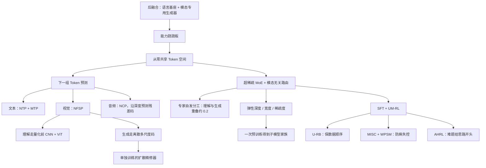

# ERNIE 5.0：不要先训好语言，再把视觉和音频挂上去

<!-- release-date: 2025-11-13 -->

> 本文依据 ERNIE Team（百度）发布的 **ERNIE 5.0 Technical Report**，arXiv:2602.04705v1，2026-02-04，共 36 页（正文到 p. 27，其后是作者名单与参考文献）。页码均指 PDF 自身页码。文中区分三件事：**报告明确写了什么**、**我们怎么解释它**、**哪些是外部资料**。

## 阅读前先认识几个词

- **后融合（late fusion）**：先训好一个语言模型，再在外面接视觉编码器、图像生成器或语音头。看懂走一套，生成走另一套。
- **能力跷跷板（ability seesaw）**：后融合常见的副作用。跨模态整合得越深，原本的语言能力越容易往下掉（PDF p. 3）。
- **Token 空间**：文本、图像、视频、音频先各自编码成一串符号，再排进同一条序列。主干只关心「下一个该预测什么」。
- **MoE（Mixture-of-Experts，混合专家）**：把前馈层拆成很多小网络（专家），每个 Token 只叫醒其中少数几个。总参数可以很大，单次计算量却不跟着涨。
- **路由器（router）**：MoE 里负责「这个 Token 该交给哪几个专家」的小网络。
- **RVQ（Residual Vector Quantization，残差矢量量化）**：把一段音频先粗量化一次，再把没量准的残差继续量化，叠几层。第一层最粗，后面每层补一点细节。

这篇报告自己起的新名字有四个：

- **下一组 Token 预测（Next-Group-of-Tokens Prediction）**：文本一次预测一个词；图像一次预测同一尺度上的一组块；音频一次沿深度预测一组残差码。三件事被收进同一个自回归目标（PDF p. 4–5）。
- **模态无关路由（modality-agnostic expert routing）**：路由器只看 Token 的向量，不看它来自文字、图像还是音频。没有事先划好的「视觉专家池」「音频专家池」（PDF p. 5）。
- **弹性训练（elastic training）**：一次预训练里同时练深度、专家数和每 Token 激活专家数都不同的子网络，部署时按显存和延迟裁一份出来（PDF p. 10–11）。
- **UM-RL（Unified Multimodal RL，统一多模态强化学习）**：把推理、Agent、指令遵循等任务并进一条多阶段 RL 流水线（PDF p. 11）。

## 一句话先说清

ERNIE 5.0 不是「一个很强的语言模型，再挂视觉头和语音头」。它主张：

> **所有模态从零一起训；看懂和生成走同一条自回归主干；专家池不按模态事先切开。**

报告给自己的定位是：在公开披露的模型里，第一个生产级的万亿参数统一自回归模型，同时支持多模态理解与生成（PDF p. 1、p. 27）。这是作者声称，后文会拿实验检查它实际证明了什么。

报告里几个最常被引用的数字：

- 超稀疏 MoE，**激活率低于 3%**（PDF p. 5）；
- 推理时把路由 top-$k$ 降到 25%，**解码提速超过 15%**，精度小幅下降（PDF p. 4、p. 26）；
- 深度、宽度、稀疏度一起裁，只用 **53.7% 激活参数、35.8% 总参数**，7 项平均分 75.17 对满血 75.55（PDF p. 4、p. 26–27）；
- 预训练上下文 8K，mid-training 扩到 32K 再到 128K（PDF p. 10）。

报告**没有**写总参数的具体数字，也没有写绝对激活参数。产品侧说的「2.4 万亿」是外部口径，见文末。

## 先看全景：一条序列，三个头，一池专家


图引自原文 Figure 1（PDF p. 4）。它把统一的范围画得很诚实，有三件事容易读错：

1. **编码和解码没有消失。** 视觉和音频仍有专用编码器、嵌入层、输出头和解码器。统一的是中间那叠 Transformer 层和共享专家池。
2. **图像理解不走离散视觉词表。** 看图用量化前的连续特征，画图才用离散的多尺度码，下文会讲这条分叉。
3. **高分辨率精修不在图里。** 自回归主干只出低分辨率结构，更高分辨率由单独训练的扩散精修器补（PDF p. 7）。

所以「统一自回归」在这份报告里的精确含义是：**中间的序列模型、路由器和专家池是一份；入口、出口和精修器仍按模态分工。** 文末会用一张图把这件事重新画一遍。

## 第一层矛盾：后融合为什么会变成跷跷板

当前很多多模态系统是这样搭的：

1. 先用海量文本训一个自回归语言模型；
2. 视觉理解靠一个后接的编码器，把图变成语言主干能读的向量；
3. 图像生成、语音合成再另接扩散模型或专用解码头。

报告点名这条路的两个后果（PDF p. 3）：

- 自回归只服务「理解」，输出仍以文本为中心；要生成图像或声音，就给语言模型加模态专用的生成器，用**非自回归**目标去训；
- 这样一来生成和理解被拆开，跨模态整合做得越深，越可能被迫在「多模态整合」和「核心语言能力」之间二选一。

这就是能力跷跷板。ERNIE 5.0 的回答不是把后融合做得更小心，而是换前提（PDF p. 3–5）：

- 文本、图像、视频、音频从预训练第一步就同时出现；
- 异构输入映射进共享 Token 空间，串成一条序列；
- 所有模态用同一个下一组 Token 预测目标；
- 路由器不看模态标签。

作者认为这样各模态可以一起长，而不是互相抢参数。**这是设计主张，报告没有给出受控对照**：没有「同一份数据、同一规模下，后融合对比从零统一」的实验。后面读实验时会回到这一点。

## 核心设计一：先把所有模态变成同一条序列

### 旧问题

模态之间差的不只是「图和字长得不一样」。报告列了三件事：Token 语义、时间结构、优化动态（PDF p. 4）。如果语言做下一词预测、图像做扩散去噪、音频做独立编解码，几条优化轨迹在同一个模型里会互相拉扯。

### 新设计：同一个目标，三种「一组」

所有输入投影进共享 Token 空间，用同一个下一组 Token 预测目标训练（PDF p. 4–5）。落到三种模态上，「一组」的含义不一样：

| 模态 | 一组是什么 | 报告里的名字 |
|---|---|---|
| 文本 | 仍然是下一个词，外加多 Token 预测（MTP，Multi-Token Prediction）辅助 | NTP + MTP |
| 视觉 | 同一尺度上互相可见的一组图像 Token；视频再沿时间加下一帧 | NFSP（Next-Frame-and-Scale Prediction） |
| 音频 | 同一时间步上、从粗到细的一组残差码 | NCP（Next-Codec Prediction） |

人话版：语言模型一次猜一个字；画画时同一分辨率上的许多块可以一起猜；说话时在同一个 80 毫秒的格子里先猜语义、再猜音色细节。这里的 80 毫秒是本文由 12.5 Hz 换算的（PDF p. 8）。把三件事都叫「预测下一组」，是为了让梯度走同一条自回归轨道，不是为了让三种输出的形状变得一样。

MTP 引的是 Gloeckle 等人与 DeepSeek-V3 的做法；NFSP 引的是百度同一批作者的 VideoAR（arXiv:2601.05966）（PDF p. 5）。

### 位置编码：Uni-RoPE

一条混合序列里，字和声音只有先后，图像还有高和宽。报告用统一时空旋转位置编码 Uni-RoPE 区分（PDF p. 7）：

$$
\text{Uni-RoPE}_i = (t_i,\ h_i,\ w_i)
$$

- 文本和音频：$t_i = h_i = w_i$，三个分量都等于它在序列里的下标；
- 视觉：$t_i$ 是帧号，单调递增；$(h_i, w_i)$ 是帧内坐标。不同尺度之间按几何中心对齐，粗尺度和细尺度的同一块区域落在同一个中心上。

### 收益、代价与启发

收益是从零联合训练成为可能，模态之间在 Token 级交互（PDF p. 5）。代价同样清楚：「一组」的大小、掩码和预测头仍然按模态特制；视觉理解甚至不用这套离散码，见下一节。三种损失的量级如何对齐，报告只说用了基于后验的损失重加权，把各模态自回归损失缩放到同一区间（PDF p. 10），没给公式。

**对自己的项目有什么用**：做统一多模态，先问的不该是「要不要共用主干」，而是「每一种模态的一步对应多长的时间或多大的空间块」。文本一步一个词，音频一步 80 毫秒，图像一步一个尺度。把一步对齐了，共享主干才有意义。

## 核心设计二：看图和画图共用主干，但不共用同一双眼睛

理解和生成要的视觉表示互相冲突，这是 Janus-Pro 一篇讨论过的老问题：理解要抽象语义，生成要像素细节。ERNIE 5.0 的做法是把冲突推到入口，主干仍然共用。


图引自原文 Figure 2（PDF p. 6）。下面按图从左到右讲。

### 图像是单帧视频

报告把图像定义为视频的特例（PDF p. 5）。这个定义后面在专家重叠里得到印证：图像理解和视频理解的高频专家在第一层几乎完全重合（PDF p. 24，Figure 9）。

### 视觉 tokenizer：先 2D，再胀成 3D

生成需要离散 Token，做法是（PDF p. 5–6）：

1. 先训一个因果 2D 多尺度图像 tokenizer，靠大规模图像预训练把空间结构稳住；
2. 再把它「胀」成因果 3D 卷积 tokenizer，图像和视频共用一个量化器；
3. 训练时加 GAN 判别器的对抗损失，以及来自视觉基座模型的语义正则，保住场景文字和人脸这类高语义元素。

量化走逐比特（bit-wise）方案，引 Infinity（Han et al., 2025）：比特数直接决定离散词表大小。他们预训了一串比特数递增的 tokenizer，主干训练时**从低比特（小词表、粗）逐步切到高比特（大词表、细）**，减轻早期训练不稳（PDF p. 6）。具体比特数、切换时机报告没写。

这条可以单独带走：**词表大小也可以做课程学习。** 先让主干学会粗粒度的视觉结构，再给它更细的码。

### 理解为什么不肯用量化后的码

量化前要先把特征降维到和比特宽度对齐的低维，报告认为这会丢细粒度语义，伤害理解（PDF p. 6）。于是理解支路**绕过量化**，直接用量化前的双路特征：CNN 提供感知细节，ViT 提供语义。但两路特征空间结构对不齐，用 MLP 适配器直接拼会互相干扰（PDF p. 6）。

于是有了基于注意力的 Patch Merger（PDF p. 6–7）。记 $N$ 为理解 Token 数，$K$ 为每个 Token 聚合的局部块数：图像取空间相邻的 4 块（$K=4$），视频取跨相邻 4 帧的 16 块（$K=16$）。CNN 特征先投影到 ViT 的特征空间，再沿块维拼起来：

$$
F_{\mathrm{mrg}} \in \mathbb{R}^{N \times 2K \times D_{\mathrm{vit}}}
$$

对这 $2K$ 个向量做多头自注意力，再沿块维取平均，得到 $F_{\mathrm{out}} \in \mathbb{R}^{N \times D_{\mathrm{vit}}}$，最后投影到主干的嵌入维度。

人话：每个理解 Token 先看一小团邻居，让 CNN 的边缘和 ViT 的语义在这一团里互相找对齐，再压成一个向量交给主干。报告说它稳定优于只用 CNN、只用 ViT 和 MLP 融合，文档与图表理解上增益更明显，且没有明显算力开销（PDF p. 7）。**这组对比没有给数字表**，只有文字结论。

### 生成：同一尺度内双向，尺度之间因果

NFSP 把图像生成写成下一尺度预测，视频再沿时间做下一帧预测（PDF p. 7）：

- 预测某个尺度时，更粗的尺度和更早的帧都可见（因果）；
- 当前尺度内部互相可见，一次并行预测；
- 空间从低分辨率走到高分辨率，时间由下一帧建模。

长序列会累积错误，报告给了三个补丁（PDF p. 7）：训练时**随机翻转历史 Token 的比特**，逼模型在当前尺度自我纠正；对早期尺度的损失加权，缓解多尺度 Token 数不平衡；视频再加窗口时间注意力和随机遮掉历史帧。

### 扩散精修器：统一叙事里明确拆出去的一块

在固定的模态 Token 预算下，分辨率一升序列就变长，有效 batch 变小，优化变差（PDF p. 7）。解决办法是在自回归主干之上级联一个扩散精修器：

- 主干只出低分辨率、语义与布局正确的样本；
- 精修器负责更高分辨率的细节；
- **精修器与主干分开训练**，用人为退化的低分辨率样本配对原始高分辨率图像或视频。

报告给的理由是避免在同一个主干里同时优化自回归损失和扩散损失（PDF p. 7）。这意味着评 GenEval、VBench 时，读者无法从报告判断分数里有多少来自精修器。

**对自己的项目有什么用**：统一不等于消灭分叉。看图要连续、未量化的细节，画图要离散、可并行的尺度码，高分辨率还要扩散。**表示冲突没有消失，只是被推到了入口和出口。** 若你的项目既要 OCR 又要文生图，先假设两条路需要不同的视觉前端，再决定哪些层可以共享。

## 核心设计三：音频沿网络深度展开，而不是把码本拍扁

### 旧问题

神经音频编解码器把一段波形变成多层残差码。如果把每个时间步的几层码在时间轴上拍扁，序列长度就乘上层数；报告把这称为「难以承受的序列长度」（PDF p. 8）。

### Tokenization

波形先变成 12.5 Hz 的离散码，即每秒 12.5 个时间步（PDF p. 8）。量化用 RVQ：

- 第一层码被明确指定为高层语义（语言、音素线索）；
- 后面各层编码音色、韵律等残差声学细节。

为了让第一层真的像语义，他们用预训练 Whisper 编码器的输出做蒸馏：把第一层码的表示对齐 Whisper 特征，并对 Whisper 特征做平均池化，对齐到 12.5 Hz（PDF p. 8）。


图引自原文 Figure 3（PDF p. 8）。图里只画了两层码，这是示意；报告没有写实际码本层数。

### 理解：多层嵌入相加

理解时，每一层码走自己的嵌入矩阵，再相加成一个向量，作为一个音频 Token 放进序列（PDF p. 8）。相加对应 RVQ 的残差结构：每一层补一块更细的信息，加起来才是完整的一帧。

### 生成：Next-Codec Prediction

生成时不把多层码拉成长序列，而是把残差预测**摊到 Transformer 的深度上**（PDF p. 8–9）：

1. 在顶部若干层插入多个音频头；
2. 先预测第一层语义码；
3. 把预测码映射回嵌入，加到隐状态上（训练时用真值，即 teacher forcing；推理时用预测值）；
4. 再预测下一层，直到所有层完成；
5. 音频解码器把完整层级码还原成波形。

语音合成时，说话人嵌入作为上下文条件插入，控制音色，不改变深度预测结构（PDF p. 9）。

### 收益与边界

音频序列长度由时间步决定，不随码本层数膨胀。代价是顶部若干层兼任音频头，理解和生成在音频上的计算图并不对称。报告没有公开码本层数、码本大小、说话人嵌入维度，也没有音频生成的延迟数据。

这份报告几乎不谈首包延迟和流式协议，**不要把它读成 Thinker–Talker 式的实时语音对话系统**（那条路线见 Qwen3-Omni 一篇）。12.5 Hz 在这里服务的是「让音频和文本能在同一条序列里建模」。

**对自己的项目有什么用**：多层码本有几种展开方式。沿时间拍扁最简单但序列爆炸；沿深度展开省长度，却让某几层 Transformer 承担某一层声学残差的职责。选哪种，取决于你更缺上下文窗口，还是更在乎主干各层职责单纯。

## 核心设计四：超稀疏 MoE，路由器不看模态身份证

### 旧问题

统一目标减少了优化轨迹的裂缝，但消不掉模态之间的本质差异，所以需要很大的容量（PDF p. 5）。容量一大，如果还按模态手工切专家池，模态一超过两个就很难切。百度前作 ERNIE 4.5 用的正是模态隔离路由（PDF p. 5）。

### 新设计

路由器只看统一 Token 表示，不看模态 ID，不同模态的 Token 被派进**同一池**专家（PDF p. 5）。再叠两件事：

- 超稀疏、细粒度 MoE，激活率低于 3%（PDF p. 5）；
- 无辅助损失的负载均衡（Wang et al., 2024c），在万亿参数规模上稳住专家利用率（PDF p. 5）。

PDF 没有给出层数、隐层宽度、专家总数、默认 top-$k$。低于 3% 是比例，不能换算成「每 Token 激活多少 B」。

### 路由器没看模态，专家还是分了工

报告 6.4.1 节是全文最有信息量的分析，也是检查「统一」是否落到实处的地方。


图引自原文 Figure 8（PDF p. 24），纵轴是专家激活频率（%）。能直接读到三件事：

- 文本激活最分散，很多专家都沾一点，纵轴上限只有 4–14；
- 图像、视频、音频明显更尖；视觉生成与音频比文本、视觉理解更集中（PDF p. 23）；
- 极端情况出现在中间层的音频（单个专家约 68%）和最后一层的图像理解（单个专家约 42%），这两个数是本文读图所得。

专家之间谁和谁一起干活，原文 Figure 9 用每类任务「激活最频繁的前 25% 专家」之间的 IoU（交并比）表示。热力图改写成表（PDF p. 24）：

| 两类任务 | 第一层 | 中间层 | 最后一层 |
|---|---:|---:|---:|
| 图像理解 × 视频理解 | 0.98 | 0.52 | 0.64 |
| 图像生成 × 视频生成 | 0.64 | 0.83 | 0.78 |
| 图像理解 × 图像生成 | 0.22 | 0.22 | 0.25 |
| 图像理解 × 视频生成 | 0.22 | 0.21 | 0.24 |
| 视频理解 × 图像生成 | 0.22 | 0.18 | 0.22 |
| 视频理解 × 视频生成 | 0.23 | 0.19 | 0.20 |
| 文本 × 图像理解 | 0.03 | 0.21 | 0.29 |
| 文本 × 视频理解 | 0.03 | 0.28 | 0.38 |
| 文本 × 图像生成 | 0.06 | 0.03 | 0.09 |
| 文本 × 视频生成 | 0.06 | 0.03 | 0.08 |
| 文本 × 音频 | 0.12 | 0.32 | 0.40 |
| 音频 × 图像理解 | 0.31 | 0.25 | 0.63 |
| 音频 × 视频理解 | 0.32 | 0.27 | 0.55 |
| 音频 × 图像生成 | 0.31 | 0.11 | 0.25 |
| 音频 × 视频生成 | 0.27 | 0.10 | 0.23 |

「音频」在原图里是理解与生成合在一起的一类。读这张表：

- **图像和视频在同一侧高度重叠**，理解侧第一层 0.98，生成侧中层 0.83。这印证了「图像是单帧视频」。
- **理解和生成之间一直偏低**，四组组合都在 0.18–0.25，三层都没有明显上升。报告自己的措辞是重叠「相对较低，没有明显偏向哪一侧」（PDF p. 24–25）。
- **文本与理解、与音频的重叠随深度上升**（0.03 → 0.38，0.12 → 0.40），报告把它读成浅层偏模态特征、深层偏统一语义（PDF p. 24）。但文本与视觉**生成**的重叠三层都不超过 0.09，这一点报告正文没提。

这是全文最重要的一组证据：**共享专家池不等于看图的专家就是画图的专家。** 统一发生在路由规则和参数池，不发生在专家的实际使用上。


负载是否均衡，原文 Figure 10 用归一化熵（NE）衡量（PDF p. 25）：

$$
\mathrm{NE} = \frac{-\sum_{i=1}^{N} p_i \log p_i}{\log N}
$$

$N$ 是专家数，$p_i$ 是落到第 $i$ 个专家的 Token 比例。NE 在 0 到 1 之间，越接近 1 用得越均匀。

图上读得出的形状已写在 alt 里。报告据此强调一句：**第一层并没有严重失衡**，这与「MoE 浅层必须用稠密层才能稳住路由」的常见假设相反（PDF p. 25，引 DeepSeek-V2）。这是作者观察，证据就是这张熵曲线，没有再做「浅层稠密对照」的实验。

### 收益、代价与启发

收益：不必为三个以上模态手工切专家配额，容量靠稀疏度撑起来。代价：生成和音频会自发走更尖的专家分布，均衡程度按任务分叉；工程上仍要处理早期路由不均导致的显存溢出（PDF p. 16）。

**对自己的项目有什么用**：可迁移的不是「不要模态 ID」这句口号，而是这套**事后诊断**。画出各任务高频专家的 IoU 和逐层归一化熵，成本很低。如果理解和生成的 IoU 长期在 0.2 附近，你所谓的统一主干，在专家这一层已经接近两套专家。

## 核心设计五：一次预训练，裁出一族子模型

### 旧问题

万亿模型训得起，未必部署得起。传统路径是「先训再压」：剪枝、蒸馏，每换一个尺寸重做一遍；压完架构就定死（PDF p. 10）。

### 新设计：把 Once-For-All 前移到预训练

每个训练样本按预定日程抽一个子网络，子网络和全模型在同一次反传里、用同一个自回归目标更新（PDF p. 3、p. 11）。弹性沿三个正交方向（PDF p. 10–11）：

| 方向 | 改什么 | 训练时的抽样（§3.3） | 部署时换来什么 |
|---|---|---|---|
| 弹性深度 | 启用多少层 | 75% 全深度，25% 浅子网络 | 更少的层 |
| 弹性宽度 | 每层专家池里有多少专家参与路由 | 80% 全部专家，20% 随机子集 | 更少的常驻参数，省显存 |
| 弹性稀疏度 | 每个 Token 的 top-$k$ | 80% 默认 $k$，20% 从更小的范围里随机取 | 体积不变、计算更少 |

隐层宽度方向的弹性被明确列为正交、留作未来（PDF p. 11）。

注意一处前后不一：§6.4.2 写弹性深度时说「与 ERNIE 5.0 的配置一致，80% 全深度、20% 浅子网络」（PDF p. 26），与 §3.3 的 75% / 25%（PDF p. 11）冲突，报告没有解释哪一处是笔误。

### 小模型消融

受控实验用一个 64 专家、4.54 亿激活参数、32 亿总参数的小 MoE，训练 2500 亿 Token，默认 top-$k=8$，报告验证集损失（PDF p. 26）。

**深度（Table 9，PDF p. 25）**

| 训练 | 推理层数 | 验证损失 |
|---|---:|---:|
| 基线，16 层 | 16 | 1.945 |
| 弹性深度，层数 ∈ [1, 16] | 16 | 1.941 |
| 同上 | 12 | 2.137 |

**宽度（Table 10，PDF p. 26）**

| 训练 | 推理专家数 | 验证损失 |
|---|---:|---:|
| 基线，64 专家 | 64 | 1.957 |
| 弹性宽度，专家数 ∈ {64, 32} | 64 | 1.964 |
| 同上 | 32 | 2.218 |

**稀疏度（Table 11，PDF p. 26）**

| 训练 | 推理 top-$k$ | 验证损失 |
|---|---:|---:|
| 基线，$k=8$ | 8 | 1.945 |
| 弹性稀疏度，$k$ ∈ [1, 8] | 8 | 1.969 |
| 同上 | 4 | 1.971 |
| 同上 | 2 | 2.003 |
| 同上 | 1 | 2.175 |

三张表读出三个结论：

- 弹性深度在全深度上反而略好（1.941 对 1.945），报告称之为偶尔丢层带来的正则效应；砍到 12 层损失升到 2.137，降级平滑，但不免费。
- 宽度砍半伤得最重（1.964 → 2.218），报告仍说「可在严格显存约束下使用」。
- 稀疏度从 $k=8$ 降到 $k=2$ 还算温和；$k=1$ 明显恶化。

这些是 32 亿参数小模型的验证损失，不是生产模型的精度。

### 放大到实验版 ERNIE 5.0-Exp

生产规模的弹性实验用的是 **ERNIE 5.0-Exp-Base 与 ERNIE 5.0-Exp**，不是主表里的 ERNIE 5.0（PDF p. 26）。Table 12（PDF p. 27）：

| 模型 | 平均 | ZebraLogic | LiveCodeBench v6 | TAU2 | MMMU | MathVista | VisualPuzzle | SimpleVQA |
|---|---:|---:|---:|---:|---:|---:|---:|---:|
| ERNIE 5.0-Exp | 75.55 | 95.00 | 73.35 | 79.35 | 74.11 | 83.70 | 59.93 | 63.40 |
| Exp-ES 25.0% | 74.43 | 94.10 | 70.70 | 77.34 | 73.78 | 84.90 | 57.98 | 62.19 |
| Exp-EA 35.8% | 75.17 | 95.20 | 70.93 | 77.23 | 75.11 | 84.50 | 60.39 | 62.86 |

两个变体的含义（PDF p. 26）：

- **ES 25.0%**：推理时把路由 top-$k$ 降到原来的 25%，解码提速超过 15%；
- **EA 35.8%**：深度、宽度、稀疏度一起裁，从 Exp-Base 得到一个只用 53.7% 激活参数、35.8% 总参数的预训练模型，再用同样的数据和策略做 mid-training 与后训练。

平均分只掉 0.38–1.12，但**拆开看，掉分集中在代码和 Agent**：LiveCodeBench 两个变体都掉 2.4–2.7 分，TAU2 都掉约 2 分；EA 在 MMMU、MathVista、VisualPuzzle 上反而有涨，ES 只在 MathVista 上涨。逐列差值是本文算的。平均数把「长程推理与工具调用对容量更敏感」这件事盖住了。

「近乎满血、只用 35.8% 总参数」成立，但成立对象是 Exp 实验模型，平均只覆盖这 7 项。它没有证明主模型 ERNIE 5.0 也能同样裁。

**对自己的项目有什么用**：弹性训练省的是「每个尺寸重训一遍」的工程，不是「裁了还不掉点」的物理。深度最便宜，宽度最伤容量，稀疏度适合专家已经全部加载进显存、只想少算的场景。迁移前先分清缺的是显存还是算力，再决定动哪一维，并且逐任务看掉分，不只看平均。

## 数据与预训练 recipe

### 数据：从第一步就四模态一起喂

ERNIE 5.0 从预训练第一步就同时看文本、图像、视频、音频，数据按输入输出模态组织成两类（PDF p. 9）：

- **文本**：多语言网页、精选语料、书、科学文献、代码、结构化知识。文本 tokenizer 重训：用 UTF-16BE 编码提供稳定的字节回退，对很多非拉丁符号也更紧凑；用 BPE dropout 减轻对高频模式的过拟合；对中文这类不用空格分词的语言，**滤掉能被标准分词工具拆开的超长无空格短语**，减少词表稀疏。
- **多模态**：图文对、视频–文本、音频–文本，以及图、视频、音频与文本交错的序列，带元数据和描述。

质控写了启发式与模型过滤、大规模去重、benchmark 去污染。最终规模只有一句：数万亿文本 Token 与多模态实例（PDF p. 9）。没有各模态比例、视觉分辨率日程、音频时长分布、代码占比。

### 两阶段上下文扩展（PDF p. 10）

| | Stage 1：8K 预训练 | Stage 2：32K 与 128K mid-training |
|---|---|---|
| 学习率 | WSD 日程：2,000 步线性 warmup 到 $1 \times 10^{-4}$，此后在 8K 阶段保持不变 | 改余弦日程，从 $1 \times 10^{-4}$ 退火到 $1 \times 10^{-5}$ |
| 全局 batch | 训练早期从 14M Token 逐步增到 56M Token | 保持不变 |
| RoPE base | 从 8K 阶段就设为 1,000,000，之后扩上下文不再插值 | 同左 |
| 负载均衡 bias 更新速度 | $1 \times 10^{-4}$ | $1 \times 10^{-5}$，压住迭代级振荡 |
| MTP 损失权重 | 0.3 | 0.1 |

外加前面提过的基于后验的模态损失重加权。

两个细节值得带走：**RoPE base 一开始就设大**，省掉后面扩上下文时的插值；**无辅助损失均衡的 bias 更新步长也跟着学习率一起降**，否则大规模 MoE 会出现迭代级的负载振荡。

### 这一节缺什么

没有优化器名字、权重衰减、梯度裁剪、各模态采样比，没有视觉 tokenizer 切换的步数日程，也没有弹性抽样与两个阶段如何交织。recipe 能复述，不能复现。

## 后训练：在超稀疏 MoE 上把强化学习稳住

后训练沿用 ERNIE 4.5 的管道：SFT 加 UM-RL（PDF p. 11）。SFT 给指令遵循和长思维链打底；UM-RL 把推理、Agent、指令遵循并进多阶段 RL，并把统一 verifier（验证器）扩展到多模态场景来打奖励。

报告列了三道坎（PDF p. 11–12）：

1. RL 本来就贵，万亿模型更贵，rollout 占 RL 总训练时间的 90% 以上（PDF p. 12）；
2. 超稀疏 MoE 放大训练引擎与推理引擎之间的数值差异；
3. 多场景、多模态比单一的数学或代码 RLVR（可验证奖励的 RL）复杂得多，奖励更稀疏。

对应三组工具。

### U-RB：凑满了也不许插队


图引自原文 Figure 5（PDF p. 12）。同步 RL 里，一条特别长的回答会卡住整批，GPU 空转。APRIL（Zhou et al., 2025）的做法是多发请求，凑够目标条数就停，没写完的下一轮续写。报告指出 APRIL 的副作用：短回答往往对应简单题，先进入训练；难题被一再推迟，**训练数据的难度分布随时间周期性漂移**，可能拖慢收敛（PDF p. 12）。

U-RB（Unbiased Replay Buffer，无偏回放缓冲）加了一条顺序约束：只有初始化时分给第 $t$ 轮的那组数据 $\mathcal{D}_t$ 能进入第 $t$ 轮训练。实现上是两个池（PDF p. 12）：

- 推理池容量 $\Omega_{RBS} = \Omega_{BS} \times N$，$\Omega_{BS}$ 是训练 batch，$N$ 是缓冲倍数；
- 训练池容量 $\Omega_{BS}$。

推理一直跑到 $\mathcal{D}_t$ 里最长的那条写完，这组才整体移进训练池；空出来的算力用来提前生成后面几轮的回答，这些回答以后可以续写。GPU 不空等，数据分布也不偏。

报告没有给 U-RB 相对 Sync RL 或 APRIL 的吞吐或精度数字。

### MISC：训推不一致时，别按整句一刀切

训练和推理用两套引擎，数值不完全一致；MoE 的动态路由把这个差异放大（PDF p. 13）。IcePop（引 Ling-Team 的 Ring-1T 报告，arXiv:2510.18855）在 GRPO 上做双边掩码：训练引擎与推理引擎给同一个 Token 的概率之比落在 $[\alpha, \beta]$ 之外，就把这个 Token 的梯度清零。

报告先把 IcePop 搬到 GSPO（序列级重要性比率，见 GSPO 一篇）上，掩码也改成按整条回答的几何平均比率判定。结果在 ERNIE 5.0 上迅速失稳。作者的归因是：**序列级截断会因为训推不一致，成批剪掉低熵回答**（PDF p. 13）。

MISC（Multi-granularity Importance Sampling Clipping，多粒度重要性采样裁剪）的改法是**掩码按 Token 判，重要性比率仍按序列算**（PDF p. 14，式 3）：

- 逐 Token 计算训练引擎与推理引擎的概率比，落在 $[\alpha, \beta]$ 之外的位置被屏蔽；
- 保留 GSPO 的序列级比率 $s_i(\theta)$ 与它的裁剪。


图引自原文 Figure 6（PDF p. 13），读数按原图估读。值得注意的是，这里的「熵崩溃」**是熵急剧上升**，不是常见的熵塌到零；报告对熵崩溃的定义本来就包含「急升或急降」两种（PDF p. 13）。这张图是 MISC 唯一的证据，没有最终基准上的对照。

报告在式 3 之后还说这套机制「按模态敏感度调节信任域」（PDF p. 14），但公式里看不到任何按模态区分的项。

### WPSM：已经会的题少更新

另一个熵崩溃来源是策略在早期过拟合简单题（PDF p. 13）。WPSM（Well-learned Positive Sample Mask，已掌握正样本掩码）给每道题记成功率：若第 $t$ 轮该题平均正确率超过阈值 $\tau$，其中策略熵低于 $\eta$ 的回答被标为「已掌握」（PDF p. 14，式 4）：

$$
M^{i}_{\mathrm{mask}} =
\begin{cases}
\alpha, & H_{y_i}(\pi_\theta) < \eta \ \text{且}\ \mathrm{acc}_t > \tau \\
0, & \text{否则}
\end{cases}
$$

目标函数里这条回答的梯度乘以 $1 - M^{i}_{\mathrm{mask}}$。$\alpha \in [0,1]$：取 1 就完全不学，取 0 就照常学。梯度预算因此被推向更难、奖励更稀疏的题。$\tau$、$\eta$、$\alpha$ 的取值没有给。

### AHRL：难题先给一段思路开头

一组 rollout 全拿零分时，GRPO 类方法没有可用梯度（PDF p. 15）。AHRL（Adaptive Hint-based RL，自适应提示 RL）不改奖励，而是把这道题 SFT 思维轨迹的前一段拼进题目里，降低难度（PDF p. 14–15）。原文 Figure 7 给了一个例子，结构如下（示意，题面与思维内容省略，不是训练语料原文）：

```text
[原题]
Let S be the set of vertices of a regular 24-gon. ……

[增强后的题]
Let S be the set of vertices of a regular 24-gon. ……
Please reason step by step, and put your final answer within \boxed{}.
<think> The problem states: …（SFT 思维轨迹的前一段，比例为 p_hint）
```

揭示比例按退火走（PDF p. 15，式 5）：

$$
p_{\mathrm{hint}}(x_t) = p_{\mathrm{initial}} \cdot \exp\!\left(-\gamma \cdot t \cdot \mathrm{pass}^{\mathrm{initial}}_x\right)
$$

$t$ 是训练步，$\gamma$ 是衰减率，$\mathrm{pass}^{\mathrm{initial}}_x$ 是 SFT 模型在这道题上的 pass@k。**SFT 模型越会做的题，提示撤得越快；越难的题，脚手架留得越久。** $p_{\mathrm{initial}}$、$\gamma$、$k$ 没有给，也没有 AHRL 的单独消融。

### 这一节实际证明了什么

证明了：在他们的超稀疏 MoE 上，序列级的 GSPO IcePop 会失稳，改成 MISC 后曲线稳住（Figure 6）。没有证明：UM-RL 相对只做 SFT 在基准上涨了多少；U-RB、WPSM、AHRL 各自贡献多少。主表里的 ERNIE 5.0 是整条管道的终点，不是某一项技巧的消融。

## 基建：把 tokenizer 从主干旁边搬走

训练基于飞桨（PaddlePaddle），在 ERNIE 4.5 的基建上扩展（PDF p. 15）。

### 混合并行与显存（PDF p. 16）

最终配置：4 路张量并行、12 路流水线并行（带虚拟阶段，减少气泡）、64 路专家并行、ZeRO-1 数据并行，长上下文再加上下文并行；跨节点专家通信用 DeepEP。全程**不丢 Token**，代价是训练早期路由不均时偶尔显存溢出。

对应的四项显存手段：

- FP8 混合精度训练，激活也以 FP8 存（沿用 ERNIE 4.5）；
- 反传要用的激活全部登记在案，只有真的遇到显存溢出才自适应卸载，够用就不卸；
- 大块分配拆成多个 sub-batch 的小请求，减少碎片导致的溢出；
- 基于 CUDA 虚拟内存管理（VMM）的自动碎片整理分配器。

### tokenizer 与主干分置（PDF p. 16）

文本、视觉、音频 tokenizer 的计算形态和 MoE 主干差得很远，不同样本的长度和算量也差得很远。把它们和主干绑在同一批同构 GPU 上，负载会严重失衡。于是 tokenizer 被做成独立、可横向扩展的数据并行服务，部署在专门节点上，主干通过远程调用取编码结果。这也解释了 Figure 1 为什么把编码器画在主干外面。

### FlashMask（PDF p. 16）

文本和音频是因果注意力；视觉样本是全局因果、局部双向。同一个 batch 里不同样本的掩码形状还不一样。报告用自研 FlashMask：算子级相对 FlexAttention 最高 200% 加速，端到端训练加速超过 20%；与上下文并行在 kernel 级融合后，相对 Megatron-LM 方案提升 80%。硬件与测试条件没有给。

### 拆分式 RL 基建（PDF p. 17）

- 中心化 RL 控制器，训练、推理、环境交互、奖励评估异步解耦；
- 统一 FP8 执行引擎：训练和 rollout 用同一套算子，再加 Rollout Router Replay（在训练时重放推理时的路由决策），压小 MoE 的训推数值差；
- 无偏回放缓冲，就是上文的 U-RB；
- 弹性 CPU 池：把 GPU 集群里闲着的 CPU 虚拟化出来，跑环境交互和结果验证。

**对自己的项目有什么用**：万亿 MoE 的 RL 同时有四件事——吞吐、训推数值一致、长度偏差、CPU 闲置。只优化 rollout 速度不够，数值一致性要在算子层和路由层同时处理。

## 实验：主表证明了「均衡」，没有证明「第一」

评测用内部框架 ERNIE-Eval，代码题用 LiveCodeBench 与 SandboxFusion 做执行式评测（PDF p. 17）。表里的其他模型是 ERNIE 表内的基线，数字都出自本报告。

### 语言：Base 很强，后训练偏知识与指令，不偏竞赛

**Table 1（PDF p. 18）**，预训练模型对比：

| 基准 | DS V3.2-Exp-Base | Kimi K2-Base | ERNIE 5.0-Base |
|---|---:|---:|---:|
| PreciseWikiQA | 52.60 | 61.66 | 74.48 |
| ChineseSimpleQA | 74.19 | 78.29 | 90.09 |
| MMLU-Pro | 68.27 | 67.19 | 75.58 |
| C-Eval | 90.70 | 92.49 | 91.98 |
| CMMLU | 88.43 | 90.61 | 89.69 |
| MATH（CoT） | 65.70 | 65.90 | 73.89 |
| GPQA-Diamond | 53.01 | 48.10 | 57.30 |
| LiveCodeBench v6 | 24.90 | 26.30 | 31.94 |
| HumanEval+ | 53.99 | 70.73 | 80.86 |
| MBPP+ | 78.77 | 79.36 | 79.10 |
| MMMLU | 70.99 | 61.50 | 78.94 |
| INCLUDE | 77.45 | 72.29 | 77.81 |

22 行里 ERNIE 5.0-Base 输了三行：C-Eval、CMMLU、MBPP+，都输给 Kimi K2-Base。知识问答领先最多，四项都比次好者高出 10 分以上。报告说多语言上「显著超过」基线（PDF p. 19），但 INCLUDE 只比 DeepSeek 高 0.36 分，显著的只有 MMMLU。

**Table 2（PDF p. 19）** 是后训练模型：

| 类型 | 基准 | ERNIE 5.0 | 表内对比 |
|---|---|---:|---|
| 知识，领先 | SimpleQA | 74.01 | 次高 Gemini 3-Pro 69.33 |
| 知识，领先 | ChineseSimpleQA | 86.03 | 次高 Gemini 3-Pro 84.08 |
| 指令，领先 | MultiChallenge | 65.98 | 次高 Gemini 3-Pro 62.50 |
| 指令，领先 | Multi-IF | 85.56 | 次高 Gemini 3-Pro 81.15 |
| Agent，领先 | ACEBench-en / zh | 87.70 / 89.60 | 次高 81.40 / 87.50 |
| Agent，未领先 | BrowseComp-zh | 64.71 | DS V3.2-Thinking 65.00 |
| 竞赛，落后 | AIME 2025 | 89.06 | Gemini 3-Pro 95.00 |
| 竞赛，落后 | HMMT 2025 | 79.58 | Gemini 3-Pro 93.33，GPT-5（High）93.30 |
| 综合，落后 | HLE | 25.81 | Gemini 3-Pro 37.50 |
| 代码，落后 | LiveCodeBench v6 | 76.21 | Gemini 3-Pro 86.34 |
| 综合，落后 | MMLU-Pro | 83.80 | GPT-5（High）87.10 |

报告的定性是：知识、指令、Agent 有竞争力甚至领先；最难的推理与竞赛落后 Gemini 3-Pro，「中等差距」（PDF p. 19–20）。两处要校准：

- 报告说 Agent 上「尤其在 ACEBench 和 BrowseComp-zh」领先（PDF p. 19），但 BrowseComp-zh 表内最高是 DS V3.2-Thinking 的 65.00，ERNIE 是 64.71；
- HMMT 2025 上 ERNIE 的 79.58 在五个模型里最低，不只是落后 Gemini 3-Pro。

报告自己的解释是 ERNIE 5.0 追求「稳健均衡的能力，而不是朝极端推理或竞赛任务激进优化」（PDF p. 19）。这是作者给自己划的边界。

### 视觉理解：Base 已经能看，后训练主要修推理

**Table 4（PDF p. 21）** 只报 ERNIE 5.0-Base，因为可公开比较的视觉 base 模型很少。Base 已有 MathVista 84.40、ChartQA 87.68、OCRBench 875、AI2D 96.02。报告据此说核心感知与跨模态推理大多在预训练中学会，不像后融合要靠任务微调才出现（PDF p. 21）。这是解释，不是对照实验。

**Table 3（PDF p. 20）** 后训练视觉理解，摘突出项和弱项：

| 基准 | ERNIE 5.0 | 表内最高 |
|---|---:|---|
| VLMAreBlind | **91.38** | 表内最高（Gemini 3-Pro 80.83） |
| DocVQA val | **95.45** | 表内最高（Qwen3-VL Thinking 95.44） |
| CountBench | 96.54 | Gemini 3-Pro 97.35 |
| OCRBench | 878 | Gemini 3-Pro 909 |
| MMMU-Pro | 68.63 | Gemini 3-Pro 81.00 |
| ChartXiv-RQ | 67.10 | Gemini 3-Pro 81.40 |
| VideoMME（带字幕） | 81.35 | Gemini 3-Pro 88.40 |
| MMVU | 72.24 | GPT-5（High）87.34 |

形状和语言一样：文档、计数、「模型是否真的在看」这类探针很强；多学科推理、图表推理和长视频仍落后表内最强的闭源模型。

### 视觉生成：语义强，画质不是第一

**Table 5 GenEval（PDF p. 21）**

| Nano Banana Pro | Seedream 4.0 | GPT-Image | Qwen-Image | ERNIE 5.0-Base | ERNIE 5.0 |
|---:|---:|---:|---:|---:|---:|
| 89.0 | 85.4 | 84.0 | 91.0 | 88.4 | 90.1 |

后训练把 88.4 推到 90.1，仍低于 Qwen-Image 的 91.0。GenEval 测的是「有没有按提示画出指定对象、数量、位置」，不是美学。

**Table 6 VBench（PDF p. 21）**

| 指标 | HunyuanVideo-1 | Wan2.1-14B-0725 | Veo3 | ERNIE 5.0-Base | ERNIE 5.0 |
|---|---:|---:|---:|---:|---:|
| Quality | 85.07 | 85.59 | 85.70 | 84.14 | 84.40 |
| Semantic | 76.88 | 76.11 | 82.49 | 82.31 | **83.40** |
| Overall | 83.43 | 83.69 | 85.06 | 83.78 | 84.20 |

Semantic 表内最高，Quality 表内最低，Overall 低于 Veo3。报告把 Semantic 领先归因于统一架构把高层语义迁到了生成（PDF p. 21）。这与 Figure 9 并不矛盾：语义可以沿深层的文本–视觉重叠传过去，同时理解和生成仍用不同的专家。再提醒一次，高分辨率精修器是单独训练的，这些分数不等于「自回归主干单独的生成能力」。

### 音频：中文识别亮眼，后训练有得有失

**Table 7（PDF p. 22）** 摘 ERNIE 自己的数与表内最佳：

| 基准（↓ 越低越好） | ERNIE 5.0-Base | ERNIE 5.0 | 表内最佳 |
|---|---:|---:|---|
| AISHELL-1 | 0.75 | **0.31** | ERNIE 5.0 |
| AISHELL-2 | 2.90 | 2.64 | Qwen3-Omni 2.34 |
| WenetSpeech net / meeting | 11.57 / 22.85 | 7.27 / 7.36 | Qwen3-Omni 4.69 / 5.89 |
| LibriSpeech clean / other | 1.47 / 3.73 | **1.16** / 2.61 | clean：ERNIE 5.0；other：Kimi-Audio 2.42 |
| Fleurs-zh | 1.58 | **0.83** | ERNIE 5.0 |
| Fleurs-en | 4.39 | 3.14 | Qwen3-Omni 2.72 |

| 基准（↑ 越高越好） | ERNIE 5.0-Base | ERNIE 5.0 | 表内最佳 |
|---|---:|---:|---|
| VoiceBench CommonEval | 4.39 | 3.74 | Gemini-3-Pro 4.68 |
| VoiceBench SD-QA | 86.44 | 77.58 | Gemini-3-Pro 94.39 |
| VoiceBench MMSU | 76.61 | 84.68 | Gemini-3-Pro 92.16 |
| MMAU | 80.80 | 80.40 | Gemini-3-Pro 与 ERNIE 5.0-Base 80.80 |
| TUT2017 | 57.65 | **68.09** | ERNIE 5.0 |
| CochlScene | 75.24 | **82.77** | ERNIE 5.0 |

读法：

- 中文 ASR 是亮点，AISHELL-1 0.31、Fleurs-zh 0.83 都是表内最好；WenetSpeech 这类嘈杂场景仍落后 Qwen3-Omni，报告承认「有的模型在 WenetSpeech 上更强」，并把自己的优势归为跨数据集稳定（PDF p. 22–23）。
- **后训练在语音对话上并非全涨**：CommonEval 从 4.39 降到 3.74，SD-QA 从 86.44 降到 77.58，MMSU 则从 76.61 升到 84.68。报告正文只提 MMSU 与 OpenBookQA 有竞争力（PDF p. 23），没讨论这两项下降。
- 环境声场景（TUT2017、CochlScene）是表内最好。

**Table 8 SEED-TTS（PDF p. 23）**，用识别错误率衡量合成内容是否准确，越低越好：

| 模型 | test-zh / test-en |
|---|---|
| CosyVoice 3 | 0.71 / 1.45 |
| Qwen3-Omni | 1.07 / 1.39 |
| ERNIE 5.0-Base | 3.41 / 2.44 |
| ERNIE 5.0 | 1.35 / 1.54 |

后训练把中文 WER 从 3.41 降到 1.35。报告承认专精 TTS（如 CosyVoice 3）更强，自称与 Qwen3-Omni「相当」，并把自己定位为「没有做任务专用 TTS 优化」的统一模型（PDF p. 23）。

## 理解与生成，真的在同一套权重上吗

把架构和 Figure 9 叠在一起，画成一张图：


本图按 PDF p. 4–9 与 Figure 1、2、3、9 重画，是机制示意。

答案分三层：

- **报告明确写了的统一**：同一条自回归主干、同一个路由网络、同一池专家；四种模态从零一起训；目标都被写成下一组 Token 预测。
- **同一份权重里仍然分叉的**：视觉理解走量化前 CNN–ViT 加 Patch Merger，视觉生成走离散多尺度码；音频理解把各层嵌入相加，音频生成在顶层加多个头；高分辨率由单独训练的扩散精修器补；看图与画图的高频专家 IoU 只有 0.18–0.25。
- **我们的判断**：「同一套权重」对主干和专家池成立，对入口、出口、精修器、甚至专家的实际使用都不成立。更准确的说法是：**一条超稀疏主干，两套视觉前端，一个单独训练的扩散精修器，音频生成还在顶层加了专用头。** 这比后融合更统一，但不是「看和画共用同一双眼睛」。

和 Janus-Pro 对照（本文解释，不是 ERNIE 原文）：Janus-Pro 把冲突公开解耦成两套视觉编码、一份主干；ERNIE 5.0 把冲突放进量化前、量化后两条支路，再交给共享 MoE。Figure 9 显示 MoE 在专家层面又把两件事分开了。

## 作者声称 vs 实验实际证明了什么

**实验支持的：**

- 同一个后训练模型在语言、视觉理解、图像生成、视频生成、语音识别、语音合成上都给出了可比较的分数，不必每个模态换一个模型；
- Base 的语言知识明显强于同表的 DeepSeek V3.2-Exp-Base 与 Kimi K2-Base；
- GenEval 与 VBench-Semantic 进入专精模型附近；中文 ASR 表内最好；
- 模态无关路由下专家自发分工；弹性训练能在 Exp 模型上裁出接近满血的子模型。

**没有支持、或只支持到一半的：**

- 「第一个」是作者对公开披露范围的判断，报告没说以什么定义、排除了哪些模型；
- 「缓解能力跷跷板」没有同规模后融合对照；
- 「理解与生成互相加强」是设计哲学（PDF p. 5），没有「去掉生成任务后理解掉多少」的消融；
- 引言说在各任务上「一致地追平或超过专精基线」（PDF p. 4），主表不支持这么强的说法：最难的文本推理、多学科视觉推理、长视频、TTS 都落后表内最强系统；
- 「万亿」「低于 3%」反复出现，但绝对总参数与绝对激活参数都不在 PDF 里。

更准确的成绩单是：**一台各科都不塌的全能模型，知识、指令、文档、中文语音特别亮，不是每一科的第一名。**

## 报告没有公开的

- **规格**：层数、隐层宽度、专家总数、默认 top-$k$、词表大小、视觉比特数、音频码本层数、精修器结构；
- **数据**：各模态配比与总量。因此无法判断语言没掉点是因为统一架构，还是因为文本数据仍占绝对多数；
- **训练成本**：卡数、卡时、总 Token 数、MFU；
- **后训练超参**：$\alpha, \beta$（IcePop 区间）、$\tau, \eta, \alpha$（WPSM）、$p_{\mathrm{initial}}, \gamma, k$（AHRL），以及 SFT 数据规模；
- **消融**：Patch Merger、U-RB、WPSM、AHRL 都没有数字化对照；
- **评测细节**：ERNIE-Eval 的提示词、解码参数、是否允许工具；
- **权重**：报告没有提开源权重。

报告没有单独的局限性章节，只在 6.1 节末承认最难推理上与 Gemini 3-Pro 有中等差距（PDF p. 20）。

## 最值得带回自己项目的七条

### 1. 先测跷跷板，再决定是否从零统一

已经有强语言模型、后接视觉头的，先测语言掉了多少。掉得厉害再考虑从零联合训；没掉，不必为了「原生」重训万亿。ERNIE 5.0 本身也没给这组对照。

### 2. 统一目标，不等于统一前端

下一组 Token 预测是训练轨道。视觉理解和生成仍然可以、而且很可能必须用不同的 Token 定义。

### 3. 路由器可以不看模态 ID，但你必须事后看它的行为

高频专家 IoU 和逐层归一化熵是很便宜的诊断，比「我们用了共享专家」这句话有用得多。

### 4. 词表也能做课程学习

视觉 tokenizer 从低比特切到高比特，主干先学粗结构再学细节。同样的思路可以用在任何「离散化粒度可调」的模态上。

### 5. 弹性训练是部署策略，不是免费压缩

深度最便宜，宽度最伤容量，$k=1$ 明显掉点；平均分会盖住代码与 Agent 的掉分。

### 6. 超稀疏 MoE 的 RL，第一敌人是训推不一致

序列级重要性截断可能成批剪掉低熵回答。可复用的是「按 Token 做掩码 + 训推同一套低精度算子 + 路由重放」这一组合，而不是某一个公式。

### 7. 把 tokenizer 做成服务

多模态训练里，编码器的算量和长度抖动会拖垮 MoE 并行。把它们拆到独立节点、按自己的并行方式扩展，比绑在同一批 GPU 上现实。

## 用一张图重新串起全文



## 关键词回看

- **能力跷跷板**：跨模态变好、语言变差的后融合副作用，是全文要解决的矛盾。
- **下一组 Token 预测**：三种模态共用的自回归目标，「一组」的定义按模态不同。
- **NFSP**：图像按尺度、视频按帧再按尺度预测；尺度内双向、尺度间因果。
- **Patch Merger**：量化前把 CNN 与 ViT 的局部块做注意力聚合，只服务理解。
- **NCP**：音频残差码沿 Transformer 深度逐级预测，序列长度不随码本层数增长。
- **模态无关路由**：路由不看模态 ID；事后仍出现按任务的专家分工。
- **弹性训练**：一次预训练同时优化深度、专家数、top-$k$ 三个方向的子网络。
- **U-RB**：rollout 可以提前生成，但只有当轮分配的数据能进当轮训练。
- **MISC**：把 IcePop 的掩码从整句改到 Token，保留 GSPO 的序列级比率。
- **WPSM**：已掌握的高置信正样本降权，梯度让给难题。
- **AHRL**：把 SFT 思维轨迹的开头当提示，按题目难度退火撤掉。
- **FlashMask**：同一 batch 内按样本处理因果与局部双向混合掩码。

## 最后的判断

ERNIE 5.0 最值得记住的，是它把一个工程判断写得很硬：**多模态不要做成语言基座的插件商店；若要理解和生成互相借力，就从第一步把它们放进同一条自回归轨道。**

它为此付出的结构成本同样硬：视觉前后端分叉、音频顶层专用头、单独训练的扩散精修器、超稀疏 MoE 上的训推不一致。证据强度也是分层的：

- **有直接实验支撑的**：三张主表的均衡成绩单、弹性训练的小模型损失表与 Exp 模型表、专家 IoU 与归一化熵的分析、MISC 的训练曲线；
- **只有作者观察的**：Patch Merger 优于 MLP 融合、U-RB 与 AHRL 的收益、浅层 MoE 不必稠密；
- **完全没有公开的**：规格、数据配比、训练成本、后训练超参、与后融合的受控对照。

如果只记一句：

> **统一发生在目标函数和专家池；分叉发生在眼睛、嘴巴和精修器，甚至发生在专家的实际使用上。先承认这两层，再决定自己的模型要统一到哪一层。**

## 资料与阅读边界

**原始依据**

- ERNIE 5.0 Technical Report，[arXiv:2602.04705](https://arxiv.org/abs/2602.04705) v1，2026-02-04，36 页。arXiv 上目前只有 v1。

**首发日（外部证据，不是 PDF 内容）**

`release-date` 取模型首次对外可用日 **2025-11-13**：

- 2025-11-13 百度世界 2025，百度官方新闻稿写明 ERNIE 5.0 预览版即日起经文心一言向公众开放、经千帆向企业开放：[Baidu Unveils ERNIE 5.0 …](https://www.prnewswire.com/news-releases/baidu-unveils-ernie-5-0-and-a-series-of-ai-applications-at-baidu-world-2025--ramps-up-global-push-302614531.html)；千帆[模型更新记录](https://cloud.baidu.com/doc/qianfan/s/Kmh4stnjp)同日上线 `ERNIE-5.0-Thinking-Preview`。
- 更早的 2025-11-07，官方博客宣布 ERNIE-5.0-Preview-1022 在第三方评测平台 LMArena 上测试，并说「计划于近期正式发布」，当时官方渠道尚未开放：[官方博客](https://ernie.baidu.com/blog/zh/posts/ernie-5.0-preview-1022-release-on-lmarena/)。
- 2026-01-22 文心 5.0 正式版上线，是同一家族的后续版本，不回写首发日：[百度智能云新闻](https://cloud.baidu.com/news/news_eacd5e1a-b6ad-4874-b920-15390d26e656)。

**外部补充（不是报告内容）**

- 「总参数 2.4 万亿」来自上面那篇正式版新闻，PDF 只写万亿级与激活率低于 3%。把两者相乘得到的「低于约 720 亿激活参数」是读者自己的算术，本文不当作报告数字使用。
- ERNIE 5.1 等后续版本不在本报告内，本文实验表不含任何后续版本的数字。

**本文推算与读图**

- 80 毫秒一步由 12.5 Hz 换算；Table 12 的逐列差值、Table 1 的输赢计数由本文计算。
- Figure 6、Figure 8、Figure 10 中的数值是按原图估读，不是报告给出的数字；Figure 9 的数值印在原图上。
