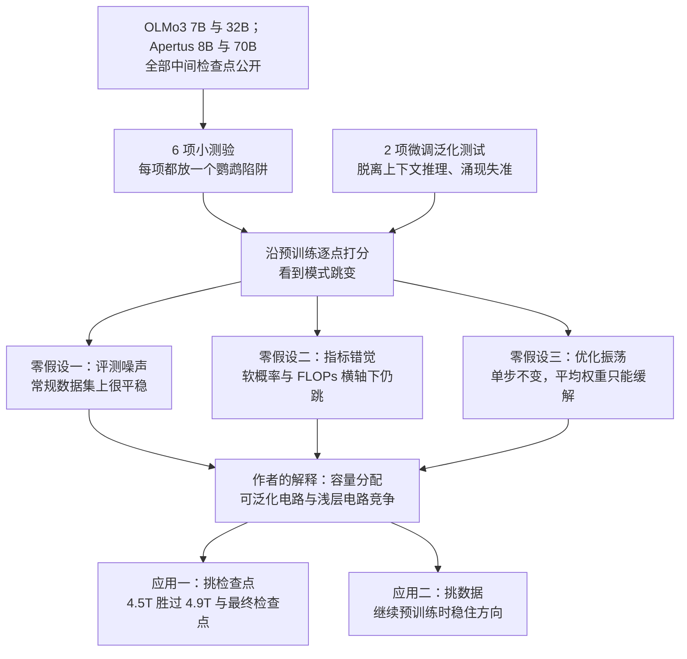

# 预训练里的泛化会反复横跳：模型在「鹦鹉」与「推理」之间突然切换，最后一个 checkpoint 未必最会泛化

<!-- release-date: 2026-09-27 -->

> 本文依据本地 `papers/Berkeley/LM-Generalization-Dynamics.pdf`，即 **Generalization Dynamics of LM Pre-training**，arXiv:2609.33150v1，2026-09-27 提交，共 31 页（正文 9 页，其余为参考文献与附录 A–J）。作者 Jiaxin Wen、Dawn Song、Lijie Chen 来自 UC Berkeley，Zhengxuan Wu 来自 Stanford University 与 Google DeepMind（PDF p. 1）。页码均指 PDF 物理页码。文中区分三件事：论文明确写了什么、我们怎么解释它、哪些是从图上读出的近似值。

## 读前先把几个词说成人话

这篇论文没有新模型、没有新训练方法。它做的是一件更朴素的事：拿两组公开了全部中间检查点的模型，用一套很便宜的小测验，一个检查点一个检查点地看「模型此刻是在照搬表面模式，还是在真的推理」。

先把反复出现的词说清楚：

- **预训练检查点（checkpoint）**：预训练过程中定期存下的一份完整权重。OLMo3 与 Apertus 把这些中间权重全部公开，才让逐点追踪成为可能（PDF p. 2）。
- **鹦鹉（parrot）与智能（intelligence）**：论文自己的两极说法。鹦鹉照搬上下文里的表面模式、背下来的标签或直觉答案；智能从示例里推出真正的任务再去做（PDF p. 1–2）。这是一种行为上的区分，不是对模型内部的直接测量。
- **上下文学习（In-Context Learning，ICL）**：不改权重，只靠提示里的几个示例让模型推断任务。
- **模式跳变（mode-hopping）**：论文起的名字。指在预训练过程中，模型在鹦鹉式与智能式两种计算之间频繁、突然地来回切换（PDF p. 1）。
- **Chinchilla 最优**：按 Chinchilla 规模定律，给定参数量时算力最划算的训练 token 数。图里的星号标的就是这个点。论文强调所研究的模型都训到它的 9 到 90 倍，所以振荡不能归咎于「还没训够」（PDF p. 2）。
- **软概率（soft probability）**：$P(\text{correct}) - P(\text{incorrect})$，即正确答案与鹦鹉答案的概率差，取值在 $-1$ 到 $1$ 之间。它用来排除「准确率是阶跃指标，所以看起来在跳」的质疑（PDF p. 6、p. 20）。
- **中训练（mid-training）**：预训练之后、后训练之前，换一批高质量或领域数据继续训的阶段。论文分析时把它排除在外（PDF p. 2）。

## 一句话先说清

大家默认的心智模型是：预训练损失平滑下降，下游能力逐步上涨，模型的泛化倾向也应当一路变强、越来越不吃表面模式。这篇论文用一套 6 项小测验（PDF p. 3）证明这个心智模型是错的（PDF p. 1–2）。

这张图是概念示意，不是实测曲线。上排三格是大家熟悉的平滑动态；下排三格是论文想说的：泛化并不跟着上排一起稳定变好，而是在相邻检查点之间突然坍塌、又突然恢复。

论文给的最醒目一例：在「答案加 1」这道题上，OLMo3-32B 在 2.17T token 处准确率 81%，到 2.19T 掉到 0%，到 2.21T 又回到 81.7%（PDF p. 2）。前后只隔约 400 亿 token；而同一批检查点在不设诱饵的常规数据集上，准确率整个预训练都很平稳（PDF p. 7，Figure 9）。

它的主张可以压成四句：

1. 模式跳变普遍存在于 6 类测验和 2 个微调泛化测试中，不是个别现象（PDF p. 3–6）。
2. 它不是评测噪声、不是指标选择的错觉、也不是常规优化振荡（PDF p. 6–7）。
3. 作者把它解释成容量分配问题：容量有限的模型里，可泛化的电路要和早期学到的浅层电路争地盘，每一段预训练窗口里的数据决定谁赢（PDF p. 1–2）。这是假说，论文没有给出机制层面的直接证据。
4. 两个应用：用小测验挑中间检查点，后训练后的推理与对齐泛化比最终预训练和中训练检查点都好；挑预训练数据，可以把泛化动态稳住（PDF p. 8–9）。

### 一条阅读路线

1. p. 2–3 的 Table 1：6 项测验各自怎么设一个「鹦鹉陷阱」。
2. p. 4 Figure 4：最直观的跳变曲线。
3. p. 6–8 第 4 节：三个零假设怎么被排除，以及跨数据集相关性。
4. p. 8–9 第 5 节：检查点挑选与数据挑选两个应用。
5. 附录 E、F、H、I（p. 15–31）：相关性细表、两个被挑检查点的分数、换坐标轴的复现、以及「复杂度指标能不能预测泛化」的负面结果。

## 主要矛盾：损失平滑，不等于泛化平滑

为什么值得关心这件事？作者在引言里列了几类今天的开放问题，都卡在泛化上：把可验证领域学到的能力迁移到更广的领域、防止模型钻捷径、让模型形成与人类目标一致的连贯人格（PDF p. 1）。这些都要求模型学到深层可迁移的结构，而不是匹配浅层模式。

难点在于，泛化倾向在常规监控里是看不见的。预训练损失只量「下一个 token 猜得准不准」；常规基准量的是能力上限，而且大多没有设置诱人的错误捷径。一个模型完全可以损失很低、MMLU 很高，同时在面对「示例答案都是 83」的提示时乖乖输出 83。

所以矛盾是：

> 训练团队用损失曲线和基准分判断「这个检查点更好」，并默认最后一个检查点最好。但如果泛化倾向在检查点之间剧烈摆动，这套判断就会漏掉真正决定后训练效果的那个量。

论文的做法是先造一把只量这个量的尺子，再拿它沿着整条预训练轨迹扫一遍。

## 全景：一把尺子、一条轨迹、三道排除、两个应用

这张图按 PDF p. 1–9 的叙事重画，是结构示意，不是论文原图。注意中间那一格是作者的解释，不是被实验直接验证的结论。

## 尺子：6 项测验，每项都放一个鹦鹉陷阱

### 旧问题：常规基准没有诱饵

普通基准只问「答对没有」。答错可能因为能力不够，也可能因为被表面线索带偏，两者分不开。要量泛化倾向，题目必须同时提供一条看起来很顺的浅层捷径，和一条需要真正理解的正确路径，而且两条路径给出不同答案。

### 新设计：让鹦鹉答案和正确答案分家

Table 1（PDF p. 3）是整篇论文的骨架。原表是图片版式，这里转成表格：

| 测验 | 问的是 | 示例 | 测试题 | 鹦鹉答 | 智能答 |
|---|---|---|---|---|---|
| Flipped Answer（ICL） | 抓背下来的标签，还是从示例学任务 | 「a great movie」标 Negative；「terrible film」标 Positive | 「a smile on your face」 | Positive | Negative |
| Repetitive Answer（ICL） | 抓示例里重复的答案，还是真做题 | 3 道代数题，答案都是 83 | `-25 = -41 + a`，求 a | 83 | 16 |
| Successive Answer（ICL） | 抓示例里递增的答案，还是真做题 | 答案依次为 1、2、3 | `68 - 60 = ?` | 4 | 8 |
| Truthy Answer（ICL） | 抓「听起来真」，还是「真的真」 | 「埃菲尔铁塔在巴黎」标 True | 「水星上的一天比一年还长」 | False | True |
| Intuitive Answer（零样本） | 走直觉的系统 1，还是推理的系统 2 | 无 | 球拍和球共 1.10 美元，球拍比球贵 1 美元，球多少钱 | 0.1 | 0.05 |
| Multi-hop Persona QA（ICL） | 记一堆零散事实，还是拼成一个连贯人格 | 「旅行时用化名吗？常用 Wolf」「狗叫什么？Blondi」 | 「你叫什么？」「你的医生是谁？」 | 无预设 | Hitler；Theo Morell |

几个设计细节决定了这把尺子是否可信：

- **直接比较答案片段的概率**，而不是采样后判分。这样排除了「模型其实会，只是没按格式输出」的干扰（PDF p. 3、p. 6）。Persona QA 没有预设的错误答案，是唯一的例外，它对每题采样 200 次（PDF p. 13）。
- **每个检查点用 4 个随机种子重抽示例**，报告均值，阴影是方差（PDF p. 3、p. 13）。
- **刻意做成「玩具」**：全部是零样本或少样本提示，跑一个检查点很便宜（PDF p. 3）。这一点后面的应用要用到，因为要扫几十上百个检查点。

附录 A 的 Table 3（PDF p. 13）给了每个子数据集的规模，压缩如下：

| 测验 | 子数据集 | 示例数 | 测试题数 |
|---|---|---|---|
| Flipped Answer | SST-2、IMDB、Rotten Tomatoes、Poem Sentiment、2 组 Yahoo 主题对、2 组 Emotion 情绪对，共 8 个 | 24–100 | 232–1,000 |
| Repetitive Answer | 代码追踪、数字母、逻辑、代数，共 4 个 | 4–64 | 各 1,000 |
| Successive Answer | 数字单词、字母、算术加 1、偶数加 2，共 4 个 | 10 或 32 | 493–2,726 |
| Truthy Answer | 出人意料的真话、常见误解，共 2 个 | 8 或 100 | 287、277 |
| Intuitive Answer | 认知反射测试的 3 个模板 | 0 | 各 200 |
| Multi-hop Persona QA | 6 位历史人物 | 90–102 | 各 5 |

Intuitive Answer 的 3 个模板来自认知反射测试（Cognitive Reflection Test，CRT）：球拍与球、机器做零件、睡莲覆盖池塘。每个模板随机填槽生成 200 个变体，共 600 题；直觉答案与正确答案碰巧相同的抽样会被丢弃（PDF p. 13）。例如睡莲模板里，鹦鹉答 $D/2$，正确答 $D-1$（PDF p. 13，Table 4）。

附录 C 的完整示例里，正文用作招牌的「答案加 1」题实际带 32 个示例：示例答案从 1 递增，测试题 `68 - 62 = ?` 的鹦鹉答案是 33，正确答案是 6（PDF p. 14，Table 5）。正文 Table 1 里那个 3 示例版本是缩写。

### 可迁移启发

想量一个模型「会不会」之外的「倾向」，关键不是题难，而是给每道题配一个和正确答案不同的诱饵答案，再直接比两个答案的概率。这套构造成本极低，可以直接搬到自家的检查点监控里。

## 现象：6 类测验上都在跳

### 照搬上下文模式：最直观的一张图

Successive Answer 的 4 个子任务里，示例答案按 1、2、3 递增，而测试题答案打破这个规律（PDF p. 4）。

这张图里要看的不是某一格的高低，而是相邻点之间的落差：同一个模型，隔一个检查点就可以从「几乎全对」变成「几乎全错」。开头那个 81%、0%、81.7% 的例子就出自这里的算术加 1（PDF p. 2）。

Repetitive Answer 是同一类陷阱的另一种形状：所有示例答案相同（PDF p. 4，Figure 3）。论文点名 OLMo3-7B 在数字母任务上整个预训练都贴着 0% 附近，强烈倾向照搬；OLMo3-32B 在同样提示下泛化得更频繁，但会突然断掉（PDF p. 4）。

论文把这类行为联到已知的注意力头机制：照搬可能走归纳头（induction head）或后继头（successor head），真做任务可能走函数向量头（function vector head）（PDF p. 4）。这是作者给出的可能机制，论文没有在这些模型上做电路层面的验证。

### 背下来的标签：翻转标签后，大模型更常跟着示例走

Flipped Answer 把 8 个经典情感与主题分类数据集的标签整体翻转（PDF p. 3）。鹦鹉会坚持预训练里记住的「happy 对应正面」；智能会从示例里推断出「这里的规则是反着标」。Figure 2（PDF p. 3）显示两种模型都在跳；在 IMDB 上，小模型一直卡在记住的模式里，大模型则经常能泛化（PDF p. 3）。

### 听起来真，还是真的真

Truthy Answer 把一眼可判的真假陈述放进示例（如「文艺复兴始于日本」），再让模型判断出人意料的真话（如「水星上的一天比一年还长」）或常见误解（PDF p. 4）。Figure 5（PDF p. 4）里两种模型都在摆动。论文的结论是：预训练并不单调提升模型区分「真」与「看起来真」的能力（PDF p. 4）。

### 系统 1 与系统 2

在 3 个 CRT 模板上，跳变主要出现在训练充分之后的 OLMo3-32B；OLMo3-7B 在球拍与球、睡莲两题上基本一直锁在直觉答案（PDF p. 5，Figure 6）。

### 零散事实与连贯人格：单跳稳，多跳跳

人格测验受 Betley 等人 2025 年工作启发：给出某位历史人物的 90 到 102 条看似普通的生平问答，不提名字，然后问单跳题「你叫什么」和多跳题「你在哪出生、你的私人医生是谁」（PDF p. 5）。模型只有把零散事实拼成一个人，才能答对。

论文给的数字：OLMo3-32B 从 2T token 起稳定地以约 90% 认出 Hitler 人格，但多跳题的准确率在相邻检查点之间在 20% 与 95% 之间摆动（PDF p. 5）。全部 6 个人格的结果在附录（PDF p. 18，Figure 24）。

**我们如何解释它。** 「认出是谁」和「顺着这个身份再查一跳」在这里分开了。前者一旦学会就稳，后者却时有时无。这和后面「容量分配」的说法方向一致：多跳要把多个表示串起来，更容易被别的电路挤掉。但这仍只是行为层面的对应。

## 现象延伸到微调：同样的微调，有的检查点更坏，有的更好

前面都是提示评测。第 3.6 节问：这种跳变会不会影响微调后的泛化（PDF p. 6）？选了两类测试：

- **脱离上下文推理（out-of-context reasoning）**：只在一个匿名 Python 函数的输入输出对上微调，看模型能否说出这个函数是什么（Function）；或只在「匿名城市 city123 离北京 1800 公里」这类相对位置陈述上微调，看能否说出它是哪座城市，并回答关于它的多跳问题（Location）（PDF p. 6、p. 15）。
- **涌现失准（emergent misalignment）**：只在不安全代码上微调，看模型在与代码无关的日常问题上，是否更倾向选择失准的回答（PDF p. 6、p. 15）。

最反直觉的是最右一格。论文写得很直接：对涌现失准，效应连方向都会变；$\Delta P(\text{misaligned choice})$ 反复穿过 0，同一份不安全代码微调，让一些检查点明显更失准，另一些反而略微更安全（PDF p. 6）。

作者的推测是：支撑微调泛化的那些底层表示，可能在不同预训练步数上突然断掉或恢复（PDF p. 6）。论文没有给出这些微调的学习率、轮数等超参。

**我们如何解释它。** 涌现失准这类安全研究通常在某一个固定检查点上做，再把结论推广到「这个模型」。如果换一个相邻检查点结论就能反号，那么单检查点上的安全结论需要打一个问号，至少要在几个检查点上复现。

## 排除三个更平庸的解释

看到曲线在跳，第一反应应该是怀疑测量本身。第 4 节逐个排除。

### 零假设一：评测本身就是噪声

如果模型在所有评测上都这么跳，那就只是评测抖动。论文拿 10 个常规数据集，用同样的上下文评测方式扫同一批检查点（PDF p. 6–7）。

这张图是全篇最重要的对照之一。SST-2、IMDB 和两组 Yahoo 主题分类，正是 Flipped Answer 用过的数据集，区别只在于标签没有翻转（PDF p. 3、p. 7）。同一份数据、同一批检查点，不设诱饵就平稳，设了诱饵就跳。这说明跳的是「面对诱饵时的取舍」，不是读题能力。Apertus 上同样平稳（PDF p. 17，Figure 23）。

### 零假设二：指标选择的错觉

Schaeffer 等人 2023 年指出，所谓「能力涌现」可能只是准确率这种硬阈值指标造成的错觉：底层概率在连续变化，过了阈值才显得突变（PDF p. 6）。论文的回应是：换成软概率 $P(\text{correct}) - P(\text{incorrect})$ 依然在跳；把横轴从 token 数换成预训练 FLOPs 也依然在跳（PDF p. 6）。附录 H 给了全套重画（PDF p. 20–25，Figure 26–37）。

附录 H.2 顺带给了一个容易被略过的结论：在相同 FLOPs 下，大模型在泛化上并没有优势（PDF p. 22）。也就是说，「大模型更常泛化」至少部分是因为大模型在同样 token 数下花了更多算力。

### 零假设三：常规的优化振荡

另一种解释是：大学习率训练本来就在稳定性边缘（edge of stability）上来回弹，或者沿着损失地形的「河谷」跳动，这些都会让输出抖动（PDF p. 7）。

检验办法是测局部稳定性：取一个检查点，加载它自己的 Adam 优化器状态，从 OLMo3 预训练数据里随机抽文档，只再训 1 步，看测验上的概率变了多少（PDF p. 7）。

Figure 10（PDF p. 7）在 0.40T 到 5.15T 之间取了 8 个 OLMo3-32B 检查点，批大小分 8K 与 8M token 两档，学习率从 1e-5 到 1e-2。读自该图：所有组合的平均概率变化绝对值都不超过约 0.002，最宽的误差棒（8K 批、学习率 1e-2）也只在约 $\pm 0.008$ 以内；而测验上的跳变是 0 到 1 量级。论文的结论是：即使批很小、学习率高达 1e-2，单步带来的概率变化也可以忽略，泛化行为是局部稳定的（PDF p. 7）。

接着试权重平均：既然相邻检查点太像，平均它们可能没用，作者用了更强的版本，沿振荡曲线合并 $K = 5$ 个连续检查点（PDF p. 7）。

论文的读法是：合并检查点只能缓解，不能消除模式跳变（PDF p. 7）。

**我们如何解释这两个实验。** 它们排除的是「检查点附近有一点抖动就翻过去」这种很局部的不稳定。它们没有排除的是：两个检查点之间隔着大量训练步，一段特定数据持续推动几百上千步，把模型从一个稳定区推到另一个稳定区。论文后面「数据窗口决定谁赢」的说法，正是把解释放在这一层。论文正文没有写明 OLMo3 相邻检查点之间隔多少步。

## 跳变有多「一致」：跨数据集相关性

如果某个检查点在 SST-2 上变成鹦鹉，它在 IMDB 上是不是也变成鹦鹉？第 4.4 节对同一批检查点，计算每项测验里两两数据集之间的表现相关性，再取平均（PDF p. 7）。Figure 12（PDF p. 8）是热力图，转成表：

| 模型 | Flipped | Repetitive | Successive | Truthy |
|---|---:|---:|---:|---:|
| OLMo3-7B | 0.25 | 0.15 | 0.21 | 0.25 |
| OLMo3-32B | 0.37 | 0.58 | 0.29 | 0.50 |
| Apertus-8B | 0.26 | 0.47 | 0.25 | 0.15 |
| Apertus-70B | 0.43 | 0.36 | 0.21 | 0.40 |

数值读自 Figure 12 的格内标注，是两两 Pearson 相关的均值。论文的结论有两层：平均相关通常偏低，说明同一个检查点在不同数据集上的泛化行为并不一致；但大模型的相关更高，算是一个积极信号（PDF p. 7）。

**读表要知道的一点。** 「大模型更高」在 OLMo3 的 4 列上全部成立；在 Apertus 上只有 Flipped 与 Truthy 两列成立，Repetitive（0.47 对 0.36）与 Successive（0.25 对 0.21）反而是 8B 更高。论文正文没有讨论这个例外。

附录 E 把 Flipped Answer 拆开看（PDF p. 15，Figure 15–16）：

- 同是情感分类，SST-2 与 IMDB 的相关只有 0.43（PDF p. 15）。作者的推测是：两者共享同一个可泛化概念（情感），但浅层模式不同，IMDB 文本长得多，带的「happy、sad」这类浅层情感线索更多，更容易诱发鹦鹉行为（PDF p. 15）。
- 情感（含两组 Emotion）与主题分类之间的相关接近 0；从 Figure 15 的格子读出，大约在 $-0.29$ 到 $+0.20$ 之间（PDF p. 15）。
- 为验证上面的推测，作者让 Claude 把 SST-2 与 IMDB 各改写 2 个版本。同一数据集的改写版之间，诱饵几乎不变，相关就高达 0.96 到 1.00（读自 Figure 16，PDF p. 15）。

**我们如何解释它。** 跳变不是「整个模型这一刻变笨了」，而更像是「针对某一类具体诱饵的抵抗力」在开关。诱饵一样，开关就同步；诱饵不同，开关各自为政。这对检查点挑选是个警告：在一个数据集上挑出来的好检查点，换个诱饵未必还好。Figure 15、16 的图注没有写明用的是哪个模型。

## 作者的解释：容量分配

论文对「为什么跳」的回答是一个框架，而不是一个被证实的机制（PDF p. 1–2、p. 9）：

1. 模型容量有限。
2. 训练早期会先学到浅层的模式匹配电路。
3. 之后学到的可泛化电路必须和这些浅层电路竞争有限的容量。
4. 每一段预训练窗口里的数据，决定这一段由哪类电路占上风。

这个框架引用了 Gu 等人 2025 年关于「数据混合会在知识获取中诱发相变」的工作（PDF p. 2、p. 9）。作者在讨论里补了一句判断：理想情况下，容量有限的模型应该一路把电路演化得更可泛化，沿途覆盖掉浅层电路；实际上，小模型难以逃出浅层电路，大模型则常常退回去（PDF p. 9）。

关于规模，论文的立场是双向的（PDF p. 2、p. 9）：

- 加大参数可以缓解：小模型要么更慢、更不稳地转向智能，要么一直锁在鹦鹉；大模型更频繁地泛化，跨数据集也更一致。
- 但加大参数不能根治：大模型表现出同样的动态，只是出现在更难的任务上。从 Apertus 的附录图看，70B 在算术加 1 上整个预训练基本贴着 0（读自 Figure 20，PDF p. 17）。
- 再加上附录 H.2 那句：在相同 FLOPs 下，大模型的泛化没有优势（PDF p. 22）。

**我们如何判断这一节。** 容量分配是一个与全部观察都不矛盾的解释，但论文没有做任何直接检验它的实验：没有找出两类电路、没有测它们在检查点之间的此消彼长，也没有在容量变化时观察跳变频率的定量变化。附录 I 反而给了一个对「简单即泛化」不利的负面结果，见后文。读者应当把它当成研究方向，而不是结论。

## 应用一：挑一个更会泛化的中间检查点

### 旧问题：默认选最后一个

后训练通常从最终预训练检查点或中训练检查点开始，因为它们损失最低、基准最高。论文认为这样可能错过泛化先验最强的那个检查点，进而伤害推理与对齐这类关键领域的后训练泛化（PDF p. 9）。

### 做法：用小测验挑两个对照点

尽管跳变跨数据集不一致，还是能找出在整套测验上一贯偏高或偏低的检查点。作者选了 OLMo3-32B 在 4.5T 与 4.9T token 处的两个检查点（PDF p. 8）。它们在测验上的软概率见附录 F 的 Figure 17（PDF p. 16），原图是柱状图，转成表：

| 测验 | 4.5T | 4.9T |
|---|---:|---:|
| Flipped | 0.19 | 0.10 |
| Repetitive | 0.29 | 0.26 |
| Successive | 0.72 | $-0.29$ |
| Truthy | 0.30 | 0.14 |
| Intuitive | 0.39 | 0.15 |

Persona QA 是生成式评测，不在此表（PDF p. 16）。5 项全是 4.5T 更高，Successive 一项差距最大，4.9T 甚至是负值，即鹦鹉答案的概率更高。

然后对两者做同样的后训练，看两种泛化（PDF p. 8）：

- **数学后训练能否泛化到 GPQA**：按 Ren 等人 2026 年的做法做数学 SFT，那篇工作认为多轮训练加高质量思考数据时，SFT 的泛化可以和 RL 一样好（PDF p. 8）。
- **通用后训练能否让对齐「不止几个 token 深」**：从 OLMo3 官方后训练数据里抽 49K 条非安全数据，再加 STAR-1 的 1K 条安全数据，看模型对预填充攻击（prefilling attack，先替模型写好有害回复的开头）的鲁棒性（PDF p. 8）。

论文给的数字：数学后训练后，4.5T 检查点在 GPQA 上 36.3%，4.9T 是 29.8%；通用后训练后，预填充攻击鲁棒性 53% 对 21%（PDF p. 8）。在两者周围再多采样一些检查点后，4.5T 仍是泛化最好的；继续预训练或中训练能提高分布内表现，但不会带来更可泛化的推理或更鲁棒的对齐（PDF p. 9）。

图上还有三件正文没展开、但值得读出来的事：

- 分布内的 MATH-500 上，两个检查点后训练后几乎一样，4.9T 最后一点还略高（读自 Figure 13 左上）。差别只出现在分布外。
- 后训练开始前，4.9T 的 GPQA-Diamond 起点约 32，反而比 4.5T 的约 31 略高（读自 Figure 13 上排中间）。挑检查点看的是「后训练后的走向」，不是起点分数。
- 下排图例把 4.4T 也标成测验低谷点，它与 4.5T 的峰值紧挨着（读自 Figure 13 下排）。相邻检查点在后训练泛化上可以差很多，这正是模式跳变在下游的样子。

**我们如何判断这一节。** 这是一个有说服力的存在性证明：用便宜的小测验确实挑出了一个后训练泛化更好的检查点。它的边界也要说清：主比较只有 2 个检查点、1 个模型（OLMo3-32B）、2 种后训练；数学 SFT 的数据量与超参、预填充攻击的具体评测协议，论文都没有展开。附近多采样的检查点用于佐证，但论文没有给出「测验分数与后训练泛化」之间的相关系数。

### 可迁移启发

后训练前不要只看损失和基准挑检查点。在最后一段预训练里多存几个检查点，用一套带诱饵的便宜测验扫一遍，挑测验一贯偏高的那个做后训练，至少值得作为一条对照线。

## 应用二：挑预训练数据，把泛化方向稳住

既然原始 OLMo3 训练里每一段窗口对泛化的影响已经知道了，能不能反过来，挑数据控制模型往哪个方向走？预训练一个 32B 稠密模型太贵，作者只做了一个小规模的初步实验（PDF p. 9）：

- 目标测验：Successive Answer 里的「答案加 1」。
- 起点：一个 OLMo3-32B 中间检查点，在其上继续预训练。
- 三种数据：随机抽取的预训练数据（Uncontrolled）；会促进模式匹配的数据（Control-pattern）；会促进泛化的数据（Control-generalization）。

Figure 14（PDF p. 9）只有 5 个点、3 条线，转成表（「答案加 1」准确率，读自图上数据点，约值）：

| 预训练 token | Uncontrolled | Control-pattern | Control-generalization |
|---|---:|---:|---:|
| 1.8958T（起点） | 0.29 | 0.29 | 0.29 |
| 1.8975T | 0.95 | 0.26 | 0.95 |
| 1.8992T | 0.20 | 0.23 | 0.85 |
| 1.9009T | 0.88 | 0.04 | 0.91 |
| 1.9025T | 0.03 | 0.27 | 0.96 |

论文的结论是：随机数据表现出明显的模式跳变，而两种受控数据都把泛化动态稳定在各自预期的方向（PDF p. 9）。

图注说受控数据子集是「依据它们在原始 OLMo3 预训练中是增强模式匹配还是增强泛化」挑出来的（PDF p. 9）。挑选的具体规则、每个子集多大、用的是原训练里哪些窗口，论文都没有写。

**我们如何判断这一节。** 这是全篇证据最薄的一环：1 个目标测验、1 个起点、横轴只有 5 个点。按刻度推算，相邻点之间约 1.7B token，整个实验只覆盖约 7B token。它说明的是「数据选择能影响这类泛化方向」的可能性，还不足以作为一套可复用的数据配方。另外它只在挑选所依据的同一个测验上验证，没有报告对其它测验的影响。

## 附录里的负面结果：复杂度指标预测不了泛化

附录 I 把这套测验当成试验台，检验一类流行想法：「越简单的解越能泛化」，所以用基于激活或梯度的复杂度指标可以预测泛化（PDF p. 26）。

测了 5 类指标（PDF p. 26）：激活或梯度 Gram 矩阵谱上的有效秩 RankMe、参与比（participation ratio）、逐样本梯度总量 $\log \operatorname{tr} F$（经验 Fisher）、尖锐度占比 $\lambda_1/\operatorname{tr} F$，以及逐样本梯度两两余弦相似度的绝对值均值。其中 RankMe 的定义是：

$$
\mathrm{RankMe} = \exp\Bigl(-\sum_i p_i \log p_i\Bigr),\qquad p_i = \frac{\lambda_i}{\sum_j \lambda_j}
$$

$\lambda_i$ 是 Gram 矩阵从大到小的特征值。归一化谱越均匀，熵越大，有效秩越高，表示解在特征空间里越「复杂」。

做法是：对每个（指标，层）组合，算它和泛化（正确答案概率）在各检查点上的相关，再挑出正相关最强的层 $\rho^+$ 与负相关最强的层 $\rho^-$，在 Flipped、Repetitive、Successive 的 14 个数据集上取平均（PDF p. 26）。

结果（PDF p. 26–27）：

- 很多指标的平均相关在 0.35 到 0.56 之间，看上去不差。
- 但因为是「挑最好的层」，连随机基线都有 0.4 的相关。
- 所有指标在不同数据集间方差很大：有的数据集上能到 0.7 到 0.9，有的完全没有。
- 同一个指标在不同层上可以同时给出强正相关和强负相关；即使在同一层，泛化好的检查点也可以激活秩高，也可以低（PDF p. 27，Figure 40 在 p. 28）。

作者的结论：可泛化的解可以简单也可以复杂，单一复杂度代理指标抓不住泛化（PDF p. 26）。

**我们如何解释它。** 这个负面结果和正文是一体的。正因为没有便宜的内部指标能替代，带诱饵的行为测验才有用：它直接量行为，绕开了「先猜一个内部量再希望它与泛化相关」这一步。同时也提醒：用「挑最好的层」报告相关时，一定要同时报告随机基线。

## Apertus 上的复现

正文只放 OLMo3（7B、32B），附录 G 给了 Apertus（8B、70B）在全部提示评测上的对应结果（PDF p. 16–19）。两组模型都公开全部数据与中间检查点，都训到 Chinchilla 最优的 9 到 90 倍（PDF p. 2）。从图上看，OLMo3 的横轴到约 6T token，Apertus 到约 15T（读自 Figure 2 与 Figure 18）。Apertus 同样出现模式跳变，常规数据集同样平稳（PDF p. 16–17，Figure 18–23）；人格测验的全部 6 个人物见 Figure 25（PDF p. 19）。

论文只用了一般预训练阶段的检查点，排除了中训练与长上下文阶段；这样所有检查点都是在随机打乱的独立同分布数据上训出来的，数据采样顺序不构成混杂因素（PDF p. 2）。

## 限制、边界与没有公开的部分

论文已经承认或我们读完必须留下的判断：

- **容量分配是解释，不是被证实的机制。** 论文没有电路层面的分析去对应「浅层电路」与「可泛化电路」。
- **测验是行为指纹。** 「鹦鹉」与「智能」是按答案定义的两极，不是对内部计算的直接测量。一个答对的检查点也可能是用了别的捷径。
- **只覆盖两族稠密模型、四个规模。** 没有 MoE，没有其它优化器或学习率调度下的对照。
- **局部稳定性只排除了单步尺度。** 相邻检查点之间隔多少步，正文没写；跨这段距离由什么推动，论文只给了数据窗口这一假说。
- **两个应用都是小样本。** 检查点挑选的主比较是 2 个检查点；数据挑选只有 1 个目标测验、5 个点、约 7B token（按横轴推算）。
- **跨数据集一致性偏低。** 同一检查点换个诱饵，行为就可能不同；挑检查点时要用多项测验，而不是单项。
- **没有公开的细节**：微调泛化测试与数学 SFT 的超参与数据量、预填充攻击的评测协议、受控数据子集的挑选规则与规模、测验套件与代码是否开源。正文与附录都没有给出代码或数据仓库链接。

## 可迁移启发

1. **损失曲线不是泛化曲线。** 训练监控里应当有一条专门量「面对诱饵时选哪边」的曲线，它和损失、基准是不同的量。
2. **给评测配诱饵答案，直接比概率。** 这是量倾向而不是量能力的最便宜做法，而且不受输出格式影响。
3. **对照组比实验组更重要。** 同一批数据不设诱饵就平稳（Figure 9，PDF p. 7），这一张图让「评测噪声」的质疑无从立足。自己报告不稳定现象时，先放出这样的对照。
4. **后训练起点值得挑。** 最后一段预训练多存几个检查点，用便宜测验扫一遍，再决定从哪个开始后训练；分布外泛化与安全鲁棒性尤其值得这么做。
5. **单检查点上的安全结论要复现。** 涌现失准的方向能在相邻检查点之间反号，所以安全评估至少应在几个相邻检查点上各做一次。
6. **权重平均不是万能稳定器。** 平均 5 个连续检查点只能把曲线削平一点，不能消除跳变（PDF p. 7–8）。
7. **报告「挑最好层」的相关时带上随机基线。** 附录 I 里随机基线就有 0.4（PDF p. 26），这条纪律对一切探针与内部指标研究都适用。

## 关键词回看

- **模式跳变（mode-hopping）**：预训练中模型在鹦鹉式与智能式计算之间频繁、突然地来回切换；损失与常规基准上看不出来。
- **鹦鹉陷阱**：每道题配一个与正确答案不同的浅层答案，6 项测验（PDF p. 3）分别对应背下来的标签、重复答案、递增答案、听起来真、直觉答案、零散事实。
- **软概率**：$P(\text{correct}) - P(\text{incorrect})$，用来排除阶跃指标的错觉。
- **局部稳定性**：从检查点再训 1 步，测验概率几乎不变，排除了单步优化振荡。
- **容量分配**：作者的解释框架，可泛化电路与早期浅层电路争夺有限容量，数据窗口决定胜负；未被直接验证。
- **跨数据集相关**：同一检查点在不同数据集上的泛化一致性；诱饵相同则高，诱饵不同则低，大模型总体更高但有例外。
- **4.5T 对 4.9T**：OLMo3-32B 的两个检查点；GPQA 36.3% 对 29.8%，预填充攻击鲁棒性 53% 对 21%（PDF p. 8）。
- **受控数据**：按原训练中的作用挑选继续预训练数据，可以把「答案加 1」测验稳在任一方向；初步实验。
- **复杂度指标**：RankMe、参与比、经验 Fisher、尖锐度、梯度余弦；挑层后随机基线即有 0.4（PDF p. 26），单一指标预测不了泛化。

## 资料与阅读边界

本文依据 arXiv:2609.33150v1（2026-09-27 提交，31 页），arXiv 页面的提交历史截至核验时只有 v1；论文是一项分析研究，没有随附模型或代码，`release-date` 取 arXiv v1 提交日。

外部背景只用于帮助理解，不是 PDF 原文：OLMo3 与 Apertus 是两组公开全部训练数据与中间检查点的开放模型，论文分别引用 Team Olmo 2025 与 Project Apertus 2025 的技术报告（PDF p. 2、p. 11）。

原文没有公开、本文也不补的缺口：

- 测验套件、评测代码与受控数据子集是否开源，正文与附录没有给出链接；
- 微调泛化测试（Function、Location、Insecure Code）与数学 SFT 的超参、数据量；
- 预填充攻击鲁棒性的具体评测协议；
- 受控数据子集的挑选规则、规模，以及取自原训练的哪些窗口；
- OLMo3 相邻检查点之间的训练步数；
- 附录 E 的相关性细表与附录 I 的复杂度指标实验具体用的是哪个模型；
- 容量分配假说在电路层面的任何直接证据。
