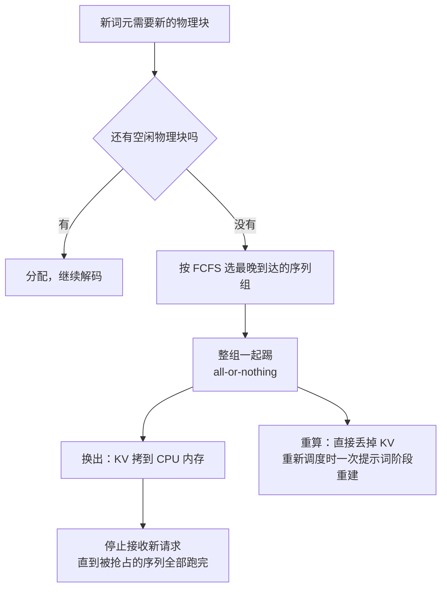
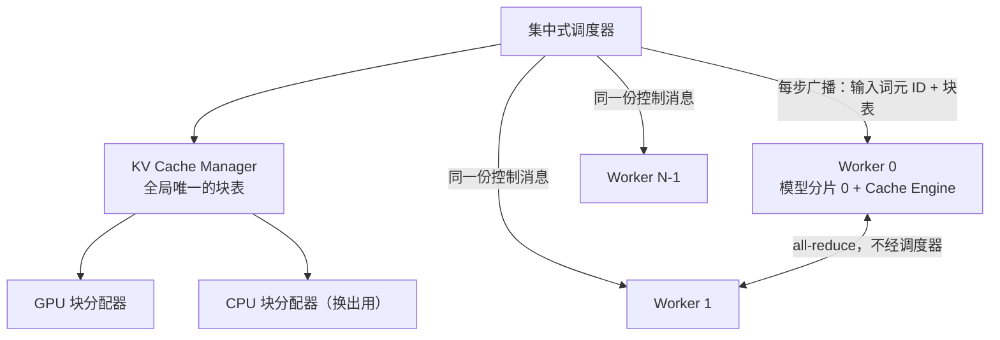

# PagedAttention：LLM 服务的吞吐瓶颈不在算力，在被浪费掉的 KV Cache

<!-- release-date: 2023-06-19 -->

> 本文依据 **Efficient Memory Management for Large Language Model Serving with PagedAttention**，arXiv:2309.06180v1，2023-09-12，共 16 页；版式已是 SOSP '23 的会议模板，页脚印有 DOI 10.1145/3600006.3613165。页码均指这份 PDF 自己的 1–16，不是 ACM 论文集的页码。作者 Woosuk Kwon、Zhuohan Li（两人同等贡献）、Siyuan Zhuang、Ying Sheng、Lianmin Zheng、Cody Hao Yu、Joseph E. Gonzalez、Hao Zhang、Ion Stoica；Ying Sheng 同时属 UC Berkeley 与 Stanford，Cody Hao Yu 为独立研究者，Hao Zhang 属 UC San Diego，其余作者都属 UC Berkeley（PDF p.1）。全文把三件事分开标注：**论文明确写了什么**、**我们如何解释它**、**哪些是外部资料补充**。

这是 vLLM 的论文。它讲的是 **2023 年这篇论文写了什么**；今天的 vLLM 与它差别很大，凡是「vLLM 现在如何」的说法，一律放在文末「论文之后」一节，并给官方来源。

## 读前先把几个词说成人话

这篇论文的门槛不在数学，而在它同时用了机器学习和操作系统两套词汇。

- **Token（词元）**：模型处理文本的最小单位，一个英文单词、一个汉字、一个标点都可能是一个词元。
- **KV Cache（键值缓存）**：模型每读进一个词元，就在每层注意力里算出一对向量（Key 和 Value）。生成下一个词元时要回看全部历史，所以把它们留在显存里，不每步重算。它是本文的主角。
- **提示词阶段与生成阶段**：一次请求先把整段提示词一起算完（矩阵乘矩阵，GPU 吃得饱），再逐个生成输出词元（矩阵乘向量，算力闲着）（PDF p.3）。今天常叫 Prefill 与 Decode。
- **批处理（batching）**：多个请求共用一次权重读取。生成阶段单条请求用不满 GPU，只有批得够大，搬权重的开销才能被摊薄。
- **迭代级调度（iteration-level scheduling）**：Orca 的做法，每算完一步就把完成的请求移出批、把新请求补进来。今天常叫连续批处理（continuous batching）。
- **分页（paging）**：操作系统的经典手法。把内存切成固定大小的页，让程序看到的连续地址映射到物理上分散的页。本文整篇都在做这个类比。
- **写时复制（copy-on-write，COW）**：多方共享同一块数据，只有某一方要改它时才复制一份私有的。

KV Cache 与 PagedAttention 的通用原理在知识库的 KVCache、PagedAttention 两篇；这里只讲这份 PDF。

## 一句话先说清

> **在 LLM 服务里，批不大不是因为算力不够，而是因为显存被 KV Cache 的坏排布吃光了。把 KV Cache 从「每个请求一整段连续数组」改成「一堆固定大小的小块加一张块表」，批就能变大，吞吐跟着上来。**

论文的两件东西要分开记：**PagedAttention** 是一个能读非连续 KV 块的注意力算法；**vLLM** 是在它之上搭的服务引擎，负责块的分配、共享、抢占和分布式执行（PDF p.2）。摘要的结论是：在同样延迟水平下，vLLM 相对 FasterTransformer 与 Orca 把吞吐提高 **2–4×**，序列越长、模型越大、解码算法越复杂，提升越明显（PDF p.1）。

### 一条阅读路线

1. **p.1–2 Figure 1、Figure 2**：显存花在哪、KV 显存有多少在空转。
2. **p.4 第 3 节与 Figure 3**：三种浪费，以及为什么共享做不到。
3. **p.5–6 第 4.1–4.3 节与 Figure 5–7**：分块注意力、块表、一次解码怎么走。
4. **p.6–8 第 4.4 节与 Figure 8–10**：并行采样、束搜索、共享前缀的写时复制。
5. **p.8–9 第 4.5–4.6 节**：抢占与恢复、张量并行下的一份块表。
6. **p.9–13 第 6–7 节**：端到端实验、块大小与恢复方式的消融。
7. **p.13 第 8 节**：作者自己说这套类比在哪里成立、在哪里不成立。

## 先看矛盾：一张 A100 上，显存到底怎么被花掉的

Figure 1 左图（PDF p.1）是在一张 40GB 的 A100 上服务 13B 模型的显存分布：**权重**约占 65%（26GB），服务期间一直不动；**KV Cache** 占 30% 以上，随每个请求动态分配和释放；剩下一小块是用完就丢的激活值。权重是固定成本，激活很小，所以 **能批多少个请求，几乎完全取决于 KV Cache 管得好不好**（PDF p.1–2）。

为什么非批大不可？因为生成阶段每步只进一个词元，用的是矩阵乘向量，「严重欠用 GPU 算力，成为访存受限，并占掉单个请求的大部分延迟」（PDF p.3）。批里的请求共用同一份权重，批越大，搬权重的开销被摊得越薄（PDF p.3）。

### 调度的那一半，Orca 已经解决了

朴素批处理有两个硬伤：请求到达时间不同，要么早到的等晚到的，要么晚到的排长队；请求长度差得很远，凑成矩形张量要做 padding，白白浪费算力和显存（PDF p.3）。细粒度批处理（cellular batching 与 Orca 的迭代级调度）以一步前向为调度单位，每步都能移出完成的请求、补进新请求，配合专用 kernel 也不再需要 padding（PDF p.3）。

这划定了本文的战场。论文第 3 节开头说得很直白：细粒度批处理让请求能更灵活地组批，但能批多少仍受 GPU 显存卡着，尤其是 KV Cache 那部分，**服务系统的吞吐是访存受限的**（PDF p.4）。相关工作一节把两者的关系概括为 **互补**：Orca 靠调度与交错让更多请求并行，vLLM 靠提高显存利用率让更多请求的工作集装进显存；而且正是 Orca 这种细粒度交错让显存管理更难，vLLM 的技术才更必要（PDF p.13）。

**我们如何解释它**：一个优化解决了旧瓶颈，往往会把下一个瓶颈推得更尖锐。先有迭代级调度，显存才成了显眼的墙。

### KV Cache 到底有多大

论文给了一笔账（PDF p.4）。对 OPT-13B，单个词元的 KV Cache 是：

$$
2 \times 5120 \times 40 \times 2\ \text{Bytes} = 800\ \text{KB}
$$

2 是 Key 和 Value 两份，5120 是隐藏维，40 是层数，最后的 2 是 FP16 每个数的字节数。OPT 最长生成 2048 个词元，所以 **单个请求的 KV Cache 最多要 1.6 GB**。当时的 GPU 显存只有几十 GB，就算全给 KV Cache，也只装得下几十个请求（PDF p.4）。论文还指出，从 A100 到 H100 算力涨到 2 倍以上，显存上限仍是 80GB，所以显存会越来越成为瓶颈（PDF p.4）。

## 第二层矛盾：装得下的显存，还有一大半在空转

旧系统的问题不只是 KV 大，而是 **它有一大半根本没在存数据**。

根源是一条不起眼的技术约束：当时深度学习框架里的算子大多要求张量存放在连续内存上，所以 FasterTransformer、Orca 这类系统把一个请求的 KV Cache 存成一整个连续张量（PDF p.2、p.4）。可输出多长事先不知道，只能按 **最大可能长度** 预先划一整段。

这张图按 Figure 3 重画（PDF p.4）。三种浪费的性质不同：

| 浪费类型 | 它是什么 | 什么时候知道它被浪费了 |
|---|---|---|
| **预留（reserved）** | 以后真的会被写入，但在此之前一直占着位置 | 会被用上，但整个请求期间都挡着别人 |
| **内部碎片（internal fragmentation）** | 按最大长度预分配，多出来的槽永远不会被用 | 请求生成结束后才知道 |
| **外部碎片（external fragmentation）** | 各请求预分配的大小不同，分配器（如 buddy）在段之间留下的空隙 | 服务之前就知道，永远不会用来存词元 |

后两种是纯浪费；预留最终会被用上，但它占着的空间本可以先给别的请求（PDF p.4）。压缩整理（compaction）理论上能对付碎片，但 KV 太大，在性能敏感的服务里做不起，而且每个请求的预留段照样挡住了共享（PDF p.5）。

浪费有多严重，Figure 2 在第 6.2 节的实验里量过（PDF p.2）：

| 系统 | 真正存词元 | 预留 | 内部碎片 | 外部碎片及其他 |
|---|---:|---:|---:|---:|
| Orca (Max) | 20.4% | 13.3% | 57.3% | 8.9% |
| Orca (Pow2) | 26.8% | 17.9% | 13.6% | 41.6% |
| Orca (Oracle) | 38.2% | 25.2% | — | 36.6% |
| vLLM | 96.3% | 细条 | 细条 | 细条 |

vLLM 那一列剩下的约 3.7% 在原图上是几条细线，没标数字。Orca 的三档是作者自己实现的对照（见「实验怎么证明」）：Max 一律按 2048 预留，Pow2 最多超额 2 倍，Oracle 假设事先知道真实输出长度。

**我们如何解释它**：最该看的是 Oracle 那一行。即使事先知道每个请求会生成多长、没有内部碎片，也只有 38.2% 的 KV 显存在存真东西。问题不只是「输出长度预测不准」，而是「按请求整段连续分配」这个模式本身就有结构性浪费。

### 还有第三层：想共享也共享不了

LLM 服务里有大量天然可共享的 KV。同一个提示词采样多个候选，提示词那段的 KV 完全一样，在论文实验里占总 KV 显存的 12%；束搜索（beam search）的候选之间能共享的更多，最多能省 55% 显存（PDF p.4）。但每个序列各占一段连续空间，谁也没法指向谁，共享做不到（PDF p.2）。

## 类比登场：把 KV Cache 当虚拟内存来管

操作系统几十年前就遇到过同一个问题：程序要连续的地址空间，物理内存是碎的、要动态分配的，还想在进程之间共享。它的答案是虚拟内存与分页。论文的映射写得很干净（PDF p.2）：

> 块（block）对应页（page），词元对应字节（byte），请求对应进程（process）。

一旦接受这个映射，三层矛盾一起被解掉（PDF p.2）：

- **内部碎片**：块比较小，而且按需分配，浪费最多只有最后一块里的空位；
- **外部碎片**：所有块一样大，分配器不会留下大小对不上的空隙；
- **共享**：可以在块这一粒度上，让同一请求的不同序列、甚至不同请求共享 KV。

但要真正做到，光改内存管理不够：**注意力算子必须能读非连续的 KV**。这就是 PagedAttention 这个名字的来历。

## PagedAttention：把注意力改成「按块算」

标准注意力是这样的（PDF p.3，式 3）：

$$
a_{ij} = \frac{\exp\left(q_i^\top k_j/\sqrt{d}\right)}{\sum_{t=1}^{i}\exp\left(q_i^\top k_t/\sqrt{d}\right)},
\qquad
o_i = \sum_{j=1}^{i} a_{ij} v_j
$$

当前位置 $i$ 的 Query 向量 $q_i$ 与前面每个位置的 Key 向量 $k_j$ 做点积，除以 $\sqrt{d}$ 防止数值随维度变大而失控，softmax 归一化后对 Value 向量加权求和。下标 $j$ 从 $1$ 跑到 $i$，实现上默认这些 $k_j$ 是一段连续内存。

PagedAttention 把序列按固定的 **块大小** $B$ 切开，第 $j$ 块的 Key 与 Value 记作（PDF p.5）：

$$
K_j = (k_{(j-1)B+1},\ \dots,\ k_{jB}),
\qquad
V_j = (v_{(j-1)B+1},\ \dots,\ v_{jB})
$$

注意力于是变成按块计算（PDF p.5，式 4）：

$$
A_{ij} = \frac{\exp\left(q_i^\top K_j/\sqrt{d}\right)}{\sum_{t=1}^{\lceil i/B\rceil}\exp\left(q_i^\top K_t \mathbf{1}/\sqrt{d}\right)},
\qquad
o_i = \sum_{j=1}^{\lceil i/B\rceil} V_j A_{ij}^\top
$$

拆开只有三件事：

1. $q_i^\top K_j$ 一次算出当前 Query 与第 $j$ 块里全部 $B$ 个 Key 的相关度，$A_{ij}$ 是长度为 $B$ 的行向量；
2. 分母里的 $\mathbf 1$ 是全 1 向量，把第 $t$ 块内的 $B$ 个指数值加起来，再对所有块求和，所以归一化的分母仍是整条序列的，softmax 的语义没有变；
3. 求和上限从 $i$ 变成 $\lceil i/B\rceil$，循环单位从「一个词元」变成「一个块」。

运行时 kernel 逐块取、逐块算：用「forth」的 Query 先乘第 0 块「Four score and seven」的 Key 得到这一块的分数，再乘这一块的 Value；三个块在物理显存里完全不必相邻（PDF p.5，Figure 5）。

**我们如何解释它**：这个变换只改了求和的组织方式和数据的存放位置，没有丢掉任何一项，所以它和稀疏注意力、线性注意力是两回事：后者改变模型算什么，PagedAttention 只改变显存怎么放。论文说「完全不影响模型精度」（PDF p.2），依据是这层数学等价，论文没有给精度对照实验；严格说分块会改变浮点求和的顺序，逐位结果未必相同，论文没有讨论这一点。

**两个阅读提示**：第 3 页写「除了式 4 中的计算，其余组件都是逐位置的」，第 5 页写「式 4 中的注意力计算可以变换成下面的分块计算」，两处指的都应该是式 3，是编号笔误（PDF p.3、p.5）。第 5 页脚注 1 交代了一个实现选择：一个词元在每层、每个头上都有自己的 K/V，可以全塞进同一个 KV 块，也可以每层、每个头各有独立的块和块表；两种设计没有性能差别，vLLM 选了后者，因为实现更简单（PDF p.5）。

## KV Cache Manager：逻辑块、物理块、块表

有了能读非连续块的算子，剩下的是管理层，几乎照搬操作系统（PDF p.5–6）：

- 每个请求的 KV Cache 表示为一串 **逻辑 KV 块**，从左到右依次填满；最后一块没填满的位置留给后续生成。
- GPU 上的 block engine 一次性申请一大段连续显存，切成等大的 **物理 KV 块**；CPU 内存上也切一份，留给换出用。
- **块表（block table）** 记录每个逻辑块对应的物理块，以及这一块已经填了几个位置。

这是 Figure 6 的例子（PDF p.6）：7 个词元的提示词只占 2 个逻辑块，而不是按最大长度预留一整段。提示词阶段用的是常规注意力算子（论文举 FlashAttention 为例），算出的 KV 直接写进块里；从第一次解码开始才用 PagedAttention 读块（PDF p.6）。

全局上，每一步 vLLM 先选出这一批要跑的序列，为新需要的逻辑块分配物理块，再把本步所有输入词元（提示词阶段请求的全部提示词、生成阶段请求的最新词元）拼成一条序列喂给模型（PDF p.6）。Figure 7 画了两个请求的逻辑块交错落在同一片物理块池里，彼此相邻的逻辑块在物理上都不必相邻（PDF p.6）。

块总是从左往右填满才开新块，所以 **一个请求的浪费被限制在最后一块之内**，这就是 Figure 2 里 96.3% 的来源（PDF p.6）。块大于 1 还有一个好处：kernel 能同时处理更多位置，提高硬件利用率；代价是块越大碎片越多（PDF p.6）。

**可迁移启发**：把「逻辑视图」和「物理布局」分开，是解决「大小不可预测、又必须看起来连续」的资源分配的通用套路。它不只省了碎片，还顺手买到了共享（多个逻辑块指同一个物理块）和迁移（换一个物理块而逻辑视图不变）。

## 共享与写时复制：分页真正的红利

分页的最大收益不在省碎片，而在让共享变得便宜。论文展开了四个场景（PDF p.6–8）。

### 并行采样

同一个提示词采样多个答案，是编程助手里的常见用法（PDF p.6）。Figure 8 里两个样本的逻辑块 0、1 都映射到物理块 7 和 1，于是每个物理块带一个 **引用计数**，这里都是 2（PDF p.7）。

两个样本生成时会岔开，所以在块粒度上做写时复制（PDF p.7）：

- 样本 A1 要写它的最后一个逻辑块（对应物理块 1），系统发现引用计数大于 1，于是新分配物理块 3，让 block engine 把物理块 1 的内容拷过去，并把物理块 1 的引用计数减到 1；
- 随后样本 A2 再写物理块 1 时，计数已经是 1，直接原地写。

结果是除了最后一个逻辑块，提示词的 KV 全部共享，提示词越长省得越多（PDF p.7）。

### 束搜索

束搜索按束宽 $k$ 每步保留概率最高的 $k$ 个候选（PDF p.7）。它不仅共享提示词，候选之间还共享已生成的公共部分，而且共享关系随解码不断变化，论文把它比作操作系统里复合 fork 出的进程树（PDF p.7）。

Figure 9 是 $k=4$ 的例子（PDF p.7）：虚线之前，每个候选各用了 4 个满块，全部共享块 0（提示词），候选 3 从第二块起就分岔，候选 0–2 共享前 3 块。下一步的 top-4 全部来自原候选 1 和 2，原候选 0 和 3 的逻辑块被释放；引用计数归零的物理块 2、4、5、8 被回收，再分配物理块 9–12 存新候选的 KV。此后所有候选共享块 0、1、3，候选 0 与 1 共享块 6，候选 2 与 3 共享块 7。

旧系统在这里要频繁整段拷贝 KV：候选 3 要继续，就得把候选 2 的一大段 KV 复制一份。vLLM 里绝大多数块是共享的，写时复制只在「新生成的词元恰好落进一个仍被共享的旧块」时触发，而且只拷一个块（PDF p.7）。

### 共享前缀

系统提示词、few-shot 示例这类长前缀会出现在大量请求里（PDF p.7–8，Figure 10 以机器翻译为例）。论文的方案是：**服务商预先指定一组共享前缀，为它们预留一批物理块**，就像操作系统在进程之间共享库那样；带这个前缀的用户请求把自己的逻辑块直接映射到这些缓存的物理块上（最后一块标成写时复制），提示词阶段只需要算用户自己那段输入（PDF p.8）。

**这一点最容易被今天的读者误读**：论文里的共享前缀是服务商 **手工预定义** 的，不是按内容哈希自动命中的缓存。今天 vLLM 默认开启的「自动前缀缓存」，论文里没有，见文末「论文之后」。

### 混合解码

不同请求可以用不同解码方式，同时批在一起。原因是块表这一层把复杂的共享关系全藏起来了：模型和 kernel 只看到每个序列的一串物理块号，不需要知道谁和谁共享（PDF p.8）。

**可迁移启发**：想让上层支持任意组合时，找一个足够窄的中间表示，让下层只看见它。vLLM 的窄接口就是「一串物理块号」。

## 调度与抢占：显存不够时先牺牲谁

分页让显存用得更满，但总有装不下的时候。vLLM 对所有请求用先到先服务（FCFS），要抢占时，最晚到的最先被抢（PDF p.8）。抢占要回答两个问题：踢哪些块，被踢的怎么恢复。

按第 4.5 节重画（PDF p.8），是机制示意，不含实测时间。

**为什么是 all-or-nothing**：操作系统的换页要靠启发式猜哪一页最久不会再用。这里不用猜：一个序列的所有块每一步都会被一起访问，所以要么全踢、要么都不踢（PDF p.8）。同一个请求里可能互相共享块的多个序列（比如束搜索的候选）被打包成一个 **序列组**，整组一起抢占、一起恢复（PDF p.8）。

**换出（swapping）**：目标是 CPU 内存而不是磁盘，由 CPU 块分配器管理。被换出的块数永远不会超过 GPU 上物理块的总数，所以 CPU 侧的交换空间以分给 KV 的 GPU 显存为上界（PDF p.8）。

**重算（recomputation）**：直接丢掉 KV，重新调度时再算。重算可以比原始生成快得多，因为已经生成的词元可以和原提示词拼成一条新提示词，一次提示词阶段就把所有位置的 KV 重建出来，这是并行的矩阵乘矩阵，而不是逐词元的自回归（PDF p.8）。

还有一条被一笔带过的策略：**一旦发生抢占，vLLM 就停止接收新请求，直到被抢占的序列全部完成**（PDF p.8）。论文没有量化它在过载时的代价。

两种恢复方式的取舍在消融里测过，见「消融」一节的 Figure 19。

## 分布式执行：一份块表，多个 worker

模型放不进一张卡时，vLLM 用 Megatron-LM 式的张量并行，注意力按头切开，每个进程负责一部分头（PDF p.8–9）。

关键观察是：即使模型被切开，每个分片处理的输入词元集合是一样的，需要的是同样位置的 KV。所以 vLLM 只在集中式调度器里保留 **一份** KV Cache Manager 和块表，所有 worker 共用；每个 worker 只存自己那几个头的 KV，但物理块号相同（PDF p.9）。

按 Figure 4 与第 4.6 节重画（PDF p.5、p.9），是机制示意。

每一步：调度器把这一批的输入词元 ID 和每个请求的块表打包成控制消息广播给所有 worker；worker 按块表读 KV、跑模型，中间结果用 all-reduce 同步，不需要调度器参与；最后把本步采样出的词元送回调度器（PDF p.9）。论文的总结是：**worker 之间不需要就内存管理做任何同步**，因为每步开始时它们就拿到了全部内存管理信息（PDF p.9）。

**可迁移启发**：控制面集中，数据面分散。只要控制信息能在一次广播里说完，分布式一致性问题就基本消失。

## 实现：一万行出头，只有热点下沉到 CUDA

- **规模**（PDF p.9）：前端是 FastAPI，接口扩展自 OpenAI API，可以按请求指定采样参数、最大长度和束宽 $k$；引擎 **8.5K 行 Python + 2K 行 C++/CUDA**；调度器与块管理器用 Python 写，只有 PagedAttention 这类关键算子是自定义 CUDA kernel；模型执行基于 PyTorch 与 Transformers，多卡通信用 NCCL。
- **三个 kernel**（PDF p.9）：①融合 reshape 与写块：每层新算出的 KV 切块、重排成利于按块读的布局、按块表写到指定位置，三步合成一个 kernel，省启动开销。②融合读块与注意力：改造 FasterTransformer 的注意力 kernel，按块表边读边算；为保证访存合并，一个 warp 读一个块，并支持同一批里不同的序列长度。③融合块拷贝：写时复制触发的拷贝常落在不连续的块上，逐个调 `cudaMemcpyAsync` 会变成大量小拷贝，于是把不同块的拷贝批进一次 kernel 启动。
- **三个动词**（PDF p.9）：所有解码算法都用 `fork`（从已有序列派生新序列）、`append`（给序列追加新词元）、`free`（删除序列）拼出来。并行采样就是从输入序列 `fork` 出多个输出序列，每步 `append`，命中停止条件就 `free`；束搜索和共享前缀用同一套。作者认为未来的解码算法也能靠这三个动词组合出来。

**可迁移启发**：先确定哪些代码每步要跑成千上万次，只有那部分才值得写 kernel；接口先找最小动作集合，复杂策略在上面拼装。

## 实验怎么证明

### 设定

**模型与硬件**（PDF p.9–10，Table 1）：OPT 的 13B、66B、175B，外加 LLaMA-13B 用于共享前缀实验；全部跑在 GCP 带 A100 的 A2 实例上。

| 模型 | GPU | 总显存 | 权重 | 留给 KV Cache | 最多 KV 槽位 |
|---|---|---:|---:|---:|---:|
| 13B | 1×A100 | 40 GB | 26 GB | 12 GB | 15.7K |
| 66B | 4×A100 | 160 GB | 132 GB | 21 GB | 9.7K |
| 175B | 8×A100-80GB | 640 GB | 346 GB | 264 GB | 60.1K |

**负载**（PDF p.9–10）：用 ShareGPT（用户分享的 ChatGPT 对话）和 Alpaca（GPT-3.5 用 self-instruct 生成的指令数据）的输入输出长度 **合成** 请求。Figure 11 的均值：ShareGPT 输入 161.31、输出 337.99 个词元；Alpaca 输入 19.31、输出 58.45。ShareGPT 的输入平均长 8.4 倍、输出长 5.8 倍，方差也更大。数据集没有时间戳，到达时间用泊松过程生成。

**基线**（PDF p.10）：

- **FasterTransformer**：一个为延迟高度优化的分布式推理引擎，本身没有调度器，作者配了一个类似 Triton 的动态批处理调度器，批上限按显存尽量设大。
- **Orca**：当时不开源，**作者自己实现了一个版本**，假定它用 buddy 分配器存 KV，分三档：Oracle 预知真实输出长度（不可实现的上界）、Pow2 最多超额预留 2 倍、Max 一律按最大长度 2048 预留。

**指标**（PDF p.10）：归一化延迟，即每个请求的端到端延迟除以它的输出长度，再对所有请求取平均。多数实验跑 1 小时的轨迹，175B 因为成本只跑 15 分钟。

### 结果：每个倍数的分母

| 倍数 | 比的是什么 | 模型 / 负载 | 对照 | 出处 |
|---|---|---|---|---|
| 2–4× | 同等延迟水平下的吞吐（摘要口径） | OPT 三档，两个数据集 | FasterTransformer 与 Orca | PDF p.1、p.13 |
| 1.7–2.7× | 延迟相近时能扛的请求率 | OPT 三档，ShareGPT | Orca (Oracle) | PDF p.11 |
| 2.7–8× | 同上 | OPT 三档，ShareGPT | Orca (Max) | PDF p.11 |
| 最高 22× | 同上 | ShareGPT | FasterTransformer | PDF p.11 |
| 2.2× / 4.3× | 同一时刻批里的请求数 | OPT-13B，ShareGPT | Orca (Oracle) / Orca (Max) | PDF p.11，Figure 13a |
| 1.3× 到 2.3× | 相对请求率，从基础采样到束宽 6 | OPT-13B，Alpaca | Orca (Oracle) | PDF p.11 |
| 1.67× / 3.58× | 吞吐，共享前缀 1 个示例 / 5 个示例 | LLaMA-13B，WMT16 英译德 | Orca (Oracle) | PDF p.12 |
| 2× | 请求率 | OPT-13B，聊天机器人 | 三档 Orca | PDF p.12 |

Figure 12 的曲线形状是：请求率升高时归一化延迟先缓慢上升，一旦超过系统容量，队列无限增长，延迟突然爆炸（PDF p.11）。「延迟不变时扛更高请求率」指的就是这个爆炸点右移。FasterTransformer 输得最多，是因为它没有细粒度调度，显存管理又和 Orca (Max) 一样低效（PDF p.11）。

吞吐提升的因果链在 Figure 13 上闭合（PDF p.10）：

| 负载 | Orca (Max) | Orca (Pow2) | Orca (Oracle) | vLLM |
|---|---:|---:|---:|---:|
| ShareGPT，2 req/s | 7.00 | 9.81 | 13.62 | 30.42 |
| Alpaca，30 req/s | 7.00 | 43.24 | 72.75 | 132.44 |

表里是 OPT-13B 上平均同时在批的请求数。省显存 → 批更大 → 权重搬运被摊薄 → 吞吐上去。

### 共享省下的显存，完全取决于负载里有多少重复

Figure 15 直接量了共享省下的块数占「不共享时总块数」的比例（PDF p.11），OPT-13B、Alpaca：

| 场景 | 参数 = 2 | 参数 = 4 | 参数 = 6 |
|---|---:|---:|---:|
| 并行采样（输出序列数） | 6.09% | 8.53% | 9.79% |
| 束搜索（束宽） | 37.56% | 53.13% | 55.16% |

同样的实验换到 ShareGPT，并行采样省 16.2%–30.5%，束搜索省 44.3%–66.3%（PDF p.11）。

**我们如何解释它**：Alpaca 的提示词平均只有 19 个词元，能共享的绝对量本来就小；ShareGPT 平均 161 个，共享收益立刻放大。分页省的是碎片，共享省的是重复；后者完全取决于你的负载里有多少重复。

### 两个更贴近产品的场景

**共享前缀**（PDF p.12，Figure 16）：多语言的 LLaMA-13B，WMT16 英译德。前缀里放指令加翻译示例：1 个示例、80 个词元时，吞吐是 Orca (Oracle) 的 1.67 倍；5 个示例、341 个词元时是 3.58 倍。前缀越长，省下的提示词计算越多。

**聊天机器人**（PDF p.12，Figure 17）：把对话历史和当前问题拼成提示词，用 ShareGPT 合成。受 OPT-13B 上下文长度所限，提示词截到最后 1024 个词元，最多再生成 1024 个。vLLM 比三档 Orca 都高 2 倍请求率；三档 Orca 表现几乎一样，因为提示词几乎总是 1024 个词元，buddy 分配器不管怎么预测输出长度，都会为输出预留 1024 个位置。

这个实验里有一句设定要单独拎出来（PDF p.12）：

> 论文明确说，它 **不在对话轮次之间保存 KV Cache**，因为那样会在两轮之间占住别的请求要用的空间。

在 2023 年，这是合理的取舍：没有自动前缀缓存、没有分层存储，留着 KV 就是纯占位。今天多轮对话的 KV 复用几乎是推理服务的标配。同一个判断在两代基础设施下结论相反，别把论文的实验设定当成永恒结论。

### 论文自己给出的反例

第 6.2 节写了一个收益变小的场景（PDF p.11）：OPT-175B + Alpaca（Figure 12f），vLLM 相对 Orca (Oracle) 与 Orca (Pow2) 的优势明显变小。原因是 175B 的配置留了 264 GB 给 KV，而 Alpaca 的序列又特别短，Orca 也能批很多请求，**系统从访存受限变成了算力受限**。一旦瓶颈不在显存，省显存就不再产生收益。

## 消融：分页不是免费的

### 注意力 kernel 慢了 20%–26%

因为要访问块表、多走分支、处理变长序列，**PagedAttention 的注意力 kernel 比高度优化的 FasterTransformer 实现慢 20%–26%**（PDF p.12，Figure 18a）。作者的辩护是：这只影响注意力算子，不影响 Linear 等其他算子，而端到端上 vLLM 仍大幅领先（PDF p.12）。

**我们如何解释它**：这就是这套设计的本质交易，用单算子的一点效率换整个系统能批更多请求。只有在访存受限、批大小是瓶颈的场景里，这笔交易才划算；上面 175B + Alpaca 的反例就是交易不划算的边界。

### 块大小

块大小是这套设计唯一的核心旋钮（PDF p.12）：太小，kernel 读、处理 KV 时用不满 GPU 并行度；太大，内部碎片变多，共享的概率也下降，因为共享是按块判定的。Figure 18b 在固定请求率下测了端到端延迟：ShareGPT 上 16 到 128 都最好；Alpaca 上 16 和 32 表现好，更大就明显退化，因为序列本身比块还短。**vLLM 因此把默认块大小定为 16**：够大，能用满 GPU；够小，多数负载上不会产生明显内部碎片（PDF p.12）。

### 换出还是重算

第 7.3 节（PDF p.13）：块小时换出很差，因为会变成大量小块的 CPU↔GPU 传输，吃不满 PCIe 带宽；重算不碰 KV 块，开销与块大小无关。所以块小时重算更好，块大时换出更好；块大小在 16 到 64 之间时，两者端到端表现相当。

原文还有一句「重算的开销从不超过换出延迟的 20%」。按 Figure 19a 的读数，块大小为 256 时重算约 39 ms、换出约 33 ms，重算反而更慢；这句话只能读成「重算最多比换出慢 20%」，不能读成「重算只有换出的五分之一」（本文读图）。

## 类比在哪里断了

论文在讨论一节自己承认，这不是一次照搬（PDF p.13）。对得上的部分：

| 操作系统 | vLLM | 说明 |
|---|---|---|
| 页 | KV 块 | 固定大小，消除外部碎片 |
| 字节 | 词元 | 块内的最小单位 |
| 进程 | 请求 | 拥有独立逻辑地址空间的实体 |
| 页表 | 块表 | 逻辑到物理的映射 |
| 按需分页 | 按需分配物理块 | 不预留全部空间 |
| fork 与写时复制 | 引用计数与块级写时复制 | 从共享到分岔的过渡 |
| 共享库 | 预定义的共享前缀 | 多个请求映射同一段只读内容 |

论文点名的三处「利用应用语义」的改造（PDF p.13）：

1. **all-or-nothing 换出**：处理一个请求需要它的全部词元状态都在 GPU 上，所以不必像操作系统那样逐页猜。
2. **重算**：丢掉的块可以从词元重新算出来，这在操作系统里不可行。
3. **把访存 kernel 与注意力等计算 kernel 融合**，以此抵消分页带来的间接寻址开销。

**我们如何解释它**（以下是本文的推理，依据是第 4.5 节与第 8 节）：

- **没有换页到磁盘**。换出只到 CPU 内存，而且总量以 GPU 上的 KV 显存为上界（PDF p.8）。它不是为了扩展地址空间，只是为了缓一口气。
- **没有 MMU 和 TLB**。操作系统的地址翻译有专门硬件，几乎零成本；vLLM 的间接寻址是软件的，只能靠 kernel 融合来摊，仍留下 20%–26% 的注意力 kernel 开销（PDF p.12）。
- **块的绝对大小完全不同**。操作系统的页通常 4KB；按论文给的 OPT-13B 每词元 800 KB 算，16 个词元的块约 12.8 MB，是一个页的三千多倍（本文推算）。这带来两个方向相反的后果：块表极小，2048 个词元只需 128 条记录；但每个请求最后那块没填满的空位，浪费的是以 MB 计的显存，所以块大小不能像页大小那样随手往上调。
- **KV 是可再生的派生数据**。这是类比里最有价值的一处不对称：内存页丢了就是丢了，KV 可以从词元重建，而且重建是并行的。

论文还划了适用边界（PDF p.13）：这套方法有效，是因为 LLM 服务同时满足「输出长度事先不知道，必须动态分配」和「性能受显存容量约束」。深度学习训练里张量形状通常是静态的，可以提前规划；非 LLM 的模型服务多是算力受限，提高显存效率不会带来性能提升，在那些场景里引入这套机制反而可能因为间接寻址和非连续访存而变慢。

## 它和 FlashAttention、FlexGen、Orca 不是一回事

论文在相关工作里做了区分（PDF p.13–14）：

| 工作 | 它优化的对象 | 与本文的关系 |
|---|---|---|
| Orca | 迭代级调度，让更多请求并行处理 | 互补。见前文（PDF p.13） |
| FlashAttention | 用分块与 kernel 优化降低注意力计算的峰值显存与 IO | 正交。vLLM 在提示词阶段就用常规注意力算子（论文举例 FlashAttention）（PDF p.6、p.14） |
| FlexGen | 显存有限时把权重和词元状态换出，跑 LLM 推理 | 论文说它不面向在线服务（PDF p.13–14） |
| OLLA | 优化张量的生命周期与放置以减少碎片 | 论文说它不做细粒度的块级管理，也不面向在线服务（PDF p.14） |

换出、重算以及两者的结合早就被用来降低训练的峰值显存（PDF p.13）。论文自认的新东西是：**在在线服务场景里做块级的显存管理**（PDF p.14）。

一句话记法：FlashAttention 让一次注意力算得更省，PagedAttention 让很多次注意力的历史存得更省。前者在算子内部，后者在系统层，实际部署里总是一起用。

## 论文写了什么、没写什么

**被实验托住的：**

- 旧系统只有 20.4%–38.2% 的 KV 显存在存真实词元，vLLM 是 96.3%（Figure 2）；
- 更高的显存利用率变成更大的批和更高的请求率（Figure 12、13）；
- 共享在并行采样与束搜索上省下的显存，以及它随负载的变化（Figure 15）；
- 注意力 kernel 慢 20%–26%，块大小 16 是多数负载上的折中，换出与重算在块大小 16–64 相当（Figure 18、19）。

**只是结构性论证、没有实验的：**

- 「完全不影响模型精度」，依据是式 4 与式 3 的数学等价（PDF p.2、p.5）；
- 未来的解码算法都能由 `fork`、`append`、`free` 组合出来（PDF p.9）。

**论文自己承认的限制：**

- 注意力 kernel 比 FasterTransformer 慢 20%–26%（PDF p.12）；
- 抢占后停止接收新请求，直到被抢占的序列全部完成，代价没有量化（PDF p.8）；
- 算力受限的负载上收益会消失，甚至可能变慢（PDF p.11、p.13）；
- 块大小要按负载调，没有普适最优（PDF p.12）。

**这篇 2023 年的论文里没有的东西**（不要从今天的 vLLM 倒推回去）：

- **自动前缀缓存**。共享前缀要服务商预先指定并预留物理块（PDF p.8），没有内容哈希、没有跨请求自动命中。
- **跨轮复用 KV**。聊天实验明确不在轮次间保存 KV（PDF p.12）。
- **KV 卸载到磁盘或远端**。换出的唯一目标是 CPU 内存，而且总量有界（PDF p.8）。
- **PD 分离与分块预填充**。提示词阶段与生成阶段在同一个引擎、同一个批里跑（PDF p.6）。
- **量化与 MQA、GQA、MLA 这类缩小 KV 的架构手段**。全文按 FP16 算显存（PDF p.4），只管显存怎么放，不碰模型结构。
- **流水线并行、专家并行、跨节点部署**。分布式一节只讲了 Megatron-LM 式的张量并行（PDF p.8–9）。
- **优先级、公平性、SLO 调度**。只有 FCFS（PDF p.8）。

## 论文之后：今天的 vLLM 已经不是这篇论文了

**下面整节都是外部资料补充，来自 vLLM 官方文档、官方博客与官方仓库的 RFC，不是论文内容。**

### 自动前缀缓存默认开启

论文的共享前缀要人工预定义。vLLM 后来加了基于哈希的自动前缀缓存。[vLLM V1 发布博客](https://vllm.ai/blog/2025-01-27-v1-alpha-release)（2025-01-27）写明：V0 里开启前缀缓存有时会带来明显的 CPU 开销，命中率低时反而更慢，所以默认关闭；V1 把开销降到几乎为零，因此 **默认开启**。

这对读开源解读的人尤其重要：开源解读 LMCache 篇里讲的前缀哈希链、块哈希、跨实例共享，对接的是这个后来的机制，不是论文里「服务商预留物理块」的方案。两者都叫前缀共享，实现思路完全不同。

### GPU↔CPU 换出被移除

论文用第 4.5 节和第 7.3 节讨论换出与重算的取舍。vLLM 的 [V1 用户指南](https://docs.vllm.ai/en/latest/usage/v1_guide/) 把「GPU <> CPU KV Cache Swapping」列为已移除的功能，理由是新的简化核心架构不再需要用 KV 换出来处理抢占。今天的抢占恢复只剩重算一条路。这与论文自己的消融是一致的：默认块大小 16 时，两者本来就相当（PDF p.13）。

### 束搜索移出了核心调度器

论文用 Figure 9 和第 6.3 节论证了束搜索的共享收益，这是它最漂亮的结果之一。vLLM 官方 RFC [#6226](https://github.com/vllm-project/vllm/issues/6226)（2024-07-08 提出）一度提议完全去掉束搜索，理由之一是束搜索让块表每一步动态变化，迫使 model runner 与调度器同步；这个提议因社区反对被撤回。随后的 RFC [#8306](https://github.com/vllm-project/vllm/issues/8306)（2024-09-09 提出）改为把束搜索逻辑从调度器里移除，在引擎之上重新实现，每步只让引擎生成 1 个词元加对数概率，靠前缀缓存复用前面算过的 KV。论文里最能体现块级共享威力的场景，恰恰因为和调度器耦合太深，被挪到了核心之外。

### PD 分离成了实验特性

论文里提示词阶段与生成阶段在同一个引擎里混批。vLLM 官方文档今天有 [Disaggregated Prefilling](https://docs.vllm.ai/en/latest/features/disagg_prefill/) 一页，标注为实验特性：把两个阶段放进不同的 vLLM 实例，以便分别调 TTFT 与词元间延迟、控制延迟长尾。这条路线的论文见 Splitwise、DistServe、Mooncake 三篇。

### 该怎么用这篇论文

把它当作「为什么要这样管 KV Cache」的原典，而不是「vLLM 现在怎么实现」的说明书。分页、块表、逻辑与物理分离、引用计数、集中式块表配分散 worker，这些骨架都还在；共享前缀怎么命中、抢占怎么恢复、束搜索放在哪一层、两个阶段在不在同一个实例，全都换过了。

## 和本站其他文章接起来

- 分页管的是「KV 怎么放」；另一条正交的路是「让 KV 本身变小」。MLA 压缩 KV，见 DeepSeek-V2 一篇；稀疏注意力少算也少存，见 NSA 与 DeepSeek-V3.2 两篇。两类方法可以叠加。
- 这套分页假设也会被新架构撑破。DeepSeek-V4 一篇讲到，压缩 KV、索引器 KV、滑窗 KV 与未压缩尾部状态大小与更新频率都不同，已经不满足「各层缓存结构相似、每块固定词元数」的假设，于是把缓存拆成两部分。读完本篇再读那一节，能看到 2023 年的抽象在哪里被撑破。
- 把 KV 搬出单机显存、做成集群级资源，是 Mooncake 一篇和开源解读 LMCache 篇的题目。

## 可迁移启发

1. **先证明瓶颈在哪一维。** 这篇最值得学的不是分页，而是它先用 Figure 1、Figure 2 和「生成阶段访存受限」的分析证明了瓶颈在显存，再给方案（PDF p.1–4）。它也老实写了反例：175B + 短序列时变成算力受限，收益立刻缩水（PDF p.11）。
2. **把「必须连续」这类工具约束单独拎出来质疑。** 旧系统的一切浪费都来自「框架算子要求张量连续」（PDF p.2、p.4）。代价是自己写 kernel，论文写了三个（PDF p.9）。
3. **逻辑与物理分离，一次买到三个能力。** 块表同时解决了碎片、共享和迁移。前提是间接寻址的开销你摊得掉。
4. **知道访问模式，就别再猜。** 操作系统猜哪一页最久不用，vLLM 知道一个序列的块每步一起被访问，于是 all-or-nothing（PDF p.8）。在自己的系统里找找：哪些地方你其实知道答案，却还在用通用策略猜。
5. **可再生的数据不必存。** 重算之所以能和换出打平，是因为 KV 从词元派生、重建是并行的（PDF p.8、p.13）。设计缓存时先问：这份数据是原始数据还是派生数据。
6. **局部变慢换全局变快，要写清交换条件。** 注意力 kernel 慢 20%–26%，端到端却快几倍，因为批大小是瓶颈（PDF p.12）。把条件写清楚，读者才知道换个负载它会不会失效。

## 关键词回看

- **KV Cache**：已读词元的 Key / Value 缓存，随上下文线性增长，OPT-13B 每词元 800 KB。
- **PagedAttention**：按固定块读非连续 KV 的注意力算法，与标准注意力数学等价。
- **KV 块 / 块大小**：最小分配单位，vLLM 默认每块 16 个词元（PDF p.12）。
- **逻辑块 / 物理块 / 块表**：请求看到的连续视图、显存里的真实位置、两者之间的映射加已填数。
- **预留 / 内部碎片 / 外部碎片**：旧系统的三种浪费（PDF p.4）。
- **引用计数与写时复制**：共享物理块被写入时才复制，只拷一个块（PDF p.7）。
- **all-or-nothing 抢占 / 序列组**：一个序列的块要么全踢要么全留；可能互相共享的序列整组调度（PDF p.8）。
- **换出 / 重算**：两种恢复方式，块小时重算好，块大时换出好（PDF p.13）。
- **归一化延迟**：端到端延迟除以输出长度的均值，论文的主指标（PDF p.10）。
- **Orca (Oracle / Pow2 / Max)**：作者自己实现的三档对照（PDF p.10）。

## 资料与阅读边界

- **本文依据**：[arXiv:2309.06180](https://arxiv.org/abs/2309.06180) 的 v1（2023-09-12），16 页，是 arXiv 上唯一的版本。正式发表于 SOSP '23（Koblenz，2023-10-23 至 10-26），[DOI 10.1145/3600006.3613165](https://doi.org/10.1145/3600006.3613165)；arXiv 版已是会议模板，页码按 PDF 自身的 1–16 引用。
- **`release-date` 取 2023-06-19**：本文覆盖的对象包括 vLLM 这个对外可用的开源系统，按首次公开可用取值。最早的官方公开事件是 PyPI 上 `vllm` 0.0.1 的上传（[2023-06-19 08:21 UTC](https://pypi.org/pypi/vllm/0.0.1/json)，作者标注为 vLLM Team、主页指向官方仓库）；官方博客 [vLLM: Easy, Fast, and Cheap LLM Serving with PagedAttention](https://vllm.ai/blog/2023-06-20-vllm) 与 `vllm` 0.1.0 在次日。论文上传与会议日期都是后续事件，不回写。
- **图表**：Figure 3、Figure 6、Figure 19 各画了一张讲解图，前两张是机制示意、槽位数与块号取自原图，Figure 19 按原图逐点读数，是读图近似；Figure 4 与第 4.5 节改写为 Mermaid；Figure 2、13、15 与 Table 1 按 PDF 转录；Figure 5、7–10 用正文复述原图的例子；Figure 1、11、12、14、16–18 只引用正文写出的结论与数字。
- **外部补充**：自动前缀缓存默认开启见 vLLM V1 发布博客（2025-01-27）；换出移除见 V1 用户指南；束搜索移出核心调度器见官方 RFC #6226 与 #8306；PD 分离见官方文档 Disaggregated Prefilling 页。本文没有引用任何 vLLM 源码。
