# SGLang：多轮对话和 JSON 约束把同一段前缀算了无数遍

<!-- release-date: 2023-12-12 -->

> 本文依据 **SGLang: Efficient Execution of Structured Language Model Programs**，arXiv:2312.07104v2，2024-06-06，共 20 页（正文 p. 1–10，参考文献 p. 10–13，附录 A–D p. 14–20），NeurIPS 2024 录用。页码均指 PDF 自身的页码。共同一作是 Lianmin Zheng（UC Berkeley）与 Ying Sheng（Stanford），作者单位还有上海交大、Texas A&M 与一位独立研究者。文中区分三件事：**论文明确写了什么**、**我们如何解释或从图上读出什么**、**哪些是外部资料补充**。

## 读前先把几个词说成人话

这篇论文同时用了编程语言、缓存系统和约束解码三套词。先把最常出现的几个说清楚：

- **语言模型程序（Language Model Program，LM Program）**：不是「问一句、答一句」，而是一段带控制流的程序，里面多次调用模型，中间夹着分支、循环、工具和格式约束。少样本评测、ReAct 智能体、思维树、JSON 抽取都算（PDF p. 1）。
- **KV Cache（键值缓存）**：模型每读进一个 Token，就为它在每层留下一对 Key / Value 向量。生成后面的 Token 时要回看全部历史，所以这些向量留在显存里，不必每步重算。
- **Prefill 与 Decode**：Prefill 是一次性吃完整段提示词，Decode 是之后逐 Token 往外吐（PDF p. 14）。前缀缓存省的是 Prefill，Decode 仍然要读一遍历史 KV。
- **前缀共享**：KV 只依赖它前面的 Token，所以两段请求开头完全一样时，那一段 KV 只需算一次（PDF p. 4、p. 14）。限制是「只认前缀」：中间相同、开头不同，一个 Token 都复用不了。
- **基数树（radix tree）**：压缩过的前缀树，一条边可以挂一整串 Token，只有真正分叉的地方才长出节点（PDF p. 4）。
- **约束解码（constrained decoding）**：生成时把不合法 Token 的概率打成零，强迫输出遵守正则或 JSON 模式。常见做法是把正则转成有限状态机（Finite State Machine，FSM）（PDF p. 6）。

## 一句话先说清

2023 年底的推理引擎已经把「一个请求怎么跑得快」做得很认真：连续批处理管调度，分页注意力管显存碎片。它们默认一次生成调用就是一个独立请求，请求结束，KV 就丢掉（PDF p. 2、p. 4）。

可是真实工作已经不是一次调用了。系统提示、少样本示例、上一轮对话、同一张图片，在一串调用之间是同一段前缀；JSON 模式里 `{"summary": "` 这样的常量，在约束下只有一种写法。朴素服务看不见这些结构，于是重复 Prefill、逐 Token 硬解。

SGLang 的主张是：把多调用工作写成一门嵌入 Python 的小语言，让运行时看见程序结构，再做三件事（PDF p. 2）：

1. **RadixAttention**：请求跑完也不扔 KV，提示词和生成结果一起挂进一棵基数树，自动找最长可复用前缀，并按 LRU 从叶子开始淘汰。
2. **压缩有限状态机**：把约束里「只有一条路」的连续边并成一条，一次前向写下多个 Token。
3. **API 投机执行**：对只能打黑盒 API 的模型，让第一次调用多吐几个 Token，省掉后面调用的输入费。

摘要的数字是吞吐最高高 6.4 倍（PDF p. 1）；正文加上延迟最多降 3.7 倍（PDF p. 7）。对照系统是 Guidance v0.1.8、vLLM v0.2.5 与 LMQL v0.7.3。这些数字绑在 2024 年那一版对照系统和那一组「前缀重复很多」的负载上，不是今天的 SGLang 对今天的 vLLM。

### 一条阅读路线

1. **p. 1–2 引言与 Figure 1**：LM Program 的两条共性，以及现有引擎的两处浪费。
2. **p. 3 Figure 2**：一个配图作文评审程序，把三条运行时优化标在对应代码上。
3. **p. 4–6 第 3 节与 Figure 3**：RadixAttention 的树、淘汰、引用计数、缓存感知调度与定理 3.1。
4. **p. 6 第 4 节与 Figure 4**：压缩 FSM；实现细节在附录 B（p. 16–18）。
5. **p. 7–9 第 6 节**：端到端（Figure 5–7）、多模态（Table 2）、生产部署、消融（Figure 8）。
6. **附录**：A.3 定理证明（p. 14–16）、A.4 数据并行（p. 16）、C 的实验硬件与 Figure 12–13（p. 18–19）、D 的编译器模式（p. 18–20）。

## 主要矛盾：程序已经是树，服务还在把每条路当新请求

### 从聊天变成程序之后，重复长在哪里

论文对 LM Program 的刻画只有两条（PDF p. 1）：多次模型调用之间夹着控制流；输入输出都是结构化的，才能嵌进现有软件。一旦接受这两条，重复就不是偶然，而是结构本身。附录 Figure 9 画了四种典型共享（PDF p. 14），改写成表：

| 模式 | 可共享的部分（原图蓝框） | 不能共享的部分 | 朴素服务会重算什么 |
|---|---|---|---|
| 少样本学习 | 固定的那几条示例 | 每道题自己的题面和答案 | 每道题都把示例 Prefill 一遍 |
| Self-consistency | 同一道题 | 各次采样的答案 | 每次采样都重算题目 |
| 多轮对话 | 到上一轮为止的完整历史 | 本轮新问题和新回答 | 第 $N$ 轮把前 $N-1$ 轮再算一遍 |
| 思维树 | 到分支点为止的搜索历史 | 各条探索分支 | 每个子节点重算整条祖先路径 |

原图里黄框是模型输出，通常不给别人当前缀。**但多轮对话里上一轮的输出，到下一轮就变成提示词**。这正是 RadixAttention 必须把生成结果也留下来的原因：论文写明，它保留的是 prompts 和 generation results 两部分的缓存（PDF p. 4）。

**我们如何解释它。** 四种模式看上去不像同一种缓存问题：少样本是跨题目共享，多轮是跨时间共享，思维树是跨分支共享，Self-consistency 是跨采样共享。共同点是「公共前缀客观存在，但没人负责发现它、也没人负责把它留住」。所以数据结构必须同时覆盖这四种，不能只给「系统提示词」开一个特例。

### 当时的引擎为什么看不见这些前缀

论文点名 vLLM、TGI、TensorRT-LLM：它们被优化成降延迟、提吞吐，但**没有工作负载的直接知识**，通用、稳健，也因此对任何具体负载都有明显浪费（PDF p. 2）。相关工作一节说得更具体（PDF p. 9）：

- vLLM 和 ChunkedAttention 做过一些简单复用，例如系统提示共享，但覆盖不到多层树形共享，也没有 LRU 缓存；
- PromptCache 复用「不一定是前缀」的模块，代价是精度最多掉 43%；
- HydraGen、FlashInfer、ChunkedAttention 专注 CUDA kernel，没有 LRU 缓存这个概念。

和 PagedAttention 的关系必须一次说清，后面不再展开分页本身（分页的原理见 PagedAttention 一篇）。PagedAttention 回答的是「这块 KV 放在哪个物理页」；SGLang 回答的是「这串 Token 以前算过没有」。论文写明 RadixAttention 与连续批处理、paged attention、张量并行兼容，KV 存在非连续的分页布局里，**每一页等于一个 Token**（PDF p. 4）。树是索引，分页块池仍是数据。

| | 分页（PagedAttention） | 本篇的 RadixAttention |
|---|---|---|
| 回答什么 | 这块 KV 放在哪个物理页 | 这串 Token 以前算过没有 |
| 共享怎么发生 | 调用方声明，或同一请求内复制 | 运行时按内容自动匹配最长前缀 |
| 请求结束后 | KV 释放 | 提示词和生成结果都留下，等 LRU 淘汰 |
| 匹配粒度 | 按块 | 论文实现里一页等于 1 个 Token，按 Token |

共享便宜，和发现谁该共享，是两件事。分页让前者几乎免费，后者要靠这棵树。

### 第二处浪费：约束已经把路走死，解码仍在一步一问

JSON 模式下，约束常常让下一步只有一个合法 Token，可现有系统仍一次只解一个（PDF p. 2）。原因不是算法做不到，而是 FSM 和模型执行器没有集成到能一次处理多 Token 的程度（PDF p. 6）。

于是论文有两条并行的主线：RadixAttention 处理「相同前缀被算无数遍」，压缩 FSM 处理「没有选择的字符串仍被逐 Token 解」。前端语言的作用，是让这两条优化看得见程序结构。

## 全景：前端看见程序，运行时才能偷懒

系统只有两层（PDF p. 2，Figure 1）：前端是一门嵌入 Python 的语言，由解释器执行；后端是 SGLang Runtime（SRT），三条优化都在这里。两层可以一起用，也可以各自独立使用。

### 一个把三件事串起来的例子

Figure 2 用 branch-solve-merge 写了一个「配图作文多维评审」（PDF p. 3）。按原图代码重画成流程：

```mermaid
flowchart TB
    A["system + user：图片与作文"] --> B["select：作文和图片相关吗"]
    B -->|no| R["直接 return"]
    B -->|yes| F["fork 成 3 份提示词状态"]
    F --> F1["gen：Clarity 维度"]
    F --> F2["gen：Originality 维度"]
    F --> F3["gen：Evidence 维度"]
    F1 --> M["拼回三段评语"]
    F2 --> M
    F3 --> M
    M --> S["gen 摘要 + gen 等级"]
    S --> J["gen 输出，regex 锁成 JSON"]
    F -.- N1["运行时优化：KV 复用（第 3 节）"]
    S -.- N2["运行时优化：API 投机执行（第 5 节）"]
    J -.- N3["运行时优化：快速约束解码（第 4 节）"]
```

这是按 PDF p. 3 Figure 2 的代码与右侧标注重画的机制示意。三条虚线标注是原图自己的，不是我们加的：`fork` 那一段对应 KV 复用，摘要和等级两次 `gen` 对应 API 投机执行，最后的 `regex=` 对应快速约束解码。论文说，等价的 OpenAI API 风格实现，因为要手写字符串拼接和并行控制，代码行数是这份的 2.1 倍（PDF p. 3）。

**我们如何解释它。** 这个例子不是在展示 DSL 好看，而是在说**程序结构本身就是缓存键和调度提示**。`fork` 告诉运行时「这三份前缀相同」；`regex` 告诉运行时「从这里开始路已经走死」；`select` 后面的 `if` 是普通 Python 控制流。没有这层语言，运行时只能看到一串互不相关的 HTTP 请求。

### 原语与执行方式

原语不多，论文列全了（PDF p. 3）：

| 原语 | 人话 |
|---|---|
| `gen` | 调用模型生成，结果存进命名变量；可带 `regex` 约束 |
| `select` | 从选项里挑概率最高的那个 |
| `+=` / `extend` | 往提示词后面追加字符串 |
| `[变量名]` | 取生成结果；没生成完就阻塞 |
| `fork` / `join` | 并行复制 / 合并提示词状态 |
| `image` / `video` | 多模态输入 |

默认执行方式是解释器：提示词被当成一条异步流，`extend`、`gen`、`select` 非阻塞地提交进去，论文拿异步启动 CUDA kernel 作类比；每条提示词背后有一个后台线程的流执行器，所以程序内部可以并行；取结果时才同步（PDF p. 3）。另一种是编译成计算图，正文实验不用，放在附录 D（PDF p. 4）。后端两条：开源权重走自己的 SRT，也能接 OpenAI、Anthropic 这类 API 模型（PDF p. 4）。

Table 1 把它和 LMQL、Guidance 放在同一格「低层语言」，和 LangChain、DSPy 这类高层框架分开（PDF p. 4）：

| 系统 | 语法 | 原语 | 运行时后端 |
|---|---|---|---|
| LMQL | 自定义 | extend、gen、select | HF Transformers、llama.cpp、OpenAI |
| Guidance | Python | extend、gen、select、image | HF Transformers、llama.cpp、OpenAI |
| SGLang | Python | 再加 video、fork、join | SGLang Runtime（SRT）、OpenAI |

论文强调的差别不是语法，而是**有一个共同设计的运行时**，后面那些优化才写得进去（PDF p. 4）。高层语言可以编到低层语言：第 6 节把 SGLang 接进 DSPy 当后端（PDF p. 4、p. 7）。

可迁移的一点：如果你的系统已经有「多调用工作流」，先问运行时能不能看见调用之间的前缀关系和格式约束。看不见，优化只能做在单次请求内部。

## RadixAttention：请求结束以后，KV 不要扔

### 旧问题与新设计

SGLang 程序会把多次生成串起来，会用 `fork` 复制出并行副本，不同程序实例又常共享系统提示，于是执行中充满共享前缀（PDF p. 4）。论文的判断是：已有系统要么需要手工配置，要么处理不了动态树形这类复用，结果多数引擎仍为每个请求重算 KV（PDF p. 4）。

新设计的第一句话就和当时的引擎反过来：**生成请求结束后不丢 KV，把提示词和生成结果的缓存留在一棵基数树里**，用来做前缀搜索、复用、插入和淘汰；配上 LRU 淘汰和缓存感知调度提高命中率；没有命中时，内存与时间开销可以忽略（PDF p. 4）。树结构放在 CPU 上（PDF p. 5）。

为什么是基数树：论文写的是它比普通前缀树省空间，边可以挂变长序列（PDF p. 4）。**我们补的第二层理由**是结构：从根往下逐 Token 比，走到对不上的地方，手里拿的就是最长公共前缀，而且祖先关系就在树上。后面「先淘汰叶子」和「按最长匹配前缀排序」都靠这层结构；哈希表能 $O(1)$ 查一个块在不在，但不告诉你谁是谁的祖先。

### 九个时刻看树怎么长、怎么淘汰

图上能直接看到树的唯一结构性操作：**分裂**。第（4）步第二个会话只共享系统提示，原来那条「系统提示 + Hello + Hi」的边就在系统提示末尾切开；第（7）步一批共享同组示例的题目到来，少样本那条边在示例末尾切开（PDF p. 5）。新请求带来的分歧点在哪，树就在哪裂一刀。

图上读不出、但后文所有调度都依赖的，是三条规则。

**第一，淘汰必须从叶子开始。** 论文写：先淘汰最近最少使用的叶子；叶子没了，共同祖先还能继续被复用，直到祖先自己变成叶子再被淘汰（PDF p. 4）。原因很硬：祖先是所有后代的公共前缀，先砍祖先，整棵子树的 KV 一起断链。

**第二，正在跑的请求不能被扔掉。** 连续批处理下，每个节点有一个引用计数，记录多少个正在运行的请求在用它；计数为零才可淘汰（PDF p. 4）。这一条管的是正确性，不是速度。

**第三，缓存和运行中的请求抢同一块显存。** 论文特意写：不预分配固定大小的缓存池，缓存 Token 与运行请求共享同一个内存池；等待的请求足够多时，系统会把缓存 Token **全部淘汰**，给更大的批让路（PDF p. 4）。前缀缓存不是白拿的，它拿「能同时跑多少请求」去换「每个请求少算多少」。

### 前端提示：fork 时先把前缀塞进树

解释器默认把完整提示词发给运行时，由运行时做前缀匹配（PDF p. 5）。`fork` 时多走一步：前端先把前缀作为提示（hint）发过去，确保它被正确插进树里，再发剩余部分。论文把这叫 Frontend Hint，当作前后端共同设计的例子（PDF p. 5）。

**我们如何解释它。** `fork` 出来的几份请求如果各自带着完整前缀去排队，调度器可能把它们拆开、和别的请求交错，树还没来得及长出共享节点，命中就丢了。先插入前缀，是把「这几份一定共享」从语言层推到调度层。消融显示它对思维树、LLM Judge 这类程序内 fork 多的负载影响最明显（见后文 Figure 8）。

### 缓存感知调度：命中率能被顺序调出来

命中率的定义写在正文（PDF p. 5）：

$$
\text{缓存命中率} = \frac{\text{被缓存命中的提示词 Token 数}}{\text{提示词 Token 总数}}
$$

等待队列很长时，执行顺序会显著影响命中率：调度器若在无关请求之间频繁切换，就会把缓存打爆（PDF p. 5）。做法是按匹配到的前缀长度排序，**匹配更长的先跑**，而不是先到先服务（PDF p. 6）。附录算法 1 把它嵌进连续批处理：对等待队列逐个做前缀匹配、按匹配长度排序，用「可淘汰缓存 + 空闲显存」去装填下一批，给选中请求的前缀节点加引用计数；跑完的请求减引用计数，再插回树（PDF p. 15）。

离线情形有一条定理（PDF p. 6，定理 3.1）：

> 对一批请求，只要缓存容量不小于最长那条请求，按深度优先（DFS）顺序遍历这批请求构成的基数树，就能达到最优命中率；最长共享前缀优先的顺序等价于 DFS。

证明在附录 A.3（PDF p. 14–16）。思路是：每条边的 KV 至少要算一次，所以总计算量 $C \ge \sum_{e} |e|$；DFS 第一次算完某条边后会把它的整棵子树走完，期间这条边一直被命中、不会被淘汰，于是每条边只算一次，达到下界。在线时 DFS 顺序会被新来的请求打乱，论文论证最长前缀优先仍在「新增那部分子树」上近似 DFS（PDF p. 16）。

两条限定都是论文自己写的。脚注 2：实践中计算量并不等于证明里那样，因为输出长度不可预测，可能导致 KV 重算（PDF p. 6）。以及：**贪心的缓存感知调度吞吐高，但会导致饥饿**，和公平调度结合留作未来工作（PDF p. 6）。冷门前缀、匹配长度为 0 的请求，可能被源源不断的高命中请求一直插队。

调度离最优有多远，看附录 Figure 13（PDF p. 19）。原图是柱状图、柱上无数字，下表按原图矢量坐标换算：

| 负载 | 实际命中率 | 最优命中率 |
|---|---:|---:|
| MMLU | 85.0% | 85.0% |
| ReAct Agents | 93.5% | 93.9% |
| Generative Agents | 90.8% | 91.1% |
| Tree of Thought | 98.6% | 98.9% |
| Skeleton of Thought | 92.2% | 94.6% |
| LLM Judge | 72.2% | 73.3% |
| HellaSwag | 97.9% | 97.9% |
| JSON Decoding | 87.9% | 87.9% |
| Multi-Turn Chat（短输出） | 49.5% | 60.4% |
| Multi-Turn Chat（长输出） | 57.0% | 74.4% |
| DSPy RAG Pipeline | 90.1% | 92.8% |

正文的两句话都能在表里对上：命中率落在 50%–99%，缓存感知调度平均达到最优命中率的 96%（PDF p. 8；十一项「实际 ÷ 最优」的平均是 95.5%）。表里还有正文没点名的一件事：**离最优最远的恰好是两组多轮聊天**，只有 77%–82%。**我们的解释**是，多轮会话之间没有公共前缀，要等同一会话的下一轮回来才命中，而这期间别的会话在抢显存；这正是 LRU 与贪心调度都管不到的地方。

### 分布式：张量并行几乎免费，数据并行要一棵元树

张量并行下，每张卡各存一份切好的 KV，树操作完全相同，**不需要额外同步**（PDF p. 6）。数据并行在附录 A.4（PDF p. 16）：每个 worker 维护自己的子树，路由器维护一棵元树，记下子树和设备的对应；新请求到达时在元树上做前缀匹配，按与各 worker 的共享前缀长度分发；worker 发生淘汰就把事件丢进队列，路由器空闲时再更新元树。四个 worker 跑 MMLU，论文观察到线性扩展与最优命中率，弱一致带来的开销很小。数据局部性与并行效率之间的权衡留给未来；并发工作 Preble 基于 SGLang 早期版本研究过这类调度（PDF p. 16）。

### 可迁移启发

- 前缀缓存的主代价是占并发，不是树的 CPU 时间。缓存池不预留、和运行请求抢显存、必要时全部让出，这条比 LRU 细节更重要。
- 淘汰单位是叶子，保护单位是引用计数。自己实现时这两条缺一条，要么丢命中，要么出错。
- 调度能把命中率调出来，代价是公平。按局部性排序的调度都有饥饿，上线前要给等待时间加权或设放行上限。
- 页大小取 1 是论文的实现选择（PDF p. 4），没有页大小消融。页大，匹配要向下取整到页边界，命中变粗、节点变少；页小，匹配细、管理成本高。

## 压缩有限状态机：路已经走死，就不要再一步一问

### 旧做法与新做法

SGLang 给 `gen` 一个 `regex` 参数（PDF p. 6）。已有系统把正则转成 FSM，解码时维持当前状态，取出下一步允许的 Token，把其余概率打成零，然后一次只解一个（PDF p. 6）。图上那段常量在约束下每一步都只有一条合法边，本可以一次写完。

压缩的规则在附录 B.1（PDF p. 17）。先在字符而不是 Token 上建 FSM，再定义两个概念：

- **单转移边（singular transition edge）**：源节点只有一个后继，且边上只有一个可接受的字符或字符串；
- **压缩边**：相邻边 $(e_0, e_1, \dots, e_k)$ 可以压成一条，当且仅当 $e_1, \dots, e_k$ 都是单转移边；压缩边的文本是这些边文本的拼接。

从字符级 FSM 出发，递归把单转移边并进前一条，直到不能再压。论文说这对所有正则都适用（PDF p. 6）。

### Jump Forward：解到压缩边上，就预写整段

附录把加速发生的那一刻叫 **Jump Forward**（PDF p. 17）：新 Token 解出来后，在当前状态的出边里找以它开头的那条；如果这是一条很长的压缩边，后面几轮本该逐个解出的字符串就能一次预写出来。

附录 Figure 11 用「填写哈利·波特信息」把两种解码并排画出（PDF p. 18）。**我们数了原图的方框**：压缩 FSM 那一路有 4 段跳跃（花括号与字段名、逗号与引号这类模板）和 9 个逐 Token 解码框，只在 `Harry Potter`、数字、`Gryffindor` 这些真正有选择的地方解码；普通 FSM 那一路是 41 个逐 Token 解码框，连换行、空格、冒号都要一步一步解。

### 跳完之后必须重新分词

约束写在字符上，模型却以 Token 为步进单位，两者没有一一对应（PDF p. 17）。例子里的压缩边 `{"summary": "` 按该分词器只能切成 `{"`、`summary`、`":`、`␣"`，不能随手切成 `summa` + `ry`，否则可能改变原意（PDF p. 18）。处理方法是：用原分词器把「之前的全部文本 + 压缩边文本」重新分词一遍，保证和模型的原始输入格式一致，只带来很小的重分词开销（PDF p. 18）。

### 它改的是速度，也可能改概率

附录 B.3 讨论「扭曲的概率」（PDF p. 18）。正则 `[ABCD][+-]?` 表示 A+ 到 D-；若换成 `Excellent|Above Average|Fair|Below Average` 这类长短不一的词，运行时可能因为 `Above Average` 落在压缩边上，把本该是 A 的选择映射过去。根因是模型并不知道选项集合；要精确，就得对每个选项把所有能拼出它的 Token 序列概率加起来，又慢又复杂。权宜之计是把选项或正则写进 Prefill 提示词，让模型先看见自己有哪些路；论文明说这**没有解决**底层的概率扭曲（PDF p. 18）。

**我们如何解释它。** 压缩 FSM 保证的是「输出合法」，不是「在合法字符串上的分布和原模型一致」。把约束解码说成「只是更快、语义不变」，这条附录就是反例。

### 消融：1.6 倍，以及预处理必须复用

JSON 解码基准上，压缩 FSM 让吞吐提高 1.6 倍，因为它能一次解多 Token；状态机需要预处理，并且要在一批请求之间复用，否则每个请求重做预处理会让吞吐低 2.4 倍（PDF p. 9）。

## API 投机执行：黑盒模型上的那一刀

前两节都要改模型推理过程。对只能打 API 的模型，SGLang 另做了一件事（PDF p. 6–7）。

典型的多调用模式是 `context + "name:" + gen("name") + "job:" + gen("job")`：朴素做法是两次 API 调用，`context` 的输入费付两遍。投机执行让第一次调用忽略停止条件、多生成几个 Token，解释器把多出来的输出留下，和后面的原语做匹配复用；提示词写得好时，模型能对上模板，于是省掉一次调用的延迟和输入费（PDF p. 7）。

评测是用 GPT-3.5 从维基百科页面抽三个字段：用少样本提示时投机执行的准确率高，输入 Token 费用约降到三分之一，因为抽的是三个字段（PDF p. 9）。论文没有给准确率的具体数字。这一节全文最轻，也最依赖「模型会按模板继续写」这个不保证的前提；它不是 RadixAttention 的一部分，不要混进前缀缓存的账。

## 实验：先把每个倍数的分母写清楚

### 设置

实现是 PyTorch，自定义 CUDA kernel 来自 FlashInfer 与 Triton（PDF p. 7）。

| 项 | 论文写了什么 |
|---|---|
| 模型 | Llama-2 7B / 70B、Mixtral-8x7B、LLaVA-v1.5-7B（图像）、LLaVA-NeXT-34B（视频）、GPT-3.5；开源权重 7B–70B，float16（PDF p. 7） |
| 硬件 | 多数在 AWS EC2 G5 的 A10G 24GB 上；7B 单卡，更大模型多卡张量并行；部分实验用 A100 80GB（PDF p. 7） |
| 对照 | Guidance v0.1.8 + llama.cpp；vLLM v0.2.5 默认 API 服务；LMQL v0.7.3 + HF Transformers（PDF p. 7） |
| 指标 | 吞吐：足够大的一批程序实例，报每秒完成的程序数；延迟：一次只跑一个程序、不组批，取多个实例的平均（PDF p. 7） |

每张图跑在哪（PDF p. 18）：Figure 5、6、8(c) 是 Llama-7B 单卡 A10G；Figure 7 是 Mixtral-8x7B 八卡 A10G 张量并行；Figure 12 是 Llama-70B 四卡 A100 张量并行。

脚注 3 必须一起读：RadixAttention 当时已被部分合进最新版 vLLM，作为可选实验特性，所以对照用了更早的 v0.2.5（PDF p. 7）。**6.4 倍不是对「带前缀缓存的 vLLM」**，是对 2023 年底那一版默认服务器。另外，除非特别说明，各系统都不开会改变计算结果的优化，保证算的是同一份结果（PDF p. 7）。

负载（PDF p. 7）：5-shot MMLU（只解 1 个 Token）；20-shot HellaSwag（用 `select` 挑选项）；ReAct 与 generative agents（从原论文抽轨迹回放）；思维树解 GSM-8K；Skeleton-of-thought 做建议生成；LLM Judge 用 branch-solve-merge；正则指定模式的 JSON 解码；四轮多轮聊天（每轮输入随机 256–512 Token，短输出 4–8 Token，长输出 256–512 Token）；DSPy 官方示例里的 RAG 流水线。

### 端到端：柱高里的倍数比摘要更悬殊

Figure 5、6、7、12 都是归一化柱状图，柱上没有打印数字（PDF p. 7–8、p. 19）。原图纵轴刻度印成 0.0、0.2、0.5、0.8、1.0，按矢量坐标实为 0、0.25、0.5、0.75、1.0 五条等距线，读图时要当心。下表按原图矢量坐标把柱高换算成倍数，是我们的换算，不是论文印出的数字：

| 负载 | 7B 吞吐：÷ vLLM | 7B 吞吐：÷ Guidance | 7B 吞吐：÷ LMQL | 7B 延迟：vLLM ÷ SGLang | Mixtral 吞吐：÷ vLLM | 70B 吞吐：÷ vLLM |
|---|---:|---:|---:|---:|---:|---:|
| MMLU | 6.5 | 6.4 | 25 | 2.0 | 6.9 | 6.5 |
| ReAct Agents | 5.0 | 9.8 | 64 | 1.3 | 8.1 | 7.7 |
| Generative Agents | 1.1 | 1.6 | 4.7 | 1.1 | 1.5 | 1.7 |
| Tree of Thought | 2.0 | 48 | 92 | 3.6 | 3.4 | 2.7 |
| Skeleton of Thought | 2.8 | 47 | 108 | 3.3 | 1.5 | 1.3 |
| LLM Judge | 2.4 | 15 | 40 | 3.5 | 2.9 | 2.0 |
| HellaSwag | 30 | — | 80 | 7.3 | 36 | 33 |
| JSON Decoding | 2.8 | 15 | — | 4.0 | 9.6 | 5.4 |
| Multi-Turn Chat（短） | 1.8 | — | — | 1.3 | 2.3 | 2.5 |
| Multi-Turn Chat（长） | 1.0 | — | — | 1.0 | 1.7 | 1.5 |
| DSPy RAG | 5.1 | — | — | 1.5 | 8.3 | 5.1 |

「—」是原图没有那根柱：Guidance 与 LMQL 在后几项里因太慢或缺功能被排除（LMQL 卡在 Token 级处理和未优化的后端，Guidance 没有批处理和并行），在张量并行的大模型上也缺高效实现（PDF p. 8）。

读这张表要留三个判断。

第一，**6.4 倍与 3.7 倍不是图上的最大比值**。按柱高，HellaSwag 上 vLLM 的吞吐只有 SGLang 的约 1/30，延迟约为 7.3 倍；论文没有说明两个标题数字从哪几根柱取出。能对上的只有：MMLU 相对 Guidance 恰是 6.4 倍，思维树的延迟相对 vLLM 约 3.6 倍。**我们的推断**是，HellaSwag 这类「20 条示例 + 同一题的多个选项」负载在 vLLM 默认服务器上很可能被拆成多个互不相识的补全请求，两级前缀全部重算，所以悬殊格外大；论文没有做这层拆解。

第二，**加速几乎完全来自结构**。论文逐条解释了来源（PDF p. 8）：

| 负载 | 快在哪 |
|---|---|
| MMLU | 复用 5-shot 示例的 KV：共享降低显存 → 批更大 → 吞吐高；Prefill 变少 → 首 Token 延迟低 |
| HellaSwag | 少样本示例和「同一题的多个选项」两级共享 |
| ReAct / generative agents | 复用智能体模板和之前调用的 KV |
| 思维树 / Skeleton-of-thought | 程序内并行，并尽量复用 KV |
| JSON 解码 | 压缩 FSM 一次解多 Token |
| 多轮聊天 | 复用对话历史；短输出更明显，因为省的是前缀时间 |
| DSPy RAG | 复用共同的上下文示例 |

第三，**没有共享就没有加速**。7B 上长输出多轮聊天几乎是 1.0：论文原话是会话之间没多少共享、解码时间占主导（PDF p. 8）。Mixtral 与 70B 上这一项到 1.5–1.7，论文只说大模型的加速趋势与小模型相似、优化能泛化（PDF p. 8），没有解释这一格为什么变了。

### 多模态：同一张图的多个问题，图片哈希当键

RadixAttention 对输入图片算哈希，拿它当基数树的键，同一张图的图像 Token 就能复用 KV（PDF p. 8）。其他对照系统当时不好支持这些模型，基线用的是模型作者在 Hugging Face Transformers 里的原始实现（PDF p. 8）。Table 2（PDF p. 9）：

| 模型 | 作者原实现 | SGLang | 约几倍（我们的除法） |
|---|---:|---:|---:|
| LLaVA-v1.5-7B（图像，llava-bench-in-the-wild） | 0.18 image/s | 1.15 image/s | 6.4 |
| LLaVA-NeXT-34B（视频，ActivityNet） | 0.02 frame/s | 0.10 frame/s | 5 |

正文说吞吐最高高 6 倍，llava-bench-in-the-wild 里同一张图有多个问题，运行时复用了图像 KV（PDF p. 8）。前者跑单卡 A10G，后者跑单卡 A100（PDF p. 18）。注意这里的基线是研究代码，不是推理引擎，倍数和上表不是同一个分母。

### 生产部署：Chatbot Arena 上的一个月

SGLang 被部署在 Chatbot Arena 上服务开源权重模型；部分模型流量低，每个模型只有一个 worker（PDF p. 8）。一个月后：LLaVA-NeXT-34B 的 RadixAttention 命中率 52.4%，Vicuna-33B 是 74.1%；命中来自共同的系统消息、反复使用的示例图片和多轮聊天历史；Vicuna-33B 的首 Token 延迟平均降低 1.7 倍（PDF p. 8）。

这是论文里唯一一段生产数据。它说明真实聊天也有一半以上的提示词 Token 是重复前缀；但它是单 worker、低流量的观察，没有 SLA、尾延迟分布或多副本数字。

### 消融：命中率、树、调度、前端，缺一个都不行

Figure 8(a)(b) 在思维树基准上，通过运行时部分关掉已匹配的 Token，画出命中率与各项指标的关系（PDF p. 9）。论文只下一句结论：命中率越高，批越大、吞吐越高、延迟越低。按原图矢量坐标读两端：

| 指标 | 命中率 0% | 命中率 100% |
|---|---:|---:|
| 批大小 | 约 20 | 约 48 |
| 吞吐（Token/s） | 约 340 | 约 1150 |
| 总延迟 | 约 424 s | 约 125 s |
| 首 Token 延迟 | 约 24 s | 约 2 s |

首 Token 延迟的曲线形状最值得看：命中率从 0 到 10% 时就从约 24 s 掉到约 9 s，之后才缓慢下降。**我们的解释**是，思维树每个子节点都要带着整条祖先路径 Prefill，哪怕只命中一小段，也先砍掉最长的那一截排队时间。

Figure 8(c) 拆组件，在四个负载上把每种配置的吞吐归一化到「全部打开 = 1.00」（PDF p. 9）。原图柱上无数字，下表按矢量坐标换算：

| 关掉什么 | 它在验证什么 | LLM Judge | Tree of Thought | MMLU | Multi-Turn Chat（短） |
|---|---|---:|---:|---:|---:|
| No Cache | 前缀缓存本身 | 0.41 | 0.28 | 0.16 | 0.54 |
| No Tree Structure | 树，换成简单的表 | 0.47 | 0.37 | 0.60 | 0.88 |
| FCFS Schedule | 缓存感知调度，换成先到先服务 | 0.15 | 0.36 | 0.98 | 0.55 |
| Random Schedule | 换成随机顺序 | 0.50 | 0.47 | 0.98 | 0.68 |
| No Frontend Parallelism | 解释器内部并行 | 0.53 | 0.36 | 0.98 | 0.95 |
| No Frontend Hint | fork 时先插入前缀 | 0.51 | 0.87 | 0.98 | 0.98 |

论文的结论是每一项都需要才能到最好；关掉前端并行和前端提示，运行时也到不了最优，说明语言和运行时必须共同设计（PDF p. 9）。表里能读出论文没展开的分工：MMLU 几乎只依赖缓存和树（跨题共享示例，没有程序内分支）；LLM Judge 对先到先服务最敏感，掉到 0.15；前端提示对思维树只差 13%，对 LLM Judge 却差一半。**哪个组件重要，取决于共享发生在程序内部还是程序之间。**

无复用负载上的开销：ShareGPT 跑 100 个请求共 74.3 秒，其中维护 RadixAttention 数据结构只用 0.2 秒，不到 0.3%；因为树操作的复杂度是线性且很小，所以可以默认打开（PDF p. 9）。

## 编译器模式：正文没用，但方向写清楚了

附录 D 是另一条执行路：把程序描成计算图，用图执行器跑（PDF p. 18–19）。IR 节点有 ConstantText、Argument、Gen、Select、Variable、Fork、GetForkItem、Join；依赖分两类：同一条流里 `+=` 必须按序，跨流取变量要同步（PDF p. 19）。构图靠 tracing，用抽象参数跑一遍，**处理不了数据相关的控制流**，这是已知限制（PDF p. 19）。Figure 14 用 Skeleton-of-thought 的建议生成画出三条流：主程序先写两条短建议，再调用两次扩写函数并行展开，最后汇总（PDF p. 20）。

一个激进的优化案例是调换节点顺序、让常量前缀更长，比如把「Here is a question + {question}. Please act as a math expert…」改成先放角色设定再放题目（PDF p. 19）。它不严格保持原计算，传统程序分析也做不到，因为中间夹着自然语言；作者用带几个例子的提示词让 GPT-4 去重排。20 个网上收集的模板，5 个作示例、15 个作测试，12 个重排后语义不变（人工检查），可共享前缀平均加长 60 个 Token；失败的那几个是 GPT-4 把常量全堆到最前、改了原意（PDF p. 20）。论文把它定位成探索，要可靠还需要更多工作。

正文实验默认不用编译器，这两个数字不要算进 RadixAttention 的主结果。

## 限制、没写的，和当时就摆明的未来工作

第 8 节自己列的方向（PDF p. 10）：更多输出模态；RadixAttention 做到 DRAM、磁盘等多层存储；RadixAttention 里的模糊语义匹配（现在只认逐 Token 完全相同的前缀）；在 SGLang 之上提供更高层原语；修缓存感知调度的饥饿；增强编译器，做调度与内存规划这类静态优化。

读完还要留下的几条判断：

- **标题倍数的来源没交代。** 图上多个负载的比值远超 6.4 与 3.7，论文没有说明标题数字的取法；柱状图本身不印数字。
- **没有精度对照。** 前缀复用按构造是精确的；压缩 FSM 的概率扭曲写在附录，但没有量化。API 投机执行只说「准确率高」。
- **没有树的内存开销公式**，只说放在 CPU 上、维护开销可忽略（PDF p. 5）。
- **页大小取 1 没有消融。**
- **生产数据很薄**：两个模型、各一个 worker、一个月的命中率。
- 引言把 Mixtral 写成了 Mistral-8x7B（PDF p. 2），实验部分是 Mixtral-8x7B（PDF p. 7）。

## 论文之后：外部补充

**以下全部是外部资料，不是这份 PDF 的内容。** 读这篇论文是为了看 2024 年那套前后端共同设计，不是为了对齐今天的生产引擎；仓库当前实现另见开源解读模块的 sglang 一篇。

- 2024-01-17，LMSYS 博客 [Fast and Expressive LLM Inference with RadixAttention and SGLang](https://lmsys.org/blog/2024-01-17-sglang/) 首次面向公众介绍，当时写的是吞吐最高高 5 倍，与 arXiv v1 摘要一致。
- 2024-02-05，同一团队的博客 [Fast JSON Decoding for Local LLMs with Compressed Finite State Machine](https://lmsys.org/blog/2024-02-05-compressed-fsm/) 相对 guidance + llama.cpp、outlines + vLLM 报告延迟最多降 2 倍、吞吐最多高 2.5 倍。论文附录 B 注明该节派生自这篇博客（PDF p. 17 脚注 4）；博客的倍数和正文消融的 1.6 倍不是同一个分母。
- 2024-12-04，[SGLang v0.4 博客](https://lmsys.org/blog/2024-12-04-sglang-v0-4/) 介绍零开销批调度、缓存感知负载均衡、面向 DeepSeek 的数据并行注意力，并把结构化输出接到 xgrammar 语法后端，官方写 JSON 解码最多快 10 倍。生产路径从此不再是附录 B 那套自制状态机。

## 能带走的几条

1. **先问工作负载是不是「程序」。** 一旦调用次数大于 1，前缀重复就是结构，不是运气。Figure 9 的四种模式比任何加速比都重要；互不相关的短问题上，RadixAttention 只有开销。
2. **索引和数据分开。** 树回答「算过没有」，块池回答「放在哪」。自己做前缀缓存时先定索引结构（树还是哈希链），再定页有多大。
3. **缓存必须能给批大小让路。** 不预留缓存池、必要时全部让出，前缀缓存的主代价是占并发，不是维护时间。
4. **调度能把命中率调出来，代价是公平。** DFS 是离线最优，在线用最长前缀近似；任何按局部性排序的调度都有饥饿。
5. **约束解码的加速来自「唯一合法路径」。** 分支很多的语法收益就没了；长短不一的选项还可能扭曲概率。
6. **编排层知道的事，要传给引擎。** 前端提示和程序内并行在消融里都不是零；「这三路共享前缀」「这段输出必须是这个 JSON」，由编排层告诉引擎，比让引擎从字节里再猜一遍便宜。

## 关键词回看

- **LM Program**：带控制流、多次调用模型的程序（PDF p. 1）。
- **RadixAttention**：用基数树做 KV 的 LRU 缓存，自动跨调用复用前缀；树在 CPU，KV 在分页显存，一页一个 Token（PDF p. 4–5）。
- **分裂**：新请求的分歧点落在哪条边上，那条边就在哪里切开（PDF p. 5）。
- **叶子优先 LRU + 引用计数**：只淘汰引用计数为 0 的叶子，保护公共祖先（PDF p. 4）。
- **缓存感知调度**：等待队列按最长匹配前缀排序；离线最优是 DFS；代价是饥饿（PDF p. 6）。
- **Frontend Hint**：`fork` 时前端先把共享前缀插入树，再发剩余部分（PDF p. 5）。
- **压缩 FSM / Jump Forward**：把单转移边并成压缩边，解到压缩边上就预写整段，再重新分词（PDF p. 6、p. 17–18）。
- **API 投机执行**：黑盒 API 上让第一次调用多吐 Token，抵掉后续调用的输入费（PDF p. 7）。
- **命中率**：命中的提示词 Token ÷ 全部提示词 Token；本文基准 50%–99%，平均达到最优的 96%（PDF p. 5、p. 8）。

## 资料与阅读边界

- 原件：`papers/Berkeley/SGLang.pdf`，即 [arXiv:2312.07104](https://arxiv.org/abs/2312.07104) v2（2024-06-06），20 页，截至 2026-09-30 仍是 arXiv 最新版。v1 于 2023-12-12 公开，标题是 Efficiently Programming Large Language Models using SGLang，摘要写的是最高 5 倍。
- 正式发表：NeurIPS 2024（Advances in Neural Information Processing Systems 37，第 62557–62583 页）。
- 首发日取 2023-12-12，即 arXiv v1 公开日，这是这项技术最早的官方公开事件；官方仓库 `sgl-project/sglang` 创建于 2024-01-08，LMSYS 首篇博客在 2024-01-17，都更晚。
- 表里的命中率、倍数与 Figure 8 的数值，都是按原图矢量坐标换算的，精度约两位有效数字；论文正文只给了「50%–99%」「96%」「6.4 倍」「3.7 倍」这几个数。
- 本文不依据 SGLang 源码；仓库现状与这份 PDF 不一致是正常的，两边各讲各的时间点。
