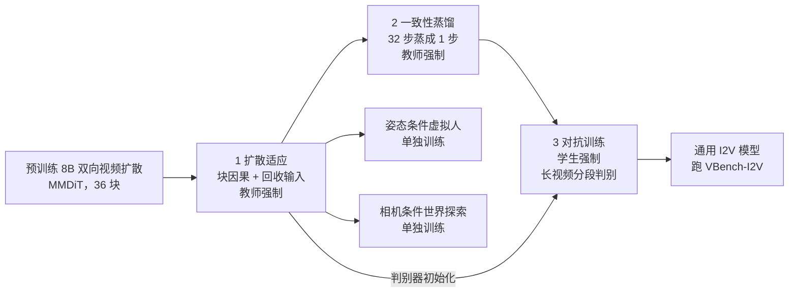

# AAPT：一步出一帧、训练时吃自己的历史，视频扩散才跟得上交互

<!-- release-date: 2025-06-11 -->

> 本文依据 ByteDance Seed 的 **Autoregressive Adversarial Post-Training for Real-Time Interactive Video Generation**，arXiv:2506.09350v2，2025-10-01，NeurIPS 2025，共 20 页。页码均指 PDF 自身页码。文中始终区分三件事：**报告写了什么**、**我们如何解释**、**哪些是外部补充或本文推算**。

## 读前先把几个词说成人话

这篇论文的难点不在公式（正文几乎没有公式），而在于它同时改了三样东西：网络怎么看历史、一次出多少画面、训练时历史从哪来。先把后文反复出现的词说清楚：

- **扩散模型与 NFE**：扩散模型从纯噪声出发反复去噪，每去噪一次就要完整跑一遍网络，叫一次 NFE（Number of Function Evaluations，网络前向次数）。**1NFE** 就是只跑一次：噪声进，结果出。
- **潜帧（latent frame）**：视频先用 VAE（Variational Auto-Encoder，变分自编码器）压小，扩散在压缩后的张量上做。本文的 VAE 在时间上压 4 倍、空间上压 8 倍，所以 1 个潜帧对应 4 个像素帧（PDF p. 6）。后文说「帧」默认指潜帧。
- **双向注意力**：整段视频的所有帧互相可见，生成第 1 秒时已经在看第 5 秒。适合离线出片，不适合「边看边控」。
- **自回归（autoregressive，AR）与 KV cache**：一次只写下一块，写完接回去再写下一块。KV cache（键值缓存）把历史帧在注意力里算过的中间结果存下来，下一步不用重算。
- **扩散 forcing（diffusion forcing）**：给不同帧块分配递进的噪声水平，让去噪按时间顺序往前推进的一类方法，是本文最主要的对照路线（PDF p. 3）。
- **教师强制 / 学生强制（teacher-forcing / student-forcing）**：训练时，「上一帧」用数据集里的真帧，还是用模型自己刚生成的帧。前者训练方便，后者与推理一致。
- **曝光偏差（exposure bias）**：训练时看真历史、推理时看自己编的历史，两者分布对不上，小误差被下一步当成事实吃进去，越滚越大。
- **I2V（Image-to-Video，图生视频）**：用户给第一帧，模型从这一帧往后生成。报告说多数交互应用都是这个设定，实验也聚焦于此（PDF p. 2）。

## 一句话先说清

实时交互视频要同时满足三件事：吞吐赶上播放帧率、对用户输入的延迟足够低、生成是因果的而且能拉得足够长（PDF p. 2）。旧路线各缺一块：双向扩散要等整段一起去噪；逐 token 自回归一帧出不来；扩散 forcing 能按块往前走，但仍是多步，而且带 KV cache 时长视频还得停下来重算重叠上下文（PDF p. 1–3）。

AAPT（Autoregressive Adversarial Post-Training，自回归对抗后训练）的做法是：拿一个预训练好的 8B 双向视频扩散模型，改成块因果、一次前向出一个潜帧的自回归生成器，再用对抗训练把它训成 1NFE，并且在训练时就让它吃自己生成的历史（PDF p. 1、p. 4–5）。

图的左半边是推理和学生强制训练时的样子，右半边是判别器。几件事在图上一眼能看到：每一步只有一帧新的 token 进入计算；历史通过 KV cache 进来，不再重算；判别器的条件相对帧输入做了对齐平移。

摘要给出的结果是：8B 模型在单张 H100 上以 $736\times416$ 分辨率做到实时 24fps 流式生成，8 张 H100 上做到 $1280\times720$，最长一分钟（1440 帧）（PDF p. 1）；延迟 0.16 秒（PDF p. 2）。项目页把这个系统叫 Seaweed APT2。

> 能实时交互，不是因为网络小，而是因为每一拍只算一帧、只跑一次前向，而且训练时就已经在看自己刚编出来的历史。

### 一条阅读路线

1. **p. 2 引言、p. 3 相关工作**：三条交互要求，以及扩散 forcing 为什么还要停下来重算。
2. **p. 4 Figure 1–2、§2.1**：块因果注意力、回收输入、滑窗。
3. **p. 5 §2.2**：三段训练、学生强制、长视频训练；公式与超参在附录 B（p. 17–18）。
4. **p. 7 Figure 3、p. 8 Table 1**：一分钟生成的定性与定量对比。
5. **p. 9 Table 4–5、Figure 7、限制**：速度、长训练消融、教师强制失败。
6. **附录 C–G（p. 18–19）**：轻量解码器、教师强制接法、回收消融、720p 结果、相机表示改动。

## 主要矛盾：交互要等的是「这一拍」，旧路线都在等「一整块」

### 双向扩散：画质够，交互等不起

MovieGen、Hunyuan、Wan2.1、Seaweed 这类大规模视频扩散都用 Transformer，注意力计算随长度平方增长，所以通常只训到 5 秒左右。要更长就做视频延长（extension）：把已生成的前几帧当条件，再去噪下一块 5 秒。延长几次之后误差累积就追上来了（PDF p. 2–3）。更早按帧调用扩散的做法，每一步都要重新处理上下文帧，冗余很高（PDF p. 1）。

**我们如何解释它。** 双向去噪时第 1 帧的更新读得到第 5 帧，所以第 1 帧干净之前没法先送给用户；用户中途改控制，整段的噪声计划都得重来。延迟至少是「一块视频乘扩散步数」，不是「一帧」。

### 逐 token 自回归：能流式，一帧出不来

VideoPoet 一类方法把视频当 next-token 任务，天然能用 KV cache。但逐 token 解码是串行的，高分辨率时并行不起来；一次解多个 token 要拿质量换速度，而且很难一次解出整帧（PDF p. 1–3）。

### 扩散 forcing：能按块往前走，但仍是多步，长视频还得停

报告点名的现状（PDF p. 2–3）：

| 模型 | 报告写的设定 | 还差什么 |
|---|---|---|
| MAGI-1 | 蒸到 8 步，一块出 24 帧；报告称其在 24 张 H100 上实时生成 $1280\times720$、24fps | 算力门槛太高 |
| CausVid | 蒸到 4 步，一块出 16 帧；单张 H100 上 9.4fps、延迟 1.30 秒 | 帧率不到 24，延迟以秒计 |
| SkyReel-V2、MAGI-1、CausVid | 仍只在固定时长窗口（例如 5 秒）上训练 | 长视频要靠推理时延长 |

CausVid 的分辨率报告里前后写法不一：引言和 Table 4 写 $640\times352$（PDF p. 2、p. 9），相关工作写 $640\times320$（PDF p. 3）。后文以 Table 4 为准。

更关键的是 KV cache 和滑窗打架（PDF p. 3）。不带 KV cache 的早期方法可以滑窗；一旦用了 KV cache，感受野就会无限增长。把窗口外的 KV 丢掉也不行，因为留在缓存里的 token 是过去算出来的，本身就带着当时的大感受野；推理时天真地外推会出分布外行为。所以 CausVid、SkyReel-V2、MAGI-1 生成长视频时，仍然要重启并重算一部分重叠上下文帧。扩散 forcing 的目标天然允许「干净上下文 + 带噪当前帧」，这一步不必另训，但真实流式应用里它意味着等待。

所以矛盾是：

> 交互延迟按「用户要等的那一块」计。要把这一块缩到一个潜帧、步数缩到 1，而且一路不停地往下写，就得同时改架构（只算新的一帧）和训练（让模型在分钟级的自生成历史上不崩）。

## 先看全景：一个预训练扩散模型，三段后训练，两个交互应用

这张图按 §2.2、§2.3 与附录 B、G（PDF p. 5–6、p. 17–19）重画，只表示阶段顺序与权重从哪来。附录 G 明确写了相机模型从 I2V 的扩散适应权重接着训，一致性蒸馏和对抗单独做（PDF p. 19）；姿态模型报告只说单独训练（PDF p. 6），「同样从扩散适应权重出发」是我们按同一描述推断的。

三段训练各自喂给模型什么、要它输出什么，决定了后面每一节的因果链：

| 阶段 | 「上一帧」输入 | 当前帧输入 | 监督目标 | 能否并行 |
|---|---|---|---|---|
| 1 扩散适应 | 数据集真帧（干净） | 真帧加噪，整段同一噪声水平 | 下一帧的流匹配速度，MSE | 能，像 LLM 预训练 |
| 2 一致性蒸馏 | 数据集真帧（干净） | 真帧加噪 | 一致性目标，不用 EMA | 能 |
| 3 对抗训练 | 模型自己上一步生成的帧 | 纯噪声 | 判别器的相对论对抗损失 | 生成器不能，判别器能 |

（据 PDF p. 5、p. 17–18 整理。前两段的输入与目标都「平移一帧」做下一帧预测。）

全景里值得先看清的一点：**真正换目标的只有最后一段**。前两段仍然是有配对真值的监督学习，所以只能教师强制；到对抗段，判别器不需要逐帧真值，学生强制才变得可训。

## 核心设计一：块因果加回收输入，一次前向只算一帧

### 旧问题：同样叫一步，每步还在算两帧

交互要的是：用户给第一帧和控制，模型马上吐下一帧，而且历史不必重算。双向 DiT 做不到因果；逐 token 自回归做不到整帧并行；把扩散 forcing 蒸到一步并用上 KV cache，每一步仍要在两帧上计算（PDF p. 5）。

### 新设计：换掩码、多接一路输入、加滑窗

在预训练的 8B DiT 上改四处（PDF p. 4）：

1. **全注意力换成块因果注意力**。文本 token 只看自己；视觉 token 看文本，以及当前帧和过去帧的视觉 token，不看未来。
2. **输入里多接一路「上一帧」**。除了原有的噪声和条件输入，再把上一步生成的帧沿通道拼进来；第一步没有上一帧，用用户给的那一帧。
3. **推理时自回归加 KV cache**。每一步复用缓存，一次前向出下一帧，再把这一帧连同新的控制条件回收为下一步输入。
4. **滑窗**。视觉 token 最多看过去 $N$ 帧，但始终看文本和第一帧。单层窗口是 $N$，多层堆叠后有效感受野大得多。评测用 $N=30$，即 30 个潜帧、5 秒（PDF p. 6）；$1280\times720$ 为了塞进显存降到 $N=15$（PDF p. 19）。

报告据此说，这套架构比「等价的、蒸到一步的扩散 forcing」效率高 2 倍（PDF p. 2）。这是按每步参与计算的帧数说的，Figure 2 是示意，不是墙钟实测。

和语言模型的差别，报告自己点明了：LLM 用 softmax 输出下一个 token 的概率；这里一次前向生成下一帧的全部 token，随机性来自输入噪声（PDF p. 4–5）。

位置编码也跟着改（PDF p. 17）：3D RoPE 在空间维仍按分辨率动态拉伸，帮助泛化到不同分辨率；时间维改成固定间隔，好让训练和生成的时长都不必预先钉死。训练时的块因果注意力用 FlashAttention 3 套 for 循环实现，报告说训练上「性能尚可」，更快的实现留给未来；推理是逐步自回归，FlashAttention 3 可以直接用（PDF p. 17）。

### 工作机制：为什么回收输入不是多余的

KV cache 里已经有历史了，为什么还要把上一帧拼进通道？

附录 E 做了这个消融：架构和训练完全不变，只把回收输入（第一帧除外）置成全零张量。结果是模型做不出大幅运动，有些动作也不连贯；可视化放在项目页，PDF 里没有图也没有表（PDF p. 19）。

**我们如何解释它。** KV cache 管的是「过去怎么被注意」，回收输入管的是「当前这一步手里有没有上一拍的完整画面」。当前帧要在上一帧上做逐像素的形变，最直接的抓手就是把上一帧放在同一个空间位置的通道里；只靠注意力从缓存里取，模型会趋于保守。

### 收益与代价

收益：因果，所以能流式；一次出整帧，所以延迟是一个潜帧而不是一个 token 或一整段；缓存被充分复用，长视频不必逐步重算历史；滑窗让速度和显存不随时长增长（PDF p. 4）。

代价与边界：

- 有效记忆受滑窗限制。报告在限制一节承认主体与场景难以维持，部分原因就是生成器用了「图省事的基础滑窗」（PDF p. 9）。
- 第一帧始终可见，能锚住身份和场景，但救不了中期事件：分钟级视频里，窗口外发生过的事不再能被直接看到。
- 8B 骨干除了「大体沿用 MMDiT、36 个 Transformer 块」（PDF p. 17），隐藏维度、头数、文本编码器、patch 大小都没写。

### 可迁移启发

**先问每一步到底在重算几份已经决定的东西。** 同样叫 1NFE，有的方法每步仍在两帧上做注意力，有的把历史折成条件通道。流式系统的延迟，常常不取决于网络多深，而取决于这一拍被迫重算了多少过去。

## 核心设计二：三段后训练，最后才把目标换成对抗

### 旧问题：权重是双向、多步、整段去噪的

预训练权重只会「整段一起、几十步」去噪。换一个掩码它不会立刻学会一步出一帧；直接上对抗又容易不稳。同组前作 APT 已经走通了「扩散预训练 → 对抗后训练 → 一步出视频」，但那是一次出整段、最多 49 帧，不是自回归流式（PDF p. 2）。

### 新设计与机制

**阶段 1：扩散适应。** 加载预训练权重，先用原来的扩散目标适应新架构（PDF p. 5、p. 17）。沿用原模型的流匹配参数化：样本 $x_0$ 与噪声 $\epsilon$ 线性插值，

$$
x_t=(1-t)\,x_0+t\,\epsilon
$$

网络预测速度 $v=\epsilon-x_0$，用均方误差训练。时间步先从 $\mathcal{U}(0,1)$ 均匀采样，再过一个 shift 函数：

$$
\operatorname{shift}(t,s)=\frac{s\,t}{1+(s-1)\,t},\qquad s=24
$$

整段用同一个时间步，不像扩散 forcing 那样每帧独立采样。回收输入给不带噪的真帧（教师强制），带噪输入和输出目标都平移一帧，做下一帧预测（PDF p. 17）。优化器 AdamW，学习率 $1\times10^{-5}$，权重衰减 0.01。课程是：

| 子阶段 | 数据 | 迭代 | batch |
|---|---|---:|---:|
| 先适应 | $736\times416$（面积约等于 $640\times480$）、5 秒 | 20k | 256 |
| 加高分辨率 | 再混入 $1280\times720$ | 6k | 128 |
| 加长 | $736\times416$ 最长 15 秒 | 4k | 32 |

（PDF p. 17。）报告的理由是：前面让模型看够样本，最后才看长样本。

**阶段 2：一致性蒸馏。** 跟随 APT，把一致性蒸馏当作对抗之前的初始化，加速收敛（PDF p. 5）。在 32 个固定步上蒸馏，步点均匀选取后同样过 $s=24$ 的 shift；不加 CFG（Classifier-Free Guidance，无分类器引导）；继续教师强制；按 improved consistency distillation 的做法，一致性目标不用 EMA；沿用上一段最后一档的优化器与数据设置，训 5k 次迭代（PDF p. 17）。蒸完的结果是糊的，但作为对抗阶段的起点更好（PDF p. 17）。

去掉 CFG 的理由只有一句：作者发现它在自回归设定里会引入伪影（PDF p. 5）。报告没有给伪影的例子。

**阶段 3：对抗训练。** 生成器从一致性蒸馏的权重初始化，判别器从扩散适应后的权重初始化（PDF p. 17）。判别器骨干就是那套因果生成器，插上 logit 输出投影层；原来的噪声输入换成帧，时间步仍随机采样 $t\sim\mathcal{U}(0,T)$，为的是让扩散权重尽快适应（PDF p. 5）。与 APT 判别器的关键差别是**每帧一个 logit**，而不是整段一个分数，这让不同时长的判别可以在一次前向里并行完成，灵感来自多分辨率判别（PDF p. 5）。

损失沿用 R3GAN 的思路：预实验发现它比非饱和 GAN 损失更稳（PDF p. 5）。具体是相对论配对损失（PDF p. 17，式（1））：

$$
\mathcal{L}_{\mathrm{RpGAN}}(x_0,\epsilon)=f\bigl(D(G(\epsilon,c),c)-D(x_0,c)\bigr)
$$

生成器更新用 $f_G(x)=-\log(1+e^{-x})$，判别器更新用 $f_D(x)=-\log(1+e^{x})$，$c$ 是文本和其他交互条件。它比较的是「同一条件下，假样本比真样本像不像真」，而不是单独给每个样本打分。

外加 APT 提出的近似 R1、R2 正则：给真样本或假样本加一点高斯扰动，要求判别器输出别跟着大变（PDF p. 18，式（2）–（3））：

$$
\mathcal{L}_{aR1}=\lambda\bigl\lVert D(x_0,c)-D(\mathcal{N}(x_0,\sigma I),c)\bigr\rVert_2^2
$$

$$
\mathcal{L}_{aR2}=\lambda\bigl\lVert D(G(\epsilon,c),c)-D(\mathcal{N}(G(\epsilon,c),\sigma I),c)\bigr\rVert_2^2
$$

原文在公式后写「$\epsilon=0.1$、$\lambda=1000$」，而公式里的扰动尺度记作 $\sigma$。**我们如何解释它**：这里的 0.1 应是扰动尺度 $\sigma$，与生成器输入噪声 $\epsilon$ 不是同一个量，属于符号笔误。判别器的时间步 $t\sim\mathcal{U}(0,1)$ 不做 shift；优化器换成 RMSProp，$\alpha=0.9$，均跟随 APT（PDF p. 18）。

对抗段本身又分两截（PDF p. 18）：先不做长视频训练，用 5–10 秒视频、学习率 $3\times10^{-6}$、batch 256 训 500 次生成器更新，得到的模型只能生成约 10 秒，再长就漂；然后上长视频训练，细节在核心设计四。

### 收益与代价

收益：不必从零训因果视频生成器；进入对抗段时，模型已经会「下一帧」和「少步」，对抗只负责把一步生成的分布拉到真视频上。

代价与边界：一致性蒸馏的效果没有单独的表；对抗超参（$\lambda=1000$、扰动 0.1、500 次更新）基本跟随 APT，本文没有做系数消融；预训练数据、预训练步数、8B 权重具体出自哪个 Seaweed 版本，报告都没写。

### 可迁移启发

**把「换计算图」「压步数」「换目标」拆成三段。** 先用旧目标适应新架构，再用蒸馏压步数，最后才让对抗去管一步生成的分布。三件事绑在一次训练里，出了问题分不清是掩码、步数还是 GAN 损失在炸。

## 核心设计三：学生强制，让训练看见自己的错

### 旧问题：教师强制在连续潜变量上会漂

扩散适应和一致性蒸馏只支持教师强制（PDF p. 9），因为这两种目标都需要与输入配对的真值帧（PDF p. 6）。推理时上一帧却是模型自己编的。报告在方法一节就写了：教师强制训练的模型推理时误差累积严重（PDF p. 5）。

### 新设计：对抗段改成学生强制

对抗段里，生成器只拿真的第一帧，之后每一步回收自己实际生成的帧，带着 KV cache 自回归地跑完整段，和推理行为完全一致；判别器则一次前向并行地评估所有生成帧（PDF p. 5）。两条稳定化细节（PDF p. 5）：

- 把过去帧这一路输入从梯度图上断开（detach），训练更稳；
- 允许梯度沿 KV cache 回流，更新全部参数。

对抗训练也可以做成教师强制，只是接法要反过来（PDF p. 18）。

### 工作机制：为什么对抗让学生强制变得可训

扩散损失和一致性损失都要问「这一帧的正确答案是什么」，而生成器一旦走自己的轨迹，就不存在与之配对的真值帧。判别器不需要逐帧监督，它只学区分真视频和生成视频（PDF p. 6）。所以只有换成对抗目标，生成器才能走自己的路、同时仍然拿到监督信号。

报告对「为什么 LLM 能靠教师强制活下来」给了一个猜测：词是离散码本，差一点往往还是同一个词；这里预测的是整帧的连续潜变量，一点误差就会累积（PDF p. 18）。这是作者的怀疑，没有对照实验。

### 实验怎么证明

（引自 PDF p. 9，Figure 7。）

报告的结论是：教师强制对抗训练的模型推理时生成不出正常视频，只过几帧内容就开始明显漂移；学生强制对抑制误差累积至关重要（PDF p. 9）。它还点评了前人（GameNGen）在训练输入上加高斯噪声减轻漂移的做法：能减轻，但没有从根本上消掉分布差（PDF p. 9）。后一句是作者判断，同一架构上没有「加噪声对学生强制」的对照表。

### 代价与边界

- 学生强制让生成器训练变成逐步循环，不能像 LLM 那样一条序列并行打满。为此生成器在 FSDP 下改用 ZeRO 2，每台机器保存完整参数，避免每次循环都重新 all-gather；判别器和文本编码器仍用 ZeRO 3 省显存（PDF p. 17–18）。附录这里写的是「improves the training seed」，按上下文应是 speed 的笔误。
- 教师强制与学生强制的差距只有 Figure 7 的定性图，没有 VBench 数字。
- 过去帧 detach 之后，这一路不再回传梯度；它对长程信用分配有没有伤害，报告没讨论。

### 可迁移启发

**推理时输入来自模型自己的输出，训练就该有一段吃自己的输出。** 连续输出没有离散码本当缓冲，教师强制的安全感在这里更假。对抗的价值不只是「一步生成」，还在于它提供了一种不需要配对真值的监督，学生强制因此训得动。

## 核心设计四：真视频不够长，就让生成器自己写长，判别器按段看

### 旧问题：分钟级的单镜头几乎没有

要学会连续生成 30–60 秒，按常理得拿同样长的单镜头视频来训。报告说这种视频在多数训练集里很少，平均镜头只有 8 秒；缺少长时长训练，推理时时间外推就差（PDF p. 5）。

### 新设计：长生成、短判别

生成器写一段长视频（正文举例 60 秒），切成短段（例如 10 秒）给判别器，相邻段保留 1 秒重叠以鼓励接续；判别器在这些生成段和数据集里的真视频上训练，目标是长视频的每一段都落在真实分布里（PDF p. 5）。为了塞进显存，生成器一次只写一段；写下一段时复用上一段已断开梯度的 KV cache，每评完一段就反传、累加损失（PDF p. 5）。

附录给出实际课程（PDF p. 18）：真视频仍是 5–10 秒；先延长 1 次、重叠 1 秒，最长 $10+(10-1)=19$ 秒，训 500 次生成器更新；再延长 5 次，最长 $10+5\times(10-1)=55$ 秒。这一档必须把 batch 降到 64、学习率升到 $1\times10^{-5}$，模型才能在合理时间内改够。

正文与 Table 5 把最长训练时长写成 60 秒（PDF p. 5、p. 9），附录的算式给出 55 秒（PDF p. 18）。报告没有解释两者的差别；「大约一分钟」这个说法两者都能对上。

### 实验怎么证明

（引自 PDF p. 7，Figure 3。）

报告的文字是：SkyReel-V2、MAGI-1 和自家扩散延长基线都在 20–30 秒之后出现明显误差累积；扩散基线试过降低 CFG 或 rescale，挡不住曝光偏差，还可能加重结构变形，所以保持 CFG 10；只训 10 秒的 AAPT（d 行）泛化不到长视频，长视频训练是关键（e 行）（PDF p. 6）。

**我们从图上读到的**：完整 AAPT 保住的是画质与场景类别，不是同一个主体——男孩在 30–40 秒侧身、背过去，周围多出别的人物，50 秒又转回正面。这与限制一节「主体与场景难以维持」是同一件事。

Table 5（PDF p. 9）把训练时长单独拿出来：

| 训练时长 | 时间质量 | 帧质量 |
|---|---:|---:|
| 10 秒 | 85.86 | 57.92 |
| 20 秒 | 85.60 | 65.69 |
| 60 秒 | 89.79 | 62.16 |

报告只写 60 秒显著优于 10 秒（PDF p. 9）。表里还有一处它没讨论：20 秒训练的帧质量 65.69 是三行最高，时间质量却略低于 10 秒。60 秒赢在时间质量，不是每一列都单调变好。

### 代价与边界

- 训练变慢，报告把它列为限制之一（PDF p. 9）。
- 判别器只看 10 秒段，管不到长程一致性。报告说主体与场景漂移，生成器（滑窗）和判别器（分段）都有责任，建议以后给判别器加身份嵌入，本文没做（PDF p. 9）。
- 段间 KV cache 断开梯度，是截断的沿时间反传：后一段的损失改不了前一段的生成。

### 可迁移启发

**缺长数据时，先问监督信号是不是必须逐点配对。** 评价器看的是分布而不是逐帧真值，就可以把「短的真实」和「长的生成」接进同一套损失。代价也同样清楚：评价器看不见的时间尺度，模型就不会被要求做对。

## 系统：24fps 是怎么凑出来的

VAE 是因果 3D 卷积，时间压 4 倍、空间压 8 倍；第一帧单独压成一个潜帧；因果解码天然支持流式，不必等整段（PDF p. 6）。所以一次自回归步吐出 4 个像素帧。

为了赶上实时预算，作者另训了一个轻量 VAE 解码器：每个分辨率尺度的残差块从 3 个减到 2 个，各尺度通道从 $[128,256,512,512]$ 减到 $[64,128,256,512]$，速度快近 3 倍，报告说看不出质量下降（PDF p. 18）。正文的 24fps 数字没有拆成「DiT 多少、解码多少」。

**本文推算。** 24fps 下 4 个像素帧对应 $4/24\approx0.167$ 秒的播放时长，与 0.16 秒延迟同一量级。报告没有把这两件事写在一起，也没说 0.16 秒是否包含 VAE 解码。

训练系统（PDF p. 17–18）：数据并行用 FSDP；上下文并行用 Ulysses，每条视频切到 8 张 GPU；每个 Transformer 块做梯度检查点。对抗阶段生成器与判别器各 8B，合计 16B 参数。最终训练用 256 张 H100，必要时梯度累积凑满 batch，约 7 天，大头花在扩散适应和长视频对抗训练上。

## 实验：能流、能长、能控

### 速度：实时是 Table 4 里的墙钟

| 方法 | 参数 | H100 | 分辨率 | NFE | 延迟 | FPS |
|---|---:|---|---|---:|---:|---:|
| CausVid | 5B | 1 张 | $640\times352$ | 4 | 1.30 秒 | 9.4 |
| **AAPT** | 8B | 1 张 | $736\times416$ | 1 | 0.16 秒 | 24.8 |
| MAGI-1 | 24B | 8 张 | $736\times416$ | 8 | 7.00 秒 | 3.43 |
| SkyReel-V2 | 14B | 8 张 | $960\times544$ | 60 | 4.50 秒 | 0.89 |
| **AAPT** | 8B | 8 张 | $1280\times720$ | 1 | 0.17 秒 | 24.2 |

（PDF p. 9，Table 4。）

读表要分开三件事：

- 分辨率、卡数、步数都不对齐。报告自己的说法只是「显著更快，性能可比 SOTA」（PDF p. 9），没有给同设定下的倍数。
- MAGI-1 在相关工作里是 24 张 H100 上实时 $1280\times720$（PDF p. 3），Table 4 是在 8 张 H100、$736\times416$ 上测的 3.43fps。硬件不同，不是前后矛盾。
- AAPT 的 0.16 秒对应一个自回归步（1 个潜帧、4 个像素帧）。CausVid 一块出 16 帧、MAGI-1 一块出 24 帧（PDF p. 3），它们的延迟口径对应更大的一块。把块缩小到一个潜帧，才是延迟能掉到 0.16 秒的原因。

### 质量：VBench-I2V 的短视频与一分钟

评测走 VBench-I2V，短视频 120 帧、长视频 1440 帧，AAPT 按 $736\times416$ 报（PDF p. 6）。CausVid 闭源，只有它自己报告的 120 帧、12fps 数字；Wan2.1、Hunyuan 是双向扩散，最多 120 帧；MAGI-1、SkyReel-V2 能任意长流式生成，进入 1440 帧对比（PDF p. 6）。附录 F：对照模型用各自默认的步数、CFG 与分辨率（Hunyuan $896\times544$、Wan2.1 $832\times464$、SkyReel-V2 $960\times544$）；按 VBench-I2V 要求每条提示跑 5 个样本，只有 SkyReel-V2 因为太贵只跑 1 个样本、步数从默认 50 降到 30（PDF p. 19）。

Table 1 的主要列（PDF p. 8）：

| 帧数 | 方法 | 时间质量 | 帧质量 | 动态程度 | I2V 主体 | I2V 背景 |
|---:|---|---:|---:|---:|---:|---:|
| 120 | CausVid | 92.00* | 65.00 | 未报 | 未报 | 未报 |
| 120 | Wan2.1 | 87.95 | 66.58 | 39.11 | 96.82 | 98.57 |
| 120 | Hunyuan | 89.80 | 64.18 | 54.80 | 97.71 | 97.97 |
| 120 | 扩散基线 | 90.40 | 66.08 | 52.52 | 97.89 | 99.14 |
| 120 | AAPT | 89.51 | 66.58 | 42.44 | 98.60 | 99.36 |
| 1440 | SkyReel-V2 | 82.19 | 53.67 | 47.15 | 96.50 | 98.07 |
| 1440 | MAGI-1 | 80.79 | 60.01 | 25.45 | 96.90* | 98.13* |
| 1440 | 扩散基线 | 86.65 | 60.49 | 66.26 | 95.01 | 97.72 |
| 1440 | AAPT | 89.79 | 62.16 | 76.50 | 96.11 | 97.52 |

（带 * 的是报告标注「需要特殊解读」的数。时间质量与帧质量按 VBench-Competition 由 6 项质量指标聚合；主体一致性、背景一致性、运动平滑、审美、成像质量几列见原表。「扩散基线」是作者自家的扩散模型加延长。）

报告的读法（PDF p. 6–7）：

- 120 帧上，AAPT 相对扩散基线提升了帧质量与图像条件分，报告称这几项在全部对照里最好，并把帧质量的提升与 APT「对抗训练能提升观感」的发现对上。时间质量略降，但仍高于 Wan、接近 Hunyuan。
- CausVid 时间质量特别高，作者猜测是因为它训练在 12fps 数据上，动态程度通常更高，而动态程度是时间质量里的主要差异项。
- 1440 帧上，AAPT 的质量分在对照里最好，条件分也高于扩散基线。SkyReel-V2 和 MAGI-1 的图像条件分更高，是因为 MAGI-1 多数视频几乎静止，这从它极低的动态程度和 Figure 3 都看得出。

**我们读表补三句。** 第一，120 帧的帧质量 66.58 与 Wan2.1 打平，不是独占第一。第二，120 帧上 AAPT 的动态程度 42.44 低于扩散基线和 Hunyuan，短视频并非全方位最好；一分钟上它的动态程度反而最高（76.50），和「对照在后半段冻住或崩坏」是同一件事的两面。第三，1440 帧的图像条件分最高的是 MAGI-1，AAPT 两列都低于 SkyReel-V2。

$1280\times720$ 的一分钟结果在附录 Table 6（PDF p. 19）：时间质量 88.24（低于 416p 的 89.79），帧质量 64.30（高于 62.16），动态程度 63.29（低于 76.50），I2V 主体、背景 96.51、98.18。窗口更小、分辨率更高，动态下降、单帧观感上升。报告没有讨论这个交换。

### 姿态条件虚拟人：可控，但不是离线动画的榜首

协议与测试集来自 CyberHost（PDF p. 8）。AKD 是平均关键点距离（DWPose 抽关键点），IQA、ASE 是 Q-Align 打的图像质量与审美分，FID、FVD 衡量与真值的分布距离。

| 方法 | AKD↓ | IQA↑ | ASE↑ | FID↓ | FVD↓ |
|---|---:|---:|---:|---:|---:|
| DisCo | 9.313 | 3.707 | 2.396 | 57.12 | 64.52 |
| AnimateAnyone | 5.747 | 3.843 | 2.718 | 26.87 | 37.67 |
| MimicMotion | 8.536 | 3.977 | 2.842 | 23.43 | 22.97 |
| CyberHost | 3.123 | 4.087 | 2.967 | 20.04 | 7.72 |
| OmniHuman-1 | 2.136 | 4.111 | 2.986 | 19.50 | 7.32 |
| AAPT | 2.740 | 4.077 | 2.973 | 22.43 | 11.78 |

（PDF p. 8，Table 2。）

报告的读法：姿态精度排第二，仅次于 OmniHuman-1；视觉质量稳定排第二或第三，紧跟 CyberHost（PDF p. 8）。OmniHuman-1 五项全部更好。这一节证明的是「实时因果生成器也能被姿态驱动」，不是「离线人体动画新纪录」。

### 相机条件世界探索：六项里三项最好

| 方法 | FVD↓ | Mov↑ | Trans↓ | Rot↓ | Geo↑ | Apr↑ |
|---|---:|---:|---:|---:|---:|---:|
| MotionCtrl | 221.23 | 102.21 | 0.3221 | 2.78 | 57.87 | 0.7431 |
| CameraCtrl | 199.53 | 133.37 | 0.2812 | 2.81 | 52.12 | 0.7784 |
| CameraCtrl2 | 73.11 | 698.51 | 0.1527 | 1.58 | 88.70 | 0.8893 |
| AAPT | 61.33 | 521.23 | 0.1185 | 1.63 | 81.25 | 0.9012 |

（PDF p. 8，Table 3。）

AAPT 在 FVD、平移误差、外观一致性上最好，运动强度、旋转误差、几何一致性仍是 CameraCtrl2 更好（PDF p. 8）。指标沿用 CameraCtrl II 的协议（PDF p. 19）：Mov 是前景物体的 RAFT 光流强度（前景掩码来自 TMO）；Trans、Rot 用 VGGSfM 估相机再与真值比；Geo 是 VGGSfM 能成功估出相机的比例；Apr 是每帧 CLIP 视觉向量与全片均值的余弦距离。

为了让相机条件适合因果生成，附录 G 对 CameraCtrl II 改了四处（PDF p. 19）：

1. 原做法以第一帧为原点，后面各帧都相对第一帧，位移一直增大时数值会无界增长；改成每帧只相对上一帧，Plücker 嵌入只表示相邻帧之间的相机变化。
2. 原 Plücker 坐标用「方向向量 + 矩向量」隐式表示射线，作者认为徒增学习难度，改成直接编码射线的原点与方向。
3. 输入缩放到约 1 个标准差；丢掉嵌入数值过大的样本，这些是相机估计失败造成的离群值，会破坏对抗训练的稳定性。
4. 新通道的输入投影用随机初始化而不是零初始化，适应更快。

相机模型的长视频训练里，延长部分会随机采样新的相机轨迹（PDF p. 19）。

**我们如何解释它。** 第 1 条和第 3 条都是为流式与对抗付的税：分钟级因果生成里，任何「相对起点」的绝对量都会爆；对抗对异常值比扩散更敏感，脏条件不能直接塞进去。

## 限制

报告 §4 末尾写了四条（PDF p. 9）：

1. **一致性**：主体与场景难以维持。生成器是基础滑窗，判别器是分段判别，管不到长程；可能的改法是换记忆架构、给判别器加身份嵌入，本文都没做。
2. **训练速度**：长视频训练可能很慢。
3. **一步生成的质量**：1NFE 仍会造出瑕疵；瑕疵一旦出现，由于判别器同时在强制时间一致，它会在画面里保留很久。
4. **时长**：零样本生成五分钟仍能出内容，但有伪影，例子在补充材料里。

第 3 条值得多想一步：一步模型的失败模式不是「偶尔糊一帧」，而是「错的东西变成了要保持的场景」。质量问题与记忆问题会耦合成同一种鬼影。

附录 H 的社会影响只有一段：方法更快更省，可能促成更多实时交互应用；作者认为风险不显著，理由是生成视频仍有容易辨认的瑕疵（PDF p. 20）。这是作者判断，没有用户研究支撑。

## 可迁移启发

1. **交互延迟按用户要等的那一块计，不按整段计。** 把 5 秒乘 50 步改成 5 秒乘 1 步，延迟仍是 5 秒量级。先把一块输出缩到控制信号的时间粒度，再谈蒸馏和对抗。
2. **KV cache 不是免费的长记忆。** 缓存里的值带着计算时的感受野，滑窗丢掉旧 token 救不了「留下的 token 看过太远」。要滑窗，训练时就按同样的窗口训。
3. **同样一步，先数每步重算了几份历史。** 把历史折进条件通道，可以让每步只算一帧。
4. **回收输入和 KV cache 管的不是一件事。** 缓存管注意力能取到什么，回收管当前这一步手里有没有上一拍的画面；掩掉回收，大运动就没了。
5. **连续输出的自回归，不要迷信教师强制。** 对抗目标不需要配对真值，学生强制才训得动。
6. **真值不够长时，换一个不需要逐点真值的评价器。** 评价器看多长，模型就会被要求在多长的尺度上对齐。
7. **给因果模型的控制信号不要用会随时间爆炸的绝对量。** 改成相邻帧增量，是为流式服务的表示设计；对抗训练前先清掉离群条件。
8. **实时预算往往还要在解码器上砍一刀。** 附录用更窄的解码器换来近 3 倍速度。

## 关键词回看

- **AAPT**：自回归对抗后训练，把预训练视频扩散改成 1NFE、可用 KV cache 的因果生成器（PDF p. 1）。
- **1NFE / 潜帧**：每个潜帧只跑一次前向；1 个潜帧对应 4 个像素帧（PDF p. 1、p. 6）。
- **块因果注意力**：文本只看文本，视觉看文本与当前及过去的视觉，不看未来（PDF p. 4）。
- **回收输入**：上一步生成的帧沿通道拼进当前步；第一步用用户给的帧（PDF p. 4）。
- **滑窗 $N$**：视觉最多看过去 $N$ 帧，始终看文本和第一帧；主评测 $N=30$，720p 用 $N=15$（PDF p. 4、p. 6、p. 19）。
- **三段后训练**：扩散适应、一致性蒸馏、对抗训练，前两段教师强制，最后一段学生强制（PDF p. 5）。
- **每帧 logit**：判别器逐帧给分，一次前向完成多时长判别（PDF p. 5）。
- **学生强制**：训练时生成器吃自己的输出、带 KV cache 逐步前向，与推理一致（PDF p. 5）。
- **长视频训练**：生成器写长，判别器看重叠 1 秒的 10 秒段；段间 KV cache 断开梯度（PDF p. 5、p. 18）。
- **APT / APT2**：同组前作 APT 一次出整段、最多 49 帧；本文系统在项目页叫 Seaweed APT2（PDF p. 2）。

## 资料与阅读边界

**原件、版本与首发日。** arXiv:2506.09350 最新版为 v2（2025-10-01），本文据此写作；v1 于 2025-06-11 提交，首页标注 NeurIPS 2025。作者均署 ByteDance Seed，通讯作者 Shanchuan Lin；第三作者 Hao He 为香港中文大学在 Seed 的实习生，Jianwen Jiang 署 ByteDance Intelligent Creation Lab（PDF p. 1）。本工作没有公开权重、代码或可调用的服务，`release-date` 取技术首次官方公开日，即 arXiv v1 的 2025-06-11；项目页没有独立的发布日期。

**外部补充，不是本报告内容。**

- 项目页 <https://seaweed-apt.com/2>（标题 Seaweed APT2）：一分钟与高分辨率样例、姿态与相机交互、回收消融、教师强制对学生强制、五分钟（7200 帧）零样本外推视频。页面的「Challenging Cases」另写了几条局限：快速变化的动作吃力、滑窗导致长程记忆有限、有时违反物理、没有做人类偏好对齐。这几条 PDF 正文没有逐条列出。
- 同组前作 APT：<https://arxiv.org/abs/2501.08316>，报告引用其一步视频生成、近似 R1/R2 与判别器初始化做法。
- 后续的 Causal-Forcing 一篇把本文（APT2）列为另一条少步自回归路线并作了区分，那是它的判断，不回写本篇。

**报告没有公开、本文也不补的缺口**：预训练数据与 8B 基座的具体来源、文本编码器与骨干的宽度和头数、权重与代码、教师强制对学生强制的定量表、回收消融的数值、0.16 秒延迟是否含解码、五分钟生成的系统评测、姿态与相机任务的训练数据规模。
