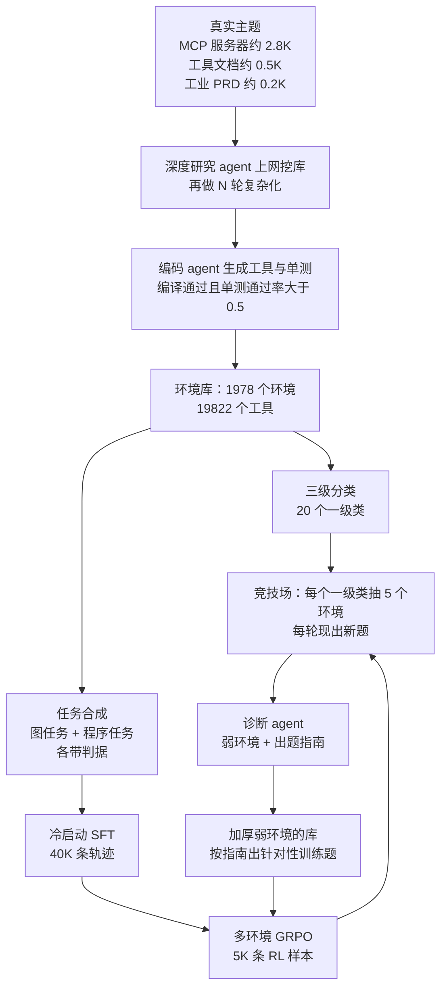

# Agent-World：把真实工具主题挖成可执行沙箱，再让失败诊断决定下一轮练什么

<!-- release-date: 2026-04-20 -->

> 本文依据本地 `papers/ByteDance/Agent-World.pdf`，即 **Agent-World: Scaling Real-World Environment Synthesis for Evolving General Agent Intelligence**，arXiv:2604.18292v1、2026-04-20 提交，共 48 页。署名为中国人民大学高瓴人工智能学院与 ByteDance Seed，通讯作者 Wanjun Zhong（ByteDance Seed）与 Zhicheng Dou（人大）（PDF p. 19）。页码均指 PDF 自身的页码。文中会区分三件事：**论文明确写了什么**、**我们怎么解释它**、**哪些是外部资料或本文推算**。

## 读前先把几个词说成人话

这篇论文不改模型结构，也不提新的 RL 目标。它改的是「agent 在什么世界里练、练完之后下一轮练什么」。先把会反复出现的词说清楚：

- **MCP（Model Context Protocol，模型上下文协议）**：把外部服务暴露成「可调用工具」的接口约定。对本篇来说，重要的不是协议本身，而是网上已经登记了成千上万个 MCP 服务器，每个都带工具定义和数据描述，可以当「世界该长什么样」的种子。
- **有状态环境（stateful environment）**：agent 每调一次工具，外部世界可能被改写。论文举的例子是订机票：查库存 → 下单 → 写日历，顺序错了状态就被写坏（PDF p. 2）。
- **环境 = 数据库 + 工具集**：论文把每个环境写成一对 $e=(\mathcal{D},\mathcal{F})$。数据库 $\mathcal{D}$ 装着可变的外部状态，工具集 $\mathcal{F}$ 是读写它的 Python 函数（PDF p. 4）。后文「造环境」造的就是这一对。
- **RLVR（Reinforcement Learning from Verifiable Rewards，可验证奖励的强化学习）**：奖励由规则或程序判定，不单独训奖励模型。
- **GRPO（Group Relative Policy Optimization，组相对策略优化）**：同一道题采一组轨迹，用组内相对表现当优势，不训价值网络。基本形式见 DeepSeek-R1 一篇。
- **环境缩放（environment scaling）**：把「训练环境的数量和种类」当成一条可以扩的轴。本篇的对照组 EnvScaler、AWM、ScaleEnv、TOUCAN、Simulator 都走这条线（PDF p. 12）。
- **竞技场（arena）**：本篇的第二个部件。从环境库里按类别抽一批环境，每轮现出新题考当前策略，再由诊断 agent 找出弱项。

别和 Agent-World-Model 一篇混淆。那是 Snowflake 的 **Agent World Model（AWM）**，在本篇里是参考文献 [100] 和对照基线之一（PDF p. 12、p. 26）；本篇是人大与 ByteDance Seed 的 **Agent-World**。

## 一句话先说清

2026 年初，训练通用工具 agent 的环境有两条路（PDF p. 2）。一条让 LLM 扮演环境，反馈可以无限造，但会编，动力学偏离真实系统。另一条用可执行工具加真实数据库，接地更硬，EnvScaler、AWM、ScaleEnv 已经开始程序化地合成这类沙箱。

论文认为第二条路还缺两样东西（PDF p. 2–3）：

1. **真实感与复杂度**。现有合成环境多是纯 LLM 生成，或只从有限的开源工具链派生，交互逻辑对不上真实工作流；长程、重状态的任务尤其少。
2. **持续自演化的机制**。环境造出来之后几乎都只训一轮，没人系统地用这些环境诊断策略的弱点，再对准弱点补数据。

Agent-World 对两样各给一个部件，并把它们接成一个圈：

- **Agentic Environment-Task Discovery**：从三类真实来源的主题出发（按 Figure 2 的约数相加约 3.5K 个，加法是我们做的），用深度研究 agent 上网挖主题对齐的数据库，再生成并验证工具，得到 **1978 个环境、19822 个工具**；在这些环境上合成带判据的长程任务（PDF p. 3、p. 9）。
- **Continuous Self-Evolving Agent Training**：先做多环境 GRPO；再建一个竞技场，每轮出新题、诊断弱环境、针对性地加厚数据库和出题，然后接着 RL（PDF p. 9–12）。

结论要连着「和谁比」读。摘要写 8B 和 14B「consistently outperforms strong proprietary models and environment scaling baselines」（PDF p. 1）。**Table 1 支持后半句，不支持前半句**。 在主表三套基准上，Agent-World-14B 的平均分是 MCP-Mark 13.3、BFCL V4 55.8、$\tau^2$-Bench 65.4；四个专有模型最低的一档也有 33.3、62.9、80.2（PDF p. 14）。它稳定拉开的是同尺寸的环境缩放基线：Agent-World-8B 在三套上是 8.9 / 51.4 / 61.8，EnvScaler-8B 是 5.6 / 47.6 / 37.9。

### 一条阅读路线

1. **p. 2 的 Figure 1 与两个瓶颈**：先看整个闭环长什么样。
2. **p. 5–6**：主题从哪来、数据库怎么挖、工具过哪道闸。
3. **p. 7–8**：两种任务怎么合成，判据怎么和题一起造出来。
4. **p. 10–12**：奖励公式、GRPO、竞技场与 Algorithm 1。
5. **p. 13 的实现细节**：谁是老师、谁是学生，这张账单决定了结论能迁移多少。
6. **p. 14 Table 1，p. 16 Figure 8 与 Table 2**：主结果、环境数量缩放、两轮自演化。

附录 A 是诊断 agent 的提示词，附录 B 是六张环境卡片，附录 C 是三条成功轨迹，第一次可以只翻。

## 主要矛盾：世界要么是编的，要么只被刷一遍

通用 agent 真正要学的，是在有状态的外部系统里编排多步工具、同时跟踪状态变化（PDF p. 2）。这需要大量「可交互、可判对错」的环境。手工搭太贵；让 LLM 口头扮演环境又会幻觉，状态只存在于下一个 token 的想象里，没有程序能检查它。

程序化合成把状态落到了真实的数据库和函数上，解决了「能不能判」。但论文指出它留下两个口子（PDF p. 2–3）：环境的种类和真实工作流对不上；环境造出来只被当成一份静态数据集，训一遍就扔。

于是矛盾是：

> 要让 agent 学到能迁移的交互逻辑，环境既要接地到真实工具生态，又要能反复使用、随策略的弱点变化。只解决前者，得到的是一份更好的静态数据集；只解决后者，是在假世界里自我对弈。

Agent-World 的回答是：主题取自真实来源，状态落到可执行的库和工具上；同一批环境再当体检中心，用失败轨迹决定下一轮出什么题。

## 先看全景：一边造世界，一边在世界上练

这张图按 PDF p. 2 Figure 1、p. 5 Figure 2、p. 10 Figure 5 与 p. 12 Algorithm 1 重画，是流程示意，不是论文原图。上半截是第 3.1 节，下半截是第 3.2 节；从「诊断」回到「多环境 GRPO」的那条边，就是论文说的智能体与环境「共演化」。

老师与学生的分工写在实现细节里（PDF p. 13），这张账单后面每一节都会用到：

| 角色 | 论文写明的模型 |
|---|---|
| 挖库、生成工具与单测、合成任务与判据 | GPT-OSS-120B |
| 诊断 agent | GPT-OSS-120B |
| 冷启动轨迹（40K 条） | 内部的 Doubao-Seed-1.8 |
| 被训练的学生 | Qwen3-8B、Qwen3-14B |
| 任务难度统计用的求解者 | Doubao-Seed-2.0-pro（PDF p. 9） |

**我们如何解释它**：被报告的是 8B 和 14B，但造世界、出题、判卷、诊断的智力都来自更大的老师。后文说「8B 超过 Qwen3-235B」时，省略的正是这两位老师。

## 交互被写成什么：一个库、一组工具、两种动作

第 2 节沿用 AgentSkiller 的写法，把多环境交互记成一个部分可观测的马尔可夫决策过程（PDF p. 3–4）。第一次读只要抓住三个拆分：

- **状态拆两半**：环境状态 $s^E$（数据库、文件、服务）和对话状态 $s^H$（历史、约束、偏好）。
- **动作分两种**：调工具会读写数据库、返回结构化观察；说话只改对话状态。离线训练里一次语言回复通常就是终止信号，那一步环境状态不变（PDF p. 4）。
- **环境状态看不见**：策略只能从工具返回值里间接推断 $s^E$（PDF p. 4）。

这套记号本身没有新算法。它的用处是给后面规定接口：造环境 = 造 $(\mathcal{D},\mathcal{F})$；训 agent = 在这对接口上采轨迹；判对错和诊断 = 去看轨迹把库写成了什么样。判据可以直接读库，策略只能读返回值，这个不对称是后面所有「状态感知奖励」的前提。

## 核心设计一：从真实主题挖出可执行环境

### 旧问题：LLM 写出来的库又小又假

已有工作让 LLM 直接合成环境数据库，论文点名了三篇（PDF p. 5）。问题有二：模型写出的表容易小而简单；字段和取值分布是模型想象的，不一定对得上真实服务。

### 新设计：主题取自真实来源，库从网上挖

**主题**是第一锚点。三类来源取并集（PDF p. 5，Figure 2 左框）：

- MCP 服务器约 2.8K 个，取自 Smithery，每个带结构化的数据描述与标准工具定义；
- 工具文档约 0.5K 份，从开源工具使用数据里抽出工具定义，再让 LLM 反推它属于什么环境主题；
- 工业 PRD（产品需求文档）约 0.2K 份，自带业务背景、领域流程和系统接口。

**数据库**不让 LLM 凭空写。论文的理由是：网上已经有大量高价值、可实时更新的结构化数据（PDF p. 5）。于是造了一个深度研究 agent $\mathcal{G}$，策略模型是 $\pi_\theta$，外挂搜索、浏览器、代码编译器和操作系统工具。对每个主题 $m$ 反复检索、挖数据，最后用操作系统工具整理落盘：

$$
\mathcal{D}(m)=\mathcal{G}(m;\pi_\theta,\mathcal{T})
$$

一轮挖出来的库往往规模小、结构简单，所以再套一个复杂化算子 $\phi$，让深度研究 agent 迭代地扩充（PDF p. 5）：

$$
\mathcal{D}^{(n+1)}(m)=\phi\bigl(\mathcal{D}^{(n)}(m),\,m,\,\mathcal{T}\bigr),\qquad n=0,\ldots,N-1
$$

最终用 $\mathcal{D}^{(N)}(m)$。$N$ 取多少、每轮加了什么，论文没写。

「真实」在这里有明确的边界。附录 B 的 `Arxiv_local` 卡片写得很直白：这是一个完全离线的「本地 arXiv」，agent 从不调用公开的 arXiv API，而是用确定性的 Python 工具读 `manifest.json` 和 `papers/` 下的 Markdown 卡片（PDF p. 32）。所以：

> 主题和数据来自真实来源；运行时是自洽、可复现的本地沙箱。

这句是我们对附录 B 的归纳。不要读成「训练时连着线上 MCP 服务器」。

### 工具要过一道执行闸

有了库，编码 agent $\psi$ 为每个主题生成候选工具，并为每个工具配一组单测（一对多）（PDF p. 5–6）。单测通过率就是通过的比例：

$$
\mathrm{Acc}(\hat f)=\frac{1}{|\hat{\mathcal{C}}_{\hat f}|}\sum_{\hat c\in\hat{\mathcal{C}}_{\hat f}}\mathbf{1}\bigl[\hat f(\hat c)\ \text{passes}\bigr]
$$

一个工具留下，要同时满足三条：Python 编译通过；$\mathrm{Acc}>0.5$；所在环境至少有一个有效工具和一个有效单测（PDF p. 6）。留下的工具集记为 $\mathcal{F}(m)$，全部环境合起来就是环境库 $\mathcal{E}$。

**我们如何解释它**：0.5 是一道很松的闸。它保证工具「能跑、大体对」，不保证实现正确。真正的正确性被推到下一节的任务级过滤和判据上。生态规模因此好看，单个工具的质量下界并不高。

### 分类体系：给竞技场抽样用

环境库再按主题做层次聚类，得到 50 个簇心；借 TOUCAN 的分类法，用 GPT-OSS-120B 为每个簇总结出二级标签；三名标注员把 50 个二级标签归并成 20 个一级类（PDF p. 6）。Figure 3 的圆心写着 20 categories、1978 servers；右侧二级类按服务器数排前三的是 DevOps & Workflow Automation（213）、API Gateway & Aggregation（205）、Web Content Extraction（109）（PDF p. 6，读自 Figure 3）。这套分类的训练用途在第 3.2.2 节：竞技场按一级类分层抽样。

### 可迁移启发

先有接地的表，再让工具去读写这张表。工具的输入输出若对不上库的字段，后面的图游走和程序校验都会变成自说自话。「深度研究 agent 挖库」是一种取数据的办法，不是这条原则的前提。

## 核心设计二：题和判据必须一起造出来

环境本身不产生训练信号。第 3.1.1 节用两种互补的办法合成任务，都在沙箱里真跑，以留下执行轨迹、标准答案和判据（PDF p. 6–8）。

### 图任务：针对「必须按顺序调」

三种边的含义与权重、游走的起点规则、题面禁止出现工具名，都按上图读（PDF p. 7）。图上读不出的有两点。

第一，**题是倒着写的**。先有一条合法且跑得通的调用链，再为它写用户问题。这样标准答案不是模型猜出来的，而是链在沙箱里真跑出来的；细则 $R$ 也直接对着真实返回的字段写（字段完整、schema 匹配、数值容差）（PDF p. 7）。

第二，**加难有三个旋钮**：拉长游走的最大步数；提高弱依赖与独立边的抽样概率，减少「上一步输出直接喂下一步」的明显线索；再改写题面，把工具名和执行逻辑藏起来，逼 agent 从抽象目标推出工作流（PDF p. 7）。

### 程序任务：针对「一条链写不下」

条件分支、循环、跨表聚合，没法收成一条顺序链。程序任务改成（PDF p. 8）：

1. LLM 读工具 schema 和数据库描述，写一道只讲场景与目标的复杂题 $q_{\mathrm{prog}}$；
2. 同一个 LLM 当求解者，写一段加载工具实现、带 `for` 循环和 `if-else` 的端到端 Python 解；跑不通就在 ReAct 环里改，直到沙箱给出标准答案 $a^*$；
3. 再生成校验脚本 $V_{\mathrm{code}}(a,a^*)$，用多层断言检查候选答案**和数据库状态** $s^E$ 是否满足全部约束；校验脚本本身也要在沙箱里被调通；
4. 过滤与图任务相同：ReAct agent 做 5 次，至少 2 次通过 $V_{\mathrm{code}}$ 才留。

加难方式是提高不同工具数与调用次数、强制条件分支和跨库聚合、排序、过滤，并改写题面去掉 API 痕迹（PDF p. 8）。

两种任务对应后面两种奖励：图任务有细则 $R$，程序任务有 $V_{\mathrm{code}}$。**合成时就把「怎么判」一起造出来**，这是这条流水线能直接接 RLVR 的原因。

### 统计：规模可信，难度要看图而不是看正文

这是 PDF p. 8 的 Figure 4 原图。正文给出的事实是：过滤前超过 2000 个环境，保留 1978 个；平均每环境 10 个以上工具，有的超过 40 个；共 19822 个不同工具；库文件类型有 json、csv、sql、html，也有 tex、yaml 这类工作区格式（PDF p. 9）。子图 (b) 图例里的 2210 是过滤前的环境数，均值 10.0 与正文的 19822 / 1978 ≈ 10.0 对得上（除法是我们做的）。

难度要以图为准。正文写「多数任务 10 次里只做对 1 次，有一些完全做不对」（PDF p. 9）。子图 (f) 的读法相反：**最高的柱是 0 次成功，约 600 道；1 次成功约 100 道；10 次全对约 110 道**（读图约值）。也就是说，按图，Doubao-Seed-2.0-pro 在大约六成的题上 10 次全错。

**我们如何解释它**：这和任务级过滤放在一起看有一处张力：每道题都要求 ReAct agent 5 次里至少做对 2 次才留下，而统计里更强的专有模型却在多数题上 10 次全错。论文没说明两者用的是不是同一批题、同一套工具接口与 harness，也没说 (e)(f) 统计的这约 1000 道题（按柱高粗加）是否就是训练集。交互长度同理：正文说平均超过 20 轮，子图 (e) 的众数在 13 步附近，我们按柱高粗算的均值在 18 步上下，达不到 20（读图估算，且横轴写的是 Number of Steps，未必等于正文的「轮」）。

附录 C 的三条案例给出任务的具体形状：电商退货 9 步用到 17 个工具里的 4 个；Slack 合规分诊 7 步用 18 个里的 5 个；人口数据约束排序 10 步用 11 个里的 5 个，还要在常数工具返回空时走降级路径（PDF p. 46–48）。三条都是成功轨迹，不是失败分析。

### 可迁移启发

题和判据一起合成，并且倒着写题（先跑通调用链，再写不含工具名的用户目标），不依赖 2000 个环境也能用。过滤要分两道：工具级管「能跑」，任务级管「可解」；两道都偏松（0.5、5 次里 2 次），但结构比单闸清楚。

## 核心设计三：在「策略–工具–数据库」三件套上做 GRPO

### 多环境 rollout

每一步在三个部件之间转：策略 $\pi_\theta$ 出下一个动作；工具运行时执行该环境的 $\mathcal{F}(m)$，维护数据库连接与缓存；数据库 $\mathcal{D}^{(N)}(m)$ 是读写底板（PDF p. 9）。调工具就在沙箱里读写库并返回观察；给出语言回复就终止。一次输出记为 $y=(\tau,a_{\mathrm{final}})$。同一个全局 batch 里的题各配独立、可动态替换的环境，这就是「多环境」的含义（PDF p. 9–10）。

### 奖励：正文说取平均，公式写成全过才给 1

论文先说环境 agent 的奖励不能只看答案，还要看环境状态、效率约束和格式（PDF p. 10）。实际实例化了两种：图任务用带细则条件的 LLM 评委逐条判，**把逐条通过与否取平均当总分**；程序任务在沙箱跑 $V_{\mathrm{code}}$，检查答案或最终数据库状态。公式是（PDF p. 10）：

$$
r(x,y)=
\begin{cases}
\mathbb{I}\Bigl[\dfrac{1}{n}\sum_{j=1}^{n}\mathbb{I}\bigl[\mathrm{Judge}(x,y,r_j)\bigr]=1\Bigr], & x\in\mathcal{X}_{\mathrm{graph}}\\[6pt]
\mathbb{I}\bigl[\mathrm{Execute}(V_{\mathrm{code}}(y,y^*))\bigr], & x\in\mathcal{X}_{\mathrm{prog}}
\end{cases}
$$

外层的 $\mathbb{I}[\,\cdot=1]$ 意味着图任务只有**全部细则都过**才给 1；程序任务是校验脚本的 0/1。

**我们如何解释它**：按公式，两种任务都是终局 0/1，没有过程分，也没有正文提到的效率项与格式项。文字说的「平均通过率」和公式不是同一个函数，论文没说实际发的是哪一个。图任务的判据是 LLM 评委，比程序任务的执行校验软。

### 策略更新：公式是对称裁剪，实现换成了 DAPO 的不对称上下界

目标函数按标准 GRPO 写（PDF p. 11，式 1）：同一题采 $G$ 条轨迹，组内归一化得到 token 级优势，裁剪重要性比，再减去对参考策略的 KL。式里的裁剪半径 $\epsilon$ 是对称的；实现段却写，为了训练稳定，跟随参考文献 [118] 设 $\varepsilon_{\mathrm{low}}=0.2$、$\varepsilon_{\mathrm{high}}=0.28$（PDF p. 13）。[118] 是 DAPO，不对称裁剪即 DAPO 一篇里的 Clip-Higher。

其余超参（PDF p. 13）：

| 项目 | 值 |
|---|---|
| RL 样本 | 5K，算法 GRPO |
| 每步 | 32 道题，每题 8 条 rollout |
| 轨迹上限 | 80K token；单步生成上限 32K token |
| 采样 | 训练与评测都是 temperature 1.0、top_p 1.0 |
| 评测 | 每组实验重复 8 次，报平均准确率 |

KL 系数 $\beta$、训练框架、GPU 数与墙钟都没写。Figure 9 里 8B 大约训到 335 步、14B 大约 285 步（读图）。按每步 32 题粗算，8B 约经历 1 万多次题目采样，而 RL 题库只有 5K，大致是在这 5K 上反复滚两遍左右（我们的推算）。

冷启动一句的原文是「先用与环境任务发现相同的合成策略做冷启动 SFT，40K 条轨迹由 Doubao-Seed-1.8 生成；After cold-start SFT, we initialize the Qwen3-8B/14B backbones」（PDF p. 13）。最自然的读法是：用这 40K 条轨迹对 Qwen3 做 SFT，再从 SFT 权重开始 GRPO。论文没有更细的说明。

## 核心设计四：竞技场，让失败轨迹决定下一轮练什么

### 旧问题：环境库只被当成数据集

单轮训练把 5K 道题摊在 1978 个环境上，平均每个环境不到 3 道。模型在哪类状态转移上弱，这份均匀分布的数据看不见。第 3.2.2 节的动机就是：环境库不只是训练源，也应该是诊断场（PDF p. 11）。

### 新设计：每轮现出题、诊断、定向补数据

Algorithm 1 把一轮拆成三段（PDF p. 12）：

1. **现出题考试**。竞技场按一级类分层抽样，每个类随机选 $K=5$ 个环境（PDF p. 11）；20 个一级类即约 100 个环境，这个总数是我们乘出来的，论文没写。每轮给场上每个环境按第 3.1.1 节现合成一批图任务和程序任务，环境和题都跨轮更换，避免对着一套固定考卷过拟合。
2. **诊断**。诊断 agent $\delta$ 带 Python 解释器和搜索，输入逐题失败轨迹（工具日志、中间观察、判据反馈）、按环境与类别的错误分布、工具 schema 与数据库描述；输出排好序的弱环境集合 $\mathcal{W}^{(r)}$，以及每个弱环境的出题指南，例如「工具用错」「状态更新错」（PDF p. 11）。
3. **共演化**。对每个弱环境先用 $\phi$ 再加厚一次数据库，按指南生成针对性训练题 $\mathcal{X}_{\mathrm{target}}^{(r)}$，从当前策略接着做多环境 RL，得到下一轮策略。

$$
\pi_{\theta^{(r)}}\ \xrightarrow{\ \text{评测}\ }\ \mathcal{W}^{(r)}\ \xrightarrow{\ \text{诊断与出题}\ }\ \mathcal{X}_{\mathrm{target}}^{(r)}\ \xrightarrow{\ \text{继续 RL}\ }\ \pi_{\theta^{(r+1)}}
$$

附录 A 给出诊断 agent 的系统提示与用户提示模板：把每个失败归入根因类型、给环境排序、为每个弱环境写可执行的出题指南，并按一张「Table A」的 schema 输出 JSON（PDF p. 30–31）。**这张 Table A 在 PDF 里找不到**，附录 A 只有两段提示词。

两处细节不一致：正文说数据库加厚是「弱点源于状态多样性不足时可选」（PDF p. 11），Algorithm 1 第 9 行却对每个弱环境无条件执行（PDF p. 12）。

**我们如何解释它**：这不是 AlphaGo 式的自我对弈。对手不是另一个 agent，而是一个会根据你的失败改题的出题人；课程也不按人定的难度阶梯走，而按「这一轮哪类环境把你打败了」走。收益是数据预算可以盯着漏洞花；代价是出题人与诊断者都是 GPT-OSS-120B，这个圈能把学生带到多高，上限在老师。

## 实验怎么证明

评测覆盖 23 个基准，分五组：核心工具使用 3 个（MCP-Mark、BFCL V4、$\tau^2$-Bench）、高级助手 3 个（SkillsBench、ARC-AGI-2、Claw-Eval）、通用推理 7 个、搜索与编码 7 个、知识与 MCP 3 个（MMLU、SuperGPQA、MCP-Universe 五个子域算一个）（PDF p. 12–13）。全部用内部评测框架，结果与官方分数对齐；GAIA、HLE 等用抽样子集加速（PDF p. 13）。

### Table 1：赢的是环境缩放基线

**MCP-Mark**（真实 MCP 服务器上的长程任务；PDF p. 14）

| 方法 | File | Github | Notion | Play. | Post. | Avg |
|---|---:|---:|---:|---:|---:|---:|
| GPT-5.2 High | 60.0 | 47.8 | 42.9 | 40.0 | 66.7 | 53.1 |
| Claude Sonnet-4.5 | 32.5 | 29.4 | 25.0 | 27.0 | 50.0 | 33.3 |
| Gemini-3 Pro | 56.7 | 45.7 | 43.8 | 40.0 | 70.2 | 50.8 |
| Seed 2.0 | 60.0 | 39.1 | 53.6 | 40.0 | 81.0 | 54.7 |
| DeepSeek-V3.2-685B | 36.7 | 20.7 | 45.5 | 17.0 | 66.6 | 36.7 |
| GPT-OSS-120B | 5.8 | 4.4 | 3.6 | 3.0 | 7.1 | 4.7 |
| Qwen3-8B | 3.3 | 0.0 | 0.0 | 4.0 | 4.8 | 2.4 |
| Qwen3-14B | 3.3 | 4.4 | 0.0 | 0.0 | 9.5 | 3.4 |
| Qwen3-235B-A22B | 13.3 | 0 | 10.7 | 0 | 4.8 | 5.8 |
| Simulator-8B | 3.3 | 0.0 | 0.0 | 4.0 | 4.8 | 2.4 |
| TOUCAN-7B | 0.0 | 0.0 | 0.0 | 0.0 | 4.8 | 1.0 |
| EnvScaler-8B | 10.0 | 4.4 | 0.0 | 4.0 | 9.5 | 5.6 |
| AWM-8B | 3.3 | 0.0 | 0.0 | 4.0 | 4.8 | 2.4 |
| AWM-14B | 3.3 | 8.7 | 0.0 | 4.0 | 9.5 | 5.1 |
| Agent-World-8B | 13.3 | 4.4 | 3.6 | 4.0 | 19.1 | 8.9 |
| Agent-World-14B | 16.6 | 4.4 | 3.6 | 4.0 | 38.1 | 13.3 |

**BFCL V4 与 $\tau^2$-Bench**（BFCL 只列平均和两个子项；两张表都略去了 Qwen3-32B 一行；PDF p. 14）

| 方法 | BFCL WebSearch | BFCL Multi-T. | BFCL Avg | Retail | Telecom | Airline | $\tau^2$ Avg |
|---|---:|---:|---:|---:|---:|---:|---:|
| GPT-5.2 High | 75.5 | 48.5 | 62.9 | 81.6 | 95.8 | 62.5 | 80.2 |
| Claude Sonnet-4.5 | 81.0 | 61.4 | 73.2 | 86.2 | 98.0 | 70.1 | 84.7 |
| Gemini-3 Pro | 80.0 | 60.8 | 72.5 | 85.3 | 98.0 | 72.7 | 85.4 |
| Seed 2.0 | 92.0 | 62.3 | 73.4 | 90.4 | 94.2 | 64.4 | 83.0 |
| DeepSeek-V3.2-685B | 69.5 | 37.4 | 54.1 | – | – | – | 80.3 |
| GPT-OSS-120B | – | – | – | 67.8 | 49.2 | 48.0 | 55.0 |
| Qwen3-8B | 7.0 | 35.4 | 40.4 | 34.0 | 18.0 | 26.5 | 26.2 |
| Qwen3-14B | 4.0 | 36.9 | 41.0 | 55.3 | 14.9 | 27.0 | 32.4 |
| Qwen3-235B-A22B | 54.0 | 45.4 | 47.9 | 71.9 | 58.0 | 45.6 | 58.5 |
| Simulator-8B | 17.5 | 4.1 | 23.9 | 32.2 | 29.2 | 34.0 | 31.8 |
| TOUCAN-7B | 21.0 | 17.8 | 36.6 | 22.8 | 10.5 | 20.0 | 17.7 |
| EnvScaler-8B | 23.0 | 47.1 | 47.6 | 49.6 | 32.7 | 31.5 | 37.9 |
| AWM-8B | 9.5 | 34.9 | 40.0 | 41.2 | 38.5 | 23.5 | 34.4 |
| AWM-14B | 10.0 | 37.6 | 42.4 | 63.6 | 17.8 | 31.5 | 39.0 |
| ScaleEnv-8B | – | – | – | 50.9 | 27.2 | 37.5 | 38.5 |
| Agent-World-8B | 47.0 | 44.5 | 51.4 | 72.8 | 50.9 | 40.0 | 61.8 |
| Agent-World-14B | 53.0 | 53.9 | 55.8 | 74.5 | 56.1 | 52.0 | 65.4 |

论文自己的三条读法（PDF p. 13）：一，连专有模型在 MCP-Mark 上也只有五成上下，开源基座更低，GPT-OSS-120B 只有 4.7；二，现有环境缩放方法增益不均匀，Simulator-8B 在 $\tau^2$-Bench 尚可、在 MCP-Mark 和 BFCL 上几乎不动，EnvScaler 与 AWM 面更宽但 Github、Notion 仍接近零；三，同一训练设定下 Agent-World 在三套上都高于先前的环境缩放基线，14B 比 8B「再高约 5%」（三套实际差值是 +4.4、+4.4、+3.6），并在 BFCL 上以 55.8 对 54.1 与 DeepSeek-V3.2-685B 相当。

读表还要知道三件事。

**第一，MCP-Mark 的提升几乎都在 Postgres 一列**。 14B 的 38.1 是它相对基线拉开最大的一格，也是后文自演化分析盯着看的一格；Github、Notion、Playwright 仍是 4.4、3.6、4.0，和基线没有区别。「跨环境泛化更一致」是相对 EnvScaler、AWM 而言，不是在每个 MCP 子环境上。

**第二，Agent-World 两行的 $\tau^2$ 平均和子项对不上**。 这张表里其他各行的 $\tau^2$ Avg 基本等于三个子项的算术平均（AWM-14B 差 1.4，其余在 0.2 以内）。Agent-World-8B 的三项平均是 $(72.8+50.9+40.0)/3\approx 54.6$，表上写 61.8；14B 是 $(74.5+56.1+52.0)/3\approx 60.9$，表上写 65.4。这两道除法是我们做的，论文没有解释 Avg 的算法。它直接影响正文「8B 明显超过 Qwen3-235B-A22B」的判断：按子项，8B 只在 Retail 上以 72.8 对 71.9 略高，Telecom 与 Airline 都低于 235B。

**第三，表内还有两处缺格**：DeepSeek-V3.2 的 $\tau^2$ 三个子项是破折号而平均写 80.3，GPT-OSS-120B 整段 BFCL 是破折号，论文没有解释。

### 泛化：同尺寸开源对照被稳定超过，但绝对分很低

Figure 6 是三张雷达图，比较 Qwen3-8B、EnvScaler-8B、Agent-World-8B（PDF p. 15）。图上只给 Agent-World-8B 的每个轴印了数，另外每个轴只标出两条基线里较高的那个值。改写成表：

| 组 | 基准 | Agent-World-8B | 两条基线中较高者 |
|---|---|---:|---:|
| 通用推理 | MATH500 | 92.2 | 87.4（EnvScaler） |
| | GSM8K | 94.2 | 90.2（Qwen3） |
| | MATH | 94.4 | 标签被遮挡 |
| | AIME24 | 70.0 | 66.6（Qwen3） |
| | AIME25 | 56.0 | 53.0（Qwen3） |
| | KOR-Bench | 66.0 | 61.0（EnvScaler） |
| | OlympiadBench | 66.6 | 60.6（EnvScaler） |
| 搜索与编码 | WebWalkerQA | 33.1 | 25.5（EnvScaler） |
| | SWE-bench Verified | 28.5 | 14.1（Qwen3） |
| | SWE-bench Multilingual | 9.4 | 7.4（EnvScaler） |
| | Terminal-Bench 1.0 | 18.8 | 10.2（Qwen3） |
| | Terminal-Bench 2.0 | 8.0 | 2.4（EnvScaler） |
| | GAIA | 32.5 | 24.5（EnvScaler） |
| | HLE | 9.8 | 6.8（EnvScaler） |
| 知识与 MCP | MMLU | 82.0 | 78.6（Qwen3） |
| | SuperGPQA | 44.8 | 42.0（Qwen3） |
| | MCP-Universe 金融分析 | 32.5 | 22.5（Qwen3） |
| | MCP-Universe 浏览器自动化 | 8.6 | 5.9 |
| | MCP-Universe 网页搜索 | 6.0 | 2.0 |
| | MCP-Universe 位置导航 | 8.6 | 0.0 |
| | MCP-Universe 仓库管理 | 6.1 | 0.0 |

数值读自 Figure 6 的数据标签；基线归属按标签颜色判断，颜色难辨的两格没有标。雷达的每个轴各自缩放，所以图上「外圈大一圈」在 MCP-Universe 四个子域里对应的只是 0 到 9 分之间的差距。论文写 EnvScaler-8B 在 SWE 和 Terminal 1.0 上低于自己的 Qwen3-8B 基座（PDF p. 14），与表中这两格的较高者都是 Qwen3 一致。

Figure 7 是三个更新更难的助手基准（PDF p. 15–16）：

| 模型 | SkillsBench | ARC-AGI-2 | Claw-Eval |
|---|---:|---:|---:|
| Qwen3-8B | 7.0 | 3.8 | 25.6 |
| EnvScaler-8B | 6.4 | 3.8 | 22.6 |
| AWM-8B | 5.1 | 5.2 | 22.6 |
| Agent-World-8B | 9.2 | 6.5 | 30.5 |
| Qwen3-14B | 8.3 | 6.5 | 24.7 |
| AWM-14B | 5.4 | 6.8 | 26.1 |
| Agent-World-14B | 12.6 | 8.5 | 31.5 |

论文的观察是：多数开源基线在这三套上的平均低于 20%，从 8B 到 14B 也不稳定，Qwen3 在 Claw-Eval 上从 25.6 掉到 24.7；Agent-World 没有针对这些基准训练，仍在三套上都超过同尺寸对照，并且 8B 到 14B 三项都升（PDF p. 15–16）。

**我们如何解释它**：Figure 6 与 7 证明的是「同一套合成环境训出来的 8B / 14B，比同尺寸环境缩放基线更能迁移到没见过的基准」，而且通用推理没有被训坏。它们不证明接近专有模型：两张图里根本没有 GPT、Claude、Gemini 或 Seed。

### 环境数量是一条真实的缩放轴，但收益递减

第 4.3.3 节把训练环境数从 0 拉到 2000（即全部 1978 个），在四个代表子域上评测（PDF p. 16）。Figure 8 的柱上都印了数，Figure 1 右下还画了一条四域平均曲线，多出 50、300、1500 三个点（PDF p. 2）。合成一张表：

| 环境数 | 0 | 10 | 50 | 100 | 300 | 500 | 1000 | 1500 | 2000 |
|---|---:|---:|---:|---:|---:|---:|---:|---:|---:|
| MCP-Mark（Postgres） | 4.8 | 4.8 | | 9.5 | | 13.3 | 18.0 | | 19.9 |
| BFCL（WebSearch） | 7.0 | 9.5 | | 23.5 | | 38.5 | 46.5 | | 47.0 |
| BFCL（Multi-Turn） | 35.3 | 36.8 | | 39.8 | | 41.5 | 45.0 | | 47.0 |
| $\tau^2$（Airline） | 26.5 | 27.5 | | 32.0 | | 38.0 | 38.5 | | 40.0 |
| 四域平均（Figure 1） | 18.4 | 19.6 | 21.8 | 26.2 | 29.5 | 32.8 | 37.0 | 37.9 | 38.5 |

前四行读自 Figure 8，末行读自 Figure 1；Figure 8 各列的四域算术平均与 Figure 1 对应点一致（我们的核算）。正文写：四域平均从 18.4% 升到 38.5%，+20.1 个点，超过翻倍；10 到 100、100 到 500 两段跳得最猛；500 之后仍在涨，但边际变小（PDF p. 16）。

表里还能读出正文没说的两点。一，1000 到 2000 环境只把平均从 37.0 推到 38.5，后一千个环境换来 1.5 个点。二，0 环境那一列对得上 Table 1 里 Qwen3-8B 的对应子项（Postgres 4.8、WebSearch 7.0、Airline 26.5，Multi-Turn 是 35.3 对 35.4），说明这条曲线从未做环境训练的 8B 基座起步；但 2000 环境那一列与 Table 1 的 Agent-World-8B 并不完全重合（Postgres 19.9 对 19.1、Multi-Turn 47.0 对 44.5），论文没说这组实验与主表是不是同一个检查点、有没有冷启动与竞技场轮次。

**我们如何解释它**：前几百个环境买的是「没见过的交互模式」，后一千个买的是边角鲁棒性。「环境数与分数成正比」不是这张表的结论。

### 两轮竞技场：MCP-Mark 上最明显

第 4.3.4 节从两个起点跑同样的两轮竞技场：Agent-World-14B，以及 EnvScaler-8B（PDF p. 16–17）。

| 模型 / 轮次 | $\tau^2$-Bench | BFCL-V4 | MCP-Mark（Post.） |
|---|---:|---:|---:|
| Agent-World-14B（起点） | 60.2 | 52.4 | 29.5 |
| 第 1 轮后 | 63.5（+3.3） | 54.9（+2.5） | 36.3（+6.8） |
| 第 2 轮后 | 65.4（+1.9） | 55.8（+0.9） | 38.1（+1.8） |
| EnvScaler-8B（起点） | 37.9 | 47.6 | 9.5 |
| 第 1 轮后 | 40.2（+2.3） | 49.1（+1.5） | 13.9（+4.4） |
| 第 2 轮后 | 41.6（+1.4） | 50.0（+0.9） | 15.1（+1.2） |

两个起点、三列都单调上升；两轮合计在 MCP-Mark 上最大（+8.6 与 +5.6），论文把它归到这个基准最吃状态跟踪；第二轮增量小于第一轮但仍为正；作者从诊断结果观察到，早期轮次主要修「不熟悉环境里的模式性错误」，后期轮次处理长程复杂交互里的残余失败（PDF p. 17）。EnvScaler-8B 也吃这套回路，说明它不依赖 Agent-World 的初始化。

表格与正文有两处要对齐：

- 14B 第 2 轮后的 65.4 / 55.8 / 38.1 与 Table 1 的 Agent-World-14B 主结果完全重合。**主表的 14B 就是两轮竞技场之后的检查点**；8B 主表是否经过同样的轮次，论文没写。
- 正文把 14B 的 $\tau^2$-Bench 写成「从 45.3% 升到 50.5%」（PDF p. 17），表格是 60.2 到 65.4；增量同为 +5.2，起点差了 14.9 个点。以表格为准，因为 65.4 与 Table 1 一致。

### 训练曲线：奖励在爬，14B 的熵先升后回落

这是 PDF p. 17 的 Figure 9 原图，曲线做了指数平滑。论文的读法是：两个基座的奖励都稳步上升；熵「相对稳定地增长」，说明模型在适应陌生 API 和异构状态转移时保持甚至扩大了探索，没有过早收缩到窄策略（PDF p. 17）。

**我们如何解释它**：8B 的熵确实一路升到训练末尾；14B 的熵在 200 步附近见顶后回落，末端比峰值低一截，「稳定增长」对 14B 只说对了前半段。纵轴 score 是否就是 $r(x,y)$ 的 batch 均值，论文没定义；这是训练集上的曲线，不是评测集。

## 它在文献里的位置

第 5 节把相关工作分两条（PDF p. 18）。环境合成一侧：一支让 LLM 模拟反馈与状态转移，另一支用程序、数据库或有限状态机搭确定性沙箱，EnvScaler、AWM、AutoForge 属于后者。Agent-World 自称的不同是：用真实 MCP 元数据做环境发现，从网上建主题匹配的库和工具，再用工具图与程序合成把难度拉上去。Agent RL 一侧：从搜索 RL 到 Tool-Star、ToolRL、OTC、ARPO 这类工具 RL，多数仍在相对固定的训练分布上优化；把「诊断 + 定向刷新环境与任务 + 持续 RL」显式接起来的工作还少，这是 Agent-World 声称补上的一环。

作者重叠也值得记一笔。EnvScaler（参考文献 [88]）的作者 Xiaoshuai Song、Guanting Dong、Yutao Zhu、Zhicheng Dou、Ji-Rong Wen 都在本篇作者里（PDF p. 19、p. 25）；ARPO 与 Tool-Star 是 Guanting Dong 一作（PDF p. 21）；静态工具 RL 对照 ReTool（参考文献 [26]）的 Jiazhan Feng、Shijue Huang、Wanjun Zhong 也在本篇作者里（PDF p. 19、p. 21），ReTool 一篇有它的解读。**我们如何解释它**：这篇是 EnvScaler 的程序化环境合成，加上 ReTool、ARPO 这条线的工具 RL，再接上真实主题挖掘与诊断竞技场。

## 限制、边界，以及不要补进去的实现

论文没有写的：

- 数据库复杂化的轮数 $N$ 与每轮做了什么；
- 图任务、程序任务各有多少条，过滤前后的留存率；
- 5K 条 RL 样本怎么从 1978 个环境里抽，冷启动 40K 条轨迹覆盖多少环境；
- 每轮针对性训练题的规模；8B 主结果是否经过竞技场；
- KL 系数、训练框架、GPU 数、墙钟；
- 附录 A 提到的 Table A（诊断输出 schema）；
- 代码、环境库、任务集与权重是否公开。

原文内部打架或与图表不符的：

- 摘要称超过专有模型，Table 1 不支持；
- Agent-World 两行的 $\tau^2$ 平均不等于子项平均，其他行基本相等；
- p. 17 正文的 45.3→50.5 与 Table 2 的 60.2→65.4 不一致；
- 奖励文字说取平均，公式是全部细则通过才给 1；公式写对称裁剪，实现用 0.2 / 0.28；
- 数据库加厚在正文是「可选」，在 Algorithm 1 是每个弱环境都做；
- Figure 4(f) 的分布与正文「多数只对 1 次」相反；
- 第 4 节首段把 Agent-World 拼成 Agent-Wolrd（PDF p. 12）。

读结论时还要记住：

- **老师远大于学生**。 GPT-OSS-120B 挖库、出题、判卷、诊断，Doubao-Seed-1.8 写冷启动轨迹。没有同等强度的合成老师，照抄学生端的 GRPO 超参得不到 Table 1。
- **真实指的是主题与数据来源，不是运行时**。 训练跑在本地确定性沙箱里。
- **真实 MCP 服务器上的缺口还很大**。 MCP-Mark 上 14B 的 13.3 对 Seed 2.0 的 54.7，Github、Notion、Playwright 几乎没被救起来。

## 可迁移启发

1. **先把环境定义成「可读写的库 + 可执行的工具」，再谈世界模型**。 状态落在库里，判据才能碰到真实的状态转移；让 LLM 口头扮演环境，就只能用另一段文本去判。
2. **题和判据一起合成，倒着写题**。 先跑通调用链或解脚本，再写不含工具名的用户目标；标准答案来自执行而不是模型猜测。这一招不依赖规模。
3. **过滤分层**。 工具级闸门保证能跑，任务级闸门保证可解。两道都可以松，但缺一道，要么生态是空的，要么 RL 在学噪声。
4. **环境数量值得扩，但先在 10 / 100 / 500 上看下游**。 本篇 500 之前涨得最快，1000 之后几乎平台。
5. **把评测环境当诊断场，而不只是记分牌**。 失败轨迹聚类后变成出题指南，数据预算就能盯着漏洞花。这个回路能接到别人造好的环境上（EnvScaler-8B 两轮也涨了），不必从头挖 MCP。前提是诊断者和出题者要比学生强，否则会把错误的失败模式写成新课程。
6. **分开记老师与学生的账**。 对外说「8B 超过 235B」时，要同时报出造环境、出题、判卷、冷启动各用了谁。
7. **读宽表先核平均列**。 同一张表里其他行的平均都能从子项复算，只有被报告的方法那两行复算不出，结论就要按子项重新读。

## 关键词回看

- **Agent-World**：真实主题 → 可执行环境库 → 多环境 GRPO → 自演化竞技场。不是 Snowflake 的 Agent World Model。
- **环境 $(\mathcal{D},\mathcal{F})$**：一个数据库加一组读写它的工具。造环境就是造这一对。
- **Agentic Environment-Task Discovery**：主题收集、深度研究挖库、$N$ 轮复杂化、工具与单测、三级分类、两种任务合成。
- **工具闸门**：编译通过、单测通过率大于 0.5、环境至少一个有效工具与单测。
- **图任务 / 程序任务**：前者在加权工具图上随机游走得到调用链、倒着写题，判据是细则 $R$；后者写解脚本和校验脚本 $V_{\mathrm{code}}$。两者都要 ReAct 5 次至少 2 次成功才留。
- **多环境 GRPO**：每题 8 条 rollout、每步 32 题，裁剪 0.2 / 0.28。
- **自演化竞技场**：每个一级类抽 5 个环境，每轮现出题；诊断 agent 输出弱环境与出题指南；加厚库、出针对性题、继续 RL。
- **18.4 → 38.5**：环境数 0 到 2000 的四域平均；1000 之后只再涨 1.5。
- **+8.6 / +5.6**：两轮竞技场在 MCP-Mark（Postgres）上的合计增益，分别对 Agent-World-14B 与 EnvScaler-8B。

## 资料与阅读边界

### 本文依据的版本

- 本地原件：`papers/ByteDance/Agent-World.pdf`，48 页，页边水印 `arXiv:2604.18292v1 [cs.AI] 20 Apr 2026`，封面 Date 写 April 21, 2026。
- 官方页：[arXiv:2604.18292](https://arxiv.org/abs/2604.18292)。截至 2026-09-30 只有 v1，2026-04-20 14:01:10 UTC 提交，注释为 Working in progress。
- `release-date` 取 **2026-04-20**，即 arXiv v1 提交日。论文项目页挂的代码链接 `github.com/RUC-NLPIR/Agent-World` 截至 2026-09-30 不存在，RUC-NLPIR 组织和第一作者名下也没有同名仓库；没有找到权重、数据或 API 的公开记录。对象未对外可用，所以取技术首次公开日。

### 外部资料补充（不是 PDF 原文）

- 论文自列项目页：<https://agent-tars-world.github.io/-/>。页上 Table 2 的 $\tau^2$ 列写成 45.3 / 48.6 / 50.5，与 PDF 正文 p. 17 那句一致、与 PDF 表格不一致；本文以 PDF 表格为准。
- 跨篇参考：GRPO 基本形式见 DeepSeek-R1 一篇；不对称裁剪见 DAPO 一篇；工具插入 rollout 的 RL 见 ReTool 一篇；纯合成环境的对照见 Agent-World-Model 一篇。这些机制本文都没有重新展开。

### 原文没有公开、本文也不补的缺口

- 挖库与复杂化的提示词、轮数和每轮产出；
- 任务合成各阶段的留存率，Figure 4 统计所用任务集与训练集的关系；
- 5K RL 样本与 40K 冷启动轨迹的环境覆盖；
- 训练框架与算力；
- Table 1 中 Agent-World 两行 $\tau^2$ 平均的计算口径；
- 代码、环境库、任务集与模型权重。
