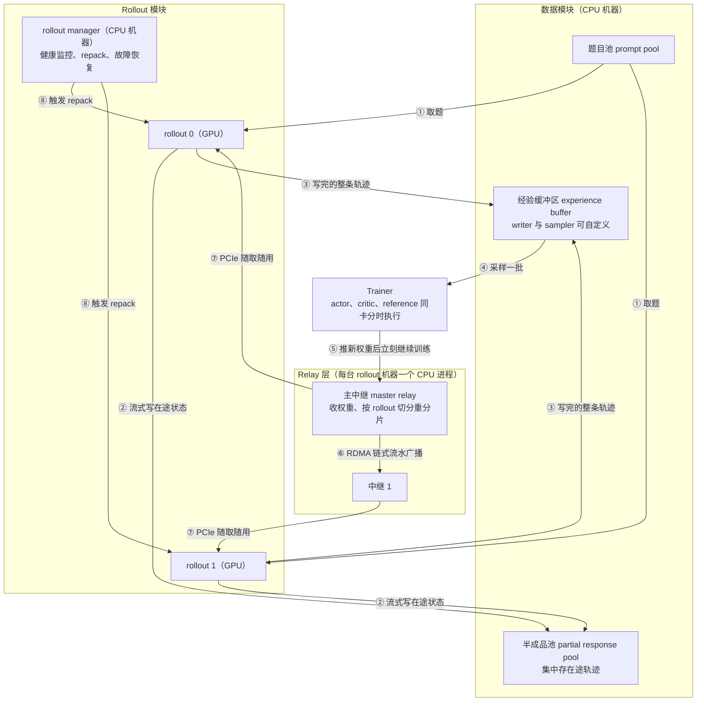

# Laminar：异步 RL 的最后一道屏障，是「所有 rollout 同时换权重」这个时刻

<!-- release-date: 2025-10-14 -->

> 本文依据 **Laminar: A Scalable Asynchronous RL Post-Training Framework**，EuroSys '26 正式版（第 21 届欧洲计算机系统会议论文集 pp. 400–422，DOI [10.1145/3767295.3803580](https://doi.org/10.1145/3767295.3803580)，2026-04 出版，共 23 页）；同一工作的预印本是 arXiv:2510.12633。十三位作者，Guangming Sheng 与 Yuxuan Tong 并列第一作者；单位是香港大学、ByteDance Seed、香港中文大学、上海交通大学，第一作者同属港大与 ByteDance Seed，末位作者 Chuan Wu 在港大（PDF p. 1）。页码均指这份 23 页 PDF 自身的页码。文中区分三件事：**论文明确写了什么**、**我们怎么解释它**、**哪些是外部资料**。

## 读前先把几个词说成人话

这是一篇系统论文，没有模型架构和训练 recipe。它讨论的是：大模型做强化学习（Reinforcement Learning，RL）后训练时，GPU 为什么大量空转，以及怎么让它们不空转。下面这些词够读完全文。

- **rollout（生成副本）与 trajectory（轨迹）**：rollout 是拿着当前模型权重、专门负责写回答的推理实例。它对一道题写出的完整回答（多轮任务里还夹着工具调用和环境反馈）叫一条轨迹。
- **actor（被训练的模型）与 trainer（训练端）**：actor 就是正在被更新的那个模型；trainer 是跑反向传播、更新 actor 的那组 GPU。
- **一轮 RL 迭代**：先生成、再训练。训练时一个全局批通常再切成若干个 mini-batch，每个 mini-batch 更新一次参数（PDF p. 3–4）。
- **on-policy（同策略）与 staleness（陈旧度）**：训练用的数据如果恰好由当前这版权重生成，就是同策略；如果由早几个版本生成，落后几个版本，陈旧度就是几。
- **权重同步**：trainer 更新完，把新权重送到所有 rollout 手里。
- **KV Cache（键值缓存）**：生成时把已经算过的历史留在显存里，不必每写一个 token 都从头重算。它的容量决定一个 rollout 能同时解码多少条轨迹。
- **访存受限（memory-bound）**：瓶颈不在算力，而在把权重和缓存从显存搬进计算单元。大模型逐 token 解码是典型的访存受限操作。
- **RDMA、PCIe、NCCL**：RDMA 是跨机器直接读写对方内存的网络技术；PCIe 是同一台机器里 CPU 内存与 GPU 之间的通道；NCCL 是 NVIDIA 的 GPU 集合通信库，权重广播通常走它。

## 一句话先说清

长思维链和 Agent 任务里，同一批题目的回答长短能差一个数量级：论文说有些任务第 99 百分位的长度是中位数的十倍（PDF p. 3）。同步系统里，一批轨迹要等最长的那条写完才能进入训练，写得快的卡只能干等。论文给的数字是：数学推理任务里生成阶段最多占整轮时间的 83.1%（PDF p. 2–3）。

过去一年的主流答案是「异步」：把生成和训练放到不同的 GPU 上，让它们重叠。论文的判断是，这些异步方案都还留着同一个死结（PDF p. 4）：

> 所有 rollout 仍然要在同一个时刻停下来，一起换成新权重。

只要这个全局同步点还在，快的 rollout 就还是要等慢的，加卡也只是多几张卡一起等。论文实测，在最大集群规模下，这种气泡让同步基线最多有 49.2% 的 GPU 时间完全空闲，一步陈旧流水线也有 22.3%（PDF p. 4）。

Laminar 的答案是把**异步的单位从「一批」换成「一条」**，论文叫 **trajectory-level asynchrony（轨迹级异步）**：每条轨迹按自己的节奏生成、写完就入库、被 trainer 按需取走；每个 rollout 自己决定什么时候换权重，不跟别人对齐（PDF p. 2、p. 4）。让它跑起来靠两件具体的事：

1. **relay worker（中继进程）**：在每台 rollout 机器的 CPU 内存里常驻一份最新权重。trainer 只推给一个主中继就回去训练；rollout 写完一批，随时从本机中继取新权重（PDF p. 6–8）。
2. **repack（重打包）**：把几个 rollout 上剩下的零星长尾轨迹搬到少数几个 rollout 上合并解码，腾空的 rollout 立刻换新权重开工（PDF p. 8–10）。

在 1024 张 H800 上，论文报告最高 5.48 倍的训练吞吐加速（PDF p. 1）。这个数要连着分母读：它是对同步 verl 的比值；对最强的异步基线 AReaL，平均是 1.39 倍、最高 1.81 倍（PDF p. 11）。正式版还补了质量证据：7B 与 32B 在 AIME 2024 上的通过率是 36.6% 与 47.0%，论文说与同步基线相当（PDF p. 12）。

### 一条阅读路线

只有半小时读原文，建议按这个顺序：

1. **p. 4 Figure 3**：五种排布画在同一条时间轴上，全文的论点都在这张图里。
2. **p. 5 的三个挑战**：为什么不能直接用 GPU 直传做异步权重同步，为什么长尾要在单个 rollout 内部再解决一次。
3. **p. 6 Figure 5 与八个步骤**：四个模块怎么连起来。
4. **p. 8–10 §5**：Figure 9 的 KV Cache 三段曲线和 Algorithm 1。
5. **p. 11–12 §8.1–8.2**：吞吐、扩展效率与收敛，连同附录 p. 21–22 的 Table 2、Table 3 一起读。

## 主要矛盾：长尾不是抖动，是每一批都会发生的结构性空转

### 时间花在哪

论文 Figure 1(b) 把两类任务的一轮迭代拆成三段（PDF p. 2）：

| 任务 | LLM 生成 | 环境交互 | 训练 |
|---|---:|---:|---:|
| 单轮（数学） | 83.1% | — | 16.9% |
| 多轮（代码，带沙箱） | 51.5% | 30.2% | 18.3% |

数字读自 Figure 1(b) 的堆叠柱标注。单轮任务里训练只占 16.9%，只优化训练阶段的工作天花板很低。多轮任务里 LLM 生成降到 51.5%，但环境交互补上 30.2%，而环境耗时取决于沙箱排队和外部 API，系统控制不了（PDF p. 3）。论文还顺手堵掉一条优化路线：有些系统把生成和训练阶段里的「经验准备」重叠起来，但经验准备只占整轮时间的 7.3%，收益有限（PDF p. 3）。

### 分布本身就是歪的

Figure 2 左边是 AIME 题上的回答长度分布，右边是代码沙箱的执行延迟分布，两张都是大量样本挤在左侧、少数样本拖出长尾（PDF p. 3）。正文把这写成「第 99 百分位是中位数的十倍」，并引 DAPO 与 SWE-bench 两篇工作支撑（PDF p. 2–3）。附录 Figure 17 另给了吞吐实验所用四个检查点的长度分布：7B 数学任务的分布最宽，一直拖到 1.5 万 token；32B、72B 数学与 7B 工具任务大多集中在几千 token 以内（PDF p. 20，读自图）。

### 为什么加卡不解决问题

一个自然的念头是给每个 rollout 多分几张卡，让单条轨迹写得快一点。论文用 Figure 4 否掉了这条路：解码延迟对 batch 大小很不敏感，多给卡只换来边际的延迟下降（PDF p. 4–5）。这张图同时埋下了第二个设计的伏笔，后面讲 repack 时再看。

所以矛盾很清楚：

> 生成是大头，生成里最贵的不是算得慢，而是等得久。而「等」来自一个规则：一批轨迹要一起交齐，所有 rollout 要一起换权重。

## 先看全景：五种排布画在同一条时间轴上

图引自原文 Figure 3（PDF p. 4）。竖着的黄条是权重同步，斜纹是空转气泡，绿条深浅代表不同权重版本。五行各自的问题，论文在 §2.3 逐条写了：

- **(a) 同步共置**，即 verl 的默认做法：完全同策略，代价就是那段斜纹，一批里最慢的那条决定所有卡什么时候进入训练（PDF p. 3）。
- **(b) 一步陈旧**：生成和训练重叠了，但 trainer 的进度仍绑在整批交齐上，所有 rollout 仍在同一个同步点换权重，图上直接标着「长尾问题仍在」（PDF p. 4）。
- **(c) 流式生成**：trainer 先拿早完成的短轨迹训前几个 mini-batch，缓解了 trainer 的等待；但最后一个 mini-batch 仍要等最慢那条。又因为一轮的最终权重要等最后一个 mini-batch 训完才有，系统得把上一版权重拷到专门的显存缓冲区，给中途来取的 rollout 用，图中橙色小块就是这次拷贝（PDF p. 4）。
- **(d) partial rollout**：AReaL 等系统的做法，新权重一到就打断所有在途轨迹，换上新权重接着写（PDF p. 4）。论文列了两笔代价：每条被打断的轨迹都要重建 KV Cache（re-prefill，图中灰块），实测平均占每个权重版本 rollout 时间的 24.1%；一条回答由多个策略版本拼成，会拖慢收敛（PDF p. 4）。
- **(e) 不开 repack 的 Laminar**：图上没有一条贯穿所有泳道的同步竖线。G0 早早换到新版本，G1 很久之后才换；trainer 只和经验缓冲区打交道（PDF p. 4）。每个 rollout 内部仍有少量长尾气泡，这是第二个设计要收拾的摊子。

**我们如何解释它。** (b)(c)(d) 都在「设一个陈旧度上界 $k$，按预定时间表做全局同步」这个框架里改良。论文对这个框架的批评分两层（PDF p. 4）。第一层是调参难：$k$ 大，吞吐好、收敛差；$k$ 小，收敛好、吞吐差。第二层更要命：$k$ 是静态超参，而 RL 的负载是动态的。轨迹长度会随训练变长、变短或来回震荡（论文引 DeepSeek-R1、DAPO、Kimi k1.5 的观察），环境延迟随排队剧烈波动；训练早期合适的 $k$，到中期可能既低效又不稳。问题不在 $k$ 取几，而在让所有轨迹服从同一张更新时间表本身。

## 转向：陈旧度从要调的输入，变成可观测的输出

轨迹级异步之后，陈旧度换了一种定义（PDF p. 10）：

> **固有陈旧度（inherent staleness）**：一条轨迹由模型版本 $K$ 生成，写完时 actor 已经更新到版本 $M$，它的固有陈旧度就是 $M-K$。

$$
\text{staleness} = M - K
$$

它由这条轨迹自己的生成耗时和 trainer 的更新速度共同决定：轨迹变长它自然变大，trainer 变快它也变大。正式版写明，Laminar 支持显式配置陈旧度上界，但设计上不需要：设紧了掉吞吐，设松了等于没设（PDF p. 10）。rollout 每写完一批或被 repack 释放就立刻换到最新版本，这是把固有陈旧度压低的主要手段（PDF p. 10）。

Figure 10 是 7B 模型在 64 张 H800 上训练 8 小时的固有陈旧度分布（PDF p. 10）。论文的结论是「始终很低，通常小于 3」；所有实验设置里观测到的最大值是 4（PDF p. 10–11）。从图上读：第一个半小时里陈旧度为 0 的轨迹约占 35%，之后各时段只有约 13%–18%，陈旧度 1 占约一半，2 占三成上下，3 很少。

**我们如何解释它。** 这张图同时说明收益和代价。收益是陈旧度被压在个位数，而且没有随训练推进恶化。代价是热身之后真正同策略的轨迹不到两成。Laminar 不是一个「几乎同策略」的系统，而是一个彻底异策略、但陈旧度自己稳定在很小范围内的系统。这个区别在后面谈算法代价时很要紧。

## 架构全景：四个模块，八个步骤

这张图根据原文 Figure 5 与 §3.1–3.2（PDF p. 6–7）重画，是模块与数据流的机制示意，圈号对应论文的八个步骤，不表示带宽或耗时。

四个模块的职责（PDF p. 6）：

- **Rollout 模块**：一个 rollout manager 加很多 rollout。manager 刻意放在 CPU 机器上，跟 GPU 机器的故障隔离开；它监控各 rollout 的负载、决定何时重打包，也管健康检查、权重广播拓扑和故障恢复。每个 rollout 写完自己那批，就去找同机的中继拿最新权重。
- **数据模块**：三个独立进程，都在 CPU 机器上。题目池供题；半成品池集中保存在途轨迹，是容错的基础；经验缓冲区存已完成的轨迹，读写各有一个可自定义的接口，采样策略和缓冲区满时的淘汰策略都交给用户。
- **Relay 层**：一个分层的参数服务。manager 指定一个中继当主中继，由它接收 actor 的新权重，再广播给其他中继；每台 rollout 机器上一个中继进程，把最新权重放在本机 CPU 内存里。
- **Trainer**：从经验缓冲区采样，按选定的 RL 算法更新模型。actor、critic、reference 等模型同卡分时执行，论文直接引了 DeepSpeed-Chat 与 HybridFlow 的做法（PDF p. 6）。

**我们如何解释它。** Laminar 没有重做 trainer 内部，换掉的是 trainer 与 rollout 之间的关系。八个步骤里最关键的是第 ⑤ 步：trainer 把权重推给主中继后立刻开始下一轮训练，不等权重分发到其他中继或 rollout（PDF p. 6）。整条链路上再没有一个所有人都要停下来对齐的时刻。第二关键的是 ② 与 ③ 的分工：在途状态和完成状态进两个不同的池子，前者服务容错，后者服务训练。

## 核心设计一：把权重同步搬到 CPU 上

### 旧问题：异步之后，GPU 直传走不通

现有异步系统在全局同步点用 NCCL 做 GPU 到 GPU 的直传，带宽很高。论文说，一旦 rollout 随时可能来要新权重，这条路就走不通了（PDF p. 5）：

1. **要额外的显存缓冲区。** 一轮的最终权重要等最后一个 mini-batch 训完才有，为了让 rollout 在训练中途能拉，actor 得在整轮里留着上一版权重；为了让 actor 能主动推，rollout 得缓存收到的新权重直到自己这批写完。大模型的缓冲区可能直接装不下；装得下也要从训练 batch 或 KV Cache 里挖，两边都掉吞吐。
2. **通信 kernel 会和计算抢 SM。** NCCL 的通信 kernel 与训练、解码 kernel 争用流式多处理器，两边都被拖慢。
3. **不留缓冲区，actor 就得停等。** 它得等 rollout 把权重取走才能进下一个 mini-batch，刚拆掉的阻塞同步点又装了回去，rollout 越多越糟。

论文给自己定的目标是：异步权重同步期间，actor 和 rollout 两边都零额外显存（PDF p. 5）。

存储系统中转也不行。SRL 用 NFS、OpenAI Five 用 Redis 转存权重，模型只有几 MB 时没问题。论文实测 32B 模型一个 4 GB 的权重分片光序列化就要约 8 秒，走普通 TCP 到存储系统再回来又加 10–20 秒，而且落在每个 rollout 的关键路径上；很多 rollout 同时来拉，存储系统本身又成了争抢点（PDF p. 7）。

### 新设计：中继住在 rollout 机器的主机内存里

在每台 rollout 机器上起一个 CPU 进程，把最新权重放在本机内存里，理由是这类主机内存大多闲着（PDF p. 7）。实现用锁页的 CPU 共享内存，rollout 进程可以直接经 PCIe 把模型分片装进自己的 GPU（PDF p. 10）。这一步同时绕开了前面三个问题：不占显存、不占 GPU 的 SM、也不是集中式存储。

### 工作机制：一个主中继，一条广播链

中继层有两个目标：actor 发布权重时停顿最小；任何 rollout 任何时候来取，延迟都低（PDF p. 7）。

**actor 只发给主中继，发完立刻回去训练。** 这次传输在下一轮开始前完成，所以 trainer 这侧没有通信争用（PDF p. 7）。主中继收到后按 rollout 的切分方式（比如 rollout 的张量并行度）重新切分，再往下发（PDF p. 8）。**我们如何解释它**：actor 与 rollout 的并行策略不同，中间必须重分片，这正是 HybridFlow 一篇里 3D-HybridEngine 花整节解决的事；那套做法的前提是训练和生成在同一批卡上。Laminar 把重分片挪到了中继的 CPU 侧，从 actor 的关键路径上整个摘了出去。

**主中继用 RDMA 沿一条链做流水广播。** 权重切成块，一块块沿链往下传，不同跳之间的传输互相重叠（PDF p. 8）。实现上用 UCX 搭通信层，块大小按 profiling 取 32 MB，一个 7B 模型就有几百块，流水线的启动气泡相对总传输时间可以忽略（PDF p. 10）。多机 rollout 的场景下，广播用较低的 RDMA 优先级，利用 GPU 集合通信的自然空隙，避免干扰（PDF p. 8）。

附录 C 给了这条链的延迟模型（PDF p. 22–23）。设链上共 $p$ 个节点（主中继加其余中继），权重总共 $M$ 字节，切成 $k$ 块；两节点间一次发送的启动延迟是 $T_{\text{start}}$，每字节传输时间是 $T_{\text{byte}}$。一块走一跳的时间是：

$$
t_{\text{chunk}} = \frac{M}{k}T_{\text{byte}} + T_{\text{start}}
$$

第一块要走 $p-1$ 跳才到链尾，之后剩下的 $k-1$ 块逐个到达，总时间是 $(p+k-2)\,t_{\text{chunk}}$。对 $k$ 求导取零，得到最优块数与最短时间：

$$
k^{*} = \sqrt{\frac{(p-2)MT_{\text{byte}}}{T_{\text{start}}}}
$$

$$
T^{*}(p) = MT_{\text{byte}} + (p-2)T_{\text{start}} + 2\sqrt{(p-2)MT_{\text{byte}}T_{\text{start}}}
$$

三项分别是：带宽项 $MT_{\text{byte}}$，把整个模型往一条链路上灌一遍的时间，与节点数无关；延迟项随 $p$ 线性增长，但 RDMA 的启动延迟在微秒量级，2000 个节点也只有 $2000 \times 5\,\mu s = 10\,\text{ms}$；流水线项按 $\sqrt{p}$ 增长。论文的结论是总时间被带宽项主导（PDF p. 23）。

实测支持这个结论：72B 模型从主中继广播到另外 127 个中继不到 1.6 秒（PDF p. 8）。附录 Figure 19 画了 4 到 128 台机器的广播延迟，从图上读，72B 从约 1.1 秒涨到约 1.4 秒，32B 从约 0.6 秒涨到约 0.9 秒（PDF p. 21）。机器数翻了 32 倍，延迟只涨两三成，这是「亚线性、实际规模内可忽略」，不是严格的常数。

### 容错：广播链自己搭，也就能自己修

NCCL 本身不原生支持容错和弹性，传统方案里一个 rollout 挂掉就可能逼整个作业从 checkpoint 重启（PDF p. 5）。Laminar 的广播链是自己搭的，所以能自己修（PDF p. 8）：rollout manager 里的通信调度器靠心跳发现故障机器，把它踢出去、在剩下的机器里重建链路，这是一次常数时间操作，一秒内完成；主中继挂了就另选一个，再把新主中继的地址告诉 trainer。修复期间训练不中断，健康机器上的生成也不受影响，因为生成和中继通信在每台机器上是两个不同的进程。

### 收益

Figure 14 对比了 GPU 直传的全局同步做法（按 actor 与 rollout 的并行组映射，用 NCCL 零拷贝广播）与 Laminar（PDF p. 12–13）：

- 从 64 卡到 1024 卡，Laminar 把 rollout 的平均等待时间最多降 37%，最好情况最多降 47%（PDF p. 13）；
- 最好情况出现在最新权重已经缓存在本机中继里、只需并行走 PCIe 装载分片的时候；平均值贴近最好情况，因为没有全局同步点，很少有 rollout 恰好在 actor 刚训完那一刻来要权重（PDF p. 13）；
- actor 每次只停顿 0.64 秒（32B）和 1.40 秒（72B），与 rollout 数量无关，因为它只发给一个主中继（PDF p. 13）。

### 代价与边界

- **主机内存的占用没有量化。** 每台 rollout 机器要常驻一整份权重。按 BF16 估算（论文没写同步用什么精度，这是我们的假设），72B 约 144 GB 一台。论文只说主机内存「大多闲着」（PDF p. 7）。
- **有效带宽远没打满网卡。** 我们的估算：按 BF16，72B 的 actor 停顿 1.40 秒，折合约 100 GB/s；机间带宽是 8 × 400 Gbps，约合 400 GB/s（PDF p. 11）。论文没有分析瓶颈在内存拷贝还是单条链路。
- **前提是 rollout 与 trainer 分卡。** 训练和生成仍在同一批卡上分时执行的系统（verl 的默认放置），根本不需要跨机搬权重，中继层没有存在的余地。

### 可迁移启发

当「所有人在同一时刻拿到同一份东西」成了瓶颈，先别急着把这次同步做快，先问它能不能变成「每个人自己来拿」：推改成拉，广播改成近端缓存，集中式改成每台机器一份本地副本。代价是多一份存储，换来的是取消一个全局屏障。

## 核心设计二：把长尾集中到少数几张卡上

中继解决了「rollout 之间不必对齐换权重的时刻」，没解决**单个 rollout 内部的长尾**。Figure 3(e) 里每条泳道后半段仍有气泡。论文强调这不只是浪费算力：卡在长尾上的 rollout 这批还没写完，没法去取最新权重，只能继续用越来越旧的权重写；能写出近同策略轨迹的 rollout 越多，训练越稳（PDF p. 5）。所以 repack 既是吞吐优化，也是陈旧度控制。

### 为什么合并几乎不增加延迟

图引自原文 Figure 4（PDF p. 5）。解码是访存受限的：瓶颈是把权重搬进来，搬一次的成本摊给 1 条还是几十条轨迹差别不大。卡在长尾上的 rollout 手里往往只剩不到 8 条轨迹，解码它们和解码 64 条的延迟相近（PDF p. 5）。把几个 rollout 上同一权重版本的零头合并到一张卡上，几乎不拖慢这些轨迹，却能腾出其余的卡。

**我们如何解释它。** 从图上读，32B、TP=4 那条线在 batch 8 时约 11 毫秒，batch 64 时约 18 毫秒，并非完全相同；但 batch 放大 8 倍、单步延迟只多六成，吞吐仍然大幅上升。这也是 Algorithm 1 必须设一个 batch 上界 $B$ 的原因：越过拐点，延迟就真的起飞了。

### 怎么判断一个 rollout 空了：看 KV Cache

图引自原文 Figure 9（PDF p. 9）。以往的做法是设一个「剩余请求数」阈值，低于它就算长尾，但最优阈值要逐个作业离线 profiling，RL 负载一直在变，不实用（PDF p. 5、p. 9）。Laminar 换成看 KV Cache 占用率，理由是访存受限的生成里，KV Cache 容量才是限制并行解码 batch 的真正瓶颈（PDF p. 9）。

曲线有清楚的三段：整批一起开写，占用一路爬到阈值 $C_{\max}$（如总量的 99%）；之后有轨迹写完，排队的立刻填进来，占用顶在平台；排队清空、剩下的轨迹陆续写完，占用才开始下滑。论文从这一刻起判这个 rollout 空闲，它剩下的长轨迹成为 repack 候选（PDF p. 9）。这个阈值行为在不同负载上一致，不需要按负载调阈值（PDF p. 9）。

**我们如何解释它。** 从图上读，这一批的生成窗口约 675 秒，其中约 345 秒处在占用下滑的拖尾期，超过一半。这就是「GPU 严重利用不足」的具体形状。KV Cache 占用率好用，不是因为它更精确，而是因为它有一个与负载无关的自然拐点：排队一空，它必然从平台往下掉。

### 怎么合并：一个装箱问题

论文把重打包建模成装箱问题：每个利用不足的 rollout 是一件物品，目的地 rollout 是箱子，目的地就从这些利用不足的 rollout 里挑，目标是释放尽可能多的源 rollout（PDF p. 9）。每个 rollout 用两个量描述：当前 KV Cache 占用 $C_{\text{used}}$ 与在跑轨迹数 $N_{\text{reqs}}$；约束是 KV Cache 阈值 $C_{\max}$，以及由 roofline 模型定出的并行解码上界 $B$，超过 $B$ 解码就从访存受限转成算力受限（PDF p. 9）。

Algorithm 1 是一个 Best-Fit 启发式（PDF p. 9–10）：

1. **筛候选**：KV Cache 占用低于 $C_{\max}$ 且不再上升（处在下滑期），剩余轨迹数小于 $B$；
2. **排序**：按 KV Cache 占用从小到大，先释放包袱最轻的，小负载更容易找到地方安置；
3. **匹配**：对每个源，找出尚未被标记释放、装得下的候选当目的地；装得下是指目的地现有负载、已分给它的其他源、加上这个源，合计不超过 $C_{\max}$ 与 $B$；
4. **选择**：在可行目的地里挑合并后 KV Cache 最满的那个，把宽松的目的地留给后面更大的负载；
5. 记下这次搬迁，把源标记为可释放。

复杂度是 $O(|S|^2)$，$|S|$ 是候选数，实践中很小（PDF p. 10）。

### 什么时候触发、怎么搬

两个触发条件（PDF p. 8）：周期性检查，例如每 5 秒一次；trainer 每训完一个全局批立即触发一次，为的是尽快腾出 rollout 去用最新权重生成同策略数据。搬迁分三步（PDF p. 8–9，Figure 8）：manager 异步收集各 rollout 的进度并**按权重版本分组**；每组内部跑一次装箱；把源 rollout 上未完成的轨迹搬到目的地。整个过程异步进行，不阻塞训练和其他生成。

按版本分组是正确性的关键：只在同版本组内合并，一条轨迹才能从头到尾只由一个策略版本写成，这是 Laminar 相对 partial rollout 的核心算法优势（PDF p. 13）。

### 收益

实验用 32B 模型、128 卡：64 卡给 trainer，64 卡给 rollout，每个 rollout 占 4 卡，共 16 个 rollout（PDF p. 13）。Table 1（PDF p. 13）：

| | 轨迹生成平均 / 最大延迟（秒） | 重打包开销（秒） | 平均 KV Cache 利用率 |
|---|---|---:|---:|
| 开 repack | 290 / 828 | 0.69 | 82.2% |
| 不开 repack | 296 / 826 | — | 71.6% |

开 repack 后生成吞吐提升 26%（PDF p. 13），Figure 15 上开与不开两条线大约在 6.8 万与 5.5 万 token/s 附近（读自图）。平均 KV Cache 利用率「提升 14.8%」是相对提升：82.2% 与 71.6% 差 10.6 个百分点，$10.6 / 71.6 \approx 14.8\%$，这道除法是我们算的。两行的平均与最大延迟几乎相同，这是「不增加轨迹延迟」最直接的证据。

### 代价与边界

- **搬迁到底搬什么，论文没写。** 只报了 0.69 秒这个总开销，没有说在途轨迹是传 KV Cache、还是在目的地按已生成的 token 重算前缀。若是后者，就是一次小规模的 re-prefill，而这恰是论文批评 partial rollout 的理由。
- **版本越碎，腾挪空间越小。** 只在同版本组内合并，同时在用的版本一多，每组候选就少。论文没有分析这一点。
- **$B$ 仍要靠 roofline 定。** 拐点随模型、序列长度、硬件而变。论文说 KV Cache 阈值不用调，没说 $B$ 不用调。
- **前提是解码访存受限。** 如果生成负载变成算力受限（比如大量投机解码），合并的收益会缩水。

### 可迁移启发

判断一个执行单元是否空闲，找那个结构上会先枯竭的资源，而不是找一个需要标定的阈值。任何有排队、有有限容量的系统（线程池、连接池、消息消费者）都可以找找自己的这条曲线，用「占用开始不可逆下滑」代替「剩余任务数小于 N」。

## 容错：故障隔离是解耦顺手带来的

论文强调全解耦的第二个好处是故障隔离（PDF p. 5–7）。复杂任务里一条轨迹可能要写好几个小时，一台机器挂掉就丢掉上面所有在途工作，代价很大（PDF p. 6）。三类故障的处理（PDF p. 7）：

- **rollout 故障**：心跳发现，先在原 GPU 上重新初始化，不行就整机驱逐。在途轨迹的状态安全地留在半成品池里，manager 把被打断的轨迹重新分给同一权重版本的健康 rollout，或者等新机器补进来；新机器从主中继同步最新权重，或从 actor 的 checkpoint 加载指定版本。
- **中继故障**：不用等超时就能发现，调度器用健康节点重建广播链，几秒内恢复，不打断生成。
- **trainer 故障**：走标准 checkpoint 恢复；这段时间 rollout 继续用手上最新的权重生成，trainer 恢复后接着从经验缓冲区采样。

实测时手动杀掉一台含两个 rollout 的机器，设置同 repack 实验（PDF p. 13，Figure 16）：生成吞吐立刻下跌，训练吞吐基本不受影响或略降；系统在约 252 秒内恢复，包括申请新机器并初始化 rollout；恢复后两条吞吐都回到原水平。图上还标了一个「faulty iteration（delay due to asynchrony）」的点，训练吞吐在那里掉了一下。异步没有让故障无感，只是把冲击从「整个作业重启」摊薄成「某一轮慢一点」。

**可迁移启发**：这套容错的核心不是心跳，而是半成品池——把长耗时任务的中间状态从执行节点上剥离出来，放到不跟执行节点一起死的地方。单个任务耗时一旦远大于故障间隔，中间状态就必须外置，否则容错会退化成重跑。

## 实验：先把分母摊开

### 配置

| 项目 | 取值（PDF p. 11） |
|---|---|
| 集群 | 128 台机器、1024 张 H800-80GB；机内 NVLink 400 GB/s，机间 8 × 400 Gbps |
| 软件 | CUDA 12.7、PyTorch 2.7.1、NCCL 2.26.2、vLLM 0.9.0 |
| 模型 | Qwen2.5 7B / 32B / 72B |
| 数据 | DAPO-Math-17k，最大输入 2K、最大输出 16K |
| 算法 | 开源 GRPO 实现，加 DAPO 的 Clip-Higher，规则奖励；工具任务的 rollout 与代码沙箱交互 |
| 全局训练批 | 8192 条 = 512 道题 × 每题 16 条；每轮 16 次 mini-batch 更新；工具调用最多 8 次 |
| 指标 | 吞吐 = 一个全局批里 prompt 与回答的总 token 数 ÷ 一轮 RL 迭代时间（相邻两次 actor 更新完成之间）；10 轮预热后取 5 轮平均 |

吞吐实验的数学任务用三个不同规模的中间检查点起训（Qwen2.5-Math-7B、Qwen2.5-32B、Qwen2.5-Math-72B），工具任务用 ReTool 开源实现里的 7B 检查点（PDF p. 20）。

四类基线（PDF p. 11）：

1. **同步**：verl v0.5.0，用它最优的共置放置；
2. **一步陈旧、流式生成**：论文自己在 verl 上实现。理由是很多同期异步系统没开源、只能跑在昇腾 NPU 上（论文点名的是 AsyncFlow），或者在训练、生成、权重同步环节缺乏系统优化；自己实现是为了消除实现差异；
3. **partial rollout**：AReaL v0.3.0，它把流式生成与 partial rollout 结合，并用算法缓解一条轨迹内多版本混用的影响。

除 AReaL 外，所有基线都用 vLLM 生成、PyTorch FSDP 训练；AReaL 用它改过的 SGLang 生成，训练只支持 Megatron-LM（PDF p. 11）。

还有三条读图前必须记住的口径：

- **吞吐图里 AReaL 的陈旧度上界设为无穷大**，为了拿到最大吞吐；流式生成设为 1（PDF p. 11）。收敛实验里 AReaL 改用它建议的 4（PDF p. 12）。同一个名字，在两张图里不是同一套超参。
- **7B 的 rollout 张量并行度不同**：AReaL 与 Laminar 设 1 追极限吞吐；verl、一步陈旧、流式生成设 2，论文说是为了在吞吐与延迟之间取平衡、缓解长尾（PDF p. 20）。基线被迫拿吞吐换单条延迟，Laminar 不怕单条慢，这本身就是「不怕长尾」带来的连锁收益。
- **各系统的训练 / 生成卡数分别调优过**（PDF p. 21，Table 2）。以 72B 在 1024 卡为例：一步陈旧与流式生成是 256 / 768，AReaL 是 640 / 384，Laminar 是 768 / 256；7B 在 256 卡时 Laminar 是 192 / 64。前两个基线要把四分之三的卡砸在生成上，Laminar 反过来只用四分之一。论文的解释是生成侧效率高了，就能把更多卡分给 trainer（PDF p. 11）。所以这些柱子不是「同样的资源划分下谁更快」，Laminar 的快有一部分体现在它允许一个更好的配比。

### 吞吐

图引自原文 Figure 11（PDF p. 12）。按对比系统拆开，单轮任务上的平均加速比是（PDF p. 11）：

| 对比系统 | 平均 | 最高 |
|---|---:|---:|
| verl（同步） | 2.56× | 5.49× |
| 一步陈旧 | 1.98× | 4.09× |
| 流式生成 | 1.93× | 4.06× |
| AReaL | 1.39× | 1.81× |

这张表把摘要里 5.48 倍的来历摆清楚了：它是对同步 verl 的比值（正文写 5.49、摘要与图注写 5.48，差 0.01，论文没解释）。对同样做了异步、而且开到最大吞吐配置的 AReaL，平均 1.39 倍。前者度量「异步相对同步值多少」，后者才是「Laminar 相对现有异步方案值多少」。

论文给的两个原因（PDF p. 11）：一是轨迹级异步让每个 rollout 按自己的节奏走，基线被全局同步屏障卡住，快的等慢的；AReaL 用 partial rollout 缓解，但打断、恢复和 KV Cache 重算又吃掉生成吞吐。二是气泡少了，同样的集群可以多分卡给 trainer。控制面的开销大多与 GPU 计算重叠，剩在关键路径上的数据面开销平均 1.9 秒，来自经验缓冲区采样与数据传输（PDF p. 12）。

图引自原文 Figure 12（PDF p. 12）。工具任务上论文报告对「所有基线」平均 2.62 倍（PDF p. 11），但图例里没有 AReaL，这里的「所有基线」只有三个。最能体现环境延迟长尾的场景，恰好没有和最强基线比。

### 扩展性

论文的强扩展效率定义为：最大规模吞吐与最小规模吞吐之比，除以最多卡数与最少卡数之比（PDF p. 12）。全局训练批随规模固定，属于强扩展设置。

| | 数学任务 | 工具调用任务 |
|---|---|---|
| Laminar | 53.7%（32B 上最高 68.2%） | 46.5% |
| 最好的基线 | 33.6%（AReaL，最高 39.2%） | 12.9%（流式生成） |

数字来自 PDF p. 12。工具任务上 46.5% 对 12.9% 最说明问题：有外部环境延迟时，现有异步方案几乎不扩展，卡数翻 16 倍，吞吐只涨约 2 倍（$0.129 \times 16 \approx 2.1$，我们的计算）。这对应「环境延迟的长尾比输出长度的长尾更难对付」这个论断。

附录 B 把规模的影响拆成两段（PDF p. 20–21）。**64 卡以内平均只有 1.41 倍**：训练和生成都要一定数量的卡才能靠并行装下模型，可选的资源分配很少，各系统只能用相近的放置，而且这些放置本身往往配不平；这时 Laminar 的收益主要来自消掉长尾气泡。**最大规模下平均 3.34 倍**：verl、一步陈旧、流式生成被全局权重同步卡死，加 rollout 资源边际收益很小；AReaL 靠 partial rollout 缓解，但扩展性转而被 KV Cache 重算限制，规模越大轨迹越多、更新越频繁，重算越重。论文还说 rollout 副本越多，repack 越有效，这一句是定性论断，没有单独的实验。

## 收敛：快了，学到的东西一样吗

图引自原文 Figure 13（PDF p. 12）。收敛实验用 Qwen2.5-Math-7B 与 Qwen2.5-32B 起训，卡数分配同吞吐实验；AReaL 与 Laminar 每个 rollout 的最大并发降到 256，采样策略用默认的 FIFO（PDF p. 20）。超参见 Table 3（PDF p. 22）：

| | verl | 一步陈旧 | 流式生成 | AReaL | Laminar |
|---|---|---|---|---|---|
| 算法 | GRPO | GRPO | GRPO | Decoupled PPO | GRPO |
| 学习率 | 1e-6 | 1e-6 | 1e-6 | 2e-5 | 1e-6 |
| Clip 上 / 下 | 0.28 / 0.2 | 0.28 / 0.2 | 0.28 / 0.2 | 0.2 / 0.2 | 0.28 / 0.2 |
| 训练 mini-batch | 512 | 2048 | 2048 | 2048 | 2048 |
| 陈旧度上界 | 0 | 1 | 1 | 4 | 4（观测值） |

组大小都是 16，全局批都是 8192。表注写明：三个异步系统把 mini-batch 调到 2048，是为了在异策略数据上稳住训练，与 AReaL 的配置对齐（PDF p. 22）。

论文的结论（PDF p. 12）：

- 数学任务上，Laminar 比最好的基线（同策略的 verl）收敛快约 1.77 倍（7B）和 1.59 倍（32B）；
- Laminar 的奖励达到 0.39（7B）与 0.51（32B），同步基线是 0.40 与 0.50；
- AIME 2024 上，Laminar 训出的 7B 与 32B 通过率是 36.6% 与 47.0%，论文说与同步基线相当，但没有给同步基线的 AIME 数字；
- 其他异步系统的吞吐提升被陈旧度或额外偏差抵消了，比如 AReaL 一条轨迹里混用多个策略版本。

**图上还有两件事值得看。** 第一，7B 那张图里一步陈旧与流式生成到 40 小时仍停在约 0.2–0.3，明显低于 verl 与 Laminar 的约 0.4（读自图）。这等于承认异步在这批实验里普遍有算法代价，Laminar 只是代价最小的那个。第二，附录 Figure 18 按样本数画同样的曲线（PDF p. 20），论文只说 Laminar「匹配或超过异步基线的样本效率」。从 7B 那张图读，同策略的 verl 约 240 万样本就到 0.4，Laminar 要约 350 万，多用四成多样本（读自图，我们的估算）。所以 Laminar 快在墙钟上，靠的是吞吐，不是每个样本学得更多。

**这组证据能支持什么。** 在这两个配置下，Laminar 到达同一奖励所需的墙钟时间明显短于同步 verl，最终奖励与 AIME 分数没有掉。它不能支持「异步没有代价」：纵轴是归一化奖励，AIME 只报了 Laminar 自己，样本效率低于同策略基线，也没有换任务、换算法重复。

## 异步的算法账：论文兑现了什么，留下了什么

### 兑现了的保证

Laminar 相对 partial rollout 的核心算法优势只有一句：**每条轨迹自始至终由单一、一致的策略版本生成**（PDF p. 13）。两条规则合起来保证这一点：rollout 只在一批写完或被释放后才换权重（PDF p. 6、p. 10）；repack 只在同版本组内合并（PDF p. 8）。相比之下，partial rollout 的一条长轨迹由多个版本拼成，论文在 §9 说：版本数随序列长度和 actor 更新频率线性增长，会扭曲输出长度的自然分布，还会伤到依赖「同版本轨迹组」的无价值网络类算法；更新越频繁污染越重，于是吞吐和训练稳定性又被绑到一起（PDF p. 14）。

### 没交代的：同一组 16 条回答是不是同一版本

GRPO 用同一道题的一组回答互相比较算优势，实验里组大小是 16（PDF p. 22）。论文批评 partial rollout 时用的正是「组要来自一致的权重版本」这个理由（PDF p. 14），但没有说明 Laminar 自己怎么保证同一道题的 16 条回答同版本。

**我们如何推断。** 如果一道题的 16 条回答总被分到同一个 rollout 的同一批里，它们就同版本，因为 rollout 写完整批才换权重。但论文没写题目池是按题发还是按条发，也没写经验缓冲区采样时会不会把同一组凑齐再交给 trainer；默认采样是 FIFO（PDF p. 20、p. 22），FIFO 本身不保证按组对齐。repack 还会把不同 rollout 的轨迹搬到一起，只要同版本，这一点不破坏组一致性。

### 没有异策略修正

Laminar 用的是 GRPO 加 Clip-Higher，这是标准的裁剪，不是针对陈旧数据的重要性采样修正（PDF p. 11、p. 22）。同一张表里的 AReaL 用 Decoupled PPO，论文明说这是为了缓解 partial rollout 引入的误差（PDF p. 12）。基线为异步付了一笔算法上的保险，Laminar 没付。它的底气是固有陈旧度实测不超过 4，外加把 mini-batch 调大到 2048。

**我们如何解释它。** 这是一个经验上成立、但没被消融检验过的选择。热身之后同策略轨迹不到两成，集群更大、trainer 更快时陈旧度分布会右移，这个选择什么时候失效，论文没有实验回答。

### 训练批的构成，交给了系统动力学

§9 自己点破了一件更微妙的事：规模上去之后，rollout 的生成速度会超过 trainer 的消费速度，产生大量多样的经验，怎么用好它们成了关键问题（PDF p. 14）。于是缓冲区要有淘汰策略（PDF p. 6），默认采样又是 FIFO。

**我们如何解释它。** 放在一起就得到一个论文没明说的推论：轨迹级异步下，「哪些样本进入这一批训练」不再由算法决定，而由生成速度、完成顺序、缓冲区容量和淘汰规则共同决定。短轨迹先写完、先入库、先被 FIFO 取走；长轨迹更晚完成、陈旧度更高，还可能被淘汰。这是一种系统层面引入的长度偏置。论文没测它，只把经验采样列为开放问题，建议按 TD 误差、重要性比、熵做优先级采样（PDF p. 10、p. 14）。

这一点和 DAPO 一篇有张力。DAPO 的动态采样要把整组全对或全错的题丢掉重采，保证批里每道题都有梯度，这是一个面向批、面向组的约束，要求组装批时能看见并控制整组。轨迹级异步让批的构成变成涌现结果，两者天然不合。Laminar 只采纳了 DAPO 的 Clip-Higher，没有采纳动态采样，也没有解释取舍。

### 论文自己划的边界

- **partial rollout 是正交的，不是对立的。** 论文说它可以和同步、$k$ 步陈旧、以及 Laminar 结合，进一步减少空闲；问题在训练稳定性，需要更多算法研究（PDF p. 14）。它还提到 PipelineRL 用陈旧的 KV Cache 避免重算，但快速更新下的收敛稳定性仍未充分研究（PDF p. 14）。
- **经验采样是新问题。** 论文引 OpenAI 在 Dota 2 上的经验：数据陈旧会拖慢训练；OpenAI Five 用了 57,200 个 rollout worker、51,200 个 CPU、跑了 10 个月（PDF p. 14）。Laminar 解决了「生成得够快」，随之暴露的是「生成得太快，不知道该学哪些」。

## 实现规模

全系统约 1.1 万行 Python（PDF p. 10）。trainer 与 rollout 模块在 verl 之上约 3800 行，各跑在不同的 GPU 上；经验缓冲区基于 TorchRL；模块间数据传输用 Ray 的远程过程调用；中继约 1000 行；rollout manager 里的 repack 约 1600 行（PDF p. 10–11）。论文正文没有给代码仓库地址。

## 与同方向几篇串起来读

| | HybridFlow | DAPO | AReaL | Laminar |
|---|---|---|---|---|
| 回答的问题 | 多模型 RL 数据流怎么写 | 长思维链 RL 掉的分藏在哪些默认设置里 | 一批里最慢的轨迹拖住集群怎么办 | 全局权重同步点能不能取消 |
| 改的是哪一层 | 编程模型与放置 | 算法与数据组装 | 生成与训练解耦，加算法修正 | 异步的粒度（批到条），加权重分发 |
| 陈旧度 | 无（同步） | 无（跑在同步 verl 上） | 可调上界，改目标函数 | 不设上界，实测不超过 4，不做修正 |

三条接续关系：

1. **Laminar 直接建在 verl 上。** trainer 与 rollout 模块是 verl 之上的约 3800 行（PDF p. 10），trainer 内部沿用多模型同卡分时执行，引的正是 HybridFlow（PDF p. 6）；而同步基线的标签就是「verl with colocated placement」（PDF p. 4）。HybridFlow 一篇的实验把回答强制成定长，异步与多轮 Agent 是它明显没覆盖的地方，Laminar 恰好长在这里。
2. **DAPO 是 Laminar 的数据与算法来源。** 数据集是 DAPO-Math-17k，算法是 GRPO 加 Clip-Higher，「99 分位是中位数十倍」也引了 DAPO（PDF p. 3、p. 11）。
3. **AReaL 是它最强的对手，也是它借来的对照口径。** 收敛实验的超参按 AReaL 原文与 DAPO 配置，三个异步系统的 mini-batch 也对齐 AReaL（PDF p. 22）。这里对 AReaL 的描述都只按 Laminar 论文的转述，AReaL 自己的说法见 AReaL 一篇，两边有出入时以各自原件为准。

往后看，Polar 与 ProRL-Agent 两篇把 Laminar 放进了各自的对比表：它们处理的是 rollout 与 Agent 程序、沙箱之间的边界，Laminar 处理的是 rollout 与 trainer 之间的权重和数据流，两者可以叠加。

## 限制与未公开的部分

- **质量证据仍然薄。** 只有归一化训练奖励、两个模型的 AIME 2024 通过率，没有同步基线的 AIME 数字，没有其他 benchmark。
- **没有陈旧度与修正的消融。** 不加 Clip-Higher、不把 mini-batch 调到 2048、人为推高陈旧度，Laminar 还稳不稳，论文没测。
- **组一致性没交代**（见上）。
- **repack 搬迁的实现没写**：传 KV Cache 还是重算前缀。
- **中继的主机内存占用、集中式数据模块在 1024 卡下的吞吐都没量化。**
- **工具任务没有和 AReaL 比。**
- **两个自实现基线没有公开代码**，外部无法复核这两组柱子。
- **没有一次完整后训练的总墙钟与成本。**
- **故障实验没有单独验证「被打断的轨迹从断点续上」**，只证明了系统在 252 秒内恢复吞吐。

## 可迁移启发

1. **同步的粒度要和负载的方差匹配。** 用一个方差很小时代设计的同步粒度（一批）去承载方差极大的负载（长思维链、Agent），任何「等所有人」的屏障都会退化成「等最慢的那个」。先量一下 p99 / p50。
2. **别让关键量成为要人调的静态超参。** 陈旧度上界 $k$ 必须调、调对了也只在某个阶段对、调错的代价是收敛变差而不是报错。Laminar 没把 $k$ 调得更好，而是让它变成可观测的输出。
3. **空闲指标找结构上会先枯竭的资源。** KV Cache 占用的拐点与任务、模型、batch 设置无关，好的健康指标不需要标定。
4. **把「所有人同时拿」改成「每个人自己来拿」。** 中继用一份本地缓存换掉一个全局屏障，同时躲开显存、SM 争抢和 actor 停等。
5. **把长耗时任务的中间状态从执行节点上剥离。** 半成品池让「机器挂了」的代价从重做几小时降到换台机器接着做。
6. **加速比一定连着分母和配置读。** 对同步 verl 平均 2.56 倍，对最强异步基线 1.39 倍；吞吐图里的 AReaL 陈旧度开到无穷大，收敛图里才是 4。
7. **系统论文的「更快」很少覆盖「一样好」。** 墙钟快不等于样本效率高；评估一个训练框架，另一半是它产出的数据分布是否仍是算法假设的那个分布。

## 关键词回看

- **轨迹级异步**：每条轨迹独立生成、独立入库、独立被消费，没有全局更新时间表。
- **全局同步点**：所有 rollout 在同一时刻换权重的那一刻，Laminar 要拆掉的就是它。
- **$k$ 步陈旧上界**：现有异步系统的通用做法，rollout 的权重最多落后 $k$ 个迭代，然后全局同步。
- **固有陈旧度 $M-K$**：由系统动力学决定、可以观测的量；实测通常小于 3、最大 4。
- **partial rollout**：打断在途生成、换新权重、接着写；代价是每轮 re-prefill（约占 rollout 时间 24.1%）和一条轨迹混用多版本。
- **中继（relay worker）**：每台 rollout 机器上的 CPU 进程，主机内存里常驻最新权重；主中继收权重、重分片、沿链 RDMA 广播，rollout 经 PCIe 随取随用。
- **链式流水广播**：权重切 32 MB 的块沿链传，总时间由与节点数无关的带宽项主导。
- **repack**：把同版本组里几个利用不足的 rollout 上的在途轨迹合并到少数目的地，释放其余 rollout 去换新权重。
- **空闲指标**：KV Cache 占用从 $C_{\max}$ 平台开始下滑。
- **roofline 上界 $B$**：解码从访存受限转向算力受限的拐点，合并不能越过它。
- **半成品池**：集中保存在途轨迹，rollout 容错的基础。
- **强扩展效率**：最大与最小规模的吞吐比，除以卡数比；53.7%（数学）、46.5%（工具）。

## 资料与阅读边界

**版本与首发日。** 依据的是 EuroSys '26 正式版（[DOI 10.1145/3767295.3803580](https://doi.org/10.1145/3767295.3803580)，末位作者在港大的个人主页公开了这份带 ACM DOI 与版权块的出版版 PDF）。它比 arXiv 上唯一的 v1（[arXiv:2510.12633](https://arxiv.org/abs/2510.12633)，2025-10-14 提交）更新：补了 AIME 2024 通过率、GPU 空闲与 re-prefill 占比、CPU 开销、样本效率曲线与长度分布图，写明经验缓冲区基于 TorchRL、系统也支持显式陈旧度上界，重测了广播延迟图，并把 v1 附录里的讨论并入正文。`release-date` 取 2025-10-14，即 arXiv v1 的提交日：Laminar 是系统不是模型，按「技术首次官方公开日」取值；没有找到官方代码仓库或官方博客，会议出版日是之后的事件。

**覆盖范围。** 摘要与 §1 引言；§2 背景与动机（Figure 1–4，三个挑战）；§3 架构、工作流与容错（Figure 5）；§4 中继、链式广播与故障重建（Figure 6–7）；§5 repack 工作流、空闲指标与 Algorithm 1（Figure 8–9）；§6 固有陈旧度（Figure 10）；§7 实现；§8 吞吐、扩展性、收敛、权重同步、repack、容错（Figure 11–16，Table 1）；§9 相关工作与讨论；§10 结论；附录 A（Figure 17–18，超参）、附录 B（小集群与大集群分析，Table 2，Figure 19）、附录 C（广播延迟推导，Table 3）。

**外部补充。**

- 正式版的会议、页码与出版日：[Crossref 记录](https://api.crossref.org/works/10.1145/3767295.3803580)。
- verl 上游曾有一个把 Laminar 所需钩子接进 verl 的 PR：[verl-project/verl#7570](https://github.com/verl-project/verl/pull/7570)（2026-08-26 开，2026-09-22 未合并即关闭）。它要暴露的是 rollout 副本放置、KV Cache 压力观测、中断生成、同版本内复用共享 KV 等接口，其中「观测 KV Cache 压力」正是空闲指标的数据来源。它不代表 Laminar 已经开源。

**原文未公开的缺口。** 代码与两个自实现基线；同组回答的版本一致性怎么保证；repack 搬迁在途轨迹的具体做法；中继的主机内存占用；集中式数据模块在大规模下的吞吐；工具任务与 AReaL 的对比；同步基线的 AIME 分数；陈旧度与修正的消融；完整训练的墙钟与成本。
