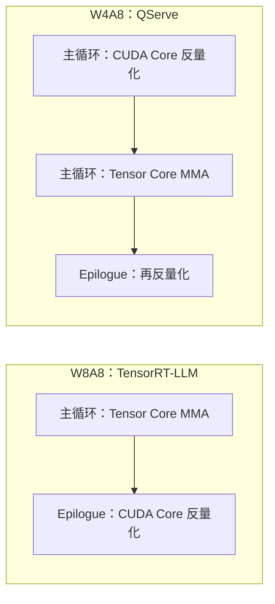

# LiquidGEMM：W4A8 省下的带宽，怎么从反量化里抢回来变成服务吞吐

<!-- release-date: 2025-09-01 -->

> 本文依据 **LiquidGEMM: Hardware-Efficient W4A8 GEMM Kernel for High-Performance LLM Serving**，arXiv:2509.01229v1，2025-09-01 提交，共 12 页。页码均指这份 PDF。上海交通大学与 ByteDance Seed 联合署名：共同一作是上海交大的 Huanqi Hu 与 ByteDance Seed 的 Bowen Xiao，通讯作者是上海交大的 Shixuan Sun，其余作者多数挂 ByteDance Seed（PDF p.1）。全文把三件事分开标注：**报告明确写了什么**、**我们如何解释或验算它**、**哪些是外部资料补充**。

W4A8、GEMM 分块、Roofline 的一般原理，本站写在知识库的 GEMM优化、权重与激活量化、量化 三篇里。那几篇讲算法家族和算账方法；本篇只讲这篇内核论文自己写了什么，以及它怎样把量化省下来的带宽变成服务吞吐。

## 读之前：这篇会反复用到的词

- **GEMM（General Matrix Multiplication，通用矩阵乘）**：把激活矩阵 $X$ 和权重矩阵 $W$ 乘起来。大模型里线性层、投影层、FFN 几乎都是它。论文写 $Y=XW^{T}$（PDF p.3）。
- **W4A8**：权重量成 4 bit，激活量成 8 bit。论文把它看成精度、算力、显存之间比较站得住的折中（PDF p.1）。
- **Tensor Core（张量核心）**：GPU 上专做小块矩阵乘加的硬件，低精度峰值很高。
- **CUDA Core**：通用计算单元。W4A8 的 4 bit 权重在进 Tensor Core 之前，要先在这里反量化成 8 bit。
- **TMA（Tensor Memory Accelerator，张量内存加速器）**：Hopper 上专管「从显存搬数据」的硬件引擎，可以和计算重叠。
- **MMA / WGMMA**：矩阵乘加指令。Hopper 上一个 **warp group（线程束组，4 个 warp、128 线程）** 一起发射 `WGMMA`（PDF p.7）。
- **SMEM / RF**：共享内存和寄存器堆。数据从显存（GMEM）进 SMEM，再进各线程的寄存器才能算。
- **反量化（dequantization）**：把低位整数量回 Tensor Core 吃得下的精度。W4A8 的这一步必须发生在主循环里，躲不掉。
- **主循环（main loop）**：沿归约维 $K$ 一片一片乘加。论文说这一段主导 GEMM 成本（PDF p.3）。
- **算术强度（arithmetic intensity）**：每从显存搬 1 个元素能做多少次运算，决定这件事是访存受限还是计算受限。

贯穿全文的矛盾不是「4 bit 够不够准」，而是：

> **W4A8 在纸面上既省带宽、又抬高算术强度；可现有内核把省下来的时间，又花在了 CUDA Core 的反量化上。服务场景里算力和带宽对不上，不是量化方案选错了，是这座 4 bit 到 8 bit 的桥太慢。**

## 一句话先说清

LiquidGEMM 不是又一个量化算法，而是一条给高吞吐推理服务用的 **W4A8 GEMM 内核**。论文做了两件必须一起成立的事（PDF p.1–2）：

1. **LiquidQuant（LQQ）**：把 4 bit 权重反量化成 8 bit，压到每 4 个元素两条硬件指令（`IMAD` 加 `XOR`），并且保证中间结果不溢出。
2. **隐式细粒度流水（Implicit Fine-grained Pipeline，ImFP）**：一个生产者 warp group 负责搬权重，两个计算 warp group 各自「反量化完立刻做 MMA」。重叠发生在计算组之间，不再靠软件同步，也不再把反量化结果写回共享内存。

摘要的门面数字是：相对当时最强的 W4A8 内核最高 **2.90 倍**；端到端系统最高 **4.94 倍**；相对 TensorRT-LLM 里的多种量化 GEMM 内核是 **1.12–1.63 倍**，系统级最高 **1.63 倍**（PDF p.1）。后文会把它们拆开：哪些是内核自己挣来的，哪些混进了注意力和 KV cache 的差异。

如果只记一句：

> **量化把权重变瘦，只买到「搬得少」。能不能变成吞吐，取决于反量化能不能被 Tensor Core 盖住。**

### 一条阅读路线

12 页里没有附录，正文到 p.11，之后是参考文献。建议按这个顺序读：

1. **p.2 Figure 1**：A100 / H100 的峰值表和 Roofline，先看清 CUDA Core 比 Tensor Core 瘦多少。
2. **p.4 Figure 4–5 与 §3.2**：现有 W4A8 为什么在大 batch 上比 W8A8 慢一倍，卡在 `vadd`。
3. **p.4–5 式（3）–（6）**：成本模型，三段时间取最大；以及 $\alpha \leqslant 5$ 的门槛。
4. **p.5–6 §4**：LQQ 的平移、补码同余和 XOR。
5. **p.6–8 §5 与 Figure 6–8**：ImFP、Dual-MMA 布局、寄存器里的反量化。
6. **p.9–11 Table 1、Figure 10–13**：端到端、LiquidServe/wo 隔离、内核对比和消融。

有两件事提前知道。其一，**这篇几乎不讲量化精度**：作者说 LQQ「保住了精度」，详细数字留给「完整版技术报告」（PDF p.9），这份 PDF 里没有。其二，**Roofline 与门槛用的是 H100 的峰值，实验跑的是 H800**（PDF p.2、p.5、p.9），两者同属 Hopper，但不是同一块 SKU。

## 第一层问题：W4A8 为什么在服务场景里算力、带宽对不上

### 纸面上，W4A8 应该左右逢源

论文把几种量化配置放进一张 Roofline 里讲（Figure 1c，PDF p.2）。人话版：

| 配置 | 纸面上该赢在哪 | 纸面上会输在哪 |
|---|---|---|
| W4A16 | 小 batch、访存受限：权重搬得少 | 大 batch：计算仍是 FP16，吃不到低位 Tensor Core |
| W8A8 | 大 batch、计算受限：INT8 Tensor Core | 小 batch：权重只瘦一半 |
| W4A8 | 两边都想要：带宽更低，又能走 INT8 MMA | 激活不能再压到 4 bit |
| W4A4 | 压缩最狠 | 激活 4 bit 往往伤精度（论文引前作，PDF p.1） |

Figure 1a 把硬件峰值摊开（PDF p.2）：

| 指标 | A100 | H100 |
|---|---:|---:|
| Tensor Core FP16 | 312 TOPS | 989.4 TOPS |
| Tensor Core INT8 | 624 TOPS | 1978.9 TOPS |
| Tensor Core INT4 | 1248 TOPS | NA |
| CUDA Core INT32 | 19.5 TOPS | 33.5 TOPS |
| 显存带宽 | 2 TB/s | 3.3 TB/s |

这张表里立刻能读出两件事（数字是论文的，解释是本文的）：

1. **Hopper 上没有 INT4 Tensor Core。** H100 那一格是 NA。所以 W4A4 的 Atom 在 H800 上反而更慢，论文把它和 QQQ 一起从后续评测里拿掉（PDF p.3）。W4A8 的「8」不是随便选的：4 bit 权重必须先回到 8 bit，才能喂给 Hopper 真正有的 INT8 MMA。
2. **Tensor Core 和 CUDA Core 差了近两个数量级。** H100 上 INT8 Tensor Core 1978.9 TOPS，CUDA Core INT32 只有 33.5 TOPS，约 59 倍（本文相除）。反量化如果走 CUDA Core，指令稍一膨胀就会把 Tensor Core 饿死。

W4A8 相对 W8A8 还多一档算术强度：同样的计算量，权重量减半，从访存受限转到计算受限的拐点会往更小的 batch 挪。服务里这很值钱：更小的 batch 就能喂饱卡，延迟更低，长序列也更不容易先把显存打满（PDF p.1、p.5）。

### 服务里，GEMM 仍然是大头

论文在 H800 上拆 LLaMA2-7B（稠密）和 Mixtral-8×7B（MoE）的推理时间，batch 从 4 到 256，两组长度是 1024 进 / 512 出与 128 进 / 128 出（PDF p.4）。LLaMA2-7B 用 W8A8，Mixtral 用 FP8，因为当时 W8A8 不支持 Mixtral。Figure 4 的结论（PDF p.4）：

- 小 batch 时，FFN 与投影层的 GEMM 主导延迟；
- LLaMA2-7B 在大 batch、长序列时，GEMM 仍超过总延迟的 **20%**；长度 1024、batch 256 那根柱子因为 OOM 没画；
- Mixtral 上 GEMM 在所有测试点都是第一大头，因为每个专家要单独做 GEMM。

decode 阶段拉长输入不会改变 FFN 和投影层的 GEMM 工作量，只会让注意力变重（PDF p.4）。所以这篇内核论文的战场很清楚：不是去重写注意力，而是把线性层这条一直在的开销压下去。

### 实测却和 Roofline 唱反调

Figure 5 画的是 decode 时单层 GEMM 的平均延迟（PDF p.4）。论文的原话比柱状图更硬：

- 小 batch（$M \leqslant 64$）时，现有 W4A8 和 W8A8 **差不多**；
- 大 batch（$M \geqslant 128$）时，W4A8 几乎比 W8A8 **慢 2 倍**，甚至不如几乎不量化的 FP16 和只压权重的 W4A16。引言里用 LLaMA2-7B、batch 256 又说了一次（PDF p.1–2）；
- Mixtral 上只有 FP8 和 W4A16 的结果，其他系统不支持这个模型。

这和「访存受限时 W4A8 该赢、计算受限时该打平 W8A8」完全相反（PDF p.4）。这里的「现有 W4A8」是 QServe；QQQ 也是 W4A8，但论文说它比不过 QServe，所以后面只拿 QServe 当代表（PDF p.3）。

### 卡点就在反量化，而且是一堆非原生指令

W8A8 是对称 GEMM：两边都是 8 bit，主循环可以整段待在 Tensor Core 上，反量化推到 epilogue。W4A8 是非对称 GEMM：Tensor Core 不吃 4 bit × 8 bit，QServe 必须在主循环里先在 CUDA Core 上把 UINT4 权重反量化成 INT8，再做 MMA（Figure 3，PDF p.3）。

上图根据 Figure 3 重画，是机制示意，不是实测时间轴（PDF p.3）。

QServe 用一个 32 bit 寄存器一次处理 4 个元素。为了防溢出，它做了两件事（PDF p.4）：

1. **渐进量化（Progressive Quantization）**：把第一级 INT8 限制在 $[-119, 119]$，让 $Q_{u4}\cdot s_{i8}$ 先别爆；
2. **先乘后减**：不按 $(Q-z)\cdot s$ 先减零点，改成 $Q_{u4}\cdot s_{i8}-s_{i8}\cdot z_{i8}$，避免去乘负数。

即便如此，减法仍可能溢出。它靠 `vadd` 对打包在 32 bit 寄存器里的 4 个 8 bit 数做向量加。论文指出，`vadd` **不是原生硬件指令**，会被展开成十几条低级操作；Nsight 在 LLaMA2-7B 的 FFN 上看到，涉及 `vadd` 的减法占了 **21% 的 warp stall**（PDF p.4）。

**我们如何解释它**：21% 不是「反量化占总时间 21%」，而是 warp 停下来等的那些时刻里，有两成和这次减法有关。它说明 CUDA Core 正在拖 Tensor Core 的后腿，不是一个能直接当加速比的分数。

## 成本模型：三个时间谁盖得住谁

论文把一次主循环迭代拆成搬数和计算，再推到整卡（PDF p.4–5）。先看这张按论文公式和 Figure 1a 的 H100 数字画出的图：

三段时间的来历（PDF p.4–5）：

- **搬数 $T_{LD}$**。激活通常更小、能留在更快的存储里，所以近似只搬权重：

$$
T_{\mathrm{LD}} \approx \frac{N_{t}\cdot K_{t}}{\phi_{\mathrm{BD}}^{x}}
$$

$N_{t}$、$K_{t}$ 是这块 tile 的宽和沿 $K$ 的厚度，$\phi_{\mathrm{BD}}^{x}$ 是一个 thread block 搬位宽为 $x$ 的数据时的有效吞吐（元素/秒）。

- **计算 $T_{\mathrm{COMP}}$**，等于 CUDA Core 反量化加 Tensor Core 乘加：

$$
T_{\mathrm{COMP}} = \frac{\alpha\cdot N_{t}\cdot K_{t}}{\phi_{\mathrm{CUDA}}} + \frac{2\cdot \min(M_{t},M)\cdot N_{t}\cdot K_{t}}{\phi_{\mathrm{TC}}^{y}}
$$

$\alpha$ 是反量化 **一个权重元素** 要的指令数，$M$ 是 batch，$M_t$ 是 tile 的高，$y$ 是激活位宽；一次乘加算两次运算。

- 流水线填满之后，一块 tile 的时间约为 $k\cdot \max(T_{\mathrm{LD}}, T_{\mathrm{COMP}})$，$k$ 是沿 $K$ 要走的步数。推到整卡，论文写成三段取最大（式 6，PDF p.5）：

$$
T \approx \Bigl\lceil \frac{M}{M_{t}} \Bigr\rceil \cdot \max\bigl(T_{LD},\; T_{DQ},\; T_{MMA}\bigr)
$$

图上已经画清三条线的形状，下面只补图上读不出的三个判断。

**第一，这就是「对不上」的方程形式。** 没有反量化时，W4A8 与 W8A8 的 $T_{MMA}$ 相同（都是 INT8），计算受限时应当打平；访存受限时 W4A8 的 $T_{LD}$ 更短，应当更快。拐点（$T_{LD}=T_{MMA}$）在 H100 上是 W4A8 约 **150**、W8A8 约 **300**；A100 上 W8A8 是 **156**（PDF p.5）。可一旦 $T_{DQ}$ 比另外两段都长，省下的带宽就看不见；计算受限时它还会多出一整段 CUDA Core 时间，论文说这能慢到 2 倍（PDF p.5）。

**第二，加大 batch 也救不回来。** 直觉是让 $T_{MMA}$ 变长去盖住 $T_{DQ}$。论文挡了回去：算术强度最终被 tile 高 $M_t$ 卡住，而 $M_t$ 又受共享内存限制（PDF p.5）。batch 再大，一块 SM 一次也只能啃这么高的一条输出。

**第三，拐点可以验算。** 用 Figure 1a 的 H100 数字：W8A8 每元素 1 字节，$T_{LD}=T_{MMA}$ 给出 $M = 1978.9 / (2 \times 3.3) \approx 300$；W4A8 每元素半字节，有效元素带宽翻倍，拐点减半到 150；A100 的 $624/(2\times 2)=156$ 同理（本文验算，与原文一致）。

服务含义论文写得很生产向（PDF p.5）：希望在 **小 batch** 就进入计算受限，这样能吃满算力、降延迟、撑长序列、少一点硬件故障的风险窗口；而 Tensor Core 涨得比带宽快，拐点被越推越后。W4A8 理论上能把拐点拉回一半，前提是 $T_{DQ}$ 真的能被盖住。

## 设计原则：反量化必须便宜到 $\alpha \leqslant 5$

成本模型直接给出两道硬门槛（PDF p.5）：

- 访存受限时要 $T_{DQ}\leqslant T_{LD}$，H100 上每个元素的指令数 $\alpha \leqslant 5.07$；
- 计算受限时要 $T_{DQ}\leqslant T_{MMA}$，batch $M=150$ 时 $\alpha \leqslant 5.05$。

第一道可以验算：$33.5 / 6.6 \approx 5.08$，即 CUDA Core 吞吐除以 4 bit 权重的元素带宽（本文验算，与 5.07 只差舍入）。CUDA Core 还要顺手算地址，真实预算比 5 更紧（PDF p.5）。QServe 那种「一个 `vadd` 变十几条」远远超标。论文据此提出两条设计原则：搬数、反量化、MMA 要在 TMA、CUDA Core、Tensor Core 三种硬件上完整流水；反量化本身必须足够便宜，才盖得住（PDF p.5）。后面三个核心设计就是这两句话的落地。

## 核心设计一：LiquidQuant，让反量化只走两条原生指令

### 旧问题：INT8 直接压成 UINT4，加减都会爆

LQQ 采用分组量化，以及「FP16 → INT8 → UINT4」的两级框架（PDF p.5）。第一级按通道把权重量成 INT8，并沿用 QServe 的保护区间 $Q_{i8}\in[-119,119]$；第一级的反量化发生在 GEMM 的 epilogue，开销可忽略，所以论文把笔墨都放在第二级（PDF p.5）。

第二级的关键不是「再量一次」，而是先平移（式 7，PDF p.6）：

$$
Q_{u8}=Q_{i8}-\min(Q_{i8}),\qquad
Q_{u4}=\Bigl\lfloor\frac{Q_{u8}}{s_{u8}}\Bigr\rceil,\qquad
s_{u8}=\frac{\max(Q_{u8})}{\max(Q_{u4})}
$$

因为 $\min(Q_{u8})$ 和 $\min(Q_{u4})$ 都是 0，这里省掉了零点。平移整段离线做（PDF p.6）。

引言把这次平移叫做 rotation-based transformation（PDF p.2），第 4 节实际写出来的就是上面这行减法（PDF p.6）。**我们如何解释它**：这是把有符号区间搬到无符号区间，不是 QuaRot、SpinQuant 那种用正交旋转摊平离群值的做法。后文按公式讲，不沿用「旋转」这个容易混淆的词。

在线反量化若直写 $\widehat{Q}_{i8}=Q_{u4}\cdot s_{u8}+\min(Q_{i8})$（式 8），乘法还安全：保护区间保证 $s_{u8}\leqslant 16$，$Q_{u4}\leqslant 15$，乘积 $\leqslant 240$，落在 UINT8 里（PDF p.6）。加法就不安全了。论文的反例（PDF p.6）：

- $Q_{u4}=15$，$\max(Q_{i8})=119$，$\min(Q_{i8})=-104$，于是 $s_{u8}=\lfloor 223/15\rceil=15$；
- 数学上 $15\times 15+(-104)=121$；
- 二进制里 UINT8 的 225 是 `1110 0001`，$-104$ 的补码是 `1001 1000`，不升位宽就加，得到 9 bit 的 `1 0111 1001`，溢出；
- 若先把 225 当成 INT8 再加，`1110 0001` 读成 $-31$，更是错的。

所以「加一个可能为负的最小值」不能靠普通 8 bit 加法蒙混过关。

### 新设计：全部待在 UINT8 里，最后用 XOR 翻最高位

LQQ 用补码的同余性质：INT8 的 $i$ 和 UINT8 的 $j$ 只要 $i\equiv j\pmod{2^{8}}$，二进制就一样。例如 $-3\equiv 253\pmod{256}$，都是 `1111 1101`（PDF p.6）。于是目标变成：算出一个 UINT8，让它和真正的 INT8 **位型相同**。

论文把反量化改写成（式 12，PDF p.6）：

$$
\widehat{Q}_{i8}=(Q_{u4}\cdot s_{u8}+a)\oplus \mathtt{0x80}
$$

其中 $a=2^{7}+\min(Q_{i8})$ 离线算好，$\oplus$ 是按位异或，`0x80` 就是翻最高位。

为什么不会溢出，论文用式 9–11 证了一段（PDF p.6）。人话版分两步：

1. 先算 $\widehat{q}_{u}+a$。因为 $s_{u8}\leqslant 16$、平移后的跨度 $\leqslant 238$，这个中间量 $\leqslant 119+8+128=255$，还在 UINT8 里；
2. 为了和目标同余，还要再加 $b=\pm 128$。规则是：中间量 $\geqslant 128$ 时加 $-128$，否则加 $+128$，结果一定落在 $[0,255]$。而「按这条规则加减 128」恰好等于翻最高位，也就是 XOR `0x80`。

运行时不必判断该加还是减，一条 XOR 就够。

### 工作机制：4 个元素，两条 32 bit 指令

§5.3 把这条公式落成寄存器里的位操作（Figure 8，PDF p.8）。每个线程从共享内存拿到 32 个 UINT4，装在 4 个 32 bit 寄存器里，一半给第一次 MMA，一半给第二次。步骤是：

1. **解包**：沿用 QServe 的办法，用 `AND 0xF0F0F0F0` 加右移 4 位取高 4 bit，用 `AND 0x0F0F0F0F` 取低 4 bit，一个寄存器里的 8 个 4 bit 数变成两个寄存器里的 8 个 8 bit 数；
2. **`IMAD`**：一条指令完成「乘 $s_{u8}$、加 $a$」；
3. **`XOR 0x80808080`**：4 个字节同时翻最高位。

论文的成本账：纯算术上 4 个元素只需 **2 条**硬件指令；算上解包，8 个元素一共 **7 条**（PDF p.8）。结果 UINT8 与目标 INT8 位型相同，直接喂给 Tensor Core。按成本模型的口径，$\alpha \approx 7/8 = 0.875$，远低于 5（本文推算；论文只写「远低于门槛」）。

### 收益、代价、边界

收益是主循环里 CUDA Core 不再用十几条展开出来的指令去补一条向量加。代价是量化侧必须接受 $[-119,119]$ 的保护区间，第二级走 UINT4 而不是 INT4。论文自己划了两条边界：LQQ 优化的是 **效率**，精度手段正交，离线先走 SmoothQuant、再用 OutlierSuppression+ 网格搜索 smooth scale（PDF p.8–9）；精度数字不在这 12 页里（PDF p.9）。

**对自己的项目有什么用**：遇到「低位宽必须升回硬件原生宽度」的内核，先问中间结果能不能全程待在无符号域，用补码同余把符号问题变成一次 XOR。这比「先转成有符号再加减」更贴硬件。

## 核心设计二：ImFP，让反量化不必写回共享内存

$\alpha$ 变小还不够。如果搬数、反量化、MMA 仍是三段排队，CUDA Core 和 Tensor Core 还是会互相等。

### 旧问题：多加一个反量化组，会多出一轮来回搬运

CUTLASS 这类高性能 GEMM 已经用 warp specialization：一部分 warp 只搬、一部分只算，生产者–消费者异步配合（PDF p.6–7）。最直的推广是再加一个 Dequant WG，做成三级流水，论文称之为 **显式粗粒度流水（Explicit Coarse-grained Pipeline，ExCP）**（Figure 6a，PDF p.6–7）。

ExCP 的气泡来自两处（PDF p.7）：Dequant WG 要把权重从 SMEM 读进寄存器、反量化后再写回 SMEM，MMA WG 再读走，这一来一回让 Dequant WG 更忙；两组之间还要软件同步。消融里，小 batch 时开 ExCP 反而变慢（PDF p.11）。

### 新设计：一个生产者，两个消费者，反量化完立刻 MMA

**ImFP** 把反量化和 MMA 收进同一个 Compute WG，反量化结果留在寄存器里直接做 MMA，不再写回 SMEM（PDF p.7）。Load WG 当唯一生产者，把权重从 GMEM 搬进 SMEM，切成 fragment 级的细粒度任务；多个 Compute WG 抢着领任务（引言用的词是 preemptive），各自做完反量化和 MMA（PDF p.2、p.7）。不同计算组做的是不同任务，于是一组的反量化自然和另一组的 MMA 重叠。实现里每个 thread block 是 **1 个 Load WG + 2 个 Compute WG**（PDF p.7）。

论文说任务调度由硬件管理，避开了软件同步开销（PDF p.2）。**我们如何解释它**：「隐式」不是没有依赖，而是内核不再自己排三级之间的握手；同一块数据的反量化和 MMA 在同一组线程的寄存器里完成，跨组的重叠来自 SM 本来就会交错发射多个 warp group。

### 收益、代价、边界

收益是去掉 RF–SMEM 往返，让 $T_{DQ}$ 和 $T_{MMA}$ 在两个计算组之间互相盖住；实验上明显好于 ExCP（PDF p.7）。代价是一个 thread block 要养 3 个 warp group，寄存器和共享内存都更紧。边界要记清：ExCP 与 ImFP 在消融里共用同一套数据布局和反量化逻辑，它们相对「基线」与「只开 LQQ」的优势，还来自 grouped GEMM 之间的流水，MoE 上尤其明显（PDF p.11）。Figure 13 的柱子不能全记成「ImFP 比 ExCP 快多少」。

**对自己的项目有什么用**：异构单元流水最容易犯的错，是为了「一个阶段一组线程」的整齐分工，多出一条必须经过共享内存的通信边。能把相邻两级收进同一组线程的寄存器，就不要为了角色干净把数据写回去。

## 核心设计三：Dual-MMA 打包布局，让 4 bit 也能一次吃满带宽

流水要的是数据按时到。4 bit 权重一旦按 8 bit 的 fragment 布局去搬，硬件加载指令会搬错人。

### 旧问题：`ldmatrix` 假定 1 字节一个元素

Hopper 上 INT8 的 `WGMMA.m64nNk32` 做 $64\times N\times 32$ 的乘加，$N$ 从 8 到 256；一个 warp group 要一块 $64\times 32$ 的 $W$ fragment，每个 warp 取 $16\times 32$，每个线程按打散的图案拿 16 个元素（PDF p.7）。`ldmatrix` 一次搬 16 连续字节，再按「每元素 1 字节」把每 4 字节一组分给对应线程。元素压成 4 bit 之后这个假定就崩了：本该给 T2、T3 的数据可能被送到 T1（Figure 7a，PDF p.7）。退路 `LDS.32` 又会浪费一半带宽，还多出加载指令和地址计算，再啃一口 CUDA Core（PDF p.7）。

### 新设计：把两次 MMA 要的 32 个 UINT4 紧挨着放

一次 MMA 每个线程要 16 个 UINT4，而粗粒度的 `LDS.128` 一次正好搬 32 个。Dual-MMA 布局把同一线程 **连续两次 MMA** 要的数据排在一起，一条 `LDS.128` 拿齐（Figure 7b，PDF p.7）。受 QServe 的计算感知重排启发，但 QServe 用 2D 布局，这里改成 1D，消掉共享内存的 bank 冲突，也不需要 swizzle 或复杂打包（PDF p.7）。显存里的权重离线排成同样顺序，于是从 HBM 进来可以用每 warp 最粗的 `LDG.128`，运行时零开销（PDF p.8）。

**对自己的项目有什么用**：硬件加载指令的粒度（32 bit / 128 bit）往往大于单次 MMA 的需求。与其浪费带宽，不如把相邻两次计算要的数据预先拼成一次加载。离线重排比在线 swizzle 更适合服务场景：权重量完就不再变。代价是权重在显存里的物理顺序不再是数学上的行列顺序，任何直接读权重张量的调试工具都会看到打乱后的布局。

## 另外几条服务向的 GEMM 技巧

§5.4 又补了三条（PDF p.8）：

1. **改乘法方向。** INT8 的 WGMMA 把 $m$ 钉死在 64，$n$ 可以从 8 到 256。服务里 batch 常常小于 64，若仍做 $Y=XW^{T}$，短的 batch 维会对上被钉死的 $m$。论文改成 $Y=(WX^{T})^{T}$，按 batch 选 WGMMA 指令，让灵活的 $n$ 去对 batch。
2. **Persistent kernel。** 论文说是常规技巧，略过细节。
3. **CUTLASS / CuTe 的 warp-specialized ping-pong 内核。** tile 调度、主循环、epilogue 接进现成抽象；WGMMA、barrier、TMA 用 PTX 写并由 CUTLASS 包装；**反量化逻辑直接写 CUDA**。

**我们如何解释它**：转置这一步是服务场景特有的。prefill 或大 batch 时 $M$ 很大，两种写法差别小；decode 或中小 batch 时，$m=64$ 的硬约束会让「batch 放在 M 维」变成大片空算。它和量化无关，但和连续批处理下的 decode 强相关。

## 它怎样接到一条能跑的服务系统上

内核要证明对吞吐有用，得接进端到端系统。论文把这条系统叫 **LiquidServe**，Figure 9 画的是 LLaMA 的数据流（PDF p.8–9）：

- Q / K / V / O 和 FFN 都走 LiquidGEMM，权重 W4A8、激活 INT8，输出 FP16；
- 激活量化跟 SmoothQuant：除掉 smooth scale 后按 token 动态量成 INT8，通常融进别的内核；
- KV cache 仿照 TensorRT-LLM 做成 **INT8、按通道静态量化**；
- 注意力用 FlashAttention-2，KV 管理用 PagedAttention；不用 FlashAttention-3，因为它面向 FP8；
- 离线权重先乘 smooth scale，再两级量化，组大小默认 **64**（PDF p.8–9）。

和 QServe 的系统差异必须先记在这里，否则 Table 1 会读歪（PDF p.9）：

| 项目 | LiquidServe | QServe |
|---|---|---|
| 权重组大小 | 64 | 默认 128 |
| KV cache | INT8 按通道 | 4 bit |
| GEMM | LiquidGEMM | QServe 自己的 W4A8 |

论文承认系统级数字还受注意力和 KV 管理影响，这些不在本文范围。于是它另做两件事：把各家 GEMM 抽出来放进统一框架单独比；再做一个 **LiquidServe/wo**，即同一套 LiquidServe、只把 GEMM 换成 QServe 的 W4A8（PDF p.9–10）。

作者声明 LiquidGEMM **已经作为生产推理服务的主 GEMM 内核在部署**（PDF p.2）。代码、具体模型名、流量规模都没给。

## 实验怎么证明「带宽变成了吞吐」

### 设定

- 机器：云上一台 H800 80 GB，Intel Xeon Platinum 8457C，2.9 TB 内存；PyTorch 2.4.0，CUDA 12.4（PDF p.9）；
- 基线：QServe（GitHub `mit-han-lab/omniserve`，commit `5106921`）；TensorRT-LLM 0.16.0（commit `42a7b09`）的 FP16、W4A16、W8A8、FP8（PDF p.9）；
- KV：TRT 的 W4A16、FP8、FP16 配 FP8 KV，TRT-W8A8 配 INT8 KV；
- 端到端：输入 1024、输出 512，batch 从 1 扫到 256 或 OOM，取峰值吞吐；
- 内核评测：各系统的 GEMM 抽出来放进一个内部 CUDA 基准框架，跑单层 Transformer 的融合 QKV、输出投影和两个 FFN，5 次取平均（PDF p.9–10）。

精度只有一句：在 LLaMA、Mistral-7B、Mixtral-8×7B、Yi-34B 上测了 WikiText2 困惑度和 PIQA、ARC、HellaSwag、WinoGrande，LQQ 保住了精度，数字留待完整版技术报告（PDF p.9）。

### Table 1：同样 80 GB 下的峰值吞吐

单位 token/s，括号里是取到峰值时的 batch；Speedup 相对 QServe 与 TRT 中较好的那个（PDF p.9）。

| 系统 | LLaMA1-30B | LLaMA2-7B | LLaMA2-13B | LLaMA2-70B | LLaMA3-8B | Mistral-7B | Yi-34B | Mixtral-8×7B |
|---|---:|---:|---:|---:|---:|---:|---:|---:|
| TRT-FP16 | 410（13） | 5,521（128） | 2,701（64） | OOM | 13,920（256） | 14,573（256） | 1,931（64） | OOM |
| TRT-W4A16 | 1,170（48） | 4,953（128） | 2,906（109） | 2,266（128） | 12,997（256） | 13,513（256） | 4,645（256） | 5,712（256） |
| TRT-W8A8 | 1,006（36） | 5,083（128） | 2,922（100） | 1,166（46） | 13,012（256） | 13,636（256） | 3,860（128） | NA |
| TRT-FP8 | 986（36） | 5,913（144） | 3,402（96） | 948（45） | 16,820（256） | 17,433（256） | 4,206（225） | 8,296（256） |
| QServe | 1,478（64） | 5,402（128） | 3,311（124） | 871（64） | 5,240（128） | 5,361（124） | 1,415（64） | NA |
| LiquidServe/wo | 1,309 | 5,926 | 3,299 | 1,869 | 10,956 | 11,091 | 3,699 | 6,135 |
| LiquidServe | 1,607（53） | 6,721（194） | 4,105（119） | 3,695（184） | 16,694（256） | 17,011（256） | 6,999（256） | 10,745（256） |
| Speedup | 1.09× | 1.14× | 1.21× | 1.63× | 0.99× | 0.98× | 1.51× | 1.30× |

先把摘要里的大数对回这张表（本文验算）：

- **4.94 倍**对应 Yi-34B 上 LiquidServe 6,999 / QServe 1,415 ≈ 4.95，是「相对先前 W4A8 系统」的峰值，不是相对 TRT；
- **系统级 1.63 倍**对应 LLaMA2-70B 上 3,695 / TRT-W4A16 的 2,266；同一行相对 TRT-W8A8 是 3,695 / 1,166，正文写 **3.16 倍**（PDF p.9）；
- 摘要里对 TRT 量化内核的 **1.12–1.63 倍**，正文没有一处实验直接给出这个区间。它的下端与 Mixtral 内核对 TRT-W4A16 的 1.12 相同（PDF p.11），上端与上面的系统级 1.63 相同；两者口径不同，引用时最好拆开说。

正文对这张表的读法（PDF p.9）：QServe 通常在 batch 64 或 128 就到顶，LiquidServe 还能继续涨；QServe 在 LLaMA-30B、LLaMA2-13B 上能胜过 TRT，是因为 4 bit KV 换来了更大 batch，其他模型上明显更差；LLaMA3-8B 与 Mistral-7B 上 LiquidServe 略输 TRT-FP8（0.99×、0.98×），因为 TRT-FP8 用了为 H800 FP8 优化的注意力内核。

**不要把 4.94 倍整段记进内核。** LiquidServe/wo 就是为了挡住这种读法：论文说 LiquidServe 相对 LiquidServe/wo 有 **1.13–1.98 倍**（PDF p.10）。按表逐列验算：

| 模型 | LiquidServe / LiquidServe/wo |
|---|---:|
| LLaMA1-30B | 1,607 / 1,309 ≈ 1.23 |
| LLaMA2-7B | 6,721 / 5,926 ≈ 1.13 |
| LLaMA2-13B | 4,105 / 3,299 ≈ 1.24 |
| LLaMA2-70B | 3,695 / 1,869 ≈ 1.98 |
| LLaMA3-8B | 16,694 / 10,956 ≈ 1.52 |
| Mistral-7B | 17,011 / 11,091 ≈ 1.53 |
| Yi-34B | 6,999 / 3,699 ≈ 1.89 |
| Mixtral-8×7B | 10,745 / 6,135 ≈ 1.75 |

Yi-34B 上即便 GEMM 换回 QServe 的，系统也已有 3,699 token/s，是 QServe 整系统 1,415 的约 2.6 倍——这一截来自注意力、KV 位宽、组大小与调度，不是 LiquidGEMM；内核在这条系统里挣到的是另外那 1.89 倍（本文按表推算）。

大模型上 W4A8 的服务含义最干净：LLaMA2-70B 用 4 bit 权重换来更大 batch（184 对 TRT-W8A8 的 46），再靠 INT8 MMA 把算力吃起来（PDF p.9）。带宽账让 80 GB 里塞进更多并发，算力账让这些并发真跑得动。

### 单层拆时间与同 batch 对照

Figure 10 在各自峰值 batch 下，把一层 decode 拆成 GEMM、Attention、Others（PDF p.10）。论文点名的数字：LLaMA2-7B 上 LiquidServe 的 GEMM 最低，比 QServe 快 **1.90 倍**、比 TRT 最多快 **1.58 倍**；LLaMA2-70B 上尽管 batch 更大，仍比 QServe 快 **1.15 倍**，但略慢于 TRT-W8A8；LLaMA3-8B 与 Mistral-7B 上 GEMM 与 FP8 打平，Others 略高。

Figure 11 把 batch 钉在 16（偏访存受限）和 128（接近计算受限）再比吞吐，缺柱表示 OOM，LiquidServe 在画出的柱子上都最高（PDF p.10）。原图没有标数值，本文不从柱高估数。

### 内核隔离：和 QServe、TRT 内核的直接比赛

Figure 12 是 FFN 层 GEMM 延迟，batch 4 到 256（PDF p.10–11）：

- 小 batch 时，QServe 和 LiquidGEMM 在 LLaMA2-13B / 70B 上往往好过其他系统，4 bit 权重的访存优势还在；
- batch 变大，**QServe 明显恶化**，LiquidGEMM 保持低延迟；batch 256 时相对 QServe，LLaMA2-7B **2.75 倍**、13B **2.87 倍**、70B **2.90 倍**，摘要的 2.90 倍就是这一格；
- Mixtral-8×7B 上 batch **小于 32** 时，TRT-W4A16 和 TRT-FP8 更快，因为它们有专门的小 batch GEMV 内核；超过 32 之后，LiquidGEMM 相对 TRT-FP8 **1.41–1.84 倍**，相对 TRT-W4A16 **1.12–2.53 倍**。

**我们如何解释它**：QServe 在大 batch 崩掉，和成本模型说的是同一件事——计算受限区里 $T_{DQ}$ 盖不住 $T_{MMA}$。LiquidGEMM 的曲线没有跟着翘起来，说明 $\alpha$ 与 ImFP 至少在这些 FFN 形状上把反量化藏住了。Mixtral 小 batch 输给 GEMV 是另一条边界：INT8 MMA 路径不是所有 $M$ 的最优解。

### 消融：LQQ、ExCP、ImFP 各自在哪一段发力

Figure 13 在 LLaMA2-7B / 13B / 70B 与 Mixtral 上，先开 LQQ，再分别叠 ExCP 或 ImFP，画相对「Baseline」的加速比（PDF p.11）。论文原话：

- 小 batch、访存受限时，LQQ 收益有限；计算开始占主导后，LQQ 最高 **1.29 倍**；
- 小 batch 上开 ExCP 会变差，来回搬运与同步是负收益；大 batch 上才开始正收益；
- **ImFP 在所有 batch 上都提升。**

图例里的 Baseline 具体是哪一版内核，正文没有交代。原图纵轴到 3 倍左右，但每根柱子的值没写进正文，本文只采用 1.29 倍和定性形状。

## 适用 GPU、限制，以及这篇没写的东西

### 这篇实际跑在哪

- 内核讲述以 **H800** 为「当前云上主力」（PDF p.6）；端到端与内核数字全部来自 **单卡 H800 80 GB**（PDF p.9）；
- Roofline 与 $\alpha$ 门槛用的是 **H100** 的峰值表（PDF p.2、p.5）；A100 只出现在 Figure 1a 的对照列；
- 没有 Ada、没有 Blackwell、没有多卡、没有 PD 分离。

**外部补充，不是论文内容**：H800 是面向中国市场的 Hopper，计算侧与 H100 同架构，互连带宽被削减过。论文用 H100 的 TOPS 建成本模型、用 H800 报吞吐，Table 1 不能读成 H100 SXM 的绝对性能。

### 明确的能力边界

1. **小 batch / GEMV。** Mixtral 上 batch 小于 32 时，TRT 的专用 GEMV 更快（PDF p.11）。几乎没有连续批处理的单请求 decode，不要默认 W4A8 MMA 内核能赢。
2. **FP8 注意力。** 小模型上 TRT-FP8 的端到端可以略胜，因为注意力吃到了 H800 的 FP8（PDF p.9）；LiquidServe 故意不用 FA-3（PDF p.8）。
3. **没有 INT4 Tensor Core。** 这既是 W4A8 存在的理由，也是它的天花板：权重再瘦，计算仍是 INT8 MMA。
4. **精度证据缺席。** 「LQQ 保住精度」是作者声明，12 页里没有困惑度表（PDF p.9）。组大小 64、保护区间 $[-119,119]$ 都会碰精度，无法核验。
5. **和 QServe 不是单变量对比。** KV 位宽与组大小都不同。内核结论看 Figure 12 和 LiquidServe/wo，不要只看 4.94 倍。
6. **内核代码未公开。** 评测框架写明是部署前用的内部基准工具（PDF p.9 脚注 3）；生产部署是作者声明（PDF p.2）。
7. **没有和 cuBLAS 或 CUTLASS 的量化内核直接比。** NVIDIA 侧基线是 TensorRT-LLM 0.16.0；CUTLASS 在本文里是实现底座，不是对照对象（PDF p.8）。

### 哪些被实验托住，哪些只是观察

**实验支持：**

- 现有 W4A8（QServe）在大 batch 上可以比 W8A8 慢约 2 倍（PDF p.1、p.4）；
- 反量化压到原生 `IMAD`/`XOR`，再配 ImFP 与 Dual-MMA 布局，FFN 内核在 batch 256 相对 QServe 达到 2.75–2.90 倍（PDF p.10–11）；
- 同一套服务系统只换 GEMM，端到端仍有 1.13–1.98 倍（PDF p.10）；
- 80 GB 约束下，70B、Yi-34B、Mixtral 的峰值吞吐高于列出的 TRT 与 QServe 配置（PDF p.9）。

**作者观察或方向性判断：**

- W4A8 是生产环境里兼顾精度与效率的有希望方案（PDF p.1）；
- 生产上希望小 batch 就进入计算受限（PDF p.5）；
- LQQ 与提高量化精度的方法正交、可无缝结合（PDF p.9）；
- 已作为生产主内核部署（PDF p.2），没有外部证据链。

**没有公开、无法核实：**

- 完整版技术报告里的精度表；
- tile 大小 $M_{t}/N_{t}/K_{t}$、流水级数、寄存器用量、occupancy；
- 内部基准工具如何排除启动开销、是否用 CUDA Graph；
- 多卡张量并行、投机解码、PD 分离下这条内核的收益；
- 消融图里 Baseline 的具体构成。

## 可迁移启发

1. **先写 $T_{LD}$、$T_{DQ}$、$T_{MMA}$，再决定量化配置。** W4A8 纸面漂亮，是假设 $T_{DQ}$ 能被盖住。一旦 CUDA Core 成了第三种屋顶，Roofline 上的「该赢」会变成「慢一倍」。自己写内核时，先估反量化的每元素指令数 $\alpha$，比先看理论 TOPS 有用。
2. **非对称 GEMM 的手续费必须融进主循环，而且必须是原生指令。** 先反量化写回显存再做 GEMM，访存量不降反升；融进去之后，还要避开 `vadd` 这类会被展开成一串的伪向量指令。补码同余加 XOR 是一个可抄的模式。
3. **流水线不要为了角色干净多写一轮共享内存。** ImFP 把反量化和 MMA 收进同一组寄存器，用第二个计算组去盖延迟。异构重叠的单位不一定是「一个阶段一组线程」。
4. **布局按加载指令的粒度来，而不是按数学矩阵来。** `LDS.128` 一次 32 个 UINT4、一次 MMA 只用 16 个，于是把两次 MMA 绑在一起。`ldmatrix` 的 1 字节假定，是所有亚字节权重内核要先绕开的坑。
5. **服务向 GEMM 要把 batch 放到硬件灵活的那一维。** WGMMA 的 $m=64$ 钉死，小 batch 时改做 $Y=(WX^{T})^{T}$。
6. **端到端加速比要自己做隔离实验。** 没有 LiquidServe/wo 这一列，内核论文很容易把 KV 位宽和注意力的功劳算到 GEMM 头上。
7. **绑定硬件的结论不要硬搬。** $\alpha\leqslant 5$、H100 的 INT4 = NA、H800 上的 2.90 倍都绑在 Hopper。换一代硬件，要按同一个模型重算三段时间。

## 关键词回看

- **W4A8**：4 bit 权重、8 bit 激活。Hopper 没有 INT4 Tensor Core，这是能走 INT8 MMA、又比 W8A8 更瘦的配置。
- **非对称 GEMM**：两边位宽不同，主循环必须反量化；对称的 W8A8 可以把反量化推到 epilogue。
- **$\alpha$**：反量化一个权重元素的指令数。H100 上要藏进搬数或 MMA，大约得 $\leqslant 5$。
- **LiquidQuant / LQQ**：先平移到 UINT8 再量到 UINT4；在线用 `IMAD` 加 `XOR` 得到和 INT8 位型相同的值。
- **保护区间 $[-119,119]$**：从 QServe 继承，保证乘 scale 时 UINT8 不爆。
- **ExCP / ImFP**：三组各管一段、结果写回 SMEM，对比 1 个 Load WG 加 2 个 Compute WG、结果留在寄存器。
- **Dual-MMA 打包布局**：两次 MMA 的 UINT4 紧挨存放，一条 `LDS.128` 喂两发。
- **LiquidServe / LiquidServe/wo**：接上 FA-2 与 PagedAttention 的端到端系统；/wo 只把 GEMM 换回 QServe 的，用来隔离内核贡献。

如果只带走一句话：

> **量化省下的是带宽，服务吞吐要的是三段时间里最长那段变短。W4A8 最长的那段常常是反量化；把它压进两条原生指令、藏进寄存器里的流水，省下的带宽才会变成 token/s。**

## 资料与阅读边界

- **本文依据**：arXiv:2509.01229v1，12 页。[arXiv 页面](https://arxiv.org/abs/2509.01229) 的提交历史只有 v1（2025-09-01 08:16:20 UTC），没有后续修订，也没有作者另传的「完整版技术报告」。
- **会议版**：同一标题发表于 SC '25，[ACM 页面](https://dl.acm.org/doi/10.1145/3712285.3759852) 记录的出版日是 2025-11-15。本文页码和数字一律来自 arXiv 这份 12 页 PDF，不混用会议论文集页码。
- **`release-date` 取 2025-09-01**：对象是一项公开技术，不是对外可用的模型，按首次官方公开日记；最早的官方事件是 arXiv v1 提交。没有找到 ByteDance Seed 更早披露这条内核的官方博客或仓库；SC '25 出版日不回写。
- **归属**：上海交通大学与 ByteDance Seed 联合署名（PDF p.1），目录按主要归属放在 ByteDance。
- **官方实现**：论文未给 LiquidGEMM 仓库。基线的定位来自 PDF p.9 脚注：[mit-han-lab/omniserve](https://github.com/mit-han-lab/omniserve) commit `5106921`，[NVIDIA/TensorRT-LLM](https://github.com/NVIDIA/TensorRT-LLM) 0.16.0、commit `42a7b09`。
- **外部补充**（不冒充论文）：H800 的市场定位；SmoothQuant、QServe、FlashAttention、PagedAttention 的一般原理见知识库与对应报告，本文只采用 LiquidGEMM 自己引用它们的方式。
- **图表**：成本模型图按 PDF p.4–5 的公式与 p.2 Figure 1a 的 H100 数字画出，其中 LiquidGEMM 那条反量化线的 $\alpha \approx 0.875$ 是本文推算；Figure 6、7 的讲解图据原图重画，是机制示意；Figure 3 改写为 Mermaid。Table 1 与正文加速比按 PDF 转录。Figure 4、5、10–13 是柱状或折线图，论文没有给出逐点数值，本文不从图上估数。
