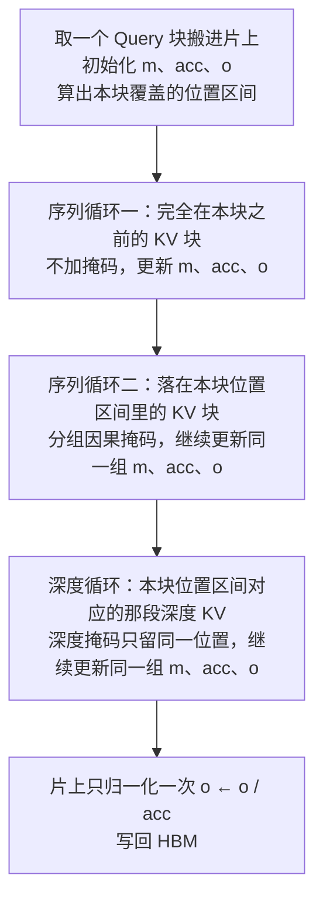

# MoDA：浅层特征被残差冲淡了，就让注意力头回到前面各层的同一位置去取

<!-- release-date: 2026-03-16 -->

> 本文依据 **Mixture-of-Depths Attention**，arXiv:2603.15619v1，2026-03-16 提交，共 18 页。作者来自华中科技大学电子信息与通信学院与 ByteDance Seed，第一作者与第三作者的工作完成于 ByteDance Seed 实习期间（PDF p. 1）。页码均指这份 PDF 自身的页码。文中会区分三件事：**论文明确写了什么**、**我们怎么解释它**、**哪些是外部资料或本文换算**。

## 读前先把几个词说成人话

这篇论文只改了一件事：注意力能看见的东西。但它同时牵扯模型结构和 GPU 内核两层，先把会反复出现的词说清楚。

- **Token（词元）**：模型读写文本的最小单位。
- **Query、Key、Value（查询、键、值，合称 QKV）**：注意力的三个角色。Query 是当前位置在「问」，Key 是别的位置挂出来的「索引」，Value 是被取走的「内容」。一对 Key、Value 简称 **KV**。
- **残差流（residual stream）**：每一层算出一个增量，加回到同一个隐状态上。隐状态的形状始终是 $T \times D$，$T$ 是序列长度，$D$ 是模型宽度。
- **信息稀释（information dilution）/ 信号退化（signal degradation）**：论文对「浅层形成的有用特征，被后面一层层的增量反复叠加，深层越来越难把它读回来」的叫法（PDF p. 1、p. 4）。
- **序列 KV（sequence KV）**：普通注意力看的东西，同一层里前面各个位置的 KV。
- **深度 KV（depth KV）**：论文新加的东西，**前面各层在同一个位置**写下的 KV。
- **GQA（Grouped-Query Attention，分组查询注意力）**：$G$ 个 Query 头共用一组 KV 头，$G$ 叫组大小。它本来是为了省推理时的 KV 缓存，后面硬件一节会反过来利用它。
- **FlashAttention**：把注意力按小块搬进片上高速存储、用 **在线 softmax（online softmax）** 边读边累加、从不把整张 $T \times T$ 分数矩阵写回显存的精确注意力实现。在线 softmax 只维护三样东西：目前见过的最大分数 $m$、归一化分母 $acc$、未归一化的输出累加 $o$。
- **Pre-norm / Post-norm**：归一化放在子层之前还是残差相加之后。Pre-norm 更好训，是今天的主流；post-norm 表达力强但深了容易不稳。

有一个名字要先挡开：DeepMind 2024 年的 **Mixture-of-Depths**（Raposo 等）是「按 Token 决定跳过哪些层」，把计算量沿序列重新分配。这里的 MoDA 与它无关，论文也没有引用它。

## 一句话先说清

层数越深，残差流越像一锅反复加水的汤：浅层写下的特征还在，但被后面几十次相加冲淡了，深层想用却捞不回来。已有两条路：残差（便宜，但把全部历史压成一个张量），以及 DenseNet 式稠密跨层连接（保住全部历史，但参数和计算随层数平方涨，而且连法是写死的）（PDF p. 2、p. 4）。

MoDA 的做法是 **把「沿深度取回历史」也交给注意力**：每个注意力头除了照常看本层的序列 KV，再看前面各层在**同一个位置**写下的深度 KV，两类打分进同一个 softmax（PDF p. 1、p. 5）。

图上绿色那一列就是新增的全部。它只沿深度方向看同一个位置，所以每个 Query 多出的候选数只等于它前面的深度槽数，而不是再乘一个 $T$。原图左幅把注意力子层写出的 K、V 记为第 $l$ 对、FFN 子层经投影写出的记为第 $l+1$ 对，可见深度流里的编号是按子层算的（PDF p. 1）。

论文由三块组成：

1. **机制**：一个统一 softmax 的注意力算子，注意力层的深度 KV 直接复用本层的 K、V，FFN 层另配一个轻量 KV 投影（PDF p. 5、p. 10–11）。
2. **内核**：把跨层的非连续读取重排成连续块，和序列注意力共用一套在线 softmax 状态。在 64K 长度上跑到 Triton 版 FlashAttention-2 的 97.3%（PDF p. 1、p. 9）。
3. **实验**：按 OLMo2 的配方、400B Token 训 700M 与 1.5B 两档。1.5B 上 10 个下游平均 +2.11 分，10 个验证域平均困惑度降 0.2；另外发现 MoDA 配 post-norm 比配 pre-norm 更好（PDF p. 1、p. 11–12）。

要带走的只有一条：**残差解决的是「能不能训深」，不解决「浅层的东西能不能被原样读回来」。后者需要一条按内容检索的旁路，而注意力本来就是现成的检索器。**

### 一条阅读路线

1. **p. 1 Figure 1**：谁能看见谁。上面那张图就是它的右幅。
2. **p. 3–5 第 2.2 节与 Table 1**：「读、算、写」三步看四种沿深度堆叠的方式。
3. **p. 6–9 Algorithm 1 与第 3 节**：三步把非连续读取变成块读取。
4. **p. 9 Table 2、p. 13 Table 7**：97.3% 的分母，以及三步各值多少。
5. **p. 10–12 Table 3–6**：变体消融、两档主结果、层数与归一化。
6. **p. 14 Figure 5、p. 15 第 6 节**：注意力图，以及作者自认的两件没做完的事。

## 主要矛盾：层数在涨，浅层写下的东西却越来越难读回来

引言把大模型的扩展拆成四根轴：上下文长度、数据、宽度、深度。作者的判断是：前三根在实践里更好兑现，深度则「相对没被吃透」——加层常常换不来成比例的收益，原因有两个：优化难，以及信息稀释（PDF p. 2）。

残差连接解决了前一个。它让梯度能穿过几十上百层，深网络才训得起来。但它没有解决后一个。

**为什么残差会稀释。** 残差的写法是：第 $l$ 层的输入等于最初的嵌入加上前面每一层的增量（PDF p. 3，式 3）：

$$
X_l = X_0 + \sum_{i=1}^{l-1} \mathcal{F}(X_i, \mathcal{W}_i)
$$

这里 $\mathcal{F}$ 是一个子层（注意力或 FFN），$\mathcal{W}_i$ 是第 $i$ 层的参数。关键在形状：不管前面有多少层，历史都被叠进同一个 $T \times D$ 的张量。第 3 层写下的某个特征，到第 30 层时已经和 27 次别的增量加在一起，想单独把它取出来，只能靠后面的层自己学会「减掉噪声」。论文的原话是：深度流被反复叠加压缩进一个固定大小的张量，显著特征因此被冲淡（PDF p. 4）。

**为什么稠密连接也不行。** DenseNet 式的做法是把前面所有层的输出都留着，第 $l$ 层读入时把它们线性投影回 $T \times D$（PDF p. 4，式 4）。历史一点没丢，但有两个问题：主导计算量按 $O(TL^2D^2)$ 涨，大模型扛不住；连法是固定的，不管当前 Token 需要什么，读的都是同一套加权（PDF p. 4）。

于是矛盾是：

> 残差便宜但有损，稠密无损但贵且死板。能不能有一种沿深度读历史的方式，**按内容决定读什么**，又不必为每对层都付一份 $D^2$ 的投影？

作者的回答来自序列建模的经验：注意力之所以好用，是因为它按数据动态地决定从历史里取多少（PDF p. 2）。那就把同一招从序列轴搬到深度轴。

## 四种沿深度传递信息的方式

论文把一个 Transformer 块拆成「读、算、写」三步来比较（PDF p. 3）：读是本层从深度历史里取什么作为输入，算是注意力或 FFN，写是本层的结果怎么留给后面。下表把 Figure 3（PDF p. 4）的四幅图和 Table 1（PDF p. 5）的复杂度合在一起，复杂度只留主导项。

| | 深度残差 | 深度稠密 | 深度注意力 | MoDA |
|---|---|---|---|---|
| 读 | 原样拿上一层的 $X$ | 把全部历史 $\{X_i\}$ 线性投影回 $T \times D$ | 用注意力读前面各层同位置的 KV | 同一个 softmax 里读序列 KV 与深度 KV |
| 写 | 加回 $X$ | 把本层输出拼进历史 | 把本层的 K、V 拼进深度流 | 输出加回 $X$，K、V 拼进深度流 |
| 按数据决定读什么 | 否 | 否 | 是 | 是 |
| 与序列注意力统一 softmax | — | 否 | 否 | 是 |
| 参数 | — | $O(L^2D^2)$ | $O(LD^2)$ | $O(LD^2/G)$ |
| 解码缓存（每 Token） | — | $O(LD)$ | $O(LD/G)$ | $O(LD/G)$ |
| 预填 FLOPs | — | $O(TL^2D^2)$ | $O(TL^2D)$ | $O(TL^2D)$ |

深度残差不在 Table 1 里，它是参照物。深度注意力是作者自己提的中间形态（PDF p. 3）：它把 DenseNet 的 $D^2$ 投影换成注意力，计算从 $O(TL^2D^2)$ 降到 $O(TL^2D)$，少了一个 $D$ 的因子（PDF p. 5）。但它还要为深度检索单独做一套 Query 投影，而且和序列注意力是两个算子。

MoDA 比深度注意力再省一步：**深度检索直接用本层序列注意力已有的 Query**，不再有额外的深度 Query 投影；在 GQA 下只需要分组后的 K、V 投影，于是参数从 $O(LD^2)$ 再除以 $G$（PDF p. 5–6）。

**我们如何解释它。** 表里三列的 FLOPs 都还是 $L^2$，只是去掉了 $D^2$。$L^2$ 来自「第 $l$ 层要看前面 $l$ 个深度槽」，这是沿深度做检索绕不开的代价。所以 MoDA 在这张表里的位置是：保住数据依赖的检索，参数最省，但计算和缓存仍随层数线性（每 Token）或平方（全网）增长。论文第 6.2 节自己也承认这一点，后面再说。

## 核心设计一：序列和深度进同一个 softmax

### 旧问题：两路检索各算各的，就得有人决定怎么合

如果深度注意力是一个独立算子，它和序列注意力各出一份结果，还要再加一个固定的或学出来的门，决定两份各占多少。这个门对所有 Token 可能是同一个值，也可能又是一套参数。

### 新设计：把深度槽当成额外的几个 Key，一起排队

MoDA 让每个 Token 在同一次注意力里，同时对「本层前面各位置的序列 KV」和「前面各层本位置的深度 KV」打分，所有分数由**同一个 softmax** 联合归一化（PDF p. 5）。

论文没有把它写成一个单独的公式，而是直接给了内核的 Algorithm 1（PDF p. 6）。把算法里的在线累加展开，对第 $l$ 层、位置 $t$ 的一个 Query $q$，输出等价于：

$$
o_t^{l}
=
\frac{
\sum_{j \le t} e^{s_j}\, v_j^{l}
+
\sum_{i=0}^{l-1} e^{r_i}\, \tilde v_{i,t}
}{
\sum_{j \le t} e^{s_j}
+
\sum_{i=0}^{l-1} e^{r_i}
}
$$

其中 $s_j = q \cdot k_j^{l} / \sqrt{d}$ 是对本层第 $j$ 个位置的序列打分，$r_i = q \cdot \tilde k_{i,t} / \sqrt{d}$ 是对第 $i$ 层在位置 $t$ 写下的深度 KV 的打分，$d$ 是头维。这是本文按 Algorithm 1 改写的形式，不是论文原式；算法里用的是以 2 为底的指数，数值上等价。

分子分母各多了一项求和，这就是 MoDA 的全部数学。它和普通注意力的差别只是 **候选集合变大了**：多出来的候选恰好是这个位置自己的深度历史。

### 为什么要统一 softmax

论文给的理由是「在一个 softmax 里聚合序列与深度信息，提供了统一的表示空间」（PDF p. 5）。

**我们如何解释它。** 统一 softmax 让两类候选**争同一份概率**。一个头如果觉得前面某层的原件比本层任何位置都有用，就可以把大部分权重压过去；反过来也可以几乎不看深度。门控不需要另学，它就是注意力分数本身，而且每个 Token、每个头都不一样。代价是深度 KV 和序列 KV 必须活在同一个向量空间里，才能用同一个 Query 打分，这也是后面「注意力侧直接复用 K、V」能成立的前提。

### 可迁移启发

两路信息要合并时，先问能不能把它们都变成同一个检索的候选。能，就让它们在一个归一化里竞争，比「各做各的再加权」少一层要调的东西，也更不容易让某一路被静默忽略。

## 核心设计二：深度流里写什么

读的一侧定下来了，剩下的问题是：每一层往深度流里写什么。这决定参数、计算量，也决定效果。

三种写法在 700M、36 层、宽 1024、$G = 2$、序列 4096 的设定下做了消融（PDF p. 10，Table 3）。基线有两个：同为 36 层的 OLMo2，以及为了和额外投影的参数量对齐、多加两层的 38 层 OLMo2。

| 行 | 模型 | 层数 | 深度 KV | FFN 侧 KV 投影 | 注意力侧独立 KV 投影 | 参数（M） | FLOPs（T） | 训练 PPL | C4 验证 PPL | 下游平均 |
|---|---|---:|:---:|:---:|:---:|---:|---:|---:|---:|---:|
| 1 | OLMo2 | 36 | | | | 669.0 | 8.01 | 14.49 | 18.59 | 56.93 |
| 2 | OLMo2 | 38 | | | | 700.5 | 8.41 | 14.27 | 18.31 | 57.11 |
| 3 | MoDA | 36 | ✔ | | | 669.0 | 8.02 | 14.08 | 18.48 | 58.10 |
| 4 | MoDA | 36 | ✔ | ✔ | | 705.7 | 8.33 | 13.90 | 18.21 | 58.87 |
| 5 | MoDA | 36 | ✔ | ✔ | ✔ | 742.4 | 8.63 | 13.83 | 18.17 | 58.97 |

论文从这张表读出三条（PDF p. 10–11）：

1. **深度 KV 本身就有用。** 行 3 直接拿前面注意力层的序列 K、V 当深度 KV，一个新参数都没有，只多 0.12% 的 FLOPs，训练 PPL 降 0.41、C4 验证 PPL 降 0.11、下游平均涨 1.17。
2. **FFN 的深度 KV 也要写。** 行 3 只让注意力层往深度流里写，忽略了 FFN。行 4 给 FFN 加一个把输入投成 K、V 的轻量投影，比行 3 再降 0.18 训练 PPL、0.27 验证 PPL、涨 0.77 下游。和参数量相近的 38 层基线比，行 4 下游高 1.76。
3. **注意力侧再配独立投影，接近饱和。** 行 5 在行 4 基础上，不再复用序列 K、V，而是给注意力侧也单独做一套深度 K、V 投影。参数从 705.7M 涨到 742.4M、FLOPs 从 8.33T 涨到 8.63T，只换来 0.07 训练 PPL、0.04 验证 PPL、0.10 下游。

结论是行 4 成为后续所有放大实验的默认配方（PDF p. 11）。

**我们如何解释它。** 三行合起来是一条很清楚的性价比曲线：

- 注意力层的 K、V 本来就是为「被别的位置检索」而训练的，拿来给别的层检索几乎是白送的；
- FFN 没有 K、V，它写下的东西原本只能经残差流间接传下去，给它开一个出口，收益第二大；
- 让注意力为「被深度检索」专门再学一套 K、V，说明复用那一套已经够用。

行 4 相对行 1 的 FLOPs 是 $8.33 / 8.01 \approx 1.040$，即约多 4.0%（本文换算）。摘要里「3.7% FLOPs 开销」在全文任何一张表里都对不上一个具体的比值，最接近的是这一行，见文末限制一节。

### 可迁移启发

想给模型加一条旁路时，先找已经为「被检索」训练过的表示去复用，再给没有这种表示的模块开一个最便宜的出口，最后才考虑专门的新投影。消融的顺序也按这个来，每一步都和参数量对齐的基线比。

## 核心设计三：让跨层读取跑在 Tensor Core 上

机制简单，难在实现。直接用 PyTorch 写，每个 Query 要去 $l$ 个不同的层里各拿一行 K、V，这些行在显存里相隔很远，是典型的 gather 式访存；GPU 最擅长的是规整的块矩阵乘，这种零散读取会让它大量空转（PDF p. 6–7）。

第 3.1 节先铺了三条 GPU 常识（PDF p. 7）：

- **SM（Streaming Multiprocessor，流式多处理器）**：GPU 上并行执行的基本单元。长序列、小 batch 的训练里，要沿序列维切出足够多的独立块，才能让 SM 都有活干。
- **CUDA Core 与 Tensor Core**：前者做通用运算，后者专做结构化矩阵乘累加，吞吐高得多。内核要尽量把计算写成规整的矩阵乘。
- **HBM 与片上 SRAM**：显存容量大但慢，寄存器和共享内存快但小。要靠分块和复用，让热数据留在片上。

在这三条约束下，论文分三步把深度检索改造成块计算。

图里三个有效比例是论文自己定义的 **深度利用率（depth utilization）**，即深度分数矩阵里真正被用到的格子占所有被算的格子的比例（PDF p. 8）。

**第一步，扁平布局（flash-compatible）。** 把深度缓存沿一条长为 $T \times L$ 的轴摊平，同一位置的 $L$ 个深度态连续存放。位置 $t$ 的 Query 只要去 $[tL, (t+1)L)$ 这一段取，gather 变成了连续块读，可以套进 FlashAttention 式的内核（PDF p. 7）。问题是深度分数矩阵形状是 $T \times TL$，每行只有自己那 $L$ 格有效，按块稠密计算时利用率只有 $1/T$（PDF p. 7–8）。

**第二步，按块重排（chunk-aware）。** 把 Query 按长度 $C$ 切块，每块只配它覆盖的 $C$ 个位置的深度态，拼成一块 $C \times L$ 的局部区域。越界的深度块整块不读，利用率提到 $1/C$（PDF p. 8）。

**第三步，按 GQA 组索引（group-aware）。** 这是全篇最巧的一步。内核把 GQA 里共用一组 KV 头的 $G$ 个 Query 头排成相邻的 $G$ 行，于是 Query 行数 $T_q = G \cdot T_{kv}$，第 $i_q$ 行对应的位置是 $\lfloor i_q / G \rfloor$（论文叫 base-time）。一块 $C$ 行里只有 $C/G$ 个不同位置，所需深度区域就只有 $(C/G) \times L$，利用率提到 $G/C$（PDF p. 8）。同一个 base-time 映射同时用于两个掩码：序列方向是分组因果掩码 $\lfloor i_q/G \rfloor \ge i_k$，深度方向是 $\lfloor i_q/G \rfloor = \lfloor j_d/L \rfloor$。Query 块的大小还要能被 $G$ 整除，免得一块里跨组（PDF p. 8）。

### Algorithm 1：三个循环，一套片上状态

三步布局之上，Algorithm 1（PDF p. 6）把序列和深度融合进一次前向。

这张流程图按 Algorithm 1 的第 5–32 行重画（PDF p. 6、p. 8–9）。要点是三个循环**共用同一组在线 softmax 状态**：序列分数和深度分数在片上被当成一条更长的 Key 序列累加，中间结果从不写回显存，最后只归一化一次。这正是「统一 softmax」在内核层面的样子：数学上两类候选同属一个 softmax，实现上它们同属一次在线累加。

### 每一步值多少

论文在 $T = 1024$、$G = 8$、$L = 64$、$C = 64$ 的单卡 A100 上逐步打开三项优化，测一次前向加反向的耗时（PDF p. 13，Table 7）。

| 行 | 实现 | 耗时（ms） | 相对上一行 |
|---|---|---:|---|
| 1 | PyTorch 朴素实现 | 2128.900 | — |
| 2 | + 扁平布局 | 13.102 | 约快 162.5 倍 |
| 3 | + 按块重排 | 6.286 | 耗时降 52.0% |
| 4 | + 按 GQA 组索引 | 1.460 | 再快 4.31 倍 |

三步合计约 1458 倍（PDF p. 13–15）。论文特意说明：朴素实现本来就没为效率优化，所以只在 1024 这个短长度上比（PDF p. 13）。这张表证明的是三步各自有贡献，而不是 MoDA 比别人快 1458 倍。

### 可迁移启发

遇到「每个元素要去一个不规则位置取数」的算子，先想办法把它变成连续块读；再看掩码后的有效比例还剩多少，按块把越界部分整块跳过；最后找找有没有现成的共享结构（这里是 GQA 的组）能让多行共用同一块数据。三步各自的收益要分开测。

## 效率数字：97.3% 的分母要写清楚

摘要里的 97.3%，来自 Table 2 第 5 行（PDF p. 9）。整张表是在单卡 A100、bf16、batch 1、头维 64、块长 $C = 64$ 下，比较 MoDA 的 Triton 内核和 **Triton 版 FlashAttention-2** 的一次前向加反向耗时，分三组扫 $T$、$G$、$L$。

| 扫描 | $T$ | $G$ | $H_q$ | $L$ | FA2（ms） | MoDA（ms） | 深度利用率 | 额外时间（论文口径） | 相对 FA2 多用（本文换算） |
|---|---:|---:|---:|---:|---:|---:|---:|---:|---:|
| 序列长度 | 4096 | 8 | 64 | 64 | 7.970 | 10.750 | 12.50% | 25.86% | 34.9% |
| | 8192 | 8 | 64 | 64 | 28.700 | 35.427 | 12.50% | 18.99% | 23.4% |
| | 16384 | 8 | 64 | 64 | 116.700 | 127.661 | 12.50% | 8.59% | 9.4% |
| | 32768 | 8 | 64 | 64 | 459.854 | 480.914 | 12.50% | 4.38% | 4.6% |
| | 65536 | 8 | 64 | 64 | 1831.668 | 1883.026 | 12.50% | 2.73% | 2.8% |
| 组大小 | 16384 | 2 | 16 | 64 | 28.982 | 39.741 | 3.12% | 27.07% | 37.1% |
| | 16384 | 4 | 32 | 64 | 58.071 | 68.939 | 6.25% | 15.76% | 18.7% |
| | 16384 | 16 | 128 | 64 | 233.700 | 244.900 | 25.00% | 4.57% | 4.8% |
| | 16384 | 32 | 256 | 64 | 467.107 | 480.767 | 50.00% | 2.84% | 2.9% |
| 层数 | 16384 | 8 | 64 | 128 | 116.700 | 138.224 | 12.50% | 15.57% | 18.4% |
| | 16384 | 8 | 64 | 256 | 116.700 | 167.958 | 12.50% | 30.52% | 43.9% |

所有行 KV 头数 $H_k = 8$。组大小一组的 $G = 8$ 与层数一组的 $L = 64$ 都和序列长度一组的 16384 那一行相同，表里不再重复。

读这张表要知道三件事。

**第一，论文的「额外时间」除的是 MoDA 自己的耗时。** 按表里数字反算，$(10.750 - 7.970) / 10.750 = 25.86\%$，所以这一列是「MoDA 耗时里有多少是多出来的」。97.3% 就是 $1831.668 / 1883.026$。若换成更常见的「比 FA2 多用多少」，短序列时差别不小：4096 长度上是 34.9% 而不是 25.86%（本文换算）。

**第二，开销随序列变长被摊薄，随层数变深而增加。** 深度分支对每个 Query 只多 $L$ 个候选，而序列分支的候选数随 $T$ 增长，所以序列越长，深度分支的占比越小。反过来，FA2 的耗时和层数无关，MoDA 的额外耗时随 $L$ 近似线性增长（PDF p. 9）。

**第三，组大小越大越划算。** $G$ 越大，一块深度 KV 被越多 Query 行共用，利用率 $G/C$ 越高，额外时间越低（PDF p. 9）。这也意味着：在 KV 头多、$G$ 小的模型上，MoDA 的相对开销更大。

**我们如何解释它。** 这张表测的是**单个注意力算子**，不是整网训练吞吐；基线是 Triton 版 FA2，不是官方 CUDA 版，也不是 FlashAttention-3。主实验用的序列长度是 4096、700M 的组大小是 2（PDF p. 10），在序列长度和组大小两组扫描里都落在开销最大的那一端。整网里注意力只占一部分时间，但论文没有给出整网训练的吞吐或墙钟对比。

## 实验设置：跟着 OLMo2 的配方训

主实验是 700M 与 1.5B 两档仅解码器语言模型，都用 GQA，在 OLMo2 数据集的 400B Token 子集上训练。bf16 精度，全局 batch 1024 条，上下文 4096。学习率计划、AdamW 等其余配置沿用 OLMo2 的实现（PDF p. 10）。700M 的变体消融写了学习率：2K 步热身到 $3 \times 10^{-4}$，再按余弦衰减到 $3 \times 10^{-5}$（PDF p. 10）。

每步 $1024 \times 4096 \approx 4.2$M Token，400B Token 约 9.5 万步（本文换算）。

评测分两类（PDF p. 10）：

- 10 个下游任务：PIQA、HellaSwag、WinoGrande、OpenBookQA、BoolQ、SciQ、COPA、MMLU、ARC-Easy、ARC-Challenge；
- 困惑度：训练 PPL、C4 验证 PPL，以及 10 个验证域的困惑度（C4、ICE、m2d2-s2orc、Pile、Wiki-text，以及 dolma 的 Books、Common Crawl、peS2o、Reddit、Stack）。

1.5B 的具体结构（层数、宽度、头数）论文没有单独给。Table 4、Table 5 的表注对两档都写「宽 1024、$G = 2$、序列 4096」（PDF p. 11），这对 1.5B 不太可能成立，更像是沿用了 700M 的表注。

## 两档主结果：下游平均 +1.76 与 +2.11，10 个验证域全部变好

先看 1.5B 的训练曲线。Figure 2（PDF p. 2）画了 C4 验证损失、HellaSwag、WinoGrande、ARC-Challenge 四条曲线随训练 Token 的变化：C4 损失上两条线前期重合、中后段 MoDA 略低；HellaSwag 两条线几乎贴在一起；WinoGrande 与 ARC-Challenge 在训练中后段拉开，MoDA 持续在上方（本文从图上读到）。曲线的终点就是下面两张表。

### 下游（Table 4，PDF p. 11）

| 模型 | PIQA | HellaSwag | WinoGrande | OpenBookQA | BoolQ | SciQ | ARC-E | ARC-C | COPA | MMLU | 平均 |
|---|---:|---:|---:|---:|---:|---:|---:|---:|---:|---:|---:|
| OLMo2 700M | **73.72** | 58.77 | 55.33 | 35.60 | 56.24 | 89.50 | 66.84 | 33.44 | 77.00 | 24.69 | 57.11 |
| MoDA 700M | 73.39 | **59.19** | **60.22** | **37.20** | **59.33** | **89.60** | **67.37** | **34.78** | **82.00** | **25.61** | **58.87** |
| OLMo2 1.5B | 76.55 | 65.86 | 63.22 | 38.80 | 63.61 | 90.60 | **72.98** | 42.47 | 81.00 | 27.73 | 62.28 |
| MoDA 1.5B | **76.82** | **66.24** | **65.59** | **41.60** | **67.34** | **92.10** | 72.81 | **46.82** | **85.00** | **29.59** | **64.39** |

平均分 700M 涨 1.76，1.5B 涨 2.11（PDF p. 11）。摘要写「平均性能提升 2.11%」，实际是**平均准确率涨 2.11 个百分点**，不是相对提升 2.11%。

两档各有一项没涨：700M 的 PIQA 降 0.33，1.5B 的 ARC-E 降 0.17。涨得最多的是 WinoGrande（700M +4.89）、COPA（两档 +5.00、+4.00）、ARC-C（1.5B +4.35）与 BoolQ（+3.09、+3.73）（PDF p. 12）。表里 COPA 的分数全是整数，和常见评测所用的 100 题验证集一致（外部常识，论文没写用的是哪个划分）；若是如此，一题就是 1 分，这一列的波动要打折看。

**要注意一处对照。** 700M 的 OLMo2 平均 57.11，与 Table 3 里 **38 层加参基线**（行 2）的下游平均完全相同；MoDA 700M 的 58.87 也与 Table 3 行 4 相同。所以 Table 4 的 700M 对照很可能就是「MoDA 行 4 对参数量相近的 38 层 OLMo2」。论文没有写明这一点，1.5B 的基线是否也加过层同样没写。

### 分域困惑度（Table 5，PDF p. 11）

| 模型 | C4 | ICE | m2d2-s2orc | Pile | Wiki-text | Books | CC | peS2o | Reddit | Stack | 平均 |
|---|---:|---:|---:|---:|---:|---:|---:|---:|---:|---:|---:|
| OLMo2 700M | 18.32 | 17.43 | 24.37 | 9.53 | 12.26 | 16.78 | 20.53 | 9.17 | 23.84 | 3.93 | 15.61 |
| MoDA 700M | 18.29 | 17.24 | 23.64 | 9.48 | 12.06 | 16.58 | 20.52 | 9.14 | 23.75 | 3.90 | 15.46 |
| OLMo2 1.5B | 16.16 | 15.37 | 21.10 | 8.45 | 10.41 | 14.19 | 18.13 | 8.19 | 21.21 | 3.57 | 13.67 |
| MoDA 1.5B | 15.97 | 15.08 | 20.92 | 8.33 | 10.16 | 13.95 | 17.88 | 8.09 | 20.85 | 3.52 | 13.47 |

两档都是 10 个域全部下降，1.5B 平均从 13.67 到 13.47，这就是摘要的「平均困惑度降 0.2」（PDF p. 12）。

**我们如何解释它。** 困惑度在单个域上的相对降幅大多不到 2%，但方向完全一致；下游的改善集中在 WinoGrande、COPA、ARC-C、BoolQ 这类判断与推理题上，PIQA、ARC-E 几乎没有变化。这和「让深层能取回浅层特征」的设想方向一致，但两档模型、一个数据配方、一个基线，还不足以说明它在更大规模上仍然成立。

## 层数与归一化：MoDA 配 post-norm 更好

第 4.3.1 节换了一套更小的模型：宽 384、6 个 Query 头、2 个 KV 头（$G = 3$），在 FineWeb-Edu 上训练，另留一份验证集报验证损失（PDF p. 12）。训练 Token 数没有写。

| 行 | 模型 | 层数 | 归一化 | 深度 KV | FFN 侧 KV 投影 | 参数（M） | FLOPs（G） | 验证损失 |
|---|---|---:|---|:---:|:---:|---:|---:|---:|
| 1 | OLMo2 | 48 | pre-norm | | | 123.38 | 136.61 | 3.3800 |
| 2 | OLMo2 | 48 | post-norm | | | 123.38 | 136.61 | 3.4062 |
| 3 | MoDA | 48 | pre-norm | ✔ | | 123.38 | 137.89 | 3.3759 |
| 4 | MoDA | 48 | post-norm | ✔ | | 123.38 | 137.89 | 3.3653 |
| 5 | MoDA | 48 | pre-norm | ✔ | ✔ | 128.11 | 144.00 | 3.3656 |
| 6 | MoDA | 48 | post-norm | ✔ | ✔ | 128.11 | 144.00 | **3.3484** |
| 7 | OLMo2 | 24 | post-norm | | | 71.35 | 78.19 | 3.4740 |
| 8 | MoDA | 24 | post-norm | ✔ | | 71.35 | 78.51 | 3.4537 |
| 9 | MoDA | 24 | post-norm | ✔ | ✔ | 73.72 | 81.24 | 3.4338 |

（PDF p. 12，Table 6）

论文的三条观察（PDF p. 12–13）：

1. 深度 KV 在 48 层与 24 层上都降低验证损失。
2. **48 层时，post-norm 从深度 KV 得到的好处远大于 pre-norm**：post-norm 降 0.0409（行 2 到行 4），pre-norm 只降 0.0041（行 1 到行 3）。
3. FFN 侧 KV 投影在深度 KV 之上继续有收益。

**我们如何解释它。** 这张表最有意思的是行 1 与行 2：不加 MoDA 时，48 层 post-norm（3.4062）比 pre-norm（3.3800）差，这正是 post-norm 深了难训的老问题。加上深度 KV 后顺序倒过来，post-norm（3.3653）反超 pre-norm（3.3759）。一个说得通的解释是：post-norm 的问题之一是浅层信号在一次次归一化与相加里更难保留，而深度 KV 正好给了一条绕开残差流的直达通道。论文把这写成「深度 KV 在 post-norm 深层堆叠里有更强的优化作用」（PDF p. 12），没有给机制上的证明。

这组实验的边界也要记住：模型只有 71M–128M，24 层只测了 post-norm，没有 pre-norm 对照；摘要「MoDA 配 post-norm 优于配 pre-norm」的依据只有 48 层这一组。参考文献里的「Post-LayerNorm Is Back」（[arXiv:2601.19895](https://arxiv.org/abs/2601.19895)）作者 Chen Chen 与 Lai Wei 也是这篇论文的合作者（PDF p. 16），可见 post-norm 是这个团队另一条并行的研究方向。

## 注意力图：深度块上确实有质量

这是原文 Figure 5（PDF p. 14），700M、400B Token 训完的模型，每张图的红色虚线左边是序列 KV，右边是深度 KV，深度部分同时含注意力层和 FFN 层写下的 KV（PDF p. 13）。第 0 层前面没有层，所以只有序列部分。

论文的读法（PDF p. 13）：

- 中后层在深度块上持续有不小的注意力质量，说明模型确实在跨层取信息，而不只是看序列上下文；
- 对角线很尖的头仍会分一部分概率给深度槽，更弥散的头则更依赖深度 KV；
- 这些头没有把大量概率压到少数固定位置上，和常见的 **attention sink（注意力汇点）** 现象不同。

论文对第三条非常谨慎：原话是「这些模式很有意思，但确切的功能作用尚不清楚，需要进一步研究」（PDF p. 13）。

**我们如何解释它。** 热图是随机挑的头，没有统计量，证明力只到「深度块被用上了」。至于汇点，一个合理的猜测是：普通注意力里，一个头「不想看任何位置」时只能把概率倒在某个固定位置上；MoDA 给了它另一个去处——本位置的深度历史。这正好也是 Gated-Attention 一篇、以及日常研读里 StreamingLLM 一篇讨论的那个现象，但论文没有做任何定量的汇点测量。

## 作者自己写下的两件没做完的事

第 6 节 Discussion 不是客套话，它指出了离工业训练还差的两块（PDF p. 15）。

**一，内核还不是终点。** 当前内核对 FA2 已有竞争力，但对万亿参数级的生产训练，还需要更好的内存调度、更深的计算流水、融合注意力与分布式通信的重叠。作者强调这些不改变 MoDA 的算法行为（PDF p. 15）。

**二，全量深度 KV 缓存会成为内存瓶颈。** 缓存所有历史层的深度 KV，内存与带宽随深度线性增长，在长上下文训练与服务里可能成为主瓶颈（PDF p. 15）。作者提议一个固定大小的 **深度 KV 槽位缓冲（bounded depth-KV slot）**：每个 Query 只看 $S \ll L$ 个槽，槽里放什么有三种策略——按效用打分留 top-$S$、滑动窗口留最近的、两者混合。这样内存从随深度增长变成随槽数固定，也给融合内核一个稳定的张量形状。难点是槽位怎么分配，以及怎样和 MoDA 一起训练选择策略（PDF p. 15）。

**我们如何解释它。** 第二条其实就是把长上下文里已经走过的路（KV 缓存驱逐、滑动窗口、稀疏选择）在深度轴上再走一遍。论文只给了方向，没有实验。

## 限制、边界，以及不要补进去的东西

**摘要里的数字，哪些对得上、哪些对不上：**

- 97.3%：对得上，Table 2 第 5 行，Triton 版 FA2，单算子（PDF p. 9）。
- 平均困惑度降 0.2：对得上，1.5B 的 Table 5 平均列（PDF p. 11）。
- 下游平均 +2.11%：对得上数值，但它是百分点，不是相对提升（PDF p. 11）。
- 3.7% FLOPs 开销：**全文没有一张表能直接算出这个数**。1.5B 没有报 FLOPs；700M 的默认配方（Table 3 行 4）相对基线多约 4.0%，Table 6 里 24 层与 48 层的默认配方分别多约 3.9% 与 5.4%（本文换算）。

**实验只回答了一部分问题：**

- 只有一个基线家族 OLMo2。引言点名的残差升级路线——Hyper-Connections、mHC、Virtual Width Networks（PDF p. 2）——以及 DenseFormer（PDF p. 17）都没有做实验对比。
- 规模最大 1.5B、400B Token，序列 4096。长上下文（64K）只出现在内核计时里，没有长上下文任务的效果评测。
- 没有推理侧数字：解码延迟、深度 KV 实际占多少显存、服务吞吐都没有测。
- Table 1 给出 MoDA 解码缓存每 Token $2LH_kd$，与一份普通 KV 缓存同量级。按 Table 3 行 3 的「直接复用」，注意力侧的深度 KV 在数值上就是各层已有的序列 K、V；但 Algorithm 1 把深度 KV 单独作为一个 $(T_{kv} L) \times (H_k d)$ 的输入张量（PDF p. 6），实际实现里两份缓存是否共用，论文没有交代。
- 1.5B 的结构配置没给，Table 4、5 的表注对 1.5B 的宽度与 $G$ 很可能是笔误。
- 注意力图是定性观察，没有汇点比例之类的量化指标。

**关于代码。** 论文写「将放出完整实现」（PDF p. 15），首页给出了仓库地址 hustvl/MoDA（PDF p. 1）。本文没有读源码，不拿仓库内容补论文没写的细节。

## 可迁移启发

1. **残差只保证能训深，不保证能读回。** 层数加上去却不见效时，先问浅层特征是不是被冲淡了，而不是只调学习率和归一化。
2. **需要检索历史时，优先复用已有的注意力。** 注意力本来就是按内容取历史的机器，把候选集合从「同层前面的位置」扩到「前面各层的同一位置」，数学上只是分子分母各多一项。
3. **两路信息抢同一份概率。** 统一 softmax 比「两路各算再加权」少一个要学的门，也天然按 Token、按头自适应。
4. **旁路的写入端按性价比排序：复用、再开口、最后才新建。** 注意力的 K、V 白送，FFN 配一个轻量投影，专门的新投影接近饱和。每一步都和参数量对齐的基线比。
5. **不规则访存先变连续块，再砍无效块，再找共享结构。** 扁平布局、按块重排、按 GQA 组索引，这个三步法可以用在很多「每行去不同地方取一小段」的算子上。
6. **报效率时写清分母与对象。** 「额外时间」除以谁、对照的是哪个 FA2、测的是单算子还是整网，这三件事不写清，97.3% 和 2.73% 都可能被误读。
7. **全量保存历史只是研究原型。** 深度 KV 随层数线性增长；要上规模，需要像长上下文 KV 缓存那样给它封顶。

## 关键词回看

- **信息稀释 / 信号退化**：残差把全部历史叠进一个 $T \times D$ 张量，浅层特征被后续增量冲淡。
- **读、算、写**：论文比较四种深度机制的框架。残差是原样读、相加写；稠密是投影读、拼接写；MoDA 是注意力读、K、V 拼接写。
- **深度 KV**：前面各层在同一位置写下的 K、V。每个 Query 多 $l$ 个候选。
- **统一 softmax**：序列 KV 与深度 KV 在同一次归一化里竞争概率。
- **FFN 侧 KV 投影**：默认配方的关键一步，让 FFN 也能往深度流里写。
- **深度利用率**：深度分数矩阵里有效格子的比例，三步布局下从 $1/T$、$1/C$ 提到 $G/C$。
- **base-time**：GQA 打包后 Query 行 $i_q$ 对应的位置 $\lfloor i_q/G \rfloor$，同时用于序列与深度两个掩码。
- **97.3%**：64K 长度上 Triton 版 FA2 耗时与 MoDA 耗时之比，单算子。
- **+2.11 / −0.2**：1.5B 下游平均准确率涨 2.11 个百分点，10 个验证域平均困惑度降 0.2。
- **post-norm 反超**：48 层时，加深度 KV 后 post-norm 从落后于 pre-norm 变成领先。
- **深度 KV 槽位缓冲**：作者提议的封顶方案，只有方向，没有实验。

## 资料与阅读边界

### 本文依据的版本与首发日

- 原件：arXiv:2603.15619v1，18 页。[arXiv 官方页](https://arxiv.org/abs/2603.15619) 截至 2026-09-29 只有 v1，提交于 2026-03-16 17:59:55 UTC。
- `release-date` 取 **2026-03-16**。MoDA 是一项公开技术，没有作为产品或权重对外发布，按「技术首次官方公开日」取值。已知官方事件中最早的是 arXiv v1；官方仓库 [hustvl/MoDA](https://github.com/hustvl/MoDA) 创建于 2026-03-16 20:02 UTC、首次提交于 20:03 UTC，均晚于 arXiv。
- 目录归在 `ByteDance`：作者单位是华中科技大学与 ByteDance Seed，项目负责人与多数作者属 Seed，首页带 Seed 标识（PDF p. 1）；通讯作者 Xinggang Wang 属华中科技大学。

### 覆盖范围

摘要与 Figure 1–2；第 1 节引言与三项贡献；第 2 节预备、四种深度机制、Figure 3、Table 1；第 3 节 GPU 预备、三步布局、Figure 4、Algorithm 1、Table 2；第 4 节实验设置、Table 3–7、Figure 5；第 5 节结论；第 6 节两项讨论；参考文献中与正文判断相关的条目。

### 外部资料补充（不是 PDF 原文）

- DeepMind 的 Mixture-of-Depths（Raposo 等，2024，[arXiv:2404.02258](https://arxiv.org/abs/2404.02258)）只用于开头区分同名，论文未引用。
- COPA 测试集的规模来自该数据集的公开定义，不是本 PDF 内容。
- 本站相关篇目：残差升级路线见 mHC 一篇；FA2 的分块与在线 softmax 见 FlashAttention-2 一篇；注意力汇点见 Gated-Attention 一篇，以及日常研读的 StreamingLLM 一篇。这些篇目的结论都不是本文的依据。

### 原文没有公开、本文也不补的缺口

- 1.5B 的层数、宽度、头数，以及 1.5B 基线是否加过层；
- 3.7% FLOPs 开销的计算口径；
- 整网训练吞吐、推理延迟与深度 KV 的实际显存占用；
- 与其他深度连接方法的实验对比；
- Table 6 小模型的训练 Token 数；
- 深度 KV 槽位缓冲的任何实验。
