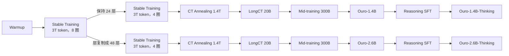

# Ouro：同一叠层循环四圈，多出来的不是记忆，是把记忆用起来的能力

<!-- release-date: 2025-10-29 -->

> 本文依据 **Scaling Latent Reasoning via Looped Language Models**，ByteDance Seed 主导，合作方有 UC Santa Cruz、Princeton、Mila、蒙特利尔大学、北大、CMU 等；通讯作者 Rui-Jie Zhu、Ge Zhang、Wenhao Huang、Jason Eshraghian。arXiv:2510.25741v5，2026-07-01，共 54 页。页码均指 PDF 自身的页码。文中会区分三件事：**论文明确写了什么**、**我们怎么解释它**、**哪些是外部资料或我们的计算**。

## 阅读前先认识几个词

- **Token（词元）**：模型读写文本的最小单位。
- **层（layer）与参数**：普通 Transformer 有 $L$ 层，每层一套自己的权重。想让一次前向「多想一步」，最直接的办法是再加一层，也就多一份参数。
- **思维链（Chain-of-Thought，CoT）**：让模型把中间步骤写成文字再给答案。它不加层，而是用「多输出几个 token」来买计算。
- **循环语言模型（Looped Language Model，LoopLM）**：把 $L$ 层当成一块积木，同一套权重在一次前向里反复跑 $t$ 遍。参数不涨，计算图变深。
- **循环步（recurrent step）$t$**：那叠共享层被完整跑了几遍，论文也叫循环深度。Ouro 的成品固定最多 4 圈，记作 R4。
- **退出门（exit gate）**：每圈结束时一个小线性层看当前隐状态，给出「现在就停」的概率。
- **潜空间推理（latent reasoning）**：推理发生在隐状态一圈圈的变化里，不占用上下文里的文字 token。
- **Ouro**：模型族的名字，取自衔尾蛇 Ouroboros（PDF p. 1）。公开了 1.4B、2.6B 两个 base 和各自的 Thinking 版。

## 一句话先说清

大模型要变强，熟路有两条：把参数堆大，或者让它在输出里多写思考 token。前一条部署贵，后一条把上下文撑长、而且通常要到后训练才学（PDF p. 2）。

Ouro 走第三条：**参数冻住，把同一叠层循环用 4 遍；让一个退出门学会「简单的少转、难的多转」；再把这件事放进 7.7T token 的预训练里，而不是留给后训练**（PDF p. 1、p. 8）。

论文给出的结论分三层，强度不一样：

1. **能力**：1.4B 在多数基准上与 4B dense 相当，2.6B 在推理密集基准上超过最大到 8B 的 dense，作者据此说参数效率约 2–3 倍（PDF p. 2、p. 13）。摘要写的是「最高匹配 12B」，这个 12B 只在 Table 8 的 Gemma3-12B 那一列、而且只在部分基准上成立。
2. **机制**：受控合成实验里，循环和不循环的模型都只记住约 2 bits/参数；循环拉开差距的是多跳组合、模运算树这类「操控知识」的任务（PDF p. 19–21）。
3. **副作用**：圈数越多，有害率越低；中间圈会改答案，不像 CoT 那样先定答案再补理由（PDF p. 22–25）。

如果只记一句：

> **循环不让每个参数多装知识，它让同一份知识被反复调用。想多想几步，不一定要多加参数，也不一定要多写 token。**

## 先看全景：一次前向怎么循环、怎么停

图引自原文 Figure 3（PDF p. 4）。左边训练、右边推理，两边的 Layer 1 到 Layer N 在每一圈都是**同一套权重**，不是把模型复制了几份。

读这张图要抓住三件事：

- **每圈都挂两个头**。语言模型头算这一圈的下一 token 损失，退出门算这一圈「该停」的概率。
- **训练时跑满**。所有圈都算，用退出分布给各圈损失加权，再加一个熵项，防止退出分布塌成一个点。
- **推理时可以早停**。累计退出概率第一次跨过阈值就停，用当前圈的头解码。

两档模型的规格在 Table 2（PDF p. 9）：

| 模型 | 参数 | 层数 | 隐维度 | 注意力 | FFN | 位置编码 | 词表 |
|---|---:|---:|---:|---|---|---|---:|
| Ouro 1.4B | 1.4B | 24 | 2048 | MHA | SwiGLU | RoPE | 49,152 |
| Ouro 2.6B | 2.6B | 48 | 2048 | MHA | SwiGLU | RoPE | 49,152 |

块内部刻意保持干净的 decoder-only，只加了一处：注意力和 FFN 之前都放 RMSNorm 的 sandwich normalization，作者说这对深循环的稳定性尤其关键（PDF p. 9）。词表沿用 SmolLM2，偏代码和拉丁字母语言（PDF p. 9）。

Table 2 没给头数和 FFN 宽度。公开的 1.4B `config.json` 补上了这一块（外部补充）：16 个注意力头、16 个 KV 头、头维 128、FFN 中间维 5632、`tie_word_embeddings = false`。按这组数算一遍（我们的计算）：每层注意力约 16.8M、FFN 约 34.6M，24 层约 1.23B，加输入输出两份 embedding 约 0.2B，合计约 1.43B，与 1.4B 对得上；48 层则约 2.67B，与 2.6B 对得上。

**参数不涨，算力涨了。** 这是读后面所有对标表之前必须先记住的一笔账（我们的计算）：1.4B 跑 4 圈，每个 token 经过的层参数约 $1.23\text{B} \times 4 \approx 4.9\text{B}$；2.6B 跑 4 圈约 $2.47\text{B} \times 4 \approx 9.9\text{B}$。所以「1.4B 对 4B、2.6B 对 8B」是**同参数量**比较，不是同计算量比较：按每 token 的层计算，Ouro 与它对标的 dense 模型大致同一量级，甚至略多。论文的主张是**参数效率**，读者不要把它读成「用四分之一的算力打平」。

## 第一层矛盾：想多想一步，只有两条贵路

标准 decoder-only 里，深度等于层数，层数等于参数。想让一次前向多做一步组合，就得多加一层，多一份权重（PDF p. 2）。

CoT 把「多做一步」改成「多写一个 token」。深度问题变成了序列长度问题：上下文被思考文字撑满，而且这种能力通常要在后训练里专门教，预训练那几万亿 token 并没有被用来「学怎么想」（PDF p. 1–2）。

循环模型的想法不新。Universal Transformer、各种 recursive Transformer、Huginn 那种 recurrent depth 都在小规模上试过（PDF p. 2–3）。论文承认这些工作存在，它要回答的是另一个问题：

> 放到当代基座那种多万亿 token 的预训练里，LoopLM 在能力、效率、安全上的 scaling 行为，是否比不循环的 Transformer 更有利？（PDF p. 2）

相关工作一节把这条路线分成两种读法（PDF p. 3–4）。一种当它是**参数共享**：ALBERT 式的深度方向权重复用，为了省显存；另一种当它是**潜空间里的迭代精修**：每一圈是一次不说话的思考。论文还特意区分了两类循环：Coconut 把上一步最后一层隐状态当成一个「连续思想 token」喂回输入，CoTFormer 把激活交错写回序列，这些是**显式反馈**；Ouro 属于**隐式循环**，整个思考过程关在「上一圈隐状态到这一圈隐状态」的演化里，不占输入位置（PDF p. 4）。

**我们如何解释它。** 两种读法正好对应全文的两个问题：参数共享解释「为什么参数可以少」，迭代精修解释「为什么能力还能涨」。第 6 节的合成实验就是在拆这两件事，结论是前者不带来更多记忆、后者带来更强的组合。

Ouro 的循环对象与另外两篇的差别，本站已各有专篇：Coconut 一篇是后训练里把隐状态当下一个输入；Continuous-Latent-Diffusion-LM 一篇是在连续潜空间上做扩散生成，不在层上循环；日常研读 Huginn 一篇是同样的层循环，但在测试时才加深、规模 3.5B / 800B token。

## 核心设计一：同一叠层循环，把有效深度从参数量里拆出来

### 旧问题：深度和参数焊在一起

非循环模型是 $L$ 层依次叠起来（PDF p. 5）：

$$
F(\cdot)=\mathrm{lmhead}\circ \mathcal{M}^{L}\circ\mathrm{emb}(\cdot),\qquad
\mathcal{M}^{L}=T_{\theta_L}\circ\cdots\circ T_{\theta_1}
$$

$\mathrm{emb}$ 是词嵌入，$T_{\theta_i}$ 是第 $i$ 层，$\mathrm{lmhead}$ 把隐状态映射回词表。

### 新设计：同一个 $\mathcal{M}^L$ 套 $t$ 次

$$
F^{(t)}(\cdot)=\mathrm{lmhead}\circ
\underbrace{\mathcal{M}^{L}\circ\cdots\circ\mathcal{M}^{L}}_{t\ \text{次}}
\circ\mathrm{emb}(\cdot)
$$

$t=1$ 时就退回普通模型（PDF p. 5，式 1）。每一圈结束都用语言模型头算一份下一 token 的交叉熵 $L^{(t)}$（式 2）。总损失不是只看最后一圈，而是下一节的退出分布给各圈加权。

### 工作机制：被迫学一套可以反复调用的程序

人话版：普通模型每多一道工序就新雇一个厨师，循环模型是同一个厨师按同一本菜谱把菜回锅几遍。因为权重共享，模型没法给第 17 层单独背一套只在那个深度才成立的规则，它被逼着学一套**在任何一圈都能用的变换**。

论文在第 6.3 节给了一个理论上的佐证（PDF p. 22、p. 38–41）：在「一部分图在上下文里、一部分图存在参数里」的可达性问题上，可以构造一个单层单头、隐维度 $2n$ 的循环 Transformer，每一圈把「已知能到达的距离」翻一倍，$\lceil\log_2 D\rceil+1$ 圈就能判定两点是否连通，$D$ 是图的直径（Theorem 2）。它和两种 CoT 的顺序步数对比如下（PDF p. 22）：

| 潜空间推理方式 | 离散 CoT | 连续 CoT | Universal Transformer / LoopLM |
|---|---|---|---|
| 顺序计算步数 | $O(n^2)$ | $O(D)$ | $O(\log D)$ |

**我们如何解释它。** 这是表达力构造，说明循环结构**有能力**用对数步做完全图并行搜索；它不说明 Ouro-1.4B 真的在自然语言里做了这件事。构造还需要 $\Theta(n)$ 的隐维度去叠加 $n$ 个节点的信息，作者自己把它列为理论上的限制（PDF p. 41）。

### 收益、代价与边界

收益是参数效率，以及「反复调用同一套程序」这种归纳偏置。

代价马上出现在两处：

- **训练更难稳**。梯度要多次穿过同一套层，小扰动会被放大。第一阶段用 8 圈就出现了 loss spike 和梯度振荡，只好降到 4 圈（PDF p. 10）。训练一节详述。
- **推理的 KV 按圈付**。朴素实现每圈各存一份 KV，4 圈就是 4 倍缓存（PDF p. 18）。部署一节详述。

### 可迁移启发

先看任务的本质。若是「同一套规则反复套在中间结果上」（多跳、程序执行、搜索），共享循环比加层更对口；若是「把更多事实塞进参数」，循环帮不上忙，第 6 节会把这句话钉死。

## 核心设计二：退出门与熵正则，防止「永远跑满」

### 旧问题：只用语言模型损失，退出分布会塌到最后一圈

不是每个 token 都需要 4 圈。可如果只拿下一 token 损失去训退出门，会出现一个正反馈（PDF p. 6）：

1. 更深的圈损失通常更低，梯度把退出概率往后推；
2. 后面的圈拿到更多权重，得到更多训练信号，损失更低；
3. 于是概率被推得更靠后，最后整个分布塌在 $t=T_{\max}$。

反过来，如果用偏向早停的先验去压，又会饿死深层，破坏「越深越好」。

### 新设计：生存概率、退出分布、再加一个熵

每圈 $t$ 的退出门与语言模型头并行，读这一圈最后一层的隐状态 $h^{(t)}$（PDF p. 5）：

$$
\lambda_t(x)=\sigma\bigl(\mathrm{Linear}_{\phi}(h^{(t)})\bigr)\in(0,1)
$$

$\lambda_t$ 是「在第 $t$ 圈立即退出」的瞬时概率。前 $t$ 圈都没退出的概率（生存概率）是

$$
S_t(x)=\prod_{j=1}^{t}\bigl(1-\lambda_j(x)\bigr),\qquad S_0\equiv 1
$$

第一次停在第 $t$ 圈的概率是 $\lambda_t S_{t-1}$；前 $T_{\max}-1$ 圈没用完的质量全部给最后一圈，得到一个合法分布 $p_{\phi}(t\mid x)$（PDF p. 5–6，式 3）。

Stage I 的总目标是「按退出分布加权的各圈损失」减去熵（PDF p. 6，式 4）：

$$
\mathcal L=\sum_{t=1}^{T_{\max}} p_{\phi}(t\mid x)\,L^{(t)}-\beta\,H\bigl(p_{\phi}(\cdot\mid x)\bigr)
$$

第一项让退出质量流向损失低的圈，第二项惩罚分布塌成一个点。$\beta$ 大，更愿意探索各种深度；$\beta$ 小，更敢把质量压在某一圈。

### 为什么先验取均匀

论文把式 4 重写成一个变分下界（ELBO）：退出圈数是隐变量，$p_{\phi}$ 是它的后验，先验取均匀分布 $\pi_t = 1/T_{\max}$，此时 KL 项正好等于负熵加常数 $\log T_{\max}$（PDF p. 7）。

PonderNet 用几何先验、Huginn 用 Poisson-lognormal 先验，都会软性地偏好早停；均匀先验对任何深度一视同仁（PDF p. 7）。作者的理由是把两件事拆开：**这道题难不难**交给退出门去学，**全局想省多少算力**留到推理时用阈值调。

附录 A 在 776M、$T_{\max}=4$、FineWeb-Edu 20B token 上做了对照：几何先验参数从 0.1 扫到 0.9，与均匀先验比（PDF p. 34–35）。均匀先验的训练损失更低、后期振荡更小；几何偏置越强，质量越集中在第 1、2 圈，深层拿不到信用分配。固定平均步数时，均匀先验的精度–算力前沿也更好。这是小模型消融，不是 7.7T 的 Ouro 本身。附录同一段写全局 batch 每步 50K token、共约 40K 步，而 $20\text{B} / 50\text{K} = 4\times 10^{5}$ 步（我们的计算），两个数字差了十倍，原文没有解释。

### 推理时怎么停：Q-exit

推理不采样，看累积分布。前 $n$ 圈的累计退出概率是

$$
\mathrm{CDF}(n\mid x)=1-\prod_{j=1}^{n}\bigl(1-\lambda_j(x)\bigr)
$$

给定阈值 $q\in[0,1]$，第一次 $\mathrm{CDF}\ge q$ 的那一圈就停（PDF p. 6）。$q$ 小早停、省算力，$q$ 大多算。论文注明这个确定性规则沿用 PALBERT 提出的 Q-exit 准则。

### 可迁移启发

做任何自适应计算（早退、动态深度、动态专家数）都先问一句：**梯度是不是在奖励「永远走最深」？** 如果是，先加一个不偏袒深度的正则，让每个深度都有训练信号，再单独训「何时停」。

## 核心设计三：Stage II 把「停」对准真实的损失下降

### 旧问题：Stage I 的门只是不塌，还不会看收益

Stage I 的门与语言模型联合训练，监督是间接的。它能按难度分出深浅，却没有被直接告知「再转一圈，损失还能降多少」（PDF p. 7、p. 17–18）。

### 新设计：冻住语言模型，只训退出门

对每个 token $i$，在第 $t$ 圈算一份不回传给语言模型的损失 $L^{(t)}_{i,\mathrm{stop}}$，看这一圈比上一圈好了多少（PDF p. 7，式 5）：

$$
I_i^{(t)}=\max\bigl(0,\ L_{i,\mathrm{stop}}^{(t-1)}-L_{i,\mathrm{stop}}^{(t)}\bigr)
$$

再压成一个「理想的继续概率」当标签：

$$
w_i^{(t)}=\sigma\bigl(k\,(I_i^{(t)}-\gamma)\bigr),\qquad k=50,\ \gamma=0.005
$$

改进明显大于 $\gamma$ 时 $w\approx 1$，建议继续；改进停滞时 $w\approx 0$，建议退出。退出门预测的继续概率是 $1-\lambda_i^{(t)}$，用二元交叉熵去对齐 $w_i^{(t)}$，再对 $t=2$ 到 $T_{\max}$ 平均（PDF p. 7，式 6）。它同时罚两种错：标签说该继续、门却想退，叫**欠思考**；标签说该停、门却想继续，叫**过思考**（PDF p. 8）。

### 收益：MMLU 上四条精度–算力曲线

图引自原文 Figure 5（PDF p. 17）。横轴是平均退出圈数，纵轴是 MMLU 准确率。

论文从图上读出的几句（PDF p. 17–18）：

- 在平均 2.5 圈处，Stage II 训过的门约 66%，只做了 Stage I 的门约 64%；两者的差距在大多数操作点上约 2–3 个百分点。
- 用相邻两圈隐状态的差 $\lVert h_t-h_{t-1}\rVert_2<\epsilon$ 当停止条件，这个不用训练的启发式在 2–3 圈的中等预算下，只比训过的门低 1–2 个百分点。
- 固定深度从 1 圈到 2 圈，准确率从约 40% 跳到约 60%；3 圈到 4 圈只剩边际收益，4 圈是 67.35%。

**我们如何解释它。** 大部分样本在中间深度就接近饱和，只有少数需要跑满，这是自适应退出能省算力的前提。但也要看清收益的尺寸：最便宜的「隐状态差」启发式已经拿到大半好处，Stage II 多出来的是 1–2 个点。在自己的系统里，先上启发式，再决定值不值得专门训一个门。

### 因果链合龙

共享循环提供可以反复精修的深度；熵正则让门在预训练里看到所有深度、不塌；Stage II 把「停」对准真实的损失下降；Q-exit 用一个阈值 $q$ 把深度变成部署时的旋钮。少了熵正则，门会塌；少了 Stage II，自适应还能用，但前沿更低；少了 Q-exit，就只能采样或者固定深度。

## 训练：7.7T token 的配方，以及循环逼出来的稳定化

### 流水线

原文 Figure 4 的流水线（PDF p. 8）改写如下：

每个 base 看过的 token 是 $3+3+1.4+0.02+0.3=7.72$T（我们的计算），与论文说的 7.7T 一致；SFT 不计在内（PDF p. 8）。2.6B 不是从头训的：它和 1.4B 共用第一段 3T，之后把 24 层复制成 48 层继续训（PDF p. 11）。

### 超参与数据重心

Table 1（PDF p. 8）：

| | Stage 1a 预训练 I | Stage 1b 预训练 II | Stage 2 CT 退火 | Stage 3 LongCT | Stage 4 Mid-training |
|---|---|---|---|---|---|
| 最终学习率 | $3.0\times 10^{-4}$ | $3.0\times 10^{-4}$ | $3.0\times 10^{-5}$ | $3.0\times 10^{-5}$ | $1.0\times 10^{-5}$ |
| 学习率日程 | 常数 | 常数 | 余弦衰减 | 常数 | 余弦衰减 |
| batch（token） | 4M → 8M | 8M | 8M | 8M | 8M |
| 序列长度 | 4K | 4K | 16K | 64K | 32K |
| 训练 token | 3T | 3T | 1.4T | 20B | 300B |
| 循环步 | 8 | 4 | 4 | 4 | 4 |
| 熵 / KL 系数 $\beta$ | 0.1 | 0.05 | 0.05 | 0.05 | 0.05 |
| RoPE base | 10K | 10K | 40K | 1M | 1M |
| 网页数据 | 高 | 高 | 中 | 低 | 低 |
| 数学与代码 | 低 | 低 | 高 | 低 | 高 |
| 长上下文 | 无 | 无 | 低 | 高 | 中 |
| SFT 质量数据 | 无 | 无 | 低 | 低 | 高 |

全程 AdamW，$\beta_1=0.9$、$\beta_2=0.95$，weight decay 0.1，梯度裁剪 1.0；预训练框架是基于 torchtitan 的 flame（PDF p. 8、p. 10–11）。

**语料全部是开源数据集**（PDF p. 9）。第一阶段 6T 的构成（Table 3、Table 4，PDF p. 9）：

| 数据源 | 数据集体量（B） | 实际用到（B） | 占第一阶段 |
|---|---:|---:|---:|
| Nemotron-CC（网页） | 6386 | 4404 | 73.4% |
| MAP-CC（网页，中文） | 800 | 780 | 13.0% |
| Ultra-FineWeb-zh（网页，中文） | 120 | 120 | 2.0% |
| OpenCoder-pretrain | 450 | 450 | 7.5% |
| MegaMath-web | 247 | 246 | 4.1% |

选 Nemotron-CC 当主力的理由很直接：要训 2T 以上，Fineweb-Edu（1.3T）和 DCLM（2.6T）都太小（PDF p. 10）。

第一阶段加了两份中文语料「给一点基本中文能力」，但 tokenizer 没有中文词表，汉字会被切成多个字节级子词，所以**从第二阶段起拿掉了中文**（PDF p. 10）。5.1 节开头说评测覆盖 multilingual，Table 7、Table 8 里却没有任何多语基准（PDF p. 13）。

第二阶段 1.4T 的配比（Table 5，PDF p. 10）：Nemotron-CC 高质量子集 66.5%，Nemotron-CC-Math-v1 15.0%，Nemotron-SFT-General 6.2%，MegaMath 高质量 4.6%，Nemotron 合成代码 3.8%，Nemotron-SFT-Code 3.4%，OpenCoder 退火语料 0.5%。Table 3 给的第二阶段各源用量加起来只有 469B，恰好是 1.4T 的 33.5%（我们的计算）；缺的就是占 66.5% 的 Nemotron-CC 高质量子集，Table 3 没有单列它。

第三阶段只用 ProLong 的 64K 子集 20B token（PDF p. 10）。第四阶段把 20 多个开源 SFT 集合并、去污染、统一转成 ChatML，得到 182B，从中抽 90B，再回放第一阶段 30B、第二阶段 180B，凑成 300B；样本同时有「问题–答案」与「问题–思维链–答案」两种形态（PDF p. 10）。

### 稳定性：五处被循环逼出来的改动

第 4.3 节写明训练时**稳定优先于激进 scaling**（PDF p. 10–11）。五处改动各有原因：

| 改动 | 做法 | 作者给的原因 |
|---|---|---|
| 循环步 8 → 4 | Stage 1a 用 8 圈，Stage 1b 起改 4 圈 | 8 圈出现 loss spike 与梯度振荡，推测是多次循环把小扰动放大 |
| batch 4M → 8M | Stage 1a 内逐步加大 | 循环结构里梯度穿过多次迭代，方差本就更大，大 batch 估计更稳 |
| $\beta$ 0.1 → 0.05 | Stage 1b 起 | 减轻任务损失与 KL 项的梯度冲突；减弱均匀先验的拉力，让模型更自由地学深度模式 |
| 保守学习率 | 未做穷尽搜索 | 经验上循环模型吃不下参数匹配 Transformer 的学习率 |
| 序列长度阶梯 | 4K → 16K → 64K → 32K | 在稳定性与吞吐之间折中 |

2.6B 的 upcycling 值得单独记。作者说循环结构让层复制特别顺，因为跨圈共享的权重天然适合复制，不会出现普通 Transformer upcycling 常见的不稳（PDF p. 11）。这是作者的观察，论文没有给「非循环模型 upcycling 会不稳」的对照实验。

**我们如何解释它。** 8 圈训不稳、4 圈能训，说明「有效深度 = 层数 × 圈数」不能线性地往上堆。循环步本身是会改变优化地形的超参，不是免费的深度乘数。

## 后训练：8.3M 条 SFT，以及两次没成功的 RL

### SFT

Table 6（PDF p. 12）：

| 方向 | 来源 | 条数 |
|---|---|---:|
| 数学 | OpenThoughts3、AceReason-1.1-SFT | 3.5M |
| 代码 | AceReason-1.1-SFT、OpenCodeReasoning、Llama-Nemotron-Post-Training-Dataset、OpenThoughts3 | 3.2M |
| 科学 | OpenThoughts3、Llama-Nemotron-Post-Training-Dataset | 808K |
| 对话 | OO1-Chat-747K、DeepWriting-20K | 767K |

用 LlamaFactory 训 2 个 epoch，最长 32K，Adam，学习率 $2\times 10^{-5}$，$\beta=(0.9, 0.95)$，余弦衰减；脚注说训练因基础设施问题中断过，从最近的 checkpoint 以接近原日程的学习率恢复（PDF p. 12）。

### RL：两条路都没超过 SFT

SFT 之后，作者在 DAPO-17K 上用 DAPO 和 GRPO 做了可验证奖励强化学习（RLVR），相对最终 SFT checkpoint **没有显著增益**（PDF p. 12）。主因是动态早退：vLLM、SGLang 靠固定执行路径做快速 rollout，和可变深度对不上。

| 尝试 | 做法 | 结果与原因 |
|---|---|---|
| 离策略 rollout | vLLM 里跑满 4 圈，每个 token 拿到 4 份 logits，取第一个超过阈值的那圈模拟早退；更新只用到那一圈的累计损失 | 没涨点。token 是按最终深度生成的，损失却在更浅的深度算，二者错配 |
| 固定 4 圈 RL | rollout 与更新都锁在 4 圈 | 训练正常，但仍未超过 SFT。作者推测小模型经过大量 SFT 后，RL 的上升空间有限 |

一个没解释的现象：训练锁在 4 圈，推理时模型仍会在有利时少用几圈（PDF p. 12）。

**所以 Ouro-Thinking 是 SFT 模型，不是 RL 模型。** 这一点决定了读 Thinking 表时的预期：它和 Qwen3 这类经过大规模 RL 的推理模型不是同一种后训练。

## Base 评测：对标成立在哪几格

评测用 lm-eval-harness 与 evalplus；MMLU、ARC-C、HellaSwag、Winogrande 用 logprobs，MMLU-Pro、BBH、GSM8K 用 strict match 加 CoT，MATH500 走内部 harness，代码用 evalplus 的 pass@1（PDF p. 13、p. 42，Table 16）。

### 1.4B 对 4B

Table 7（PDF p. 13）中与「对标 4B」有关的列：

| 基准 | Qwen3-1.7B | Qwen2.5-3B | Qwen3-4B | Gemma3-4B | Ouro 1.4B R4 |
|---|---:|---:|---:|---:|---:|
| 训练 token | 36T | 18T | 36T | 4T | 7.7T |
| MMLU | 62.46 | 65.62 | **73.19** | 58.37 | 67.35 |
| MMLU-Pro | 37.27 | 37.87 | **51.40** | 34.61 | 48.62 |
| BBH | 53.51 | 55.37 | 70.95 | 66.32 | **71.02** |
| ARC-C | 55.72 | 55.46 | **63.65** | 60.92 | 60.92 |
| HellaSwag | 67.09 | 74.54 | **75.66** | 75.58 | 74.29 |
| Winogrande | 66.30 | 70.17 | 71.19 | 71.07 | **72.30** |
| GSM8K | 70.28 | 74.60 | 72.86 | 68.69 | **78.92** |
| MATH500 | 25.80 | 42.60 | 59.60 | 68.60 | **82.40** |
| HumanEval | 66.50 | 68.90 | **77.40** | 34.80 | 74.40 |
| MBPP | 68.00 | 63.00 | **78.80** | 60.60 | 73.00 |

论文点名的三格是 BBH 71.02 对 70.95、GSM8K 78.92 对 72.86、MATH500 82.40 对 59.60（PDF p. 13）。同一张表里 MMLU、MMLU-Pro、ARC-C、HellaSwag、HumanEval、MBPP 都是 Qwen3-4B 更高。**准确的说法是：1.4B 在数学与多步推理上追平或超过 4B，在知识与代码上没有。**

### 2.6B 对 8B 与 12B

Table 8（PDF p. 14）：

| 基准 | Qwen3-4B | Qwen3-8B | Gemma3-12B | Ouro 2.6B R4 |
|---|---:|---:|---:|---:|
| 训练 token | 36T | 36T | 12T | 7.7T |
| MMLU | 73.19 | **76.63** | 72.14 | 74.60 |
| MMLU-Pro | 51.40 | 53.72 | 49.21 | **55.73** |
| BBH | 71.14 | 77.65 | 78.41 | **80.46** |
| ARC-C | 63.65 | 66.10 | **72.44** | 66.40 |
| HellaSwag | 75.66 | 79.60 | **83.68** | 79.69 |
| Winogrande | 71.19 | 76.80 | **77.74** | 75.85 |
| GSM8K | 72.86 | **83.09** | 77.18 | 81.58 |
| MATH500 | 59.60 | 62.30 | 83.20 | **90.85** |
| HumanEval | 77.70 | **84.80** | 46.30 | 78.70 |
| MBPP | 78.80 | 79.00 | 73.50 | **80.40** |

论文对 2.6B 的概括是「在推理密集基准上超过最大到 8B 的 dense」，点名 MMLU-Pro 55.73、BBH 80.46、MATH500 90.85，对 Qwen3-8B 的 53.72、77.65、62.30（PDF p. 13），这三格成立。摘要里的「12B」只能落到 Gemma3-12B 这一列：2.6B 在 MMLU-Pro、BBH、GSM8K、MATH500 上高于它，在 ARC-C、HellaSwag、Winogrande 上低于它；代码格上 Gemma3-12B 本身很弱（HumanEval 46.30），拿代码分「打败 12B」没有信息量。

### 读这两张表还要知道的三件事

1. **不是同数据比较**。Qwen3 训了 36T，Ouro 7.7T。引言说循环模型「在相同数据上」可以超过更大的标准模型（PDF p. 2），但主表没有「同一份 7.7T、只改循环」的 dense 对照；干净的同参数、同算力对照只在第 6 节的合成任务里。
2. **不是同计算量比较**。全景一节算过，Ouro 每个 token 的层计算约为自身参数的 4 倍，与对标的 dense 大致同一量级。
3. **表间数字有出入**。同一个 Qwen3-4B，Table 7 的 BBH 是 70.95、HumanEval 是 77.40，Table 8 是 71.14、77.70；Gemma3-4B 的 ARC-C 与 Winogrande 在两张表里也不同（PDF p. 13–14）。引用时跟所在的表走。

## Thinking 评测：同样是「若干数据集」，不是全胜

Thinking 版用内部 harness 加 LLM 评委，固定评分规则，所有模型统一温度 1.0、top_p 0.7（PDF p. 15、p. 42，Table 17）。分数依赖评委模型，跨论文比较要小心。

Table 9（PDF p. 14；OlympiadBench 的两位小数取自 PDF p. 15 正文）：

| 模型 | AIME24 p@1 / p@10 | AIME25 p@1 / p@10 | OlympiadBench | BeyondAIME | HLE | SuperGPQA | GPQA |
|---|---|---|---:|---:|---:|---:|---:|
| Ouro-1.4B-Thinking-R4 | 65.0 / 83.3 | 46.3 / 73.3 | 71.55 | 34.0 | 5.21 | 47.4 | 45.5 |
| Ouro-2.6B-Thinking-R4 | 64.7 / 90.0 | 50.3 / 76.7 | 76.44 | 39.0 | 5.58 | 53.7 | 52.7 |
| Qwen3-1.7B | 32.0 / 55.6 | 22.0 / 33.3 | 56.4 | 15.0 | 4.13 | 35.9 | 34.0 |
| Qwen3-4B | 61.3 / 75.0 | 51.3 / 63.3 | 73.18 | 31.0 | 5.21 | 51.9 | 54.5 |
| Qwen3-8B | 73.0 / 86.7 | 66.7 / 81.3 | 75.25 | 38.0 | 2.22 | 48.0 | 59.1 |
| DeepSeek-Distill-Qwen-1.5B | 29.6 / 66.7 | 23.0 / 43.33 | 56.44 | 9.0 | 4.2 | 26.5 | 33.2 |
| DeepSeek-Distill-Qwen-7B | 57.3 / 83.3 | 36.0 / 73.3 | 72.0 | 30.0 | 5.14 | 46.6 | 51.0 |

落到格子上：

- **1.4B-Thinking 对 Qwen3-4B**：AIME24 pass@1 与 BeyondAIME 赢；OlympiadBench 小输（71.55 对 73.18）；AIME25 pass@1、SuperGPQA、GPQA 输。
- **2.6B-Thinking 对 Qwen3-8B**：OlympiadBench、BeyondAIME、SuperGPQA、HLE 赢；AIME24、AIME25 的 pass@1 和 GPQA 输，AIME25 差 16.4 个百分点（我们的计算）。

HLE 一栏两端都极低（Qwen3-8B 2.22、Ouro-2.6B 5.58），这种接近地板的分数不适合当主证据。

## 深度扫描：能力在训练深度见顶，外推会掉

模型按 4 圈训练，评测时强行跑 1–8 圈，5–8 圈属于外推。

Base（Table 10、Table 11，PDF p. 15）：

| 模型 | 基准 | 1 圈 | 2 圈 | 3 圈 | 4 圈 | 8 圈 |
|---|---|---:|---:|---:|---:|---:|
| 1.4B | MMLU | 41.21 | 60.43 | 66.71 | **67.45** | 64.49 |
| 1.4B | ARC-C | 37.63 | 54.86 | 59.47 | **60.92** | 58.19 |
| 1.4B | HellaSwag | 55.24 | 71.15 | 74.07 | **74.29** | 71.60 |
| 2.6B | MMLU | 51.55 | 67.63 | 73.57 | **74.60** | 72.24 |
| 2.6B | ARC-C | 47.95 | 62.37 | 65.36 | **66.38** | 64.76 |

两档都在训练深度最强，外推后中度下滑（PDF p. 16）。

Thinking（Table 12、Table 13，PDF p. 16）更有意思：

- **1 圈几乎完全不会**：1.4B-Thinking 的 AIME24 是 0.00、OlympiadBench 2.22。SFT 把解题能力绑在了多圈计算上。
- **峰值不一定在 4 圈**：1.4B-Thinking 的 OlympiadBench 在 5 圈最高（72.30 对 4 圈 71.55）；2.6B-Thinking 的 AIME24 在 3 圈最高（70.33 对 4 圈 64.70），SuperGPQA 也是 3 圈最高（56.70 对 53.68）。
- **6–8 圈明显掉**：2.6B-Thinking 的 OlympiadBench 到 8 圈只剩 39.26。

作者的解释是：Thinking 评测要长解码，不像 base 那样看 logits，模型在不同深度上的探索更活跃（PDF p. 16）。

**我们如何解释它。** Table 9 统一报 R4，并不是每个模型、每个基准的最佳深度。2.6B-Thinking 若按 3 圈报，AIME24 是 70.33，仍低于 Qwen3-8B 的 73.0。更要紧的是「外推会掉」：循环深度不能在部署时随意往上加，训练时见过几圈，能力就停在几圈附近。

## 部署：KV 缓存怎么不按圈数翻倍

示意图依据 PDF p. 18 的文字与 Table 14 重画，不是实测显存。

朴素实现下，4 圈就是 4 倍 KV 缓存（PDF p. 18）。论文分两段处理：

- **处理 prompt（prefill）**：每一圈都要自己的 KV，因为每圈都在改写表示；尝试复用会让 GSM8K 掉 10 分以上。
- **逐个生成（decode）**：复用变得可行。Table 14 比较了三种策略：

| 策略 | GSM8K | MATH-500 | 显存 |
|---|---:|---:|---|
| 全部保留（4 份） | 78.92 | 82.40 | 1.00× |
| 只留第 1 圈 | 18.73 | 8.43 | 减少 4.00× |
| 只留最后一圈 | 78.85 | 80.40 | 减少 4.00× |
| 四圈取平均 | 78.73 | 78.52 | 减少 4.00× |

只留第 1 圈就崩，说明后续解码不能靠最初的表示；只留最后一圈与满缓存几乎一样，GSM8K 只差 0.07，MATH-500 差 2.00（我们的计算）。论文据此说 LoopLM 在生成阶段的 KV 占用可以接近同参数量的标准 Transformer（PDF p. 19）。

**边界**：prefill 的 4 倍缓存省不掉；生成阶段 prompt 那一段是否仍保留四份，原文没有写明。公开 model card 还说明 vLLM 目前不支持自适应退出，会固定跑满 `total_ut_steps`，默认 `early_exit_threshold = 1.0` 表示总是跑满（外部补充）。也就是说，论文里的早退收益在主流推理引擎上还拿不到。

## 机制：多出来的不是记忆，是操控

第 6 节是这篇论文最不该被摘要吃掉的部分。问题问得很干净：循环不加参数，为什么分数高那么多？是**每个参数多记住了事实**，还是**更会把已有事实组合起来**（PDF p. 19）？实验方法来自 Physics of Language Models 那套完全可控的合成任务。

### 知识容量：循环与否，都是约 2 bits/参数

图引自原文 Figure 6 左（PDF p. 20）。

任务叫 Capo：随机生成 $N$ 个人的合成传记，每人有姓名和性别、生日、大学、专业、雇主五个属性，用随机模板写成一段话（PDF p. 19、p. 35）。因为是随机生成的，信息量有理论下界，每人忽略姓名约 47.6 bits（PDF p. 36）。训完之后看属性 token 上的交叉熵，换算成「记住了多少 bit」，再除以参数量。

设置是 GPT-2 结构换 RoPE、1M 到 40M 参数、1 圈对 4 圈、$N$ 从 20K 到 500K、每条样本暴露 1000 次（PDF p. 19、p. 35）。

**我们如何读这张图。** 每种颜色是一个数据集大小。模型足够大时，一个颜色的点会变平，那是「整份数据都记完了」，卡住的是数据量；模型不够大时，点落在 2 bits/参数那条线上，卡住的是参数。关键在后者：同样参数量下，循环 4 圈的点和 1 圈的点落在同一条线上。论文的结论是**参数量本身就是知识容量的直接指标，光加循环不增加容量，也不让容量随规模长得更快**（PDF p. 19）。

### 知识操控一：模运算树

Mano 任务是前缀表达式上的模 23 加减乘，不许写中间步骤，直接输出答案。例如 `<bos> + * a b c <eos>` 要直接给出 $(a\times b)+c \bmod 23$（PDF p. 20）。它同时要求两样东西：参数里装着模 23 的运算规则，以及解析二叉树、组合所有计算的能力。难度用最大表达式长度 $L$ 控制。

基线是 $\{2,3,6,12\}$ 层的普通模型；循环模型写成 $(k\otimes 12/k)$，即 $k$ 层循环 $12/k$ 圈，与 12 层基线算力相同、与 $k$ 层基线参数相同（PDF p. 20）。Figure 6 右表（PDF p. 20）：

| 模型 | $L=10$ | $L=16$ | $L=24$ |
|---|---:|---:|---:|
| 12 层 × 1 圈（同算力基线） | 93.6 | 94.4 | 34.8 |
| 2 层 × 1 圈 | 21.5 | 8.4 | 7.5 |
| 2 层 × 6 圈 | **98.1** | **96.3** | 78.0 |
| 3 层 × 1 圈 | 75.4 | 29.8 | 11.0 |
| 3 层 × 4 圈 | 97.9 | 95.8 | **92.2** |
| 6 层 × 1 圈 | 84.7 | 59.5 | 20.0 |
| 6 层 × 2 圈 | 93.4 | 88.5 | 35.1 |

同参数下，循环全面胜过不循环。最难的 $L=24$ 上，同算力的 12 层基线只有 34.8，3 层循环 4 圈是 92.2。论文的读法是：在「需要的知识不多、组合很复杂」的任务上，循环有更好的归纳偏置（PDF p. 20）。

**我们如何解释它。** 同算力下循环还能大幅领先，这件事比同参数领先更有分量：它说明优势不只是「多算了几遍」，而是**共享权重本身**更适合学反复套用的结构。

### 知识操控二：多跳问答

图引自原文 Figure 7（PDF p. 21）。

合成人物和关系，问「A 的导师的老师是谁」这种多跳问题（PDF p. 20–21）。已有工作发现普通 Transformer 学 $k$ 跳需要指数级多的样本。这里只看 3 跳：人物分 5 层、每层 100 人，共 20 种关系，每人按每种关系连到下一层的某个人，3 跳问题共 $8\times 10^{5}$ 个（PDF p. 36）；基线是 6 层 × 1 圈，循环是 6 层 × 2 或 4 圈，另有 24 层 × 1 圈的同算力对照（PDF p. 21）。

同样的训练 token 预算下，圈数越多，学会所需的独特样本越少；固定一份训练集时，圈数多的学得更快、最终更高（PDF p. 21）。图注写右图用的是「15% 的问答对（12000 个独特样本）」，而 $8\times 10^{5}\times 15\% = 1.2\times 10^{5}$（我们的计算），和左图横轴的刻度一致，图注里的 12000 应是少写了一个零。

同算力对照要看附录。Figure 12 显示 24 层基线在 $10^{5}$ 样本时强于 2 圈、弱于 4 圈；作者还在脚注里承认，$1.2\times 10^{5}$ 那组同算力基线没有明显好过更浅的模型，可能是随机性或调参不足，「需要后续实验」（PDF p. 37）。**这是论文自己标出的薄弱点，同算力的多跳结论不能读成全面胜利。**

### 真实基准上的回声：MMLU 的 57 个子类

附录 B.4 用 Ouro 自己从 1 圈到 4 圈的相对提升，检查「循环主要增强操控」这个假设（PDF p. 38–39，Table 15）：

| 提升最大的四类 | 1 圈 | 4 圈 | 相对提升 | 提升最小的四类 | 1 圈 | 4 圈 | 相对提升 |
|---|---:|---:|---:|---|---:|---:|---:|
| elementary_mathematics | 0.3095 | 0.7910 | +155.6% | moral_scenarios | 0.2436 | 0.2626 | +7.8% |
| formal_logic | 0.2381 | 0.5794 | +143.3% | global_facts | 0.3600 | 0.3900 | +8.3% |
| logical_fallacies | 0.3313 | 0.7546 | +127.8% | virology | 0.4398 | 0.5000 | +13.7% |
| high_school_statistics | 0.3102 | 0.7037 | +126.9% | anatomy | 0.4148 | 0.5037 | +21.4% |

数学与逻辑涨得最多，`global_facts` 几乎不动。

**边界**：这是**同一个模型不同圈数**的对比，不是循环模型对普通模型。它支持「多圈主要在做符号操控」，不能单独证明「循环比加层更会用知识」；后一句靠的是 Capo 与 Mano。

### 为什么循环偏向操控：两条猜想

作者把原因写成两条猜想（PDF p. 21–22）：

1. **在参数知识图上搜索**。预训练让参数里装了大量原子事实，难题要沿这些事实的依赖做深搜。循环让同一套检索与运算程序可以被重新调用，上一圈没取到的边，下一圈还能再取。前面的可达性构造就是这条猜想的表达力版本。
2. **样本效率**。操控任务要求同一种结构在不同深度重复出现。不共享权重时，每一块参数都可以不同，假设空间很大；共享之后可实现的函数类变小，学会这些结构需要的样本就少。这是统计上的猜想，没有证明。

把第 6 节收成一句判断：**Ouro 的参数效率，实验支持的机制是「同样大的知识库被更有效地反复调用」，不是「循环让每个参数多装事实」。** Capo 是容量不变的直接证据，Mano 与多跳问答是操控变强的直接证据，MMLU 子类是真实基准上的旁证，同算力对照在附录里留了缺口。

## 安全与忠实性：中间圈是能读出来的内部状态

### 安全：有害率随圈数下降，外推圈也在降

图引自原文 Figure 8a（PDF p. 23）。

HEx-PHI 有 330 条、覆盖 11 个禁止类别，由 GPT-4o 给每条回答打 1–5 的有害分，5 分的比例叫有害率（PDF p. 22）。base 用贪心解码、最多 128 个新 token；Thinking 用温度 1.0、top_p 0.7、最多 8192 个新 token；两档模型都扫 1–8 圈。4 圈时 Ouro-1.4B-Thinking 的有害率是 0.009，Ouro-2.6B-Thinking 是 0.003，与 Qwen3-4B-Thinking 的 0.009 相当（PDF p. 22–23）。

**我们从图上读到的边界**：下降不是严格单调的。读自 Figure 8a，1.4B base 的有害率在第 3 圈比第 2 圈略高，2.6B base 在 6 圈之后又略有回升；Thinking 模型在第 2 圈之后已经接近 0，后面的圈没有多少空间可降。base 与 Thinking 的解码长度差了 64 倍，只能各自看曲线方向，不能横比绝对值。

作者还对 1.4B 做了 PCA：取 100 条良性、100 条有害、都以 How to 开头的问题，看顶层最后一个输入 token 的隐状态（PDF p. 23）。圈数越多，良性与有害两簇分得越开，高有害分的点越少；仍然不安全的点多落在两簇的边界上。作者的解释是：分不清有害性才会给出不安全回答，多转几圈能缓解这种分不清。

这和上一节形成对照：**任务精度在外推圈上掉，安全却在外推圈上继续改善**（PDF p. 16）。能力的峰值与安全的峰值不在同一个深度。

### 忠实性：中间圈会改主意

论文给忠实性的定义是：过程正确，并且与最终答案因果相连，改动中间理由，最终预测就该跟着变（PDF p. 23）。已有工作表明，标准 LLM 常常在写 CoT 之前就定了答案，CoT 只是事后合理化。

图引自原文 Figure 9（PDF p. 24）。

实验用 Quora Question Pairs：判断两个短问题是否同义，边界本来就模糊（PDF p. 24）。潜状态没法像改 CoT 那样直接干预，作者改用观察性的代理指标：

- **线性探针**。Qwen3-4B-Thinking 用最后一个 token 的表示预测最终答案，ROC AUC 达到 0.99，思考过程几乎不改变结果（PDF p. 24–25）。Ouro 1.4B 每圈 24 层：在第 $i$ 圈内部，用第 $24i$ 层的表示预测第 $i$ 圈的答案很准；但用上一圈结束时（第 $24(i-1)$ 层）的表示去预测第 $i$ 圈的答案就不准，$i=2,3,4$ 都是如此（PDF p. 25）。新的一圈在修改临时决定。
- **一致性矩阵**。第 2 圈与第 3 圈只有 551 对标签相同，第 2 圈与第 4 圈只有 361 对（PDF p. 25）。从第 4 圈往后，相邻两圈的一致数是 922、932、927、928（读自 Figure 9 右），论文称「接近 1000」，作者给的两个原因是模型只在 4 圈内训过递归，以及圈数增加后答案收敛到不动点。

作者把「4 圈以内系统性地不一致」读成忠实潜过程该有的样子（PDF p. 25）。**边界**：这是观察性证据，不是反事实干预，原文自己写了「我们无法操纵潜在推理过程」（PDF p. 24）；「不一致」说明中间圈在变，并不直接证明变化是朝着正确方向。

### 三个部署推论

第 7.3 节列了三条架构推论（PDF p. 25–26），都没有实验数字：

1. **自带草稿模型**：浅圈的输出当投机解码的提议，最深圈当校验，二者共享到第 $s$ 圈的参数与 KV，不用另训草稿模型。
2. **加速与安全筛查共用一条轨迹**：用浅圈草稿先做安全检查再放给用户，阈值 $q$ 同时调算力、一致性与安全严格度。
3. **随时可停的单调精修**：Stage II 保持「越深越好」，所以可以从任意中间圈开始流式输出、后面的圈再修正。

正文没有给投机解码的接受率或端到端加速比。

## 附录 D：小规模下，不共享的深模型仍然更强

附录 D 是另一组实验，不是 7.7T Ouro 的 scaling law（PDF p. 42–54）：53M、134M、374M、778M、1.36B 五个尺寸，最大循环步 1、2、4、8，都在 FineWeb-Edu 上训 20B token，评 ARC、HellaSwag、LAMBADA、OpenBookQA、PIQA 的平均分。

三个研究问题的结论：

- **同条件下标准模型始终更强**。这里的「标准模型」是把层数乘上循环步、不共享权重的深模型。差距随循环步增大而变大，随模型变大而缩小（PDF p. 43–44）。Table 18 的平均分差在 2 步时是 0.015–0.023，4 步时是 0.025–0.039；这张表把尺寸写成 170M、340M、680M、1.3B，和正文的五个尺寸对不上（PDF p. 44）。778M 与 1.36B 的 LoopLM 甚至不再随循环步单调变好（PDF p. 43）。
- **损失可以拟合成幂律**。总损失对参数、数据、最大循环步的拟合 $R^2=0.9596$；逐步损失在最大循环步 2、4、8 时的 $R^2$ 为 0.8898、0.8146、0.795（PDF p. 45–46）。
- **小模型会牺牲浅圈**。模型不够大时，浅圈的损失随数据增多反而上升：退出门为了压总损失把质量推向深圈，浅圈被放弃（PDF p. 49）。在 MMLU 上统计到的各圈退出权重平均为 0.0004、0.0855、0.3793、0.5348，大部分质量在第 3、4 圈（PDF p. 50）。

**我们如何解释它。** 附录 D 与主文并不矛盾，但必须一起读：同参数下循环更好，同计算量下不共享的深模型更好。Ouro 主张的是**参数效率**，在显存、带宽、边侧部署受限的场景里有意义；若约束是算力而不是参数，这组小规模实验反而站在标准模型一边。本站 Model-Growth-Scaling-Exponents 一篇的结论与此同向：共享权重的生长只改常数、不改指数。

## 报告承认的限制，和没有公开的事

**论文写明的限制**

- 8 圈预训练不稳，成品锁在 4 圈；能力外推到 5–8 圈会掉（PDF p. 10、p. 15–16）。
- RL 两条路都没超过 SFT，可变深度与现有 rollout 引擎不兼容（PDF p. 12）。
- prefill 阶段不能共享 KV（PDF p. 18）。
- 多跳问答的同算力对照需要后续实验（PDF p. 37）。
- 表达力构造需要 $\Theta(n)$ 隐维度（PDF p. 41）。
- 小规模同条件下，标准模型平均分更高（附录 D）。
- tokenizer 没有中文词表，第二阶段起去掉了中文（PDF p. 10）。

**没有公开或无法从 PDF 核实的**

- 7.7T 训练的 GPU 数、墙钟时间、MFU。
- 同数据的 4B、8B dense 对照，以及自然语言基准上的同算力对照。
- 多语基准的分数（5.1 节提到，表里没有）。
- RL 的具体曲线，只有「没有显著增益」一句。
- 投机解码与早退在真实系统里的加速比。
- sandwich normalization 相对普通 Pre-LN 的消融。
- 注意力头数、FFN 宽度在 PDF 里没写，只能从公开 `config.json` 得到。

## 可迁移启发

1. **循环深度是一条独立的轴，但要先交稳定税。** 8 圈炸、4 圈能训。把循环步当成会改变优化地形的超参，配合更大的 batch、更保守的学习率一起调。
2. **自适应计算先防塌，再学停。** 梯度天然奖励「永远走最深」；先用不偏袒深度的熵正则让所有深度都有信号，再单独用「再转一圈能降多少损失」去训停止条件。
3. **先上便宜的停止启发式。** 相邻圈隐状态差已经拿到大半收益，专门训练的门多出 1–2 个点。
4. **分清参数效率与计算效率。** 同参数赢、同计算量输，是这篇主文与附录 D 放在一起的完整图景。选型时先问自己的瓶颈是显存还是算力。
5. **评估「新结构带来什么」时，把记忆与操控拆开测。** Capo 测 bits/参数，Mano、多跳测组合，这套方法不限于循环模型，MoE、参数共享、任何复用结构都能用。
6. **推理系统要为可变深度买单。** RL 失败、vLLM 只能跑满、prefill 按圈付 KV，是同一类工程约束。结构上的早退收益要等推理引擎跟上才能兑现。
7. **中间状态是可以读的。** 探针、一致性矩阵、安全 PCA 都在读 $h^{(t)}$。即使不做循环模型，给中间层挂廉价探针，也比只读最终 CoT 更接近「模型现在信什么」。

## 关键词回看

- **LoopLM**：同一叠层共享权重、在一次前向里循环多遍的语言模型；Ouro 是它在 7.7T 预训练上的实现。
- **循环步 / R4**：共享层栈被跑的遍数；Ouro 训练与报告都用 4。
- **退出门 $\lambda_t$ 与生存概率 $S_t$**：每圈的瞬时退出概率，以及前几圈都没退的概率；两者拼成退出分布。
- **Stage I 熵正则**：均匀先验下的 ELBO，等价于在期望损失上减一个熵，防止退出分布塌到最后一圈。
- **Stage II 自适应退出损失**：冻住语言模型，用相邻两圈的损失改进当「该不该继续」的标签。
- **Q-exit**：累计退出概率第一次超过阈值 $q$ 就停，$q$ 是部署旋钮。
- **upcycling**：把 24 层复制成 48 层得到 2.6B。
- **知识容量与知识操控**：前者是参数里能存多少事实，约 2 bits/参数、不随循环变；后者是把事实组合起来解题，循环显著增强。
- **Capo / Mano / 多跳问答**：分别测记忆、无中间步骤的模运算树、关系组合的合成任务。
- **末圈 KV 复用**：生成阶段历史 token 只存最后一圈的 KV，显存降到四分之一，精度几乎不变；prefill 不适用。

## 最后的判断

Ouro 做成的事情，不是「1.4B 全面打过 12B」。把 Table 7–9 拆开以后，剩下的图景更窄、也更有用：在 7.7T 开源语料上，把 24 或 48 层做成可循环的共享块，配上「先探索深度、再按损失改进决定停」的两段式退出门，1.4B 与 2.6B 在 BBH、GSM8K、MATH500、MMLU-Pro 这类需要多步操控的基准上逼近甚至超过大几倍参数的 dense 模型；在 MMLU、ARC-C、HellaSwag 这类更靠知识储备的基准上，大模型仍然赢。

证据强度分三档：

- **有直接实验支撑的**：Capo 的容量不变、Mano 与多跳问答的操控增强、Table 14 的末圈 KV 复用、Figure 5 的退出策略对比、附录 A 的均匀先验优于几何先验。
- **只有观察性证据的**：安全随圈数改善、中间圈会改答案、upcycling 在循环结构上更顺。
- **只有推论或承认没做到的**：投机解码与安全筛查一体化、自然语言上的同算力优势、RL 在可变深度下的训练。

它同时把三条工程边界写在明处：8 圈训不稳，所以锁 4 圈；可变深度让 RL 失败，所以 Thinking 只是 SFT；prefill 的 4 倍 KV 省不掉。

> **想多想几步，先别急着加参数，也别急着加思考 token；先问同一套权重能不能被稳定地反复调用，以及「何时停」有没有被训成一个不会塌的分布。**

## 资料与阅读边界

**版本与首发日。** 依据的是 arXiv:2510.25741 的最新修订 v5（2026-07-01），截至核验没有更新的版本；提交历史见 [arXiv 论文页](https://arxiv.org/abs/2510.25741)，v1 提交于 2025-10-29 17:45 UTC。`release-date` 取 2025-10-29：arXiv v1 与权重公开在同一天。官方项目页仓库在 2025-10-29 17:53 UTC 的提交把四个 Hugging Face 模型按钮从空链接换成真实地址（[提交 623e62a](https://github.com/ouro-llm/ouro-llm.github.io/commit/623e62a7727d74015b7d2a09a0e4f7832954cc1c)）；权重文件的首次上传提交在 2025-10-28 22:18 UTC，但当时仓库是否公开无法核实，按口径不取。

**覆盖范围。** 摘要与 Figure 1–2；第 1–2 节动机与相关工作；第 3 节架构、退出门、Stage I 与 Stage II；第 4 节训练流水线、数据、稳定化、SFT、RL 尝试；第 5 节 Table 7–14 与 Figure 5；第 6 节 Capo、Mano、多跳问答与理论讨论；第 7 节安全、忠实性与部署推论；附录 A 先验对照、附录 B 的合成任务细节与 Theorem 2 证明、MMLU 子类表、附录 C 评测设置、附录 D 与 E 的小规模 scaling law。参考文献与作者分工表未展开。

**外部补充（不是 PDF 原文）**

- 模型权重与 model card：[Ouro-1.4B](https://huggingface.co/ByteDance/Ouro-1.4B)、[Ouro-1.4B-Thinking](https://huggingface.co/ByteDance/Ouro-1.4B-Thinking)、[Ouro-2.6B](https://huggingface.co/ByteDance/Ouro-2.6B)、[Ouro-2.6B-Thinking](https://huggingface.co/ByteDance/Ouro-2.6B-Thinking)。头数、FFN 宽度等取自 1.4B 的 [`config.json`](https://huggingface.co/ByteDance/Ouro-1.4B/blob/main/config.json)；model card 写明 vLLM 不支持自适应退出、要求 `transformers<4.56.0`。
- 项目页：[ouro-llm.github.io](http://ouro-llm.github.io)。
- 文中「每 token 层计算约为参数的 4 倍」「参数量复算」「Stage 2 用量 469B」「多跳问答 $1.2\times 10^{5}$」「附录 A 步数」都是我们根据原文数字做的算术。

**原文未公开的缺口**：训练算力与墙钟、同数据 dense 对照、多语分数、RL 曲线、真实系统里的早退与投机解码加速、sandwich normalization 的消融。
