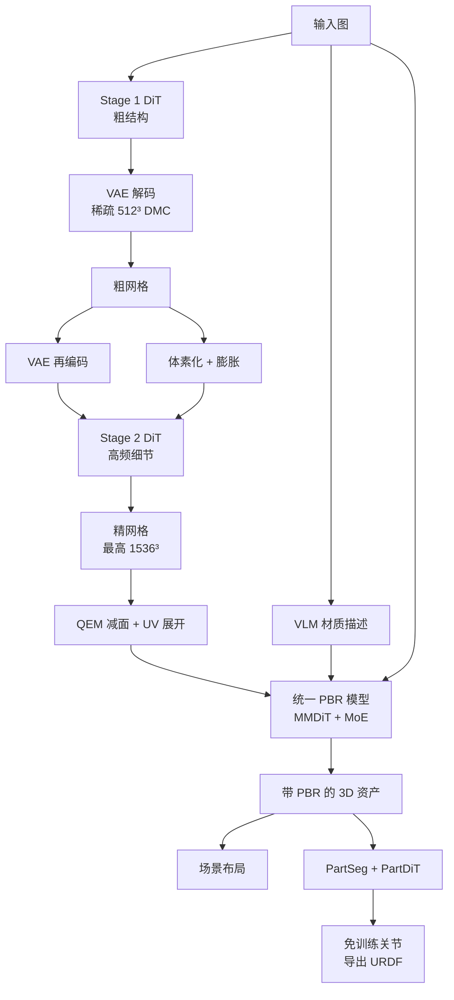

# Seed3D 2.0：几何要锐、PBR 一次出齐、生成完还得能进仿真

<!-- release-date: 2026-04-23 -->

> 本文依据 ByteDance Seed 的 **Seed3D 2.0: Advancing High-Fidelity Simulation-Ready 3D Content Generation**，arXiv:2605.13862v1，2026-04-22 提交，共 18 页。页码均指 PDF 自身页码（与页脚印刷页码一致）。文中区分三件事：**报告明确写了什么**、**我们怎么解释它**、**哪些是外部资料或本文推算**。

## 3D 生成为什么不能只看「像不像」

一张图变成一个 3D 物体，看起来「像」并不难。难的是它能不能进生产。报告一开篇就把用途摊开：XR 内容、3D 打印、机器人仿真（PDF p. 3）。这三类下游要的不是同一张好看的壳：

- 打印和渲染要**边是直的、薄壁是在的、表面是规整的**；
- 游戏引擎和影视灯光要**换一盏灯看起来仍然对**，不能把当时的高光烤死在颜色里；
- 机器人和交互系统要的不是一整块死网格，而是能摆进场景、能拆成部件、门能开的资产。

这三件事经常被缩成一句「生成质量更好了」。报告拒绝这种缩法，它把 Seed3D 1.0 留下来的问题劈成两道缺口（PDF p. 3）：

**质量缺口。** 生产环境要几何规整（锐利边缘、结构一致的表面），还要基于物理的材质在不同光照下保持视觉一致。包括 1.0 在内的现有模型能给出「说得过去的形状」，但在这些细粒度标准上持续不及格。

**能力缺口。** 静态的整体网格已经不够。下游越来越要多物体场景、按功能拆开的物体、以及部件级的物理交互。1.0 只有有限的场景生成，没有部件分解，也没有关节（articulation）。

所以 2.0 要同时过三关：几何精度、统一的 PBR 材质、以及能进物理与图形引擎的仿真套件。

几何和材质是两道独立的关，过了一道不等于过了另一道。白模准，贴图仍可能把光照烤进去；贴图好看，边缘仍可能是糊的。报告的人评也按这个拆法：先评只有形状，再评带纹理的端到端资产（PDF p. 1、p. 10）。

## 读之前只需要这几个概念

这一节是**读前背景**，不全是报告自己的定义。

**网格（mesh）**：一堆顶点连成三角面。游戏引擎、建模软件、物理引擎原生吃的就是它。没拆开的网格就是一整块死壳。

**有向距离场（Signed Distance Field，SDF）**：给空间里任意一点，返回它到物体表面的距离，外面为正、里面为负、表面上为 0。形状于是变成「这个函数的零等值面」，神经网络适合拟合这种连续场。

**Dual Marching Cubes（DMC，对偶移动立方体）**：从 SDF 抽出三角网格的经典算法之一（PDF p. 4，引用 [15]）。抽网格的分辨率直接决定细节上限和计算量。

**向量集（vector set，VecSet）**：把一个 3D 形状压成一串潜变量 token，序列里第 $k$ 个 token **不对应空间中某个固定位置**。报告明确说自己走这条范式（PDF p. 4，引用 [8, 22, 23]）。好处是生成变成「生成一条序列」，能借用图像扩散那套工具；代价是 token 自己没有坐标，结构规整性不容易保住——后面 Stage 2 往回加体素位置编码，就是在补这个代价。

**变分自编码器（Variational Auto-Encoder，VAE）与潜空间**：直接在原始网格上做生成太贵。先用 VAE 把形状压成短得多的潜变量（latent），扩散在这个压缩空间里进行，再用解码器还原。压缩比一高，边角就容易糊。这是几何这一半的核心矛盾。

**扩散 Transformer（Diffusion Transformer，DiT）与整流流（rectified flow）**：从高斯噪声走到数据分布的生成模型。报告的几何 DiT 用基于整流流的扩散框架（PDF p. 4，引用 Flow Matching [10]），但**没有写出公式**。按所引方法，最简单的直线路径是：

$$
x_t = (1-t)\,x_0 + t\,x_1,\qquad u_t = x_1 - x_0
$$

$x_0$ 是噪声，$x_1$ 是数据，$t$ 从 0 走到 1。模型学的是速度场 $u_t$，即「现在该往数据走多快、朝哪走」。这是对引用方法的解释，不是本报告编号的式子。

**PBR（Physically Based Rendering，基于物理的渲染）**：不把「看起来的颜色」写成一张图，而是拆成几张物理量。本报告直接生成多视图 **albedo（基础色 / 反照率）** 和 **metallic-roughness（金属度—粗糙度，文中简称 MR）**（PDF p. 5）。albedo 是去掉光照后的固有颜色；金属度和粗糙度决定高光像不像金属、边缘是锐是糊。有了这套贴图，换灯光时引擎能重新算，而不是播放一张烤死的照片。

**MMDiT（Multimodal Diffusion Transformer，多模态扩散 Transformer）**：一种双流 Transformer，不同模态各有投影，在共享的 DiT 块里交互。2.0 的纹理模型沿用 1.0 的 MMDiT 双流骨架（PDF p. 5）。

**混合专家（Mixture-of-Experts，MoE）**：按输入把计算路由到少数专家，而不是每次跑满整张网络。报告用它撑高纹理分辨率（PDF p. 5，引用 [17]）。**专家数、路由算法、每次激活几个专家，报告都没写。**

**视觉语言模型（Vision-Language Model，VLM）**：能同时看图和读文字的模型。报告用它写材质描述、给资产打分、判断关节类型，引用的是 Seed1.6（PDF p. 6，引用 [1]）。

**无分类器引导（Classifier-Free Guidance，CFG）**：推理时同一步跑两次网络，一次带条件、一次不带，再按系数外推，让输出更听条件。代价是每步算力翻倍。

**关节化（articulation）与 URDF**：门绕哪根轴转、转多少度。把这些写成机器人标准格式 URDF（Unified Robot Description Format），Isaac Sim 这类仿真器才能推动它。

**CCM**：报告正文没有定义这个缩写，只在 Figure 3 里把 `Normal & CCMs` 画成从输入网格送进纹理模型的几何条件（PDF p. 5）。按图形学常见用法，大概率指规范坐标图（canonical coordinate map）：把每个像素对应的 3D 位置写成颜色，坐标系固定在物体上。**这是本文对图的读法，不是报告的定义。**

## 一句话先说清

Seed3D 2.0 是一套从单图出发的 3D 内容系统，建立在 1.0 之上（PDF p. 1）。它真正改的，是把 1.0 里绑在一起的几件事拆开：

- **几何**：1.0 用单阶段生成，结构和细节互相抢预算；2.0 改成 coarse-to-fine 两阶段，并给 VAE 加上 locality-aware 的压缩与解码。
- **材质**：1.0 先出多视图 RGB，再估 PBR，误差沿级联往下传；2.0 用一个统一 PBR 模型直接出 albedo 和 MR，再用 MoE 和 VLM 语义条件把分辨率和物理合理性往上推。
- **仿真**：在单个资产之外加一套模型，覆盖场景布局、部件分解、免训练关节生成，让结果能进物理和图形引擎。

证据几乎全在人评：对五个近期商业模型的盲测里，带纹理的端到端资产胜率是 69.0%–89.9%（PDF p. 1、p. 3）。几何单独评时，对自家 1.0 的胜率高达 98.3%（PDF p. 1、p. 10）——几何这一跳比纹理那一跳更陡。

如果只记一句话：

> **生产可用的 3D 生成不是把 mesh 画得更像，而是把频率不同、监督不同的几件事——整体结构、表面细节、材质物理量、可交互结构——拆开各自做对，再用确定性几何算法接到引擎里。**

### 读原文前先知道的五个「没有」

这份报告短、图多、几乎没有公式，下面五件事决定了能从它读出多少：

- **没有参数量。** Stage 1 只说「放大后的 Seed3D 1.0 DiT 骨干」（PDF p. 4），纹理只说用了 MoE（PDF p. 5）。VAE、DiT、专家的大小一个数都没有。
- **没有训练数据体量。** 只有「broad-scale」「large-scale」「curated subset」这类措辞（PDF p. 9），没有物体数、类别分布、清洗保留率。
- **没有 GPU 数与生成耗时。** 唯一带秒的数字是数据预处理里 $1024^3$ 水密重网格「15 秒内」（PDF p. 9），不是生成推理。
- **没有消融，也没有几何数值指标。** 没有 Chamfer 距离、IoU、FID，定量证据全部是 Figure 1 的人评（PDF p. 1）。
- **几乎没有公式。** 整流流、CFG、稀疏路由、保锐损失都只在文字里出现。下文凡写出的式子，都是对引用方法的解释。

阅读顺序建议：p. 3 的两道缺口 → p. 4 Figure 2 与 p. 5 Stage 2 的两条先验 → p. 5 Figure 3 的统一 PBR → p. 7–8 部件与关节 → p. 8–9 数据六段 → p. 10 推理、蒸馏与人评设置 → p. 1 Figure 1 的胜率。

## 全景：三条流水线，不是一个模型

按 Figure 2、Figure 3、Figure 4 与 §2.3 重画，只表示模块怎么连，不含耗时或精度信息。

三个要点：

**第一，几何和材质仍然是两段。** 先出网格，再出 PBR。报告没有改成「一个网络同时出形状和贴图」，改的是每一段内部：几何从单阶段变两阶段，材质从级联 RGB→PBR 变成一次出齐。

**第二，仿真套件接在资产之后，不是另起一个 3D 世界模型。** 场景是「布局 + 逐个生成 + 摆进去」；部件是「先感知再补全」；关节是「VLM + 几何候选 + 视频运动先验」，而且免训练（PDF p. 6–8）。

**第三，能进引擎的那几步，大量是经典几何算法。** DMC、体素化与形态学膨胀、QEM 减面、UV 展开，报告都写了（PDF p. 4、p. 10）。生成模型负责「从噪声里长出形状和材质」，确定性算法负责「把它变成引擎吃得下的东西」。

## 几何第一刀：locality-aware VAE，把压缩名额还给复杂区域

### 旧问题：token 一少，边就没了

VAE 的任务是：输入网格，输出一串 VecSet token；再从 token 还原 SDF、抽出网格。压缩比越高，后面的 DiT 越便宜，重建也越容易丢锐边和薄壁。

2.0 的 VAE 沿用 1.0 的双分支 perceiver 编解码器（PDF p. 4，架构引 Dora [3]）。编码器吃表面点云，并补上位置、法向和锐边采样；解码器拿空间查询点对 latent 做交叉注意力，得到连续 SDF，再用 DMC 抽网格。到这里和主流写法还没分家。

### 新设计：邻域里的 token 是重复的，把它们合并掉

报告的观察是 VecSet 的一个结构性质：同一空间邻域里的 token 编码的是冗余几何信息（PDF p. 4，引用 [2, 5, 6]）。于是它做 **locality-aware latent aggregation（局部感知的潜变量聚合）**：编码时把邻域内的 token 合并，把表示能力集中到几何复杂的区域，同时保住一份紧凑的全局结构。报告声称这样**用更少的 latent token 达到比 1.0 VAE 更高的重建质量**（PDF p. 4）。

可以想成画建筑平面图：整面白墙不需要每平方米一张卡片，门框、楼梯和管道井才需要密写。合并邻域 token，就是把卡片从「按面积发」改成「按结构复杂度发」。

同一条局部性原理还用在解码。SDF 解码时，每个空间查询点都要看全部 latent，这层交叉注意力是主要计算开销（PDF p. 4）。2.0 把稠密注意力换成 **content-adaptive sparse routing（内容自适应稀疏路由）**：每个查询只看一小撮空间上连贯的 token，报告说解码延迟大幅下降、重建保真不变。

### 收益、代价、没写的东西

对 1.0 的形状胜率 98.3%，作者把这笔账算在「两阶段 DiT + locality-aware VAE」头上（PDF p. 10）。**这不是消融**：两个改动绑在一起，分不出各值多少。

- 邻域怎么定义、合并用平均还是学出来的、稀疏路由每个查询看几个 token，全部没写；
- 「更少 token、更高重建质量」没有对照表；
- VAE 的失真是全流水线的天花板。Stage 2 的目标被写成「把最终输出推近 VAE 能达到的重建保真」（PDF p. 5）——VAE 还原不出的锐边，DiT 也变不出来。

> **可迁移启发：压缩时不要按均匀格子分配名额。先承认邻域是冗余的，把名额集中到变化剧烈的地方；解码时也不要让每个查询都扫完全部记忆。** KV cache 压缩、特征金字塔、日志采样都有同一个陷阱：按均匀预算切，复杂区域先死。

## 几何第二刀：coarse-to-fine，别让结构和细节抢同一场扩散

### 旧问题：一场扩散要同时当建筑师和雕刻师

1.0 是单阶段生成。报告的诊断很干脆：在一次没有额外引导的扩散里同时学全局结构和局部细节，两者互相拉扯；结果是拓扑大体对，但形状过平滑，锐边、精确曲率和细表面保不住（PDF p. 4）。

这不是「模型不够大」。Stage 1 用的已经是放大后的 1.0 DiT 骨干，它仍然过平滑（PDF p. 4）。报告把原因归到任务本身的张力，而不是骨干容量。

### 新设计：先搭骨架，再在骨架上刻

**Stage 1：粗结构。** 从图像条件直接生成粗 latent，解码成粗网格，负责整体拓扑和粗表面。

**Stage 2：细节。** 把 Stage 1 的输出当几何锚，专门恢复高频细节。两个互补先验把它按在骨架上（PDF p. 5）：

1. **Coarse Shape Prior（粗形状先验）**：Stage 1 的 latent **部分加噪（partially diffused）** 后并入 Stage 2 的扩散过程，引导它去恢复局部细节，而不是重新发明整体结构。
2. **Voxelized Positional Encoding（体素化位置编码）**：Stage 1 的粗几何给出体素坐标，作为位置编码注入 Stage 2，让每个 latent token 锚到一个空间位置，从而促进结构规整。

两条先验各补一个缺口，这是本文的解释：

- 「部分加噪」是把干净的粗 latent 加一点噪声再去噪。低频骨架还在，高频被噪声盖住，模型只能在骨架附近改细节——和图像里 SDEdit 同一类动作。**加多少噪声，报告没写。**
- VecSet 的 token 本来没有坐标。Stage 1 可以在这种「无坐标集合」上把大形长出来；Stage 2 从已经存在的粗网格里**借回坐标**。位置编码在这里不是「序列第 $k$ 项」，而是「这个 token 对应物体上哪一块」。

对照同方向的 TRELLIS-2 一篇（它正是本报告的参考文献 [21]）：那边从一开始就把形状写成带坐标的稀疏体素，坐标是表示本身的一部分；Seed3D 2.0 保留无坐标的 VecSet 做第一阶段，只在第二阶段把体素坐标当条件借进来。两条路都在承认同一件事——**锐边与结构规整需要空间位置**。这段对照是本文的判断，不是本报告的实验。

### 推理时两条先验怎么接

§5.1 把训练时的两条先验落成推理时的两路并行信号（PDF p. 10）：Stage 1 预测粗 VecSet latent，在稀疏 $512^3$ 网格上做 DMC 得到中间网格；中间网格一路经 VAE 编码器变回 latent，一路做 GPU 体素化和**形态学膨胀（morphological dilation）**，得到空间占用先验；两路一起条件化 Stage 2，抽出最高 **$1536^3$** 的网格。

膨胀这一步值得停一下。体素占用卡得太死，Stage 2 就没有空间往外长薄壁和锐边；先膨胀一圈，等于给细节预留壳体。**报告只写了做膨胀，没有写核大小或动机，这句是本文的解释。**

$1536^3$ 若按稠密格点算约 $3.6\times 10^9$ 个查询点（本文按分辨率算出）。报告的办法是分层：用 Stage 1 的占用先验和多尺度过滤逐级剪掉查询点，再在交叉注意力式 SDF 查询里做空间感知分组（PDF p. 10）。最后用 GPU 加速的 **QEM（Quadric Error Metrics，二次误差测度）** 减到目标面数，再 UV 展开给纹理用。QEM 这一步引的是经典的 Garland–Heckbert 与 TRELLIS-2（PDF p. 10，引用 [4, 21]）。

### 收益与边界

报告把锐边、薄壁和复杂拓扑的改善算在这套两阶段策略上（PDF p. 3）。Figure 6 给出六组白模对照：机甲、表芯、台灯书桌、武将胸像、科幻堡垒、浮雕，对照列是 Hunyuan3D-3.1、Tripo 3.0、Rodin v1.9（PDF p. 11）。本文看图能对上的差别是：表芯一例 Hunyuan3D-3.1 把齿轮层磨成了平板，Seed3D 2.0 保住了齿与夹板；台灯一例 Tripo 3.0 丢了桌面底板。其余几例四家都能出大形，差别要放大看。这些是看图，不是测量。

- Stage 1 过平滑是设计预期，不是 bug。但如果 Stage 1 拓扑错了，Stage 2 没有机制推倒重来；
- 两阶段意味着至少两次 DiT 加一次中间编解码，靠后面的蒸馏补推理成本；
- 没有「只开 Stage 1」「关掉体素 PE」的对照。对 1.0 的 98.3% 是捆绑证据。

> **可迁移启发：当两个目标差了一个频段，不要让它们抢同一场生成。先用廉价通道长出低频骨架，再把高频生成锁在骨架上；需要位置时，从骨架里借，不要从 token 序号里编。** 关键约束是第二阶段必须被锁在第一阶段上，否则它会重新发明整体，两阶段就白拆了。

## 材质：不要先画一张 RGB，再猜它是什么做的

### 旧问题：级联把误差存进下一棒

1.0 的纹理是两棒：**Seed3D-MV** 先出多视图 RGB，**Seed3D-PBR** 再从 RGB 估计材质（PDF p. 5）。中间那张 RGB 已经把当时的光照烤进去了，下一棒只能在「看得到的颜色」上猜：这块亮，是金属，还是刚好有一盏灯？

报告把未知光照下的 PBR 估计写成**病态问题（ill-posed）**：同一外观可以来自完全不同的「光照 × 材质」组合（PDF p. 6）。它列了三种常见失败：光照被烤进 albedo 造成颜色漂移；非金属上的高光被当成金属响应；漫射光下的金属被估成非金属。另外，1.0 的图像分辨率低，细纹理在分解时保不住（PDF p. 5）。

### 新设计：一个模型直接出 albedo 和 MR

2.0 把两棒收成**统一 PBR 生成模型**，从参考图和 3D 几何直接出多视图 albedo 和 MR，不再经过中间 RGB（PDF p. 5）。骨架仍是 1.0 的 MMDiT 双流：albedo 和 MR 各走各的投影层，在共享 DiT 块里联合建模。Figure 3 中的样例是一只蒸汽朋克时钟机器人，VLM 写的说明里明确点出 aged Metal 与 Glass，输出是六个视角的 albedo 和六个视角的 MR（PDF p. 5）。

取消中间 RGB，等于取消「先编造一种光照，再假装没看见它」。模型必须直接预测物理量，这才是统一模型的真正好处，而不只是少一个网络。

### 加宽容量：MoE 用来撑分辨率

分辨率要升高，而稠密网络直接放大潜空间的算力不可接受（PDF p. 5）。报告的选择是 MoE：加大网络容量，靠稀疏专家路由把激活计算按住。它声称的收益是定性的（PDF p. 5–6）：更丰富的视觉图案和表面纹理；文字、花纹这类细特征比 1.0 好，尤其利好 albedo；金属—粗糙度边界更精确，区域过渡更干净。

**目标分辨率、专家数、路由是否带负载均衡，全部没写。**

### 再加一道语义锁：VLM 条件，而且晚装

纯外观不够，就加语言。VLM 生成材质类型、表面特征和物理属性的描述，编码成条件 token，与几何、参考图一起注入 DiT 块（PDF p. 6）。

训练时这道锁故意晚装。纹理训练分两段（PDF p. 9）：

1. **预训练**：带 MoE 的统一 PBR 模型在大规模数据上学多视图 albedo 与 MR，尽量覆盖多样的外观、材质类别和光照。这一段**没有 VLM**。
2. **SFT**：高质量子集、降低学习率，这时才引入 VLM 材质描述。

报告给的理由是：先把通用纹理生成能力巩固下来，再专门处理复杂光照下的歧义分解（PDF p. 9）。本文的读法是：VLM 描述是窄而强的条件，过早上场，模型可能走捷径去抄标签，而不是先学会从几何和参考图里看材质。**报告没有做「预训练就注入 VLM」的对照。**

### 收益与边界

上图裁自 Figure 7 的第三行与第五行（PDF p. 12）。Figure 7 共六行：不锈钢锅、士兵、计算器、女战士胸像、复古电脑、机械龙；报告点名的优点是纹理分解准确、文字渲染可靠（PDF p. 11）。文字渲染这一条在计算器一行最容易看出来，是 albedo 分辨率与 MoE 这一刀最直接的证据。锅的金属质感也有差别，但「更真实」属于看图，不是测量。

- 带纹理人评对 1.0 的胜率是 87.3%，几何是 98.3%（PDF p. 1）。材质上仍然赢，但幅度小于几何那一跳。**这是本文从 Figure 1 读出的对比，报告没有拿两列比代际贡献。**
- 统一模型吃几何条件，但法线与 CCM 怎么编码、视角数与相机轨迹，正文没写。
- VLM 写错材质类型时，语义锁会把错误写进条件；报告没有讨论这种失败。
- 纹理推理只说做了模型并行执行和后处理算子优化，降低了端到端延迟（PDF p. 10），没有延迟数字。

> **可迁移启发：能一次生成的物理量，就不要先生成一种被污染的中间外观再反推。病态反问题优先加语义约束；强约束放到 SFT，先让模型在宽分布上把生成学会。** 图像的本征分解、语音的内容与音色分离，都是同一类「先污染、再估计」的级联。

## 仿真套件：场景能摆、部件能拆、关节能转

质量缺口靠上面两节补，能力缺口靠这一套。报告把它写成三个接续模块：场景布局 → 功能部件分解 → 关节生成（PDF p. 6）。顺序有含义：没有部件，关节没有对象；没有单物体质量，场景只是一堆烂资产的拼盘。

### 场景布局：视觉有几何线索，文本没有，所以不走同一条路

把物体级生成扩成整场，要回答三件事：东西放哪、多大、彼此什么关系（PDF p. 6）。报告按输入模态拆成两路，因为能看见的空间线索完全不同。

**视觉这一路（尤其是单段视频）**：先用深度估计恢复场景几何、推断物体随时间的整体分布；逐帧检测与分割得到实例掩码，交给 VLM 给每个实体写描述，再用图像补全（inpainting）补出被遮挡部分；补全后的物体图送进 2.0 的几何与纹理模型生成网格，最后与估计的深度图对齐，确定每个物体的坐标和尺度（PDF p. 6）。

**文本这一路**：没有几何也没有位置，问题欠约束。报告微调一个 LLM 做空间推理，从纯文本生成布局和逐物体描述，再按每个物体的布局与描述生成资产、合成场景（PDF p. 6）。

Figure 8 左边是文生场景，提示词要求一间 6.8 m × 4.2 m、带凹室的起居室，左边音乐区、右边观影区，地毯上还有一辆玩具车；右边是视频生场景，俯视的餐饮空间（PDF p. 13）。报告强调结果是实例级场景，物体仍是独立资产，可以再被下游操作。

本文的判断：这是**物体组合式场景（object-compositional scene）**——先决定有谁、在哪，再逐个生成、摆进去。它和 HunyuanWorld-1.0 那种以全景图为世界代理、生成可漫游环境的路线问题定义不同，不要拿来比谁的场景更「真」。这段对照是外部位置说明，不是本报告的实验。

边界：深度估计的尺度、遮挡补全的幻觉、文本布局的物理合理性（桌子会不会穿墙），报告都没有评测。场景一节只有示意图，没有人评。

### 部件与关节：先感知，再生成，再用现成先验推运动

仿真里，智能体操作的是门、抽屉、把手，而不是「一把椅子」这个整体（PDF p. 7）。报告用「perception-then-generation（先感知、后生成）」两段做部件，再在部件上免训练地推关节（PDF p. 7–8）。

**为什么先分割再生成。** 现成的整体网格不带功能边界。本文的理解是：分割是在已经对的表面上切缝，补全是把切开的区域做成能独立模拟的实体，两步的监督信号和失败模式都不同。**报告只写了这个范式，没有对照「端到端直接生成零件」。**

PartDiT 的三个条件各有分工（PDF p. 7）：全局形状 latent 给结构上下文，部分点云给空间引导，输入图给外观；改造过的注意力同时做部件之间和部件内部的交互（引用 PartCrafter [9]），全局形状特征还被注入每个 DiT 块，以保持部件之间几何一致。每个去噪后的 latent 经 VAE 解码，再组装成部件组合网格。Figure 4 用一支口风琴演示，输出里有组装好的整体和炸开的爆炸视图（PDF p. 7）；Figure 9 把能力铺到房屋、角色、家具、行李箱、柜子等（PDF p. 13）。

**关节为什么免训练。** 部件只回答「这是谁」，关节要回答「它怎么动」：层级、关节类型、轴、运动范围（PDF p. 6）。大规模关节 3D 监督又少又贵，所以报告拼三类现成先验（PDF p. 8）。其中运动范围那一步最巧：同一扇门，开 30° 和开 90° 在静帧上都成立，静态几何天然欠约束。报告的办法是给一张渲染图和一句「预期怎么动」的提示，让图生视频模型合成一段部件运动短片，再用可微渲染（引用 PyTorch3D [13]）对着生成的序列拟合关节范围，思路沿用 PARIS 与 Puppeteer 这类运动重建工作（引用 [11, 18]）。

最后由 VLM 估质量、摩擦等基本物理量，连同关节结构导出 URDF 等标准格式（PDF p. 8）。Figure 10 是三例 Isaac Sim 交互（PDF p. 14）：木桶的提梁被分成独立部件、向上拉时带起整个桶；烤箱门被拉开；矿车的车轮被分解成独立部件，外力推着整车在地板上移动。

三例都是单轴、大行程、受力方向直观的物体，适合拍示意图，不代表多连杆、球铰或接触丰富的机构也能同样走通。免训练的风险也正好在这里：VLM 选错轴、视频模型做出违反机械结构的运动、可微拟合落到局部最优，报告都没有失败分析；质量与摩擦同样由 VLM 估，精度未知。结论把「更丰富的物理属性估计」列为未来工作（PDF p. 15），等于承认这一步现在还薄。点提示从哪来、能拆多少类、PartDiT 一次出全部部件还是逐个出、图生视频用的是哪个模型，都没写，也没有部件 IoU 或关节成功率。

> **可迁移启发：缺监督时，不要立刻训一个端到端网络。先问语义、几何、动态三类先验里，哪一类已经有现成的强模型，只差一个可检验的接口把它们接起来。** 候选由几何算子生成、裁决交给 VLM——让语言模型做选择题而不是做回归——是这里最值得带走的接口设计；用视频当运动先验，则是用数据更多的模态去解数据更少的模态里的歧义。

## 数据：六段清洗，真正保锐边的是倒数第二段

报告把数据管线画成三组六步（PDF p. 8，Figure 5）。没有数据量，但步骤本身说明他们相信「脏 3D 资产」有哪几种死法。

前两步属于初步净化，中间两步属于标注与策展，最后两步生成训练数据（PDF p. 8，Figure 5 的三组标题）。

1. **格式规范化与清洗**：资产统一成「网格 + 多通道 PBR」表示；几何净化去掉「伪 3D」广告牌和底座之类多余结构；纹理校验丢掉 UV 坏掉或缺通道的资产（PDF p. 8）。
2. **按类视觉去重**：对多视图渲染抽 2D 特征，用**按类别变化的动态阈值**，在视觉同质的类里避免过度过滤，同时狠打近重复（PDF p. 8）。本文的读法：椅子彼此本来就像，用全局统一阈值会把一个类洗空。
3. **VLM 打分与配文**：微调过的 VLM 从语义、结构、感知三类共六个维度给资产打分，由一个更强的 LLM 当仲裁，并生成标准化文字描述；这些标签既用于后面策展，也作模型的语义先验（PDF p. 8）。**六个维度的名字没列。**
4. **策展与精炼**：资产分成预训练子集和 SFT 子集。VLM 标签过滤低质样本，并指导朝向对齐和多物体实例拆分；SFT 子集额外经过人工核验几何与纹理保真（PDF p. 8）。后面所有「降学习率的高质量微调」，吃的都是这一支。
5. **保锐度的水密重网格**：策展后的网格转成 DMC 能吃的水密表示，全程 GPU 加速。关键在于不用常规的 $L_2$ 距离最小化，而用受 $L_\infty$ 启发的保锐度写法，保住二面角和边缘间断；优化后的 CUDA 管线在 **$1024^3$ 分辨率下 15 秒内**完成重建；多部件资产对每个部件单独做一遍（PDF p. 8–9）。
6. **条件渲染**：沿均匀相机轨迹做视角一致的几何渲染，以及 albedo、roughness、metallic 的多通道 PBR 渲染（PDF p. 9）。

第 5 步值得多说一句。$L_2$ 最小化的脾气是「平均看起来对就行」：锐边只占少数点，误差被大片光滑面稀释，重建结果往往把拐角磨圆。$L_\infty$ 在乎最坏处的偏差，而最坏处常常就是那条棱。**报告只写了「inspired by $L_\infty$」，没给公式；这段是本文对动机的解释。**

六段里，前四段决定「什么资产配进训练集」，第五段决定「进来之后几何真值长什么样」。VAE 和两阶段 DiT 再努力，也监督不了被 $L_2$ 磨圆的真值——锐边这条产品线从数据阶段就开始了。

> **可迁移启发：生成模型的锐度上限，往往不在网络深度，而在真值被写成什么损失。** 用 $L_2$ 做几何预处理，等于训练开始前就把高频标签扔了。过滤阈值要跟着类别的视觉密度变；最贵的人眼只看最终用来「收尖」的那一小撮 SFT 数据。

## 训练课程：几何先拉长序列，纹理晚装 VLM

几何 DiT 按「分层递进」训练，两个 Stage 各三步（PDF p. 9）：

| 阶段 | 报告写了什么 | 没写什么 |
|---|---|---|
| Stage 1 预训练 | 从零训；256 个 latent token、256 分辨率图像；学 3D 形状的基础分布与视觉—几何对齐 | 数据量、步数、学习率、batch |
| Stage 1 继续训练 | latent 序列逐步加到 4096，图像分辨率加到 512，学更细的表面与更锐的边 | 经过哪些中间长度 |
| Stage 1 SFT | 高质量子集、降低学习率，去掉不想要的表面扰动、改善拓扑 | 降到多少、子集多大 |
| Stage 2 初始化 | 从 Stage 1 checkpoint 起步 | — |
| Stage 2 继续训练 | 加入体素位置编码与部分加噪的 Stage 1 latent | 加噪水平 |
| Stage 2 SFT | 精选高质量样本，收锐度、几何规整与对参考图的保真 | 样本规模 |

256 → 4096 是 16 倍序列长度。VecSet 没有和位置绑死的索引，加长序列在表示上说得通：更多 token 去覆盖更复杂的区域，和 locality-aware VAE「把容量集中到复杂处」是同一方向。Stage 2 从 Stage 1 初始化，说明作者认为「刻细节的网络」应该先会搭骨架。**这两句是本文的串读。**

纹理两段已在材质一节讲过：预训练学宽分布，SFT 才加 VLM（PDF p. 9）。两边的 SFT 都写了「reduced learning rates」，都没给数。

## 推理：把 CFG 和步数蒸掉

几何推理路径已在几何第二刀里按页码走过，纹理推理只给了「并行执行 + 后处理优化」。整条资产流水线继承 1.0 的多阶段范式：几何生成、纹理合成、UV 纹理补全（PDF p. 10）。UV 补全怎么做，没写。

生产部署真正依赖的是 §5.2 的两段式渐进蒸馏，几何与纹理的全部 DiT 都用（PDF p. 10）。

**第一段：蒸掉 CFG。** 标准 CFG 同一步算带条件的速度 $v_c$ 和不带条件的速度 $v_\emptyset$，再外推：

$$
\hat{v} = v_\emptyset + s\,(v_c - v_\emptyset)
$$

$s$ 是引导系数（公式是对方法的解释，报告没写，也没给 $s$ 的值）。学生被训成一次前向直接输出 $\hat{v}$，每步计算减半，同时保留引导采样的质量好处。

**第二段：渐进步数蒸馏。** 按 Salimans 与 Ho 的课程（引用 [14]）逐轮把采样步数减半：每一轮学生用一步去匹配老师的两步输出。报告说，分阶段压缩避免了一次性激进蒸馏的训练不稳，对原轨迹的近似也更忠实。

蒸馏后的模型在视觉保真、多视图一致性、与参考图对齐三个维度上与全步数 CFG 模型「表现相当」（PDF p. 10）。没有表，没有老师与学生各多少步，也没说人评用的是蒸馏前还是蒸馏后的模型。

> **可迁移启发：先蒸掉「每步算两次」这种结构性浪费，再蒸步数。** 一次把引导和步数同时压扁，优化目标会拧在一起，训练容易漂。

## 人评证明了什么，没证明什么

设置（PDF p. 10）：两种设定，只评形状与评带纹理的端到端资产；对照五个近期方法 Hunyuan3D-2.5、Hunyuan3D-3.1、Tripo 3.0、Rodin Gen2 v1.9、HiTem v2.0，Figure 1 另外画了 Seed3D 1.0；招募 60 名有 3D 建模背景的评分人，每个对照随机分给其中 15 人，评 200 张以上图像提示；盲成对比较，判谁更好或两者相当。

Figure 1 转成表，数值是「Seed3D 2.0 更好」一段的占比（PDF p. 1）：

| 对照 | 只评形状 | 端到端带纹理 |
|---|---:|---:|
| Hunyuan3D-2.5 | 65.1% | 81.2% |
| Hunyuan3D-3.1 | 55.2% | 69.0% |
| Tripo 3.0 | 92.8% | 81.1% |
| Rodin Gen2 v1.9 | 89.6% | 89.9% |
| HiTem v2.0 | 79.2% | 84.7% |
| Seed3D 1.0 | 98.3% | 87.3% |

Figure 1 每根条还有 Inferior 与 Same 两段，报告没把它们写成数字；正文只说带纹理设定下「相当」的比例一直很小（PDF p. 10）。所以 $100\% -$ 胜率是「输 + 平」的合计，不能直接当败率读。摘要里的 69.0%–89.9% 对应前五行的纹理列，不含 1.0。

几件必须一起读的事：

- **对 Hunyuan3D-3.1 的形状胜率只有 55.2%。** 这是最接近的一场，不是 90% 那种碾压。「consistently outperforms」在技术上成立，但幅度要看表。带纹理对 3.1 是 69.0%，正好是摘要区间的下沿。
- **对自家 1.0，形状 98.3%、纹理 87.3%。** 作者把近乎一边倒的形状偏好归因于两阶段 DiT 与 locality-aware VAE（PDF p. 10），没有消融拆开。
- **没有自动指标。** 没有 Chamfer 距离、体积 IoU、FID、PBR 分解误差。人评回答「看起来更好吗」，不回答「锐边的几何误差小了多少」「金属度贴图物理上对不对」。
- **仿真套件完全没进这张表。** 场景、部件、关节只有 Figure 8–10 的示意，没有对照、成功率或物理稳定性数字。能力缺口是引言两大主题之一，证据却全是定性的。

## 报告没写的，以及还不该当成已经解决的事

**规模与成本**：任何模块的参数量、专家数；训练数据物体数、类别表、清洗保留率；GPU 种类与数量、步数、学习率、batch；单次生成的墙钟时间与显存。

**算法接口**：locality-aware 聚合与稀疏路由的实现；部分加噪的噪声水平、膨胀核大小、QEM 目标面数；纹理生成分辨率、视角数、CCM 的定义；CFG 系数与蒸馏前后步数；VLM 六个打分维度、空间推理 LLM 的底模、图生视频模型的名字；UV 补全算法。

**评测**：几何自动指标、PBR 分解误差、任何消融；场景、部件、关节的成功率与物理合理性；人评中 Same 与 Inferior 的具体比例、评分细则、是否用蒸馏模型。

**限制**：报告没有独立的限制节。结论里的未来工作——更丰富的物理属性估计、更大更多样的场景、与下游管线更深的集成（PDF p. 15）——是最接近「还没做完」的三句话。

## 可迁移启发汇总

| 启发 | 出处 |
|---|---|
| 质量缺口和能力缺口分开补，不要都叫「生成更好了」 | §1（PDF p. 3） |
| 压缩名额按结构复杂度分配，解码按空间局部路由 | locality-aware VAE（PDF p. 4） |
| 低频和高频不抢同一场生成；第二场锁在第一场的骨架上 | 两阶段 DiT（PDF p. 4–5、p. 10） |
| token 没坐标时，位置从已有几何里借，不从序号里编 | 体素位置编码（PDF p. 5） |
| 病态反问题不要先生成被污染的中间量再反推 | 统一 PBR（PDF p. 5） |
| 用 MoE 撑分辨率，用稀疏路由按住激活 | 纹理 MoE（PDF p. 5） |
| 强语义条件放到 SFT，不从预训练第一天就上场 | VLM 晚注入（PDF p. 9） |
| 视觉布局有深度和实例，文本布局没有，两路分开 | 场景布局（PDF p. 6） |
| 没数据就免训练：几何出候选，VLM 做选择题，视频解运动范围 | 关节管线（PDF p. 8） |
| 锐边从真值损失就开始保 | $L_\infty$ 启发的重网格（PDF p. 8–9） |
| 先蒸掉 CFG 的双前向，再按课程蒸步数 | 两段蒸馏（PDF p. 10） |
| 人评拆开几何和材质两关；最强对照的 55.2% 要和 98.3% 一起读 | Figure 1 与 §6（PDF p. 1、p. 10） |

## 关键词回看

- **质量缺口 / 能力缺口**：全文两根轴。前半补锐边与 PBR，后半补场景、部件、关节。
- **VecSet**：无坐标的形状 token 序列。Stage 1 在上面长骨架，Stage 2 靠体素位置编码把坐标借回来。
- **locality-aware VAE**：邻域聚合加稀疏解码路由，是压缩比和锐度的上游。
- **粗形状先验 / 体素位置编码**：Stage 1 留给 Stage 2 的两条先验，一条锁结构，一条给坐标。
- **$512^3$ / $1536^3$**：推理时粗网格与精网格的抽取分辨率，中间有一步形态学膨胀。
- **统一 PBR / albedo / MR**：取消 RGB 级联，一次出物理贴图。
- **MMDiT + MoE + VLM 条件**：双流共享骨干，MoE 撑分辨率，VLM 到 SFT 才注入。
- **PartSeg / PartDiT**：先在表面切出功能部件，再补成可组装的实体。
- **免训练关节**：VLM 分组与判类型，几何算子出候选轴，图生视频加可微渲染定运动范围，导出 URDF。
- **$L_\infty$ 启发的水密重网格**：数据阶段保锐边，$1024^3$ 分辨率 15 秒内。
- **CFG 蒸馏 + 渐进步数蒸馏**：生产推理的成本刀。

## 资料与阅读边界

**版本与首发日。** arXiv 官方页截至核验只有 v1（2026-04-22 提交），与本文依据的版本一致。`release-date` 取 2026-04-23：官方博客 [Seed3D 2.0 Released: Higher Precision and Greater Usability](https://seed.bytedance.com/en/blog/seed3d-2-0-released-higher-precision-and-greater-usability) 标注 2026-04-23，并写明技术报告已公开、API 已在火山引擎上线；arXiv 提交日早一天，但那是论文上传，不是模型对外可用。摘要脚注的 Model ID `doubao-seed3d-2-0-260328`（PDF p. 1）里的日期串没有官方证据表明是上线日，不采用。

**外部补充（不是 PDF 原文）。** 官方产品页 <https://seed.bytedance.com/seed3d_2_0>；上面的官方博客另写了几何泛化、遮挡与贴图错误、推理效率仍是长期问题，那是博客的说法，不是本 PDF 的限制节。与 TRELLIS-2、HunyuanWorld-1.0 的对照是本文的位置说明；同方向的物体级对照可读 Hunyuan3D-2.0（它本身不出 PBR），其实验数字不能读成本报告的结果。

**报告直接引用、正文用到的方法。** Seed3D 1.0（[16]，对照基线）、Seed1.6（[1]，VLM）、Flow Matching（[10]）、Progressive Distillation（[14]）、Dual Marching Cubes（[15]）、3DShape2VecSet（[22]）、Dora（[3]，VAE 结构）、Point Transformer V3 与 Sonata（[19, 20]，PartSeg 骨干）、PartCrafter（[9]）、DragAPart、PARIS、Puppeteer（[7, 11, 18]）、PyTorch3D（[13]）、QEM（[4]）与 TRELLIS-2（[21]）、Isaac Sim（[12]）。
