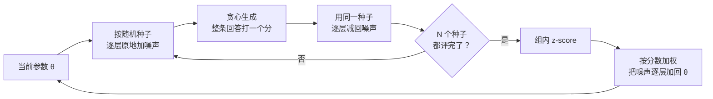

# Evolution Strategies at Scale：十亿维全参微调不走反传，三十个扰动就够搜

<!-- release-date: 2025-09-29 -->

> 本文依据 **Evolution Strategies at Scale: LLM Fine-Tuning Beyond Reinforcement Learning**，Cognizant AI Lab 主导，合作方为 MIT、UCLA、UT Austin；Xin Qiu、Yulu Gan、Conor F. Hayes 并列一作，Xin Qiu 为项目负责人。arXiv:2509.24372v3，2026-07-14，共 29 页，ICML 2026 正式论文。页码均指 PDF 自身的页码。文中会区分三件事：**论文明确写了什么**、**我们怎么解释它**、**哪些是外部资料或我们的计算**。

## 读前先把几个词说成人话

这篇论文假设读者知道「用奖励微调语言模型」，但不假设你见过进化策略。先把会反复出现的词说清楚：

- **参数 $\theta$**：模型全部可训练的权重。这篇论文动的是整份 $\theta$，不是某一层，也不是 LoRA 那种低维插件。
- **奖励 $R$**：给一条完整回答打一个分。Countdown 看算式对不对，简洁性任务看回答有多短，数学任务看答案对不对。中间过程不打分。
- **反向传播（backpropagation，反传）**：从损失往回算每个参数该怎么改。PPO、GRPO 都靠它；本文的方法从头到尾不做这一步。
- **动作空间探索**：生成每个 token 时按概率随机抽样。策略梯度方法的随机性注入在这里，每个位置都在掷骰子。
- **参数空间探索**：不在抽样时加随机，而是给权重本身加一小撮噪声，得到一个略有不同的模型，让它完整回答一遍。
- **进化策略（Evolution Strategies，ES）**：一类零阶优化方法，不求梯度。人话是：随机抖出一批候选参数，看谁得分高，再按得分把这些抖动加权平均回去。
- **种群（population）$N$**：每一轮同时试的扰动份数。本文默认 30。
- **PPO 与 GRPO**：近端策略优化（Proximal Policy Optimization）与组相对策略优化（Group Relative Policy Optimization），当前 LLM 强化学习最常用的两种策略梯度算法。本文只把它们当对照，机制见本站 DeepSeekMath 一篇。

## 一句话先说清

ES 在控制和游戏上曾经能和 RL 打平，但一直被认为扩不到现代 LLM：先前用 ES 优化神经网络的规模停在几百万参数，种群却要上万（PDF p. 1–2）；理论分析还说参数空间探索的复杂度随参数量平方增长（PDF p. 3）。

这篇论文的回答是：

> **用一个去掉所有花样的 ES，靠随机种子复现噪声、逐层原地扰动，第一次在十亿参数量级上做了不降维的全参微调，种群只要 30。**（PDF p. 1–2）

它声称在四条轴上优于文中的 RL 实现：长程与延迟奖励更宽容、跨基座更稳、更少 reward hacking、多次运行更一致（PDF p. 1）。这四条的证据强度差得很远：

| 主张 | 证据 | 强度 |
|---|---|---|
| 长程稀疏奖励上更强 | Countdown，7 个基座、6 种 RL 实现，同样的样本评估次数 | 最硬；但训练前段 RL 常常领先 |
| 跨基座稳健 | 同一组 ES 超参打 7 个模型，RL 每个模型单独调参 | 硬 |
| 更少 reward hacking | 简洁性任务，训练集只有 2 条 | 现象清楚，任务很小 |
| 多次运行更稳 | 简洁性 4 个种子、Countdown 3 个种子 | 清楚 |

数学推理上，论文自己的措辞是「有竞争力」，不是更强（PDF p. 7）。

## 主要矛盾：不是 ES 不行，是大家以为维数太高

### 策略梯度在长程奖励上的四个毛病

引言把 RL 微调的困难写成四条（PDF p. 1）：

1. **样本效率低、梯度估计方差大**。只在最后给一个分时，要把它分摊到前面几百上千个 token 上，估计器很噪。
2. **对基座敏感**。同一套 RL 配方换一个基座，效果差一截。
3. **容易钻奖励的空子**。模型找到「分数高、行为坏」的捷径。
4. **同一套超参多跑几次也不稳**，微调成本因此放大。

### 为什么 ES 一直没被拿来微调 LLM

ES 本身不新。OpenAI 2017 年那篇工作第一次把它扩到深度网络，在控制和游戏里与当时的 RL 打平（PDF p. 2）。但此后的规模一直很小（PDF p. 2–3）：

| 工作 | 大约规模 |
|---|---:|
| Zhang 等，2017，卷积网络 | 约 300 万参数 |
| Lehman 等，2018 | 约 16.7 万参数 |
| Lorenc 与 Neruda，2025，决策 Transformer | 约 250 万参数 |
| Such 等，2017，只用变异的遗传算法 | 约 400 万参数 |

这些实现的种群常常是 10,000 以上（PDF p. 2、p. 5）。Vemula 等人 2019 年的理论分析更不乐观：参数空间探索的复杂度随参数量平方增长，动作空间探索则随动作维数平方、奖励视野四次方增长（PDF p. 3）。照这个分析，模型越大越该在动作空间里搜。

于是进化方法用在 LLM 上都绕开了全参（PDF p. 2–3）：只进化最后一层（325 个参数）、只进化低维 adapter（最多 1600 维）、用遗传算法调约 950 万参数的编码器（结果不如 Adam）、或者干脆改在动作空间里进化、只用在 SFT 最后一轮。零阶优化里还有 MeZO，它也在参数空间里微调 LLM、显存省很多，但论文说它的微调成绩不比其他基线好（PDF p. 3）。

矛盾因此很具体：**RL 在长程稀疏奖励上有结构性的毛病，ES 理论上不受这些毛病困扰，却被认为搜不动十亿维。** 论文要证明的是「搜得动，而且成绩强」。

## 先看全景：随机性注入在哪里

示意图依据 PDF p. 4–5 实现细节第 5 条与 p. 8 第 5 节重画，不含实测数据。

这张图是全文的地基。策略梯度方法把探索放在动作上，一条 500 token 的回答就掷了 500 次骰子，最后只拿一个分；ES 把探索放在参数上，一个扰动决定整条回答，生成时用贪心解码把动作随机性关掉（PDF p. 5）。所以两边比较的是「怎么改权重」，不是「怎么抽样」。

一轮 ES 迭代的流程（据 PDF p. 3–4 的 Algorithm 1、Algorithm 2 改写）：

整条路上没有反传、没有价值模型、没有 token 级优势。机器之间只交换种子和标量奖励（PDF p. 8）。

## 核心设计一：扰动、打分、加权平均

### 算法

每一轮（PDF p. 3–4，Algorithm 1）：

1. 抽 $N$ 份独立的标准高斯噪声 $\varepsilon_n$，得到 $N$ 个扰动模型 $\theta_{t-1}+\sigma\varepsilon_n$。$\sigma$ 是噪声幅度，常用 0.001。
2. 每个扰动模型回答问题，得到奖励 $R_n$。
3. 把 $R_n$ 在组内标准化成 $Z_n$（减均值、除标准差），按它把噪声加权平均回参数：

$$
\theta_t \leftarrow \theta_{t-1}+\alpha\cdot\frac{1}{N}\sum_{n=1}^{N}Z_n\,\varepsilon_n
$$

$\alpha$ 是学习率。标准 NES 与 OpenAI ES 的更新里还有一个 $1/\sigma$，作者把它并进了 $\alpha$，少一个要调的量（PDF p. 4–5）。

**我们如何解释它。** 得分高的扰动方向被加上去，得分低的被反向加上去。它估计的是「在当前参数附近按高斯抖一抖，期望奖励往哪边涨」，也就是被高斯平滑过的奖励曲面的梯度方向。每条回答只贡献一个标量：没有重要性比，没有 token 级信用分配。本站 GSPO、DAPO 两篇讨论的都是策略梯度目标里的某一项怎么改，和这里不是同一件事。

### 故意不加的东西

OpenAI ES 常用的奖励秩变换、镜像采样、权重衰减、virtual batch normalization 一律不用，也不用 Adam（PDF p. 5）。理由是先证明最朴素的 ES 就够，这些增强留给以后。

### 可迁移启发

当奖励只打给整条输出时，把探索放在哪一层是一个可以选的设计变量。策略梯度把探索放在最细的动作上，也就要把一个分摊回最细的粒度；ES 把探索放在最粗的参数上，一次扰动对应一个分，不需要摊。

## 核心设计二：七处工程，让十亿维搜得动

公式很简单，难点在显存：一份十亿维的噪声向量就和模型一样大，种群 30 就是 30 份。Algorithm 2 在基本流程上改了七处（PDF p. 4–5）：

| 改动 | 做法 | 解决什么 |
|---|---|---|
| 种子复现噪声 | 只存随机种子，用同一种子重置随机数发生器就能精确复现那份噪声 | 不必存十亿维的噪声向量 |
| 并行评估 | 每个进程拿一个种子独立评估 | 种群成员互不等待 |
| 逐层原地扰动与还原 | 一层一层加噪声、评完再用同一种子一层一层减回去 | 除模型本身外，只需一个「一层大小」的临时张量 |
| 奖励标准化 | 每轮组内 z-score | 不同任务、不同阶段的奖励量纲一致 |
| 贪心解码 | 扰动模型用贪心生成 | 成绩差只能来自参数扰动，评估是确定性的 |
| 更新也拆开 | 按层、按种子原地累加更新 | 不必再分配一份完整的更新向量 |
| 并入 $1/\sigma$ | 把 $1/\sigma$ 吞进 $\alpha$ | 少一个超参 |

一个实现细节：每个扰动模型在每一层都用同一个种子重新初始化随机数发生器，所以跨层的噪声是部分相关的，不是严格独立同分布；附录说初步实验里这和真正独立的噪声没有显著差别（PDF p. 17）。

### 算力账

附录 A.8 按常用估算给了每次样本评估的浮点运算量（PDF p. 23）：参数量 $P$、序列长 $L$ 时，一次前向约 $2PL$，一次反向约 $4PL$。

| 方法 | 每处理一条训练样本要做什么 | 浮点运算 |
|---|---|---:|
| ES | 扰动模型一次前向 | $2PL$ |
| GRPO | 策略前向 + 参考模型前向 + 策略反向 | $8PL$ |
| PPO | 在 GRPO 之上再加价值模型的前向与反向 | 更多 |

**边界**：这是按运算次数的估算，论文没有给 GPU 数、墙钟时间或美元成本。ES 的每次评估便宜，但它要评 $N$ 个扰动模型；两边的总账是在「样本评估次数相同」这个口径下才可比，下一节讲。

### 可迁移启发

零阶方法能不能用，常常卡在显存布局，不卡在公式。任何「理论上要存一份和模型一样大的向量」的算法，都可以先问：能不能用可复现的随机源代替那份向量。

## Countdown：长程稀疏奖励上的主结果

Countdown 要求用给定的几个数和加减乘除凑出目标值，每个数只能用一次，例如用 100、50、6、3 凑 950 可以写成 $100\times(6+3)+50$（PDF p. 18–19）。奖励只看最终算式，是典型的长程、稀疏、只看结果的任务。

### 对照怎么摆

| 项目 | ES | RL 对照 |
|---|---|---|
| 超参 | 所有模型共用一组：$N=30$，$\sigma=0.001$，$\alpha=5\times 10^{-4}$ | 每个模型单独网格搜索 KL 系数 $\beta$ 与学习率，取最好的（附录 Table 4） |
| 实现 | Algorithm 2 | PPO-z 用 TinyZero；GRPO-z 用 GRPO-Zero，组大小 8 与 30；GRPO-v 与 Dr.GRPO-v 用 VERL 的数学推理默认配置 |
| 预算 | 训练 500 轮 | 训练到与 ES 相同的样本评估总数就停 |
| 数据 | 训练 200 条、测试 2000 条 | 同左 |

（PDF p. 5、p. 16）

VERL 两个变体的设置：全局 batch 1024、学习率 $1\times 10^{-6}$、组大小 8；GRPO-v 带 $\beta=0.001$ 的 KL 惩罚；Dr.GRPO-v 去掉 KL、关掉按标准差归一化优势，改用序列均值、token 求和的聚合（PDF p. 16）。

ES 一组超参打所有模型、RL 每个都调过，这种比法对 ES 是保守的，论文自己也这么说（PDF p. 5）。

### 主表

Table 1，准确率（%），PDF p. 5：

| 基座 | 原始 | PPO-z | GRPO-z (8) | GRPO-z (30) | GRPO-v | Dr.GRPO-v | ES |
|---|---:|---:|---:|---:|---:|---:|---:|
| Qwen-2.5-0.5B-Instruct | 0.1 | 0.3 | 0.3 | 0.5 | 13.0 | 13.5 | **14.4** |
| Qwen-2.5-1.5B-Instruct | 0.7 | 14.2 | 13.9 | 14.8 | 27.8 | 31.0 | **37.3** |
| Qwen-2.5-3B-Instruct | 10.0 | 20.1 | 30.9 | 32.5 | 37.8 | 43.8 | **60.5** |
| Qwen-2.5-7B-Instruct | 31.2 | 55.1 | 54.2 | 52.8 | 57.0 | 57.5 | **66.8** |
| Llama-3.2-1B-Instruct | 0.4 | 11.2 | 14.5 | 13.0 | 14.9 | 13.9 | **16.8** |
| Llama-3.2-3B-Instruct | 3.2 | 35.3 | 39.4 | 38.8 | 42.5 | 47.8 | **51.6** |
| Llama-3.1-8B-Instruct | 8.1 | 42.8 | 49.9 | 51.3 | 46.9 | 50.2 | **61.2** |

读这张表要留下三个判断：

- **ES 在七个基座上全部第一**，这是表本身支持的。差距最大的是 Qwen-2.5-3B：ES 60.5，最好的 RL（Dr.GRPO-v）43.8。
- **小模型上「RL 完全学不会」只对前两种实现成立**。Qwen-2.5-0.5B 上 PPO-z、GRPO-z 只有 0.3–0.5，但 VERL 的两个变体已到 13.0、13.5，ES 只高出 0.9 个百分点（我们的计算）。引言里「RL 在一些模型上失败、ES 全部成功」（PDF p. 2）这句，对 VERL 变体不成立。
- **把 GRPO 组大小从 8 提到 30 没有抹平差距**。GRPO-z (30) 的组大小与 ES 种群相同（PDF p. 16），Qwen-2.5-3B 上仍是 32.5 对 60.5。优势解释不成「ES 多试了几个」。

附录 Table 11 补了三次独立运行（PDF p. 19）：

| 基座 | ES | GRPO-v | Dr.GRPO-v |
|---|---|---|---|
| Qwen2.5-1.5B-Instruct | $37.73\pm 1.14$ | $26.77\pm 1.98$ | $32.97\pm 2.05$ |
| Qwen2.5-3B-Instruct | $58.67\pm 1.47$ | $35.07\pm 2.33$ | $44.43\pm 1.89$ |

ES 方差最低，与两种 GRPO 的差异 t 检验 $p<0.05$（PDF p. 19）。Table 11 的均值与 Table 1 的单次数字不完全相同（3B 上 58.67 对 60.5），它们来自不同的重复实验。

### 训练曲线：终点全赢，起步不一定

图引自原文 Figure 7（PDF p. 22）。横轴刻度到 $3.0\times 10^{6}$，正好是 ES 的 500 轮 × 30 个成员 × 200 条训练题（我们的计算）。

附录 A.6 的文字写「ES 在整个训练过程中持续优于 RL」（PDF p. 20）。逐格读图，这句话要打折扣。读自 Figure 7：

- **终点**：七个模型上 ES 都最高，与 Table 1 一致。
- **起步**：七个模型里有五个，在前一两个评估点上是 VERL 变体持平或领先。Qwen2.5-0.5B 与 Qwen2.5-7B 的第一个点是 GRPO-v 更高；Qwen2.5-1.5B 的第一个点、Qwen2.5-3B 的第二个点是 Dr.GRPO-v 更高；Llama-3.2-3B 上 Dr.GRPO-v 一直领先到 1.8 百万次，ES 在后两个点才反超。只有 Llama-3.2-1B 与 Llama-3.1-8B 是 ES 全程在上。
- **表与图的终点对不上**：Qwen2.5-7B 的 ES 曲线终点约 63，Table 1 写 66.8；Qwen2.5-3B 的 PPO-z 曲线终点约 11，Table 1 写 20.1。原文没有说明 Table 1 取的是哪一个点。

**我们如何解释它。** 这组结果支持的是「在相同的样本评估预算用完时，ES 更高」；它不支持「任何预算下 ES 都更高」。如果预算只够跑前五分之一，Dr.GRPO-v 在几个模型上是更好的选择。摘要的措辞也是对长程与延迟奖励「更宽容」（PDF p. 1），没有把样本效率列为优势。

## 简洁性：同一个奖励，看两种算法怎么钻空子

这一节的实验设计很极端，也因此能看清两种算法在干什么。

### 设置

用 Qwen-2.5-7B-Instruct，奖励只看回答长度，不看答得对不对（PDF p. 6）：

$$
R=-\bigl\lvert \mathrm{len}(y)-\mathrm{len}(s_k)\bigr\rvert
$$

$y$ 是模型回答，$s_k$ 是最短的正确答案，例如「Name one primary color」对应 Red；$\mathrm{len}$ 是字符串长度（PDF p. 17）。展示时把 $-2000$ 到 $0$ 线性压到 $[0,1]$。

训练集**只有两条**：「3 + 5 =」对应 8、「企鹅会飞吗」对应 No（PDF p. 17，Table 5）；评估用另外八条短问答，每条采 20 个回答（Table 6）。GRPO 组大小与 ES 种群都是 30，都跑 1000 轮。GRPO 学习率 $5\times 10^{-6}$，KL 系数 $\beta$ 取 0 以及 0.01 到 1.0 之间 10 个对数等距值；ES 扫 $\sigma\in\{0.0005, 0.001, 0.0015\}$，学习率取 $\sigma/2$（PDF p. 16）。

能力保留用 KL 散度当代理：微调模型与基座在同一输入上的分布差多远，低 KL 意味着没忘掉预训练学到的东西（PDF p. 17）。

### ES 在没有 KL 惩罚时找到更好的折中

图引自原文 Figure 1（PDF p. 6）。

GRPO 必须把 KL 惩罚加进目标，否则会过度偏离、答错题；ES 的目标里**没有任何 KL 项**，只优化长度，却走在更好的折中线上（PDF p. 6）。附录 A.5 再把 GRPO 的学习率扫成 $\{2,3,4,5\}\times 10^{-6}$，结论不变；GRPO 要把奖励推到 0.85 以上，必须用大学习率加小 $\beta$，也就是 $5\times 10^{-6}$ 配 $\beta=0$ 或 $0.01$（PDF p. 19–20），而这恰好是会钻空子的区域。

### Reward hacking：GRPO 写出无意义符号，ES 没有

判定流程（PDF p. 6）：用 Schulman 2020 的 KL 估计器，KL 暴涨至少一个数量级的模型标成「可能异常」，再人工看回答。钻空子的模型会输出很短、但尽是无意义符号而不是词的回答。加大 $\beta$ 能制止，但最合适的 $\beta$ 因任务而异。

Table 2（PDF p. 6），四个种子的均值 ± 标准差，星号表示观察到钻空子：

| 配置 | 奖励 | KL |
|---|---|---|
| GRPO，$\beta=0$ | $0.867\pm 0.054$ * | $0.861\pm 0.614$ * |
| GRPO，$\beta=0.01$ | $0.871\pm 0.060$ * | $1.354\pm 0.873$ * |
| GRPO，$\beta=0.0167$ | $0.911\pm 0.038$ | $1.591\pm 0.811$ |
| GRPO，$\beta=0.0464$ | $0.881\pm 0.062$ | $1.384\pm 1.187$ |
| ES，$\alpha=0.0005$，$\sigma=0.001$ | $0.889\pm 0.004$ | $0.274\pm 0.096$ |
| ES，$\alpha=0.00075$，$\sigma=0.0015$ | $0.919\pm 0.008$ | $0.813\pm 0.212$ |

两件事要看清：

- **高奖励不证明没钻空子**。钻了空子的两组 GRPO 奖励均值 0.867、0.871，和 ES 相当。ES 从没收到任何关于偏离程度的反馈，却没有出现这种现象（PDF p. 6）。
- **稳定性**。论文说 GRPO 的奖励标准差是 ES 的 15.5 倍（PDF p. 7）。这个倍数恰好等于表中最大的 GRPO 标准差除以最小的 ES 标准差，$0.062 / 0.004 = 15.5$；若拿两边的平均标准差比，约为 8 倍（两个口径都是我们的计算）。无论哪种口径，方向都一样，KL 的方差也是同一方向。

### 边界

训练两条、评估八条、奖励只看长度。这组实验适合观察「钻空子」与「方差」，不适合说明 ES 更会做问答；论文没有报告这些模型在原问答任务上的准确率，KL 只是能力是否受损的代理。

**我们如何解释为什么 ES 不钻空子**（不是论文原话）：长度奖励只看字符串长度。策略梯度在每个 token 上注入随机，只要偶然采到一个「很短的乱码」就能拿高分，这个动作会被直接强化。ES 的一次扰动改的是整份参数，乱码附近通常没有一大片同样高分的参数区域，按分数加权平均时过不去。论文第 5 节的说法是「ES 优化的是解的分布，RL 优化的是单个解」（PDF p. 8）。

## 数学推理：朴素 ES 能追上打磨过的 RL checkpoint，不是全面超过

这一节论文的口气和 Countdown 不同。它写的是「有竞争力」，并主动提醒对照是文献里挑出的最强公开实现，而 ES 是朴素版本（PDF p. 7）。

**设置**（PDF p. 7、p. 20、p. 23）：

- 基座 Qwen2.5-Math-7B；训练数据是 MATH 里难度 3–5 的题；用 Qwen-Math 模板，要求把答案放进 `\boxed{}`（Table 12）。
- 奖励只看答案对错，1 或 0，没有格式分；答案抽取器与 Oat-Zero 相同。
- 最长 3000 token；$\sigma=0.001$，$\alpha=\sigma/2$，$N=30$。
- 对照是三个公开的 Qwen2.5-7B 系 checkpoint：SimpleRL-Zero（GRPO）、Oat-Zero（Dr.GRPO）、OpenReasoner-Zero（PPO）。前两个也用 MATH 训练，OpenReasoner 用作者自己的数据集。

Figure 2 的柱顶标注（PDF p. 7，pass@1，%）：

| 模型 | AIME 2024 | Minerva Math | OlympiadBench | AMC | MATH500 |
|---|---:|---:|---:|---:|---:|
| Qwen2.5-Math-7B | 10.0 | 8.8 | 17.5 | 43.4 | 53.0 |
| SimpleRL-Zero（GRPO） | 26.7 | 27.6 | 40.0 | 53.0 | 78.0 |
| OpenReasoner-Zero（PPO） | 6.7 | 30.1 | **44.4** | 42.2 | **80.6** |
| Oat-Zero（Dr.GRPO） | **33.3** | 30.5 | 41.9 | **62.7** | 79.8 |
| ES CHKPT-1 | 20.0 | 32.4 | 40.0 | **62.7** | 78.0 |
| ES CHKPT-2 | **33.3** | **33.1** | 39.7 | 59.0 | 76.6 |
| ES CHKPT-3 | 20.0 | 32.0 | 41.2 | 54.2 | **80.6** |

能下的结论：

- ES 在每个基准上都大幅超过基座，说明不靠策略梯度也能把数学推理训起来。
- 和公开 RL checkpoint 比：Minerva 上 ES 最高；AIME 与 Oat-Zero 并列；AMC 与 Oat-Zero 并列；MATH500 与 OpenReasoner 并列；OlympiadBench 上 OpenReasoner 最高。

**但三个 ES checkpoint 都是看着评测集挑出来的。** 附录写得很清楚：没有验证集，所以按「在各评测集上平均 pass@1 高」来挑 checkpoint；CHKPT-1 是第 336 步、平均分高的那个；CHKPT-2 是第 160 步之后再用 $\alpha=\sigma/4$ 多训 10 步；CHKPT-3 是把 MATH500 当伪验证集、在 MATH500 上最高的那个，第 192 步（PDF p. 23）。RL 那三个是别人发布的现成 checkpoint，没有这一轮挑选。

**我们如何解释它。** 表里每个 ES 格子都带有选择偏差，CHKPT-3 的 MATH500 最严重；每一列取三个 ES checkpoint 里最好的那个来比，更会高估。更稳妥的读法是：朴素 ES 能把 7B 数学基座训到与公开 RL checkpoint 同一档位，领先与否在误差和选择偏差范围内。论文把这组结果定位成「有希望的起点」（PDF p. 7），这个定位是准确的。

## 谜题：基座几乎不会，ES 能把分数拉起来

Table 3（PDF p. 8）：

| 任务 | 基座 | 原始 | ES 微调后 |
|---|---|---:|---:|
| ARC-AGI | Qwen-2.5-14B | 0.2 | 29.5 |
| Sudoku | Qwen-2.5-3B | 2.5 | 69.5 |

14B 是全文最大的模型，也是「不降维」这句主张实际覆盖到的上限。

**Mini Sudoku** 是 4×4，不是标准 9×9。用 Reasoning Gym 的生成与奖励，1000 个不重复盘面，800 训练、200 测试；Qwen-2.5-3B-Instruct，贪心解码，每轮用全部 800 条，跑 2500 轮，$N=32$，$\sigma=0.001$，$\alpha=0.0005$（PDF p. 27）。附录正文写的是从 2% 提到 66.5%，与 Table 3 的 2.5、69.5 对不上，原文没有解释。Figure 11 的样例里，基座填出一个列重复的盘面还自称验证通过；微调后逐行补全，盘面正确（PDF p. 27–28）。

**ARC-AGI** 用 200 个训练任务微调、200 个评估任务测试，颜色映射成 0–9，要求模型推理之后写出一个通用的 `transform` 函数（PDF p. 28–29）。超参 $\sigma=0.001$、$\alpha=0.0003$、$N=50$、1500 轮（PDF p. 29）。作者**没有自己跑 RL 对照**，只引用 Ranke 2025 说纯 RL 在 ARC-AGI 上因动作空间太大几乎没有增益（PDF p. 29）。所以 0.2 → 29.5 证明的是 ES 能在这个任务上动得了基座，不是 ES 比 RL 更适合 ARC。

## 超参敏感度：大体稳，但不是完全不敏感

附录 A.2 在 GSM8K 上做了消融，每次 300 步、每题最多 512 token、固定 512 条训练题（PDF p. 17–18）：

| 种群 $N$ | 16 | 30 | 64 | 128 |
|---|---:|---:|---:|---:|
| Qwen2.5-1.5B pass@1 | 0.697 | 0.714 | 0.725 | 0.727 |
| Qwen2.5-3B pass@1 | 0.807 | 0.823 | 0.804 | 0.831 |

$\sigma$ 与 $\alpha$ 的七种组合下，1.5B 在 0.654–0.726 之间，3B 在 0.782–0.826 之间；两者都在 $\sigma=0.002$、$\alpha=0.0005$ 时最好（PDF p. 18，Table 9–10）。

**我们如何解释它。** 种群从 16 加到 128，1.5B 只涨 3.0 个点（我们的计算），3B 上甚至不单调，$N=30$ 是效果与成本的折中而不是峰值。$\sigma$ 与 $\alpha$ 的影响比种群大：1.5B 上最好与最差差了 7.2 个点（我们的计算）。作者称这是「中等程度」的影响，比起 RL 每个模型都要单独搜 $\beta$ 与学习率，确实更省心，但不能说完全不用调。

## 作者认为它为什么有效

第 5、6 节给了两条机制解释与两条工程理由（PDF p. 8–9）。要把「论证」和「观察」分开。

**参数空间一次采样，整条回答共用一份噪声。** 动作空间探索在每个 token 上注入噪声，长回答的方差会累加，也更容易采到一个能钻空子的单个动作；参数空间里一次扰动决定整条回答，rollout 方差低，估计更稳（PDF p. 8）。这是把 Rückstieß 2010、Plappert 2018 关于参数空间噪声的结论迁移过来，不是本文新证的定理。

**ES 优化的是解的分布，不是单个解。** 单个钻空子的解周围如果没有一片高分邻域，加权平均过不去；顺带的推论是这样得到的解对参数扰动更鲁棒，可能更抗后续微调的破坏（PDF p. 8）。后半句是外推，本文没有对抗攻击实验。

**工程更简单。** 不需要异步的 actor-learner 架构、梯度检查点、跨卡传梯度；加 GPU 就加种群，通信只有种子和标量奖励（PDF p. 8）。论文拿 Llama 3 训练用过 16,000 张 H100 说明前沿实验室有这种规模，那不是本工作的算力。

**锯齿奖励曲面假说**（PDF p. 9）。长程、只看结果的奖励在参数空间里是锯齿状的；RL 用逐 token 的蒙特卡洛采样把「采样过程」抹平，但不保证参数空间里的奖励曲面变平滑；ES 直接用高斯卷积抹平参数空间。作者明写**这条假说还需要直接证据**。

附录 A.9 还看了微调前后参数变化量的分布（PDF p. 23–26）：Countdown 上各模型的变化几乎贴着随机游走，偏差集中在 0 附近，作者怀疑是数值精度与分箱问题；简洁性任务上的 Qwen2.5-7B 出现了系统性的偏移，偏向大量小幅修改。作者猜测大模型把功能冗余地编码，所以小改动就够。这是观察加猜测，不是机制证明。

## 限制、边界，以及没有公开的东西

论文没有单列 Limitations 一节。对照正文与附录，边界如下。

**实验覆盖**

- Countdown 的「优于 RL」只针对文中列出的实现，最大 8B；而且是预算用完时的终点比较，训练前段 VERL 变体常常领先。
- 数学只在一个 7B 数学基座上做，三个 ES checkpoint 都是按评测集挑的。
- 谜题没有作者自己的 RL 对照；Sudoku 是 4×4，Table 3 与附录数字对不上。
- 简洁性任务只有 2 条训练、8 条评估。
- 全文最大 14B。

**没有公开的数字**

- GPU 数、墙钟时间、美元成本。
- 与 MeZO 的直接对比（相关工作点了名，实验没有）。
- 把秩变换、镜像采样、Adam 加回来的消融。
- ARC-AGI 29.5 的误差棒。
- Table 1 与 Figure 7 终点不一致的原因。

**作者自己标明未证明的**

- 锯齿奖励曲面假说（PDF p. 9）。
- 种群 30 为什么够用，只猜测与 LLM 的内在低维性有关（PDF p. 9）。
- 参数变化接近随机游走、成绩却大幅提升，机制未解释（PDF p. 23）。

**展望，不是结果**：ES 与 RL 交替使用，ES 做全局探索、RL 做局部精修；用语义熵、语义密度这类模型内部量做无监督微调，因为动作空间探索不改内部表示（PDF p. 9）。同一段里「ES 可能是超级智能的必要成分」引用的是一篇科普页面，当作作者立场即可。

## 可迁移启发

1. **反馈在整条轨迹上产生时，考虑在参数空间里搜。** 这和 GSPO「优化单位要对齐奖励单位」是平行的两条路：GSPO 把修正从 token 抬到序列，ES 把探索从动作抬到参数。两条都在回避「用比奖励更细的粒度做归因」。
2. **显存布局决定零阶方法的可行性。** 种子复现噪声、逐层原地扰动、更新拆开累加，这三招让十亿维不必存任何额外的整模型大小向量。
3. **先关掉混杂的随机源，再比较。** 贪心解码让 Countdown 的对照可解释：两边的差只能来自怎么改权重。
4. **高奖励不证明没钻空子。** 同时看 KL、看具体输出、看多种子方差。
5. **比较要说清预算点。** 「终点更高」与「任何预算下都更高」是两个主张；读训练曲线，不只读表。
6. **对照实现要写清是哪份代码。** PPO-z、GRPO-z、GRPO-v、Dr.GRPO-v 在同一任务上可以差十几个点，「GRPO」三个字母背后的工程差异很大；写仓库名和关键开关（KL 还在不在、组大小、是否按标准差归一化）。
7. **一组超参打多个基座，本身就是结果。** 迁移时先问「这组超参换模型还能不能用」，再问峰值能刷多高。

## 关键词回看

- **进化策略（ES）**：抖一批参数、按奖励加权平均的零阶优化，不需要反传。
- **参数空间探索 / 动作空间探索**：随机性注入在权重上，还是注入在每个 token 的抽样上。
- **种群 $N$**：每轮评估的扰动份数；本文 30，旧 ES 常常上万。
- **噪声幅度 $\sigma$ 与学习率 $\alpha$**：Countdown 用 0.001 与 $5\times 10^{-4}$；消融显示它们比种群更敏感。
- **z-score 标准化**：一轮内奖励拉到均值 0、标准差 1 再加权。
- **种子复现噪声、逐层原地扰动**：不存噪声向量、峰值额外显存只有一层大小的两招。
- **样本评估**：用当前模型处理一条训练题；Countdown 上 ES 与 RL 按相同次数比较，每次 ES 约 $2PL$、GRPO 约 $8PL$ 浮点运算。
- **reward hacking**：奖励升高、行为崩坏；简洁性任务里是短而无意义的符号串。
- **PPO-z / GRPO-z / GRPO-v / Dr.GRPO-v**：分别基于 TinyZero、GRPO-Zero、VERL 的对照实现。

## 最后的判断

这篇论文做成的不是一个更复杂的目标函数，而是一次长期被认为不可行的规模跨越：全参、不降维、种群 30，在最大 14B 的模型上，只用前向推理完成微调。

证据分档：

- **最硬的**：Countdown 上七个基座在相同样本评估预算用完时全部最高（Table 1、Table 11），且 ES 一组超参、RL 逐个调参。
- **现象清楚、规模很小的**：简洁性任务上 GRPO 要靠 KL 才不钻空子、ES 不需要，且奖励方差小数倍到十几倍（Table 2、Figure 1）。
- **有竞争力、有选择偏差的**：数学上与公开 RL checkpoint 同档，ES checkpoint 是按评测集挑的（Figure 2、附录 A.7）。
- **能动基座、缺对照的**：ARC-AGI 与 Mini Sudoku（Table 3）。
- **工作假说**：参数空间一次采样、优化分布而非单点；锯齿曲面那一层作者自己说还没有直接证据。

还有一处要读者自己校准：附录说 ES「整个训练过程中持续优于 RL」，Figure 7 并不支持这句话的「整个」。

> **当奖励只打给整条回答时，可以把探索从「每个 token 掷一次骰子」改成「给整份参数抖一次」。反传不是微调的准入条件，但它在训练前段仍然常常更快。**

## 资料与阅读边界

**版本与首发日。** 依据的是 arXiv:2509.24372 的最新修订 v3（2026-07-14），截至核验没有更新版本；[arXiv 论文页](https://arxiv.org/abs/2509.24372)标注为 ICML 2026 主会论文。这篇论文不发布模型，`release-date` 取技术的首次官方公开日 2025-09-29：arXiv v1 提交于 2025-09-29 07:19 UTC；官方代码仓库（现名 [VsonicV/es-at-scale](https://github.com/VsonicV/es-at-scale)，原名 es-fine-tuning-paper）的首次提交在同日 02:45 UTC，首批微调代码在同日 05:31 UTC 推送，两者同一天。

**覆盖范围。** 摘要与引言、第 2 节相关工作、第 3 节 Algorithm 1–2 与七处实现改动、第 4 节 Countdown（Table 1）、简洁性（Table 2、Figure 1）、数学（Figure 2）、谜题（Table 3）、第 5 节讨论、第 6 节未来工作、第 7 节结论、Impact Statement；附录 A.1–A.11 全部，含 Table 4–12、Figure 3–12。参考文献未展开。

**外部补充（不是 PDF 原文）**

- 官方代码仓库 README：2026-06-18 发布了基于 Ray 与 vLLM 的新库，论文实验的原始代码在 `/archive`；README 声称用同一实现训过 0.5B、3B、7B、14B、32B、72B。**32B 与 72B 只出现在仓库说明里，PDF 中没有对应实验。**
- OpenAI ES 原文：[Evolution Strategies as a Scalable Alternative to Reinforcement Learning](https://arxiv.org/abs/1703.03864)。
- MeZO：[Fine-Tuning Language Models with Just Forward Passes](https://arxiv.org/abs/2305.17333)。
- 参数空间噪声用于探索：[Parameter Space Noise for Exploration](https://arxiv.org/abs/1706.01905)。
- 本站相关篇目：GRPO 的原始形态见 DeepSeekMath 一篇，token 级默认设置的工程问题见 DAPO 一篇，序列级重要性比见 GSPO 一篇。它们都是策略梯度线上的改法，数字不要与本篇混用。
- 文中「15.5 倍的口径」「$3.0\times 10^{6}$ 次样本评估」「超参消融的差值」是我们根据原文数字做的算术；Figure 7 的起步领先关系与终点数值读自图。

**原文未公开的缺口**：算力与墙钟、与 MeZO 的对比、ES 增强件的消融、ARC-AGI 的方差、Table 1 与 Figure 7 终点不一致的原因。
