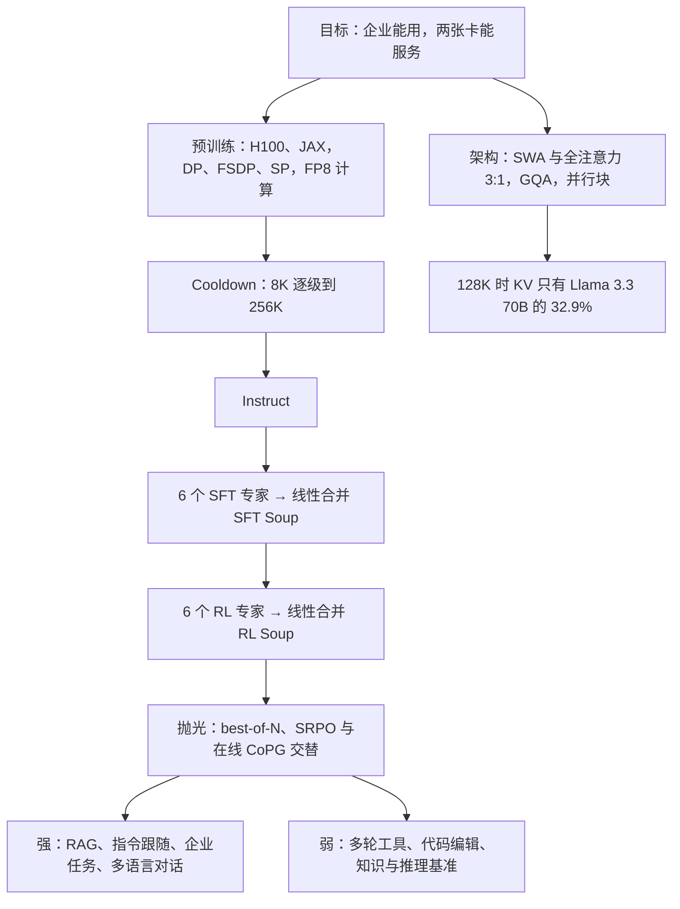

# Command A：企业模型的账，算在注意力、合并与抛光上

<!-- release-date: 2025-03-13 -->

> 本文依据本地 `papers/Cohere/Command-A.pdf`，即 **Command A: An Enterprise-Ready Large Language Model**，arXiv:2504.00698v2，2025-04-14 修订，共 55 页，署名 Cohere（完整作者名单在 PDF p. 50）。页码均指 PDF 自身的页码。文中区分三件事：**报告明确写了什么**、**我们怎么解释它**、**哪些是外部资料或本文推算**。

## 阅读前先认识几个词

- **Token（词元）**：模型读写文本的最小单位。
- **滑动窗口注意力（SWA，Sliding Window Attention）**：每个 Token 只看身前固定长度 W 的一段；**全注意力（full attention）** 能看全部历史。
- **RoPE / NoPE**：RoPE 是旋转位置编码，把相对位置写进注意力；NoPE 就是不加位置编码。
- **GQA（Grouped-Query Attention，分组查询注意力）**：多个查询头共用一组 Key/Value，少存缓存。
- **KV Cache（键值缓存）**：生成时把已读 Token 的 Key 和 Value 留在显存里，长上下文推理的显存大头。
- **RAG（Retrieval-Augmented Generation，检索增强生成）**：先检索文档，再基于检到的片段作答并标注出处。
- **模型合并（model merging）**：把几个分别微调过的同结构模型按参数加权平均成一个。报告里的「专家（expert）」指这种被合并的完整模型，**不是**混合专家（MoE）里被路由的小前馈网络。

报告里两个自家算法的名字：

- **SRPO（Self-improving Robust Preference Optimisation）**：一种离线偏好训练，同时学一个「改稿策略」。
- **CoPG（Contrastive Policy Gradient，对比式策略梯度）**：给定奖励函数时用的强化学习损失，离线在线都能用。

## 一句话先说清

Command A 是 Cohere 面向企业的 111B 模型，报告的主张是「企业能用」：23 种语言、检索与工具调用最强档、**两张 A100 或 H100 就能服务**、最高 156 tokens/秒（PDF p. 1）。

它的做法落在三处：

1. **架构省服务成本**：滑动窗口注意力与全注意力按 3:1 交错，配 GQA；报告给出，128K 长度下它的 KV Cache 只有 Llama 3.3 70B 的 32.9%（PDF p. 3、p. 34）；
2. **后训练拆成并行的领域专家**：Code、Safety、RAG、Math、Multilingual、Long-Context 六个专家各训各的，再**线性合并**成一个权重，SFT 与 RL 各合一次（PDF p. 5–6、p. 15–17）；
3. **最后一段「抛光」补人类偏好**：合并出的模型能力齐、风格糙；best-of-N SFT 加离线 SRPO 与在线 CoPG 乒乓交替，把对 GPT-4o 的人类盲评胜率拉到约五五开（PDF p. 17、p. 38）。

如果只记一句话：

> **模型合并把「多种能力共存」从一次训练里的软权衡，变成参数空间里事后可调的加权平均。代价是合并便宜、评测昂贵，而且合并之后还得抛光。**

报告的规格密度远低于同期开放权重大模型的技术报告：层数、维度、窗口大小、预训练 Token 数、算力都没写。它更像一份「企业配方加评测」的报告。

## 先看全景

报告覆盖 Command A 和同配方的小模型 Command R7B（PDF p. 1），本文以 Command A 为主。全流程分四段：

| 阶段 | 做了什么 | 出处 |
|---|---|---|
| 预训练 | 多语言网页文本与代码、内部合成数据、人工标注的指令数据、数据商采购的高质量数据；「数万亿 Token」，没给确切数 | PDF p. 2–3 |
| Cooldown | 学习率 50,000 步内线性退火，同时把上下文从 8K 逐级拉到 256K | PDF p. 5 |
| 后训练 | Instruct → 6 个 SFT 专家 → SFT Soup → 6 个 RL 专家 → RL Soup → 抛光 | PDF p. 5–6 |
| 评测 | 学术基准、Agent 与工具、多语言、代码、数学、安全、企业任务、长上下文、合并与抛光分析、人类盲评 | PDF p. 18–38 |

## 架构：三层看近处，一层看全局

### 报告写了什么

架构一节只有六条要点（PDF p. 3）：

- **SwiGLU** 激活；
- **注意力层交错**：滑动窗口与全注意力按 3:1 排布，**滑窗层用 RoPE，全注意力层不用位置编码（NoPE）**，细节指向 Yang et al. (2025)；
- **GQA**，并用文档掩码让一个 batch 里每条序列只看自己；
- **并行 Transformer 块**：注意力与 MLP 读同一输入，报告说效果相当、吞吐显著更高；
- **无 bias**，为了大规模训练的稳定性；
- **输入输出词嵌入共享**：词表 255,000，共享能省下大量显存，消融里没看到掉点。

原图（PDF p. 3 Figure 2）里每个 Transformer 块都是「一个注意力 + 一个 MLP」，没有专家池或路由器。摘要里「novel hybrid architecture」（PDF p. 1）指的是两种注意力的混合；正文里的「expert」都指后训练的领域专家。

### 为什么这样搭

全注意力的 KV Cache 随上下文线性增长；滑窗层只需要留最近 W 个 Token。四层里三层换成滑窗，长上下文时大部分层的缓存就封顶了；剩下的全注意力层负责远距离信息。报告没解释「全局层去掉位置编码」为什么更好，只给了选择与引用；交错比例和窗口大小也没有消融。

我们的解释是：滑窗层只管局部，需要精确的相对位置；全局层去掉位置编码后，远处的 Token 不会因为 RoPE 的旋转被区别对待，也省掉了 RoPE 外推到 256K 的麻烦——后一句是推测，报告没有这么说。

### 收益：报告给了缓存占比

Command A 在不同长度下的 KV Cache 相当于对手的百分比（PDF p. 34）：

| 序列长度 | 相对 Llama 3.3 70B Instruct | 相对 Llama 3.1 405B Instruct | 相对 Mistral Large |
|---|---:|---:|---:|
| 8K | 75% | 23.8% | 45.5% |
| 128K | 32.9% | 10.4% | 19.9% |

越长省得越多，这正是滑窗层缓存封顶的效果。报告据此说能显著降低延迟与显存、提高吞吐，尤其在长上下文下（PDF p. 34），但没有给端到端的延迟实测。

报告没给窗口大小，这张表可以反推一个量级（本文推算）。假设 Command A 的滑窗层与全注意力层每层缓存一样大、层数比 3:1，对手是纯全注意力、缓存随长度 $L$ 线性增长，则 $L > W$ 时占比为

$$
r(L) = a + \frac{3aW}{L}
$$

其中 $a$ 是「Command A 全注意力层的缓存 ÷ 对手的缓存」。用 8K 与 128K 两个点解出 $a$ 和 $W$，三个对手分别给出 $W \approx 4074$、$4104$、$4099$，都落在 4K 左右。三组彼此独立的数字算出同一个窗口，说明这张表内部是自洽的；但 4K 是推算，不是报告给的值。

### 这一节可以带走什么

- **不想引入 MoE 的路由与通信，又卡在长上下文显存上**，「多数层滑窗、少数层全局、全部用 GQA」是稠密模型最直接的成本杠杆。
- **大词表时共享输入输出嵌入**，报告说省显存且消融无损。

## 预训练：给了训练系统，没给规模

### 数据

预训练数据来自公开网页文本与代码、内部合成数据、人工标注的指令数据、数据供应商的高质量数据（PDF p. 3）。网页文本在去重和安全与质量启发式过滤之后，提高教育类样本的比例、用机器学习质量分类器降采样低质量样本；最终配比由小模型消融决定（PDF p. 3）。安全相关的过滤分两级：先去掉已知的儿童性剥削与色情域名，再用分类器去掉包括色情在内的低质量内容（PDF p. 14）。

代码有一个值得记的做法（PDF p. 11）：**预训练阶段做了「执行增强」**——抽出自包含的函数与文件，插入打印变量的语句、合成合法的输入参数，在沙箱里执行，把输出附在源码后面，由此多出数十亿 Token；部分代码仓还按 import 关系做图遍历，线性化成一篇很长的文档。

Token 总数、各来源配比、去污染方法，报告都没写。

### 超参与训练系统

超参大多在小得多的模型上用 µP 与 µTransfer 调好，再零样本迁移到大模型；因为 µP 假定层数固定，每个模型尺寸各扫一遍（PDF p. 4）。

训练在 NVIDIA H100 集群上，用内部基于 JAX 的框架，以 GSPMD 实现切分。设备网格有四个轴（PDF p. 4）：

| 轴 | 切什么 | 什么时候用 |
|---|---|---|
| 数据并行（DP） | 激活按 batch 维切 | 预训练 |
| 全切分数据并行（FSDP） | 激活按 batch 维切，模型状态也切；状态在 DP 轴上复制，把通信限制在 FSDP 子网格内 | 预训练 |
| 序列并行（SP） | 激活按序列维切；QKV 投影后按头切，注意力输出投影按 Megatron 方式切 | 预训练 |
| 张量并行（TP） | 纯 Megatron 式切分，只移动激活不移动权重 | 快速解码与小 batch |

并行块在这里又立了一功：因为注意力与 FFN 并行，SP 下注意力激活的 all-gather 可以和 FFN 扩展层的计算完全重叠，注意力后的 reduce-scatter 也和 FFN 收缩层重叠（PDF p. 4）。预训练处于大 batch、高吞吐区间，所以用 DP + FSDP + SP，并把前向循环展开，让下一层权重的通信与当前层计算重叠。

**FP8 训练**（PDF p. 4）：用 Hopper 的 FP8 张量核提吞吐；主权重与优化器状态存 FP32，计算前转成 BF16 或 FP8；指数、softmax、层归一化、输出嵌入这类敏感运算留在 FP32，注意力计算用 BF16。报告说**没看到 FP8 带来的训练不稳定**，但全程 FP8 会让下游指标有「小但不可忽略」的下降；办法是先用 BF16 训若干步，性能就回到全 BF16 训练的水平。「若干步」是多少、放在训练的哪一段，没写。

### Cooldown：边退火边拉长上下文

学习率在 50,000 步内从 $2.5 \times 10^{-4}$ 线性退火到 $1 \times 10^{-6}$，BF16 精度，用专门挑选的高质量数据（PDF p. 5）。上下文先在 8K 保持 30,000 步，再依次扩到 32K、128K、256K，分别训 10,000、5,000、5,000 步；扩长时**每四步插一步长上下文预训练数据**，并调整整体配比，保证各领域均衡、长数据比例足够。

## 后训练：分头训专家，再合并

### 旧问题：一个模型要同时精通六摊

经典后训练是一个模型、顺序喂不同配比的数据。问题在于各能力的数据规模与性质差别极大：代码和推理容易大量合成并自动验证，安全和 RAG 更依赖人工标注；有的能力正交（代码与安全的数据分布完全不同），训练动态也各不相同（PDF p. 16）。把它们塞进一个数据集、一套超参，彼此牵制。

### 新设计：去中心化训练

报告称之为「去中心化」：单模型集中训练的阶段与多专家分头训练的阶段交替进行，并说这是**首次大规模地把多条并行专家线靠参数合并组合起来**（PDF p. 5）。

- **Instruct 模型**：在基座上做监督学习，打基础；
- **SFT 专家**：在 Instruct 之上训六个专家，各用专门的数据配比；
- **SFT Soup**：六个专家参数合并；
- **RL 专家**：在 SFT Soup 之上各自做 RL，算法按领域选——数学与代码用可验证奖励，安全与多语言用偏好对；
- **RL Soup**：再合并一次；
- **抛光**：best-of-N 监督训练，然后离线偏好与在线 RL 乒乓交替，直到人类偏好评测到平台期（PDF p. 5–6）。

好处有三层（PDF p. 6、p. 16）：每个专家能单独调超参、调数据、选算法、做种子合并；合并权重可以**事后重新配比**，不用再训；组织上，各团队能异步并行，最终模型的取舍参考了 **500 个独立的评测指标**。

注意一处原件内部的不一致：正文说六个专家（Code、Safety、RAG、Math、Multilingual、General Long-Context，PDF p. 6），Figure 3 却画了七个框，多一个 Instruction-Following 专家，合并权重滑条也列了 Instruction（PDF p. 5）。上图的名单以正文为准。

### 合并的三条工程经验

**线性合并就够了**（PDF p. 16）。权重靠人工搜索：调高某个专家的权重，通常会提升该领域，但被「隐式调低」的其他领域掉多少很难预测（线性合并权重和为 1），所以用启发式加暴力扰动来搜。SLERP、task vectors 这些更复杂的方法没带来显著提升，还更复杂。线性合并还满足结合律——「合并的合并」可以写成一次合并，复杂流水线因此更可解释。

**一致性比单个专家最优更重要**（PDF p. 16）。所有专家都从同一个「通用指令跟随」模型初始化，原因有两个：一是有的专家用到工具调用之类的特殊 Token，只从训过它们的专家那里挑嵌入来合并「有益但次优」，共享初始化后正常合并反而好得多；二是后训练普遍会伤长上下文能力，而且很难补回，从一个本来就能处理长上下文的模型出发更容易保住。合并时还跑「留一法」合并，找出拖累别人的专家（报告称「碰撞」）；对策是在每个专家的训练里掺少量跨领域数据当正则，碰撞有时只是各专家公共数据的风格或格式小不一致造成的。

**合并便宜，评测昂贵**（PDF p. 17）。合并几乎不花算力，但每个候选都要跑大量推理才知道好坏；而且输入的专家集合本身也在变，相当一部分合并工作其实是回头改专家的训练方式。评测因此是生产中用合并的真正瓶颈。

报告还列了合并的其他用法（PDF p. 15）：同一次训练不同时刻的 checkpoint 做平均（Polyak 平均）、同配置不同随机种子的结果做平均（种子合并）、把专家与原模型插值来**找回被遗忘的能力**——长上下文尤其需要，因为专家都在长上下文模型上用短序列训练。

### 合并到底保住了多少

图引自 PDF p. 35 Figure 12。报告的结论（PDF p. 34–35）：线性合并平均只掉 **1.8%**；绝大多数指标保持在最好专家的 2.5% 以内，个别还涨了；RAG 与通用能力保得最好，代码最差；在 111B 规模上合并很稳，大幅改专家权重只带来 2–3% 的领域变化。

逐格读图，有两处与文字对不上（我们的读法）：

1. 左图一共只画了 24 个指标：差值在 0 到 +1.5 之间 7 个、−1.75 到 0 之间 4 个、−3.3 到 −1.75 之间 6 个、−6.6 到 −3.3 之间 6 个，另有 1 个在 +5 以上。**至少 6 个掉了 3.3 以上**，落在 ±2.5 以内的最多 17 个、最少 11 个，说「绝大多数」偏宽；
2. 右图里平均差值最接近 0 的其实是 Multilingual（约 0，误差棒也最窄），RAG 约 −0.6、General 约 −1.1；Code 约 −3.0 确实最差，Safety 约 −2.3 且标准差最大（误差棒从约 −9 到 +4）。图注只解释了 RAG 的方差来自 Taubench，没提 Safety。

### 合并之后，再小步 SFT 一下

报告把合并称为「粗操作」：合并出的 checkpoint 不保证落在损失曲面的局部最优。在合并结果上**用很低的学习率（约为主 SFT 的十分之一到二十分之一）跑少量 SFT 步**，很多指标能达到甚至超过专家的 100%（PDF p. 35）。报告的直觉是：合并能把能力拼在一起，但它们在表示空间里可能「没对齐」，几步梯度更新就能把能力完全释放出来。

### 这一节可以带走什么

- **想让不同团队并行攻不同能力**，合并是一条组织与数值都成立的路：能力共存从损失函数里的权衡，变成参数空间里事后可调的权重。
- **从同一个初始化出发，比每个专家各自最优更要紧**；专家里掺少量跨域数据防碰撞。
- **先建评测，再谈合并。** 合并的成本几乎全在评测上。
- **合并后的低学习率短 SFT** 是一个便宜的回血手段。

## 对齐算法：SRPO、CoPG 与一个两阶段训练的奖励模型

### SFT 的通用设置

SFT 数据是「提示 + 补全」，提示可含系统提示（报告称 preamble）、工具说明、对话历史和特殊 Token；损失只算补全部分；视情况用少量预训练数据或对预训练模型的 L2 惩罚做正则；优化器 AdamW（PDF p. 6）。

### SRPO：学一个会改稿的策略

报告用过 SLiC、DPO、IPO 等离线偏好方法，并引入自家的 SRPO（PDF p. 6–7）。它解一个极小极大问题：

$$
\min_{\pi} \max_{\pi_{\dagger}} \; \mathbb{E}_{x} \, \mathbb{E}_{y_1 \sim \pi(\cdot \mid x),\, y_2 \sim \pi_{\dagger}(\cdot \mid x, y_1)} \Big[ P(y_2 \succ y_1 \mid x) - \beta \, \mathrm{KL}(\pi_{\dagger} \,\|\, \pi_{\text{ref}} \mid x, y_1) + \beta \, \mathrm{KL}(\pi \,\|\, \pi_{\text{ref}} \mid x) \Big]
$$

读法：$\pi_{\dagger}$ 是「改稿策略」，看到初稿 $y_1$ 后写出改进版 $y_2$；$P(y_2 \succ y_1 \mid x)$ 是偏好模型判改进版更好的概率；两个 KL 项把两个策略拴在参考模型 $\pi_{\text{ref}}$ 附近，$\beta$ 控制松紧。$\pi_{\dagger}$ 想尽量把初稿改好，$\pi$ 则要生成「改不动」的回答。

报告强调两点（PDF p. 7）：它**不依赖偏好数据的采样分布**，因此更稳、更能泛化；它支持**推理时迭代自我修订**——先用 $\pi$ 出初稿，再用 $\pi_{\dagger}$ 连续改几轮。报告没有给推理时自我修订的量化收益，最终模型评测里也没说是否用了这个能力。

SRPO 在 Command A 里用了两次：指令跟随线上，SLiC、IPO、DPO、SRPO 都试过，**SRPO 在各项评测上最好**，Instruct 模型最终选的就是 SRPO 训出的 checkpoint（PDF p. 9）；抛光阶段的离线偏好也用 SRPO，并按 Grinsztajn et al. (2024) 对正负样本的对数似然取平均，以抵消长度差异（PDF p. 17）。

### CoPG：不靠重要性采样的策略梯度

有奖励函数（奖励模型或可验证奖励）时，目标是常规的带 KL 正则的 RL：$J(\pi) = \mathbb{E}_x \mathbb{E}_{y \sim \pi(\cdot \mid x)} [R(x,y) - \beta \, \mathrm{KL}(\pi \,\|\, \pi_{\text{ref}} \mid x)]$。对同一提示的 $k > 1$ 个任意来源的回答，CoPG 最小化（PDF p. 7）：

$$
\ell(x, y_1, \dots, y_k; \pi) = \frac{1}{k-1} \sum_{i > j} \Big( R_{\beta}^{\pi}(x, y_i) - R_{\beta}^{\pi}(x, y_j) \Big)^2,
\qquad
R_{\beta}^{\pi}(x, y) = R(x, y) - \beta \ln \frac{\pi(y \mid x)}{\pi_{\text{ref}}(y \mid x)}
$$

$R_{\beta}^{\pi}$ 是扣掉「偏离参考模型程度」之后的有效奖励，损失把同一提示下各回答的有效奖励两两比较。报告说（PDF p. 7）：纯 on-policy 时它等价于 RLOO；按原论文，它的梯度是一种不需要重要性采样、裁剪或价值网络的离策略策略梯度，离线情形下也能估计 KL 正则的最优策略；离线时只要每个提示有多于一个回答、且能算奖励，任意数据集都能用。Command A 主要用它的离线版和在线 on-policy 版。

### 奖励模型：第二个 epoch 就崩

奖励模型是 Bradley-Terry 结构，用软标签的交叉熵训练，用于在线偏好学习、评测与数据过滤（PDF p. 7）。报告有一条实用观察：**奖励模型记忆性很强，同一批数据跑第二个 epoch 会灾难性崩溃**。于是分两阶段各训一遍：

| 阶段 | 样本 | 标签 | batch | 学习率 |
|---|---:|---|---:|---|
| 一 | 约 400 万条「较低质量」 | 用奖励模型集成重新标注 | 1024 | cosine，峰值 $4 \times 10^{-5}$ |
| 二 | 约 35 万条高质量 | 人类偏好强度、模型集成（与人标冲突的挪到阶段一）；金标数据取 0.999，金标平局取 0.5 | 16 | 峰值 $3 \times 10^{-6}$ |

两阶段都用打包数据：多对偏好样本塞进一条训练序列，靠注意力掩码互不干扰；每对左侧填充以对齐结束符，按约 75% 的填充率分布，并让每行样本数尽量均匀，保证损失贡献相等（PDF p. 7）。这个内部奖励模型在 RewardBench 上 92.7%，RMB 平均 72.3%。

## 各领域专家怎么训

报告在第 3.3 节逐个写了专家的配方，下面按领域取要点。

### 指令跟随

数据主要来自「合成提示 + 人工标注」（PDF p. 8）：合成大量面向企业领域的提示，每个提示用不同温度采两个补全，请标注员分别打离散分，多轮重复形成多轮对话数据；**两者不平局且较好的那个没拿满分时，请标注员把它改好**。改写版进 SFT；分数不同的补全（含人工改写）两两构成偏好对，平局不用；这些偏好对同时用来训 Command A 和奖励模型。

在此之上还有迭代的「奖励驱动样本精炼」：用最新 checkpoint 生成、用最新奖励模型打分、据分数造偏好对与 SFT 样本、重训、再重复；模型写不好的输入保留人写的补全（PDF p. 8）。

**系统提示（preamble）跟随**是企业场景的重点：整段对话都要遵守的指令，比如「始终用法语回答」「始终输出 JSON」「不要生成 Markdown」「回答里不要出现 LLM 这个词」。做法是合成尽量多样的 preamble 挂到提示上，SFT 与偏好数据都带上它（PDF p. 8）。评测 IFEval 时，报告给 Command A 加了一段自定义 preamble，要求「非交互模式、尽量全面准确、不要寒暄或追问」（PDF p. 51）。

### RAG、工具与 Agent

报告把 RAG 看成工具调用的特例：模型有一个搜索工具（比如稠密向量索引），自己生成查询、取回片段、据此作答（PDF p. 9）。更复杂的任务要多步编排多个工具，大致遵循 ReAct：先说思路、计划与要用的工具，再用 JSON 这类结构化输出调工具或给最终答案（PDF p. 9）。

每条训练样本的结构（PDF p. 9）：

1. 用户提示、一组可用工具，可能还有用户的自定义指令；
2. 一段推理：该用哪些工具、参数怎么填；
3. 工具调用与工具输出，可以并发也可以串行；
4. 最终回复，**带指向工具输出的引用**。

数据覆盖代码执行工具、用户上传文档和通用 API 环境，含多语言。标注员专门受过 ReAct 风格训练，SFT 数据经不同标注员多次复核，偏好数据取至少 3 人的多数票；另合成整条推理与工具调用轨迹，用内部 LLM 裁判验质量。训练是 agentic 数据上的 SFT，再用 CoPG 做离线偏好优化（PDF p. 9–10）。

### 多语言

23 种语言：英、法、西、意、德、葡、日、韩、阿拉伯、中、俄、波兰、土耳其、越南、荷兰、捷克、印尼、乌克兰、罗马尼亚、希腊、印地、希伯来、波斯，报告说覆盖约一半世界人口（PDF p. 10）。数据覆盖翻译、多语言安全、推理、可控性、RAG、Agent 等，来源有人工标注、多语言数据套利（从多个教师模型取回答）、模板化公开数据和机器翻译（PDF p. 10）。复杂任务的标注有两种：LLM 生成加人工后编辑（上量），纯人工标注（保质）。

**多语言 best-of-N**：用高质量提示，收集所有专家模型的回答，用内部奖励模型打分选最好的，迭代训练；报告说人类评测显示这样选出的回答常常与多语言数据集里人写的金标相当甚至更好（PDF p. 10）。训练是 SFT 加 DPO 偏好优化；**同配置不同种子训几个模型再均匀合并，在 SFT 阶段略有提升，在偏好阶段没用**（PDF p. 10、p. 51）。

### 代码

数据聚焦 8 种语言（Python、Java、C++、Rust、Go、JavaScript、TypeScript、COBOL）和 5 种 SQL 方言（SQLite、MySQL、PostgreSQL、T-SQL、PL/SQL），任务包括生成、翻译与优化（PDF p. 11）。样本附带执行反馈、解释、改写、堆栈、数据库上下文、diff 补丁格式与单测要求，优先保留执行验证通过的数据，在多语言沙箱里执行。

几条值得记的观察（PDF p. 11–12）：

- **合成新题只对小模型有用**（相当于用大模型蒸馏小模型），对大模型收益可以忽略；大模型的代码专家要靠人工标注和对已有数据的合成增广（改写提示、加严要求、复杂化）；
- 非可验证的部分（解释、格式、整体结构）用奖励模型与多数投票打分，并请人类标注员引导风格，以免过拟合到某个 LLM 裁判的偏好。

代码专家分三段训练（PDF p. 12）：

1. **大规模 SFT**，训完对表现最好的 2–3 个随机种子做线性合并，合并结果是后续训练「严格更好」的初始化；
2. **只用最高质量数据再 SFT**，同样多种子合并；
3. **离线 CoPG 做 RL**，奖励是沙箱里单测的通过比例（全过 1.0，过 20% 得 0.2），**没有有效代码块给 −1.0**；每个样本至少合成 4 个单测。为了稳住 RL，报告用了三重正则：在合并过的 checkpoint 上做 RL（比在单个 SFT 模型上严格更稳）、在 CoPG 上叠加第二阶段数据的交叉熵损失、训完后用 WARP 式合并把 RL 模型与父 checkpoint 合回去。

### 数学与推理

**合成数据胜过人写数据**，所以数据以合成为主：用精选种子少样本生成新题，用 LLM 裁判判「题 + 解」对不对（PDF p. 13）。两条对比鲜明的观察：SFT 不需要严格的正确性过滤；**偏好训练却非常依赖正确性**，否则偏好会被意外颠倒，没有人工评分时用程序与模型两类验证器判对错（PDF p. 13）。

合并上，推理最强的候选有时反而会拖累跨能力合并；最优做法是先把各种推理专家与指令专家合并，用这个合并结果当代理指标，挑出帕累托前沿上的候选再参与下游的大合并（PDF p. 13）。

### 长上下文

长上下文任务很难人工标注，所以全部合成：从长上下文预训练数据里采样，让 Command R+ Refresh 基于随机选出的、8,192 Token 以内的片段出问答对，用奖励模型从多个候选里挑最好的，再把问答拼回原文（PDF p. 13）。训练是**在预训练模型上**做一段 SFT，与 cooldown 类似地交错 16K 与 256K 两种长度，比例 3:1。

### 安全

报告把部署分成两种设定（PDF p. 13–14）：

- **默认设定**：模型在 Cohere 之外使用（比如开放权重），无法控制系统提示，遵守「核心安全行为」——暴力与仇恨、虚假信息、自伤、儿童性剥削、色情五个领域里，可以提供事实与教育信息，但不能生成支持、鼓励或助长伤害的内容；
- **企业设定**：由系统提示切换「安全模式」。contextual 模式与默认相近但允许色情内容；strict 模式对五个领域的话题一律不碰，也不说脏话。

训练的关键是把数据拆成两份：「该拒绝」的提升安全，「该回答」的维持有用，两边分开配比（PDF p. 14）。离线偏好训练对抑制过度拒绝很关键，但让模型更安全的效率不如 SFT；8B 与 111B 上都如此，区别在于大模型更容易过拟合。安全专家的偏好阶段把偏好损失与等权的 SFT 损失相加：偏好对强化有用性，SFT 强化安全；IPO 与 DPO 相当，SLiC 的取舍更差，最终用 IPO（PDF p. 14）。报告也说，安全与有用兼得的最大收益其实来自抛光阶段。

一个细节：生成数据时会检查拒绝回答里不要道歉，因为「拒绝时道歉」是常见的数据伪影（PDF p. 14）。

## 抛光：把合并出的模型调成人喜欢的样子

合并能把能力拼齐，但不保证整体符合人类偏好，还可能留下合并伪影。抛光有两个目的：修伪影、对齐人类偏好（PDF p. 17）。三步：

1. **best-of-N SFT**：每个提示合成 4 个候选，用奖励模型排序，只拿最高分的做 SFT；
2. **离线偏好**：最高分与最低分构成偏好对，过滤平均奖励太低的提示；再掺入领域偏好数据——指令全遵守的优于没遵守的、数学答对的优于答错的、代码全过单测的优于没过的；并删掉奖励模型给正样本打分反而更低的对。损失用 SRPO；
3. **在线 RLHF**：在线 CoPG，每个提示生成 2 个回答，提示取自此前 SFT 的子集；正则是对参考策略的 L2 辅助损失加高质量 SFT 损失。

离线与在线**乒乓交替**，报告说这样既提升对齐，又避免退步、缓解奖励模型被钻空子（PDF p. 17）。

图引自 PDF p. 36 Figure 13、14。Figure 13 的评测是限定英语的 mArenaHard 设置、由一组 LLM 裁判判定、对手是 GPT-4o（PDF p. 35）。读图的三件事（我们的读法）：

1. 胜率从 Soup 的约 0.19 起步，best-of-N 后约 0.24，第一轮 SRPO 跳到约 0.35，此后每一步涨幅变小，最后一轮 SRPO 约 0.42，**比前一步在线 CoPG 的约 0.44 略低**。报告说交错的好处是「某一阶段的退步大概率会被下一阶段纠正」（PDF p. 35），而恰好最后一步就是一次小退步；
2. 这个自动裁判胜率**最后也没过 0.5**，与后文人类盲评的约五五开不是同一个口径；
3. Figure 14 里涨得最多的是 Auto Arena Hard（约 +22）、mArenaHard（约 +14）、人类评测胜率（约 +12）；BFCL 几乎不变，MMLU、MGSM 约 +2。抛光主要改的是风格与偏好，不是工具能力。

人类盲评给了同一件事的另一组证据（PDF p. 38）：合并后、抛光前的 checkpoint 对 GPT-4o 的胜率，general 43.2、reasoning 41.4、code 30.0；最终模型分别是 50.4、51.4、46.8。**「能力齐」与「好用」之间，差了整整一个抛光阶段。**

## 评测：强项集中在企业任务，不是全面领先

报告用了 30 多个基准（PDF p. 18，Table 2），对比模型尽量用外部公布值，拿不到的按公开信息内部复现（PDF p. 18）。复现值与外部值口径不一，读的时候要打折。

### 学术基准

Table 3（PDF p. 18），大模型部分：

| 模型 | MMLU | MMLU-Pro | GPQA | IFEval | InFoBench |
|---|---:|---:|---:|---:|---:|
| Command A | 85.5 | 69.6 | 50.8 | 90.9 | 94.9 |
| GPT-4o | 89.2 | 77.9 | 53.6 | 83.8 | 94.0 |
| DeepSeek V3 | 88.5 | 75.9 | 59.1 | 86.1 | 94.3 |
| Llama 3.3 70B Instruct | 86.0 | 66.0 | 50.5 | 92.1 | 92.8 |
| Llama 3.1 405B Instruct | 88.6 | 73.0 | 49.0 | 88.6 | 93.9 |
| Mistral Large 2 | 85.2 | 67.9 | 48.6 | 83.8 | 93.3 |
| Claude 3.5 Sonnet | 89.5 | 78.0 | 65.0 | 90.2 | 93.9 |
| Gemini 2.0 Pro | 89.3 | 79.1 | 64.7 | 87.3 | 92.2 |

知识与推理类（MMLU、MMLU-Pro、GPQA）Command A 在这一档里偏低；指令跟随类是它的强项，InFoBench 全表最高，IFEval 只输 Llama 3.3 70B（PDF p. 19）。IFEval 取的是 prompt 级与 instruction 级严格准确率的平均，DeepSeek V3 那格只有 prompt 级（PDF p. 18 表注、p. 55）。数学方面，Table 15（PDF p. 27）给出 MATH 80.0、AIME 2024 23.3、GPQA Diamond 50.8，高于所比的 GPT-4o、Llama 3.3 70B 与 Mistral Large 2。

### 检索与工具

| 基准 | Command A | GPT-4o | DeepSeek V3 | Llama 3.3 70B | Claude 3.5 Sonnet | 出处 |
|---|---:|---:|---:|---:|---:|---|
| ChatRAGBench | 72.9 | 66.6 | 40.3 | — | — | Table 4 |
| HotPotQA | 92.1 | 92.1 | 90.1 | — | — | Table 4 |
| StrategyQA | 76.7 | 81.2 | 73.8 | — | — | Table 4 |
| BFCL Overall | 63.8 | 72.1 | 58.6 | 51.4 | 56.5 | Table 5 |
| BFCL Multi-turn | 25.5 | 47.6 | 18.6 | 6.9 | 41.0 | Table 5 |
| Taubench Retail P@1 | 60.0 | 60.6 | 54.8 | 6.2 | 69.2 | Table 6 |
| Taubench Airline P@1 | 45.3 | 43.0 | 25.5 | 35.3 | 46.0 | Table 6 |

均出自 PDF p. 19。RAG 的正确性由一组 LLM 裁判对照参考答案判定；BFCL 取官方榜单；Taubench 聚合 10 次运行（PDF p. 19）。读法：**给定文档作答（ChatRAGBench）是明显强项；长轨迹的多轮工具调用（BFCL Multi-turn）明显落后 GPT-4o 和 Claude 3.7 Sonnet（48.4）**；Taubench 与 GPT-4o 相当，低于 Claude 3.5 Sonnet。Taubench 的 Pass@k 随 k 下降得很快（Retail 从 P@1 的 60.0 到 P@4 的 40.4），说明同一题反复做的一致性仍是问题（PDF p. 19）。

### 企业任务

这是报告自认最能代表「企业向」的部分（PDF p. 32–33）：

- **企业生成任务**：22 个任务，涵盖对话与会议摘要、信息抽取、FAQ 生成等；每题分数是规则检查（字数、JSON 合法、条目数）与 LLM 裁判团打分的平均。Command A 通过率 94.2%，高于 Claude 3.5 Sonnet v2 的 84.2%、DeepSeek V3 的 81.3%、GPT-4o 的 79.1%；
- **企业 RAG**：技术文档与公司制度问答，文档片段常超过 10,000 Token，有的题需要跨片段综合，有的**文档里根本没有答案**。正确性（Llama Index，1–5 分）Command A 平均 4.73，与 Claude 3.5 Sonnet v2 的 4.72 几乎持平；可答题准确率 96% 全表最高，**不可答题准确率 91%，低于 Command R+ Refresh 的 95% 与 Claude 3.5 Sonnet v2 的 92%**。

这组任务、样本与判分细则都是内部的，没有公开。

### 代码

代码理解（PDF p. 24，Table 12）：MBPP+ 86.2、LiveCodeBench 26.9、BigCodeBench 45.4、RepoQA 92.6（全表最高）；自建的 HumanEval-COBOL 上，直接生成 25.3 是所比模型里最好的；COBOL 译 Python 55.7 则低于 DeepSeek V3（63.3）与 Llama 3.1 405B（59.5），报告说 COBOL 两项都是最先进水平，靠的是 Command A 代码专家的 64.6（PDF p. 24–25）。把 Command A 当代码 Agent（能调执行工具、拿到单测反馈）时，正文写 LiveCodeBench +5.9、BigCodeBench +14.3、LBPP +12.3（PDF p. 25）；按 Table 12 的两行相减，LBPP 是 51.5 → 65.4，差 13.9，与正文不符。

代码编辑是短板（PDF p. 24，Table 13）：SWE-Bench Verified 26.8、Aider Polyglot 14.7，低于 DeepSeek V3 的 42.0 与 49.6（外部公布值）。报告承认这两项是事后调查，开发时没针对它们（PDF p. 25–26）。

SQL（PDF p. 25，Table 14）：Spider Dev 79.5、BIRD Dev 59.5；内部五种方言的加权平均 55.3，低于 DeepSeek V3 的 60.8。报告的说法是「在同尺寸模型里」五方言平均最强（PDF p. 26）。

### 多语言

- **翻译**（NTREX，COMET-20）：Command A 平均 68.8，低于 GPT-4o 的 71.0、Gemini 2.0 Flash 的 70.5、DeepSeek V3 的 69.8（PDF p. 21，Table 7）。报告不标单一赢家，与第一名差距小于 1.67 分的都算「获胜簇」，因为 1.67 分对应人类与自动指标 75% 的一致率（PDF p. 20）；
- **mArenaHard**（500 道 Chatbot Arena 难题译成 23 种语言，LLM 裁判）：对 Llama 3.3 70B、Llama 3.1 405B、DeepSeek V3，Command A 在全部 23 种语言上都被偏好；对 DeepSeek V3 的平均胜率是 53.4（PDF p. 20–21，Table 8）；
- **9 种语言的人类盲评**：赢 Llama 3.3 70B 与 Llama 3.1 405B 全部语言；对 DeepSeek V3、Mistral Large 2 赢 9 种里的 8 种；对 GPT-4o 只在阿拉伯语、韩语上占优（PDF p. 20，Figure 5）；
- **语言一致性**（英文提问、要求用另一语言回答，全部行都用对语言的比例）：Command A 平均 93.0，前代 Command R+ Refresh 95.5 更高（PDF p. 23，Table 10）；
- **阿拉伯语方言遵从**：四种方言的 ADI2 分，单语 24.2、跨语 33.5，全表最高（PDF p. 23，Table 11）；
- **多语言 Taubench**（人工翻译版）：Retail 平均 34.3、Airline 43.4，均略低于 GPT-4o（PDF p. 23，Table 9）。

### 长上下文

RULER（13 个任务，最长 256K）从 4K 的 97.2 降到 128K 的 90.0、256K 的 84.6（PDF p. 34，Table 21）；128K 上 Claude 3.5 Sonnet（93.8）与 Gemini 1.5 Pro（91.7）更高，256K 一档只有 Gemini 1.5 Pro（91.6）更高。LongBench-V2 总分 43.4，低于 GPT-4o 的 46.0，高于表里其余模型（Table 22）。

### 安全

报告分「绝对安全」（有害内容的比例，按类别等权平均）与「相对安全」（与另一模型比谁更安全，一样安全时比谁回答质量更高，由 LLM 裁判团判定，与人类一致率 77.7%、Cohen's Kappa 0.55）（PDF p. 27）。

默认设定下（PDF p. 29–30，Table 16）：相对安全一栏是各对手对 Command A 的胜率，大模型对手都在 33% 以下，报告据此说 Command A 显著优于所有对手；**绝对安全 70.4%，排在 Claude 3.5 Sonnet（80.0%）与 Qwen 2.5 72B（71.4%）之后**。报告解释这看似矛盾，是因为相对安全把回答质量也算进去了：Command A 会实质性地回应敏感话题，而不少模型只是笼统拒绝（PDF p. 29–30）。分类看，色情内容一项 Command A 只有 63.1%，而 Claude 3.5 Sonnet、GPT-4o 都在 94% 以上。

过度拒绝（PDF p. 30–31，Table 17）：XSTest 上 1.1%；但在用红队测前代模型得到的内部集上是 7.1%，与 GPT-4o 相同，高于 Llama、Qwen、DeepSeek V3。企业设定下，Command A 在 contextual 与 strict 两种模式上都处在「正确回答 / 正确拒绝」的帕累托前沿（PDF p. 28，Figure 7）。

简历摘要的人口统计公平性测试（PDF p. 28–29）：对性别扰动完全稳健，对种族扰动只有约 1% 的不变性检验失败。

### 人类盲评

约 800 条由标注员从零编写的单轮复杂提示，分 general（350）、reasoning（150）、code（300），每次完整评测平均 65 名标注员；每对回答先各打 1–5 分，再给五档偏好，胜率 = (胜 + 0.5 × 平) ÷ 总数（PDF p. 37）。结果（PDF p. 38，Table 23）：

| 对手 | General | Reasoning | Code |
|---|---:|---:|---:|
| GPT-4o | 50.4 | 51.4 | 46.8 |
| GPT-4.5 Preview | 47.2 | 30.7 | 38.3 |
| DeepSeek V3 | 49.0 | 49.3 | 54.7 |
| Llama 3.3 70B Instruct | 68.8 | 71.7 | 63.4 |
| Llama 3.1 405B Instruct | 61.6 | 64.0 | 61.6 |

对 GPT-4o 与 DeepSeek V3 大致打平，对 Llama 系明显领先，**对 GPT-4.5 Preview 在推理上大幅落后**（30.7）。报告说标注员尤其偏好 Command A 遵守格式与风格要求的能力（PDF p. 38）。

### 读评测要知道的几处不一致

1. **Table 1 与正文表不一致**：Table 1 里 GPT-4o 的 MMLU 是 85.7（PDF p. 2），Table 3 是 89.2（PDF p. 18）；Table 1 的 Taubench（Command A 51.7、GPT-4o 51.2）既不等于 Table 6 的 Retail 或 Airline，也不是两者的简单平均。报告没解释口径；
2. **GPT-4o 的 GPQA**：Table 3 是 53.6，Table 15 的 GPQA Diamond 是 46.0（PDF p. 27）；
3. Table 15 里的「Llama 3.3 405B」应为 Llama 3.1 405B（PDF p. 27）；
4. 专家数量：正文六个，Figure 3 画了七个（见上文）；
5. 合并的保真度：Figure 12 的直方图与「绝大多数在 2.5% 以内」「RAG 与通用保得最好」两句对不上（见上文）。

## 服务成本：两张卡与 156 tokens/秒

报告的两个硬数字（PDF p. 1）：服务只需**两张 A100 或 H100**；生成速度**最高 156 tokens/秒**，比 GPT-4o 高 1.75 倍、比 DeepSeek V3 高 2.4 倍。结论一节重复了「两张卡、私有云或本地部署」的卖点（PDF p. 38）。

报告没写服务用的精度、量化方案、batch、并行方式，也没写测速的硬件与协议。可以算的只有一笔（本文推算）：111B 参数在 BF16 下约 222 GB，超过两张 80 GB 卡的 160 GB，所以「两张卡」必然意味着权重做了 8 位或更低的量化。1.75 倍、2.4 倍是与 API 服务比吞吐，服务方的硬件与负载都不在同一条件下，只能当作者口径的宣传数字。

## 报告没有公开的

- **架构规格**：层数、隐藏维度、头数、KV 头数、滑动窗口大小，都没写；
- **预训练规模**：只说「数万亿 Token」，没有确切数量、配比、去污染方法、GPU 数量、训练时长；
- **合并权重**：两次合并各专家的最终权重没给；
- **超参**：附录 B 给了多语言、代码、推理、长上下文、安全几个专家的学习率与 β（PDF p. 51–54），但 Instruct、RAG 专家、抛光阶段与奖励模型之外的 SRPO、CoPG 主超参都没有；
- **推理时自我修订**：SRPO 这项能力的收益没有数字；
- **服务配置**：见上一节；
- **最大可用上下文**：训练扩到 256K，报告没写推理时支持多长（官方博客写的是 256K，见文末）；
- **Command R7B**：只作为小模型对照出现，没有单独的规格。

## 最值得带回自己项目的六条

### 1. 稠密模型的长上下文成本，先在注意力上省

多数层滑窗、少数层全局，缓存大部分封顶；报告给出 128K 时只有 Llama 3.3 70B 的 32.9%。

### 2. 用合并组织团队

每个能力一个专家、一套数据与超参，最后线性合并。合并满足结合律、事后可重配权重，团队可以异步交付。

### 3. 从同一个起点出发，比单个专家最优更重要

共享初始化让特殊 Token 的嵌入能正常合并，也更容易保住长上下文；专家里掺少量跨域数据防碰撞。

### 4. 合并便宜，评测才是成本

500 个指标、每个候选都跑一遍——没有这套评测基建，合并就是盲调。

### 5. 合并之后要回血、要抛光

合并后几步低学习率 SFT 能把指标拉回甚至超过专家；抛光把对 GPT-4o 的人类胜率在 code 上从 30.0 拉到 46.8。

### 6. 奖励模型别多训 epoch

同一批数据第二遍就崩；宁可「大量弱标签一遍 + 少量强标签一遍」。

## 用一张图重新串起全文

## 关键词回看

- **交错注意力**：滑窗层带 RoPE、全注意力层不带位置编码，3:1 排布，全部用 GQA。
- **并行 Transformer 块**：注意力与 MLP 读同一输入；序列并行时能把通信与 FFN 计算重叠。
- **µP / µTransfer**：在小模型上调超参、零样本迁移到大模型。
- **FP8 训练**：主权重与优化器状态 FP32，矩阵乘用 FP8；先训若干步 BF16 以补回下游指标。
- **去中心化后训练**：集中训一个模型与分头训多个专家交替进行，SFT 与 RL 各合并一次。
- **线性合并**：参数加权平均，权重和为 1，人工加暴力扰动搜索；满足结合律。
- **碰撞与留一法**：某个专家拖累其他能力；用留一法合并定位，用跨域数据正则缓解。
- **抛光**：best-of-N SFT，离线 SRPO 与在线 CoPG 乒乓交替，修合并伪影、对齐人类偏好。
- **SRPO**：极小极大偏好目标，同时学生成策略与改稿策略。
- **CoPG**：两两比较有效奖励差的平方损失；纯 on-policy 时等价 RLOO。
- **两阶段奖励模型**：约 400 万条弱标一遍、约 35 万条强标一遍。
- **安全模式**：企业部署时用系统提示切换 contextual 与 strict。

## 最后的判断

Command A 这份报告最值得学的，不是某个新算子，而是**把「多能力兼得」做成一条工程流水线**：能力拆给并行的专家，靠线性合并装回一个权重，再用抛光把风格与偏好补齐。它在合并上的几条经验——一致性优先、留一法找碰撞、合并便宜评测贵、合并后小步 SFT——都是从生产里来的，别处少见。

证据强度分层：

- **有表或图支撑的**：128K 时 KV 大幅少于同档全注意力模型（p. 34）；合并平均掉 1.8%（p. 34–35，但图与文字有出入）；抛光把人类与自动裁判胜率都拉高了一截（p. 36、p. 38）；RAG、指令跟随、企业生成任务、阿拉伯语方言上领先；多轮工具、代码编辑、知识推理类基准落后。
- **只有作者观察、没有数字的**：SRPO 的推理时自我修订；FP8 下没有不稳定；合成新题对大模型代码专家无用；共享初始化优于选择性合并嵌入；数学偏好训练必须保证正确性。
- **难以复现的**：企业任务、内部 SQL、人类盲评的提示与细则都是内部的；很多对比模型的分数是内部复现。
- **完全没公开的**：架构规格、预训练规模与算力、合并权重、服务配置。

如果只带走一句：

> **Command A 的答案不是把模型做小，而是在注意力上省缓存、在组织上拆专家、在最后用抛光把一个「能力齐但不好用」的合并模型变成成品。**

## 资料与阅读边界

**原始依据**

- 本地 `papers/Cohere/Command-A.pdf`，即 arXiv:2504.00698v2（2025-04-14 修订），55 页，首页页脚印有「Released as a preprint on April 7, 2025」。arXiv 论文页 [arXiv:2504.00698](https://arxiv.org/abs/2504.00698) 最新即 v2，与本地文件逐字节相同。全文所有 `(PDF p. N)` 都出自这一版。

**首发日证据**

- Cohere 官方博客 [Introducing Command A](https://cohere.com/blog/command-a) 发布于 2025-03-13，写明 Command A 当天在 Cohere 平台与 Hugging Face 可用、「即将」登陆主流云平台。
- 因此 `release-date` 取 **2025-03-13**。Hugging Face 权重仓库 [CohereLabs/c4ai-command-a-03-2025](https://huggingface.co/CohereLabs/c4ai-command-a-03-2025) 的 `createdAt`（2025-03-11）是预置时间，论文的 v1（2025-04-01）与 v2 都晚于首发，均不作首发日。

**外部补充（不是报告内容）**

- 同一篇官方博客写明上下文长度 256K，部署只需两块 GPU（对比其他模型通常需要多达 32 块）。报告正文没有写推理时的最大上下文。
- 权重仓库声明的架构类是 `Cohere2ForCausalLM`，仓库需同意许可才能下载，`config.json` 未能读取，因此层数、窗口大小等规格本文不补。
- 本文中的窗口大小反推（约 4K）、「两张卡必然量化」的算术、Figure 12 与 Figure 13 的逐格读数，都是**本文根据报告数字所做的推算或读图**，报告原文没有这些数字。
