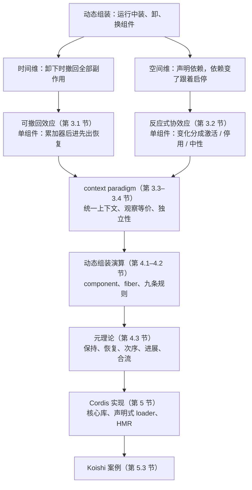

# 卸得干净、依赖跟得上：Cordis 把动态组装拆成时间与空间两维

<!-- release-date: 2026-08-26 -->

> 本文依据本地 `papers/DeepSeek/Cordis.pdf`，即 **A Programming Paradigm for Spatiotemporal Composability**，arXiv:2608.25512v1，2026-08-26 提交，共 92 页。作者 Yifan Shi（北京大学、DeepSeek-AI）、Wei Zhang（北京大学）、Tianyi Cui（DeepSeek-AI）。页码均指 PDF 自身的页码。文中会区分三件事：**论文明确写了什么**、**我们怎么解释它**、**哪些是外部资料**。这是一篇编程语言与系统论文，实现叫 Cordis；它不是模型报告，没有训练、推理或评测表。

## 读前先把几个词说成人话

这篇论文难读，不是因为证明长，而是它把「插件能卸载」「插件能声明依赖」这两件工程上的小事，重新定义成两个可以证明的性质。后面所有定义与定理，都在回答这两件事各自怎么保证、合在一起为什么不打架。

先把会反复出现的词说清楚：

- **动态组装（dynamic composition）**：程序跑着的时候还能装上、卸下、换配置组件，而不是编译期把模块图焊死。
- **时间可组装性（temporal composability）**：卸下一个组件时，它对共享环境做过的改动必须被完整、有序地撤回（PDF p. 4）。
- **空间可组装性（spatial composability）**：组件能声明、发现、解析彼此的依赖，依赖出现、消失或换人时，组件跟着启动或停用（PDF p. 4）。
- **效应（effect）**：程序对环境的改动，比如注册一条命令、挂一个监听器、往共享表里放一个服务。
- **协效应（coeffect）**：环境对程序的要求，即「我要先有什么才能跑」，比如需要一个数据库服务。效应是程序对世界的输出，协效应是世界对程序的输入（PDF p. 7–8）。
- **上下文（context）**：组件与环境之间唯一的交互通道。论文要求所有效应与协效应都经它中介，这条纪律叫 **context paradigm**。
- **component / fiber**：component 是一个可组装单元的声明（依赖什么、提供什么、装载时做什么）；fiber 是它的一次实例，带着自己的生命周期状态。
- **累加器（accumulator）**：组件装载过程中交出的全部逆操作的复合。卸载就是执行它。

## 一句话先说清

静态组装早有成熟的形式基础：时间方向靠词法作用域（RAII、bracket 模式），空间方向靠模块 import 解析（PDF p. 4）。动态组装把这两样都打破了：副作用的寿命不再被词法作用域框住，依赖会在运行时出现、消失、换身份。

业界的通行做法是退回粗粒度：操作系统按进程给时间可组装性，容器编排按服务给空间可组装性。模块坏了就重启进程，依赖交给编排器（PDF p. 5–6）。

这篇论文的判断是：**动态组装有两个彼此正交的维度，恰好对应古典的效应与协效应**。于是它把这两个原本属于编译期类型系统的概念抬成运行时机制：

1. **可撤回效应（revertible effects）**：每个对上下文的改动都带着逆，运行时收着这些逆，卸载时倒着执行。单个组件因此有了时间可组装性。
2. **反应式协效应（reactive coeffects）**：组件把依赖写成规格，上下文每变一次，运行时就判断这次变化对它是激活、停用还是无关。单个组件因此有了空间可组装性。
3. **context paradigm**：把两边的上下文合成一个，所有读写都走它。这个中介诱导出一种观察等价，在它之下不同组件的效应可以交错而互不干扰。
4. **动态组装演算与元理论**：把单组件的保证抬到任意交错的整个系统。
5. **Cordis**：TypeScript 实现，一个核心库加一个声明式组件加载器（loader），带配置对账与热替换（HMR）（PDF p. 1、p. 6）。

全文最值得带走的一句是论文第 3.4.2 节末尾的分工（PDF p. 30）：**能交换顺序的那部分计算交给效应，按任意顺序撤回；对顺序敏感的那部分交给协效应，由「谁提供、谁依赖」从外部强加顺序。** 两维不是两个工程补丁，而是把一段计算按「顺序是否要紧」切成两半，各用一套机制去管。

### 一条阅读路线

如果只有一小时读原文，建议按这个顺序：

1. **p. 4–6**：两个维度的定义、VSCode 与自演化 Agent harness 两个动机、粗粒度凑合的代价。
2. **p. 9–12**：扭曲复合、效应上下文、track 与 recover，定理 4、5、7。时间维的最小核。
3. **p. 17–18**：协效应上下文、满足谓词、notify 三分类。空间维的最小核。
4. **p. 26–30**：独立性（定义 42）、定理 43、定理 45–47，以及「交换部分与顺序敏感部分」那一段。
5. **p. 34–37**：Figure 1 生命周期、九条规则、守卫。
6. **p. 43–55 各定理的陈述与定理后的解释段**：证明第一次可以跳过。
7. **p. 58 的 Table 2、p. 62–63 的 Algorithm 5**：理论到代码的对照。
8. **p. 70–76 第 6 节**：边界、版本、互依赖，决定这套东西能用到多远。

## 主要矛盾：现有插件系统只能「重启了事」

论文用两个例子把问题钉死。

**插件系统。** VSCode 把所有扩展跑在一个共享进程 extension host 里。扩展可以动态安装，但 `activate` 一旦执行，禁用或卸载单个扩展就要重启整个 host，所有已加载的扩展一起受影响。主题、快捷键、snippet 这类纯声明式扩展没有代码，可以随意卸；而按安装量排名前 100 的扩展里，**87 个带可执行代码**，卸载就要重启。`deactivate` 钩子只是宿主进程退出时的优雅关机回调，不能做在线卸载；它还把「创建效应」与「销毁效应」拆到两个钩子里，违反了关注点局部性（locality of concern），清理是否完整很难验证（PDF p. 4–5）。

空间方向，VSCode 提供了 `extensionDependencies`，但同一批前 100 里**只有 7 个**声明了对非内置扩展的依赖。原因是扩展 API 只暴露命令、视图、语言特性这类固定扩展点，扩展都往宿主上挂，而不是彼此依赖；真要互调，`getExtension(...).exports` 返回的类型默认是 `any`，没有受检的结构契约（PDF p. 5）。两组数字取自 2026-06-09 的 VSCode Marketplace（PDF p. 5 脚注 1）。论文说这两条限制在插件系统里普遍存在，只是程度不同。

**会自我演化的 Agent harness。** 现代 Agent 靠运行时 harness 拼装工具套件、执行环境、权限与沙箱、会话状态、记忆、子 Agent 与工作流。未来的 harness 可能一边服务请求，一边生成并部署对自己组件的修改（PDF p. 5）。这种修改频繁且少有人盯：

- 没有时间可组装性，每次自修改都得整进程重启，丢掉进程内积累的状态，进行中的任务被反复打断；更糟的是，一次错误的自修改可能把负责恢复的那个进程本身弄坏。
- 没有空间可组装性，每个模块只能靠临时手段探测依赖的出现、消失和换身份；朴素的换代码策略可能悄悄弄坏依赖方，或引入只在 reload 时才爆出来的循环依赖。

**粗粒度凑合的代价。** 重启丢掉缓存、连接和部分计算，重建要数秒到数分钟；为了中间不停服还得备副本。容器编排表达不了同一地址空间里组件之间的依赖，本该是本地函数调用的交互被逼成网络调用（PDF p. 6）。论文把这叫**粒度错位**：现代系统在比进程和容器更细的层面组装，效应和依赖就必须在组件那一层管理。

于是矛盾变成：

> 细粒度的动态组装一直靠约定和重启凑合。能不能给「卸载时撤回一切」和「依赖变了自动跟进」各自一个可证明的语义，并且证明成百上千个组件交错装卸时这两条仍然成立？

## 先看全景：从单组件的局部保证到整系统定理

这张图按目录（PDF p. 2–3）与贡献列表（PDF p. 6）重画，是论文的论证结构，不是论文原图。全文唯一的原图是生命周期状态机 Figure 1（PDF p. 34），另有两张表：规则的写集 Table 1（PDF p. 40）与理论到实现的对照 Table 2（PDF p. 58）。

读这张图要抓住一个结构：第 3.1、3.2 节给的都是**局部**保证，只对一个组件自己的效应和依赖成立；论文在两节末尾都明确写出「这个判据漏掉了什么」，而漏掉的恰好都是多个组件同时在场时才出现的问题（PDF p. 16、p. 18）。第 3.3–3.4 节补上让局部保证能叠加的条件，第 4 节再把它们证成整系统定理。

## 时间维：每个效应自带逆，卸载就是倒着执行累加器

### 旧问题：创建与销毁写在两处

VSCode 式的插件在 `activate` 里注册命令、挂钩子、开连接，卸载时依赖作者在 `deactivate` 里另写一份。创建与销毁分开写，完整性只能靠作者勤快，抽象本身给不出保证（PDF p. 4–5）。

### 新设计：效应的类型里就带着逆

论文把一个效应建模成类型为 $\Gamma \to \Gamma \times (\Gamma \to \Gamma)$ 的函数：作用到当前上下文，返回改过的上下文，同时返回一个显式的逆（PDF p. 9）。交出逆，效应才能被撤回；把逆交给运行时，效应才能被追踪。

这里的逆是**左逆**，只要求 $g \circ f$ 撤回 $f$，从不要求 $f \circ g$（PDF p. 9）。一对变换 $(f, g)$ 的复合按「正向顺着接、逆向倒着接」定义，论文叫**扭曲复合**（定义 1，PDF p. 9）：

$$
(f_1, g_1) \circ (f_2, g_2) := (f_1 \circ f_2,\ g_2 \circ g_1)
$$

装的时候先 $f_2$ 再 $f_1$，拆的时候先 $g_1$ 再 $g_2$。这就是「装着正着做、卸着倒着做」的代数形状。

左幅是单组件的全部机制，下面三步把它写成定义。

**第一步，把逆和状态绑在一起。** 效应上下文 $\partial\Gamma := \Gamma \times (\Gamma \to \Gamma)$ 是一对 $(\gamma, \varphi)$：$\gamma$ 是当前状态，$\varphi$ 是累加器，即到目前为止所有逆的复合（定义 2，PDF p. 10）。初始是 $(\gamma_0, \mathrm{id})$。

**第二步，追踪。** `track` 把一对 $(f, g)$ 作用到效应上下文上：状态走 $f$，累加器在右边接上 $g$（定义 3，PDF p. 10）：

$$
\mathrm{track}(f, g)(\gamma, \varphi) = (f(\gamma),\ \varphi \circ g)
$$

定理 4 说追踪不改变正向行为；定理 5 说 `track` 是从扭曲复合幺半群出发的同态，一条条追踪与先复合再追踪结果一致（PDF p. 10–11）。

**第三步，恢复。** `recover` 把累加器打到当前状态上，并把累加器清回恒等：$(\gamma, \varphi) \mapsto (\varphi(\gamma), \mathrm{id})$（定义 6，PDF p. 11）。定理 7 说：只要 $g(f(\gamma)) = \gamma$，追踪一步之后再恢复，得到的结果与这一步之前恢复一样。论文把 $\varphi(\gamma) = \gamma_0$ 叫**健全性不变式**：从初始状态出发、每步的逆都撤得回，那么任何时刻执行累加器都回到 $\gamma_0$（PDF p. 11）。

### 逆可以按状态给，也可以一次只撤一个

这个最小模型有两处不够（PDF p. 12）：

1. `track(f, g)` 要在看到状态之前就固定 $g$，于是一个 $g$ 必须对所有状态都是逆。实际只需要在被应用的那个状态上撤得回，而这种逆只能在应用时才交出来。
2. `recover` 是全有或全无，不能只撤一个效应、留下其他。

于是论文把效应改成**效应函数** $\mathfrak{E}_\Gamma := \Gamma \to \Gamma \times (\Gamma \to \Gamma)$：看到状态再交出逆。带**见证**的版本 $\mathfrak{E}^*_\Gamma$ 额外要求：若 $e(\gamma) = (\delta, g)$，则 $g(\delta) = \gamma$，只在这一个点上成立即可（定义 8，PDF p. 12）。一个全局满足 $g \circ f = \mathrm{id}$ 的 $g$ 自然处处见证（定理 11）。

同样的形状向上再套一层，得到 `effect`：它把 $\mathfrak{E}_\Gamma$ 提升成 $\partial\Gamma \to \partial^2\Gamma$，交出的逆本身又是一次 track，于是「撤回」也是一个可以被撤回的效应（定义 12，PDF p. 13）。定理 15 给出精确结论：状态总能精确恢复；累加器也恢复，当且仅当 $g \circ f = \mathrm{id}$ 全局成立；无论哪种情况，健全性不变式都保住（PDF p. 14–15）。

定理 16 是单组件的时间保证：带见证的效应按顺序应用、按逆序撤回，每次撤回都回到它应用前的那个状态（PDF p. 15）。

### 效应迭代器：一次加载是一串 yield

组件加载不是一个效应，而是一串。论文把它写成**效应迭代器**：每次迭代返回新状态、这一步的逆、以及下一步（没有下一步就结束）（定义 17，PDF p. 15）。`effectiter` 把迭代器同样提升到效应上下文，每一步的逆按应用顺序接进累加器，执行时就是后进先出（定义 18，PDF p. 16）。

论文特别指出，两次迭代之间天然有一个边界：此时上下文恰好是已完成迭代的结果，累加器恰好能撤回这些、不多不少。这个迭代器就是一个被显式化的定界续延，主流语言用 `yield` 暴露它，所以模型能直接映射到生成器（PDF p. 16）。后面「装到一半被叫停」的规则 L-Divert，正是落在这个边界上。

### 局部判据，以及它漏掉的两件事

论文把单组件的时间保证写成一个判据：累加器能把组件应用的任意效应序列恢复到起点，并且逆序撤回时每个逆都拿到它自己应用时产生的那个状态（PDF p. 16）。它明确漏掉两件事，而且都要等多个组件在场才出现：**不按累加器的顺序撤回**，以及**序列里夹着别的组件的效应**（PDF p. 16）。右幅画的就是第二种。

### 可迁移启发

副作用的登记入口与它的逆必须在同一处产生。只要所有副作用都走一个「做一步、交一个逆」的入口，卸载正确性就从每个作者的勤快变成抽象的一次性责任。自己写插件宿主、工具注册表、Agent 的工具沙箱时，不要把 `setup` 和 `teardown` 拆到文件两端；用生成器写加载过程，每 `yield` 一个清理函数，是这篇论文可以直接照抄的形状。

## 空间维：依赖不是启动时注入一次，而是一张会被重算的表

### 旧问题：依赖注入只在初始化时接线

传统控制反转容器把依赖建模成简单的键值表，在初始化时注入一次（PDF p. 17）。提供者在运行中被换掉或移除，已有的依赖方既不会被停用，也不会被重新初始化（PDF p. 82）。

### 新设计：共享表每变一次，就对每个组件分类一次

**协效应上下文** $\Sigma$ 是一张从键到值的有限部分函数表，每个键 $k$ 有自己的值类型（定义 19，PDF p. 17）。它上面有两个操作（定义 20，PDF p. 17）：

- `get(k)`：读键 $k$ 的值，要求 $k$ 已在表中；
- `set(k, v)`：在表里放入 $k \mapsto v$，要求 $k$ 尚未被提供，交出的逆是「删掉 $k$」。

关键在于 `set` 的类型正是一个带见证的效应函数。于是空间维直接复用时间维的全部机制：**提供一个依赖本身就是一个可撤回效应**，组件卸载时它提供的依赖自动撤回（PDF p. 17）。这是两维第一次咬合。

组件声明自己需要的键集合 $d$，叫**协效应规格**（定义 21）。满足谓词是 $\sigma \models d$ 当且仅当 $d$ 里每个键都在表中（PDF p. 18）。每次表从 $\sigma$ 变成 $\sigma'$，运行时对每个规格做三分类（定义 22，PDF p. 18）：

$$
\mathrm{notify}_d(\sigma, \sigma') =
\begin{cases}
\text{activating} & \sigma \not\models d \ \wedge\ \sigma' \models d \\
\text{deactivating} & \sigma \models d \ \wedge\ \sigma' \not\models d \\
\text{neutral} & \text{otherwise}
\end{cases}
$$

激活触发执行组件的效应（按上一节追踪），停用触发执行累加器。因为所有对表的改动都经过效应函数，满足状态的变化在每个效应边界都能被观察到（PDF p. 18）。「无关」这一类同样要紧：换一个不相干的键，不应该把整个插件生态抖一遍。

局部判据是：组件只在满足规格的状态下激活，因此从不读不存在的绑定；每次变化都被分类，失去满足时就地触发停用（PDF p. 18）。它同样明确漏掉两件事：**提供者要等它引发的停用全部完成后才能撤走绑定**，以及**激活进行中，它读到的绑定不能被挪走**（PDF p. 18）。这两条约束的都是别的组件，所以要到第 4.3.3 节的全局定理里才成立。

### 隔离与拦截：同名依赖各用各的，访问时再加一层策略

扁平表不够用。实践中可能要让同一个逻辑依赖在不同组件下绑定不同实例，或者在访问时附带权限之类的横切元数据（PDF p. 19）。

论文先区分一个操作的两种**实现方式**（定义 23，PDF p. 19）：原地实现修改上下文并交出非平凡的逆；派生实现不动输入、返回一个派生出的新上下文，逆是恒等，恢复时丢掉派生上下文即可。纯函数式宿主里两者重合。

- **协效应隔离**：键先经 realm 表映射到一个 realm 标识，再去存储表取值；`isolate(k, r)` 派生一个把 $k$ 指到 realm $r$ 的上下文，于是同名依赖可以并存。论文把它称为一种运行时的特设多态（定义 24–25，PDF p. 19–20）。
- **协效应拦截**：每个键带一个元数据幺半群。访问时，把组件声明的元数据与上下文携带的元数据合并后交给提供者函数；合并是右偏的，上下文一侧优先，于是外层上下文可以约束内层组件怎么用某个依赖，而不必改那个组件（定义 26–27，PDF p. 20–21）。

两者都用派生实现，不写共享表，因此没有需要追踪的效应（PDF p. 19）。

### 可迁移启发

依赖要能在运行时重评，而不是启动时注入一次。模型热更新、工具换实现、会话级权限变化，都应该是一次「激活 / 停用 / 无关」的分类，而不是一次重启。把「提供依赖」本身做成可撤回效应，是两维能用同一套运行时收拾的前提。

## 两维合起来：一扇门、一把尺、一条独立性条件

到这里两套上下文还是分开的。组件 A 改表、组件 B 读表，如果可以绕开统一中介，交错就没有观察标准，也谈不上证明。第 3.3–3.4 节补三样东西。

### 一扇门：所有读写都走统一上下文

**统一上下文** $\Gamma_\infty$ 把「当前状态、这一层的累加器、协效应表」递归地叠成一个自相似类型（定义 28，PDF p. 21）。因为值类型不受限制，任何需要在组件间共享的可变状态都可以编码成某个键上的依赖；$\Sigma$ 于是涵盖全部共享可变状态，不只是组件之间的依赖（PDF p. 21）。

只有一扇门还不够，还要规定拿到值之后能做什么。论文让每个键上的协效应是一对（值类型，操作集），每个操作本身是只作用在该键值上的带见证效应函数，外加一个返回结果（定义 29，PDF p. 21–22）。组件真正执行的，只能是由两种「阶段」拼成的迭代器（定义 30，PDF p. 22）：

- **操作阶段**：对某个键执行它发布的一个操作，并按返回结果决定下一步；
- **提供阶段**：在自己负责的键上放入一个绑定。

属于这一类，就是「所有交互都经上下文中介」的形式含义。落在外面的，是读取了任何别的东西的映射。论文举的例子是：从一个上下文不知道的计数器里取句柄的分配器，在外面；把计数器也绑到一个键上，它就进来了（PDF p. 22）。

### 一把尺：观察等价

定理 7 断言的是状态相等，这是理想化的。`free` 把块还给分配器，却不会恢复 `malloc` 之前的堆布局；生成的名字被逆操作丢掉后，下次创建会取一个新名字（PDF p. 23）。所以论文把相等换成**观察等价** $\simeq$：观察者分不出来就算相同。

观察者能用的，恰好是键上发布的那些操作。一个「测试」是由这些操作的正向映射与交出的逆组成的有限序列；两个值在所有测试下同样有定义、得到同样的结果，就不可区分（定义 31，PDF p. 23）。引理 32 说这是所有操作都尊重的等价关系里最粗的一个（PDF p. 23）。再按键拼成整个上下文上的 $\simeq_S$（定义 33），没有任何键绑定的那部分状态就此被忘掉（PDF p. 24）。引理 38 说第 3.1 节所有状态等式换成 $\simeq$ 仍成立（PDF p. 25）。

**我们如何解释它。** 这一步的意义在于：**接口发布得越少，等价越粗，越容易满足后面的交换条件。** 论文自己把这一点变成了设计程序：扣下调用方不需要的返回值，可以把一个键从「不可交换」挪到「可交换」那一边（PDF p. 29）。

### 一条独立性条件：什么时候交错等于没交错

回到插图右幅。卸 A 时，A 的逆面对的是被 B 挪过的状态。累加器解决不了这个问题，因为它只是把自己持有的逆一次性按一个顺序执行（PDF p. 26）。

论文给出的条件是**独立**（定义 42，PDF p. 27）：两个迭代器能生成的全部变换（每步的正向映射与交出的逆）两两可交换；并且一方的任何变换都不改变另一方交出的逆与后续。定理 43 随即给出：两两独立的带见证效应按顺序应用之后，**按任意排列执行它们的逆**，都回到起点（PDF p. 28）。

独立性怎么拿到？论文把它化归到单个键：

- **定理 45**：不同键上的操作天然独立，因为它们读写的是表里不同的格子（PDF p. 29）。
- **定义 46**：同一个键上的操作要两两可交换，这份证明作为协效应的第三个组成部分，叫**带见证的协效应**。义务落在**提供该键的组件**上，而不是使用它的组件（PDF p. 29）。
- **定理 47**：两个经上下文中介的迭代器，只要一方提供的键与另一方涉及的键互不相交（$P_1 \cap S_2 = P_2 \cap S_1 = \varnothing$），且双方都操作的键是可交换的，它们就独立（PDF p. 30）。

同一个键可不可交换，论文给了几组很好记的例子（PDF p. 29）：

| 键的值 | 可交换吗 | 原因 |
|---|---|---|
| 路由表、事件监听器表，每次注册拿一个新条目 id | 可以 | 两次注册命名两个不同条目，哪个先撤都不影响另一个 |
| 有序的中间件链 | 不可以 | 插在前面的中间件看到的请求不同，撤掉一个会扰动另一个 |
| 分配器，句柄不被任何操作比较 | 可以 | 两种分配顺序只差一次句柄改名，测试分不出来 |
| 分配器，地址作为结果按相等比较 | 不可以 | 再分配一次的返回值就能区分两种顺序 |
| POSIX `open` | 不可以 | 规范要求返回最小可用描述符，仅这一条就让两次分配不可交换；`mmap`、`creat` 没有这条要求 |

### 这就是为什么要拆成两维

第 3.4.2 节末尾那一段把整篇论文的设计理由说透了（PDF p. 30）：

- **能交换的部分由效应承载。** 组件按自己任务需要的任何顺序执行效应，系统按它方便的任何顺序撤回（定理 43），组件之间互不约束。
- **对顺序敏感的部分由协效应承载。** 一个操作不可交换的键，它的顺序必须从效应之外强加。能强加顺序的地方有两处：组件内部由累加器强加（后进先出，定理 16）；组件之间由声明的协效应强加（一方提供、另一方依赖，提供先于依赖得到满足）。

于是可组装性是以**组件**为粒度成立的，而不是以单个效应为粒度。时间维负责「撤回的顺序无关紧要」，空间维负责「真正要紧的顺序只沿依赖边出现」。两维拆开，各自的保证才都证得出来。

论文也点明了这条定理的边界：把每个共享位置都绑到一个键上，是范式的纪律而不是构造本身的性质；系统无法显式化成协效应的位置，落在第 6.1 节的边界之外，也就落在定理之外（PDF p. 30–31）。

## 演算：component、fiber、九条规则

第 4 节把上面的局部机制收成一个有操作语义的系统，证明对**任意**交错都成立的全局性质（PDF p. 31）。

### 组件、fiber 与注册表

**组件**是三元组 $(d, p, e)$（定义 48，PDF p. 31）：$d$ 是它从环境读的键（依赖），$p$ 是它可能写进环境的键（提供），$e$ 是在 $d \cup p$ 这些键上带见证的效应迭代器。$d$ 和 $p$ 是同一个接口的两个方向：我要什么、我给什么。

**fiber** 是组件的一次实例，记着组件本身、父 fiber、自己的协效应表、退休标记与生命周期状态（定义 49，PDF p. 32）。生命周期状态有四种：`Inactive`、`Reloading`（带剩余迭代器、已累积的逆、已提交视图）、`Active`（带累加器与已提交视图）、`Unloading`（同上）。**已提交视图**记的是：迁移开始时，每个声明的键由哪个 fiber 提供。记提供者而不是记值，是因为换了一个提供相同值的 fiber 也必须被察觉（PDF p. 36）。

全局协效应表不单独存储，而是**所有 Active fiber 的表的并集**（PDF p. 33）。这个并集良定义，靠的是**单源纪律**：规则 O-Insert 不接纳提供集与已有 fiber 相交的组件，所以每个键至多一个可能的提供者（PDF p. 33–35）。只取 Active fiber 这一点很关键：一个 fiber 一旦进入卸载，它提供的键就立刻从全局表消失，而它的逆一个都还没执行。下一小节的守卫就靠这一点不死锁。

组件在装载过程中可以实例化别的组件（插件加载插件）。实例化是一次迭代，它的逆是对子 fiber 的**退休**而不是删除，因为删除有前提、可能在逆被执行时不满足；退休没有前提（定义 52，PDF p. 35）。于是卸载父组件会级联到子组件。

### 生命周期：先宣布离场，再执行累加器

左幅按 Figure 1（PDF p. 34）重画，补上了各条规则的前提（PDF p. 34–37）。规则分两类：O- 开头的是编排器可以发起的动作（插入、退休、删除），它们的前提只说明什么时候合法；L- 开头的是系统在前提满足时自行走的一步。编排器从不直接设置生命周期状态（PDF p. 34）。

规则拿每条 fiber 的**已提交视图**与**目标视图**比较。目标视图在 fiber 被退休或依赖不满足时是 $\bot$，否则是「每个声明的键现在由谁提供」（定义 53，PDF p. 35）。两者相等就待着，不等就迁移。所有 fiber 都停在目标上、没有迁移在途，叫**静止**（quiescent）。

停用为什么要拆成 L-Leave 和 L-Unload 两步？论文的理由很具体（PDF p. 36）：因为提供者要走而被拆卸的组件，自己的拆卸代码可能还要用那个正在被撤走的依赖，比如关闭连接池往往意味着把连接还给提供它的那一方。所以消费者在自己的整个拆卸期间必须仍能读到那个键，提供者的撤回必须排在之后。一步完成的停用会把「不再提供」和「执行逆」捆在一起，中间没有留给消费者拆卸的时间。

于是两步各管一件事：L-Leave 只记下「决定离场」，fiber 立刻不再对外提供，但自己与别人的已提交视图都原样保留；L-Unload 执行累加器、丢弃已提交视图、回到 Inactive，它是整个演算里**唯一执行累加器的规则**。L-Unload 带一个前提叫**守卫**：没有其他已装 fiber 的已提交视图指向它（定义 54，PDF p. 36–37）。右幅就是这两步配合守卫走出的顺序。

L-Divert 可以落在装载过程中任意两次迭代之间，带着已累积的逆转去 Unloading，而不是先转成 Active 再离开；后者会让这个 fiber 在一步之内对外提供键，诱使依赖方对着一个正在离开的组件激活（PDF p. 37）。

规则是非确定的，且只有反应、不提调度器。凡是对全部步序列证明的定理，对运行时可能采取的任何调度策略都成立（PDF p. 37）。

### 禁闭与写集表

**禁闭**（confinement）规定一个效应函数能读写什么：除了实例化这一例外，它只能写自己的表，以及它声明依赖的那些键在提供者表里的值；只能读自己的表和声明过的键。它不能读写任何控制字段，因此不能根据一个没声明的 fiber 的生命周期状态来分支（定义 55，PDF p. 38）。引理 57 说，只要效应函数是由第 3.3 节那两种阶段加实例化拼成的，禁闭自动成立（PDF p. 38–39）。

禁闭让每条规则的写入可以列成一张完整的清单。Table 1（PDF p. 40）如下，$h$ 是这一步迭代交出的逆，$\Psi$ 是这一步作用在状态上的映射：

| 规则 | 之前的生命周期 | 之后的生命周期 | 作用在状态上的映射 $\Psi$ | 改写的控制字段 |
|---|---|---|---|---|
| O-Insert | 不存在 | Inactive | 恒等 | 注册表的定义域 |
| O-Retire | 任意 | 不变 | 恒等 | 退休标记 |
| O-Remove | Inactive | 不存在 | 恒等 | 注册表的定义域 |
| L-Begin | Inactive | Reloading(e, id, ω) | 恒等 | 生命周期 |
| L-Iter | Reloading(i, g, ω) | Reloading(i′, g∘h, ω) | 执行一次迭代 | 生命周期 |
| L-Finish | Reloading(i, g, ω) | Active(g∘h, ω) | 执行一次迭代 | 生命周期 |
| L-Divert | Reloading(i, g, ω) | Unloading(g∘h, ω) | 恒等，或让在途迭代落地 | 生命周期 |
| L-Leave | Active(g, ω) | Unloading(g, ω) | 恒等 | 生命周期 |
| L-Unload | Unloading(g, ω) | Inactive | 执行累加器 g | 生命周期 |

读这张表只需要看两列：控制字段只被编排与生命周期的「编辑」改写，协效应表只在 $\Psi$ 里被改写；执行累加器的只有最后一行。第 4.3 节所有的分情况讨论，都是在这张表里查行（引理 59，PDF p. 40–41）。引理 60–62 另外说明：规则只通过观察等价读状态、对 fiber 改名等变、退休后留下的空条目对规则不可见（PDF p. 41–42）。

## 元理论：五条定理各保证什么

第 4.3 节的结果按下表读就够了。证明都在原文，第一次读可以只看每个定理后面那段解释。

| 定理 | 保证什么 | 额外前提 | 位置 |
|---|---|---|---|
| 保持（定理 64） | 任一步都保持注册表良构：父指针落在树内；提供集两两不交；已装 fiber 的已提交视图完整，且指向已装的提供者 | 无 | PDF p. 43 |
| 恢复精确（定理 68、推论 69） | episode 内任何时刻执行 fiber 的累加器，所有协效应表都等于「只跑了其他 fiber 那些步」的结果（在 $\simeq_K$ 下）；episode 结束时它自己的表为空，正是删除它的前提 | 无，成对独立由范式保证（引理 66） | PDF p. 44–47 |
| 次序（定理 70） | 只在依赖已提供时开始迁移；episode 内已提交视图不变；提供者的 episode 严格包住消费者的；消费者读的值只会被声明该键的 fiber 的操作改动 | 无 | PDF p. 47–48 |
| 解析一致（定理 71） | 一次装载的每个迭代都对着同一份依赖解析；离开装载要么 L-Finish 进入 Active，要么 L-Divert 后整段撤回 | 无 | PDF p. 48 |
| 进展（定理 73） | 不死锁；每个 fiber 的步数有上界，系统最终静止 | 依赖优先关系无环、每个迭代器长度有上界、出现的名字有限、只走生命周期规则 | PDF p. 49–50 |
| 合流（定理 80） | 静止状态等于一个规范形：按依赖序把最终该活着的每个组件各装一次、从不卸；同样编排输入的两种调度，结果只差改名与观察等价 | 到达静止、每个组件对自己的提供集是 total 的、依赖优先关系无环 | PDF p. 51–55 |

下面只补表里放不下的判断。

**时间维的全局版靠什么成立。** 成对独立不是额外假设：没有纠缠的两个 fiber 由定理 47 独立，有纠缠（一方提供的键落在另一方的接口里）的由提供者的交换性见证，两者合起来就是引理 66（PDF p. 44）。纠缠对里，消费者的操作与提供者放入绑定这一步天然不可交换；论文的处理是证明规则**从不按会暴露差异的那种顺序交错它们**（引理 67，PDF p. 44–45）。于是定理 68 的前提全部落在组件自身：效应函数的见证保证每个逆撤得回，协效应的见证保证每个键可交换（PDF p. 47）。

**「恢复」恢复到哪一步。** 定理 68 比较的是协效应表，而且每个绑定只在该键的等价意义下恢复。单调递增的分配器不会回退，堆布局不会被 `free` 恢复，**已经发出去的消息仍然发出去了**（PDF p. 47）。没有绑到任何键上的位置，完全在演算之外。

**次序定理为什么是「包住」。** 右幅的 1–4 就是定理 70 的证明骨架：消费者的 L-Begin 要求提供者已经 Active，所以提供者的 episode 先开；消费者只要还装着，它的已提交视图就指向提供者，守卫就挡住提供者的 L-Unload，所以提供者的 episode 后关（PDF p. 47–48）。

**解析一致是一个析取。** L-Divert 有两种走法：放弃在途迭代，或让它落地。异步宿主里在途的 future 无法取消，只能落地；落地的那次迭代是对着已经失效的解析算出来的。定理 71 因此只能保证「要么完整装完，要么整段撤回」，后一支保证前一支安全（PDF p. 48）。

**进展的上界。** 记 $V(n)$ 为 fiber $n$ 的目标视图变化次数、$K$ 为迭代器长度上界，则作用在 $n$ 上的步数 $S(n) \le (K+3)(V(n)+1)$；目标视图只会因为依赖优先关系更低的 fiber 走了一步、或自己被退休一次而变化，无环保证递归有界（PDF p. 49–50）。依赖优先关系是「$n$ 提供了 $m$ 声明的某个键」，它排的是激活先后，不是寿命长短（定义 72，PDF p. 49）。

**合流为什么是整篇的落点。** 论文的说法是：动态历史不留痕迹。一个编排器加了组件、删了组件、换了提供者又换回来，最终静止的状态就是一开始直接写下最终组合时会得到的那个；组件作者推理「哪些协效应在作用域里」时，只需要看静止状态（PDF p. 51、p. 55）。论文把它类比为增量计算里「与从头计算一致」的结论。它同样只谈状态，不谈过程中发出去的东西。

**total 这个前提。** 支持集按「可能提供」的键 $p$ 计算，而目标视图看的是「实际装上」的键。组件若只在某些配置下才装上它声明的键，支持集会高估活跃集合；定义 76 要求激活完成时 $p$ 里每个键都装上了，才把两者对齐（PDF p. 52）。

## 四个扩展：异步、失败、隔离、配置

第 4.4 节给出四个扩展，每个都由实现承载，且不破坏上面的结果（PDF p. 55–57）：

- **异步与惯性**：异步宿主里迭代与逆都是 future，在途的映射一定会跑完，所以宿主只能选 L-Divert 的「落地」分支，这叫惯性。所有定理对全部步序列成立，自然覆盖惯性序列；定理 73 从不依赖「放弃」分支，惯性宿主仍会静止。执行到一半的累加器与其他 fiber 的步交换，结果与一步执行相同（PDF p. 55–56）。
- **失败**：迭代可以抛错。抛错走与放弃式 L-Divert 相同的路线进入 Unloading，回到 Inactive 时什么都没装（推论 69），错误记在 fiber 上，不再对着不变的环境重试，也不向父组件传播。保持与恢复照旧成立；**合流排除失败的 fiber**，因为一次迭代抛不抛错取决于它遇到的状态，不同调度可能一个失败、一个成功（PDF p. 56）。
- **隔离**：把键集扩成「键 × realm」，演算原样适用；在运行中改 realm 的 `isolate` 则被读成一次接口变更，由配置修订承载（PDF p. 56）。拦截不需要扩展，因为它只影响怎么用绑定，不影响解析到谁。
- **配置**：换配置、改 realm、禁用再启用，都被读成规则的复合：退休、让生命周期规则停用、删除、在同名下重新插入。重新启用不能直接把退休标记写回，因为合流依赖「退休后保持退休」（PDF p. 57）。

## 实现：定理在 TypeScript 里落在哪几行

Cordis 是一个**元框架**：不像 Web 路由、ORM、UI 渲染框架那样针对某个领域，它唯一的职责是提供通用的动态组装语义。实现分三层：核心库、组件 loader、以及 Koishi 这类建在前两层之上的应用框架（PDF p. 57）。

### 理论到代码的对照

Table 2（PDF p. 58）里最常用的几行：

| 理论 | 实现 |
|---|---|
| 统一上下文 $\Gamma_\infty$ | 一等对象 `ctx` |
| 效应函数、效应迭代器 | 返回或 yield 逆的回调 |
| `effect` | `ctx.effect(callback)` |
| 存储表、realm 表、拦截表 | `ctx[@@store]`、`ctx[@@isolate]`、`ctx[@@intercept]` |
| `get`、`set`、`isolate`、`intercept` | `ctx.get`、`ctx.set`、`ctx.isolate`、`ctx.intercept` |
| fiber 的名字、依赖、效应函数 | `fiber.uid`、`fiber.inject`、`fiber.apply` |
| 生命周期状态 | `fiber.state`，其中 LOADING 对应 Reloading，FAILED 承载失败扩展 |
| 累加器 | `fiber.dispose` |
| 已提交视图 | `fiber.committed` |
| 目标视图 | `fiber.target`，由 `refresh` 重算 |
| 在途迁移（惯性） | `fiber.inertia` |
| O-Insert 与作为其逆的 O-Retire | `ctx.use` 及其回调返回的逆（Algorithm 4） |
| L-Begin、L-Iter、L-Finish | `execute` 的迭代循环（Algorithm 1） |
| L-Leave | `refresh` 把 fiber 标成 UNLOADING（Algorithm 5 第 10 行） |
| L-Unload 与守卫 | `unload` 先等被通知的依赖方（第 25 行），再执行累加器 |

这里的 `@@name` 是框架内部的 symbol 键，不是字符串下标（PDF p. 57）。

### 效应追踪：一个原语收口所有改动

Cordis 里一切改上下文的操作都汇到 `ctx.effect` 这一个原语：提供协效应、实例化组件都归约为一次 `ctx.effect` 调用，于是只要经上下文做，卸载时就自动被撤回（PDF p. 59）。Algorithm 1 的 `execute` 按迭代器驱动回调，每一步把交出的逆接到复合逆的前面，得到后进先出；每一步之前查一次调用方给的守卫，守卫跳闸就停，只保留已累积的逆（PDF p. 59）。

`ctx.effect` 在此之上加了两件事（PDF p. 59–60）：

- **自销毁**：返回的 `dispose` 把 `armed` 置为 false，同时叫停在途迭代，并保证恢复至多执行一次。执行两次会把逆打到一个从来不是这个效应产生的状态上，那里没有任何东西保证它撤得回。
- **接到父上下文**：`dispose` 被接到外层上下文的累加器前面，子效应的逆本身就是父上下文上的一个效应，这是 $\partial^2\Gamma$ 的递归结构。

**运行时不检查见证。** 回调交出的逆是否真能撤回，是组件作者的义务；键上的操作是否可交换，同样是提供者的义务，由第 3.4.2 节的表示选择来兑现（PDF p. 59）。

### 协效应操作与通知

`ctx.set` 本身就是一次 `ctx.effect`：回调把值写进存储表，返回的逆删除它，写入与删除都触发 `notify`（Algorithm 2，PDF p. 60）。`notify` 对每个活着的 fiber 检查变化的键是否在它的依赖里、且解析到同一个 realm，是则调用 `refresh` 重评，并返回受影响的 fiber 供调用方等待（Algorithm 3，PDF p. 60–61）。`refresh` 是幂等的，所以无关变化无害。

一个绑定只在安装它的 fiber 处于 ACTIVE 时才对依赖方可用。这让撤回**提前一步**对依赖方可见：提供者一进入 UNLOADING 就不再提供，依赖方算出不满足的目标视图、开始自己的拆卸时，提供者的绑定都还在原位（PDF p. 61）。

### 生命周期：三行代码撑起次序定理

`ctx.use` 实例化组件：它的回调在执行时启动子 fiber 的 `refresh`，被撤回时把子 fiber 的目标设成 $\bot$ 并触发 `unload`。实例化因此是父组件的一次普通被追踪效应，卸父组件会级联到子组件（Algorithm 4，PDF p. 61–62）。

Algorithm 5 实现惯性状态机：`reload` 与 `unload` 互相链式调用，一次迁移开始后必须跑完才响应新的目标变化（PDF p. 62–63）。`fiber.target` 是目标视图的摘要，由各依赖键的提供者 `uid` 组成；`uid` 永不复用，所以被替换的提供者即使提供相同的值也不会被误认。反过来，**提供者原地覆盖自己的绑定不会被观察到**，想让替换传播出去，就要先撤回绑定再重新安装（PDF p. 63）。

论文特别说明次序定理落在哪三行（PDF p. 63）：

1. `reload` 在第 14 行提交视图，`unload` 在所有逆执行完之后才丢弃它，所以 fiber 在整个装载期（包括自己的拆卸）读到的是同一批绑定；
2. `refresh` 在第 10 行先把 fiber 标成 UNLOADING，再创建迁移任务，这就是 L-Leave：先停止提供，依赖方在它的任何逆被调度之前就重新计算；
3. `unload` 在第 25 行等待每个被通知的依赖方到达 INACTIVE，这就是守卫。等待放在整个恢复之前，而不是放在某个逆里面，因为 `fiber.dispose` 会并发地启动各个效应，放在其中一个里面会让其余的失去顺序。

### 属性访问也要经过已提交视图

组件除了 `ctx.get(key)`，还可以直接写 `ctx[key]`。TypeScript 实现里用 `Proxy` 拦截每次属性访问（Algorithm 6，PDF p. 64）：沿 fiber 链向上找，第一个在已提交视图里绑定了该键的 fiber 给出值；遇到声明了该键却还没提交视图的 fiber，报 `INACTIVE_ACCESS`；走到根也没有声明，报 `UNDECLARED_ACCESS`。读视图而不是读存储表，正是定理 70 所依赖的：因为依赖撤走而被触发拆卸的组件，在拆卸期间仍能读到那个依赖。

### 声明式 loader：对账的正确性直接挂在定理上

核心库给组件作者命令式原语；应用的编排者要的是另一样东西：用一份持久的配置描述整个系统，并在运行中修改它。loader 把配置的变化翻译成 fiber 操作（PDF p. 64）。

配置由条目组成，每条声明一个 fiber：稳定的 `id`、组件模块的 `url`、隔离注记、拦截注记、`config`、`disabled`（定义 81，PDF p. 65）。条目能当忠实的规格用，是因为支持集只读四个字段，而条目恰好给全了：`disabled` 给退休标记，条目在树里的父节点给父 fiber，`url` 选出的组件给依赖与提供（PDF p. 65）。

增量对账的正确性，论文逐条挂到元理论上（PDF p. 65–66）：

- 定理 80：静止状态只是最终配置的函数，loader 用什么顺序实例化和退休都无所谓；
- 定理 73：系统一定会静止，对账在发出实例化与退休之后就算完成；
- 推论 69：离开的 fiber 对状态贡献为零，重建一条条目不会碰到周围的 fiber；
- 定理 70：条目可以一起实例化，编排者不必排加载顺序；依赖只约束 fiber 何时激活，不约束模块何时加载，所以 loader 可以并发加载模块，大配置启动的时间正花在这里。

在此之上，loader 按条目的哪个字段变了选最小扰动的操作：`id`、`url` 变了就重建；隔离注记变了就重新分配 realm（Algorithm 7）；拦截注记原地更新，不需要重载；`config` 交给组件自己决定，通常是比较新旧、只在实质变化时重载；`disabled` 置位就卸、清除就装（PDF p. 66）。

### 热替换：不需要开发者标注接受边界

HMR 把可撤回效应的模式用到模块层面：一个组件模块的全部效应与协效应都被它的 fiber 框住，所以 dispose 旧 fiber、用重新加载的模块实例化新 fiber 就完成替换。论文据此说，它**不需要开发者标注的接受边界**，这一点与 Webpack、Vite 的 HMR 不同（PDF p. 67）。

`@cordisjs/hmr` 分三阶段（PDF p. 67–69）：

1. **模块分类**（Algorithm 8）：从改动文件的 import 出发求不动点，某个 import 已被接受的模块也被接受，import 全部被拒的模块也被拒；卡在循环里无法判定的默认拒绝。
2. **过期条目检测**（Algorithm 9）：沿每个条目的依赖树遍历，遇到被拒模块就停；树里碰到被接受模块的条目就是过期的。
3. **事务性重载**（Algorithm 10）：先备份并清掉被接受模块的缓存，逐个重建过期条目；任何一个模块导入失败（比如语法错误），就恢复缓存、把每个过期条目从备份重建，系统不会停在半新半旧的状态。Node.js 上要同时清 ES 模块与 CommonJS 两套缓存。

## Koishi：一个存在性与采纳证据

Koishi 是建在 Cordis 上的开源聊天机器人应用框架，四年里积累了**超过 4000 个**社区插件，涵盖即时通讯适配器、数据库驱动、管理控制台和终端用户功能（PDF p. 69）。两条脚注要一起读：Koishi 当前用的是 **Cordis v3**，本文讲的是 **Cordis v4**，v4 细化了效应与协效应语义、重新设计了 loader，核心组装模型两版共享；Koishi 把本文的 component 叫 plugin（PDF p. 69）。

论文从三方面认这个案例（PDF p. 69–70）：

1. **表达力与一般性**：服务端 bot 的每个功能都是上下文原语上的插件，Koishi 只贡献聊天领域的词汇；它的 Web 控制台是另一个独立的 Cordis 应用，插件组装的是浏览器与 UI 原语。同一模型既不绑领域也不绑运行时。
2. **时间可组装性几乎没有心智负担**：在控制台禁用一个插件，它的效应就地撤回；开发时 HMR 在保存时重新应用被改的插件，同时保住系统其余部分的缓存与活连接。即使不熟练的作者，只要经上下文做事，也能免费得到有序清理。
3. **开放生态上的空间可组装性**：与 VSCode 几乎没有互依赖相反，Koishi 有真正的依赖拓扑。运行时换存储后端或重连适配器，只重新激活解析结果变了的依赖方；依赖不在时插件保持 inactive，而不是报错。插件和它的依赖通常出自不同作者，彼此之间只靠那条协效应协调。

**论文自己写的效度威胁**：单一生态、单一宿主语言，分不开范式本身、TypeScript 实现与聊天领域各自的功劳；证据是观察性的，不是与另一种架构的对照实验。它确立的是存在性与采纳结果，不是量化结果；抽象的开销、对开发效率的影响都留作未来工作（PDF p. 70）。

**我们如何解释它。** 4000 这个数是 v3 生态的规模，不能直接说成 v4 形式模型的生产验证；论文也没有给任何性能数字。它能支撑的判断是「这套抽象能撑起一个真实的开放插件生态」，不是「这套抽象比别的快或省」。

## 讨论：边界、复用、安全、语言、粒度、版本

第 6 节不给新定理，但决定这套范式能用到多远（PDF p. 70–77）。

**系统边界（第 6.1 节）。** 每个效应都有逆，但逆意味着什么由边界决定：系统能独占修改并能恢复的位置在边界内，操作被追踪、可撤回；两者缺一，就在边界外，操作视为恒等，不追踪也不撤回（PDF p. 70）。协效应可以移动边界：把外部位置显式化成一组带逆的操作。边界按**位置**划，不按介质划：只有本系统写的内存区在内，别的进程也写的就在外；私有路径下的临时文件在内，别的程序读写的路径在外（PDF p. 71）。

一次跨出边界的操作通常分两段：**获取**在边界内装一条记录（`open` 装一个描述符、`malloc` 占一块、`fork` 起一个子进程），它是可撤回效应；**发出**把数据推过这个通道（`write` 的字节、`send` 的报文），它越过边界、无法撤回（PDF p. 71）。要从发出中恢复，只有两条路：扣住发出直到确定状态会持久（回滚恢复里的输出提交问题），或者用**补偿**（删掉建的文件、退掉扣的款），补偿同样按后进先出组合，但元理论的交换条件要对更粗的等价重新证明（PDF p. 71）。

**服务复用（第 6.2 节）。** 一个服务有多个实现时，要么互斥绑定（换实现就要卸一个、装一个，扰动所有消费者），要么引入**服务代理**：代理本身是提供该键的那个组件，后端实现向它注册，消费者只依赖代理。代理承接了负载均衡、滚动升级（新提供者注册、逐步切流量、旧提供者排空在途请求后卸载）和跨进程调用；跨进程接口必须按异步契约设计（PDF p. 71–72）。

**访问控制与沙箱（第 6.3 节）。** 经 `Proxy` 的访问只允许声明过的依赖，结构上接近基于能力的安全；依赖声明是静态的，编排者可以在加载时审查。拦截元数据可以承载细粒度策略，比如给社区组件只读数据库权限。但不可信代码仅靠语言层不够，需要进程、容器或软件故障隔离这类执行边界，沙箱里的组件通过桥接访问宿主提供的依赖（PDF p. 72–73）。

**语言无关（第 6.4 节）。** 时间维最低要求是闭包，逆要能连同它恢复的状态一起被抓成值；还要能在运行时引入与撤回代码（托管运行时的模块注册表，原生代码的 `dlopen` / `dlclose`）。空间维归结为依赖注入，需要在类型层表达带类型的依赖访问，并在运行时透明地拦截访问，比如 JavaScript 的 `Proxy`、Python 的描述符协议（PDF p. 73–74）。

**互依赖与粒度（第 6.5 节）。** 依赖环会让相关组件永远 inactive，而且这一点只看声明就能预判，加载时即可报告（PDF p. 74）。多数表面上的互依赖可以拆细消掉：服务器和访问控制器互相依赖，拆成两个核心加上「请求中介」「策略管理」两个集成组件，环就没了。代价是一般情形下集成组件数随相互作用的组件数**平方增长**；论文认为这是工程问题（打包、约定式接线、脚手架），不是理论问题（PDF p. 74）。

**依赖的类型与版本（第 6.6 节）。** 形式模型只按键名连边，没有版本。独立构建的组件之间会出现两种问题：接口漂移（同一个键，提供者改了接口）和键冲突（两个无关的提供者用了同一个键名）。论文列了三条路：把包名并入键、用包管理器的 peer 依赖约束版本（**Cordis 目前采用这一条**）、结构兼容性检查；统一方案仍是开放问题（PDF p. 75–76）。

**与语言、操作系统共设计（第 6.7 节）。** 语言层面可以让上下文重新隐式化，既省去到处传 `ctx`，也防止组件经闭包或全局变量误触别人的上下文；编译器可以把一次效应迭代编译成一个状态机，把依赖规格纳入类型系统，编译期报告依赖环。操作系统层面可以只把组件声明的依赖交给它（类似 WebAssembly 模块实例化时从宿主接收 imports），并把内存、文件描述符这类资源作为协效应统一记账（PDF p. 76–77）。这一节是展望，不是 Cordis v4 已交付的东西。

## 相关工作：该和谁对照

第 7 节很长，下面只挑读者最可能拿来比较的几条，每条只写论文划的那条界（PDF p. 77–82）：

- **ZIO、Effect-TS 这类单子效应库**：要写在效应类型里才能被追踪，Cordis 是叠在普通宿主代码上的；需求靠解释器满足，服务撤走后它做过的事仍留在原地，Cordis 则给每个效应配逆，并随提供者来去重新解析（PDF p. 77）。
- **Effekt（把效应类型读成能力）**：目的不同，代数效应显式化效应是为了让一个操作有多种 handler 语义，Cordis 是为了追踪与撤回；场合不同，Effekt 在类型层静态约束，Cordis 在运行时约束（PDF p. 77–78）。
- **可逆效应语义（Heunen 等）**：那边在范畴语义里要求整个计算可逆、逆是双边的；Cordis 只要求每个原子效应有一个调用方给出的单边逆，复合的逆由复合得到（PDF p. 78）。
- **动态软件更新与 Webpack / Vite HMR**：它们把旧版本的内存状态迁移给新版本，这一点**比 Cordis 做得好**。Cordis 撤回旧组件的全部效应、从干净状态重新应用新组件，组件自己的内存状态除非放在更长寿的依赖里，否则不会跨 reload 保留；在可撤回效应之上叠加状态迁移是未来工作。Cordis 的长处是不需要手写迁移函数，并且能整体卸载一个组件、回收它的资源（PDF p. 79–80）。
- **React 的 `useEffect`**：最接近「效应与清理结构上配对」，但 hook 只能在顶层调用，效应体不接受 async 函数或迭代器，效应无法由别的效应组合出来，也就推导不出复合的逆（PDF p. 80）。
- **OSGi Declarative Services、iPOJO**：最接近反应式协效应的前作，同样按服务可用性自动激活停用。差别在于它们靠手写的、同步的停用回调；Cordis 的停用执行累加器，并用惯性的 Unloading 状态把异步拆卸跑完（PDF p. 82）。
- **FRP 与 signals**：在值粒度传播变化，能在一个传播回合里保证无毛刺；Cordis 在组件粒度加上异步生命周期，但没有「回合」，只保证单次迁移不跨两份解析（定理 71），两者互补（PDF p. 82）。

## 限制、边界，以及不要读过头的地方

- **两个见证都不检查。** 逆是否真撤得回、键上的操作是否真可交换，都是作者义务（PDF p. 59）。抽象把「忘了写卸载」消掉了，但「逆写错了」仍然会安静地出错。
- **恢复是观察意义上的。** 定理只比较协效应表，而且每个键只按自己的等价恢复；堆布局、单调计数器、已经发出的消息都不回退（PDF p. 47）。
- **边界之外不在定理里。** 系统没显式化成键的共享位置，定理管不到（PDF p. 30–31）；补偿式恢复要重新证明交换性（PDF p. 71）。
- **进展与合流要求依赖无环。** 互依赖只能靠拆粒度或合并组件解决（PDF p. 49、p. 74）。
- **合流要求 total，且排除失败的 fiber。** 按配置决定装不装某个键的组件、会抛错的组件，静止状态可能依赖调度（PDF p. 52、p. 56）。
- **不跨 reload 保留组件内存状态。** 这是与 DSU、传统 HMR 相比的明确短板（PDF p. 80）。
- **依赖只按键名连接，没有版本模型。** 目前靠 npm 的 peer 依赖兜底（PDF p. 75）。
- **没有任何性能或开发效率的量化数据。** Koishi 是 v3 上的存在性证据（PDF p. 69–70）。
- **自演化 Agent harness 只是动机与未来验证方向。** 结论一节把它列为「值得未来验证的方向」，论文没有在 harness 上做任何实验（PDF p. 83）。

## 可迁移启发

1. **先把一段计算按「顺序是否要紧」切开。** 能交换的部分放进可撤回效应，随便什么顺序撤；顺序敏感的部分沿依赖边声明出来，由运行时排序。这是两维拆分最值得带走的方法，不限于插件系统。
2. **登记与清理同处产生。** 工具注册、事件监听、连接打开，都走一个「做一步、交一个逆」的入口，用生成器写加载过程。卸载正确性就不再依赖每个作者。
3. **共享表用「每次注册拿新 id」的形状。** 这样的键天然可交换，任意顺序撤回都安全；有序链（中间件、管道）要么藏在一个组件内部由累加器排序，要么明确声明成依赖。
4. **先规定观察者能做哪些测试，再谈「恢复成功」。** 接口发布得越少，越容易满足交换条件；比特级回放是不必要的高标准。
5. **停用拆成「宣布离场」与「执行清理」两步，中间用守卫隔开。** 提供者先不再对外提供，等依赖方用着它的依赖把自己拆完，再撤回。Agent harness 换掉一个会话存储或模型网关时，正需要这个顺序。
6. **声明式配置的正确性要能挂到「合流」上。** 对账系统若说不出「静止状态只是最终配置的函数」，热更新就是在赌顺序。
7. **自修改要事务化。** Algorithm 10 那种「全部换成功，否则全部从备份重建」的热替换，是 Agent 合成新工具并替换自身组件时最直接可用的护栏。
8. **框架不必替作者证明定理。** Cordis 诚实地把两个见证留给作者；要检查，可以另外做测试预言机或形式验证（论文在相关工作里提到，集合与映射类数据结构的逆与交换条件已有机械化验证，PDF p. 81），那是额外工程。

## 关键词回看

- **时间 / 空间可组装性**：卸下时撤回全部副作用；声明依赖，依赖变了跟着启停。两维对应效应与协效应。
- **可撤回效应、累加器**：每个效应交出左逆，逆按后进先出复合；卸载就是执行累加器。见证只要求在应用点上撤得回。
- **反应式协效应、notify**：共享表每变一次，对每个依赖规格分成激活、停用、无关；提供依赖本身是可撤回效应。
- **context paradigm、观察等价**：所有读写经统一上下文，组件只能执行两种阶段；两个值在该键所有操作组成的测试下分不出来就算相同。
- **独立、带见证的协效应**：不同键天然独立，同一键由提供者证明可交换；独立的效应可按任意顺序撤回。
- **component、fiber、已提交视图、目标视图**：声明、实例、开始时记下的提供者、现在应有的提供者。
- **L-Leave 与 L-Unload、守卫**：先停止提供，等没人依赖再执行累加器。
- **保持、恢复精确、次序、解析一致、进展、合流**：良构不变；只撤自己的贡献；提供者包住消费者；一次装载只对一份解析；会静止；静止只看最终配置。
- **Cordis、loader、HMR**：元框架；按定理做增量对账；无需接受边界的事务性热替换。
- **Koishi**：v3 上超过 4000 个插件的开放生态，存在性与采纳证据。

## 资料与阅读边界

### 本文依据的版本与首发日

- 本地原件：`papers/DeepSeek/Cordis.pdf`，92 页，与 arXiv 官方页一致；截至 2026-09-30，[arXiv:2608.25512](https://arxiv.org/abs/2608.25512) 只有 v1，提交于 2026-08-26 08:22 UTC，分类 cs.PL（兼 cs.SE），注释「92 pages, 1 figure, 2 tables」。论文仓库 [cordiverse/paper](https://github.com/cordiverse/paper) 的 README 写明这是「仍在修订的预印本」，以 arXiv 最新版为准；日后出现新修订，页码可能变化。
- `release-date` 取 **2026-08-26**，即这套形式化范式首次经官方渠道公开的日期。Cordis 作为开源框架早于论文：npm 上 `cordis` 包 2022-04-21 首次发布，Koishi 用的 v3 在 2023-10-24 发布 `3.0.0`，v4 自 2024-11-11 起以 alpha、beta、rc 预发布版公开；论文描述的是 v4 在论文时点的语义。论文仓库 2026-08-13 已上传 PDF，但无法核实当时是否公开，故不取。

### 外部资料补充（不是论文原文）

- **DeepSeek Harness 与 Cordis 的关系**：论文正文没有提到 DeepSeek Harness。外部可核对的是：[deepseek-ai/deepseek-harness](https://github.com/deepseek-ai/deepseek-harness) 仓库描述为「Everything is a Plugin」，README 写明它基于「一切皆插件」架构、由 Cordis 驱动，并指向这篇论文；[cordiverse/cordis](https://github.com/cordiverse/cordis) 仓库主页指向 DeepSeek Harness 文档站里的 Cordis 入门页。据此可以把 Cordis 理解为 DeepSeek Harness 的插件内核，但 Harness 的架构、工具协议与实现都不在本文依据的 PDF 里。
- 论文第 1.2.2 节的自演化 Agent harness 引用的是 OpenAI 与 Anthropic 关于 harness 工程的博客和几篇 Agent 综述（PDF p. 83），不是 DeepSeek 自家产品。
- 本站没有 Cordis 或 Koishi 的开源解读；API 细节以 cordiverse/cordis 仓库为准，仓库 README 自述 API 尚不稳定。

### 原文没有公开、本文也不补的缺口

- 任何运行时开销、内存占用、热替换耗时的测量；
- 与 OSGi、DSU、传统 HMR 的对照实验；
- 在 Agent harness 上的实际部署与自修改实验；
- 统一的依赖类型与版本模型；
- 组件内存状态跨 reload 迁移的方案。
