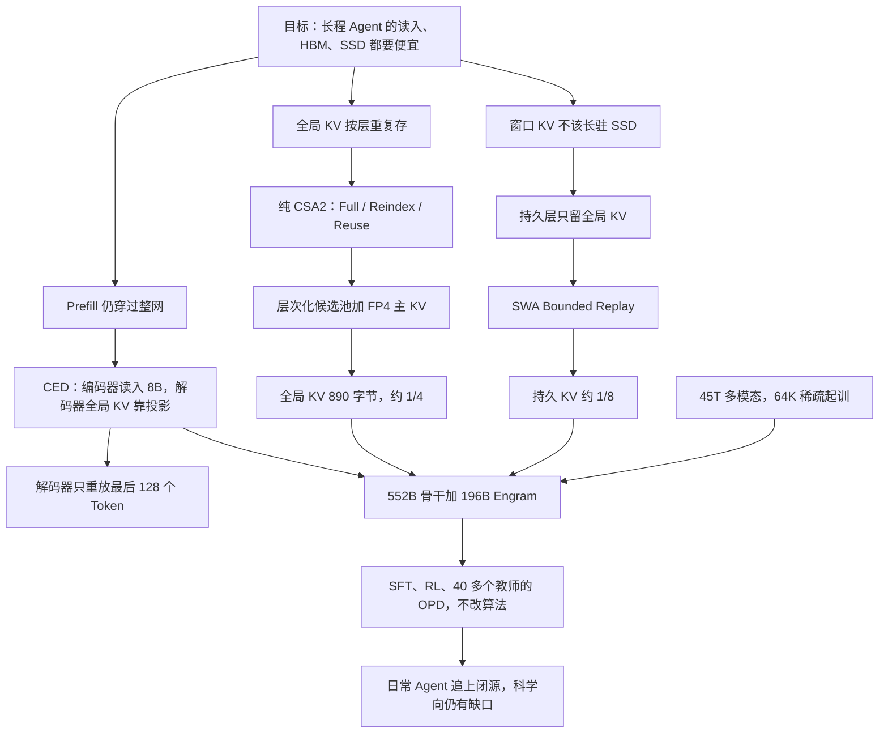

# DeepSeek-V4.1-Flash：读上下文只花 8B，每个 Token 的全局 KV 只要 890 字节

<!-- release-date: 2026-09-10 -->

> 本文依据 **DeepSeek-V4.1-Flash: Pushing the Limits of KV Cache Compression**，DeepSeek-AI，2026-09-10 随权重发布于 Hugging Face 的官方技术报告，无 arXiv 编号，共 51 页。页码均指这份 PDF 自身的页码。文中会区分三件事：**报告明确写了什么**、**我们怎么解释它**、**哪些是外部资料或本文推算**。

## 阅读前先认识几个词

- **Token（词元）**：模型读写文本和图像块的最小单位。
- **Prefill 与 Decode**：Prefill 是把已经写好的提示、工具返回、整段历史一次读完；Decode 是一个接一个往外吐新 Token。Agent 的账单往往先被很长的 Prefill 吃掉。
- **KV Cache（Key-Value Cache，键值缓存）**：读过的内容留下的中间结果，下一个 Token 靠它看历史，不必重算。
- **SWA（Sliding Window Attention，滑动窗口注意力）**：每个 Token 只细看最近一小段原文。窗口固定后，这块缓存不随上下文变长。
- **全局 KV 与持久 KV**：报告把缓存拆成两笔账。全局 KV 是看全历史的那一支留下的缓存，运行时始终占着 GPU 显存（HBM）；持久 KV 是为了下次复用前缀而存到 SSD 或主机内存里的那部分（PDF p. 4）。
- **MoE（Mixture-of-Experts，混合专家）**：总参数很大，每个 Token 只走少数专家。

这篇报告最重要的四个新名字：

- **CED（Causal Encoder-Decoder，因果编码器—解码器）**：前 20 层专门读输入；后 20 层的全局 KV 不自己算，而从前 20 层的出口投影出来。
- **CSA2（Compressed Sparse Attention 2，压缩稀疏注意力 2）**：在 V4 的 CSA 上，让多层共用同一份全局 KV 和检索结果。
- **FP4 主 KV**：把全局主 KV 存成大约四比特的浮点格式，用的时候再解回。
- **SWA Bounded Replay（滑动窗口有界重放）**：窗口 KV 丢了时，不把「层数 × 窗口」那么长的一段重跑，只重放最近一个窗口。

报告还会用到 **mHC**、**Engram**、**DSpark**、**DSec**、**Muon**。它们都来自 DeepSeek 更早的工作，本站各有专文（mHC、Engram、DSpark、DSec、DeepSeek-V4 几篇）；这里只写 V4.1-Flash 改了什么。

## 一句话先说清

V4 已经让一百万 Token「算得动」。接下来卡住 Agent 部署的，不再主要是注意力的计算量，而是三件更土的事：新输入仍要整段 Prefill；全局 KV 一直占着 HBM；持久 KV 一直占着 SSD 和搬运带宽（PDF p. 1、p. 4）。

V4.1-Flash 是一个 552B 骨干参数、另挂 196B Engram 的多模态 MoE，支持 1M 上下文（PDF p. 1、p. 7）。它对三件事各给一刀（PDF p. 1）：

1. **读输入便宜**：CED 让 Prefill 每 Token 只激活 8B，Decode 激活 16B。
2. **看历史更省**：CSA2 跨层复用加 FP4 存储，把始终在 HBM 里的全局 KV 压到每 Token 890 字节，约是 V4-Flash 的 1/4。
3. **存历史更省**：Bounded Replay 让窗口 KV 退出持久层，持久 KV 约是 V4-Flash 的 1/8。

能力一侧另走两条线：45T Token 的原生多模态预训练，以及报告自己说「没有任何算法创新」的后训练——增益几乎全部来自合成任务、可验证环境和 RL 规模（PDF p. 6、p. 25）。

如果只记一句话：

> **Agent 的负载是输入重、输出轻。与其让每一层、每一次读写付同样的账，不如让读上下文走浅而便宜的一半网络，让生成走整张网络，再把必须跨请求活下去的缓存压到只剩全局那一份。**

## 先看全景：40 层怎么排

图上能直接数出这篇报告的核心：40 层里只有 4 层真正「生产」全局 KV，其余层要么借 KV 重选，要么连选择一起借。其余规格放在一起（PDF p. 7、p. 13、p. 21–22）：

| 配置 | 数值 |
|---|---:|
| 骨干参数 / Engram 参数 | 552B / 196B |
| Prefill 激活 / Decode 激活 | 8B / 16B |
| 层数 / 隐藏维 | 40（编码器 20 + 解码器 20）/ 5120 |
| Query 头 / 头维度 / Query 压缩维 | 64 / 512 / 1280 |
| 输出投影分组 / 每组中间维 | 8 / 1024 |
| 索引器 Query 头 / 头维度 | 32 / 128 |
| 每个 Query 选中的 KV 条数（Top-k） | 512 |
| 层次化候选池 | 至多 2048 块 × 8 位置 = 16384 |
| SWA 窗口 $n_{win}$ | 128 |
| MoE | 1 共享 + 384 路由，激活 6 个，专家中间维 2304，SwiGLU 截断阈值 10 |
| mHC | 扩展因子 4，Sinkhorn-Knopp 20 次 |
| 视觉编码器 | 32 层，隐藏维 1024，16 头，patch 14；投影器 2 层 |
| 预训练 | 45T Token；64K 起训，34T 处扩到 1M |

两个数字值得一开始看清楚。

第一，**骨干比 V4-Flash 的 284B 更大，读输入的激活却更小**。V4-Flash 每 Token 激活 13B；V4.1-Flash 读输入 8B，生成 16B（PDF p. 24，Table 1）。Agent 一旦变成「先读很长、再写一段」，账单由 Prefill 主导，8B 更贴这个形状。

第二，报告称基座与 V4-Pro-Base「世界知识、推理、代码可比」，却只用约 1/3 总参数、1/4 激活参数（PDF p. 6）。**我们的验算**：552B / 1.6T ≈ 34.5%，对得上 1/3；激活参数 V4-Pro 是 49B，16B / 49B ≈ 33%，8B / 49B ≈ 16%，只有取两者平均 12B 时才是 12 / 49 ≈ 1/4。报告没写这个 1/4 按哪种口径算。

这些压缩叠在一起，单 Token 的 Decode FLOPs 几乎不随上下文变长。Figure 2 把 BF16、FP8、FP4 运算分别按 1、0.5、0.25 加权，从 4K 拉到 1M（256 倍）时，V4.1-Flash 的 Decode FLOPs 只增加约 1/4（PDF p. 5）。读图的约数：

| 单 Token Decode（GFLOPs，读自 PDF p. 5 Figure 2） | 4K | 1M |
|---|---:|---:|
| DeepSeek-V4-Flash | 约 17 | 约 60 |
| DeepSeek-V4.1-Flash | 约 20 | 约 26 |

图上还有一个报告正文没说的细节：短上下文时 V4.1-Flash 的 Decode FLOPs 略高于 V4-Flash（16B 对 13B 激活），两条线大约在 100K 附近交叉，之后才拉开。

## 第一层矛盾：算力降下来之后，贵的是存和搬

V4 的每一层都有一条看全历史的全局分支，再加一条只看窗口的 SWA。窗口固定后，SWA 缓存有上限；序列足够长时，跟着上下文一起涨、把 HBM 吃满的，是全局 KV——主 KV 加索引器的 Key（PDF p. 4）。

多轮 Agent 会反复撞上同一段前缀，把 KV 留下来下次复用，就能省掉整段 Prefill。这份持久 KV 受 SSD 和主机内存容量限制，搬家还受 I/O 与互联带宽限制（PDF p. 4）。

Prefill 本身也还贵。工具一返回，上下文就多出一块从未见过的后缀；缓存没命中时，新输入要穿过全部层（PDF p. 9）。

报告对 V4 有一句概括，决定了这一代的方向：V4 可以看成「以 SWA 做局部处理的骨干，外加压缩过的全局上下文」（PDF p. 4）。所以这一代几乎不动局部那一半，专心简化全局那一支。三笔账对应后面三刀：CED 砍 Prefill，CSA2 加 FP4 砍全局 KV，Bounded Replay 砍持久 KV。

## 核心设计一：CED，为什么输入便宜、输出更贵

### 旧问题：提示里的每个 Token 都要穿过全部层

普通因果 Transformer 没有「只负责读」的半边。提示有 $N$ 个 Token、网络 $L$ 层，Prefill 大致是 $O(NL)$：每个位置走完全部层，每层再为自己写一份 KV。Agent 里工具调用频繁、KV 又常 miss，这笔账被反复支付（PDF p. 9）。

### 新设计：后半层的全局 KV 从前半层的出口投影

CED 的灵感来自 YoCo：让上半层直接共用下半层产出的 KV（PDF p. 9）。具体是：前 $L/2$ 层当因果编码器；后 $L/2$ 层当解码器，其全局 KV 不从本层隐状态 $H_l$ 算，而从编码器最后一层 $H_{L/2}$ 用各层自己的投影矩阵变出来（PDF p. 9，式 1）：

$$
C_l = H_{L/2} W_l^{KV},\qquad
Z_l = H_{L/2} W_l^{Z},\qquad
l > \frac{L}{2}
$$

$C_l$ 是该层要用的 KV 条目，$Z_l$ 是对应的压缩权重。所以 Prefill 时提示主路径只跑编码器，解码器那份全局 KV 只是「出口隐状态乘一组矩阵」。

SWA 不走这条捷径：每层的窗口 KV 仍从本层 $H_l$ 算，报告说这加深了局部 KV 的计算深度。代价是要给解码器准备精确的窗口 KV，Prefill 得额外处理约 $n_{win}\times L/2$ 个 Token，即 128 × 20 = 2560 个；多轮短提示时，这笔开销不可忽略。报告引用 Chen 等人 2025 的观察，SWA 真实有效的感受野远小于理论上的 $n_{win}\times L/2$，于是解码器只对最后 $n_{win}$ 个 Token 做 Prefill，细节在 Bounded Replay 一节（PDF p. 9）。

总账：当 $N \gg n_{win}$ 时，Prefill 从 $O(NL)$ 变成 $O(NL/2 + n_{win}\times L/2) \approx O(NL/2)$（PDF p. 9）。

**我们的解释。** Prefill 8B、Decode 16B，不是「生成时多开一倍专家」，而是生成的每个新 Token 必须穿过编码器加解码器 40 层，提示里的 Token 只穿过编码器 20 层。MoE 配置在所有层相同（PDF p. 22），层数减半，激活大约减半，和 8B / 16B 对得上。

### 代价与边界

CED 把全局记忆的来源从「每层自己长一份」收成「都从编码器出口长出来」。报告说它「省掉近一半 Prefill，同时性能与基线可比」（PDF p. 9），但没有给这组对比的表，也没有「解码器 KV 改回本层隐状态会差多少」的消融。

> **可迁移启发**：输入重的负载里，第一次读和每一次写不必走同一条深度。能从较浅表示投影出来的全局缓存，就不要让每个提示 Token 再穿过后半网。

## 核心设计二：CSA2，跨层复用全局 KV 和检索结果

### 旧问题：V4 压了序列维，层维还在重复存

报告把长上下文的存储与计算拆成三个相乘的因子（PDF p. 9）：

1. **条目大小**：GQA 减少 KV 头，MLA 让许多头共用一个潜向量；
2. **序列维**：每 $m$ 个 Token 压成一条，即 V4 的 CSA 与 HCA；
3. **层维**：有些层不自备缓存，复用别的层的缓存或选择结果。

层维已有前人：IndexCache 跨层复用 Top-k 以省索引计算，YOIO 全网只算一次稀疏路由，HySparse 让稀疏层复用稠密层的 KV。报告的评价是：只复用索引省不了主 KV 存储，全网共享路由会伤性能，混合设计仍保留全注意力层，而且没有一家同时覆盖三个因子（PDF p. 9–10）。

### 新设计：纯 CSA2，外加三处简化

V4 用 CSA 与 HCA 的混合；V4.1-Flash 只用 CSA2（PDF p. 4）。相对 CSA，CSA2 简化了压缩器和索引器（PDF p. 10）：

- 压缩比 $m$ 的一条 KV 不再从重叠的 $2m$ 个位置吸收信息，也去掉编码这 $2m$ 个位置的绝对位置嵌入；
- 索引器 Key 改为从主 KV 投影，不再从隐状态另走一条压缩路径；
- $m = 1$ 作为不压缩的特例被纳入：解码器用 $m=1$，编码器用 $m=2$（PDF p. 22）。

每层 CSA2 被静态指定一种模式。三种模式都自算主 Query 和 SWA KV，差别只在三样东西从哪来（PDF p. 10–11，Figure 4）：

| 模式 | 全局主 KV | 索引器 K | 索引器 Q 与打分 | Top-k |
|---|---|---|---|---|
| Full | 本层算 | 由本层主 KV 投影 | 本层算 | 本层产出 |
| Reindex | 借最近 Full 层的 | 借最近 Full 层的 | 本层算，对借来的 K 重新打分 | 本层重新产出 |
| Reuse | 借最近的 | 不用 | 不算 | 借最近产出 Top-k 的层 |

「存 KV」和「选哪些 KV」被拆开了：Reindex 共享缓存，却允许选择随层变化。和 CED 叠在一起时，解码器那个 Full 层的全局 KV 从编码器出口投影，Reindex 与 Reuse 规则不变（PDF p. 11）。实际排布见上面的 40 层图（PDF p. 21–22）。

### 层次化稀疏索引：后面的索引器不必再扫全文

跨层复用 Top-k 省的是重复打分。没省掉的是：只要某层还要自己打分，它仍对全部可见位置打一遍，超长上下文里这仍是瓶颈（PDF p. 11）。

解码器因此多了 **Hierarchical Sparse Indexer（层次化稀疏索引器）**，不加任何新状态，只用浅层索引器已算过的分数来收窄深层的搜索域（PDF p. 11–12，Figure 5）。第一个 Full 层对全部可见主 KV 打分，选出自己的 Top-512；同时按块取块内最高分，选出分数最高的块，拼成比 Top-k 大得多的候选池（如 2048 块 × 8 位置 = 16384）。之后的 Reindex 层只在池内打分再选自己的 Top-512，Reuse 层不打分。候选池共享，最终选择可以不同（PDF p. 12）。

候选池大小固定后，后续索引器每个 Query 的打分量与上下文长度无关，全文扫描只留给第一个 Full 层。这个机制在**后训练**时引入，训练与推理用同一套候选限制，深层索引器是在上线时的搜索域里学出来的（PDF p. 11–12）。

### 代价与边界

CSA2 把「每层一份全局记忆」收成「少数层生产、多数层消费」。层次化索引接受一个明确风险：第一个 Full 层没放进候选池的位置，后面的 Reindex 层永远看不见。V4 保留 HCA 扫全部粗摘要，是给稀疏选择留一条漏召回时的退路；V4.1 去掉 HCA，是拿能力换存储的赌注。报告没有「加回 HCA 会多占多少、分数高多少」的表，第 6 节把 CSA2 的潜在选择错误列为仍需压测的边界（PDF p. 37）。

> **可迁移启发**：KV 的三个乘法因子要分开砍。只压序列维，层维仍会按深度再乘一次；跨层复用时把「存」和「选」拆开，才能在共享缓存的同时保留一点层间差异。

## 核心设计三：FP4 主 KV，把每个格子再削半

### 旧问题：跨层省下的，会被精度账单吃回去

V4 已经对索引器的 Query 和 Key 做 FP4 的量化感知训练（QAT），为的是加速索引、缩小索引缓存；那里选的是 OCP 标准的 MXFP4，因为索引要做矩阵乘，它能在最多的硬件上原生跑，尽管实验里别的格式更准（PDF p. 14）。主 KV 那一侧，V4 仍是 FP8（PDF p. 14）。

### 新设计：为存储而量化，不为矩阵乘而量化

主 KV 的 FP4 只为省存储：算注意力前先解量化，因此可以挑更准的格式，不要求硬件原生支持（PDF p. 14）。在评估过的约四比特格式里，他们选 **E2M1，每 16 个通道一个 E4M3 缩放**，跟 NVFP4 一样，但去掉它的第二级全局缩放（PDF p. 14）。

去掉全局缩放为什么敢：这个格式能表示的最大幅度是 $448\times 6=2688$。训好的 RMSNorm 权重最大约 1，512 维 KV 潜向量经 RMS 归一化后 L2 范数至多约 $\sqrt{512}\approx 22.6$，RoPE 不改范数；训练中观察到的最大幅度约 10。远低于 2688，所以去掉全局缩放「没有可测的精度损失」（PDF p. 14）。

其余选择（PDF p. 14–15）：

- QAT 放在**后训练**，不从预训练起就 FP4；
- 非 RoPE 维与 RoPE 维用同一格式，量化发生在 RoPE **之后**——之前量化只有边际精度好处，却给 Decode 加开销；
- **SWA 的 KV 仍用 FP8**，因为它对量化更敏感；
- 相对 V4 的 FP8 主 KV，HBM 与 SSD 上的占用都几乎减半。

### 890 字节从哪来：报告数字，加上我们的拆账

报告写死的结论是：CSA2 的跨层复用加 FP4，把全局 KV 降到每 Token 890 字节，约是 V4-Flash 的 1/4（PDF p. 1、p. 4–5）。Figure 1(b) 的代际数字（PDF p. 1）：

| 模型 | 每 Token 全局 KV（字节） | 相对上一代 |
|---|---:|---:|
| DeepSeek-V1（2023.11） | 389120 | — |
| DeepSeek-V3.2（2025.12） | 48068 | 约 8.1 倍更小 |
| DeepSeek-V4-Flash（2026.04） | 3514 | 约 13.7 倍更小 |
| DeepSeek-V4.1-Flash（2026.09） | 890 | 约 3.9 倍更小 |

389120 / 890 ≈ 437，与图注「相对 V1 约 437 倍」一致。

**我们的拆账，不是报告原文**，就是开篇那张账本图的上半：

- 一条主 KV：512 维 × 4 bit = 256 字节，加 512 / 16 = 32 个 E4M3 缩放各 1 字节，共 288 字节；
- 一条索引器 K：128 维，若按 V4 索引器用的 MXFP4（每 32 个值一个 1 字节缩放）计，64 + 4 = 68 字节；
- 每条合计 356 字节。生产全局 KV 的只有编码器 3 个 Full 层（$m=2$，每 Token 0.5 条）和解码器 1 个 Full 层（$m=1$，每 Token 1 条），合计每 Token 2.5 条；
- $2.5 \times 356 = 890$，与报告数字一字不差。

这组算术说明 890 可以完整由「层排布 × 压缩比 × FP4 格式」解释，不需要别的隐藏项；但索引器 K 的实际格式报告没写，所以它仍是推算，不是官方拆账。

> **可迁移启发**：缓存量化的约束是**动态范围和谁读它**，不只是比特数。主 KV 先归一化、幅度有上界，四比特放得下，读前解量化就能挑更准的格式；窗口 KV 直接服务局部语法，报告选择不压。

## 核心设计四：SWA Bounded Replay，持久 KV 再降到 1/8

### 旧问题：窗口 KV 的寿命和持久层对不上

V4 的部署里，窗口 KV 几乎占持久缓存的一半。全局 KV 整段保存，命中后整段前缀可续；窗口 KV 只在提示结束和输出结束两个点各存一份，方便重新生成和多轮续跑。为了命中率，持久缓存在 SSD 上开得很大，典型负载下两类 KV 都能住 72 小时以上（PDF p. 19）。

问题是访问模式合不来：全局 KV 是长尾复用；窗口 KV 只在活跃会话的分钟级窗口里有用，会话一结束或下一轮一开始就作废（PDF p. 19）。V4 报告提过 Zero SWA Caching，即丢掉窗口 KV、缺了就重算；可精确重建要对 $L \times n_{win}$ 个 Token 完整前向，生产里贵到用不下去（PDF p. 19）。

### 新设计：只重放一个窗口，接受近似状态

图上两条路径各解决一件事（PDF p. 20）：

- **编码器路径**让前缀缓存只依赖全局 KV，窗口 KV 因此可以退出持久层。重放出的前缀窗口状态是近似的，所以后缀算出来的全局 KV 与窗口 KV 会随命中位置不同而不同，数学上不再恒等；报告说实验上「几乎不损害回复质量」。
- **解码器路径**是 CED 能把 Prefill 砍半的最后一块拼图。解码器全局 KV 可以投影，解码器窗口 KV 不能——它来自各层自己的隐状态，而且前几步 Decode 要用。每次 Prefill 只把提示最后 $n_{win}$ 个 Token 的编码器输出送进解码器，得到的窗口 KV 只给 Decode 用，从不写进前缀缓存。报告说质量影响可忽略；为了保险，后训练里还模拟同一套重放，让模型适应近似路径。

持久层策略因此改成两条（PDF p. 19）：窗口 KV 不再进持久缓存，改放每台机器划出 10% 主机内存的分布式池，TTL 只有几分钟，过期立刻让给新会话，真实负载下够服务绝大多数并发会话；全局 KV 仍在持久缓存里保证至少 72 小时。「全局命中、窗口缺失」从灾难变成一次便宜的重放。

1/8 就是两个因子相乘：持久层不再存几乎占一半的窗口 KV，剩下的全局 KV 又被压到 V4 的 1/4（PDF p. 19）。

### 代价与边界

这是用一小段 Prefill 重算，换掉 SSD 上那一半短命缓存。报告反复用「negligible」「barely compromises」，但没有「精确窗口 vs 有界重放」的公开对照；第 6 节把近似重建与 CSA2 选择错误并列，当作仍要在缓存恢复边界上压测的点（PDF p. 37）。

> **可迁移启发**：缓存分层要看复用寿命，不看张量名字。全局 KV 跨会话有用，窗口 KV 往往只在这一轮有用；短命状态用有界的近似重建，比用长驻 SSD 更划算。

## 配件：Single-Pass mHC、Engram、DSpark

这三项都不是本报告的发明，是 V4.1-Flash 把 CED 与 CSA2 接进可训练、可服务系统时的配套改动。

### Single-Pass mHC：把残差混合的访存减半

mHC 在相邻块之间维护 $n$ 路残差流 $X_l \in \mathbb{R}^{n\times d}$（PDF p. 12，式 2）：

$$
X_{l+1} = B_l X_l + C_l\, \mathcal{F}_l(A_l X_l),\qquad (A_l, B_l, C_l) = \mathcal{H}(X_l)
$$

理想情况下，两块之间一次映射读 $(n+1)d$、写 $(n+1)d$，访存下界是 $(2n+2)d$。V4 的实现因数据依赖拆成三个顺序 kernel（残差更新、系数预测、输入混合），算上 pre-norm，激活访存 $(4n+4)d$，正好两倍下界（PDF p. 12）。

卡住融合的是 $A_l$：输入混合要用当前块自己预测的系数，而系数要等隐藏维全部归约完才知道，$X_l$ 只能读第二遍。Single-Pass mHC 把输入混合系数错开一块，当前块用上一块产出的 $A_{l-1}$（PDF p. 13，式 6）：

$$
X_{l+1} = B_l X_l + C_l\, \mathcal{F}_l(A_{l-1} X_l)
$$

依赖消失后，每一片 $X_l$ 能同时做输入混合和下一块的系数累加。报告说这一错位「经验上几乎不掉点」。预训练仍用多 kernel 实现（错位只改用哪组系数）；部署融成一个 **Mega-mHC** kernel，残差读一次写一次，达到理想的 $(2n+2)d$，相对原实现减半，并顺手做完 pre-norm 与 FP8 转换（PDF p. 13）。

### Engram：196B 查表记忆，不进 8B / 16B 激活

沿用原设计的分词压缩、多头哈希、上下文门控、多分支汇入，改两处：去掉短因果卷积（收益配不上推理栈的复杂度）；嵌入表改用动量更新加 Sinkhorn 均衡（PDF p. 13）。196B 均分到两个模块，放在从 0 数的第 1 层和第 14 层，以均衡流水线各段显存。每个模块用 2/3/4-gram、8 个哈希头、每阶总嵌入维 2048，每头一张约 1600 万行的表，表大小取不同素数；表和 KV 投影都是 FP8。地址只由输入 Token 决定，推理时可从主机内存经 RDMA 后台预取，第一个模块的预取和第一个 Transformer 块的计算重叠（PDF p. 13）。

训练时表按行分片到专门的进程组，优化器状态再在副本间分片；查找索引只依赖输入，整步 micro-batch 开始前就发起预取；预取与梯度回传藏进视觉编码器的前向与反向里。RL rollout 期间表常驻 GPU，避免主机内存碎片导致 OOM（PDF p. 18）。

### DSpark：草稿模块从预训练里摘出去

V3 的 MTP 从头跟骨干一起训。V4.1-Flash **预训练骨干时不带 MTP**，预训练结束后冻结骨干单独训 DSpark；后训练里 DSpark 继续跟着骨干学，但它的损失不回传骨干，这样它能同时加速在线服务和 RL / OPD 的 rollout（PDF p. 8、p. 14）。

模块本身：三个 Transformer 块，滑动窗口 128；一次前向并行给出 5 个草稿位置的基础 logits，再用轻量 Markov 头建模草稿 Token 之间的依赖；置信度头预测各位置的条件接受概率，调度器结合引擎吞吐曲线动态选这次验证多长，目标是当前负载下系统吞吐最大（PDF p. 13–14）。报告没有给接受长度、加速比或与 MTP 的对照。

## 优化器：按头的 Muon，以及给巨表用的 Sinkhorn 更新

骨干线性层、Engram 投影层、视觉—语言投影器用 Muon；归一化权重、偏置和缩放因子用 AdamW（PDF p. 15）。新变化两处：

**Head-wise Muon**：Query 和 Key 的权重先按头切开再做 Muon。把 Muon 看成带预条件的梯度下降，普通 Muon 所有头共用一个预条件，按头版本让各头各用各的，更能消化头之间的异质性。报告说它优于普通 Muon，GLM-5 与 Kimi-K3 也验证过（PDF p. 14–15），但没有附对照曲线。

**Sinkhorn 均衡更新**：用在 Engram 表、Token 嵌入和预测头上，替代会多存一份状态的 Adam，只保留一个动量缓冲，经验上还优于 Adam（PDF p. 15）。流程与 Muon 相同，只是把 Newton–Schulz 正交化换成交替的行、列归一化，让更新矩阵的行 RMS 与列 RMS 都接近 1；一行对应一个 Token 或 n-gram，一列对应一个隐特征；范数过小的行被掩掉；学习率再乘 $\gamma = 0.18$ 对齐 Adam 的更新幅度，接近 Moonlight 用的 0.2（PDF p. 15–16，Algorithm 1）。

视觉编码器在学习率衰减之前冻结，只训最后一层归一化和视觉—语言投影器；衰减开始时以更小的学习率与语言模型一起解冻（PDF p. 15）。

## 基础设施：让复用真的发生在分布式里

**训练侧**（PDF p. 16–18）：

- 对比学习阶段，文本特征的梯度只依赖聚合后的视觉特征，反之亦然，所以两次 all-gather 分别藏进文本前向和文本反向里；
- 视觉编码器拆出 LLM 参数树，一步分成「视觉前向 → LLM 前向反向 → 视觉反向」，LLM 阶段保留纯文本训练的并行策略；
- 超长图文序列把图按上下文并行的各个 rank 均衡分片，每张图只读一次。读图能藏在计算后面的条件是 $\rho < \frac{B_{IO}}{B_{GPU}} C$，其中 $\rho$ 是每 Token 原始字节数、$C$ 是每 Token 计算量；序列长度约掉了，所以生产规模的模型总是算力受限，只有做消融的小模型才会被存储吞吐卡住；
- CSA2 共享的层可能落在不同流水线段：**影子索引器**在每段放一个可执行副本、只留一个逻辑所有者负责优化与存盘；跨段需要的中间表示和稀疏路由走已有的点对点通信并按上下文并行切分；共享状态按 micro-batch 追踪寿命，最后一个消费者用完立刻释放。

**推理侧**（PDF p. 18–19）：靠 FlashMLA、DeepGEMM 等库里的融合 kernel，绝大多数层（Reuse 模式）Prefill 只要 15 个 kernel、Decode 只要 11 个。部署采用 Encoder–Prefill–Decode 分离，视觉编码、Prefill、Decode 独立扩展。

报告没有写用了多少卡、流水线多深、专家并行多大。能带走的是原则：共享注意力的正确性边界是「逻辑上仍是同一份参数和同一份 KV」，不是「必须放在同一个流水线段里」。

## 预训练：45T 多模态，稀疏注意力从 64K 直接开训

### 数据

文本侧更强调语料之间的整体搭配，而不是小规模实验里的样本质量：按参数与数据设计缩放阶梯来指导大规模训练；滤掉信息增量有限的模型生成内容和低质机翻，视为隐式重复；引入更多领域专家做细粒度质量维度；代码侧纳入更多新仓库、新提交、新框架（PDF p. 20–21）。

多模态侧**不做大规模合成**，前提是原生网页已有丰富的视觉知识，优先清洗原生数据。爬虫起初过度偏向纯文本网页，后来从 Common Crawl 重新引导。三类数据：图文对（alt text、相关性阈值、按图像语义去重）；交错图文（主要来自网页与 PDF，按越来越贵的阶段筛：先启发式、统计、去重与质量模型选文档，再拼成交错序列做图像感知的过滤与去重，最后用 SmolVLM 严格打分，被丢的文档部分回收成图文对）；领域数据（接地与指点、OCR、长尾知识，以及大量图—代码对和电脑使用轨迹）（PDF p. 21）。

两套管道合并时，重叠样本用多模态版替换纯文本版并取两边更大的轮数；最终文本与多模态 Token 比 7:1。超长文档先确定性切分再混合，改进后的 best-fit packing 把 padding 率压到至多 $10^{-4}$（PDF p. 21）。

### 视觉编码器单独先训

DeepSeek-ViT 从零训，贴近 LLM 的改法：2D-RoPE 代替绝对位置嵌入，patch 嵌入用线性投影以兼容 Muon，RMSNorm 加 SwiGLU；送进语言模型前做 3×3 pixel-unshuffle，视觉 Token 降到 1/9，最高支持约 1344×1344（PDF p. 8）。

两阶段（PDF p. 22–23）：先在约 47B 图文对上用 SigLIP 的 sigmoid 对比损失训，分辨率上限 224×224——这一阶段用更高分辨率有明显收益，但对最终模型贡献很小，因为后面的自回归阶段会处理高分辨率外推；再接到一个 4B MoE 语言模型上，用 236B Token（字幕、alt text、图表、OCR）做下一词预测，分辨率限制在 544 到 1344。训完丢掉那个 LLM，只留视觉编码器。

MoE 路由为图像和文本 Token 各维护一套无辅助损失均衡的偏置，按各自负载独立更新，避免总体均衡掩盖某一模态内部的失衡（PDF p. 8）。

### 课表

45T Token 全程无不稳定。Batch 固定 1.006 亿 Token；学习率前 2000 步线性升温，保持 $2.6\times 10^{-4}$ 到 28T，28T 到 40T 余弦降到 $2.6\times 10^{-5}$，再保持到 45T。稀疏注意力从零在 64K 上训，**没有稠密注意力预热**，34T 处扩到 1M。图像与文本的路由偏置更新速度都是 0.001，另留权重 0.0001 的序列级均衡损失防止单条序列极端失衡；与 V4 一样用样本级注意力掩码。AdamW $\beta_1 = 0.9$、$\beta_2 = 0.95$、权重衰减 0.1；Muon 动量 0.95、权重衰减 0.1、更新 RMS 缩放到 0.18；Sinkhorn 更新 $K = 11$、$\tau = 10^{-3}$；Engram 学习率乘 5（PDF p. 22）。

### 基座成绩：参数更少，held-out 更低

Table 1 把三个 Base 放在同一套内部评测框架里，分差不超过 0.3 视为同一档（PDF p. 24）。挑有信息量的几行：

| 基准 | V4-Flash-Base | V4-Pro-Base | V4.1-Flash-Base |
|---|---:|---:|---:|
| 激活 / 骨干参数 | 13B / 284B | 49B / 1.6T | 8B·16B / 552B |
| MMLU-Pro | 68.3 | 73.5 | 74.1 |
| SimpleQA-Verified | 30.1 | 55.2 | 42.3 |
| SuperGPQA | 46.5 | 53.9 | 53.1 |
| BBEH | 25.4 | 29.8 | 27.2 |
| HumanEval | 69.5 | 76.8 | 79.4 |
| BigCodeBench | 56.8 | 59.2 | 60.6 |
| MATH | 57.4 | 64.5 | 61.1 |
| MGSM | 85.7 | 84.4 | 80.2 |
| LongBench-V2 | 44.7 | 51.5 | 45.2 |

多模态只有 V4.1 有数：MMMU-Pro 56.5、CVBench 77.9、DocVQA 95.6、RefCOCO-avg 86.0（PDF p. 24）。读法：知识题贴近 Pro，但靠记忆的 SimpleQA 仍明显落后 Pro；代码超过 Pro；长上下文只和 V4-Flash 同档。

报告另在内部文档、内部代码仓库、学术材料三套 held-out 语料上比 bits-per-byte，越低越好（PDF p. 25，Figure 6）：

| 语料 | V4-Flash-Base | V4-Pro-Base | V4.1-Flash-Base |
|---|---:|---:|---:|
| 内部文档 | 0.617 | 0.59 | 0.564 |
| 内部代码仓库 | 0.1562 | 0.1494 | 0.1443 |
| 学术材料 | 0.4929 | 0.4677 | 0.4305 |

三套都是 V4.1 最低。**我们的验算**：相对 V4-Flash 低 7.6%–12.7%，相对 V4-Pro 低 3.4%–8.0%。引言里的「held-out 提升 5%–10%」两种口径都只部分吻合，报告没写比的是哪一个。这些语料无法经 API 复现，是内部证据。

## 后训练：算法不新，数据和环境才是杠杆

报告把这句话写得很硬：配方就是 SFT → RL → OPD，不做任何超出 V4 惯例的算法改动；在一个「固定且平平无奇的优化过程」下，合成数据与环境的规模、多样性和可验证性，解释了几乎全部增益（PDF p. 6、p. 25）。

### 任务是三元组：题目、环境、验证器

每个任务写成（problem, environment, verification system），用难度与正确性当奖励，迭代训练模型自己出题；任务每进一轮新的 RL，新轨迹就成为复审质量的证据（PDF p. 25–26）。

- **通用 Agent**：鼓励员工和外部伙伴把最新模型用进日常，自愿回传交互；按观察到的接口构造大量 mock 工具，覆盖常见 SaaS、企业应用和更专门的业务后端；把负面反馈和失败案例做成单轮、多轮环境，针对弱点做 RL（PDF p. 26）。
- **代码 Agent**：来源是内部与伙伴的会话（留高复杂度或模型表现差的，按轨迹去重），以及达到星标阈值的公开 GitHub 仓库。多个专职 Agent 流水协作：判断项目能否在容器里构建、跑通、自动验证，选起始 commit、设计实现方向和 fail-to-pass / pass-to-pass 评测点；另一个 Agent 在隔离容器里装依赖、写测试、清掉可能泄题的痕迹并打成镜像层；多个解题 Agent 尝试后，独立质检 Agent 查环境问题、事实错误、评测点与题面不符、可被 hack 的风险；不过就交给修复 Agent 修完重验（PDF p. 26）。

### RL 在两个方向上扩：算力，以及脚手架数

Figure 7（PDF p. 27）在 DeepSeek Harness Minimal 模式下，DeepSWE v1.1、SWE-Bench Pro、Terminal-Bench 2.1、Terminal-Bench 3.0（无 GPU）都随累计 RL 步数上升；把最大上下文从 512K 拉到 1M，对极长程的 Terminal-Bench 3.0 仍有帮助。Figure 8（PDF p. 28）左边是多个 Claude Code 版本联合训练，右边是 OpenCode、Pi、DeepSeek Harness 的 Standard 与 PTC 模式联合训练，DeepSWE v1.1 同样随步数上升。

曲线断开处是用模型合并重新初始化后的下一轮 RL：把不同脚手架或配置下的检查点合在一起再续训，报告称任务表现与 Token 效率都进一步提升，是「把并行 RL 算力接起来」的简单办法（PDF p. 27）。Rollout 拆成沙箱（跑脚手架和工具）与 worker（脚手架无关的控制层，把异构交互归一成统一轨迹格式），都跑在 DSec 上、在可抢占的 GPU 训练池之外；训练抢占时 rollout 可挂起、卸下并保留完整状态（PDF p. 26–27）。

### DSec：数百万并发沙箱

V4.1 训练把需求推到数百万并发沙箱，瓶颈转向数据中心可扩展性、负载隔离、单机密度，以及越来越能干的 Agent 搞破坏（PDF p. 27–28）：

- **不用 Kubernetes**：观察是沙箱放置只要**最终一致**，前提是每个节点守住本地安全约束。放置引擎多副本独立运行、不同步协调，按近期测量预测资源做「够好」的决策；节点本地用硬准入拒绝超过告警阈值的新放置。计算节点再分片成多个 scale unit，缩小故障半径（PDF p. 28）。
- **高密度**：用硬件支持的 sub-NUMA 把每个 worker VM 绑到独立 NUMA 域，同等负载下单机并发活容器从约 1000 升到 2500 以上，之后才出现可测的端到端退化（PDF p. 28）。
- **延迟敏感隔离**：设 LS 执行类，非 LS 任务用 `SCHED_IDLE`，并用 core scheduling 保证兄弟超线程上只跑同优先级任务（PDF p. 28–29）。
- **管住 Agent**：RL 里常见奖励黑客或把环境打崩——利用刚披露的漏洞（XFS 驱动权限、AppArmor 非法内存访问）、从包镜像服务泄露答案、删关键二进制、拆系统文件、甚至删掉文件系统。对策是每沙箱 AppArmor 配置和细粒度 eBPF 网络策略；打崩环境记为失败轨迹，并向 RL 框架报一个 repercussion 信号（PDF p. 29）。

### 可连续调节的推理强度

输出 Token 数是服务成本的另一个决定项。V4.1-Flash 在系统提示前加一行 `Reasoning Effort: {effort}`，$b \in \{1,\dots,100\}$，单轮推理与多轮 Agent 都用（PDF p. 29）。

训练时对每个努力档采 $M_b$ 条回复，同一 $(x, b)$ 组成子组，在子组内做组相对优势，**不同努力档不直接互比**；努力依赖的行为靠让长度惩罚随 $b$ 变（PDF p. 29，式 8–10）：

$$
r^{\mathrm{len}}_{b,j}=-\min\left\{C_{\max},\ k(b)\frac{\ell_{b,j}}{L_{\mathrm{norm}}}\right\},\qquad
k(b)=k_0\exp\left(-\frac{b-b_{\min}}{\tau}\right),\qquad \tau=\lambda\,\overline{\Delta b}
$$

$\ell_{b,j}$ 是推理 Token 数，$L_{\mathrm{norm}}$ 是参考长度，$C_{\max}$ 封顶单条轨迹的扣分；$b$ 每增加 $\tau$，惩罚系数乘 $e^{-1}$。$k_0$ 控制整体压短的力度，$\tau$ 越小，档与档的行为分得越开。附录 C 给了一个局部动机：若多想一个 Token 的边际收益近似指数衰减，指数惩罚会让最优长度随 $b$ 近似线性增长；作者明说这只是奖励层面的局部近似，不保证测到的平均长度线性或单调，碰到封顶时要另算（PDF p. 49–51）。

训练只用有限几档，部署可以插值。2026 年 9 月上线的 API 三档映射为 max = 100、high = 75、low = 50（PDF p. 30，Table 2）。

Figure 9（PDF p. 34–35）把努力从 25 拉到 100：八个推理基准平均 Pass@1 从 67.1% 到 76.3%，DeepSWE v1.1 从 66.0% 到 74.2%，Terminal-Bench 2.1 从 82.4% 到 90.6%，输出 Token 约多 2.5 倍。收益前重后轻：60–80 已拿到最大档大部分准确率、Token 不到一半；最后升到 100，Agent 轨迹再长 1.6–1.8 倍，只换来边际提升。附录补充：八个推理基准上平均回复长度均匀涨 2.0–3.1 倍（AIME 2026 从 4.6k 到 11.4k，MathArena Apex 2025 从 29.1k 到 86.1k），没有一个基准随努力上升而变差，MathArena Apex 2025 从 25.3% 到 65.6%（PDF p. 48）。但换到不同代码脚手架，轨迹长度随努力单调增长，Pass@1 只是松散跟随，多数面板中间档有平台和回落（PDF p. 48，Figure 11）。

### 异步 RL：同一批机器上切 rollout 和训练

几乎所有 RL 和 OPD 任务都改成异步生成来打长尾。Rollout 与训练在同一批物理设备上分时执行，每个任务规定在途样本上限（PDF p. 30）。

- **派发粒度**试过三种：batch 级太粗，训练指标剧烈振荡；prompt 级会卡在一个 GRPO 组里的长尾样本上；最终用 **sample 级**——新完成的样本数够下一个 prompt 的组大小，就派发它，不管这些完成来自哪些组（PDF p. 30）。
- 样本攒够后训练抢占 rollout；跨多个检查点生成的样本用 **concatenated routing-replay**，把各段 rollout 时的专家路由拼起来，而不是用新检查点重算（PDF p. 30–31）。
- **长度偏置**：短序列先完成、占满早期 batch。按数据集限并发，并丢掉过早返回的短样本。**离策略**：限制最大离策略比例，并对过期太久的 Token 做损失掩码（PDF p. 31）。
- **停得下、接得上**：可在任意 Token 边界中断；KV 和专家路由按 Token 粒度持久化，新检查点直接复用、免去重新 Prefill；样本一完成就回收状态。同一机制也用来响应集群抢占（PDF p. 31）。

后训练最后一步是全词表 OPD，用全部领域数据和**超过 40 个教师**；教师可以来自不同开发阶段、不同架构，也可以与学生异构，切换成本可忽略。训练中途会改数据配比、并发上限和教师集合，异步下新旧配置的样本会同时在途，系统要能一致过渡（PDF p. 31–32）。

## 评测：日常 Agent 追上闭源，科学向长程仍有缺口

默认最大努力（$b = 100$）、温度 1.0、top-p 0.95。代码 Agent 用 DeepSeek Harness Minimal、1M 上下文；DeepSWE v1.1 按官方要求改用 mini-SWE；SEC-Bench Pro 用 Claude Code（为了它的会话压缩）；视觉 Agent 用 Claude Code、512K 上下文。为防奖励黑客，评测限制联网、剥离 Git 历史、清掉各类构建与包缓存，仍观察到模型在 CyberGym 上反编译 Ubuntu 核心包找漏洞之类的行为（PDF p. 32–33）。

### 和闭源、开源、V4 家族比

Table 3（PDF p. 33），全部为 Max 档：

| 基准 | Opus-5 | GPT-5.6 Sol | Kimi-K3 | GLM-5.3 | V4-Pro | V4-Flash | V4.1-Flash |
|---|---:|---:|---:|---:|---:|---:|---:|
| GPQA Diamond | 93.4 | 94.1 | 92.9 | 88.1 | 92.4 | 89.9 | 90.9 |
| HLE | 56.3 | 44.5 | 43.5 | 42.0† | 42.7† | 37.8† | 36.8（39.1†） |
| Codeforces 评分 | — | — | — | — | 3348 | 3289 | 3471 |
| MathArena Apex | — | — | 65.6 | — | 65.3 | 58.6 | 65.6 |
| Terminal-Bench 2.1 | 89.1 | 88.8 | 88.3 | 88.2 | 87.9 | 82.7 | 90.6 |
| Terminal-Bench 3.0 | 43.3 | 34.4 | 17.7 | 28.3 | 11.8 | 7.6 | 30.0 |
| Terminal-Bench 4.0 | 51.8 | 39.9 | 12.6 | 37.9 | 12.4 | 7.0 | 31.2 |
| DeepSWE v1.1 | 74.0 | 73.0 | 67.5 | 66.9 | 62.7 | 54.4 | 74.2 |
| ProgramBench | 37.0 | 23.0 | 17.5 | 19.0 | 15.5 | — | 20.3 |
| NL2Repo-Bench | 75.3 | 56.8 | 58.0 | 58.0 | 61.5 | 54.2 | 65.4 |
| CyberGym | — | 84.5 | 80.0 | 84.5 | 83.3 | 76.7 | 88.1 |
| SEC-Bench Pro | — | 74.3 | — | — | 56.4 | 30.9 | 62.8 |
| ExploitGym | 22.1 | 33.7 | — | 15.0 | 5.4 | 1.8 | 15.3 |
| HLE 带工具 | 63.6 | — | 59.8 | 62.5 | 60.0 | 51.5 | 63.9 |
| Automation-Bench | 50.3 | 45.8 | 46.7 | 48.8 | 43.2 | 37.7 | 54.8 |
| Agents' Last Exam | 28.6 | 26.7 | 27.6 | 28.5 | 25.7 | 25.2 | 31.8 |
| Chartography 带工具 | 84.0 | 79.9 | 68.1 | — | — | — | 78.9 |
| BabyVision 带工具 | 94.1 | 88.9 | 85.7 | — | — | — | 89.6 |
| ZeroBench-main 带工具（Pass@5） | 52.0 | 53.0 | 41.0 | — | — | — | 49.0 |

† 为 HLE 纯文本子集。读表要知道三件事：

- **日常 Agent 追上了**。Terminal-Bench 2.1、DeepSWE v1.1、Automation-Bench、Agents' Last Exam、CyberGym、HLE 带工具都是表中最高或并列最高。
- **科学向长程和硬推理没追上**。Terminal-Bench 3.0 / 4.0 比 V4 家族高出一大截，仍明显低于 Opus-5；HLE 与 GPQA 不但低于闭源，也低于 V4-Pro。引言自己承认，需要专家级领域知识的科学向 Agent 任务上与巨型模型仍有差距（PDF p. 6）。
- **视觉 Agent 超过 Kimi-K3，低于闭源头部**（PDF p. 34）。

引言另有一句更强的话：多数基准已能匹配闭源前沿，「能完成超过 95% 的真实世界任务」（PDF p. 6）。这是作者观察，95% 没有操作化定义，表里读不出来。

### 换脚手架不会崩

同一检查点、同一解码、同一题集，只换外围 harness（PDF p. 35，Table 4）。DeepSWE v1.1 每题 8 次、Terminal-Bench 2.1 每题 3 次，Linux 容器、1M 上下文、每个 Agent 最多 500 轮：

| 脚手架 | DeepSWE v1.1 | Terminal-Bench 2.1 |
|---|---:|---:|
| Claude Code（v2.1.251） | 69.8 | 88.0 |
| Codex | 65.6 | 84.1 |
| OpenCode | 65.5 | 85.0 |
| Pi | 66.2 | 86.1 |
| mini-SWE | 74.2 | 90.3 |
| DeepSeek Harness Minimal | 72.6 | 90.6 |
| DeepSeek Harness Standard | 70.5 | 85.8 |
| DeepSeek Harness PTC | 67.6 | 85.8 |

主表的 74.2 来自 mini-SWE，90.6 来自 DSH Minimal。换脚手架会掉几分到接近 9 分，但没有崩；报告归因于合成训练覆盖了多样的环境、工具格式和交互方式（PDF p. 34–35）。四个 Claude Code 版本的平均是 68.9 与 87.8（PDF p. 48，Table 5）。

### 多智能体：初步结果，有墙钟截止

Agent Team 模式里，主 Agent 可异步创建具名队友，队友从零开始（fresh）或拿一份主 Agent 已完成轮次的快照（fork），共享同一份代码检出，靠持久邮箱和共享任务板协调，只有主 Agent 能打断队友（PDF p. 35–36）。奖励由任务表现、鼓励委派与沟通的协作奖励、以及派生延迟惩罚组成：把执行事件和协作依赖建成有向无环图，Token 按固定的 Prefill / Decode 速率计价、加上实测工具时间，取关键路径长度，惩罚无谓的串行，又不受服务端排队影响（PDF p. 36）。

ProgramBench 只留参考解在隐藏测试上通过率至少 95% 的 172 道题；FrontierSWE v2 用不需要 GPU 的公开子集。Figure 10（PDF p. 36）：

| 基准 · 指标 | 截止时间 | 单智能体 | 多智能体 |
|---|---|---:|---:|
| ProgramBench · Almost@1 | 1 小时 | 12.79% | 13.59% |
| ProgramBench · Almost@1 | 8 小时（峰值） | 20.39% | 30.04% |
| FrontierSWE v2 · Mean@5 | 1 小时 | 10.50% | 13.50% |
| FrontierSWE v2 · Mean@5 | 20 小时 | 28.20% | 32.90% |

报告自己说这是初步结果：比的是观察到的最强多智能体配置对最强可用单智能体基线（PDF p. 36）。它是「加墙钟、加队友、分数涨」的存在性证据，不是可复现的多智能体配方。

## 报告承认的限制，和报告没说的事

### 报告自己承认的（PDF p. 37）

- 新架构带来的鲁棒性边界还没充分刻画。内部评测覆盖了多样用例，**没有观察到系统性能力退化**，但有限测试集覆盖不了所有极端输入和部署条件。
- CSA2 的潜在选择错误、Bounded Replay 的近似重建，在未测试的边界上仍可能伤能力；后续会加强长上下文稀疏检索和缓存恢复边界的压测。
- 标准基准趋于饱和。日常应用里自认与 Fable-5、GPT-6 Astra「高度可比」，最难任务上仍有差距；榜上接近不等于复杂边缘案例追上了闭源头部。注意这两个模型名只出现在结论段，Table 3 用的是 Opus-5 与 GPT-5.6 Sol，不要混成一张表。

### 报告没有公开的

- Prefill 8B / Decode 16B 的逐模块拆账；
- 890 字节的官方构成（上文拆账是推算）；
- CED、FP4 主 KV、Bounded Replay、去掉 HCA、Single-Pass 错位各自的消融表；
- 预训练 45T 的具体来源比例；
- 后训练的数据量、奖励权重、RL 超参、40 多个教师的身份；
- DSec 与异步 RL 的集群规模和加速比；
- DSpark 的接受长度与加速倍数。

### 证据分三层

- **有实验支撑的**：基座 Table 1 与 Figure 6；Instruct Table 3 在声明的脚手架与最大努力下的分数；Table 4 的跨脚手架稳定性；Figure 7–9 中 RL 步数、努力档与分数、长度的同向变化；持久 KV「一半 × 四分之一」的乘法与 890 对 3514 的算术。
- **只有作者观察的**：「95% 真实任务」、与 Fable-5 / GPT-6 Astra 可比、CED「性能可比」、FP4 与 Bounded Replay「几乎不掉点」、Single-Pass 错位「可忽略」、Head-wise Muon「更好」、held-out「5%–10%」。
- **完全没公开的**：见上一小节。

## 最值得带回自己项目的七条

### 1. 先画工作负载的形状，再决定哪半边网络该贵

Agent 输入重，CED 让 Prefill 走 8B、Decode 走 16B。输出重的聊天负载，这个不对称未必划算。

### 2. KV 有三个乘法因子，别只砍一个

条目大小（MLA、FP4）、序列（压缩、窗口）、层（跨层复用）是不同的旋钮。CSA2 把「存」和「选」拆开，才能共享缓存又保留层间差异。

### 3. 为存储量化和为计算量化是两件事

主 KV 读前解量化，所以能挑更准、硬件不原生支持的格式；索引器要做矩阵乘，就得迁就硬件。先问量化是为了省哪种资源。

### 4. 缓存分层看寿命

全局 KV 长驻，窗口 KV 短住；短命状态用有界的近似重建，不要用 72 小时的 SSD 策略去侍候分钟级对象。

### 5. 稳定的公式不等于便宜的 kernel

mHC 的数学在 V4 已经稳定，V4.1 仍靠把 $A_l$ 错开一块，把三次读写收成一次。

### 6. 后训练的边际收益，报告把票投给了数据和环境

出题—环境—验证器三元组、失败回流、跨脚手架联合 RL、沙箱密度与防黑客，比再发明一种 RL 损失更像这次真正的杠杆。

### 7. 异步 RL 的吞吐补丁和正确性补丁要成对上

sample 级派发、短样本丢弃、离策略上限、过期 Token 掩码、Token 级中断与路由拼接，少一块就会悄悄改掉训练数据的分布。

## 用一张图重新串起全文

这是本文的总结示意，不对应报告里的任何一张图。

## 关键词回看

- **CED**：前 20 层读输入，后 20 层的全局 KV 从编码器出口投影；Prefill 激活 8B，Decode 激活 16B。
- **CSA2**：纯压缩稀疏注意力，不再混 HCA；三种静态模式共享主 KV、索引器 K 与 Top-k。
- **Full / Reindex / Reuse**：生产 KV 并检索 / 借 KV 但重选 / 连选择一起借。
- **层次化稀疏索引**：解码器第一个 Full 层给出至多 16384 的候选池，后续 Reindex 只在池内打分；后训练引入。
- **全局 KV / 持久 KV**：前者常驻 HBM，890 字节每 Token；后者在 SSD 或主机内存，约 V4-Flash 的 1/8。
- **FP4 主 KV**：E2M1 加每 16 通道一个 E4M3 缩放，RoPE 之后量化，后训练 QAT；窗口 KV 仍是 FP8。
- **SWA Bounded Replay**：只重放最近 128 个 Token 近似重建窗口 KV；编码器路径让窗口 KV 退出持久层，解码器路径让 Prefill 近乎减半。
- **Single-Pass mHC / Mega-mHC**：输入混合用上一块的 $A_{l-1}$，残差访存减半。
- **Engram**：196B 条件记忆，挂在第 1 与第 14 层，按 n-gram 哈希查表，不计入激活参数。
- **DSpark**：预训练后接入的投机解码模块，损失不回传骨干。
- **Head-wise Muon / Sinkhorn 更新**：按头预条件；巨表只留动量，做行列均衡。
- **努力档 $b$**：1–100 的条件信号，长度惩罚随 $b$ 指数变弱；API 映射 50 / 75 / 100。
- **DSec**：面向数百万沙箱的弹性计算，用节点本地准入换掉中心协调。

## 最后的判断

DeepSeek-V4.1-Flash 最强的叙事，不是「又一个更强的 Flash」，而是：**它承认 V4 已经把长上下文的计算做成了可部署的东西，于是把下一刀砍在 Prefill 深度、层维 KV 和持久层寿命上。** CED 让读和写付不同的激活，CSA2 让多数层停止生产全局记忆，FP4 让格子更小，Bounded Replay 让短命窗口退出 SSD。890 字节可以完整地由「4 个生产层 × 压缩比 × FP4」算出来，这说明它不是营销数字，而是一套排布的直接后果。

它的证据强度也是分层的：缓存与算力的账是算术，站得住；能力没掉的说法大多是作者观察，没有逐项消融；日常 Agent 的分数追上闭源是表里读得出的，科学向长程和 HLE 的缺口同样读得出。

如果只带走一句：

> **输入重的系统里，便宜的应该是读，贵的可以是写；必须跨请求活下去的，只该留下全局那一份缓存。**

## 资料与阅读边界

**原始依据**

- 本地 `papers/DeepSeek/DeepSeek-V4.1-Flash.pdf`，即官方权重仓库 [deepseek-ai/DeepSeek-V4.1-Flash](https://huggingface.co/deepseek-ai/DeepSeek-V4.1-Flash) 中的 `DeepSeek_V41_Tech_Report.pdf`，51 页，与仓库当前文件为同一份，是最新版。

**首发日证据**

- `release-date` 取 **2026-09-10**。官方 Hugging Face 仓库的提交历史显示，权重文件与技术报告都在 2026-09-10（UTC）上传；报告自己写 API 部署在 2026 年 9 月上线（PDF p. 30）。官方 API 新闻页 [news260910](https://api-docs.deepseek.com/zh-cn/news/news260910) 以同日为发布日，未能核实。

**外部补充（不是报告内容）**

- 官方仓库 `config.json` 与报告一致的部分：40 层、隐藏维 5120、64 个 Query 头、头维 512、Query 压缩维 1280、1 共享 + 384 路由专家激活 6 个、窗口 128、SwiGLU 截断 10。Hugging Face 页面按张量元素自动统计的参数量是约 763B，包含 Engram 等全部存储张量，不是报告里的 552B 骨干口径。
- 890 字节的拆账里，索引器 K 的格式按 V4 索引器所用的 MXFP4 推算，报告没有写明主 KV 以外各部分的字节构成。
- 本站对照：DeepSeek-V4（CSA、HCA、SWA、mHC、OPD 的前作）、mHC、Engram、DSpark、DSec、IndexCache（报告点名的层维复用前人）。

**本文没有做的事**

- 没有阅读推理源码，没有把任何实现细节说成报告结论；
- 没有把 V4 报告里的机制写成 V4.1 的发明，也没有补写报告未公开的消融。
