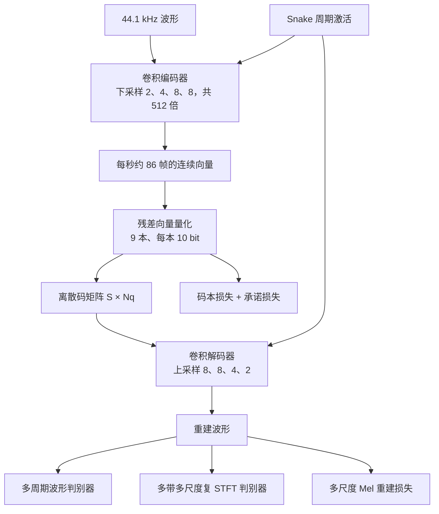

# DAC：通用音频要进语言模型，先得有一套不浪费码本的离散压缩

<!-- release-date: 2023-06-12 -->

> 本文依据 Descript, Inc. 的 **High-Fidelity Audio Compression with Improved RVQGAN**，arXiv:2306.06546v2（2023-10-26 修订），NeurIPS 2023，共 14 页。页码均指 PDF 自身的页码。文中区分三件事：**论文明确写了什么**（带页码）、**我们如何解释或验算它**（凡属推算、换算或读图都写明）、**哪些是外部资料补充**（给链接并标明）。

## 读之前：这篇会反复用到的词

这篇论文的门槛不在新网络骨架，而在「离散压缩为什么会悄悄失败」。先把词说成人话。

- **采样率**：一秒钟切成多少个波形点。CD 音质是 44.1 kHz，即每秒 44100 个点。论文要压的是这种全频带音频，不是电话音质。
- **码率（bitrate）**：压缩后每秒用多少 bit。8 kbps 就是每秒约 8000 bit。论文表里的码率是上限，因为同一套模型可以少用几层量化器、跑更低码率（PDF p. 3）。
- **Token（词元）**：语言模型一次读写的基本单位。音频这边，token 不是字，而是某一帧音频的一个离散编号。
- **码本（codebook）**：一本有限的「向量词典」。编码器给出一个连续向量，量化器在词典里找最近的那一条，只记下它的编号。10 bit 的码本有 1024 条。
- **向量量化（Vector Quantization，VQ）**：把连续向量换成码本里最近邻的那一条。
- **残差向量量化（Residual Vector Quantization，RVQ）**：第一本码本先给这一帧挑一个最近的码字，留下的误差交给第二本；第二本的误差再交给第三本。每本只记一个整数编号，各本码字加起来就是重建出的向量。多本叠起来，才能在不太长的序列上凑够码率。
- **码本崩溃（codebook collapse）**：词典里很多条目从来没被选中。标称码率按「本数 × 每本 bit 数」算，真正用上的 bit 却少一截。
- **量化器 dropout（quantizer dropout）**：训练时随机只用前几本码本，让同一套权重在推理时既能跑满码率，也能少用几本。
- **对抗训练**：生成器要骗过判别器。音频这边，判别器看的是波形或频谱，用来压人工痕迹。
- **Mel 谱 / STFT**：把波形变成「时间–频率」图。Mel 更接近人耳的频率刻度；STFT 幅度谱更直接，但丢掉了相位。
- **SI-SDR**（尺度不变信号失真比）：对缩放不敏感的波形误差。和谱距离一起看时，它反映相位重建得好不好（PDF p. 7）。

论文自己反复出现的五个名字：

- **Improved RVQGAN / DAC（Descript Audio Codec）**：这篇提出的通用神经音频压缩模型。论文正文叫 Improved RVQGAN，开源仓库和社区叫 DAC。
- **Snake 激活**：一种带周期项的激活函数（PDF p. 4）。
- **因式分解码本（factorized codes）**：查表在低维做，写回网络的嵌入仍是高维。
- **多带多尺度复 STFT 判别器**：在多个时间尺度上看复数频谱，并把频谱切成子带分别打分。
- **码率效率（bitrate efficiency）**：各码本在大测试集上的熵之和，除以全部码本的标称 bit 数。接近 100% 才算把标称码率用满（PDF p. 7）。

## 一句话先说清

音频语言模型不能直接吞波形。44.1 kHz 意味着每秒约 44100 个采样点，自注意力的开销随序列长度平方增长，付不起。于是要先把波形压成短得多的离散 token（PDF p. 1、p. 3）。

这条路上当时已有 SoundStream 和 EnCodec：卷积编解码器、RVQ、对抗损失，一个模型还能切几档码率。论文认为它们只部分满足需求，卡在三件事上（PDF p. 2、p. 4）：

1. GAN 生成的老毛病：音调伪影、音高与周期伪影、高频建不真，一听就知道不是原声；
2. 往往为语音或音乐单一领域定制，泛化到一般声音吃力；
3. 码本崩溃，标称码率没有真正用上。

DAC 的回答不是再发明一种量化器，而是把图像域已经验证过的码本技巧、声码器里已经验证过的周期先验与判别器设计，收成一套**单一通用**模型：

> **44.1 kHz 进，约 8 kbps 的离散 token 出，压缩约 90 倍；语音、音乐、环境音走同一套权重**（PDF p. 1）。

后文会把「90 倍」的算术摊开，也会说明 8 kbps 是上限，不是每一帧都正好 8000 bit。

这篇最值得记住的一句判断：

> **离散压缩的瓶颈，常常不是「码本太少」，而是「写在纸上的 bit 没有被用到」。先把码本用满，再谈对抗和重建。**

## 阅读路线

这是一篇技术论文，不是基模报告：没有大规模预训练 recipe，也没有推理服务。14 页里密度最高的是第 3 节的五处改法与第 4 节的消融、对照表。建议按这个顺序读：

1. **p. 2 的三条性质与五项贡献、p. 3 的 Table 1**：它要解决什么，压缩规格是什么；
2. **p. 4 的 Figure 1 与 Figure 2**：码本崩溃和量化器 dropout 的副作用，这两张图是全文的问题陈述；
3. **p. 5 的判别器与损失**：尤其是固定损失权重、不用 balancer；
4. **p. 6 的数据均衡采样与训练配方**；
5. **p. 7 的 Table 2**：逐项消融，每一行一次只动一个旋钮；
6. **p. 9 的 Table 3–4 与 Figure 3–4、p. 10 的 Figure 5**：与 EnCodec、Lyra、Opus 的对照，以及分领域听感；
7. **p. 14 的附录 A**：修改后的查表公式。

读表前先知道三件事：

- **对照数字全部以这份 PDF 为准**。Table 3、Table 4 里的 EnCodec、Lyra、Opus 数字，是作者用各家公开实现在自己的 3000 条测试集上跑的（PDF p. 8），不要去 EnCodec 论文里找对应数字；
- **Table 2 第一行不是最终模型**。它是消融基线，量化器 dropout 为 1.0；最终模型结构相同，只是 dropout 改成 0.5，并用更大 batch 训更久（PDF p. 6–7）；
- **MUSHRA 听感测试只和 EnCodec 比**，没有低通锚点，也没有把 Opus、Lyra 放进听感图（PDF p. 7、p. 9）。

## 旧矛盾：语言模型要离散 token，旧 codec 却既有伪影又浪费带宽

高分辨率音频难生成，是因为维度高，而且结构同时存在于很多时间尺度。常见做法是分两段：先预测某种中间表示（例如 Mel 谱），再从中间表示还原波形；或者用变分自编码器（VAE）把中间变量学出来（PDF p. 1）。

论文认为离散潜变量更合适：自回归的 Transformer 已经证明能在文本、图像、音频、音乐上建模任意复杂的离散分布。难的不是后面这一步，而是前面那一步——**怎么把波形变成既短、又真、又通用的离散码**（PDF p. 1–2）。它给压缩模型列了三条必须满足的性质（PDF p. 2）：

1. 高保真、少伪影；
2. 高压缩，并在时间上大幅下采样，丢掉听不出的细节、留下高层结构；
3. 单一模型覆盖语音、音乐、环境音，以及不同编码格式（如 mp3）和不同采样率。

SoundStream 与 EnCodec 都走 VQ-GAN 路线：全卷积编解码器、RVQ、对抗损失加多尺度谱重建。它们部分满足这三条，但有上面说的三类失败。于是矛盾可以收成一句：

> 下游已经准备好用语言模型建模离散码；上游 codec 却既听得出假，又把写在规格表上的 bit 浪费掉。

DAC 不另起炉灶。它沿用 SoundStream 的全卷积编解码器和 RVQ，改的是激活函数、查表方式、dropout、判别器和损失权重（PDF p. 3）。

## 先看全景：一条卷积、一套 RVQ、两路判别器

*图：根据第 3 节与 §4.3（PDF p. 3–6）重画的机制示意，不是原文图，也不含实测时延。*

人话版流水线四步：

1. 编码器把波形在时间上压 512 倍，44.1 kHz 变成每秒约 86 帧；
2. 每一帧用 9 本 10 bit 码本做残差量化，得到 9 个离散编号；
3. 解码器按相反的步幅把编号还原成波形；
4. 训练时，多尺度 Mel 重建、对抗、特征匹配、码本损失一起拉，权重写死。

编解码器的基本块是：一层带步幅的卷积（上采样或下采样），后接由卷积与 Snake 交替组成的残差层。解码器宽度 1536，全模型 76M 参数，编码器 22M、解码器 54M；消融里还试过解码器宽度 512（31M）和 1024（49M）（PDF p. 6）。论文没有画网络结构图，也没有写每层通道数。

## 8 kbps 和约 90 倍：口径先算清楚

Table 1 把压缩规格摊成一行（PDF p. 3）：

| Codec | 采样率（kHz） | 目标码率（kbps） | 步幅 | 帧率（Hz） | 10 bit 码本数 | 压缩倍数 |
|---|---:|---:|---:|---:|---:|---:|
| Proposed | 44.1 | 8 | 512 | 86 | 9 | 91.16 |
| EnCodec | 24 | 24 | 320 | 75 | 32 | 16 |
| EnCodec | 48 | 24 | 320 | 150 | 16 | 32 |
| SoundStream | 24 | 6 | 320 | 75 | 8 | 64 |

符号按正文：采样率 $f_s$，编码器步幅 $M$，RVQ 层数 $N_q$，帧率 $S = f_s / M$，离散码矩阵形状 $S \times N_q$（PDF p. 3）。

**本文验算**，这些数是怎么对上的。步幅 $2\times 4\times 8\times 8 = 512$，与配方一致（PDF p. 6）；$44100 / 512 = 86.13$，表里取整成 86 Hz。一本 10 bit 码本每帧记 10 bit，9 本就是每帧 90 bit，于是：

$$
86\times 9\times 10=7740\ \text{bit/s}
$$

约 7.74 kbps，论文写成 8 kbps，并明说表里的目标码率是上限（PDF p. 3）。压缩倍数对的是未压缩 PCM。论文没写「按 16 bit 采样算」，但 91.16 正好对得上：

$$
\frac{44100\times 16}{86\times 9\times 10}=\frac{705600}{7740}\approx 91.16
$$

摘要写「约 90 倍、8 kbps」，Table 1 写 91.16，两者不是两套实验，只是摘要取整。若分母直接用 8000 bit/s，会得到 88.2 倍，那是另一种口径，不是表内数字。

帧率为什么重要：在这些码上训语言模型时，序列长度随帧率走，论文明说低帧率更可取（PDF p. 3）。DAC 的 86 Hz 并不比 EnCodec 24 kHz 版的 75 Hz 低，它的优势在于 9 本而不是 32 本、采样率 44.1 kHz 而不是 24 kHz。论文的比较点是：**压缩倍数更高，音质还更好**（PDF p. 3）。

Table 3 里 Proposed 的 1.78 / 2.67 / 5.33 / 8 kbps，正文没写各用了几本。**本文按码本数折算**：$\frac{2}{9}\times 8 \approx 1.78$，$\frac{3}{9}\times 8 \approx 2.67$，$\frac{6}{9}\times 8 \approx 5.33$，满 9 本对应 8。这与「只用前 $n$ 本」的用法一致，但属于推算，不是表注。

## 核心设计一：Snake，先把周期先验写进激活

### 旧问题

波形——尤其是浊音和乐音——周期性很强。非自回归的生成器已经能出高保真音频，但常出现刺耳的音高与周期伪影；Leaky ReLU 这类常见激活不擅长外推周期信号，音频合成的分布外泛化也差（PDF p. 3–4）。

### 新设计

把生成器里的激活换成 Snake。它由 Liu 等人提出，BigVGAN 引入音频领域（PDF p. 4）：

$$
\mathrm{snake}(x)=x+\frac{1}{\alpha}\sin^{2}(\alpha x)
$$

$\alpha$ 控制周期分量的频率。读这个式子要看两点：线性通路 $x$ 还在，信号可以原样过；另外叠加一项有频率的起伏，网络不必全靠权重去拟合振荡。

### 收益

Table 2 里，其余都不变、只把 Snake 换回 ReLU：Mel 距离从 1.09 升到 1.17，ViSQOL 从 3.96 降到 3.83，SI-SDR 从 9.12 掉到 6.92，码率效率仍是 99%（PDF p. 7）。论文说这是架构消融里影响最大的一项，与 BigVGAN 的观察一致：周期先验有助于波形生成（PDF p. 7）。解码器宽度的影响小得多：1024 与基线几乎一样，512 各项略差（PDF p. 7）。

### 代价与边界

Snake 不解决码本崩溃。同样 99% 的码率效率下，它主要改的是 SI-SDR，也就是波形与相位，不是「码本有没有用满」。论文没写 $\alpha$ 是标量还是按通道学习。

### 可迁移启发

生成对象本身有强周期时（语音、乐音、振动信号），先问激活函数有没有把「会振荡」写进归纳偏置，再去加判别器。

## 核心设计二：残差量化怎么工作，以及码本崩溃怎么治

### 人话版 RVQ

*图：本文按第 3 节、§3.2–3.3、§4.3 与附录 A（PDF p. 3–6、p. 14）重画的机制示意。*

把一帧编码器输出想成一个高维向量 $z$。第一本码本从 1024 个候选里挑一个最近邻，这一下通常只抓得住最粗的结构，留下误差。第二本不去量化 $z$，去量化这份误差；第三本再量化新的误差。九本叠完，各本码字加起来就是重建：

$$
\hat z \approx \hat z_1+\hat z_2+\cdots+\hat z_{9}
$$

每一本只记一个 0–1023 的整数，一帧 9 个整数，就是下游语言模型要建模的那一列 token。

论文还观察到：RVQ 加上量化器 dropout 之后，码会按「从最重要到最不重要」排列。只用前几本重建，能听到粗结构；每加一本，细节就多一些。作者认为这对在码上训练分层生成模型有用，比如把前几本当「粗 token」、后几本当「细 token」（PDF p. 5）。点名的下游是 AudioLM、MusicLM 一类分层音频语言模型和 VALL-E 这类 codec 语言模型（PDF p. 3、p. 5）；那些工作自己的结果不在本篇。

### 旧问题：标称码率是假的

朴素的 VQ-VAE 很容易码本崩溃：初始化不好，一大部分码字从未被选中。有效码本变小，等于悄悄降低了目标码率，重建随之变差（PDF p. 4）。近期音频 codec 的补丁是 k-means 初始化码本，再对长期不用的码字做随机重启。论文发现，即便用了这套方法，24 kbps 的 EnCodec，以及用同一套方法学码本的 DAC 变体（Proposed w/ EMA），码本利用率仍然不足（PDF p. 4）：

*图：原文 Figure 1（PDF p. 4）。纵轴是每个码本在大测试集上的使用熵（bit），10 bit 码本的上限是 10；横轴是码本序号。*

图上读得出、但数值是我们读图估的：9 本的 Proposed 除第 1 本约 9.7 bit 外，其余都在 9.9 bit 以上；Proposed（24 kbps）画了 28 本，几乎都贴着 10 bit，最后一本回落到约 9.8；Proposed w/ EMA 同样只有 9 本，在第 6 本附近达到约 9.9 后回落，第 9 本约 9.55；EnCodec 的 32 本在第 6 本附近约 9.65，之后一路下滑，末尾约 8.75，中间第 18 本附近还有一个约 8.9 的深谷。所有模型的第 1 本都比后面几本低。

**我们如何解释它**：DAC 24 kbps 画了 28 本，正好对上 $86 \times 28 \times 10 \approx 24$ kbps（这个乘法是本文所做，论文没写 24 kbps 版用几本）。EnCodec 的后半程下滑说明，它在 24 kbps 下有相当一部分标称 bit 是空的。

### 新设计：低维查表，高维写回

补丁来自图像域的 Improved VQGAN，不是音频论文内部发明。两招（PDF p. 4）：

1. **因式分解码本**：把「查表」和「码字嵌入」解耦。查表在低维（8 维或 32 维）做，码字嵌入仍在高维（1024 维）。论文给的直觉是：只用输入向量里最能解释方差的主成分去找邻居；
2. **L2 归一化**：编码向量与码字都先归一化，欧氏距离于是变成余弦相似度，训练更稳、质量更好。

这样一来，只用原始 VQ-VAE 的码本损失与承诺损失就能训练，不再需要 k-means 初始化和随机重启，实现也更简单；梯度用直通估计穿过查表（PDF p. 4–5）。

附录 A 把修改后的量化写成（PDF p. 14）：

$$
z_q(x)=W_{\mathrm{out}}\,e_k,\qquad
k=\arg\min_j\bigl\|\ell_2(W_{\mathrm{in}}z_e(x))-\ell_2(e_j)\bigr\|_2
$$

$z_e(x)$ 是编码器输出；$W_{\mathrm{in}}$ 把它投到码本维度 $M$，在那里与 L2 归一化后的码字 $e_j$ 比距离；选中的码字再由 $W_{\mathrm{out}}$ 投回编码器维度 $D$，且 $M \ll D$。论文把形状写成 $W_{\mathrm{in}}\in\mathbb{R}^{D\times M}$、$W_{\mathrm{out}}\in\mathbb{R}^{M\times D}$；按式中左乘的写法，更自然的形状应当反过来。这里按「低维查表、高维写回」理解机制，不把这处矩阵摆放当成可独立复现的实现细节。

损失是标准的两截（PDF p. 14）：

$$
L_{\mathrm{VQ}}
=\bigl\|\mathrm{sg}[\ell_2(z_{\mathrm{proj}}(x))]-\ell_2(e_k)\bigr\|_2^2
+\beta\bigl\|\ell_2(z_{\mathrm{proj}}(x))-\mathrm{sg}[\ell_2(e_k)]\bigr\|_2^2
$$

其中 $z_{\mathrm{proj}}(x) = W_{\mathrm{in}} z_e(x)$，$\mathrm{sg}$ 是 stop-gradient。第一项把码字拉向编码，第二项把编码拉向码字。附录只说 $\beta$ 是平衡两项的超参；§3.5 给出码本损失权重 1.0、承诺损失权重 0.25（PDF p. 5），按这个对应，$\beta$ 相当于 0.25，这是本文的对应，论文没有明写。

### 收益

Table 2 把两种码本学习方法放在一起（PDF p. 7）：EnCodec 那套 EMA 码本是 Mel 1.11、STFT 1.84、ViSQOL 3.94、SI-SDR 8.33、码率效率 97%；投影查表的基线是 1.09、1.82、3.96、9.12、99%。差距主要在 SI-SDR 和码率效率，与 Figure 1 一致。论文据此留下更简单的投影查表（PDF p. 8）。

查表维度本身很敏感（PDF p. 7，Table 2）：

| 查表维度 | Mel ↓ | STFT ↓ | ViSQOL ↑ | SI-SDR ↑ | 码率效率 ↑ |
|---:|---:|---:|---:|---:|---:|
| 2 | 1.44 | 2.08 | 3.65 | 2.22 | 84% |
| 4 | 1.20 | 1.89 | 3.86 | 7.15 | 97% |
| 8 | 1.09 | 1.82 | 3.96 | 9.12 | 99% |
| 32 | 1.10 | 1.84 | 3.95 | 9.05 | 98% |
| 256 | 1.31 | 1.97 | 3.79 | 5.09 | 59% |

8 维最好，2 维和 256 维都会让码率效率塌下去。论文给的机制是一条链：码率效率低 → 有效带宽低 → 生成器的建模能力变弱 → 判别器更容易「赢」→ 生成器学不会高音质（PDF p. 8）。

### 代价与边界

因式分解让实现更简单，但多了两张投影矩阵，查表维度成了新超参，而且不是越大越好：256 维的码率效率只有 59%，比完全关掉对抗训练（62%）还低。这说明「表示更宽」和「查表更好」不是一回事。

### 可迁移启发

任何 VQ 模型都可以先画一张「每本码本的熵」。后面几本掉下去时，先别急着加码本，先问查表空间是不是过高或过低。音频、图像、动作的 tokenizer 都适用。

## 核心设计三：量化器 dropout 改成掷硬币，而不是每步都丢

### 旧问题

SoundStream 引入量化器 dropout，好让单一模型支持多档码率：每个训练样本随机抽 $n \in \{1, 2, \ldots, N_q\}$，只用前 $n$ 本（PDF p. 4）。论文发现它有副作用——满码率时的重建质量变差：

*图：原文 Figure 2（PDF p. 4），横轴码率，纵轴 Mel 重建损失，右下角是 8 kbps 附近的放大。*

读图：概率 0（从不 dropout）在 1 kbps 附近的 Mel 损失约 3.6，远高于其余三条；概率 1.0（每个样本都 dropout）低码率最好，但放大图里满码率最差。

### 新设计

不是每个样本都 dropout，而是每个样本以概率 $p$ 启用这套「随机少用码本」的程序。论文发现 $p = 0.5$ 时，低码率几乎追平「总是 dropout」，满码率又缩小了与「从不 dropout」的差距（PDF p. 4）。Table 2 把 $p$ 写成数字（PDF p. 7）：

| dropout $p$ | Mel ↓ | STFT ↓ | ViSQOL ↑ | SI-SDR ↑ | 码率效率 ↑ |
|---:|---:|---:|---:|---:|---:|
| 0.0 | 0.98 | 1.70 | 4.09 | 10.14 | 99% |
| 0.25 | 0.99 | 1.69 | 4.04 | 10.00 | 99% |
| 0.5 | 1.01 | 1.75 | 4.03 | 9.74 | 99% |
| 1.0 | 1.09 | 1.82 | 3.96 | 9.12 | 99% |

这张表只量满码率，所以 0.0 最好。最终模型仍取 $p = 0.5$，理由很工程：0.0 在少用码本时重建很差，下游生成模型不好用（PDF p. 8）。

同表还有一行把最大码率提到 24 kbps（$p = 1.0$）：Mel 0.73、STFT 1.62、ViSQOL 4.16、SI-SDR 13.83，超过所有 8 kbps 配置。最终模型仍训 8 kbps，是为了把压缩率推到最高（PDF p. 7–8）。

这个设计后来被 Mimi 借去又改了一步：Mimi 训练时有一半序列完全不做量化、直接把连续嵌入交给解码器，而不是走满全部码本，见 Moshi 一篇。

### 可迁移启发

「一个模型覆盖多个预算」几乎总要在最高预算上付代价，不要默认「训练时随机掉层级」是免费的。先画预算–质量曲线，再决定以多大概率启用可变预算。

## 核心设计四：判别器听相位、听子带，而不只听幅度谱

### 旧问题

多尺度波形判别器（MSD）和多周期波形判别器（MPD）能抬高音质，但生成的频谱仍可能发糊，高频过度平滑。UnivNet 的多分辨率频谱判别器（MRSD）专治这个，BigVGAN 还发现它能减少音高与周期伪影。但它看的是幅度谱，丢掉了本可用来惩罚相位误差的信息；而且高采样率下，高频仍然难建（PDF p. 5）。

### 新设计

两路判别器一起用（PDF p. 5–6）：

- **MPD**：周期 $[2,3,5,7,11]$，来自 HiFi-GAN；
- **复数、多尺度、切子带的 STFT 判别器**：窗长 $[2048,1024,512]$，hop 为窗长的 1/4；子带边界 $[0.0,0.1,0.25,0.5,0.75,1.0]$，即 5 段。

复数频谱保留相位，判别器因此能惩罚相位误差。切子带的理由是：判别器能专门学某一段频率的特征，给生成器更强的梯度；这也有助于减轻混叠（PDF p. 5）。解码器的上采样层本身会引入明显的混叠伪影，分带判别器更容易抓住这些幅度很小的伪影（PDF p. 8）。对抗损失用 HingeGAN，外加判别器特征图上的 L1 特征匹配损失（PDF p. 5）。

### 收益，以及哪些数字几乎不动

Table 2 的判别器消融不要只看 Mel（PDF p. 7–8）：

- **关掉全部对抗、只留重建**：Mel 1.13、STFT 1.92、ViSQOL 4.12，谱距离变化不大；但 SI-SDR 掉到 **1.07**，码率效率掉到 **62%**。论文说这种音频有明显的嗡嗡声，因为没学会重建相位；
- **5 个子带收成 1 个**：SI-SDR 9.07，相对基线 9.12 只差一点，其余指标几乎持平。论文仍留下多带，因为看频谱图时高频混叠更少；混叠幅度小，客观指标几乎看不出；
- **把 MPD 换成 MelGAN 的单尺度波形判别器**：SI-SDR 8.51，论文因此保留 MPD。表里还有一行同时去掉 MPD、只留 5 带 STFT，SI-SDR 9.04，正文没单独讨论。

**我们如何解释它**：对抗训练在这里不只美化听感，关掉它，码率效率从 99% 掉到 62%——它也在逼码本把 bit 用满。

### 可迁移启发

客观谱距离可能「看起来还行」，而相位和码本利用率已经坏了。音频 tokenizer 的消融至少要同时看谱距离、波形误差、码本熵三类指标；只报 Mel，会把「没对抗」那一行误判成能用。

## 核心设计五：损失怎么加权，以及为什么不用 loss balancer

### 重建：多尺度 Mel，最短 hop 是 8

Mel 重建损失能稳住训练、加快收敛；多尺度谱损失则逼模型在多个时间尺度上对频率负责。DAC 把两件事合成一条：对窗长 $[32,64,128,256,512,1024,2048]$ 的 log-Mel 谱算 L1，hop 为窗长的 1/4，于是最短 hop 是 8。论文特别说，这个最短 hop 有助于建模音乐里很常见的极快瞬态（PDF p. 5）。

EnCodec 用类似的形式，但 L1、L2 都要，Mel 频带数固定为 64。DAC 认为固定频带数会在短窗上打出频谱空洞，于是频带数改成 $[5,10,20,40,80,160,320]$，与窗长一一对应，并「经人工检查确认无误」（PDF p. 5）。

消融里换成单尺度、大 hop 的 Mel 重建（80 个频带、窗长 512），SI-SDR 从 9.12 掉到 7.68（PDF p. 8）。论文接着说「主观上，这个模型对镲片、蜂鸣与警报、歌声这类声音捕捉得好得多」，指代并不清楚；从上下文「低 hop 重建对快速瞬态和高频至关重要、最终保留多尺度 Mel」来看，更可能说的是保留多尺度的模型（PDF p. 8）。

### 码本

仍是原始 VQ-VAE 的码本损失加承诺损失，带 stop-gradient，直通估计回传（PDF p. 5）。

### 固定权重，不用 balancer

权重是（PDF p. 5）：

| 项 | 权重 |
|---|---:|
| 多尺度 Mel | 15.0 |
| 特征匹配 | 2.0 |
| 对抗 | 1.0 |
| 码本 | 1.0 |
| 承诺 | 0.25 |

HiFi-GAN、BigVGAN 里 Mel 损失常用 45.0。论文说自己只是按多尺度的份数和 $\log_{10}$ 底数做了缩放，并**明确不用 EnCodec 那种按判别器梯度尺度自动调权重的 loss balancer**（PDF p. 3、p. 5）。

相关工作一节把与 EnCodec 的关键差异归成三条：Snake 周期先验、低维投影查表、固定权重的稳定配方。作者认为这些改动让有效带宽接近最优，因而能在约三分之一的码率上超过 EnCodec（PDF p. 3）。这里的「3 倍」指 8 kbps 对 24 kbps，不是听感分的 3 倍。

### 可迁移启发

多目标 GAN 不一定要上自适应 balancer。先把各项损失的数值尺度对齐（这里是 Mel 的尺度份数与对数底），再把权重写死，Table 2 那种一次改一个旋钮的消融才归因得清。

## 数据与训练：全频带不是重采样到 44 kHz 就完了

### 数据从哪来

训练数据按三个领域拼（PDF p. 5–6）：

- 语音：DAPS、DNS Challenge 4 的干净语音、Common Voice、VCTK；
- 音乐：MUSDB、Jamendo；
- 环境音：AudioSet 的 balanced 与 unbalanced 训练段。

全部重采样到 44 kHz。训练时切短片段，响度归一到 −24 dB LUFS；唯一的数据增强是对片段做均匀随机的整体移相。测试集是 3000 条 10 秒片段，三领域各 1000 条：AudioSet 评估段、DAPS 留出的两位说话人（F10、M10）、MUSDB 测试划分（PDF p. 6）。论文没写总时长，也没写各语料的采样比例。

### 均衡采样要解决的是「平均真实带宽」

文件头写着 44 kHz，不等于内容里真有 22.05 kHz 的能量。语音尤其如此，Common Voice 的真实采样率常常只有 8–16 kHz。作者发现：直接在这种真实带宽参差的数据上训练，模型往往重建不出某个频率以上的内容，而那个阈值正好对应数据集的平均真实采样率（PDF p. 6）。

做法（PDF p. 6）：

1. 把数据源分成两类：确认在目标奈奎斯特频率 22.05 kHz 以内都有能量的全频带源，以及不确定最高频率的源；
2. 每个 batch 保证抽到全频带样本；
3. 每个 batch 里语音、音乐、环境音的条数相等。

去掉均衡采样：Mel 仍是 1.09，但 STFT 从 1.82 升到 1.94，ViSQOL 3.89，SI-SDR 8.89。经验上，这时模型输出的最高频率约 18 kHz，正好是 MPEG 一类有损编码常保留的上限，而这类编码占了数据的绝大部分。加上均衡采样后，全频带和带宽受限的音频都能重建（PDF p. 7–8）。

### 训练配方

消融模型：batch 12，训 25 万步，单卡约 30 小时。最终模型：batch 72，训 40 万步。片段长度 0.38 秒。生成器与判别器都用 AdamW，学习率 $1\times 10^{-4}$，$\beta_1 = 0.8$，$\beta_2 = 0.9$，每步按 $\gamma = 0.999996$ 衰减（PDF p. 6）。

**本文验算**：0.38 秒在 44.1 kHz 下约 16758 个采样点，按 512 倍下采样约 33 帧。对抗训练看的是很短的片段，这解释了消融能在单卡上转起来。论文没写 GPU 型号，也没写最终模型的训练时长。

## 实验怎么证明

### 指标在测什么

客观五项（PDF p. 6–7）：

| 指标 | 它实际在看 |
|---|---|
| ViSQOL | 用与原声的谱相似度估计听感 MOS，需要参考信号 |
| Mel 距离 | 与训练时同一套多尺度 log-Mel 配置 |
| STFT 距离 | 窗长 2048 与 512 的对数幅度谱，比 Mel 更能反映高频 |
| SI-SDR | 波形误差，和谱距离一起看时反映相位 |
| 码率效率 | 大测试集上各码本熵之和 / 全部码本的标称 bit |

主观测试是类 MUSHRA：有隐藏参考，没有低通锚点。10 名专家听众，每人评 12 条随机抽取的 10 秒样本，三领域各 4 条。比较的是 Proposed 的 2.67 / 5.33 / 8 kbps 与 EnCodec 的 3 / 6 / 12 kbps（PDF p. 7）。

### 消融：最终模型站在哪一行

Table 2 第一行是消融基线：解码器宽度 1536、Snake、MPD、5 带 STFT、多尺度 Mel、查表 8 维、投影码本、dropout 1.0、8 kbps、均衡采样，指标 1.09 / 1.82 / 3.96 / 9.12 / 99%（PDF p. 7）。把各行收成一张「动了什么、伤了什么」：

| 改动 | 主要伤到的指标 | 论文给出的机制 |
|---|---|---|
| ReLU 替换 Snake | SI-SDR 9.12 → 6.92 | 缺少周期先验 |
| 关掉全部对抗 | SI-SDR 1.07，效率 62% | 没学会相位，码本也没用满 |
| 单尺度大 hop Mel | SI-SDR 7.68 | 快速瞬态与高频 |
| 查表 2 维或 256 维 | 效率 84% / 59% | 有效带宽下降，判别器压过生成器 |
| EMA 码本 | SI-SDR 8.33，效率 97% | 后面几本仍利用不足 |
| 总是 dropout（1.0 对 0.0） | 满码率 SI-SDR 9.12 对 10.14 | 可变码率的代价 |
| 去掉均衡采样 | STFT 1.94、SI-SDR 8.89，高频止于约 18 kHz | 平均真实带宽把模型带偏 |

（整理自 Table 2 与 §4.5，PDF p. 7–8，不是另一次实验。）

### 主对照：不要去 EnCodec 论文里找这些数字

Table 3 是作者用公开实现对 EnCodec、Lyra、Opus 做的客观评估，测试集是上面那 3000 条（PDF p. 8–9）。带宽列是各系统能表示的最高频率；表里的 Lyra 引用的是 SoundStream 论文。

| 系统 | 码率（kbps） | 带宽（kHz） | Mel ↓ | STFT ↓ | ViSQOL ↑ | SI-SDR ↑ |
|---|---:|---:|---:|---:|---:|---:|
| Proposed | 1.78 | 22.05 | 1.39 | 1.95 | 3.76 | 2.16 |
| Proposed | 2.67 | 22.05 | 1.28 | 1.85 | 3.90 | 4.41 |
| Proposed | 5.33 | 22.05 | 1.07 | 1.69 | 4.09 | 8.13 |
| Proposed | 8 | 22.05 | 0.93 | 1.60 | 4.18 | 10.75 |
| EnCodec | 1.5 | 12 | 2.11 | 4.30 | 2.82 | −0.02 |
| EnCodec | 3 | 12 | 1.97 | 4.19 | 2.94 | 2.94 |
| EnCodec | 6 | 12 | 1.83 | 4.10 | 3.05 | 5.99 |
| EnCodec | 12 | 12 | 1.70 | 4.02 | 3.13 | 8.36 |
| EnCodec | 24 | 12 | 1.61 | 3.97 | 3.16 | 9.59 |
| Lyra | 9.2 | 8 | 2.71 | 4.86 | 2.19 | −14.52 |
| Opus | 8 | 4 | 3.60 | 5.72 | 2.06 | 5.68 |
| Opus | 14 | 16 | 1.23 | 2.14 | 4.02 | 8.02 |
| Opus | 24 | 16 | 0.88 | 1.90 | 4.15 | 11.65 |

读这张表的三条边界：

1. **8 kbps 的 DAC 对 24 kbps 的 EnCodec**：Mel 0.93 对 1.61，STFT 1.60 对 3.97，ViSQOL 4.18 对 3.16，SI-SDR 10.75 对 9.59，带宽还是 22.05 kHz 对 12 kHz。这就是「三分之一码率仍然超过」的主证据（PDF p. 3、p. 9）；
2. **Opus 24 kbps 并非每一格都输**。它的 Mel 0.88、SI-SDR 11.65 优于 DAC 8 kbps 的 0.93 与 10.75；DAC 赢在 STFT、ViSQOL，以及 22.05 kHz 对 16 kHz 的带宽。论文的总括句是「在所有码率上，客观与主观指标都超过全部对手，同时建模宽得多的 22 kHz 带宽」（PDF p. 8），但主观图里根本没有 Opus；
3. Lyra 9.2 kbps 的 SI-SDR 是 −14.52，带宽只有 8 kHz，和全频带 DAC 不是同一类重建任务。

*图：原文 Figure 3（PDF p. 9），阴影是 95% 置信区间；图上没有打印数值，上面的分数是读图估计。*

Proposed 在每个码率上都高于 EnCodec，但 8 kbps 仍明显低于参考。论文自己写：即便最高码率也没达到参考，还有改进空间；最终模型的指标仍低于消融里那个 24 kbps 模型，剩下的差距也许能靠提高最大码率补上（PDF p. 9）。

### 对齐 EnCodec 的配置：把采样率也改成 24 kHz

为了排除「你只是采样率更高」的解释，作者按 EnCodec 的规格再训了一套：24 kHz、24 kbps、步幅 320、32 本 10 bit 码本（PDF p. 9）。

| 系统 | 码率（kbps） | 带宽（kHz） | Mel ↓ | STFT ↓ | ViSQOL ↑ | SI-SDR ↑ |
|---|---:|---:|---:|---:|---:|---:|
| Proposed@24kHz | 1.5 | 12 | 1.48 | 2.24 | 4.04 | 0.32 |
| Proposed@24kHz | 3 | 12 | 1.24 | 2.01 | 4.23 | 4.44 |
| Proposed@24kHz | 6 | 12 | 1.00 | 1.78 | 4.38 | 8.44 |
| Proposed@24kHz | 12 | 12 | 0.74 | 1.54 | 4.51 | 12.51 |
| Proposed@24kHz | 24 | 12 | 0.49 | 1.33 | 4.61 | 16.40 |
| EnCodec | 1.5 | 12 | 1.63 | 2.69 | 3.98 | 0.02 |
| EnCodec | 3 | 12 | 1.46 | 2.54 | 4.16 | 2.99 |
| EnCodec | 6 | 12 | 1.30 | 2.39 | 4.30 | 6.06 |
| EnCodec | 12 | 12 | 1.15 | 2.28 | 4.39 | 8.44 |
| EnCodec | 24 | 12 | 1.05 | 2.21 | 4.42 | 9.69 |

（PDF p. 9，Table 4。）同一带宽、同一码率下，24 kbps 的 SI-SDR 是 16.40 对 9.69，Mel 0.49 对 1.05。这是同规格下的配方差距，比 Table 3 更干净。

Figure 4 是同规格下的听感，图注说所有样本都重采样到 24 kHz 比较，Proposed 全程高于 EnCodec（PDF p. 9）。有一处对不上：图中 Proposed 的三个点位于约 2.67、5.33、8 kbps，正是 44.1 kHz 模型的码率档，而不是 Table 4 的 1.5 / 3 / 6 / 12 / 24 kbps。论文没有解释这组点来自哪个模型，所以 Figure 4 能否算作「同规格听感」的证据要打个问号。

### 分领域：语音最好，环境音和音乐差距更大

Figure 5 把 MUSHRA 按语音、音乐、环境音拆开（PDF p. 10）。下表是读图估计，图上没有打印数值：

| 领域 | 参考 | Proposed 2.67 / 5.33 / 8 kbps | EnCodec 3 / 6 / 12 kbps |
|---|---:|---|---|
| 语音 | 约 83 | 约 51 / 68 / 74 | 约 18 / 26 / 34 |
| 音乐 | 约 83 | 约 44 / 64 / 66 | 约 24 / 33 / 40 |
| 环境音 | 约 81 | 约 36 / 59 / 65 | 约 27 / 40 / 45 |

三个领域里 Proposed 都高于 EnCodec；语音离参考最近，8 kbps 时差约 9 分，音乐与环境音都差十五六分。环境音还有两处特别：Proposed 在最低码率时最弱，EnCodec 反而在这一领域得分最高，两者在低码率端的置信区间接近重叠。论文把这写成限制：三领域都超过对手，但语音最好、环境音问题更多；钟琴与合成器一类乐器也建不完美（PDF p. 10）。分领域的客观指标论文没有给。

## 开源了什么，论文之后多了什么

论文承诺开源代码、模型与试听样本（PDF p. 2、p. 10），脚注给出代码仓 `https://github.com/descriptinc/descript-audio-codec` 与试听页（PDF p. 2）。

**以下是外部补充，不是 PDF 正文**。官方仓库在 2023-06-12 公开训练与推理代码，并在 Release [`0.0.1`](https://github.com/descriptinc/descript-audio-codec/releases/tag/0.0.1) 放出 44.1 kHz、8 kbps 的权重。之后 2023-06-21 的 `0.0.4` 加了 24 kHz 权重，2023-07-05 的 `0.0.5` 加了 16 kHz 权重，2023-07-20 的 `1.0.0` 另挂 44 kHz、16 kbps 权重。16 kbps 变体与 16 kHz / 24 kHz 权重都不在这份 PDF 的实验里；PDF 只在消融中出现过 24 kbps，以及 Table 4 的 24 kHz 对齐配置。不要用今天仓库里的型号表去改写 Table 1。

后来的工作把 DAC 当作对照基线：Moshi 论文把它（称 RVQGAN）截到前两层、1.5 kbps 与自家的 Mimi 比听感，又用它公开的 16 kHz 权重测试水印能否扛过压缩，见 Moshi 一篇。

## 限制、未公开，以及不要过度解读的地方

论文自己写下的限制（PDF p. 10）：

- 让全频带生成更容易，也让深度伪造更容易。作者提到可以加水印，或训练一个判断「是否经过本 codec」的分类器，但文中都没做；
- 重建不完美：环境音问题更多，钟琴、合成器一类乐器建不好；
- 8 kbps 的听感仍低于参考；消融里 24 kbps 更好，暗示缺口可能来自码率不够，而不是结构到顶（PDF p. 9）。

论文没有公开、因而不能当作有的：

- 训练总时长、各语料的精确配比、GPU 型号与总卡时（只写了消融模型单卡约 30 小时）；
- 编码器每层通道数、Snake 的 $\alpha$ 是标量还是按通道学习；
- MUSHRA 的逐点分数（只有带置信区间的图）；
- 分领域的客观指标；
- 流式与因果性、延迟、实时因子、显存——论文沿用 SoundStream 的全卷积编解码器，但没有说自己的卷积是否因果，也没有测流式；
- 在 AudioLM、MusicLM、VALL-E 上替换 tokenizer 的实验。相关工作只说「可以直接替换」，没有下游结果（PDF p. 3）。

Table 3 的 Opus 24 kbps 是一个提醒：只比 Mel 或只比 SI-SDR，传统 codec 在更窄的带宽上仍可能更好看。DAC 的主张绑定在「更宽的带宽 + 能进语言模型的离散 token」上，不是「任意码率、任意指标全面碾压」。

## 可迁移启发

**先测码本熵，再加层**。Figure 1 与码率效率把「标称 bit」和「有效 bit」拆开。tokenizer、MoE 专家、向量检索里的码本，都可以先画利用率。

**查表空间有甜区**。8 维优于 2 维，也优于 256 维。找最近邻的空间，不必等于下游要用的嵌入空间。

**对抗不只是为了好听**。关掉对抗，码率效率从 99% 掉到 62%。GAN 在这里也在给码本施加使用压力。

**可变预算要付代价**。dropout 从 1.0 改到 0.5，是承认「一个权重包打所有码率」会伤最高档；需要可变码率时，用概率启用，而不是每步都启用。

**标签采样率不等于内容带宽**。均衡采样是数据工程，不是模型结构。真实带宽参差的数据集，会把生成器的有效上限频率拉向平均值。

**权重可以写死**。把各项损失的尺度对齐后固定比例，不必上 balancer，消融才归因得清。

**客观指标要成套**。Mel 好看、SI-SDR 与熵已经坏掉，是「没对抗」那一行的教训。音频重建至少同时看谱、波形、码本三类指标。

## 关键词回看

- **Improved RVQGAN / DAC**：44.1 kHz、约 8 kbps、约 90 倍压缩的单一通用神经音频 codec。
- **RVQ**：一层一层量化残差；前几层管粗结构，后几层补细节。
- **码本崩溃**：码字闲置，有效码率低于标称码率。
- **因式分解码本 + L2 归一化**：低维（8 维）查表、高维写回，距离变成余弦。
- **Snake**：把周期写进激活函数。
- **量化器 dropout 概率 $p$**：最终取 0.5，在满码率与低码率之间折中。
- **多带复 STFT 判别器**：看相位、按子带打分、抓混叠。
- **多尺度 Mel，最短 hop 8**：为快速瞬态服务。
- **固定损失权重**：Mel 15、特征匹配 2、对抗 1、码本 1、承诺 0.25；不用 balancer。
- **码率效率**：各码本熵之和除以标称 bit，目标接近 100%。
- **均衡采样**：每个 batch 保证有全频带样本，三领域条数相等。

## 最后的判断

DAC 没有发明 RVQ，也没有发明对抗声码器。它盯住的是一句容易被「我们已经在用 EnCodec」盖过去的话：

> **离散 token 的质量，首先取决于这些 token 有没有把标称带宽用完；听感伪影，往往是利用率不足之后的表面症状。**

有表或图支撑的结论：

- 44.1 kHz、步幅 512、86 Hz、9 本 10 bit、压缩 91.16 倍（Table 1，PDF p. 3）；
- 投影查表让码本熵贴近 10 bit 上限，EMA 与 EnCodec 的后几本掉下去（Figure 1，Table 2 的 99% 对 97%，PDF p. 4、p. 7）；
- Snake 对 SI-SDR 的贡献大于改解码器宽度（Table 2）；
- 对抗训练同时决定相位与码率效率（「只留重建」那一行，PDF p. 7–8）；
- dropout 0.5 是满码率与低码率的折中（Figure 2 与 Table 2）；
- 8 kbps 的 DAC 在作者的测试集上客观超过 24 kbps 的 EnCodec；同一 24 kHz 规格下差距更大（Table 3–4，PDF p. 9）；
- 听感高于 EnCodec、低于参考，语音好于音乐与环境音（Figure 3、Figure 5，PDF p. 9–10）。

只是作者观察或定位的：

- 「可以直接替换 AudioLM、MusicLM、VALL-E 的 tokenizer」没有下游实验（PDF p. 3）；
- 「剩下的听感差距也许能靠提高最大码率补上」来自 24 kbps 消融更好，最终模型没做（PDF p. 9）；
- 多带判别器留下的理由主要是看频谱图，而不是客观表（PDF p. 8）；
- Figure 4 的码率点位与 Table 4 对不上，同规格听感的证据力有限。

如果只带走一条设计原则：

> **先让每一个标称 bit 真的被用到，再去调听感。查表空间、对抗压力、可变码率的代价和真实带宽的采样，是四件会偷走有效码率的事；DAC 的配方是把这四件分别钉死。**

## 资料与阅读边界

**原件与版本**：本地 `papers/Descript/DAC.pdf`，即 [arXiv:2306.06546](https://arxiv.org/abs/2306.06546) 的 v2（2023-10-26），14 页，页脚标注 NeurIPS 2023；v1 提交于 2023-06-11。截至核验，v2 是最新版。

**首发日**：`release-date` 取 2023-06-12，即官方仓库 [descriptinc/descript-audio-codec](https://github.com/descriptinc/descript-audio-codec) 公开代码、并在 Release `0.0.1` 放出 44.1 kHz 权重的日期（发布时间 2023-06-12 21:52 UTC）。这是模型首次可下载的日子；arXiv v1 的提交时间是 2023-06-11 00:13 UTC，那只是论文提交，当时权重尚未公开。Hugging Face 镜像仓库的创建时间不作为首发日。

**外部补充（不是 PDF 正文）**：

- 官方仓库各版本权重的发布时间见上文「开源了什么」；
- 试听页：[Descript Audio Codec](https://descript.notion.site/Descript-Audio-Codec-11389fce0ce2419891d6591a68f814d5)；
- 文中的码率、压缩倍数、片段帧数、24 kbps 版码本数等算式，以及 Figure 1、3、5 的数值，都是本文的验算或读图估计，论文没有打印这些数字。

**同方向对照**：更早的 SoundStream / EnCodec 路线（梯度 balancer、流式卷积）见 EnCodec 一篇；把 RVQ codec 做成 12.5 Hz、因果、带语义蒸馏的 Mimi，并以 DAC 为对照基线，见 Moshi 一篇。
