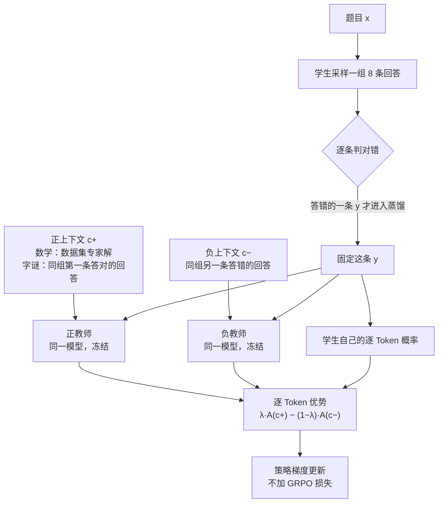

# 一拉一推：把自蒸馏里的「答对」和「姿态」拆开

<!-- release-date: 2026-09-18 -->

> 本文依据 ETH Zurich 与 Max Planck Institute for Intelligent Systems（MPI-IS）的 **On Repulsive and Attractive Teachers: Separating Correctness from Behavior in Self-Distillation**，作者 Anton Baumann、Akmal Ashirmatov、Leo Schmidt-Traub、Frederike Lübeck、Jonas Hübotter、Thomas Kleine Buening、Andreas Krause，arXiv:2609.21561v1，2026-09-18，共 16 页（正文 9 页、参考文献 2 页、附录 5 页）。页码均指 PDF 的物理页码。文中把三件事分开标：**论文明确写了什么**、**我们如何解释它**、**哪些是外部资料补充**。

## 读前先把几个词说成人话

这篇论文没有新架构，也没有大表格。它难读的地方在于：同一个「蒸馏信号」换个符号、换位老师，意义就完全变了。先把反复出现的词说清楚。

- **Rollout（采样回答）**：模型针对一道题自己写出的一整段回答。
- **RLVR（Reinforcement Learning with Verifiable Rewards，可验证奖励的强化学习）**：让模型答题，程序判对错，对的给奖励。一整段回答只换来 1 个标量，信息很稀。
- **GRPO（Group Relative Policy Optimization，组相对策略优化）**：RLVR 的主流做法，同一道题采多条回答，按组内相对好坏给整段回答打分。本文把它当基线。
- **同策略蒸馏（on-policy distillation）**：学生先自己答，老师再逐 Token 给学生这条回答打分。学生在自己真会走的路径上被纠正，而且每个 Token 都有信号（PDF p. 1）。
- **自蒸馏（self-distillation）**：老师和学生是**同一个模型**。老师之所以「更懂」，是因为它多看了一段学生看不到的**特权信息（privileged information）**，比如报错信息、参考答案或一条成功的尝试（PDF p. 1）。
- **SDPO（Self-Distillation Policy Optimization）**：本文沿用的自蒸馏基准做法，最小化学生与自教师之间的逆 KL 散度（PDF p. 4）。
- **行为偏移（behavioral shift）**：本文的核心概念。特权信息不只改变老师「知道什么」，还改变老师「怎么说话」：看过完整答案的老师更简短、更笃定，更少出现「等等，好像不对」这类检查与探索（PDF p. 1–2）。
- **思考模式（thinking mode）**：Qwen3 这类混合模型可以先在 `<think>…</think>` 里写推理再作答，也可以直接作答；关掉思考的办法是在提示末尾放一个空的 `<think></think>`（PDF p. 6）。

## 一句话先说清

自蒸馏的承诺很诱人：不需要更强的外部老师，让模型「偷看一眼答案」，它自己就能当老师，给每个 Token 一份稠密信号，比 GRPO 只给 1 个标量高效得多（PDF p. 1）。

麻烦在于，偷看过答案的老师不只是更「对」，还更「自信」。把这样的老师蒸馏给学生，学生学到的一部分是正确性，另一部分是「少犹豫、写短点」的说话姿态。推理任务上，后者会压掉探索和自我纠错（PDF p. 2、p. 4）。

已有的补救是反过来：远离看过正确答案的老师，也就是把 KL 从最小化改成最大化（AntiSD、Rebellious Student）。探索确实被鼓励了，但它们都还挂着一个 GRPO 损失兜住正确性，并且要额外的稳定机制（PDF p. 2）。

这篇论文做的是一次隔离实验：拿掉 GRPO，只看自蒸馏信号本身会做什么。它的全部主张画在一张示意图里：


这是作者画的概念图，不是实测，正文也说它只是示意（PDF p. 2）。两支箭头在横轴上方向相反、大小相近，纵向都朝上，相加后只剩竖直向上的正确性方向；红箭头外那一圈扇形，图注解释为「错的方式远比对的方式多」。

论文据此给出三条发现（PDF p. 2）：

1. **单独的排斥主要是在改行为。** 不论远离看了正确答案的老师，还是远离看了错误答案的老师，回答都会失控变长，最后因截断而崩溃。
2. **排斥带来的「提升」其实是误开了思考模式。** 从非思考模式出发，排斥把混合模型推回它本来就有的思考模式，但从没超过直接打开思考模式的基线。
3. **对比自蒸馏不靠 GRPO 也能稳。** 靠近「看了正确解」的老师、同时远离「看了错误解」的老师，两位老师共有的行为偏移大体抵消。它在非思考、纯指令、已在思考三种起点上都改善了推理表现，回答长度保持平稳。

### 一条阅读路线

如果只有半小时读原文，建议按这个顺序：

1. **p. 2 的 Figure 1**：一张二维示意图说完全文主张。
2. **p. 4–5 式 (3)–(8)**：Token 级优势换个符号就是排斥，两位老师相减就是对比；$\lambda=\tfrac12$ 时学生项精确消去。
3. **p. 3 的 Figure 2 与 p. 12 的 A.1**：排斥怎样误开思考模式，换一个没有思考模式的模型后提升就消失。
4. **p. 7–9 的 Figure 4–6**：三种起点上四个目标的对照。
5. **p. 12–14 附录 A.2、A.3**：Token 级信用分配重不重要（池化与打乱），特权上下文里要不要保留思考过程。

附录 B（p. 14–16）的超参表第一次可以只当对照尺。

## 主要矛盾：老师偷看答案之后，变的不只是「知道什么」

同策略蒸馏和自蒸馏流行起来，是因为它们把 RLVR「一整段回答 1 个奖励」换成了「每个 Token 1 个分数」（PDF p. 1）。论文举的背景包括 Thinking Machines Lab 的同策略蒸馏博客、Cursor 的 Composer 2.5 后训练，以及已部署模型的持续适配（PDF p. 1、p. 10）。

但自蒸馏的老师是「同一个模型 + 特权上下文」。特权上下文给得越完整，老师的行为偏得越厉害（PDF p. 2–3）：

- SDPO 原本适合代码反馈，因为报错信息只指出局部错误，不泄露完整解法；
- 把一份完整正确解放进上下文，老师会明显偏向简短笃定，压低不确定性表达、检查与探索，可能导致过度自信（PDF p. 2，引 Kim 等人 2026b）；
- Harne 等人 2026 发现，给更模糊的上下文（提示或通用技能）能减轻这种偏差，但信号也随之变弱（PDF p. 3）。

于是矛盾是：

> 特权信息越完整，老师越「对」，也越「自信」。蒸馏把两者一起传给学生。我们要前者、不要后者，而单一老师的信号拆不开它们。

AntiSD 与 Rebellious Student 的思路是「老师压制探索，那就反着学」。论文认为这个反转本身到底起了什么作用并没被看清：它们同时有 GRPO 在奖励「探索成功」的回答，AntiSD 还有一个按熵触发的门控来稳定训练（PDF p. 3）。你分不清提升来自反转信号还是来自 GRPO。

所以这篇论文要回答的问题更窄：拿掉 GRPO 以后，吸引和排斥各自改变的是推理**能力**，还是推理**行为**？

## 先看全景：一条回答，两位老师，逐 Token 相减



这张图按 PDF p. 4–5 的式 (1)–(8) 与 p. 6、p. 14 的上下文选择规则重画，是机制示意，不是论文原图。有三个细节容易漏：

- **老师不生成新回答。** 老师只在学生那条回答的每个位置上重算一遍下一 Token 分布（PDF p. 4）。
- **老师是冻结的。** 从起始 checkpoint 初始化，EMA 更新率为 0（PDF p. 15）。
- **只蒸馏答错的回答。** 三个目标都只蒸馏「两种上下文都找得到的错误回答」；只有一侧上下文的组直接跳过（PDF p. 6、p. 14）。

$\lambda$ 取三个值，就得到论文比较的三个目标（PDF p. 5、p. 16 Table 3）。表里后三列是逆 KL 口径下优势展开后三个对数概率各自的系数，由我们从式 (7) 展开得出：

| 目标 | $\lambda$ | 含义 | $\log p_+$ 系数 | $\log p_-$ 系数 | $\log p_S$ 系数 |
|---|---:|---|---:|---:|---:|
| Attractive（吸引） | 1 | 只靠近看了正确解的老师，即 SDPO | 1 | 0 | −1 |
| Repulsive（排斥） | 0 | 只远离看了错误解的老师 | 0 | −1 | +1 |
| Contrastive（对比） | 0.5 | 两者等权 | 0.5 | −0.5 | 0 |

三个目标都不含辅助 GRPO 损失，学习率同为 $5\times10^{-7}$（PDF p. 16 Table 3）。唯一例外是开篇的诊断实验（Figure 2）：那里的排斥对象是**看了正确解**的老师，用来复现 AntiSD 的排斥项（PDF p. 6、p. 12）。

## 地基：同策略自蒸馏怎么给一个 Token 打分

### 旧问题：标量奖励太稀

GRPO 对一整段回答只给 1 个分数，几千个 Token 里谁是功臣、谁是罪魁，它说不清。同策略蒸馏换了一种问法：让老师看着学生这条回答，逐个位置判断「这个 Token 我会不会这么写」。

### 新设计：学生和老师看同一段前缀，老师多看一段特权上下文

给定题目 $x$，学生采样一条回答 $y\sim\pi_\theta(\cdot\mid x)$。同一个模型多看一段特权上下文 $c$，就成了自教师。在第 $t$ 个位置，两者的下一 Token 分布是（PDF p. 4，式 1）：

$$
p_S^t=\pi_\theta(\cdot\mid x,\,y_{<t}),
\qquad
p_c^t=\pi_{\bar\theta}(\cdot\mid x,\,c,\,y_{<t})
$$

$\bar\theta$ 是老师参数，学生更新时视为常数。沿用 SDPO，训练目标是学生与老师逐位置逆 KL 散度之和（PDF p. 4，式 2）：

$$
\mathcal{L}_{\mathrm{SD}}(\theta;c)
=
\mathbb{E}_{y\sim\pi_\theta(\cdot\mid x)}
\Big[
\sum_{t=1}^{|y|}
D_{\mathrm{KL}}\big(p_S^t\,\|\,p_c^t\big)
\Big]
$$

### 工作机制：每个 Token 的优势就是一个对数概率比

逐 Token 的逆 KL 更新，可以写成「老师对学生的对数概率比」这样一个 Token 级优势（PDF p. 4，式 3）：

$$
A_t^{\mathrm{SDPO}}(c)=\log p_c^t(y_t)-\log p_S^t(y_t)
$$

人话版：老师比学生更愿意写出这个 Token，它就得到正优势、被强化；老师更不愿意写，它就被压低（PDF p. 4）。推导论文指向 Hübotter 等人 2026 的 SDPO。

**一个口径提醒。** 逆 KL 只是讲解用的。所有实验实际用的是「采样 Token 版广义 JSD」，混合系数 $\alpha=0.5$，按 Token 取平均，实现直接取自 SDPO 代码库（PDF p. 4、p. 15）。这个 JSD 变体的公式正文没有写出。下文凡是「优势等于某个对数比」的推导，都是逆 KL 口径下的直觉，不是实验里逐字使用的数值。

## 核心设计一：吸引与排斥，只差一个符号


### 旧问题：看过答案的老师，讨厌「等等」

Figure 3 里那句学生回答是一次自我纠错。看过完整解的老师知道正确路线，所以给「Wait」这种要回头检查的 Token 很低的概率；按式 (3)，这些 Token 得到负优势。吸引式蒸馏于是在逐 Token 层面系统地压掉犹豫、检查和换路（PDF p. 4）。

论文的判断是：更短的回答可能对知识型任务有利，但会伤害需要探索与自我纠错的推理任务（PDF p. 4）。

### 新设计：把 KL 从最小化改成最大化

吸引式最小化式 (2)，把学生拉向老师；排斥式最大化同一个散度，把学生推离老师。Token 级优势只差一个负号（PDF p. 4，式 4）：

$$
A_t^{\mathrm{attr}}(c)=A_t^{\mathrm{SDPO}}(c),
\qquad
A_t^{\mathrm{rep}}(c)=-A_t^{\mathrm{SDPO}}(c)
$$

老师越不喜欢的 Token，在排斥下越被奖励。这就是 Figure 3(b) 里同一批 Token 从红变蓝的原因。

### 收益与代价：它奖励的是「不像老师」，不是「更对」

收益是探索回来了，这正是 AntiSD 一类方法想要的。代价在 3.3 节被点破（PDF p. 5）：如果排斥主要起的是行为引导作用，那么远离一位看了**正确**答案的老师并不合理，因为你同时也在远离正确性；更合理的是远离一位看了**错误**答案的老师。

**我们如何解释它。** 把式 (4) 展开：$A_t^{\mathrm{rep}}=\log p_S^t(y_t)-\log p_c^t(y_t)$。它奖励的是「学生比老师更想写的 Token」，只说明这个 Token 偏离了老师的风格，不说明它更接近正确答案。上表最后一列也写出了这一点：排斥里学生自己的对数概率带 $+1$ 的系数，信号会反过来奖励学生本来就偏爱的写法。当偏离老师最便宜的方式是「多写一点、多犹豫一点」时，长度就会被一路推高。这是逆 KL 口径下的直觉，实验用的是 JSD 变体。

### 可迁移启发

反转一个信号之前，先确认它奖励的到底是什么。「远离某个分布」本身不带方向，方向要由别的东西（验证器、另一位老师）提供。

## 诊断：排斥「看起来有效」，其实是误开了思考模式


### 设定

起点是关掉思考模式的 Qwen3-4B，目标是远离一位**看了正确解**的老师，也就是 AntiSD 的排斥项，不加 GRPO（PDF p. 3、p. 6、p. 12）。图注没有单独写训练集；从 28k 训练上限和 A.1 把它当作与 5.2 节同设定的对照来看，应当也是 DeepMath 高难子集，这是我们的推断。

### 三个阶段说明了什么

图注把训练分成三段，用曲线颜色标出（PDF p. 3）：先是稳定期；然后模型进入思考状态，回答变长、开始输出思考标签；最后回答长度继续涨到上限，截断主导，训练崩溃。

值得注意的是第二段的细节：模板里已经放了空的 `<think></think>`，模型却**自己再输出一个 `</think>`** 才给最终答案（PDF p. 6）。这偏离了配置好的非思考行为，论文据此判断排斥重新激活了休眠的思考模式，并把它解释为「朝表达不确定、多探索的行为偏移」恰好唤醒了模型本来就有的推理能力（PDF p. 6）。

评测准确率在这一段跳升，但始终低于思考模式基线（读自 Figure 2，峰值约 66%、基线约 72%，PDF p. 3）。论文认为这支持「表面提升主要是找回了已有的推理先验」（PDF p. 6）。另外，评测曲线是每 10 步一个点连成的折线（A.1 的同类图 Figure 7 标出了点位，PDF p. 12），所以「峰值」只是第 20 步那一个采样点。

### 对照：换一个没有思考模式的模型，提升就消失了

为了区分「学到新能力」和「激活已有能力」，附录 A.1 在纯指令模型 Qwen3-4B-Instruct-2507 上重跑同一个目标，设定与 5.2 节完全相同（PDF p. 12）。原文 Figure 7 的关键数字已写在正文里，这里直接列表：

| 训练步 | 评测平均准确率 | 训练回答长度 |
|---:|---:|---|
| 0 | 63.8% | 3.8k Token |
| 10 | 63.6% | — |
| 20 | 64.2% | 9.3k Token |

数据均见 PDF p. 12。评测从未超过初始值；第 22 步之后截断比例飙升，第 29 步达到 100%，训练与评测准确率都塌到 0；全程没有任何回答输出思考标签（PDF p. 12）。Takeaway 4 说得很直接：没有休眠的思考模式可唤醒时，远离看了正确解的老师不带来任何提升，只会把回答拉长直到截断终结训练（PDF p. 12）。

**我们如何解释它。** 两组实验合起来，是对 AntiSD 类方法的一次拆解：在混合模型上，排斥信号的「收益」几乎都能归到误开思考模式；在纯指令模型上，它只剩长度膨胀。原方法里真正兜住正确性的，很可能是那个 GRPO 损失。这是基于隔离实验的推断，论文没有复现带 GRPO 的 AntiSD 做正面对照。

## 核心设计二：对比自蒸馏，让两位老师共有的偏移互相抵消

### 旧问题：单一老师的信号里，正确性和行为焊在一起

吸引信号 = 正确性 + 「变简短笃定」；排斥信号 = 「变啰嗦犹豫」 + 一个说不清的方向。只要只有一位老师，就无法把这两种成分拆开。

### 新设计：让两位老师都「看过一份解」，只在对错上不同

构造两个条件策略：一个看正确解 $c^+$，一个看错误解 $c^-$（PDF p. 5，式 5）：

$$
p_+^t=\pi_{\bar\theta}(\cdot\mid x,\,c^+,\,y_{<t}),
\qquad
p_-^t=\pi_{\bar\theta}(\cdot\mid x,\,c^-,\,y_{<t})
$$

论文的设想是：如果两份上下文在行为上相似，「看过一份完整解」带来的那部分行为偏移就是两位老师共有的；把负教师的信号从正教师里减掉，共有的偏移消掉，剩下的只和正确性有关（PDF p. 5）。这就是开篇 Figure 1 里两支斜箭头横向分量相消的意思。

每个前缀上的组合目标是（PDF p. 5，式 6）：

$$
\mathcal{L}_\lambda^t(\theta)
=
\lambda\,D_{\mathrm{KL}}\big(p_S^t\,\|\,p_+^t\big)
-
(1-\lambda)\,D_{\mathrm{KL}}\big(p_S^t\,\|\,p_-^t\big),
\qquad
\lambda\in[0,1]
$$

对应的 Token 级优势是两个 SDPO 优势之差（PDF p. 5，式 7）：

$$
A_t^{\mathrm{ctr}}
=
\lambda\,A_t^{\mathrm{SDPO}}(c^+)
-
(1-\lambda)\,A_t^{\mathrm{SDPO}}(c^-)
$$

### 工作机制：$\lambda=\tfrac12$ 时，学生自己的那一项精确消失

取平衡的 $\lambda=\tfrac12$，两个优势里的 $-\log p_S^t(y_t)$ 正好抵消（PDF p. 5，式 8）：

$$
A_t^{\mathrm{ctr}}
=
\tfrac12\big(A_t^{\mathrm{SDPO}}(c^+)-A_t^{\mathrm{SDPO}}(c^-)\big)
=
\tfrac12\log\frac{p_+^t(y_t)}{p_-^t(y_t)}
$$

读法：这个 Token 在「看了正确解」的老师眼里比在「看了错误解」的老师眼里更可能，就奖励；反之压低（PDF p. 5）。

论文在这里分清了两件事（PDF p. 5）：学生项的抵消是**精确**的，这是代数事实；老师行为偏好的抵消程度取决于这些偏好在两种上下文里有多「共有」，只能靠实验看。

**我们如何解释它。** 回看全景一节那张系数表：只有 $\lambda=\tfrac12$ 时，学生自己的对数概率从信号里完全消失，信号变成两位老师之间的纯对数比。$\lambda=1$ 残留 $-\log p_S^t$，那是 SDPO 本来的「拉向老师」；$\lambda=0$ 残留 $+\log p_S^t$，信号奖励学生本来就偏爱的 Token，和排斥里看到的自我强化式长度膨胀方向一致。这个一般 $\lambda$ 的展开是我们做的，论文只写了 $\lambda=\tfrac12$，也没有扫描其他取值。

Figure 1 那圈红色扇形也可以放进这个框架读：远离一个错误，可以走向无数个别的错误，所以单独的负教师不是一个有方向的信号。对比目标用正教师提供方向，用负教师扣掉行为偏移。

**外部补充。** 论文的伴随博客（链接见文末）用一个更小的例子讲同一件事：学生写出「2 + 2 = 5」，两位老师都因为看过一份解而偏爱「Final answer」、不爱「Let me think」；只有看了正确解的老师还额外压低最后那个 5、抬高 4。两者相减，前一种偏好抵消，只剩「5 改成 4」。这个例子不在 PDF 里。

### 收益与代价

收益在后面三组实验里：训练与评测都稳步提升，回答长度缓慢增长、远离上限。代价与边界有三条：

- 抵消的前提是两份上下文「行为上相似」。附录 A.3 显示，一旦正上下文换成风格不同的专家解，残留偏移会立刻显现（见下文）。
- 只有答错的回答产生信号，答对的回答对三个自蒸馏目标都不贡献梯度（PDF p. 14）。
- 需要两份上下文：正确解与另一条错误回答缺一不可，缺一侧的组直接跳过（PDF p. 6）。

### 和同类工作的边界

论文把自己放在两条线的交叉处（PDF p. 3、p. 5）：

| 工作 | 老师看什么 | 是否挂 GRPO | 论文怎么描述 |
|---|---|---|---|
| SDPO、SDFT、OPSD | 特权信息 | 相关工作未把它们归入混合类 | 用特权信息从学生自身构造老师 |
| RLSD | 特权信息 | 是 | 用老师信号给奖励驱动的更新重新加权 |
| SRPO | 特权信息 | 是 | 答对的样本走 GRPO，答错的走 SDPO |
| AntiSD、Rebellious Student | 正确解，反向 | 是 | 反转老师信号鼓励探索；AntiSD 另有熵触发门控 |
| CEPO、RLCSD | 正确解与错误解对比 | 是 | 用对比信号调制基于奖励的训练 |
| 本文 | 正确解与错误解对比 | **否** | 单独研究对比自蒸馏目标本身 |

「对的走 GRPO、错的走 SDPO」的路由思路见 SRPO 一篇；「给教师看答案到底多加了什么」的另一种对照实验，见 Privileged-Info-OPSD 一篇。

### 可迁移启发

想消掉一个共有偏差，就造一个只在目标维度上不同的对照。正负教师都「看过一份完整解」，区别只在对错；相减之后，「看过解」带来的风格被扣掉。这是差分设计的老思想，可以迁移到奖励模型去偏、LLM-as-judge 去长度偏好这类场景。

## 实验怎么搭：三个设定回答三个问题

论文把实验组织成三个问题（PDF p. 6）：非思考起点上各目标引起什么行为偏移（Q1）；没有思考模式的纯指令模型上对比还有没有效（Q2）；已经在思考的模型上还能不能再提升（Q3）。

| 设定 | 章节 | 模型 | 思考模式 | 训练任务 | 正上下文 | 负上下文 |
|---|---|---|---|---|---|---|
| 非思考数学 | 5.1 | Qwen3-4B | 关 | DeepMath 高难子集 | 数据集专家解，去掉思考过程 | 同组另一条错误回答，去掉思考过程 |
| 纯指令数学 | 5.2 | Qwen3-4B-Instruct-2507 | 无 | DeepMath 高难子集 | 同上 | 同上 |
| 已思考字谜 | 5.3 | Qwen3-4B | 开 | Reasoning Gym 的 Group Anagrams | 同组第一条答对的回答，保留思考过程 | 同组第一条答错且不是被蒸馏那条的回答，保留思考过程 |

设定来源见 PDF p. 6、p. 14、p. 16。Group Anagrams 要求把由相同字母组成的单词分组，例如 `[tea, bat, eat, tab]` 变成 `[[tea, eat], [bat, tab]]`（PDF p. 8 脚注 2）。

数学用六个基准的宏平均准确率：AIME24、AIME25、AIME26、AMC23、HMMT25、MATH-500；字谜按四个难度段评测（PDF p. 6）。回答预算：数学训练与评测 28k Token，字谜训练 24k Token（PDF p. 6）。论文同时跟踪回答长度、截断比例，以及混合模型的思考标签闭合比例，并与思考模式基线对比（PDF p. 6）。

## 结果一：非思考起点，对比稳步提升，排斥先冲后崩


这里的排斥对象已换成**看了错误解**的老师（PDF p. 6）。论文对四条曲线的描述：排斥把模型推进思考模式，评测急升但始终低于思考基线，长度不收敛、触及上限后截断崩溃；吸引训练准确率上升、评测基本持平、回答变短；对比训练和评测都稳步提升，长度缓慢增长、远低于上限（PDF p. 6–7）。

读这张图要多看两件事，都是我们的读法：

- **右下子图是这组实验的关键证据。** 对比目标的思考标签闭合比例全程贴着 0，说明它的提升不是靠误开思考模式得来的；而远离**错误解**老师的排斥同样误开了思考模式。这印证了「排斥引起的行为偏移不取决于老师看的是正确解还是错误解」（PDF p. 2）。
- **对比高于 GRPO，但仍明显低于直接打开思考模式**（读自 Figure 4）。Takeaway 1 只说它「提升表现并控制长度增长」，没有声称超过思考基线（PDF p. 7）。对一个本来就有思考模式的模型，最简单的做法仍是打开它。

## 结果二：纯指令模型，对比的收益不能归因于开思考


这个模型没有显式思考模式可以误开，所以是检验「对比的收益是不是只是开思考」的关键对照（PDF p. 7）。

论文的描述：排斥一开始训练和评测都上升，但伴随长度快速增长，最终触及预算、截断崩溃，而且全程没有任何一次运行输出 `<think>` 标签，这里的排斥只是拉长回答；吸引回答保持简短，训练准确率上升、评测基本不变；对比训练和评测全程提升，长度缓慢增长、远低于预算（PDF p. 7–8）。Takeaway 2：对比自蒸馏在没有思考模式可唤醒的模型上同样有效，收益超出了「切换进思考模式」（PDF p. 8）。

读图时要注意右上子图的纵轴从 60% 起、被放大了，曲线间的距离看着大，实际差距都在 10 个百分点以内。GRPO 在这个区间里来回起伏、最后一个评测点反而低于起点（读自 Figure 5）。

## 结果三：已在思考的模型，对比仍能再提升


这里思考从一开始就开着，「唤醒休眠模式」的解释彻底不成立（PDF p. 8）。

论文的描述：排斥前期提升速度与 GRPO 相当，但只维持到约第 12 步，之后长度快速增长、截断崩溃，即使模型已经在写思考过程，排斥仍在鼓励更长的回答；吸引回答变短，但和数学实验不同，这次训练和评测都提升，更短的回答在这个设定里不一定妨碍学习；对比训练和评测都稳步提升，长度缓慢增长、远低于上限，相对初始思考基线的提升说明它在已开思考时仍有效（PDF p. 8–9）。

这一组里对比与 GRPO 的评测曲线在后半段几乎重合（读自 Figure 6），对比没有明显胜出。

### 三个设定合起来怎么读

论文没有给任何数值结果表。下表最后三列是我们读 Figure 4–6 最后一个评测点的估计，只用于看相对位置：

| 设定 | 吸引 | 排斥 | 对比 | 评测终点：对比 / GRPO / 思考基线 |
|---|---|---|---|---|
| 非思考数学 | 训练升、评测平、回答变短 | 误开思考，冲高后截断崩溃 | 训练评测都升，长度缓增 | 约 56% / 约 50% / 约 72% |
| 纯指令数学 | 训练升、评测平、回答短 | 无思考标签，长度膨胀后崩溃 | 训练评测都升，长度缓增 | 约 71% / 约 62% / 无 |
| 已思考字谜 | 训练评测都升、回答变短 | 约第 12 步后截断崩溃 | 训练评测都升，长度缓增 | 约 76% / 约 77% / 约 47% |

定性结论来自 PDF p. 6–9。最后一列读自 Figure 4（p. 7）、Figure 5（p. 8）、Figure 6（p. 9），不是论文给出的数字。

## 附录 A.2：信号的价值在「落在哪个 Token 上」


### 要排除的怀疑

对比目标在已思考模型上也有效。一种可能是：它其实只是一个序列级的有符号信号，逐 Token 的分配无关紧要（PDF p. 12）。

### 做法：把优势在窗口里抹平

把每条回答切成连续 $w$ 个 Token 一窗，窗内取平均，再把平均值赋回窗内每个 Token（PDF p. 13，式 9）：

$$
\bar A_t^{(w)}=\frac{1}{|W_t|}\sum_{s\in W_t}A_s^{\mathrm{ctr}}
$$

$W_t$ 是包含位置 $t$ 的窗口。$w=1$ 就是原来的逐 Token 优势；另一个极端是整条回答共用一个标量，更新退化成序列级策略梯度（PDF p. 13，式 10）。$w$ 取 1、10、100、1,000 与整条回答，数据与目标不变（PDF p. 13）。

### 结果与那一刀对照

窗口越大学得越差：整条回答共用一个值时，50 步内训练得分没有任何提升；窗口 10 只比逐 Token 稍慢，准确率相近、回答更短（PDF p. 13）。

论文随即指出一个混淆：正负两项大量抵消，窗内平均优势本来就接近 0，池化可能只是在稀释信号（PDF p. 13）。为此加了一个更强的对照：**在每条回答内部随机打乱 Token 优势**，优势的分布不变，只是不再对齐产生它的 Token（PDF p. 13）。

| 第 50 步 | 训练准确率 | 训练回答长度 |
|---|---:|---:|
| 优势与 Token 对齐 | 85.5% | 12.2k Token |
| 回答内打乱 | 62.2% | 6.1k Token |

数据见 PDF p. 13。Takeaway 5：细粒度信用分配效果最好，两位老师提供的是「功劳该记在哪里」的信息，不只是一个序列级的有符号更新（PDF p. 13）。

**我们如何解释它。** 打乱对照是这篇论文里设计得最干净的一刀：保留优势的全部统计量，只破坏位置对应。85.5% 对 62.2% 的差距直接说明，对比信号的价值在「哪个 Token 该奖或罚」，而不在「整条回答总体是好是坏」，这也是它和 GRPO 的本质区别。另外，Figure 8 右幅纵轴的刻度标签看起来是按 2.5k 间隔取整后标的（「8k」处实为 7.5k），读长度时以正文数字为准。

## 附录 A.3：特权上下文里保不保留思考过程，决定模型想多久


5.3 节的字谜实验让两位老师都看模型自己的回答，并保留思考过程。附录分两步消融：先去掉特权上下文里的思考过程；再把正上下文换成数据集专家解（PDF p. 13）。三组在前 10 步思考长度都在 6.0k–6.2k Token，之后分道：保留思考的基线涨到约 12.8k，去掉思考缩到约 1.2k，换成专家解缩到约 0.6k（PDF p. 13–14）。截断解释不了这个差异：三组从未闭合思考块的比例都低于 2%，全程输出格式良好的 `<think>` 块（PDF p. 14）。

Takeaway 6（PDF p. 14）：特权上下文决定了模型推理多久。保留模型自己的思考过程，推理随训练变长，并给出最高的准确率；去掉它会把思考段压向 0；换成专家示范会加剧这一效果。

**我们如何解释它。** 这组消融直接触到对比目标的前提。3.3 节说共有偏移只在「两份上下文行为上相似」时才抵消（PDF p. 5）。字谜上正负上下文都是模型自己的带思考回答，风格最接近；一旦正上下文换成风格不同的专家解，两位老师对「要不要长篇思考」的偏好不再对称，残留偏移立刻显现为思考长度塌缩。回看数学设定：正上下文是专家解、负上下文是模型自己的回答，两者都去掉了思考过程，但来源不同，风格本来就不完全匹配（PDF p. 6、p. 14）。这可能是非思考数学设定里对比目标仍远低于思考基线的原因之一，属于我们的推测，论文没有做这个归因。

还有一个缺口：Takeaway 6 说保留思考「给出最高的准确率」，但 Figure 9 只画了思考长度和未闭合比例，附录里没有对应的准确率曲线或数字（PDF p. 14）。

## 训练配方：写得很全，可以照着复现

实现建在 SDPO 代码库上，训练用 verl，采样用 vLLM（PDF p. 15）。更新全部参数，优化器 AdamW，系数 $(0.9,\,0.999)$。每个采样批次 256 条回答（32 道题 × 8 条），分成 4 个 64 条的小批次。关闭熵正则和对参考策略的 KL 正则（PDF p. 15）。

三个自蒸馏设定的超参（Table 2，PDF p. 16）：

| 参数 | 非思考数学 | 纯指令数学 | 已思考字谜 |
|---|---|---|---|
| 模型 | Qwen3-4B | Qwen3-4B-Instruct-2507 | Qwen3-4B |
| 思考模式 | 关 | 关 | 开 |
| 训练题数 | 10,000 | 10,000 | 2,200 |
| 最大提示长度 | 4,096 | 4,096 | 4,096 |
| 最大训练回答长度 | 28,672 | 28,672 | 24,576 |
| 教师重提示预算 | 10,240 | 10,240 | 16,384 |
| 模型上下文上限 | 40,960 | 40,960 | 40,960 |
| 每批题数 / 每题采样 / 每小批题数 | 32 / 8 / 8 | 32 / 8 / 8 | 32 / 8 / 8 |
| 每批训练轮数 | 1 | 1 | 1 |
| 采样温度 / top-p / top-k | 1.0 / 1.0 / 关 | 1.0 / 1.0 / 关 | 1.0 / 1.0 / 关 |
| 散度 / JSD 混合系数 | JSD / 0.5 | JSD / 0.5 | JSD / 0.5 |
| 教师 EMA 更新率 | 0 | 0 | 0 |
| 蒸馏优势裁剪 | 无 | 无 | 无 |
| 重要性比裁剪 | 2.0 | 2.0 | 2.0 |
| 学习率 | $5\times10^{-7}$ | $5\times10^{-7}$ | $5\times10^{-7}$ |
| 预热步数 / 之后调度 | 10 / 恒定 | 10 / 恒定 | 10 / 恒定 |
| 权重衰减 / 梯度裁剪范数 | 0.01 / 1.0 | 0.01 / 1.0 | 0.01 / 1.0 |

GRPO 基线另有一套设置（PDF p. 15）：学习率 $2\times10^{-6}$；组相对优势不除以组内标准差，同 Dr. GRPO；非对称比率裁剪，下界偏移 0.2、上界偏移 0.28，同 DAPO；采用 SDPO 实现里的 Token 重要性采样校正，阈值 2.0。GRPO 的学习率是自蒸馏目标的 4 倍（PDF p. 15–16），论文没有解释这一差异，也没有给学习率扫描。

### 数据与上下文

- **DeepMath**：取 `zwhe99/DeepMath-103K` 训练集，以 `r1_solution_1` 为专家解；筛出难度至少 8 的题，用种子 0 打乱，去掉思考过程，核对专家答案，选出 10,000 道训练题，难度落在 8–10（PDF p. 14）。
- **Group Anagrams**：用 Reasoning Gym 每个难度段程序化生成 1,000 道题；用 Qwen3-235B-A22B-FP8 开思考生成专家解（温度 1.0、top-p 0.95、top-k 20、最大长度 32,768），保留思考过程，只留专家解正确的题（PDF p. 14）。

Group Anagrams 数据量（Table 1，PDF p. 15）：

| 字谜组数 | 每组单词数 | 训练 | 评测 |
|---|---|---:|---:|
| 5–26 | 2–5 | 800 | 100 |
| 7–34 | 2–5 | 750 | 100 |
| 8–42 | 2–5 | 650 | 100 |
| 10–50 | 2–5 | 0 | 100 |
| 合计 | | 2,200 | 400 |

最难一段训练题数为 0，所以字谜评测的四个难度段里有一段在训练分布之外（PDF p. 15）；论文没有单独报告这一段的结果。

正负教师共用同一个提示模板（PDF p. 14–15）：

```text
{prompt}

This is an example for a response to the question:
{solution}

Now answer with a response of your own, including the thinking
process:
```

### 评测协议

数学评测题数与采样数（Table 4，PDF p. 16）：

| 基准 | 数据集 | 题数 | 采样回答数 |
|---|---|---:|---:|
| MATH-500 | `math-ai/math500` | 128（前 128 行） | 512 |
| AIME 2024 | `math-ai/aime24` | 30 | 120 |
| AIME 2025 | `math-ai/aime25` | 30 | 120 |
| AIME 2026 | `math-ai/aime26` | 30 | 120 |
| AMC 2023 | `math-ai/amc23` | 40 | 160 |
| HMMT February 2025 | `MathArena/hmmt_feb_2025` | 30 | 120 |
| 合计 | | 288 | 1,152 |

每题采 4 条回答，温度 0.6、top-p 0.95、关闭 top-k；每个 checkpoint 共 1,152 条数学生成和 1,600 条字谜生成（PDF p. 15）。每个基准内的准确率是 4 条回答正确率的均值（mean@4）；字谜评测只有原生得分等于 1 才算对（PDF p. 15）。评测截断长度与训练预算一致：字谜 24,576，数学 28,672（PDF p. 15）。

**我们如何解释它。** 宏平均把 30 道题的 AIME 和 128 道题的 MATH-500 等权相加（PDF p. 6、p. 16）。AIME 一道题的对错就是约 3.3 个百分点，mean@4 能压掉一部分方差，但小基准仍会让曲线抖动。Figure 5 右上 GRPO 的来回起伏，可能部分来自这里。

## 限制、边界与没公开的部分

论文自己承认的，或我们读完必须留下的判断：

- **规模只有 4B。** 三个设定都是 Qwen3-4B 家族（PDF p. 16）；「扩展到更大模型」列为未来工作（PDF p. 9）。
- **没有数值结果表，也没有误差带。** 主结果全是训练曲线；正文没写每个设定跑了几个随机种子，曲线上也没有置信区间。带精确数值的只有附录 A.1–A.3（PDF p. 12–14）。
- **没有声称超过 GRPO。** 结论的措辞是对比信号「可以作为独立替代」，不是「更好」（PDF p. 9）。
- **非思考数学设定里仍低于思考基线**（读自 Figure 4，PDF p. 7）。
- **只研究了 $\lambda=\tfrac12$。** 「用不同方式平衡两位老师」列为未来工作（PDF p. 9）。
- **抵消程度只能靠实验判断，且依赖上下文风格对称。** A.3 里去掉思考、换成专家解后，训练末思考长度从约 12.8k 掉到约 0.6k（PDF p. 13–14）。
- **只蒸馏答错的回答。** 答对的回答对自蒸馏目标不贡献梯度，而 GRPO 基线使用整组回答（PDF p. 14）。这一点影响对比的公平性，论文没有讨论。
- **实验用的散度与讲解用的不同。** 讲解用逆 KL，实验用采样 Token 版广义 JSD（PDF p. 4、p. 15），JSD 下的优势形式正文没有写出。

## 可迁移启发

1. **特权信息是一把双刃剑，先问它改变了老师的哪一面。** 自蒸馏里老师看到的上下文不只提供知识，还提供说话方式。做自蒸馏，或任何「带参考答案的奖励模型」时，先检查老师在风格上被推向了哪里：更短更笃定，还是更啰嗦。
2. **想消掉共有偏差，就造一个只在目标维度上不同的对照。** 正负教师都看过一份解，只在对错上不同；相减之后风格被扣掉。同一招可以用在奖励模型去偏、LLM-as-judge 去长度偏好上。
3. **评估「鼓励探索」的方法，一定要有「直接打开已有能力」的基线。** 排斥奖励的是「不像老师」而不是「更对」；在有休眠能力的模型上，它会触发意外的模式切换，制造虚假的提升。本文的思考模式基线就是这根尺。
4. **长度是最先出问题的指标，要和准确率一起盯。** 三个设定里排斥的崩溃都先表现为长度逼近上限、截断比例飙升。把长度、截断比例、格式标签（如 `</think>` 闭合）和准确率放在同一块监控上，能提前发现行为漂移。
5. **Token 级信号的价值要用「打乱对照」来证明。** 池化会混入「稀释」这个混淆；打乱保留分布、只破坏对齐，才是干净的检验。自己做稠密奖励或过程奖励时，这个对照成本很低，却能直接回答「稠密到底有没有用」。
6. **构造老师上下文时，让正负上下文风格对称。** 尽量用模型自己同组的回答做正负上下文，少用风格差异大的外部示范；需要保留推理长度时，把思考过程留在上下文里。
7. **依赖特定条件的部分不要直接搬。** 结论建立在 4B 模型、高难数学与合成字谜、固定 $\lambda=\tfrac12$ 上；大模型、代码或 Agent 任务上是否同样抵消，论文没有验证。

## 关键词回看

- **同策略自蒸馏**：同一模型既当学生又当老师，老师多看一段特权上下文，在学生自己的回答上逐 Token 打分。
- **特权信息 / 行为偏移**：老师看到的额外上下文，同时改变它「知道什么」和「怎么说」。
- **吸引（$\lambda=1$）**：靠近看了正确解的老师，即 SDPO；压掉探索，回答变短。
- **排斥（$\lambda=0$）**：远离老师；奖励「不像老师」的 Token，长度失控，最终截断崩溃。
- **误开思考模式**：排斥把非思考模式下的混合模型推回思考模式，表面提升但从未超过思考基线；纯指令模型上连表面提升都没有。
- **对比（$\lambda=\tfrac12$）**：靠近正教师、远离负教师；学生项精确消去，优势等于两位老师对数概率比的一半。
- **Token 级信用分配**：池化窗口越大越差，打乱后训练准确率从 85.5% 掉到 62.2%（PDF p. 13）。
- **思考上下文**：保留模型自己的思考过程，推理变长；去掉或换成专家解，思考塌缩。

## 资料与阅读边界

### 版本与首发日

[arXiv:2609.21561](https://arxiv.org/abs/2609.21561) 截至 2026-09-29 只有 v1，提交于 2026-09-18（UTC），主分类 cs.LG，另列 cs.AI；论文标注为 Preprint，未写会议录用信息（PDF p. 1）。这是一篇只讲公开技术的方法论文，没有发布模型或权重，`release-date` 取 arXiv v1 提交日 2026-09-18。

### 覆盖了原文哪些部分

摘要；第 1 节动机、三条主要发现与 Figure 1；第 2 节相关工作；第 3 节式 (1)–(8) 与 Figure 3；Figure 2 诊断实验；第 4 节实验设定；第 5 节三组实验、Figure 4–6 与 Takeaway 1–3；第 6 节结论与未来工作；附录 A.1–A.3、Figure 7–9 与 Takeaway 4–6（Figure 7 以正文数字成表）；附录 B 的数据构造、教师模板、Table 1–4 与评测协议。

### 外部资料补充（不是 PDF 原文）

- 伴随博客 [On Repulsive and Attractive Teachers](https://self-distillation.github.io/repulsive_attractive.html)（PDF p. 1 提到「accompanying blog post」）：内容与论文一致，另有「2 + 2 = 5」的两教师逐 Token 打分示例，本文在核心设计二里引用了它。
- SDPO 代码库 [lasgroup/SDPO](https://github.com/lasgroup/SDPO)（PDF p. 15 脚注 3），本文的实现基于它；论文没有给出自己的独立代码仓。
- 本站相关篇目：SRPO（「对的走 GRPO、错的走 SDPO」）、Privileged-Info-OPSD（特权信息到底多加了什么）。

### 原文没有公开的缺口

- 每个设定的随机种子数与误差带；
- 主结果的数值表，以及与 GRPO 的正式数值对比；
- 采样 Token 版广义 JSD 的完整公式与对应优势形式；
- $\lambda\neq\tfrac12$ 的扫描，以及自蒸馏与 GRPO 学习率差异的依据；
- A.3 中「保留思考给出最高准确率」对应的准确率曲线或数字；
- Group Anagrams 最难一段（训练中未出现）的单独结果；
- 训练算力。
