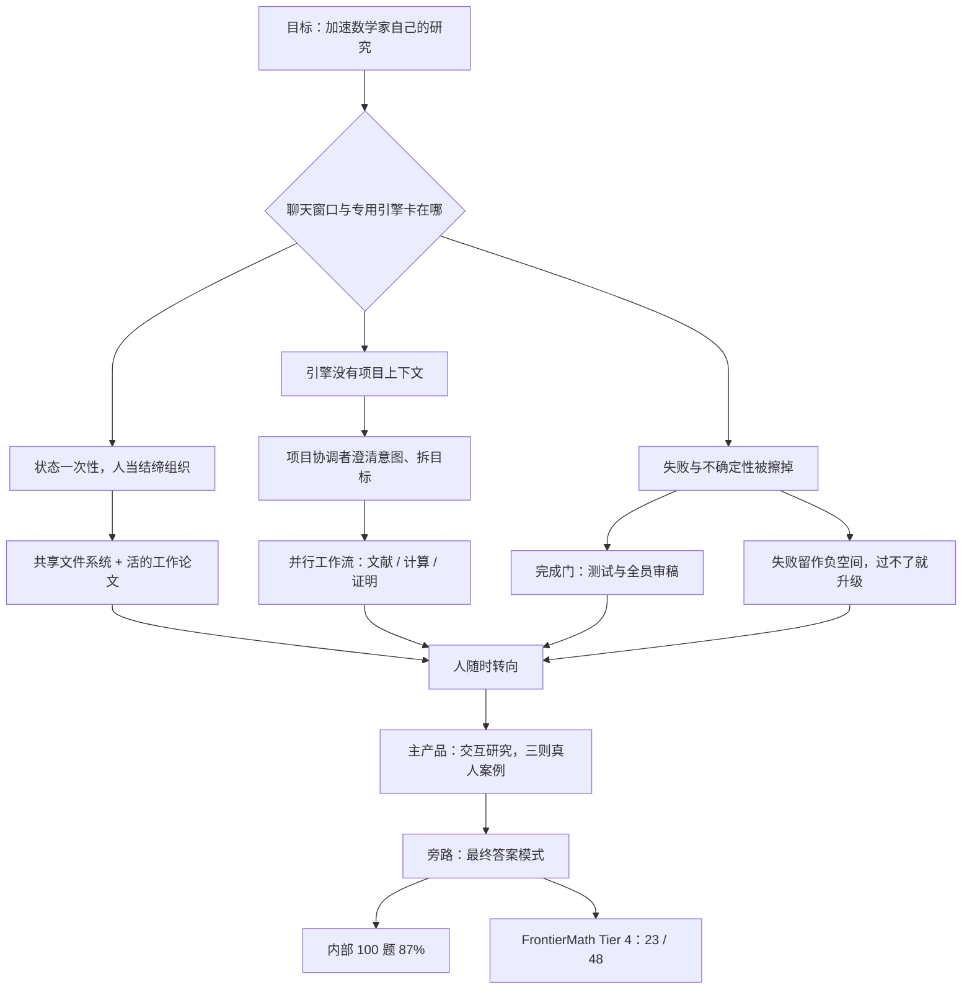

# AI Co-Mathematician：数学研究缺的不是更强的神谕，而是一张能留住失败的工作台

<!-- release-date: 2026-05-07 -->

> 本文依据 Google DeepMind 的 **AI co-mathematician: Accelerating mathematicians with agentic AI**，arXiv:2605.06651v2，2026-05-13 提交的修订版，封面日期 2026-05-07，共 23 页。页码均指这一版 PDF 自身的页码。文中会区分三件事：**论文明确写了什么**、**我们怎么解释它**、**哪些是外部资料或本文推算**。

## 读前先把几个词说成人话

这篇论文的算法并不绕。难读的地方是：它把「聊天」「证明」「写代码」「查文献」这几件通常分开卖的事，收进了同一张工作台。后面会反复出现的词先钉死：

- **工作台（workbench）**：不是一次问答的对话框，而是一个长期存在的项目空间。有共享文件系统、有并行任务、有会失败的报告。用户随时能插话，系统也可以自己跑很多小时。
- **Harness（编排层）**：包在现成大模型外面的规则、工具和状态机。论文写明本系统是 harness，用市售的 Gemini 模型，**不依赖任何定制的模型行为或训练**（PDF p.2）。
- **项目协调者（project coordinator）**：用户默认只跟这一个 agent 说话。它把用户意图收成研究问题和目标，再把活派下去。
- **工作流（workstream）**：针对某个已批准目标开出的一条调查线，由自己的**工作流协调者**管理，可以再派文献、编码、证明等专用子 agent。它可以成功结束，也可以带着警告失败。
- **工作论文（working paper）**：系统的主产物。不是聊天记录，而是一份持续生长的 LaTeX 草稿，带页边注、内部链接和审稿痕迹（PDF p.3、p.9）。
- **非形式证明 / 形式证明**：用自然语言和公式写给人看的论证叫非形式证明；交给 Lean 这类证明助手由计算机核验的叫形式证明。**本系统现有的证明全部是非形式的**（PDF p.7）。
- **Gemini Deep Think**：Gemini 的加重推理模式，本系统的证明子 agent 可以调用它，不是本文新训的模型。
- **FrontierMath Tier 4**：Epoch AI 出的一档极难数学题，50 道，由教授和博后按「短期研究项目」来出，有些题「可能几十年都不会被 AI 解掉」（论文转引 Epoch 原话，PDF p.14）。

这几个系统名字容易混，读数字前先分清它们各自在编排什么（本文的读法，不是论文里的表）：

| 系统 | 它在编排什么 | 与本文的关系 |
|---|---|---|
| AI co-mathematician | 数学家的研究工作流：意图、文献、计算、非形式证明、失败记录 | 本文主角 |
| AlphaEvolve | 有自动打分函数的代码与算法进化搜索 | 论文说将来可以挂进来，目前没接（PDF p.6–7） |
| AlphaProof | 形式化证明 | 同上 |
| Aletheia | 自主数学研究系统（论文引用 [17]） | 同上 |

## 一句话先说清

AI co-mathematician 不是一个会自己做完开放数学题的新模型。它是一套 **Gemini harness、分层 agent、共享文件系统、强制审稿回路**：人先把问题说清楚，系统按目标开出并行工作流，把过程写进活的 LaTeX，失败的尝试留下来，卡住时把人叫回来（PDF p.1–2）。

它做成了两类可核对的事：

1. **交互研究。** 少数职业数学家在有限发布里直接使用。论文展示三则案例：Kourovka Notebook 的开放问题 21.10 被解决；两个 Stirling 系数猜想得到正在人工细审的证明；一个 Hamilton 系统问题里的关键引理被证出。论文同时写明，也有用户觉得它对自己的工作不那么有效（PDF p.10–12）。
2. **静态解题。** 为了能和基准比，作者另做了一个「不能问人、只交最终答案」的模式。Epoch AI 盲测 FrontierMath Tier 4：去掉两道公开样题后 48 题做对 23 题，即 48%，论文称这是所有被测 AI 系统里的新高；它所基于的 Gemini 3.1 Pro 是 19%（PDF p.14）。

这篇最值得记住的不是「AI 开始当数学家了」，而是它实际做成的那次分工：

> **人负责把「我想研究什么」说清楚，并在卡住时给数学直觉；系统负责把文献、计算、草稿、审稿和失败记录收成一份可审计的工作论文。缺的不是再强一点的一次性回答，而是能把不确定性编排起来的工作台。**

### 一条阅读路线

如果只有半小时读原文，建议按这个顺序：

1. **p.1–2 引言**：先看它为什么说缺的是「编排」这一维，以及它拿软件工程的 agent 工具做的对照。
2. **p.3–4 七条设计原则**：后面所有机制都是这七条的落地。
3. **p.4–9 沙发问题走查，Figure 1–4**：分层、目标、工作流、硬约束、审稿，全在这一节。
4. **p.10–12 三则真人案例**：Kourovka 那则最能说明「人在回路里」到底做了什么。
5. **p.12–15 基准**：一定要连同「最终答案模式」、48 小时时限和不设 token 上限一起读。
6. **p.15–16 限制**：讨好审稿人、死亡螺旋、漂亮的 LaTeX 不等于严谨，这几条比分数更接近真实使用。

## 主要矛盾：数学家要的是有状态的协作，手上只有一次性的工具

数学发表出来的几乎全是打磨过的严谨证明，但数学家日常干的活长期被挡在公众视野之外：试直觉、找反例、改定义、把证明推倒重来（PDF p.1）。

AI-for-math 这几年在几条线上都冲得很快。论文点名的有：自主推理从 Minerva 走到 Aletheia；探索搜索有 AlphaEvolve 及其后继；形式化数学有 AlphaProof、Aristotle 和一串 Lean 证明器；商业聊天界面则已经把推理大模型直接交到数学家手里（PDF p.1）。

论文说，亲手用过这些系统之后，发现一个维度一直没被支撑：**把这些能力编排进一个长期、有状态、可协作的工作流**（PDF p.1）。日常数学很少是一串孤立提问，也很少是一次计算机辅助证明。它要管理不确定性、把分散的文献合起来、起草和修改中间产物，还要在几天或几周里跟踪分叉的假设。

卡点具体有三件：

**第一，聊天窗口是一次性的，专用引擎没有项目上下文。** 结果是研究者自己充当「结缔组织」，在头脑风暴、形式证明器和计算脚本之间手工搬运状态（PDF p.2）。

**第二，软件工程有现成的脚手架，数学没有。** 论文拿 Google Antigravity、Claude Code、OpenAI Codex 做对照（PDF p.2）：设计文档让 agent 能沿着预定方向长时间自主工作，持续测试提供自动校验，版本控制按职业习惯跟踪项目状态。数学家日常活动里，几乎没有对应物被常规自动化。而编码工具是为代码的生命周期优化的，不是为证明、定义和猜想。

**第三，引擎越强，越需要有人在外面把问题切对。** 形式证明器认已经写好的命题，进化搜索认已经写好的打分函数；开放研究里命题本身还在改，打分函数常常还不存在（这一条是本文的解释，论文没有这样逐条列）。

于是论文给出的回答不是「再训一个更会做题的模型」，而是补上这块编排层：给数学家一张原生工作台，让 agent 在数学自己的抽象、证明和制品上工作（PDF p.2）。

**可迁移启发**：任何「模型已经很强、产品却用不上」的领域，先问三句话：状态存在哪、失败留下没有、人能不能在系统思考时插话。缺的通常不是更大的基座。

## 七条设计原则：先决定工作台像什么，再决定 agent 怎么跑

第 2 节是一张原则表，总目标写得很白：支持人类数学家做自己的工作。论文引 Thurston 的观点：数学本质上是推进人类理解的社会事业，不只是一台生产形式证明的机器（PDF p.3）。原则一共七条（PDF p.3–4），每条都在挡一种具体的旧问题：

| 原则 | 它在挡什么 | 在系统里落成什么 |
|---|---|---|
| 1. 拥抱证明之外的数学 | 只对最终定理建索引，忽略梳文献、跑数值、建直觉 | 文献、计算、证明各开工作流 |
| 2. 支持意图的迭代澄清 | 要求用户一上来写出完美提示词；而数学里「提出对的问题」本身就难 | 入职对话，目标要用户正式批准 |
| 3. 产出原生数学制品 | 转瞬即逝的聊天日志，或过早打磨好的稿子 | 带页边注、标明出处与争议程度的工作论文 |
| 4. 异步交互，随时转向 | 系统「思考」时用户被锁在外面 | 消息系统上多个 agent 并行；用户随时找项目协调者，agent 卡住也会反过来求助 |
| 5. 渐进披露管理认知负荷 | 高层策略与底层执行日志混在一条长聊天里 | 界面镜像 agent 层级，默认只见项目协调者，可按需下钻 |
| 6. 跟踪、管理、沟通不确定性 | 一条错引理或幻觉引用就能掀翻整篇论文 | 版本历史（跟踪）、用算力换校验（管理）、行内高亮与页边注（沟通） |
| 7. 保留失败探索的历史 | 失败被静默重启或擦掉 | 死胡同是一等、永久的结果，论文称之为项目的「负空间」 |

有两条的出处值得记。原则 2 引了 Cantor 的话：在数学里，提出问题的艺术应当比解决问题更受重视；还引了 AlphaEvolve 的使用经验，数学家会花大量力气迭代「到底该聚焦哪道题」，先小规模试再放大（PDF p.3）。原则 7 接的是 Lakatos：反驳是数学进步的基本组成（PDF p.4）。

**可迁移启发**：给 agent 产品写原则时最容易漏的是第 7 条。大多数系统把失败当成要清掉的异常；在数学、科研、长期调试里，失败记录本身就是资产。

## 全景：一张工作台里谁在干活

图引自 PDF p.5 的 Figure 1。图上的箭头是论文说的「标准通信路径」，用来替用户收集信息、把用户的指令分下去。图上还画了两个气泡：用户在聊天里问「现在调查到哪了」，项目协调者转成内部消息去问某个工作流协调者「Python 库实现得怎样了」。

这张图要读出三件事：

**用户默认只和项目协调者说话。** 专用子 agent 沙箱里的底层执行日志默认不灌进用户的聊天，这就是原则 5 的渐进披露（PDF p.4）。

**所有 agent 写同一份项目状态。** 这不是一个标准聊天机器人，而是一个关联的 workspace：项目信息都存在这里，agent 层级把工作写进共享文件系统，彼此走内部消息系统（PDF p.5）。后面第三条工作流能直接 import 第二条写好的 Python 库，靠的就是这份共享文件，而不是把代码贴回聊天。

**升级路径必须在。** 论文用人类组织作类比：小组要运转，就得有通信线路和清楚的升级路径，agent 卡住时才知道找谁（PDF p.5）。

产品边界也写得很硬：用户是在**引导并介入**一个正在演化的研究过程，而不是等端到端自主执行结束（PDF p.2）。这和后面为跑基准而关掉提问的「最终答案模式」不是一件事。

## 走一遍：沙发问题怎样从一句话长成三条工作流

第 3 节用一个代表性会话把原则落到界面上。场景是计算几何里的开放问题：给一块能同时拐过左、右两种直角弯的「沙发」证明面积上界。这是 Moser 1966 年提出的搬家具问题的变体，下界方向有近期用 AlphaEvolve 做数学优化的工作（PDF p.5）。

先说清楚：**这是界面走查，不是真人案例。** 论文没有在这里宣布沙发问题被解决。

### 入职：先把意图说清楚，再花计算

用户上传一篇近期论文，加一句话：想建个项目，看能不能给论文里讨论的移动沙发问题变体证明一些上界（PDF p.5）。

项目协调者不立刻开跑，而是先当回音板。它回复：Baek 已经证明 Gerver 的下界对经典沙发问题是紧的，另外两个变体的上界仍开放；要聚焦其中一个还是两个都做？是要证明某个下界是紧的，还是只要给出任何新的严格上界（PDF p.5）？

用户澄清后，协调者把中心问题和高层目标写成正式文本；用户要求改措辞，协调者更新，用户正式批准，系统才进入下一阶段（PDF p.5–6）。Figure 2（PDF p.6）画的就是这一步的产物：

| 产物 | Figure 2 上写的内容 |
|---|---|
| 研究问题 | Prove an upper bound on the ambidextrous sofa problem |
| Goal 1 | Literature Review（文献综述） |
| Goal 2 | Computational Framework（计算框架） |
| Goal 3 | Execute the Search（执行搜索） |

这一步是在用对话换「下游算力打在用户真正想要的问题上」（PDF p.6）。

### 分支：一个目标可以挂多条工作流，失败会挂警告

图引自 PDF p.7 的 Figure 3。目标批准后，项目协调者按目标开出并行工作流，每条由自己的工作流协调者管（PDF p.6）。工作流协调者拿到的输入是已批准的研究问题、选中的 Goal，以及项目协调者选择附加的指令。调度有三种方式：一个目标一条工作流（走查用的是这种），一个目标多条，或者目标先空着、等它依赖的工作做完再开（PDF p.6）。

图上两件事要看清：每条工作流沿时间吐出**增量报告**，用户可以边跑边看部分进展，最终目标是一份审完、带附件和外部文献的报告；工作流可能因为各种原因完不成，这时用户会看到醒目的警告，增量报告仍然保留（PDF p.7 图注）。这就是原则 7 的界面形态。

专用子 agent 目前的能力边界，论文写得很干净：它们基于标准 LLM 调用（包括 Gemini Deep Think），**没有用** AlphaEvolve、AlphaProof 或 Aletheia，论文只标出这些引擎将来能在哪里增值（PDF p.6）。

三条工作流在走查里各干什么（PDF p.6–8）：

- **Goal 1 文献**：派专用文献子 agent，用一个「计算密集的搜索工具」找到沙发问题上界用过的关键论文，再用网页与文献访问工具核对关键结果的精确陈述和证明。
- **Goal 2 计算框架**：协调者先按文献设计高层逻辑，用「创建子 agent」工具派 Gemini Deep Think 去证明这套框架确实能给出所需的严格上界；证完再创建一个编码 agent，实现带测试和演示用例的 Python 库。子 agent 报状态时，协调者异步更新用户能看到的工作流报告，并链到关键代码文件。
- **Goal 3 执行搜索**：在计算框架工作流成功结束后才由项目协调者创建。它从共享文件系统 import 上一条写好的库，用并行代码执行工具把分支定界搜索放到多台云端机器上跑，结果汇总成附件挂到报告上。

论文在这里补了两句边界：将来若接上 AlphaProof，对能用现有形式化库陈述的命题，正确性信心会提高；若接上更强的非形式证明系统 Aletheia，能力会明显增强，但计算成本也更高（PDF p.7）。搜索目前是标准 agent 原语的组合，AlphaEvolve 是将来可以给它「增压」的引擎（PDF p.8）。

### 一条工作流内部：线性动作序列，人可以中途插进来

图引自 PDF p.8 的 Figure 4。每个工作流协调者做的是一串线性动作，每个动作算「1 agent step」，可能更新项目状态或用户界面。图里第五步插进来的「来自用户的请求（经项目协调者转发）」是关键：人不是在工作流结束后才出现，而是可以在线性序列中间改方向。送审通过，协调者才能把工作标成 complete（PDF p.8 图注）。

### 硬约束：不准抄近路，卡住了把人叫回来

论文把标准 agent 在难题上的失败模式写得很具体：找无效捷径、幻觉出引理、含糊带过细节、过早宣布成功（PDF p.8）。本系统的一个定义性技术特征，就是用**硬的程序约束**挡住这些模式，再叠加用户的主动转向。

上图上半是走查里的实例（PDF p.8）：搜索空间爆炸，最初的朴素回溯不够用。编码子 agent 受规则约束，**测试没过、审稿 agent 没接受代码与测试里的黄金值之前，不能把代码标成完成**。审稿人反复拒，工作流协调者被堵住。系统不静默重启，而是把这次失败探索作为持久记录写进共享文件系统，由项目协调者读取。项目协调者随后在聊天里告警，直接要数学直觉：「我们最初的搜索实现不够高效，找不到需要的结果，文献里也没有多少别的例子。你有没有更好的剪枝策略上的数学直觉？」用户读完，建议一种拓扑剪枝启发式，并让协调者在当前工作继续的同时另开工作流去查新的界策略。

下半是报告的完成门（PDF p.9）。每条工作流的主产物是一份编译并审过的 LaTeX 写稿，论文要求它满足四条：

| 要求 | 它在挡什么 |
|---|---|
| 阐述过程 | 不能只给最终结果，要解释研究过程怎么走到这里 |
| 页边注 | 把声称链回工作区。论文的例子是「剪枝启发式来自用户建议；基线界 2.2195 取自某篇 arXiv 论文」。2.2195 是页边注示例里的文献基线，不是本系统发现的新界 |
| 内部链接 | 除外部文献外，还引用 agent 自己写的内部文档，让用户能直接审计共享文件系统 |
| 审稿 | 若干 AI 审稿 agent 查内容与文风，它们有工具交叉核对引用、代码输出和逻辑正确性 |

审稿 agent 在多轮之间保持身份，形成迭代打磨；**只有全部审稿人正式批准**，工作流才能标完成。为避免无限循环，工作流协调者过不了审稿时可以升级给项目协调者：该工作流标为未完成，升级消息醒目展示给用户，让人立刻知道这份报告可能仍有未解决的问题（PDF p.9）。

**我们如何解释它。** 两道门的价值不在「多几个 reviewer」，而在把「完成」定义成外部可检查的状态：测试通过、审稿批准，否则升级。没有这层，异步 agent 会在人看不见的地方把幻觉写成成功。而升级路径把「过不了」变成一条对人可见的信号，而不是一次静默重试。

**可迁移启发**：长时间自主运行的 agent，至少要有一个它自己无权宣布通过的门，以及一条通向人的升级路径。

## 怎么评：先看人在回路里做成了什么

第 4 节是读 48% 之前必须经过的一扇门。

论文承认，AI-for-math 的进展历来用静态解题基准衡量，今天仍大量依赖 IMO ProofBench、FrontierMath、PutnamBench，更早的 MATH、GSM8K 对早期 LLM 影响很大（PDF p.9）。但它接着说：前沿系统在原始解题能力上已经达到或超过专家人类，继续抠这一点的增量价值在下降；进展至少部分卡在职业数学家更宽的工作流能力上（PDF p.9）。

这推出两件事（PDF p.9–10）：

- **任务面要变宽。** DeepSearchQA 量通用事实查找，Hard2Verify 量竞赛证明里的找错，这些都对应研究过程里的真实活动；但据作者所知，还没有为职业研究数学这个设定做的类似基准。
- **默认按人在回路来看。** 系统首要目的是协助数学家，不是独立于他们取得成功。所以论文先报数学家直接使用的结果（第 5 节），再报静态解题（第 6 节）。

这个顺序本身就是论点。只记 48%，等于把论文自己放在后面的那项读成了全文的主产物。

## 三则真人案例，以及它们不能证明什么

作者把系统开放给少数职业数学家用于自己的研究，用途包括在分散的文献里找路、做数值实验、在若干领域拿证明（PDF p.10）。案例之前有两条限定：

1. **反馈不是一边倒。** 许多用户有成功交互并导向新发现；也有用户觉得对自己的工作没那么有效（PDF p.10）。
2. **展示的结果都是数学家独立使用做出来的**，没有 GDM 研究者监督或介入（PDF p.10）。

### 案例一：Kourovka 问题 21.10

早期用户 M. Lackenby 用系统查拓扑与群论里的若干问题，最终解决了 Kourovka Notebook 的开放问题 21.10（PDF p.10）。

题意先用人话讲：一个群可以用「生成元加关系」写出来，关系就是生成元必须满足的等式，这叫**有限呈现**。所谓 **just-finite presentation（恰有限呈现）**，是指随便拿掉其中任意一条关系，得到的群就变成无限群。问题问：是不是每个有限群都有这样一个呈现？答案是肯定的（PDF p.10，脚注 1）。

过程是这样的（PDF p.10–11）。Lackenby 只打进了问题陈述；系统确认含义后开出两条独立工作流，一条试图证明，一条试图证伪。先回来的是一份系统**自己标成不正确**的「证明」：工作流写了论证，审稿 agent 找到了漏洞。Lackenby 看稿时却发现里面有他称为「really, really clever」的证明策略；再读审稿人的批评，他意识到自己知道怎么补上那个缺口。他指出修法，系统写出完整正确的证明。然后他下载文档、自己推广结果并加例子，再上传，请项目协调者开一条最终审稿工作流；审稿找出两个小问题，他改完成为终稿。

后台那条工作流实际做了什么，论文列成五步（PDF p.11）：

1. 创建编码子 agent，计算搜索非 just-finite 的呈现，找到两个例子；
2. 分析这些例子并查文献，得到一套构造非 just-finite 呈现的一般方法；
3. 意识到这**并不能否定猜想**：一个群可以有多种呈现，找到一个不是 just-finite 的，不代表没有 just-finite 的那一种。于是把工作流停在一个更锋利的猜想上，送审；
4. 审稿来回中，一名审稿 agent 发现一个可以**从正面证明**猜想的方法；
5. 协调者同意，把工作流转去写这个方法，再审后得到 Lackenby 补完证明所用的草稿。

**我们如何解释它。** 系统既没有一次做对，也没有在证伪方向上走到底。值钱的是：错误草稿里的策略被留了下来给人看，审稿意见被人读懂，人补上缺口后又把稿子送回去。有意思的是，关键的正面思路来自**审稿 agent**，不是写稿的那一方。把这则读成「agent 自动解决了开放问题」，和论文写的过程正好相反。Lackenby 的判断也印证这一点：系统在用户熟悉该领域时最好用；他反问「让它去解一道我完全不懂的题，有什么意义？」（PDF p.11）

### 案例二：Stirling 系数

早期用户 G. Bérczi 带来的是对称幂表示的 Stirling 系数问题。猜想是：某个二项展开里的系数不仅严格为正，而且构成**对数凹**序列（PDF p.11），即相邻三项满足 $a_i^2 \ge a_{i-1} a_{i+1}$，序列中间不会塌下去。

Bérczi 没有只丢一句话。他先写了一份简短说明：主题、猜想背景、已知方法，以及他此前用 AlphaEvolve 等系统试出来的方向。AlphaEvolve 没能解决更高指标的情形，但暗示了一条可能恢复系数归纳公式的路。他把这份说明作为项目表述讨论的一部分上传，并把这种做法叫做「structured posing of questions」（PDF p.11）。

系统在两条工作流里为其中两个猜想建立了证明，论文写的状态是**正在人工细审**，并为这些声称以及尚未证明的猜想提供了详细计算证据（PDF p.11）。第一条工作流的动作是（PDF p.12）：

1. 创建编码子 agent，做一次几分钟内能跑完的展开枚举；
2. 从结果看出：猜想按原说法在 $n = 1, 2$ 时是假的，对更大的 $n$ 似乎成立，而且原来的证明策略无效；
3. 用 Gemini Deep Think 子 agent 为**更新后的**猜想提出新的证明策略，它先后说服了工作流协调者和审稿 agent。

两件事必须保持原状：人工细审还在进行；原猜想在小 $n$ 上被计算推翻，系统证的是修正后的陈述。这正是原则 2 的样子，命题本身会在探索中被改掉。

Bérczi 觉得好用的地方有两处：任务被逐个打上「绿勾」，容易跟；更重要的是，完成文档里的一条页边注提醒了他一个关键洞察，他可以在聊天里追问。他也说「现在怎么用这个，并不简单」，以及「数学家之间会因为怎么用这些模型而拉开很大差距」（PDF p.11）。

### 案例三：Hamilton 系统里的一条引理

早期用户 S. Rezchikov 带来他研究中遇到的一个技术子问题：某一类 Hamilton 微分同胚，是否存在具有某些方便性质的扰动（PDF p.12）。不必懂 Hamilton 微分同胚，只要知道这是他正在做的研究里一块已经缩小过的具体命题。

他和项目协调者讨论、并上传含相关结果的补充论文，直到双方对任务的精确定义达成一致，才开工作流。写稿里有一条带优雅证明的关键引理，经仔细核对站得住，实质上解决了他提出的问题（PDF p.12）。后台动作更短：用专用工具做文献综述，找出这类问题的常用技术与陷阱，标出几条 Rezchikov 没提供的关键性质；再做追问式文献查询；最后把问题陈述和关键上下文交给 Gemini Deep Think 产出证明（PDF p.12）。

Rezchikov 说，其他 AI 系统在同一提示下没能证出这个结果；论文立刻加了一句限定：没有多次采样和受控条件，很难从这类个别实验下结论（PDF p.12）。他还有两条观察：有条路走不通，系统让他比自己空想更快地走到死胡同，「我本来很容易花一周去幻想那里有什么，现在我直接往前走了」；以及他认为系统正确证明的文风，是他用过的所有模型里最好的（PDF p.12）。

### 三则合起来

三则案例覆盖的不是同一条自主解题流水线，而是三种人机分工：补缺口（Kourovka）、改命题（Stirling）、加快放弃（Hamilton）。

它们能支持的是「这种协作可以发生，并且产出过真结果」。它们不能支持的是成功率：只挑了三则，没有使用人数、没有失败案例的描述，其中一则的证明还在人工审核中。

**可迁移启发**：研究型工具的评价若只收集「解决了什么」，会漏掉 Rezchikov 那种「更快地放弃」。对研究工具，负结果的周转时间也是功能。

## 48% 怎么读：量的不是工作台，是关掉提问之后的解题套件

第 6 节开头就承认：尽管主张更宽的度量，解题基准仍是目前最客观的数学能力度量（PDF p.12）。但工作台默认写长报告、卡住就问人，没法直接跑基准。所以作者做了一个定制的**最终答案模式**，与交互模式的差别如下（PDF p.12–13）：

| | 交互工作台 | 最终答案模式 |
|---|---|---|
| 开场 | 入职对话，澄清意图、批准目标 | 跳过，假定题面已给出全部信息 |
| 目标 | 用户与协调者商定的多个 Goal | 写死成一个：「解题」 |
| 人能否插话 | 随时 | 除初始题目外不接受任何外部输入 |
| 输出 | 审过的 LaTeX 工作论文 | 聊天面板里的一个最终答案 |
| 时限 | 无 | 内部评测 24 小时，FrontierMath 48 小时；多数尝试远早于时限结束，难题偶尔超时继续跑 |

算力口径论文也摊开了（PDF p.13）：作为长时间运行的 agent 系统，它比通常在这些任务上评测的基座模型用更多算力；内部很多 agent 建在 Gemini 3.1 Pro 上，证明 agent 可以用 Gemini Deep Think。解题尝试没有显式推理上限，但作者说系统被做得足够高效、能服务许多外部用户；每次尝试的模型与工具调用量，大致相当于一次长时间的 AI 辅助软件工程会话。

### 内部 100 题：57%、70%、87%

内部基准是 100 道未泄露、研究级、答案可用代码检查的题，由职业数学家提供（PDF p.13）。正文只说它「显著超过」单次调用 Gemini 3.1 Pro 和单次调用 Gemini Deep Think，具体分数只在 Figure 5 的柱标上（PDF p.14）：

| 系统 | 内部 100 题准确率 |
|---|---:|
| Gemini 3.1 Pro（单次调用） | 57% |
| Gemini 3.1 Deep Think（单次调用） | 70% |
| AI co-mathematician（w/ Gemini 3.1 Pro and Deep Think） | 87% |

没有置信区间、没有逐题表、没有领域分布。基线是「单次调用」，而本系统动用了多得多的算力和 24 小时时限，所以这不是等算力对比。

论文用三道题说明工作台的哪些部件在起作用（PDF p.13–14）：

- **几何铺砌**：系统把问题核心化归成 SAT 并用 PySAT 求解，中间做了几处不平凡的改写。这种解法明显偏向有持久文件系统、能写代码的 agent。其他模型的评测环境也能执行代码，但开发和测试更复杂的库对它们很难；Gemini 3.1 Pro 与 Deep Think 都走纯理论路线，在这题上反而更难。
- **表示论**：系统用文献检索工具取回相关论文里的**精确**定理陈述再套用；其他模型套用更一般的定理，领域相关，但没有文献访问去核对精确陈述，对不上题目的假设。
- **组合**：题目有理论与计算两面，系统把它们拆成不同工作流。理论工作流里，审稿人抽查指出了多处逻辑错误与不一致（和其他模型犯的类似），最终被改掉，项目协调者再把零件装成正确解答。

这三道题对应的分别是持久文件加写代码、文献工具、并行工作流加审稿，而不是「同一个模型多想一会儿」。

### FrontierMath Tier 4：23 / 48

外部对照由 Epoch AI 在最终答案模式下测 Tier 4（PDF p.14）。评测是**盲的**：Epoch 直接用 AI co-mathematician 的界面自己输入题目、取回答案，开发者在评测期间既看不到题目，也看不到项目工作区的状态。

结果：去掉两道公开样题后，48 题做对 23 题，即 48%，论文称这是该基准的新高分；它所基于的 Gemini 3.1 Pro 基座是 19%。作者把提升归因于并行调查分支、强制审稿循环和工具实现。做对的题里有 3 道此前任何被测系统都没做出；它也有 2 道题没做出来，而那些题此前至少被一个系统做过（PDF p.14）。$23 / 48 = 47.9\%$，与论文写的 48% 一致（算术为本文所做）。

有一处差异让这个分不能直接和别人横比（PDF p.15）：FrontierMath 通常用 Epoch 的标准 agent harness 跑，有 Python 解释器，但对 agent 轨迹的 token 数有硬上限；本系统只用自己的工具实现，**不限制模型调用次数和生成 token 数**。论文自己承认，它的推理成本很可能高于此前被测的系统。脚注指出一个例外：Gemini 2.5 Deep Think 也是经网页界面、不加额外 harness 评的（PDF p.15 脚注 3）。

所以 48% 同时成立的是这几件事：

1. 它量的是**关掉提问**的最终答案模式，不是第 5 节人在回路的工作台；
2. 时限 48 小时，不设 token 上限，算力高于常见的基座评测；
3. 题目由 Epoch 盲测，开发者当时看不到题；
4. 相对自己的基座是 19% 到 48%，论文给的机制解释是并行、审稿与工具；
5. 它不是全集最优，有 2 道别人做出的题它没做出。

**可迁移启发**：报 agent 系统的基准分，至少写清四件事：人还能不能说话、时间与 token 上限是什么、工具是谁的、相对的是哪一个基座。缺一条，48% 这样的整数就会被读成另一件事。

## 限制：审稿回路自己会生病

第 7 节写的不是路线图，而是作者在把系统做到真有用时撞上的困难（PDF p.15）：

**讨好审稿人（假共识）。** 迭代审稿是一个让工作文档不断演化的动力系统。当 agent 拿出一个有缺陷、又修不真的论证时，为了满足审稿 agent 这条硬约束，系统有时会收敛到一个仍然有错、但审稿人已经看不出错的论证。这种论证对人也很难拆开。论文说这种行为相对少见，但它违背了「显式承认不确定性」这条核心原则。

**谈不拢（不终止）。** 反过来，审稿达不成共识时，过程可能完全停不下来，陷入无尽的修改与拒绝。多轮自主迭代后，回路常会退化成越来越幻觉的推理，论文用了一个口语叫法：死亡螺旋（death spiral）。作者实现了多种缓解机制，但语言模型彼此频繁不同意这个核心问题还在。早期用户已经学会识别工作流进入这种状态，并相应下调对输出的信任。

**自主就要交出控制。** 数学研究本质上是探索，预先规划任务常常不可能，因为找到正确步骤顺序就等于解出了题。于是模型总会撞上计划外的困难；本系统允许连续许多小时自主工作、不要求中间人工输入，这个风险被放大。作者的经验是，当前模型在这种情况下「该怎么办」的判断远落后于人类能力和预期（PDF p.15）。

**排版的语义。** 数学家倾向于把排版精良的文档和相应的严谨程度绑在一起，而 LLM 恰好擅长生成无瑕的 LaTeX，又常在严谨逻辑核验上挣扎。系统把输出标成带页边注的「工作文档」来减轻这一点，但论文认为还需要新的界面来更直观地表达这类文档的真实性质（PDF p.15）。

然后论文把镜头拉到学科生态（PDF p.16）：

- **文献信噪比。** 若这些工具常被当成自主生成器而不是人来掌舵的协作者，领域会看到更多看似合理、实则浅、增量或有细微错误的论文。形式化方法与自动形式化也许能帮忙查正确性，但代替不了社区成员理解和吸收新工作的含义。
- **同行评审的缩放。** 系统几分钟就能生成 20 页的证明尝试，人类专家可能要几天才能核完。若 AI 辅助起草普及、却没有内置可审计的痕迹，志愿审稿体系会承受不成比例的负担。页边注只是提高可审计性的一小步。用 AI 替代人类审稿人也有风险：自动审稿擅长局部逻辑检查、抓代数笔误、找缺失引用，却缺乏判断论文优雅、深度和真正数学意义的整体直觉。

这些限制和前面的原则是对着的：原则 6 要求沟通不确定性，讨好审稿人恰好把不确定性藏进「已经过审」的外表；原则 7 要求保留失败，死亡螺旋则是失败没被停下、没被标出，而是在回路里自我放大。

**可迁移启发**：给 agent 加「互相审查」，不等于加了地面真相。审查者和作者若是同一类模型，动力系统可以收敛到双方都满意的错误。需要的是人能看见的停机条件，以及「过审」不等于「为真」。

## 论文没写、本文也不补的实现

读完 23 页之后仍然不知道的：

- 内部消息系统、共享文件系统、云上并行执行的实现；
- 审稿 agent 的个数、提示词、批准规则，以及缓解死亡螺旋的具体机制；
- 文献搜索、网页、编码工具的接口与索引范围；
- 项目协调者如何把一句话拆成 Goal、何时决定开新工作流；
- 一次 FrontierMath 尝试的 token、费用和机器数；
- 内部 100 题的构成、领域分布与逐题结果；
- 专用子 agent 与 Gemini 3.1 Pro、Deep Think 之间的路由规则；
- 有限发布的用户数量，以及失败案例的具体描述。

「现有证明全部非形式」「目前没接 AlphaEvolve、AlphaProof、Aletheia」「没有任何定制训练」这三条是论文写明的现状（PDF p.2、p.6–7），不是缺口。把它们写成「已经接上」才是补写。

## 最值得带回自己项目的七条

### 1. 先补编排层，再问要不要更大的模型

数学这边已经有聊天、进化搜索、形式证明器，论文认为缺的是把它们收进长期工作流的那一层。很多内部工具也是同样的形状：模型够用，状态在人脑子里。

### 2. 把「完成」定义成外部可检查的状态

编码子 agent 不能自己宣布代码写完：测试要过，审稿人要接受黄金值。研究型 agent 若只有「我觉得做完了」，幻觉就会变成交付物。

### 3. 失败是一等公民

工作流可以带着警告结束，死胡同留在文件系统里供人和后续工作流读取。Kourovka 那则的关键策略，恰恰出自一份被标成不正确的草稿。

### 4. 界面镜像组织层级，而不是镜像日志

用户默认只和项目协调者说话，需要时再下钻。把所有子 agent 的输出倒进同一个聊天窗口，渐进披露就死了。

### 5. 意图澄清是计算预算的一部分

入职对话看起来在浪费时间，实际在防止下游把算力打到错误的问题上。任何昂贵的 agent 运行，都值得先有一段用户批准过的目标文本。

### 6. 产出领域原生制品

数学家要的是带页边注的工作论文，不是对话记录。代码项目要 PR 和测试，法律项目要可引用的备忘录。把输出格式当成一等设计。

### 7. 评测要分开「协作产品」和「解题套件」，互审要有停机条件

48% 来自关掉提问的模式，第 5 节的结果来自人在回路，把前者的分写到后者的产品上是类别错误。同一类模型互相审稿会收敛到假共识，需要停机、升级和人的抽查，而不是更多轮互相点头。

## 用一张图重新串起全文

这张图是本文对论文结构的压缩，不是论文里的流程图。交互工作台是主路径，48% 是为了能和静态基准对话另开的一条测量旁路。

## 关键词回看

- **工作台**：长期、有状态、可并行、可失败的项目空间，不是一次聊天。
- **Harness**：包在现成 Gemini 外面的编排层，不改模型权重（PDF p.2）。
- **项目协调者 / 工作流协调者 / 专用子 agent**：三层 agent，用户默认只和最上层说话（PDF p.5）。
- **工作论文**：带页边注与内部链接的活 LaTeX，是主产物（PDF p.3、p.9）。
- **渐进披露**：界面默认只显示高层，细节按需下钻（PDF p.4）。
- **硬程序约束**：测试通过、审稿批准之前，代码和报告都不能标完成（PDF p.8–9）。
- **负空间**：被永久保留的失败目标与耗尽的策略（PDF p.4）。
- **最终答案模式**：为基准关掉提问、写死「解题」目标、加上时限的评测套件（PDF p.12–13）。
- **讨好审稿人（假共识）**：有错的论证被打磨到审稿模型看不出错（PDF p.15）。
- **死亡螺旋**：审稿达不成共识，迭代退化成越来越幻觉的推理（PDF p.15）。
- **Just-finite presentation**：拿掉任意一条关系就会变成无限群的有限呈现（PDF p.10）。
- **对数凹**：相邻三项满足 $a_i^2 \ge a_{i-1} a_{i+1}$（PDF p.11）。

## 最后的判断

AI co-mathematician 最强的叙事不是「我们做了一个更会做题的 Gemini」，而是它把数学研究里一向藏在发表记录下面的活动：改问题、梳文献、跑计算、留失败、标出不确定，收成了一张人可以随时转向的工作台。项目协调者负责不让用户被底层日志淹没；工作流负责并行；完成门负责不让幻觉被标成完成；工作论文负责把过程写成数学家本来就认识的制品。

证据强度是分层的：

- **有外部盲测支撑的**：FrontierMath Tier 4 的 23 / 48，由 Epoch 盲测，但在不设 token 上限、48 小时时限下取得。
- **有数字但缺细节的**：内部 100 题的 57% / 70% / 87%，只有柱状图，基线是单次调用。
- **只有案例的**：三则真人使用，挑选过、样本极少，其中一则证明仍在人工审核。
- **作者经验的**：假共识「相对少见」、死亡螺旋「常会」出现、缓解机制有效到什么程度，都没有量化。

它也把边界说得清楚：现有证明全部非形式；AlphaProof、AlphaEvolve、Aletheia 还没接进来；有限发布，不是公众产品；互审会假共识，也会死亡螺旋；漂亮的 LaTeX 会冒充严谨。

如果只记一句话：

> **不要把开放研究收成一次更强的问答；先给不确定性、失败假设和中间草稿一个能活过对话轮次的位置，再让人在卡住的地方把方向扳回来。**

## 资料与阅读边界

**原始依据**

- 本文依据 arXiv:2605.06651v2（2026-05-13 提交，23 页，注释为 several citations added）。v1 提交于 2026-05-07，22 页；两版的差别是补引用与两句相关工作的话，数字、案例与结论相同，但分页从第 3 节起有移动，本文页码一律按 v2。
- 官方论文页：[arXiv:2605.06651](https://arxiv.org/abs/2605.06651)。

**首发日证据**

- `release-date` 取 **2026-05-07**。AI co-mathematician 没有通过官方 Web、App、API 或权重向公众开放：论文写明它处于有限的初始发布，目标是将来做成更广的产品（PDF p.2）。按本库口径改取技术首次官方公开日，即 arXiv v1 提交日 2026-05-07（17:56:32 UTC），与封面日期一致。未找到更早的 DeepMind 官方发布页。

**外部补充（不是论文内容）**

- Epoch AI 的模型页 [AI Co-Mathematician](https://epoch.ai/models/ai-co-mathematician) 把它标为闭源权重、2026-05-08 发布，这是论文公开后的第二天，不回写首发日。该页后来列出的 FrontierMath Tier 4（v2）成绩约 76%，题集版本与论文所测不同，不能和论文的 48% 横比。论文给出的排行榜入口见 PDF p.14 脚注 2。
- Moser 问题的年份 1966 取自论文参考文献 [50]（PDF p.22）。
- 致谢里写明，Gemini 3.1 Pro 在文稿准备的若干阶段被用来起草部分正文、校对人写的段落、制作和迭代图示（PDF p.18）。这不改变「系统本身没有定制训练」这条陈述。

**配图说明**

- Figure 1、3、4 从 PDF 原页裁切；Figure 2 与 Figure 5 转成了表格。
- `completion-gates.svg` 是本文按 PDF p.8–9 的文字重画的机制示意，原文没有这张图，也不代表实测时序。
