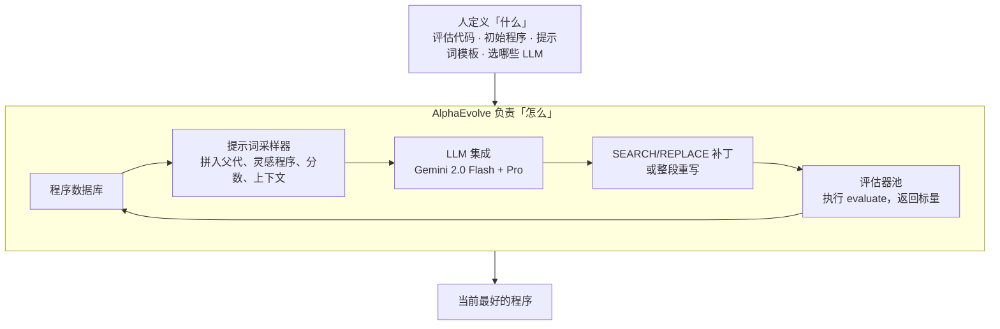
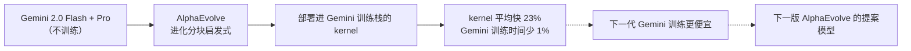

# AlphaEvolve：人写评估器，LLM 进化整份代码；搜出的 kernel 回头加速训练 Gemini

<!-- release-date: 2025-05-14 -->

> 本文依据 Google DeepMind 的白皮书 **AlphaEvolve: A coding agent for scientific and algorithmic discovery**，即 arXiv:2506.13131v1（2025-06-16 提交），共 44 页；本地 `papers/Google/AlphaEvolve.pdf` 是官方下载地址上的同一版白皮书，正文与 arXiv 版逐字相同，页码通用。页码均指 PDF 自身的页码。文中区分三件事：**白皮书明确写了什么**、**我们怎么解释它**、**哪些是外部资料补充**。

## 读前先把几个词说成人话

这篇的算法并不绕，绕的是它把几件常被叫成「自进化」的事叠在同一套系统里。先把后面反复出现的词钉死。

- **进化搜索（evolutionary search）**：系统里同时活着一群程序。每一轮从库里抽出几个当父代，让大模型改它们的代码，跑评估器打分，把有希望的子代放回库里。好的被反复抽到，差的逐渐不再出现。**改的是代码，不是模型权重。**
- **评估器（evaluator）**：用户写好的、机器可跑的打分函数，约定叫 `evaluate`，输入一份程序，输出一组标量，默认越大越好（PDF p. 3–4）。白皮书把它记作函数 $h$。它是整套进化的地面真相：大模型可以胡说，过不了 $h$ 的改动进不了下一轮。
- **程序数据库（program database）**：存所有评过的程序、分数和运行输出，下一轮的提示词从这里抽样。它要同时继续改进当前最好的程序、又保持多样性（PDF p. 8）。
- **张量分解与秩（rank）**：两个矩阵相乘，可以写成把一个三维张量拆成若干个秩一张量之和。拆出的项数，就是这个算法要用的**标量乘法次数**（PDF p. 9）。
- **Strassen 算法**：1969 年把 $2\times 2$ 矩阵乘法从 8 次标量乘法降到 7 次。递归用到 $4\times 4$，就是 $7\times 7=49$ 次，在任意域上都成立（PDF p. 10）。
- **特征 0 的域**：有理数、实数、复数都属于这一类；只有 0 和 1 两个元素的二元域 $\mathbb{F}_2$ 不属于。「56 年」那句话的设定就在这里，后文细讲。
- **kernel 与 tiling（算子与分块）**：跑在加速器上的底层计算程序叫 kernel。大矩阵乘要切成小块再算，切多大就是 tiling。切得不好不会算错，只会算得慢（PDF p. 15）。
- **Borg**：Google 的集群管理系统，负责把作业派到机器上（PDF p. 13）。
- **Pallas / XLA / IR**：Pallas 是 JAX 上写自定义加速器 kernel 的扩展；XLA 是把 JAX 程序编译到硬件的编译器；IR（中间表示）是编译器一层层往下翻译时的中间代码（PDF p. 15、p. 17）。
- **MAP-Elites 与岛屿模型**：两种经典的进化种群组织法。前者按「特征格子」各保留一个精英，后者把种群分成几个岛、岛内进化、偶尔迁移。白皮书只说程序数据库「受这两者启发」（PDF p. 8）。

本站「自进化系统」一组可以按「哪个部件在进化」对照读：Darwin-Godel-Machine 改的是 agent 自己的 Python 脚手架，ADAS 让一个固定的元 agent 写新 agent 的代码，GEPA 改的是 prompt，AIDE2 改的是包在模型外面的 harness。**AlphaEvolve 改的是能被评估器打分的算法代码**——kernel 的分块启发式、调度打分函数、Verilog、编译器 IR、数学搜索程序。这张对照是本站的读法，不是白皮书的章节。

## 一句话先说清

AlphaEvolve 是一套 **LLM 提案 + 进化搜索 + 自动评估器** 的编码 agent：人标出代码里哪些块可以改，再给一个能跑的打分函数；系统直接改这些块，用执行结果决定留谁。提案模型是 Gemini 2.0 Flash 与 Gemini 2.0 Pro 的组合（PDF p. 7），白皮书没有对它们做任何训练。

它做成了三类可以核对的事：

1. **算法发现**：14 个矩阵乘尺寸刷新了已知最少乘法次数；其中两个 $4\times 4$ 复数矩阵相乘用 48 次标量乘法，白皮书称这是 56 年来在该设定下第一次超过 Strassen 递归的 49 次（PDF p. 1、p. 9–10）。
2. **数学构造**：五十多道公开问题上，约 75% 追平已知最好构造，约 20% 超过（PDF p. 3、p. 10）。
3. **Google 计算栈**：数据中心调度、Gemini 训练用的矩阵乘 kernel、TPU 算术电路、编译器生成的 FlashAttention IR，四层都拿到了可部署的改进。其中分块启发式让 kernel 平均快 23%，对应 Gemini 整体训练时间下降 1%；摘要把这写成「加速了支撑 AlphaEvolve 自身的那个 LLM 的训练」（PDF p. 1、p. 16）。

**我们如何解释它。** 值得记住的是那条责任切割：

> 人负责把「什么算好」写成能执行的评估器；系统负责在代码空间里找「怎么改」。改的是算法，不是权重。但搜出的 kernel 一旦部署进 Gemini 的训练栈，收益就喂回训练 Gemini 的过程，而 Gemini 正是 AlphaEvolve 的提案模型。

这是一条基础设施层的闭环，不是权重层的闭环。后文会把它和「自己改自己」严格分开。

## 旧方案卡在哪：LLM 能想，但不知道自己想对了没有

发现新算法，或改掉生产栈里一段被人打磨过的代码，通常要经过构思、试探、放弃不行的假设、实验、验证（PDF p. 1）。大模型已经能帮忙提假设、设计实验，但白皮书的判断是：让 LLM 管线一路走到全新的科学或工程发现，仍然很难（PDF p. 1）。卡点有三处。

**一、单次生成没有地面真相。** 前沿模型能提出一段看起来很聪明的改动；没有自动打分，它是贡献还是幻觉，只能靠人看。人看就上不了规模，上不了规模就走不到那些在语法和功能上都离初始候选很远的解（PDF p. 2）。

**二、直接前作把搜索空间切得很窄。** FunSearch 用 LLM 引导的进化去发现启发式，再由启发式构造数学对象或驱动在线算法（PDF p. 2）。它能工作，但只进化一个十几行的 Python 函数，评估必须在单 CPU 二十分钟内结束，要采样几百万次（PDF p. 2，Table 1）。生产栈里值钱的代码——一个 kernel 的分块逻辑、一段 Verilog、一份编译器 IR——都不长这样。

**三、经典遗传编程的变异算子要人手写。** 手写算子难设计，也常抓不住领域里真正重要的性质（PDF p. 18–19）。要么搜索空间被算子规定死，要么人先把领域知识编进算子，发现其实还是人做的。

AlphaEvolve 把三件事收成同一条环：**大模型直接提出代码修改，评估器用执行结果否决幻觉，进化库决定下一轮看谁**（PDF p. 2）。代价在设计里就写明了：没有自动评估器的任务，这套系统不成立（PDF p. 2、p. 21）。后文所有应用都落在这条边界里面。

## 全景：一轮循环怎么转



这张图按原文 Figure 1（PDF p. 3）与 Figure 2（PDF p. 4）重画，是机制示意，不是实测时间轴。Figure 2 还给出了分布式控制循环的伪代码（PDF p. 4）：

```python
parent_program, inspirations = database.sample()
prompt = prompt_sampler.build(parent_program, inspirations)
diff = llm.generate(prompt)
child_program = apply_diff(parent_program, diff)
results = evaluator.execute(child_program)
database.add(child_program, results)
```

六行就是全部：抽父代和灵感程序，拼提示词，模型出补丁，打补丁得到子代，执行打分，写回数据库。整条流水线用 Python 的 `asyncio` 做成异步：控制器、LLM 采样器、评估节点同时运转，优化目标是**吞吐**，即单位预算内提出并评估的想法数，而不是某一个提案的延迟（PDF p. 8）。

**对自己的项目有什么用。** 可搬的不是四个盒子的名字，而是那条切割：人把「好」写成可执行的 $h$，系统把「如何变好」交给进化。把 LLM 当代码改写器的项目，缺的通常不是更强的模型，而是一个信得过、并且快到能转起来的 $h$。

## 核心设计一：人只标哪些块能改，系统在整份文件上动手

### 旧问题：进化对象只有一个函数

FunSearch 只进化单个 Python 函数，大约 10–20 行（PDF p. 2，Table 1）。这是当时评估成本和模型能力倒逼出来的：函数短，评估才快；函数单一，提示词才塞得下。

### 新设计：用注释块把可进化部分从骨架里划出来

输入 API 是一对注释标记 `# EVOLVE-BLOCK-START` 与 `# EVOLVE-BLOCK-END`（PDF p. 4）。标记内的代码是初始解，系统可以改；标记外是骨架，负责把这些块接到 `evaluate` 上。初始实现必须能跑，但可以很简陋，比如只是返回一个合适类型常数的单行函数（PDF p. 5）。


*图：引自原文 Figure 3（PDF p. 6），用一个监督学习流水线示意输入、提示词与输出。*

图里值得看三处。(a) 里骨架和可进化块交错排列，`evaluate` 在块外，签名固定为返回 `dict[str, float]`。(b) 里提示词带着分数：以往较好的程序 `average_score` 为 0.513，当前程序为 0.624，模型看得到「谁更好、好在哪」。(c) 的补丁格式固定为（PDF p. 7）：

```text
<<<<<<< SEARCH
  # 要在当前程序里精确匹配的原片段
=======
  # 用来替换的新片段
>>>>>>> REPLACE
```

代码很短、或整段重写更合适时，也可以配置成直接输出完整代码块（PDF p. 7）。

### 同一道题，进化对象可以不是最终解

白皮书强调同一问题可以在不同抽象层交给 AlphaEvolve（PDF p. 5）：直接进化解的原始字符串表示；进化一个从零构造解的函数（FunSearch 的做法）；进化一个在固定预算内找解的定制搜索算法；或让中间解和搜索算法一起进化。作者的假设是：高度对称的解适合进化构造函数（往往更短），不对称的解更适合进化定制搜索算法（PDF p. 5）。

后文的矩阵乘进化的是「找分解的梯度算法」，数学构造进化的是「限时改进当前最好构造的启发式」，都不是直接进化最终对象。引言里早就写了这个道理：有一类问题，想要的解不是算法，但算法能描述怎样构造或找到它；这时发现算法只是手段，却常常比直接搜解有效（PDF p. 2）。

**代价**：人得先决定进化哪一层。白皮书只给了对称性这一条假设，没有选择规则。选错了，搜索会在不合适的空间里烧评估预算。

## 核心设计二：和 FunSearch 的八行差别

Table 1 的标题是「能力与典型行为」，是经验对照，不是形式化定理（PDF p. 2）：

| FunSearch | AlphaEvolve |
|---|---|
| 进化单个函数 | 进化整份代码文件 |
| 最多 10–20 行 | 最多数百行 |
| 只进化 Python | 任意语言 |
| 评估必须快（单 CPU 不超过 20 分钟） | 评估可以跑数小时，可并行，可用加速器 |
| 用掉数百万次 LLM 采样 | 数千次采样就够 |
| 用小模型，换大模型没有好处 | 能从最强的 LLM 获益 |
| 提示词几乎只有以往的解 | 提示词里有丰富的上下文与反馈 |
| 优化单个指标 | 可以同时优化多个指标 |

相关工作一节把这张表收成三处扩展：整份代码库与多语言、多目标优化、前沿模型加自然语言上下文与反馈（PDF p. 19）。

两行值得停一下。

**「数千次采样」对「数百万次」。** 这不是更会省样本，而是单次评估更贵、单次提案来自更强的模型。白皮书说单个新解的评估可以花到大约 100 个计算小时；但若不把单次评估并行化，墙钟时间会拖慢新一代出现的速度，限制进化算法连续施加多次变异（PDF p. 8）。所以并行评估是让「贵评估」和「够多的代数」同时成立的条件。

**「可以同时优化多个指标」。** 除了本来就有多个目标的任务，白皮书还观察到：即使只关心一个指标，同时优化多个也常常把那一个抬上去。作者的解释是，不同指标下表现好的程序往往结构不同，把这些「另一种好」放进提示词，能刺激模型提出更多样的候选（PDF p. 8）。这是作者的机制假说，没有单独消融。

## 核心设计三：评估器是唯一的地面真相，也是系统的天花板

白皮书把评估的作用写得很直白：它让 AlphaEvolve 避开基座 LLM 的错误建议（PDF p. 2）。模型仍然会幻觉，但幻觉过不了执行这一关。

$h$ 的接口很瘦：Python 函数，固定签名，返回标量字典（PDF p. 4）。数学题上它可以很简单，比如调用进化出的代码生成一个图，检查性质是否成立，返回图的大小；复杂时，它可以跑一个进化出的搜索算法，或训练并评估一个机器学习模型（PDF p. 4）。

为了把贵评估用在刀刃上，白皮书给了三件可选机制（PDF p. 7–8）：

- **评估级联**：用户可以指定一组难度递增的测试，新程序在前面每一阶段都足够好才进入下一阶段；新程序还会先小规模试跑，尽早滤掉根本跑不起来的。用便宜的失败换昂贵的成功。
- **LLM 生成的反馈**：有些想要的性质很难写进 $h$，例如程序够不够简单。可以另开 LLM 调用打分，写进分数字典引导进化，或在不满足时直接丢弃。Discussion 承认，用 LLM 评估想法不是他们优化过的设定（PDF p. 21）。
- **并行评估**：很多评估天生可并行（比如从多个随机初始化跑搜索），通过异步调用评估集群摊开。

**限制是设计本身划下的。** 自动评估指标是关键优势，也把需要人工实验的任务排除在外；数学、计算机科学、系统优化通常允许自动评估，所以工作集中在这些领域（PDF p. 2）。Discussion 再说一遍：自然科学只有部分实验能模拟或自动化；并发的 AI Co-Scientist 工作展示了自然语言假设这条路，自然的下一步是先让 LLM 评高层想法，再进入有机器反馈的代码实现阶段（PDF p. 21）。

**我们如何解释它。** 评估器既是能力，也是攻击面：若打分逻辑在进化能改到的地方，系统会去改打分本身。AlphaEvolve 把 $h$ 放在进化块之外、由用户提供，客观上做了这层隔离，但白皮书没有把它写成安全声明。自己搭类似系统时，要让进化块碰不到打分代码和测试数据的生成逻辑。

## 核心设计四：Flash 铺开搜索，Pro 给出跳跃；提示词自己也能进化

AlphaEvolve 自称与模型无关，但消融显示底层 LLM 越强，效果越好（PDF p. 5，指向第 4 节）。实际用的是 Gemini 2.0 Flash 与 Pro 的组合（PDF p. 7）：Flash 延迟低，单位时间提出更多候选；Pro 能力更强，偶尔给出能显著推进搜索的高质量建议。这是吞吐与质量的分工，不是投票。两者各贡献多少提案、多少被接受，白皮书没给。

提示词比 FunSearch 厚得多。除了从数据库抽出的多个以往解和修改指令，用户还可以加（PDF p. 5）：

- **显式上下文**：题面、公式、代码片段、相关文献（例如 PDF 文件）；
- **随机格式化**：模板占位符有多个人写的备选，按配置里的概率分布实例化，增加多样性；
- **渲染后的评估结果**：程序、执行结果、`evaluate` 给的分数；
- **元提示词进化**：额外一步让 LLM 自己建议指令和上下文，这些提示词放在一个单独的数据库里，像解程序一样共同进化。

最后一条和 GEPA 表面像，对象不同：GEPA 进化下游任务的 prompt；这里进化的是 AlphaEvolve 喂给编码模型的那层指令，目标仍是下游程序的 $h$ 分数。元提示词数据库的更新规则、程序数据库的格子怎么划、岛有几座、迁移多频繁，白皮书都没写（PDF p. 8）。这是复现时最大的空白。

## 结果一：矩阵乘法，14 个尺寸刷新，$4\times 4$ 复数 48 次

### 旧问题：连 $3\times 3$ 的最少乘法次数都不知道

矩阵乘的张量分解已经被交替最小二乘、深度强化学习（AlphaTensor）、定制搜索轮番打过；白皮书用来说明难度的例子是：即使是两个 $3\times 3$ 矩阵相乘，最小可达秩至今未知（PDF p. 9）。

### 新设计：不直接搜分解，进化「找分解的梯度算法」

起点是一份标准的梯度算法：初始化器、重构损失、Adam 优化器（PDF p. 9）。AlphaEvolve 改的是这份算法的实现。评估时选一组矩阵乘目标，用评估级联、多个随机种子跑算法；分数是每个目标上达到的最低秩，以及达到该秩的种子比例，作为爬山信号（PDF p. 10）。为保证分解精确、不受数值误差影响，评估时把每个元素四舍五入到最近的整数或半整数，同时在提示词里用自然语言要求算法产出接近整数的解（PDF p. 10）。

Figure 4 展示了一次成功的进化补丁（PDF p. 11，放大版在 Figure 9a–9c，PDF p. 35–37）。改动跨越几个部件：优化器从 Adam 换成 AdamW，初始化改成更小尺度的复数正态；损失在重构误差之外加了离散化项（鼓励元素是整数或半整数）、余弦退火的半整数权重和大值惩罚，还加了梯度噪声、参数噪声、周期性软裁剪、对目标张量加噪，以及随机替换数值的「hallucination」项；超参扫描从 2 个扩到 13 个。图注写：这些改动高度非平凡，进化中经历了 15 次变异（PDF p. 11）。

Table 2 的大多数结果（包括 $\langle 4,4,4\rangle$）从一份简单的初始程序得到；有些尺寸上，作者把自己的想法（给评估函数加随机性、使用进化方法）放进初始程序，还能再提升（PDF p. 10）。

### 结果：Table 2

$\langle m,n,p\rangle$ 表示 $m\times n$ 矩阵乘 $n\times p$ 矩阵，数字是所需标量乘法次数的上界（PDF p. 9，Table 2）：

| $\langle m,n,p\rangle$ | 此前最好 | AlphaEvolve |
|---|---:|---:|
| $\langle 2,4,5\rangle$ | 33 | 32 |
| $\langle 2,4,7\rangle$ | 46 | 45 |
| $\langle 2,4,8\rangle$ | 52 | 51 |
| $\langle 2,5,6\rangle$ | 48 | 47 |
| $\langle 3,3,3\rangle$ | 23 | 23 |
| $\langle 3,4,6\rangle$ | 56 | 54 |
| $\langle 3,4,7\rangle$ | 66 | 63 |
| $\langle 3,4,8\rangle$ | 75 | 74 |
| $\langle 3,5,6\rangle$ | 70 | 68 |
| $\langle 3,5,7\rangle$ | 82 | 80 |
| $\langle 4,4,4\rangle$ | 49 | 48 |
| $\langle 4,4,5\rangle$ | 62 | 61 |
| $\langle 4,4,7\rangle$ | 87 | 85 |
| $\langle 4,4,8\rangle$ | 98 | 96 |
| $\langle 4,5,6\rangle$ | 93 | 90 |
| $\langle 5,5,5\rangle$ | 93 | 93 |

16 行里 14 行刷新，$\langle 3,3,3\rangle$ 与 $\langle 5,5,5\rangle$ 追平。$\langle 3,4,7\rangle$、$\langle 4,4,4\rangle$、$\langle 4,4,8\rangle$ 的算法用了复数乘法，可以精确地乘复数或实数矩阵（PDF p. 9）。

附录 Table 3 把范围扩到 54 个目标（大致 $2\le m,n\le 5$，$p$ 取合理上限）：38 个追平，14 个超过，**2 个落后**——$\langle 4,4,9\rangle$ 此前 104、AlphaEvolve 108，$\langle 6,6,6\rangle$ 此前 153、AlphaEvolve 156（PDF p. 34）。所有结果都是整数或半整数元素的精确算法。作者还写：尺寸超过 $\langle 5,5,5\rangle$ 后，在单 GPU 评估器上跑 1000 个随机种子经常显存不够，扩到更大矩阵还需要进一步优化；并发工作也为 $\langle 4,5,6\rangle$ 找到了秩 90（PDF p. 34）。

### 「56 年第一次超过 Strassen」说的是哪一句

摘要说：AlphaEvolve 找到了用 48 次标量乘法相乘两个 $4\times 4$ 复数矩阵的方法，是 56 年来在这个设定下对 Strassen 算法的第一次改进（PDF p. 1）。3.1 节把设定写清了（PDF p. 10）：

| 方法 | $4\times 4$ 的乘法次数 | 适用范围 |
|---|---:|---|
| 朴素算法 | 64 | 任意域 |
| Strassen 递归 | 49 | 任意域 |
| AlphaTensor（Fawzi 等） | 47 | 只在二元域 $\mathbb{F}_2$ |
| AlphaEvolve | 48 | 复数（可用于精确乘实数或复数矩阵） |

朴素算法的 64 是 $4^3$，为对照补上；其余三行来自白皮书。关键限定有三层：

- **比的是张量分解的秩。** 脚注 3 写明：存在少于 49 次乘法的 $4\times 4$ 算法，但它们不对应矩阵乘张量的分解，也不能递归用到更大的矩阵（PDF p. 10）。
- **设定是特征 0 的域。** 56 年来，在任意特征 0 的域上找到秩小于 49 的算法一直是公开问题；AlphaEvolve 是第一个找到秩 48、用于两个 $4\times 4$ 复数矩阵的方法（PDF p. 10）。它没有声称超过 AlphaTensor 在 $\mathbb{F}_2$ 上的 47。
- **是 14 个尺寸，不是所有尺寸。** 54 个目标里有 2 个落后。

分解结果放在伴随的 Google Colab 里（PDF p. 3 脚注 2）。

**对自己的项目有什么用。** 当最终对象是一个难以直接搜索的组合结构（低秩分解、稀疏图、电路），进化「搜索它的算法」往往更划算。前提是能验证搜出来的东西是精确的：这里靠四舍五入到半整数再检验，换一个问题可能是符号验证或差分测试。

## 结果二：五十多道数学构造，进化的是启发式，不是构造本身

### 做法：每一代进化一个「限时改进当前最好构造」的程序

分析、组合、数论、几何里有一类问题：最优值未知，但拿出一个比已知更好的对象，就能推进上界或下界（PDF p. 10）。作者把 AlphaEvolve 用到五十多道这类问题，跨五个以上数学分支，并在多种参数（不同维数或规模）下评估；起点都是简单或随机构造。约 75% 的情况重新发现了已知最好构造（许多很可能已是最优），约 20% 发现了更好的对象（PDF p. 3、p. 10）。

方法上的关键是 **进化启发式搜索算法，而不是直接进化构造**（PDF p. 12）。对目标函数评估很快的问题，每一代的任务是：给一个固定时间预算（例如 1000 秒），并给出上一代最好启发式找到的最好构造，让程序在此基础上找到更好的。进化因此选出擅长改进已经很好的解的启发式。最终构造常常是一串不同的专门化启发式接力的结果：早期的擅长从随机或简单状态拿到大增益，后期的擅长微调近优配置。白皮书认为这种自动发现的多阶段搜索策略很难手工复制，并且对超过 SOTA 至关重要（PDF p. 12）。

### 刷新了哪些记录

原文 Figure 5（PDF p. 12）用三列卡片展示了一部分刷新，下表把它和附录 B 的精确数字合在一起：

| 问题 | 方向 | 此前 → AlphaEvolve | 页码 |
|---|---|---|---|
| 第一类自相关不等式 $C_1$ | 上界 | 1.5098 → 1.5053（600 段阶梯函数） | p. 38 |
| 第二类自相关不等式 $C_2$ | 下界 | 0.88922 → 0.8962（50 段） | p. 38 |
| 第三类自相关不等式 $C_3$ | 上界 | 1.45810 → 1.4557（400 段） | p. 38 |
| 不确定性不等式 $C_4$ | 上界 | 0.3523 → 0.3521 | p. 39 |
| Erdős 最小重叠问题 $C_5$ | 上界 | 0.380927 → 0.380924 | p. 40 |
| 有限集的和与差 $C_6$ | 下界 | 1.14465 → 1.1479（集合大小 2003）→ 1.1584（大小 54265） | p. 40–41 |
| 11 个单位正六边形装进大正六边形 | 外边长 | 3.943 → 3.931 | p. 41 |
| 12 个单位正六边形 | 外边长 | 4.0 → 3.942 | p. 41 |
| 2 维 16 点的最大/最小距离比（取平方） | 越小越好 | 12.890 → 约 12.889266112 | p. 41 |
| 3 维 14 点的最大/最小距离比（取平方） | 越小越好 | 4.168 → 约 4.165849767 | p. 42 |
| Heilbronn 三角形，11 点 | 最小三角形面积 | 0.036 → 大于 0.0365 | p. 42 |
| Heilbronn 凸区域，13 点 / 14 点 | 最小三角形面积 | 0.0306 → 0.0309 / 0.0277 → 0.0278 | p. 42 |
| 11 维 kissing number | 下界 | 592 → 593 | p. 13、p. 42–43 |
| 单位正方形内 26 圆 / 32 圆 | 半径和 | 2.634 → 2.635 / 2.936 → 2.937 | p. 43–44 |
| 周长 4 的矩形内 21 圆 | 半径和 | 2.364 → 2.3658 | p. 44 |

读这张表要知道三件事。

**一、多数改进在小数点后第三、四位。** 白皮书自己多处用「slightly」（PDF p. 13、p. 38–40）；kissing number 从 592 到 593 也是加一。它证明的是「同一套进化启发式的框架，几乎不用逐题定制就能铺到五十多道题上，并在约五分之一的题上真的刷新」，不是「这些数学问题被解决了」。

**二、kissing number 这条带证明。** 附录给出 Lemma 1：找到 593 个 11 维非零整点，使它们的最大范数不超过最小两两距离，就能推出 11 维 kissing number 至少 593，并写了证明（PDF p. 43）。这是「程序输出了一个构造，引理保证它成立」，不只是一个分数。

**三、Figure 5 卡片与附录的末位差异。** Erdős 那张卡片把旧上界写成 0.380926，附录正文是 0.380927（PDF p. 12、p. 40），以附录为准；半径和卡片写 2.6358，附录写「改进到 2.635」，Figure 14 图注写「半径和 ≥ 2.635」（PDF p. 12、p. 44），附录是截断到三位小数，两者不矛盾。

$C_4$ 另有一条附录补记：白皮书第一版发布后，Henry Cohn 指出文献 [18] 用更精细的方法已得到 0.3284；把那套方法接进 AlphaEvolve 后，常数进一步改进到 0.3216（PDF p. 39）。0.3521 是正文与 Figure 5 的数，0.3216 是补记，不是同一次实验。

约 75% 加约 20% 之后剩下的约 5%，白皮书没有单独分析；也没有逐题列出落后的是哪些。多数题目由外部数学家 Javier Gomez Serrano 与 Terence Tao 建议，并指导如何写成 AlphaEvolve 的输入；更多例子和方法细节放在后续论文里（PDF p. 13）。

**对自己的项目有什么用。** 目标函数评估很快、对象又不规则时，进化「限时改进当前最好解的程序」，等于自动发现多阶段搜索。人要提供的是时间预算，以及「把上一代最好解喂给下一代」这条接口。

## 结果三：Google 计算栈的四层

引言把四个工程应用列成四句（PDF p. 3）：集群调度启发式、训练 LLM 用的矩阵乘 kernel、TPU 内的算术电路、Transformer 注意力的运行时间。这些组件会长期反复运行，任何改进都值钱。四条因果链按白皮书的顺序走。

### 数据中心调度：一种资源耗尽、另一种还空着

Borg 派作业派得不好，就会出现「搁浅资源」（stranded resources）：一台机器某种资源（例如内存）耗尽、接不了新作业，另一种（例如 CPU）却还空着（PDF p. 13）。这是经典装箱问题，再叠上可调试性和规模。

做法是把在线作业调度写成二维向量装箱：机器是箱子，容量是 CPU 与内存；作业是物品。启发式输入待派作业的 CPU、内存需求和候选机器的 CPU、内存余量，输出这台机器的优先级分数；Borg 在它已判定可行的机器里按分数排序（PDF p. 14）。启发式只影响排序、不扩大可行集，所以调度决策在构造上是正确的。


*图：引自原文 Figure 6（PDF p. 14）。右图黄色为高分，紫色为低分。*

**我们如何解释它。** 函数里的 `cpu_residual` 是作业 CPU 需求占机器剩余 CPU 的比例，内存同理。分数取负，Borg 选分数最高的机器，等于最小化「两个比例之和 + 两个比例互比之和」。互比之和在两个比例相等时最小，所以函数偏爱让作业对两种资源的占用比例相近的机器；热力图的紫区贴着坐标轴，正是「一种资源几乎不用、另一种被占得多」的形状，也就是会制造搁浅资源的那一类分配。

这是一个「早期版本」的 AlphaEvolve 从生产中已有的启发式出发进化出来的（PDF p. 14）。反馈来自数据中心模拟器，用全舰队的历史工作负载与容量快照；泛化在没见过的近期工作负载测试集上检验。超过生产启发式之后推到全舰队，部署后的实测证实了模拟器结果：**平均持续回收 Google 全舰队 0.7% 原本会搁浅的计算资源**（PDF p. 14）。

选它而不选深度强化学习，理由写得很工程：代码解不仅性能更好，还可解释、可调试、可预测、易部署，这些是任务关键系统必须的性质（PDF p. 14）。早期版本与正文系统差在哪、模拟器保真度、0.7% 的方差，白皮书都没写。

### Gemini 的矩阵乘分块：每换一个输入形状就要重调

Gemini 建在 JAX 上，Pallas 让工程师为加速器写专用 kernel。矩阵乘 kernel 的关键是分块：把 $AB=C$ 切成 $M\times N$、$N\times P$、$M\times P$ 的小块，以平衡计算与数据搬运。要自动选出对所有输入形状都合适的 $(M,N,P)$，得知道矩阵乘单元的最优形状与内存容量、周围算子的内存需求、融进 kernel 的额外运算、以及底层编译器细节（PDF p. 15，Figure 7）。

旧方案两条都卡：基于搜索的自动调优每换一次输入形状就要重调，打断研究工作流；手写启发式要同时吃透 kernel 和硬件，是主要的工程瓶颈（PDF p. 15）。

AlphaEvolve 的任务是为一个训练 Gemini 时用到的重要矩阵乘 kernel 优化分块启发式，目标是在真实 TPU 上、多种输入形状下的实际运行时间。正确性构造上保证：它只改分块策略，不改底层数学运算（PDF p. 15–16）。输入形状从 kernel 的实际用户那里自动收集，一半做训练集（进化时的优化目标），一半做评估集（检验启发式能否泛化）（PDF p. 16）。

三个数要分开记（PDF p. 16）：

- 相对已有的专家设计启发式，**所有 kernel 平均加快 23%**；
- 对应 **Gemini 整体训练时间下降 1%**；
- kernel 优化时间从「数月的专门工程投入」缩短到「数天的自动实验」。

这个启发式已部署到生产。白皮书接着写：这次部署也是 Gemini 借助 AlphaEvolve 优化自己训练过程的一个新例子（PDF p. 16）。

### TPU 算术电路：RTL 手改要好几个月

TPU 设计周期以年计，其中 RTL（寄存器传输级）优化要高技能工程师手改硬件描述、迭代数月（PDF p. 16）。任务是优化矩阵乘单元里一个关键算术电路的 Verilog 实现——它**已经被高度优化过**——目标是减小面积与功耗，并保持功能不变；最终提案必须通过严格验证（PDF p. 16）。

AlphaEvolve 找到一次简单的代码改写，去掉了不必要的位，TPU 设计师确认了正确性。白皮书紧跟着写了限制：**这处改进也被下游综合工具独立发现了**（PDF p. 16）。它的价值被放在设计流上游——在源 RTL 阶段就提出优化。这处改动将集成进一款即将推出的 TPU，白皮书称之为 Gemini 经由 AlphaEvolve 对 TPU 算术电路的第一次直接贡献；提案直接用 Verilog 表达，便于硬件工程师信任和采用（PDF p. 16）。

没有面积或功耗的百分比。能核对的是：改写发生过、设计师确认了正确性、综合工具也独立抓到了同一处。

### 直接改编译器生成的 IR：人本来不会去改的那一层

在他们的栈里，FlashAttention 是 Pallas kernel，外包一层 JAX 做输入准备与输出后处理，再由 XLA 翻译成一层层 IR；在这些层上，更好的内存访问编排或计算调度能在特定硬件上明显缩短运行时间（PDF p. 17）。

任务是直接优化 XLA 生成的、封装了 FlashAttention kernel 及其前后处理的 IR，配置对应一个在 GPU 上大规模推理、影响很大的 Transformer 模型，目标是整个模块的执行时间（PDF p. 17）。难在 IR 是给调试用的，不是给人改的，而且已经被编译器高度优化。每个提案都在随机输入上对照未修改的参考代码检查数值正确性，最终版本由人类专家严格确认对所有可能输入都正确（PDF p. 17）。

结果（PDF p. 17）：该配置下 FlashAttention kernel 加快 **32%**；前后处理部分加快 **15%**。白皮书的展望是把发现的优化吸收进现有编译器，或更长期地把 AlphaEvolve 嵌进编译器工作流；没有声称已经做到。

## 那条自进化闭环：改的不是权重，收益喂回训练它的模型



这张图按 PDF p. 7、p. 16、p. 21 的文字画成，实线是白皮书写明已经发生的，虚线是 Discussion 里的展望。

Discussion 把这件事分两层写（PDF p. 21）。已经发生的：AlphaEvolve 能做出提高自身基础设施、以及（未来版本的）基座 LLM 效率的实际发现；目前收益是「moderate」，改进下一版 AlphaEvolve 的反馈环以月计。还没发生的：自然的下一步是把 AlphaEvolve 增强后的表现蒸馏进下一代基座模型，这很可能也会抬升下一版 AlphaEvolve。Discussion 还把 AlphaEvolve 看成一种测试时计算的 agent：相比重复采样，进化过程显著增强了基座 LLM 的能力，说明机器反馈能把测试时计算的规模化一直支撑到产生新发现的程度（PDF p. 21）。

**我们如何解释它。** 「自进化」在这篇里的准确含义是：

- **改的对象**：训练栈和科学问题里的算法代码，不是 prompt，不是权重，不是 agent 自己的控制器；
- **已经闭合的环**：搜出的 kernel 降低了训练 Gemini 的时间，而 Gemini 是 AlphaEvolve 的提案模型；
- **没有闭合的环**：AlphaEvolve 不在一次运行里改自己的采样规则或评估器，也不改 Gemini 的权重；蒸馏进下一代基座是作者写下的下一步，不是本篇结果。

把 1% 读成「智能爆炸开始了」，和 Discussion 自己的措辞相反。把它读成「进化搜索能在专家已经优化过的生产训练栈上再抠出可部署的改进，而且收益回到训练这些模型的账单上」，和材料相符。

## 消融：每一块都在干活

消融只在两道题上做：矩阵乘的张量分解，和 kissing number 下界（PDF p. 17）。关掉的部件如下（PDF p. 17–18）：

| 关掉的部件 | 对照名称 | 做法 | 用在哪道题 |
|---|---|---|---|
| 进化 | No evolution | 反复把同一份初始程序喂给模型，不用数据库里的历史程序 | 两道都做 |
| 提示词上下文 | No context in the prompt | 不在提示词里加问题相关的显式上下文 | 两道都做 |
| 元提示词进化 | No meta prompt evolution | 关掉让 LLM 改进提示词的那一步 | 只做张量分解 |
| 整文件进化 | No full-file evolution | 只进化损失函数 | 只做张量分解 |
| 大小模型混合 | Small base LLM only | 只用一个小基座模型 | 只做张量分解 |


*图：引自原文 Figure 8（PDF p. 18）。纵轴是按目标聚合的指标，越高越好；横轴是计算预算的比例；色带是三次不同随机种子运行的目标内标准差。*

白皮书的结论只有一句：每个部件都带来了显著改进（PDF p. 18）。

**我们如何解释它。** 两处和 Table 1 直接互证：只用小模型的曲线低于完整方法，对应「能从最强的 LLM 获益」；只进化损失函数的曲线也低于完整方法，对应「进化整份文件」。关掉进化那条线在张量分解上几乎涨不动，说明「反复问同一个初始程序」远不够。但白皮书没有给曲线的数值表，也没有给横轴的分母——一次搜索用了多少 TPU 小时、多少次 LLM 调用，全文都没写。所以只能读出排序，读不出每个部件值多少绝对分数。

## 限制、未公开，以及作者写下的下一步

**白皮书写了的边界：**

- 必须有自动评估器；需要人工实验的任务不在范围内（PDF p. 2、p. 21）；
- 当前收益 moderate，反馈环以月计（PDF p. 21）；
- 矩阵乘超过 $\langle 5,5,5\rangle$ 后单 GPU、1000 种子常常显存不够；54 个目标里 2 个落后（PDF p. 34）；
- TPU 那处改写也被下游综合工具独立发现（PDF p. 16）；
- 调度启发式来自「早期版本」的 AlphaEvolve（PDF p. 14）。

**没写、因此不能补的：**

- **算力**：没有加速器数量、一次搜索的墙钟时间、LLM 调用次数；Table 1 的「数千次采样」是典型行为，不是某次实验的计数；
- **评估器实现**：四个内部应用的评估器、调度模拟器的保真度、TPU 电路的验证套件都没有；
- **内部负载**：Borg 的作业特征、Gemini 训练的输入形状分布、那个「重要矩阵乘 kernel」是什么、FlashAttention 优化针对哪个模型，都没有；
- **进化库与元提示词库的算法细节**；
- **Flash 与 Pro 的分工比例**；
- **AlphaEvolve 本身的代码**：公开的是数学结果的 Colab，不是 agent；
- **0.7%、23%、1%、32%、15% 的方差与重复次数**：只有点估计。

**作者写下、但不是本篇结果的下一步：** 把增强后的表现蒸馏进下一代基座；把 LLM 对高层想法的评估和代码执行反馈接起来（PDF p. 21）；把 IR 优化吸收进编译器（PDF p. 17）；数学部分的更多细节放在后续论文（PDF p. 13）。

## 相关工作只留定位

- **经典遗传编程**：用变异和交叉算子进化程序池，瓶颈是手写算子；AlphaEvolve 用 LLM 的世界知识来变异程序，不必预先规定允许哪些变异（PDF p. 18–19）。
- **FunSearch**：直接前作，差别见上面的八行表；后续被用于贝叶斯优化的采集函数、认知模型、图距离、组合类竞赛编程（PDF p. 19）。
- **LLM 引导进化的其他用法**：机器人策略、代码合成、符号回归、组合优化启发式、分子结构，以及改进 LLM 提示词和搜索神经架构（PDF p. 19）。AlphaEvolve 自认差别在规模、灵活性和适用面。
- **AI Co-Scientist**：用多个 agent 做假设生成、排序与文献综述，假设和评估标准都用自然语言。AlphaEvolve 坚持用程序表示假设、用程序化评估引导进化，从而在很大程度上绕开幻觉，才能把进化跑很多步（PDF p. 19）。
- **超优化与算法发现**：代码超优化的想法可以追溯到 1980 年代；AlphaTensor 这类单一问题的系统也发现过可证明正确的算法；LLM agent 也被用来优化 GPU kernel 中的注意力等算子（PDF p. 20）。

与本站 FlashAttention 系列的关系：那边是人写的 IO 感知注意力算法，这里是对编译器已经吐出的 FlashAttention IR 再搜一遍，是不同层的优化。

## 可迁移启发

1. **先写评估器，再接模型。** AlphaEvolve 所有看起来像智能的部分，都站在 $h$ 能自动打分上。可以搬走的最小单位是「一份可执行的 `evaluate` + 一对 EVOLVE-BLOCK 标记」。
2. **进化「好打分的那一层」，不一定是最终产物。** 矩阵乘进化找分解的梯度算法，数学进化限时改进的启发式，调度进化七行打分函数，kernel 进化分块启发式而不是数学运算。
3. **评估一贵就要并行，否则代数不够。** 单次评估到 100 个计算小时仍可行，前提是能摊到集群上（PDF p. 8）。同步、不可切分的评估不适合直接套这套环。
4. **多指标可以当多样性来源。** 这是作者的观察，不是定理；但实现成本很低，`evaluate` 本来就返回字典。
5. **在任务关键系统里，代码解的可读性可能比分数更重要。** Borg 选它而不选强化学习，理由是可解释、可调试、可预测、易部署（PDF p. 14）。
6. **正确性尽量构造上保证。** 调度只在可行机器里排序，分块不改数学，IR 改动对照参考实现做数值检查、最终再由人确认。进化只奖励分数，不会自动守住分数之外的不变量。
7. **不要把「加速了训练自己的模型」读成在线自修改。** 1% 是部署进训练栈后的账单变化，反馈以月计。能搬走的是「把搜出的 kernel 接回训练流水线」；搬不走的是单次运行里改自己权重或控制器的闭环。

依赖 Google 内部模拟器、全舰队测量、TPU 设计流和 XLA 工具链的部分不能直接复用。那四组生产数字证明的是「在已经高度优化的栈上还能抠出可部署的改进」，不是「换一个集群也能抠出 0.7%」。

## 关键词回看

- **AlphaEvolve**：LLM 提案 + 进化搜索 + 自动评估器的编码 agent；改代码，不改权重。
- **$h$ / `evaluate`**：用户提供的自动打分函数，返回标量字典，越大越好；系统的地面真相和天花板。
- **EVOLVE-BLOCK**：划出可进化代码块的注释标记，块外是骨架。
- **SEARCH/REPLACE**：模型提案的默认补丁格式。
- **程序数据库**：存带分数的程序，受 MAP-Elites 与岛屿模型启发，细节未公开。
- **评估级联**：由易到难的测试阶段，早早淘汰差程序。
- **元提示词进化**：让 LLM 建议提示词，单独建库共同进化。
- **FunSearch**：直接前作，单函数、短 Python、快评估、百万次采样、小模型。
- **张量秩**：矩阵乘算法的标量乘法次数；$4\times 4$ 上 Strassen 递归 49，AlphaEvolve 在复数上 48。
- **特征 0 与 $\mathbb{F}_2$**：48 的设定是特征 0；AlphaTensor 的 47 只在二元域。
- **分块启发式**：按输入形状选 $(M,N,P)$ 的代码；kernel 平均快 23%，Gemini 训练时间少 1%。
- **搁浅资源**：一种资源耗尽、另一种还空着；新调度函数平均回收全舰队 0.7%。
- **XLA IR**：编译器中间表示；FlashAttention kernel 快 32%，前后处理快 15%。

## 资料与阅读边界

- 原件：arXiv:2506.13131（<https://arxiv.org/abs/2506.13131>），只有 v1，2025-06-16 提交，44 页；与官方下载地址 <https://storage.googleapis.com/deepmind-media/DeepMind.com/Blog/alphaevolve-a-gemini-powered-coding-agent-for-designing-advanced-algorithms/AlphaEvolve.pdf> 上的当前版白皮书、以及本地原件，正文逐字相同。作者 18 位，全部署名 Google DeepMind；通讯作者为 Matej Balog、Alexander Novikov 与 Pushmeet Kohli（PDF p. 1、p. 23）。
- `release-date` 取 2025-05-14。AlphaEvolve 没有对外开放的服务或代码，按技术首次官方公开日取值：DeepMind 博客「AlphaEvolve: A Gemini-powered coding agent for designing advanced algorithms」标注 2025-05-14，白皮书第一版同日在上述地址放出（互联网档案馆 2025-05-14 15:43 UTC 已存档，封面印 2025-5-14）。
- 版本：2025-05-14 的第一版白皮书为 42 页；当前 44 页版主要增补了附录 B.4 关于 Cohn 工作的补记与 Table 3 下关于并发工作的注记，并调整了参考文献编号，文中核心数字未变。
- 伴随 Colab（PDF p. 3 脚注 2）：<https://colab.research.google.com/github/google-deepmind/alphaevolve_results/blob/master/mathematical_results.ipynb>，存放数学构造与矩阵乘分解。

### 外部补充：博客与白皮书不一致之处

以下来自 2026-09-30 访问的 DeepMind 博客，**不是白皮书正文**，正文数字一律以白皮书为准。

- 博客写 FlashAttention kernel 「up to a 32.5% speedup」；白皮书写 32%（PDF p. 17）。
- 博客写 kernel 优化时间「从数周的专家投入到数天」；白皮书写「从数月」（PDF p. 16）。
- 博客写 Borg 启发式「已在生产中运行超过一年」；白皮书只写全舰队部署与部署后测量（PDF p. 14）。
- 博客另宣布计划为部分学术用户开放 Early Access Program，白皮书没有这部分内容。
