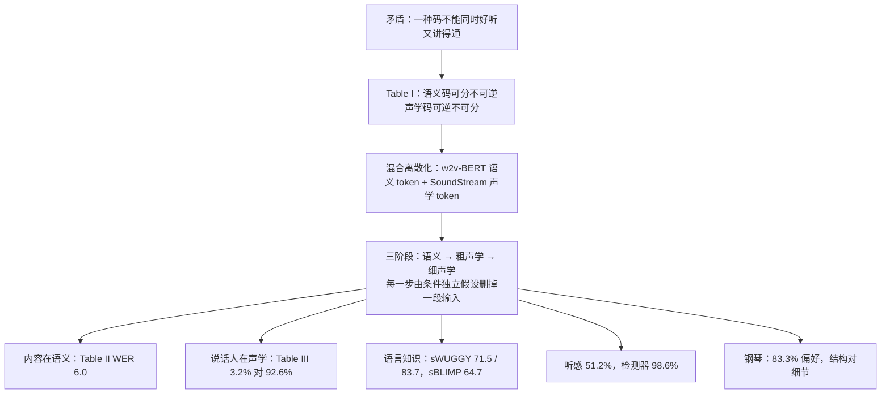

# AudioLM：一种离散码扛不住音质和结构，于是先写语义、再写声学

<!-- release-date: 2022-09-07 -->

> 本文依据 Google Research 的 **AudioLM: a Language Modeling Approach to Audio Generation**，arXiv:2209.03143v2，2023-07-26 修订，共 11 页（正文与结论 9 页，参考文献 2 页）。页码均指 PDF 自身的页码。文中区分三件事：**论文明确写了什么**、**我们怎么解释它**、**哪些是外部资料或本文推算**。

## 读前先把几个词说成人话

这篇论文难读的地方不是公式，而是它把「音频 token」拆成了两种性格完全相反的东西。后面所有实验，都在回答「哪种信息住在哪种 token 里」。

- **Token（词元）**：语言模型读写的基本小块。文本里常是一个子词；这里是一小段声音的离散编号。
- **自回归语言模型**：每次只预测下一个 token，条件是已写出的全部历史。AudioLM 把文本 GPT 的这套做法搬到声音上。
- **神经音频编解码器（neural audio codec）**：把波形压成很低速率的离散码，再从码还原波形。本文用 SoundStream。
- **残差向量量化（Residual Vector Quantization，RVQ）**：一层一层地量化「上一层没解释掉的残差」。第一层抓最粗的形状，后面各层补越来越细的误差。
- **自监督语音表示**：不用转写，只靠音频自身结构学出的特征。本文用 w2v-BERT，它同时用对比损失和掩码语言建模（MLM）损失训练。
- **ABX 错误率**：拿只有中间音素不同的三音素组（如「bit」与「bet」）来测，表示能不能把同类音靠在一起、异类音分开。越低越好，衡量**音素可分性**。
- **ViSQOL**：用计算模型近似「重建声音听起来像不像原声」的分数，越高越好，衡量**重建质量**。

论文自己的名字只有三个：

- **语义 token（semantic tokens）**：w2v-BERT 中间层特征做 k-means 后的簇编号，负责长期结构。
- **声学 token（acoustic tokens）**：SoundStream 的 RVQ 码，负责能还原回去的细节。
- **粗声学 / 细声学（coarse / fine）**：RVQ 的前 $Q'$ 层与后 $Q-Q'$ 层，分给两个语言模型来写。

## 一句话先说清

2022 年的音频生成卡在一个具体的矛盾上：**一种离散码很难同时又好听、又讲得通。**

- 高保真波形模型（WaveNet、对抗声码器、扩散）在没有音素或 MIDI 这类强条件时，会生成「咿呀学语」式的无结构音频（PDF p. 1）。
- 「无文本 NLP」路线（如 GSLM）在离散语音单元上训语言模型，能说出有句法的话，但只在干净语音上训练、只能合成单一说话人，音质有限（PDF p. 1–2）。

AudioLM 不去发明一种「两头都好」的码，而是承认两种码各管一件事，再把生成拆成三段：

> **先用语义 token 把整段内容写完，再用粗声学 token 补上「谁在什么样的房间里说」，最后用细声学 token 抹掉压缩痕迹。**

它要证明的是：只要把「说什么」和「听起来像什么」拆开，**3 秒**的 prompt 就能续写出听者几乎分不出真假的语音（51.2%，与随机无显著差别），同一骨架换到钢琴上也不需要乐谱（PDF p. 8–9）。

## 主要矛盾：短、可还原、有长期结构，三样要同时满足

### 为什么必须先离散化

自注意力的代价随序列长度平方增长，约 $10^3$ 个 token 还能承受（PDF p. 2）。原始波形撑不住：16 kHz 的一秒钟就是 16,000 个采样点。图像和长视频的通行做法是先把信号映射到紧凑的离散空间，在那里做自回归，再映射回去（PDF p. 2）。AudioLM 照此搭了三块（PDF p. 3）：

1. **Tokenizer**：把单声道波形 $x\in\mathbb{R}^{T}$ 编成离散序列 $h=\mathrm{enc}(x)$，长度 $T'$ 比 $T$ 通常短两到三个数量级；
2. **只解码器 Transformer**：最大化 $\prod_{t=1}^{T'} p(h_t\mid h_{<t})$，推理时自回归地写出 $\hat h$；
3. **Detokenizer**：$\hat x=\mathrm{dec}(\hat h)$，把码还原成波形。

Tokenizer 和 detokenizer 预先训好再冻住，与语言模型解耦，训练因此变简单（PDF p. 3）。

### 矛盾出在 tokenizer 身上

论文把要求说得很清楚（PDF p. 3）：要高质量还原波形，码率就有下限，序列就不能太短；要让语言模型抓住长期依赖，序列又要紧凑。现成的 tokenizer 给不出一个同时满足的码，但能给出两种互补的码：

图引自原文 Fig. 1（PDF p. 3）。两路并行、互不依赖；左边那一路的解码器就是最后把码还原成声音的 detokenizer。

## 两种 token 各是什么

### 声学 token：SoundStream 的 RVQ 码

SoundStream 是端到端神经编解码器，低码率下明显优于 Opus、EVS 这类非神经编解码器（PDF p. 3）。卷积编码器把 16 kHz 波形变成 50 Hz 的嵌入（每 20 毫秒一帧），采样率降为 $16000/50=320$ 分之一。每帧再用 $Q$ 层 RVQ 量化，每层词表 $N$。论文的例子是 $N=1024$、$Q=4$（PDF p. 3）：

$$
50 \times 4 \times \log_2 1024 = 2000\ \text{bps}
$$

波形于是变成码矩阵 $Y\in\{1,\ldots,N\}^{T_A\times Q}$，$T_A=T/320$。解码器用重建损失加对抗损失端到端训练（PDF p. 3）。

主实验用 12 层 RVQ、每层 1024 个码字，4 个卷积块步幅为 $(2,4,5,8)$，得到 50 Hz、6000 bps、每秒 600 个声学 token（PDF p. 6）。$2\times4\times5\times8=320$，正好对上 320 倍降采样（本文验算）。

### 语义 token：w2v-BERT 中间层的 k-means 编号

w2v-BERT XL 是 0.6B 参数的 Conformer，用 MLM 损失加对比损失预训练（PDF p. 3、p. 6）。它本可以微调去做识别或语音翻译；AudioLM 只借用预训练表示来抓长期结构（PDF p. 3）：

1. 取 MLM 模块某个中间层的 1024 维特征，25 Hz（每 40 毫秒一帧）；
2. 每一维先标准化到零均值、单位方差——论文说这一步能**显著提高音素可分性**；
3. 跑 k-means，用簇中心编号当语义 token。

得到 $z\in\{1,\ldots,K\}^{T_S}$，$T_S=T/640$；$T=16000$、$K=1024$ 时码率 250 bps（PDF p. 3）。论文自己点明，这与 GSLM 从 HuBERT 抽离散单元是同一类做法（PDF p. 3）。

### 选哪一层、分几簇

图引自原文 Fig. 3（PDF p. 6）。论文说它看了 ABX、sWUGGY、sBLIMP 三个分数，再加一小轮听续写的主观测试，最后定为**第 7 层、$K=1024$**（PDF p. 6）。

图上有一个值得看清的地方：**单看 ABX，第 8 层比第 7 层还低一点**；右图里 sWUGGY 在 512 簇最高，sBLIMP 在 1024 与 2048 最高。所以「第 7 层、1024 簇」不是任何一个指标的最优，而是几个指标加听感的折中。论文没有说明为什么舍第 8 层取第 7 层，只说是「最佳候选」。图上也没有印精确读数。

## Table I：一种码扛不住的全部证据

为了让两种码能放在同一张表里比，ABX 一律在量化后的表示上算：w2v-BERT 一侧用对应簇中心，SoundStream 一侧用量化器输出，脚本来自 Libri-Light，分数报在 LibriSpeech dev-clean 上。重建质量则是为每种 token 另训一个 SoundStream 解码器，算 16 kHz「speech」模式的 ViSQOL（PDF p. 4）。

| 离散化 | 码率 | ABX 说话人内 / 跨说话人（↓） | ViSQOL（↑） |
|---|---:|---:|---:|
| 语义（w2v-BERT） | 250 bps | 6.7 / 7.6 | 1.1 |
| 语义（w2v-BERT） | 6000 bps | 5.6 / 6.2 | 1.4 |
| 声学（SoundStream） | 2000 bps | 22.4 / 28.7 | 3.3 |
| 声学（SoundStream） | 6000 bps | 17.8 / 26.6 | 3.9 |

表引自 Table I（PDF p. 4）。两件事同时成立：

1. **声学码好听，但音素分不清。** 6000 bps 时 ViSQOL 到 3.9，ABX 仍在 17.8 / 26.6。
2. **语义码音素分得清，但几乎还原不回去。** 码率拉到和声学码一样的 6000 bps，ViSQOL 也只有 1.4。

**码率不是瓶颈。** 同一码率下两边的短板互换不了。论文在相关工作里早已说明原因：自监督表示不是为编码原始信号的细节而优化的，「很难反演，因而不能直接用于合成」（PDF p. 2）。语义 6000 bps 那一行具体怎么量化出来的，论文没写。

还有一个更直观的对照：只在声学 token 上训一个只解码器 Transformer，用 4 秒 prompt 续写。录音条件和说话人都保住了，语言内容却前后不一，「常常像咿呀学语」（PDF p. 4）。**没有语义码，声学语言模型会记住音色，忘掉句子。**

## 核心设计：分层建模，先写大纲，再写音色，最后补细节

### 新设计：两种码分工，按层级生成

论文的假设是：语义 token 保证长期一致（语音里是语言内容，音乐里是旋律和节奏），声学 token 保证高质量合成（PDF p. 4）。于是先对整段序列建模语义 token，再用它们当条件去预测声学 token。

为什么不把两种码交错成一条序列？论文给了两条理由（PDF p. 4）：

1. **条件独立。** 给定过去的语义，当前语义应当不再依赖过去的声学：

$$
p(z_t \mid z_{<t},\, y_{<t}) \approx p(z_t \mid z_{<t})
$$

2. **每段序列更短**，训练和推理都更省。

三个阶段各用一个独立的只解码器 Transformer，训练时都是「看见该阶段已有的全部真值 token，预测下一个」（PDF p. 4）。

### 三个阶段各写什么

**阶段一 · 语义建模**：只建模 $p(z_t\mid z_{<t})$，写出整段的内容骨架（PDF p. 4）。

**阶段二 · 粗声学建模**：在整段语义 $z$ 的条件下，只预测前 $Q'$ 层 RVQ（PDF p. 4）：

$$
p\big(y_t^{q} \mid z,\; y_{<t}^{\le Q'},\; y_t^{<q}\big), \qquad q \le Q'
$$

读法：第 $t$ 帧第 $q$ 层的粗码，可以看全部语义、过去各帧的粗码、以及本帧更粗的几层。训练序列把语义放最前，粗码按时间、每帧从粗到细展平：$(z_1,\ldots,z_{T_S},\,y_1^{1},\ldots,y_1^{Q'},\,y_2^{1},\ldots,y_{T_A}^{Q'})$，第一个要预测的是 $y_1^1$（PDF p. 4）。

为什么粗码适合放在这里？论文的解释是 RVQ 天然分层：**粗量化器恢复说话人身份、录音条件这类声学属性，只把精细细节留给细量化器**（PDF p. 4）。

**阶段三 · 细声学建模**：在全部粗码的条件下预测后 $Q-Q'$ 层，去掉阶段二之后残留的有损压缩痕迹（PDF p. 4–5）：

$$
p\big(y_t^{q} \mid y^{\le Q'},\; y_{<t}^{>Q'},\; y_t^{<q}\big), \qquad q > Q'
$$

主实验取 $Q=12$、$Q'=4$：阶段二写前 4 层（2000 bps），阶段三写后 8 层，把码率补到 6000 bps，也就是 Table I 里 ViSQOL 从 3.3 到 3.9 的那一步（PDF p. 6）。每个语义 token 因此对应阶段二的 $2Q'=8$ 个、阶段三的 $2(Q-Q')=16$ 个声学 token；那个 2 来自 SoundStream 帧率是 w2v-BERT 的两倍（PDF p. 5，Fig. 2 图注）。为了让 12 层码表在一个词表里不撞号，第 $i$ 个位置加偏移 $o_i=((i-1)\bmod Q)\cdot N$（PDF p. 4）。

### 为什么是三个模型，不是两个

阶段二和阶段三本可以合成一个模型。拆开是为了限制一次要处理的长度，理由是另外两条独立假设（PDF p. 5）：

- 给定粗码，细码不再依赖语义，所以阶段三**完全不看语义 token**；
- 细节主要由粗码在局部决定，所以阶段三在**互不重叠的 3 秒切片**上跑，长度与目标音频无关，也就能放心加厚 $Q$ 换音质。

本文根据 PDF p. 3–6 的帧率、$Q=12$、$Q'=4$ 与训练裁剪长度（30、10、3 秒）画的讲解图，token 数是本文算术，论文没有列出。阶段一、二还会去掉连续重复的语义 token（PDF p. 6），实际更短。

**我们怎么解释它。** 三条独立假设合在一起，才是「三个模型」的理由：每一条都删掉了一大段条件，删掉的条件就是省下的序列长度。语义不看声学，于是阶段一能看 30 秒；细码不看语义且只看局部，于是阶段三能切片。

### 三种推理方式

同一套训练好的模型，给不同的条件就得到不同的生成（PDF p. 5）：

- **无条件生成**：先无条件采样全部语义 token，再当条件采样声学 token。样本的说话人、韵律、录音条件各异，但内容仍有句法和语义。
- **声学生成**：语义 token 取自一条真实测试语音，只采样声学 token。说话人会变，说的内容与原句转写一致。后面 Table II、III 用的就是这个设置。
- **续写**（主应用）：

按 PDF p. 5 第 III-D 节重画的流程示意。关键在阶段二：它看到的是「prompt 语义 + 阶段一新写的语义」加上 prompt 的粗声学前缀。新内容的结构在阶段一就定了，阶段二负责给新内容套上与 prompt 一致的声学外壳。

### 这一节可以带走什么

两个目标在同一张表上对打时，先拆表示，再拆生成顺序，往往比继续加大码率有效。拆的依据要能写成条件独立假设，并且每条假设都要真的删掉一段输入；只换模块名字、不删条件，序列长度不会降，分层就是空的。

## 数据、模型与训练

**语音数据。** SoundStream、w2v-BERT、k-means、三个 Transformer 全部在 Libri-Light 的 unlab-60k 上训练，约 60k 小时英语语音（PDF p. 5）。先前工作常用其中 6k 小时的干净子集训语言模型；AudioLM 用更杂、更吵的全集依然表现良好，论文认为这降低了数据准备成本（PDF p. 5–6）。

**模型。** 三个阶段的 Transformer 规格相同（PDF p. 6）：

| 项 | 取值 |
|---|---|
| 层数 / 头数 | 12 / 16 |
| 嵌入维 / 前馈维 | 1024 / 4096 |
| Dropout | 0.1 |
| 位置编码 | T5 风格相对位置编码 |
| 每阶段参数 | 0.3B |
| 训练裁剪长度 | 30 / 10 / 3 秒（三个阶段） |
| 算力 | 每阶段 16 块 TPUv4，batch 256，训练 1M 步 |
| 推理温度 | 0.6 / 0.8 / 0.6 |

前两个阶段沿用 GSLM 的做法，去掉语义 token 的连续重复。温度是多样性与语义一致性之间的折中（PDF p. 6）。

**论文没写的**：优化器与学习率、SoundStream 的参数量、语义 token 与声学 token 在词表里如何拼接、去重复之后序列短了多少。三个 0.3B 只算语言模型；冻住的 w2v-BERT XL 另有 0.6B。

## 实验一：语义 token 里有没有「内容」

设置是声学生成：语义 token 取真值，跑阶段二和阶段三，然后用 Conformer Transducer-L 做语音识别，看转写能否对上原文。样本来自 LibriSpeech test-clean 中 4–10 秒的句子（5.4 小时里留下 2.2 小时），每句生成 3 次。对照是 GSLM 的 unit-to-speech，用来自 HuBERT 的 200 词表，这是 GSLM 论文里重合成误差最低的一档（PDF p. 6）。

| | 原声 | SoundStream 重建 | AudioLM 声学生成 | GSLM unit-to-speech |
|---|---:|---:|---:|---:|
| CER | 0.8 | 0.9 | 3.4 | 2.9 |
| WER | 2.5 | 2.6 | 6.0 | 6.6 |

表引自 Table II（PDF p. 6）。论文的读法（PDF p. 7）：

- 声学生成的转写紧跟原文，说明**语义 token 抓住了内容**；
- SoundStream 重建与原声几乎一样，所以 AudioLM 多出来的错误**主要来自「语义 → 声学」这一步**，不是编解码器；
- 错误主要出在专有名词，其次是句末 token 没在该出现的位置出现；声学生成还会合成不同的录音环境，背景噪声也会拖累识别。

与 GSLM 相比整体相近（WER 更低、CER 略高）。但 GSLM 只合成单一干净音色，AudioLM 在说话人和房间都在变的情况下保住了内容，这是同一张表里最容易漏掉的不对称（PDF p. 7）。

## 实验二：声学 token 里有没有「人」

反过来的假设是：说话人和录音条件主要在声学 token 里。论文训了一个说话人分类器（PDF p. 7）：输入 log-mel（25 毫秒窗、10 毫秒跳、64 个 mel 频带），裁成 1 秒；六个卷积块，通道 $[64,128,256,256,512,512]$，沿时间和频率分别用 $3\times1$ 与 $1\times3$ 卷积，通道加倍时两轴各做步幅 2 的最大池化；长于 1 秒的序列用 1 秒窗、250 毫秒跳滑动再聚合。训练数据是 LibriSpeech train-clean-100 与 test-clean 的未压缩原声，共 291 个说话人，90% / 10% 划分；分类器在评估集上几乎完美，对 SoundStream 压缩也稳健。

| | SoundStream 重建 | 声学生成（语义取真值） | 续写（3 秒 prompt） |
|---|---:|---:|---:|
| 说话人分类准确率 | 100.0% | 3.2% | 92.6% |

表引自 Table III（PDF p. 6），续写一列的设置在 PDF p. 8 才交代。3.2% 要连着分母读：随机猜是 $1/291\approx0.3\%$（PDF p. 7）。它高于随机，但远谈不上认得出人，说明**语义 token 几乎不带说话人信息**。

论文另有两条主观观察，不是分类器数字（PDF p. 7）：同一组语义 token 采样出的多条语音，节奏和语调只有轻微差别，说明韵律主要在语义 token 里、声学 token 有一点贡献；录音条件则差异很大，说明它主要在声学 token 里。

把 Table II、III 与这两条观察并起来（「是 / 否」一列为本文整理）：

| 信息 | 主要在语义 token | 主要在声学 token | 证据类型 |
|---|---|---|---|
| 说的内容 | 是 | 否 | Table II |
| 说话人 | 否 | 是 | Table III |
| 录音条件 | 否 | 是 | 主观观察 |
| 韵律 | 主要是 | 少量 | 主观观察 |

## 实验三：语义语言模型学到词法和句法了吗

语义 token 抓住内容，不等于阶段一的语言模型学会了「哪个音串像词、哪句话合语法」。论文用 ZeroResource Challenge 2021 的两个零样本指标（PDF p. 7）：

- **sWUGGY**：一对读音相近的真词和假词（如 brick / blick），模型是否给真词更高概率。开发集 10,000 对，四种音色合成；另报只保留 LibriSpeech 词表内真词的 in-vocab 子集。
- **sBLIMP**：一对合语法与不合语法的句子（如 the dogs sleep / the dog sleep），模型是否给前者更高概率。开发集 6,300 对。

判定就是比较对数似然。sBLIMP 的正例平均更短，会让未归一化的分数偏高，所以所有实验都按序列长度归一化（PDF p. 7）。

| 模型 | sWUGGY 全部 | sWUGGY in-vocab | sBLIMP |
|---|---:|---:|---:|
| 强制对齐 topline（有文本） | 92.2 | — | 63.7 |
| 音素 topline（有文本） | 97.9 | — | 66.8 |
| BERT baseline（非因果） | 67.7 | 75.6 | 56.1 |
| HuBERT-only（非因果） | 70.9 | 79.8 | 59.5 |
| Harwath 等（非因果） | 67.6 | 75.4 | 56.7 |
| CPC-BERT（非因果） | — | 80.0 | 59.9 |
| van Niekerk 等（因果） | 64.3 | 72.3 | 54.0 |
| GSLM（因果） | — | 68.7 | 57.1 |
| **AudioLM（因果）** | **71.5** | **83.7** | **64.7** |

表引自 Table IV（PDF p. 8），加粗是论文标的「无文本监督模型中最好」。读法（PDF p. 8）：

- 无文本监督里 AudioLM 两个 sWUGGY 切分都最高；sBLIMP 比此前最好的 CPC-BERT（59.9）相对提高 8%；
- sBLIMP 64.7 甚至超过用强制对齐音素转写训练的监督 topline（63.7）；脚注说不做长度归一化时是 67.5，还会超过音素 topline 的 66.8；
- 真正同一设定的对手是因果模型：in-vocab sWUGGY 83.7 对 GSLM 的 68.7，sBLIMP 64.7 对 57.1，差距比和非因果模型比更大。非因果模型不适合做生成（PDF p. 8）。

这些分数测的是阶段一，不经过声学生成。它回答「在离散语义码上做语言建模能不能学到词法和句法」，不回答「合成出来好不好听」。

## 实验四：3 秒 prompt 能不能续成同一个人、骗过人耳

### 说话人保持

从 LibriSpeech test-clean 中 4–10 秒的句子裁出 3 秒 prompt，每个生成 3 条 7 秒续写，分类器**只打续写段**。准确率 92.6%，论文写成「高于 92%」（PDF p. 8）。语义 token 几乎不带说话人，但 prompt 同时给了语义前缀和粗声学前缀之后，身份被保住了，这与阶段二的设计一致。

### 人耳测试

主观测试的设置（PDF p. 8）：

- 从 LibriSpeech test-clean 中随机抽 100 条至少 10 秒的句子，全部截成恰好 10 秒，避免补零；
- 一半是原声，但先用 SoundStream 压到与 AudioLM 输出相同的码率，让压缩痕迹不能当线索；
- 另一半取开头 3 秒当 prompt，生成恰好 7 秒的续写，拼回 10 秒；
- 10 名通过英语能力筛查的评分人，被告知每条前 3 秒是真人，只判断之后的部分；共 1,000 次评分。

这一个任务同时考三件事：内容的语义与句法是否正确、续写与 prompt 在说话人 / 韵律 / 录音条件上是否连贯、有没有生成伪影。评分人判对「原声还是合成」的比例是 **51.2%**，二项检验与随机 50% 没有统计显著差别（$p=0.23$）（PDF p. 8）。

论文的口径很窄：在**非配对、10 秒、前 3 秒已知为真**的设置下，普通听者分不出短续写与真声。它没有测更长的样本、配对 A/B 比较或专业听音员。

### 检测器

正因为人耳不可靠，论文训了一个检测器：结构同说话人分类器，改成二分类，区分「经 SoundStream 压缩的原声」与「AudioLM 续写（不含 prompt）」。原声也先压缩，是因为不压缩任务就太简单（模型很快收敛到 100%），压缩痕迹还会成为混淆因素。训练数据来自 LibriSpeech train-clean-100、1 秒裁剪，在平衡评估集上准确率 **98.6%**（PDF p. 8–9）。

论文的原话是：续写对人耳「（几乎）不可分」，对一个简单的音频分类器却「非常容易检测」（PDF p. 9）。两个数字必须一起读：51.2% 说明误用风险真实存在，98.6% 说明至少对这一版 AudioLM 自己的输出，检测可行。论文没有在其他合成系统或其他码率上测试这个检测器。

## 实验五：钢琴，没有乐谱，语义 token 仍在管结构

语音上的分工（内容对说话人）容易让人以为这套拆法只对语言成立。钢琴实验就是来拆这个误解的（PDF p. 9）。

所有组件在内部 40k 小时钢琴数据上重训，演奏者从入门到专家，声学条件很杂，内容从音阶练习到名曲。超参与语音相同，只改了声学一侧：3 层量化、每层词表 $2^{14}$ 就已经能高质量重建，所以**不跑阶段三**，阶段二直接预测全部 3 层。推理时从 Maestro 数据集取 4 秒 prompt（PDF p. 9）。

对照是只用声学 token 训练的模型：两边音质同样高，只有完整 AudioLM 的续写旋律和时间结构前后一致。主观测试里 10 名评分人比较 15 对、每条 20 秒、同一 prompt 的续写，**83.3%** 的配对更偏好 AudioLM（PDF p. 9）。

论文由此把主张推广：从语义到声学的分层建模，不只是通过分开语言内容与说话人身份帮助语音，更一般地，是通过显式解耦**长期结构与局部声学细节**改进音频生成（PDF p. 9）。

**我们怎么解释它。** 钢琴一侧没有任何客观指标，没有等价于 WER、ABX 或 sBLIMP 的旋律或和声测量，只有 15 对、10 人的偏好。证据强度与语音一侧不对称。

## 论文自己划的边界

**结论里提的后续方向**，论文只做鼓励、没有实验：多语言语音、复调音乐、一般音频事件，以及把 AudioLM 接进编码器—解码器框架做有条件任务，如文本转语音、语音到语音翻译（PDF p. 9）。

**更广泛影响**写得很具体（PDF p. 9）：

- 建模语音时，AudioLM 继承文本语言模型的全部问题，包括反映数据里的社会偏见，详细讨论指向 PaLM 论文；
- 对训练数据里代表性不足的群体，续写可能在口音和方言上与 prompt 不一致；
- 能在保持说话人和韵律的同时续写短语音，可能被用来欺骗生物特征识别或冒充特定说话人。

缓解手段就是那个 98.6% 的检测器，论文称之为这个方向上「重要的一步」，没有说已经足够。

**实验设置里看得见、但正文没有当作限制来写的**（本文整理）：

1. 语音只覆盖英语有声书域（Libri-Light / LibriSpeech）；钢琴是内部数据加 Maestro prompt。
2. 续写本身没有 WER：Table II 的 WER 来自语义取真值的声学生成，不是 3 秒续写。
3. 没有推理延迟、吞吐与算力数字；三阶段串行采样的代价没有讨论。
4. 没有与 WaveNet、Jukebox、Perceiver AR 在同一任务上的自动指标对比。
5. 语义 6000 bps 那一行的实现、第 7 层与第 8 层的取舍依据，正文都没写清。

## 可迁移启发

### 1. 两个指标对打时，先拆表示，再拆生成顺序

Table I 是全文的发动机：同一码率下，语义码和声学码的短板换不走。AudioLM 没有去训一个两头都第一的 tokenizer，而是让每个 tokenizer 做它已经擅长的事，把冲突交给生成顺序。遇到「一个表示既要当索引又要当像素」的系统，先分通道，再分层预测。

### 2. 条件独立假设必须真的删掉输入

语义不看声学、细码不看语义、细码只看局部，每一条都直接变成更短的 Transformer 输入，以及阶段三按 3 秒切片、与目标长度无关的能力。要问的不是「分了几层」，而是「这一层的假设让模型少看了哪些 token」。

### 3. RVQ 的残差顺序可以直接当生成顺序

粗层先解释能量最大的残差，于是说话人和房间落在前几层，细节落在后几层。AudioLM 没有另训「内容编码器 / 音色编码器」，而是借用量化器已经学到的顺序，$Q'=4$ 就是把这个顺序切成两个语言模型的分界。在任何多码本离散化上接生成模型之前，都值得先做一次 Table I 式的探针。

### 4. 冻住 tokenizer，让语言模型只做语言建模

SoundStream 与 w2v-BERT 预训练后冻住，训练变简单，换数据域（语音 → 钢琴）时整套 tokenizer 重训即可。代价是两端不能联合优化，语义码的不可逆也无法被生成目标反哺。这是 2022 年让实验跑起来的工程选择，不是永远正确的原则。

### 5. 「人分不出」和「机器分得出」要一起报

51.2% 与 98.6% 不互相抵消：前者说明误用面真实，后者说明至少对这一版模型检测面也真实。生成论文只报听感不报可检测性，等于只写了一半；检测器的边界（同模型、同码率、同压缩）也要写清。

### 6. 通用性靠「换域、不换骨架」来证明

钢琴实验几乎没改超参，只改 RVQ 层数与词表，并因为 3 层已够好而关掉阶段三。骨架能在无文本语音和无乐谱钢琴之间共用，说明分层的对象是「结构对细节」，不只是「音素对音色」。

## 用一张图重新串起全文

## 关键词回看

- **混合离散化**：语义码抓长期结构，声学码抓可还原的细节，不强迫一种码两头都好。
- **语义 token**：w2v-BERT XL MLM 模块第 7 层、25 Hz、k-means $K=1024$，250 bps；音素可分、不可逆。
- **声学 token**：SoundStream 12 层 RVQ、每层 1024、50 Hz，6000 bps，每秒 600 个。
- **RVQ 粗细分层**：前 4 层管说话人与录音条件，后 8 层补细节；对应阶段二与阶段三。
- **条件独立**：给定过去语义，当前语义不再看声学；给定粗码，细码不再看语义且只看局部。
- **三种推理**：无条件生成、声学生成（语义取真值）、续写（3 秒语音或 4 秒钢琴 prompt）。
- **ABX / ViSQOL**：Table I 的两根轴，一个测音素可分，一个测重建听感。
- **sWUGGY / sBLIMP**：零样本词法与句法探针，测的是阶段一的语义语言模型。

## 最后的判断

AudioLM 的贡献不是「音频也能 next-token」——GSLM 已经在离散语音单元上做过语言模型。它做的是把一个被当成 tokenizer 问题的矛盾，改写成一个**生成顺序问题**：

- Table I 证明一种码不能同时好听又可分；
- 条件独立假设把这个矛盾翻译成三段更短的序列；
- RVQ 的残差顺序给粗细切分提供了不必另训的依据；
- Table II、III 分别钉住「内容在语义、身份在声学」，Table IV 证明语义语言模型学到了词法和句法。

证据强度也是分层的：

- **有直接实验支撑的**：Table I–IV、说话人保持 92.6%、听感 51.2%、检测器 98.6%；
- **只有主观观察的**：韵律主要在语义 token、录音条件主要在声学 token、钢琴的旋律一致性（只有 15 对偏好）；
- **没有公开的**：优化器与学习率、SoundStream 大小、推理代价、续写本身的 WER、检测器的跨模型泛化。

> **两个指标在同一张表上对打时，不要再找一种两头都好的码。让一种码写大纲，另一种码写音色，生成顺序比码本形状更重要。**

## 资料与阅读边界

- **原始依据**：`papers/Google/AudioLM.pdf`，arXiv:2209.03143v2（2023-07-26 修订），11 页。[arXiv 论文页](https://arxiv.org/abs/2209.03143)只有 v1（2022-09-07）与 v2 两版，v2 即最新版。该版对应 IEEE/ACM Transactions on Audio, Speech, and Language Processing 第 31 卷 2523–2533 页（[DOI 10.1109/TASLP.2023.3288409](https://doi.org/10.1109/TASLP.2023.3288409)），本文没有逐页对照期刊版。
- **首发日**：AudioLM 没有对外开放权重、API 或产品，按「技术首次官方公开日」取 arXiv v1 的 2022-09-07；Google Research 博客 [AudioLM: a Language Modeling Approach to Audio Generation](https://research.google/blog/audiolm-a-language-modeling-approach-to-audio-generation/) 标注 2022-10-06，晚于 v1。
- **外部补充**：演示样本在论文脚注给出的[项目页](https://google-research.github.io/seanet/audiolm/examples/)；官方没有随论文开源训练代码或权重。同方向的后续做法（把语义信息蒸馏进一个流式 codec、把语义与声学收进同一个生成模型）见 Moshi 一篇，本文不回填。
- **本文推算**：步幅乘积 320 的验算、三阶段序列长度与平方比、随机基线 $1/291$ 的换算、图 3 上「第 8 层 ABX 更低」的读图，都是本文所做，不是论文给出的数字或结论。
