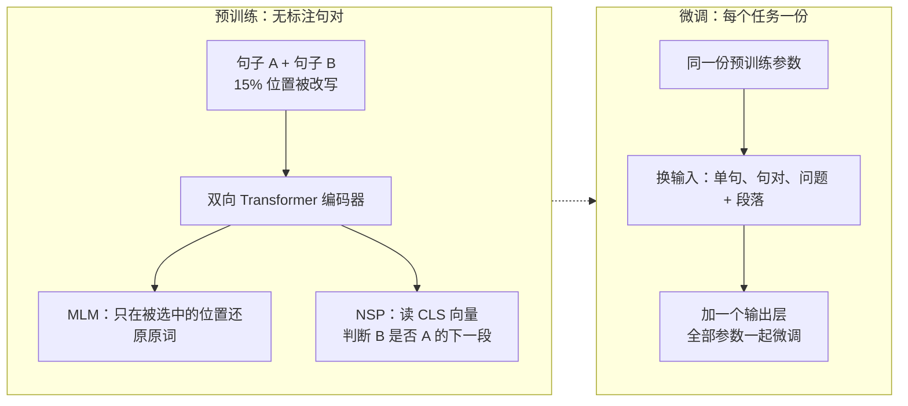
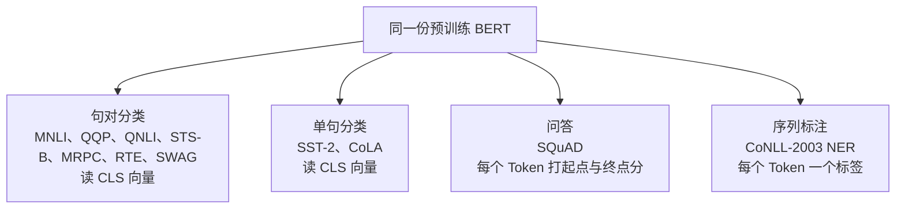

# BERT：换一个不泄露答案的目标，双向预训练之后微调只加一层

<!-- release-date: 2018-10-31 -->

> 本文依据本地 `papers/Google/BERT.pdf`，即 Devlin、Chang、Lee、Toutanova（Google AI Language）的 **BERT: Pre-training of Deep Bidirectional Transformers for Language Understanding**，arXiv:1810.04805v2、2019-05-24 提交，共 16 页（正文 p. 1–9，参考文献 p. 10–12，附录 p. 12–16）。页码均指 PDF 自身的页码。文中会区分三件事：**论文明确写了什么**、**我们怎么解释它**、**哪些是外部资料或本文推算**。

## 读前先把几个词说成人话

这篇论文公式很少，难点在于它反复拿同几组概念做对照。先把它们说清楚：

- **Token（词元）**：模型读写文本的最小单位。BERT 用 **WordPiece** 子词切分，词表 30,000；词表里没有的词拆成几块，后面几块前加 `##`，例如 `playing` 切成 `play ##ing`。
- **自注意力（self-attention）**：每个位置去问「我该看序列里哪些位置」。**双向**指可以看左右两边；**从左到右**指只能看自己和左边。
- **预训练（pre-training）**：先在大量无标注文本上训练一个通用模型。
- **两种用法**：**特征式（feature-based）** 把预训练模型冻住，只把它的输出当额外特征接进任务专用网络，代表是 ELMo；**微调式（fine-tuning）** 把预训练参数当起点，整网在下游标注数据上继续训练，代表是 OpenAI GPT。
- **Cloze（完形填空）**：把句子里的词挖掉，根据上下文猜回去。

论文自己的几个名字：

- **BERT（Bidirectional Encoder Representations from Transformers）**：用 Transformer 编码器做深层双向预训练的语言表示模型。
- **MLM（Masked Language Model，掩码语言模型）**：随机盖住一些词，只根据左右上下文还原它们。
- **NSP（Next Sentence Prediction，下一句预测）**：判断第二段文本是不是第一段在原文里的下一段。
- **`[CLS]` / `[SEP]` / `[MASK]`**：放在每条序列最前面、专供分类读取的符号；分隔两段文本的符号；预训练时盖住词的占位符。

## 一句话先说清

2018 年，把预训练表示用到下游任务有两条路：ELMo 走特征式，GPT 走微调式。论文指出两条路**共用同一个预训练目标：单向语言模型**（PDF p. 1）。这个目标逼着 GPT 只能用从左到右的注意力，每个词只能看左边。这对句子级任务是次优，对问答、命名实体这类**词级任务可能非常有害**，因为它们必须同时看两边（PDF p. 1）。

BERT 用两个预训练任务回答（PDF p. 1–2、p. 4）：

1. **MLM**：先把要预测的词从输入里拿掉，于是每一层都可以合法地看左右，得到**深层双向**的表示；
2. **NSP**：额外练「两段文本是什么关系」。

表示本身已经双向，下游任务就不必各自设计复杂网络。论文的原话是：预训练好的 BERT **只加一个输出层**，就能微调出问答、推理等一大批任务的先进模型，不需要实质性的任务专用结构改动（PDF p. 1）。摘要给的成绩是（PDF p. 1）：

- 11 项 NLP 任务刷新当时最好结果；
- GLUE 分数 80.5%（绝对提升 7.7 个点）；
- MultiNLI 准确率 86.7%（绝对提升 4.6 个点）；
- SQuAD v1.1 测试 F1 93.2（提升 1.5）；SQuAD v2.0 测试 F1 83.1（提升 5.1）。

如果只记一句话：

> **双向不是「多看几个词」，而是换一个不会泄露答案的目标。目标换对了，表示里就装下了下游要的「看两边」，任务头才薄得只剩一层。**

### 一条阅读路线

只有半小时的话，按这个顺序读原文：

1. **p. 1 引言**：单向目标卡住了什么；
2. **p. 3 Figure 1 与 p. 13 Figure 3**：预训练与微调同构，以及 BERT、GPT、ELMo 三种结构的差别；
3. **p. 4「Task #1」「Task #2」**：MLM 的 15% 与 80 / 10 / 10、NSP 的 50 / 50；
4. **p. 5 Figure 2 与第 3.2 节**：三种嵌入相加，下游只换 A、B 两个槽位；
5. **p. 8 Table 5**：去掉 NSP、改回从左到右各掉多少——这是全文最关键的对照；
6. **p. 8–9 Table 6、Table 7**：模型大小与特征式；
7. **p. 12–16 附录**：训练配方、掩码样例、训练步数与掩码策略消融。

## 主要矛盾：单向目标卡住了网络能用的结构

先看一个不需要新名词的例子（本文构造的例子，不是论文的）：句子 `I accessed the bank account` 里，要判断 `bank` 是「银行」，最有用的证据是后面的 `account`。从左到右的模型编码 `bank` 时，只看得到 `I accessed the`。

那为什么不直接把语言模型的条件改成「左右两边」？论文说不行：标准条件语言模型只能从左训到右或从右训到左，因为**双向条件会让每个词间接「看见自己」**，多层网络里模型可以轻易把目标词复制出来（PDF p. 4）。

**我们如何解释它。** 设要预测位置 $i$ 的词。第 1 层里位置 $j$ 读了位置 $i$ 的输入；到第 2 层，位置 $i$ 再去读位置 $j$，就把自己原来的内容读了回来。答案已经漏进输入，训练目标就没有意义了。所以「双向」不能靠去掉注意力掩码得到，必须先把答案从输入里拿走。

已有的两条路各卡在一处（PDF p. 1–2、p. 13）：


- **GPT**：微调式，几乎不加任务参数，但表示是单向的；
- **ELMo**：用从左到右、从右到左两个独立训练的 LSTM，把两边向量拼起来当特征。它是双向的，但论文称之为**浅层拼接**；
- **BERT**：三者中只有它的表示在**所有层**都同时以左右上下文为条件（PDF p. 13，Figure 3 图注）。

于是矛盾变成：

> 微调式需要的是深层双向的表示，可当时唯一的预训练目标——语言模型——只能单向训练。要么接受单向，要么像 ELMo 那样只在顶上拼接。BERT 要找第三条路：换一个目标，让每一层都能合法地双向。

## 先看全景：预训练和微调几乎同构



这张图据 PDF p. 3 Figure 1 重画，是机制示意。图注强调三点（PDF p. 3）：除了输出层，预训练和微调用的是**同一个结构**；不同下游任务从**同一份**预训练参数初始化，但各自得到一份微调过的模型；微调时**所有参数都更新**。

两个主要规格（PDF p. 3，前馈宽度见脚注 3）：

| 规格 | 层数 $L$ | 隐层 $H$ | 注意力头 $A$ | 前馈宽度 | 参数量 |
|---|---:|---:|---:|---:|---:|
| BERT$_{\text{BASE}}$ | 12 | 768 | 12 | 3072 | 110M |
| BERT$_{\text{LARGE}}$ | 24 | 1024 | 16 | 4096 | 340M |

BERT$_{\text{BASE}}$ 的尺寸是**故意对齐 OpenAI GPT** 的；两者除注意力掩码外架构几乎相同（PDF p. 3、p. 6）。这样比较时，成绩差才能归到「能不能看右边」，而不是「谁更大」。

架构本身几乎就是原版 Transformer 编码器，论文说实现与原版几乎一致，因此不再复述，让读者去看 Vaswani 等人的原论文（PDF p. 3），即 Transformer 一篇。脚注补了一句术语：文献里常把双向 Transformer 叫「Transformer 编码器」，把只看左边的版本叫「Transformer 解码器」，因为后者可以用来生成文本（PDF p. 3–4 脚注 4）。

## 核心设计一：输入表示，一条序列装得下单句也装得下句对

### 旧问题：下游任务有的吃一句，有的吃两句

情感分类吃一句，推理、释义、问答吃两句。如果预训练只见过单句，句对任务就得另造接口。

### 新设计：三种嵌入相加

论文把输入设计成一条 Token 序列里装一句或两句（PDF p. 4）。这里的「句子」是任意连续文本跨度，不必是语言学意义上的句子；「序列」才是送进 BERT 的那一串。规则是：每条序列第一个 Token 永远是 `[CLS]`，它的最终隐向量 $C \in \mathbb{R}^{H}$ 作为整条序列的汇总，专供分类用；两段文本之间用 `[SEP]` 隔开，并给每个 Token 加一个可学习的段嵌入，标明它属于句子 A 还是句子 B；再加位置嵌入（PDF p. 4）。

Figure 2 用一个例子画出三种嵌入（PDF p. 5），下表是它的逐格转写：

| 输入 | `[CLS]` | my | dog | is | cute | `[SEP]` | he | likes | play | ##ing | `[SEP]` |
|---|---|---|---|---|---|---|---|---|---|---|---|
| Token 嵌入 | $E_{[CLS]}$ | $E_{my}$ | $E_{dog}$ | $E_{is}$ | $E_{cute}$ | $E_{[SEP]}$ | $E_{he}$ | $E_{likes}$ | $E_{play}$ | $E_{\#\#ing}$ | $E_{[SEP]}$ |
| 段嵌入 | $E_A$ | $E_A$ | $E_A$ | $E_A$ | $E_A$ | $E_A$ | $E_B$ | $E_B$ | $E_B$ | $E_B$ | $E_B$ |
| 位置嵌入 | $E_0$ | $E_1$ | $E_2$ | $E_3$ | $E_4$ | $E_5$ | $E_6$ | $E_7$ | $E_8$ | $E_9$ | $E_{10}$ |

每个 Token 的输入是这三行之和。写成式子（本文按 Figure 2 与第 3 节正文整理，论文没有印成编号公式）：

$$
E_i = E_{\text{token}}(x_i) + E_{\text{segment}}(s_i) + E_{\text{position}}(i)
$$

$x_i$ 是第 $i$ 个 Token，$s_i \in \{A, B\}$ 是它所属的段，$i$ 是位置。注意第一个 `[SEP]` 带的是 $E_A$，它属于句子 A。位置嵌入是学出来的：附录说预训练最后 10% 的步用长度 512 的序列，就是为了「学位置嵌入」（PDF p. 13），所以最长 512。论文没有把它和原版 Transformer 的正弦位置编码做比较。

### 收益与可迁移启发

收益在微调那一节兑现：句对任务只需把两段填进 A、B 两个槽位，单句任务让 B 为空。**预训练阶段就把下游要用的接口练会了**，微调才不必改骨架。今天把对话、工具调用、多模态塞进同一条带特殊符号的序列，是同一条原则的放大。

## 核心设计二：MLM，让双向合法

### 新设计：只预测被盖住的位置

做法很直接：随机盖住一部分输入 Token，再预测它们（PDF p. 4）。被盖住位置的最终隐向量 $T_i$ 接一个词表上的 softmax，和普通语言模型一样；区别是**只预测被盖住的词，不重建整个输入**，这一点与去噪自编码器不同（PDF p. 4）。所有实验里，每条序列随机选 15% 的 WordPiece Token（PDF p. 4）。

按这段文字，目标可以写成（本文整理，论文没有印成公式）：设被选中的位置集合为 $\mathcal{M}$，改写后的序列为 $\tilde{x}$，

$$
\mathcal{L}_{\text{MLM}} = -\sum_{i \in \mathcal{M}} \log p_\theta\left(x_i \mid \tilde{x}\right)
$$

求和只在 $\mathcal{M}$ 上。答案 $x_i$ 已经不在 $\tilde{x}$ 的那个位置上，所以无论注意力怎么双向连，模型都没法抄。

### 工作机制：15%，以及 80 / 10 / 10

一个副作用是预训练与微调**对不齐**：`[MASK]` 只在预训练出现，微调时从来不会有（PDF p. 4）。所以被选中的 15% 位置不总是换成 `[MASK]`，而是按比例改写，然后用 $T_i$ 以交叉熵预测原词（PDF p. 4）。附录给了样例（PDF p. 12）：

| 被选中的词怎么改写 | 比例 | 例子（原句 `my dog is hairy`，选中第 4 个词） |
|---|---:|---|
| 换成 `[MASK]` | 80% | `my dog is [MASK]` |
| 换成随机词 | 10% | `my dog is apple` |
| 保持原词 | 10% | `my dog is hairy` |

附录对这个设计的解释（PDF p. 12）：保持原词那 10% 是为了把表示往「实际观察到的词」上偏；编码器不知道哪些词要被预测、哪些被换成了随机词，所以**必须给每个输入 Token 都保留一份上下文表示**；随机替换只占全部 Token 的 1.5%（15% 的 10%），看起来不伤害语言理解。

### 代价

论文自己写了两笔（PDF p. 4、p. 12–13）：一是上面的预训练—微调错位，80 / 10 / 10 就是为它打的补丁；二是每个 batch 只预测 15% 的词，可能需要更多预训练步才能收敛。第二笔在附录用实验回答了，见后面「消融」一节的 Figure 5。

**可迁移启发。** 想让模型看「未来」的位置，不能只改注意力掩码，得改目标，让答案不出现在输入里。80 / 10 / 10 则是一个更一般的补丁：**训练时人为引入、推理时不会出现的符号，不要 100% 依赖它**。

## 核心设计三：NSP，专门练两段文本的关系

问答、自然语言推理这类任务依赖对两句话关系的理解，语言建模并不直接练这件事（PDF p. 4）。NSP 是一个可以从任何单语语料自动生成的二分类：构造样本时，50% 的 B 是 A 在原文里真正的下一段（标 `IsNext`），50% 是语料里随机抽的一段（标 `NotNext`）；判断用 `[CLS]` 的向量 $C$（PDF p. 4）。附录给了两条样例（PDF p. 13），可以看到 MLM 与 NSP 是同时施加在同一条样本上的：

```text
Input = [CLS] the man went to [MASK] store [SEP]
        he bought a gallon [MASK] milk [SEP]
Label = IsNext

Input = [CLS] the man [MASK] to the store [SEP]
        penguin [MASK] are flight ##less birds [SEP]
Label = NotNext
```

最终模型在 NSP 上能到 97%–98% 准确率（PDF p. 4 脚注 5）。脚注 6 紧接着提醒：**不经微调，$C$ 不是一个有意义的句子表示**，因为它是跟着 NSP 训出来的（PDF p. 4）。

论文承认 NSP 与 Jernite 等人、Logeswaran 和 Lee 的句子表示目标很接近；差别在于那些工作只把**句向量**迁到下游，BERT 把**全部参数**迁过去初始化下游模型（PDF p. 5）。论文说 NSP 虽然简单，对问答和推理都很有帮助（PDF p. 4），证据是第 5.1 节的消融。

预训练总损失是「MLM 平均似然」与「NSP 平均似然」之和（PDF p. 13）。

## 预训练数据与配方

语料是 BooksCorpus（8 亿词）加英文维基百科（25 亿词）；维基只取正文段落，丢掉列表、表格和标题（PDF p. 5）。论文特别强调：**必须用文档级语料**，不能用 Billion Word Benchmark 这种打乱的句子级语料，否则抽不出长的连续序列（PDF p. 5）——NSP 的「下一段」也依赖文档边界。

附录 A.2 把配方写全了（PDF p. 13）：

| 项目 | 取值 |
|---|---|
| 样本构造 | 抽两段文本当「句子」（通常比一句话长得多），合计 $\le 512$ Token；第一段用 A 嵌入，第二段用 B 嵌入 |
| 掩码 | WordPiece 切分之后均匀掩 15%，不考虑一个词被切成多块时要不要整词一起盖 |
| batch 与步数 | 256 条序列，论文写作 $256 \times 512 = 128{,}000$ Token/batch；1,000,000 步，约为 33 亿词语料上的 40 个 epoch |
| 优化器 | Adam，学习率 $10^{-4}$，$\beta_1 = 0.9$，$\beta_2 = 0.999$，L2 权重衰减 0.01；前 10,000 步 warmup，之后线性衰减 |
| 正则与激活 | 所有层 dropout 0.1；激活函数用 GELU 而不是 ReLU，这一点跟随 OpenAI GPT |
| 长度课程 | 90% 的步用长度 128，剩下 10% 用 512，因为注意力对长度是平方复杂度 |
| 硬件 | BERT$_{\text{BASE}}$ 用 4 个 Cloud TPU（16 个芯片），BERT$_{\text{LARGE}}$ 用 16 个 Cloud TPU（64 个芯片），各训 4 天 |

$256 \times 512$ 精确值是 131,072，论文取整写成 128,000（本文算术）。论文没写维基百科的具体版本、BooksCorpus 的清洗规则，也没给 FLOPs 这类算力账。

**我们如何解释它。** 这套配方已经具备后来基模预训练的骨架：文档级无标注数据、固定步数、warmup 加衰减、用序列长度做两阶段课程。只是规模是 33 亿词、一百万步，和后来的基模差着几个数量级。

## 核心设计四：微调为什么只加一层

### 旧问题：句对任务要两套编码再加对齐层

当时处理文本对的常见模式，是先各自编码两段文本，再做双向交叉注意力，例如 decomposable attention 和 BiDAF（PDF p. 5）。问题一套网络，段落一套网络，中间再设计对齐。

### 新设计：拼成一条序列，自注意力就是交叉注意力

BERT 把两段拼成一条序列，**对拼接序列做自注意力，本身就包含了两段之间的双向交叉注意力**，编码和对齐被合成一步（PDF p. 5）。每个任务只做两件事：把输入填进预训练时的 A、B 槽位，接一个输出层，端到端微调全部参数（PDF p. 5）。

| 预训练槽位 A / B | 下游输入 |
|---|---|
| 句子 A / 句子 B | 释义的句对；蕴含任务的假设与前提；问答的问题与段落 |
| 句子 A / 空 | 文本分类或序列标注的单段文本 |

输出端只有两种接法（PDF p. 5）：词级任务（序列标注、问答）把每个位置的 $T_i$ 送进输出层；分类任务（蕴含、情感）把 `[CLS]` 的 $C$ 送进输出层。附录 Figure 4 把四类任务画成四张小图（PDF p. 15）：



这张图据 PDF p. 15 Figure 4 重画，表达的是「输出头怎么接」，不是四套编码器。

### 三种任务头

**分类头**（PDF p. 5）：唯一新增的参数是分类权重 $W \in \mathbb{R}^{K \times H}$，$K$ 是标签数，损失是标准分类损失

$$
\log\left(\operatorname{softmax}\left(C W^{\top}\right)\right)
$$

**问答头**（SQuAD v1.1，PDF p. 6）：问题用 A 嵌入，段落用 B 嵌入；微调时只新增起点向量 $S \in \mathbb{R}^{H}$ 和终点向量 $E \in \mathbb{R}^{H}$。第 $i$ 个词是答案起点的概率是 $T_i$ 与 $S$ 的点积在段落所有词上做 softmax：

$$
P_i = \frac{e^{S \cdot T_i}}{\sum_j e^{S \cdot T_j}}
$$

终点同理。从 $i$ 到 $j$ 的候选跨度得分是 $S \cdot T_i + E \cdot T_j$，取 $j \ge i$ 中得分最高的跨度；训练目标是正确起点与终点的对数似然之和。

**SQuAD v2.0** 允许段落里没有答案。仍然不加新模块：把「无答案」当成起点和终点都落在 `[CLS]` 的跨度，无答案得分 $s_{\text{null}} = S \cdot C + E \cdot C$；最好的非空跨度得分超过 $s_{\text{null}} + \tau$ 才输出答案，阈值 $\tau$ 在开发集上选以最大化 F1（PDF p. 7）。**SWAG** 四选一：构造四条「给定句 + 候选续写」序列，唯一新增参数是一个与 $C$ 做点积的向量，四个分数过 softmax（PDF p. 7）。

### 收益、代价、边界

微调很便宜：论文所有结果从同一个预训练模型出发，**最多在一个 Cloud TPU 上 1 小时**、或在 GPU 上几小时就能复现；SQuAD 模型在一个 Cloud TPU 上约 30 分钟就能到开发集 F1 91.0%（PDF p. 5 及脚注 7）。超参范围很小：batch 16 或 32，学习率 $5 \times 10^{-5}$、$3 \times 10^{-5}$、$2 \times 10^{-5}$，epoch 2–4，dropout 保持 0.1；10 万条以上的大数据集对超参很不敏感，小数据集可以直接穷举（PDF p. 13–14）。代价是 BERT$_{\text{LARGE}}$ 在小数据集上微调有时不稳定，论文用多次随机重启——同一预训练检查点、不同数据打乱与分类层初始化——在开发集上挑最好的（PDF p. 6）。

**我们如何解释「为什么只加一层」。** 不是分类头有魔力，而是预训练已经把下游要的三件事写进了表示：每个词的向量融合了左右上下文（MLM）；两段文本已经在同一次自注意力里互相看过（输入表示 + NSP）；`[CLS]` 被训练成「看整段、做判断」的位置（NSP）。任务专用架构曾经负责的对齐、融合、看两边，现在是预训练的一部分。

边界论文自己也写了：不是所有任务都能方便地表示成「Transformer 编码器加一层」；而且特征式有算力上的好处——昂贵的表示算一次，上面可以换便宜模型反复做实验（PDF p. 9）。

## 实验：11 项任务，证明「加一层」够用

第 4 节报告 11 项任务的微调结果（PDF p. 5）。下面只保留支撑主张的数字。

### GLUE：句子级理解

GLUE 统一用 $C$ 做分类，batch 32，微调 3 个 epoch，学习率在 $5 \times 10^{-5}$、$4 \times 10^{-5}$、$3 \times 10^{-5}$、$2 \times 10^{-5}$ 中按开发集选（PDF p. 6）。Table 1 是评测服务器给的测试集结果（PDF p. 6）：

| 系统 | MNLI（m/mm） | QQP | QNLI | SST-2 | CoLA | STS-B | MRPC | RTE | 平均 |
|---|---|---:|---:|---:|---:|---:|---:|---:|---:|
| 训练样本数 | 392k | 363k | 108k | 67k | 8.5k | 5.7k | 3.5k | 2.5k | — |
| OpenAI 之前的最好结果 | 80.6 / 80.1 | 66.1 | 82.3 | 93.2 | 35.0 | 81.0 | 86.0 | 61.7 | 74.0 |
| BiLSTM+ELMo+Attn | 76.4 / 76.1 | 64.8 | 79.8 | 90.4 | 36.0 | 73.3 | 84.9 | 56.8 | 71.0 |
| OpenAI GPT | 82.1 / 81.4 | 70.3 | 87.4 | 91.3 | 45.4 | 80.0 | 82.3 | 56.0 | 75.1 |
| BERT$_{\text{BASE}}$ | 84.6 / 83.4 | 71.2 | 90.5 | 93.5 | 52.1 | 85.8 | 88.9 | 66.4 | 79.6 |
| BERT$_{\text{LARGE}}$ | 86.7 / 85.9 | 72.1 | 92.7 | 94.9 | 60.5 | 86.5 | 89.3 | 70.1 | 82.1 |

QQP 与 MRPC 报 F1，STS-B 报 Spearman 相关，其余报准确率；BERT 与 GPT 都是单模型、单任务（PDF p. 6 表注）。两个规格相对此前最好结果的平均提升是 4.5% 和 7.0%；MNLI 绝对提升 4.6%；官方 GLUE 榜上 BERT$_{\text{LARGE}}$ 是 80.5，GPT 是 72.8，即摘要里的 7.7 个点（PDF p. 6）。

两处读表须知：表中「平均」不含 WNLI，因为该数据集构造有问题，所有提交系统都不如「永远猜多数类」的 65.1 基线，为对 GPT 公平而排除（PDF p. 5 脚注 8、p. 15）；每个规格只向评测服务器提交过一次（PDF p. 6 脚注 9）。LARGE 在小数据集上优势更大，CoLA 从 52.1 到 60.5，RTE 从 66.4 到 70.1。

### SQuAD v1.1：词级跨度抽取

SQuAD v1.1 是 10 万条众包问答对，要在维基百科段落里标出答案跨度；微调 3 个 epoch，学习率 $5 \times 10^{-5}$，batch 32（PDF p. 6）。因为榜单头部系统可以用任何公开数据，他们先在 TriviaQA 上微调、再在 SQuAD 上微调（PDF p. 6）。Table 2 摘录（PDF p. 7）：

| 系统 | 开发集 EM / F1 | 测试集 EM / F1 |
|---|---|---|
| 人类 | — | 82.3 / 91.2 |
| 榜单第 1 名集成 nlnet（2018-12-10 榜单） | — | 86.0 / 91.7 |
| BERT$_{\text{BASE}}$ 单模型 | 80.8 / 88.5 | — |
| BERT$_{\text{LARGE}}$ 单模型 | 84.1 / 90.9 | — |
| BERT$_{\text{LARGE}}$ 单模型 + TriviaQA | 84.2 / 91.1 | 85.1 / 91.8 |
| BERT$_{\text{LARGE}}$ 集成 + TriviaQA | 86.2 / 92.2 | 87.4 / 93.2 |

最好系统比榜首集成高 1.5 F1，单模型高 1.3 F1——**单模型已经超过此前的集成榜首**；不用 TriviaQA 只掉 0.1–0.4 F1（PDF p. 6–7）。集成是 7 个使用不同预训练检查点和微调种子的系统（PDF p. 7 表注）。

这组数字支撑的主张很窄也很硬：问答这种最依赖「两边都看」的任务，一对起止向量就够，不需要 BiDAF 式的专用对齐网络。

### SQuAD v2.0 与 SWAG

SQuAD v2.0：BERT$_{\text{LARGE}}$ 单模型开发集 EM 78.7 / F1 81.9，测试集 EM 80.0 / F1 83.1，比此前最好系统高 5.1 F1；这个模型没用 TriviaQA，微调 2 个 epoch，学习率 $5 \times 10^{-5}$，batch 48（PDF p. 7，Table 3）。

SWAG 有 11.3 万条句对续写样本，从四个候选里挑最合理的续写；微调 3 个 epoch，学习率 $2 \times 10^{-5}$，batch 16（PDF p. 7）。BERT$_{\text{LARGE}}$ 开发集 86.6、测试集 86.3，比作者的基线 ESIM+ELMo 高 27.1，比 OpenAI GPT 高 8.3；人类专家 85.0、五人标注 88.0，是在 100 条样本上测的（PDF p. 7，Table 4）。

## 消融：到底是双向、NSP，还是模型更大

### 预训练任务：去掉 NSP，再改回从左到右

Table 5 用和 BERT$_{\text{BASE}}$ 完全相同的预训练数据、微调方案和超参，只改预训练目标（PDF p. 8）。开发集结果：

| 预训练目标 | MNLI-m | QNLI | MRPC | SST-2 | SQuAD F1 |
|---|---:|---:|---:|---:|---:|
| BERT$_{\text{BASE}}$（MLM + NSP） | 84.4 | 88.4 | 86.7 | 92.7 | 88.5 |
| No NSP（只有 MLM） | 83.9 | 84.9 | 86.5 | 92.6 | 87.9 |
| LTR & No NSP（从左到右语言模型） | 82.1 | 84.3 | 77.5 | 92.1 | 77.8 |
| LTR & No NSP + 随机初始化 BiLSTM | 82.1 | 84.1 | 75.7 | 91.6 | 84.9 |

论文的读法（PDF p. 8）：

- **去掉 NSP**，QNLI、MNLI 和 SQuAD 明显变差；
- **再改成从左到右**（微调时也保持只看左边，否则预训练—微调错位反而更差），所有任务都比 MLM 差，MRPC 和 SQuAD 掉得尤其多；
- 为了公平地加强 LTR，在它上面加一个随机初始化的 BiLSTM，SQuAD 从 77.8 回到 84.9，但仍远低于双向预训练，而且 GLUE 更差。

LTR & No NSP 被写成「与 OpenAI GPT 直接可比」，但用的是 BERT 更大的训练数据、输入表示和微调方案（PDF p. 8）。所以这张表隔离的是**目标函数**的贡献，不是数据量的贡献。附录 A.4 把 BERT 与 GPT 的其余差别列全了：BERT 多用了维基百科；`[SEP]`、`[CLS]` 和 A/B 段嵌入在预训练阶段就学，GPT 只在微调时引入；batch 是 128,000 词对 GPT 的 32,000 词（都是 1M 步）；微调学习率按任务选，GPT 统一用 $5 \times 10^{-5}$。论文的判断是，大部分提升来自两个预训练任务和它们使能的双向性（PDF p. 14）。

对 ELMo 那种「分别训 LTR 和 RTL 再拼接」的做法，论文给了三条反对（PDF p. 8）：成本是单个双向模型的两倍；对问答不自然，因为从右到左的模型无法让答案以问题为条件；比深层双向模型严格更弱，因为后者每一层都能用左右上下文。这三条是论证，没有另做对照实验。

**判断。** 有对照表支持的：深层双向（MLM 对 LTR）是最大的一块，SQuAD 上 88.5 对 77.8；NSP 有贡献但小得多，主要在 QNLI、MNLI、SQuAD 这些句对任务上。

### 模型大小：小任务也跟着变大

Table 6 只改层数、隐层和头数，其余超参与训练过程不变；开发集结果是 5 次随机重启的平均，「LM 困惑度」是 MLM 在留出训练数据上的困惑度（PDF p. 8–9）：

| $L$ | $H$ | $A$ | LM 困惑度 | MNLI-m | MRPC | SST-2 |
|---:|---:|---:|---:|---:|---:|---:|
| 3 | 768 | 12 | 5.84 | 77.9 | 79.8 | 88.4 |
| 6 | 768 | 3 | 5.24 | 80.6 | 82.2 | 90.7 |
| 6 | 768 | 12 | 4.68 | 81.9 | 84.8 | 91.3 |
| 12 | 768 | 12 | 3.99 | 84.4 | 86.7 | 92.9 |
| 12 | 1024 | 16 | 3.54 | 85.7 | 86.9 | 93.3 |
| 24 | 1024 | 16 | 3.23 | 86.6 | 87.8 | 93.7 |

正文说更大的模型在「全部四个数据集」上都严格更好（PDF p. 8），但表里只列了三个任务，另一个没有给出数字。连只有 3,600 条训练样本、和预训练任务差别很大的 MRPC 也随模型变大持续变好（PDF p. 8）。作为参照，Vaswani 等人最大的编码器是 $L = 6, H = 1024, A = 16$、约 100M 参数，论文在文献里找到的最大 Transformer 是 $L = 64, H = 512, A = 2$、235M（PDF p. 8）。

论文由此主张：这是第一个有说服力地表明「只要预训练足够充分，把模型放大到极端尺寸，对**很小的**下游任务也有大提升」的工作（PDF p. 8）。对比 ELMo 把双向 LM 从 2 层加到 4 层效果好坏参半、context2vec 把隐层从 600 加到 1,000 不再有提升，论文的**假设**是：那些工作是特征式，下游有大量随机初始化的参数；微调式只新增很少参数，才能吃到更大、更有表达力的预训练表示（PDF p. 9）。这是作者的解释，不是对照实验。

### 特征式也能用

第 5.3 节用 CoNLL-2003 命名实体识别回答：不微调整网行不行（PDF p. 9）。输入用保留大小写的 WordPiece 并带上数据提供的最大文档上下文；当成标注任务，但**不用 CRF**；一个词切成多块时只用第一块的表示。特征式做法是抽出一层或多层激活、不更新 BERT 参数，上面接一个随机初始化的两层 768 维 BiLSTM 再接分类层（PDF p. 9）。

Table 7（PDF p. 9，开发集与测试集都是 5 次重启的平均）：

| 方法 | 开发集 F1 | 测试集 F1 |
|---|---:|---:|
| ELMo | 95.7 | 92.2 |
| CSE（当时最好） | — | 93.1 |
| 微调 BERT$_{\text{LARGE}}$ | 96.6 | 92.8 |
| 微调 BERT$_{\text{BASE}}$ | 96.4 | 92.4 |
| 特征式 BERT$_{\text{BASE}}$：只用嵌入层 | 91.0 | — |
| 特征式：最后一层隐状态 | 94.9 | — |
| 特征式：拼接最后四层 | 96.1 | — |
| 特征式：12 层加权和 | 95.5 | — |

最好的特征式（拼接最后四层）只比整网微调低 0.3 F1，论文据此说 BERT 对微调和特征式都有效（PDF p. 9）。注意 NER 上 BERT$_{\text{LARGE}}$ 的测试 F1 92.8 并没有超过 CSE 的 93.1，论文用的措辞是「与最好方法相当」。

### 附录：训练步数与掩码策略


原图引自 PDF p. 16 的 Figure 5，横轴是预训练步数（千步），纵轴是从该检查点微调后的 MNLI 开发集准确率。它回答两个问题（PDF p. 16）：

1. **真的需要 128,000 词/batch × 1,000,000 步吗？** 需要：BERT$_{\text{BASE}}$ 训到 1M 步比 500K 步在 MNLI 上多约 1.0 个点。
2. **每步只预测 15% 的词，MLM 会不会收敛更慢？** 会慢一点，但绝对准确率几乎立刻超过 LTR。从图上看，最早的一两个检查点 MLM 还略低，之后反超并一路拉开（本文读图）。

Table 8 扫掩码策略，左边三列是被选中位置换成 `[MASK]`、保持原词、换随机词的比例（PDF p. 16）：

| `[MASK]` | 原词 | 随机词 | MNLI 微调 | NER 微调 | NER 特征式 |
|---:|---:|---:|---:|---:|---:|
| 80% | 10% | 10% | 84.2 | 95.4 | 94.9 |
| 100% | 0% | 0% | 84.3 | 94.9 | 94.0 |
| 80% | 0% | 20% | 84.1 | 95.2 | 94.6 |
| 80% | 20% | 0% | 84.4 | 95.2 | 94.7 |
| 0% | 20% | 80% | 83.7 | 94.8 | 94.6 |
| 0% | 0% | 100% | 83.6 | 94.9 | 94.6 |

论文的读法（PDF p. 16）：**微调对掩码策略出奇地鲁棒**，MNLI 上几种策略差距都在 1 个点以内；但只用 `[MASK]` 在特征式 NER 上明显变差（94.0 对 94.9），这正是预期中的错位——特征式没有机会在微调中把表示调回来；只用随机词也明显更差。注意在 MNLI 上 100% `[MASK]`（84.3）与 80 / 20 / 0（84.4）其实略高于默认策略，80 / 10 / 10 的好处主要体现在特征式上。

## 限制、边界，以及论文没写的

论文自己划定的边界：

- 不是所有任务都能表示成「编码器加一层」，特征式仍有位置（PDF p. 9）；
- 未经微调的 $C$ 不是有意义的句子表示（PDF p. 4 脚注 6）；
- 只报告单任务微调；附录提到多任务微调可能更好，例如与 MNLI 一起训练时 RTE 有明显提升，但没有给数字（PDF p. 15 脚注 14）；
- 结论一节把主要贡献收成一句：把「丰富的无监督预训练」这个已有发现从深层单向架构推广到深层双向架构，让同一个预训练模型处理一大类 NLP 任务（PDF p. 9）。

读完全文仍拿不到的：清洗后的预训练语料与文档切分细则；FLOPs、墙钟时间分解这类算力账；NSP 与其他句对目标的对比（只有「有 / 没有 NSP」）；生成式任务——BERT 是编码器，不做逐词生成。

**论文之后（外部补充，不是本 PDF 的结论）。** RoBERTa（[arXiv:1907.11692](https://arxiv.org/abs/1907.11692)）在更充分的训练设定下报告：去掉 NSP 损失后下游表现持平或略好，改用来自同一文档的连续全文。这是对 NSP 这一设计的后续修正，不否定 Table 5 在 BERT 原设定下的数字。另外，「大规模无监督预训练 + 下游特化」这个两段式后来被解码器基模沿用，只是目标换成了从左到右的下一个词预测，下游特化逐渐从微调走向提示与指令对齐，见 GPT-3 一篇；BERT 留下的是两段式本身，不是今天解码器基模的目标函数。

## 可迁移启发

1. **先写清旧目标限制了什么，再换目标。** 论文先指出单向语言模型限制了微调路线能用的结构（PDF p. 1），MLM 是对这个限制的回答。做设计时同理：先说「现在这个损失让模型不能做什么」。
2. **双向不是改掩码，是改「答案在不在输入里」。** 任何「既要看未来、又要预测当前」的训练，都要先把当前从输入里拿掉。
3. **预训练接口要覆盖下游接口。** `[CLS]`、`[SEP]`、段嵌入在预训练里就练过，微调才能只换槽位、不换骨架。
4. **训练时有、推理时无的东西，不要 100% 依赖。** 80 / 10 / 10 是为 `[MASK]` 打的补丁；Table 8 说明特征式用法比微调更怕这种错位。
5. **删掉任务专用模块之前，先确认它负责的计算预训练已经做过。** 问答头只剩两个向量，是因为拼接后的自注意力已经做了问题与段落之间的交叉注意。
6. **对照要先锁尺寸，再比方向。** BERT$_{\text{BASE}}$ 故意与 GPT 等大，Table 5 又锁住数据与微调方案，双向的贡献才没被「数据更多」淹没。
7. **文档级语料不是细节。** 没有文档边界，就没有「下一段」，也抽不出长的连续序列。

## 关键词回看

- **深层双向**：每一层每个位置都以左右上下文为条件；对照是 GPT 的单向、ELMo 的浅层拼接。
- **MLM**：选 15% 位置，按 80 / 10 / 10 改写，只在这些位置上预测原词，让双向不再「看见自己」。
- **NSP**：50% 真下一段、50% 随机段的二分类，读 `[CLS]` 向量；对句对任务有帮助，但贡献小于双向。
- **三种嵌入相加**：Token 嵌入 + 段嵌入（A / B）+ 可学习位置嵌入，最长 512。
- **加一层**：分类读 $C$ 接 $W$；问答只加起点、终点两个向量；SQuAD v2.0 把无答案放在 `[CLS]` 上。
- **BERT$_{\text{BASE}}$ / BERT$_{\text{LARGE}}$**：12 层 768 维 12 头 110M；24 层 1024 维 16 头 340M。
- **Table 5**：去 NSP 与改回 LTR 的消融，SQuAD F1 88.5、87.9、77.8。
- **特征式对照**：拼接最后四层只比整网微调低 0.3 F1。

## 资料与阅读边界

**原始依据**

- 本地 `papers/Google/BERT.pdf`：Devlin、Chang、Lee、Toutanova，BERT: Pre-training of Deep Bidirectional Transformers for Language Understanding，页边标注 arXiv:1810.04805v2 [cs.CL] 24 May 2019，16 页。全文所有 `(PDF p. N)` 均出自这一版。

**版本核查**

- [arXiv:1810.04805](https://arxiv.org/abs/1810.04805) 的提交历史为 v1（2018-10-11）、v2（2019-05-24），v2 即最新版，与本地 PDF 一致。v2 中 SQuAD 榜单对照注明为 2018-12-10 的榜单（PDF p. 7），晚于 v1。

**首发日证据**

- BERT 是有公开权重的模型，按「模型首次对外可用日」取值。官方仓库 [google-research/bert](https://github.com/google-research/bert) 的首次提交 `fe35475`「Initial BERT release」时间为 2018-10-31 15:19:12 UTC，包含 TensorFlow 代码，README 已给出 BERT-Base、BERT-Large 预训练权重的下载链接。因此 `release-date` 取 **2018-10-31**。
- arXiv v1（2018-10-11）早于权重公开，是论文的首次公开日，但不是模型首次对外可用日；权重链接路径里的 `2018_10_18` 是打包日期，不能证明当天已可下载。论文自己给出的代码与模型地址见 PDF p. 2。

**外部补充（不是论文内容）**

- RoBERTa：Liu 等人，RoBERTa: A Robustly Optimized BERT Pretraining Approach，[arXiv:1907.11692](https://arxiv.org/abs/1907.11692)。
- 文中 `bank` 的例子、$E_i$ 与 $\mathcal{L}_{\text{MLM}}$ 两个式子、$256 \times 512 = 131{,}072$ 的换算、Figure 5 最早检查点的读图，都是本文的整理或推算。
